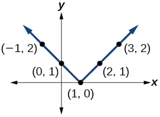
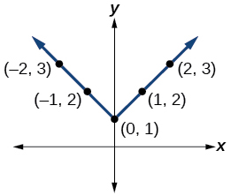
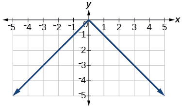
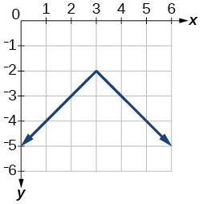
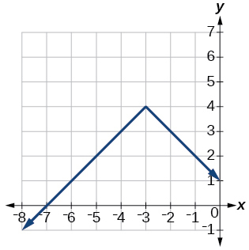
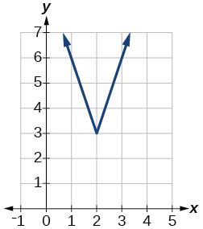
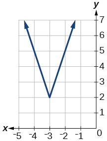
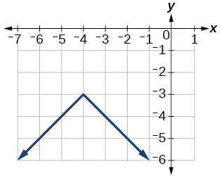
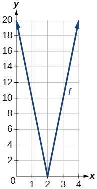
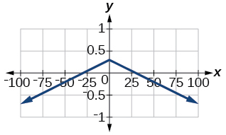

In this section you will:
* Graph an absolute value function.
* Solve an absolute value equation.
* Solve an absolute value inequality.

 "){: #Figure_01_06_001}

Until the 1920s, the so-called spiral nebulae were believed to be clouds of dust and gas in our own galaxy, some tens of thousands of light years away. Then, astronomer Edwin Hubble proved that these objects are galaxies in their own right, at distances of millions of light years. Today, astronomers can detect galaxies that are billions of light years away. Distances in the universe can be measured in all directions. As such, it is useful to consider distance as an absolute value function. In this section, we will investigate **absolute value functions**{: data-type="term" .no-emphasis}.

### Understanding Absolute Value 

Recall that in its basic form<math xmlns="http://www.w3.org/1998/Math/MathML"> <mrow> <mtext> </mtext><mi>f</mi><mo stretchy="false">(</mo><mi>x</mi><mo stretchy="false">)</mo><mo>=</mo><mrow><mo>\|</mo> <mi>x</mi> <mo>\|</mo></mrow><mo>,</mo><mtext> </mtext></mrow> </math>

the absolute value function, is one of our toolkit functions. The **absolute value**{: data-type="term" .no-emphasis} function is commonly thought of as providing the distance the number is from zero on a number line. Algebraically, for whatever the input value is, the output is the value without regard to sign.

Absolute Value Function

The absolute value function can be defined as a piecewise function

<math xmlns="http://www.w3.org/1998/Math/MathML" display="block"> <mrow> <mtext> </mtext><mi>f</mi><mo stretchy="false">(</mo><mi>x</mi><mo stretchy="false">)</mo><mo>=</mo><mrow><mo>\|</mo> <mi>x</mi> <mo>\|</mo></mrow><mo>=</mo><mrow><mo>{</mo> <mrow> <mtable> <mtr> <mtd> <mi>x</mi> </mtd> <mtd> <mrow> <mtext>if</mtext></mrow> </mtd> <mtd> <mrow> <mi>x</mi><mo>≥</mo><mn>0</mn></mrow> </mtd> </mtr> <mtr> <mtd> <mrow> <mo>−</mo><mi>x</mi></mrow> </mtd> <mtd> <mrow> <mtext>if</mtext></mrow> </mtd> <mtd> <mrow> <mi>x</mi><mo>&lt;</mo><mn>0</mn></mrow> </mtd> </mtr> </mtable></mrow> </mrow><mtext> </mtext></mrow> </math>

Determine a Number within a Prescribed Distance

Describe all values<math xmlns="http://www.w3.org/1998/Math/MathML"> <mrow> <mtext> </mtext><mi>x</mi><mtext> </mtext></mrow> </math>

within or including a distance of 4 from the number 5.

We want the distance between<math xmlns="http://www.w3.org/1998/Math/MathML"> <mrow> <mtext> </mtext><mi>x</mi><mtext> </mtext></mrow> </math>

and 5 to be less than or equal to 4. We can draw a number line, such as the one in [[link]](#Figure_01_06_002), to represent the condition to be satisfied.

{: #Figure_01_06_002}

The distance from<math xmlns="http://www.w3.org/1998/Math/MathML"> <mrow> <mtext> </mtext><mi>x</mi><mtext> </mtext></mrow> </math>

to 5 can be represented using the absolute value as<math xmlns="http://www.w3.org/1998/Math/MathML"> <mrow> <mtext> </mtext><mrow><mo>\|</mo> <mrow> <mi>x</mi><mo>−</mo><mn>5</mn></mrow> <mo>\|</mo></mrow><mo>.</mo><mtext> </mtext></mrow> </math>

We want the values of<math xmlns="http://www.w3.org/1998/Math/MathML"> <mrow> <mtext> </mtext><mi>x</mi><mtext> </mtext></mrow> </math>

that satisfy the condition <math xmlns="http://www.w3.org/1998/Math/MathML"> <mrow> <mrow><mo>\|</mo> <mrow> <mi>x</mi><mo>−</mo><mn>5</mn></mrow> <mo>\|</mo></mrow><mo>≤</mo><mn>4.</mn></mrow> </math>

Analysis

Note that

<math xmlns="http://www.w3.org/1998/Math/MathML" display="block"> <mrow> <mtable columnalign="left"> <mtr columnalign="left"> <mtd columnalign="left"> <mrow> <mo>−</mo><mn>4</mn><mo>≤</mo><mi>x</mi><mo>−</mo><mn>5</mn> </mrow> </mtd> <mtd columnalign="left"> <mrow> <mtable> <mtr> <mtd> <mrow /> </mtd> <mtd> <mrow /> </mtd> <mtd> <mrow /> </mtd> </mtr> </mtable> </mrow> </mtd> <mtd columnalign="left"> <mrow> <mi>x</mi><mo>−</mo><mn>5</mn><mo>≤</mo><mn>4</mn> </mrow> </mtd> </mtr> <mtr columnalign="left"> <mtd columnalign="left"> <mrow> <mtext> </mtext><mtext> </mtext><mtext> </mtext><mtext> </mtext><mn>1</mn><mo>≤</mo><mi>x</mi> </mrow> </mtd> <mtd columnalign="left"> <mrow /> </mtd> <mtd columnalign="left"> <mrow> <mtext> </mtext><mtext> </mtext><mtext> </mtext><mtext> </mtext><mtext> </mtext><mtext> </mtext><mtext> </mtext><mtext> </mtext><mtext> </mtext><mtext> </mtext><mi>x</mi><mo>≤</mo><mn>9</mn> </mrow> </mtd> </mtr> </mtable> </mrow> </math>

So<math xmlns="http://www.w3.org/1998/Math/MathML"> <mrow> <mtext> </mtext><mrow><mo>\|</mo> <mrow> <mi>x</mi><mo>−</mo><mn>5</mn></mrow> <mo>\|</mo></mrow><mo>≤</mo><mn>4</mn><mtext> </mtext></mrow> </math>

is equivalent to<math xmlns="http://www.w3.org/1998/Math/MathML"> <mrow> <mtext> </mtext><mn>1</mn><mo>≤</mo><mi>x</mi><mo>≤</mo><mn>9.</mn></mrow> </math>

However, mathematicians generally prefer absolute value notation.

Describe all values<math xmlns="http://www.w3.org/1998/Math/MathML"> <mrow> <mtext> </mtext><mi>x</mi><mtext> </mtext></mrow> </math>

within a distance of 3 from the number 2.

<math xmlns="http://www.w3.org/1998/Math/MathML"> <mrow> <mrow><mo>\|</mo> <mrow> <mi>x</mi><mo>−</mo><mn>2</mn></mrow> <mo>\|</mo></mrow><mo>≤</mo><mn>3</mn></mrow> </math>

Resistance of a Resistor

Electrical parts, such as resistors and capacitors, come with specified values of their operating parameters: resistance, capacitance, etc. However, due to imprecision in manufacturing, the actual values of these parameters vary somewhat from piece to piece, even when they are supposed to be the same. The best that manufacturers can do is to try to guarantee that the variations will stay within a specified range, often<math xmlns="http://www.w3.org/1998/Math/MathML"> <mrow> <mtext> </mtext><mtext>±1%,</mtext><mtext> </mtext><mo>±</mo><mtext>5%,</mtext><mtext> </mtext></mrow> </math>

or<math xmlns="http://www.w3.org/1998/Math/MathML"> <mrow> <mtext> </mtext><mo>±</mo><mtext>10%</mtext><mtext>.</mtext></mrow> </math>

Suppose we have a resistor rated at 680 ohms,<math xmlns="http://www.w3.org/1998/Math/MathML"> <mrow> <mtext> </mtext><mo>±</mo><mn>5</mn><mi>%</mi><mo>.</mo><mtext> </mtext></mrow> </math>

Use the absolute value function to express the range of possible values of the actual resistance.

5% of 680 ohms is 34 ohms. The absolute value of the difference between the actual and nominal resistance should not exceed the stated variability, so, with the resistance<math xmlns="http://www.w3.org/1998/Math/MathML"> <mrow> <mtext> </mtext><mi>R</mi><mtext> </mtext></mrow> </math>

in ohms,

<math xmlns="http://www.w3.org/1998/Math/MathML" display="block"> <mrow> <mrow><mo>\|</mo> <mrow> <mi>R</mi><mo>−</mo><mn>680</mn></mrow> <mo>\|</mo></mrow><mo>≤</mo><mn>34</mn></mrow> </math>

Students who score within 20 points of 80 will pass a test. Write this as a distance from 80 using absolute value notation.

using the variable<math xmlns="http://www.w3.org/1998/Math/MathML"> <mrow> <mtext> </mtext><mi>p</mi><mtext> </mtext></mrow> </math>

for passing,<math xmlns="http://www.w3.org/1998/Math/MathML"> <mrow> <mtext> </mtext><mrow><mo>\|</mo> <mrow> <mi>p</mi><mo>−</mo><mn>80</mn></mrow> <mo>\|</mo></mrow><mo>≤</mo><mn>20</mn></mrow> </math>

### Graphing an Absolute Value Function

The most significant feature of the absolute value graph is the corner point at which the graph changes direction. This point is shown at the **origin**{: data-type="term" .no-emphasis} in [\[link\]](#Figure_01_06_003).

{: #Figure_01_06_003}

[\[link\]](#Figure_01_06_004) shows the graph of<math xmlns="http://www.w3.org/1998/Math/MathML"> <mrow> <mtext> </mtext><mi>y</mi><mo>=</mo><mn>2</mn><mrow><mo>\|</mo> <mrow> <mi>x</mi><mo>–</mo><mn>3</mn> </mrow> <mo>\|</mo></mrow><mo>+</mo><mn>4.</mn><mtext> </mtext> </mrow> </math>

The graph of<math xmlns="http://www.w3.org/1998/Math/MathML"> <mrow> <mtext> </mtext><mi>y</mi><mo>=</mo><mrow><mo>\|</mo> <mi>x</mi> <mo>\|</mo></mrow><mtext> </mtext> </mrow> </math>

has been shifted right 3 units, vertically stretched by a factor of 2, and shifted up 4 units. This means that the corner point is located at<math xmlns="http://www.w3.org/1998/Math/MathML"> <mrow> <mtext> </mtext><mrow><mo>(</mo> <mrow> <mn>3</mn><mo>,</mo><mn>4</mn></mrow> <mo>)</mo></mrow><mtext> </mtext></mrow> </math>

for this transformed function.

{: #Figure_01_06_004}

Writing an Equation for an Absolute Value Function

Write an equation for the function graphed in [[link]](#Figure_01_06_005).

{: #Figure_01_06_005}

The basic absolute value function changes direction at the origin, so this graph has been shifted to the right 3 units and down 2 units from the basic toolkit function. See [[link]](#Figure_01_06_006).

{: #Figure_01_06_006}

We also notice that the graph appears vertically stretched, because the width of the final graph on a horizontal line is not equal to 2 times the vertical distance from the corner to this line, as it would be for an unstretched absolute value function. Instead, the width is equal to 1 times the vertical distance as shown in [[link]](#Figure_01_06_007).

{: #Figure_01_06_007}

From this information we can write the equation

<math xmlns="http://www.w3.org/1998/Math/MathML" display="block"> <mrow> <mtable columnalign="left"> <mtr columnalign="left"> <mtd columnalign="left"> <mrow> <mi>f</mi><mo stretchy="false">(</mo><mi>x</mi><mo stretchy="false">)</mo><mo>=</mo><mn>2</mn><mo>\|</mo><mi>x</mi><mo>−</mo><mn>3</mn><mo>\|</mo><mo>−</mo><mn>2</mn><mo>,</mo> </mrow> </mtd> <mtd columnalign="left"> <mrow> <mtext>treating the stretch as a vertical stretch, or</mtext> </mrow> </mtd> </mtr> <mtr columnalign="left"> <mtd columnalign="left"> <mrow> <mi>f</mi><mo stretchy="false">(</mo><mi>x</mi><mo stretchy="false">)</mo><mo>=</mo><mo>\|</mo><mn>2</mn><mo stretchy="false">(</mo><mi>x</mi><mo>−</mo><mn>3</mn><mo stretchy="false">)</mo><mo>\|</mo><mo>−</mo><mn>2</mn><mo>,</mo> </mrow> </mtd> <mtd columnalign="left"> <mrow> <mtext>treating the stretch as a horizontal compression</mtext><mo>.</mo> </mrow> </mtd> </mtr> </mtable> </mrow> </math>

Analysis

Note that these equations are algebraically equivalent—the stretch for an absolute value function can be written interchangeably as a vertical or horizontal stretch or compression.

**If we couldn’t observe the stretch of the function from the graphs, could we algebraically determine it?**

<em>Yes. If we are unable to determine the stretch based on the width of the graph, we can solve for the stretch factor by putting in a known pair of values for<math xmlns="http://www.w3.org/1998/Math/MathML">
   <mrow>
    <mtext> </mtext><mi>x</mi><mtext> </mtext></mrow>
  </math>and<math xmlns="http://www.w3.org/1998/Math/MathML">
   <mrow>
    <mtext> </mtext><mi>f</mi><mo stretchy="false">(</mo><mi>x</mi><mo stretchy="false">)</mo><mo>.</mo></mrow>
  </math> </em>

<math xmlns="http://www.w3.org/1998/Math/MathML" display="block"> <mrow> <mi>f</mi><mo stretchy="false">(</mo><mi>x</mi><mo stretchy="false">)</mo><mo>=</mo><mi>a</mi><mo>\|</mo><mi>x</mi><mo>−</mo><mn>3</mn><mo>\|</mo><mo>−</mo><mn>2</mn> </mrow> </math>

<em>Now substituting in the point </em>(1, 2)

<math xmlns="http://www.w3.org/1998/Math/MathML" display="block"> <mrow> <mtable columnalign="left"> <mtr columnalign="left"> <mtd columnalign="left"> <mrow> <mn>2</mn><mo>=</mo><mi>a</mi><mrow><mo>\|</mo> <mrow> <mn>1</mn><mo>−</mo><mn>3</mn> </mrow> <mo>\|</mo></mrow><mo>−</mo><mn>2</mn> </mrow> </mtd> </mtr> <mtr columnalign="left"> <mtd columnalign="left"> <mrow> <mn>4</mn><mo>=</mo><mn>2</mn><mi>a</mi> </mrow> </mtd> </mtr> <mtr columnalign="left"> <mtd columnalign="left"> <mrow> <mi>a</mi><mo>=</mo><mn>2</mn> </mrow> </mtd> </mtr> </mtable> </mrow> </math>

Write the equation for the absolute value function that is horizontally shifted left 2 units, is vertically flipped, and vertically shifted up 3 units.

<math xmlns="http://www.w3.org/1998/Math/MathML"> <mrow> <mi>f</mi><mo stretchy="false">(</mo><mi>x</mi><mo stretchy="false">)</mo><mo>=</mo><mo>−</mo><mrow><mo>\|</mo> <mrow> <mi>x</mi><mo>+</mo><mn>2</mn></mrow> <mo>\|</mo></mrow><mo>+</mo><mn>3</mn></mrow> </math>

<strong>Do the graphs of absolute value functions always intersect the vertical axis? The horizontal axis? </strong>

<em>Yes, they always intersect the vertical axis. The graph of an absolute value function will intersect the vertical axis when the input is zero. </em>

<em>No, they do not always intersect the horizontal axis. The graph may or may not intersect the horizontal axis, depending on how the graph has been shifted and reflected. It is possible for the absolute value function to intersect the horizontal axis at zero, one, or two points (see <a href="#Figure_01_06_008">\[link\]</a>). </em>

  The absolute value function does not intersect the horizontal axis. (b) The absolute value function intersects the horizontal axis at one point. (c) The absolute value function intersects the horizontal axis at two points."){: #Figure_01_06_008}

### Solving an Absolute Value Equation

Now that we can graph an absolute value function, we will learn how to solve an absolute value equation. To solve an equation such as<math xmlns="http://www.w3.org/1998/Math/MathML"> <mrow> <mtext> </mtext><mn>8</mn><mo>=</mo><mrow><mo>\|</mo> <mrow> <mn>2</mn><mi>x</mi><mo>−</mo><mn>6</mn></mrow> <mo>\|</mo></mrow><mo>,</mo><mtext> </mtext></mrow> </math>

we notice that the absolute value will be equal to 8 if the quantity inside the absolute value is 8 or -8. This leads to two different equations we can solve independently.

<math xmlns="http://www.w3.org/1998/Math/MathML" display="block"> <mrow> <mtable columnalign="left"> <mtr columnalign="left"> <mtd columnalign="left"> <mrow> <mn>2</mn><mi>x</mi><mo>−</mo><mn>6</mn><mo>=</mo><mn>8</mn></mrow> </mtd> <mtd columnalign="left"> <mrow> <mtext>or</mtext></mrow> </mtd> <mtd columnalign="left"> <mrow> <mn>2</mn><mi>x</mi><mo>−</mo><mn>6</mn><mo>=</mo><mo>−</mo><mn>8</mn></mrow> </mtd> </mtr> <mtr columnalign="left"> <mtd columnalign="left"> <mrow> <mtext> </mtext><mtext> </mtext><mtext> </mtext><mtext> </mtext><mtext> </mtext><mtext> </mtext><mtext> </mtext><mtext> </mtext><mn>2</mn><mi>x</mi><mo>=</mo><mn>14</mn></mrow> </mtd> <mtd columnalign="left"> <mrow /> </mtd> <mtd columnalign="left"> <mrow> <mtext> </mtext><mtext> </mtext><mtext> </mtext><mtext> </mtext><mtext> </mtext><mtext> </mtext><mtext> </mtext><mtext> </mtext><mtext> </mtext><mn>2</mn><mi>x</mi><mo>=</mo><mo>−</mo><mn>2</mn></mrow> </mtd> </mtr> <mtr columnalign="left"> <mtd columnalign="left"> <mrow> <mtext> </mtext><mtext> </mtext><mtext> </mtext><mtext> </mtext><mtext> </mtext><mtext> </mtext><mtext> </mtext><mtext> </mtext><mtext> </mtext><mtext> </mtext><mtext> </mtext><mi>x</mi><mo>=</mo><mn>7</mn></mrow> </mtd> <mtd columnalign="left"> <mrow /> </mtd> <mtd columnalign="left"> <mrow> <mtext> </mtext><mtext> </mtext><mtext> </mtext><mtext> </mtext><mtext> </mtext><mtext> </mtext><mtext> </mtext><mtext> </mtext><mtext> </mtext><mtext> </mtext><mtext> </mtext><mtext> </mtext><mi>x</mi><mo>=</mo><mo>−</mo><mn>1</mn></mrow> </mtd> </mtr> </mtable></mrow> </math>

Knowing how to solve problems involving **absolute value functions**{: data-type="term" .no-emphasis} is useful. For example, we may need to identify numbers or points on a line that are at a specified distance from a given reference point.

An **absolute value equation**{: data-type="term"} is an equation in which the unknown variable appears in absolute value bars. For example,

<math xmlns="http://www.w3.org/1998/Math/MathML" display="block"> <mrow> <mtable columnalign="left"> <mtr columnalign="left"> <mtd columnalign="left"> <mrow> <mrow><mo>\|</mo> <mi>x</mi> <mo>\|</mo></mrow><mo>=</mo><mn>4</mn><mo>,</mo> </mrow> </mtd> </mtr> <mtr columnalign="left"> <mtd columnalign="left"> <mrow> <mrow><mo>\|</mo> <mrow> <mn>2</mn><mi>x</mi><mo>−</mo><mn>1</mn> </mrow> <mo>\|</mo></mrow><mo>=</mo><mn>3</mn> </mrow> </mtd> </mtr> <mtr columnalign="left"> <mtd columnalign="left"> <mrow> <mrow><mo>\|</mo> <mrow> <mn>5</mn><mi>x</mi><mo>+</mo><mn>2</mn> </mrow> <mo>\|</mo></mrow><mo>−</mo><mn>4</mn><mo>=</mo><mn>9</mn> </mrow> </mtd> </mtr> </mtable> </mrow> </math>

Solutions to Absolute Value Equations

For real numbers<math xmlns="http://www.w3.org/1998/Math/MathML"> <mrow> <mtext> </mtext><mi>A</mi><mtext> </mtext></mrow> </math>

and<math xmlns="http://www.w3.org/1998/Math/MathML"> <mrow> <mtext> </mtext><mi>B</mi><mo>,</mo><mtext> </mtext></mrow> </math>

an equation of the form<math xmlns="http://www.w3.org/1998/Math/MathML"> <mrow> <mtext> </mtext><mrow><mo>\|</mo> <mi>A</mi> <mo>\|</mo></mrow><mo>=</mo><mi>B</mi><mo>,</mo><mtext> </mtext></mrow> </math>

with<math xmlns="http://www.w3.org/1998/Math/MathML"> <mrow> <mtext> </mtext><mi>B</mi><mo>≥</mo><mn>0</mn><mo>,</mo><mtext> </mtext></mrow> </math>

will have solutions when<math xmlns="http://www.w3.org/1998/Math/MathML"> <mrow> <mtext> </mtext><mi>A</mi><mo>=</mo><mi>B</mi><mtext> </mtext></mrow> </math>

or<math xmlns="http://www.w3.org/1998/Math/MathML"> <mrow> <mtext> </mtext><mi>A</mi><mo>=</mo><mo>−</mo><mi>B</mi><mo>.</mo><mtext> </mtext></mrow> </math>

If<math xmlns="http://www.w3.org/1998/Math/MathML"> <mrow> <mtext> </mtext><mi>B</mi><mo>&lt;</mo><mn>0</mn><mo>,</mo><mtext> </mtext></mrow> </math>

the equation<math xmlns="http://www.w3.org/1998/Math/MathML"> <mrow> <mtext> </mtext><mrow><mo>\|</mo> <mi>A</mi> <mo>\|</mo></mrow><mo>=</mo><mi>B</mi><mtext> </mtext></mrow> </math>

has no solution.

**Given the formula for an absolute value function, find the horizontal intercepts of its graph**.

1.  Isolate the absolute value term.
2.  Use
    <math xmlns="http://www.w3.org/1998/Math/MathML"> <mrow> <mtext> </mtext><mrow><mo>\|</mo> <mi>A</mi> <mo>\|</mo></mrow><mo>=</mo><mi>B</mi><mtext> </mtext></mrow> </math>
    
    to write
    <math xmlns="http://www.w3.org/1998/Math/MathML"> <mrow> <mtext> </mtext><mi>A</mi><mo>=</mo><mi>B</mi><mtext> </mtext></mrow> </math>
    
    or
    <math xmlns="http://www.w3.org/1998/Math/MathML"> <mrow> <mtext> </mtext><mi>−A</mi><mo>=</mo><mi>B</mi><mo>,</mo><mtext> </mtext> </mrow> </math>
    
    assuming
    <math xmlns="http://www.w3.org/1998/Math/MathML"> <mrow> <mtext> </mtext><mi>B</mi><mo>&gt;</mo><mn>0.</mn></mrow> </math>

3.  Solve for
    <math xmlns="http://www.w3.org/1998/Math/MathML"> <mrow> <mtext> </mtext><mi>x</mi><mo>.</mo><mtext> </mtext></mrow> </math>
{: type="1"}

Finding the Zeros of an Absolute Value Function

For the function<math xmlns="http://www.w3.org/1998/Math/MathML"> <mrow> <mtext> </mtext><mi>f</mi><mo stretchy="false">(</mo><mi>x</mi><mo stretchy="false">)</mo><mo>=</mo><mrow><mo>\|</mo> <mrow> <mn>4</mn><mi>x</mi><mo>+</mo><mn>1</mn> </mrow> <mo>\|</mo></mrow><mo>−</mo><mn>7</mn></mrow></math>

, find the values of <math xmlns="http://www.w3.org/1998/Math/MathML"><mrow><mi>x</mi></mrow></math>

 such that <math xmlns="http://www.w3.org/1998/Math/MathML"><mrow><mtext> </mtext><mi>f</mi><mo stretchy="false">(</mo><mi>x</mi><mo stretchy="false">)</mo><mo>=</mo><mn>0</mn> </mrow> </math>

.

<math xmlns="http://www.w3.org/1998/Math/MathML" display="block"> <mrow> <mtable columnalign="left"> <mtr columnalign="left"> <mtd columnalign="left"> <mrow> <mn>0</mn><mo>=</mo><mo>\|</mo><mn>4</mn><mi>x</mi><mo>+</mo><mn>1</mn><mo>\|</mo><mo>−</mo><mn>7</mn> </mrow> </mtd> <mtd columnalign="left"> <mrow /> </mtd> <mtd columnalign="left"> <mrow /> </mtd> <mtd columnalign="left"> <mrow /> </mtd> <mtd columnalign="left"> <mrow /> </mtd> <mtd columnalign="left"> <mrow /> </mtd> <mtd columnalign="left"> <mrow> <mtext>Substitute 0 for </mtext><mi>f</mi><mo stretchy="false">(</mo><mi>x</mi><mo stretchy="false">)</mo><mo>.</mo> </mrow> </mtd> </mtr> <mtr columnalign="left"> <mtd columnalign="left"> <mrow> <mn>7</mn><mo>=</mo><mo>\|</mo><mn>4</mn><mi>x</mi><mo>+</mo><mn>1</mn><mo>\|</mo> </mrow> </mtd> <mtd columnalign="left"> <mrow /> </mtd> <mtd columnalign="left"> <mrow /> </mtd> <mtd columnalign="left"> <mrow /> </mtd> <mtd columnalign="left"> <mrow /> </mtd> <mtd columnalign="left"> <mrow /> </mtd> <mtd columnalign="left"> <mrow> <mtext>Isolate the absolute value on one side of the equation</mtext><mo>.</mo> </mrow> </mtd> </mtr> <mtr columnalign="left"> <mtd columnalign="left"> <mrow /> </mtd> <mtd columnalign="left"> <mrow /> </mtd> <mtd columnalign="left"> <mrow /> </mtd> <mtd columnalign="left"> <mrow /> </mtd> <mtd columnalign="left"> <mrow /> </mtd> <mtd columnalign="left"> <mrow /> </mtd> <mtd columnalign="left"> <mrow /> </mtd> </mtr> <mtr columnalign="left"> <mtd columnalign="left"> <mrow /> </mtd> <mtd columnalign="left"> <mrow /> </mtd> <mtd columnalign="left"> <mrow /> </mtd> <mtd columnalign="left"> <mrow /> </mtd> <mtd columnalign="left"> <mrow /> </mtd> <mtd columnalign="left"> <mrow /> </mtd> <mtd columnalign="left"> <mrow /> </mtd> </mtr> <mtr columnalign="left"> <mtd columnalign="left"> <mrow /> </mtd> <mtd columnalign="left"> <mrow /> </mtd> <mtd columnalign="left"> <mrow /> </mtd> <mtd columnalign="left"> <mrow /> </mtd> <mtd columnalign="left"> <mrow /> </mtd> <mtd columnalign="left"> <mrow /> </mtd> <mtd columnalign="left"> <mrow /> </mtd> </mtr> <mtr columnalign="left"> <mtd columnalign="left"> <mrow> <mn>7</mn><mo>=</mo><mn>4</mn><mi>x</mi><mo>+</mo><mn>1</mn> </mrow> </mtd> <mtd columnalign="left"> <mrow> <mtext>or</mtext> </mrow> </mtd> <mtd columnalign="left"> <mrow /> </mtd> <mtd columnalign="left"> <mrow /> </mtd> <mtd columnalign="left"> <mrow /> </mtd> <mtd columnalign="left"> <mrow> <mo>−</mo><mn>7</mn><mo>=</mo><mn>4</mn><mi>x</mi><mo>+</mo><mn>1</mn> </mrow> </mtd> <mtd columnalign="left"> <mrow> <mtext>Break into two separate equations and solve</mtext><mo>.</mo> </mrow> </mtd> </mtr> <mtr columnalign="left"> <mtd columnalign="left"> <mrow> <mn>6</mn><mo>=</mo><mn>4</mn><mi>x</mi> </mrow> </mtd> <mtd columnalign="left"> <mrow /> </mtd> <mtd columnalign="left"> <mrow /> </mtd> <mtd columnalign="left"> <mrow /> </mtd> <mtd columnalign="left"> <mrow /> </mtd> <mtd columnalign="left"> <mrow> <mo>−</mo><mn>8</mn><mo>=</mo><mn>4</mn><mi>x</mi> </mrow> </mtd> <mtd columnalign="left"> <mrow /> </mtd> </mtr> <mtr columnalign="left"> <mtd columnalign="left"> <mrow /> </mtd> <mtd columnalign="left"> <mrow /> </mtd> <mtd columnalign="left"> <mrow /> </mtd> <mtd columnalign="left"> <mrow /> </mtd> <mtd columnalign="left"> <mrow /> </mtd> <mtd columnalign="left"> <mrow /> </mtd> <mtd columnalign="left"> <mrow /> </mtd> </mtr> <mtr columnalign="left"> <mtd columnalign="left"> <mrow> <mi>x</mi><mo>=</mo><mfrac> <mn>6</mn> <mn>4</mn> </mfrac> <mo>=</mo><mn>1.5</mn> </mrow> </mtd> <mtd columnalign="left"> <mrow /> </mtd> <mtd columnalign="left"> <mrow /> </mtd> <mtd columnalign="left"> <mrow /> </mtd> <mtd columnalign="left"> <mrow /> </mtd> <mtd columnalign="left"> <mrow> <mtext>   </mtext><mi>x</mi><mo>=</mo><mfrac> <mrow> <mo>−</mo><mn>8</mn> </mrow> <mn>4</mn> </mfrac> <mo>=</mo><mo>−</mo><mn>2</mn> </mrow> </mtd> <mtd columnalign="left"> <mrow /> </mtd> </mtr> </mtable> </mrow> </math>

The function outputs 0 when<math xmlns="http://www.w3.org/1998/Math/MathML"> <mrow> <mtext> </mtext><mi>x</mi><mo>=</mo><mn>1.5</mn> <mtext> </mtext></mrow> </math>

or<math xmlns="http://www.w3.org/1998/Math/MathML"> <mrow> <mtext> </mtext><mi>x</mi><mo>=</mo><mo>−</mo><mn>2.</mn></mrow> </math>

 See [[link]](#Figure_01_06_011).

{: #Figure_01_06_011}

For the function<math xmlns="http://www.w3.org/1998/Math/MathML"> <mrow> <mtext> </mtext><mi>f</mi><mo stretchy="false">(</mo><mi>x</mi><mo stretchy="false">)</mo><mo>=</mo><mrow><mo>\|</mo> <mrow> <mn>2</mn><mi>x</mi><mo>−</mo><mn>1</mn> </mrow> <mo>\|</mo></mrow><mo>−</mo><mn>3</mn><mo>,</mo> </mrow> </math>

find the values of<math xmlns="http://www.w3.org/1998/Math/MathML"> <mrow> <mtext> </mtext><mi>x</mi><mtext> </mtext> </mrow> </math>

such that<math xmlns="http://www.w3.org/1998/Math/MathML"> <mrow> <mtext> </mtext><mi>f</mi><mo stretchy="false">(</mo><mi>x</mi><mo stretchy="false">)</mo><mo>=</mo><mn>0.</mn> </mrow> </math>

<math xmlns="http://www.w3.org/1998/Math/MathML"> <mrow> <mi>x</mi><mo>=</mo><mo>−</mo><mn>1</mn><mtext> </mtext></mrow> </math>

or<math xmlns="http://www.w3.org/1998/Math/MathML"> <mrow> <mtext> </mtext><mtext> </mtext><mi>x</mi><mo>=</mo><mn>2</mn></mrow> </math>

<strong>Should we always expect two answers when solving<math xmlns="http://www.w3.org/1998/Math/MathML">
 <mrow>
  <mtext> </mtext><mrow><mo>\|</mo> <mi>A</mi> <mo>\|</mo></mrow><mo>=</mo><mi>B</mi><mo>?</mo>
 </mrow>
</math></strong>

*No. We may find one, two, or even no answers. For example, there is no solution to* <math xmlns="http://www.w3.org/1998/Math/MathML"> <mrow> <mtext> </mtext><mn>2</mn><mo>+</mo><mrow><mo>\|</mo> <mrow> <mn>3</mn><mi>x</mi><mo>−</mo><mn>5</mn></mrow> <mo>\|</mo></mrow><mo>=</mo><mn>1.</mn></mrow> </math>

**Given an absolute value equation, solve it.**

1.  Isolate the absolute value term.
2.  Use
    <math xmlns="http://www.w3.org/1998/Math/MathML"> <mrow> <mtext> </mtext><mrow><mo>\|</mo> <mi>A</mi> <mo>\|</mo></mrow><mo>=</mo><mi>B</mi><mtext> </mtext></mrow> </math>
    
    to write
    <math xmlns="http://www.w3.org/1998/Math/MathML"> <mrow> <mtext> </mtext><mi>A</mi><mo>=</mo><mi>B</mi><mtext> </mtext></mrow> </math>
    
    or
    <math xmlns="http://www.w3.org/1998/Math/MathML"> <mrow> <mtext> </mtext><mi>A</mi><mo>=</mo><mi>−B</mi><mo>.</mo></mrow> </math>

3.  Solve for
    <math xmlns="http://www.w3.org/1998/Math/MathML"> <mrow> <mtext> </mtext><mi>x</mi><mo>.</mo></mrow> </math>
{: type="1"}

Solving an Absolute Value Equation

Solve<math xmlns="http://www.w3.org/1998/Math/MathML"> <mrow> <mtext> </mtext><mn>1</mn><mo>=</mo><mn>4</mn><mrow><mo>\|</mo> <mrow> <mi>x</mi><mo>−</mo><mn>2</mn></mrow> <mo>\|</mo></mrow><mo>+</mo><mn>2.</mn></mrow> </math>

Isolating the absolute value on one side of the equation gives the following.

<math xmlns="http://www.w3.org/1998/Math/MathML" display="block"> <mrow> <mtable columnalign="left"> <mtr columnalign="left"> <mtd columnalign="left"> <mrow> <mtext> </mtext><mtext> </mtext><mtext> </mtext><mtext> </mtext><mtext> </mtext><mtext> </mtext><mtext> </mtext><mtext> </mtext><mn>1</mn><mo>=</mo><mn>4</mn><mrow><mo>\|</mo> <mrow> <mi>x</mi><mo>−</mo><mn>2</mn></mrow> <mo>\|</mo></mrow><mo>+</mo><mn>2</mn></mrow> </mtd> </mtr> <mtr columnalign="left"> <mtd columnalign="left"> <mrow> <mtext> </mtext><mtext> </mtext><mo>−</mo><mn>1</mn><mo>=</mo><mn>4</mn><mrow><mo>\|</mo> <mrow> <mi>x</mi><mo>−</mo><mn>2</mn></mrow> <mo>\|</mo></mrow></mrow> </mtd> </mtr> <mtr columnalign="left"> <mtd columnalign="left"> <mrow> <mtext> </mtext><mo>−</mo><mfrac> <mn>1</mn> <mn>4</mn> </mfrac> <mo>=</mo><mrow><mo>\|</mo> <mrow> <mi>x</mi><mo>−</mo><mn>2</mn></mrow> <mo>\|</mo></mrow></mrow> </mtd> </mtr> </mtable></mrow> </math>

The absolute value always returns a positive value, so it is impossible for the absolute value to equal a negative value. At this point, we notice that this equation has no solutions.

**In [\[link\]](#Example_01_06_05), if<math xmlns="http://www.w3.org/1998/Math/MathML"> <mrow> <mtext> </mtext><mi>f</mi><mo stretchy="false">(</mo><mi>x</mi><mo stretchy="false">)</mo><mo>=</mo><mn>1</mn><mtext> </mtext></mrow> </math>

and<math xmlns="http://www.w3.org/1998/Math/MathML"> <mrow> <mtext> </mtext><mi>g</mi><mo stretchy="false">(</mo><mi>x</mi><mo stretchy="false">)</mo><mo>=</mo><mn>4</mn><mrow><mo>\|</mo> <mrow> <mi>x</mi><mo>−</mo><mn>2</mn></mrow> <mo>\|</mo></mrow><mo>+</mo><mn>2</mn><mtext> </mtext></mrow> </math>

were graphed on the same set of axes, would the graphs intersect?**

*No. The graphs of<math xmlns="http://www.w3.org/1998/Math/MathML"> <mrow> <mtext> </mtext><mi>f</mi><mtext> </mtext></mrow> </math>

and<math xmlns="http://www.w3.org/1998/Math/MathML"> <mrow> <mtext> </mtext><mi>g</mi><mtext> </mtext></mrow> </math>

would not intersect, as shown in [\[link\]](#Figure_01_06_012). This confirms, graphically, that the equation<math xmlns="http://www.w3.org/1998/Math/MathML"> <mrow> <mtext> </mtext><mn>1</mn><mo>=</mo><mn>4</mn><mrow><mo>\|</mo> <mrow> <mi>x</mi><mo>−</mo><mn>2</mn> </mrow> <mo>\|</mo></mrow><mo>+</mo><mn>2</mn><mtext> </mtext> </mrow> </math>

has no solution.*

 {: #Figure_01_06_012}

Find where the graph of the function<math xmlns="http://www.w3.org/1998/Math/MathML"> <mrow> <mtext> </mtext><mi>f</mi><mo stretchy="false">(</mo><mi>x</mi><mo stretchy="false">)</mo><mo>=</mo><mo>−</mo><mrow><mo>\|</mo> <mrow> <mi>x</mi><mo>+</mo><mn>2</mn></mrow> <mo>\|</mo></mrow><mo>+</mo><mn>3</mn><mtext> </mtext></mrow> </math>

intersects the horizontal and vertical axes.

<math xmlns="http://www.w3.org/1998/Math/MathML"> <mrow> <mi>f</mi><mo stretchy="false">(</mo><mn>0</mn><mo stretchy="false">)</mo><mo>=</mo><mn>1</mn><mo>,</mo><mtext> </mtext></mrow> </math>

so the graph intersects the vertical axis at<math xmlns="http://www.w3.org/1998/Math/MathML"> <mrow> <mtext> </mtext><mo stretchy="false">(</mo><mn>0</mn><mo>,</mo><mn>1</mn><mo stretchy="false">)</mo><mo>.</mo><mtext> </mtext></mrow> </math>

<math xmlns="http://www.w3.org/1998/Math/MathML"> <mrow> <mtext> </mtext><mi>f</mi><mo stretchy="false">(</mo><mi>x</mi><mo stretchy="false">)</mo><mo>=</mo><mn>0</mn><mtext> </mtext></mrow> </math>

when<math xmlns="http://www.w3.org/1998/Math/MathML"> <mrow> <mtext> </mtext><mi>x</mi><mo>=</mo><mo>−</mo><mn>5</mn><mtext> </mtext></mrow> </math>

and<math xmlns="http://www.w3.org/1998/Math/MathML"> <mrow> <mtext> </mtext><mi>x</mi><mo>=</mo><mn>1</mn><mtext> </mtext></mrow> </math>

so the graph intersects the horizontal axis at<math xmlns="http://www.w3.org/1998/Math/MathML"> <mrow> <mtext> </mtext><mo stretchy="false">(</mo><mo>−</mo><mn>5</mn><mo>,</mo><mn>0</mn><mo stretchy="false">)</mo><mtext> </mtext></mrow> </math>

and<math xmlns="http://www.w3.org/1998/Math/MathML"> <mrow> <mtext> </mtext><mo stretchy="false">(</mo><mn>1</mn><mo>,</mo><mn>0</mn><mo stretchy="false">)</mo><mo>.</mo></mrow> </math>

### Solving an Absolute Value Inequality

Absolute value equations may not always involve equalities. Instead, we may need to solve an equation within a range of values. We would use an absolute value inequality to solve such an equation. An **absolute value inequality**{: data-type="term"} is an equation of the form

<math xmlns="http://www.w3.org/1998/Math/MathML" display="block"> <mrow> <mo>\|</mo><mi>A</mi><mo>\|</mo><mo>&lt;</mo><mi>B</mi><mo>,</mo><mo>\|</mo><mi>A</mi><mo>\|</mo><mo>≤</mo><mi>B</mi><mo>,</mo><mo>\|</mo><mi>A</mi><mo>\|</mo><mo>&gt;</mo><mi>B</mi><mo>,</mo><mtext> </mtext><mtext> </mtext><mtext>or</mtext><mo> </mo><mtext> </mtext><mtext> </mtext><mo>\|</mo><mi>A</mi><mo>\|</mo><mo>≥</mo><mi>B</mi><mo>,</mo> </mrow> </math>

where an expression<math xmlns="http://www.w3.org/1998/Math/MathML"> <mrow> <mtext> </mtext><mi>A</mi><mtext> </mtext></mrow> </math>

(and possibly but not usually<math xmlns="http://www.w3.org/1998/Math/MathML"> <mrow> <mtext> </mtext><mi>B</mi> </mrow> </math>

) depends on a variable<math xmlns="http://www.w3.org/1998/Math/MathML"> <mrow> <mtext> </mtext><mi>x</mi><mo>.</mo><mtext> </mtext></mrow> </math>

Solving the inequality means finding the set of all<math xmlns="http://www.w3.org/1998/Math/MathML"> <mrow> <mtext> </mtext><mi>x</mi><mtext> </mtext></mrow> </math>

that satisfy the inequality. Usually this set will be an interval or the union of two intervals.

There are two basic approaches to solving absolute value inequalities: graphical and algebraic. The advantage of the graphical approach is we can read the solution by interpreting the graphs of two functions. The advantage of the algebraic approach is it yields solutions that may be difficult to read from the graph.

For example, we know that all numbers within 200 units of 0 may be expressed as

<math xmlns="http://www.w3.org/1998/Math/MathML" display="block"> <mrow> <mrow><mo>\|</mo> <mi>x</mi> <mo>\|</mo></mrow><mo>&lt;</mo><mn>200</mn><mtext> </mtext><mtext>or</mtext><mtext> </mtext><mo>−</mo><mn>200</mn><mo>&lt;</mo><mi>x</mi><mo>&lt;</mo><mn>200</mn><mtext> </mtext></mrow> </math>

Suppose we want to know all possible returns on an investment if we could earn some amount of money within $200 of $600. We can solve algebraically for the set of values<math xmlns="http://www.w3.org/1998/Math/MathML"> <mrow> <mtext> </mtext><mi>x</mi><mtext> </mtext></mrow> </math>

 such that the distance between<math xmlns="http://www.w3.org/1998/Math/MathML"> <mrow> <mtext> </mtext><mi>x</mi><mtext> </mtext></mrow> </math>

and 600 is less than 200. We represent the distance between<math xmlns="http://www.w3.org/1998/Math/MathML"> <mrow> <mtext> </mtext><mi>x</mi><mtext> </mtext></mrow> </math>

 and 600 as<math xmlns="http://www.w3.org/1998/Math/MathML"> <mrow> <mtext> </mtext><mrow><mo>\|</mo> <mrow> <mi>x</mi><mo>−</mo><mn>600</mn></mrow> <mo>\|</mo></mrow><mo>.</mo></mrow> </math>

<math xmlns="http://www.w3.org/1998/Math/MathML" display="block"> <mtable columnalign="left"> <mtr /> <mtr> <mtd> <mo>\|</mo><mi>x</mi><mo>−</mo><mn>600</mn><mo>\|</mo><mo>&lt;</mo><mn>200</mn><mtext>    or    </mtext><mo>−</mo><mn>200</mn><mo>&lt;</mo><mi>x</mi><mo>−</mo><mn>600</mn><mo>&lt;</mo><mn>200</mn> </mtd> </mtr> <mtr> <mtd> <mtext>  </mtext><mo>−</mo><mn>200</mn><mo>+</mo><mn>600</mn><mo>&lt;</mo><mi>x</mi><mo>−</mo><mn>600</mn><mo>+</mo><mn>600</mn><mo>&lt;</mo><mn>200</mn><mo>+</mo><mn>600</mn> </mtd> </mtr> <mtr> <mtd> <mtext>                      </mtext><mn>400</mn><mo>&lt;</mo><mi>x</mi><mo>&lt;</mo><mn>800</mn> </mtd> </mtr> </mtable> </math>

This means our returns would be between $400 and $800.

Sometimes an absolute value inequality problem will be presented to us in terms of a shifted and/or stretched or compressed absolute value function, where we must determine for which values of the input the function’s output will be negative or positive.

**Given an absolute value inequality of the form<math xmlns="http://www.w3.org/1998/Math/MathML"> <mrow> <mtext> </mtext><mrow><mo>\|</mo> <mrow> <mi>x</mi><mo>−</mo><mi>A</mi> </mrow> <mo>\|</mo></mrow><mo>≤</mo><mi>B</mi><mtext> </mtext> </mrow> </math>

for real numbers<math xmlns="http://www.w3.org/1998/Math/MathML"> <mrow> <mtext> </mtext><mi>a</mi><mtext> </mtext></mrow> </math>

and<math xmlns="http://www.w3.org/1998/Math/MathML"> <mrow> <mtext> </mtext><mi>b</mi><mtext> </mtext></mrow> </math>

where<math xmlns="http://www.w3.org/1998/Math/MathML"> <mrow> <mtext> </mtext><mi>b</mi><mtext> </mtext></mrow> </math>

is positive, solve the absolute value inequality algebraically.**

1.  Find boundary points by solving
    <math xmlns="http://www.w3.org/1998/Math/MathML"> <mrow> <mtext> </mtext><mrow><mo>\|</mo> <mrow> <mi>x</mi><mo>−</mo><mi>A</mi> </mrow> <mo>\|</mo></mrow><mo>=</mo><mi>B</mi><mo>.</mo><mtext> </mtext> </mrow> </math>

2.  Test intervals created by the boundary points to determine where
    <math xmlns="http://www.w3.org/1998/Math/MathML"> <mrow> <mtext> </mtext><mrow><mo>\|</mo> <mrow> <mi>x</mi><mo>−</mo><mi>A</mi> </mrow> <mo>\|</mo></mrow><mo>≤</mo><mi>B</mi><mo>.</mo> </mrow> </math>

3.  Write the interval or union of intervals satisfying the inequality in interval, inequality, or set-builder notation.
{: type="1"}

Solving an Absolute Value Inequality

Solve<math xmlns="http://www.w3.org/1998/Math/MathML"> <mrow> <mtext> </mtext><mo>\|</mo><mi>x</mi><mtext> </mtext><mo>−</mo><mn>5</mn><mo>\|</mo><mo>≤</mo><mn>4.</mn> </mrow> </math>

With both approaches, we will need to know first where the corresponding equality is true. In this case we first will find where<math xmlns="http://www.w3.org/1998/Math/MathML"> <mrow> <mtext> </mtext><mrow><mo>\|</mo> <mrow> <mi>x</mi><mo>−</mo><mn>5</mn></mrow> <mo>\|</mo></mrow><mo>=</mo><mn>4.</mn><mtext> </mtext></mrow> </math>

We do this because the absolute value is a function with no breaks, so the only way the function values can switch from being less than 4 to being greater than 4 is by passing through where the values equal 4. Solve<math xmlns="http://www.w3.org/1998/Math/MathML"> <mrow> <mtext> </mtext><mrow><mo>\|</mo> <mrow> <mi>x</mi><mo>−</mo><mn>5</mn></mrow> <mo>\|</mo></mrow><mo>=</mo><mn>4.</mn></mrow> </math>

<math xmlns="http://www.w3.org/1998/Math/MathML" display="block"> <mrow> <mtable columnalign="left"> <mtr columnalign="left"> <mtd columnalign="left"> <mrow> <mtable> <mtr> <mtd> <mrow> <mi>x</mi><mo>−</mo><mn>5</mn><mo>=</mo><mn>4</mn></mrow> </mtd> </mtr> <mtr> <mtd> <mrow> <mtext> </mtext><mtext> </mtext><mtext> </mtext><mtext> </mtext><mtext> </mtext><mtext> </mtext><mtext> </mtext><mi>x</mi><mo>=</mo><mn>9</mn></mrow> </mtd> </mtr> </mtable></mrow> </mtd> <mtd columnalign="left"> <mrow> <mtext> </mtext><mtext> </mtext><mtext> </mtext><mtext>or</mtext><mtext> </mtext><mtext> </mtext><mtext> </mtext></mrow> </mtd> <mtd columnalign="left"> <mrow> <mtable> <mtr> <mtd> <mrow> <mi>x</mi><mo>−</mo><mn>5</mn><mo>=</mo><mo>−</mo><mn>4</mn></mrow> </mtd> </mtr> <mtr> <mtd> <mrow> <mtext> </mtext><mtext> </mtext><mtext> </mtext><mtext> </mtext><mi>x</mi><mo>=</mo><mn>1</mn></mrow> </mtd> </mtr> </mtable></mrow> </mtd> </mtr> </mtable><mtext> </mtext></mrow> </math>

After determining that the absolute value is equal to 4 at<math xmlns="http://www.w3.org/1998/Math/MathML"> <mrow> <mtext> </mtext><mi>x</mi><mo>=</mo><mn>1</mn><mtext> </mtext></mrow> </math>

and<math xmlns="http://www.w3.org/1998/Math/MathML"> <mrow> <mtext> </mtext><mi>x</mi><mo>=</mo><mn>9</mn><mo>,</mo><mtext> </mtext></mrow> </math>

we know the graph can change only from being less than 4 to greater than 4 at these values. This divides the number line up into three intervals:

<math xmlns="http://www.w3.org/1998/Math/MathML" display="block"> <mrow> <mi>x</mi><mo>&lt;</mo><mn>1</mn><mo>,</mo><mtext> </mtext><mn>1</mn><mo>&lt;</mo><mi>x</mi><mo>&lt;</mo><mn>9</mn><mo>,</mo><mtext> and  </mtext><mi>x</mi><mo>&gt;</mo><mn>9.</mn></mrow> </math>

To determine when the function is less than 4, we could choose a value in each interval and see if the output is less than or greater than 4, as shown in [[link]](#Table_01_06_01).

<table id="Table_01_06_01" summary="Table describing the interval test for certain inequalities for x. So if x&lt;1 and f(x)=0, then |0-5|&gt;4. If1&lt; x&lt;9 and f(x)=6, then |6-5|&lt;4. If x&lt;9 and f(x)=11, then |11-5|&gt;4."><caption></caption><colgroup><col /><col data-align="left" /><col data-align="left" /><col data-align="left" /></colgroup><thead>
        <tr>
         <th data-align="center">Interval test<math xmlns="http://www.w3.org/1998/Math/MathML">
          <mrow>
           <mtext> </mtext><mi>x</mi></mrow>
         </math>
         </th>
         <th data-align="center"><math xmlns="http://www.w3.org/1998/Math/MathML">
          <mrow>
           <mi>f</mi><mo stretchy="false">(</mo><mi>x</mi><mo stretchy="false">)</mo></mrow>
         </math>
         </th>
         <th colspan="2" data-align="center"><math xmlns="http://www.w3.org/1998/Math/MathML">
          <mrow>
           <mo>&lt;</mo><mn>4</mn><mtext> </mtext></mrow>
         </math>or<math xmlns="http://www.w3.org/1998/Math/MathML">
          <mrow>
           <mtext> </mtext><mo>&gt;</mo><mn>4</mn><mo>?</mo></mrow>
         </math>
          
         </th>
        </tr>
       </thead><tbody>
        <tr>
         <td><math xmlns="http://www.w3.org/1998/Math/MathML">
          <mrow>
           <mi>x</mi><mo>&lt;</mo><mn>1</mn></mrow>
         </math>
         </td>
         <td>0</td>
         <td><math xmlns="http://www.w3.org/1998/Math/MathML">
          <mrow>
           <mrow><mo>\|</mo> <mrow>
            <mn>0</mn><mo>−</mo><mn>5</mn></mrow> <mo>\|</mo></mrow><mo>=</mo><mn>5</mn></mrow>
         </math>
         </td>
         <td>Greater than</td>
        </tr>
        <tr>
         <td><math xmlns="http://www.w3.org/1998/Math/MathML">
          <mrow>
           <mn>1</mn><mo>&lt;</mo><mi>x</mi><mo>&lt;</mo><mn>9</mn></mrow>
         </math>
         </td>
         <td>6</td>
         <td><math xmlns="http://www.w3.org/1998/Math/MathML">
          <mrow>
           <mrow><mo>\|</mo> <mrow>
            <mn>6</mn><mo>−</mo><mn>5</mn></mrow> <mo>\|</mo></mrow><mo>=</mo><mn>1</mn></mrow>
         </math>
         </td>
         <td>Less than</td>
        </tr>
        <tr>
         <td><math xmlns="http://www.w3.org/1998/Math/MathML">
          <mrow>
           <mi>x</mi><mo>&gt;</mo><mn>9</mn></mrow>
         </math>
         </td>
         <td>11</td>
         <td><math xmlns="http://www.w3.org/1998/Math/MathML">
          <mrow>
           <mrow><mo>\|</mo> <mrow>
            <mn>11</mn><mo>−</mo><mn>5</mn></mrow> <mo>\|</mo></mrow><mo>=</mo><mn>6</mn></mrow>
         </math>
         </td>
         <td>Greater than</td>
         </tr>
       </tbody></table>
Because<math xmlns="http://www.w3.org/1998/Math/MathML"> <mrow> <mtext> </mtext><mn>1</mn><mo>≤</mo><mi>x</mi><mo>≤</mo><mn>9</mn><mtext> </mtext></mrow> </math>

is the only interval in which the output at the test value is less than 4, we can conclude that the solution to<math xmlns="http://www.w3.org/1998/Math/MathML"> <mrow> <mtext> </mtext><mrow><mo>\|</mo> <mrow> <mi>x</mi><mo>−</mo><mn>5</mn></mrow> <mo>\|</mo></mrow><mo>≤</mo><mn>4</mn><mtext> </mtext></mrow> </math>

is<math xmlns="http://www.w3.org/1998/Math/MathML"> <mrow> <mtext> </mtext><mn>1</mn><mo>≤</mo><mi>x</mi><mo>≤</mo><mn>9</mn><mo>,</mo><mtext> </mtext></mrow> </math>

or<math xmlns="http://www.w3.org/1998/Math/MathML"> <mrow> <mtext> </mtext><mrow><mo>[</mo> <mrow> <mn>1</mn><mo>,</mo><mn>9</mn></mrow> <mo>]</mo></mrow><mo>.</mo></mrow> </math>

To use a graph, we can sketch the function<math xmlns="http://www.w3.org/1998/Math/MathML"> <mrow> <mtext> </mtext><mi>f</mi><mo stretchy="false">(</mo><mi>x</mi><mo stretchy="false">)</mo><mo>=</mo><mrow><mo>\|</mo> <mrow> <mi>x</mi><mo>−</mo><mn>5</mn></mrow> <mo>\|</mo></mrow><mo>.</mo><mtext> </mtext></mrow> </math>

To help us see where the outputs are 4, the line<math xmlns="http://www.w3.org/1998/Math/MathML"> <mrow> <mtext> </mtext><mi>g</mi><mo stretchy="false">(</mo><mi>x</mi><mo stretchy="false">)</mo><mo>=</mo><mn>4</mn><mtext> </mtext></mrow> </math>

could also be sketched as in [[link]](#Figure_01_06_013).

{: #Figure_01_06_013}

We can see the following:

* The output values of the absolute value are equal to 4 at
  <math xmlns="http://www.w3.org/1998/Math/MathML"> <mrow> <mtext> </mtext><mi>x</mi><mo>=</mo><mn>1</mn><mtext> </mtext></mrow> </math>
  
  and
  <math xmlns="http://www.w3.org/1998/Math/MathML"> <mrow> <mtext> </mtext><mi>x</mi><mo>=</mo><mn>9.</mn></mrow> </math>

* The graph of
  <math xmlns="http://www.w3.org/1998/Math/MathML"> <mrow> <mtext> </mtext><mi>f</mi><mtext> </mtext></mrow> </math>
  
  is below the graph of
  <math xmlns="http://www.w3.org/1998/Math/MathML"> <mrow> <mtext> </mtext><mi>g</mi><mtext> </mtext></mrow> </math>
  
  on
  <math xmlns="http://www.w3.org/1998/Math/MathML"> <mrow> <mtext> </mtext><mn>1</mn><mo>&lt;</mo><mi>x</mi><mo>&lt;</mo><mn>9.</mn><mtext> </mtext></mrow> </math>
  
  This means the output values of
  <math xmlns="http://www.w3.org/1998/Math/MathML"> <mrow> <mtext> </mtext><mi>f</mi><mo stretchy="false">(</mo><mi>x</mi><mo stretchy="false">)</mo><mtext> </mtext></mrow> </math>
  
  are less than the output values of
  <math xmlns="http://www.w3.org/1998/Math/MathML"> <mrow> <mtext> </mtext><mi>g</mi><mo stretchy="false">(</mo><mi>x</mi><mo stretchy="false">)</mo><mo>.</mo></mrow> </math>

* The absolute value is less than or equal to 4 between these two points, when
  <math xmlns="http://www.w3.org/1998/Math/MathML"> <mrow> <mtext> </mtext><mn>1</mn><mo>≤</mo><mi>x</mi><mo>≤</mo><mn>9.</mn><mtext> </mtext></mrow> </math>
  
  In interval notation, this would be the interval
  <math xmlns="http://www.w3.org/1998/Math/MathML"> <mrow> <mtext> </mtext><mrow><mo>[</mo> <mrow> <mn>1</mn><mo>,</mo><mn>9</mn></mrow> <mo>]</mo></mrow><mo>.</mo></mrow> </math>

Analysis

For absolute value inequalities,

<math xmlns="http://www.w3.org/1998/Math/MathML" display="block"> <mrow> <mtable columnalign="left"> <mtr columnalign="left"> <mtd columnalign="left"> <mrow> <mo>\|</mo><mi>x</mi><mo>−</mo><mi>A</mi><mo>\|</mo><mo>&lt;</mo><mi>C</mi><mo>,</mo> </mrow> </mtd> <mtd columnalign="left"> <mrow /> </mtd> <mtd columnalign="left"> <mrow> <mo>\|</mo><mi>x</mi><mo>−</mo><mi>A</mi><mo>\|</mo><mo>&gt;</mo><mi>C</mi><mo>,</mo> </mrow> </mtd> </mtr> <mtr columnalign="left"> <mtd columnalign="left"> <mrow> <mtext> </mtext><mtext> </mtext><mtext> </mtext><mtext> </mtext><mo>−</mo><mi>C</mi><mo>&lt;</mo><mi>x</mi><mo>−</mo><mi>A</mi><mo>&lt;</mo><mi>C</mi><mo>,</mo> </mrow> </mtd> <mtd columnalign="left"> <mrow /> </mtd> <mtd columnalign="left"> <mrow> <mi>x</mi><mo>−</mo><mi>A</mi><mo>&lt;</mo><mo>−</mo><mi>C</mi><mtext> or </mtext><mi>x</mi><mo>−</mo><mi>A</mi><mo>&gt;</mo><mi>C</mi><mo>.</mo> </mrow> </mtd> </mtr> </mtable> </mrow> </math>

The<math xmlns="http://www.w3.org/1998/Math/MathML"> <mrow> <mtext> </mtext><mo>&lt;</mo><mtext> </mtext> </mrow> </math>

or<math xmlns="http://www.w3.org/1998/Math/MathML"> <mrow> <mtext> </mtext><mo>&gt;</mo><mtext> </mtext> </mrow> </math>

symbol may be replaced by<math xmlns="http://www.w3.org/1998/Math/MathML"> <mrow> <mtext> </mtext><mo>≤</mo><mtext> or </mtext><mo>≥</mo><mo>.</mo></mrow> </math>

So, for this example, we could use this alternative approach.

<math xmlns="http://www.w3.org/1998/Math/MathML" display="block"> <mrow> <mtable columnalign="left"> <mtr columnalign="left"> <mtd columnalign="left"> <mrow> <mo>\|</mo><mtext> </mtext><mi>x</mi><mo>−</mo><mn>5</mn><mo>\|</mo><mo>≤</mo><mn>4</mn> </mrow> </mtd> <mtd columnalign="left"> <mrow /> </mtd> <mtd columnalign="left"> <mrow /> </mtd> <mtd columnalign="left"> <mrow /> </mtd> </mtr> <mtr columnalign="left"> <mtd columnalign="left"> <mrow> <mtext> </mtext><mtext> </mtext><mtext> </mtext><mtext> </mtext><mtext> </mtext><mtext> </mtext><mtext> </mtext><mo>−</mo><mn>4</mn><mo>≤</mo><mi>x</mi><mo>−</mo><mn>5</mn><mo>≤</mo><mn>4</mn> </mrow> </mtd> <mtd columnalign="left"> <mrow /> </mtd> <mtd columnalign="left"> <mrow /> </mtd> <mtd columnalign="left"> <mrow> <mtext>Rewrite by removing the absolute value bars</mtext><mo>.</mo> </mrow> </mtd> </mtr> <mtr columnalign="left"> <mtd columnalign="left"> <mrow> <mo>−</mo><mn>4</mn><mo>+</mo><mn>5</mn><mo>≤</mo><mi>x</mi><mo>−</mo><mn>5</mn><mo>+</mo><mn>5</mn><mo>≤</mo><mn>4</mn><mo>+</mo><mn>5</mn> </mrow> </mtd> <mtd columnalign="left"> <mrow /> </mtd> <mtd columnalign="left"> <mrow /> </mtd> <mtd columnalign="left"> <mrow> <mtext>Isolate the </mtext><mi>x</mi><mo>.</mo> </mrow> </mtd> </mtr> <mtr columnalign="left"> <mtd columnalign="left"> <mrow> <mtext> </mtext><mtext> </mtext><mtext> </mtext><mtext> </mtext><mtext> </mtext><mtext> </mtext><mtext> </mtext><mtext> </mtext><mtext> </mtext><mtext> </mtext><mtext> </mtext><mtext> </mtext><mtext> </mtext><mtext> </mtext><mn>1</mn><mo>≤</mo><mi>x</mi><mo>≤</mo><mn>9</mn> </mrow> </mtd> <mtd columnalign="left"> <mrow /> </mtd> <mtd columnalign="left"> <mrow /> </mtd> <mtd columnalign="left"> <mrow /> </mtd> </mtr> </mtable> </mrow> </math>

Solve<math xmlns="http://www.w3.org/1998/Math/MathML"> <mrow> <mtext> </mtext><mrow><mo>\|</mo> <mrow> <mi>x</mi><mo>+</mo><mn>2</mn></mrow> <mo>\|</mo></mrow><mo>≤</mo><mn>6.</mn></mrow> </math>

<math xmlns="http://www.w3.org/1998/Math/MathML"> <mrow> <mo>-</mo><mn>8</mn><mo>≤</mo><mi>x</mi><mo>≤</mo><mn>4</mn></mrow> </math>

<strong>Given an absolute value function, solve for the set of inputs where the output is positive (or negative). </strong>

1.  Set the function equal to zero, and solve for the boundary points of the solution set.
2.  Use test points or a graph to determine where the function’s output is positive or negative.
{: type="1"}

Using a Graphical Approach to Solve Absolute Value Inequalities

Given the function <math xmlns="http://www.w3.org/1998/Math/MathML"> <mrow> <mi>f</mi><mo stretchy="false">(</mo><mi>x</mi><mo stretchy="false">)</mo><mo>=</mo><mo>−</mo><mfrac> <mn>1</mn> <mn>2</mn> </mfrac> <mrow><mo>\|</mo> <mrow> <mn>4</mn><mi>x</mi><mo>−</mo><mn>5</mn></mrow> <mo>\|</mo></mrow><mo>+</mo><mn>3</mn><mo>,</mo><mtext> </mtext></mrow> </math>

 determine the <math xmlns="http://www.w3.org/1998/Math/MathML"> <mrow> <mi>x</mi><mtext>-</mtext> </mrow> </math>

values for which the function values are negative.

We are trying to determine where<math xmlns="http://www.w3.org/1998/Math/MathML"> <mrow> <mtext> </mtext><mi>f</mi><mo stretchy="false">(</mo><mi>x</mi><mo stretchy="false">)</mo><mo>&lt;</mo><mn>0</mn><mo>,</mo><mtext> </mtext> </mrow> </math>

which is when<math xmlns="http://www.w3.org/1998/Math/MathML"> <mrow> <mo>−</mo><mfrac> <mn>1</mn> <mn>2</mn> </mfrac> <mtext> </mtext><mo>\|</mo><mn>4</mn><mi>x</mi><mo>−</mo><mn>5</mn><mo>\|</mo><mo>+</mo><mn>3</mn><mo>&lt;</mo><mn>0.</mn> </mrow> </math>

We begin by isolating the absolute value.

<math xmlns="http://www.w3.org/1998/Math/MathML" display="block"> <mrow> <mtable columnalign="left"> <mtr columnalign="left"> <mtd columnalign="left"> <mrow> <mo>−</mo><mfrac> <mn>1</mn> <mn>2</mn> </mfrac> <mo>\|</mo><mn>4</mn><mi>x</mi><mo>−</mo><mn>5</mn><mo>\|</mo><mo>&lt;</mo><mo>−</mo><mn>3</mn><mtable> <mtr> <mtd> <mrow /> </mtd> <mtd> <mrow /> </mtd> <mtd> <mrow /> </mtd> <mtd> <mrow /> </mtd> </mtr> </mtable> </mrow> </mtd> <mtd columnalign="left"> <mrow> <mtext>Multiply both sides by –2, and reverse the inequality</mtext><mo>.</mo> </mrow> </mtd> </mtr> <mtr columnalign="left"> <mtd columnalign="left"> <mrow> <mtext> </mtext><mtext> </mtext><mtext> </mtext><mtext> </mtext><mtext> </mtext><mtext> </mtext><mtext> </mtext><mtext> </mtext><mtext> </mtext><mtext> </mtext><mo>\|</mo><mn>4</mn><mi>x</mi><mo>−</mo><mn>5</mn><mo>\|</mo><mo>&gt;</mo><mn>6</mn> </mrow> </mtd> <mtd columnalign="left"> <mrow /> </mtd> </mtr> </mtable> </mrow> </math>

Next we solve for the equality<math xmlns="http://www.w3.org/1998/Math/MathML"> <mrow> <mtext> </mtext><mrow><mo>\|</mo> <mrow> <mn>4</mn><mi>x</mi><mo>−</mo><mn>5</mn></mrow> <mo>\|</mo></mrow><mo>=</mo><mn>6.</mn></mrow> </math>

<math xmlns="http://www.w3.org/1998/Math/MathML" display="block"> <mrow> <mtable columnalign="left"> <mtr columnalign="left"> <mtd columnalign="left"> <mrow> <mn>4</mn><mi>x</mi><mo>−</mo><mn>5</mn><mo>=</mo><mn>6</mn> </mrow> </mtd> <mtd columnalign="left"> <mrow /> </mtd> <mtd columnalign="left"> <mrow> <mn>4</mn><mi>x</mi><mo>−</mo><mn>5</mn><mo>=</mo><mo>−</mo><mn>6</mn> </mrow> </mtd> </mtr> <mtr columnalign="left"> <mtd columnalign="left"> <mrow> <mn>4</mn><mi>x</mi><mo>−</mo><mn>5</mn><mo>=</mo><mn>6</mn> </mrow> </mtd> <mtd columnalign="left"> <mrow> <mtext>  or  </mtext> </mrow> </mtd> <mtd columnalign="left"> <mrow> <mtext> </mtext><mtext> </mtext><mtext> </mtext><mtext> </mtext><mtext> </mtext><mtext> </mtext><mtext> </mtext><mtext> </mtext><mtext> </mtext><mtext> </mtext><mn>4</mn><mi>x</mi><mo>=</mo><mo>−</mo><mn>1</mn> </mrow> </mtd> </mtr> <mtr columnalign="left"> <mtd columnalign="left"> <mrow> <mtext> </mtext><mtext> </mtext><mtext> </mtext><mtext> </mtext><mtext> </mtext><mtext> </mtext><mtext> </mtext><mtext> </mtext><mtext> </mtext><mtext> </mtext><mtext> </mtext><mtext> </mtext><mtext> </mtext><mi>x</mi><mo>=</mo><mfrac> <mrow> <mn>11</mn> </mrow> <mn>4</mn> </mfrac> </mrow> </mtd> <mtd columnalign="left"> <mrow /> </mtd> <mtd columnalign="left"> <mrow> <mtext> </mtext><mtext> </mtext><mtext> </mtext><mtext> </mtext><mtext> </mtext><mtext> </mtext><mtext> </mtext><mtext> </mtext><mtext> </mtext><mtext> </mtext><mtext> </mtext><mtext> </mtext><mtext> </mtext><mi>x</mi><mo>=</mo><mo>−</mo><mfrac> <mn>1</mn> <mn>4</mn> </mfrac> </mrow> </mtd> </mtr> </mtable> </mrow> </math>

Now, we can examine the graph of<math xmlns="http://www.w3.org/1998/Math/MathML"> <mrow> <mtext> </mtext><mi>f</mi><mtext> </mtext></mrow> </math>

to observe where the output is negative. We will observe where the branches are below the *x*-axis. Notice that it is not even important exactly what the graph looks like, as long as we know that it crosses the horizontal axis at<math xmlns="http://www.w3.org/1998/Math/MathML"> <mrow> <mtext> </mtext><mi>x</mi><mo>=</mo><mo>−</mo><mfrac> <mn>1</mn> <mn>4</mn> </mfrac> <mtext> </mtext> </mrow> </math>

and<math xmlns="http://www.w3.org/1998/Math/MathML"> <mrow> <mtext> </mtext><mi>x</mi><mo>=</mo><mfrac> <mrow> <mn>11</mn></mrow> <mn>4</mn> </mfrac> <mtext> </mtext></mrow> </math>

and that the graph has been reflected vertically. See [[link]](#Figure_01_06_014)**.**

{: #Figure_01_06_014}

We observe that the graph of the function is below the *x*-axis left of<math xmlns="http://www.w3.org/1998/Math/MathML"> <mrow> <mtext> </mtext><mi>x</mi><mo>=</mo><mo>−</mo><mfrac> <mn>1</mn> <mn>4</mn> </mfrac> <mtext> </mtext> </mrow> </math>

and right of<math xmlns="http://www.w3.org/1998/Math/MathML"> <mrow> <mtext> </mtext><mi>x</mi><mo>=</mo><mfrac> <mrow> <mn>11</mn></mrow> <mn>4</mn> </mfrac> <mo>.</mo><mtext> </mtext></mrow> </math>

This means the function values are negative to the left of the first horizontal intercept at<math xmlns="http://www.w3.org/1998/Math/MathML"> <mrow> <mtext> </mtext><mi>x</mi><mo>=</mo><mo>−</mo><mfrac> <mn>1</mn> <mn>4</mn> </mfrac> <mo>,</mo><mtext> </mtext> </mrow> </math>

and negative to the right of the second intercept at<math xmlns="http://www.w3.org/1998/Math/MathML"> <mrow> <mtext> </mtext><mi>x</mi><mo>=</mo><mfrac> <mrow> <mn>11</mn></mrow> <mn>4</mn> </mfrac> <mo>.</mo><mtext> </mtext></mrow> </math>

This gives us the solution to the inequality.

<math xmlns="http://www.w3.org/1998/Math/MathML" display="block"> <mrow> <mi>x</mi><mo>&lt;</mo><mo>−</mo><mfrac> <mn>1</mn> <mn>4</mn> </mfrac> <mtext> </mtext><mtext>or</mtext><mtext> </mtext><mi>x</mi><mo>&gt;</mo><mfrac> <mrow> <mn>11</mn></mrow> <mn>4</mn> </mfrac> </mrow> </math>

In interval notation, this would be<math xmlns="http://www.w3.org/1998/Math/MathML"> <mrow> <mtext> </mtext><mrow><mo>(</mo> <mrow> <mo>−</mo><mi>∞</mi><mo>,</mo><mo>−</mo><mn>0.25</mn></mrow> <mo>)</mo></mrow><mo>∪</mo><mrow><mo>(</mo> <mrow> <mn>2.75</mn><mo>,</mo><mi>∞</mi></mrow> <mo>)</mo></mrow><mo>.</mo></mrow> </math>

Solve<math xmlns="http://www.w3.org/1998/Math/MathML"> <mrow> <mtext> </mtext><mo>−</mo><mn>2</mn><mrow><mo>\|</mo> <mrow> <mi>k</mi><mo>−</mo><mn>4</mn></mrow> <mo>\|</mo></mrow><mo>≤</mo><mo>−</mo><mn>6.</mn></mrow> </math>

<math xmlns="http://www.w3.org/1998/Math/MathML"> <mrow> <mi>k</mi><mo>≤</mo><mn>1</mn><mtext> </mtext></mrow> </math>

or<math xmlns="http://www.w3.org/1998/Math/MathML"> <mrow> <mtext> </mtext><mi>k</mi><mo>≥</mo><mn>7</mn><mo>;</mo><mtext> </mtext></mrow> </math>

in interval notation, this would be<math xmlns="http://www.w3.org/1998/Math/MathML"> <mrow> <mtext> </mtext><mo stretchy="false">(</mo><mo>−</mo><mi>∞</mi><mo>,</mo><mn>1</mn><mo stretchy="false">]</mo><mo>∪</mo><mo stretchy="false">[</mo><mn>7</mn><mo>,</mo><mi>∞</mi><mo stretchy="false">)</mo></mrow> </math>

Access these online resources for additional instruction and practice with absolute value.

* [Graphing Absolute Value Functions][1]
* [Graphing Absolute Value Functions 2][2]
* [Equations of Absolute Value Function][3]
* [Equations of Absolute Value Function 2][4]
* [Solving Absolute Value Equations][5]

### Key Concepts

* The absolute value function is commonly used to measure distances between points. See [\[link\]](#Example_01_06_01).
* Applied problems, such as ranges of possible values, can also be solved using the absolute value function. See [\[link\]](#Example_01_06_02).
* The graph of the absolute value function resembles a letter V. It has a corner point at which the graph changes direction. See [\[link\]](#Example_01_06_03).
* In an absolute value equation, an unknown variable is the input of an absolute value function.
* If the absolute value of an expression is set equal to a positive number, expect two solutions for the unknown variable. See [\[link\]](#Example_01_06_04).
* An absolute value equation may have one solution, two solutions, or no solutions. See [\[link\]](#Example_01_06_05).
* An absolute value inequality is similar to an absolute value equation but takes the form
  <math xmlns="http://www.w3.org/1998/Math/MathML"> <mrow> <mtext> </mtext><mrow><mo>\|</mo> <mi>A</mi> <mo>\|</mo></mrow><mo>&lt;</mo><mi>B</mi><mo>,</mo><mtext> </mtext><mtext> </mtext><mtext> </mtext><mrow><mo>\|</mo> <mi>A</mi> <mo>\|</mo></mrow><mo>≤</mo><mi>B</mi><mo>,</mo><mtext> </mtext><mtext> </mtext><mtext> </mtext><mtext> </mtext><mrow><mo>\|</mo> <mi>A</mi> <mo>\|</mo></mrow><mo>&gt;</mo><mi>B</mi><mo>,</mo><mtext> </mtext><mtext> </mtext><mtext>or </mtext><mtext> </mtext><mtext> </mtext><mrow><mo>\|</mo> <mi>A</mi> <mo>\|</mo></mrow><mo>≥</mo><mi>B</mi><mo>.</mo></mrow> </math>
  
  It can be solved by determining the boundaries of the solution set and then testing which segments are in the set. See [\[link\]](#Example_01_06_06).
* Absolute value inequalities can also be solved graphically. See [\[link\]](#Example_01_06_07).

### Section Exercise

#### Verbal

How do you solve an absolute value equation?

Isolate the absolute value term so that the equation is of the form<math xmlns="http://www.w3.org/1998/Math/MathML"> <mrow> <mtext> </mtext><mo>\|</mo><mi>A</mi><mo>\|</mo><mo>=</mo><mi>B</mi><mo>.</mo><mtext> </mtext></mrow> </math>

Form one equation by setting the expression inside the absolute value symbol,<math xmlns="http://www.w3.org/1998/Math/MathML"> <mrow> <mtext> </mtext><mi>A</mi><mo>,</mo><mtext> </mtext></mrow> </math>

equal to the expression on the other side of the equation,<math xmlns="http://www.w3.org/1998/Math/MathML"> <mrow> <mtext> </mtext><mi>B</mi><mo>.</mo><mtext> </mtext></mrow> </math>

Form a second equation by setting<math xmlns="http://www.w3.org/1998/Math/MathML"> <mrow> <mtext> </mtext><mi>A</mi><mtext> </mtext></mrow> </math>

equal to the opposite of the expression on the other side of the equation,<math xmlns="http://www.w3.org/1998/Math/MathML"> <mrow> <mtext> </mtext><mo>−</mo><mi>B</mi><mo>.</mo><mtext> </mtext></mrow> </math>

Solve each equation for the variable.

How can you tell whether an absolute value function has two *x*-intercepts without graphing the function?

When solving an absolute value function, the isolated absolute value term is equal to a negative number. What does that tell you about the graph of the absolute value function?

The graph of the absolute value function does not cross the<math xmlns="http://www.w3.org/1998/Math/MathML"> <mrow> <mtext> </mtext><mi>x</mi></mrow> </math>

-axis, so the graph is either completely above or completely below the<math xmlns="http://www.w3.org/1998/Math/MathML"> <mrow> <mtext> </mtext><mi>x</mi></mrow> </math>

-axis.

How can you use the graph of an absolute value function to determine the *x*-values for which the function values are negative?

How do you solve an absolute value inequality algebraically?

First determine the boundary points by finding the solution(s) of the equation. Use the boundary points to form possible solution intervals. Choose a test value in each interval to determine which values satisfy the inequality.

#### Algebraic

Describe all numbers<math xmlns="http://www.w3.org/1998/Math/MathML"> <mrow> <mtext> </mtext><mi>x</mi><mtext> </mtext></mrow> </math>

that are at a distance of 4 from the number 8. Express this using absolute value notation.

Describe all numbers<math xmlns="http://www.w3.org/1998/Math/MathML"> <mrow> <mtext> </mtext><mi>x</mi><mtext> </mtext></mrow> </math>

that are at a distance of<math xmlns="http://www.w3.org/1998/Math/MathML"> <mrow> <mtext> </mtext><mfrac> <mn>1</mn> <mn>2</mn> </mfrac> <mtext> </mtext></mrow> </math>

from the number −4. Express this using absolute value notation.

<math xmlns="http://www.w3.org/1998/Math/MathML"> <mrow> <mtext> </mtext><mrow><mo>\|</mo> <mrow> <mi>x</mi><mo>+</mo><mn>4</mn></mrow> <mo>\|</mo></mrow><mo>=</mo><mfrac> <mn>1</mn> <mn>2</mn> </mfrac> <mtext> </mtext></mrow> </math>

Describe the situation in which the distance that point<math xmlns="http://www.w3.org/1998/Math/MathML"> <mrow> <mtext> </mtext><mi>x</mi><mtext> </mtext></mrow> </math>

is from 10 is at least 15 units. Express this using absolute value notation.

Find all function values<math xmlns="http://www.w3.org/1998/Math/MathML"> <mrow> <mtext> </mtext><mi>f</mi><mo stretchy="false">(</mo><mi>x</mi><mo stretchy="false">)</mo><mtext> </mtext></mrow> </math>

such that the distance from<math xmlns="http://www.w3.org/1998/Math/MathML"> <mrow> <mtext> </mtext><mi>f</mi><mo stretchy="false">(</mo><mi>x</mi><mo stretchy="false">)</mo><mtext> </mtext></mrow> </math>

to the value 8 is less than 0.03 units. Express this using absolute value notation.

<math xmlns="http://www.w3.org/1998/Math/MathML"> <mrow> <mo>\|</mo><mi>f</mi><mo stretchy="false">(</mo><mi>x</mi><mo stretchy="false">)</mo><mo>−</mo><mn>8</mn><mo>\|</mo><mo>&lt;</mo><mn>0.03</mn></mrow> </math>

For the following exercises, solve the equations below and express the answer using set notation.

<math xmlns="http://www.w3.org/1998/Math/MathML"> <mrow> <mo>\|</mo><mi>x</mi><mo>+</mo><mn>3</mn><mo>\|</mo><mo>=</mo><mn>9</mn></mrow> </math>

<math xmlns="http://www.w3.org/1998/Math/MathML"> <mrow> <mo>\|</mo><mn>6</mn><mo>−</mo><mi>x</mi><mo>\|</mo><mo>=</mo><mn>5</mn></mrow> </math>

<math xmlns="http://www.w3.org/1998/Math/MathML"> <mrow> <mrow><mo>{</mo> <mrow> <mn>1</mn><mo>,</mo><mn>11</mn></mrow> <mo>}</mo></mrow></mrow> </math>

<math xmlns="http://www.w3.org/1998/Math/MathML"> <mrow> <mo>\|</mo><mn>5</mn><mi>x</mi><mo>−</mo><mn>2</mn><mo>\|</mo><mo>=</mo><mn>11</mn></mrow> </math>

<math xmlns="http://www.w3.org/1998/Math/MathML"> <mrow> <mo>\|</mo><mn>4</mn><mi>x</mi><mo>−</mo><mn>2</mn><mo>\|</mo><mo>=</mo><mn>11</mn></mrow> </math>

<math xmlns="http://www.w3.org/1998/Math/MathML"> <mrow> <mrow><mo>{</mo> <mrow> <mfrac> <mn>9</mn> <mn>4</mn> </mfrac> <mo>,</mo><mtext> </mtext><mtext> </mtext><mtext> </mtext><mtext> </mtext><mtext> </mtext><mfrac> <mrow> <mn>13</mn> </mrow> <mn>4</mn> </mfrac> </mrow> <mo>}</mo></mrow> </mrow> </math>

<math xmlns="http://www.w3.org/1998/Math/MathML"> <mrow> <mn>2</mn><mo>\|</mo><mn>4</mn><mo>−</mo><mi>x</mi><mo>\|</mo><mo>=</mo><mn>7</mn></mrow> </math>

<math xmlns="http://www.w3.org/1998/Math/MathML"> <mrow> <mn>3</mn><mo>\|</mo><mn>5</mn><mo>−</mo><mi>x</mi><mo>\|</mo><mo>=</mo><mn>5</mn></mrow> </math>

<math xmlns="http://www.w3.org/1998/Math/MathML"> <mrow> <mrow><mo>{</mo> <mrow> <mfrac> <mrow> <mn>10</mn> </mrow> <mn>3</mn> </mfrac> <mo>,</mo><mtext> </mtext><mtext> </mtext><mtext> </mtext><mtext> </mtext><mtext> </mtext><mfrac> <mrow> <mn>20</mn> </mrow> <mn>3</mn> </mfrac> </mrow> <mo>}</mo></mrow> </mrow> </math>

<math xmlns="http://www.w3.org/1998/Math/MathML"> <mrow> <mn>3</mn><mo>\|</mo><mi>x</mi><mo>+</mo><mn>1</mn><mo>\|</mo><mo>−</mo><mn>4</mn><mo>=</mo><mn>5</mn></mrow> </math>

<math xmlns="http://www.w3.org/1998/Math/MathML"> <mrow> <mn>5</mn><mrow><mo>\|</mo> <mrow> <mi>x</mi><mo>−</mo><mn>4</mn></mrow> <mo>\|</mo></mrow><mo>−</mo><mn>7</mn><mo>=</mo><mn>2</mn></mrow> </math>

<math xmlns="http://www.w3.org/1998/Math/MathML"> <mrow> <mrow><mo>{</mo> <mrow> <mfrac> <mrow> <mn>11</mn> </mrow> <mn>5</mn> </mfrac> <mo>,</mo><mtext> </mtext><mtext> </mtext><mtext> </mtext><mtext> </mtext><mtext> </mtext><mfrac> <mrow> <mn>29</mn> </mrow> <mn>5</mn> </mfrac> </mrow> <mo>}</mo></mrow> </mrow> </math>

<math xmlns="http://www.w3.org/1998/Math/MathML"> <mrow> <mn>0</mn><mo>=</mo><mo>−</mo><mrow><mo>\|</mo> <mrow> <mi>x</mi><mo>−</mo><mn>3</mn></mrow> <mo>\|</mo></mrow><mo>+</mo><mn>2</mn></mrow> </math>

<math xmlns="http://www.w3.org/1998/Math/MathML"> <mrow> <mn>2</mn><mrow><mo>\|</mo> <mrow> <mi>x</mi><mo>−</mo><mn>3</mn></mrow> <mo>\|</mo></mrow><mo>+</mo><mn>1</mn><mo>=</mo><mn>2</mn></mrow> </math>

<math xmlns="http://www.w3.org/1998/Math/MathML"> <mrow> <mrow><mo>{</mo> <mrow> <mfrac> <mn>5</mn> <mn>2</mn> </mfrac> <mo>,</mo><mfrac> <mn>7</mn> <mn>2</mn> </mfrac> </mrow> <mo>}</mo></mrow></mrow> </math>

<math xmlns="http://www.w3.org/1998/Math/MathML"> <mrow> <mrow><mo>\|</mo> <mrow> <mn>3</mn><mi>x</mi><mo>−</mo><mn>2</mn></mrow> <mo>\|</mo></mrow><mo>=</mo><mn>7</mn></mrow> </math>

<math xmlns="http://www.w3.org/1998/Math/MathML"> <mrow> <mrow><mo>\|</mo> <mrow> <mn>3</mn><mi>x</mi><mo>−</mo><mn>2</mn></mrow> <mo>\|</mo></mrow><mo>=</mo><mo>−</mo><mn>7</mn></mrow> </math>

No solution

<math xmlns="http://www.w3.org/1998/Math/MathML"> <mrow> <mrow><mo>\|</mo> <mrow> <mfrac> <mn>1</mn> <mn>2</mn> </mfrac> <mi>x</mi><mo>−</mo><mn>5</mn></mrow> <mo>\|</mo></mrow><mo>=</mo><mn>11</mn></mrow> </math>

<math xmlns="http://www.w3.org/1998/Math/MathML"> <mrow> <mrow><mo>\|</mo> <mrow> <mfrac> <mn>1</mn> <mn>3</mn> </mfrac> <mi>x</mi><mo>+</mo><mn>5</mn></mrow> <mo>\|</mo></mrow><mo>=</mo><mn>14</mn></mrow> </math>

<math xmlns="http://www.w3.org/1998/Math/MathML"> <mrow> <mrow><mo>{</mo> <mrow> <mo>−</mo><mn>57</mn><mo>,</mo><mn>27</mn></mrow> <mo>}</mo></mrow></mrow> </math>

<math xmlns="http://www.w3.org/1998/Math/MathML"> <mrow> <mo>−</mo><mrow><mo>\|</mo> <mrow> <mfrac> <mn>1</mn> <mn>3</mn> </mfrac> <mi>x</mi><mo>+</mo><mn>5</mn></mrow> <mo>\|</mo></mrow><mo>+</mo><mn>14</mn><mo>=</mo><mn>0</mn></mrow> </math>

For the following exercises, find the *x*- and *y*-intercepts of the graphs of each function.

<math xmlns="http://www.w3.org/1998/Math/MathML"> <mrow> <mi>f</mi><mo stretchy="false">(</mo><mi>x</mi><mo stretchy="false">)</mo><mo>=</mo><mn>2</mn><mrow><mo>\|</mo> <mrow> <mi>x</mi><mo>+</mo><mn>1</mn> </mrow> <mo>\|</mo></mrow><mo>−</mo><mn>10</mn> </mrow> </math>

<math xmlns="http://www.w3.org/1998/Math/MathML"> <mrow> <mrow><mo>(</mo> <mrow> <mn>0</mn><mo>,</mo><mo>−</mo><mn>8</mn></mrow> <mo>)</mo></mrow><mo>;</mo><mtext> </mtext><mrow><mo>(</mo> <mrow> <mo>−</mo><mn>6</mn><mo>,</mo><mn>0</mn></mrow> <mo>)</mo></mrow><mo>,</mo><mtext> </mtext><mrow><mo>(</mo> <mrow> <mn>4</mn><mo>,</mo><mn>0</mn></mrow> <mo>)</mo></mrow></mrow> </math>

<math xmlns="http://www.w3.org/1998/Math/MathML"> <mrow> <mi>f</mi><mo stretchy="false">(</mo><mi>x</mi><mo stretchy="false">)</mo><mo>=</mo><mn>4</mn><mrow><mo>\|</mo> <mrow> <mi>x</mi><mo>−</mo><mn>3</mn> </mrow> <mo>\|</mo></mrow><mo>+</mo><mn>4</mn> </mrow> </math>

<math xmlns="http://www.w3.org/1998/Math/MathML"> <mrow> <mi>f</mi><mo stretchy="false">(</mo><mi>x</mi><mo stretchy="false">)</mo><mo>=</mo><mo>−</mo><mn>3</mn><mrow><mo>\|</mo> <mrow> <mi>x</mi><mo>−</mo><mn>2</mn> </mrow> <mo>\|</mo></mrow><mo>−</mo><mn>1</mn> </mrow> </math>

<math xmlns="http://www.w3.org/1998/Math/MathML"> <mrow> <mrow><mo>(</mo> <mrow> <mn>0</mn><mo>,</mo><mo>−</mo><mn>7</mn></mrow> <mo>)</mo></mrow><mo>;</mo><mtext> </mtext></mrow> </math>

no<math xmlns="http://www.w3.org/1998/Math/MathML"> <mrow> <mtext> </mtext><mi>x</mi></mrow> </math>

-intercepts

<math xmlns="http://www.w3.org/1998/Math/MathML"> <mrow> <mi>f</mi><mo stretchy="false">(</mo><mi>x</mi><mo stretchy="false">)</mo><mo>=</mo><mo>−</mo><mn>2</mn><mrow><mo>\|</mo> <mrow> <mi>x</mi><mo>+</mo><mn>1</mn> </mrow> <mo>\|</mo></mrow><mo>+</mo><mn>6</mn> </mrow> </math>

For the following exercises, solve each inequality and write the solution in interval notation.

<math xmlns="http://www.w3.org/1998/Math/MathML"> <mrow> <mrow><mo>\|</mo> <mrow> <mi>x</mi><mo>−</mo><mn>2</mn> </mrow> <mo>\|</mo></mrow><mo>&gt;</mo><mn>10</mn> </mrow> </math>

<math xmlns="http://www.w3.org/1998/Math/MathML"> <mrow> <mo stretchy="false">(</mo><mo>−</mo><mi>∞</mi><mo>,</mo><mo>−</mo><mn>8</mn><mo stretchy="false">)</mo><mo>∪</mo><mo stretchy="false">(</mo><mn>12</mn><mo>,</mo><mi>∞</mi><mo stretchy="false">)</mo></mrow> </math>

<math xmlns="http://www.w3.org/1998/Math/MathML"> <mrow> <mn>2</mn><mrow><mo>\|</mo> <mrow> <mi>v</mi><mo>−</mo><mn>7</mn> </mrow> <mo>\|</mo></mrow><mo>−</mo><mn>4</mn><mo>≥</mo><mn>42</mn> </mrow> </math>

<math xmlns="http://www.w3.org/1998/Math/MathML"> <mrow> <mrow><mo>\|</mo> <mrow> <mn>3</mn><mi>x</mi><mo>−</mo><mn>4</mn> </mrow> <mo>\|</mo></mrow><mo>≤</mo><mn>8</mn> </mrow> </math>

<math xmlns="http://www.w3.org/1998/Math/MathML"> <mrow> <mfrac> <mrow> <mo>−</mo><mn>4</mn></mrow> <mn>3</mn> </mfrac> <mo>≤</mo><mi>x</mi><mo>≤</mo><mn>4</mn></mrow> </math>

<math xmlns="http://www.w3.org/1998/Math/MathML"> <mrow> <mrow><mo>\|</mo> <mrow> <mi>x</mi><mo>−</mo><mn>4</mn> </mrow> <mo>\|</mo></mrow><mo>≥</mo><mn>8</mn> </mrow> </math>

<math xmlns="http://www.w3.org/1998/Math/MathML"> <mrow> <mrow><mo>\|</mo> <mrow> <mn>3</mn><mi>x</mi><mo>−</mo><mn>5</mn> </mrow> <mo>\|</mo></mrow><mo>≥</mo><mn>13</mn> </mrow> </math>

<math xmlns="http://www.w3.org/1998/Math/MathML"> <mrow> <mrow><mo>(</mo> <mrow> <mo>−</mo><mi>∞</mi><mo>,</mo><mo>−</mo><mfrac> <mn>8</mn> <mn>3</mn> </mfrac> </mrow> <mo>]</mo></mrow><mo>∪</mo><mrow><mo>[</mo> <mrow> <mn>6</mn><mo>,</mo><mi>∞</mi></mrow> <mo>)</mo></mrow></mrow> </math>

<math xmlns="http://www.w3.org/1998/Math/MathML"> <mrow> <mrow><mo>\|</mo> <mrow> <mn>3</mn><mi>x</mi><mo>−</mo><mn>5</mn> </mrow> <mo>\|</mo></mrow><mo>≥</mo><mo>−</mo><mn>13</mn> </mrow> </math>

<math xmlns="http://www.w3.org/1998/Math/MathML"> <mrow> <mrow><mo>\|</mo> <mrow> <mfrac> <mn>3</mn> <mn>4</mn> </mfrac> <mi>x</mi><mo>−</mo><mn>5</mn> </mrow> <mo>\|</mo></mrow><mo>≥</mo><mn>7</mn> </mrow> </math>

<math xmlns="http://www.w3.org/1998/Math/MathML"> <mrow> <mrow><mo>(</mo> <mrow> <mo>−</mo><mi>∞</mi><mo>,</mo><mo>−</mo><mfrac> <mn>8</mn> <mn>3</mn> </mfrac> </mrow> <mo>]</mo></mrow><mo>∪</mo><mrow><mo>[</mo> <mrow> <mn>16</mn><mo>,</mo><mi>∞</mi></mrow> <mo>)</mo></mrow></mrow> </math>

<math xmlns="http://www.w3.org/1998/Math/MathML"> <mrow> <mrow><mo>\|</mo> <mrow> <mfrac> <mn>3</mn> <mn>4</mn> </mfrac> <mi>x</mi><mo>−</mo><mn>5</mn> </mrow> <mo>\|</mo></mrow><mo>+</mo><mn>1</mn><mo>≤</mo><mn>16</mn> </mrow> </math>

#### Graphical

For the following exercises, graph the absolute value function. Plot at least five points by hand for each graph.

<math xmlns="http://www.w3.org/1998/Math/MathML"> <mrow> <mi>y</mi><mo>=</mo><mo>\|</mo><mi>x</mi><mo>−</mo><mn>1</mn><mo>\|</mo></mrow> </math>

  

<math xmlns="http://www.w3.org/1998/Math/MathML"> <mrow> <mi>y</mi><mo>=</mo><mo>\|</mo><mi>x</mi><mo>+</mo><mn>1</mn><mo>\|</mo></mrow> </math>

<math xmlns="http://www.w3.org/1998/Math/MathML"> <mrow> <mi>y</mi><mo>=</mo><mo>\|</mo><mi>x</mi><mo>\|</mo><mo>+</mo><mn>1</mn></mrow> </math>

  

For the following exercises, graph the given functions by hand.

<math xmlns="http://www.w3.org/1998/Math/MathML"> <mrow> <mi>y</mi><mo>=</mo><mrow><mo>\|</mo> <mi>x</mi> <mo>\|</mo></mrow><mo>−</mo><mn>2</mn></mrow> </math>

<math xmlns="http://www.w3.org/1998/Math/MathML"> <mrow> <mi>y</mi><mo>=</mo><mo>−</mo><mrow><mo>\|</mo> <mi>x</mi> <mo>\|</mo></mrow></mrow> </math>

  

<math xmlns="http://www.w3.org/1998/Math/MathML"> <mrow> <mi>y</mi><mo>=</mo><mo>−</mo><mrow><mo>\|</mo> <mi>x</mi> <mo>\|</mo></mrow><mo>−</mo><mn>2</mn></mrow> </math>

<math xmlns="http://www.w3.org/1998/Math/MathML"> <mrow> <mi>y</mi><mo>=</mo><mo>−</mo><mrow><mo>\|</mo> <mrow> <mi>x</mi><mo>−</mo><mn>3</mn></mrow> <mo>\|</mo></mrow><mo>−</mo><mn>2</mn></mrow> </math>

  

<math xmlns="http://www.w3.org/1998/Math/MathML"> <mrow> <mi>f</mi><mo stretchy="false">(</mo><mi>x</mi><mo stretchy="false">)</mo><mo>=</mo><mo>−</mo><mo>\|</mo><mi>x</mi><mo>−</mo><mn>1</mn><mo>\|</mo><mo>−</mo><mn>2</mn> </mrow> </math>

<math xmlns="http://www.w3.org/1998/Math/MathML"> <mrow> <mi>f</mi><mo stretchy="false">(</mo><mi>x</mi><mo stretchy="false">)</mo><mo>=</mo><mo>−</mo><mo>\|</mo><mi>x</mi><mo>+</mo><mn>3</mn><mo>\|</mo><mo>+</mo><mn>4</mn> </mrow> </math>

  

<math xmlns="http://www.w3.org/1998/Math/MathML"> <mrow> <mi>f</mi><mo stretchy="false">(</mo><mi>x</mi><mo stretchy="false">)</mo><mo>=</mo><mn>2</mn><mo>\|</mo><mi>x</mi><mo>+</mo><mn>3</mn><mo>\|</mo><mo>+</mo><mn>1</mn> </mrow> </math>

<math xmlns="http://www.w3.org/1998/Math/MathML"> <mrow> <mi>f</mi><mo stretchy="false">(</mo><mi>x</mi><mo stretchy="false">)</mo><mo>=</mo><mn>3</mn><mrow><mo>\|</mo> <mrow> <mi>x</mi><mo>−</mo><mn>2</mn> </mrow> <mo>\|</mo></mrow><mo>+</mo><mn>3</mn> </mrow> </math>

  

<math xmlns="http://www.w3.org/1998/Math/MathML"> <mrow> <mi>f</mi><mo stretchy="false">(</mo><mi>x</mi><mo stretchy="false">)</mo><mo>=</mo><mrow><mo>\|</mo> <mrow> <mn>2</mn><mi>x</mi><mo>−</mo><mn>4</mn> </mrow> <mo>\|</mo></mrow><mo>−</mo><mn>3</mn> </mrow> </math>

<math xmlns="http://www.w3.org/1998/Math/MathML"> <mrow> <mi>f</mi><mrow><mo>(</mo> <mi>x</mi> <mo>)</mo></mrow><mo>=</mo><mrow><mo>\|</mo> <mrow> <mn>3</mn><mi>x</mi><mo>+</mo><mn>9</mn></mrow> <mo>\|</mo></mrow><mo>+</mo><mn>2</mn></mrow> </math>

  

<math xmlns="http://www.w3.org/1998/Math/MathML"> <mrow> <mi>f</mi><mo stretchy="false">(</mo><mi>x</mi><mo stretchy="false">)</mo><mo>=</mo><mo>−</mo><mrow><mo>\|</mo> <mrow> <mi>x</mi><mo>−</mo><mn>1</mn> </mrow> <mo>\|</mo></mrow><mo>−</mo><mn>3</mn> </mrow> </math>

<math xmlns="http://www.w3.org/1998/Math/MathML"> <mrow> <mi>f</mi><mo stretchy="false">(</mo><mi>x</mi><mo stretchy="false">)</mo><mo>=</mo><mo>−</mo><mrow><mo>\|</mo> <mrow> <mi>x</mi><mo>+</mo><mn>4</mn></mrow> <mo>\|</mo></mrow><mo>−</mo><mn>3</mn></mrow> </math>

  

<math xmlns="http://www.w3.org/1998/Math/MathML"> <mrow> <mi>f</mi><mo stretchy="false">(</mo><mi>x</mi><mo stretchy="false">)</mo><mo>=</mo><mfrac> <mn>1</mn> <mn>2</mn> </mfrac> <mrow><mo>\|</mo> <mrow> <mi>x</mi><mo>+</mo><mn>4</mn></mrow> <mo>\|</mo></mrow><mo>−</mo><mn>3</mn></mrow> </math>

#### Technology

Use a graphing utility to graph <math xmlns="http://www.w3.org/1998/Math/MathML"> <mrow> <mi>f</mi><mo stretchy="false">(</mo><mi>x</mi><mo stretchy="false">)</mo><mo>=</mo><mn>10</mn><mo>\|</mo><mi>x</mi><mo>−</mo><mn>2</mn><mo>\|</mo></mrow> </math>

 on the viewing window <math xmlns="http://www.w3.org/1998/Math/MathML"> <mrow> <mrow><mo>[</mo> <mrow> <mn>0</mn><mo>,</mo><mn>4</mn></mrow> <mo>]</mo></mrow><mo>.</mo></mrow> </math>

 Identify the corresponding range. Show the graph.

range:<math xmlns="http://www.w3.org/1998/Math/MathML"> <mrow> <mtext> </mtext><mrow><mo>[</mo> <mrow> <mn>0</mn><mo>,</mo><mn>20</mn></mrow> <mo>]</mo></mrow></mrow> </math>

  

Use a graphing utility to graph<math xmlns="http://www.w3.org/1998/Math/MathML"> <mrow> <mtext> </mtext><mi>f</mi><mo stretchy="false">(</mo><mi>x</mi><mo stretchy="false">)</mo><mo>=</mo><mo>−</mo><mn>100</mn><mo>\|</mo><mi>x</mi><mo>\|</mo><mo>+</mo><mn>100</mn><mtext> </mtext></mrow> </math>

on the viewing window<math xmlns="http://www.w3.org/1998/Math/MathML"> <mrow> <mtext> </mtext><mrow><mo>[</mo> <mrow> <mo>−</mo><mn>5</mn><mo>,</mo><mn>5</mn></mrow> <mo>]</mo></mrow><mo>.</mo><mtext> </mtext></mrow> </math>

Identify the corresponding range. Show the graph.

For the following exercises, graph each function using a graphing utility. Specify the viewing window.

<math xmlns="http://www.w3.org/1998/Math/MathML"> <mrow> <mi>f</mi><mo stretchy="false">(</mo><mi>x</mi><mo stretchy="false">)</mo><mo>=</mo><mo>−</mo><mn>0.1</mn><mrow><mo>\|</mo> <mrow> <mn>0.1</mn><mo stretchy="false">(</mo><mn>0.2</mn><mo>−</mo><mi>x</mi><mo stretchy="false">)</mo></mrow> <mo>\|</mo></mrow><mo>+</mo><mn>0.3</mn></mrow> </math>

<math xmlns="http://www.w3.org/1998/Math/MathML"> <mrow> <mi>x</mi><mtext>-</mtext> </mrow> </math>

intercepts:

  

<math xmlns="http://www.w3.org/1998/Math/MathML"> <mrow> <mi>f</mi><mo stretchy="false">(</mo><mi>x</mi><mo stretchy="false">)</mo><mo>=</mo><mn>4</mn><mo>×</mo><msup> <mrow> <mn>10</mn></mrow> <mn>9</mn> </msup> <mrow><mo>\|</mo> <mrow> <mi>x</mi><mo>−</mo><mo stretchy="false">(</mo><mn>5</mn><mo>×</mo><msup> <mrow> <mn>10</mn></mrow> <mn>9</mn> </msup> <mo stretchy="false">)</mo></mrow> <mo>\|</mo></mrow><mo>+</mo><mn>2</mn><mo>×</mo><msup> <mrow> <mn>10</mn></mrow> <mn>9</mn> </msup> </mrow> </math>

#### Extensions

For the following exercises, solve the inequality.

<math xmlns="http://www.w3.org/1998/Math/MathML"> <mrow> <mo>\|</mo><mo>−</mo><mn>2</mn><mi>x</mi><mo>−</mo><mfrac> <mn>2</mn> <mn>3</mn> </mfrac> <mo stretchy="false">(</mo><mi>x</mi><mo>+</mo><mn>1</mn><mo stretchy="false">)</mo><mo>\|</mo><mo>+</mo><mn>3</mn><mo>&gt;</mo><mn>−1</mn> </mrow> </math>

<math xmlns="http://www.w3.org/1998/Math/MathML"> <mrow> <mo stretchy="false">(</mo><mo>−</mo><mi>∞</mi><mo>,</mo><mi>∞</mi><mo stretchy="false">)</mo></mrow> </math>

If possible, find all values of <math xmlns="http://www.w3.org/1998/Math/MathML"> <mrow> <mi>a</mi></mrow> </math>

 such that there are no <math xmlns="http://www.w3.org/1998/Math/MathML"> <mrow> <mi>x</mi><mtext>-</mtext> </mrow> </math>

intercepts for <math xmlns="http://www.w3.org/1998/Math/MathML"> <mrow> <mi>f</mi><mo stretchy="false">(</mo><mi>x</mi><mo stretchy="false">)</mo><mo>=</mo><mn>2</mn><mrow><mo>\|</mo> <mrow> <mi>x</mi><mo>+</mo><mn>1</mn></mrow> <mo>\|</mo></mrow><mo>+</mo><mi>a</mi><mo>.</mo></mrow> </math>

If possible, find all values of<math xmlns="http://www.w3.org/1998/Math/MathML"> <mrow> <mtext> </mtext><mi>a</mi><mtext> </mtext></mrow> </math>

such that there are no <math xmlns="http://www.w3.org/1998/Math/MathML"> <mrow> <mtext> </mtext><mi>y</mi></mrow> </math>

-intercepts for<math xmlns="http://www.w3.org/1998/Math/MathML"> <mrow> <mtext> </mtext><mi>f</mi><mo stretchy="false">(</mo><mi>x</mi><mo stretchy="false">)</mo><mo>=</mo><mn>2</mn><mrow><mo>\|</mo> <mrow> <mi>x</mi><mo>+</mo><mn>1</mn></mrow> <mo>\|</mo></mrow><mo>+</mo><mi>a</mi><mo>.</mo></mrow> </math>

There is no solution for<math xmlns="http://www.w3.org/1998/Math/MathML"> <mrow> <mtext> </mtext><mi>a</mi><mtext> </mtext></mrow> </math>

that will keep the function from having a<math xmlns="http://www.w3.org/1998/Math/MathML"> <mrow> <mtext> </mtext><mi>y</mi></mrow> </math>

-intercept. The absolute value function always crosses the <math xmlns="http://www.w3.org/1998/Math/MathML"> <mrow> <mtext> </mtext><mi>y</mi></mrow> </math>

-intercept when<math xmlns="http://www.w3.org/1998/Math/MathML"> <mrow> <mtext> </mtext><mi>x</mi><mo>=</mo><mn>0.</mn></mrow> </math>

#### Real-World Applications

Cities A and B are on the same east-west line. Assume that city A is located at the origin. If the distance from city A to city B is at least 100 miles and<math xmlns="http://www.w3.org/1998/Math/MathML"> <mrow> <mtext> </mtext><mi>x</mi><mtext> </mtext></mrow> </math>

represents the distance from city B to city A, express this using absolute value notation.

The true proportion<math xmlns="http://www.w3.org/1998/Math/MathML"> <mrow> <mtext> </mtext><mi>p</mi><mtext> </mtext></mrow> </math>

of people who give a favorable rating to Congress is 8% with a margin of error of 1.5%. Describe this statement using an absolute value equation.

<math xmlns="http://www.w3.org/1998/Math/MathML"> <mrow> <mrow><mo>\|</mo> <mrow> <mi>p</mi><mo>−</mo><mn>0.08</mn></mrow> <mo>\|</mo></mrow><mo>≤</mo><mn>0.015</mn></mrow> </math>

Students who score within 18 points of the number 82 will pass a particular test. Write this statement using absolute value notation and use the variable<math xmlns="http://www.w3.org/1998/Math/MathML"> <mrow> <mtext> </mtext><mi>x</mi><mtext> </mtext></mrow> </math>

for the score.

A machinist must produce a bearing that is within 0.01 inches of the correct diameter of 5.0 inches. Using<math xmlns="http://www.w3.org/1998/Math/MathML"> <mrow> <mtext> </mtext><mi>x</mi><mtext> </mtext></mrow> </math>

as the diameter of the bearing, write this statement using absolute value notation.

<math xmlns="http://www.w3.org/1998/Math/MathML"> <mrow> <mrow><mo>\|</mo> <mrow> <mi>x</mi><mo>−</mo><mn>5.0</mn></mrow> <mo>\|</mo></mrow><mo>≤</mo><mn>0.01</mn></mrow> </math>

The tolerance for a ball bearing is 0.01. If the true diameter of the bearing is to be 2.0 inches and the measured value of the diameter is<math xmlns="http://www.w3.org/1998/Math/MathML"> <mrow> <mtext> </mtext><mi>x</mi><mtext> </mtext></mrow> </math>

inches, express the tolerance using absolute value notation.

### Glossary
{: data-type="glossary-title"}

absolute value equation
: an equation of the form
  <math xmlns="http://www.w3.org/1998/Math/MathML"> <mrow> <mtext> </mtext><mrow><mo>\|</mo> <mi>A</mi> <mo>\|</mo></mrow><mo>=</mo><mi>B</mi><mo>,</mo><mtext> </mtext></mrow> </math>
  
  with
  <math xmlns="http://www.w3.org/1998/Math/MathML"> <mrow> <mtext> </mtext><mi>B</mi><mo>≥</mo><mn>0</mn><mo>;</mo><mtext> </mtext></mrow> </math>
  
  it will have solutions when
  <math xmlns="http://www.w3.org/1998/Math/MathML"> <mrow> <mtext> </mtext><mi>A</mi><mo>=</mo><mi>B</mi><mtext> </mtext></mrow> </math>
  
  or
  <math xmlns="http://www.w3.org/1998/Math/MathML"> <mrow> <mtext> </mtext><mi>A</mi><mo>=</mo><mo>−</mo><mi>B</mi></mrow> </math>
^

absolute value inequality
: a relationship in the form
  <math xmlns="http://www.w3.org/1998/Math/MathML"> <mrow> <mrow><mo>\|</mo> <mi>A</mi> <mo>\|</mo></mrow><mo>&lt;</mo><mi>B</mi><mo>,</mo><mtext> </mtext><mtext> </mtext><mtext> </mtext><mrow><mo>\|</mo> <mi>A</mi> <mo>\|</mo></mrow><mo>≤</mo><mi>B</mi><mo>,</mo><mtext> </mtext><mtext> </mtext><mtext> </mtext><mtext> </mtext><mrow><mo>\|</mo> <mi>A</mi> <mo>\|</mo></mrow><mo>&gt;</mo><mi>B</mi><mo>,</mo><mtext> </mtext><mtext> </mtext><mtext>or </mtext><mtext> </mtext><mtext> </mtext><mrow><mo>\|</mo> <mi>A</mi> <mo>\|</mo></mrow><mo>≥</mo><mi>B</mi></mrow> </math>

[1]: http://openstaxcollege.org/l/graphabsvalue
[2]: http://openstaxcollege.org/l/graphabsvalue2
[3]: http://openstaxcollege.org/l/findeqabsval
[4]: http://openstaxcollege.org/l/findeqabsval2
[5]: http://openstaxcollege.org/l/solveabsvalueeq
