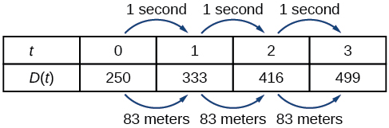
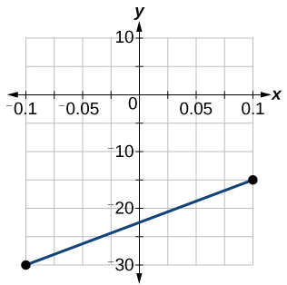

In this section, you will:
* Represent a linear function.
* Determine whether a linear function is increasing, decreasing, or constant.
* Calculate and interpret slope.
* Write the point-slope form of an equation.
* Write and interpret a linear function.

 "){: #CNX_Precalc_Figure_02_01_001}

Just as with the growth of a bamboo plant, there are many situations that involve constant change over time. Consider, for example, the first commercial maglev train in the world, the Shanghai MagLev Train ([\[link\]](#CNX_Precalc_Figure_02_01_001)). It carries passengers comfortably for a 30-kilometer trip from the airport to the subway station in only eight minutes.[1](#footnote1){: data-type="footnote-link"}

Suppose a maglev train were to travel a long distance, and that the train maintains a constant speed of 83 meters per second for a period of time once it is 250 meters from the station. How can we analyze the train’s distance from the station as a function of time? In this section, we will investigate a kind of function that is useful for this purpose, and use it to investigate real-world situations such as the train’s distance from the station at a given point in time.

### Representing Linear Functions

The function describing the train’s motion is a **linear function**, which is defined as a function with a constant rate of change, that is, a polynomial of degree 1. There are several ways to represent a linear function, including word form, function notation, tabular form, and graphical form. We will describe the train’s motion as a function using each method.

#### Representing a Linear Function in Word Form

Let’s begin by describing the linear function in words. For the train problem we just considered, the following word sentence may be used to describe the function relationship.

* *The train’s distance from the station is a function of the time during which the train moves at a constant speed plus its original distance from the station when it began moving at constant speed.*

The speed is the rate of change. Recall that a rate of change is a measure of how quickly the dependent variable changes with respect to the independent variable. The rate of change for this example is constant, which means that it is the same for each input value. As the time (input) increases by 1 second, the corresponding distance (output) increases by 83 meters. The train began moving at this constant speed at a distance of 250 meters from the station.

#### Representing a Linear Function in Function Notation

Another approach to representing linear functions is by using function notation. One example of function notation is an equation written in the form known as the **slope-intercept form**{: data-type="term"} of a line, where <math xmlns="http://www.w3.org/1998/Math/MathML"> <mi>x</mi> </math>

is the input value, <math xmlns="http://www.w3.org/1998/Math/MathML"> <mi>m</mi> </math>

 is the rate of change, and <math xmlns="http://www.w3.org/1998/Math/MathML"> <mi>b</mi> </math>

 is the initial value of the dependent variable.

<math xmlns="http://www.w3.org/1998/Math/MathML" display="block"> <mrow> <mtable columnalign="left"> <mtr columnalign="left"> <mtd columnalign="left"> <mrow> <mtext>Equation form</mtext> </mrow> </mtd> <mtd columnalign="left"> <mrow> <mi>y</mi><mo>=</mo><mi>m</mi><mi>x</mi><mo>+</mo><mi>b</mi> </mrow> </mtd> </mtr> <mtr columnalign="left"> <mtd columnalign="left"> <mrow> <mtext>Equation notation</mtext> </mrow> </mtd> <mtd columnalign="left"> <mrow> <mi>f</mi><mo stretchy="false">(</mo><mi>x</mi><mo stretchy="false">)</mo><mo>=</mo><mi>m</mi><mi>x</mi><mo>+</mo><mi>b</mi> </mrow> </mtd> </mtr> </mtable> </mrow> </math>

In the example of the train, we might use the notation <math xmlns="http://www.w3.org/1998/Math/MathML"> <mrow> <mi>D</mi><mo stretchy="false">(</mo><mi>t</mi><mo stretchy="false">)</mo> </mrow> </math>

 in which the total distance <math xmlns="http://www.w3.org/1998/Math/MathML"> <mi>D</mi> </math>

 is a function of the time <math xmlns="http://www.w3.org/1998/Math/MathML"> <mrow> <mi>t</mi><mo>.</mo> </mrow> </math>

 The rate,<math xmlns="http://www.w3.org/1998/Math/MathML"> <mrow> <mi>m</mi><mo>,</mo> </mrow> </math>

 is 83 meters per second. The initial value of the dependent variable <math xmlns="http://www.w3.org/1998/Math/MathML"> <mi>b</mi> </math>

 is the original distance from the station, 250 meters. We can write a generalized equation to represent the motion of the train.

<math xmlns="http://www.w3.org/1998/Math/MathML" display="block"> <mrow> <mi>D</mi><mo stretchy="false">(</mo><mi>t</mi><mo stretchy="false">)</mo><mo>=</mo><mn>83</mn><mi>t</mi><mo>+</mo><mn>250</mn> </mrow> </math>

#### Representing a Linear Function in Tabular Form

A third method of representing a linear function is through the use of a table. The relationship between the distance from the station and the time is represented in [\[link\]](#CNX_Precalc_Figure_02_01_015). From the table, we can see that the distance changes by 83 meters for every 1 second increase in time.

 {: #CNX_Precalc_Figure_02_01_015}

**Can the input in the previous example be any real number?**

*No. The input represents time, so while nonnegative rational and irrational numbers are possible, negative real numbers are not possible for this example. The input consists of non-negative real numbers.*

#### Representing a Linear Function in Graphical Form

Another way to represent linear functions is visually, using a graph. We can use the function relationship from above, <math xmlns="http://www.w3.org/1998/Math/MathML"> <mrow> <mi>D</mi><mo stretchy="false">(</mo><mi>t</mi><mo stretchy="false">)</mo><mo>=</mo><mn>83</mn><mi>t</mi><mo>+</mo><mn>250</mn><mo>,</mo> </mrow> </math>

to draw a graph, represented in [\[link\]](#CNX_Precalc_Figure_02_01_012). Notice the graph is a line. When we plot a linear function, the graph is always a line.

The rate of change, which is constant, determines the slant, or **slope** of the line. The point at which the input value is zero is the vertical intercept, or ***y*-intercept**, of the line. We can see from the graph in [\[link\]](#CNX_Precalc_Figure_02_01_012) that the *y*-intercept in the train example we just saw is <math xmlns="http://www.w3.org/1998/Math/MathML"> <mrow> <mo stretchy="false">(</mo><mn>0</mn><mo>,</mo><mn>250</mn><mo stretchy="false">)</mo> </mrow> </math>

 and represents the distance of the train from the station when it began moving at a constant speed.

 =83t+250.&#10;&#10; Graphs of linear functions are lines because the rate of change is constant."){: #CNX_Precalc_Figure_02_01_012}

Notice that the graph of the train example is restricted, but this is not always the case. Consider the graph of the line <math xmlns="http://www.w3.org/1998/Math/MathML"> <mrow> <mi>f</mi><mrow><mo>(</mo> <mi>x</mi> <mo>)</mo></mrow><mo>=</mo><mn>2</mn><msub> <mi>x</mi> </msub> <mn>+1.</mn> </mrow> </math>

 Ask yourself what numbers can be input to the function, that is, what is the domain of the function? The domain is comprised of all real numbers because any number may be doubled, and then have one added to the product.

Linear Function

A **linear function**{: data-type="term"} is a function whose graph is a line. Linear functions can be written in the slope-intercept form of a line

<math xmlns="http://www.w3.org/1998/Math/MathML" display="block"> <mrow> <mi>f</mi><mo stretchy="false">(</mo><mi>x</mi><mo stretchy="false">)</mo><mo>=</mo><mi>m</mi><mi>x</mi><mo>+</mo><mi>b</mi> </mrow> </math>

where <math xmlns="http://www.w3.org/1998/Math/MathML"> <mi>b</mi> </math>

 is the initial or starting value of the function (when input,<math xmlns="http://www.w3.org/1998/Math/MathML"> <mrow> <mi>x</mi><mo>=</mo><mn>0</mn> </mrow> </math>

 ), and <math xmlns="http://www.w3.org/1998/Math/MathML"> <mi>m</mi> </math>

 is the constant rate of change, or **slope**{: data-type="term"} of the function. The ***y*-intercept**{: data-type="term"} is at <math xmlns="http://www.w3.org/1998/Math/MathML"> <mrow> <mo stretchy="false">(</mo><mn>0</mn><mo>,</mo><mi>b</mi><mo stretchy="false">)</mo><mo>.</mo> </mrow> </math>

Using a Linear Function to Find the Pressure on a Diver

The pressure,<math xmlns="http://www.w3.org/1998/Math/MathML"> <mrow> <mi>P</mi><mo>,</mo> </mrow> </math>

 in pounds per square inch (PSI) on the diver in [[link]](#CNX_Precalc_Figure_02_01_003) depends upon her depth below the water surface, <math xmlns="http://www.w3.org/1998/Math/MathML"> <mrow> <mi>d</mi><mo>,</mo> </mrow> </math>

 in feet. This relationship may be modeled by the equation, <math xmlns="http://www.w3.org/1998/Math/MathML"> <mrow> <mi>P</mi><mo stretchy="false">(</mo><mi>d</mi><mo stretchy="false">)</mo><mo>=</mo><mn>0.434</mn><mi>d</mi><mo>+</mo><mn>14.696.</mn> </mrow> </math>

 Restate this function in words.

"){: #CNX_Precalc_Figure_02_01_003}

To restate the function in words, we need to describe each part of the equation. The pressure as a function of depth equals four hundred thirty-four thousandths times depth plus fourteen and six hundred ninety-six thousandths.

Analysis

The initial value, 14.696, is the pressure in PSI on the diver at a depth of 0 feet, which is the surface of the water. The rate of change, or slope, is 0.434 PSI per foot. This tells us that the pressure on the diver increases 0.434 PSI for each foot her depth increases.

### Determining whether a Linear Function Is Increasing, Decreasing, or Constant

The linear functions we used in the two previous examples increased over time, but not every linear function does. A linear function may be increasing, decreasing, or constant. For an **increasing function**{: data-type="term" .no-emphasis}, as with the train example, the output values increase as the input values increase. The graph of an increasing function has a positive slope. A line with a positive slope slants upward from left to right as in [\[link\]](#CNX_Precalc_Figure_02_01_004abc)**(a)**. For a **decreasing function**{: data-type="term" .no-emphasis}, the slope is negative. The output values decrease as the input values increase. A line with a negative slope slants downward from left to right as in [\[link\]](#CNX_Precalc_Figure_02_01_004abc)**(b)**. If the function is constant, the output values are the same for all input values so the slope is zero. A line with a slope of zero is horizontal as in [\[link\]](#CNX_Precalc_Figure_02_01_004abc)**(c)**.

 {: #CNX_Precalc_Figure_02_01_004abc}

Increasing and Decreasing Functions

The slope determines if the function is an **increasing linear function**{: data-type="term"}, a **decreasing linear function**{: data-type="term"}, or a constant function.

* <math xmlns="http://www.w3.org/1998/Math/MathML"> <mrow> <mi>f</mi><mo stretchy="false">(</mo><mi>x</mi><mo stretchy="false">)</mo><mo>=</mo><mi>m</mi><mi>x</mi><mo>+</mo><mi>b</mi><mtext> is an increasing function if </mtext><mi>m</mi><mo>&gt;</mo><mn>0.</mn> </mrow> </math>

* <math xmlns="http://www.w3.org/1998/Math/MathML"> <mrow> <mi>f</mi><mo stretchy="false">(</mo><mi>x</mi><mo stretchy="false">)</mo><mo>=</mo><mi>m</mi><mi>x</mi><mo>+</mo><mi>b</mi><mtext> is an decreasing function if </mtext><mi>m</mi><mo>&lt;</mo><mn>0.</mn> </mrow> </math>

* <math xmlns="http://www.w3.org/1998/Math/MathML"> <mrow> <mi>f</mi><mo stretchy="false">(</mo><mi>x</mi><mo stretchy="false">)</mo><mo>=</mo><mi>m</mi><mi>x</mi><mo>+</mo><mi>b</mi><mtext> is a constant function if </mtext><mi>m</mi><mo>=</mo><mn>0.</mn> </mrow> </math>
{: data-bullet-style="none"}

Deciding whether a Function Is Increasing, Decreasing, or Constant

Some recent studies suggest that a teenager sends an average of 60 texts per day.[2](#footnote2){: data-type="footnote-link"} For each of the following scenarios, find the linear function that describes the relationship between the input value and the output value. Then, determine whether the graph of the function is increasing, decreasing, or constant.

1.  The total number of texts a teen sends is considered a function of time in days. The input is the number of days, and output is the total number of texts sent.
2.  A teen has a limit of 500 texts per month in his or her data plan. The input is the number of days, and output is the total number of texts remaining for the month.
3.  A teen has an unlimited number of texts in his or her data plan for a cost of $50 per month. The input is the number of days, and output is the total cost of texting each month.
{: type="a"}

Analyze each function.

1.  The function can be represented as
    <math xmlns="http://www.w3.org/1998/Math/MathML"> <mrow> <mi>f</mi><mo stretchy="false">(</mo><mi>x</mi><mo stretchy="false">)</mo><mo>=</mo><mn>60</mn><mi>x</mi> </mrow> </math>
    
    where
    <math xmlns="http://www.w3.org/1998/Math/MathML"> <mi>x</mi> </math>
    
    is the number of days. The slope, 60, is positive so the function is increasing. This makes sense because the total number of texts increases with each day.
2.  The function can be represented as
    <math xmlns="http://www.w3.org/1998/Math/MathML"> <mrow> <mi>f</mi><mo stretchy="false">(</mo><mi>x</mi><mo stretchy="false">)</mo><mo>=</mo><mn>500</mn><mo>−</mo><mn>60</mn><mi>x</mi> </mrow> </math>
    
    where
    <math xmlns="http://www.w3.org/1998/Math/MathML"> <mi>x</mi> </math>
    
    is the number of days. In this case, the slope is negative so the function is decreasing. This makes sense because the number of texts remaining decreases each day and this function represents the number of texts remaining in the data plan after
    <math xmlns="http://www.w3.org/1998/Math/MathML"> <mi>x</mi> </math>
    
    days.
3.  The cost function can be represented as
    <math xmlns="http://www.w3.org/1998/Math/MathML"> <mrow> <mi>f</mi><mo stretchy="false">(</mo><mi>x</mi><mo stretchy="false">)</mo><mo>=</mo><mn>50</mn> </mrow> </math>
    
    because the number of days does not affect the total cost. The slope is 0 so the function is constant.
{: type="a"}

### Calculating and Interpreting Slope

In the examples we have seen so far, we have had the slope provided for us. However, we often need to calculate the **slope**{: data-type="term" .no-emphasis} given input and output values. Given two values for the input,<math xmlns="http://www.w3.org/1998/Math/MathML"> <mrow> <msub> <mi>x</mi> <mn>1</mn> </msub> </mrow> </math>

 and <math xmlns="http://www.w3.org/1998/Math/MathML"> <mrow> <msub> <mi>x</mi> <mn>2</mn> </msub> <mo>,</mo> </mrow> </math>

 and two corresponding values for the output, <math xmlns="http://www.w3.org/1998/Math/MathML"> <mrow> <msub> <mi>y</mi> <mn>1</mn> </msub> </mrow> </math>

 and <math xmlns="http://www.w3.org/1998/Math/MathML"> <mrow> <msub> <mi>y</mi> <mn>2</mn> </msub> </mrow> </math>

—which can be represented by a set of points, <math xmlns="http://www.w3.org/1998/Math/MathML"> <mrow> <mo stretchy="false">(</mo><msub> <mi>x</mi> <mn>1</mn> </msub> <mtext>,  </mtext><msub> <mi>y</mi> <mn>1</mn> </msub> <mo stretchy="false">)</mo> </mrow> </math>

 and <math xmlns="http://www.w3.org/1998/Math/MathML"> <mrow> <mo stretchy="false">(</mo><msub> <mi>x</mi> <mn>2</mn> </msub> <mtext>,  </mtext><msub> <mi>y</mi> <mn>2</mn> </msub> <mo stretchy="false">)</mo> </mrow> </math>

—we can calculate the slope <math xmlns="http://www.w3.org/1998/Math/MathML"> <mrow> <mi>m</mi><mo>,</mo> </mrow> </math>

 as follows

<math xmlns="http://www.w3.org/1998/Math/MathML" display="block"> <mrow> <mi>m</mi><mo>=</mo><mfrac> <mrow> <mtext>change in output (rise)</mtext> </mrow> <mrow> <mtext>change in input (run)</mtext> </mrow> </mfrac> <mo>=</mo><mfrac> <mrow> <mi>Δ</mi><mi>y</mi> </mrow> <mrow> <mi>Δ</mi><mi>x</mi> </mrow> </mfrac> <mo>=</mo><mfrac> <mrow> <msub> <mi>y</mi> <mn>2</mn> </msub> <mo>−</mo><msub> <mi>y</mi> <mn>1</mn> </msub> </mrow> <mrow> <msub> <mi>x</mi> <mn>2</mn> </msub> <mo>−</mo><msub> <mi>x</mi> <mn>1</mn> </msub> </mrow> </mfrac> </mrow> </math>

where <math xmlns="http://www.w3.org/1998/Math/MathML"><mrow><mtext>Δ</mtext><mi>y</mi> </mrow></math>

 is the vertical displacement and <math xmlns="http://www.w3.org/1998/Math/MathML"> <mrow> <mtext>Δ</mtext><mi>x</mi></mrow></math>

 is the horizontal displacement. Note in function notation two corresponding values for the output <math xmlns="http://www.w3.org/1998/Math/MathML"><mrow><msub><mi>y</mi><mn>1</mn></msub> </mrow></math>

 and <math xmlns="http://www.w3.org/1998/Math/MathML"><mrow><msub><mi>y</mi><mn>2</mn></msub></mrow></math>

 for the function <math xmlns="http://www.w3.org/1998/Math/MathML"> <mrow> <mi>f</mi><mo>,</mo> </mrow> </math>

<math xmlns="http://www.w3.org/1998/Math/MathML"><mrow><msub><mi>y</mi><mn>1</mn></msub><mo>=</mo><mi>f</mi><mo stretchy="false">(</mo><msub><mi>x</mi><mn>1</mn></msub><mo stretchy="false">)</mo></mrow></math>

 and <math xmlns="http://www.w3.org/1998/Math/MathML"><mrow><msub><mi>y</mi><mn>2</mn></msub><mo>=</mo><mi>f</mi><mo stretchy="false">(</mo><msub><mi>x</mi><mn>2</mn></msub><mo stretchy="false">)</mo><mo>,</mo></mrow></math>

 so we could equivalently write

<math xmlns="http://www.w3.org/1998/Math/MathML" display="block"> <mrow> <mi>m</mi><mo>=</mo><mfrac> <mrow> <mi>f</mi><mo stretchy="false">(</mo><msub> <mi>x</mi> <mn>2</mn> </msub> <mo stretchy="false">)</mo><mo>–</mo><mi>f</mi><mo stretchy="false">(</mo><msub> <mi>x</mi> <mn>1</mn> </msub> <mo stretchy="false">)</mo> </mrow> <mrow> <msub> <mi>x</mi> <mn>2</mn> </msub> <mo>–</mo><msub> <mi>x</mi> <mn>1</mn> </msub> </mrow> </mfrac> </mrow> </math>

[\[link\]](#CNX_Precalc_Figure_02_01_005) indicates how the slope of the line between the points,<math xmlns="http://www.w3.org/1998/Math/MathML"> <mrow> <mrow><mo>(</mo> <mrow> <msub> <mi>x</mi> <mn>1,</mn> </msub> <msub> <mi>y</mi> <mn>1</mn> </msub> </mrow> <mo>)</mo></mrow> </mrow> </math>

 and <math xmlns="http://www.w3.org/1998/Math/MathML"> <mrow> <mo stretchy="false">(</mo><msub> <mi>x</mi> <mn>2,</mn> </msub> <msub> <mi>y</mi> <mn>2</mn> </msub> <mo stretchy="false">)</mo><mo>,</mo> </mrow> </math>

 is calculated. Recall that the slope measures steepness. The greater the absolute value of the slope, the steeper the line is.

 &#10;&#10; and which is the &#10;&#10;(&#10;x&#10;1&#10;&#10;,&#xA0;&#10;y&#10;1&#10;&#10;),&#10;&#10;as long as each calculation is started with the elements from the same coordinate pair."){: #CNX_Precalc_Figure_02_01_005}

**Are the units for slope always <math xmlns="http://www.w3.org/1998/Math/MathML"> <mrow> <mfrac> <mrow> <mtext>units for the output</mtext> </mrow> <mrow> <mtext>units for the input</mtext> </mrow> </mfrac> </mrow> </math>

?**

*Yes. Think of the units as the change of output value for each unit of change in input value. An example of slope could be miles per hour or dollars per day. Notice the units appear as a ratio of units for the output per units for the input.*

Calculate Slope

The slope, or rate of change, of a function <math xmlns="http://www.w3.org/1998/Math/MathML"><mi>m</mi></math>

 can be calculated according to the following:

<math xmlns="http://www.w3.org/1998/Math/MathML" display="block"> <mrow> <mi>m</mi><mo>=</mo><mfrac> <mrow> <mtext>change in output (rise)</mtext> </mrow> <mrow> <mtext>change in input (run)</mtext> </mrow> </mfrac> <mo>=</mo><mfrac> <mrow> <mtext>Δ</mtext><mi>y</mi> </mrow> <mrow> <mtext>Δ</mtext><mi>x</mi> </mrow> </mfrac> <mo>=</mo><mfrac> <mrow> <msub> <mi>y</mi> <mn>2</mn> </msub> <mo>−</mo><msub> <mi>y</mi> <mn>1</mn> </msub> </mrow> <mrow> <msub> <mi>x</mi> <mn>2</mn> </msub> <mo>−</mo><msub> <mi>x</mi> <mn>1</mn> </msub> </mrow> </mfrac> </mrow> </math>

where <math xmlns="http://www.w3.org/1998/Math/MathML"> <mrow> <msub> <mi>x</mi> <mn>1</mn> </msub> </mrow> </math>

 and <math xmlns="http://www.w3.org/1998/Math/MathML"> <mrow> <msub> <mi>x</mi> <mn>2</mn> </msub> </mrow> </math>

 are input values, <math xmlns="http://www.w3.org/1998/Math/MathML"> <mrow> <msub> <mi>y</mi> <mn>1</mn> </msub> </mrow> </math>

 and <math xmlns="http://www.w3.org/1998/Math/MathML"> <mrow> <msub> <mi>y</mi> <mn>2</mn> </msub> </mrow> </math>

 are output values.

**Given two points from a linear function, calculate and interpret the slope.**

1.  Determine the units for output and input values.
2.  Calculate the change of output values and change of input values.
3.  Interpret the slope as the change in output values per unit of the input value.
{: type="1"}

Finding the Slope of a Linear Function

If <math xmlns="http://www.w3.org/1998/Math/MathML"> <mrow> <mi>f</mi><mo stretchy="false">(</mo><mi>x</mi><mo stretchy="false">)</mo> </mrow> </math>

 is a linear function, and <math xmlns="http://www.w3.org/1998/Math/MathML"> <mrow> <mrow><mo>(</mo> <mrow> <mn>3,−2</mn> </mrow> <mo>)</mo></mrow> </mrow> </math>

 and <math xmlns="http://www.w3.org/1998/Math/MathML"> <mrow> <mrow><mo>(</mo> <mrow> <mn>8,1</mn> </mrow> <mo>)</mo></mrow> </mrow> </math>

 are points on the line, find the slope. Is this function increasing or decreasing?

The coordinate pairs are <math xmlns="http://www.w3.org/1998/Math/MathML"> <mrow> <mrow><mo>(</mo> <mrow> <mn>3,−2</mn> </mrow> <mo>)</mo></mrow> </mrow> </math>

 and <math xmlns="http://www.w3.org/1998/Math/MathML"> <mrow> <mrow><mo>(</mo> <mrow> <mn>8,1</mn> </mrow> <mo>)</mo></mrow><mo>.</mo> </mrow> </math>

 To find the rate of change, we divide the change in output by the change in input.

<math xmlns="http://www.w3.org/1998/Math/MathML" display="block"> <mrow> <mi>m</mi><mo>=</mo><mfrac> <mrow> <mtext>change in output</mtext> </mrow> <mrow> <mtext>change in input</mtext> </mrow> </mfrac> <mo>=</mo><mfrac> <mrow> <mn>1</mn><mo>−</mo><mo stretchy="false">(</mo><mo>−</mo><mn>2</mn><mo stretchy="false">)</mo> </mrow> <mrow> <mn>8</mn><mo>−</mo><mn>3</mn> </mrow> </mfrac> <mo>=</mo><mfrac> <mn>3</mn> <mn>5</mn> </mfrac> </mrow> </math>

We could also write the slope as <math xmlns="http://www.w3.org/1998/Math/MathML"> <mrow> <mi>m</mi><mo>=</mo><mn>0.6.</mn> </mrow> </math>

 The function is increasing because <math xmlns="http://www.w3.org/1998/Math/MathML"> <mrow> <mi>m</mi><mo>&gt;</mo><mn>0.</mn> </mrow> </math>

Analysis

As noted earlier, the order in which we write the points does not matter when we compute the slope of the line as long as the first output value, or *y*-coordinate, used corresponds with the first input value, or *x*-coordinate, used.

If <math xmlns="http://www.w3.org/1998/Math/MathML"> <mrow> <mi>f</mi><mo stretchy="false">(</mo><mi>x</mi><mo stretchy="false">)</mo> </mrow> </math>

 is a linear function, and <math xmlns="http://www.w3.org/1998/Math/MathML"> <mrow> <mrow><mo>(</mo> <mrow> <mn>2</mn><mo>,</mo><mtext> </mtext><mn>3</mn> </mrow> <mo>)</mo></mrow> </mrow> </math>

 and <math xmlns="http://www.w3.org/1998/Math/MathML"> <mrow> <mrow><mo>(</mo> <mrow> <mn>0</mn><mo>,</mo><mtext> </mtext><mn>4</mn> </mrow> <mo>)</mo></mrow> </mrow> </math>

 are points on the line, find the slope. Is this function increasing or decreasing?

<math xmlns="http://www.w3.org/1998/Math/MathML"> <mrow> <mi>m</mi><mo>=</mo><mfrac> <mrow> <mn>4</mn><mo>−</mo><mn>3</mn> </mrow> <mrow> <mn>0</mn><mo>−</mo><mn>2</mn> </mrow> </mfrac> <mo>=</mo><mfrac> <mn>1</mn> <mrow> <mo>−</mo><mn>2</mn> </mrow> </mfrac> <mo>=</mo><mo>−</mo><mfrac> <mn>1</mn> <mn>2</mn> </mfrac> </mrow> </math>

; decreasing because <math xmlns="http://www.w3.org/1998/Math/MathML"> <mrow> <mi>m</mi><mo>&lt;</mo><mn>0.</mn> </mrow> </math>

Finding the Population Change from a Linear Function

The population of a city increased from 23,400 to 27,800 between 2008 and 2012. Find the change of population per year if we assume the change was constant from 2008 to 2012.

The rate of change relates the change in population to the change in time. The population increased by <math xmlns="http://www.w3.org/1998/Math/MathML"><mrow><mn>27</mn><mo>,</mo><mn>800</mn><mo>−</mo><mn>23</mn><mo>,</mo><mn>400</mn><mo>=</mo><mn>4400</mn></mrow> </math>

 people over the four-year time interval. To find the rate of change, divide the change in the number of people by the number of years.

<math xmlns="http://www.w3.org/1998/Math/MathML" display="block"> <mrow> <mfrac> <mrow> <mn>4,400</mn><mtext> people</mtext> </mrow> <mrow> <mn>4</mn><mtext> years</mtext> </mrow> </mfrac> <mo>=</mo><mn>1,100</mn><mtext> </mtext><mfrac> <mrow> <mtext>people</mtext> </mrow> <mrow> <mtext>year</mtext> </mrow> </mfrac> </mrow> </math>

So the population increased by 1,100 people per year.

Analysis

Because we are told that the population increased, we would expect the slope to be positive. This positive slope we calculated is therefore reasonable.

The population of a small town increased from 1,442 to 1,868 between 2009 and 2012. Find the change of population per year if we assume the change was constant from 2009 to 2012.

<math xmlns="http://www.w3.org/1998/Math/MathML"> <mrow> <mi>m</mi><mo>=</mo><mfrac> <mrow> <mn>1</mn><mo>,</mo><mn>868</mn><mo>−</mo><mn>1</mn><mo>,</mo><mn>442</mn> </mrow> <mrow> <mn>2</mn><mo>,</mo><mn>012</mn><mo>−</mo><mn>2</mn><mo>,</mo><mn>009</mn> </mrow> </mfrac> <mo>=</mo><mfrac> <mrow> <mn>426</mn> </mrow> <mn>3</mn> </mfrac> <mo>=</mo><mn>142</mn><mtext> people per year</mtext> </mrow> </math>

### Writing the Point-Slope Form of a Linear Equation

Up until now, we have been using the slope-intercept form of a linear equation to describe linear functions. Here, we will learn another way to write a linear function, the **point-slope form**{: data-type="term"}.

<math xmlns="http://www.w3.org/1998/Math/MathML" display="block"> <mrow> <mi>y</mi><mo>−</mo><msub> <mi>y</mi> <mn>1</mn> </msub> <mo>=</mo><mi>m</mi><mrow><mo>(</mo> <mrow> <mi>x</mi><mo>−</mo><msub> <mi>x</mi> <mn>1</mn> </msub> </mrow> <mo>)</mo></mrow> </mrow> </math>

The point-slope form is derived from the slope formula.

<math xmlns="http://www.w3.org/1998/Math/MathML" display="block"> <mrow> <mtable columnalign="left"> <mtr columnalign="left"> <mtd columnalign="left"> <mrow> <mi>m</mi><mo>=</mo><mfrac> <mrow> <mi>y</mi><mo>−</mo><msub> <mi>y</mi> <mn>1</mn> </msub> </mrow> <mrow> <mi>x</mi><mo>−</mo><msub> <mi>x</mi> <mn>1</mn> </msub> </mrow> </mfrac> </mrow> </mtd> <mtd columnalign="left"> <mrow> <mtext>assuming </mtext><mi>x</mi><mo>≠</mo><msub> <mi>x</mi> <mn>1</mn> </msub> </mrow> </mtd> </mtr> <mtr columnalign="left"> <mtd columnalign="left"> <mrow> <mi>m</mi><mrow><mo>(</mo> <mrow> <mi>x</mi><mo>−</mo><msub> <mi>x</mi> <mn>1</mn> </msub> </mrow> <mo>)</mo></mrow><mo>=</mo><mfrac> <mrow> <mi>y</mi><mo>−</mo><msub> <mi>y</mi> <mn>1</mn> </msub> </mrow> <mrow> <mi>x</mi><mo>−</mo><msub> <mi>x</mi> <mn>1</mn> </msub> </mrow> </mfrac> <mrow><mo>(</mo> <mrow> <mi>x</mi><mo>−</mo><msub> <mi>x</mi> <mn>1</mn> </msub> </mrow> <mo>)</mo></mrow> </mrow> </mtd> <mtd columnalign="left"> <mrow> <mtext>Multiply both sides by </mtext><mrow><mo>(</mo> <mrow> <mi>x</mi><mo>−</mo><msub> <mi>x</mi> <mn>1</mn> </msub> </mrow> <mo>)</mo></mrow><mo>.</mo> </mrow> </mtd> </mtr> <mtr columnalign="left"> <mtd columnalign="left"> <mrow> <mi>m</mi><mrow><mo>(</mo> <mrow> <mi>x</mi><mo>−</mo><msub> <mi>x</mi> <mn>1</mn> </msub> </mrow> <mo>)</mo></mrow><mo>=</mo><mi>y</mi><mo>−</mo><msub> <mi>y</mi> <mn>1</mn> </msub> </mrow> </mtd> <mtd columnalign="left"> <mrow> <mtext>Simplify</mtext><mtext>.</mtext> </mrow> </mtd> </mtr> <mtr columnalign="left"> <mtd columnalign="left"> <mrow> <mi>y</mi><mo>−</mo><msub> <mi>y</mi> <mn>1</mn> </msub> <mo>=</mo><mi>m</mi><mrow><mo>(</mo> <mrow> <mi>x</mi><mo>−</mo><msub> <mi>x</mi> <mn>1</mn> </msub> </mrow> <mo>)</mo></mrow> </mrow> </mtd> <mtd columnalign="left"> <mrow> <mtext>Rearrange</mtext><mtext>.</mtext> </mrow> </mtd> </mtr> </mtable> </mrow> </math>

Keep in mind that the slope-intercept form and the point-slope form can be used to describe the same function. We can move from one form to another using basic algebra. For example, suppose we are given an equation in point-slope form,<math xmlns="http://www.w3.org/1998/Math/MathML"> <mrow> <mi>y</mi><mo>−</mo><mn>4</mn><mo>=</mo><mo>−</mo><mfrac> <mn>1</mn> <mn>2</mn> </mfrac> <mrow><mo>(</mo> <mrow> <mi>x</mi><mo>−</mo><mn>6</mn> </mrow> <mo>)</mo></mrow> </mrow> </math>

. We can convert it to the slope-intercept form as shown.

<math xmlns="http://www.w3.org/1998/Math/MathML" display="block"> <mrow> <mtable columnalign="left"> <mtr columnalign="left"> <mtd columnalign="left"> <mrow> <mi>y</mi><mo>−</mo><mn>4</mn><mo>=</mo><mo>−</mo><mfrac> <mn>1</mn> <mn>2</mn> </mfrac> <mo stretchy="false">(</mo><mi>x</mi><mo>−</mo><mn>6</mn><mo stretchy="false">)</mo> </mrow> </mtd> <mtd columnalign="left"> <mrow /> </mtd> </mtr> <mtr columnalign="left"> <mtd columnalign="left"> <mrow> <mi>y</mi><mo>−</mo><mn>4</mn><mo>=</mo><mo>−</mo><mfrac> <mn>1</mn> <mn>2</mn> </mfrac> <mi>x</mi><mo>+</mo><mn>3</mn> </mrow> </mtd> <mtd columnalign="left"> <mrow> <mtext>Distribute the </mtext><mo>−</mo><mfrac> <mn>1</mn> <mn>2</mn> </mfrac> <mo>.</mo> </mrow> </mtd> </mtr> <mtr columnalign="left"> <mtd columnalign="left"> <mrow> <mtext>      </mtext><mi>y</mi><mo>=</mo><mo>−</mo><mfrac> <mn>1</mn> <mn>2</mn> </mfrac> <mi>x</mi><mo>+</mo><mn>7</mn> </mrow> </mtd> <mtd columnalign="left"> <mrow> <mtext>Add 4 to each side</mtext><mo>.</mo> </mrow> </mtd> </mtr> </mtable> </mrow> </math>

Therefore, the same line can be described in slope-intercept form as <math xmlns="http://www.w3.org/1998/Math/MathML"> <mrow> <mi>y</mi><mo>=</mo><mo>−</mo><mfrac> <mn>1</mn> <mn>2</mn> </mfrac> <mi>x</mi><mo>+</mo><mn>7.</mn> </mrow> </math>

Point-Slope Form of a Linear Equation

The **point-slope form** of a linear equation takes the form

<math xmlns="http://www.w3.org/1998/Math/MathML" display="block"> <mrow> <mi>y</mi><mo>−</mo><msub> <mi>y</mi> <mn>1</mn> </msub> <mo>=</mo><mi>m</mi><mrow><mo>(</mo> <mrow> <mi>x</mi><mo>−</mo><msub> <mi>x</mi> <mn>1</mn> </msub> </mrow> <mo>)</mo></mrow> </mrow> </math>

where <math xmlns="http://www.w3.org/1998/Math/MathML"> <mi>m</mi> </math>

 is the slope,<math xmlns="http://www.w3.org/1998/Math/MathML"> <mrow> <msub> <mi>x</mi> <mrow> <mn>1</mn><mo> </mo> </mrow> </msub> <mtext>and</mtext><mo> </mo><msub> <mi>y</mi> <mn>1</mn> </msub> </mrow> </math>

 are the <math xmlns="http://www.w3.org/1998/Math/MathML"> <mrow> <mi>x</mi><mtext> and </mtext><mi>y</mi> </mrow> </math>

 coordinates of a specific point through which the line passes.

#### Writing the Equation of a Line Using a Point and the Slope

The point-slope form is particularly useful if we know one point and the slope of a line. Suppose, for example, we are told that a line has a slope of 2 and passes through the point <math xmlns="http://www.w3.org/1998/Math/MathML"> <mrow> <mrow><mo>(</mo> <mrow> <mn>4</mn><mo>,</mo><mn>1</mn> </mrow> <mo>)</mo></mrow><mo>.</mo> </mrow> </math>

 We know that <math xmlns="http://www.w3.org/1998/Math/MathML"> <mrow> <mi>m</mi><mo>=</mo><mn>2</mn> </mrow> </math>

 and that <math xmlns="http://www.w3.org/1998/Math/MathML"> <mrow> <msub> <mi>x</mi> <mn>1</mn> </msub> <mo>=</mo><mn>4</mn> </mrow> </math>

 and <math xmlns="http://www.w3.org/1998/Math/MathML"> <mrow> <msub> <mi>y</mi> <mn>1</mn> </msub> <mo>=</mo><mn>1.</mn> </mrow> </math>

 We can substitute these values into the general point-slope equation.

<math xmlns="http://www.w3.org/1998/Math/MathML" display="block"> <mtable> <mtr> <mtd> <mi>y</mi><mo>−</mo><msub> <mi>y</mi> <mn>1</mn> </msub> <mo>=</mo><mi>m</mi><mrow><mo>(</mo> <mrow> <mi>x</mi><mo>−</mo><msub> <mi>x</mi> <mn>1</mn> </msub> </mrow> <mo>)</mo></mrow> </mtd> </mtr> <mtr> <mtd> <mi>y</mi><mo>−</mo><mn>1</mn><mo>=</mo><mn>2</mn><mrow><mo>(</mo> <mrow> <mi>x</mi><mo>−</mo><mn>4</mn> </mrow> <mo>)</mo></mrow> </mtd> </mtr> </mtable> </math>

If we wanted to then rewrite the equation in slope-intercept form, we apply algebraic techniques.

<math xmlns="http://www.w3.org/1998/Math/MathML" display="block"> <mrow> <mtable columnalign="left"> <mtr columnalign="left"> <mtd columnalign="left"> <mrow> <mi>y</mi><mo>−</mo><mn>1</mn><mo>=</mo><mn>2</mn><mo stretchy="false">(</mo><mi>x</mi><mo>−</mo><mn>4</mn><mo stretchy="false">)</mo> </mrow> </mtd> <mtd columnalign="left"> <mrow /> </mtd> </mtr> <mtr columnalign="left"> <mtd columnalign="left"> <mrow> <mi>y</mi><mo>−</mo><mn>1</mn><mo>=</mo><mn>2</mn><mi>x</mi><mo>−</mo><mn>8</mn> </mrow> </mtd> <mtd columnalign="left"> <mrow> <mtext>Distribute the </mtext><mn>2.</mn> </mrow> </mtd> </mtr> <mtr columnalign="left"> <mtd columnalign="left"> <mrow> <mtext>       </mtext><mi>y</mi><mo>=</mo><mn>2</mn><mi>x</mi><mo>−</mo><mn>7</mn> </mrow> </mtd> <mtd columnalign="left"> <mrow> <mtext>Add 1 to each side</mtext><mo>.</mo> </mrow> </mtd> </mtr> </mtable> </mrow> </math>

Both equations,<math xmlns="http://www.w3.org/1998/Math/MathML"> <mrow> <mi>y</mi><mo>−</mo><mn>1</mn><mo>=</mo><mn>2</mn><mrow><mo>(</mo> <mrow> <mi>x</mi><mo>−</mo><mn>4</mn> </mrow> <mo>)</mo></mrow> </mrow> </math>

 and <math xmlns="http://www.w3.org/1998/Math/MathML"> <mrow> <mi>y</mi><mo>=</mo><mn>2</mn><mi>x</mi><mo>–</mo><mn>7</mn><mo>,</mo> </mrow> </math>

 describe the same line. See [\[link\]](#CNX_Precalc_Figure_02_01_013).

{: #CNX_Precalc_Figure_02_01_013}

Writing Linear Equations Using a Point and the Slope

Write the point-slope form of an equation of a line with a slope of 3 that passes through the point <math xmlns="http://www.w3.org/1998/Math/MathML"> <mrow> <mrow><mo>(</mo> <mrow> <mn>6</mn><mo>,</mo><mn>–1</mn> </mrow> <mo>)</mo></mrow><mo>.</mo> </mrow> </math>

 Then rewrite it in the slope-intercept form.

Let’s figure out what we know from the given information. The slope is 3, so <math xmlns="http://www.w3.org/1998/Math/MathML"><mrow><mi>m</mi><mo>=</mo><mn>3.</mn></mrow></math>

 We also know one point, so we know <math xmlns="http://www.w3.org/1998/Math/MathML"><mrow><msub><mi>x</mi><mn>1</mn></msub><mo>=</mo><mn>6</mn></mrow></math>

and <math xmlns="http://www.w3.org/1998/Math/MathML"><mrow><msub><mi>y</mi><mn>1</mn> </msub><mo>=</mo><mn>−1.</mn></mrow> </math>

 Now we can substitute these values into the general point-slope equation.

<math xmlns="http://www.w3.org/1998/Math/MathML" display="block"> <mrow> <mtable columnalign="left"> <mtr columnalign="left"> <mtd columnalign="left"> <mrow> <mtext>      </mtext><mi>y</mi><mo>−</mo><msub> <mi>y</mi> <mn>1</mn> </msub> <mo>=</mo><mi>m</mi><mo stretchy="false">(</mo><mi>x</mi><mo>−</mo><msub> <mi>x</mi> <mn>1</mn> </msub> <mo stretchy="false">)</mo> </mrow> </mtd> <mtd columnalign="left"> <mrow /> </mtd> </mtr> <mtr columnalign="left"> <mtd columnalign="left"> <mrow> <mi>y</mi><mo>−</mo><mo stretchy="false">(</mo><mo>−</mo><mn>1</mn><mo stretchy="false">)</mo><mo>=</mo><mn>3</mn><mo stretchy="false">(</mo><mi>x</mi><mo>−</mo><mn>6</mn><mo stretchy="false">)</mo> </mrow> </mtd> <mtd columnalign="left"> <mrow> <mtext>Substitute known values</mtext><mo>.</mo> </mrow> </mtd> </mtr> <mtr columnalign="left"> <mtd columnalign="left"> <mrow> <mtext>        </mtext><mi>y</mi><mo>+</mo><mn>1</mn><mo>=</mo><mn>3</mn><mo stretchy="false">(</mo><mi>x</mi><mo>−</mo><mn>6</mn><mo stretchy="false">)</mo> </mrow> </mtd> <mtd columnalign="left"> <mrow> <mtext>Distribute </mtext><mo>−</mo><mn>1</mn><mtext> to find point-slope form</mtext><mo>.</mo> </mrow> </mtd> </mtr> </mtable> </mrow> </math>

Then we use algebra to find the slope-intercept form.

<math xmlns="http://www.w3.org/1998/Math/MathML" display="block"> <mrow> <mtable columnalign="left"> <mtr columnalign="left"> <mtd columnalign="left"> <mrow> <mi>y</mi><mo>+</mo><mn>1</mn><mo>=</mo><mn>3</mn><mo stretchy="false">(</mo><mi>x</mi><mo>−</mo><mn>6</mn><mo stretchy="false">)</mo> </mrow> </mtd> <mtd columnalign="left"> <mrow /> </mtd> </mtr> <mtr columnalign="left"> <mtd columnalign="left"> <mrow> <mi>y</mi><mo>+</mo><mn>1</mn><mo>=</mo><mn>3</mn><mi>x</mi><mo>−</mo><mn>18</mn> </mrow> </mtd> <mtd columnalign="left"> <mrow> <mtext>Distribute 3</mtext><mo>.</mo> </mrow> </mtd> </mtr> <mtr columnalign="left"> <mtd columnalign="left"> <mrow> <mtext>       </mtext><mi>y</mi><mo>=</mo><mn>3</mn><mi>x</mi><mo>−</mo><mn>19</mn> </mrow> </mtd> <mtd columnalign="left"> <mrow> <mtext>Simplify to slope-intercept form</mtext><mo>.</mo> </mrow> </mtd> </mtr> </mtable> </mrow> </math>

Write the point-slope form of an equation of a line with a slope of <math xmlns="http://www.w3.org/1998/Math/MathML"> <mrow> <mn>–2</mn> </mrow> </math>

 that passes through the point <math xmlns="http://www.w3.org/1998/Math/MathML"> <mrow> <mrow><mo>(</mo> <mrow> <mn>–2</mn><mo>,</mo><mtext> </mtext><mn>2</mn> </mrow> <mo>)</mo></mrow><mo>.</mo> </mrow> </math>

 Then rewrite it in the slope-intercept form.

<math xmlns="http://www.w3.org/1998/Math/MathML"> <mrow> <mi>y</mi><mo>−</mo><mn>2</mn><mo>=</mo><mo>−</mo><mn>2</mn><mrow><mo>(</mo> <mrow> <mi>x</mi><mo>+</mo><mn>2</mn> </mrow> <mo>)</mo></mrow> </mrow> </math>

 ; <math xmlns="http://www.w3.org/1998/Math/MathML"> <mrow> <mi>y</mi><mo>=</mo><mo>−</mo><mn>2</mn><mi>x</mi><mo>−</mo><mn>2</mn> </mrow> </math>

#### Writing the Equation of a Line Using Two Points 

The point-slope form of an equation is also useful if we know any two points through which a line passes. Suppose, for example, we know that a line passes through the points <math xmlns="http://www.w3.org/1998/Math/MathML"> <mrow> <mrow><mo>(</mo> <mrow> <mn>0</mn><mo>,</mo><mtext> </mtext><mn>1</mn> </mrow> <mo>)</mo></mrow> </mrow> </math>

 and <math xmlns="http://www.w3.org/1998/Math/MathML"> <mrow> <mrow><mo>(</mo> <mrow> <mn>3</mn><mo>,</mo><mtext> </mtext><mn>2</mn> </mrow> <mo>)</mo></mrow><mo>.</mo> </mrow> </math>

 We can use the coordinates of the two points to find the slope.

<math xmlns="http://www.w3.org/1998/Math/MathML" display="block"> <mrow> <mtable columnalign="left"> <mtr columnalign="left"> <mtd columnalign="left"> <mtable columnalign="left"> <mtr> <mtd> <mrow /> </mtd> </mtr> <mtr> <mtd> <mi>m</mi><mo>=</mo><mfrac> <mrow> <msub> <mi>y</mi> <mn>2</mn> </msub> <mo>−</mo><msub> <mi>y</mi> <mn>1</mn> </msub> </mrow> <mrow> <msub> <mi>x</mi> <mn>2</mn> </msub> <mo>−</mo><msub> <mi>x</mi> <mn>1</mn> </msub> </mrow> </mfrac> </mtd> </mtr> </mtable> </mtd> </mtr> <mtr columnalign="left"> <mtd columnalign="left"> <mrow> <mtext>   </mtext><mo>=</mo><mfrac> <mrow> <mn>2</mn><mo>−</mo><mn>1</mn> </mrow> <mrow> <mn>3</mn><mo>−</mo><mn>0</mn> </mrow> </mfrac> </mrow> </mtd> </mtr> <mtr columnalign="left"> <mtd columnalign="left"> <mrow> <mtext>   </mtext><mo>=</mo><mfrac> <mn>1</mn> <mn>3</mn> </mfrac> </mrow> </mtd> </mtr> </mtable> </mrow> </math>

Now we can use the slope we found and the coordinates of one of the points to find the equation for the line. Let use (0, 1) for our point.

<math xmlns="http://www.w3.org/1998/Math/MathML" display="block"> <mtable> <mtr> <mtd> <mi>y</mi><mo>−</mo><msub> <mi>y</mi> <mn>1</mn> </msub> <mo>=</mo><mi>m</mi><mrow><mo>(</mo> <mrow> <mi>x</mi><mo>−</mo><msub> <mi>x</mi> <mn>1</mn> </msub> </mrow> <mo>)</mo></mrow> </mtd> </mtr> <mtr> <mtd> <mi>y</mi><mo>−</mo><mn>1</mn><mo>=</mo><mfrac> <mn>1</mn> <mn>3</mn> </mfrac> <mrow><mo>(</mo> <mrow> <mi>x</mi><mo>−</mo><mn>0</mn> </mrow> <mo>)</mo></mrow> </mtd> </mtr> </mtable> </math>

As before, we can use algebra to rewrite the equation in the slope-intercept form.

<math xmlns="http://www.w3.org/1998/Math/MathML" display="block"> <mrow> <mtable columnalign="left"> <mtr columnalign="left"> <mtd columnalign="left"> <mrow> <mi>y</mi><mo>−</mo><mn>1</mn><mo>=</mo><mfrac> <mn>1</mn> <mn>3</mn> </mfrac> <mo stretchy="false">(</mo><mi>x</mi><mo>−</mo><mn>0</mn><mo stretchy="false">)</mo> </mrow> </mtd> <mtd columnalign="left"> <mrow /> </mtd> </mtr> <mtr columnalign="left"> <mtd columnalign="left"> <mrow> <mi>y</mi><mo>−</mo><mn>1</mn><mo>=</mo><mfrac> <mn>1</mn> <mn>3</mn> </mfrac> <mi>x</mi> </mrow> </mtd> <mtd columnalign="left"> <mrow> <mtext>Distribute the </mtext><mfrac> <mn>1</mn> <mn>3</mn> </mfrac> <mo>.</mo> </mrow> </mtd> </mtr> <mtr columnalign="left"> <mtd columnalign="left"> <mrow> <mtext>      </mtext><mi>y</mi><mo>=</mo><mfrac> <mn>1</mn> <mn>3</mn> </mfrac> <mi>x</mi><mo>+</mo><mn>1</mn> </mrow> </mtd> <mtd columnalign="left"> <mrow> <mtext>Add 1 to each side</mtext><mo>.</mo> </mrow> </mtd> </mtr> </mtable> </mrow> </math>

Both equations describe the line shown in [\[link\]](#CNX_Precalc_Figure_02_01_014).

 {: #CNX_Precalc_Figure_02_01_014}

Writing Linear Equations Using Two Points

Write the point-slope form of an equation of a line that passes through the points (5, 1) and (8, 7). Then rewrite it in the slope-intercept form.

Let’s begin by finding the slope.

<math xmlns="http://www.w3.org/1998/Math/MathML" display="block"> <mrow> <mtable columnalign="left"> <mtr columnalign="left"> <mtd columnalign="left"> <mtable columnalign="left"> <mtr> <mtd> <mrow /> </mtd> </mtr> <mtr> <mtd> <mi>m</mi><mo>=</mo><mfrac> <mrow> <msub> <mi>y</mi> <mn>2</mn> </msub> <mo>−</mo><msub> <mi>y</mi> <mn>1</mn> </msub> </mrow> <mrow> <msub> <mi>x</mi> <mn>2</mn> </msub> <mo>−</mo><msub> <mi>x</mi> <mn>1</mn> </msub> </mrow> </mfrac> </mtd> </mtr> </mtable> </mtd> </mtr> <mtr columnalign="left"> <mtd columnalign="left"> <mrow> <mtext>  </mtext><mo>=</mo><mfrac> <mrow> <mn>7</mn><mo>−</mo><mn>1</mn> </mrow> <mrow> <mn>8</mn><mo>−</mo><mn>5</mn> </mrow> </mfrac> </mrow> </mtd> </mtr> <mtr columnalign="left"> <mtd columnalign="left"> <mrow> <mtext>  </mtext><mo>=</mo><mfrac> <mn>6</mn> <mn>3</mn> </mfrac> </mrow> </mtd> </mtr> <mtr columnalign="left"> <mtd columnalign="left"> <mrow> <mtext>  </mtext><mo>=</mo><mn>2</mn> </mrow> </mtd> </mtr> </mtable> </mrow> </math>

So <math xmlns="http://www.w3.org/1998/Math/MathML"> <mrow> <mi>m</mi><mo>=</mo><mn>2.</mn> </mrow> </math>

 Next, we substitute the slope and the coordinates for one of the points into the general point-slope equation. We can choose either point, but we will use <math xmlns="http://www.w3.org/1998/Math/MathML"> <mrow> <mo stretchy="false">(</mo><mn>5</mn><mo>,</mo><mn>1</mn><mo stretchy="false">)</mo><mo>.</mo> </mrow> </math>

<math xmlns="http://www.w3.org/1998/Math/MathML" display="block"> <mtable> <mtr> <mtd> <mi>y</mi><mo>−</mo><msub> <mi>y</mi> <mn>1</mn> </msub> <mo>=</mo><mi>m</mi><mrow><mo>(</mo> <mrow> <mi>x</mi><mo>−</mo><msub> <mi>x</mi> <mn>1</mn> </msub> </mrow> <mo>)</mo></mrow> </mtd> </mtr> <mtr> <mtd> <mi>y</mi><mo>−</mo><mn>1</mn><mo>=</mo><mn>2</mn><mrow><mo>(</mo> <mrow> <mi>x</mi><mo>−</mo><mn>5</mn> </mrow> <mo>)</mo></mrow> </mtd> </mtr> </mtable> </math>

The point-slope equation of the line is <math xmlns="http://www.w3.org/1998/Math/MathML"> <mrow> <msub> <mi>y</mi> <mn>2</mn> </msub> <mo>–</mo><mn>1</mn><mo>=</mo><mn>2</mn><mo stretchy="false">(</mo><msub> <mi>x</mi> <mn>2</mn> </msub> <mo>–</mo><mn>5</mn><mo stretchy="false">)</mo><mo>.</mo> </mrow> </math>

 To rewrite the equation in slope-intercept form, we use algebra.

<math xmlns="http://www.w3.org/1998/Math/MathML" display="block"> <mrow> <mtable columnalign="left"> <mtr columnalign="left"> <mtd columnalign="left"> <mrow> <mi>y</mi><mo>−</mo><mn>1</mn><mo>=</mo><mn>2</mn><mo stretchy="false">(</mo><mi>x</mi><mo>−</mo><mn>5</mn><mo stretchy="false">)</mo> </mrow> </mtd> </mtr> <mtr columnalign="left"> <mtd columnalign="left"> <mrow> <mi>y</mi><mo>−</mo><mn>1</mn><mo>=</mo><mn>2</mn><mi>x</mi><mo>−</mo><mn>10</mn> </mrow> </mtd> </mtr> <mtr columnalign="left"> <mtd columnalign="left"> <mrow> <mtext>      </mtext><mi>y</mi><mo>=</mo><mn>2</mn><mi>x</mi><mo>−</mo><mn>9</mn> </mrow> </mtd> </mtr> </mtable> </mrow> </math>

The slope-intercept equation of the line is <math xmlns="http://www.w3.org/1998/Math/MathML"> <mrow> <mi>y</mi><mo>=</mo><mn>2</mn><mi>x</mi><mo>–</mo><mn>9.</mn> </mrow> </math>

Write the point-slope form of an equation of a line that passes through the points <math xmlns="http://www.w3.org/1998/Math/MathML"> <mrow> <mo stretchy="false">(</mo><mn>–1</mn><mo>,</mo><mn>3</mn><mo stretchy="false">)</mo><mo> </mo> </mrow> </math>

 and <math xmlns="http://www.w3.org/1998/Math/MathML"> <mrow> <mo stretchy="false">(</mo><mn>0</mn><mo>,</mo><mn>0</mn><mo stretchy="false">)</mo><mo>.</mo> </mrow> </math>

 Then rewrite it in the slope-intercept form.

<math xmlns="http://www.w3.org/1998/Math/MathML"> <mrow> <mi>y</mi><mo>−</mo><mn>0</mn><mo>=</mo><mo>−</mo><mn>3</mn><mrow><mo>(</mo> <mrow> <mi>x</mi><mo>−</mo><mn>0</mn> </mrow> <mo>)</mo></mrow> </mrow> </math>

; <math xmlns="http://www.w3.org/1998/Math/MathML"> <mrow> <mi>y</mi><mo>=</mo><mo>−</mo><mn>3</mn><mi>x</mi> </mrow> </math>

### Writing and Interpreting an Equation for a Linear Function

Now that we have written equations for linear functions in both the slope-intercept form and the point-slope form, we can choose which method to use based on the information we are given. That information may be provided in the form of a graph, a point and a slope, two points, and so on. Look at the graph of the function <math xmlns="http://www.w3.org/1998/Math/MathML"> <mi>f</mi></math>

 in [\[link\]](#CNX_Precalc_Figure_02_01_006).

 {: #CNX_Precalc_Figure_02_01_006}

We are not given the slope of the line, but we can choose any two points on the line to find the slope. Let’s choose <math xmlns="http://www.w3.org/1998/Math/MathML"> <mrow> <mrow><mo>(</mo> <mrow> <mn>0</mn><mo>,</mo><mtext> </mtext><mn>7</mn> </mrow> <mo>)</mo></mrow> </mrow> </math>

 and <math xmlns="http://www.w3.org/1998/Math/MathML"> <mrow> <mrow><mo>(</mo> <mrow> <mn>4</mn><mo>,</mo><mtext> </mtext><mn>4</mn> </mrow> <mo>)</mo></mrow><mo>.</mo> </mrow> </math>

 We can use these points to calculate the slope.

<math xmlns="http://www.w3.org/1998/Math/MathML" display="block"> <mrow> <mtable columnalign="left"> <mtr columnalign="left"> <mtd columnalign="left"> <mtable columnalign="left"> <mtr> <mtd> <mrow /> </mtd> </mtr> <mtr> <mtd> <mi>m</mi><mo>=</mo><mfrac> <mrow> <msub> <mi>y</mi> <mn>2</mn> </msub> <mo>−</mo><msub> <mi>y</mi> <mn>1</mn> </msub> </mrow> <mrow> <msub> <mi>x</mi> <mn>2</mn> </msub> <mo>−</mo><msub> <mi>x</mi> <mn>1</mn> </msub> </mrow> </mfrac> </mtd> </mtr> </mtable> </mtd> </mtr> <mtr columnalign="left"> <mtd columnalign="left"> <mrow> <mtable columnalign="left"> <mtr columnalign="left"> <mtd columnalign="left"> <mrow> <mtext>  </mtext><mo>=</mo><mfrac> <mrow> <mn>4</mn><mo>−</mo><mn>7</mn> </mrow> <mrow> <mn>4</mn><mo>−</mo><mn>0</mn> </mrow> </mfrac> </mrow> </mtd> </mtr> <mtr columnalign="left"> <mtd columnalign="left"> <mrow> <mtext>  </mtext><mo>=</mo><mo>−</mo><mfrac> <mn>3</mn> <mn>4</mn> </mfrac> </mrow> </mtd> </mtr> </mtable> </mrow> </mtd> </mtr> </mtable> </mrow> </math>

Now we can substitute the slope and the coordinates of one of the points into the point-slope form.

<math xmlns="http://www.w3.org/1998/Math/MathML" display="block"> <mrow> <mtable columnalign="left"> <mtr columnalign="left"> <mtd columnalign="left"> <mrow> <mi>y</mi><mo>−</mo><msub> <mi>y</mi> <mn>1</mn> </msub> <mo>=</mo><mi>m</mi><mo stretchy="false">(</mo><mi>x</mi><mo>−</mo><msub> <mi>x</mi> <mn>1</mn> </msub> <mo stretchy="false">)</mo> </mrow> </mtd> </mtr> <mtr columnalign="left"> <mtd columnalign="left"> <mrow> <mo> </mo><mi>y</mi><mo>−</mo><mn>4</mn><mo>=</mo><mo>−</mo><mfrac> <mn>3</mn> <mn>4</mn> </mfrac> <mo stretchy="false">(</mo><mi>x</mi><mo>−</mo><mn>4</mn><mo stretchy="false">)</mo> </mrow> </mtd> </mtr> </mtable> </mrow> </math>

If we want to rewrite the equation in the slope-intercept form, we would find

<math xmlns="http://www.w3.org/1998/Math/MathML" display="block"> <mrow> <mtable columnalign="left"> <mtr columnalign="left"> <mtd columnalign="left"> <mrow> <mi>y</mi><mo>−</mo><mn>4</mn><mo>=</mo><mo>−</mo><mfrac> <mn>3</mn> <mn>4</mn> </mfrac> <mo stretchy="false">(</mo><mi>x</mi><mo>−</mo><mn>4</mn><mo stretchy="false">)</mo> </mrow> </mtd> </mtr> <mtr columnalign="left"> <mtd columnalign="left"> <mrow> <mi>y</mi><mo>−</mo><mn>4</mn><mo>=</mo><mo>−</mo><mfrac> <mn>3</mn> <mn>4</mn> </mfrac> <mi>x</mi><mo>+</mo><mn>3</mn> </mrow> </mtd> </mtr> <mtr columnalign="left"> <mtd columnalign="left"> <mrow> <mtext>      </mtext><mi>y</mi><mo>=</mo><mo>−</mo><mfrac> <mn>3</mn> <mn>4</mn> </mfrac> <mi>x</mi><mo>+</mo><mn>7</mn> </mrow> </mtd> </mtr> </mtable> </mrow> </math>

If we wanted to find the slope-intercept form without first writing the point-slope form, we could have recognized that the line crosses the *y*-axis when the output value is 7. Therefore, <math xmlns="http://www.w3.org/1998/Math/MathML"><mrow><mi>b</mi><mo>=</mo><mn>7.</mn></mrow></math>

 We now have the initial value <math xmlns="http://www.w3.org/1998/Math/MathML"><mi>b</mi></math>

 and the slope <math xmlns="http://www.w3.org/1998/Math/MathML"><mi>m</mi></math>

 so we can substitute <math xmlns="http://www.w3.org/1998/Math/MathML"><mi>m</mi></math>

 and <math xmlns="http://www.w3.org/1998/Math/MathML"><mi>b</mi></math>

 into the slope-intercept form of a line.

   So the function is <math xmlns="http://www.w3.org/1998/Math/MathML"> <mrow> <mi>f</mi><mo stretchy="false">(</mo><mi>x</mi><mo stretchy="false">)</mo><mo>=</mo><mo>−</mo><mfrac> <mn>3</mn> <mn>4</mn> </mfrac> <mi>x</mi><mo>+</mo><mn>7</mn><mo>,</mo> </mrow> </math>

 and the linear equation would be <math xmlns="http://www.w3.org/1998/Math/MathML"> <mrow> <mi>y</mi><mo>=</mo><mo>−</mo><mfrac> <mn>3</mn> <mn>4</mn> </mfrac> <mi>x</mi><mo>+</mo><mn>7.</mn> </mrow> </math>

**Given the graph of a linear function, write an equation to represent the function.**

1.  Identify two points on the line.
2.  Use the two points to calculate the slope.
3.  Determine where the line crosses the *y*-axis to identify the *y*-intercept by visual inspection.
4.  Substitute the slope and *y*-intercept into the slope-intercept form of a line equation.
{: type="1"}

Writing an Equation for a Linear Function

Write an equation for a linear function given a graph of <math xmlns="http://www.w3.org/1998/Math/MathML"> <mi>f</mi></math>

 shown in [[link]](#CNX_Precalc_Figure_02_01_008a).

{: #CNX_Precalc_Figure_02_01_008a}

Identify two points on the line, such as <math xmlns="http://www.w3.org/1998/Math/MathML"><mrow><mrow><mo>(</mo><mrow> <mn>0</mn><mo>,</mo><mtext> </mtext><mn>2</mn></mrow><mo>)</mo></mrow></mrow></math>

 and <math xmlns="http://www.w3.org/1998/Math/MathML"><mrow><mrow><mo>(</mo><mrow><mo>−</mo><mn>2</mn><mo>,</mo><mtext>−4</mtext></mrow><mo>)</mo></mrow><mo>.</mo></mrow></math>

 Use the points to calculate the slope.

<math xmlns="http://www.w3.org/1998/Math/MathML" display="block"> <mrow> <mtable columnalign="left"> <mtr columnalign="left"> <mtd columnalign="left"> <mtable columnalign="left"> <mtr> <mtd> <mrow /> </mtd> </mtr> <mtr> <mtd> <mi>m</mi><mo>=</mo><mfrac> <mrow> <msub> <mi>y</mi> <mn>2</mn> </msub> <mo>−</mo><msub> <mi>y</mi> <mn>1</mn> </msub> </mrow> <mrow> <msub> <mi>x</mi> <mn>2</mn> </msub> <mo>−</mo><msub> <mi>x</mi> <mn>1</mn> </msub> </mrow> </mfrac> </mtd> </mtr> </mtable> </mtd> </mtr> <mtr columnalign="left"> <mtd columnalign="left"> <mrow> <mtext>  </mtext><mo>=</mo><mfrac> <mrow> <mo>−</mo><mn>4</mn><mo>−</mo><mn>2</mn> </mrow> <mrow> <mo>−</mo><mn>2</mn><mo>−</mo><mn>0</mn> </mrow> </mfrac> </mrow> </mtd> </mtr> <mtr columnalign="left"> <mtd columnalign="left"> <mrow> <mtext>  </mtext><mo>=</mo><mfrac> <mrow> <mo>−</mo><mn>6</mn> </mrow> <mrow> <mo>−</mo><mn>2</mn> </mrow> </mfrac> </mrow> </mtd> </mtr> <mtr columnalign="left"> <mtd columnalign="left"> <mrow> <mtext>  </mtext><mo>=</mo><mn>3</mn> </mrow> </mtd> </mtr> </mtable> </mrow> </math>

Substitute the slope and the coordinates of one of the points into the point-slope form.

<math xmlns="http://www.w3.org/1998/Math/MathML" display="block"> <mtable> <mtr> <mtd> <mi>y</mi><mo>−</mo><msub> <mi>y</mi> <mn>1</mn> </msub> <mo>=</mo><mi>m</mi><mrow><mo>(</mo> <mrow> <mi>x</mi><mo>−</mo><msub> <mi>x</mi> <mn>1</mn> </msub> </mrow> <mo>)</mo></mrow> </mtd> </mtr> <mtr> <mtd> <mi>y</mi><mo>−</mo><mrow><mo>(</mo> <mrow> <mo>−</mo><mn>4</mn> </mrow> <mo>)</mo></mrow><mo>=</mo><mn>3</mn><mrow><mo>(</mo> <mrow> <mi>x</mi><mo>−</mo><mrow><mo>(</mo> <mrow> <mo>−</mo><mn>2</mn> </mrow> <mo>)</mo></mrow> </mrow> <mo>)</mo></mrow> </mtd> </mtr> <mtr> <mtd> <mi>y</mi><mo>+</mo><mn>4</mn><mo>=</mo><mn>3</mn><mrow><mo>(</mo> <mrow> <mi>x</mi><mo>+</mo><mn>2</mn> </mrow> <mo>)</mo></mrow> </mtd> </mtr> </mtable> </math>

We can use algebra to rewrite the equation in the slope-intercept form.

<math xmlns="http://www.w3.org/1998/Math/MathML" display="block"> <mrow> <mtable columnalign="left"> <mtr columnalign="left"> <mtd columnalign="left"> <mrow> <mi>y</mi><mo>+</mo><mn>4</mn><mo>=</mo><mn>3</mn><mo stretchy="false">(</mo><mi>x</mi><mo>+</mo><mn>2</mn><mo stretchy="false">)</mo> </mrow> </mtd> </mtr> <mtr columnalign="left"> <mtd columnalign="left"> <mrow> <mi>y</mi><mo>+</mo><mn>4</mn><mo>=</mo><mn>3</mn><mi>x</mi><mo>+</mo><mn>6</mn> </mrow> </mtd> </mtr> <mtr columnalign="left"> <mtd columnalign="left"> <mrow> <mtext>      </mtext><mi>y</mi><mo>=</mo><mn>3</mn><mi>x</mi><mo>+</mo><mn>2</mn> </mrow> </mtd> </mtr> </mtable> </mrow> </math>

Analysis

This makes sense because we can see from [[link]](#CNX_Precalc_Figure_02_01_008b) that the line crosses the y-axis at the point <math xmlns="http://www.w3.org/1998/Math/MathML"><mrow><mrow><mo>(</mo><mrow> <mn>0</mn><mo>,</mo><mtext> </mtext><mn>2</mn></mrow><mo>)</mo></mrow></mrow></math>

, which is the *y*-intercept, so <math xmlns="http://www.w3.org/1998/Math/MathML"><mi>b</mi><mo>=</mo><mn>2.</mn></math>

{: #CNX_Precalc_Figure_02_01_008b}

Writing an Equation for a Linear Cost Function

Suppose Ben starts a company in which he incurs a fixed cost of $1,250 per month for the overhead, which includes his office rent. His production costs are $37.50 per item. Write a linear function <math xmlns="http://www.w3.org/1998/Math/MathML"><mi>C</mi></math>

 where <math xmlns="http://www.w3.org/1998/Math/MathML"><mrow><mi>C</mi><mrow><mo>(</mo><mi>x</mi><mo>)</mo></mrow></mrow></math>

 is the cost for <math xmlns="http://www.w3.org/1998/Math/MathML"><mi>x</mi></math>

 items produced in a given month.

The fixed cost is present every month, $1,250. The costs that can vary include the cost to produce each item, which is $37.50 for Ben. The variable cost, called the marginal cost, is represented by <math xmlns="http://www.w3.org/1998/Math/MathML"><mrow><mn>37.5.</mn></mrow></math>

 The cost Ben incurs is the sum of these two costs, represented by <math xmlns="http://www.w3.org/1998/Math/MathML"> <mrow> <mi>C</mi><mrow><mo>(</mo> <mi>x</mi> <mo>)</mo></mrow><mo>=</mo><mn>1250</mn><mo>+</mo><mn>37.5</mn><mi>x</mi><mo>.</mo></mrow></math>

Analysis

If Ben produces 100 items in a month, his monthly cost is represented by

<math xmlns="http://www.w3.org/1998/Math/MathML" display="block"> <mrow> <mtable columnalign="left"> <mtr columnalign="left"> <mtd columnalign="left"> <mrow> <mi>C</mi><mo stretchy="false">(</mo><mn>100</mn><mo stretchy="false">)</mo><mo>=</mo><mn>1250</mn><mo>+</mo><mn>37.5</mn><mo stretchy="false">(</mo><mn>100</mn><mo stretchy="false">)</mo> </mrow> </mtd> </mtr> <mtr columnalign="left"> <mtd columnalign="left"> <mrow> <mtext>           </mtext><mo>=</mo><mn>5000</mn> </mrow> </mtd> </mtr> </mtable> </mrow> </math>

So his monthly cost would be $5,000.

Writing an Equation for a Linear Function Given Two Points

If <math xmlns="http://www.w3.org/1998/Math/MathML"><mi>f</mi></math>

 is a linear function, with <math xmlns="http://www.w3.org/1998/Math/MathML"><mrow><mi>f</mi><mo stretchy="false">(</mo><mn>3</mn><mo stretchy="false">)</mo><mo>=</mo><mn>−2</mn></mrow></math>

, and <math xmlns="http://www.w3.org/1998/Math/MathML"><mrow><mi>f</mi><mo stretchy="false">(</mo><mn>8</mn><mo stretchy="false">)</mo><mo>=</mo><mn>1</mn></mrow></math>

, find an equation for the function in slope-intercept form.

We can write the given points using coordinates.

<math xmlns="http://www.w3.org/1998/Math/MathML" display="block"> <mrow> <mtable columnalign="left"> <mtr columnalign="left"> <mtd columnalign="left"> <mrow> <mi>f</mi><mo stretchy="false">(</mo><mn>3</mn><mo stretchy="false">)</mo><mo>=</mo><mn>−2</mn><mo stretchy="false">→</mo><mo stretchy="false">(</mo><mn>3</mn><mo>,</mo><mn>−2</mn><mo stretchy="false">)</mo> </mrow> </mtd> </mtr> <mtr columnalign="left"> <mtd columnalign="left"> <mrow> <mi>f</mi><mo stretchy="false">(</mo><mn>8</mn><mo stretchy="false">)</mo><mo>=</mo><mn>1</mn><mo stretchy="false">→</mo><mo stretchy="false">(</mo><mn>8</mn><mo>,</mo><mn>1</mn><mo stretchy="false">)</mo> </mrow> </mtd> </mtr> </mtable> </mrow> </math>

We can then use the points to calculate the slope.

<math xmlns="http://www.w3.org/1998/Math/MathML" display="block"> <mrow> <mtable columnalign="left"> <mtr columnalign="left"> <mtd columnalign="left"> <mtable columnalign="left"> <mtr> <mtd> <mrow /> </mtd> </mtr> <mtr> <mtd> <mi>m</mi><mo>=</mo><mfrac> <mrow> <msub> <mi>y</mi> <mn>2</mn> </msub> <mo>−</mo><msub> <mi>y</mi> <mn>1</mn> </msub> </mrow> <mrow> <msub> <mi>x</mi> <mn>2</mn> </msub> <mo>−</mo><msub> <mi>x</mi> <mn>1</mn> </msub> </mrow> </mfrac> </mtd> </mtr> </mtable> </mtd> </mtr> <mtr columnalign="left"> <mtd columnalign="left"> <mrow> <mtext>  </mtext><mo>=</mo><mfrac> <mrow> <mn>1</mn><mo>−</mo><mo stretchy="false">(</mo><mo>−</mo><mn>2</mn><mo stretchy="false">)</mo> </mrow> <mrow> <mn>8</mn><mo>−</mo><mn>3</mn> </mrow> </mfrac> </mrow> </mtd> </mtr> <mtr columnalign="left"> <mtd columnalign="left"> <mrow> <mtext>  </mtext><mo>=</mo><mfrac> <mn>3</mn> <mn>5</mn> </mfrac> </mrow> </mtd> </mtr> </mtable> </mrow> </math>

Substitute the slope and the coordinates of one of the points into the point-slope form.

<math xmlns="http://www.w3.org/1998/Math/MathML" display="block"> <mrow> <mtable columnalign="left"> <mtr columnalign="left"> <mtd columnalign="left"> <mrow> <mtext>    </mtext><mi>y</mi><mo>−</mo><msub> <mi>y</mi> <mn>1</mn> </msub> <mo>=</mo><mi>m</mi><mo stretchy="false">(</mo><mi>x</mi><mo>−</mo><msub> <mi>x</mi> <mn>1</mn> </msub> <mo stretchy="false">)</mo> </mrow> </mtd> </mtr> <mtr columnalign="left"> <mtd columnalign="left"> <mrow> <mi>y</mi><mo>−</mo><mo stretchy="false">(</mo><mo>−</mo><mn>2</mn><mo stretchy="false">)</mo><mo>=</mo><mfrac> <mn>3</mn> <mn>5</mn> </mfrac> <mo stretchy="false">(</mo><mi>x</mi><mo>−</mo><mn>3</mn><mo stretchy="false">)</mo> </mrow> </mtd> </mtr> </mtable> </mrow> </math>

We can use algebra to rewrite the equation in the slope-intercept form.

<math xmlns="http://www.w3.org/1998/Math/MathML" display="block"> <mrow> <mtable columnalign="left"> <mtr columnalign="left"> <mtd columnalign="left"> <mrow> <mi>y</mi><mo>+</mo><mn>2</mn><mo>=</mo><mfrac> <mn>3</mn> <mn>5</mn> </mfrac> <mo stretchy="false">(</mo><mi>x</mi><mo>−</mo><mn>3</mn><mo stretchy="false">)</mo> </mrow> </mtd> </mtr> <mtr columnalign="left"> <mtd columnalign="left"> <mrow> <mi>y</mi><mo>+</mo><mn>2</mn><mo>=</mo><mfrac> <mn>3</mn> <mn>5</mn> </mfrac> <mi>x</mi><mo>−</mo><mfrac> <mn>9</mn> <mn>5</mn> </mfrac> </mrow> </mtd> </mtr> <mtr columnalign="left"> <mtd columnalign="left"> <mrow> <mtext>      </mtext><mi>y</mi><mo>=</mo><mfrac> <mn>3</mn> <mn>5</mn> </mfrac> <mi>x</mi><mo>−</mo><mfrac> <mrow> <mn>19</mn> </mrow> <mn>5</mn> </mfrac> </mrow> </mtd> </mtr> </mtable> </mrow> </math>

If <math xmlns="http://www.w3.org/1998/Math/MathML"><mrow><mi>f</mi><mo stretchy="false">(</mo><mi>x</mi><mo stretchy="false">)</mo></mrow></math>

 is a linear function, with <math xmlns="http://www.w3.org/1998/Math/MathML"> <mrow><mi>f</mi><mo stretchy="false">(</mo><mn>2</mn><mo stretchy="false">)</mo><mo>=</mo><mo>–</mo><mn>11</mn><mo>,</mo></mrow></math>

 and <math xmlns="http://www.w3.org/1998/Math/MathML"><mrow><mi>f</mi><mo stretchy="false">(</mo><mn>4</mn><mo stretchy="false">)</mo><mo>=</mo><mo>−</mo><mn>25</mn><mo>,</mo></mrow></math>

 find an equation for the function in slope-intercept form.

<math xmlns="http://www.w3.org/1998/Math/MathML"> <mrow> <mi>y</mi><mo>=</mo><mo>−</mo><mn>7</mn><mi>x</mi><mo>+</mo><mn>3</mn> </mrow> </math>

### Modeling Real-World Problems with Linear Functions

In the real world, problems are not always explicitly stated in terms of a function or represented with a graph. Fortunately, we can analyze the problem by first representing it as a linear function and then interpreting the components of the function. As long as we know, or can figure out, the initial value and the rate of change of a linear function, we can solve many different kinds of real-world problems.

**Given a linear function <math xmlns="http://www.w3.org/1998/Math/MathML"><mi>f</mi></math>

 and the initial value and rate of change, evaluate <math xmlns="http://www.w3.org/1998/Math/MathML"><mrow><mi>f</mi><mrow><mo>(</mo><mi>c</mi><mo>)</mo></mrow><mo>.</mo></mrow></math>

**

1.  Determine the initial value and the rate of change (slope).
2.  Substitute the values into
    <math xmlns="http://www.w3.org/1998/Math/MathML"><mrow><mi>f</mi><mo stretchy="false">(</mo><mi>x</mi><mo stretchy="false">)</mo><mo>=</mo><mi>m</mi><mi>x</mi><mo>+</mo><mi>b</mi><mo>.</mo></mrow></math>

3.  Evaluate the function at
    <math xmlns="http://www.w3.org/1998/Math/MathML"><mrow><mi>x</mi><mo>=</mo><mi>c</mi><mo>.</mo></mrow></math>
{: type="1"}

Using a Linear Function to Determine the Number of Songs in a Music Collection

Marcus currently has 200 songs in his music collection. Every month, he adds 15 new songs. Write a formula for the number of songs, <math xmlns="http://www.w3.org/1998/Math/MathML"> <mrow> <mi>N</mi><mo>,</mo> </mrow> </math>

 in his collection as a function of time, <math xmlns="http://www.w3.org/1998/Math/MathML"><mrow><mi>t</mi><mo>,</mo></mrow></math>

 the number of months. How many songs will he own in a year?

The initial value for this function is 200 because he currently owns 200 songs, so <math xmlns="http://www.w3.org/1998/Math/MathML"><mrow><mi>N</mi><mo stretchy="false">(</mo><mn>0</mn><mo stretchy="false">)</mo><mo>=</mo><mn>200</mn><mo>,</mo></mrow></math>

 which means that <math xmlns="http://www.w3.org/1998/Math/MathML"><mrow><mi>b</mi><mo>=</mo><mn>200.</mn></mrow></math>

The number of songs increases by 15 songs per month, so the rate of change is 15 songs per month. Therefore we know that <math xmlns="http://www.w3.org/1998/Math/MathML"><mrow><mi>m</mi><mo>=</mo><mn>15.</mn></mrow></math>

 We can substitute the initial value and the rate of change into the slope-intercept form of a line.

{: #CNX_Precalc_Figure_02_01_010}

We can write the formula <math xmlns="http://www.w3.org/1998/Math/MathML"><mrow><mi>N</mi><mo stretchy="false">(</mo><mi>t</mi><mo stretchy="false">)</mo><mo>=</mo><mn>15</mn><mi>t</mi><mo>+</mo><mn>200.</mn></mrow></math>

With this formula, we can then predict how many songs Marcus will have in 1 year (12 months). In other words, we can evaluate the function at <math xmlns="http://www.w3.org/1998/Math/MathML"><mrow><mi>t</mi><mo>=</mo><mn>12.</mn></mrow></math>

<math xmlns="http://www.w3.org/1998/Math/MathML" display="block"> <mrow> <mtable columnalign="left"> <mtr columnalign="left"> <mtd columnalign="left"> <mrow> <mi>N</mi><mo stretchy="false">(</mo><mn>12</mn><mo stretchy="false">)</mo><mo>=</mo><mn>15</mn><mo stretchy="false">(</mo><mn>12</mn><mo stretchy="false">)</mo><mo>+</mo><mn>200</mn> </mrow> </mtd> </mtr> <mtr columnalign="left"> <mtd columnalign="left"> <mrow> <mtext>          </mtext><mo>=</mo><mn>180</mn><mo>+</mo><mn>200</mn> </mrow> </mtd> </mtr> <mtr columnalign="left"> <mtd columnalign="left"> <mrow> <mtext>          </mtext><mo>=</mo><mn>380</mn> </mrow> </mtd> </mtr> </mtable> </mrow> </math>

Marcus will have 380 songs in 12 months.

Analysis

Notice that *N* is an increasing linear function. As the input (the number of months) increases, the output (number of songs) increases as well.

Using a Linear Function to Calculate Salary Plus Commission

Working as an insurance salesperson, Ilya earns a base salary plus a commission on each new policy. Therefore, Ilya’s weekly income, <math xmlns="http://www.w3.org/1998/Math/MathML"><mrow><mi>I</mi><mo>,</mo></mrow></math>

 depends on the number of new policies, <math xmlns="http://www.w3.org/1998/Math/MathML"><mrow><mi>n</mi><mo>,</mo></mrow></math>

 he sells during the week. Last week he sold 3 new policies, and earned $760 for the week. The week before, he sold 5 new policies and earned $920. Find an equation for <math xmlns="http://www.w3.org/1998/Math/MathML"><mrow><mi>I</mi><mrow><mo>(</mo><mi>n</mi><mo>)</mo></mrow><mo>,</mo></mrow></math>

 and interpret the meaning of the components of the equation.

The given information gives us two input-output pairs: <math xmlns="http://www.w3.org/1998/Math/MathML"><mrow><mrow><mo>(</mo><mrow><mn>3,760</mn></mrow><mo>)</mo></mrow></mrow></math>

 and <math xmlns="http://www.w3.org/1998/Math/MathML"><mrow><mrow><mo>(</mo><mrow><mn>5,920</mn></mrow><mo>)</mo></mrow><mo>.</mo></mrow></math>

 We start by finding the rate of change.

<math xmlns="http://www.w3.org/1998/Math/MathML" display="block"> <mrow> <mtable columnalign="left"> <mtr columnalign="left"> <mtd columnalign="left"> <mrow> <mi>m</mi><mo>=</mo><mfrac> <mrow> <mn>920</mn><mo>−</mo><mn>760</mn> </mrow> <mrow> <mn>5</mn><mo>−</mo><mn>3</mn> </mrow> </mfrac> </mrow> </mtd> </mtr> <mtr columnalign="left"> <mtd columnalign="left"> <mrow> <mtext>  </mtext><mo>=</mo><mfrac> <mrow> <mn>$160</mn> </mrow> <mrow> <mtext>2 policies</mtext> </mrow> </mfrac> </mrow> </mtd> </mtr> <mtr columnalign="left"> <mtd columnalign="left"> <mrow> <mtext>  </mtext><mo>=</mo><mn>$80</mn><mtext> per policy</mtext> </mrow> </mtd> </mtr> </mtable> </mrow> </math>

Keeping track of units can help us interpret this quantity. Income increased by $160 when the number of policies increased by 2, so the rate of change is $80 per policy. Therefore, Ilya earns a commission of $80 for each policy sold during the week.

We can then solve for the initial value.

<math xmlns="http://www.w3.org/1998/Math/MathML" display="block"> <mrow> <mtable columnalign="left"> <mtr columnalign="left"> <mtd columnalign="left"> <mrow> <mtext>           </mtext><mi>I</mi><mo stretchy="false">(</mo><mi>n</mi><mo stretchy="false">)</mo><mo>=</mo><mn>80</mn><mi>n</mi><mo>+</mo><mi>b</mi> </mrow> </mtd> <mtd columnalign="left"> <mrow /> </mtd> </mtr> <mtr columnalign="left"> <mtd columnalign="left"> <mrow> <mtext>            </mtext><mn>760</mn><mo>=</mo><mn>80</mn><mo stretchy="false">(</mo><mn>3</mn><mo stretchy="false">)</mo><mo>+</mo><mi>b</mi> </mrow> </mtd> <mtd columnalign="left"> <mrow> <mtext>when </mtext><mi>n</mi><mo>=</mo><mn>3</mn><mo>,</mo><mo> </mo><mi>I</mi><mo stretchy="false">(</mo><mn>3</mn><mo stretchy="false">)</mo><mo>=</mo><mn>760</mn> </mrow> </mtd> </mtr> <mtr columnalign="left"> <mtd columnalign="left"> <mrow> <mn>760</mn><mo>−</mo><mn>80</mn><mo stretchy="false">(</mo><mn>3</mn><mo stretchy="false">)</mo><mo>=</mo><mi>b</mi> </mrow> </mtd> <mtd columnalign="left"> <mrow /> </mtd> </mtr> <mtr columnalign="left"> <mtd columnalign="left"> <mrow> <mtext>            </mtext><mn>520</mn><mo>=</mo><mi>b</mi> </mrow> </mtd> <mtd columnalign="left"> <mrow /> </mtd> </mtr> </mtable> </mrow> </math>

The value of <math xmlns="http://www.w3.org/1998/Math/MathML"><mi>b</mi></math>

 is the starting value for the function and represents Ilya’s income when <math xmlns="http://www.w3.org/1998/Math/MathML"><mrow><mi>n</mi><mo>=</mo><mn>0</mn><mo>,</mo></mrow></math>

 or when no new policies are sold. We can interpret this as Ilya’s base salary for the week, which does not depend upon the number of policies sold.

We can now write the final equation.

<math xmlns="http://www.w3.org/1998/Math/MathML" display="block"> <mrow> <mi>I</mi><mo stretchy="false">(</mo><mi>n</mi><mo stretchy="false">)</mo><mo>=</mo><mn>80</mn><mi>n</mi><mo>+</mo><mn>520</mn> </mrow> </math>

Our final interpretation is that Ilya’s base salary is $520 per week and he earns an additional $80 commission for each policy sold.

Using Tabular Form to Write an Equation for a Linear Function

[[link]](#Table_02_01_02) relates the number of rats in a population to time, in weeks. Use the table to write a linear equation.

| ***w*, number of weeks** | 0 | 2 | 4 | 6 |
| ***P(w)*, number of rats** | 1000 | 1080 | 1160 | 1240 |
{: #Table_02_01_02 summary="Two rows and five columns. The first row is labeled, 'w, the numers of weeks'. The second row is labeled is labeled, 'P(w), number of rats'. Reading the remaining rows as ordered pairs (i.e., (w, P(w)), we have the following values: (0, 1000), (2, 1080), (4, 1160), and (6, 1240)."}

We can see from the table that the initial value for the number of rats is 1000, so <math xmlns="http://www.w3.org/1998/Math/MathML"><mrow><mi>b</mi><mo>=</mo><mn>1000.</mn></mrow></math>

Rather than solving for <math xmlns="http://www.w3.org/1998/Math/MathML"><mrow><mi>m</mi><mo>,</mo></mrow></math>

 we can tell from looking at the table that the population increases by 80 for every 2 weeks that pass. This means that the rate of change is 80 rats per 2 weeks, which can be simplified to 40 rats per week.

<math xmlns="http://www.w3.org/1998/Math/MathML"> <mrow> <mi>P</mi><mo stretchy="false">(</mo><mi>w</mi><mo stretchy="false">)</mo><mo>=</mo><mn>40</mn><mi>w</mi><mo>+</mo><mn>1000</mn> </mrow> </math>

If we did not notice the rate of change from the table we could still solve for the slope using any two points from the table. For example, using <math xmlns="http://www.w3.org/1998/Math/MathML"><mrow><mrow><mo>(</mo><mrow><mn>2</mn><mo>,</mo><mn>1080</mn></mrow><mo>)</mo></mrow></mrow></math>

 and <math xmlns="http://www.w3.org/1998/Math/MathML"><mrow><mrow><mo>(</mo><mrow><mn>6</mn><mo>,</mo><mn>1240</mn></mrow><mo>)</mo></mrow></mrow></math>

<math xmlns="http://www.w3.org/1998/Math/MathML" display="block"> <mrow> <mtable columnalign="left"> <mtr columnalign="left"> <mtd columnalign="left"> <mrow> <mi>m</mi><mo>=</mo><mfrac> <mrow> <mn>1240</mn><mo>−</mo><mn>1080</mn> </mrow> <mrow> <mn>6</mn><mo>−</mo><mn>2</mn> </mrow> </mfrac> </mrow> </mtd> </mtr> <mtr columnalign="left"> <mtd columnalign="left"> <mrow> <mtext>  </mtext><mo>=</mo><mfrac> <mrow> <mn>160</mn> </mrow> <mn>4</mn> </mfrac> </mrow> </mtd> </mtr> <mtr columnalign="left"> <mtd columnalign="left"> <mrow> <mtext>  </mtext><mo>=</mo><mn>40</mn> </mrow> </mtd> </mtr> </mtable> </mrow> </math>

**Is the initial value always provided in a table of values like [\[link\]](#Table_02_01_02)?**

*No. Sometimes the initial value is provided in a table of values, but sometimes it is not. If you see an input of 0, then the initial value would be the corresponding output. If the initial value is not provided because there is no value of input on the table equal to 0, find the slope, substitute one coordinate pair and the slope into <math xmlns="http://www.w3.org/1998/Math/MathML"><mrow><mi>f</mi><mo stretchy="false">(</mo><mi>x</mi><mo stretchy="false">)</mo><mo>=</mo><mi>m</mi><mi>x</mi><mo>+</mo><mi>b</mi><mo>,</mo></mrow></math>

 and solve for <math xmlns="http://www.w3.org/1998/Math/MathML"><mrow><mi>b</mi><mo>.</mo></mrow></math>

*

A new plant food was introduced to a young tree to test its effect on the height of the tree. [[link]](#Table_02_01_03) shows the height of the tree, in feet, <math xmlns="http://www.w3.org/1998/Math/MathML"><mi>x</mi></math>

 months since the measurements began. Write a linear function, <math xmlns="http://www.w3.org/1998/Math/MathML"><mrow><mi>H</mi><mo stretchy="false">(</mo><mi>x</mi><mo stretchy="false">)</mo><mo>,</mo></mrow></math>

 where <math xmlns="http://www.w3.org/1998/Math/MathML"><mi>x</mi></math>

 is the number of months since the start of the experiment.

| <strong><math xmlns="http://www.w3.org/1998/Math/MathML">
 <mi>x</mi>
</math></strong> | 0 | 2 | 4 | 8 | 12 |
| <strong><math xmlns="http://www.w3.org/1998/Math/MathML">
 <mrow>
  <mi>H</mi><mo stretchy="false">(</mo><mi>x</mi><mo stretchy="false">)</mo>
 </mrow>
</math></strong> | 12.5 | 13.5 | 14.5 | 16.5 | 18.5 |
{: #Table_02_01_03 summary="Two rows and six columns. The first row is labeled, 'x'. The second row is labeled is labeled, 'H(x)'. Reading the remaining rows as ordered pairs (i.e., (x, H(x)), we have the following values: (0, 12.5), (2, 13.5), (4, 14.5), (8, 16.5), and (12, 18.5)."}

<math xmlns="http://www.w3.org/1998/Math/MathML"> <mrow> <mi>H</mi><mrow><mo>(</mo> <mi>x</mi> <mo>)</mo></mrow><mo>=</mo><mn>0.5</mn><mi>x</mi><mo>+</mo><mn>12.5</mn> </mrow> </math>

Access this online resource for additional instruction and practice with linear functions.

* [Linear Functions][1]
{: data-display="block"}

### Key Equations

| slope-intercept form of a line | <math xmlns="http://www.w3.org/1998/Math/MathML"> <mrow> <mi>f</mi><mo stretchy="false">(</mo><mi>x</mi><mo stretchy="false">)</mo><mo>=</mo><mi>m</mi><mi>x</mi><mo>+</mo><mi>b</mi> </mrow> </math>

 |
| slope | <math xmlns="http://www.w3.org/1998/Math/MathML"> <mrow> <mi>m</mi><mo>=</mo><mfrac> <mrow> <mtext>change in output (rise)</mtext> </mrow> <mrow> <mtext>change in input (run)</mtext> </mrow> </mfrac> <mo>=</mo><mfrac> <mrow> <mtext>Δ</mtext><mi>y</mi> </mrow> <mrow> <mtext>Δ</mtext><mi>x</mi> </mrow> </mfrac> <mo>=</mo><mfrac> <mrow> <msub> <mi>y</mi> <mn>2</mn> </msub> <mo>−</mo><msub> <mi>y</mi> <mn>1</mn> </msub> </mrow> <mrow> <msub> <mi>x</mi> <mn>2</mn> </msub> <mo>−</mo><msub> <mi>x</mi> <mn>1</mn> </msub> </mrow> </mfrac> </mrow> </math>

 |
| point-slope form of a line | <math xmlns="http://www.w3.org/1998/Math/MathML"> <mrow> <mi>y</mi><mo>−</mo><msub> <mi>y</mi> <mn>1</mn> </msub> <mo>=</mo><mi>m</mi><mrow><mo>(</mo> <mrow> <mi>x</mi><mo>−</mo><msub> <mi>x</mi> <mn>1</mn> </msub> </mrow> <mo>)</mo></mrow> </mrow> </math>

 |
{: summary="..." data-label=""}

### Key Concepts

* The ordered pairs given by a linear function represent points on a line.
* Linear functions can be represented in words, function notation, tabular form, and graphical form. See [\[link\]](#Example_02_01_01).
* The rate of change of a linear function is also known as the slope.
* An equation in the slope-intercept form of a line includes the slope and the initial value of the function.
* The initial value, or *y*-intercept, is the output value when the input of a linear function is zero. It is the *y*-value of the point at which the line crosses the *y*-axis.
* An increasing linear function results in a graph that slants upward from left to right and has a positive slope.
* A decreasing linear function results in a graph that slants downward from left to right and has a negative slope.
* A constant linear function results in a graph that is a horizontal line.
* Analyzing the slope within the context of a problem indicates whether a linear function is increasing, decreasing, or constant. See [\[link\]](#Example_02_01_02).
* The slope of a linear function can be calculated by dividing the difference between *y*-values by the difference in corresponding *x*-values of any two points on the line. See [\[link\]](#Example_02_01_03) and [\[link\]](#Example_02_01_04).
* The slope and initial value can be determined given a graph or any two points on the line.
* One type of function notation is the slope-intercept form of an equation.
* The point-slope form is useful for finding a linear equation when given the slope of a line and one point. See [\[link\]](#Example_02_01_05).
* The point-slope form is also convenient for finding a linear equation when given two points through which a line passes. See [\[link\]](#Example_02_01_06).
* The equation for a linear function can be written if the slope
  <math xmlns="http://www.w3.org/1998/Math/MathML"><mi>m</mi></math>
  
  and initial value
  <math xmlns="http://www.w3.org/1998/Math/MathML"><mi>b</mi></math>
  
  are known. See [\[link\]](#Example_02_01_07), [\[link\]](#Example_02_01_08), and [\[link\]](#Example_02_01_09).
* A linear function can be used to solve real-world problems. See [\[link\]](#Example_02_01_10) and [\[link\]](#Example_02_01_11).
* A linear function can be written from tabular form. See [\[link\]](#Example_02_01_12).

### Section Exercises

#### Verbal

Terry is skiing down a steep hill. Terry's elevation, <math xmlns="http://www.w3.org/1998/Math/MathML"><mrow><mi>E</mi><mo stretchy="false">(</mo><mi>t</mi><mo stretchy="false">)</mo><mo>,</mo></mrow></math>

 in feet after <math xmlns="http://www.w3.org/1998/Math/MathML"><mi>t</mi></math>

 seconds is given by <math xmlns="http://www.w3.org/1998/Math/MathML"><mrow><mi>E</mi><mo stretchy="false">(</mo><mi>t</mi><mo stretchy="false">)</mo><mo>=</mo><mn>3000</mn><mo>−</mo><mn>70</mn><mi>t</mi><mo>.</mo></mrow></math>

 Write a complete sentence describing Terry’s starting elevation and how it is changing over time.

Terry starts at an elevation of 3000 feet and descends 70 feet per second.

Maria is climbing a mountain. Maria's elevation, <math xmlns="http://www.w3.org/1998/Math/MathML"><mrow><mi>E</mi><mo stretchy="false">(</mo><mi>t</mi><mo stretchy="false">)</mo><mo>,</mo></mrow></math>

 in feet after <math xmlns="http://www.w3.org/1998/Math/MathML"><mi>t</mi></math>

 minutes is given by <math xmlns="http://www.w3.org/1998/Math/MathML"><mrow> <mi>E</mi><mo stretchy="false">(</mo><mi>t</mi><mo stretchy="false">)</mo><mo>=</mo><mn>1200</mn><mo>+</mo><mn>40</mn><mi>t</mi><mo>.</mo></mrow></math>

 Write a complete sentence describing Maria’s starting elevation and how it is changing over time.

Jessica is walking home from a friend’s house. After 2 minutes she is 1.4 miles from home. Twelve minutes after leaving, she is 0.9 miles from home. What is her rate in miles per hour?

3 miles per hour

Sonya is currently 10 miles from home and is walking farther away at 2 miles per hour. Write an equation for her distance from home *t* hours from now.

A boat is 100 miles away from the marina, sailing directly toward it at 10 miles per hour. Write an equation for the distance of the boat from the marina after *t* hours.

<math xmlns="http://www.w3.org/1998/Math/MathML"> <mrow> <mi>d</mi><mrow><mo>(</mo> <mi>t</mi> <mo>)</mo></mrow><mo>=</mo><mn>100</mn><mo>−</mo><mn>10</mn><mi>t</mi> </mrow> </math>

Timmy goes to the fair with $40. Each ride costs $2. How much money will he have left after riding <math xmlns="http://www.w3.org/1998/Math/MathML"><mi>n</mi></math>

 rides?

#### Algebraic

For the following exercises, determine whether the equation of the curve can be written as a linear function.

<math xmlns="http://www.w3.org/1998/Math/MathML"> <mrow> <mi>y</mi><mo>=</mo><mfrac> <mn>1</mn> <mn>4</mn> </mfrac> <mi>x</mi><mo>+</mo><mn>6</mn> </mrow> </math>

Yes.

<math xmlns="http://www.w3.org/1998/Math/MathML"> <mrow> <mi>y</mi><mo>=</mo><mn>3</mn><mi>x</mi><mo>−</mo><mn>5</mn> </mrow> </math>

<math xmlns="http://www.w3.org/1998/Math/MathML"> <mrow> <mi>y</mi><mo>=</mo><mn>3</mn><msup> <mi>x</mi> <mn>2</mn> </msup> <mo>−</mo><mn>2</mn> </mrow> </math>

No.

<math xmlns="http://www.w3.org/1998/Math/MathML"> <mrow> <mn>3</mn><mi>x</mi><mo>+</mo><mn>5</mn><mi>y</mi><mo>=</mo><mn>15</mn> </mrow> </math>

<math xmlns="http://www.w3.org/1998/Math/MathML"> <mrow> <mn>3</mn><msup> <mi>x</mi> <mn>2</mn> </msup> <mo>+</mo><mn>5</mn><mi>y</mi><mo>=</mo><mn>15</mn> </mrow> </math>

No.

<math xmlns="http://www.w3.org/1998/Math/MathML"> <mrow> <mn>3</mn><mi>x</mi><mo>+</mo><mn>5</mn><msup> <mi>y</mi> <mn>2</mn> </msup> <mo>=</mo><mn>15</mn> </mrow> </math>

<math xmlns="http://www.w3.org/1998/Math/MathML"> <mrow> <mo>−</mo><mn>2</mn><msup> <mi>x</mi> <mn>2</mn> </msup> <mo>+</mo><mn>3</mn><msup> <mi>y</mi> <mn>2</mn> </msup> <mo>=</mo><mn>6</mn> </mrow> </math>

No.

<math xmlns="http://www.w3.org/1998/Math/MathML"> <mrow> <mo>−</mo><mfrac> <mrow> <mi>x</mi><mo>−</mo><mn>3</mn> </mrow> <mn>5</mn> </mfrac> <mo>=</mo><mn>2</mn><mi>y</mi> </mrow> </math>

For the following exercises, determine whether each function is increasing or decreasing.

<math xmlns="http://www.w3.org/1998/Math/MathML"><mrow><mi>f</mi><mrow><mo>(</mo><mi>x</mi><mo>)</mo></mrow><mo>=</mo><mn>4</mn><mi>x</mi><mo>+</mo><mn>3</mn> </mrow></math>

Increasing.

<math xmlns="http://www.w3.org/1998/Math/MathML"><mrow><mi>g</mi><mrow><mo>(</mo><mi>x</mi><mo>)</mo></mrow><mo>=</mo><mn>5</mn><mi>x</mi><mo>+</mo><mn>6</mn></mrow></math>

<math xmlns="http://www.w3.org/1998/Math/MathML"><mrow><mi>a</mi><mrow><mo>(</mo><mi>x</mi><mo>)</mo></mrow><mo>=</mo><mn>5</mn><mo>−</mo><mn>2</mn><mi>x</mi></mrow></math>

Decreasing.

<math xmlns="http://www.w3.org/1998/Math/MathML"><mrow><mi>b</mi><mrow><mo>(</mo><mi>x</mi><mo>)</mo></mrow><mo>=</mo><mn>8</mn><mo>−</mo><mn>3</mn><mi>x</mi></mrow></math>

<math xmlns="http://www.w3.org/1998/Math/MathML"><mrow><mi>h</mi><mrow><mo>(</mo><mi>x</mi><mo>)</mo></mrow><mo>=</mo><mo>−</mo><mn>2</mn><mi>x</mi><mo>+</mo><mn>4</mn></mrow></math>

Decreasing.

<math xmlns="http://www.w3.org/1998/Math/MathML"><mrow><mi>k</mi><mrow><mo>(</mo><mi>x</mi><mo>)</mo></mrow><mo>=</mo><mo>−</mo><mn>4</mn><mi>x</mi><mo>+</mo><mn>1</mn></mrow></math>

<math xmlns="http://www.w3.org/1998/Math/MathML"><mrow><mi>j</mi><mrow><mo>(</mo><mi>x</mi><mo>)</mo></mrow><mo>=</mo><mfrac><mn>1</mn><mn>2</mn></mfrac><mi>x</mi><mo>−</mo><mn>3</mn></mrow></math>

Increasing.

<math xmlns="http://www.w3.org/1998/Math/MathML"><mrow><mi>p</mi><mrow><mo>(</mo><mi>x</mi><mo>)</mo></mrow><mo>=</mo><mfrac><mn>1</mn><mn>4</mn></mfrac><mi>x</mi><mo>−</mo><mn>5</mn></mrow></math>

<math xmlns="http://www.w3.org/1998/Math/MathML"><mrow><mi>n</mi><mrow><mo>(</mo><mi>x</mi><mo>)</mo></mrow><mo>=</mo><mo>−</mo><mfrac><mn>1</mn><mn>3</mn></mfrac><mi>x</mi><mo>−</mo><mn>2</mn></mrow></math>

Decreasing.

<math xmlns="http://www.w3.org/1998/Math/MathML"><mrow><mi>m</mi><mrow><mo>(</mo><mi>x</mi><mo>)</mo></mrow><mo>=</mo><mo>−</mo><mfrac><mn>3</mn><mn>8</mn></mfrac><mi>x</mi><mo>+</mo><mn>3</mn></mrow></math>

For the following exercises, find the slope of the line that passes through the two given points.

<math xmlns="http://www.w3.org/1998/Math/MathML"><mrow><mrow><mo>(</mo><mrow><mn>2</mn><mo>,</mo><mtext> </mtext><mn>4</mn></mrow><mo>)</mo></mrow></mrow></math>

 and <math xmlns="http://www.w3.org/1998/Math/MathML"><mrow><mrow><mo>(</mo><mrow><mn>4</mn><mo>,</mo><mtext> 10</mtext></mrow><mo>)</mo></mrow></mrow></math>

3

<math xmlns="http://www.w3.org/1998/Math/MathML"><mrow><mrow><mo>(</mo><mrow><mn>1</mn><mo>,</mo><mtext> 5</mtext></mrow><mo>)</mo></mrow></mrow></math>

 and <math xmlns="http://www.w3.org/1998/Math/MathML"><mrow><mrow><mo>(</mo><mrow><mn>4</mn><mo>,</mo><mtext> 11</mtext></mrow><mo>)</mo></mrow></mrow></math>

<math xmlns="http://www.w3.org/1998/Math/MathML"> <mrow> <mo stretchy="false">(</mo><mn>−1</mn><mo>,</mo><mtext>4</mtext><mo stretchy="false">)</mo> </mrow> </math>

 and <math xmlns="http://www.w3.org/1998/Math/MathML"> <mrow> <mo stretchy="false">(</mo><mn>5</mn><mo>,</mo><mtext>2</mtext><mo stretchy="false">)</mo> </mrow> </math>

<math xmlns="http://www.w3.org/1998/Math/MathML"><mrow><mo>–</mo><mfrac><mn>1</mn><mn>3</mn></mfrac></mrow></math>

<math xmlns="http://www.w3.org/1998/Math/MathML"> <mrow> <mo stretchy="false">(</mo><mn>8</mn><mo>,</mo><mn>−2</mn><mo stretchy="false">)</mo> </mrow> </math>

 and <math xmlns="http://www.w3.org/1998/Math/MathML"> <mrow> <mo stretchy="false">(</mo><mn>4</mn><mo>,</mo><mn>6</mn><mo stretchy="false">)</mo> </mrow> </math>

<math xmlns="http://www.w3.org/1998/Math/MathML"><mrow><mrow><mo>(</mo><mrow><mn>6</mn><mo>,</mo><mtext> </mtext><mn>11</mn></mrow><mo>)</mo></mrow></mrow></math>

 and <math xmlns="http://www.w3.org/1998/Math/MathML"> <mrow> <mo stretchy="false">(</mo><mo>−</mo><mn>4</mn><mo>,</mo><mo> </mo><mn>3</mn><mo stretchy="false">)</mo> </mrow> </math>

<math xmlns="http://www.w3.org/1998/Math/MathML"><mrow><mfrac><mn>4</mn><mn>5</mn></mfrac></mrow></math>

For the following exercises, given each set of information, find a linear equation satisfying the conditions, if possible.

<math xmlns="http://www.w3.org/1998/Math/MathML"> <mrow> <mi>f</mi><mo stretchy="false">(</mo><mo>−</mo><mn>5</mn><mo stretchy="false">)</mo><mo>=</mo><mo>−</mo><mn>4</mn><mo>,</mo> </mrow> </math>

 and <math xmlns="http://www.w3.org/1998/Math/MathML"> <mrow> <mi>f</mi><mo stretchy="false">(</mo><mn>5</mn><mo stretchy="false">)</mo><mo>=</mo><mn>2</mn> </mrow> </math>

<math xmlns="http://www.w3.org/1998/Math/MathML"> <mrow> <mi>f</mi><mo stretchy="false">(</mo><mn>−1</mn><mo stretchy="false">)</mo><mo>=</mo><mn>4</mn> </mrow> </math>

 and <math xmlns="http://www.w3.org/1998/Math/MathML"> <mrow> <mi>f</mi><mo stretchy="false">(</mo><mn>5</mn><mo stretchy="false">)</mo><mo>=</mo><mn>1</mn> </mrow> </math>

<math xmlns="http://www.w3.org/1998/Math/MathML"><mrow><mi>f</mi><mo stretchy="false">(</mo><mi>x</mi><mo stretchy="false">)</mo><mo>=</mo><mo>−</mo><mfrac><mn>1</mn><mn>2</mn></mfrac><mi>x</mi><mo>+</mo><mfrac><mn>7</mn><mn>2</mn></mfrac></mrow></math>

<math xmlns="http://www.w3.org/1998/Math/MathML"> <mrow> <mo stretchy="false">(</mo><mn>2</mn><mo>,</mo><mn>4</mn><mo stretchy="false">)</mo> </mrow> </math>

 and <math xmlns="http://www.w3.org/1998/Math/MathML"> <mrow> <mo stretchy="false">(</mo><mn>4</mn><mo>,</mo><mn>10</mn><mo stretchy="false">)</mo> </mrow> </math>

Passes through <math xmlns="http://www.w3.org/1998/Math/MathML"> <mrow> <mo stretchy="false">(</mo><mn>1</mn><mo>,</mo><mn>5</mn><mo stretchy="false">)</mo> </mrow> </math>

 and <math xmlns="http://www.w3.org/1998/Math/MathML"> <mrow> <mo stretchy="false">(</mo><mn>4</mn><mo>,</mo><mn>11</mn><mo stretchy="false">)</mo> </mrow> </math>

<math xmlns="http://www.w3.org/1998/Math/MathML"><mrow><mi>y</mi><mo>=</mo><mn>2</mn><mi>x</mi><mo>+</mo><mn>3</mn></mrow></math>

Passes through <math xmlns="http://www.w3.org/1998/Math/MathML"><mrow><mrow><mo>(</mo><mrow><mo>−</mo><mn>1</mn><mo>,</mo><mtext> 4</mtext></mrow><mo>)</mo></mrow></mrow></math>

 and <math xmlns="http://www.w3.org/1998/Math/MathML"><mrow><mrow><mo>(</mo><mrow><mn>5</mn><mo>,</mo><mtext> 2</mtext></mrow><mo>)</mo></mrow></mrow></math>

Passes through <math xmlns="http://www.w3.org/1998/Math/MathML"><mrow><mrow><mo>(</mo><mrow><mo>−</mo><mn>2</mn><mo>,</mo><mtext> 8</mtext></mrow><mo>)</mo></mrow></mrow></math>

 and <math xmlns="http://www.w3.org/1998/Math/MathML"><mrow><mrow><mo>(</mo><mrow><mn>4</mn><mo>,</mo><mtext> 6</mtext></mrow><mo>)</mo></mrow></mrow></math>

<math xmlns="http://www.w3.org/1998/Math/MathML"><mrow><mi>y</mi><mo>=</mo><mo>−</mo><mfrac><mn>1</mn><mn>3</mn></mfrac><mi>x</mi><mo>+</mo><mfrac><mrow><mn>22</mn></mrow><mn>3</mn></mfrac></mrow></math>

*x* intercept at <math xmlns="http://www.w3.org/1998/Math/MathML"><mrow><mrow><mo>(</mo><mrow><mo>−</mo><mn>2</mn><mo>,</mo><mtext> 0</mtext></mrow><mo>)</mo></mrow></mrow></math>

 and *y* intercept at <math xmlns="http://www.w3.org/1998/Math/MathML"> <mrow> <mo stretchy="false">(</mo><mn>0</mn><mo>,</mo><mn>−3</mn><mo stretchy="false">)</mo> </mrow> </math>

*x* intercept at <math xmlns="http://www.w3.org/1998/Math/MathML"><mrow><mrow><mo>(</mo><mrow><mo>−</mo><mn>5</mn><mo>,</mo><mtext> 0</mtext></mrow><mo>)</mo></mrow></mrow></math>

 and *y* intercept at <math xmlns="http://www.w3.org/1998/Math/MathML"><mrow><mrow><mo>(</mo><mrow><mn>0</mn><mo>,</mo><mtext> 4</mtext></mrow><mo>)</mo></mrow></mrow></math>

<math xmlns="http://www.w3.org/1998/Math/MathML"><mrow><mi>y</mi><mo>=</mo><mfrac><mn>4</mn><mn>5</mn></mfrac><mi>x</mi><mo>+</mo><mn>4</mn></mrow></math>

#### Graphical

For the following exercises, find the slope of the lines graphed.

  

  

<math xmlns="http://www.w3.org/1998/Math/MathML"><mrow><mo>−</mo><mfrac><mn>5</mn><mn>4</mn></mfrac></mrow></math>

  

For the following exercises, write an equation for the lines graphed.

  

<math xmlns="http://www.w3.org/1998/Math/MathML"> <mrow> <mi>y</mi><mo>=</mo><mfrac> <mn>2</mn> <mn>3</mn> </mfrac> <mi>x</mi><mo>+</mo><mn>1</mn> </mrow> </math>

  

  

<math xmlns="http://www.w3.org/1998/Math/MathML"> <mrow> <mi>y</mi><mo>=</mo><mo>−</mo><mn>2</mn><mi>x</mi><mo>+</mo><mn>3</mn> </mrow> </math>

  

  

<math xmlns="http://www.w3.org/1998/Math/MathML"> <mrow> <mi>y</mi><mo>=</mo><mn>3</mn> </mrow> </math>

  

#### Numeric

For the following exercises, which of the tables could represent a linear function? For each that could be linear, find a linear equation that models the data.

<table id="Table_02_01_04" summary="Two columns and five rows. The first column is labeled, 'x'. The second column is labeled, 'g(x)'. Reading the remaining rows as ordered pairs (i.e., (x, g(x)), we have the following values: (0, 5), (5, -10), (10, -25), and (15, -40)." class="unnumbered" data-label=""><colgroup><col data-width="20%" /><col data-width="20%" /></colgroup><tbody>
<tr>
<td><strong><math xmlns="http://www.w3.org/1998/Math/MathML" display="block"><mi>x</mi></math></strong></td>
<td>0</td>
<td>5</td>
<td>10</td>
<td>15</td>
</tr>
<tr>
<td><strong><math xmlns="http://www.w3.org/1998/Math/MathML" display="block"><mrow><mi>g</mi><mrow><mo>(</mo><mi>x</mi><mo>)</mo></mrow></mrow></math></strong></td>
<td>5</td>
<td>–10</td>
<td>–25</td>
<td>–40</td>
</tr>
</tbody></table>

Linear, <math xmlns="http://www.w3.org/1998/Math/MathML"><mrow><mi>g</mi><mo stretchy="false">(</mo><mi>x</mi><mo stretchy="false">)</mo><mo>=</mo><mo>−</mo><mn>3</mn><mi>x</mi><mo>+</mo><mn>5</mn></mrow></math>

<table id="Table_02_01_05" summary="Two columns and five rows. The first column is labeled, 'x'. The second column is labeled, 'h(x)'. Reading the remaining rows as ordered pairs (i.e., (x, h(x)), we have the following values: (0, 5), (5, 30), (10, 105), and (15, 230)." class="unnumbered" data-label=""><colgroup><col data-width="20%" /><col data-width="20%" /></colgroup><tbody>
<tr>
<td><strong><math xmlns="http://www.w3.org/1998/Math/MathML"><mi>x</mi></math></strong></td>
<td>0</td>
<td>5</td>
<td>10</td>
<td>15</td>
</tr>
<tr>
<td><strong><math xmlns="http://www.w3.org/1998/Math/MathML"><mrow><mi>h</mi><mrow><mo>(</mo><mi>x</mi><mo>)</mo></mrow></mrow></math></strong></td>
<td>5</td>
<td>30</td>
<td>105</td>
<td>230</td>
</tr>
</tbody></table>

<table id="Table_02_01_06" summary="Two columns and five rows. The first column is labeled, 'x'. The second column is labeled, 'f(x)'. Reading the remaining rows as ordered pairs (i.e., (x, f(x)), we have the following values: (0,- 5), (5, 20), (10, 45), and (15, 70)." class="unnumbered" data-label=""><colgroup><col data-width="20%" /><col data-width="20%" /></colgroup><tbody>
<tr>
<td><strong><math xmlns="http://www.w3.org/1998/Math/MathML"><mi>x</mi></math></strong></td>
<td>0</td>
<td>5</td>
<td>10</td>
<td>15</td>
</tr>
<tr>
<td><strong><math xmlns="http://www.w3.org/1998/Math/MathML"><mrow><mi>f</mi><mrow><mo>(</mo><mi>x</mi><mo>)</mo></mrow></mrow></math></strong></td>
<td>–5</td>
<td>20</td>
<td>45</td>
<td>70</td>
</tr>
</tbody></table>

Linear, <math xmlns="http://www.w3.org/1998/Math/MathML"><mrow><mi>f</mi><mo stretchy="false">(</mo><mi>x</mi><mo stretchy="false">)</mo><mo>=</mo><mn>5</mn><mi>x</mi><mo>−</mo><mn>5</mn></mrow></math>

<table id="Table_02_01_07" summary="Two columns and five rows. The first column is labeled, 'x'. The second column is labeled, 'k(x)'. Reading the remaining rows as ordered pairs (i.e., (x, k(x)), we have the following values: (5, 13), (10, 28), (20, 58), and (25, 73)." class="unnumbered" data-label=""><colgroup><col data-width="20%" /><col data-width="20%" /></colgroup><tbody>
<tr>
<td><strong><math xmlns="http://www.w3.org/1998/Math/MathML" display="block"><mi>x</mi></math></strong></td>
<td>5</td>
<td>10</td>
<td>20</td>
<td>25</td>
</tr>
<tr>
<td><strong><math xmlns="http://www.w3.org/1998/Math/MathML" display="block"><mrow><mi>k</mi><mrow><mo>(</mo><mi>x</mi><mo>)</mo></mrow></mrow></math></strong></td>
<td>28</td>
<td>13</td>
<td>58</td>
<td>73</td>
</tr>
</tbody></table>

<table id="Table_02_01_08" summary="Two columns and five rows. The first column is labeled, 'x'. The second column is labeled, 'g(x)'. Reading the remaining rows as ordered pairs (i.e., (x, g(x)), we have the following values: (0, 6), (5, -10), (10, -25), and (15, -40)." class="unnumbered" data-label=""><colgroup><col data-width="20%" /><col data-width="20%" /><col data-width="20%" /><col data-width="20%" /><col data-width="20%" /></colgroup><tbody>
<tr>
<td><strong><math xmlns="http://www.w3.org/1998/Math/MathML" display="block"><mi>x</mi></math></strong></td>
<td>0</td>
<td>2</td>
<td>4</td>
<td>6</td>
</tr>
<tr>
<td><strong><math xmlns="http://www.w3.org/1998/Math/MathML" display="block"><mrow><mi>g</mi><mrow><mo>(</mo><mi>x</mi><mo>)</mo></mrow></mrow></math></strong></td>
<td>6</td>
<td>–19</td>
<td>–44</td>
<td>–69</td>
</tr>
</tbody></table>

Linear, <math xmlns="http://www.w3.org/1998/Math/MathML"><mrow><mi>g</mi><mo stretchy="false">(</mo><mi>x</mi><mo stretchy="false">)</mo><mo>=</mo><mo>−</mo><mfrac><mrow><mn>25</mn></mrow><mn>2</mn></mfrac><mi>x</mi><mo>+</mo><mn>6</mn></mrow></math>

<table id="Table_02_01_09" summary="Two columns and five rows. The first column is labeled, 'x'. The second column is labeled, 'h(x)'. Reading the remaining rows as ordered pairs (i.e., (x, h(x)), we have the following values: (2, 13), (4, 23), (8, 43), and (10, 53)." class="unnumbered" data-label=""><colgroup><col data-width="20%" /><col data-width="20%" /><col data-width="20%" /><col data-width="20%" /><col data-width="20%" /></colgroup><tbody>
<tr>
<td><strong><math xmlns="http://www.w3.org/1998/Math/MathML" display="block"><mi>x</mi></math></strong></td>
<td>2</td>
<td>4</td>
<td>6</td>
<td>8</td>
</tr>
<tr>
<td><strong><math xmlns="http://www.w3.org/1998/Math/MathML" display="block"><mrow><mi>f</mi><mrow><mo>(</mo><mi>x</mi><mo>)</mo></mrow></mrow></math></strong></td>
<td>–4</td>
<td>16</td>
<td>36</td>
<td>56</td>
</tr>
</tbody></table>

<table id="Table_02_01_10" summary="Two columns and five rows. The first column is labeled, 'x'. The second column is labeled, 'f(x)'. Reading the remaining rows as ordered pairs (i.e., (x, f(x)), we have the following values: (2, -4), (4, 16), (6, 36), and (8, 56)." class="unnumbered" data-label=""><colgroup><col data-width="20%" /><col data-width="20%" /><col data-width="20%" /><col data-width="20%" /><col data-width="20%" /></colgroup><tbody>
<tr>
<td><strong><math xmlns="http://www.w3.org/1998/Math/MathML" display="block"><mi>x</mi></math></strong></td>
<td>2</td>
<td>4</td>
<td>6</td>
<td>8</td>
</tr>
<tr>
<td><strong><math xmlns="http://www.w3.org/1998/Math/MathML" display="block"><mrow><mi>f</mi><mrow><mo>(</mo><mi>x</mi><mo>)</mo></mrow></mrow></math></strong></td>
<td>–4</td>
<td>16</td>
<td>36</td>
<td>56</td>
</tr>
</tbody></table>

Linear, <math xmlns="http://www.w3.org/1998/Math/MathML"><mrow><mi>f</mi><mo stretchy="false">(</mo><mi>x</mi><mo stretchy="false">)</mo><mo>=</mo><mn>10</mn><mi>x</mi><mo>−</mo><mn>24</mn></mrow></math>

<table id="Table_02_01_11" summary="Two columns and five rows. The first column is labeled, 'x'. The second column is labeled, 'k(x)'. Reading the remaining rows as ordered pairs (i.e., (x, k(x)), we have the following values: (0, 6), (2, 31), (6, 106), and (8, 231)." class="unnumbered" data-label=""><colgroup><col data-width="20%" /><col data-width="20%" /></colgroup><tbody>
<tr>
<td><strong><math xmlns="http://www.w3.org/1998/Math/MathML" display="block"><mi>x</mi></math></strong></td>
<td>0</td>
<td>2</td>
<td>6</td>
<td>8</td>
</tr>
<tr>
<td><strong><math xmlns="http://www.w3.org/1998/Math/MathML" display="block"><mrow><mi>k</mi><mrow><mo>(</mo><mi>x</mi><mo>)</mo></mrow></mrow></math></strong></td>
<td>6</td>
<td>31</td>
<td>106</td>
<td>231</td>
</tr>
</tbody></table>

#### Technology

If <math xmlns="http://www.w3.org/1998/Math/MathML"><mi>f</mi></math>

 is a linear function,<math xmlns="http://www.w3.org/1998/Math/MathML"><mrow><mi>f</mi><mo stretchy="false">(</mo><mn>0.1</mn><mo stretchy="false">)</mo><mo>=</mo><mn>11.5</mn><mo>,</mo><mo> </mo><mtext> and</mtext><mo> </mo><mi>f</mi><mo stretchy="false">(</mo><mn>0.4</mn><mo stretchy="false">)</mo><mo>=</mo><mo>–</mo><mn>5.9</mn><mo>,</mo></mrow></math>

 find an equation for the function.

<math xmlns="http://www.w3.org/1998/Math/MathML"> <mrow> <mi>f</mi><mo stretchy="false">(</mo><mi>x</mi><mo stretchy="false">)</mo><mo>=</mo><mo>−</mo><mn>58</mn><mi>x</mi><mo>+</mo><mn>17.3</mn> </mrow> </math>

Graph the function <math xmlns="http://www.w3.org/1998/Math/MathML"><mi>f</mi></math>

 on a domain of <math xmlns="http://www.w3.org/1998/Math/MathML"><mrow><mrow><mo>[</mo> <mrow><mo>–</mo><mn>10</mn><mo>,</mo><mo> </mo><mn>10</mn></mrow> <mo>]</mo></mrow><mo>:</mo><mo> </mo><mi>f</mi><mo stretchy="false">(</mo><mi>x</mi><mo stretchy="false">)</mo><mo>=</mo><mn>0.02</mn><mi>x</mi><mo>−</mo><mn>0.01.</mn></mrow></math>

 Enter the function in a graphing utility. For the viewing window, set the minimum value of <math xmlns="http://www.w3.org/1998/Math/MathML"><mi>x</mi></math>

 to be <math xmlns="http://www.w3.org/1998/Math/MathML"><mrow><mo>−</mo><mn>10</mn></mrow></math>

 and the maximum value of <math xmlns="http://www.w3.org/1998/Math/MathML"><mi>x</mi></math>

 to be <math xmlns="http://www.w3.org/1998/Math/MathML"><mrow><mn>10.</mn></mrow></math>

Graph the function <math xmlns="http://www.w3.org/1998/Math/MathML"><mi>f</mi></math>

 on a domain of <math xmlns="http://www.w3.org/1998/Math/MathML"><mrow><mrow><mo>[</mo> <mrow><mo>–</mo><mn>10</mn><mo>,</mo><mo> </mo><mn>10</mn></mrow> <mo>]</mo></mrow><mo>:</mo><mi>f</mi><mi>x</mi><mo stretchy="false">)</mo><mo>=</mo><mn>2</mn><mo>,</mo><mn>500</mn><mi>x</mi><mo>+</mo><mn>4</mn><mo>,</mo><mn>000</mn></mrow></math>

  

[[link]](#Table_02_01_12) shows the input, <math xmlns="http://www.w3.org/1998/Math/MathML"><mrow><mi>w</mi><mo>, </mo></mrow></math>

 and output, <math xmlns="http://www.w3.org/1998/Math/MathML"><mrow><mi>k</mi><mo>,</mo></mrow></math>

 for a linear function <math xmlns="http://www.w3.org/1998/Math/MathML"><mrow><mi>k</mi><mo>.</mo></mrow></math>

 a. Fill in the missing values of the table. b. Write the linear function <math xmlns="http://www.w3.org/1998/Math/MathML"><mrow><mi>k</mi><mo>,</mo></mrow></math>

 round to 3 decimal places.

| <strong><math xmlns="http://www.w3.org/1998/Math/MathML">
 <mi>w</mi>
</math></strong> | –10 | 5.5 | 67.5 | b |
| <strong><math xmlns="http://www.w3.org/1998/Math/MathML">
 <mi>k</mi>
</math></strong> | 30 | –26 | a | –44 |
{: #Table_02_01_12 summary="Two rows and five columns. The first row is labeled, 'w'. The second row is labeled is labeled, 'k'. Reading the remaining rows as ordered pairs (i.e., (w, k), we have the following values: (-10, 30), (5.5, -26), (67.5, a), and (b, -44)."}

[[link]](#Table_02_01_13) shows the input,<math xmlns="http://www.w3.org/1998/Math/MathML"><mrow><mi>p</mi><mo>,</mo></mrow></math>

and output,<math xmlns="http://www.w3.org/1998/Math/MathML"><mrow><mi>q</mi><mo>,</mo></mrow></math>

for a linear function <math xmlns="http://www.w3.org/1998/Math/MathML"><mrow><mi>q</mi><mo>.</mo></mrow></math>

 a. Fill in the missing values of the table. b. Write the linear function <math xmlns="http://www.w3.org/1998/Math/MathML"><mrow><mi>k</mi><mo>.</mo></mrow></math>

| <strong><math xmlns="http://www.w3.org/1998/Math/MathML">
 <mi>p</mi>
</math></strong> | 0.5 | 0.8 | 12 | b |
| <strong><math xmlns="http://www.w3.org/1998/Math/MathML">
 <mi>q</mi>
</math></strong> | 400 | 700 | a | 1,000,000 |
{: #Table_02_01_13 summary="Two rows and five columns. The first row is labeled, 'w'. The second row is labeled is labeled, 'k'. Reading the remaining rows as ordered pairs (i.e., (p, q), we have the following values: (0.5, 400), (0.8, 700), (12, a), and (b, 1,000,000)."}

a. <math xmlns="http://www.w3.org/1998/Math/MathML"><mrow><mi>a</mi><mo>=</mo><mn>11</mn><mo>,</mo><mn>900</mn></mrow></math>

; <math xmlns="http://www.w3.org/1998/Math/MathML"><mrow><mi>b</mi><mo>=</mo><mn>1001.1</mn></mrow></math>

 b. <math xmlns="http://www.w3.org/1998/Math/MathML"><mrow><mi>q</mi><mo stretchy="false">(</mo><mi>p</mi><mo stretchy="false">)</mo><mo>=</mo><mn>1000</mn><mi>p</mi><mo>−</mo><mn>100</mn></mrow></math>

Graph the linear function <math xmlns="http://www.w3.org/1998/Math/MathML"><mi>f</mi></math>

 on a domain of <math xmlns="http://www.w3.org/1998/Math/MathML"><mrow><mrow><mo>[</mo> <mrow><mo>−</mo><mn>10</mn><mo>,</mo><mn>10</mn></mrow> <mo>]</mo></mrow></mrow></math>

 for the function whose slope is <math xmlns="http://www.w3.org/1998/Math/MathML"><mrow><mfrac><mn>1</mn><mn>8</mn></mfrac></mrow></math>

 and *y*-intercept is <math xmlns="http://www.w3.org/1998/Math/MathML"><mrow><mfrac><mrow><mn>31</mn></mrow><mrow><mn>16</mn></mrow></mfrac></mrow></math>

. Label the points for the input values of <math xmlns="http://www.w3.org/1998/Math/MathML"><mrow><mo>−</mo><mn>10</mn></mrow></math>

 and <math xmlns="http://www.w3.org/1998/Math/MathML"><mrow><mn>10.</mn></mrow></math>

Graph the linear function <math xmlns="http://www.w3.org/1998/Math/MathML"><mi>f</mi></math>

 on a domain of <math xmlns="http://www.w3.org/1998/Math/MathML"><mrow><mrow><mo>[</mo> <mrow><mo>−</mo><mn>0.1</mn><mo>,</mo><mn>0.1</mn></mrow> <mo>]</mo></mrow></mrow></math>

 for the function whose slope is 75 and *y*-intercept is <math xmlns="http://www.w3.org/1998/Math/MathML"><mrow><mo>−</mo><mn>22.5</mn></mrow></math>

. Label the points for the input values of <math xmlns="http://www.w3.org/1998/Math/MathML"><mrow><mo>−</mo><mn>0.1</mn></mrow></math>

 and <math xmlns="http://www.w3.org/1998/Math/MathML"><mrow><mn>0.1.</mn></mrow></math>

  

Graph the linear function <math xmlns="http://www.w3.org/1998/Math/MathML"><mi>f</mi></math>

 where <math xmlns="http://www.w3.org/1998/Math/MathML"><mrow><mi>f</mi><mrow><mo>(</mo><mi>x</mi><mo>)</mo></mrow><mo>=</mo><mi>a</mi><mi>x</mi><mo>+</mo><mi>b</mi></mrow></math>

 on the same set of axes on a domain of <math xmlns="http://www.w3.org/1998/Math/MathML"><mrow><mrow><mo>[</mo> <mrow><mo>−</mo><mn>4</mn><mo>,</mo><mn>4</mn></mrow> <mo>]</mo></mrow></mrow></math>

 for the following values of <math xmlns="http://www.w3.org/1998/Math/MathML"><mi>a</mi></math>

 and <math xmlns="http://www.w3.org/1998/Math/MathML"><mrow><mi>b</mi><mo>.</mo></mrow></math>

1.  <math xmlns="http://www.w3.org/1998/Math/MathML"><mrow><mi>a</mi><mo>=</mo><mn>2</mn><mo>;</mo><mo> </mo><mi>b</mi><mo>=</mo><mn>3</mn></mrow></math>

2.  <math xmlns="http://www.w3.org/1998/Math/MathML"><mrow><mi>a</mi><mo>=</mo><mn>2</mn><mo>;</mo><mtext>​</mtext><mo> </mo><mi>b</mi><mo>=</mo><mn>4</mn></mrow></math>

3.  <math xmlns="http://www.w3.org/1998/Math/MathML"><mrow><mi>a</mi><mo>=</mo><mn>2</mn><mo>;</mo><mo> </mo><mi>b</mi><mo>=</mo><mo>–</mo><mn>4</mn></mrow></math>

4.  <math xmlns="http://www.w3.org/1998/Math/MathML"><mrow><mi>a</mi><mo>=</mo><mn>2</mn><mo>;</mo><mo> </mo><mi>b</mi><mo>=</mo><mo>–</mo><mn>5</mn> </mrow></math>
{: type="i"}

#### Extensions

Find the value of <math xmlns="http://www.w3.org/1998/Math/MathML"><mi>x</mi></math>

 if a linear function goes through the following points and has the following slope: <math xmlns="http://www.w3.org/1998/Math/MathML"><mrow><mo stretchy="false">(</mo><mi>x</mi><mo>,</mo><mn>2</mn><mo stretchy="false">)</mo><mo>,</mo><mo stretchy="false">(</mo><mo>−</mo><mn>4</mn><mo>,</mo><mn>6</mn><mo stretchy="false">)</mo><mo>,</mo><mtext> </mtext><mi>m</mi><mo>=</mo><mn>3</mn></mrow></math>

<math xmlns="http://www.w3.org/1998/Math/MathML"><mrow><mi>x</mi><mo>=</mo><mo>−</mo><mfrac><mrow><mn>16</mn></mrow><mn>3</mn></mfrac></mrow></math>

Find the value of<em> y </em>if a linear function goes through the following points and has the following slope: <math xmlns="http://www.w3.org/1998/Math/MathML"><mrow><mo stretchy="false">(</mo><mn>10</mn><mo>,</mo><mi>y</mi><mo stretchy="false">)</mo><mo>,</mo><mo stretchy="false">(</mo><mn>25</mn><mo>,</mo><mn>100</mn><mo stretchy="false">)</mo><mo>,</mo><mtext> </mtext><mi>m</mi><mo>=</mo><mo>−</mo><mn>5</mn></mrow></math>

Find the equation of the line that passes through the following points: <math xmlns="http://www.w3.org/1998/Math/MathML"><mrow><mrow><mo>(</mo><mrow><mi>a</mi><mo>,</mo><mtext> </mtext><mi>b</mi></mrow><mo>)</mo></mrow></mrow></math>

 and <math xmlns="http://www.w3.org/1998/Math/MathML"><mrow><mrow><mo>(</mo> <mrow> <mi>a</mi><mo>,</mo><mtext> </mtext><mi>b</mi><mo>+</mo><mn>1</mn> </mrow> <mo>)</mo></mrow> </mrow> </math>

<math xmlns="http://www.w3.org/1998/Math/MathML"><mrow><mi>x</mi><mo>=</mo><mi>a</mi></mrow></math>

Find the equation of the line that passes through the following points: <math xmlns="http://www.w3.org/1998/Math/MathML"><mrow><mrow><mo>(</mo><mrow><mn>2</mn><mi>a</mi><mo>,</mo><mtext> </mtext><mi>b</mi></mrow><mo>)</mo></mrow></mrow></math>

 and <math xmlns="http://www.w3.org/1998/Math/MathML"> <mrow><mrow><mo>(</mo><mrow><mi>a</mi><mo>,</mo><mtext> </mtext><mi>b</mi><mo>+</mo><mn>1</mn></mrow><mo>)</mo></mrow></mrow></math>

Find the equation of the line that passes through the following points: <math xmlns="http://www.w3.org/1998/Math/MathML"><mrow><mrow><mo>(</mo><mrow><mi>a</mi><mo>,</mo><mtext> </mtext><mn>0</mn></mrow><mo>)</mo></mrow></mrow></math>

 and <math xmlns="http://www.w3.org/1998/Math/MathML"><mrow><mrow><mo>(</mo><mrow><mi>c</mi><mo>,</mo><mtext> </mtext><mi>d</mi></mrow><mo>)</mo></mrow></mrow></math>

<math xmlns="http://www.w3.org/1998/Math/MathML"><mrow><mi>y</mi><mo>=</mo><mfrac><mi>d</mi><mrow><mi>c</mi><mo>−</mo><mi>a</mi></mrow></mfrac><mi>x</mi><mo>−</mo><mfrac><mrow><mi>a</mi><mi>d</mi></mrow><mrow><mi>c</mi><mo>−</mo><mi>a</mi></mrow></mfrac></mrow></math>

#### Real-World Applications

At noon, a barista notices that she has $20 in her tip jar. If she makes an average of $0.50 from each customer, how much will she have in her tip jar if she serves <math xmlns="http://www.w3.org/1998/Math/MathML"><mi>n</mi></math>

 more customers during her shift?

A gym membership with two personal training sessions costs $125, while gym membership with five personal training sessions costs $260. What is cost per session?

$45 per training session.

A clothing business finds there is a linear relationship between the number of shirts, <math xmlns="http://www.w3.org/1998/Math/MathML"><mrow><mi>n</mi><mo>,</mo></mrow></math>

 it can sell and the price, <math xmlns="http://www.w3.org/1998/Math/MathML"><mrow><mi>p</mi><mo>,</mo></mrow></math>

 it can charge per shirt. In particular, historical data shows that 1,000 shirts can be sold at a price of <math xmlns="http://www.w3.org/1998/Math/MathML"><mrow><mi>$</mi><mn>30</mn></mrow></math>

, while 3,000 shirts can be sold at a price of $22. Find a linear equation in the form <math xmlns="http://www.w3.org/1998/Math/MathML"><mrow><mi>p</mi><mo stretchy="false">(</mo><mi>n</mi><mo stretchy="false">)</mo><mo>=</mo><mi>m</mi><mi>n</mi><mo>+</mo><mi>b</mi></mrow></math>

 that gives the price <math xmlns="http://www.w3.org/1998/Math/MathML"><mi>p</mi></math>

 they can charge for <math xmlns="http://www.w3.org/1998/Math/MathML"><mi>n</mi></math>

 shirts.

A phone company charges for service according to the formula: <math xmlns="http://www.w3.org/1998/Math/MathML"><mrow><mi>C</mi><mo stretchy="false">(</mo><mi>n</mi><mo stretchy="false">)</mo><mo>=</mo><mn>24</mn><mo>+</mo><mn>0.1</mn><mi>n</mi><mo>,</mo></mrow></math>

 where <math xmlns="http://www.w3.org/1998/Math/MathML"><mi>n</mi></math>

 is the number of minutes talked, and <math xmlns="http://www.w3.org/1998/Math/MathML"><mrow><mi>C</mi><mo stretchy="false">(</mo><mi>n</mi><mo stretchy="false">)</mo></mrow></math>

 is the monthly charge, in dollars. Find and interpret the rate of change and initial value.

The rate of change is 0.1. For every additional minute talked, the monthly charge increases by $0.1 or 10 cents. The initial value is 24. When there are no minutes talked, initially the charge is $24.

A farmer finds there is a linear relationship between the number of bean stalks, <math xmlns="http://www.w3.org/1998/Math/MathML"><mrow><mi>n</mi><mo>,</mo></mrow></math>

 she plants and the yield, <math xmlns="http://www.w3.org/1998/Math/MathML"><mrow><mi>y</mi><mo>,</mo></mrow></math>

 each plant produces. When she plants 30 stalks, each plant yields 30 oz of beans. When she plants 34 stalks, each plant produces 28 oz of beans. Find a linear relationships in the form <math xmlns="http://www.w3.org/1998/Math/MathML"><mrow><mi>y</mi><mo>=</mo><mi>mn</mi><mo>+</mo><mi>b</mi></mrow></math>

 that gives the yield when <math xmlns="http://www.w3.org/1998/Math/MathML"><mi>n</mi></math>

 stalks are planted.

A city’s population in the year 1960 was 287,500. In 1989 the population was 275,900. Compute the rate of growth of the population and make a statement about the population rate of change in people per year.

The slope is <math xmlns="http://www.w3.org/1998/Math/MathML"><mrow><mo>−</mo><mn>400.</mn></mrow></math>

 This means for every year between 1960 and 1989, the population dropped by 400 per year in the city.

A town’s population has been growing linearly. In 2003, the population was 45,000, and the population has been growing by 1,700 people each year. Write an equation, <math xmlns="http://www.w3.org/1998/Math/MathML"><mrow><mi>P</mi><mrow><mo>(</mo><mi>t</mi><mo>)</mo></mrow><mo>,</mo></mrow></math>

 for the population <math xmlns="http://www.w3.org/1998/Math/MathML"><mi>t</mi></math>

 years after 2003.

Suppose that average annual income (in dollars) for the years 1990 through 1999 is given by the linear function: <math xmlns="http://www.w3.org/1998/Math/MathML"><mrow><mi>I</mi><mo stretchy="false">(</mo><mi>x</mi><mo stretchy="false">)</mo><mo>=</mo><mn>1054</mn><mi>x</mi><mo>+</mo><mn>23</mn><mo>,</mo><mn>286</mn><mo>,</mo></mrow></math>

 where <math xmlns="http://www.w3.org/1998/Math/MathML"><mi>x</mi></math>

 is the number of years after 1990. Which of the following interprets the slope in the context of the problem?

1.  As of 1990, average annual income was $23,286.
2.  In the ten-year period from 1990–1999, average annual income increased by a total of $1,054.
3.  Each year in the decade of the 1990s, average annual income increased by $1,054.
4.  Average annual income rose to a level of $23,286 by the end of 1999.
{: type="a"}

c.

When temperature is 0 degrees Celsius, the Fahrenheit temperature is 32. When the Celsius temperature is 100, the corresponding Fahrenheit temperature is 212. Express the Fahrenheit temperature as a linear function of <math xmlns="http://www.w3.org/1998/Math/MathML"><mrow><mi>C</mi><mo>,</mo></mrow></math>

 the Celsius temperature, <math xmlns="http://www.w3.org/1998/Math/MathML"><mrow><mi>F</mi><mrow><mo>(</mo><mi>C</mi><mo>)</mo></mrow><mo>.</mo></mrow></math>

1.  Find the rate of change of Fahrenheit temperature for each unit change temperature of Celsius.
2.  Find and interpret
    <math xmlns="http://www.w3.org/1998/Math/MathML"><mrow><mi>F</mi><mo stretchy="false">(</mo><mn>28</mn><mo stretchy="false">)</mo><mo>.</mo></mrow></math>

3.  Find and interpret
    <math xmlns="http://www.w3.org/1998/Math/MathML"><mrow><mi>F</mi><mo stretchy="false">(</mo><mn>–40</mn><mo stretchy="false">)</mo><mo>.</mo></mrow> </math>
{: type="a"}

### Footnotes
{: data-type="footnote-refs-title"}

* {: data-type="footnote-ref" #footnote1} [1](#footnote-ref1){: data-type="footnote-ref-link"} http://www.chinahighlights.com/shanghai/transportation/maglev-train.htm
* {: data-type="footnote-ref" #footnote2} [2](#footnote-ref2){: data-type="footnote-ref-link"} http://www.cbsnews.com/8301-501465\\\_162-57400228-501465/teens-are-sending-60-texts-a-day-study-says/
{: data-list-type="bulleted" data-bullet-style="none"}

### Glossary
{: data-type="glossary-title"}

decreasing linear function
: a function with a negative slope: If
  <math xmlns="http://www.w3.org/1998/Math/MathML"> <mrow> <mi>f</mi><mo stretchy="false">(</mo><mi>x</mi><mo stretchy="false">)</mo><mo>=</mo><mi>m</mi><mi>x</mi><mo>+</mo><mi>b</mi><mo>,</mo><mo> </mo><mtext>then</mtext><mo> </mo><mi>m</mi><mo>&lt;</mo><mn>0.</mn> </mrow> </math>
^

increasing linear function
: a function with a positive slope: If
  <math xmlns="http://www.w3.org/1998/Math/MathML"><mrow><mi>f</mi><mo stretchy="false">(</mo><mi>x</mi><mo stretchy="false">)</mo><mo>=</mo><mi>m</mi><mi>x</mi><mo>+</mo><mi>b</mi><mo>,</mo><mo> </mo><mtext>then</mtext><mo> </mo><mi>m</mi><mo>&gt;</mo><mn>0.</mn></mrow></math>
^

linear function
: a function with a constant rate of change that is a polynomial of degree 1, and whose graph is a straight line
^

point-slope form
: the equation for a line that represents a linear function of the form
  <math xmlns="http://www.w3.org/1998/Math/MathML"><mrow><mi>y</mi><mo>−</mo><msub><mi>y</mi><mn>1</mn></msub><mo>=</mo><mi>m</mi><mrow><mo>(</mo><mrow><mi>x</mi><mo>−</mo><msub><mi>x</mi><mn>1</mn></msub></mrow><mo>)</mo></mrow></mrow></math>
^

slope
: the ratio of the change in output values to the change in input values; a measure of the steepness of a line
^

slope-intercept form
: the equation for a line that represents a linear function in the form
  <math xmlns="http://www.w3.org/1998/Math/MathML"><mrow><mi>f</mi><mo stretchy="false">(</mo><mi>x</mi><mo stretchy="false">)</mo><mo>=</mo><mi>m</mi><mi>x</mi><mo>+</mo><mi>b</mi></mrow></math>
^

y-intercept
: the value of a function when the input value is zero; also known as initial value

[1]: http://openstaxcollege.org/l/linearfunctions
