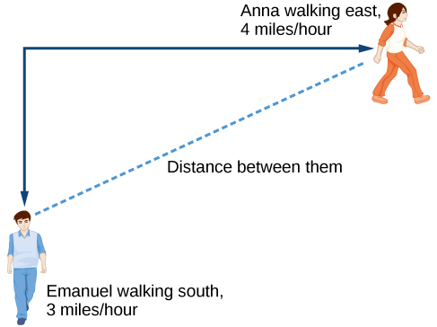
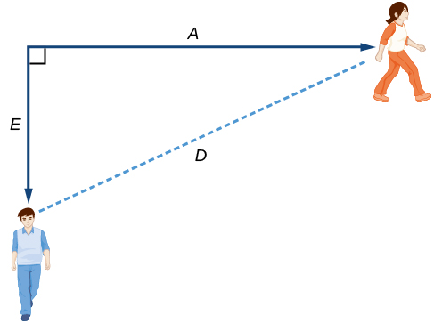
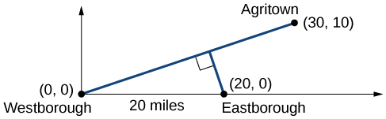
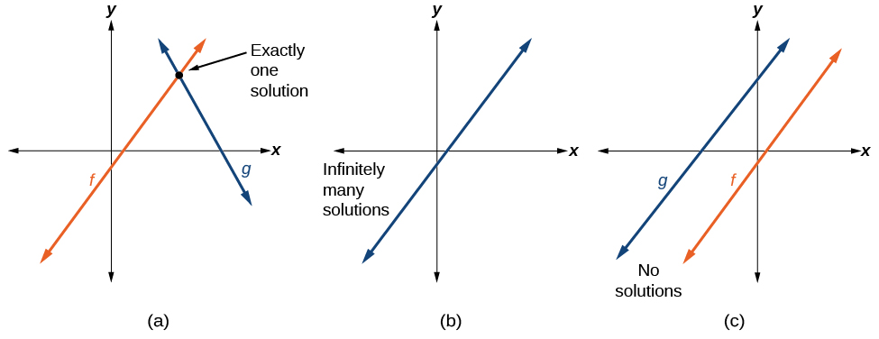
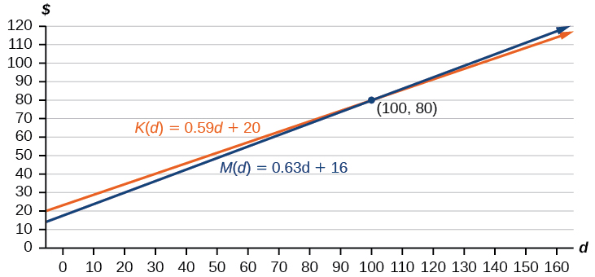
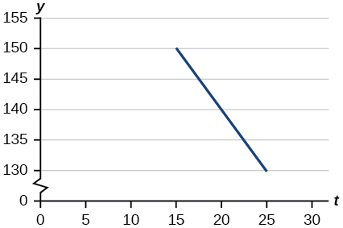
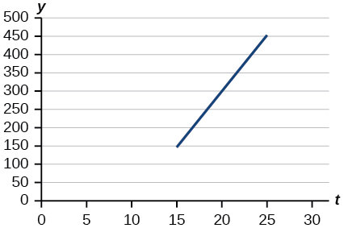

In this section, you will:
* Identify steps for modeling and solving.
* Build linear models from verbal descriptions.
* Build systems of linear models.

 "){: #CNX_Precalc_Figure_02_03_001}

Emily is a college student who plans to spend a summer in Seattle. She has saved $3,500 for her trip and anticipates spending $400 each week on rent, food, and activities. How can we write a linear model to represent her situation? What would be the *x*-intercept, and what can she learn from it? To answer these and related questions, we can create a model using a linear function. Models such as this one can be extremely useful for analyzing relationships and making predictions based on those relationships. In this section, we will explore examples of **linear function**{: data-type="term" .no-emphasis} models.

# Identifying Steps to Model and Solve Problems

When **modeling**{: data-type="term" .no-emphasis} scenarios with linear functions and solving problems involving quantities with a **constant rate of change**{: data-type="term" .no-emphasis}, we typically follow the same problem strategies that we would use for any type of function. Let’s briefly review them:

1.  Identify changing quantities, and then define descriptive variables to represent those quantities. When appropriate, sketch a picture or define a coordinate system.
2.  Carefully read the problem to identify important information. Look for information that provides values for the variables or values for parts of the functional model, such as slope and initial value.
3.  Carefully read the problem to determine what we are trying to find, identify, solve, or interpret.
4.  Identify a solution pathway from the provided information to what we are trying to find. Often this will involve checking and tracking units, building a table, or even finding a formula for the function being used to model the problem.
5.  When needed, write a formula for the function.
6.  Solve or evaluate the function using the formula.
7.  Reflect on whether your answer is reasonable for the given situation and whether it makes sense mathematically.
8.  Clearly convey your result using appropriate units, and answer in full sentences when necessary.
{: data-number-style="arabic"}

# Building Linear Models

Now let’s take a look at the student in Seattle. In her situation, there are two changing quantities: time and money. The amount of money she has remaining while on vacation depends on how long she stays. We can use this information to define our variables, including units.

* Output:
  <math xmlns="http://www.w3.org/1998/Math/MathML"> <mrow> <mtext> </mtext><mi>M</mi><mo>,</mo><mtext> </mtext> </mrow> </math>
  
  money remaining, in dollars
* Input:
  <math xmlns="http://www.w3.org/1998/Math/MathML"> <mrow> <mtext> </mtext><mi>t</mi><mo>,</mo><mtext> </mtext> </mrow> </math>
  
  time, in weeks
{: data-bullet-style="none"}

So, the amount of money remaining depends on the number of weeks:<math xmlns="http://www.w3.org/1998/Math/MathML"> <mrow> <mtext> </mtext><mi>M</mi><mo stretchy="false">(</mo><mi>t</mi><mo stretchy="false">)</mo> </mrow> </math>

We can also identify the initial value and the rate of change.

* Initial Value: She saved $3,500, so $3,500 is the initial value for
  <math xmlns="http://www.w3.org/1998/Math/MathML"> <mrow> <mtext> </mtext><mi>M</mi><mo>.</mo><mtext> </mtext> </mrow> </math>

* Rate of Change: She anticipates spending $400 each week, so –$400 per week is the rate of change, or slope.
{: data-bullet-style="none"}

Notice that the unit of dollars per week matches the unit of our output variable divided by our input variable. Also, because the slope is negative, the linear function is decreasing. This should make sense because she is spending money each week.

The **rate of change**{: data-type="term" .no-emphasis} is constant, so we can start with the **linear model**{: data-type="term" .no-emphasis}<math xmlns="http://www.w3.org/1998/Math/MathML"> <mrow> <mtext> </mtext><mi>M</mi><mrow><mo>(</mo> <mi>t</mi> <mo>)</mo></mrow><mo>=</mo><mi>m</mi><mi>t</mi><mo>+</mo><mi>b</mi><mo>.</mo><mtext> </mtext> </mrow> </math>

Then we can substitute the intercept and slope provided.

    To find the<math xmlns="http://www.w3.org/1998/Math/MathML"> <mrow> <mtext> </mtext><mi>x</mi><mtext>-</mtext> </mrow> </math>

intercept, we set the output to zero, and solve for the input.

<math xmlns="http://www.w3.org/1998/Math/MathML" display="block"> <mrow> <mtable columnalign="left"> <mtr columnalign="left"> <mtd columnalign="left"> <mrow> <mn>0</mn><mo>=</mo><mo>−</mo><mn>400</mn><mi>t</mi><mo>+</mo><mn>3500</mn> </mrow> </mtd> </mtr> <mtr columnalign="left"> <mtd columnalign="left"> <mrow> <mtext> </mtext><mi>t</mi><mo>=</mo><mfrac> <mrow> <mn>3500</mn> </mrow> <mrow> <mn>400</mn> </mrow> </mfrac> </mrow> </mtd> </mtr> <mtr columnalign="left"> <mtd columnalign="left"> <mrow> <mtext> </mtext><mtext> </mtext><mtext> </mtext><mo>=</mo><mn>8.75</mn> </mrow> </mtd> </mtr> </mtable> </mrow> </math>

The<math xmlns="http://www.w3.org/1998/Math/MathML"> <mrow> <mtext> </mtext><mi>x</mi><mtext>-</mtext> </mrow> </math>

intercept is 8.75 weeks. Because this represents the input value when the output will be zero, we could say that Emily will have no money left after 8.75 weeks.

When modeling any real-life scenario with functions, there is typically a limited domain over which that model will be valid—almost no trend continues indefinitely. Here the domain refers to the number of weeks. In this case, it doesn’t make sense to talk about input values less than zero. A negative input value could refer to a number of weeks before she saved $3,500, but the scenario discussed poses the question once she saved $3,500 because this is when her trip and subsequent spending starts. It is also likely that this model is not valid after the<math xmlns="http://www.w3.org/1998/Math/MathML"> <mrow> <mtext> </mtext><mi>x</mi><mtext>-</mtext> </mrow> </math>

intercept, unless Emily will use a credit card and goes into debt. The domain represents the set of input values, so the reasonable domain for this function is<math xmlns="http://www.w3.org/1998/Math/MathML"> <mrow> <mtext> </mtext><mn>0</mn><mo>≤</mo><mi>t</mi><mo>≤</mo><mn>8.75.</mn> </mrow> </math>

In the above example, we were given a written description of the situation. We followed the steps of modeling a problem to analyze the information. However, the information provided may not always be the same. Sometimes we might be provided with an intercept. Other times we might be provided with an output value. We must be careful to analyze the information we are given, and use it appropriately to build a linear model.

## Using a Given Intercept to Build a Model

Some real-world problems provide the <math xmlns="http://www.w3.org/1998/Math/MathML"> <mrow> <mi>y</mi><mtext>-</mtext> </mrow> </math>

intercept, which is the constant or initial value. Once the <math xmlns="http://www.w3.org/1998/Math/MathML"> <mrow> <mi>y</mi><mtext>-</mtext> </mrow> </math>

intercept is known, the <math xmlns="http://www.w3.org/1998/Math/MathML"> <mrow> <mi>x</mi><mtext>-</mtext> </mrow> </math>

intercept can be calculated. Suppose, for example, that Hannah plans to pay off a no-interest loan from her parents. Her loan balance is $1,000. She plans to pay $250 per month until her balance is $0. The <math xmlns="http://www.w3.org/1998/Math/MathML"> <mrow> <mi>y</mi><mtext>-</mtext> </mrow> </math>

intercept is the initial amount of her debt, or $1,000. The rate of change, or slope, is -$250 per month. We can then use the slope-intercept form and the given information to develop a linear model.

<math xmlns="http://www.w3.org/1998/Math/MathML"> <mrow> <mtable columnalign="left"> <mtr columnalign="left"> <mtd columnalign="left"> <mrow> <mi>f</mi><mo stretchy="false">(</mo><mi>x</mi><mo stretchy="false">)</mo><mo>=</mo><mi>m</mi><mi>x</mi><mo>+</mo><mi>b</mi> </mrow> </mtd> </mtr> <mtr columnalign="left"> <mtd columnalign="left"> <mrow> <mtext> </mtext><mtext> </mtext><mtext> </mtext><mtext> </mtext><mtext> </mtext><mtext> </mtext><mtext> </mtext><mtext> </mtext><mtext> </mtext><mtext> </mtext><mtext> </mtext><mo>=</mo><mo>−</mo><mn>250</mn><mi>x</mi><mo>+</mo><mn>1000</mn> </mrow> </mtd> </mtr> </mtable> </mrow> </math>

Now we can set the function equal to 0, and solve for <math xmlns="http://www.w3.org/1998/Math/MathML"> <mrow> <mi>x</mi></mrow> </math>

 to find the <math xmlns="http://www.w3.org/1998/Math/MathML"> <mrow> <mi>x</mi><mtext>-</mtext> </mrow> </math>

intercept.

<math xmlns="http://www.w3.org/1998/Math/MathML" display="block"> <mrow> <mtable columnalign="left"> <mtr columnalign="left"> <mtd columnalign="left"> <mrow> <mtext> </mtext><mtext> </mtext><mtext> </mtext><mtext> </mtext><mtext> </mtext><mtext> </mtext><mtext> </mtext><mtext> </mtext><mtext> </mtext><mn>0</mn><mo>=</mo><mo>−</mo><mn>250</mn><mi>x</mi><mo>+</mo><mn>1000</mn> </mrow> </mtd> </mtr> <mtr columnalign="left"> <mtd columnalign="left"> <mrow> <mn>1000</mn><mo>=</mo><mn>250</mn><mi>x</mi> </mrow> </mtd> </mtr> <mtr columnalign="left"> <mtd columnalign="left"> <mrow> <mtext> </mtext><mtext> </mtext><mtext> </mtext><mtext> </mtext><mtext> </mtext><mtext> </mtext><mtext> </mtext><mtext> </mtext><mtext> </mtext><mn>4</mn><mo>=</mo><mi>x</mi> </mrow> </mtd> </mtr> <mtr columnalign="left"> <mtd columnalign="left"> <mrow> <mtext> </mtext><mtext> </mtext><mtext> </mtext><mtext> </mtext><mtext> </mtext><mtext> </mtext><mtext> </mtext><mtext> </mtext><mtext> </mtext><mi>x</mi><mo>=</mo><mn>4</mn> </mrow> </mtd> </mtr> </mtable> </mrow> </math>

The<math xmlns="http://www.w3.org/1998/Math/MathML"> <mrow> <mtext> </mtext><mi>x</mi><mtext>-</mtext> </mrow> </math>

intercept is the number of months it takes her to reach a balance of $0. The<math xmlns="http://www.w3.org/1998/Math/MathML"> <mrow> <mtext> </mtext><mi>x</mi><mtext>-</mtext> </mrow> </math>

intercept is 4 months, so it will take Hannah four months to pay off her loan.

##  Using a Given Input and Output to Build a Model

Many real-world applications are not as direct as the ones we just considered. Instead they require us to identify some aspect of a linear function. We might sometimes instead be asked to evaluate the linear model at a given input or set the equation of the linear model equal to a specified output.

**Given a word problem that includes two pairs of input and output values, use the linear function to solve a problem.**

1.  Identify the input and output values.
2.  Convert the data to two coordinate pairs.
3.  Find the slope.
4.  Write the linear model.
5.  Use the model to make a prediction by evaluating the function at a given
    <math xmlns="http://www.w3.org/1998/Math/MathML"> <mrow> <mi>x</mi><mtext>-</mtext> </mrow> </math>
    
    value.
6.  Use the model to identify an
    <math xmlns="http://www.w3.org/1998/Math/MathML"> <mrow> <mi>x</mi><mtext>-</mtext> </mrow> </math>
    
    value that results in a given
    <math xmlns="http://www.w3.org/1998/Math/MathML"> <mrow> <mi>y</mi><mtext>-</mtext> </mrow> </math>
    
    value.
7.  Answer the question posed.
{: data-number-style="arabic"}

Using a Linear Model to Investigate a Town’s Population

A town’s population has been growing linearly. In 2004 the population was 6,200. By 2009 the population had grown to 8,100. Assume this trend continues.

1.  Predict the population in 2013.
2.  Identify the year in which the population will reach 15,000.
{: data-number-style="lower-alpha"}

The two changing quantities are the population size and time. While we could use the actual year value as the input quantity, doing so tends to lead to very cumbersome equations because the<math xmlns="http://www.w3.org/1998/Math/MathML"> <mrow> <mtext> </mtext><mi>y</mi><mtext>-</mtext> </mrow> </math>

intercept would correspond to the year 0, more than 2000 years ago!

To make computation a little nicer, we will define our input as the number of years since 2004:

* Input:
  <math xmlns="http://www.w3.org/1998/Math/MathML"> <mrow> <mi>t</mi><mo>,</mo> </mrow> </math>
  
  years since 2004
* Output:
  <math xmlns="http://www.w3.org/1998/Math/MathML"> <mrow> <mi>P</mi><mo stretchy="false">(</mo><mi>t</mi><mo stretchy="false">)</mo><mo>,</mo></mrow> </math>
  
  the town’s population
{: data-display="block"}

To predict the population in 2013 <math xmlns="http://www.w3.org/1998/Math/MathML"> <mrow> <mo stretchy="false">(</mo><mi>t</mi><mo>=</mo><mn>9</mn><mo stretchy="false">),</mo></mrow></math>

 we would first need an equation for the population. Likewise, to find when the population would reach 15,000, we would need to solve for the input that would provide an output of 15,000. To write an equation, we need the initial value and the rate of change, or slope.

To determine the rate of change, we will use the change in output per change in input.

<math xmlns="http://www.w3.org/1998/Math/MathML"> <mrow> <mi>m</mi><mo>=</mo><mfrac> <mrow> <mtext>change in output</mtext> </mrow> <mrow> <mtext>change in input</mtext> </mrow> </mfrac> </mrow> </math>

The problem gives us two input-output pairs. Converting them to match our defined variables, the year 2004 would correspond to <math xmlns="http://www.w3.org/1998/Math/MathML"> <mrow> <mi>t</mi><mo>=</mo><mn>0</mn><mo>,</mo> </mrow> </math>

 giving the point <math xmlns="http://www.w3.org/1998/Math/MathML"> <mrow> <mrow><mo>(</mo> <mrow> <mn>0</mn><mo>,</mo><mtext>6200</mtext> </mrow> <mo>)</mo></mrow><mo>.</mo> </mrow> </math>

 Notice that through our clever choice of variable definition, we have “given” ourselves the *y*-intercept of the function. The year 2009 would correspond to <math xmlns="http://www.w3.org/1998/Math/MathML"> <mrow> <mi>t</mi><mo>=</mo><mtext>5,</mtext> </mrow> </math>

 giving the point <math xmlns="http://www.w3.org/1998/Math/MathML"> <mrow> <mrow><mo>(</mo> <mrow> <mn>5</mn><mo>,</mo><mtext>8100</mtext> </mrow> <mo>)</mo></mrow><mo>.</mo> </mrow> </math>

The two coordinate pairs are<math xmlns="http://www.w3.org/1998/Math/MathML"> <mrow> <mtext> </mtext><mrow><mo>(</mo> <mrow> <mn>0</mn><mo>,</mo><mtext>6200</mtext> </mrow> <mo>)</mo></mrow><mtext> </mtext> </mrow> </math>

and<math xmlns="http://www.w3.org/1998/Math/MathML"> <mrow> <mtext> </mtext><mrow><mo>(</mo> <mrow> <mn>5</mn><mo>,</mo><mtext>8100</mtext> </mrow> <mo>)</mo></mrow><mo>.</mo> </mrow> </math>

 Recall that we encountered examples in which we were provided two points earlier in the chapter. We can use these values to calculate the slope.

<math xmlns="http://www.w3.org/1998/Math/MathML"> <mrow> <mtable columnalign="left"> <mtr columnalign="left"> <mtd columnalign="left"> <mtable columnalign="left"> <mtr> <mtd> <mrow /> </mtd> </mtr> <mtr> <mtd> <mi>m</mi><mo>=</mo><mfrac> <mrow> <mn>8100</mn><mo>−</mo><mn>6200</mn> </mrow> <mrow> <mn>5</mn><mo>−</mo><mn>0</mn> </mrow> </mfrac> </mtd> </mtr> </mtable> </mtd> </mtr> <mtr columnalign="left"> <mtd columnalign="left"> <mrow> <mtext>   </mtext><mo>=</mo><mfrac> <mrow> <mn>1900</mn> </mrow> <mn>5</mn> </mfrac> </mrow> </mtd> </mtr> <mtr columnalign="left"> <mtd columnalign="left"> <mrow> <mtext>   </mtext><mo>=</mo><mn>380</mn><mtext> people per year</mtext> </mrow> </mtd> </mtr> </mtable> </mrow> </math>

We already know the *y*-intercept of the line, so we can immediately write the equation:

<math xmlns="http://www.w3.org/1998/Math/MathML"> <mrow> <mi>P</mi><mo stretchy="false">(</mo><mi>t</mi><mo stretchy="false">)</mo><mo>=</mo><mn>380</mn><mi>t</mi><mo>+</mo><mn>6200</mn> </mrow> </math>

To predict the population in 2013, we evaluate our function at <math xmlns="http://www.w3.org/1998/Math/MathML"> <mrow> <mi>t</mi><mo>=</mo><mn>9.</mn> </mrow> </math>

<math xmlns="http://www.w3.org/1998/Math/MathML" display="block"> <mrow> <mtable columnalign="left"> <mtr columnalign="left"> <mtd columnalign="left"> <mrow> <mi>P</mi><mo stretchy="false">(</mo><mn>9</mn><mo stretchy="false">)</mo><mo>=</mo><mn>380</mn><mo stretchy="false">(</mo><mn>9</mn><mo stretchy="false">)</mo><mo>+</mo><mn>6</mn><mo>,</mo><mn>200</mn> </mrow> </mtd> </mtr> <mtr columnalign="left"> <mtd columnalign="left"> <mrow> <mtext>      </mtext><mo>=</mo><mn>9</mn><mo>,</mo><mn>620</mn> </mrow> </mtd> </mtr> </mtable> </mrow> </math>

If the trend continues, our model predicts a population of 9,620 in 2013.

To find when the population will reach 15,000, we can set <math xmlns="http://www.w3.org/1998/Math/MathML"> <mrow> <mi>P</mi><mo stretchy="false">(</mo><mi>t</mi><mo stretchy="false">)</mo><mo>=</mo><mn>15000</mn><mtext> </mtext> </mrow> </math>

and solve for <math xmlns="http://www.w3.org/1998/Math/MathML"> <mrow> <mi>t</mi><mo>.</mo> </mrow> </math>

<math xmlns="http://www.w3.org/1998/Math/MathML"> <mrow> <mtable columnalign="left"> <mtr columnalign="left"> <mtd columnalign="left"> <mrow> <mn>15000</mn><mo>=</mo><mn>380</mn><mi>t</mi><mo>+</mo><mn>6200</mn> </mrow> </mtd> </mtr> <mtr columnalign="left"> <mtd columnalign="left"> <mrow> <mtext>  </mtext><mn>8800</mn><mo>=</mo><mn>380</mn><mi>t</mi> </mrow> </mtd> </mtr> <mtr columnalign="left"> <mtd columnalign="left"> <mrow> <mtext>         </mtext><mi>t</mi><mo>≈</mo><mn>23.158</mn> </mrow> </mtd> </mtr> </mtable> </mrow> </math>

Our model predicts the population will reach 15,000 in a little more than 23 years after 2004, or somewhere around the year 2027.

A company sells doughnuts. They incur a fixed cost of $25,000 for rent, insurance, and other expenses. It costs $0.25 to produce each doughnut.

1.  Write a linear model to represent the cost
    <math xmlns="http://www.w3.org/1998/Math/MathML"> <mrow> <mi>C</mi><mtext> </mtext> </mrow> </math>
    
    of the company as a function of
    <math xmlns="http://www.w3.org/1998/Math/MathML"> <mrow> <mtext> </mtext><mi>x</mi><mo>,</mo><mtext> </mtext> </mrow> </math>
    
    the number of doughnuts produced.
2.  Find and interpret the *y*-intercept.
{: data-number-style="lower-alpha"}

 <math xmlns="http://www.w3.org/1998/Math/MathML"> <mrow> <mtext> </mtext><mi>C</mi><mrow><mo>(</mo> <mi>x</mi> <mo>)</mo></mrow><mo>=</mo><mn>0.25</mn><mi>x</mi><mo>+</mo><mn>25</mn><mo>,</mo><mn>000</mn> </mrow> </math>
 The *y*-intercept is <math xmlns="http://www.w3.org/1998/Math/MathML"> <mrow> <mrow><mo>(</mo> <mrow> <mn>0</mn><mo>,</mo><mn>25</mn><mo>,</mo><mn>000</mn> </mrow> <mo>)</mo></mrow><mo>.</mo> </mrow> </math>
 If the company does not produce a single doughnut, they still incur a cost of $25,000. 

A city’s population has been growing linearly. In 2008, the population was 28,200. By 2012, the population was 36,800. Assume this trend continues.

1.  Predict the population in 2014.
2.  Identify the year in which the population will reach 54,000.
{: data-number-style="lower-alpha"}

 41,100 2020 

## Using a Diagram to Model a Problem

It is useful for many real-world applications to draw a picture to gain a sense of how the variables representing the input and output may be used to answer a question. To draw the picture, first consider what the problem is asking for. Then, determine the input and the output. The diagram should relate the variables. Often, geometrical shapes or figures are drawn. Distances are often traced out. If a right triangle is sketched, the Pythagorean Theorem relates the sides. If a rectangle is sketched, labeling width and height is helpful.

Using a Diagram to Model Distance Walked

Anna and Emanuel start at the same intersection. Anna walks east at 4 miles per hour while Emanuel walks south at 3 miles per hour. They are communicating with a two-way radio that has a range of 2 miles. How long after they start walking will they fall out of radio contact?

In essence, we can partially answer this question by saying they will fall out of radio contact when they are 2 miles apart, which leads us to ask a new question:                                                              “How long will it take them to be 2 miles apart?”
{: #eip-id1165135238434}

In this problem, our changing quantities are time and position, but ultimately we need to know how long will it take for them to be 2 miles apart. We can see that time will be our input variable, so we’ll define our input and output variables.

* Input:
  <math xmlns="http://www.w3.org/1998/Math/MathML"> <mrow> <mtext> </mtext><mi>t</mi><mo>,</mo><mtext> </mtext> </mrow> </math>
  
  time in hours.
* Output:
  <math xmlns="http://www.w3.org/1998/Math/MathML"> <mrow> <mtext> </mtext><mi>A</mi><mo stretchy="false">(</mo><mi>t</mi><mo stretchy="false">)</mo><mo>,</mo><mtext> </mtext> </mrow> </math>
  
  distance in miles, and
  <math xmlns="http://www.w3.org/1998/Math/MathML"> <mrow> <mtext> </mtext><mi>E</mi><mo stretchy="false">(</mo><mi>t</mi><mo stretchy="false">)</mo><mo>,</mo><mtext> </mtext> </mrow> </math>
  
  distance in miles
{: data-display="block" data-bullet-style="none"}

Because it is not obvious how to define our output variable, we’ll start by drawing a picture such as [[link]](#CNX_Precalc_Figure_02_03_003).

{: #CNX_Precalc_Figure_02_03_003}

Initial Value: They both start at the same intersection so when <math xmlns="http://www.w3.org/1998/Math/MathML"><mrow><mi>t</mi><mo>=</mo><mn>0</mn><mo>,</mo></mrow></math>

 the distance traveled by each person should also be 0. Thus the initial value for each is 0.

Rate of Change: Anna is walking 4 miles per hour and Emanuel is walking 3 miles per hour, which are both rates of change. The slope for <math xmlns="http://www.w3.org/1998/Math/MathML"><mi>A</mi></math>

 is 4 and the slope for <math xmlns="http://www.w3.org/1998/Math/MathML"><mi>E</mi></math>

 is 3.

Using those values, we can write formulas for the distance each person has walked.

<math xmlns="http://www.w3.org/1998/Math/MathML" display="block"><mtable columnalign="left"><mtr><mtd><mi>A</mi><mo stretchy="false">(</mo><mi>t</mi><mo stretchy="false">)</mo><mo>=</mo><mn>4</mn><mi>t</mi></mtd></mtr><mtr><mtd><mi>E</mi><mo stretchy="false">(</mo><mi>t</mi><mo stretchy="false">)</mo><mo>=</mo><mn>3</mn><mi>t</mi></mtd></mtr></mtable></math>

For this problem, the distances from the starting point are important. To notate these, we can define a coordinate system, identifying the “starting point” at the intersection where they both started. Then we can use the variable, <math xmlns="http://www.w3.org/1998/Math/MathML"> <mrow> <mi>A</mi><mo>,</mo> </mrow> </math>

 which we introduced above, to represent Anna’s position, and define it to be a measurement from the starting point in the eastward direction. Likewise, can use the variable, <math xmlns="http://www.w3.org/1998/Math/MathML"> <mrow> <mi>E</mi><mo>,</mo> </mrow> </math>

 to represent Emanuel’s position, measured from the starting point in the southward direction. Note that in defining the coordinate system, we specified both the starting point of the measurement and the direction of measure.

We can then define a third variable, <math xmlns="http://www.w3.org/1998/Math/MathML"> <mrow> <mi>D</mi><mo>,</mo> </mrow> </math>

 to be the measurement of the distance between Anna and Emanuel. Showing the variables on the diagram is often helpful, as we can see from [[link]](#CNX_Precalc_Figure_02_03_004).

Recall that we need to know how long it takes for<math xmlns="http://www.w3.org/1998/Math/MathML"> <mrow> <mtext> </mtext><mi>D</mi><mo>,</mo><mtext> </mtext> </mrow> </math>

the distance between them, to equal 2 miles. Notice that for any given input<math xmlns="http://www.w3.org/1998/Math/MathML"> <mrow> <mtext> </mtext><mi>t</mi><mo>,</mo><mtext> </mtext> </mrow> </math>

the outputs<math xmlns="http://www.w3.org/1998/Math/MathML"> <mrow> <mtext> </mtext><mi>A</mi><mrow><mo>(</mo> <mi>t</mi> <mo>)</mo></mrow><mo>,</mo><mi>E</mi><mrow><mo>(</mo> <mi>t</mi> <mo>)</mo></mrow><mo>,</mo><mtext> </mtext> </mrow> </math>

and<math xmlns="http://www.w3.org/1998/Math/MathML"> <mrow> <mtext> </mtext><mi>D</mi><mrow><mo>(</mo> <mi>t</mi> <mo>)</mo></mrow><mtext> </mtext> </mrow> </math>

represent distances.

{: #CNX_Precalc_Figure_02_03_004}

[[link]](#CNX_Precalc_Figure_02_03_003) shows us that we can use the Pythagorean Theorem because we have drawn a right angle.

Using the Pythagorean Theorem, we get:* * *
{: data-type="newline" data-count="1"}

<math xmlns="http://www.w3.org/1998/Math/MathML" display="block"> <mrow> <mtable columnalign="left"> <mtr columnalign="left"> <mtd columnalign="left"> <mrow> <mi>D</mi><msup> <mrow> <mo stretchy="false">(</mo><mi>t</mi><mo stretchy="false">)</mo> </mrow> <mn>2</mn> </msup> <mo>=</mo><mi>A</mi><msup> <mrow> <mo stretchy="false">(</mo><mi>t</mi><mo stretchy="false">)</mo> </mrow> <mn>2</mn> </msup> <mo>+</mo><mi>E</mi><msup> <mrow> <mo stretchy="false">(</mo><mi>t</mi><mo stretchy="false">)</mo> </mrow> <mn>2</mn> </msup> </mrow> </mtd> <mtd columnalign="left"> <mrow /> </mtd> </mtr> <mtr columnalign="left"> <mtd columnalign="left"> <mrow> <mtext> </mtext><mtext> </mtext><mtext> </mtext><mtext> </mtext><mtext> </mtext><mtext> </mtext><mtext> </mtext><mtext> </mtext><mtext> </mtext><mtext> </mtext><mtext> </mtext><mtext> </mtext><mtext> </mtext><mtext> </mtext><mtext> </mtext><mo>=</mo><msup> <mrow> <mo stretchy="false">(</mo><mn>4</mn><mi>t</mi><mo stretchy="false">)</mo> </mrow> <mn>2</mn> </msup> <mo>+</mo><msup> <mrow> <mo stretchy="false">(</mo><mn>3</mn><mi>t</mi><mo stretchy="false">)</mo> </mrow> <mn>2</mn> </msup> </mrow> </mtd> <mtd columnalign="left"> <mrow /> </mtd> </mtr> <mtr columnalign="left"> <mtd columnalign="left"> <mrow> <mtext> </mtext><mtext> </mtext><mtext> </mtext><mtext> </mtext><mtext> </mtext><mtext> </mtext><mtext> </mtext><mtext> </mtext><mtext> </mtext><mtext> </mtext><mtext> </mtext><mtext> </mtext><mtext> </mtext><mtext> </mtext><mtext> </mtext><mo>=</mo><mn>16</mn><msup> <mi>t</mi> <mn>2</mn> </msup> <mo>+</mo><mn>9</mn><msup> <mi>t</mi> <mn>2</mn> </msup> </mrow> </mtd> <mtd columnalign="left"> <mrow /> </mtd> </mtr> <mtr columnalign="left"> <mtd columnalign="left"> <mrow> <mtext> </mtext><mtext> </mtext><mtext> </mtext><mtext> </mtext><mtext> </mtext><mtext> </mtext><mtext> </mtext><mtext> </mtext><mtext> </mtext><mtext> </mtext><mtext> </mtext><mtext> </mtext><mtext> </mtext><mtext> </mtext><mtext> </mtext><mo>=</mo><mn>25</mn><msup> <mi>t</mi> <mn>2</mn> </msup> </mrow> </mtd> <mtd columnalign="left"> <mrow /> </mtd> </mtr> <mtr columnalign="left"> <mtd columnalign="left"> <mrow> <mtext> </mtext><mtext> </mtext><mtext> </mtext><mtext> </mtext><mi>D</mi><mo stretchy="false">(</mo><mi>t</mi><mo stretchy="false">)</mo><mo>=</mo><mo>±</mo><msqrt> <mrow> <mn>25</mn><msup> <mi>t</mi> <mn>2</mn> </msup> </mrow> </msqrt> </mrow> </mtd> <mtd columnalign="left"> <mrow> <mtext>Solve for </mtext><mi>D</mi><mo stretchy="false">(</mo><mi>t</mi><mo stretchy="false">)</mo><mtext> using the square root</mtext> </mrow> </mtd> </mtr> <mtr columnalign="left"> <mtd columnalign="left"> <mrow> <mtext> </mtext><mtext> </mtext><mtext> </mtext><mtext> </mtext><mtext> </mtext><mtext> </mtext><mtext> </mtext><mtext> </mtext><mtext> </mtext><mtext> </mtext><mtext> </mtext><mtext> </mtext><mtext> </mtext><mtext> </mtext><mtext> </mtext><mo>=</mo><mo>±</mo><mn>5</mn><mo>\|</mo><mi>t</mi><mo>\|</mo> </mrow> </mtd> <mtd columnalign="left"> <mrow /> </mtd> </mtr> </mtable> </mrow> </math>

In this scenario we are considering only positive values of<math xmlns="http://www.w3.org/1998/Math/MathML"> <mrow> <mtext> </mtext><mi>t</mi><mo>,</mo><mtext> </mtext> </mrow> </math>

so our distance<math xmlns="http://www.w3.org/1998/Math/MathML"> <mrow> <mtext> </mtext><mi>D</mi><mrow><mo>(</mo> <mi>t</mi> <mo>)</mo></mrow><mtext> </mtext> </mrow> </math>

will always be positive. We can simplify this answer to<math xmlns="http://www.w3.org/1998/Math/MathML"> <mrow> <mtext> </mtext><mi>D</mi><mo stretchy="false">(</mo><mi>t</mi><mo stretchy="false">)</mo><mo>=</mo><mn>5</mn><mi>t</mi><mo>.</mo><mtext> </mtext> </mrow> </math>

This means that the distance between Anna and Emanuel is also a linear function. Because <math xmlns="http://www.w3.org/1998/Math/MathML"> <mrow> <mi>D</mi> </mrow> </math>

 is a linear function, we can now answer the question of when the distance between them will reach 2 miles. We will set the output <math xmlns="http://www.w3.org/1998/Math/MathML"> <mrow> <mi>D</mi><mo stretchy="false">(</mo><mi>t</mi><mo stretchy="false">)</mo><mo>=</mo><mn>2</mn><mtext> </mtext> </mrow> </math>

and solve for <math xmlns="http://www.w3.org/1998/Math/MathML"> <mrow> <mi>t</mi><mo>.</mo> </mrow> </math>

<math xmlns="http://www.w3.org/1998/Math/MathML" display="block"> <mrow> <mtable columnalign="left"> <mtr columnalign="left"> <mtd columnalign="left"> <mrow> <mi>D</mi><mo stretchy="false">(</mo><mi>t</mi><mo stretchy="false">)</mo><mo>=</mo><mn>2</mn> </mrow> </mtd> </mtr> <mtr columnalign="left"> <mtd columnalign="left"> <mrow> <mtext>    </mtext><mn>5</mn><mi>t</mi><mo>=</mo><mn>2</mn> </mrow> </mtd> </mtr> <mtr columnalign="left"> <mtd columnalign="left"> <mrow> <mtext>      </mtext><mi>t</mi><mo>=</mo><mfrac> <mn>2</mn> <mn>5</mn> </mfrac> <mo>=</mo><mn>0.4</mn> </mrow> </mtd> </mtr> </mtable> </mrow> </math>

They will fall out of radio contact in 0.4 hours, or 24 minutes.

**Should I draw diagrams when given information based on a geometric shape?**

*Yes. Sketch the figure and label the quantities and unknowns on the sketch.*

Using a Diagram to Model Distance between Cities

There is a straight road leading from the town of Westborough to Agritown 30 miles east and 10 miles north. Partway down this road, it junctions with a second road, perpendicular to the first, leading to the town of Eastborough. If the town of Eastborough is located 20 miles directly east of the town of Westborough, how far is the road junction from Westborough?

It might help here to draw a picture of the situation. See [[link]](#CNX_Precalc_Figure_02_03_005). It would then be helpful to introduce a coordinate system. While we could place the origin anywhere, placing it at Westborough seems convenient. This puts Agritown at coordinates <math xmlns="http://www.w3.org/1998/Math/MathML"> <mrow> <mrow><mo>(</mo> <mrow> <mtext>3</mtext><mn>0</mn><mo>,</mo><mtext> 1</mtext><mn>0</mn> </mrow> <mo>)</mo></mrow><mo>,</mo><mtext> </mtext> </mrow> </math>

and Eastborough at<math xmlns="http://www.w3.org/1998/Math/MathML"> <mrow> <mtext> </mtext><mrow><mo>(</mo> <mrow> <mtext>2</mtext><mn>0</mn><mo>,</mo><mn>0</mn> </mrow> <mo>)</mo></mrow><mo>.</mo> </mrow> </math>

{: #CNX_Precalc_Figure_02_03_005}

Using this point along with the origin, we can find the slope of the line from Westborough to Agritown:

<math xmlns="http://www.w3.org/1998/Math/MathML" display="block"> <mrow> <mi>m</mi><mo>=</mo><mfrac> <mrow> <mn>10</mn><mo>−</mo><mn>0</mn> </mrow> <mrow> <mn>30</mn><mo>−</mo><mn>0</mn> </mrow> </mfrac> <mo>=</mo><mfrac> <mn>1</mn> <mn>3</mn> </mfrac> </mrow> </math>

The equation of the road from Westborough to Agritown would be

<math xmlns="http://www.w3.org/1998/Math/MathML" display="block"> <mrow> <mi>W</mi><mo stretchy="false">(</mo><mi>x</mi><mo stretchy="false">)</mo><mo>=</mo><mfrac> <mn>1</mn> <mn>3</mn> </mfrac> <mi>x</mi> </mrow> </math>

From this, we can determine the perpendicular road to Eastborough will have slope<math xmlns="http://www.w3.org/1998/Math/MathML"> <mrow> <mtext> </mtext><mi>m</mi><mo>=</mo><mo>–</mo><mn>3.</mn><mtext> </mtext> </mrow> </math>

Because the town of Eastborough is at the point (20, 0), we can find the equation:

<math xmlns="http://www.w3.org/1998/Math/MathML" display="block"> <mrow> <mtable columnalign="left"> <mtr columnalign="left"> <mtd columnalign="left"> <mrow> <mi>E</mi><mo stretchy="false">(</mo><mi>x</mi><mo stretchy="false">)</mo><mo>=</mo><mo>−</mo><mn>3</mn><mi>x</mi><mo>+</mo><mi>b</mi> </mrow> </mtd> <mtd columnalign="left"> <mrow /> </mtd> </mtr> <mtr columnalign="left"> <mtd columnalign="left"> <mrow> <mtext> </mtext><mtext> </mtext><mtext> </mtext><mtext> </mtext><mtext> </mtext><mtext> </mtext><mtext> </mtext><mtext> </mtext><mn>0</mn><mo>=</mo><mo>−</mo><mn>3</mn><mo stretchy="false">(</mo><mn>20</mn><mo stretchy="false">)</mo><mo>+</mo><mi>b</mi> </mrow> </mtd> <mtd columnalign="left"> <mrow> <mtext>Substitute in (20, 0)</mtext> </mrow> </mtd> </mtr> <mtr columnalign="left"> <mtd columnalign="left"> <mrow> <mtext> </mtext><mtext> </mtext><mtext> </mtext><mtext> </mtext><mtext> </mtext><mtext> </mtext><mtext> </mtext><mtext> </mtext><mi>b</mi><mo>=</mo><mn>60</mn> </mrow> </mtd> <mtd columnalign="left"> <mrow /> </mtd> </mtr> <mtr columnalign="left"> <mtd columnalign="left"> <mrow> <mi>E</mi><mo stretchy="false">(</mo><mi>x</mi><mo stretchy="false">)</mo><mo>=</mo><mo>−</mo><mn>3</mn><mi>x</mi><mo>+</mo><mn>60</mn> </mrow> </mtd> <mtd columnalign="left"> <mrow /> </mtd> </mtr> </mtable> </mrow> </math>

We can now find the coordinates of the junction of the roads by finding the intersection of these lines. Setting them equal,

<math xmlns="http://www.w3.org/1998/Math/MathML" display="block"> <mrow> <mtable columnalign="left"> <mtr columnalign="left"> <mtd columnalign="left"> <mrow> <mtext> </mtext><mfrac> <mn>1</mn> <mn>3</mn> </mfrac> <mi>x</mi><mo>=</mo><mo>−</mo><mn>3</mn><mi>x</mi><mo>+</mo><mn>60</mn> </mrow> </mtd> <mtd columnalign="left"> <mrow /> </mtd> </mtr> <mtr columnalign="left"> <mtd columnalign="left"> <mrow> <mfrac> <mrow> <mn>10</mn> </mrow> <mn>3</mn> </mfrac> <mi>x</mi><mo>=</mo><mn>60</mn> </mrow> </mtd> <mtd columnalign="left"> <mrow /> </mtd> </mtr> <mtr columnalign="left"> <mtd columnalign="left"> <mrow> <mn>10</mn><mi>x</mi><mo>=</mo><mn>180</mn> </mrow> </mtd> <mtd columnalign="left"> <mrow /> </mtd> </mtr> <mtr columnalign="left"> <mtd columnalign="left"> <mrow> <mtext>     </mtext><mi>x</mi><mo>=</mo><mn>18</mn> </mrow> </mtd> <mtd columnalign="left"> <mrow> <mtext>Substituting this back into </mtext><mi>W</mi><mo stretchy="false">(</mo><mi>x</mi><mo stretchy="false">)</mo> </mrow> </mtd> </mtr> <mtr columnalign="left"> <mtd columnalign="left"> <mrow> <mtext>     </mtext><mi>y</mi><mo>=</mo><mi>W</mi><mo stretchy="false">(</mo><mn>18</mn><mo stretchy="false">)</mo> </mrow> </mtd> <mtd columnalign="left"> <mrow /> </mtd> </mtr> <mtr columnalign="left"> <mtd columnalign="left"> <mrow> <mtext>     </mtext><mo>=</mo><mfrac> <mn>1</mn> <mn>3</mn> </mfrac> <mo stretchy="false">(</mo><mn>18</mn><mo stretchy="false">)</mo> </mrow> </mtd> <mtd columnalign="left"> <mrow /> </mtd> </mtr> <mtr columnalign="left"> <mtd columnalign="left"> <mrow> <mtext>      </mtext><mo>=</mo><mn>6</mn> </mrow> </mtd> <mtd columnalign="left"> <mrow /> </mtd> </mtr> </mtable> </mrow> </math>

The roads intersect at the point (18, 6). Using the distance formula, we can now find the distance from Westborough to the junction.* * *
{: data-type="newline" data-count="1"}

<math xmlns="http://www.w3.org/1998/Math/MathML" display="block"> <mrow> <mtable columnalign="left"> <mtr columnalign="left"> <mtd columnalign="left"> <mrow> <mtext>distance</mtext><mo>=</mo><msqrt> <mrow> <msup> <mrow> <mo stretchy="false">(</mo><msub> <mi>x</mi> <mn>2</mn> </msub> <mo>−</mo><msub> <mi>x</mi> <mn>1</mn> </msub> <mo stretchy="false">)</mo> </mrow> <mn>2</mn> </msup> <mo>+</mo><msup> <mrow> <mo stretchy="false">(</mo><msub> <mi>y</mi> <mn>2</mn> </msub> <mo>−</mo><msub> <mi>y</mi> <mn>1</mn> </msub> <mo stretchy="false">)</mo> </mrow> <mn>2</mn> </msup> </mrow> </msqrt> </mrow> </mtd> </mtr> <mtr columnalign="left"> <mtd columnalign="left"> <mrow> <mtext>              </mtext><mo>=</mo><msqrt> <mrow> <msup> <mrow> <mo stretchy="false">(</mo><mn>18</mn><mo>−</mo><mn>0</mn><mo stretchy="false">)</mo> </mrow> <mn>2</mn> </msup> <mo>+</mo><msup> <mrow> <mo stretchy="false">(</mo><mn>6</mn><mo>−</mo><mn>0</mn><mo stretchy="false">)</mo> </mrow> <mn>2</mn> </msup> </mrow> </msqrt> </mrow> </mtd> </mtr> <mtr columnalign="left"> <mtd columnalign="left"> <mrow> <mtext> </mtext><mtext>             </mtext><mo>≈</mo><mn>18.974</mn><mtext> miles</mtext> </mrow> </mtd> </mtr> </mtable> </mrow> </math>

Analysis

One nice use of linear models is to take advantage of the fact that the graphs of these functions are lines. This means real-world applications discussing maps need linear functions to model the distances between reference points.

There is a straight road leading from the town of Timpson to Ashburn 60 miles east and 12 miles north. Partway down the road, it junctions with a second road, perpendicular to the first, leading to the town of Garrison. If the town of Garrison is located 22 miles directly east of the town of Timpson, how far is the road junction from Timpson?

21\.15 miles

# Building Systems of Linear Models

Real-world situations including two or more linear functions may be modeled with a **system of linear equations**{: data-type="term" .no-emphasis}. Remember, when solving a system of linear equations, we are looking for points the two lines have in common. Typically, there are three types of answers possible, as shown in [\[link\]](#Figure_02_03_006).

 {: #Figure_02_03_006}

**Given a situation that represents a system of linear equations, write the system of equations and identify the solution.**

1.  Identify the input and output of each linear model.
2.  Identify the slope and *y*-intercept of each linear model.
3.  Find the solution by setting the two linear functions equal to another and solving for
    <math xmlns="http://www.w3.org/1998/Math/MathML"> <mrow> <mi>x</mi><mo>,</mo></mrow> </math>
    
    or find the point of intersection on a graph.
{: data-number-style="arabic"}

Building a System of Linear Models to Choose a Truck Rental Company

Jamal is choosing between two truck-rental companies. The first, Keep on Trucking, Inc., charges an up-front fee of $20, then 59 cents a mile. The second, Move It Your Way, charges an up-front fee of $16, then 63 cents a mile[1](#footnote1){: data-type="footnote-number" name="footnote-ref1"}. When will Keep on Trucking, Inc. be the better choice for Jamal?

The two important quantities in this problem are the cost and the number of miles driven. Because we have two companies to consider, we will define two functions.

<table summary="Three rows and three columns. In the first column, are the years 1950 and 2000. In the second columns are the house values for Indiana, which are 37700 for 1950 and 94300 for 2000. In the third columns are the house values for Alabama, which are 27100 for 1950 and 85100 for 2000."><tbody>
<tr>
<td>Input</td>
<td><math xmlns="http://www.w3.org/1998/Math/MathML">
<mrow>
<mi>d</mi><mo>,</mo></mrow>
</math> distance driven in miles</td>
</tr>
<tr>
<td>Outputs</td>
<td><math xmlns="http://www.w3.org/1998/Math/MathML">
<mrow>
<mi>K</mi><mo stretchy="false">(</mo><mi>d</mi><mo stretchy="false">)</mo><mo>:</mo>
</mrow>
</math> cost, in dollars, for renting from Keep on Trucking

<math xmlns="http://www.w3.org/1998/Math/MathML">
<mrow>
<mi>M</mi><mrow><mo>(</mo>
<mi>d</mi>
<mo>)</mo></mrow>
</mrow>
</math> cost, in dollars, for renting from Move It Your Way</td>
</tr>
<tr>
<td>Initial Value</td>
<td>Up-front fee: <math xmlns="http://www.w3.org/1998/Math/MathML">
<mrow>
<mi>K</mi><mrow><mo>(</mo>
<mn>0</mn>
<mo>)</mo></mrow><mo>=</mo><mtext>2</mtext><mn>0</mn>
</mrow>
</math> and <math xmlns="http://www.w3.org/1998/Math/MathML">
<mrow>
<mi>M</mi><mrow><mo>(</mo>
<mn>0</mn>
<mo>)</mo></mrow><mo>=</mo><mtext>16</mtext><mtext> </mtext>
</mrow>
</math></td>
</tr>
<tr>
<td>Rate of Change</td>
<td><math xmlns="http://www.w3.org/1998/Math/MathML">
 <mrow>
  <mi>K</mi><mo stretchy="false">(</mo><mi>d</mi><mo stretchy="false">)</mo><mo>=</mo><mtext>$</mtext><mn>0.</mn><mtext>59</mtext>
 </mrow>
</math>/mile and<math xmlns="http://www.w3.org/1998/Math/MathML">
 <mrow>
  <mtext> </mtext><mi>P</mi><mo stretchy="false">(</mo><mi>d</mi><mo stretchy="false">)</mo><mo>=</mo><mtext>$</mtext><mn>0.</mn><mtext>63</mtext>
 </mrow>
</math>/mile</td>
</tr>
</tbody></table>
A linear function is of the form<math xmlns="http://www.w3.org/1998/Math/MathML"> <mrow> <mtext> </mtext><mi>f</mi><mo stretchy="false">(</mo><mi>x</mi><mo stretchy="false">)</mo><mo>=</mo><mi>m</mi><mi>x</mi><mo>+</mo><mi>b</mi><mo>.</mo><mtext> </mtext> </mrow> </math>

Using the rates of change and initial charges, we can write the equations

<math xmlns="http://www.w3.org/1998/Math/MathML" display="block"> <mrow> <mtable> <mtr> <mtd> <mrow> <mi>K</mi><mo stretchy="false">(</mo><mi>d</mi><mo stretchy="false">)</mo><mo>=</mo><mn>0.59</mn><mi>d</mi><mo>+</mo><mn>20</mn> </mrow> </mtd> </mtr> <mtr> <mtd> <mrow> <mi>M</mi><mo stretchy="false">(</mo><mi>d</mi><mo stretchy="false">)</mo><mo>=</mo><mn>0.63</mn><mi>d</mi><mo>+</mo><mn>16</mn> </mrow> </mtd> </mtr> </mtable> </mrow> </math>

Using these equations, we can determine when Keep on Trucking, Inc., will be the better choice. Because all we have to make that decision from is the costs, we are looking for when Move It Your Way, will cost less, or when<math xmlns="http://www.w3.org/1998/Math/MathML"> <mrow> <mtext> </mtext><mi>K</mi><mo stretchy="false">(</mo><mi>d</mi><mo stretchy="false">)</mo><mo>&lt;</mo><mi>M</mi><mo stretchy="false">(</mo><mi>d</mi><mo stretchy="false">)</mo><mo>.</mo><mtext> </mtext> </mrow> </math>

The solution pathway will lead us to find the equations for the two functions, find the intersection, and then see where the<math xmlns="http://www.w3.org/1998/Math/MathML"> <mrow> <mtext> </mtext><mi>K</mi><mrow><mo>(</mo> <mi>d</mi> <mo>)</mo></mrow><mtext> </mtext> </mrow> </math>

function is smaller.

These graphs are sketched in [[link]](#CNX_Precalc_Figure_02_03_007), with<math xmlns="http://www.w3.org/1998/Math/MathML"> <mrow> <mtext> </mtext><mi>K</mi><mrow><mo>(</mo> <mi>d</mi> <mo>)</mo></mrow><mtext> </mtext> </mrow> </math>

in blue.

{: #CNX_Precalc_Figure_02_03_007}

To find the intersection, we set the equations equal and solve:

<math xmlns="http://www.w3.org/1998/Math/MathML" display="block"> <mrow> <mtable columnalign="left"> <mtr columnalign="left"> <mtd columnalign="left"> <mrow> <mtext> </mtext><mtext> </mtext><mtext> </mtext><mtext> </mtext><mtext> </mtext><mtext> </mtext><mtext> </mtext><mtext> </mtext><mtext> </mtext><mtext> </mtext><mtext> </mtext><mtext> </mtext><mtext> </mtext><mi>K</mi><mo stretchy="false">(</mo><mi>d</mi><mo stretchy="false">)</mo><mo>=</mo><mi>M</mi><mo stretchy="false">(</mo><mi>d</mi><mo stretchy="false">)</mo> </mrow> </mtd> </mtr> <mtr columnalign="left"> <mtd columnalign="left"> <mrow> <mn>0.59</mn><mi>d</mi><mo>+</mo><mn>20</mn><mo>=</mo><mn>0.63</mn><mi>d</mi><mo>+</mo><mn>16</mn> </mrow> </mtd> </mtr> <mtr columnalign="left"> <mtd columnalign="left"> <mrow> <mtext> </mtext><mtext> </mtext><mtext> </mtext><mtext> </mtext><mtext> </mtext><mtext> </mtext><mtext> </mtext><mtext> </mtext><mtext> </mtext><mtext> </mtext><mtext> </mtext><mtext> </mtext><mtext> </mtext><mtext> </mtext><mtext> </mtext><mtext> </mtext><mtext> </mtext><mtext> </mtext><mtext> </mtext><mtext> </mtext><mtext> </mtext><mtext> </mtext><mtext> </mtext><mn>4</mn><mo>=</mo><mn>0.04</mn><mi>d</mi> </mrow> </mtd> </mtr> <mtr columnalign="left"> <mtd columnalign="left"> <mrow> <mtext> </mtext><mtext> </mtext><mtext> </mtext><mtext> </mtext><mtext> </mtext><mtext> </mtext><mtext> </mtext><mtext> </mtext><mtext> </mtext><mtext> </mtext><mtext> </mtext><mtext> </mtext><mtext> </mtext><mtext> </mtext><mtext> </mtext><mtext> </mtext><mtext> </mtext><mn>100</mn><mo>=</mo><mi>d</mi> </mrow> </mtd> </mtr> <mtr columnalign="left"> <mtd columnalign="left"> <mrow> <mtext> </mtext><mtext> </mtext><mtext> </mtext><mtext> </mtext><mtext> </mtext><mtext> </mtext><mtext> </mtext><mtext> </mtext><mtext> </mtext><mtext> </mtext><mtext> </mtext><mtext> </mtext><mtext> </mtext><mtext> </mtext><mtext> </mtext><mtext> </mtext><mtext> </mtext><mtext> </mtext><mtext> </mtext><mtext> </mtext><mtext> </mtext><mtext> </mtext><mtext> </mtext><mi>d</mi><mo>=</mo><mn>100</mn> </mrow> </mtd> </mtr> </mtable> </mrow> </math>

This tells us that the cost from the two companies will be the same if 100 miles are driven. Either by looking at the graph, or noting that <math xmlns="http://www.w3.org/1998/Math/MathML"> <mrow><mi>K</mi><mo stretchy="false">(</mo><mi>d</mi><mo stretchy="false">)</mo></mrow></math>

 is growing at a slower rate, we can conclude that Keep on Trucking, Inc. will be the cheaper price when more than 100 miles are driven, that is <math xmlns="http://www.w3.org/1998/Math/MathML"> <mrow> <mi>d</mi><mo>&gt;</mo><mn>100.</mn> </mrow> </math>

Access this online resource for additional instruction and practice with linear function models.

* [Interpreting a Linear Function][1]

<section data-depth="1" class="key-concepts" markdown="1">
* We can use the same problem strategies that we would use for any type of function.
* When modeling and solving a problem, identify the variables and look for key values, including the slope and *y*-intercept. See [\[link\]](#Example_02_03_01).
* Draw a diagram, where appropriate. See [\[link\]](#Example_02_03_02) and [\[link\]](#Example_02_03_03).
* Check for reasonableness of the answer.
* Linear models may be built by identifying or calculating the slope and using the *y*-intercept.
* The *x*-intercept may be found by setting
  <math xmlns="http://www.w3.org/1998/Math/MathML"> <mrow> <mtext> </mtext><mi>y</mi><mo>=</mo><mn>0</mn><mo>,</mo><mtext> </mtext> </mrow> </math>
  
  which is setting the expression
  <math xmlns="http://www.w3.org/1998/Math/MathML"> <mrow> <mtext> </mtext><mi>m</mi><mi>x</mi><mo>+</mo><mi>b</mi><mtext> </mtext> </mrow> </math>
  
  equal to 0.
* The point of intersection of a system of linear equations is the point where the *x*- and *y*-values are the same. See [\[link\]](#Example_02_03_04).
* A graph of the system may be used to identify the points where one line falls below (or above) the other line.

</section>

<section data-depth="1" class="section-exercises" markdown="1">
## Verbal

Explain how to find the input variable in a word problem that uses a linear function.

Determine the independent variable. This is the variable upon which the output depends.

Explain how to find the output variable in a word problem that uses a linear function.

Explain how to interpret the initial value in a word problem that uses a linear function.

To determine the initial value, find the output when the input is equal to zero.

Explain how to determine the slope in a word problem that uses a linear function.

## Algebraic

Find the area of a parallelogram bounded by the *y* axis, the line<math xmlns="http://www.w3.org/1998/Math/MathML"> <mrow> <mtext> </mtext><mi>x</mi><mo>=</mo><mn>3</mn><mo>,</mo><mtext> </mtext> </mrow> </math>

the line<math xmlns="http://www.w3.org/1998/Math/MathML"> <mrow> <mtext> </mtext><mi>f</mi><mo stretchy="false">(</mo><mi>x</mi><mo stretchy="false">)</mo><mo>=</mo><mn>1</mn><mo>+</mo><mn>2</mn><mi>x</mi><mo>,</mo> </mrow> </math>

and the line parallel to<math xmlns="http://www.w3.org/1998/Math/MathML"> <mrow> <mtext> </mtext><mi>f</mi><mo stretchy="false">(</mo><mi>x</mi><mo stretchy="false">)</mo><mtext> </mtext> </mrow> </math>

passing through<math xmlns="http://www.w3.org/1998/Math/MathML"> <mrow> <mtext> </mtext><mrow><mo>(</mo> <mrow> <mtext>2</mtext><mo>,</mo><mtext> 7</mtext> </mrow> <mo>)</mo></mrow><mo>.</mo> </mrow> </math>

6 square units

Find the area of a triangle bounded by the *x*-axis, the line<math xmlns="http://www.w3.org/1998/Math/MathML"> <mrow> <mtext> </mtext><mi>f</mi><mo stretchy="false">(</mo><mi>x</mi><mo stretchy="false">)</mo><mo>=</mo><mn>12</mn><mo>–</mo><mfrac> <mn>1</mn> <mn>3</mn> </mfrac> <mi>x</mi><mo>,</mo><mtext> </mtext> </mrow> </math>

and the line perpendicular to<math xmlns="http://www.w3.org/1998/Math/MathML"> <mrow> <mtext> </mtext><mi>f</mi><mo stretchy="false">(</mo><mi>x</mi><mo stretchy="false">)</mo><mtext> </mtext> </mrow> </math>

that passes through the origin.

Find the area of a triangle bounded by the *y*-axis, the line<math xmlns="http://www.w3.org/1998/Math/MathML"> <mrow> <mtext> </mtext><mi>f</mi><mo stretchy="false">(</mo><mi>x</mi><mo stretchy="false">)</mo><mo>=</mo><mn>9</mn><mo>–</mo><mfrac> <mn>6</mn> <mn>7</mn> </mfrac> <mi>x</mi><mo>,</mo><mtext> </mtext> </mrow> </math>

and the line perpendicular to<math xmlns="http://www.w3.org/1998/Math/MathML"> <mrow> <mtext> </mtext><mi>f</mi><mo stretchy="false">(</mo><mi>x</mi><mo stretchy="false">)</mo><mtext> </mtext> </mrow> </math>

that passes through the origin.

20\.012 square units

Find the area of a parallelogram bounded by the *x*-axis, the line<math xmlns="http://www.w3.org/1998/Math/MathML"> <mrow> <mtext> </mtext><mi>g</mi><mo stretchy="false">(</mo><mi>x</mi><mo stretchy="false">)</mo><mo>=</mo><mn>2</mn><mo>,</mo><mtext> </mtext> </mrow> </math>

the line<math xmlns="http://www.w3.org/1998/Math/MathML"> <mrow> <mtext> </mtext><mi>f</mi><mo stretchy="false">(</mo><mi>x</mi><mo stretchy="false">)</mo><mo>=</mo><mn>3</mn><mi>x</mi><mo>,</mo><mtext> </mtext> </mrow> </math>

and the line parallel to<math xmlns="http://www.w3.org/1998/Math/MathML"> <mrow> <mtext> </mtext><mi>f</mi><mo stretchy="false">(</mo><mi>x</mi><mo stretchy="false">)</mo><mtext> </mtext> </mrow> </math>

passing through<math xmlns="http://www.w3.org/1998/Math/MathML"> <mrow> <mtext> </mtext><mo stretchy="false">(</mo><mn>6</mn><mo>,</mo><mn>1</mn><mo stretchy="false">)</mo><mo>.</mo> </mrow> </math>

For the following exercises, consider this scenario: A town’s population has been decreasing at a constant rate. In 2010 the population was 5,900. By 2012 the population had dropped 4,700. Assume this trend continues.

Predict the population in 2016.

2,300

Identify the year in which the population will reach 0.

For the following exercises, consider this scenario: A town’s population has been increased at a constant rate. In 2010 the population was 46,020. By 2012 the population had increased to 52,070. Assume this trend continues.

Predict the population in 2016.

64,170

Identify the year in which the population will reach 75,000.

For the following exercises, consider this scenario: A town has an initial population of 75,000. It grows at a constant rate of 2,500 per year for 5 years.

Find the linear function that models the town’s population<math xmlns="http://www.w3.org/1998/Math/MathML"> <mrow> <mtext> </mtext><mi>P</mi><mtext> </mtext> </mrow> </math>

as a function of the year,<math xmlns="http://www.w3.org/1998/Math/MathML"> <mrow> <mtext> </mtext><mi>t</mi><mo>,</mo><mtext> </mtext> </mrow> </math>

where<math xmlns="http://www.w3.org/1998/Math/MathML"> <mrow> <mtext> </mtext><mi>t</mi><mtext> </mtext> </mrow> </math>

is the number of years since the model began.

<math xmlns="http://www.w3.org/1998/Math/MathML"> <mrow> <mi>P</mi><mrow><mo>(</mo> <mi>t</mi> <mo>)</mo></mrow><mo>=</mo><mn>75</mn><mo>,</mo><mn>000</mn><mo>+</mo><mn>2500</mn><mi>t</mi> </mrow> </math>

Find a reasonable domain and range for the function<math xmlns="http://www.w3.org/1998/Math/MathML"> <mrow> <mtext> </mtext><mi>P</mi><mo>.</mo> </mrow> </math>

If the function<math xmlns="http://www.w3.org/1998/Math/MathML"> <mrow> <mtext> </mtext><mi>P</mi><mtext> </mtext> </mrow> </math>

is graphed, find and interpret the *x*- and *y*-intercepts.

(–30, 0) Thirty years before the start of this model, the town had no citizens. (0, 75,000) Initially, the town had a population of 75,000.

If the function<math xmlns="http://www.w3.org/1998/Math/MathML"> <mrow> <mtext> </mtext><mi>P</mi><mtext> </mtext> </mrow> </math>

is graphed, find and interpret the slope of the function.

When will the output reached 100,000?

Ten years after the model began.

What is the output in the year 12 years from the onset of the model?

For the following exercises, consider this scenario: The weight of a newborn is 7.5 pounds. The baby gained one-half pound a month for its first year.

Find the linear function that models the baby’s weight<math xmlns="http://www.w3.org/1998/Math/MathML"> <mrow> <mtext> </mtext><mi>W</mi><mtext> </mtext> </mrow> </math>

as a function of the age of the baby, in months,<math xmlns="http://www.w3.org/1998/Math/MathML"> <mrow> <mtext> </mtext><mi>t</mi><mo>.</mo> </mrow> </math>

<math xmlns="http://www.w3.org/1998/Math/MathML"> <mrow> <mi>W</mi><mrow><mo>(</mo> <mi>t</mi> <mo>)</mo></mrow><mo>=</mo><mn>0.</mn><mtext>5</mtext><mi>t</mi><mo>+</mo><mtext>7</mtext><mo>.</mo><mtext>5</mtext> </mrow> </math>

Find a reasonable domain and range for the function <math xmlns="http://www.w3.org/1998/Math/MathML"><mi>W</mi></math>

.

If the function <math xmlns="http://www.w3.org/1998/Math/MathML"> <mrow><mi>W</mi></mrow> </math>

 is graphed, find and interpret the *x*- and *y*-intercepts.

<math xmlns="http://www.w3.org/1998/Math/MathML"> <mrow> <mrow><mo>(</mo> <mrow> <mo>−</mo><mn>15</mn><mo>,</mo><mn>0</mn> </mrow> <mo>)</mo></mrow> </mrow> </math>

: The *x*-intercept is not a plausible set of data for this model because it means the baby weighed 0 pounds 15 months prior to birth.<math xmlns="http://www.w3.org/1998/Math/MathML"> <mrow> <mtext> </mtext><mrow><mo>(</mo> <mrow> <mn>0</mn><mo>,</mo><mtext> 7</mtext><mo>.</mo><mtext>5</mtext> </mrow> <mo>)</mo></mrow> </mrow> </math>

: The baby weighed 7.5 pounds at birth.

If the function *W* is graphed, find and interpret the slope of the function.

When did the baby weight 10.4 pounds?

At age 5.8 months.

What is the output when the input is 6.2? Interpret your answer.

For the following exercises, consider this scenario: The number of people afflicted with the common cold in the winter months steadily decreased by 205 each year from 2005 until 2010. In 2005, 12,025 people were afflicted.

Find the linear function that models the number of people inflicted with the common cold<math xmlns="http://www.w3.org/1998/Math/MathML"> <mrow> <mtext> </mtext><mi>C</mi><mtext> </mtext> </mrow> </math>

as a function of the year, <math xmlns="http://www.w3.org/1998/Math/MathML"> <mrow> <mi>t</mi><mo>.</mo> </mrow> </math>

<math xmlns="http://www.w3.org/1998/Math/MathML"> <mrow> <mi>C</mi><mrow><mo>(</mo> <mi>t</mi> <mo>)</mo></mrow><mo>=</mo><mn>12</mn><mo>,</mo><mn>025</mn><mo>−</mo><mn>205</mn><mi>t</mi> </mrow> </math>

Find a reasonable domain and range for the function <math xmlns="http://www.w3.org/1998/Math/MathML"> <mrow> <mi>C</mi><mo>.</mo> </mrow> </math>

If the function<math xmlns="http://www.w3.org/1998/Math/MathML"> <mrow> <mtext> </mtext><mi>C</mi><mtext> </mtext> </mrow> </math>

is graphed, find and interpret the *x*- and *y*-intercepts.

<math xmlns="http://www.w3.org/1998/Math/MathML"> <mrow> <mtext>(58.7, 0)</mtext> </mrow> </math>

: In roughly 59 years, the number of people inflicted with the common cold would be 0.<math xmlns="http://www.w3.org/1998/Math/MathML"> <mrow> <mtext>(0,12,025)</mtext> </mrow> </math>

: Initially there were 12,025 people afflicted by the common cold.

If the function<math xmlns="http://www.w3.org/1998/Math/MathML"> <mrow> <mtext> </mtext><mi>C</mi><mtext> </mtext> </mrow> </math>

is graphed, find and interpret the slope of the function.

When will the output reach 0?

2064

In what year will the number of people be 9,700?

## Graphical

For the following exercises, use the graph in [\[link\]](#CNX_Precalc_Figure_02_03_201), which shows the profit,<math xmlns="http://www.w3.org/1998/Math/MathML"> <mrow> <mtext> </mtext><mtext fontstyle="italic">y,</mtext><mtext> </mtext> </mrow> </math>

in thousands of dollars, of a company in a given year,<math xmlns="http://www.w3.org/1998/Math/MathML"> <mrow> <mtext> </mtext><mtext fontstyle="italic">t,</mtext><mtext> </mtext> </mrow> </math>

where<math xmlns="http://www.w3.org/1998/Math/MathML"> <mrow> <mtext> </mtext><mi>t</mi><mtext> </mtext> </mrow> </math>

represents the number of years since 1980.

{: #CNX_Precalc_Figure_02_03_201}

Find the linear function<math xmlns="http://www.w3.org/1998/Math/MathML"> <mrow> <mtext> </mtext><mi>y</mi><mo>,</mo><mtext> </mtext> </mrow> </math>

where<math xmlns="http://www.w3.org/1998/Math/MathML"> <mrow> <mtext> </mtext><mi>y</mi><mtext> </mtext> </mrow> </math>

depends on<math xmlns="http://www.w3.org/1998/Math/MathML"> <mrow> <mtext> </mtext><mi>t</mi><mo>,</mo><mtext> </mtext> </mrow> </math>

the number of years since 1980.

<math xmlns="http://www.w3.org/1998/Math/MathML"> <mrow> <mi>y</mi><mo>=</mo><mo>−</mo><mn>2</mn><mi>t</mi><mtext>+180</mtext> </mrow> </math>

Find and interpret the *y*-intercept.

Find and interpret the *x*-intercept.

In 2070, the company’s profit will be zero.

Find and interpret the slope.

For the following exercises, use the graph in [\[link\]](#CNX_Precalc_Figure_02_03_202), which shows the profit,<math xmlns="http://www.w3.org/1998/Math/MathML"> <mrow> <mtext> </mtext><mi>y</mi><mo>,</mo><mtext> </mtext> </mrow> </math>

in thousands of dollars, of a company in a given year,<math xmlns="http://www.w3.org/1998/Math/MathML"> <mrow> <mtext> </mtext><mi>t</mi><mo>,</mo><mtext> </mtext> </mrow> </math>

where<math xmlns="http://www.w3.org/1998/Math/MathML"> <mrow> <mtext> </mtext><mi>t</mi><mtext> </mtext> </mrow> </math>

represents the number of years since 1980.

{: #CNX_Precalc_Figure_02_03_202}

Find the linear function<math xmlns="http://www.w3.org/1998/Math/MathML"> <mrow> <mtext> </mtext><mi>y</mi><mo>,</mo><mtext> </mtext> </mrow> </math>

where<math xmlns="http://www.w3.org/1998/Math/MathML"> <mrow> <mtext> </mtext><mi>y</mi><mtext> </mtext> </mrow> </math>

depends on<math xmlns="http://www.w3.org/1998/Math/MathML"> <mrow> <mtext> </mtext><mi>t</mi><mo>,</mo><mtext> </mtext> </mrow> </math>

the number of years since 1980.

<math xmlns="http://www.w3.org/1998/Math/MathML"> <mrow> <mi>y</mi><mo>=</mo><mn>30</mn><mi>t</mi><mo>−</mo><mn>300</mn> </mrow> </math>

Find and interpret the *y*-intercept.

Find and interpret the *x*-intercept.

(10, 0) In 1990, the profit earned zero profit.

Find and interpret the slope.

## Numeric

For the following exercises, use the median home values in Mississippi and Hawaii (adjusted for inflation) shown in [\[link\]](#Table_02_03_03). Assume that the house values are changing linearly.

| Year | Mississippi | Hawaii |
|----------
| 1950 | $25,200 | $74,400 |
| 2000 | $71,400 | $272,700 |
{: #Table_02_03_03 summary=".."}

In which state have home values increased at a higher rate?

Hawaii

If these trends were to continue, what would be the median home value in Mississippi in 2010?

If we assume the linear trend existed before 1950 and continues after 2000, the two states’ median house values will be (or were) equal in what year? (The answer might be absurd.)

During the year 1933

For the following exercises, use the median home values in Indiana and Alabama (adjusted for inflation) shown in [\[link\]](#Table_02_03_04). Assume that the house values are changing linearly.

| Year | Indiana | Alabama |
|----------
| 1950 | $37,700 | $27,100 |
| 2000 | $94,300 | $85,100 |
{: #Table_02_03_04 summary=".."}

In which state have home values increased at a higher rate?

If these trends were to continue, what would be the median home value in Indiana in 2010?

$105,620

If we assume the linear trend existed before 1950 and continues after 2000, the two states’ median house values will be (or were) equal in what year? (The answer might be absurd.)

## Real-World Applications

In 2004, a school population was 1001. By 2008 the population had grown to 1697. Assume the population is changing linearly.

1.  How much did the population grow between the year 2004 and 2008?
2.  How long did it take the population to grow from 1001 students to 1697 students?
3.  What is the average population growth per year?
4.  What was the population in the year 2000?
5.  Find an equation for the population,
    <math xmlns="http://www.w3.org/1998/Math/MathML"> <mrow> <mi>P</mi><mo>,</mo> </mrow> </math>
    
    of the school *t* years after 2000.
6.  Using your equation, predict the population of the school in 2011.
{: data-number-style="lower-alpha"}

 696 people 4 years 174 people per year 305 people <math xmlns="http://www.w3.org/1998/Math/MathML"> <mrow> <mi>P</mi><mo stretchy="false">(</mo><mi>t</mi><mo stretchy="false">)</mo><mo>=</mo><mn>305</mn><mo>+</mo><mn>174</mn><mi>t</mi> </mrow> </math>
  2219 people 

In 2003, a town’s population was 1431. By 2007 the population had grown to 2134. Assume the population is changing linearly.

1.  How much did the population grow between the year 2003 and 2007?
2.  How long did it take the population to grow from 1431 people to 2134 people?
3.  What is the average population growth per year?
4.  What was the population in the year 2000?
5.  Find an equation for the population,
    <math xmlns="http://www.w3.org/1998/Math/MathML"><mi>P</mi></math>
    
    of the town
    <math xmlns="http://www.w3.org/1998/Math/MathML"><mi>t</mi></math>
    
    years after 2000.
6.  Using your equation, predict the population of the town in 2014.
{: data-number-style="lower-alpha"}

A phone company has a monthly cellular plan where a customer pays a flat monthly fee and then a certain amount of money per minute used on the phone. If a customer uses 410 minutes, the monthly cost will be $71.50. If the customer uses 720 minutes, the monthly cost will be $118.

1.  Find a linear equation for the monthly cost of the cell plan as a function of *x*, the number of monthly minutes used.
2.  Interpret the slope and *y*-intercept of the equation.
3.  Use your equation to find the total monthly cost if 687 minutes are used.
{: data-number-style="lower-alpha"}

 <math xmlns="http://www.w3.org/1998/Math/MathML"> <mrow> <mi>C</mi><mrow><mo>(</mo> <mi>x</mi> <mo>)</mo></mrow><mo>=</mo><mn>0.15</mn><mi>x</mi><mo>+</mo><mn>10</mn> </mrow> </math>
 The flat monthly fee is $10 and there is an additional $0.15 fee for each additional minute used $113.05 

A phone company has a monthly cellular data plan where a customer pays a flat monthly fee of $10 and then a certain amount of money per megabyte (MB) of data used on the phone. If a customer uses 20 MB, the monthly cost will be $11.20. If the customer uses 130 MB, the monthly cost will be $17.80.

1.  Find a linear equation for the monthly cost of the data plan as a function of
    <math xmlns="http://www.w3.org/1998/Math/MathML"><mi>x</mi></math>
    
    , the number of MB used.
2.  Interpret the slope and *y*-intercept of the equation.
3.  Use your equation to find the total monthly cost if 250 MB are used.
{: data-number-style="lower-alpha"}

In 1991, the moose population in a park was measured to be 4,360. By 1999, the population was measured again to be 5,880. Assume the population continues to change linearly.

1.  Find a formula for the moose population, <em>P </em>since 1990.
2.  What does your model predict the moose population to be in 2003?
{: data-number-style="lower-alpha"}

 <math xmlns="http://www.w3.org/1998/Math/MathML"> <mrow> <mi>P</mi><mrow><mo>(</mo> <mi>t</mi> <mo>)</mo></mrow><mo>=</mo><mn>190</mn><mi>t</mi><mo>+</mo><mn>4360</mn> </mrow> </math>
 6640 moose 

In 2003, the owl population in a park was measured to be 340. By 2007, the population was measured again to be 285. The population changes linearly. Let the input be years since 1990.

1.  Find a formula for the owl population,
    <math xmlns="http://www.w3.org/1998/Math/MathML"><mi>P.</mi></math>
    
    Let the input be years since 2003.
2.  What does your model predict the owl population to be in 2012?
{: data-number-style="lower-alpha"}

The Federal Helium Reserve held about 16 billion cubic feet of helium in 2010 and is being depleted by about 2.1 billion cubic feet each year.

1.  Give a linear equation for the remaining federal helium reserves,
    <math xmlns="http://www.w3.org/1998/Math/MathML"><mi>R,</mi></math>
    
    in terms of
    <math xmlns="http://www.w3.org/1998/Math/MathML"><mi>t,</mi></math>
    
    the number of years since 2010.
2.  In 2015, what will the helium reserves be?
3.  If the rate of depletion doesn’t change, in what year will the Federal Helium Reserve be depleted?
{: data-number-style="lower-alpha"}

 <math xmlns="http://www.w3.org/1998/Math/MathML"> <mrow> <mi>R</mi><mrow><mo>(</mo> <mi>t</mi> <mo>)</mo></mrow><mo>=</mo><mn>16</mn><mo>−</mo><mn>2.1</mn><mi>t</mi> </mrow> </math>
 5.5 billion cubic feet During the year 2017 

Suppose the world’s oil reserves in 2014 are 1,820 billion barrels. If, on average, the total reserves are decreasing by 25 billion barrels of oil each year:

1.  Give a linear equation for the remaining oil reserves,
    <math xmlns="http://www.w3.org/1998/Math/MathML"><mi>R,</mi></math>
    
    in terms of
    <math xmlns="http://www.w3.org/1998/Math/MathML"><mi>t,</mi></math>
    
    the number of years since now.
2.  Seven years from now, what will the oil reserves be?
3.  If the rate at which the reserves are decreasing is constant, when will the world’s oil reserves be depleted?
{: data-number-style="lower-alpha"}

You are choosing between two different prepaid cell phone plans. The first plan charges a rate of 26 cents per minute. The second plan charges a monthly fee of $19.95 *plus* 11 cents per minute. How many minutes would you have to use in a month in order for the second plan to be preferable?

More than 133 minutes

You are choosing between two different window washing companies. The first charges $5 per window. The second charges a base fee of $40 plus $3 per window. How many windows would you need to have for the second company to be preferable?

When hired at a new job selling jewelry, you are given two pay options: 

Option A: Base salary of $17,000 a year with a commission of 12% of your sales

Option B: Base salary of $20,000 a year with a commission of 5% of your sales

How much jewelry would you need to sell for option A to produce a larger income?

More than $42,857.14 worth of jewelry

When hired at a new job selling electronics, you are given two pay options: 

Option A: Base salary of $14,000 a year with a commission of 10% of your sales

Option B: Base salary of $19,000 a year with a commission of 4% of your sales

How much electronics would you need to sell for option A to produce a larger income?

When hired at a new job selling electronics, you are given two pay options: 

Option A: Base salary of $20,000 a year with a commission of 12% of your sales

Option B: Base salary of $26,000 a year with a commission of 3% of your sales

How much electronics would you need to sell for option A to produce a larger income?

$66,666.67

When hired at a new job selling electronics, you are given two pay options: 

Option A: Base salary of $10,000 a year with a commission of 9% of your sales

Option B: Base salary of $20,000 a year with a commission of 4% of your sales

How much electronics would you need to sell for option A to produce a larger income?

</section>

## Footnotes
{: data-type="footnote-title"}

1.  [1](#footnote-ref1){: data-type="footnote-ref" name="footnote1"} Rates retrieved Aug 2, 2010 from http://www.budgettruck.com and http://www.uhaul.com/

[1]: http://openstaxcollege.org/l/interpretlinear
