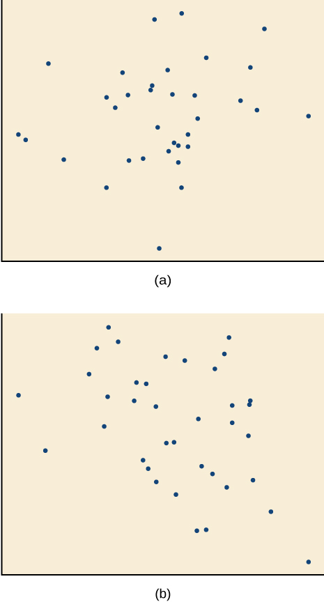
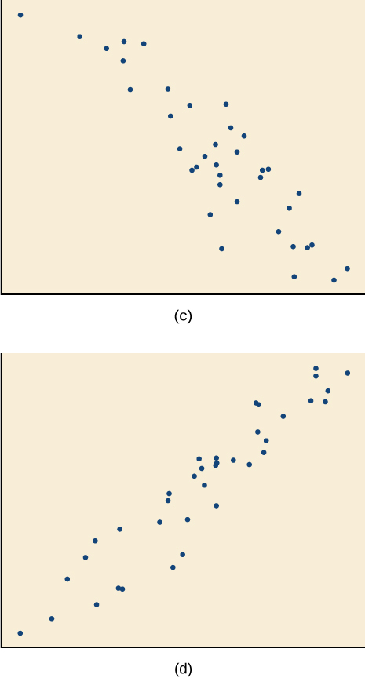
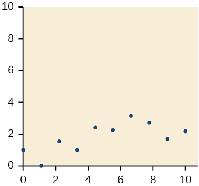
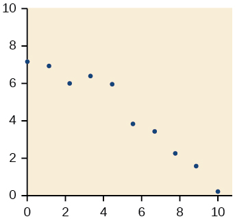
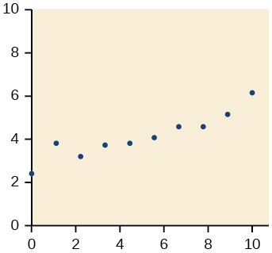
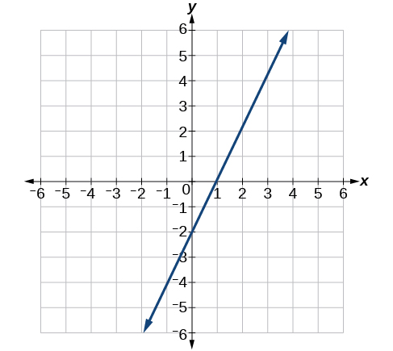
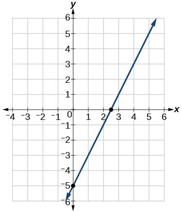
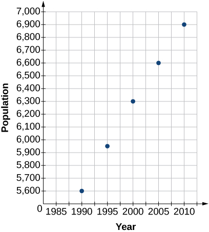
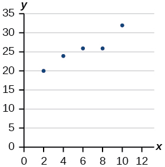

In this section, you will:
* Draw and interpret scatter plots.
* Find the line of best fit.
* Distinguish between linear and nonlinear relations.
* Use a linear model to make predictions.

A professor is attempting to identify trends among final exam scores. His class has a mixture of students, so he wonders if there is any relationship between age and final exam scores. One way for him to analyze the scores is by creating a diagram that relates the age of each student to the exam score received. In this section, we will examine one such diagram known as a scatter plot.

### Drawing and Interpreting Scatter Plots

A **scatter plot**{: data-type="term" .no-emphasis} is a graph of plotted points that may show a relationship between two sets of data. If the relationship is from a **linear model**{: data-type="term" .no-emphasis}, or a model that is nearly linear, the professor can draw conclusions using his knowledge of linear functions. [\[link\]](#CNX_Precalc_Figure_02_04_001) shows a sample scatter plot.

 {: #CNX_Precalc_Figure_02_04_001}

Notice this scatter plot does *not* indicate a **linear relationship**{: data-type="term" .no-emphasis}. The points do not appear to follow a trend. In other words, there does not appear to be a relationship between the age of the student and the score on the final exam.

Using a Scatter Plot to Investigate Cricket Chirps

[[link]](#Table_02_04_01) shows the number of cricket chirps in 15 seconds, for several different air temperatures, in degrees Fahrenheit[1](#footnote1){: data-type="footnote-link"}. Plot this data, and determine whether the data appears to be linearly related.

<table id="Table_02_04_01" summary="Two rows and ten columns. The first row is labeled, 'chirps'. The second row is labeled is labeled, 'Temp'. Reading the remaining rows as ordered pairs (i.e., (chirps, Temp), we have the following values: (44, 80.5), (35, 70.5), (20.4, 57), (33, 66), (31, 68), (35, 72), (18.5, 52), (37, 73.5) and (26, 53)."><colgroup><col data-width="10%" /><col data-width="10%" /><col data-width="10%" /><col data-width="10%" /><col data-width="10%" /><col data-width="10%" /><col data-width="10%" /><col data-width="10%" /><col data-width="10%" /><col data-width="10%" /></colgroup><tbody>
<tr>
<td><strong>Chirps</strong></td>
<td>44</td>
<td>35</td>
<td>20.4</td>
<td>33</td>
<td>31</td>
<td>35</td>
<td>18.5</td>
<td>37</td>
<td>26</td>
</tr>
<tr>
<td><strong>Temperature</strong></td>
<td>80.5</td>
<td>70.5</td>
<td>57</td>
<td>66</td>
<td>68</td>
<td>72</td>
<td>52</td>
<td>73.5</td>
<td>53</td>
</tr>
</tbody></table>

Plotting this data, as depicted in [[link]](#CNX_Precalc_Figure_02_04_002) suggests that there may be a trend. We can see from the trend in the data that the number of chirps increases as the temperature increases. The trend appears to be roughly linear, though certainly not perfectly so.

{: #CNX_Precalc_Figure_02_04_002}

### Finding the Line of Best Fit

Once we recognize a need for a linear function to model that data, the natural follow-up question is “what is that linear function?” One way to approximate our linear function is to sketch the line that seems to best fit the data. Then we can extend the line until we can verify the *y*-intercept. We can approximate the slope of the line by extending it until we can estimate the <math xmlns="http://www.w3.org/1998/Math/MathML"><mrow><mfrac><mrow><mtext>rise</mtext></mrow><mrow><mtext>run</mtext></mrow></mfrac><mo>.</mo></mrow></math>

Finding a Line of Best Fit

Find a linear function that fits the data in [[link]](#Table_02_04_01) by “eyeballing” a line that seems to fit.

On a graph, we could try sketching a line.

Using the starting and ending points of our hand drawn line, points (0, 30) and (50, 90), this graph has a slope of

<math xmlns="http://www.w3.org/1998/Math/MathML" display="block"><mrow><mi>m</mi><mo>=</mo><mfrac><mrow><mn>60</mn></mrow><mrow><mn>50</mn></mrow></mfrac><mo>=</mo><mn>1.2</mn></mrow></math>

and a *y*-intercept at 30. This gives an equation of

<math xmlns="http://www.w3.org/1998/Math/MathML" display="block"><mrow><mi>T</mi><mo stretchy="false">(</mo><mi>c</mi><mo stretchy="false">)</mo><mo>=</mo><mn>1.2</mn><mi>c</mi><mo>+</mo><mn>30</mn></mrow></math>

where <math xmlns="http://www.w3.org/1998/Math/MathML"><mi>c</mi></math>

 is the number of chirps in 15 seconds, and <math xmlns="http://www.w3.org/1998/Math/MathML"><mrow><mi>T</mi><mrow><mo>(</mo><mi>c</mi><mo>)</mo></mrow></mrow></math>

 is the temperature in degrees Fahrenheit. The resulting equation is represented in [[link]](#CNX_Precalc_Figure_02_04_003).

{: #CNX_Precalc_Figure_02_04_003}

Analysis

This linear equation can then be used to approximate answers to various questions we might ask about the trend.

#### Recognizing Interpolation or Extrapolation

While the data for most examples does not fall perfectly on the line, the equation is our best guess as to how the relationship will behave outside of the values for which we have data. We use a process known as **interpolation** when we predict a value inside the domain and range of the data. The process of **extrapolation** is used when we predict a value outside the domain and range of the data.

[\[link\]](#CNX_Precalc_Figure_02_04_004) compares the two processes for the cricket-chirp data addressed in [\[link\]](#Example_02_04_02). We can see that interpolation would occur if we used our model to predict temperature when the values for chirps are between 18.5 and 44. Extrapolation would occur if we used our model to predict temperature when the values for chirps are less than 18.5 or greater than 44.

There is a difference between making predictions inside the domain and range of values for which we have data and outside that domain and range. Predicting a value outside of the domain and range has its limitations. When our model no longer applies after a certain point, it is sometimes called **model breakdown**{: data-type="term"}. For example, predicting a cost function for a period of two years may involve examining the data where the input is the time in years and the output is the cost. But if we try to extrapolate a cost when <math xmlns="http://www.w3.org/1998/Math/MathML"><mrow><mi>x</mi><mo>=</mo><mn>50,</mn></mrow></math>

 that is in 50 years, the model would not apply because we could not account for factors fifty years in the future.

 {: #CNX_Precalc_Figure_02_04_004}

Interpolation and Extrapolation

Different methods of making predictions are used to analyze data.

* The method of **interpolation**{: data-type="term"} involves predicting a value inside the domain and/or range of the data.
* The method of **extrapolation**{: data-type="term"} involves predicting a value outside the domain and/or range of the data.
* **Model breakdown** occurs at the point when the model no longer applies.
{: data-bullet-style="none"}

Understanding Interpolation and Extrapolation

Use the cricket data from [[link]](#Table_02_04_01) to answer the following questions:

1.  Would predicting the temperature when crickets are chirping 30 times in 15 seconds be interpolation or extrapolation? Make the prediction, and discuss whether it is reasonable.
2.  Would predicting the number of chirps crickets will make at 40 degrees be interpolation or extrapolation? Make the prediction, and discuss whether it is reasonable.
{: type="a"}

1.  The number of chirps in the data provided varied from 18.5 to 44. A prediction at 30 chirps per 15 seconds is inside the domain of our data, so would be interpolation. Using our model:
    

    <math xmlns="http://www.w3.org/1998/Math/MathML" display="block"> <mrow> <mtable columnalign="left"> <mtr columnalign="left"> <mtd columnalign="left"> <mrow> <mi>T</mi><mo stretchy="false">(</mo><mn>30</mn><mo stretchy="false">)</mo><mo>=</mo><mn>30</mn><mo>+</mo><mn>1.2</mn><mo stretchy="false">(</mo><mn>30</mn><mo stretchy="false">)</mo> </mrow> </mtd> </mtr> <mtr columnalign="left"> <mtd columnalign="left"> <mrow> <mtext>         </mtext><mo>=</mo><mn>66</mn><mtext> </mtext><mtext>degrees</mtext> </mrow> </mtd> </mtr> </mtable> </mrow> </math>
    

    
    * * *
    {: data-type="newline"}
    
    Based on the data we have, this value seems reasonable.
2.  The temperature values varied from 52 to 80.5. Predicting the number of chirps at 40 degrees is extrapolation because 40 is outside the range of our data. Using our model:
    

    <math xmlns="http://www.w3.org/1998/Math/MathML" display="block"> <mrow> <mtable columnalign="left"> <mtr columnalign="left"> <mtd columnalign="left"> <mrow> <mn>40</mn><mo>=</mo><mn>30</mn><mo>+</mo><mn>1.2</mn><mi>c</mi> </mrow> </mtd> </mtr> <mtr columnalign="left"> <mtd columnalign="left"> <mrow> <mn>10</mn><mo>=</mo><mn>1.2</mn><mi>c</mi> </mrow> </mtd> </mtr> <mtr columnalign="left"> <mtd columnalign="left"> <mrow> <mo> </mo><mi>c</mi><mo>≈</mo><mn>8.33</mn> </mrow> </mtd> </mtr> </mtable> </mrow> </math>
    

{: type="a"}

We can compare the regions of interpolation and extrapolation using [[link]](#CNX_Precalc_Figure_02_04_005).

{: #CNX_Precalc_Figure_02_04_005}

Analysis

Our model predicts the crickets would chirp 8.33 times in 15 seconds. While this might be possible, we have no reason to believe our model is valid outside the domain and range. In fact, generally crickets stop chirping altogether below around 50 degrees.

According to the data from [[link]](#Table_02_04_01), what temperature can we predict it is if we counted 20 chirps in 15 seconds?

<math xmlns="http://www.w3.org/1998/Math/MathML"><mrow><mn>54</mn><mo>°</mo><mtext>F</mtext></mrow></math>

#### Finding the Line of Best Fit Using a Graphing Utility 

While eyeballing a line works reasonably well, there are statistical techniques for fitting a line to data that minimize the differences between the line and data values[2](#footnote2){: data-type="footnote-link"}. One such technique is called **least squares regression**{: data-type="term"} and can be computed by many graphing calculators, spreadsheet software, statistical software, and many web-based calculators[3](#footnote3){: data-type="footnote-link"}. Least squares regression is one means to determine the line that best fits the data, and here we will refer to this method as linear regression.

**Given data of input and corresponding outputs from a linear function, find the best fit line using linear regression.**

1.  Enter the input in List 1 (L1).
2.  Enter the output in List 2 (L2).
3.  On a graphing utility, select Linear Regression (LinReg).
{: type="1"}

Finding a Least Squares Regression Line

Find the least squares regression line using the cricket-chirp data in [[link]](#Table_02_04_01).

1.  Enter the input (chirps) in List 1 (L1).
2.  Enter the output (temperature) in List 2 (L2). See [[link]](#Table_02_04_02).
    <table id="Table_02_04_02" summary="Two rows and ten columns. The first row is labeled, 'L1'. The second row is labeled is labeled, 'L2'. Reading the remaining rows as ordered pairs (i.e., (L2, L2), we have the following values: (44, 80.5), (35, 70.5), (20.4, 57), (33, 66), (31, 68), (35, 72), (18.5, 52), (37, 73.5) and (26, 53)."><colgroup><col data-width="10%" /><col data-width="10%" /><col data-width="10%" /><col data-width="10%" /><col data-width="10%" /><col data-width="10%" /><col data-width="10%" /><col data-width="10%" /><col data-width="10%" /><col data-width="10%" /></colgroup><tbody>
    <tr>
    <td><strong>L1</strong></td>
    <td>44</td>
    <td>35</td>
    <td>20.4</td>
    <td>33</td>
    <td>31</td>
    <td>35</td>
    <td>18.5</td>
    <td>37</td>
    <td>26</td>
    </tr>
    <tr>
    <td><strong>L2</strong></td>
    <td>80.5</td>
    <td>70.5</td>
    <td>57</td>
    <td>66</td>
    <td>68</td>
    <td>72</td>
    <td>52</td>
    <td>73.5</td>
    <td>53</td>
    </tr>
    </tbody></table>

3.  On a graphing utility, select Linear Regression (LinReg). Using the cricket chirp data from earlier, with technology we obtain the equation:
    

    <math xmlns="http://www.w3.org/1998/Math/MathML" display="block"><mrow><mi>T</mi><mo stretchy="false">(</mo><mi>c</mi><mo stretchy="false">)</mo><mo>=</mo><mn>30.281</mn><mo>+</mo><mn>1.143</mn><mi>c</mi></mrow></math>
    

{: type="1"}

Analysis

Notice that this line is quite similar to the equation we “eyeballed” but should fit the data better. Notice also that using this equation would change our prediction for the temperature when hearing 30 chirps in 15 seconds from 66 degrees to:

<math xmlns="http://www.w3.org/1998/Math/MathML" display="block"> <mrow> <mtable columnalign="left"> <mtr columnalign="left"> <mtd columnalign="left"> <mrow> <mi>T</mi><mo stretchy="false">(</mo><mn>30</mn><mo stretchy="false">)</mo><mo>=</mo><mn>30.281</mn><mo>+</mo><mn>1.143</mn><mo stretchy="false">(</mo><mn>30</mn><mo stretchy="false">)</mo> </mrow> </mtd> </mtr> <mtr columnalign="left"> <mtd columnalign="left"> <mrow> <mtext>         </mtext><mo>=</mo><mn>64.571</mn> </mrow> </mtd> </mtr> <mtr columnalign="left"> <mtd columnalign="left"> <mrow> <mtext>         </mtext><mo>≈</mo><mn>64.6</mn><mtext> degrees</mtext> </mrow> </mtd> </mtr> </mtable> </mrow> </math>

The graph of the scatter plot with the least squares regression line is shown in [[link]](#CNX_Precalc_Figure_02_04_006).

{: #CNX_Precalc_Figure_02_04_006}

<strong>Will there ever be a case where two different lines will serve as the best fit for the data? </strong>

*No. There is only one best fit line.*

### Distinguishing Between Linear and Non-Linear Models

As we saw above with the cricket-chirp model, some data exhibit strong linear trends, but other data, like the final exam scores plotted by age, are clearly nonlinear. Most calculators and computer software can also provide us with the **correlation coefficient**, which is a measure of how closely the line fits the data. Many graphing calculators require the user to turn a ”diagnostic on” selection to find the correlation coefficient, which mathematicians label as <math xmlns="http://www.w3.org/1998/Math/MathML"><mrow><mi>r</mi><mo>.</mo></mrow></math>

 The correlation coefficient provides an easy way to get an idea of how close to a line the data falls.

We should compute the correlation coefficient only for data that follows a linear pattern or to determine the degree to which a data set is linear. If the data exhibits a nonlinear pattern, the correlation coefficient for a linear regression is meaningless. To get a sense for the relationship between the value of <math xmlns="http://www.w3.org/1998/Math/MathML"><mi>r</mi></math>

 and the graph of the data, [\[link\]](#CNX_Precalc_Figure_02_04_007) shows some large data sets with their correlation coefficients. Remember, for all plots, the horizontal axis shows the input and the vertical axis shows the output.

 "){: #CNX_Precalc_Figure_02_04_007}

Correlation Coefficient

The **correlation coefficient**{: data-type="term"} is a value,<math xmlns="http://www.w3.org/1998/Math/MathML"><mrow><mi>r</mi><mo>,</mo></mrow></math>

 between –1 and 1.

* *r* &gt; 0 suggests a positive (increasing) relationship
* *r* &lt; 0 suggests a negative (decreasing) relationship
* The closer the value is to 0, the more scattered the data.
* The closer the value is to 1 or –1, the less scattered the data is.

Finding a Correlation Coefficient

Calculate the correlation coefficient for cricket-chirp data in [[link]](#Table_02_04_01).

Because the data appear to follow a linear pattern, we can use technology to calculate <math xmlns="http://www.w3.org/1998/Math/MathML"><mrow><mi>r</mi><mo>.</mo></mrow></math>

 Enter the inputs and corresponding outputs and select the Linear Regression. The calculator will also provide you with the correlation coefficient, <math xmlns="http://www.w3.org/1998/Math/MathML"><mrow><mi>r</mi><mo>=</mo><mn>0.9509.</mn></mrow></math>

 This value is very close to 1, which suggests a strong increasing linear relationship.

Note: For some calculators, the Diagnostics must be turned "on" in order to get the correlation coefficient when linear regression is performed: [2nd]&gt;[0]&gt;[alpha][x–1], then scroll to DIAGNOSTICSON.

### Predicting with a Regression Line 

Once we determine that a set of data is linear using the correlation coefficient, we can use the regression line to make predictions. As we learned above, a regression line is a line that is closest to the data in the scatter plot, which means that only one such line is a best fit for the data.

Using a Regression Line to Make Predictions

Gasoline consumption in the United States has been steadily increasing. Consumption data from 1994 to 2004 is shown in [[link]](#Table_02_04_03)[4](#footnote4){: data-type="footnote-link"}. Determine whether the trend is linear, and if so, find a model for the data. Use the model to predict the consumption in 2008.

| **Year** | '94 | '95 | '96 | '97 | '98 | '99 | '00 | '01 | '02 | '03 | '04 |
| **Consumption (billions of gallons)** | 113 | 116 | 118 | 119 | 123 | 125 | 126 | 128 | 131 | 133 | 136 |
{: #Table_02_04_03 summary="Two rows and twelve columns. The first row is labeled, 'Year'. The second row is labeled is labeled, 'Consumption (billions of gallons)'. Reading the remaining rows as ordered pairs (i.e., (Year, Consumption), we have the following values: ('94, 113), ('95, 116), ('96, 118), ('97, 119), ('98, 123), ('99, 125), ('00, 126), ('01, 128), ('02, 131), ('03, 133), and ('04, 136)."}

The scatter plot of the data, including the least squares regression line, is shown in [[link]](#CNX_Precalc_Figure_02_04_008).

{: #CNX_Precalc_Figure_02_04_008}

We can introduce new input variable, <math xmlns="http://www.w3.org/1998/Math/MathML"><mrow><mi>t</mi><mo>,</mo></mrow></math>

representing years since 1994.

The least squares regression equation is:

<math xmlns="http://www.w3.org/1998/Math/MathML" display="block"><mrow><mi>C</mi><mo stretchy="false">(</mo><mi>t</mi><mo stretchy="false">)</mo><mo>=</mo><mn>113.318</mn><mo>+</mo><mn>2.209</mn><mi>t</mi></mrow></math>

Using technology, the correlation coefficient was calculated to be 0.9965, suggesting a very strong increasing linear trend.

Using this to predict consumption in 2008 <math xmlns="http://www.w3.org/1998/Math/MathML"><mrow><mo stretchy="false">(</mo><mi>t</mi><mo>=</mo><mn>14</mn><mo stretchy="false">)</mo><mo>,</mo></mrow></math>

<math xmlns="http://www.w3.org/1998/Math/MathML" display="block"> <mrow> <mtable columnalign="left"> <mtr columnalign="left"> <mtd columnalign="left"> <mrow> <mi>C</mi><mo stretchy="false">(</mo><mn>14</mn><mo stretchy="false">)</mo><mo>=</mo><mn>113.318</mn><mo>+</mo><mn>2.209</mn><mo stretchy="false">(</mo><mn>14</mn><mo stretchy="false">)</mo> </mrow> </mtd> </mtr> <mtr columnalign="left"> <mtd columnalign="left"> <mrow> <mtext>         </mtext><mo>=</mo><mn>144.244</mn> </mrow> </mtd> </mtr> </mtable> </mrow> </math>

The model predicts 144.244 billion gallons of gasoline consumption in 2008.

Use the model we created using technology in [[link]](#Example_02_04_06) to predict the gas consumption in 2011. Is this an interpolation or an extrapolation?

150\.871 billion gallons; extrapolation

Access these online resources for additional instruction and practice with fitting linear models to data.

* [Introduction to Regression Analysis][1]
* [Linear Regression][2]

Visit [this website][3] for additional practice questions from Learningpod.

### Key Concepts

* Scatter plots show the relationship between two sets of data. See [\[link\]](#Example_02_04_01).
* Scatter plots may represent linear or non-linear models.
* The line of best fit may be estimated or calculated, using a calculator or statistical software. See [\[link\]](#Example_02_04_02).
* Interpolation can be used to predict values inside the domain and range of the data, whereas extrapolation can be used to predict values outside the domain and range of the data. See [\[link\]](#Example_02_04_03).
* The correlation coefficient,
  <math xmlns="http://www.w3.org/1998/Math/MathML"><mrow><mi>r</mi><mo>,</mo></mrow></math>
  
  indicates the degree of linear relationship between data. See [\[link\]](#Example_02_04_05).
* A regression line best fits the data. See [\[link\]](#Example_02_04_06).
* The least squares regression line is found by minimizing the squares of the distances of points from a line passing through the data and may be used to make predictions regarding either of the variables. See [\[link\]](#Example_02_04_04).

### Section Exercises

#### Verbal

Describe what it means if there is a model breakdown when using a linear model.

When our model no longer applies, after some value in the domain, the model itself doesn’t hold.

What is interpolation when using a linear model?

What is extrapolation when using a linear model?

We predict a value outside the domain and range of the data.

Explain the difference between a positive and a negative correlation coefficient.

Explain how to interpret the absolute value of a correlation coefficient.

The closer the number is to 1, the less scattered the data, the closer the number is to 0, the more scattered the data.

#### Algebraic

A regression was run to determine whether there is a relationship between hours of TV watched per day <math xmlns="http://www.w3.org/1998/Math/MathML"><mrow><mo stretchy="false">(</mo><mi>x</mi><mo stretchy="false">)</mo></mrow></math>

 and number of sit-ups a person can do <math xmlns="http://www.w3.org/1998/Math/MathML"><mrow><mo stretchy="false">(</mo><mi>y</mi><mo stretchy="false">)</mo><mo>.</mo></mrow></math>

 The results of the regression are given below. Use this to predict the number of sit-ups a person who watches 11 hours of TV can do.

<math xmlns="http://www.w3.org/1998/Math/MathML" display="block"> <mtable columnalign="left"> <mtr> <mtd> <mi>y</mi><mo>=</mo><mi>a</mi><mi>x</mi><mo>+</mo><mi>b</mi> </mtd> </mtr> <mtr> <mtd> <mi>a</mi><mo>=</mo><mn>−1.341</mn> </mtd> </mtr> <mtr> <mtd> <mi>b</mi><mo>=</mo><mn>32.234</mn> </mtd> </mtr> <mtr> <mtd> <mi>r</mi><mo>=</mo><mn>−0.896</mn> </mtd> </mtr> </mtable> </math>

A regression was run to determine whether there is a relationship between the diameter of a tree (<math xmlns="http://www.w3.org/1998/Math/MathML"><mrow><mi>x</mi><mo>,</mo></mrow></math>

in inches) and the tree’s age (<math xmlns="http://www.w3.org/1998/Math/MathML"><mrow><mi>y</mi><mo>,</mo></mrow></math>

in years). The results of the regression are given below. Use this to predict the age of a tree with diameter 10 inches.

<math xmlns="http://www.w3.org/1998/Math/MathML" display="block"> <mtable columnalign="left"> <mtr> <mtd> <mi>y</mi><mo>=</mo><mi>a</mi><mi>x</mi><mo>+</mo><mi>b</mi> </mtd> </mtr> <mtr> <mtd> <mi>a</mi><mo>=</mo><mn>6.301</mn> </mtd> </mtr> <mtr> <mtd> <mi>b</mi><mo>=</mo><mn>−1.044</mn> </mtd> </mtr> <mtr> <mtd> <mi>r</mi><mo>=</mo><mn>−0.970</mn> </mtd> </mtr> </mtable> </math>

61\.966 years

For the following exercises, draw a scatter plot for the data provided. Does the data appear to be linearly related?

| 0 | 2 | 4 | 6 | 8 | 10 |
| –22 | –19 | –15 | –11 | –6 | –2 |
{: #Table_02_04_04 summary="Two rows and six columns. Reading the column and row as ordered pairs, we have (0, -22), (2, -19), (4, -15), (6, -11), (8, -6), and (10, -2)." .unnumbered data-label=""}

| 1 | 2 | 3 | 4 | 5 | 6 |
| 46 | 50 | 59 | 75 | 100 | 136 |
{: #Table_02_04_35 summary="Two rows and six columns. Reading the column and row as ordered pairs, we have (1, 46), (2, 50), (3, 59), (4, 75), (5, 100), and (6, 136)." .unnumbered data-label=""}

No.

| 100 | 250 | 300 | 450 | 600 | 750 |
| 12 | 12.6 | 13.1 | 14 | 14.5 | 15.2 |
{: #Table_02_04_05 summary="Two rows and six columns. Reading the column and row as ordered pairs, we have (100, 12), (250, 12.6), (300, 13.1), (450, 14), (600, 14.5), and (750, 15.2)." .unnumbered data-label=""}

| 1 | 3 | 5 | 7 | 9 | 11 |
| 1 | 9 | 28 | 65 | 125 | 216 |
{: #Table_02_04_06 summary="Two rows and six columns. Reading the column and row as ordered pairs, we have (1, 1), (3, 9), (5, 28), (7, 65), (9, 125), and (11, 216)." .unnumbered data-label=""}

No.

For the following data, draw a scatter plot. If we wanted to know when the population would reach 15,000, would the answer involve interpolation or extrapolation? Eyeball the line, and estimate the answer.

| **Year** | **Population** |
| 1990 | 11,500 |
| 1995 | 12,100 |
| 2000 | 12,700 |
| 2005 | 13,000 |
| 2010 | 13,750 |
{: #Table_02_04_07 summary="Two columns and six rows. The first column is labeled, 'Year'. The second column is labeled is labeled, 'Population'. Reading the remaining columns as ordered pairs (i.e., (Year, Population), we have the following values: (1990, 11500), (1995, 12100), (2000, 12700), (2005, 13000), and (2010, 13750)." .unnumbered data-label=""}

For the following data, draw a scatter plot. If we wanted to know when the temperature would reach 28 °F, would the answer involve interpolation or extrapolation? Eyeball the line and estimate the answer.

| Temperature, °F | 16 | 18 | 20 | 25 | 30 |
| Time, seconds | 46 | 50 | 54 | 55 | 62 |
{: #Table_02_04_08 summary="Two rows and six columns. The first row is labeled, 'Temperature, Degrees F'. The second row is labeled is labeled, 'Time, seconds'. Reading the remaining rows as ordered pairs (i.e., (Year, Population), we have the following values: (16, 46), (18, 50), (20, 54), (25, 55), and (30, 62)." .unnumbered data-label=""}

Interpolation. About <math xmlns="http://www.w3.org/1998/Math/MathML"><mrow> <mn>60</mn><mo>°</mo><mtext> F</mtext><mo>.</mo> </mrow> </math>

#### Graphical

For the following exercises, match each scatterplot with one of the four specified correlations in [\[link\]](#CNX_Precalc_Figure_02_04_204ab) and [\[link\]](#CNX_Precalc_Figure_02_04_204cd).

 {: #CNX_Precalc_Figure_02_04_204ab}

{: #CNX_Precalc_Figure_02_04_204cd}

<math xmlns="http://www.w3.org/1998/Math/MathML"><mrow><mi>r</mi><mo>=</mo><mn>0.</mn><mtext>95</mtext></mrow></math>

<math xmlns="http://www.w3.org/1998/Math/MathML"><mrow><mi>r</mi><mo>=</mo><mo>−</mo><mn>0.</mn><mtext>89</mtext></mrow></math>

C

<math xmlns="http://www.w3.org/1998/Math/MathML"><mrow><mi>r</mi><mo>=</mo><mn>0.26</mn></mrow></math>

<math xmlns="http://www.w3.org/1998/Math/MathML"><mrow><mi>r</mi><mo>=</mo><mo>−</mo><mn>0.39</mn></mrow></math>

B

For the following exercises, draw a best-fit line for the plotted data.

  

  

  

  

  

  

#### Numeric

The U.S. Census tracks the percentage of persons 25 years or older who are college graduates. That data for several years is given in [[link]](#Table_02_04_11)[5](#footnote5){: data-type="footnote-link"}. Determine whether the trend appears linear. If so, and assuming the trend continues, in what year will the percentage exceed 35%?

| **Year** | **Percent Graduates** |
| 1990 | 21.3 |
| 1992 | 21.4 |
| 1994 | 22.2 |
| 1996 | 23.6 |
| 1998 | 24.4 |
| 2000 | 25.6 |
| 2002 | 26.7 |
| 2004 | 27.7 |
| 2006 | 28 |
| 2008 | 29.4 |
{: #Table_02_04_11 summary="Two columns and eleven rows. The first column is labeled, 'Year'. The second column is labeled is labeled, 'Percent Graduates'. Reading the remaining columns as ordered pairs (i.e., (Year, Percent Graduates), we have the following values: (1990, 21.3), (1992, 21.4), (1994, 22.2), (1996, 23.6), (1998, 24.4), (2000, 25.6), (2002, 26,7), (2004, 27.7), (2006, 28), and (2008, 29.4)."}

The U.S. import of wine (in hectoliters) for several years is given in [[link]](#Table_02_04_12). Determine whether the trend appears linear. If so, and assuming the trend continues, in what year will imports exceed 12,000 hectoliters?

| **Year** | **Imports** |
| 1992 | 2665 |
| 1994 | 2688 |
| 1996 | 3565 |
| 1998 | 4129 |
| 2000 | 4584 |
| 2002 | 5655 |
| 2004 | 6549 |
| 2006 | 7950 |
| 2008 | 8487 |
| 2009 | 9462 |
{: #Table_02_04_12 summary="Two columns and eleven rows. The first column is labeled, 'Year'. The second column is labeled is labeled, 'Imports'. Reading the remaining rows as ordered pairs (i.e., (Year, Imports), we have the following values: (1992, 2665), (1994, 2688), (1996, 3565), (1998, 4129), (2000, 4584), (2002, 5655), (2004, 6549), (2006, 7950), (2008, 8487), and (2009, 9462)."}

Yes, trend appears linear because <math xmlns="http://www.w3.org/1998/Math/MathML"><mrow><mi>r</mi><mo>=</mo><mn>0.</mn><mtext>985</mtext></mrow></math>

 and will exceed 12,000 near midyear, 2016, 24.6 years since 1992.

[[link]](#Table_02_04_13) shows the year and the number of people unemployed in a particular city for several years. Determine whether the trend appears linear. If so, and assuming the trend continues, in what year will the number of unemployed reach 5?

| **Year** | **Number Unemployed** |
| 1990 | 750 |
| 1992 | 670 |
| 1994 | 650 |
| 1996 | 605 |
| 1998 | 550 |
| 2000 | 510 |
| 2002 | 460 |
| 2004 | 420 |
| 2006 | 380 |
| 2008 | 320 |
{: #Table_02_04_13 summary="Two columns and eleven rows. The first column is labeled, 'Year'. The second column is labeled is labeled, 'Unemployment'. Reading the remaining rows as ordered pairs (i.e., (Year, Unemployment), we have the following values: (1990, 750), (1992, 670), (1994, 650), (1996, 605), (1998, 550), (2000, 510), (2002, 460), (2004, 420), (2006, 380), and (2008, 320)."}

#### Technology

For the following exercises, use each set of data to calculate the regression line using a calculator or other technology tool, and determine the correlation coefficient to 3 decimal places of accuracy.

| **<math xmlns="http://www.w3.org/1998/Math/MathML"><mi>x</mi></math>

** | 8 | 15 | 26 | 31 | 56 |
| **<math xmlns="http://www.w3.org/1998/Math/MathML"><mi>y</mi></math>

** | 23 | 41 | 53 | 72 | 103 |
{: #Table_02_04_14 summary="Six rows and two columns. The first column in the first row is labeled x, and the second column in the first row is labeled y. Reading the remaining rows as ordered pairs (i.e., (x , y)), we have: (8, 23), (15, 41), (26, 53), (31, 72), and (56, 103)." .unnumbered data-label=""}

<math xmlns="http://www.w3.org/1998/Math/MathML"><mrow><mi>y</mi><mo>=</mo><mtext>1</mtext><mo>.</mo><mtext>64</mtext><mn>0</mn><mi>x</mi><mo>+</mo><mtext>13</mtext><mo>.</mo><mtext>8</mtext><mn>00</mn></mrow></math>

, <math xmlns="http://www.w3.org/1998/Math/MathML"><mrow><mi>r</mi><mo>=</mo><mn>0.</mn><mtext>987</mtext></mrow></math>

| **<math xmlns="http://www.w3.org/1998/Math/MathML"><mi>x</mi></math>

** | 5 | 7 | 10 | 12 | 15 |
| **<math xmlns="http://www.w3.org/1998/Math/MathML"><mi>y</mi></math>

** | 4 | 12 | 17 | 22 | 24 |
{: #Table_02_04_15 summary="Six rows and two columns. The first column in the first row is labeled x, and the second column in the first row is labeled y. Reading the remaining rows as ordered pairs (i.e., (x , y)), we have: (5, 4), (7, 12), (10, 17), (12, 22), and (15, 24)." .unnumbered data-label=""}

| <strong><math xmlns="http://www.w3.org/1998/Math/MathML"> <mi>x</mi></math></strong> | **<math xmlns="http://www.w3.org/1998/Math/MathML"><mi>y</mi></math>

** | **<math xmlns="http://www.w3.org/1998/Math/MathML"><mi>x</mi></math>

** | <strong><math xmlns="http://www.w3.org/1998/Math/MathML"><mi>y</mi>
</math></strong> |
| 3 | 21.9 | 11 | 15.76 |
| 4 | 22.22 | 12 | 13.68 |
| 5 | 22.74 | 13 | 14.1 |
| 6 | 22.26 | 14 | 14.02 |
| 7 | 20.78 | 15 | 11.94 |
| 8 | 17.6 | 16 | 12.76 |
| 9 | 16.52 | 17 | 11.28 |
| 10 | 18.54 | 18 | 9.1 |
{: #Table_02_04_16 summary="Seventeen rows and two columns. The first column in the first row is labeled x, and the second column in the first row is labeled y. Reading the remaining rows as ordered pairs (i.e., (x , y)), we have: (3, 21.9), (4, 22.22), (5, 22.74), (6, 22.26), (7, 20.78), (8, 17.6), (9, 16.52), (10, 18.54), (11, 15.76), (12, 22), (13, 14.1), (14, 14.02), (15, 11.94), (16, 12.76), (17, 11.28) and (18, 9.1)." .unnumbered data-label=""}

<math xmlns="http://www.w3.org/1998/Math/MathML" display="block"> <mrow> <mi>y</mi><mo>=</mo><mo>−</mo><mn>0.962</mn><mi>x</mi><mo>+</mo><mn>26.86</mn><mo>,</mo><mo> </mo><mo> </mo><mo> </mo><mi>r</mi><mo>=</mo><mo>−</mo><mn>0.965</mn> </mrow> </math>

| **<math xmlns="http://www.w3.org/1998/Math/MathML"><mi>x</mi></math>

** | **<math xmlns="http://www.w3.org/1998/Math/MathML"><mi>y</mi></math>

** |
| 4 | 44.8 |
| 5 | 43.1 |
| 6 | 38.8 |
| 7 | 39 |
| 8 | 38 |
| 9 | 32.7 |
| 10 | 30.1 |
| 11 | 29.3 |
| 12 | 27 |
| 13 | 25.8 |
{: #Table_02_04_17 summary="Eleven rows and two columns. The first column in the first row is labeled x, and the second column in the first row is labeled y. Reading the remaining rows as ordered pairs (i.e., (x , y)), we have: (4, 44.8), (5, 43.1), (6, 38.8), (7, 39), (8, 38), (9, 32.7), (10, 30.1), (11, 29.3), (12, 27), and (13, 25.8)." .unnumbered data-label=""}

| **<math xmlns="http://www.w3.org/1998/Math/MathML"><mi>x</mi></math>

** | **<math xmlns="http://www.w3.org/1998/Math/MathML"><mi>y</mi></math>

** |
| 21 | 17 |
| 25 | 11 |
| 30 | 2 |
| 31 | −1 |
| 40 | −18 |
| 50 | −40 |
{: #Table_02_04_18 summary="Two columns and seven rows. The first row in the first column is labeled x, and the first row in the second column is labeled y. Reading the remaining rows as ordered pairs (i.e., (x , y)), we have: (21, 17), (25, 11), (30, 2), (31, -1), (40, -18), and (50, -40)." .unnumbered data-label=""}

<math xmlns="http://www.w3.org/1998/Math/MathML"><mrow><mi>y</mi><mo>=</mo><mo>−</mo><mtext>1</mtext><mo>.</mo><mtext>981</mtext><mi>x</mi><mo>+</mo><mtext>6</mtext><mn>0.</mn><mtext>197</mtext></mrow></math>

; <math xmlns="http://www.w3.org/1998/Math/MathML"><mrow><mi>r</mi><mo>=</mo><mo>−</mo><mn>0.</mn><mtext>998</mtext></mrow></math>

| **<math xmlns="http://www.w3.org/1998/Math/MathML"><mi>x</mi></math>

** | **<math xmlns="http://www.w3.org/1998/Math/MathML"><mi>y</mi></math>

** |
| 100 | 2000 |
| 80 | 1798 |
| 60 | 1589 |
| 55 | 1580 |
| 40 | 1390 |
| 20 | 1202 |
{: #Table_02_04_19 summary="Two columns and seven rows. The first column in the first row is labeled x, and the second column in the first row is labeled y. Reading the remaining rows as ordered pairs (i.e., (x , y)), we have: (100, 2000), (80, 1798), (60, 1589), (55, 1589), (40, 1390), and (20, 1202)." .unnumbered data-label=""}

| **<math xmlns="http://www.w3.org/1998/Math/MathML"><mi>x</mi></math>

** | <strong><math xmlns="http://www.w3.org/1998/Math/MathML"> <mi>y</mi></math></strong> |
| 900 | 70 |
| 988 | 80 |
| 1000 | 82 |
| 1010 | 84 |
| 1200 | 105 |
| 1205 | 108 |
{: #Table_02_04_20 summary="Two coumns and seven rows. The first column in the first row is labeled x, and the second column in the first row is labeled y. Reading the remaining rows as ordered pairs (i.e., (x , y)), we have: (900, 70), (988, 80), (1000, 82), (1010, 84), (1200, 105), and (1205, 108)." .unnumbered data-label=""}

<math xmlns="http://www.w3.org/1998/Math/MathML"><mrow><mi>y</mi><mo>=</mo><mn>0.</mn><mtext>121</mtext><mi>x</mi><mo>−</mo><mn>38.841</mn><mo>,</mo><mtext> </mtext><mi>r</mi><mo>=</mo><mn>0.998</mn></mrow></math>

#### Extensions

Graph <math xmlns="http://www.w3.org/1998/Math/MathML"><mrow><mi>f</mi><mo stretchy="false">(</mo><mi>x</mi><mo stretchy="false">)</mo><mo>=</mo><mn>0.5</mn><mi>x</mi><mo>+</mo><mn>10</mn></mrow></math>

. Pick a set of 5 ordered pairs using inputs <math xmlns="http://www.w3.org/1998/Math/MathML"><mrow><mi>x</mi><mo>=</mo><mtext>−2</mtext><mo>,</mo><mtext> 1</mtext><mo>,</mo><mtext> 5</mtext><mo>,</mo><mtext> 6</mtext><mo>,</mo><mtext> 9</mtext></mrow></math>

 and use linear regression to verify that the function is a good fit for the data.

Graph <math xmlns="http://www.w3.org/1998/Math/MathML"><mrow><mi>f</mi><mo stretchy="false">(</mo><mi>x</mi><mo stretchy="false">)</mo><mo>=</mo><mo>−</mo><mn>2</mn><mi>x</mi><mo>−</mo><mn>10</mn></mrow></math>

. Pick a set of 5 ordered pairs using inputs <math xmlns="http://www.w3.org/1998/Math/MathML"><mrow><mi>x</mi><mo>=</mo><mtext>−2</mtext><mo>,</mo><mtext> 1</mtext><mo>,</mo><mtext> 5</mtext><mo>,</mo><mtext> 6</mtext><mo>,</mo><mtext> 9</mtext></mrow></math>

 and use linear regression to verify the function.

<math xmlns="http://www.w3.org/1998/Math/MathML"><mrow><mrow><mo>(</mo><mrow><mtext>−2</mtext><mo>,</mo><mn>−6</mn></mrow><mo>)</mo></mrow><mo>,</mo><mrow><mo>(</mo><mrow><mtext>1</mtext><mo>,</mo><mtext>−12</mtext></mrow><mo>)</mo></mrow><mo>,</mo><mrow><mo>(</mo><mrow><mtext>5</mtext><mo>,</mo><mtext>−2</mtext><mn>0</mn></mrow><mo>)</mo></mrow><mo>,</mo><mrow><mo>(</mo><mrow><mtext>6</mtext><mo>,</mo><mtext>−22</mtext></mrow><mo>)</mo></mrow><mo>,</mo><mrow><mo>(</mo><mrow><mtext>9</mtext><mo>,</mo><mtext>−28</mtext></mrow><mo>)</mo></mrow></mrow></math>

; <math xmlns="http://www.w3.org/1998/Math/MathML"><mrow><mi>y</mi><mo>=</mo><mn>−2</mn><mi>x</mi><mn>−10</mn></mrow></math>

For the following exercises, consider this scenario: The profit of a company decreased steadily over a ten-year span. The following ordered pairs shows dollars and the number of units sold in hundreds and the profit in thousands of over the ten-year span, (number of units sold, profit) for specific recorded years:

<math xmlns="http://www.w3.org/1998/Math/MathML"><mrow><mrow><mo>(</mo><mrow><mtext>46</mtext><mo>,</mo><mtext> 1</mtext><mo>,</mo><mtext>6</mtext><mn>00</mn></mrow><mo>)</mo></mrow><mo>,</mo><mo> </mo><mrow><mo>(</mo><mrow><mtext>48</mtext><mo>,</mo><mtext> 1</mtext><mo>,</mo><mtext>55</mtext><mn>0</mn></mrow><mo>)</mo></mrow><mo>,</mo><mo> </mo><mrow><mo>(</mo><mrow><mtext>5</mtext><mn>0</mn><mo>,</mo><mtext> 1</mtext><mo>,</mo><mtext>5</mtext><mn>0</mn><mtext>5</mtext></mrow><mo>)</mo></mrow><mo>,</mo><mo> </mo><mrow><mo>(</mo><mrow><mtext>52</mtext><mo>,</mo><mtext> 1</mtext><mo>,</mo><mtext>54</mtext><mn>0</mn></mrow><mo>)</mo></mrow><mo>,</mo><mo> </mo><mrow><mo>(</mo><mrow><mtext>54</mtext><mo>,</mo><mtext> 1</mtext><mo>,</mo><mtext>495</mtext></mrow><mo>)</mo></mrow></mrow></math>

.

Use linear regression to determine a function <math xmlns="http://www.w3.org/1998/Math/MathML"><mi>P</mi></math>

 where the profit in thousands of dollars depends on the number of units sold in hundreds.

Find to the nearest tenth and interpret the *x*-intercept.

<math xmlns="http://www.w3.org/1998/Math/MathML"><mrow><mrow><mo>(</mo><mrow><mtext>189</mtext><mo>.</mo><mtext>8</mtext><mo>,</mo><mn>0</mn></mrow><mo>)</mo></mrow><mo> </mo></mrow></math>

 If 18,980 units are sold, the company will have a profit of zero dollars.

Find to the nearest tenth and interpret the *y*-intercept.

#### Real-World Applications

For the following exercises, consider this scenario: The population of a city increased steadily over a ten-year span. The following ordered pairs shows the population and the year over the ten-year span, (population, year) for specific recorded years:

<math xmlns="http://www.w3.org/1998/Math/MathML"> <mrow> <mtext>(2500, 2000), (2650, 2001), (3000, 2003), (3500, 2006), (4200, 2010)</mtext> </mrow> </math>

Use linear regression to determine a function <math xmlns="http://www.w3.org/1998/Math/MathML"><mrow><mi>y</mi><mo>,</mo></mrow></math>

 where the year depends on the population. Round to three decimal places of accuracy.

<math xmlns="http://www.w3.org/1998/Math/MathML"><mrow><mi>y</mi><mo>=</mo><mn>0.00587</mn><mi>x</mi><mo>+</mo><mtext>1985</mtext><mn>.4</mn><mtext>1</mtext></mrow></math>

Predict when the population will hit 8,000.

For the following exercises, consider this scenario: The profit of a company increased steadily over a ten-year span. The following ordered pairs show the number of units sold in hundreds and the profit in thousands of over the ten year span, (number of units sold, profit) for specific recorded years:

<math xmlns="http://www.w3.org/1998/Math/MathML"><mrow><mrow><mo>(</mo><mrow><mtext>46</mtext><mo>,</mo><mtext> 25</mtext><mn>0</mn></mrow><mo>)</mo></mrow><mo>,</mo><mo> </mo><mrow><mo>(</mo><mrow><mtext>48</mtext><mo>,</mo><mtext> 3</mtext><mn>0</mn><mtext>5</mtext></mrow><mo>)</mo></mrow><mo>,</mo><mo> </mo><mrow><mo>(</mo><mrow><mtext>5</mtext><mn>0</mn><mo>,</mo><mtext> 35</mtext><mn>0</mn></mrow><mo>)</mo></mrow><mo>,</mo><mo> </mo><mrow><mo>(</mo><mrow><mtext>52</mtext><mo>,</mo><mtext> 39</mtext><mn>0</mn></mrow><mo>)</mo></mrow><mo>,</mo><mo> </mo><mrow><mo>(</mo><mrow><mtext>54</mtext><mo>,</mo><mtext> 41</mtext><mn>0</mn></mrow><mo>)</mo></mrow></mrow></math>

.

Use linear regression to determine a function *y*, where the profit in thousands of dollars depends on the number of units sold in hundreds .

<math xmlns="http://www.w3.org/1998/Math/MathML"><mrow><mi>y</mi><mo>=</mo><mtext>2</mtext><mn>0.</mn><mtext>25</mtext><mi>x</mi><mo>−</mo><mtext>671</mtext><mo>.</mo><mtext>5</mtext></mrow></math>

Predict when the profit will exceed one million dollars.

For the following exercises, consider this scenario: The profit of a company decreased steadily over a ten-year span. The following ordered pairs show dollars and the number of units sold in hundreds and the profit in thousands of over the ten-year span (number of units sold, profit) for specific recorded years:

<math xmlns="http://www.w3.org/1998/Math/MathML"> <mrow> <mtext>(46, 250), (48, 225), (50, 205), (52, 180), (54, 165)</mtext><mtext>.</mtext> </mrow> </math>

Use linear regression to determine a function *y*, where the profit in thousands of dollars depends on the number of units sold in hundreds .

<math xmlns="http://www.w3.org/1998/Math/MathML"><mrow><mi>y</mi><mo>=</mo><mo>−</mo><mtext>1</mtext><mn>0.</mn><mtext>75</mtext><mi>x</mi><mo>+</mo><mtext>742</mtext><mo>.</mo><mtext>5</mtext><mn>0</mn></mrow></math>

Predict when the profit will dip below the $25,000 threshold.

### Chapter Review Exercises

#### [Linear Functions](/m49324){: .target-chapter}

Determine whether the algebraic equation is linear. <math xmlns="http://www.w3.org/1998/Math/MathML"><mrow><mn>2</mn><mi>x</mi><mo>+</mo><mn>3</mn><mi>y</mi><mo>=</mo><mn>7</mn></mrow></math>

Yes

Determine whether the algebraic equation is linear. <math xmlns="http://www.w3.org/1998/Math/MathML"><mrow><mn>6</mn><msup><mi>x</mi><mn>2</mn></msup><mo>−</mo><mi>y</mi><mo>=</mo><mn>5</mn></mrow></math>

Determine whether the function is increasing or decreasing.

<math xmlns="http://www.w3.org/1998/Math/MathML"><mrow><mi>f</mi><mrow><mo>(</mo><mi>x</mi><mo>)</mo></mrow><mo>=</mo><mn>7</mn><mi>x</mi><mo>−</mo><mn>2</mn></mrow></math>

Increasing.

Determine whether the function is increasing or decreasing.

<math xmlns="http://www.w3.org/1998/Math/MathML"> <mrow> <mi>g</mi><mo stretchy="false">(</mo><mi>x</mi><mo stretchy="false">)</mo><mo>=</mo><mo>−</mo><mi>x</mi><mo>+</mo><mn>2</mn> </mrow> </math>

Given each set of information, find a linear equation that satisfies the given conditions, if possible.

Passes through <math xmlns="http://www.w3.org/1998/Math/MathML"><mrow><mrow><mo>(</mo><mrow><mtext>7</mtext><mo>,</mo><mtext>5</mtext></mrow><mo>)</mo></mrow></mrow></math>

 and <math xmlns="http://www.w3.org/1998/Math/MathML"><mrow><mrow><mo>(</mo><mrow><mtext>3</mtext><mo>,</mo><mtext>17</mtext></mrow><mo>)</mo></mrow></mrow></math>

<math xmlns="http://www.w3.org/1998/Math/MathML"><mrow><mi>y</mi><mo>=</mo><mo>−</mo><mtext>3</mtext><mi>x</mi><mo>+</mo><mtext>26</mtext></mrow></math>

Given each set of information, find a linear equation that satisfies the given conditions, if possible.

*x*-intercept at <math xmlns="http://www.w3.org/1998/Math/MathML"><mrow><mrow><mo>(</mo><mrow><mtext>6</mtext><mo>,</mo><mn>0</mn></mrow><mo>)</mo></mrow></mrow></math>

 and *y*-intercept at <math xmlns="http://www.w3.org/1998/Math/MathML"><mrow><mrow><mo>(</mo><mrow><mn>0</mn><mo>,</mo><mtext>1</mtext><mn>0</mn></mrow><mo>)</mo></mrow></mrow></math>

Find the slope of the line shown in the line graph. * * *
{: data-type="newline"}

  

3

Find the slope of the line graphed. * * *
{: data-type="newline"}

  

Write an equation in slope-intercept form for the line shown. * * *
{: data-type="newline"}

  

<math xmlns="http://www.w3.org/1998/Math/MathML"><mrow><mi>y</mi><mo>=</mo><mtext>2</mtext><mi>x</mi><mo>−</mo><mtext>2</mtext></mrow></math>

Does the following table represent a linear function? If so, find the linear equation that models the data.

| <strong><math xmlns="http://www.w3.org/1998/Math/MathML">
 <mi>x</mi>
</math></strong> | –4 | 0 | 2 | 10 |
| <strong><math xmlns="http://www.w3.org/1998/Math/MathML">
 <mrow>
  <mi>g</mi><mo stretchy="false">(</mo><mi>x</mi><mo stretchy="false">)</mo>
 </mrow>
</math></strong> | 18 | –2 | –12 | –52 |
{: #Table_02_04_21 summary="Two rows and five columns. The first column in the first row is labeled x, and the first column in the second row is labeled y. Reading the remaining rows as ordered pairs (i.e., (x , y)), we have: (-4, 18), (0, -2), (2, -12), and (10, -52)." .unnumbered data-label=""}

Does the following table represent a linear function? If so, find the linear equation that models the data.

| <strong><math xmlns="http://www.w3.org/1998/Math/MathML">
 <mi>x</mi>
</math></strong> | 6 | 8 | 12 | 26 |
| <strong><math xmlns="http://www.w3.org/1998/Math/MathML">
 <mrow>
  <mi>g</mi><mo stretchy="false">(</mo><mi>x</mi><mo stretchy="false">)</mo>
 </mrow>
</math></strong> | –8 | –12 | –18 | –46 |
{: #Table_02_04_22 summary="Two rows and five columns. The first column in the first row is labeled x, and the first column in the second row is labeled g(x). Reading the remaining rows as ordered pairs (i.e., (x , g(x))), we have: (6, -8), (8, -12), (12, -18), and (26, -46)." .unnumbered data-label=""}

Not linear.

On June 1st, a company has $4,000,000 profit. If the company then loses 150,000 dollars per day thereafter in the month of June, what is the company’s profit *nth*day after June 1st?

#### [Graphs of Linear Functions](/m49325){: .target-chapter}

For the following exercises, determine whether the lines given by the equations below are parallel, perpendicular, or neither parallel nor perpendicular:

<math xmlns="http://www.w3.org/1998/Math/MathML"> <mrow> <mtable columnalign="left"> <mtr columnalign="left"> <mtd columnalign="left"> <mrow> <mn>2</mn><mi>x</mi><mo>−</mo><mn>6</mn><mi>y</mi><mo>=</mo><mn>12</mn> </mrow> </mtd> </mtr> <mtr columnalign="left"> <mtd columnalign="left"> <mrow> <mo>−</mo><mi>x</mi><mo>+</mo><mn>3</mn><mi>y</mi><mo>=</mo><mn>1</mn> </mrow> </mtd> </mtr> </mtable> </mrow> </math>

parallel

<math xmlns="http://www.w3.org/1998/Math/MathML"> <mrow> <mtable columnalign="left"> <mtr columnalign="left"> <mtd columnalign="left"> <mtable columnalign="left"> <mtr> <mtd> <mrow /> </mtd> </mtr> <mtr> <mtd> <mi>y</mi><mo>=</mo><mfrac> <mn>1</mn> <mn>3</mn> </mfrac> <mi>x</mi><mo>−</mo><mn>2</mn> </mtd> </mtr> </mtable> </mtd> </mtr> <mtr columnalign="left"> <mtd columnalign="left"> <mrow> <mn>3</mn><mi>x</mi><mo>+</mo><mi>y</mi><mo>=</mo><mo>−</mo><mn>9</mn> </mrow> </mtd> </mtr> </mtable> </mrow> </math>

For the following exercises, find the *x*- and *y*- intercepts of the given equation

<math xmlns="http://www.w3.org/1998/Math/MathML"><mrow><mn>7</mn><mi>x</mi><mo>+</mo><mn>9</mn><mi>y</mi><mo>=</mo><mn>−63</mn></mrow></math>

<math xmlns="http://www.w3.org/1998/Math/MathML"><mrow><mo stretchy="false">(</mo><mn>–9</mn><mo>,</mo><mn>0</mn><mo stretchy="false">)</mo><mo>;</mo><mo stretchy="false">(</mo><mn>0</mn><mo>,</mo><mn>–7</mn><mo stretchy="false">)</mo></mrow></math>

<math xmlns="http://www.w3.org/1998/Math/MathML"><mrow><mi>f</mi><mo stretchy="false">(</mo><mi>x</mi><mo stretchy="false">)</mo><mo>=</mo><mn>2</mn><mi>x</mi><mo>−</mo><mn>1</mn></mrow></math>

For the following exercises, use the descriptions of the pairs of lines to find the slopes of Line 1 and Line 2. Is each pair of lines parallel, perpendicular, or neither?

* Line 1: Passes through
  <math xmlns="http://www.w3.org/1998/Math/MathML"><mrow><mo stretchy="false">(</mo><mn>5</mn><mo>,</mo><mn>11</mn><mo stretchy="false">)</mo></mrow></math>
  
  and
  <math xmlns="http://www.w3.org/1998/Math/MathML"><mrow><mo stretchy="false">(</mo><mn>10</mn><mo>,</mo><mn>1</mn><mo stretchy="false">)</mo></mrow></math>

* Line 2: Passes through
  <math xmlns="http://www.w3.org/1998/Math/MathML"><mrow><mo stretchy="false">(</mo><mn>−1</mn><mo>,</mo><mn>3</mn><mo stretchy="false">)</mo></mrow></math>
  
  and
  <math xmlns="http://www.w3.org/1998/Math/MathML"><mrow><mo stretchy="false">(</mo><mn>−5</mn><mo>,</mo><mn>11</mn><mo stretchy="false">)</mo></mrow></math>
{: data-labeled-item="true"}

Line 1: <math xmlns="http://www.w3.org/1998/Math/MathML"><mrow><mi>m</mi><mo>=</mo><mo>−</mo><mn>2</mn><mo>;</mo></mrow></math>

 Line 2: <math xmlns="http://www.w3.org/1998/Math/MathML"><mrow><mi>m</mi><mo>=</mo><mo>−</mo><mn>2</mn><mo>;</mo></mrow></math>

 Parallel

* Line 1: Passes through
  <math xmlns="http://www.w3.org/1998/Math/MathML"><mrow><mo stretchy="false">(</mo><mn>8</mn><mo>,</mo><mn>−10</mn><mo stretchy="false">)</mo></mrow></math>
  
  and
  <math xmlns="http://www.w3.org/1998/Math/MathML"><mrow><mo stretchy="false">(</mo><mn>0</mn><mo>,</mo><mn>−26</mn><mo stretchy="false">)</mo></mrow></math>

* Line 2: Passes through
  <math xmlns="http://www.w3.org/1998/Math/MathML"><mrow><mo stretchy="false">(</mo><mn>2</mn><mo>,</mo><mn>5</mn><mo stretchy="false">)</mo></mrow></math>
  
  and
  <math xmlns="http://www.w3.org/1998/Math/MathML"><mrow><mo stretchy="false">(</mo><mn>4</mn><mo>,</mo><mn>4</mn><mo stretchy="false">)</mo></mrow></math>
{: data-labeled-item="true"}

Write an equation for a line perpendicular to <math xmlns="http://www.w3.org/1998/Math/MathML"><mrow><mi>f</mi><mo stretchy="false">(</mo><mi>x</mi><mo stretchy="false">)</mo><mo>=</mo><mn>5</mn><mi>x</mi><mo>−</mo><mn>1</mn></mrow></math>

 and passing through the point (5, 20).

<math xmlns="http://www.w3.org/1998/Math/MathML"><mrow><mi>y</mi><mo>=</mo><mo>−</mo><mn>0.2</mn><mi>x</mi><mo>+</mo><mn>21</mn></mrow></math>

Find the equation of a line with a *y*- intercept of <math xmlns="http://www.w3.org/1998/Math/MathML"><mrow><mrow><mo>(</mo><mrow><mn>0</mn><mo>,</mo><mtext> </mtext><mn>2</mn></mrow><mo>)</mo></mrow></mrow></math>

 and slope <math xmlns="http://www.w3.org/1998/Math/MathML"><mrow><mo>−</mo><mfrac><mn>1</mn><mn>2</mn></mfrac></mrow></math>

.

Sketch a graph of the linear function <math xmlns="http://www.w3.org/1998/Math/MathML"><mrow><mi>f</mi><mo stretchy="false">(</mo><mi>t</mi><mo stretchy="false">)</mo><mo>=</mo><mn>2</mn><mi>t</mi><mo>−</mo><mn>5</mn></mrow></math>

.

  

Find the point of intersection for the 2 linear functions: <math xmlns="http://www.w3.org/1998/Math/MathML"><mtable columnalign="left"><mtr><mtd><mi>x</mi><mo>=</mo><mi>y</mi><mo>+</mo><mn>6</mn></mtd></mtr><mtr><mtd><mn>2</mn><mi>x</mi><mo>−</mo><mi>y</mi><mo>=</mo><mn>13</mn></mtd></mtr></mtable></math>

A car rental company offers two plans for renting a car.

* Plan A: 25 dollars per day and 10 cents per mile
* Plan B: 50 dollars per day with free unlimited mileage
{: data-labeled-item="true"}

How many miles would you need to drive for plan B to save you money?

250\.

#### [Modeling with Linear Functions](/m49326){: .target-chapter}

Find the area of a triangle bounded by the *y* axis, the line <math xmlns="http://www.w3.org/1998/Math/MathML"><mrow><mi>f</mi><mrow><mo>(</mo><mi>x</mi><mo>)</mo></mrow><mo>=</mo><mn>10</mn><mo>−</mo><mn>2</mn><mi>x</mi></mrow></math>

, and the line perpendicular to <math xmlns="http://www.w3.org/1998/Math/MathML"><mi>f</mi></math>

 that passes through the origin.

A town’s population increases at a constant rate. In 2010 the population was 55,000. By 2012 the population had increased to 76,000. If this trend continues, predict the population in 2016.

118,000.

The number of people afflicted with the common cold in the winter months dropped steadily by 50 each year since 2004 until 2010. In 2004, 875 people were inflicted.

Find the linear function that models the number of people afflicted with the common cold *C* as a function of the year, <math xmlns="http://www.w3.org/1998/Math/MathML"><mrow><mi>t</mi><mo>.</mo></mrow></math>

 When will no one be afflicted?

For the following exercises, use the graph in [\[link\]](#CNX_Precalc_02_04_215) showing the profit, <math xmlns="http://www.w3.org/1998/Math/MathML"><mrow><mi>y</mi><mo>,</mo></mrow></math>

in thousands of dollars, of a company in a given year, <math xmlns="http://www.w3.org/1998/Math/MathML"><mrow><mi>x</mi><mo>,</mo></mrow></math>

where <math xmlns="http://www.w3.org/1998/Math/MathML"><mi>x</mi></math>

 represents years since 1980.

{: #CNX_Precalc_02_04_215}

Find the linear function *y*, where *y* depends on <math xmlns="http://www.w3.org/1998/Math/MathML"><mrow><mi>x</mi><mo>,</mo></mrow></math>

 the number of years since 1980.

<math xmlns="http://www.w3.org/1998/Math/MathML"><mrow><mi>y</mi><mo>=</mo><mo>−</mo><mtext>3</mtext><mn>00</mn><mi>x</mi><mtext> </mtext><mo>+</mo><mtext> </mtext><mtext>11</mtext><mo>,</mo><mtext>5</mtext><mn>00</mn></mrow></math>

Find and interpret the *y*-intercept.

For the following exercise, consider this scenario: In 2004, a school population was 1,700. By 2012 the population had grown to 2,500.

Assume the population is changing linearly.

1.  How much did the population grow between the year 2004 and 2012?
2.  What is the average population growth per year?
3.  Find an equation for the population, *P*, of the school *t* years after 2004.
{: type="a"}

 a) 800 b) 100 students per year c) <math xmlns="http://www.w3.org/1998/Math/MathML"><mrow><mi>P</mi><mrow><mo>(</mo><mi>t</mi><mo>)</mo></mrow><mo>=</mo><mn>100</mn><mi>t</mi><mtext> </mtext><mo>+</mo><mtext> </mtext><mn>1700</mn></mrow></math>
 

For the following exercises, consider this scenario: In 2000, the moose population in a park was measured to be 6,500. By 2010, the population was measured to be 12,500. Assume the population continues to change linearly.

Find a formula for the moose population, <math xmlns="http://www.w3.org/1998/Math/MathML"><mrow><mi>P</mi><mo>.</mo></mrow></math>

What does your model predict the moose population to be in 2020?

18,500

For the following exercises, consider this scenario: The median home values in subdivisions Pima Central and East Valley (adjusted for inflation) are shown in [\[link\]](#Table_02_04_23). Assume that the house values are changing linearly.

| Year | Pima Central | East Valley |
|----------
| 1970 | 32,000 | 120,250 |
| 2010 | 85,000 | 150,000 |
{: #Table_02_04_23 summary="Three rows and three columns. In the first column, are the years 1970 and 2010. In the second columns are the house values for Pima Central, which are 32,000 for 1970 and 85,000 for 2010. In the third columns are the house values for East Valley, which are 120,250 for 1970 and 150,000 for 2010."}

In which subdivision have home values increased at a higher rate?

If these trends were to continue, what would be the median home value in Pima Central in 2015?

$91,625

#### [Fitting Linear Models to Data](/m49327){: .target-chapter}

Draw a scatter plot for the data in [[link]](#Table_02_04_24). Then determine whether the data appears to be linearly related.

| 0 | 2 | 4 | 6 | 8 | 10 |
| –105 | –50 | 1 | 55 | 105 | 160 |
{: #Table_02_04_24 summary="Two rows and six columns. Reading the columns and rows as ordered pairs, we have: (0, -105), (2, -50), (4, 1), (6, 55), (8, 105), and (10, 160)."}

Draw a scatter plot for the data in [[link]](#Table_02_04_25). If we wanted to know when the population would reach 15,000, would the answer involve interpolation or extrapolation?

| **Year** | **Population** |
| 1990 | 5,600 |
| 1995 | 5,950 |
| 2000 | 6,300 |
| 2005 | 6,600 |
| 2010 | 6,900 |
{: #Table_02_04_25 summary="Two columns and six rows. The first column in the first row is labeled 'Year', and the second column in the first row is labeled 'Population'. Reading the remaining rows as ordered pairs (i.e., (Year , Population)), we have: (1990, 5600), (1995, 5950), (2000, 6300), (2005, 6600), and (2010, 6900)."}

Extrapolation.

  

Eight students were asked to estimate their score on a 10-point quiz. Their estimated and actual scores are given in [[link]](#Table_02_04_26). Plot the points, then sketch a line that fits the data.

| **Predicted** | **Actual** |
| 6 | 6 |
| 7 | 7 |
| 7 | 8 |
| 8 | 8 |
| 7 | 9 |
| 9 | 10 |
| 10 | 10 |
| 10 | 9 |
{: #Table_02_04_26 summary="Two columns and nine rows. The first column in the first row is labeled 'Predicted', and the second column in the first row is labeled 'Actual'. Reading the remaining rows as ordered pairs (i.e., (Predicted , Actual)), we have: (6, 6), (7, 7), (7, 8), (8, 8), (9, 10), (10, 10), and (10, 9)."}

Draw a best-fit line for the plotted data. * * *
{: data-type="newline"}

  

  

For the following exercises, consider the data in [\[link\]](#Table_02_04_27), which shows the percent of unemployed in a city of people 25 years or older who are college graduates is given below, by year.

| **Year** | **Percent Graduates** |
| 2000 | 6.5 |
| 2002 | 7.0 |
| 2005 | 7.4 |
| 2007 | 8.2 |
| 2010 | 9.0 |
{: #Table_02_04_27 summary="Two columns and six rows. The first column in the first row is labeled 'Year', and the second column in the first row is labeled 'Percent Graduates'. Reading the remaining rows as ordered pairs (i.e., (Year , Percent Graduates)), we have: (2000, 6.5), (2002, 7.0), (2005, 7.4), (2007, 8.2), and (2010, 9.0)."}

Determine whether the trend appears to be linear. If so, and assuming the trend continues, find a linear regression model to predict the percent of unemployed in a given year to three decimal places.

In what year will the percentage exceed 12%?

Midway through 2024.

Based on the set of data given in [[link]](#Table_02_04_28), calculate the regression line using a calculator or other technology tool, and determine the correlation coefficient to three decimal places.

| **<math xmlns="http://www.w3.org/1998/Math/MathML"><mi>x</mi></math>

** | 17 | 20 | 23 | 26 | 29 |
| **<math xmlns="http://www.w3.org/1998/Math/MathML"><mi>y</mi></math>

** | 15 | 25 | 31 | 37 | 40 |
{: #Table_02_04_28 summary="Two rows and six columns. The first column in the first row is labeled 'x', and the second column in the first row is labeled 'y'. Reading the remaining rows as ordered pairs (i.e., (x, y)), we have: (17, 15), (20, 25), (23, 31), (26, 37), and (29, 40)."}

Based on the set of data given in [[link]](#Table_02_04_29), calculate the regression line using a calculator or other technology tool, and determine the correlation coefficient to three decimal places.

| **<math xmlns="http://www.w3.org/1998/Math/MathML"><mi>x</mi></math>

** | 10 | 12 | 15 | 18 | 20 |
| **<math xmlns="http://www.w3.org/1998/Math/MathML"><mi>y</mi></math>

** | 36 | 34 | 30 | 28 | 22 |
{: #Table_02_04_29 summary="Two rows and six columns. The first column in the first row is labeled 'x', and the second column in the first row is labeled 'y'. Reading the remaining rows as ordered pairs (i.e., (x, y)), we have: (10, 36), (12, 34), (15, 30), (18, 28), and (20, 22)."}

<math xmlns="http://www.w3.org/1998/Math/MathML"><mrow><mi>y</mi><mo>=</mo><mo>−</mo><mn>1.294</mn><mi>x</mi><mo>+</mo><mn>49.412</mn><mo>;</mo><mtext> </mtext><mo> </mo><mi>r</mi><mo>=</mo><mo>−</mo><mn>0.974</mn></mrow></math>

For the following exercises, consider this scenario: The population of a city increased steadily over a ten-year span. The following ordered pairs show the population and the year over the ten-year span (population, year) for specific recorded years:

<math xmlns="http://www.w3.org/1998/Math/MathML"> <mrow> <mtext>(3,600, 2000); (4,000, 2001); (4,700, 2003); (6,000, 2006)</mtext> </mrow> </math>

Use linear regression to determine a function <math xmlns="http://www.w3.org/1998/Math/MathML"><mrow><mi>y</mi><mo>,</mo></mrow></math>

where the year depends on the population, to three decimal places of accuracy.

Predict when the population will hit 12,000.

Early in 2022

What is the correlation coefficient for this model to three decimal places of accuracy?

According to the model, what is the population in 2014?

7,660

### Practice Test

Determine whether the following algebraic equation can be written as a linear function. <math xmlns="http://www.w3.org/1998/Math/MathML"><mrow><mn>2</mn><mi>x</mi><mtext> </mtext><mo>+</mo><mtext> </mtext><mn>3</mn><mi>y</mi><mo>=</mo><mn>7</mn></mrow></math>

Yes.

Determine whether the following function is increasing or decreasing. <math xmlns="http://www.w3.org/1998/Math/MathML"><mrow><mi>f</mi><mrow><mo>(</mo><mi>x</mi><mo>)</mo></mrow><mo>=</mo><mo>−</mo><mn>2</mn><mi>x</mi><mtext> </mtext><mo>+</mo><mtext> </mtext><mn>5</mn></mrow></math>

Determine whether the following function is increasing or decreasing. <math xmlns="http://www.w3.org/1998/Math/MathML"><mrow><mi>f</mi><mrow><mo>(</mo><mi>x</mi><mo>)</mo></mrow><mo>=</mo><mn>7</mn><mi>x</mi><mtext> </mtext><mo>+</mo><mtext> </mtext><mn>9</mn></mrow></math>

Increasing

Given the following set of information, find a linear equation satisfying the conditions, if possible.

Passes through (5, 1) and (3, –9)

Given the following set of information, find a linear equation satisfying the conditions, if possible.

*x* intercept at (–4, 0) and *y*-intercept at (0, –6)

<math xmlns="http://www.w3.org/1998/Math/MathML"><mrow><mi>y</mi><mtext> </mtext><mo>=</mo><mn>−1.5</mn><mi>x</mi><mtext> </mtext><mo>−</mo><mn>6</mn></mrow></math>

Find the slope of the line in [[link]](#CNX_Precalc_Figure_02_04_218).

{: #CNX_Precalc_Figure_02_04_218}

Write an equation for line in [[link]](#CNX_Precalc_Figure_02_04_219).

{: #CNX_Precalc_Figure_02_04_219}

<math xmlns="http://www.w3.org/1998/Math/MathML"><mrow><mi>y</mi><mo>=</mo><mo>−</mo><mn>2</mn><mi>x</mi><mtext> </mtext><mo>−</mo><mtext> </mtext><mn>1</mn></mrow></math>

Does [[link]](#Table_02_04_30) represent a linear function? If so, find a linear equation that models the data.

| **<math xmlns="http://www.w3.org/1998/Math/MathML"><mi>x</mi></math>

** | –6 | 0 | 2 | 4 |
| **<math xmlns="http://www.w3.org/1998/Math/MathML"><mrow><mi>g</mi><mrow><mo>(</mo><mi>x</mi><mo>)</mo></mrow></mrow></math>

** | 14 | 32 | 38 | 44 |
{: #Table_02_04_30 summary="Two rows and five columns. The first column in the first row is labeled x, and the first column in the second row is labeled g(x). Reading the remaining rows as ordered pairs (i.e., (x , g(x))), we have: (-6, 12), (0, 32), (2, 38), and (4, 44)."}

Does [[link]](#Table_02_04_31) represent a linear function? If so, find a linear equation that models the data.

| <strong><math xmlns="http://www.w3.org/1998/Math/MathML">
 <mi>x</mi>
</math></strong> | 1 | 3 | 7 | 11 |
| <strong><math xmlns="http://www.w3.org/1998/Math/MathML">
 <mrow>
  <mi>g</mi><mo stretchy="false">(</mo><mi>x</mi><mo stretchy="false">)</mo>
 </mrow>
</math></strong> | 4 | 9 | 19 | 12 |
{: #Table_02_04_31 summary="Two rows and five columns. The first column in the first row is labeled x, and the first column in the second row is labeled g(x). Reading the remaining rows as ordered pairs (i.e., (x , g(x))), we have: (1, 4), (3, 9), (7, 19), and (11, 12)."}

No.

At 6 am, an online company has sold 120 items that day. If the company sells an average of 30 items per hour for the remainder of the day, write an expression to represent the number of items that were sold <math xmlns="http://www.w3.org/1998/Math/MathML"><mi>n</mi></math>

 after 6 am.

For the following exercises, determine whether the lines given by the equations below are parallel, perpendicular, or neither parallel nor perpendicular:

<math xmlns="http://www.w3.org/1998/Math/MathML"> <mrow> <mtable columnalign="left"> <mtr columnalign="left"> <mtd columnalign="left"> <mtable columnalign="left"> <mtr> <mtd> <mrow /> </mtd> </mtr> <mtr> <mtd> <mi>y</mi><mo>=</mo><mfrac> <mn>3</mn> <mn>4</mn> </mfrac> <mi>x</mi><mo>−</mo><mn>9</mn> </mtd> </mtr> </mtable> </mtd> </mtr> <mtr columnalign="left"> <mtd columnalign="left"> <mrow> <mo>−</mo><mn>4</mn><mi>x</mi><mo>−</mo><mn>3</mn><mi>y</mi><mo>=</mo><mn>8</mn> </mrow> </mtd> </mtr> </mtable> </mrow> </math>

Perpendicular

<math xmlns="http://www.w3.org/1998/Math/MathML"> <mrow> <mtable columnalign="left"> <mtr columnalign="left"> <mtd columnalign="left"> <mtable columnalign="left"> <mtr> <mtd> <mrow /> </mtd> </mtr> <mtr> <mtd> <mo>−</mo><mn>2</mn><mi>x</mi><mo>+</mo><mi>y</mi><mo>=</mo><mn>3</mn> </mtd> </mtr> </mtable> </mtd> </mtr> <mtr columnalign="left"> <mtd columnalign="left"> <mrow> <mn>3</mn><mi>x</mi><mo>+</mo><mfrac> <mn>3</mn> <mn>2</mn> </mfrac> <mi>y</mi><mo>=</mo><mn>5</mn> </mrow> </mtd> </mtr> </mtable> </mrow> </math>

Find the *x*- and *y*-intercepts of the equation <math xmlns="http://www.w3.org/1998/Math/MathML"><mrow><mn>2</mn><mi>x</mi><mtext> </mtext><mo>+</mo><mtext> </mtext><mn>7</mn><mi>y</mi><mo>=</mo><mo>−</mo><mn>14.</mn></mrow></math>

<math xmlns="http://www.w3.org/1998/Math/MathML"><mrow><mrow><mo>(</mo><mrow><mo>−</mo><mtext>7</mtext><mo>,</mo><mn>0</mn></mrow><mo>)</mo></mrow></mrow></math>

; <math xmlns="http://www.w3.org/1998/Math/MathML"><mrow><mrow><mo>(</mo><mrow><mn>0</mn><mo>,</mo><mo>−</mo><mtext>2</mtext></mrow><mo>)</mo></mrow></mrow></math>

Given below are descriptions of two lines. Find the slopes of Line 1 and Line 2. Is the pair of lines parallel, perpendicular, or neither?

Line 1: Passes through <math xmlns="http://www.w3.org/1998/Math/MathML"><mrow><mo stretchy="false">(</mo><mn>−2</mn><mo>,</mo><mn>−6</mn><mo stretchy="false">)</mo></mrow></math>

 and <math xmlns="http://www.w3.org/1998/Math/MathML"><mrow><mo stretchy="false">(</mo><mn>3</mn><mo>,</mo><mn>14</mn><mo stretchy="false">)</mo></mrow></math>

Line 2: Passes through <math xmlns="http://www.w3.org/1998/Math/MathML"><mrow><mo stretchy="false">(</mo><mn>2</mn><mo>,</mo><mn>6</mn><mo stretchy="false">)</mo></mrow></math>

 and <math xmlns="http://www.w3.org/1998/Math/MathML"><mrow><mo stretchy="false">(</mo><mn>4</mn><mo>,</mo><mn>14</mn><mo stretchy="false">)</mo></mrow></math>

Write an equation for a line perpendicular to <math xmlns="http://www.w3.org/1998/Math/MathML"><mrow><mi>f</mi><mo stretchy="false">(</mo><mi>x</mi><mo stretchy="false">)</mo><mo>=</mo><mn>4</mn><mi>x</mi><mo>+</mo><mn>3</mn></mrow></math>

 and passing through the point <math xmlns="http://www.w3.org/1998/Math/MathML"><mrow><mrow><mo>(</mo><mrow><mn>8</mn><mo>,</mo><mn>10</mn></mrow><mo>)</mo></mrow><mo>.</mo></mrow></math>

<math xmlns="http://www.w3.org/1998/Math/MathML"><mrow><mi>y</mi><mo>=</mo><mo>−</mo><mn>0.25</mn><mi>x</mi><mo>+</mo><mn>12</mn></mrow></math>

Sketch a line with a *y*-intercept of <math xmlns="http://www.w3.org/1998/Math/MathML"><mrow><mrow><mo>(</mo><mrow><mn>0</mn><mo>,</mo><mtext>5</mtext></mrow><mo>)</mo></mrow></mrow></math>

 and slope <math xmlns="http://www.w3.org/1998/Math/MathML"><mrow><mo>−</mo><mfrac><mn>5</mn><mn>2</mn></mfrac></mrow></math>

.

Graph of the linear function <math xmlns="http://www.w3.org/1998/Math/MathML"><mrow><mi>f</mi><mo stretchy="false">(</mo><mi>x</mi><mo stretchy="false">)</mo><mo>=</mo><mi>−x</mi><mo>+</mo><mn>6</mn></mrow></math>

.

  

For the two linear functions, find the point of intersection: <math xmlns="http://www.w3.org/1998/Math/MathML"><mtable columnalign="left"><mtr><mtd><mi>x</mi><mo>=</mo><mi>y</mi><mo>+</mo><mn>2</mn></mtd></mtr><mtr><mtd><mn>2</mn><mi>x</mi><mo>−</mo><mn>3</mn><mi>y</mi><mo>=</mo><mn>−1</mn></mtd></mtr></mtable></math>

A car rental company offers two plans for renting a car.

* Plan A: $25 per day and $0.10 per mile
* Plan B: $40 per day with free unlimited mileage
{: data-labeled-item="true"}

How many miles would you need to drive for plan B to save you money?

150

Find the area of a triangle bounded by the *y* axis, the line <math xmlns="http://www.w3.org/1998/Math/MathML"><mrow><mi>f</mi><mrow><mo>(</mo><mi>x</mi><mo>)</mo></mrow><mo>=</mo><mn>12</mn><mo>−</mo><mn>4</mn><mi>x</mi></mrow></math>

, and the line perpendicular to <math xmlns="http://www.w3.org/1998/Math/MathML"><mi>f</mi></math>

 that passes through the origin.

A town’s population increases at a constant rate. In 2010 the population was 65,000. By 2012 the population had increased to 90,000. Assuming this trend continues, predict the population in 2018.

165,000

The number of people afflicted with the common cold in the winter months dropped steadily by 25 each year since 2002 until 2012. In 2002, 8,040 people were inflicted. Find the linear function that models the number of people afflicted with the common cold <math xmlns="http://www.w3.org/1998/Math/MathML"><mi>C</mi></math>

 as a function of the year, <math xmlns="http://www.w3.org/1998/Math/MathML"><mrow><mi>t</mi><mo>.</mo></mrow></math>

 When will less than 6,000 people be afflicted?

For the following exercises, use the graph in [\[link\]](#CNX_Precalc_Figure_02_04_222), showing the profit, <math xmlns="http://www.w3.org/1998/Math/MathML"><mi>y</mi></math>

, in thousands of dollars, of a company in a given year, <math xmlns="http://www.w3.org/1998/Math/MathML"><mi>x</mi></math>

, where <math xmlns="http://www.w3.org/1998/Math/MathML"><mi>x</mi></math>

 represents years since 1980.

{: #CNX_Precalc_Figure_02_04_222}

Find the linear function <math xmlns="http://www.w3.org/1998/Math/MathML"><mi>y</mi></math>

, where <math xmlns="http://www.w3.org/1998/Math/MathML"><mi>y</mi></math>

 depends on <math xmlns="http://www.w3.org/1998/Math/MathML"><mi>x</mi></math>

, the number of years since 1980.

<math xmlns="http://www.w3.org/1998/Math/MathML"><mrow><mi>y</mi><mo>=</mo><mn>875</mn><mi>x</mi><mtext> </mtext><mo>+</mo><mtext> </mtext><mn>10</mn><mo>,</mo><mn>675</mn></mrow></math>

Find and interpret the *y*-intercept.

In 2004, a school population was 1250. By 2012 the population had dropped to 875. Assume the population is changing linearly.

1.  How much did the population drop between the year 2004 and 2012?
2.  What is the average population decline per year?
3.  Find an equation for the population, *P*, of the school *t* years after 2004.
{: type="a"}

 a) 375 b) dropped an average of 46.875, or about 47 people per year c) <math xmlns="http://www.w3.org/1998/Math/MathML"><mrow><mi>y</mi><mo>=</mo><mo>−</mo><mn>46.875</mn><mi>t</mi><mo>+</mo><mn>1250</mn></mrow></math>
 

Draw a scatter plot for the data provided in [[link]](#Table_02_04_32). Then determine whether the data appears to be linearly related.

| 0 | 2 | 4 | 6 | 8 | 10 |
| –450 | –200 | 10 | 265 | 500 | 755 |
{: #Table_02_04_32 summary="Two rows and six columns. Reading the columns and rows as ordered pairs, we have: (0, -450), (2, -200), (4, 10), (6, 265), (8, 500), and (10, 755)."}

Draw a best-fit line for the plotted data. * * *
{: data-type="newline"}

  

  

For the following exercises, use [\[link\]](#Table_02_04_33), which shows the percent of unemployed persons 25 years or older who are college graduates in a particular city, by year.

| **Year** | **Percent Graduates** |
| 2000 | 8.5 |
| 2002 | 8.0 |
| 2005 | 7.2 |
| 2007 | 6.7 |
| 2010 | 6.4 |
{: #Table_02_04_33 summary="Two columns and six rows. The first column in the first row is labeled 'Year', and the second column in the first row is labeled 'Percent Graduates'. Reading the remaining rows as ordered pairs (i.e., (Year , Percent Graduates)), we have: (2000, 8.5), (2002, 8.0), (2005, 7.2), (2007, 6.7), and (2010, 6.4)."}

Determine whether the trend appears linear. If so, and assuming the trend continues, find a linear regression model to predict the percent of unemployed in a given year to three decimal places.

In what year will the percentage drop below 4%?

Early in 2018

Based on the set of data given in [[link]](#Table_02_04_34), calculate the regression line using a calculator or other technology tool, and determine the correlation coefficient. Round to three decimal places of accuracy.

| <strong><math xmlns="http://www.w3.org/1998/Math/MathML">
 <mi>x</mi>
</math></strong> | 16 | 18 | 20 | 24 | 26 |
| <strong><math xmlns="http://www.w3.org/1998/Math/MathML">
 <mi>y</mi>
</math></strong> | 106 | 110 | 115 | 120 | 125 |
{: #Table_02_04_34 summary="Two rows and six columns. The first column in the first row is labeled x, and the first column in the second row is labeled y. Reading the remaining rows as ordered pairs (i.e., (x , y)), we have: (16, 106), (18, 110), (20, 115), (24, 120), and (26, 125)."}

For the following exercises, consider this scenario: The population of a city increased steadily over a ten-year span. The following ordered pairs shows the population (in hundreds) and the year over the ten-year span, (population, year) for specific recorded years:

<math xmlns="http://www.w3.org/1998/Math/MathML"> <mrow> <mtext>(4,500, 2000); (4,700, 2001); (5,200, 2003); (5,800, 2006)</mtext> </mrow> </math>

Use linear regression to determine a function *y*, where the year depends on the population. Round to three decimal places of accuracy.

<math xmlns="http://www.w3.org/1998/Math/MathML"><mrow><mi>y</mi><mo>=</mo><mn>0.00455</mn><mi>x</mi><mtext> </mtext><mo>+</mo><mtext> </mtext><mn>1979.5</mn></mrow></math>

Predict when the population will hit 20,000.

What is the correlation coefficient for this model?

<math xmlns="http://www.w3.org/1998/Math/MathML"><mrow><mi>r</mi><mo>=</mo><mn>0.999</mn></mrow></math>

### Footnotes
{: data-type="footnote-refs-title"}

* {: data-type="footnote-ref" #footnote1} [1](#footnote-ref1){: data-type="footnote-ref-link"} Selected data from http://classic.globe.gov/fsl/scientistsblog/2007/10/. Retrieved Aug 3, 2010
* {: data-type="footnote-ref" #footnote2} [2](#footnote-ref2){: data-type="footnote-ref-link"} Technically, the method minimizes the sum of the squared differences in the vertical direction between the line and the data values.
* {: data-type="footnote-ref" #footnote3} [3](#footnote-ref3){: data-type="footnote-ref-link"} For example, http://www.shodor.org/unchem/math/lls/leastsq.html
* {: data-type="footnote-ref" #footnote4} [4](#footnote-ref4){: data-type="footnote-ref-link"} http://www.bts.gov/publications/national\\\_transportation\\\_statistics/2005/html/table\\\_04\\\_10.html
* {: data-type="footnote-ref" #footnote5} [5](#footnote-ref5){: data-type="footnote-ref-link"} http://www.census.gov/hhes/socdemo/education/data/cps/historical/index.html. Accessed 5/1/2014.
{: data-list-type="bulleted" data-bullet-style="none"}

### Glossary
{: data-type="glossary-title"}

correlation coefficient
: a value,
  <math xmlns="http://www.w3.org/1998/Math/MathML"><mrow><mi>r</mi><mo>,</mo></mrow></math>
  
  between –1 and 1 that indicates the degree of linear correlation of variables, or how closely a regression line fits a data set.
^

extrapolation
: predicting a value outside the domain and range of the data
^

interpolation
: predicting a value inside the domain and range of the data
^

least squares regression
: a statistical technique for fitting a line to data in a way that minimizes the differences between the line and data values
^

model breakdown
: when a model no longer applies after a certain point

[1]: http://openstax.org/l/introregress
[2]: http://openstax.org/l/linearregress
[3]: http://openstax.org/l/PreCalcLPC02
