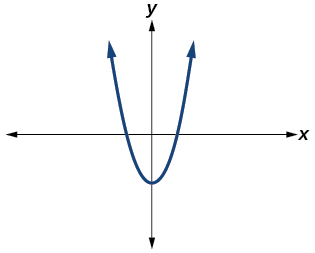
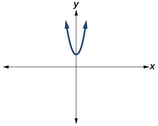

In this section, you will:
* Express square roots of negative numbers as multiples of  i.
* Plot complex numbers on the complex plane.
* Add and subtract complex numbers.
* Multiply and divide complex numbers.

The study of mathematics continuously builds upon itself. Negative integers, for example, fill a void left by the set of positive integers. The set of rational numbers, in turn, fills a void left by the set of integers. The set of real numbers fills a void left by the set of rational numbers. Not surprisingly, the set of real numbers has voids as well. For example, we still have no solution to equations such as

<math xmlns="http://www.w3.org/1998/Math/MathML" display="block"> <mrow> <msup> <mi>x</mi> <mn>2</mn> </msup> <mo>+</mo><mn>4</mn><mo>=</mo><mn>0</mn> </mrow> </math>

Our best guesses might be +2 or –2. But if we test +2 in this equation, it does not work. If we test –2, it does not work. If we want to have a solution for this equation, we will have to go farther than we have so far. After all, to this point we have described the square root of a negative number as undefined. Fortunately, there is another system of numbers that provides solutions to problems such as these. In this section, we will explore this number system and how to work within it.

### Expressing Square Roots of Negative Numbers as Multiples of *i*

We know how to find the square root of any positive real number. In a similar way, we can find the square root of a negative number. The difference is that the root is not real. If the value in the radicand is negative, the root is said to be an **imaginary number**{: data-type="term"}<strong>. </strong>The imaginary number<math xmlns="http://www.w3.org/1998/Math/MathML"> <mrow> <mtext> </mtext><mi>i</mi><mtext> </mtext> </mrow> </math>

is defined as the square root of negative 1.

<math xmlns="http://www.w3.org/1998/Math/MathML" display="block"> <mrow> <msqrt> <mrow> <mo>−</mo><mn>1</mn> </mrow> </msqrt> <mo>=</mo><mi>i</mi> </mrow> </math>

So, using properties of radicals,

<math xmlns="http://www.w3.org/1998/Math/MathML" display="block"> <mrow> <msup> <mi>i</mi> <mn>2</mn> </msup> <mo>=</mo><msup> <mrow> <mrow><mo>(</mo> <mrow> <msqrt> <mrow> <mo>−</mo><mn>1</mn> </mrow> </msqrt> </mrow> <mo>)</mo></mrow> </mrow> <mn>2</mn> </msup> <mo>=</mo><mo>−</mo><mn>1</mn> </mrow> </math>

We can write the square root of any negative number as a multiple of<math xmlns="http://www.w3.org/1998/Math/MathML"> <mrow> <mtext> </mtext><mi>i</mi><mo>.</mo><mtext> </mtext> </mrow> </math>

Consider the square root of –25.

<math xmlns="http://www.w3.org/1998/Math/MathML" display="block"> <mrow> <mtable columnalign="left"> <mtr columnalign="left"> <mtd columnalign="left"> <mrow> <mtable columnalign="left"> <mtr columnalign="left"> <mtd columnalign="left"> <mrow /> </mtd> </mtr> <mtr columnalign="left"> <mtd columnalign="left"> <mrow> <msqrt> <mrow> <mo>−</mo><mn>25</mn> </mrow> </msqrt> <mo>=</mo><msqrt> <mrow> <mn>25</mn><mo>⋅</mo><mo stretchy="false">(</mo><mo>−</mo><mn>1</mn><mo stretchy="false">)</mo> </mrow> </msqrt> </mrow> </mtd> </mtr> </mtable> </mrow> </mtd> </mtr> <mtr columnalign="left"> <mtd columnalign="left"> <mrow> <mtext>         </mtext><mo>=</mo><msqrt> <mrow> <mn>25</mn> </mrow> </msqrt> <msqrt> <mrow> <mo>−</mo><mn>1</mn> </mrow> </msqrt> </mrow> </mtd> </mtr> <mtr columnalign="left"> <mtd columnalign="left"> <mrow> <mtext>         </mtext><mo>=</mo><mn>5</mn><mi>i</mi> </mrow> </mtd> </mtr> </mtable> </mrow> </math>

We use<math xmlns="http://www.w3.org/1998/Math/MathML"> <mrow> <mtext> </mtext><mn>5</mn><mi>i</mi><mtext> </mtext> </mrow> </math>

and not<math xmlns="http://www.w3.org/1998/Math/MathML"> <mrow> <mtext> </mtext><mo>−</mo><mtext>5</mtext><mi>i</mi><mtext> </mtext> </mrow> </math>

 because the principal root of<math xmlns="http://www.w3.org/1998/Math/MathML"> <mrow> <mtext> </mtext><mn>25</mn><mtext> </mtext> </mrow> </math>

is the positive root.

A **complex number** is the sum of a real number and an imaginary number. A complex number is expressed in standard form when written<math xmlns="http://www.w3.org/1998/Math/MathML"> <mrow> <mtext> </mtext><mi>a</mi><mo>+</mo><mi>b</mi><mi>i</mi><mtext> </mtext> </mrow> </math>

where<math xmlns="http://www.w3.org/1998/Math/MathML"> <mrow> <mtext> </mtext><mi>a</mi><mtext> </mtext> </mrow> </math>

is the real part and<math xmlns="http://www.w3.org/1998/Math/MathML"> <mrow> <mtext> </mtext><mi>b</mi><mi>i</mi><mtext> </mtext> </mrow> </math>

is the imaginary part. For example,<math xmlns="http://www.w3.org/1998/Math/MathML"> <mrow> <mtext> </mtext><mn>5</mn><mo>+</mo><mn>2</mn><mi>i</mi><mtext> </mtext> </mrow> </math>

is a complex number. So, too, is<math xmlns="http://www.w3.org/1998/Math/MathML"> <mrow> <mtext> </mtext><mn>3</mn><mo>+</mo><mn>4</mn><msqrt> <mn>3</mn> </msqrt><mi>i</mi> <mo>.</mo> </mrow> </math>

Imaginary numbers are distinguished from real numbers because a squared imaginary number produces a negative real number. Recall, when a positive real number is squared, the result is a positive real number and when a negative real number is squared, again, the result is a positive real number. Complex numbers are a combination of real and imaginary numbers.

Imaginary and Complex Numbers

A **complex number**{: data-type="term"} is a number of the form<math xmlns="http://www.w3.org/1998/Math/MathML"> <mrow> <mtext> </mtext><mi>a</mi><mo>+</mo><mi>b</mi><mi>i</mi><mtext> </mtext> </mrow> </math>

where

* <math xmlns="http://www.w3.org/1998/Math/MathML"> <mrow> <mi>a</mi><mtext> </mtext> </mrow> </math>
  
  is the real part of the complex number.
* <math xmlns="http://www.w3.org/1998/Math/MathML"> <mrow> <mi>b</mi><mi>i</mi><mtext> </mtext> </mrow> </math>
  
  is the imaginary part of the complex number.

If<math xmlns="http://www.w3.org/1998/Math/MathML"> <mrow> <mtext> </mtext><mi>b</mi><mo>=</mo><mn>0</mn><mo>,</mo><mtext> </mtext> </mrow> </math>

then<math xmlns="http://www.w3.org/1998/Math/MathML"> <mrow> <mtext> </mtext><mi>a</mi><mo>+</mo><mi>b</mi><mi>i</mi><mtext> </mtext> </mrow> </math>

is a real number. If<math xmlns="http://www.w3.org/1998/Math/MathML"> <mrow> <mtext> </mtext><mi>a</mi><mo>=</mo><mn>0</mn><mtext> </mtext> </mrow> </math>

and<math xmlns="http://www.w3.org/1998/Math/MathML"> <mrow> <mtext> </mtext><mi>b</mi><mtext> </mtext> </mrow> </math>

is not equal to 0, the complex number is called an **imaginary number**. An imaginary number is an even root of a negative number.

**Given an imaginary number, express it in standard form.**

1.  Write
    <math xmlns="http://www.w3.org/1998/Math/MathML"> <mrow> <mtext> </mtext><msqrt> <mrow> <mo>−</mo><mi>a</mi> </mrow> </msqrt> <mtext> </mtext> </mrow> </math>
    
    as
    <math xmlns="http://www.w3.org/1998/Math/MathML"> <mrow> <mtext> </mtext><msqrt> <mi>a</mi> </msqrt> <msqrt> <mrow> <mo>−</mo><mn>1</mn> </mrow> </msqrt> <mo>.</mo> </mrow> </math>

2.  Express
    <math xmlns="http://www.w3.org/1998/Math/MathML"> <mrow> <mtext> </mtext><msqrt> <mrow> <mo>−</mo><mn>1</mn> </mrow> </msqrt> <mtext> </mtext> </mrow> </math>
    
    as
    <math xmlns="http://www.w3.org/1998/Math/MathML"> <mrow> <mtext> </mtext><mi>i</mi><mo>.</mo> </mrow> </math>

3.  Write
    <math xmlns="http://www.w3.org/1998/Math/MathML"> <mrow> <mtext> </mtext><msqrt> <mi>a</mi> </msqrt> <mo>⋅</mo><mi>i</mi><mtext> </mtext> </mrow> </math>
    
    in simplest form.
{: data-number-style="arabic"}

Expressing an Imaginary Number in Standard Form

Express<math xmlns="http://www.w3.org/1998/Math/MathML"> <mrow> <mtext> </mtext><msqrt> <mrow> <mo>−</mo><mn>9</mn> </mrow> </msqrt> <mtext> </mtext> </mrow> </math>

in standard form.

<math xmlns="http://www.w3.org/1998/Math/MathML" display="block"> <mrow> <msqrt> <mrow> <mo>−</mo><mn>9</mn> </mrow> </msqrt> <mo>=</mo><msqrt> <mn>9</mn> </msqrt> <msqrt> <mrow> <mo>−</mo><mn>1</mn> </mrow> </msqrt> <mo>=</mo><mn>3</mn><mi>i</mi> </mrow> </math>

In standard form, this is<math xmlns="http://www.w3.org/1998/Math/MathML"> <mrow> <mtext> </mtext><mn>0</mn><mo>+</mo><mn>3</mn><mi>i</mi><mo>.</mo> </mrow> </math>

Express<math xmlns="http://www.w3.org/1998/Math/MathML"> <mrow> <mtext> </mtext><msqrt> <mrow> <mo>−</mo><mn>24</mn> </mrow> </msqrt> <mtext> </mtext> </mrow> </math>

in standard form.

<math xmlns="http://www.w3.org/1998/Math/MathML"> <mrow> <msqrt> <mrow> <mo>−</mo><mn>24</mn> </mrow> </msqrt> <mo>=</mo><mn>0</mn><mo>+</mo><mn>2</mn><mi>i</mi><msqrt> <mn>6</mn> </msqrt> </mrow> </math>

### Plotting a Complex Number on the Complex Plane

We cannot plot complex numbers on a number line as we might real numbers. However, we can still represent them graphically. To represent a complex number we need to address the two components of the number. We use the **complex plane**{: data-type="term"}, which is a coordinate system in which the horizontal axis represents the real component and the vertical axis represents the imaginary component. Complex numbers are the points on the plane, expressed as ordered pairs<math xmlns="http://www.w3.org/1998/Math/MathML"> <mrow> <mtext> </mtext><mo stretchy="false">(</mo><mi>a</mi><mo>,</mo><mi>b</mi><mo stretchy="false">)</mo><mo>,</mo><mtext> </mtext> </mrow> </math>

where<math xmlns="http://www.w3.org/1998/Math/MathML"> <mrow> <mtext> </mtext><mi>a</mi><mtext> </mtext> </mrow> </math>

represents the coordinate for the horizontal axis and<math xmlns="http://www.w3.org/1998/Math/MathML"> <mrow> <mtext> </mtext><mi>b</mi><mtext> </mtext> </mrow> </math>

represents the coordinate for the vertical axis.

Let’s consider the number<math xmlns="http://www.w3.org/1998/Math/MathML"> <mrow> <mn>−2</mn><mo>+</mo><mn>3</mn><mi>i</mi><mo>.</mo><mtext> </mtext> </mrow> </math>

The real part of the complex number is<math xmlns="http://www.w3.org/1998/Math/MathML"> <mrow> <mn>−2</mn><mtext> </mtext> </mrow> </math>

and the imaginary part is<math xmlns="http://www.w3.org/1998/Math/MathML"> <mrow> <mtext> </mtext><mn>3</mn><mi>i</mi><mo>.</mo><mtext> </mtext> </mrow> </math>

We plot the ordered pair<math xmlns="http://www.w3.org/1998/Math/MathML"> <mrow> <mtext> </mtext><mo stretchy="false">(</mo><mn>−2</mn><mo>,</mo><mn>3</mn><mo stretchy="false">)</mo><mtext> </mtext> </mrow> </math>

to represent the complex number<math xmlns="http://www.w3.org/1998/Math/MathML"> <mrow> <mn>−2</mn><mo>+</mo><mn>3</mn><mi>i</mi><mtext> </mtext> </mrow> </math>

as shown in [\[link\]](#Figure_03_01_002)**.**

 {: #Figure_03_01_002}

Complex Plane

In the **complex plane**, the horizontal axis is the real axis, and the vertical axis is the imaginary axis as shown in [\[link\]](#Figure_03_01_003)**.**

{: #Figure_03_01_003}

**Given a complex number, represent its components on the complex plane.**

1.  Determine the real part and the imaginary part of the complex number.
2.  Move along the horizontal axis to show the real part of the number.
3.  Move parallel to the vertical axis to show the imaginary part of the number.
4.  Plot the point.
{: data-number-style="arabic"}

Plotting a Complex Number on the Complex Plane

Plot the complex number<math xmlns="http://www.w3.org/1998/Math/MathML"> <mrow> <mtext> </mtext><mn>3</mn><mo>−</mo><mn>4</mn><mi>i</mi><mtext> </mtext> </mrow> </math>

on the complex plane.

The real part of the complex number is<math xmlns="http://www.w3.org/1998/Math/MathML"> <mrow> <mtext> </mtext><mn>3</mn><mo>,</mo><mtext> </mtext> </mrow> </math>

and the imaginary part is<math xmlns="http://www.w3.org/1998/Math/MathML"> <mrow> <mtext> </mtext><mn>−4</mn><mi>i</mi><mo>.</mo><mtext> </mtext> </mrow> </math>

We plot the ordered pair<math xmlns="http://www.w3.org/1998/Math/MathML"> <mrow> <mtext> </mtext><mo stretchy="false">(</mo><mn>3</mn><mo>,</mo><mn>−4</mn><mo stretchy="false">)</mo><mtext> </mtext> </mrow> </math>

as shown in [[link]](#Figure_03_01_004).

{: #Figure_03_01_004}

Plot the complex number<math xmlns="http://www.w3.org/1998/Math/MathML"> <mrow> <mtext> </mtext><mn>−4</mn><mo>−</mo><mi>i</mi><mtext> </mtext> </mrow> </math>

on the complex plane.

### Adding and Subtracting Complex Numbers

Just as with real numbers, we can perform arithmetic operations on complex numbers. To add or subtract complex numbers, we combine the real parts and combine the imaginary parts.

Complex Numbers: Addition and Subtraction

Adding complex numbers:

<math xmlns="http://www.w3.org/1998/Math/MathML" display="block"> <mrow> <mrow><mo>(</mo> <mrow> <mi>a</mi><mo>+</mo><mi>b</mi><mi>i</mi> </mrow> <mo>)</mo></mrow><mo>+</mo><mrow><mo>(</mo> <mrow> <mi>c</mi><mo>+</mo><mi>d</mi><mi>i</mi> </mrow> <mo>)</mo></mrow><mo>=</mo><mrow><mo>(</mo> <mrow> <mi>a</mi><mo>+</mo><mi>c</mi> </mrow> <mo>)</mo></mrow><mo>+</mo><mrow><mo>(</mo> <mrow> <mi>b</mi><mo>+</mo><mi>d</mi> </mrow> <mo>)</mo></mrow><mi>i</mi> </mrow> </math>

Subtracting complex numbers:

<math xmlns="http://www.w3.org/1998/Math/MathML" display="block"> <mrow> <mrow><mo>(</mo> <mrow> <mi>a</mi><mo>+</mo><mi>b</mi><mi>i</mi> </mrow> <mo>)</mo></mrow><mo>−</mo><mrow><mo>(</mo> <mrow> <mi>c</mi><mo>+</mo><mi>d</mi><mi>i</mi> </mrow> <mo>)</mo></mrow><mo>=</mo><mrow><mo>(</mo> <mrow> <mi>a</mi><mo>−</mo><mi>c</mi> </mrow> <mo>)</mo></mrow><mo>+</mo><mrow><mo>(</mo> <mrow> <mi>b</mi><mo>−</mo><mi>d</mi> </mrow> <mo>)</mo></mrow><mi>i</mi> </mrow> </math>

**Given two complex numbers, find the sum or difference.**

1.  Identify the real and imaginary parts of each number.
2.  Add or subtract the real parts.
3.  Add or subtract the imaginary parts.
{: data-number-style="arabic"}

Adding Complex Numbers

Add<math xmlns="http://www.w3.org/1998/Math/MathML"> <mrow> <mtext> </mtext><mn>3</mn><mo>−</mo><mn>4</mn><mi>i</mi><mtext> </mtext> </mrow> </math>

and<math xmlns="http://www.w3.org/1998/Math/MathML"> <mrow> <mtext> </mtext><mn>2</mn><mo>+</mo><mn>5</mn><mi>i</mi><mo>.</mo><mtext> </mtext> </mrow> </math>

We add the real parts and add the imaginary parts.

<math xmlns="http://www.w3.org/1998/Math/MathML" display="block"> <mrow> <mtable columnalign="left"> <mtr columnalign="left"> <mtd columnalign="left"> <mrow> <mo stretchy="false">(</mo><mi>a</mi><mo>+</mo><mi>b</mi><mi>i</mi><mo stretchy="false">)</mo><mo>+</mo><mo stretchy="false">(</mo><mi>c</mi><mo>+</mo><mi>d</mi><mi>i</mi><mo stretchy="false">)</mo><mo>=</mo><mo stretchy="false">(</mo><mi>a</mi><mo>+</mo><mi>c</mi><mo stretchy="false">)</mo><mo>+</mo><mo stretchy="false">(</mo><mi>b</mi><mo>+</mo><mi>d</mi><mo stretchy="false">)</mo><mi>i</mi> </mrow> </mtd> </mtr> <mtr columnalign="left"> <mtd columnalign="left"> <mrow> <mo stretchy="false">(</mo><mn>3</mn><mo>−</mo><mn>4</mn><mi>i</mi><mo stretchy="false">)</mo><mo>+</mo><mo stretchy="false">(</mo><mn>2</mn><mo>+</mo><mn>5</mn><mi>i</mi><mo stretchy="false">)</mo><mo>=</mo><mo stretchy="false">(</mo><mn>3</mn><mo>+</mo><mn>2</mn><mo stretchy="false">)</mo><mo>+</mo><mo stretchy="false">(</mo><mo>−</mo><mn>4</mn><mo>+</mo><mn>5</mn><mo stretchy="false">)</mo><mi>i</mi> </mrow> </mtd> </mtr> <mtr columnalign="left"> <mtd columnalign="left"> <mrow> <mtext>                             </mtext><mo>=</mo><mn>5</mn><mo>+</mo><mi>i</mi> </mrow> </mtd> </mtr> </mtable> </mrow> </math>

Subtract<math xmlns="http://www.w3.org/1998/Math/MathML"> <mrow> <mtext> </mtext><mn>2</mn><mo>+</mo><mn>5</mn><mi>i</mi><mtext> </mtext> </mrow> </math>

from<math xmlns="http://www.w3.org/1998/Math/MathML"> <mrow> <mtext> </mtext><mn>3</mn><mo>–</mo><mn>4</mn><mi>i</mi><mo>.</mo><mtext> </mtext> </mrow> </math>

<math xmlns="http://www.w3.org/1998/Math/MathML"> <mrow> <mo stretchy="false">(</mo><mn>3</mn><mo>−</mo><mn>4</mn><mi>i</mi><mo stretchy="false">)</mo><mo>−</mo><mo stretchy="false">(</mo><mn>2</mn><mo>+</mo><mn>5</mn><mi>i</mi><mo stretchy="false">)</mo><mo>=</mo><mn>1</mn><mo>−</mo><mn>9</mn><mi>i</mi> </mrow> </math>

### Multiplying Complex Numbers

Multiplying complex numbers is much like multiplying binomials. The major difference is that we work with the real and imaginary parts separately.

#### Multiplying a Complex Numbers by a Real Number

Let’s begin by multiplying a complex number by a real number. We distribute the real number just as we would with a binomial. So, for example,

**Given a complex number and a real number, multiply to find the product.**

1.  Use the distributive property.
2.  Simplify.
{: data-number-style="arabic"}

Multiplying a Complex Number by a Real Number

Find the product<math xmlns="http://www.w3.org/1998/Math/MathML"> <mrow> <mtext> </mtext><mn>4</mn><mo stretchy="false">(</mo><mn>2</mn><mo>+</mo><mn>5</mn><mi>i</mi><mo stretchy="false">)</mo><mo>.</mo> </mrow> </math>

Distribute the 4.

<math xmlns="http://www.w3.org/1998/Math/MathML" display="block"> <mrow> <mtable columnalign="left"> <mtr columnalign="left"> <mtd columnalign="left"> <mrow> <mn>4</mn><mo stretchy="false">(</mo><mn>2</mn><mo>+</mo><mn>5</mn><mi>i</mi><mo stretchy="false">)</mo><mo>=</mo><mo stretchy="false">(</mo><mn>4</mn><mo>⋅</mo><mn>2</mn><mo stretchy="false">)</mo><mo>+</mo><mo stretchy="false">(</mo><mn>4</mn><mo>⋅</mo><mn>5</mn><mi>i</mi><mo stretchy="false">)</mo> </mrow> </mtd> </mtr> <mtr columnalign="left"> <mtd columnalign="left"> <mrow> <mtext> </mtext><mtext> </mtext><mtext> </mtext><mtext> </mtext><mtext> </mtext><mtext> </mtext><mtext> </mtext><mtext> </mtext><mtext> </mtext><mtext> </mtext><mtext> </mtext><mtext> </mtext><mtext> </mtext><mtext> </mtext><mtext> </mtext><mtext> </mtext><mtext> </mtext><mtext> </mtext><mtext> </mtext><mtext> </mtext><mtext> </mtext><mtext> </mtext><mo>=</mo><mn>8</mn><mo>+</mo><mn>20</mn><mi>i</mi> </mrow> </mtd> </mtr> </mtable> </mrow> </math>

Find the product<math xmlns="http://www.w3.org/1998/Math/MathML"> <mrow> <mtext> </mtext><mo>−</mo><mn>4</mn><mo stretchy="false">(</mo><mn>2</mn><mo>+</mo><mn>6</mn><mi>i</mi><mo stretchy="false">)</mo><mo>.</mo> </mrow> </math>

<math xmlns="http://www.w3.org/1998/Math/MathML"> <mrow> <mo>−</mo><mn>8</mn><mo>−</mo><mn>24</mn><mi>i</mi> </mrow> </math>

#### Multiplying Complex Numbers Together

Now, let’s multiply two complex numbers. We can use either the distributive property or the FOIL method. Recall that FOIL is an acronym for multiplying First, Outer, Inner, and Last terms together. Using either the distributive property or the FOIL method, we get

<math xmlns="http://www.w3.org/1998/Math/MathML" display="block"> <mrow> <mrow><mo>(</mo> <mrow> <mi>a</mi><mo>+</mo><mi>b</mi><mi>i</mi> </mrow> <mo>)</mo></mrow><mrow><mo>(</mo> <mrow> <mi>c</mi><mo>+</mo><mi>d</mi><mi>i</mi> </mrow> <mo>)</mo></mrow><mo>=</mo><mi>a</mi><mi>c</mi><mo>+</mo><mi>a</mi><mi>d</mi><mi>i</mi><mo>+</mo><mi>b</mi><mi>c</mi><mi>i</mi><mo>+</mo><mi>b</mi><mi>d</mi><msup> <mi>i</mi> <mn>2</mn> </msup> </mrow> </math>

Because<math xmlns="http://www.w3.org/1998/Math/MathML"> <mrow> <mtext> </mtext><msup> <mi>i</mi> <mn>2</mn> </msup> <mo>=</mo><mo>−</mo><mn>1</mn><mo>,</mo><mtext> </mtext> </mrow> </math>

we have

<math xmlns="http://www.w3.org/1998/Math/MathML" display="block"> <mrow> <mrow><mo>(</mo> <mrow> <mi>a</mi><mo>+</mo><mi>b</mi><mi>i</mi> </mrow> <mo>)</mo></mrow><mrow><mo>(</mo> <mrow> <mi>c</mi><mo>+</mo><mi>d</mi><mi>i</mi> </mrow> <mo>)</mo></mrow><mo>=</mo><mi>a</mi><mi>c</mi><mo>+</mo><mi>a</mi><mi>d</mi><mi>i</mi><mo>+</mo><mi>b</mi><mi>c</mi><mi>i</mi><mo>−</mo><mi>b</mi><mi>d</mi> </mrow> </math>

To simplify, we combine the real parts, and we combine the imaginary parts.

<math xmlns="http://www.w3.org/1998/Math/MathML" display="block"> <mrow> <mrow><mo>(</mo> <mrow> <mi>a</mi><mo>+</mo><mi>b</mi><mi>i</mi> </mrow> <mo>)</mo></mrow><mrow><mo>(</mo> <mrow> <mi>c</mi><mo>+</mo><mi>d</mi><mi>i</mi> </mrow> <mo>)</mo></mrow><mo>=</mo><mrow><mo>(</mo> <mrow> <mi>a</mi><mi>c</mi><mo>−</mo><mi>b</mi><mi>d</mi> </mrow> <mo>)</mo></mrow><mo>+</mo><mrow><mo>(</mo> <mrow> <mi>a</mi><mi>d</mi><mo>+</mo><mi>b</mi><mi>c</mi> </mrow> <mo>)</mo></mrow><mi>i</mi> </mrow> </math>

**Given two complex numbers, multiply to find the product.**

1.  Use the distributive property or the FOIL method.
2.  Simplify.
{: data-number-style="arabic"}

Multiplying a Complex Number by a Complex Number

Multiply<math xmlns="http://www.w3.org/1998/Math/MathML"> <mrow> <mtext> </mtext><mrow><mo>(</mo> <mrow> <mn>4</mn><mo>+</mo><mn>3</mn><mi>i</mi> </mrow> <mo>)</mo></mrow><mo stretchy="false">(</mo><mn>2</mn><mo>−</mo><mn>5</mn><mi>i</mi><mo stretchy="false">)</mo><mo>.</mo> </mrow> </math>

Use<math xmlns="http://www.w3.org/1998/Math/MathML"> <mrow> <mtext> </mtext><mo stretchy="false">(</mo><mi>a</mi><mo>+</mo><mi>b</mi><mi>i</mi><mo stretchy="false">)</mo><mo stretchy="false">(</mo><mi>c</mi><mo>+</mo><mi>d</mi><mi>i</mi><mo stretchy="false">)</mo><mo>=</mo><mo stretchy="false">(</mo><mi>a</mi><mi>c</mi><mo>−</mo><mi>b</mi><mi>d</mi><mo stretchy="false">)</mo><mo>+</mo><mo stretchy="false">(</mo><mi>a</mi><mi>d</mi><mo>+</mo><mi>b</mi><mi>c</mi><mo stretchy="false">)</mo><mi>i</mi> </mrow> </math>

<math xmlns="http://www.w3.org/1998/Math/MathML" display="block"> <mrow> <mtable columnalign="left"> <mtr columnalign="left"> <mtd columnalign="left"> <mrow> <mo stretchy="false">(</mo><mn>4</mn><mo>+</mo><mn>3</mn><mi>i</mi><mo stretchy="false">)</mo><mo stretchy="false">(</mo><mn>2</mn><mo>−</mo><mn>5</mn><mi>i</mi><mo stretchy="false">)</mo><mo>=</mo><mo stretchy="false">(</mo><mn>4</mn><mo>⋅</mo><mn>2</mn><mo>−</mo><mn>3</mn><mo>⋅</mo><mo stretchy="false">(</mo><mo>−</mo><mn>5</mn><mo stretchy="false">)</mo><mo stretchy="false">)</mo><mo>+</mo><mo stretchy="false">(</mo><mn>4</mn><mo>⋅</mo><mo stretchy="false">(</mo><mo>−</mo><mn>5</mn><mo stretchy="false">)</mo><mo>+</mo><mn>3</mn><mo>⋅</mo><mn>2</mn><mo stretchy="false">)</mo><mi>i</mi> </mrow> </mtd> </mtr> <mtr columnalign="left"> <mtd columnalign="left"> <mrow> <mtext>                        </mtext><mo>=</mo><mo stretchy="false">(</mo><mn>8</mn><mo>+</mo><mn>15</mn><mo stretchy="false">)</mo><mo>+</mo><mo stretchy="false">(</mo><mo>−</mo><mn>20</mn><mo>+</mo><mn>6</mn><mo stretchy="false">)</mo><mi>i</mi> </mrow> </mtd> </mtr> <mtr columnalign="left"> <mtd columnalign="left"> <mrow> <mtext>                        </mtext><mo>=</mo><mn>23</mn><mo>−</mo><mn>14</mn><mi>i</mi> </mrow> </mtd> </mtr> </mtable> </mrow> </math>

Multiply<math xmlns="http://www.w3.org/1998/Math/MathML"> <mrow> <mtext> </mtext><mo stretchy="false">(</mo><mn>3</mn><mo>−</mo><mn>4</mn><mi>i</mi><mo stretchy="false">)</mo><mo stretchy="false">(</mo><mn>2</mn><mo>+</mo><mn>3</mn><mi>i</mi><mo stretchy="false">)</mo><mo>.</mo> </mrow> </math>

<math xmlns="http://www.w3.org/1998/Math/MathML"> <mrow> <mn>18</mn><mo>+</mo><mi>i</mi> </mrow> </math>

### Dividing Complex Numbers

Division of two complex numbers is more complicated than addition, subtraction, and multiplication because we cannot divide by an imaginary number, meaning that any fraction must have a real-number denominator. We need to find a term by which we can multiply the numerator and the denominator that will eliminate the imaginary portion of the denominator so that we end up with a real number as the denominator. This term is called the **complex conjugate**{: data-type="term"} of the denominator, which is found by changing the sign of the imaginary part of the complex number. In other words, the complex conjugate of<math xmlns="http://www.w3.org/1998/Math/MathML"> <mrow> <mtext> </mtext><mi>a</mi><mo>+</mo><mi>b</mi><mi>i</mi><mtext> </mtext> </mrow> </math>

is<math xmlns="http://www.w3.org/1998/Math/MathML"> <mrow> <mtext> </mtext><mi>a</mi><mo>−</mo><mi>b</mi><mi>i</mi><mo>.</mo> </mrow> </math>

Note that complex conjugates have a reciprocal relationship: The complex conjugate of<math xmlns="http://www.w3.org/1998/Math/MathML"> <mrow> <mtext> </mtext><mi>a</mi><mo>+</mo><mi>b</mi><mi>i</mi><mtext> </mtext> </mrow> </math>

is<math xmlns="http://www.w3.org/1998/Math/MathML"> <mrow> <mtext> </mtext><mi>a</mi><mo>−</mo><mi>b</mi><mi>i</mi><mo>,</mo><mtext> </mtext> </mrow> </math>

and the complex conjugate of<math xmlns="http://www.w3.org/1998/Math/MathML"> <mrow> <mtext> </mtext><mi>a</mi><mo>−</mo><mi>b</mi><mi>i</mi><mtext> </mtext> </mrow> </math>

is<math xmlns="http://www.w3.org/1998/Math/MathML"> <mrow> <mtext> </mtext><mi>a</mi><mo>+</mo><mi>b</mi><mi>i</mi><mo>.</mo><mtext> </mtext> </mrow> </math>

Further, when a quadratic equation with real coefficients has complex solutions, the solutions are always complex conjugates of one another.

Suppose we want to divide<math xmlns="http://www.w3.org/1998/Math/MathML"> <mrow> <mtext> </mtext><mi>c</mi><mo>+</mo><mi>d</mi><mi>i</mi><mtext> </mtext> </mrow> </math>

by<math xmlns="http://www.w3.org/1998/Math/MathML"> <mrow> <mtext> </mtext><mi>a</mi><mo>+</mo><mi>b</mi><mi>i</mi><mo>,</mo><mtext> </mtext> </mrow> </math>

where neither<math xmlns="http://www.w3.org/1998/Math/MathML"> <mrow> <mtext> </mtext><mi>a</mi><mtext> </mtext> </mrow> </math>

nor<math xmlns="http://www.w3.org/1998/Math/MathML"> <mrow> <mtext> </mtext><mi>b</mi><mtext> </mtext> </mrow> </math>

equals zero. We first write the division as a fraction, then find the complex conjugate of the denominator, and multiply.

<math xmlns="http://www.w3.org/1998/Math/MathML" display="block"> <mrow> <mfrac> <mrow> <mi>c</mi><mo>+</mo><mi>d</mi><mi>i</mi> </mrow> <mrow> <mi>a</mi><mo>+</mo><mi>b</mi><mi>i</mi> </mrow> </mfrac> <mtext> where </mtext><mi>a</mi><mo>≠</mo><mn>0</mn><mtext> and </mtext><mi>b</mi><mo>≠</mo><mn>0</mn> </mrow> </math>

Multiply the numerator and denominator by the complex conjugate of the denominator.

<math xmlns="http://www.w3.org/1998/Math/MathML" display="block"> <mrow> <mfrac> <mrow> <mrow><mo>(</mo> <mrow> <mi>c</mi><mo>+</mo><mi>d</mi><mi>i</mi> </mrow> <mo>)</mo></mrow> </mrow> <mrow> <mrow><mo>(</mo> <mrow> <mi>a</mi><mo>+</mo><mi>b</mi><mi>i</mi> </mrow> <mo>)</mo></mrow> </mrow> </mfrac> <mo>⋅</mo><mfrac> <mrow> <mrow><mo>(</mo> <mrow> <mi>a</mi><mo>−</mo><mi>b</mi><mi>i</mi> </mrow> <mo>)</mo></mrow> </mrow> <mrow> <mrow><mo>(</mo> <mrow> <mi>a</mi><mo>−</mo><mi>b</mi><mi>i</mi> </mrow> <mo>)</mo></mrow> </mrow> </mfrac> <mo>=</mo><mfrac> <mrow> <mrow><mo>(</mo> <mrow> <mi>c</mi><mo>+</mo><mi>d</mi><mi>i</mi> </mrow> <mo>)</mo></mrow><mrow><mo>(</mo> <mrow> <mi>a</mi><mo>−</mo><mi>b</mi><mi>i</mi> </mrow> <mo>)</mo></mrow> </mrow> <mrow> <mrow><mo>(</mo> <mrow> <mi>a</mi><mo>+</mo><mi>b</mi><mi>i</mi> </mrow> <mo>)</mo></mrow><mrow><mo>(</mo> <mrow> <mi>a</mi><mo>−</mo><mi>b</mi><mi>i</mi> </mrow> <mo>)</mo></mrow> </mrow> </mfrac> </mrow> </math>

Apply the distributive property.

<math xmlns="http://www.w3.org/1998/Math/MathML" display="block"> <mrow> <mo>=</mo><mfrac> <mrow> <mi>c</mi><mi>a</mi><mo>−</mo><mi>c</mi><mi>b</mi><mi>i</mi><mo>+</mo><mi>a</mi><mi>d</mi><mi>i</mi><mo>−</mo><mi>b</mi><mi>d</mi><msup> <mi>i</mi> <mn>2</mn> </msup> </mrow> <mrow> <msup> <mi>a</mi> <mn>2</mn> </msup> <mo>−</mo><mi>a</mi><mi>b</mi><mi>i</mi><mo>+</mo><mi>a</mi><mi>b</mi><mi>i</mi><mo>−</mo><msup> <mi>b</mi> <mn>2</mn> </msup> <msup> <mi>i</mi> <mn>2</mn> </msup> </mrow> </mfrac> </mrow> </math>

Simplify, remembering that <math xmlns="http://www.w3.org/1998/Math/MathML"> <mrow> <mtext> </mtext><msup> <mi>i</mi> <mn>2</mn> </msup> <mo>=</mo><mn>−1.</mn> </mrow> </math>

<math xmlns="http://www.w3.org/1998/Math/MathML" display="block"> <mrow> <mtable columnalign="left"> <mtr columnalign="left"> <mtd columnalign="left"> <mrow> <mo>=</mo><mfrac> <mrow> <mi>c</mi><mi>a</mi><mo>−</mo><mi>c</mi><mi>b</mi><mi>i</mi><mo>+</mo><mi>a</mi><mi>d</mi><mi>i</mi><mo>−</mo><mi>b</mi><mi>d</mi><mo stretchy="false">(</mo><mo>−</mo><mn>1</mn><mo stretchy="false">)</mo> </mrow> <mrow> <msup> <mi>a</mi> <mn>2</mn> </msup> <mo>−</mo><mi>a</mi><mi>b</mi><mi>i</mi><mo>+</mo><mi>a</mi><mi>b</mi><mi>i</mi><mo>−</mo><msup> <mi>b</mi> <mn>2</mn> </msup> <mo stretchy="false">(</mo><mo>−</mo><mn>1</mn><mo stretchy="false">)</mo> </mrow> </mfrac> </mrow> </mtd> </mtr> <mtr columnalign="left"> <mtd columnalign="left"> <mrow> <mo>=</mo><mfrac> <mrow> <mo stretchy="false">(</mo><mi>c</mi><mi>a</mi><mo>+</mo><mi>b</mi><mi>d</mi><mo stretchy="false">)</mo><mo>+</mo><mo stretchy="false">(</mo><mi>a</mi><mi>d</mi><mo>−</mo><mi>c</mi><mi>b</mi><mo stretchy="false">)</mo><mi>i</mi> </mrow> <mrow> <msup> <mi>a</mi> <mn>2</mn> </msup> <mo>+</mo><msup> <mi>b</mi> <mn>2</mn> </msup> </mrow> </mfrac> </mrow> </mtd> </mtr> </mtable> </mrow> </math>

The Complex Conjugate

The **complex conjugate**{: data-type="term"} of a complex number<math xmlns="http://www.w3.org/1998/Math/MathML"> <mrow> <mtext> </mtext><mi>a</mi><mo>+</mo><mi>b</mi><mi>i</mi><mtext> </mtext> </mrow> </math>

is<math xmlns="http://www.w3.org/1998/Math/MathML"> <mrow> <mtext> </mtext><mi>a</mi><mo>−</mo><mi>b</mi><mi>i</mi><mo>.</mo><mtext> </mtext> </mrow> </math>

It is found by changing the sign of the imaginary part of the complex number. The real part of the number is left unchanged.

* When a complex number is multiplied by its complex conjugate, the result is a real number.
* When a complex number is added to its complex conjugate, the result is a real number.

Finding Complex Conjugates

Find the complex conjugate of each number.

1.  <math xmlns="http://www.w3.org/1998/Math/MathML"> <mrow> <mn>2</mn><mo>+</mo><mi>i</mi><msqrt> <mn>5</mn> </msqrt> </mrow> </math>

2.  <math xmlns="http://www.w3.org/1998/Math/MathML"> <mrow> <mo>−</mo><mfrac> <mn>1</mn> <mn>2</mn> </mfrac> <mi>i</mi> </mrow> </math>
{: data-number-style="lower-alpha"}

1.  The number is already in the form
    <math xmlns="http://www.w3.org/1998/Math/MathML"> <mrow> <mtext> </mtext><mi>a</mi><mo>+</mo><mi>b</mi><mi>i</mi><mo>.</mo><mtext> </mtext> </mrow> </math>
    
    The complex conjugate is
    <math xmlns="http://www.w3.org/1998/Math/MathML"> <mrow> <mtext> </mtext><mi>a</mi><mo>−</mo><mi>b</mi><mi>i</mi><mo>,</mo><mtext> </mtext> </mrow> </math>
    
    or
    <math xmlns="http://www.w3.org/1998/Math/MathML"> <mrow> <mtext> </mtext><mn>2</mn><mo>−</mo><mi>i</mi><msqrt> <mn>5</mn> </msqrt> <mo>.</mo> </mrow> </math>

2.  We can rewrite this number in the form
    <math xmlns="http://www.w3.org/1998/Math/MathML"> <mrow> <mtext> </mtext><mi>a</mi><mo>+</mo><mi>b</mi><mi>i</mi><mtext> </mtext> </mrow> </math>
    
    as
    <math xmlns="http://www.w3.org/1998/Math/MathML"> <mrow> <mtext> </mtext><mn>0</mn><mo>−</mo><mfrac> <mn>1</mn> <mn>2</mn> </mfrac> <mi>i</mi><mo>.</mo><mtext> </mtext> </mrow> </math>
    
    The complex conjugate is
    <math xmlns="http://www.w3.org/1998/Math/MathML"> <mrow> <mtext> </mtext><mi>a</mi><mo>−</mo><mi>b</mi><mi>i</mi><mo>,</mo><mtext> </mtext> </mrow> </math>
    
    or
    <math xmlns="http://www.w3.org/1998/Math/MathML"> <mrow> <mtext> </mtext><mn>0</mn><mo>+</mo><mfrac> <mn>1</mn> <mn>2</mn> </mfrac> <mi>i</mi><mo>.</mo><mtext> </mtext> </mrow> </math>
    
    This can be written simply as
    <math xmlns="http://www.w3.org/1998/Math/MathML"> <mrow> <mtext> </mtext><mfrac> <mn>1</mn> <mn>2</mn> </mfrac> <mi>i</mi><mo>.</mo> </mrow> </math>
{: data-number-style="lower-alpha"}

Analysis

Although we have seen that we can find the complex conjugate of an imaginary number, in practice we generally find the complex conjugates of only complex numbers with both a real and an imaginary component. To obtain a real number from an imaginary number, we can simply multiply by<math xmlns="http://www.w3.org/1998/Math/MathML"> <mrow> <mtext> </mtext><mi>i</mi><mo>.</mo> </mrow> </math>

**Given two complex numbers, divide one by the other.**

1.  Write the division problem as a fraction.
2.  Determine the complex conjugate of the denominator.
3.  Multiply the numerator and denominator of the fraction by the complex conjugate of the denominator.
4.  Simplify.
{: data-number-style="arabic"}

Dividing Complex Numbers

Divide<math xmlns="http://www.w3.org/1998/Math/MathML"> <mrow> <mtext> </mtext><mrow><mo>(</mo> <mrow> <mn>2</mn><mo>+</mo><mn>5</mn><mi>i</mi> </mrow> <mo>)</mo></mrow><mtext> </mtext> </mrow> </math>

by<math xmlns="http://www.w3.org/1998/Math/MathML"> <mrow> <mtext> </mtext><mrow><mo>(</mo> <mrow> <mn>4</mn><mo>−</mo><mi>i</mi> </mrow> <mo>)</mo></mrow><mo>.</mo> </mrow> </math>

We begin by writing the problem as a fraction.

<math xmlns="http://www.w3.org/1998/Math/MathML" display="block"> <mrow> <mfrac> <mrow> <mrow><mo>(</mo> <mrow> <mn>2</mn><mo>+</mo><mn>5</mn><mi>i</mi> </mrow> <mo>)</mo></mrow> </mrow> <mrow> <mrow><mo>(</mo> <mrow> <mn>4</mn><mo>−</mo><mi>i</mi> </mrow> <mo>)</mo></mrow> </mrow> </mfrac> </mrow> </math>

Then we multiply the numerator and denominator by the complex conjugate of the denominator.

<math xmlns="http://www.w3.org/1998/Math/MathML" display="block"> <mrow> <mfrac> <mrow> <mo stretchy="false">(</mo><mn>2</mn><mo>+</mo><mn>5</mn><mi>i</mi><mo stretchy="false">)</mo> </mrow> <mrow> <mo stretchy="false">(</mo><mn>4</mn><mo>−</mo><mi>i</mi><mo stretchy="false">)</mo> </mrow> </mfrac> <mo>⋅</mo><mfrac> <mrow> <mo stretchy="false">(</mo><mn>4</mn><mo>+</mo><mi>i</mi><mo stretchy="false">)</mo> </mrow> <mrow> <mo stretchy="false">(</mo><mn>4</mn><mo>+</mo><mi>i</mi><mo stretchy="false">)</mo> </mrow> </mfrac> </mrow> </math>

To multiply two complex numbers, we expand the product as we would with polynomials (the process commonly called FOIL).

<math xmlns="http://www.w3.org/1998/Math/MathML" display="block"> <mrow> <mtable columnalign="left"> <mtr columnalign="left"> <mtd columnalign="left"> <mrow> <mfrac> <mrow> <mo stretchy="false">(</mo><mn>2</mn><mo>+</mo><mn>5</mn><mi>i</mi><mo stretchy="false">)</mo> </mrow> <mrow> <mo stretchy="false">(</mo><mn>4</mn><mo>−</mo><mi>i</mi><mo stretchy="false">)</mo> </mrow> </mfrac> <mo>⋅</mo><mfrac> <mrow> <mo stretchy="false">(</mo><mn>4</mn><mo>+</mo><mi>i</mi><mo stretchy="false">)</mo> </mrow> <mrow> <mo stretchy="false">(</mo><mn>4</mn><mo>+</mo><mi>i</mi><mo stretchy="false">)</mo> </mrow> </mfrac> <mo>=</mo><mfrac> <mrow> <mn>8</mn><mo>+</mo><mn>2</mn><mi>i</mi><mo>+</mo><mn>20</mn><mi>i</mi><mo>+</mo><mn>5</mn><msup> <mi>i</mi> <mn>2</mn> </msup> </mrow> <mrow> <mn>16</mn><mo>+</mo><mn>4</mn><mi>i</mi><mo>−</mo><mn>4</mn><mi>i</mi><mo>−</mo><msup> <mi>i</mi> <mn>2</mn> </msup> </mrow> </mfrac> </mrow> </mtd> <mtd columnalign="left"> <mrow /> </mtd> </mtr> <mtr columnalign="left"> <mtd columnalign="left"> <mrow> <mtext>                           </mtext><mo>=</mo><mfrac> <mrow> <mn>8</mn><mo>+</mo><mn>2</mn><mi>i</mi><mo>+</mo><mn>20</mn><mi>i</mi><mo>+</mo><mn>5</mn><mo stretchy="false">(</mo><mo>−</mo><mn>1</mn><mo stretchy="false">)</mo> </mrow> <mrow> <mn>16</mn><mo>+</mo><mn>4</mn><mi>i</mi><mo>−</mo><mn>4</mn><mi>i</mi><mo>−</mo><mo stretchy="false">(</mo><mo>−</mo><mn>1</mn><mo stretchy="false">)</mo> </mrow> </mfrac> </mrow> </mtd> <mtd columnalign="left"> <mrow> <mtext>Because </mtext><mo> </mo><msup> <mi>i</mi> <mn>2</mn> </msup> <mo>=</mo><mo>−</mo><mn>1</mn> </mrow> </mtd> </mtr> <mtr columnalign="left"> <mtd columnalign="left"> <mrow> <mtext>                           </mtext><mo>=</mo><mfrac> <mrow> <mn>3</mn><mo>+</mo><mn>22</mn><mi>i</mi> </mrow> <mrow> <mn>17</mn> </mrow> </mfrac> </mrow> </mtd> <mtd columnalign="left"> <mrow /> </mtd> </mtr> <mtr columnalign="left"> <mtd columnalign="left"> <mrow> <mtext>                           </mtext><mo>=</mo><mfrac> <mn>3</mn> <mrow> <mn>17</mn> </mrow> </mfrac> <mo>+</mo><mfrac> <mrow> <mn>22</mn> </mrow> <mrow> <mn>17</mn> </mrow> </mfrac> <mi>i</mi> </mrow> </mtd> <mtd columnalign="left"> <mrow> <mtext>Separate real and imaginary parts</mtext><mo>.</mo> </mrow> </mtd> </mtr> </mtable> </mrow> </math>

Note that this expresses the quotient in standard form.

Substituting a Complex Number into a Polynomial Function

Let<math xmlns="http://www.w3.org/1998/Math/MathML"> <mrow> <mtext> </mtext><mi>f</mi><mo stretchy="false">(</mo><mi>x</mi><mo stretchy="false">)</mo><mo>=</mo><msup> <mi>x</mi> <mn>2</mn> </msup> <mo>−</mo><mn>5</mn><mi>x</mi><mo>+</mo><mn>2.</mn><mtext> </mtext> </mrow> </math>

Evaluate<math xmlns="http://www.w3.org/1998/Math/MathML"> <mrow> <mtext> </mtext><mi>f</mi><mrow><mo>(</mo> <mrow> <mn>3</mn><mo>+</mo><mi>i</mi> </mrow> <mo>)</mo></mrow><mo>.</mo> </mrow> </math>

Substitute<math xmlns="http://www.w3.org/1998/Math/MathML"> <mrow> <mtext> </mtext><mi>x</mi><mo>=</mo><mn>3</mn><mo>+</mo><mi>i</mi><mtext> </mtext> </mrow> </math>

into the function<math xmlns="http://www.w3.org/1998/Math/MathML"> <mrow> <mtext> </mtext><mi>f</mi><mo stretchy="false">(</mo><mi>x</mi><mo stretchy="false">)</mo><mo>=</mo><msup> <mi>x</mi> <mn>2</mn> </msup> <mo>−</mo><mn>5</mn><mi>x</mi><mo>+</mo><mn>2</mn><mtext> </mtext> </mrow> </math>

and simplify.

  

Analysis

We write<math xmlns="http://www.w3.org/1998/Math/MathML"> <mrow> <mtext> </mtext><mi>f</mi><mo stretchy="false">(</mo><mn>3</mn><mo>+</mo><mi>i</mi><mo stretchy="false">)</mo><mo>=</mo><mn>−5</mn><mo>+</mo><mi>i</mi><mo>.</mo><mtext> </mtext> </mrow> </math>

Notice that the input is<math xmlns="http://www.w3.org/1998/Math/MathML"> <mrow> <mtext> </mtext><mn>3</mn><mo>+</mo><mi>i</mi><mtext> </mtext> </mrow> </math>

and the output is<math xmlns="http://www.w3.org/1998/Math/MathML"> <mrow> <mtext> </mtext><mn>−5</mn><mo>+</mo><mi>i</mi><mo>.</mo> </mrow> </math>

Let<math xmlns="http://www.w3.org/1998/Math/MathML"> <mrow> <mtext> </mtext><mi>f</mi><mo stretchy="false">(</mo><mi>x</mi><mo stretchy="false">)</mo><mo>=</mo><mn>2</mn><msup> <mi>x</mi> <mn>2</mn> </msup> <mo>−</mo><mn>3</mn><mi>x</mi><mo>.</mo><mtext> </mtext> </mrow> </math>

Evaluate<math xmlns="http://www.w3.org/1998/Math/MathML"> <mrow> <mtext> </mtext><mi>f</mi><mrow><mo>(</mo> <mrow> <mn>8</mn><mo>−</mo><mi>i</mi> </mrow> <mo>)</mo></mrow><mo>.</mo> </mrow> </math>

<math xmlns="http://www.w3.org/1998/Math/MathML"> <mrow> <mn>102</mn><mo>−</mo><mn>29</mn><mi>i</mi> </mrow> </math>

Substituting an Imaginary Number in a Rational Function

Let<math xmlns="http://www.w3.org/1998/Math/MathML"> <mrow> <mtext> </mtext><mi>f</mi><mrow><mo>(</mo> <mi>x</mi> <mo>)</mo></mrow><mo>=</mo><mfrac> <mrow> <mn>2</mn><mo>+</mo><mi>x</mi> </mrow> <mrow> <mi>x</mi><mo>+</mo><mn>3</mn> </mrow> </mfrac> <mo>.</mo><mtext> </mtext> </mrow> </math>

Evaluate<math xmlns="http://www.w3.org/1998/Math/MathML"> <mrow> <mtext> </mtext><mi>f</mi><mrow><mo>(</mo> <mrow> <mn>10</mn><mi>i</mi> </mrow> <mo>)</mo></mrow><mo>.</mo> </mrow> </math>

Substitute<math xmlns="http://www.w3.org/1998/Math/MathML"> <mrow> <mtext> </mtext><mi>x</mi><mo>=</mo><mn>10</mn><mi>i</mi><mtext> </mtext> </mrow> </math>

and simplify.

<math xmlns="http://www.w3.org/1998/Math/MathML" display="block"> <mrow> <mtable columnalign="left"> <mtr columnalign="left"> <mtd columnalign="left"> <mrow> <mfrac> <mrow> <mn>2</mn><mo>+</mo><mn>10</mn><mi>i</mi> </mrow> <mrow> <mn>10</mn><mi>i</mi><mo>+</mo><mn>3</mn> </mrow> </mfrac> </mrow> </mtd> <mtd columnalign="left"> <mrow> <mtext>Substitute </mtext><mn>10</mn><mi>i</mi><mtext> for </mtext><mi>x</mi><mo>.</mo> </mrow> </mtd> </mtr> <mtr columnalign="left"> <mtd columnalign="left"> <mrow> <mfrac> <mrow> <mn>2</mn><mo>+</mo><mn>10</mn><mi>i</mi> </mrow> <mrow> <mn>3</mn><mo>+</mo><mn>10</mn><mi>i</mi> </mrow> </mfrac> </mrow> </mtd> <mtd columnalign="left"> <mrow> <mtext>Rewrite the denominator in standard form</mtext><mo>.</mo> </mrow> </mtd> </mtr> <mtr columnalign="left"> <mtd columnalign="left"> <mrow> <mfrac> <mrow> <mn>2</mn><mo>+</mo><mn>10</mn><mi>i</mi> </mrow> <mrow> <mn>3</mn><mo>+</mo><mn>10</mn><mi>i</mi> </mrow> </mfrac> <mo>⋅</mo><mfrac> <mrow> <mn>3</mn><mo>–</mo><mn>10</mn><mi>i</mi> </mrow> <mrow> <mn>3</mn><mo>–</mo><mn>10</mn><mi>i</mi> </mrow> </mfrac> </mrow> </mtd> <mtd columnalign="left"> <mrow> <mtext>Prepare to multiply the numerator and</mtext> </mrow> </mtd> </mtr> <mtr columnalign="left"> <mtd columnalign="left"> <mrow /> </mtd> <mtd columnalign="left"> <mrow> <mtext>denominator by the complex conjugate</mtext> </mrow> </mtd> </mtr> <mtr columnalign="left"> <mtd columnalign="left"> <mrow /> </mtd> <mtd columnalign="left"> <mrow> <mtext>of the denominator</mtext><mo>.</mo> </mrow> </mtd> </mtr> <mtr columnalign="left"> <mtd columnalign="left"> <mrow> <mfrac> <mrow> <mn>6</mn><mo>–</mo><mn>20</mn><mi>i</mi><mo>+</mo><mn>30</mn><mi>i</mi><mo>–</mo><mn>100</mn><msup> <mi>i</mi> <mn>2</mn> </msup> </mrow> <mrow> <mn>9</mn><mo>–</mo><mn>30</mn><mi>i</mi><mo>+</mo><mn>30</mn><mi>i</mi><mo>–</mo><mn>100</mn><msup> <mi>i</mi> <mn>2</mn> </msup> </mrow> </mfrac> </mrow> </mtd> <mtd columnalign="left"> <mrow> <mtext>Multiply using the distributive property or the FOIL method</mtext><mo>.</mo> </mrow> </mtd> </mtr> <mtr columnalign="left"> <mtd columnalign="left"> <mrow> <mfrac> <mrow> <mn>6</mn><mo>–</mo><mn>20</mn><mi>i</mi><mo>+</mo><mn>30</mn><mi>i</mi><mo>–</mo><mn>100</mn><mo stretchy="false">(</mo><mo>–</mo><mn>1</mn><mo stretchy="false">)</mo> </mrow> <mrow> <mn>9</mn><mo>–</mo><mn>30</mn><mi>i</mi><mo>+</mo><mn>30</mn><mi>i</mi><mo>–</mo><mn>100</mn><mo stretchy="false">(</mo><mo>–</mo><mn>1</mn><mo stretchy="false">)</mo> </mrow> </mfrac> </mrow> </mtd> <mtd columnalign="left"> <mrow> <mtext>Substitute –1 for</mtext><mo> </mo><msup> <mi>i</mi> <mn>2</mn> </msup> <mo>.</mo> </mrow> </mtd> </mtr> <mtr columnalign="left"> <mtd columnalign="left"> <mrow> <mfrac> <mrow> <mn>106</mn><mo>+</mo><mn>10</mn><mi>i</mi> </mrow> <mrow> <mn>109</mn> </mrow> </mfrac> </mrow> </mtd> <mtd columnalign="left"> <mrow> <mtext>Simplify</mtext><mo>.</mo> </mrow> </mtd> </mtr> <mtr columnalign="left"> <mtd columnalign="left"> <mrow> <mfrac> <mrow> <mn>106</mn> </mrow> <mrow> <mn>109</mn> </mrow> </mfrac> <mo>+</mo><mfrac> <mrow> <mn>10</mn> </mrow> <mrow> <mn>109</mn> </mrow> </mfrac> <mi>i</mi> </mrow> </mtd> <mtd columnalign="left"> <mrow> <mtext>Separate the real and imaginary parts</mtext><mo>.</mo> </mrow> </mtd> </mtr> </mtable> </mrow> </math>

Let<math xmlns="http://www.w3.org/1998/Math/MathML"> <mrow> <mtext> </mtext><mi>f</mi><mo stretchy="false">(</mo><mi>x</mi><mo stretchy="false">)</mo><mo>=</mo><mfrac> <mrow> <mi>x</mi><mo>+</mo><mn>1</mn> </mrow> <mrow> <mi>x</mi><mo>−</mo><mn>4</mn> </mrow> </mfrac> <mo>.</mo><mtext> </mtext> </mrow> </math>

Evaluate<math xmlns="http://www.w3.org/1998/Math/MathML"> <mrow> <mtext> </mtext><mi>f</mi><mrow><mo>(</mo> <mrow> <mo>−</mo><mi>i</mi> </mrow> <mo>)</mo></mrow><mo>.</mo> </mrow> </math>

<math xmlns="http://www.w3.org/1998/Math/MathML"> <mrow> <mo>−</mo><mfrac> <mn>3</mn> <mrow> <mn>17</mn> </mrow> </mfrac> <mo>+</mo><mfrac> <mrow> <mn>5</mn><mi>i</mi> </mrow> <mrow> <mn>17</mn> </mrow> </mfrac> </mrow> </math>

### Simplifying Powers of *i*

The powers of<math xmlns="http://www.w3.org/1998/Math/MathML"> <mrow> <mtext> </mtext><mi>i</mi><mtext> </mtext> </mrow> </math>

are cyclic. Let’s look at what happens when we raise<math xmlns="http://www.w3.org/1998/Math/MathML"> <mrow> <mtext> </mtext><mi>i</mi><mtext> </mtext> </mrow> </math>

to increasing powers.

<math xmlns="http://www.w3.org/1998/Math/MathML" display="block"> <mtable columnalign="left"> <mtr> <mtd> <msup> <mi>i</mi> <mn>1</mn> </msup> <mo>=</mo><mi>i</mi> </mtd> </mtr> <mtr> <mtd> <msup> <mi>i</mi> <mn>2</mn> </msup> <mo>=</mo><mo>−</mo><mn>1</mn> </mtd> </mtr> <mtr> <mtd> <msup> <mi>i</mi> <mn>3</mn> </msup> <mo>=</mo><msup> <mi>i</mi> <mn>2</mn> </msup> <mo>⋅</mo><mi>i</mi><mo>=</mo><mo>−</mo><mn>1</mn><mo>⋅</mo><mi>i</mi><mo>=</mo><mo>−</mo><mi>i</mi> </mtd> </mtr> <mtr> <mtd> <msup> <mi>i</mi> <mn>4</mn> </msup> <mo>=</mo><msup> <mi>i</mi> <mn>3</mn> </msup> <mo>⋅</mo><mi>i</mi><mo>=</mo><mo>−</mo><mi>i</mi><mo>⋅</mo><mi>i</mi><mo>=</mo><mo>−</mo><msup> <mi>i</mi> <mn>2</mn> </msup> <mo>=</mo><mo>−</mo><mo stretchy="false">(</mo><mo>−</mo><mn>1</mn><mo stretchy="false">)</mo><mo>=</mo><mn>1</mn> </mtd> </mtr> <mtr> <mtd> <msup> <mi>i</mi> <mn>5</mn> </msup> <mo>=</mo><msup> <mi>i</mi> <mn>4</mn> </msup> <mo>⋅</mo><mi>i</mi><mo>=</mo><mn>1</mn><mo>⋅</mo><mi>i</mi><mo>=</mo><mi>i</mi> </mtd> </mtr> </mtable> </math>

We can see that when we get to the fifth power of<math xmlns="http://www.w3.org/1998/Math/MathML"> <mrow> <mtext> </mtext><mi>i</mi><mo>,</mo><mtext> </mtext> </mrow> </math>

it is equal to the first power. As we continue to multiply<math xmlns="http://www.w3.org/1998/Math/MathML"> <mrow> <mtext> </mtext><mi>i</mi><mtext> </mtext> </mrow> </math>

by itself for increasing powers, we will see a cycle of 4. Let’s examine the next 4 powers of<math xmlns="http://www.w3.org/1998/Math/MathML"> <mrow> <mtext> </mtext><mi>i</mi><mo>.</mo> </mrow> </math>

<math xmlns="http://www.w3.org/1998/Math/MathML" display="block"> <mtable columnalign="left"> <mtr> <mtd> <msup> <mi>i</mi> <mn>6</mn> </msup> <mo>=</mo><msup> <mi>i</mi> <mn>5</mn> </msup> <mo>⋅</mo><mi>i</mi><mo>=</mo><mi>i</mi><mo>⋅</mo><mi>i</mi><mo>=</mo><msup> <mi>i</mi> <mn>2</mn> </msup> <mo>=</mo><mo>−</mo><mn>1</mn> </mtd> </mtr> <mtr> <mtd> <msup> <mi>i</mi> <mn>7</mn> </msup> <mo>=</mo><msup> <mi>i</mi> <mn>6</mn> </msup> <mo>⋅</mo><mi>i</mi><mo>=</mo><msup> <mi>i</mi> <mn>2</mn> </msup> <mo>⋅</mo><mi>i</mi><mo>=</mo><msup> <mi>i</mi> <mn>3</mn> </msup> <mo>=</mo><mo>−</mo><mi>i</mi> </mtd> </mtr> <mtr> <mtd> <msup> <mi>i</mi> <mn>8</mn> </msup> <mo>=</mo><msup> <mi>i</mi> <mn>7</mn> </msup> <mo>⋅</mo><mi>i</mi><mo>=</mo><msup> <mi>i</mi> <mn>3</mn> </msup> <mo>⋅</mo><mi>i</mi><mo>=</mo><msup> <mi>i</mi> <mn>4</mn> </msup> <mo>=</mo><mn>1</mn> </mtd> </mtr> <mtr> <mtd> <msup> <mi>i</mi> <mn>9</mn> </msup> <mo>=</mo><msup> <mi>i</mi> <mn>8</mn> </msup> <mo>⋅</mo><mi>i</mi><mo>=</mo><msup> <mi>i</mi> <mn>4</mn> </msup> <mo>⋅</mo><mi>i</mi><mo>=</mo><msup> <mi>i</mi> <mn>5</mn> </msup> <mo>=</mo><mi>i</mi> </mtd> </mtr> </mtable> </math>

Simplifying Powers of
<math xmlns="http://www.w3.org/1998/Math/MathML"> <mrow> <mtext> </mtext><mi>i</mi> </mrow> </math>

Evaluate<math xmlns="http://www.w3.org/1998/Math/MathML"> <mrow> <mtext> </mtext><msup> <mi>i</mi> <mrow> <mn>35</mn> </mrow> </msup> <mo>.</mo> </mrow> </math>

Since<math xmlns="http://www.w3.org/1998/Math/MathML"> <mrow> <mtext> </mtext><msup> <mi>i</mi> <mn>4</mn> </msup> <mo>=</mo><mn>1</mn><mo>,</mo><mtext> </mtext> </mrow> </math>

we can simplify the problem by factoring out as many factors of<math xmlns="http://www.w3.org/1998/Math/MathML"> <mrow> <mtext> </mtext><msup> <mi>i</mi> <mn>4</mn> </msup> <mtext> </mtext> </mrow> </math>

as possible. To do so, first determine how many times 4 goes into 35:<math xmlns="http://www.w3.org/1998/Math/MathML"> <mrow> <mtext> </mtext><mn>35</mn><mo>=</mo><mn>4</mn><mo>⋅</mo><mn>8</mn><mo>+</mo><mn>3.</mn> </mrow> </math>

<math xmlns="http://www.w3.org/1998/Math/MathML"> <mrow> <msup> <mi>i</mi> <mrow> <mn>35</mn> </mrow> </msup> <mo>=</mo><msup> <mi>i</mi> <mrow> <mn>4</mn><mo>⋅</mo><mn>8</mn><mo>+</mo><mn>3</mn> </mrow> </msup> <mo>=</mo><msup> <mi>i</mi> <mrow> <mn>4</mn><mo>⋅</mo><mn>8</mn> </mrow> </msup> <mo>⋅</mo><msup> <mi>i</mi> <mn>3</mn> </msup> <mo>=</mo><msup> <mrow> <mrow><mo>(</mo> <mrow> <msup> <mi>i</mi> <mn>4</mn> </msup> </mrow> <mo>)</mo></mrow> </mrow> <mn>8</mn> </msup> <mo>⋅</mo><msup> <mi>i</mi> <mn>3</mn> </msup> <mo>=</mo><msup> <mn>1</mn> <mn>8</mn> </msup> <mo>⋅</mo><msup> <mi>i</mi> <mn>3</mn> </msup> <mo>=</mo><msup> <mi>i</mi> <mn>3</mn> </msup> <mo>=</mo><mo>−</mo><mi>i</mi> </mrow> </math>

**Can we write<math xmlns="http://www.w3.org/1998/Math/MathML"> <mrow> <mtext> </mtext><msup> <mi>i</mi> <mrow> <mn>35</mn> </mrow> </msup> <mtext> </mtext> </mrow> </math>

in other helpful ways?**

*As we saw in [\[link\]](#Example_03_01_10), we reduced<math xmlns="http://www.w3.org/1998/Math/MathML"> <mrow> <mtext> </mtext><msup> <mi>i</mi> <mrow> <mn>35</mn> </mrow> </msup> <mtext> </mtext> </mrow> </math>

to<math xmlns="http://www.w3.org/1998/Math/MathML"> <mrow> <mtext> </mtext><msup> <mi>i</mi> <mn>3</mn> </msup> <mtext> </mtext> </mrow> </math>

by dividing the exponent by 4 and using the remainder to find the simplified form. But perhaps another factorization of<math xmlns="http://www.w3.org/1998/Math/MathML"> <mrow> <mtext> </mtext><msup> <mi>i</mi> <mrow> <mn>35</mn> </mrow> </msup> <mtext> </mtext> </mrow> </math>

may be more useful. [\[link\]](#Table_03_01_01) shows some other possible factorizations.*

| <strong>Factorization of<math xmlns="http://www.w3.org/1998/Math/MathML">
 <mrow>
  <mtext> </mtext><msup>
   <mi>i</mi>
   <mrow>
    <mn>35</mn>
   </mrow>
  </msup>
  
 </mrow>
</math></strong> | <math xmlns="http://www.w3.org/1998/Math/MathML"> <mrow> <msup> <mi>i</mi> <mrow> <mn>34</mn> </mrow> </msup> <mo>⋅</mo><mi>i</mi> </mrow> </math>

 | <math xmlns="http://www.w3.org/1998/Math/MathML"> <mrow> <msup> <mi>i</mi> <mrow> <mn>33</mn> </mrow> </msup> <mo>⋅</mo><msup> <mi>i</mi> <mn>2</mn> </msup> </mrow> </math>

 | <math xmlns="http://www.w3.org/1998/Math/MathML"> <mrow> <msup> <mi>i</mi> <mrow> <mn>31</mn> </mrow> </msup> <mo>⋅</mo><msup> <mi>i</mi> <mn>4</mn> </msup> </mrow> </math>

 | <math xmlns="http://www.w3.org/1998/Math/MathML"> <mrow> <msup> <mi>i</mi> <mrow> <mn>19</mn> </mrow> </msup> <mo>⋅</mo><msup> <mi>i</mi> <mrow> <mn>16</mn> </mrow> </msup> </mrow> </math>

 |
| **Reduced form** | <math xmlns="http://www.w3.org/1998/Math/MathML"> <mrow> <msup> <mrow> <mrow><mo>(</mo> <mrow> <msup> <mi>i</mi> <mn>2</mn> </msup> </mrow> <mo>)</mo></mrow> </mrow> <mrow> <mn>17</mn> </mrow> </msup> <mo>⋅</mo><mi>i</mi> </mrow> </math>

 | <math xmlns="http://www.w3.org/1998/Math/MathML"> <mrow> <msup> <mi>i</mi> <mrow> <mn>33</mn> </mrow> </msup> <mo>⋅</mo><mrow><mo>(</mo> <mrow> <mo>−</mo><mn>1</mn> </mrow> <mo>)</mo></mrow> </mrow> </math>

 | <math xmlns="http://www.w3.org/1998/Math/MathML"> <mrow> <msup> <mi>i</mi> <mrow> <mn>31</mn> </mrow> </msup> <mo>⋅</mo><mn>1</mn> </mrow> </math>

 | <math xmlns="http://www.w3.org/1998/Math/MathML"> <mrow> <msup> <mi>i</mi> <mrow> <mn>19</mn> </mrow> </msup> <mo>⋅</mo><msup> <mrow> <mrow><mo>(</mo> <mrow> <msup> <mi>i</mi> <mn>4</mn> </msup> </mrow> <mo>)</mo></mrow> </mrow> <mn>4</mn> </msup> </mrow> </math>

 |
| **Simplified form** | <math xmlns="http://www.w3.org/1998/Math/MathML"> <mrow> <msup> <mrow> <mrow><mo>(</mo> <mrow> <mo>−</mo><mn>1</mn> </mrow> <mo>)</mo></mrow> </mrow> <mrow> <mn>17</mn> </mrow> </msup> <mo>⋅</mo><mi>i</mi> </mrow> </math>

 | <math xmlns="http://www.w3.org/1998/Math/MathML"> <mrow> <mo>−</mo><msup> <mi>i</mi> <mrow> <mn>33</mn> </mrow> </msup> </mrow> </math>

 | <math xmlns="http://www.w3.org/1998/Math/MathML"> <mrow> <msup> <mi>i</mi> <mrow> <mn>31</mn> </mrow> </msup> </mrow> </math>

 | <math xmlns="http://www.w3.org/1998/Math/MathML"> <mrow> <msup> <mi>i</mi> <mrow> <mn>19</mn> </mrow> </msup> </mrow> </math>

 |
{: #Table_03_01_01 summary=".."}

*Each of these will eventually result in the answer we obtained above but may require several more steps than our earlier method.*

Access these online resources for additional instruction and practice with complex numbers.

* [Adding and Subtracting Complex Numbers][1]
* [Multiply Complex Numbers][2]
* [Multiplying Complex Conjugates][3]
* [Raising *i* to Powers][4]

#### Key Concepts

* The square root of any negative number can be written as a multiple of
  <math xmlns="http://www.w3.org/1998/Math/MathML"> <mrow> <mtext> </mtext><mi>i</mi><mo>.</mo><mtext> </mtext> </mrow> </math>
  
  See [\[link\]](#Example_03_01_01).
* To plot a complex number, we use two number lines, crossed to form the complex plane. The horizontal axis is the real axis, and the vertical axis is the imaginary axis. See [\[link\]](#Example_03_01_02).
* Complex numbers can be added and subtracted by combining the real parts and combining the imaginary parts. See [\[link\]](#Example_03_01_03).
* Complex numbers can be multiplied and divided.
* To multiply complex numbers, distribute just as with polynomials. See [\[link\]](#Example_03_01_04), [\[link\]](#Example_03_01_05), and [\[link\]](#Example_03_01_08).
* To divide complex numbers, multiply both the numerator and denominator by the complex conjugate of the denominator to eliminate the complex number from the denominator. See [\[link\]](#Example_03_01_06), [\[link\]](#Example_03_01_07), and [\[link\]](#Example_03_01_09).
* The powers of
  <math xmlns="http://www.w3.org/1998/Math/MathML"> <mrow> <mtext> </mtext><mi>i</mi><mtext> </mtext> </mrow> </math>
  
  are cyclic, repeating every fourth one. See [\[link\]](#Example_03_01_10).

<section data-depth="1" class="section-exercises" markdown="1">
#### Verbal

Explain how to add complex numbers.

Add the real parts together and the imaginary parts together.

What is the basic principle in multiplication of complex numbers?

Give an example to show the product of two imaginary numbers is not always imaginary.

<math xmlns="http://www.w3.org/1998/Math/MathML"> <mrow> <mi>i</mi><mtext> </mtext> </mrow> </math>

times<math xmlns="http://www.w3.org/1998/Math/MathML"> <mrow> <mtext> </mtext><mi>i</mi><mtext> </mtext> </mrow> </math>

equals –1, which is not imaginary. (answers vary)

What is a characteristic of the plot of a real number in the complex plane?

#### Algebraic

For the following exercises, evaluate the algebraic expressions.

<math xmlns="http://www.w3.org/1998/Math/MathML"> <mrow> <mtext>If </mtext><mi>f</mi><mo stretchy="false">(</mo><mi>x</mi><mo stretchy="false">)</mo><mo>=</mo><msup> <mi>x</mi> <mn>2</mn> </msup> <mo>+</mo><mi>x</mi><mo>−</mo><mn>4</mn><mo>,</mo><mtext> </mtext> </mrow> </math>

evaluate<math xmlns="http://www.w3.org/1998/Math/MathML"> <mrow> <mtext> </mtext><mi>f</mi><mo stretchy="false">(</mo><mn>2</mn><mi>i</mi><mo stretchy="false">)</mo><mo>.</mo> </mrow> </math>

<math xmlns="http://www.w3.org/1998/Math/MathML"> <mrow> <mo>−</mo><mn>8</mn><mo>+</mo><mn>2</mn><mi>i</mi> </mrow> </math>

<math xmlns="http://www.w3.org/1998/Math/MathML"> <mrow> <mtext>If </mtext><mi>f</mi><mo stretchy="false">(</mo><mi>x</mi><mo stretchy="false">)</mo><mo>=</mo><msup> <mi>x</mi> <mn>3</mn> </msup> <mo>−</mo><mn>2</mn><mo>,</mo><mtext> </mtext> </mrow> </math>

evaluate<math xmlns="http://www.w3.org/1998/Math/MathML"> <mrow> <mtext> </mtext><mi>f</mi><mo stretchy="false">(</mo><mi>i</mi><mo stretchy="false">)</mo><mo>.</mo> </mrow> </math>

<math xmlns="http://www.w3.org/1998/Math/MathML"> <mrow> <mtext>If </mtext><mi>f</mi><mo stretchy="false">(</mo><mi>x</mi><mo stretchy="false">)</mo><mo>=</mo><msup> <mi>x</mi> <mn>2</mn> </msup> <mo>+</mo><mn>3</mn><mi>x</mi><mo>+</mo><mn>5</mn><mo>,</mo> </mrow> </math>

evaluate<math xmlns="http://www.w3.org/1998/Math/MathML"> <mrow> <mtext> </mtext><mi>f</mi><mo stretchy="false">(</mo><mn>2</mn><mo>+</mo><mi>i</mi><mo stretchy="false">)</mo><mo>.</mo> </mrow> </math>

<math xmlns="http://www.w3.org/1998/Math/MathML"> <mrow> <mn>14</mn><mo>+</mo><mn>7</mn><mi>i</mi> </mrow> </math>

<math xmlns="http://www.w3.org/1998/Math/MathML"> <mrow> <mtext>If </mtext><mi>f</mi><mo stretchy="false">(</mo><mi>x</mi><mo stretchy="false">)</mo><mo>=</mo><mn>2</mn><msup> <mi>x</mi> <mn>2</mn> </msup> <mo>+</mo><mi>x</mi><mo>−</mo><mn>3</mn><mo>,</mo><mtext> </mtext> </mrow> </math>

evaluate<math xmlns="http://www.w3.org/1998/Math/MathML"> <mrow> <mtext> </mtext><mi>f</mi><mo stretchy="false">(</mo><mn>2</mn><mo>−</mo><mn>3</mn><mi>i</mi><mo stretchy="false">)</mo><mo>.</mo> </mrow> </math>

<math xmlns="http://www.w3.org/1998/Math/MathML"> <mrow> <mtext>If </mtext><mi>f</mi><mo stretchy="false">(</mo><mi>x</mi><mo stretchy="false">)</mo><mo>=</mo><mfrac> <mrow> <mi>x</mi><mo>+</mo><mn>1</mn> </mrow> <mrow> <mn>2</mn><mo>−</mo><mi>x</mi> </mrow> </mfrac> <mo>,</mo><mtext> </mtext> </mrow> </math>

evaluate<math xmlns="http://www.w3.org/1998/Math/MathML"> <mrow> <mtext> </mtext><mi>f</mi><mo stretchy="false">(</mo><mn>5</mn><mi>i</mi><mo stretchy="false">)</mo><mo>.</mo> </mrow> </math>

<math xmlns="http://www.w3.org/1998/Math/MathML"> <mrow> <mo>−</mo><mfrac> <mrow> <mn>23</mn> </mrow> <mrow> <mn>29</mn> </mrow> </mfrac> <mo>+</mo><mfrac> <mrow> <mn>15</mn> </mrow> <mrow> <mn>29</mn> </mrow> </mfrac> <mi>i</mi> </mrow> </math>

<math xmlns="http://www.w3.org/1998/Math/MathML"> <mrow> <mtext>If </mtext><mi>f</mi><mo stretchy="false">(</mo><mi>x</mi><mo stretchy="false">)</mo><mo>=</mo><mfrac> <mrow> <mn>1</mn><mo>+</mo><mn>2</mn><mi>x</mi> </mrow> <mrow> <mi>x</mi><mo>+</mo><mn>3</mn> </mrow> </mfrac> <mo>,</mo><mtext> </mtext> </mrow> </math>

evaluate<math xmlns="http://www.w3.org/1998/Math/MathML"> <mrow> <mtext> </mtext><mi>f</mi><mo stretchy="false">(</mo><mn>4</mn><mi>i</mi><mo stretchy="false">)</mo><mo>.</mo> </mrow> </math>

#### Graphical

For the following exercises, determine the number of real and nonreal solutions for each quadratic function shown.

2 real and 0 nonreal

For the following exercises, plot the complex numbers on the complex plane.

<math xmlns="http://www.w3.org/1998/Math/MathML"> <mrow> <mn>1</mn><mo>−</mo><mn>2</mn><mi>i</mi> </mrow> </math>

<math xmlns="http://www.w3.org/1998/Math/MathML"> <mrow> <mo>−</mo><mn>2</mn><mo>+</mo><mn>3</mn><mi>i</mi> </mrow> </math>

<math xmlns="http://www.w3.org/1998/Math/MathML"> <mi>i</mi> </math>

<math xmlns="http://www.w3.org/1998/Math/MathML"> <mrow> <mo>−</mo><mn>3</mn><mo>−</mo><mn>4</mn><mi>i</mi> </mrow> </math>

#### Numeric

For the following exercises, perform the indicated operation and express the result as a simplified complex number.

<math xmlns="http://www.w3.org/1998/Math/MathML"> <mrow> <mrow><mo>(</mo> <mrow> <mn>3</mn><mo>+</mo><mn>2</mn><mi>i</mi> </mrow> <mo>)</mo></mrow><mo>+</mo><mo stretchy="false">(</mo><mn>5</mn><mo>−</mo><mn>3</mn><mi>i</mi><mo stretchy="false">)</mo> </mrow> </math>

<math xmlns="http://www.w3.org/1998/Math/MathML"> <mrow> <mn>8</mn><mo>−</mo><mi>i</mi> </mrow> </math>

<math xmlns="http://www.w3.org/1998/Math/MathML"> <mrow> <mrow><mo>(</mo> <mrow> <mo>−</mo><mn>2</mn><mo>−</mo><mn>4</mn><mi>i</mi> </mrow> <mo>)</mo></mrow><mo>+</mo><mrow><mo>(</mo> <mrow> <mn>1</mn><mo>+</mo><mn>6</mn><mi>i</mi> </mrow> <mo>)</mo></mrow> </mrow> </math>

<math xmlns="http://www.w3.org/1998/Math/MathML"> <mrow> <mrow><mo>(</mo> <mrow> <mo>−</mo><mn>5</mn><mo>+</mo><mn>3</mn><mi>i</mi> </mrow> <mo>)</mo></mrow><mo>−</mo><mo stretchy="false">(</mo><mn>6</mn><mo>−</mo><mi>i</mi><mo stretchy="false">)</mo> </mrow> </math>

<math xmlns="http://www.w3.org/1998/Math/MathML"> <mrow> <mo>−</mo><mn>11</mn><mo>+</mo><mn>4</mn><mi>i</mi> </mrow> </math>

<math xmlns="http://www.w3.org/1998/Math/MathML"> <mrow> <mrow><mo>(</mo> <mrow> <mn>2</mn><mo>−</mo><mn>3</mn><mi>i</mi> </mrow> <mo>)</mo></mrow><mo>−</mo><mo stretchy="false">(</mo><mn>3</mn><mo>+</mo><mn>2</mn><mi>i</mi><mo stretchy="false">)</mo> </mrow> </math>

<math xmlns="http://www.w3.org/1998/Math/MathML"> <mrow> <mo stretchy="false">(</mo><mo>−</mo><mn>4</mn><mo>+</mo><mn>4</mn><mi>i</mi><mo stretchy="false">)</mo><mo>−</mo><mo stretchy="false">(</mo><mo>−</mo><mn>6</mn><mo>+</mo><mn>9</mn><mi>i</mi><mo stretchy="false">)</mo> </mrow> </math>

<math xmlns="http://www.w3.org/1998/Math/MathML"> <mrow> <mn>2</mn><mo>−</mo><mn>5</mn><mi>i</mi> </mrow> </math>

<math xmlns="http://www.w3.org/1998/Math/MathML"> <mrow> <mrow><mo>(</mo> <mrow> <mn>2</mn><mo>+</mo><mn>3</mn><mi>i</mi> </mrow> <mo>)</mo></mrow><mo stretchy="false">(</mo><mn>4</mn><mi>i</mi><mo stretchy="false">)</mo> </mrow> </math>

<math xmlns="http://www.w3.org/1998/Math/MathML"> <mrow> <mrow><mo>(</mo> <mrow> <mn>5</mn><mo>−</mo><mn>2</mn><mi>i</mi> </mrow> <mo>)</mo></mrow><mo stretchy="false">(</mo><mn>3</mn><mi>i</mi><mo stretchy="false">)</mo> </mrow> </math>

<math xmlns="http://www.w3.org/1998/Math/MathML"> <mrow> <mn>6</mn><mo>+</mo><mn>15</mn><mi>i</mi> </mrow> </math>

<math xmlns="http://www.w3.org/1998/Math/MathML"> <mrow> <mrow><mo>(</mo> <mrow> <mn>6</mn><mo>−</mo><mn>2</mn><mi>i</mi> </mrow> <mo>)</mo></mrow><mo stretchy="false">(</mo><mn>5</mn><mo stretchy="false">)</mo> </mrow> </math>

<math xmlns="http://www.w3.org/1998/Math/MathML"> <mrow> <mrow><mo>(</mo> <mrow> <mo>−</mo><mn>2</mn><mo>+</mo><mn>4</mn><mi>i</mi> </mrow> <mo>)</mo></mrow><mrow><mo>(</mo> <mn>8</mn> <mo>)</mo></mrow> </mrow> </math>

<math xmlns="http://www.w3.org/1998/Math/MathML"> <mrow> <mo>−</mo><mn>16</mn><mo>+</mo><mn>32</mn><mi>i</mi> </mrow> </math>

<math xmlns="http://www.w3.org/1998/Math/MathML"> <mrow> <mrow><mo>(</mo> <mrow> <mn>2</mn><mo>+</mo><mn>3</mn><mi>i</mi> </mrow> <mo>)</mo></mrow><mo stretchy="false">(</mo><mn>4</mn><mo>−</mo><mi>i</mi><mo stretchy="false">)</mo> </mrow> </math>

<math xmlns="http://www.w3.org/1998/Math/MathML"> <mrow> <mrow><mo>(</mo> <mrow> <mo>−</mo><mn>1</mn><mo>+</mo><mn>2</mn><mi>i</mi> </mrow> <mo>)</mo></mrow><mo stretchy="false">(</mo><mo>−</mo><mn>2</mn><mo>+</mo><mn>3</mn><mi>i</mi><mo stretchy="false">)</mo> </mrow> </math>

<math xmlns="http://www.w3.org/1998/Math/MathML"> <mrow> <mo>−</mo><mn>4</mn><mo>−</mo><mn>7</mn><mi>i</mi> </mrow> </math>

<math xmlns="http://www.w3.org/1998/Math/MathML"> <mrow> <mrow><mo>(</mo> <mrow> <mn>4</mn><mo>−</mo><mn>2</mn><mi>i</mi> </mrow> <mo>)</mo></mrow><mo stretchy="false">(</mo><mn>4</mn><mo>+</mo><mn>2</mn><mi>i</mi><mo stretchy="false">)</mo> </mrow> </math>

<math xmlns="http://www.w3.org/1998/Math/MathML"> <mrow> <mrow><mo>(</mo> <mrow> <mn>3</mn><mo>+</mo><mn>4</mn><mi>i</mi> </mrow> <mo>)</mo></mrow><mrow><mo>(</mo> <mrow> <mn>3</mn><mo>−</mo><mn>4</mn><mi>i</mi> </mrow> <mo>)</mo></mrow> </mrow> </math>

25

<math xmlns="http://www.w3.org/1998/Math/MathML"> <mrow> <mfrac> <mrow> <mn>3</mn><mo>+</mo><mn>4</mn><mi>i</mi> </mrow> <mn>2</mn> </mfrac> </mrow> </math>

<math xmlns="http://www.w3.org/1998/Math/MathML"> <mrow> <mfrac> <mrow> <mn>6</mn><mo>−</mo><mn>2</mn><mi>i</mi> </mrow> <mn>3</mn> </mfrac> </mrow> </math>

<math xmlns="http://www.w3.org/1998/Math/MathML"> <mrow> <mn>2</mn><mo>−</mo><mfrac> <mn>2</mn> <mn>3</mn> </mfrac> <mi>i</mi> </mrow> </math>

<math xmlns="http://www.w3.org/1998/Math/MathML"> <mrow> <mfrac> <mrow> <mo>−</mo><mn>5</mn><mo>+</mo><mn>3</mn><mi>i</mi> </mrow> <mrow> <mn>2</mn><mi>i</mi> </mrow> </mfrac> </mrow> </math>

<math xmlns="http://www.w3.org/1998/Math/MathML"> <mrow> <mfrac> <mrow> <mn>6</mn><mo>+</mo><mn>4</mn><mi>i</mi> </mrow> <mi>i</mi> </mfrac> </mrow> </math>

<math xmlns="http://www.w3.org/1998/Math/MathML"> <mrow> <mn>4</mn><mo>−</mo><mn>6</mn><mi>i</mi> </mrow> </math>

<math xmlns="http://www.w3.org/1998/Math/MathML"> <mrow> <mfrac> <mrow> <mn>2</mn><mo>−</mo><mn>3</mn><mi>i</mi> </mrow> <mrow> <mn>4</mn><mo>+</mo><mn>3</mn><mi>i</mi> </mrow> </mfrac> </mrow> </math>

<math xmlns="http://www.w3.org/1998/Math/MathML"> <mrow> <mfrac> <mrow> <mn>3</mn><mo>+</mo><mn>4</mn><mi>i</mi> </mrow> <mrow> <mn>2</mn><mo>−</mo><mi>i</mi> </mrow> </mfrac> </mrow> </math>

<math xmlns="http://www.w3.org/1998/Math/MathML"> <mrow> <mfrac> <mn>2</mn> <mn>5</mn> </mfrac> <mo>+</mo><mfrac> <mrow> <mn>11</mn> </mrow> <mn>5</mn> </mfrac> <mi>i</mi> </mrow> </math>

<math xmlns="http://www.w3.org/1998/Math/MathML"> <mrow> <mfrac> <mrow> <mn>2</mn><mo>+</mo><mn>3</mn><mi>i</mi> </mrow> <mrow> <mn>2</mn><mo>−</mo><mn>3</mn><mi>i</mi> </mrow> </mfrac> </mrow> </math>

<math xmlns="http://www.w3.org/1998/Math/MathML"> <mrow> <msqrt> <mrow> <mo>−</mo><mn>9</mn> </mrow> </msqrt> <mo>+</mo><mn>3</mn><msqrt> <mrow> <mo>−</mo><mn>16</mn> </mrow> </msqrt> </mrow> </math>

<math xmlns="http://www.w3.org/1998/Math/MathML"> <mrow> <mn>15</mn><mi>i</mi> </mrow> </math>

<math xmlns="http://www.w3.org/1998/Math/MathML"> <mrow> <mo>−</mo><msqrt> <mrow> <mo>−</mo><mn>4</mn> </mrow> </msqrt> <mo>−</mo><mn>4</mn><msqrt> <mrow> <mo>−</mo><mn>25</mn> </mrow> </msqrt> </mrow> </math>

<math xmlns="http://www.w3.org/1998/Math/MathML"> <mrow> <mfrac> <mrow> <mn>2</mn><mo>+</mo><msqrt> <mrow> <mo>−</mo><mn>12</mn> </mrow> </msqrt> </mrow> <mn>2</mn> </mfrac> </mrow> </math>

<math xmlns="http://www.w3.org/1998/Math/MathML"> <mrow> <mn>1</mn><mo>+</mo><mi>i</mi><msqrt> <mn>3</mn> </msqrt> </mrow> </math>

<math xmlns="http://www.w3.org/1998/Math/MathML"> <mrow> <mfrac> <mrow> <mn>4</mn><mo>+</mo><msqrt> <mrow> <mo>−</mo><mn>20</mn> </mrow> </msqrt> </mrow> <mn>2</mn> </mfrac> </mrow> </math>

<math xmlns="http://www.w3.org/1998/Math/MathML"> <mrow> <msup> <mi>i</mi> <mn>8</mn> </msup> </mrow> </math>

<math xmlns="http://www.w3.org/1998/Math/MathML"> <mn>1</mn> </math>

<math xmlns="http://www.w3.org/1998/Math/MathML"> <mrow> <msup> <mi>i</mi> <mrow> <mn>15</mn> </mrow> </msup> </mrow> </math>

<math xmlns="http://www.w3.org/1998/Math/MathML"> <mrow> <msup> <mi>i</mi> <mrow> <mn>22</mn> </mrow> </msup> </mrow> </math>

<math xmlns="http://www.w3.org/1998/Math/MathML"> <mrow> <mo>−</mo><mn>1</mn> </mrow> </math>

#### Technology

For the following exercises, use a calculator to help answer the questions.

Evaluate<math xmlns="http://www.w3.org/1998/Math/MathML"> <mrow> <mtext> </mtext><msup> <mrow> <mo stretchy="false">(</mo><mn>1</mn><mo>+</mo><mi>i</mi><mo stretchy="false">)</mo> </mrow> <mi>k</mi> </msup> <mtext> </mtext> </mrow> </math>

for<math xmlns="http://www.w3.org/1998/Math/MathML"> <mrow> <mi>k</mi><mo>=</mo><mtext>4, 8, and 12</mtext><mtext>.</mtext> </mrow> </math>

Predict the value if<math xmlns="http://www.w3.org/1998/Math/MathML"> <mrow> <mtext> </mtext><mi>k</mi><mo>=</mo><mn>16.</mn> </mrow> </math>

Evaluate<math xmlns="http://www.w3.org/1998/Math/MathML"> <mrow> <mtext> </mtext><msup> <mrow> <mo stretchy="false">(</mo><mn>1</mn><mo>−</mo><mi>i</mi><mo stretchy="false">)</mo> </mrow> <mi>k</mi> </msup> <mtext> </mtext> </mrow> </math>

for<math xmlns="http://www.w3.org/1998/Math/MathML"> <mrow> <mi>k</mi><mo>=</mo><mtext>2, 6, and 10</mtext><mtext>.</mtext> </mrow> </math>

Predict the value if<math xmlns="http://www.w3.org/1998/Math/MathML"> <mrow> <mtext> </mtext><mi>k</mi><mo>=</mo><mn>14.</mn> </mrow> </math>

128i

Evaluate<math xmlns="http://www.w3.org/1998/Math/MathML"> <mrow> <mtext> </mtext><mo stretchy="false">(</mo><mn>1</mn><mo>+</mo><mi>i</mi><msup><mo stretchy="false">)</mo><mi>k</mi></msup> <mo>−</mo> <mo stretchy="false">(</mo><mn>1</mn><mo>−</mo><mi>i</mi><msup><mo stretchy="false">)</mo> <mi>k</mi></msup> </mrow> </math>

 for <math xmlns="http://www.w3.org/1998/Math/MathML"> <mrow> <mi>k</mi><mo>=</mo><mtext>4, 8, and 12</mtext> </mrow> </math>

. Predict the value for<math xmlns="http://www.w3.org/1998/Math/MathML"> <mrow> <mtext> </mtext><mi>k</mi><mo>=</mo><mn>16.</mn> </mrow> </math>

Show that a solution of<math xmlns="http://www.w3.org/1998/Math/MathML"> <mrow> <mtext> </mtext><msup> <mi>x</mi> <mn>6</mn> </msup> <mo>+</mo><mn>1</mn><mo>=</mo><mn>0</mn><mtext> </mtext> </mrow> </math>

is<math xmlns="http://www.w3.org/1998/Math/MathML"> <mrow> <mtext> </mtext><mfrac> <mrow> <msqrt> <mn>3</mn> </msqrt> </mrow> <mn>2</mn> </mfrac> <mo>+</mo><mfrac> <mn>1</mn> <mn>2</mn> </mfrac> <mi>i</mi><mo>.</mo> </mrow> </math>

<math xmlns="http://www.w3.org/1998/Math/MathML"> <mrow> <msup> <mrow> <mrow><mo>(</mo> <mrow> <mfrac> <mrow> <msqrt> <mn>3</mn> </msqrt> </mrow> <mn>2</mn> </mfrac> <mo>+</mo><mfrac> <mn>1</mn> <mn>2</mn> </mfrac> <mi>i</mi> </mrow> <mo>)</mo></mrow> </mrow> <mn>6</mn> </msup> <mo>=</mo><mo>−</mo><mn>1</mn> </mrow> </math>

Show that a solution of<math xmlns="http://www.w3.org/1998/Math/MathML"> <mrow> <mtext> </mtext><msup> <mi>x</mi> <mn>8</mn> </msup> <mo>−</mo><mn>1</mn><mo>=</mo><mn>0</mn><mtext> </mtext> </mrow> </math>

is<math xmlns="http://www.w3.org/1998/Math/MathML"> <mrow> <mtext> </mtext><mfrac> <mrow> <msqrt> <mn>2</mn> </msqrt> </mrow> <mn>2</mn> </mfrac> <mo>+</mo><mfrac> <mrow> <msqrt> <mn>2</mn> </msqrt> </mrow> <mn>2</mn> </mfrac> <mi>i</mi><mo>.</mo> </mrow> </math>

#### Extensions

For the following exercises, evaluate the expressions, writing the result as a simplified complex number.

<math xmlns="http://www.w3.org/1998/Math/MathML"> <mrow> <mfrac> <mn>1</mn> <mi>i</mi> </mfrac> <mo>+</mo><mfrac> <mn>4</mn> <mrow> <msup> <mi>i</mi> <mn>3</mn> </msup> </mrow> </mfrac> </mrow> </math>

<math xmlns="http://www.w3.org/1998/Math/MathML"> <mrow> <mn>3</mn><mi>i</mi> </mrow> </math>

<math xmlns="http://www.w3.org/1998/Math/MathML"> <mrow> <mfrac> <mn>1</mn> <mrow> <msup> <mi>i</mi> <mrow> <mn>11</mn> </mrow> </msup> </mrow> </mfrac> <mo>−</mo><mfrac> <mn>1</mn> <mrow> <msup> <mi>i</mi> <mrow> <mn>21</mn> </mrow> </msup> </mrow> </mfrac> </mrow> </math>

<math xmlns="http://www.w3.org/1998/Math/MathML"> <mrow> <msup> <mi>i</mi> <mn>7</mn> </msup> <mrow><mo>(</mo> <mrow> <mn>1</mn><mo>+</mo><msup> <mi>i</mi> <mn>2</mn> </msup> </mrow> <mo>)</mo></mrow> </mrow> </math>

0

<math xmlns="http://www.w3.org/1998/Math/MathML"> <mrow> <msup> <mi>i</mi> <mrow> <mn>−3</mn> </mrow> </msup> <mo>+</mo><mn>5</mn><msup> <mi>i</mi> <mn>7</mn> </msup> </mrow> </math>

<math xmlns="http://www.w3.org/1998/Math/MathML"> <mrow> <mfrac> <mrow> <mrow><mo>(</mo> <mrow> <mn>2</mn><mo>+</mo><mi>i</mi> </mrow> <mo>)</mo></mrow><mrow><mo>(</mo> <mrow> <mn>4</mn><mo>−</mo><mn>2</mn><mi>i</mi> </mrow> <mo>)</mo></mrow> </mrow> <mrow> <mo stretchy="false">(</mo><mn>1</mn><mo>+</mo><mi>i</mi><mo stretchy="false">)</mo> </mrow> </mfrac> </mrow> </math>

5 – 5i

<math xmlns="http://www.w3.org/1998/Math/MathML"> <mrow> <mfrac> <mrow> <mrow><mo>(</mo> <mrow> <mn>1</mn><mo>+</mo><mn>3</mn><mi>i</mi> </mrow> <mo>)</mo></mrow><mrow><mo>(</mo> <mrow> <mn>2</mn><mo>−</mo><mn>4</mn><mi>i</mi> </mrow> <mo>)</mo></mrow> </mrow> <mrow> <mo stretchy="false">(</mo><mn>1</mn><mo>+</mo><mn>2</mn><mi>i</mi><mo stretchy="false">)</mo> </mrow> </mfrac> </mrow> </math>

<math xmlns="http://www.w3.org/1998/Math/MathML"> <mrow> <mfrac> <mrow> <msup> <mrow> <mrow><mo>(</mo> <mrow> <mn>3</mn><mo>+</mo><mi>i</mi> </mrow> <mo>)</mo></mrow> </mrow> <mn>2</mn> </msup> </mrow> <mrow> <msup> <mrow> <mrow><mo>(</mo> <mrow> <mn>1</mn><mo>+</mo><mn>2</mn><mi>i</mi> </mrow> <mo>)</mo></mrow> </mrow> <mn>2</mn> </msup> </mrow> </mfrac> </mrow> </math>

<math xmlns="http://www.w3.org/1998/Math/MathML"> <mrow> <mo>−</mo><mn>2</mn><mi>i</mi> </mrow> </math>

<math xmlns="http://www.w3.org/1998/Math/MathML"> <mrow> <mfrac> <mrow> <mn>3</mn><mo>+</mo><mn>2</mn><mi>i</mi> </mrow> <mrow> <mn>2</mn><mo>+</mo><mi>i</mi> </mrow> </mfrac> <mo>+</mo><mrow><mo>(</mo> <mrow> <mn>4</mn><mo>+</mo><mn>3</mn><mi>i</mi> </mrow> <mo>)</mo></mrow> </mrow> </math>

<math xmlns="http://www.w3.org/1998/Math/MathML"> <mrow> <mfrac> <mrow> <mn>4</mn><mo>+</mo><mi>i</mi> </mrow> <mi>i</mi> </mfrac> <mo>+</mo><mfrac> <mrow> <mn>3</mn><mo>−</mo><mn>4</mn><mi>i</mi> </mrow> <mrow> <mn>1</mn><mo>−</mo><mi>i</mi> </mrow> </mfrac> </mrow> </math>

<math xmlns="http://www.w3.org/1998/Math/MathML"> <mrow> <mfrac> <mn>9</mn> <mn>2</mn> </mfrac> <mo>−</mo><mfrac> <mn>9</mn> <mn>2</mn> </mfrac> <mi>i</mi> </mrow> </math>

<math xmlns="http://www.w3.org/1998/Math/MathML"> <mrow> <mfrac> <mrow> <mn>3</mn><mo>+</mo><mn>2</mn><mi>i</mi> </mrow> <mrow> <mn>1</mn><mo>+</mo><mn>2</mn><mi>i</mi> </mrow> </mfrac> <mo>−</mo><mfrac> <mrow> <mn>2</mn><mo>−</mo><mn>3</mn><mi>i</mi> </mrow> <mrow> <mn>3</mn><mo>+</mo><mi>i</mi> </mrow> </mfrac> </mrow> </math>

</section>

### Glossary
{: data-type="glossary-title"}

complex conjugate
: the complex number in which the sign of the imaginary part is changed and the real part of the number is left unchanged; when added to or multiplied by the original complex number, the result is a real number
^

complex number
: the sum of a real number and an imaginary number, written in the standard form
  <math xmlns="http://www.w3.org/1998/Math/MathML" display="block"> <mrow> <mtext> </mtext><mi>a</mi><mo>+</mo><mi>b</mi><mi>i</mi><mo>,</mo><mtext> </mtext> </mrow> </math>
  
  where
  <math xmlns="http://www.w3.org/1998/Math/MathML"> <mrow> <mtext> </mtext><mi>a</mi><mtext> </mtext> </mrow> </math>
  
  is the real part, and
  <math xmlns="http://www.w3.org/1998/Math/MathML"> <mrow> <mtext> </mtext><mi>b</mi><mi>i</mi><mtext> </mtext> </mrow> </math>
  
  is the imaginary part
^

complex plane
: a coordinate system in which the horizontal axis is used to represent the real part of a complex number and the vertical axis is used to represent the imaginary part of a complex number
^

imaginary number
: a number in the form
  <math xmlns="http://www.w3.org/1998/Math/MathML"> <mrow> <mtext> </mtext><mi>b</mi><mi>i</mi><mtext> </mtext> </mrow> </math>
  
  where
  <math xmlns="http://www.w3.org/1998/Math/MathML"> <mrow> <mtext> </mtext><mi>i</mi><mo>=</mo><msqrt> <mrow> <mo>−</mo><mn>1</mn> </mrow> </msqrt> </mrow> </math>

[1]: http://openstaxcollege.org/l/addsubcomplex
[2]: http://openstaxcollege.org/l/multiplycomplex
[3]: http://openstaxcollege.org/l/multcompconj
[4]: http://openstaxcollege.org/l/raisingi
