

In this section, you will:
* Find exact values of the trigonometric functions secant, cosecant, tangent, and cotangent of
  <math xmlns="http://www.w3.org/1998/Math/MathML"> <mrow> <mtext> </mtext><mfrac> <mi>π</mi> <mn>3</mn> </mfrac> <mo>,</mo><mtext> </mtext> </mrow> </math>
  
  <math xmlns="http://www.w3.org/1998/Math/MathML"> <mrow> <mfrac> <mi>π</mi> <mn>4</mn> </mfrac> <mo>,</mo><mtext> </mtext> </mrow> </math>
  
  and
  <math xmlns="http://www.w3.org/1998/Math/MathML"> <mrow> <mtext> </mtext><mfrac> <mi>π</mi> <mn>6</mn> </mfrac> <mo>.</mo> </mrow> </math>

* Use reference angles to evaluate the trigonometric functions secant, cosecant, tangent, and cotangent.
* Use properties of even and odd trigonometric functions.
* Recognize and use fundamental identities.
* Evaluate trigonometric functions with a calculator.

A wheelchair ramp that meets the standards of the Americans with Disabilities Act must make an angle with the ground whose tangent is<math xmlns="http://www.w3.org/1998/Math/MathML"> <mrow> <mtext> </mtext><mfrac> <mn>1</mn> <mrow> <mn>12</mn></mrow> </mfrac> <mtext> </mtext></mrow> </math>

or less, regardless of its length. A tangent represents a ratio, so this means that for every 1 inch of rise, the ramp must have 12 inches of run. Trigonometric functions allow us to specify the shapes and proportions of objects independent of exact dimensions. We have already defined the sine and cosine functions of an angle. Though sine and cosine are the trigonometric functions most often used, there are four others. Together they make up the set of six trigonometric functions. In this section, we will investigate the remaining functions.

###  Finding Exact Values of the Trigonometric Functions Secant, Cosecant, Tangent, and Cotangent 

To define the remaining functions, we will once again draw a unit circle with a point<math xmlns="http://www.w3.org/1998/Math/MathML"> <mrow> <mtext> </mtext><mrow><mo>(</mo> <mrow> <mi>x</mi><mo>,</mo><mi>y</mi></mrow> <mo>)</mo></mrow><mtext> </mtext></mrow> </math>

corresponding to an angle of<math xmlns="http://www.w3.org/1998/Math/MathML"> <mrow> <mtext> </mtext><mi>t</mi><mo>,</mo></mrow> </math>

as shown in [\[link\]](#Figure_05_03_001). As with the sine and cosine, we can use the<math xmlns="http://www.w3.org/1998/Math/MathML"> <mrow> <mtext> </mtext><mrow><mo>(</mo> <mrow> <mi>x</mi><mo>,</mo><mi>y</mi></mrow> <mo>)</mo></mrow><mtext> </mtext></mrow> </math>

coordinates to find the other functions.

 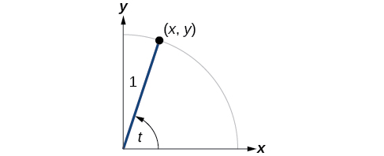{: #Figure_05_03_001}

The first function we will define is the tangent. The **tangent**{: data-type="term"} of an angle is the ratio of the *y*-value to the *x*-value of the corresponding point on the unit circle. In [\[link\]](#Figure_05_03_001), the tangent of angle<math xmlns="http://www.w3.org/1998/Math/MathML"> <mrow> <mtext> </mtext><mi>t</mi><mtext> </mtext></mrow> </math>

is equal to<math xmlns="http://www.w3.org/1998/Math/MathML"> <mrow> <mtext> </mtext><mfrac> <mi>y</mi> <mi>x</mi> </mfrac> <mo>,</mo><mi>x</mi><mn>≠0.</mn><mtext> </mtext></mrow> </math>

Because the *y*-value is equal to the sine of<math xmlns="http://www.w3.org/1998/Math/MathML"> <mrow> <mtext>  </mtext><mi>t</mi><mo>,</mo></mrow> </math>

 and the *x*-value is equal to the cosine of<math xmlns="http://www.w3.org/1998/Math/MathML"> <mrow> <mtext>  </mtext><mi>t</mi><mo>,</mo></mrow> </math>

 the tangent of angle<math xmlns="http://www.w3.org/1998/Math/MathML"> <mrow> <mtext> </mtext><mi>t</mi><mtext> </mtext></mrow> </math>

can also be defined as <math xmlns="http://www.w3.org/1998/Math/MathML"> <mrow> <mfrac> <mrow> <mi>sin</mi><mtext> </mtext><mi>t</mi> </mrow> <mrow> <mi>cos</mi><mtext> </mtext><mi>t</mi> </mrow> </mfrac> <mo>,</mo><mi>cos</mi><mtext> </mtext><mi>t</mi><mo>≠</mo><mn>0.</mn> </mrow> </math>

The tangent function is abbreviated as<math xmlns="http://www.w3.org/1998/Math/MathML"> <mrow> <mtext> </mtext><mtext>tan</mtext><mtext>.</mtext><mtext> </mtext></mrow> </math>

The remaining three functions can all be expressed as reciprocals of functions we have already defined.

* The **secant**{: data-type="term"} function is the reciprocal of the cosine function. In [\[link\]](#Figure_05_03_001), the secant of angle
  <math xmlns="http://www.w3.org/1998/Math/MathML"> <mrow> <mtext> </mtext><mi>t</mi><mtext> </mtext></mrow> </math>
  
  is equal to
  <math xmlns="http://www.w3.org/1998/Math/MathML"> <mrow> <mtext> </mtext><mfrac> <mn>1</mn> <mrow> <mi>cos</mi><mtext> </mtext><mi>t</mi></mrow> </mfrac> <mo>=</mo><mfrac> <mn>1</mn> <mi>x</mi> </mfrac> <mo>,</mo><mi>x</mi><mo>≠</mo><mn>0.</mn><mtext> </mtext></mrow> </math>
  
  The secant function is abbreviated as
  <math xmlns="http://www.w3.org/1998/Math/MathML"> <mrow> <mtext> </mtext><mtext>sec</mtext><mtext>.</mtext><mtext> </mtext></mrow> </math>

* The **cotangent**{: data-type="term"} function is the reciprocal of the tangent function. In [\[link\]](#Figure_05_03_001), the cotangent of angle
  <math xmlns="http://www.w3.org/1998/Math/MathML"> <mrow> <mtext> </mtext><mi>t</mi><mtext> </mtext></mrow> </math>
  
  is equal to
  <math xmlns="http://www.w3.org/1998/Math/MathML"> <mrow> <mtext> </mtext><mfrac> <mrow> <mi>cos</mi><mtext> </mtext><mi>t</mi></mrow> <mrow> <mi>sin</mi><mtext> </mtext><mi>t</mi></mrow> </mfrac> <mo>=</mo><mfrac> <mi>x</mi> <mi>y</mi> </mfrac> <mo>,</mo><mtext> </mtext><mi>y</mi><mo>≠</mo><mn>0.</mn><mtext> </mtext></mrow> </math>
  
  The cotangent function is abbreviated as
  <math xmlns="http://www.w3.org/1998/Math/MathML"> <mrow> <mtext> </mtext><mtext>cot</mtext><mtext>.</mtext><mtext> </mtext></mrow> </math>

* The **cosecant**{: data-type="term"} function is the reciprocal of the sine function. In [\[link\]](#Figure_05_03_001), the cosecant of angle
  <math xmlns="http://www.w3.org/1998/Math/MathML"> <mrow> <mtext> </mtext><mi>t</mi><mtext> </mtext></mrow> </math>
  
  is equal to
  <math xmlns="http://www.w3.org/1998/Math/MathML"> <mrow> <mtext> </mtext><mfrac> <mn>1</mn> <mrow> <mi>sin</mi><mtext> </mtext><mi>t</mi></mrow> </mfrac> <mo>=</mo><mfrac> <mn>1</mn> <mi>y</mi> </mfrac> <mo>,</mo><mi>y</mi><mo>≠</mo><mn>0.</mn><mtext> </mtext></mrow> </math>
  
  The cosecant function is abbreviated as
  <math xmlns="http://www.w3.org/1998/Math/MathML"> <mrow> <mtext> </mtext><mtext>csc</mtext><mtext>.</mtext><mtext> </mtext></mrow> </math>

Tangent, Secant, Cosecant, and Cotangent Functions

If<math xmlns="http://www.w3.org/1998/Math/MathML"> <mrow> <mtext>  </mtext><mi>t</mi><mtext>  </mtext></mrow> </math>

is a real number and<math xmlns="http://www.w3.org/1998/Math/MathML"> <mrow> <mtext> </mtext><mo stretchy="false">(</mo><mi>x</mi><mo>,</mo><mi>y</mi><mo stretchy="false">)</mo><mtext> </mtext></mrow> </math>

is a point where the terminal side of an angle of<math xmlns="http://www.w3.org/1998/Math/MathML"> <mrow> <mtext>  </mtext><mi>t</mi><mtext>  </mtext></mrow> </math>

radians intercepts the unit circle, then

<math xmlns="http://www.w3.org/1998/Math/MathML" display="block"> <mtable columnalign="left"> <mtr> <mtd> <mi>tan</mi><mtext> </mtext><mi>t</mi><mo>=</mo><mfrac> <mi>y</mi> <mi>x</mi> </mfrac> <mo>,</mo><mi>x</mi><mo>≠</mo><mn>0</mn> </mtd> </mtr> <mtr> <mtd> <mi>sec</mi><mtext> </mtext><mi>t</mi><mo>=</mo><mfrac> <mn>1</mn> <mi>x</mi> </mfrac> <mo>,</mo><mi>x</mi><mo>≠</mo><mn>0</mn> </mtd> </mtr> <mtr> <mtd> <mi>csc</mi><mtext> </mtext><mi>t</mi><mo>=</mo><mfrac> <mn>1</mn> <mi>y</mi> </mfrac> <mo>,</mo><mi>y</mi><mo>≠</mo><mn>0</mn> </mtd> </mtr> <mtr> <mtd> <mi>cot</mi><mtext> </mtext><mi>t</mi><mo>=</mo><mfrac> <mi>x</mi> <mi>y</mi> </mfrac> <mo>,</mo><mi>y</mi><mo>≠</mo><mn>0</mn> </mtd> </mtr> </mtable> </math>

Finding Trigonometric Functions from a Point on the Unit Circle

The point<math xmlns="http://www.w3.org/1998/Math/MathML"> <mrow> <mtext> </mtext><mrow><mo>(</mo> <mrow> <mo>−</mo><mfrac> <mrow> <msqrt> <mn>3</mn> </msqrt> </mrow> <mn>2</mn> </mfrac> <mo>,</mo><mfrac> <mn>1</mn> <mn>2</mn> </mfrac> </mrow> <mo>)</mo></mrow><mtext> </mtext></mrow> </math>

is on the unit circle, as shown in [[link]](#Figure_05_03_002). Find<math xmlns="http://www.w3.org/1998/Math/MathML"> <mrow> <mtext> </mtext><mi>sin</mi><mtext> </mtext><mi>t</mi><mo>,</mo><mi>cos</mi><mtext> </mtext><mi>t</mi><mo>,</mo><mi>tan</mi><mtext> </mtext><mi>t</mi><mo>,</mo><mi>sec</mi><mtext> </mtext><mi>t</mi><mo>,</mo><mi>csc</mi><mtext> </mtext><mi>t</mi><mo>,</mo> </mrow> </math>

 and<math xmlns="http://www.w3.org/1998/Math/MathML"> <mrow> <mtext> </mtext><mi>cot</mi><mtext> </mtext><mi>t</mi><mo>.</mo> </mrow> </math>

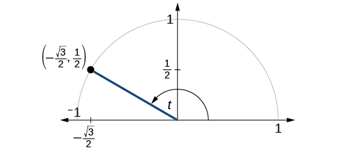{: #Figure_05_03_002}

Because we know the<math xmlns="http://www.w3.org/1998/Math/MathML"> <mrow> <mtext> </mtext><mo stretchy="false">(</mo><mi>x</mi><mo>,</mo><mi>y</mi><mo stretchy="false">)</mo><mtext> </mtext></mrow> </math>

coordinates of the point on the unit circle indicated by angle<math xmlns="http://www.w3.org/1998/Math/MathML"> <mrow> <mtext> </mtext><mi>t</mi><mo>,</mo></mrow> </math>

 we can use those coordinates to find the six functions:

<math xmlns="http://www.w3.org/1998/Math/MathML" display="block"> <mtable columnalign="left"> <mtr> <mtd> <mi>sin</mi><mtext> </mtext><mi>t</mi><mo>=</mo><mi>y</mi><mo>=</mo><mfrac> <mn>1</mn> <mn>2</mn> </mfrac> </mtd> </mtr> <mtr> <mtd> <mi>cos</mi><mtext> </mtext><mi>t</mi><mo>=</mo><mi>x</mi><mo>=</mo><mo>−</mo><mfrac> <mrow> <msqrt> <mn>3</mn> </msqrt> </mrow> <mn>2</mn> </mfrac> </mtd> </mtr> <mtr> <mtd> <mi>tan</mi><mtext> </mtext><mi>t</mi><mo>=</mo><mfrac> <mi>y</mi> <mi>x</mi> </mfrac> <mo>=</mo><mfrac> <mrow> <mfrac> <mn>1</mn> <mn>2</mn> </mfrac> </mrow> <mrow> <mo>−</mo><mfrac> <mrow> <msqrt> <mn>3</mn> </msqrt> </mrow> <mn>2</mn> </mfrac> </mrow> </mfrac> <mo>=</mo><mfrac> <mn>1</mn> <mn>2</mn> </mfrac> <mrow><mo>(</mo> <mrow> <mo>−</mo><mfrac> <mn>2</mn> <mrow> <msqrt> <mn>3</mn> </msqrt> </mrow> </mfrac> </mrow> <mo>)</mo></mrow><mo>=</mo><mo>−</mo><mfrac> <mn>1</mn> <mrow> <msqrt> <mn>3</mn> </msqrt> </mrow> </mfrac> <mo>=</mo><mo>−</mo><mfrac> <mrow> <msqrt> <mn>3</mn> </msqrt> </mrow> <mn>3</mn> </mfrac> </mtd> </mtr> <mtr> <mtd> <mi>sec</mi><mtext> </mtext><mi>t</mi><mo>=</mo><mfrac> <mn>1</mn> <mi>x</mi> </mfrac> <mo>=</mo><mfrac> <mn>1</mn> <mrow> <mfrac> <mrow> <mo>−</mo><mfrac> <mrow> <msqrt> <mn>3</mn> </msqrt> </mrow> <mn>2</mn> </mfrac> </mrow> <mrow /> </mfrac> </mrow> </mfrac> <mo>=</mo><mo>−</mo><mfrac> <mn>2</mn> <mrow> <msqrt> <mn>3</mn> </msqrt> </mrow> </mfrac> <mo>=</mo><mo>−</mo><mfrac> <mrow> <mn>2</mn><msqrt> <mn>3</mn> </msqrt> </mrow> <mn>3</mn> </mfrac> </mtd> </mtr> <mtr> <mtd> <mi>csc</mi><mtext> </mtext><mi>t</mi><mo>=</mo><mfrac> <mn>1</mn> <mi>y</mi> </mfrac> <mo>=</mo><mfrac> <mn>1</mn> <mrow> <mfrac> <mn>1</mn> <mn>2</mn> </mfrac> </mrow> </mfrac> <mo>=</mo><mn>2</mn> </mtd> </mtr> <mtr> <mtd> <mi>cot</mi><mtext> </mtext><mi>t</mi><mo>=</mo><mfrac> <mi>x</mi> <mi>y</mi> </mfrac> <mo>=</mo><mfrac> <mrow> <mo>−</mo><mfrac> <mrow> <msqrt> <mn>3</mn> </msqrt> </mrow> <mn>2</mn> </mfrac> </mrow> <mrow> <mfrac> <mn>1</mn> <mn>2</mn> </mfrac> </mrow> </mfrac> <mo>=</mo><mo>−</mo><mfrac> <mrow> <msqrt> <mn>3</mn> </msqrt> </mrow> <mn>2</mn> </mfrac> <mrow><mo>(</mo> <mrow> <mfrac> <mn>2</mn> <mn>1</mn> </mfrac> </mrow> <mo>)</mo></mrow><mo>=</mo><mo>−</mo><msqrt> <mn>3</mn> </msqrt> </mtd> </mtr> </mtable> </math>

The point<math xmlns="http://www.w3.org/1998/Math/MathML"> <mrow> <mtext> </mtext><mrow><mo>(</mo> <mrow> <mfrac> <mrow> <msqrt> <mn>2</mn> </msqrt> </mrow> <mn>2</mn> </mfrac> <mo>,</mo><mo>−</mo><mfrac> <mrow> <msqrt> <mn>2</mn> </msqrt> </mrow> <mn>2</mn> </mfrac> </mrow> <mo>)</mo></mrow><mtext> </mtext> </mrow> </math>

is on the unit circle, as shown in [[link]](#Figure_05_02_003). Find<math xmlns="http://www.w3.org/1998/Math/MathML"> <mrow> <mtext> </mtext><mi>sin</mi><mtext> </mtext><mi>t</mi><mo>,</mo><mi>cos</mi><mtext> </mtext><mi>t</mi><mo>,</mo><mi>tan</mi><mtext> </mtext><mi>t</mi><mo>,</mo><mi>sec</mi><mtext> </mtext><mi>t</mi><mo>,</mo><mi>csc</mi><mtext> </mtext><mi>t</mi><mo>,</mo></mrow> </math>

 and<math xmlns="http://www.w3.org/1998/Math/MathML"> <mrow> <mtext> </mtext><mi>cot</mi><mtext> </mtext><mi>t</mi><mo>.</mo></mrow> </math>

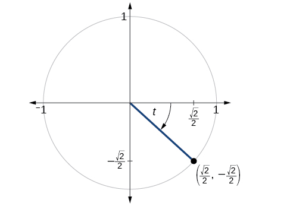{: #Figure_05_02_003}

<math xmlns="http://www.w3.org/1998/Math/MathML"> <mrow> <mi>sin</mi><mtext> </mtext><mi>t</mi><mo>=</mo><mo>−</mo><mfrac> <mrow> <msqrt> <mn>2</mn> </msqrt> </mrow> <mn>2</mn> </mfrac> <mo>,</mo><mi>cos</mi><mtext> </mtext><mi>t</mi><mo>=</mo><mfrac> <mrow> <msqrt> <mn>2</mn> </msqrt> </mrow> <mn>2</mn> </mfrac> <mo>,</mo><mi>tan</mi><mtext> </mtext><mi>t</mi><mo>=</mo><mo>−</mo><mn>1</mn><mo>,</mo><mi>sec</mi><mtext> </mtext><mi>t</mi><mo>=</mo><msqrt> <mn>2</mn> </msqrt> <mo>,</mo><mi>csc</mi><mtext> </mtext><mi>t</mi><mo>=</mo><mo>−</mo><msqrt> <mn>2</mn> </msqrt> <mo>,</mo><mi>cot</mi><mtext> </mtext><mi>t</mi><mo>=</mo><mo>−</mo><mn>1</mn></mrow> </math>

Finding the Trigonometric Functions of an Angle

Find<math xmlns="http://www.w3.org/1998/Math/MathML"> <mrow> <mtext> </mtext><mi>sin</mi><mtext> </mtext><mi>t</mi><mo>,</mo><mi>cos</mi><mtext> </mtext><mi>t</mi><mo>,</mo><mi>tan</mi><mtext> </mtext><mi>t</mi><mo>,</mo><mi>sec</mi><mtext> </mtext><mi>t</mi><mo>,</mo><mi>csc</mi><mtext> </mtext><mi>t</mi><mo>,</mo></mrow> </math>

 and<math xmlns="http://www.w3.org/1998/Math/MathML"> <mrow> <mtext> </mtext><mi>cot</mi><mtext> </mtext><mi>t</mi><mtext> </mtext></mrow> </math>

when<math xmlns="http://www.w3.org/1998/Math/MathML"> <mrow> <mtext> </mtext><mi>t</mi><mo>=</mo><mfrac> <mi>π</mi> <mn>6</mn> </mfrac> <mo>.</mo></mrow> </math>

We have previously used the properties of equilateral triangles to demonstrate that<math xmlns="http://www.w3.org/1998/Math/MathML"> <mrow> <mtext> </mtext><mi>sin</mi><mtext> </mtext><mfrac> <mi>π</mi> <mn>6</mn> </mfrac> <mo>=</mo><mfrac> <mn>1</mn> <mn>2</mn> </mfrac> <mtext> </mtext> </mrow> </math>

and<math xmlns="http://www.w3.org/1998/Math/MathML"> <mrow> <mtext> </mtext><mi>cos</mi><mtext> </mtext><mfrac> <mi>π</mi> <mn>6</mn> </mfrac> <mo>=</mo><mfrac> <mrow> <msqrt> <mn>3</mn> </msqrt> </mrow> <mn>2</mn> </mfrac> <mo>.</mo><mtext> </mtext> </mrow> </math>

We can use these values and the definitions of tangent, secant, cosecant, and cotangent as functions of sine and cosine to find the remaining function values.* * *
{: data-type="newline" data-count="1"}

<math xmlns="http://www.w3.org/1998/Math/MathML" display="block"> <mrow> <mtable columnalign="left"> <mtr columnalign="left"> <mtd columnalign="left"> <mtable columnalign="left"> <mtr /> <mtr> <mtd> <mrow /> </mtd> </mtr> <mtr> <mtd> <mi>tan</mi><mtext> </mtext><mfrac> <mi>π</mi> <mn>6</mn> </mfrac> <mo>=</mo><mfrac> <mrow> <mi>sin</mi><mtext> </mtext><mfrac> <mi>π</mi> <mn>6</mn> </mfrac> </mrow> <mrow> <mi>cos</mi><mtext> </mtext><mfrac> <mi>π</mi> <mn>6</mn> </mfrac> </mrow> </mfrac> </mtd> </mtr> </mtable> </mtd> </mtr> <mtr columnalign="left"> <mtd columnalign="left"> <mrow> <mtext> </mtext><mtext> </mtext><mtext> </mtext><mtext> </mtext><mtext> </mtext><mtext> </mtext><mtext> </mtext><mtext> </mtext><mtext> </mtext><mtext> </mtext><mtext> </mtext><mtext> </mtext><mtext> </mtext><mo>=</mo><mfrac> <mrow> <mfrac> <mn>1</mn> <mn>2</mn> </mfrac> </mrow> <mrow> <mfrac> <mrow> <msqrt> <mn>3</mn> </msqrt> </mrow> <mn>2</mn> </mfrac> </mrow> </mfrac> <mo>=</mo><mfrac> <mn>1</mn> <mrow> <msqrt> <mn>3</mn> </msqrt> </mrow> </mfrac> <mo>=</mo><mfrac> <mrow> <msqrt> <mn>3</mn> </msqrt> </mrow> <mn>3</mn> </mfrac> </mrow> </mtd> </mtr> </mtable> </mrow> </math>

<math xmlns="http://www.w3.org/1998/Math/MathML" display="block"> <mrow> <mtable columnalign="left"> <mtr columnalign="left"> <mtd columnalign="left"> <mrow> <mi>sec</mi><mfrac> <mi>π</mi> <mn>6</mn> </mfrac> <mo>=</mo><mfrac> <mn>1</mn> <mrow> <mi>cos</mi><mfrac> <mi>π</mi> <mn>6</mn> </mfrac> </mrow> </mfrac> </mrow> </mtd> </mtr> <mtr columnalign="left"> <mtd columnalign="left"> <mrow> <mtext> </mtext><mtext> </mtext><mtext> </mtext><mtext> </mtext><mtext> </mtext><mtext> </mtext><mtext> </mtext><mtext> </mtext><mtext> </mtext><mtext> </mtext><mtext> </mtext><mtext> </mtext><mo>=</mo><mfrac> <mn>1</mn> <mrow> <mfrac> <mrow> <msqrt> <mn>3</mn> </msqrt> </mrow> <mn>2</mn> </mfrac> </mrow> </mfrac> <mo>=</mo><mfrac> <mn>2</mn> <mrow> <msqrt> <mn>3</mn> </msqrt> </mrow> </mfrac> <mo>=</mo><mfrac> <mrow> <mn>2</mn><msqrt> <mn>3</mn> </msqrt> </mrow> <mn>3</mn> </mfrac> </mrow> </mtd> </mtr> </mtable> </mrow> </math>

<math xmlns="http://www.w3.org/1998/Math/MathML" display="block"> <mi>csc</mi><mfrac> <mi>π</mi> <mn>6</mn> </mfrac> <mo>=</mo><mfrac> <mn>1</mn> <mrow> <mi>sin</mi><mfrac> <mi>π</mi> <mn>6</mn> </mfrac> </mrow> </mfrac> <mo>=</mo><mfrac> <mn>1</mn> <mrow> <mfrac> <mn>1</mn> <mn>2</mn> </mfrac> </mrow> </mfrac> <mo>=</mo><mn>2</mn> </math>

<math xmlns="http://www.w3.org/1998/Math/MathML" display="block"> <mrow> <mtable columnalign="left"> <mtr columnalign="left"> <mtd columnalign="left"> <mrow> <mi>cot</mi><mfrac> <mi>π</mi> <mn>6</mn> </mfrac> <mo>=</mo><mfrac> <mrow> <mi>cos</mi><mfrac> <mi>π</mi> <mn>6</mn> </mfrac> </mrow> <mrow> <mi>sin</mi><mfrac> <mi>π</mi> <mn>6</mn> </mfrac> </mrow> </mfrac> </mrow> </mtd> </mtr> <mtr columnalign="left"> <mtd columnalign="left"> <mrow> <mtext> </mtext><mtext> </mtext><mtext> </mtext><mtext> </mtext><mtext> </mtext><mtext> </mtext><mtext> </mtext><mtext> </mtext><mtext> </mtext><mtext> </mtext><mtext> </mtext><mtext> </mtext><mo>=</mo><mfrac> <mrow> <mfrac> <mrow> <msqrt> <mn>3</mn> </msqrt> </mrow> <mn>2</mn> </mfrac> </mrow> <mrow> <mfrac> <mn>1</mn> <mn>2</mn> </mfrac> </mrow> </mfrac> <mo>=</mo><msqrt> <mn>3</mn> </msqrt> </mrow> </mtd> </mtr> </mtable> </mrow> </math>

Find<math xmlns="http://www.w3.org/1998/Math/MathML"> <mrow> <mtext> </mtext><mi>sin</mi><mtext> </mtext><mi>t</mi><mo>,</mo><mi>cos</mi><mtext> </mtext><mi>t</mi><mo>,</mo><mi>tan</mi><mtext> </mtext><mi>t</mi><mo>,</mo><mi>sec</mi><mtext> </mtext><mi>t</mi><mo>,</mo><mi>csc</mi><mtext> </mtext><mi>t</mi><mo>,</mo></mrow> </math>

 and<math xmlns="http://www.w3.org/1998/Math/MathML"> <mrow> <mtext> </mtext><mi>cot</mi><mtext> </mtext><mi>t</mi><mtext>  </mtext></mrow> </math>

when<math xmlns="http://www.w3.org/1998/Math/MathML"> <mrow> <mtext> </mtext><mi>t</mi><mo>=</mo><mfrac> <mi>π</mi> <mn>3</mn> </mfrac> <mo>.</mo></mrow> </math>

<math xmlns="http://www.w3.org/1998/Math/MathML"> <mtable columnalign="left"> <mtr> <mtd> <mi>sin</mi><mfrac> <mi>π</mi> <mn>3</mn> </mfrac> <mo>=</mo><mfrac> <mrow> <msqrt> <mn>3</mn> </msqrt> </mrow> <mn>2</mn> </mfrac> </mtd> </mtr> <mtr> <mtd> <mi>cos</mi><mfrac> <mi>π</mi> <mn>3</mn> </mfrac> <mo>=</mo><mfrac> <mn>1</mn> <mn>2</mn> </mfrac> </mtd> </mtr> <mtr> <mtd> <mi>tan</mi><mfrac> <mi>π</mi> <mn>3</mn> </mfrac> <mo>=</mo><msqrt> <mn>3</mn> </msqrt> </mtd> </mtr> <mtr> <mtd> <mi>sec</mi><mfrac> <mi>π</mi> <mn>3</mn> </mfrac> <mo>=</mo><mn>2</mn> </mtd> </mtr> <mtr> <mtd> <mi>csc</mi><mfrac> <mi>π</mi> <mn>3</mn> </mfrac> <mo>=</mo><mfrac> <mrow> <mn>2</mn><msqrt> <mn>3</mn> </msqrt> </mrow> <mn>3</mn> </mfrac> </mtd> </mtr> <mtr> <mtd> <mi>cot</mi><mfrac> <mi>π</mi> <mn>3</mn> </mfrac> <mo>=</mo><mfrac> <mrow> <msqrt> <mn>3</mn> </msqrt> </mrow> <mn>3</mn> </mfrac> </mtd> </mtr> </mtable> </math>

Because we know the sine and cosine values for the common first-quadrant angles, we can find the other function values for those angles as well by setting<math xmlns="http://www.w3.org/1998/Math/MathML"> <mrow> <mtext> </mtext><mi>x</mi><mtext> </mtext></mrow> </math>

equal to the cosine and<math xmlns="http://www.w3.org/1998/Math/MathML"> <mrow> <mtext> </mtext><mi>y</mi><mtext> </mtext></mrow> </math>

equal to the sine and then using the definitions of tangent, secant, cosecant, and cotangent. The results are shown in [\[link\]](#Table_05_03_01).

| **Angle** | <strong><math xmlns="http://www.w3.org/1998/Math/MathML">
       <mrow>
        <mtext> </mtext><mn>0</mn><mtext> </mtext></mrow>
      </math></strong> | <strong><math xmlns="http://www.w3.org/1998/Math/MathML">
       <mrow>
        <mfrac>
         <mi>π</mi>
         <mn>6</mn>
        </mfrac>
        <mo>,</mo><mtext> or 30°</mtext></mrow>
      </math></strong> | <strong><math xmlns="http://www.w3.org/1998/Math/MathML">
       <mrow>
        <mfrac>
         <mi>π</mi>
         <mn>4</mn>
        </mfrac>
        <mo>,</mo><mtext> or 45°</mtext></mrow>
      </math></strong> | <strong><math xmlns="http://www.w3.org/1998/Math/MathML">
       <mrow>
        <mfrac>
         <mi>π</mi>
         <mn>3</mn>
        </mfrac>
        <mo>,</mo><mtext> or 60°</mtext></mrow>
      </math></strong> | <strong><math xmlns="http://www.w3.org/1998/Math/MathML">
       <mrow>
        <mfrac>
         <mi>π</mi>
         <mn>2</mn>
        </mfrac>
        <mo>,</mo><mtext> or 90°</mtext></mrow>
      </math></strong> |
| **Cosine** | 1 | <math xmlns="http://www.w3.org/1998/Math/MathML"> <mrow> <mfrac> <mrow> <msqrt> <mn>3</mn> </msqrt> </mrow> <mn>2</mn> </mfrac> </mrow> </math>

 | <math xmlns="http://www.w3.org/1998/Math/MathML"> <mrow> <mfrac> <mrow> <msqrt> <mn>2</mn> </msqrt> </mrow> <mn>2</mn> </mfrac> </mrow> </math>

 | <math xmlns="http://www.w3.org/1998/Math/MathML"> <mrow> <mfrac> <mn>1</mn> <mn>2</mn> </mfrac> </mrow> </math>

 | 0 |
| **Sine** | 0 | <math xmlns="http://www.w3.org/1998/Math/MathML"> <mrow> <mfrac> <mn>1</mn> <mn>2</mn> </mfrac> </mrow> </math>

 | <math xmlns="http://www.w3.org/1998/Math/MathML"> <mrow> <mfrac> <mrow> <msqrt> <mn>2</mn> </msqrt> </mrow> <mn>2</mn> </mfrac> </mrow> </math>

 | <math xmlns="http://www.w3.org/1998/Math/MathML"> <mrow> <mfrac> <mrow> <msqrt> <mn>3</mn> </msqrt> </mrow> <mn>2</mn> </mfrac> </mrow> </math>

 | 1 |
| **Tangent** | 0 | <math xmlns="http://www.w3.org/1998/Math/MathML"> <mrow> <mfrac> <mrow> <msqrt> <mn>3</mn> </msqrt> </mrow> <mn>3</mn> </mfrac> </mrow> </math>

 | 1 | <math xmlns="http://www.w3.org/1998/Math/MathML"> <mrow> <msqrt> <mn>3</mn> </msqrt> </mrow> </math>

 | Undefined |
| **Secant** | 1 | <math xmlns="http://www.w3.org/1998/Math/MathML"> <mrow> <mfrac> <mrow> <mn>2</mn><msqrt> <mn>3</mn> </msqrt> </mrow> <mn>3</mn> </mfrac> </mrow> </math>

 | <math xmlns="http://www.w3.org/1998/Math/MathML"> <mrow> <msqrt> <mn>2</mn> </msqrt> </mrow> </math>

 | 2 | Undefined |
| **Cosecant** | Undefined | 2 | <math xmlns="http://www.w3.org/1998/Math/MathML"> <mrow> <msqrt> <mn>2</mn> </msqrt> </mrow> </math>

 | <math xmlns="http://www.w3.org/1998/Math/MathML"> <mrow> <mfrac> <mrow> <mn>2</mn><msqrt> <mn>3</mn> </msqrt> </mrow> <mn>3</mn> </mfrac> </mrow> </math>

 | 1 |
| **Cotangent** | Undefined | <math xmlns="http://www.w3.org/1998/Math/MathML"> <mrow> <msqrt> <mn>3</mn> </msqrt> </mrow> </math>

 | 1 | <math xmlns="http://www.w3.org/1998/Math/MathML"> <mrow> <mfrac> <mrow> <msqrt> <mn>3</mn> </msqrt> </mrow> <mn>3</mn> </mfrac> </mrow> </math>

 | 0 |
{: #Table_05_03_01 summary=".."}

### Using Reference Angles to Evaluate Tangent, Secant, Cosecant, and Cotangent

We can evaluate trigonometric functions of angles outside the first quadrant using reference angles as we have already done with the sine and cosine functions. The procedure is the same: Find the **reference angle**{: data-type="term" .no-emphasis} formed by the terminal side of the given angle with the horizontal axis. The trigonometric function values for the original angle will be the same as those for the reference angle, except for the positive or negative sign, which is determined by *x*- and *y*-values in the original quadrant. [\[link\]](#Figure_05_03_004) shows which functions are positive in which quadrant.

To help us remember which of the six trigonometric functions are positive in each quadrant, we can use the mnemonic phrase “A Smart Trig Class.” Each of the four words in the phrase corresponds to one of the four quadrants, starting with quadrant I and rotating counterclockwise. In quadrant I, which is “**A**,” **<u data-effect="underline">a</u>**ll of the six trigonometric functions are positive. In quadrant II, “**S**mart,” only **<u data-effect="underline">s</u>**ine and its reciprocal function, cosecant, are positive. In quadrant III, “**T**rig,” only **<u data-effect="underline">t</u>**angent and its reciprocal function, cotangent, are positive. Finally, in quadrant IV, “**C**lass,” only **<u data-effect="underline">c</u>**osine and its reciprocal function, secant, are positive.

 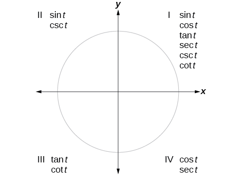{: #Figure_05_03_004}

<strong>Given an angle not in the first quadrant, use reference angles to find all six trigonometric functions. </strong>

1.  Measure the angle formed by the terminal side of the given angle and the horizontal axis. This is the reference angle.
2.  Evaluate the function at the reference angle.
3.  Observe the quadrant where the terminal side of the original angle is located. Based on the quadrant, determine whether the output is positive or negative.
{: type="1"}

Using Reference Angles to Find Trigonometric Functions

Use reference angles to find all six trigonometric functions of <math xmlns="http://www.w3.org/1998/Math/MathML"> <mrow> <mtext> </mtext><mo>−</mo><mfrac> <mrow> <mn>5</mn><mi>π</mi></mrow> <mn>6</mn> </mfrac> <mo>.</mo><mtext> </mtext></mrow> </math>

The angle between this angle’s terminal side and the *x*-axis is<math xmlns="http://www.w3.org/1998/Math/MathML"> <mrow> <mtext> </mtext><mfrac> <mi>π</mi> <mn>6</mn> </mfrac> <mo>,</mo></mrow> </math>

 so that is the reference angle. Since<math xmlns="http://www.w3.org/1998/Math/MathML"> <mrow> <mtext> </mtext><mo>−</mo><mfrac> <mrow> <mn>5</mn><mi>π</mi></mrow> <mn>6</mn> </mfrac> <mtext> </mtext></mrow> </math>

is in the third quadrant, where both<math xmlns="http://www.w3.org/1998/Math/MathML"> <mrow> <mtext> </mtext><mi>x</mi><mtext> </mtext></mrow> </math>

and<math xmlns="http://www.w3.org/1998/Math/MathML"> <mrow> <mtext> </mtext><mi>y</mi><mtext> </mtext></mrow> </math>

are negative, cosine, sine, secant, and cosecant will be negative, while tangent and cotangent will be positive.

<math xmlns="http://www.w3.org/1998/Math/MathML" display="block"> <mrow> <mtable columnalign="left"> <mtr columnalign="left"> <mtd columnalign="left"> <mrow> <mi>cos</mi><mrow><mo>(</mo> <mrow> <mo>−</mo><mfrac> <mrow> <mn>5</mn><mi>π</mi> </mrow> <mn>6</mn> </mfrac> </mrow> <mo>)</mo></mrow><mo>=</mo><mo>−</mo><mfrac> <mrow> <msqrt> <mn>3</mn> </msqrt> </mrow> <mn>2</mn> </mfrac> <mo>,</mo><mi>sin</mi><mrow><mo>(</mo> <mrow> <mo>−</mo><mfrac> <mrow> <mn>5</mn><mi>π</mi> </mrow> <mn>6</mn> </mfrac> </mrow> <mo>)</mo></mrow><mo>=</mo><mo>−</mo><mfrac> <mn>1</mn> <mn>2</mn> </mfrac> <mo>,</mo><mtext>tan</mtext><mrow><mo>(</mo> <mrow> <mo>−</mo><mfrac> <mrow> <mn>5</mn><mi>π</mi> </mrow> <mn>6</mn> </mfrac> </mrow> <mo>)</mo></mrow><mo>=</mo><mfrac> <mrow> <msqrt> <mn>3</mn> </msqrt> </mrow> <mn>3</mn> </mfrac> </mrow> </mtd> </mtr> <mtr columnalign="left"> <mtd columnalign="left"> <mrow> <mtext>sec</mtext><mrow><mo>(</mo> <mrow> <mo>−</mo><mfrac> <mrow> <mn>5</mn><mi>π</mi> </mrow> <mn>6</mn> </mfrac> </mrow> <mo>)</mo></mrow><mo>=</mo><mo>−</mo><mfrac> <mrow> <mn>2</mn><msqrt> <mn>3</mn> </msqrt> </mrow> <mn>3</mn> </mfrac> <mo>,</mo><mtext>csc</mtext><mrow><mo>(</mo> <mrow> <mo>−</mo><mfrac> <mrow> <mn>5</mn><mi>π</mi> </mrow> <mn>6</mn> </mfrac> </mrow> <mo>)</mo></mrow><mo>=</mo><mo>−</mo><mn>2</mn><mo>,</mo><mi>cot</mi><mrow><mo>(</mo> <mrow> <mo>−</mo><mfrac> <mrow> <mn>5</mn><mi>π</mi> </mrow> <mn>6</mn> </mfrac> </mrow> <mo>)</mo></mrow><mo>=</mo><msqrt> <mn>3</mn> </msqrt> </mrow> </mtd> </mtr> </mtable> </mrow> </math>

Use reference angles to find all six trigonometric functions of<math xmlns="http://www.w3.org/1998/Math/MathML"> <mrow> <mtext> </mtext><mo>−</mo><mfrac> <mrow> <mn>7</mn><mi>π</mi></mrow> <mn>4</mn> </mfrac> <mo>.</mo><mtext> </mtext></mrow> </math>

<math xmlns="http://www.w3.org/1998/Math/MathML"><mrow> <mi>sin</mi><mrow><mo>(</mo> <mrow> <mfrac> <mrow> <mo>−</mo><mn>7</mn><mi>π</mi></mrow> <mn>4</mn> </mfrac> </mrow> <mo>)</mo></mrow><mo>=</mo><mfrac> <mrow> <msqrt> <mn>2</mn> </msqrt> </mrow> <mn>2</mn> </mfrac> <mo>,</mo><mi>cos</mi><mrow><mo>(</mo> <mrow> <mfrac> <mrow> <mo>−</mo><mn>7</mn><mi>π</mi></mrow> <mn>4</mn> </mfrac> </mrow> <mo>)</mo></mrow><mo>=</mo><mfrac> <mrow> <msqrt> <mn>2</mn> </msqrt> </mrow> <mn>2</mn> </mfrac> <mo>,</mo><mi>tan</mi><mrow><mo>(</mo> <mrow> <mfrac> <mrow> <mo>−</mo><mn>7</mn><mi>π</mi></mrow> <mn>4</mn> </mfrac> </mrow> <mo>)</mo></mrow><mo>=</mo><mn>1</mn><mo>,</mo> </mrow></math>

* * *
{: data-type="newline"}

 <math xmlns="http://www.w3.org/1998/Math/MathML"><mrow> <mi>sec</mi><mrow><mo>(</mo> <mrow> <mfrac> <mrow> <mo>−</mo><mn>7</mn><mi>π</mi></mrow> <mn>4</mn> </mfrac> </mrow> <mo>)</mo></mrow><mo>=</mo><msqrt> <mn>2</mn> </msqrt> <mo>,</mo><mi>csc</mi><mrow><mo>(</mo> <mrow> <mfrac> <mrow> <mo>−</mo><mn>7</mn><mi>π</mi></mrow> <mn>4</mn> </mfrac> </mrow> <mo>)</mo></mrow><mo>=</mo><msqrt> <mn>2</mn> </msqrt> <mo>,</mo><mi>cot</mi><mrow><mo>(</mo> <mrow> <mfrac> <mrow> <mo>−</mo><mn>7</mn><mi>π</mi></mrow> <mn>4</mn> </mfrac> </mrow> <mo>)</mo></mrow><mo>=</mo><mn>1</mn></mrow> </math>

### Using Even and Odd Trigonometric Functions

To be able to use our six trigonometric functions freely with both positive and negative angle inputs, we should examine how each function treats a negative input. As it turns out, there is an important difference among the functions in this regard.

Consider the function<math xmlns="http://www.w3.org/1998/Math/MathML"> <mrow> <mtext> </mtext><mi>f</mi><mo stretchy="false">(</mo><mi>x</mi><mo stretchy="false">)</mo><mo>=</mo><msup> <mi>x</mi> <mn>2</mn> </msup> <mo>,</mo></mrow> </math>

 shown in [\[link\]](#Figure_05_03_005). The graph of the function is symmetrical about the *y*-axis. All along the curve, any two points with opposite *x*-values have the same function value. This matches the result of calculation:<math xmlns="http://www.w3.org/1998/Math/MathML"> <mrow> <mtext> </mtext><msup> <mrow> <mo stretchy="false">(</mo><mn>4</mn><mo stretchy="false">)</mo></mrow> <mn>2</mn> </msup> <mo>=</mo><msup> <mrow> <mo stretchy="false">(</mo><mn>−4</mn><mo stretchy="false">)</mo></mrow> <mn>2</mn> </msup> <mo>,</mo></mrow> </math>

<math xmlns="http://www.w3.org/1998/Math/MathML"> <mrow> <msup> <mrow> <mo stretchy="false">(</mo><mn>−5</mn><mo stretchy="false">)</mo></mrow> <mn>2</mn> </msup> <mo>=</mo><msup> <mrow> <mo stretchy="false">(</mo><mn>5</mn><mo stretchy="false">)</mo></mrow> <mn>2</mn> </msup> <mo>,</mo></mrow> </math>

 and so on. So<math xmlns="http://www.w3.org/1998/Math/MathML"> <mrow> <mtext> </mtext><mi>f</mi><mo stretchy="false">(</mo><mi>x</mi><mo stretchy="false">)</mo><mo>=</mo><msup> <mi>x</mi> <mn>2</mn> </msup> <mtext> </mtext></mrow> </math>

is an **even function**{: data-type="term" .no-emphasis}, a function such that two inputs that are opposites have the same output. That means<math xmlns="http://www.w3.org/1998/Math/MathML"> <mrow> <mtext> </mtext><mi>f</mi><mrow><mo>(</mo> <mrow> <mo>−</mo><mi>x</mi></mrow> <mo>)</mo></mrow><mo>=</mo><mi>f</mi><mrow><mo>(</mo> <mi>x</mi> <mo>)</mo></mrow><mo>.</mo><mtext> </mtext></mrow> </math>

=&#10;      x&#10;      2&#10;     &#10;     &#x2009;&#10;   &#10;    is an even function."){: #Figure_05_03_005}

Now consider the function<math xmlns="http://www.w3.org/1998/Math/MathML"> <mrow> <mtext> </mtext><mi>f</mi><mo stretchy="false">(</mo><mi>x</mi><mo stretchy="false">)</mo><mo>=</mo><msup> <mi>x</mi> <mn>3</mn> </msup> <mo>,</mo></mrow> </math>

 shown in [\[link\]](#Figure_05_03_006). The graph is not symmetrical about the *y*-axis. All along the graph, any two points with opposite *x*-values also have opposite *y*-values. So<math xmlns="http://www.w3.org/1998/Math/MathML"> <mrow> <mtext> </mtext><mi>f</mi><mo stretchy="false">(</mo><mi>x</mi><mo stretchy="false">)</mo><mo>=</mo><msup> <mi>x</mi> <mn>3</mn> </msup> <mtext> </mtext></mrow> </math>

is an **odd function**{: data-type="term" .no-emphasis}, one such that two inputs that are opposites have outputs that are also opposites. That means<math xmlns="http://www.w3.org/1998/Math/MathML"> <mrow> <mtext> </mtext><mi>f</mi><mrow><mo>(</mo> <mrow> <mo>−</mo><mi>x</mi></mrow> <mo>)</mo></mrow><mo>=</mo><mo>−</mo><mi>f</mi><mrow><mo>(</mo> <mi>x</mi> <mo>)</mo></mrow><mo>.</mo><mtext> </mtext></mrow> </math>

=&#10;      x&#10;      3&#10;     &#10;     &#x2009;&#10;   &#10;    is an odd function."){: #Figure_05_03_006}

We can test whether a trigonometric function is even or odd by drawing a **unit circle**{: data-type="term" .no-emphasis} with a positive and a negative angle, as in [\[link\]](#Figure_05_03_007). The sine of the positive angle is<math xmlns="http://www.w3.org/1998/Math/MathML"> <mrow> <mtext> </mtext><mi>y</mi><mo>.</mo><mtext> </mtext></mrow> </math>

The sine of the negative angle is −*y*. The **sine function**{: data-type="term" .no-emphasis}, then, is an odd function. We can test each of the six trigonometric functions in this fashion. The results are shown in [\[link\]](#Table_05_03_02).

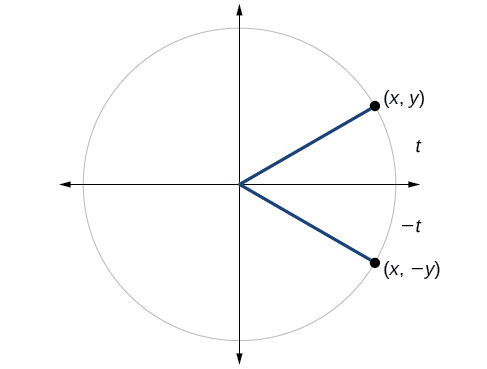{: #Figure_05_03_007}

| <math xmlns="http://www.w3.org/1998/Math/MathML"> <mrow> <mtable columnalign="left"> <mtr columnalign="left"> <mtd columnalign="left"> <mrow> <mtext> </mtext><mtext> </mtext><mtext> </mtext><mtext> </mtext><mtext> </mtext><mtext> </mtext><mtext> </mtext><mtext> </mtext><mtext> </mtext><mi>sin</mi><mtext> </mtext><mi>t</mi><mo>=</mo><mi>y</mi> </mrow> </mtd> </mtr> <mtr columnalign="left"> <mtd columnalign="left"> <mrow> <mi>sin</mi><mo stretchy="false">(</mo><mi>−</mi><mi>t</mi><mo stretchy="false">)</mo><mo>=</mo><mi>−</mi><mi>y</mi> </mrow> </mtd> </mtr> <mtr columnalign="left"> <mtd columnalign="left"> <mrow> <mtext> </mtext><mtext> </mtext><mtext> </mtext><mtext> </mtext><mtext> </mtext><mtext> </mtext><mtext> </mtext><mtext> </mtext><mtext> </mtext><mi>sin</mi><mtext> </mtext><mi>t</mi><mo>≠</mo><mi>sin</mi><mo stretchy="false">(</mo><mi>−</mi><mi>t</mi><mo stretchy="false">)</mo> </mrow> </mtd> </mtr> </mtable> </mrow> </math>

 | <math xmlns="http://www.w3.org/1998/Math/MathML"> <mrow> <mtable columnalign="left"> <mtr columnalign="left"> <mtd columnalign="left"> <mrow> <mtext> </mtext><mtext> </mtext><mtext> </mtext><mtext> </mtext><mtext> </mtext><mtext> </mtext><mtext> </mtext><mtext> </mtext><mtext> </mtext><mtext>cos</mtext><mtext> </mtext><mi>t</mi><mo>=</mo><mi>x</mi> </mrow> </mtd> </mtr> <mtr columnalign="left"> <mtd columnalign="left"> <mrow> <mi>cos</mi><mo stretchy="false">(</mo><mi>−</mi><mi>t</mi><mo stretchy="false">)</mo><mo>=</mo><mi>x</mi> </mrow> </mtd> </mtr> <mtr columnalign="left"> <mtd columnalign="left"> <mrow> <mtext> </mtext><mtext> </mtext><mtext> </mtext><mtext> </mtext><mtext> </mtext><mtext> </mtext><mtext> </mtext><mtext> </mtext><mtext> </mtext><mi>cos</mi><mtext> </mtext><mi>t</mi><mo>=</mo><mi>cos</mi><mo stretchy="false">(</mo><mi>−</mi><mi>t</mi><mo stretchy="false">)</mo> </mrow> </mtd> </mtr> </mtable> </mrow> </math>

 | <math xmlns="http://www.w3.org/1998/Math/MathML"> <mrow> <mtable columnalign="left"> <mtr columnalign="left"> <mtd columnalign="left"> <mrow> <mtext> </mtext><mtext> </mtext><mtext> </mtext><mtext> </mtext><mtext> </mtext><mtext>tan</mtext><mo stretchy="false">(</mo><mi>t</mi><mo stretchy="false">)</mo><mo>=</mo><mfrac> <mi>y</mi> <mi>x</mi> </mfrac> </mrow> </mtd> </mtr> <mtr columnalign="left"> <mtd columnalign="left"> <mrow> <mtext> </mtext><mi>tan</mi><mo stretchy="false">(</mo><mi>−</mi><mi>t</mi><mo stretchy="false">)</mo><mo>=</mo><mo>−</mo><mfrac> <mi>y</mi> <mi>x</mi> </mfrac> </mrow> </mtd> </mtr> <mtr columnalign="left"> <mtd columnalign="left"> <mrow> <mtext> </mtext><mtext> </mtext><mtext> </mtext><mtext> </mtext><mtext> </mtext><mtext> </mtext><mtext> </mtext><mtext> </mtext><mtext> </mtext><mtext> </mtext><mi>tan</mi><mtext> </mtext><mi>t</mi><mo>≠</mo><mi>tan</mi><mo stretchy="false">(</mo><mi>−</mi><mi>t</mi><mo stretchy="false">)</mo> </mrow> </mtd> </mtr> </mtable> </mrow> </math>

 |
| <math xmlns="http://www.w3.org/1998/Math/MathML"> <mrow> <mtable columnalign="left"> <mtr columnalign="left"> <mtd columnalign="left"> <mrow> <mtext> </mtext><mtext> </mtext><mtext> </mtext><mtext> </mtext><mtext> </mtext><mtext> </mtext><mtext> </mtext><mtext> </mtext><mtext> </mtext><mi>sec</mi><mtext> </mtext><mi>t</mi><mo>=</mo><mfrac> <mn>1</mn> <mi>x</mi> </mfrac> </mrow> </mtd> </mtr> <mtr columnalign="left"> <mtd columnalign="left"> <mrow> <mi>sec</mi><mo stretchy="false">(</mo><mi>−</mi><mi>t</mi><mo stretchy="false">)</mo><mo>=</mo><mfrac> <mn>1</mn> <mi>x</mi> </mfrac> </mrow> </mtd> </mtr> <mtr columnalign="left"> <mtd columnalign="left"> <mrow> <mtext> </mtext><mtext> </mtext><mtext> </mtext><mtext> </mtext><mtext> </mtext><mtext> </mtext><mtext> </mtext><mtext> </mtext><mtext> </mtext><mi>sec</mi><mtext> </mtext><mi>t</mi><mo>=</mo><mi>sec</mi><mo stretchy="false">(</mo><mi>−</mi><mi>t</mi><mo stretchy="false">)</mo> </mrow> </mtd> </mtr> </mtable> </mrow> </math>

 | <math xmlns="http://www.w3.org/1998/Math/MathML"> <mrow> <mtable columnalign="left"> <mtr columnalign="left"> <mtd columnalign="left"> <mrow> <mtext> </mtext><mtext> </mtext><mtext> </mtext><mtext> </mtext><mtext> </mtext><mtext> </mtext><mtext> </mtext><mtext> </mtext><mtext> </mtext><mi>csc</mi><mtext> </mtext><mi>t</mi><mo>=</mo><mfrac> <mn>1</mn> <mi>y</mi> </mfrac> </mrow> </mtd> </mtr> <mtr columnalign="left"> <mtd columnalign="left"> <mrow> <mtext> </mtext><mi>csc</mi><mo stretchy="false">(</mo><mi>−</mi><mi>t</mi><mo stretchy="false">)</mo><mo>=</mo><mfrac> <mn>1</mn> <mrow> <mi>−</mi><mi>y</mi> </mrow> </mfrac> </mrow> </mtd> </mtr> <mtr columnalign="left"> <mtd columnalign="left"> <mrow> <mtext> </mtext><mtext> </mtext><mtext> </mtext><mtext> </mtext><mtext> </mtext><mtext> </mtext><mtext> </mtext><mtext> </mtext><mtext> </mtext><mtext> </mtext><mi>csc</mi><mtext> </mtext><mi>t</mi><mo>≠</mo><mi>csc</mi><mo stretchy="false">(</mo><mi>−</mi><mi>t</mi><mo stretchy="false">)</mo> </mrow> </mtd> </mtr> </mtable> </mrow> </math>

 | <math xmlns="http://www.w3.org/1998/Math/MathML"> <mrow> <mtable columnalign="left"> <mtr columnalign="left"> <mtd columnalign="left"> <mrow> <mtext> </mtext><mtext> </mtext><mtext> </mtext><mtext> </mtext><mtext> </mtext><mtext> </mtext><mtext> </mtext><mtext> </mtext><mtext> </mtext><mi>cot</mi><mtext> </mtext><mi>t</mi><mo>=</mo><mfrac> <mi>x</mi> <mi>y</mi> </mfrac> </mrow> </mtd> </mtr> <mtr columnalign="left"> <mtd columnalign="left"> <mrow> <mtext> </mtext><mi>cot</mi><mo stretchy="false">(</mo><mi>−</mi><mi>t</mi><mo stretchy="false">)</mo><mo>=</mo><mfrac> <mi>x</mi> <mrow> <mi>−</mi><mi>y</mi> </mrow> </mfrac> </mrow> </mtd> </mtr> <mtr columnalign="left"> <mtd columnalign="left"> <mrow> <mtext> </mtext><mtext> </mtext><mtext> </mtext><mtext> </mtext><mtext> </mtext><mtext> </mtext><mtext> </mtext><mtext> </mtext><mtext> </mtext><mtext> </mtext><mi>cot</mi><mtext> </mtext><mi>t</mi><mo>≠</mo><mi>c</mi><mi>o</mi><mi>t</mi><mo stretchy="false">(</mo><mi>−</mi><mi>t</mi><mo stretchy="false">)</mo> </mrow> </mtd> </mtr> </mtable> </mrow> </math>

 |
{: #Table_05_03_02 summary=".."}

Even and Odd Trigonometric Functions

An **even function**{: data-type="term" .no-emphasis} is one in which<math xmlns="http://www.w3.org/1998/Math/MathML"> <mrow> <mtext> </mtext><mi>f</mi><mo stretchy="false">(</mo><mi>−</mi><mi>x</mi><mo stretchy="false">)</mo><mo>=</mo><mi>f</mi><mo stretchy="false">(</mo><mi>x</mi><mo stretchy="false">)</mo><mo>.</mo> </mrow> </math>

An **odd function**{: data-type="term" .no-emphasis} is one in which<math xmlns="http://www.w3.org/1998/Math/MathML"> <mrow> <mtext> </mtext><mi>f</mi><mo stretchy="false">(</mo><mi>−</mi><mi>x</mi><mo stretchy="false">)</mo><mo>=</mo><mi>−</mi><mi>f</mi><mo stretchy="false">(</mo><mi>x</mi><mo stretchy="false">)</mo><mo>.</mo></mrow> </math>

Cosine and secant are even:

<math xmlns="http://www.w3.org/1998/Math/MathML" display="block"> <mrow> <mtable columnalign="left"> <mtr columnalign="left"> <mtd columnalign="left"> <mrow> <mi>cos</mi><mo stretchy="false">(</mo><mo>−</mo><mi>t</mi><mo stretchy="false">)</mo><mo>=</mo><mtext>cos</mtext><mtext> </mtext><mi>t</mi> </mrow> </mtd> </mtr> <mtr columnalign="left"> <mtd columnalign="left"> <mrow> <mi>sec</mi><mo stretchy="false">(</mo><mo>−</mo><mi>t</mi><mo stretchy="false">)</mo><mo>=</mo><mi>sec</mi><mtext> </mtext><mi>t</mi> </mrow> </mtd> </mtr> </mtable> </mrow> </math>

Sine, tangent, cosecant, and cotangent are odd:

<math xmlns="http://www.w3.org/1998/Math/MathML" display="block"> <mrow> <mtable columnalign="left"> <mtr columnalign="left"> <mtd columnalign="left"> <mrow> <mi>sin</mi><mo stretchy="false">(</mo><mo>−</mo><mi>t</mi><mo stretchy="false">)</mo><mo>=</mo><mo>−</mo><mi>sin</mi><mtext> </mtext><mi>t</mi> </mrow> </mtd> </mtr> <mtr columnalign="left"> <mtd columnalign="left"> <mrow> <mi>tan</mi><mo stretchy="false">(</mo><mo>−</mo><mi>t</mi><mo stretchy="false">)</mo><mo>=</mo><mo>−</mo><mi>tan</mi><mtext> </mtext><mi>t</mi> </mrow> </mtd> </mtr> <mtr columnalign="left"> <mtd columnalign="left"> <mrow> <mi>csc</mi><mo stretchy="false">(</mo><mo>−</mo><mi>t</mi><mo stretchy="false">)</mo><mo>=</mo><mo>−</mo><mi>csc</mi><mtext> </mtext><mi>t</mi> </mrow> </mtd> </mtr> <mtr columnalign="left"> <mtd columnalign="left"> <mrow> <mi>cot</mi><mo stretchy="false">(</mo><mo>−</mo><mi>t</mi><mo stretchy="false">)</mo><mo>=</mo><mo>−</mo><mi>cot</mi><mtext> </mtext><mi>t</mi> </mrow> </mtd> </mtr> </mtable> </mrow> </math>

Using Even and Odd Properties of Trigonometric Functions

If the secant of angle<math xmlns="http://www.w3.org/1998/Math/MathML"> <mrow> <mtext> </mtext><mi>t</mi><mtext> </mtext></mrow> </math>

is 2, what is the secant of<math xmlns="http://www.w3.org/1998/Math/MathML"> <mrow> <mtext> </mtext><mi>−</mi><mi>t</mi><mo>?</mo><mtext> </mtext> </mrow> </math>

Secant is an even function. The secant of an angle is the same as the secant of its opposite. So if the secant of angle *t* is 2, the secant of<math xmlns="http://www.w3.org/1998/Math/MathML"> <mrow> <mtext> </mtext><mi>−</mi><mi>t</mi><mtext> </mtext> </mrow> </math>

is also 2.

If the cotangent of angle<math xmlns="http://www.w3.org/1998/Math/MathML"> <mrow> <mtext> </mtext><mi>t</mi><mtext> </mtext></mrow> </math>

is<math xmlns="http://www.w3.org/1998/Math/MathML"> <mrow> <mtext> </mtext><msqrt> <mn>3</mn> </msqrt> <mo>,</mo></mrow> </math>

 what is the cotangent of<math xmlns="http://www.w3.org/1998/Math/MathML"> <mrow> <mtext> </mtext><mi>−</mi><mi>t</mi><mo>?</mo><mtext> </mtext></mrow> </math>

<math xmlns="http://www.w3.org/1998/Math/MathML"> <mrow> <mtext> </mtext><mo>−</mo><msqrt> <mn>3</mn> </msqrt> <mtext> </mtext></mrow> </math>

###  Recognizing and Using Fundamental Identities

We have explored a number of properties of trigonometric functions. Now, we can take the relationships a step further, and derive some fundamental identities. Identities are statements that are true for all values of the input on which they are defined. Usually, identities can be derived from definitions and relationships we already know. For example, the Pythagorean Identity we learned earlier was derived from the Pythagorean Theorem and the definitions of sine and cosine.

Fundamental Identities

We can derive some useful **identities**{: data-type="term" .no-emphasis} from the six trigonometric functions. The other four trigonometric functions can be related back to the sine and cosine functions using these basic relationships:

<math xmlns="http://www.w3.org/1998/Math/MathML"><mrow><mtext>tan</mtext><mtext> </mtext><mi>t</mi><mo>=</mo><mfrac><mrow> <mi>sin</mi><mtext> </mtext><mi>t</mi></mrow><mrow><mi>cos</mi> <mtext> </mtext><mi>t</mi></mrow></mfrac></mrow></math>

<math xmlns="http://www.w3.org/1998/Math/MathML"> <mrow> <mi>sec</mi><mtext> </mtext><mi>t</mi><mo>=</mo><mfrac> <mn>1</mn> <mrow> <mi>cos</mi><mtext> </mtext><mi>t</mi> </mrow> </mfrac></mrow></math>

<math xmlns="http://www.w3.org/1998/Math/MathML"> <mrow> <mi>csc</mi><mtext> </mtext><mi>t</mi><mo>=</mo><mfrac> <mn>1</mn> <mrow> <mi>sin</mi><mtext> </mtext><mi>t</mi> </mrow> </mfrac> </mrow></math>

<math xmlns="http://www.w3.org/1998/Math/MathML"> <mrow> <mtext>cot</mtext><mtext> </mtext><mi>t</mi><mo>=</mo><mfrac> <mn>1</mn> <mrow> <mtext>tan</mtext><mtext> </mtext><mi>t</mi> </mrow> </mfrac> <mo>=</mo><mfrac> <mrow> <mtext>cos</mtext><mtext> </mtext><mi>t</mi> </mrow> <mrow> <mtext>sin</mtext><mtext> </mtext><mi>t</mi> </mrow> </mfrac> </mrow></math>

Using Identities to Evaluate Trigonometric Functions

1.  Given
    <math xmlns="http://www.w3.org/1998/Math/MathML"> <mrow> <mi>sin</mi><mo stretchy="false">(</mo><mn>45°</mn><mo stretchy="false">)</mo><mo>=</mo><mfrac> <mrow> <msqrt> <mn>2</mn> </msqrt> </mrow> <mn>2</mn> </mfrac> <mo>,</mo><mi>cos</mi><mo stretchy="false">(</mo><mn>45°</mn><mo stretchy="false">)</mo><mo>=</mo><mfrac> <mrow> <msqrt> <mn>2</mn> </msqrt> </mrow> <mn>2</mn> </mfrac> <mo>,</mo> </mrow> </math>
    
    evaluate
    <math xmlns="http://www.w3.org/1998/Math/MathML"> <mrow> <mi>tan</mi><mo stretchy="false">(</mo><mn>45°</mn><mo stretchy="false">)</mo><mo>.</mo> </mrow> </math>

2.  Given
    <math xmlns="http://www.w3.org/1998/Math/MathML"> <mrow> <mtext> </mtext><mi>sin</mi><mrow><mo>(</mo> <mrow> <mfrac> <mrow> <mn>5</mn><mi>π</mi> </mrow> <mn>6</mn> </mfrac> </mrow> <mo>)</mo></mrow><mo>=</mo><mfrac> <mn>1</mn> <mn>2</mn> </mfrac> <mo>,</mo><mtext>cos</mtext><mrow><mo>(</mo> <mrow> <mfrac> <mrow> <mn>5</mn><mi>π</mi> </mrow> <mn>6</mn> </mfrac> </mrow> <mo>)</mo></mrow><mo>=</mo><mo>−</mo><mfrac> <mrow> <msqrt> <mn>3</mn> </msqrt> </mrow> <mn>2</mn> </mfrac> <mo>,</mo><mtext>evaluate</mtext><mtext> </mtext><mi>sec</mi><mrow><mo>(</mo> <mrow> <mfrac> <mrow> <mn>5</mn><mi>π</mi> </mrow> <mn>6</mn> </mfrac> </mrow> <mo>)</mo></mrow><mo>.</mo> </mrow> </math>
{: type="a"}

Because we know the sine and cosine values for these angles, we can use identities to evaluate the other functions.

1.  

    <math xmlns="http://www.w3.org/1998/Math/MathML" display="block"> <mrow> <mtable columnalign="left"> <mtr columnalign="left"> <mtd columnalign="left"> <mrow> <mi>tan</mi><mo stretchy="false">(</mo><mn>45°</mn><mo stretchy="false">)</mo><mo>=</mo><mfrac> <mrow> <mi>sin</mi><mo stretchy="false">(</mo><mn>45°</mn><mo stretchy="false">)</mo> </mrow> <mrow> <mi>cos</mi><mo stretchy="false">(</mo><mn>45°</mn><mo stretchy="false">)</mo> </mrow> </mfrac> </mrow> </mtd> </mtr> <mtr columnalign="left"> <mtd columnalign="left"> <mrow> <mtext> </mtext><mtext> </mtext><mtext> </mtext><mtext> </mtext><mtext> </mtext><mtext> </mtext><mtext> </mtext><mtext> </mtext><mtext> </mtext><mtext> </mtext><mtext> </mtext><mtext> </mtext><mtext> </mtext><mtext> </mtext><mtext> </mtext><mtext> </mtext><mtext> </mtext><mtext> </mtext><mtext> </mtext><mo>=</mo><mfrac> <mrow> <mfrac> <mrow> <msqrt> <mn>2</mn> </msqrt> </mrow> <mn>2</mn> </mfrac> </mrow> <mrow> <mfrac> <mrow> <msqrt> <mn>2</mn> </msqrt> </mrow> <mn>2</mn> </mfrac> </mrow> </mfrac> </mrow> </mtd> </mtr> <mtr columnalign="left"> <mtd columnalign="left"> <mrow> <mtext> </mtext><mtext> </mtext><mtext> </mtext><mtext> </mtext><mtext> </mtext><mtext> </mtext><mtext> </mtext><mtext> </mtext><mtext> </mtext><mtext> </mtext><mtext> </mtext><mtext> </mtext><mtext> </mtext><mtext> </mtext><mtext> </mtext><mtext> </mtext><mtext> </mtext><mtext> </mtext><mtext> </mtext><mo>=</mo><mn>1</mn> </mrow> </mtd> </mtr> </mtable> </mrow> </math>
    

2.  

    <math xmlns="http://www.w3.org/1998/Math/MathML" display="block"> <mrow> <mtable columnalign="left"> <mtr columnalign="left"> <mtd columnalign="left"> <mrow> <mi>sec</mi><mrow><mo>(</mo> <mrow> <mfrac> <mrow> <mn>5</mn><mi>π</mi> </mrow> <mn>6</mn> </mfrac> </mrow> <mo>)</mo></mrow><mo>=</mo><mfrac> <mn>1</mn> <mrow> <mi>cos</mi><mrow><mo>(</mo> <mrow> <mfrac> <mrow> <mn>5</mn><mi>π</mi> </mrow> <mn>6</mn> </mfrac> </mrow> <mo>)</mo></mrow> </mrow> </mfrac> </mrow> </mtd> </mtr> <mtr columnalign="left"> <mtd columnalign="left"> <mrow> <mtext> </mtext><mtext> </mtext><mtext> </mtext><mtext> </mtext><mtext> </mtext><mtext> </mtext><mtext> </mtext><mtext> </mtext><mtext> </mtext><mtext> </mtext><mtext> </mtext><mtext> </mtext><mtext> </mtext><mtext> </mtext><mtext> </mtext><mtext> </mtext><mtext> </mtext><mtext> </mtext><mtext> </mtext><mo>=</mo><mfrac> <mn>1</mn> <mrow> <mo>−</mo><mfrac> <mrow> <msqrt> <mn>3</mn> </msqrt> </mrow> <mn>2</mn> </mfrac> </mrow> </mfrac> </mrow> </mtd> </mtr> <mtr columnalign="left"> <mtd columnalign="left"> <mrow> <mtable columnalign="left"> <mtr columnalign="left"> <mtd columnalign="left"> <mrow> <mtext> </mtext><mtext> </mtext><mtext> </mtext><mtext> </mtext><mtext> </mtext><mtext> </mtext><mtext> </mtext><mtext> </mtext><mtext> </mtext><mtext> </mtext><mtext> </mtext><mtext> </mtext><mtext> </mtext><mtext> </mtext><mtext> </mtext><mtext> </mtext><mtext> </mtext><mtext> </mtext><mtext> </mtext><mo>=</mo><mfrac> <mrow> <mo>−</mo><mn>2</mn><msqrt> <mn>3</mn> </msqrt> </mrow> <mn>1</mn> </mfrac> </mrow> </mtd> </mtr> <mtr columnalign="left"> <mtd columnalign="left"> <mrow> <mtext> </mtext><mtext> </mtext><mtext> </mtext><mtext> </mtext><mtext> </mtext><mtext> </mtext><mtext> </mtext><mtext> </mtext><mtext> </mtext><mtext> </mtext><mtext> </mtext><mtext> </mtext><mtext> </mtext><mtext> </mtext><mtext> </mtext><mtext> </mtext><mtext> </mtext><mtext> </mtext><mtext> </mtext><mo>=</mo><mfrac> <mrow> <mo>−</mo><mn>2</mn> </mrow> <mrow> <msqrt> <mn>3</mn> </msqrt> </mrow> </mfrac> </mrow> </mtd> </mtr> <mtr columnalign="left"> <mtd columnalign="left"> <mrow> <mtext> </mtext><mtext> </mtext><mtext> </mtext><mtext> </mtext><mtext> </mtext><mtext> </mtext><mtext> </mtext><mtext> </mtext><mtext> </mtext><mtext> </mtext><mtext> </mtext><mtext> </mtext><mtext> </mtext><mtext> </mtext><mtext> </mtext><mtext> </mtext><mtext> </mtext><mtext> </mtext><mtext> </mtext><mtext> </mtext><mo>=</mo><mo>−</mo><mfrac> <mrow> <mn>2</mn><msqrt> <mn>3</mn> </msqrt> </mrow> <mn>3</mn> </mfrac> </mrow> </mtd> </mtr> </mtable> </mrow> </mtd> </mtr> </mtable> </mrow> </math>
    

{: type="a"}

Evaluate<math xmlns="http://www.w3.org/1998/Math/MathML"> <mrow> <mtext> </mtext><mtext>csc</mtext><mrow><mo>(</mo> <mrow> <mfrac> <mrow> <mn>7</mn><mi>π</mi> </mrow> <mn>6</mn> </mfrac> </mrow> <mo>)</mo></mrow><mo>.</mo> </mrow> </math>

<math xmlns="http://www.w3.org/1998/Math/MathML"> <mrow> <mo>−</mo><mn>2</mn></mrow> </math>

Using Identities to Simplify Trigonometric Expressions

Simplify <math xmlns="http://www.w3.org/1998/Math/MathML"> <mrow> <mfrac> <mrow> <mi>sec</mi><mtext> </mtext><mi>t</mi> </mrow> <mrow> <mi>tan</mi><mtext> </mtext><mi>t</mi> </mrow> </mfrac> <mo>.</mo> </mrow> </math>

We can simplify this by rewriting both functions in terms of sine and cosine.

<math xmlns="http://www.w3.org/1998/Math/MathML" display="block"> <mrow> <mtable columnalign="left"> <mtr columnalign="left"> <mtd columnalign="left"> <mrow> <mfrac> <mrow> <mi>sec</mi><mtext> </mtext><mi>t</mi> </mrow> <mrow> <mi>tan</mi><mtext> </mtext><mi>t</mi> </mrow> </mfrac> <mo>=</mo><mfrac> <mrow> <mfrac bevelled="true"> <mn>1</mn> <mrow> <mi>cos</mi><mtext> </mtext><mi>t</mi> </mrow> </mfrac> </mrow> <mrow> <mfrac bevelled="true"> <mrow> <mi>sin</mi><mtext> </mtext><mi>t</mi> </mrow> <mrow> <mi>cos</mi><mtext> </mtext><mi>t</mi> </mrow> </mfrac> </mrow> </mfrac> </mrow> </mtd> <mtd columnalign="left"> <mrow> <mtext>To divide the functions, we multiply by the reciprocal</mtext><mo>.</mo> </mrow> </mtd> </mtr> <mtr columnalign="left"> <mtd columnalign="left"> <mrow> <mtext> </mtext><mtext> </mtext><mtext> </mtext><mtext> </mtext><mtext> </mtext><mtext> </mtext><mtext> </mtext><mtext> </mtext><mtext> </mtext><mtext> </mtext><mtext> </mtext><mtext> </mtext><mo>=</mo><mfrac> <mn>1</mn> <mrow> <mi>cos</mi><mtext> </mtext><mi>t</mi> </mrow> </mfrac> <mfrac> <mrow> <mi>cos</mi><mtext> </mtext><mi>t</mi> </mrow> <mrow> <mi>sin</mi><mtext> </mtext><mi>t</mi> </mrow> </mfrac> </mrow> </mtd> <mtd columnalign="left"> <mrow> <mtext>Divide out the cosines</mtext><mo>.</mo> </mrow> </mtd> </mtr> <mtr columnalign="left"> <mtd columnalign="left"> <mrow> <mtext> </mtext><mtext> </mtext><mtext> </mtext><mtext> </mtext><mtext> </mtext><mtext> </mtext><mtext> </mtext><mtext> </mtext><mtext> </mtext><mtext> </mtext><mtext> </mtext><mtext> </mtext><mo>=</mo><mfrac> <mn>1</mn> <mrow> <mi>sin</mi><mtext> </mtext><mi>t</mi> </mrow> </mfrac> </mrow> </mtd> <mtd columnalign="left"> <mrow> <mtext>Simplify and use the identity</mtext><mo>.</mo> </mrow> </mtd> </mtr> <mtr columnalign="left"> <mtd columnalign="left"> <mrow> <mtext> </mtext><mtext> </mtext><mtext> </mtext><mtext> </mtext><mtext> </mtext><mtext> </mtext><mtext> </mtext><mtext> </mtext><mtext> </mtext><mtext> </mtext><mtext> </mtext><mtext> </mtext><mo>=</mo><mi>csc</mi><mtext> </mtext><mi>t</mi> </mrow> </mtd> <mtd columnalign="left"> <mrow /> </mtd> </mtr> </mtable> </mrow> </math>

By showing that<math xmlns="http://www.w3.org/1998/Math/MathML"> <mrow> <mtext> </mtext><mfrac> <mrow> <mi>sec</mi><mtext> </mtext><mi>t</mi></mrow> <mrow> <mi>tan</mi><mtext> </mtext><mi>t</mi></mrow> </mfrac> <mtext> </mtext></mrow> </math>

can be simplified to<math xmlns="http://www.w3.org/1998/Math/MathML"> <mrow> <mtext> </mtext><mi>csc</mi><mtext> </mtext><mi>t</mi><mo>,</mo></mrow> </math>

we have, in fact, established a new identity.

<math xmlns="http://www.w3.org/1998/Math/MathML" display="block"> <mrow> <mfrac> <mrow> <mi>sec</mi><mtext> </mtext><mi>t</mi></mrow> <mrow> <mi>tan</mi><mtext> </mtext><mi>t</mi></mrow> </mfrac> <mo>=</mo><mi>csc</mi><mtext> </mtext><mi>t</mi></mrow> </math>

Simplify<math xmlns="http://www.w3.org/1998/Math/MathML"> <mrow> <mtext> </mtext><mo stretchy="false">(</mo><mi>tan</mi><mtext> </mtext><mi>t</mi><mo stretchy="false">)</mo><mo stretchy="false">(</mo><mi>cos</mi><mtext> </mtext><mi>t</mi><mo stretchy="false">)</mo><mo>.</mo></mrow> </math>

<math xmlns="http://www.w3.org/1998/Math/MathML"> <mrow> <mi>sin</mi><mtext> </mtext><mi>t</mi></mrow> </math>

#### Alternate Forms of the Pythagorean Identity

We can use these fundamental identities to derive alternative forms of the **Pythagorean Identity**{: data-type="term" .no-emphasis},<math xmlns="http://www.w3.org/1998/Math/MathML"> <mrow> <mtext> </mtext><msup> <mrow> <mi>cos</mi></mrow> <mn>2</mn> </msup> <mi>t</mi><mo>+</mo><msup> <mrow> <mi>sin</mi></mrow> <mn>2</mn> </msup> <mi>t</mi><mo>=</mo><mn>1.</mn><mtext> </mtext></mrow> </math>

One form is obtained by dividing both sides by<math xmlns="http://www.w3.org/1998/Math/MathML"> <mrow> <mtext> </mtext><msup> <mrow> <mi>cos</mi></mrow> <mn>2</mn> </msup> <mi>t</mi><mo>:</mo></mrow> </math>

<math xmlns="http://www.w3.org/1998/Math/MathML" display="block"> <mrow> <mtable> <mtr> <mtd> <mrow> <mfrac> <mrow> <msup> <mrow> <mi>cos</mi></mrow> <mn>2</mn> </msup> <mi>t</mi></mrow> <mrow> <msup> <mrow> <mi>cos</mi></mrow> <mn>2</mn> </msup> <mi>t</mi></mrow> </mfrac> <mo>+</mo><mfrac> <mrow> <msup> <mrow> <mi>sin</mi></mrow> <mn>2</mn> </msup> <mi>t</mi></mrow> <mrow> <msup> <mrow> <mi>cos</mi></mrow> <mn>2</mn> </msup> <mi>t</mi></mrow> </mfrac> <mo>=</mo><mfrac> <mn>1</mn> <mrow> <msup> <mrow> <mi>cos</mi></mrow> <mn>2</mn> </msup> <mi>t</mi></mrow> </mfrac> </mrow> </mtd> </mtr> <mtr> <mtd> <mrow> <mtext> </mtext><mtext> </mtext><mtext> </mtext><mtext> </mtext><mtext> </mtext><mtext> </mtext><mtext> </mtext><mtext> </mtext><mtext> </mtext><mtext> </mtext><mtext> </mtext><mtext> </mtext><mtext> </mtext><mn>1</mn><mo>+</mo><msup> <mrow> <mi>tan</mi></mrow> <mn>2</mn> </msup> <mi>t</mi><mo>=</mo><msup> <mrow> <mi>sec</mi></mrow> <mn>2</mn> </msup> <mi>t</mi></mrow> </mtd> </mtr> </mtable></mrow> </math>

The other form is obtained by dividing both sides by <math xmlns="http://www.w3.org/1998/Math/MathML"> <mrow> <mtext> </mtext><msup> <mrow> <mi>sin</mi></mrow> <mn>2</mn> </msup> <mi>t</mi><mo>:</mo></mrow> </math>

<math xmlns="http://www.w3.org/1998/Math/MathML" display="block"> <mrow> <mtable> <mtr> <mtd> <mrow> <mfrac> <mrow> <msup> <mrow> <mi>cos</mi></mrow> <mn>2</mn> </msup> <mi>t</mi></mrow> <mrow> <msup> <mrow> <mi>sin</mi></mrow> <mn>2</mn> </msup> <mi>t</mi></mrow> </mfrac> <mo>+</mo><mfrac> <mrow> <msup> <mrow> <mi>sin</mi></mrow> <mn>2</mn> </msup> <mi>t</mi></mrow> <mrow> <msup> <mrow> <mi>sin</mi></mrow> <mn>2</mn> </msup> <mi>t</mi></mrow> </mfrac> <mo>=</mo><mfrac> <mn>1</mn> <mrow> <msup> <mrow> <mi>sin</mi></mrow> <mn>2</mn> </msup> <mi>t</mi></mrow> </mfrac> </mrow> </mtd> </mtr> <mtr> <mtd> <mrow> <mtext> </mtext><mtext> </mtext><mtext> </mtext><mtext> </mtext><mtext> </mtext><mtext> </mtext><mtext> </mtext><mtext> </mtext><mtext> </mtext><mtext> </mtext><mtext> </mtext><mtext> </mtext><msup> <mrow> <mi>cot</mi></mrow> <mn>2</mn> </msup> <mi>t</mi><mo>+</mo><mn>1</mn><mo>=</mo><msup> <mrow> <mi>csc</mi></mrow> <mn>2</mn> </msup> <mi>t</mi></mrow> </mtd> </mtr> </mtable></mrow> </math>

Alternate Forms of the Pythagorean Identity

<math xmlns="http://www.w3.org/1998/Math/MathML" display="block"> <mrow> <mn>1</mn><mo>+</mo><msup> <mrow> <mi>tan</mi></mrow> <mn>2</mn> </msup> <mi>t</mi><mo>=</mo><msup> <mrow> <mi>sec</mi></mrow> <mn>2</mn> </msup> <mi>t</mi></mrow> </math>

<math xmlns="http://www.w3.org/1998/Math/MathML" display="block"> <mrow> <msup> <mrow> <mi>cot</mi></mrow> <mn>2</mn> </msup> <mi>t</mi><mo>+</mo><mn>1</mn><mo>=</mo><msup> <mrow> <mi>csc</mi></mrow> <mn>2</mn> </msup> <mi>t</mi></mrow> </math>

Using Identities to Relate Trigonometric Functions

If<math xmlns="http://www.w3.org/1998/Math/MathML"> <mrow> <mtext> </mtext><mtext>cos</mtext><mo stretchy="false">(</mo><mi>t</mi><mo stretchy="false">)</mo><mo>=</mo><mfrac> <mrow> <mn>12</mn> </mrow> <mrow> <mn>13</mn> </mrow> </mfrac> <mtext> </mtext> </mrow> </math>

and<math xmlns="http://www.w3.org/1998/Math/MathML"> <mrow> <mtext> </mtext><mi>t</mi><mtext> </mtext></mrow> </math>

is in quadrant IV, as shown in [[link]](#Figure_05_03_008), find the values of the other five trigonometric functions.

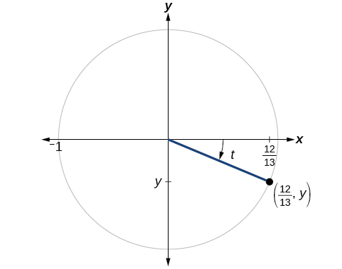{: #Figure_05_03_008}

We can find the sine using the Pythagorean Identity,<math xmlns="http://www.w3.org/1998/Math/MathML"> <mrow> <mtext> </mtext><msup> <mrow> <mi>cos</mi></mrow> <mn>2</mn> </msup> <mi>t</mi><mo>+</mo><msup> <mrow> <mi>sin</mi></mrow> <mn>2</mn> </msup> <mi>t</mi><mo>=</mo><mn>1</mn><mo>,</mo></mrow> </math>

 and the remaining functions by relating them to sine and cosine.

<math xmlns="http://www.w3.org/1998/Math/MathML" display="block"> <mrow> <mtable columnalign="left"> <mtr columnalign="left"> <mtd columnalign="left"> <mrow> <msup> <mrow> <mrow><mo>(</mo> <mrow> <mfrac> <mrow> <mn>12</mn> </mrow> <mrow> <mn>13</mn> </mrow> </mfrac> </mrow> <mo>)</mo></mrow> </mrow> <mn>2</mn> </msup> <mo>+</mo><msup> <mrow> <mi>sin</mi> </mrow> <mn>2</mn> </msup> <mi>t</mi><mo>=</mo><mn>1</mn> </mrow> </mtd> </mtr> <mtr columnalign="left"> <mtd columnalign="left"> <mrow> <mtext>             </mtext><msup> <mrow> <mi>sin</mi> </mrow> <mn>2</mn> </msup> <mi>t</mi><mo>=</mo><mn>1</mn><mo>−</mo><msup> <mrow> <mrow><mo>(</mo> <mrow> <mfrac> <mrow> <mn>12</mn> </mrow> <mrow> <mn>13</mn> </mrow> </mfrac> </mrow> <mo>)</mo></mrow> </mrow> <mn>2</mn> </msup> </mrow> </mtd> </mtr> <mtr columnalign="left"> <mtd columnalign="left"> <mrow> <mtext>             </mtext><msup> <mrow> <mi>sin</mi> </mrow> <mn>2</mn> </msup> <mi>t</mi><mo>=</mo><mn>1</mn><mo>−</mo><mfrac> <mrow> <mn>144</mn> </mrow> <mrow> <mn>169</mn> </mrow> </mfrac> </mrow> </mtd> </mtr> <mtr columnalign="left"> <mtd columnalign="left"> <mrow> <mtext>             </mtext><msup> <mrow> <mi>sin</mi> </mrow> <mn>2</mn> </msup> <mi>t</mi><mo>=</mo><mfrac> <mrow> <mn>25</mn> </mrow> <mrow> <mn>169</mn> </mrow> </mfrac> </mrow> </mtd> </mtr> <mtr columnalign="left"> <mtd columnalign="left"> <mrow> <mtext>               </mtext><mi>sin</mi><mtext> </mtext><mi>t</mi><mo>=</mo><mo>±</mo><msqrt> <mrow> <mfrac> <mrow> <mn>25</mn> </mrow> <mrow> <mn>169</mn> </mrow> </mfrac> </mrow> </msqrt> </mrow> </mtd> </mtr> <mtr columnalign="left"> <mtd columnalign="left"> <mrow> <mtext>               </mtext><mi>sin</mi><mtext> </mtext><mi>t</mi><mo>=</mo><mo>±</mo><mfrac> <mrow> <msqrt> <mrow> <mn>25</mn> </mrow> </msqrt> </mrow> <mrow> <msqrt> <mrow> <mn>169</mn> </mrow> </msqrt> </mrow> </mfrac> </mrow> </mtd> </mtr> <mtr columnalign="left"> <mtd columnalign="left"> <mrow> <mtext>               </mtext><mi>sin</mi><mtext> </mtext><mi>t</mi><mo>=</mo><mo>±</mo><mfrac> <mn>5</mn> <mrow> <mn>13</mn> </mrow> </mfrac> </mrow> </mtd> </mtr> </mtable> </mrow> </math>

The sign of the sine depends on the *y*-values in the quadrant where the angle is located. Since the angle is in quadrant IV, where the *y*-values are negative, its sine is negative,<math xmlns="http://www.w3.org/1998/Math/MathML"> <mrow> <mtext> </mtext><mo>−</mo><mfrac> <mn>5</mn> <mrow> <mn>13</mn></mrow> </mfrac> <mo>.</mo></mrow> </math>

The remaining functions can be calculated using identities relating them to sine and cosine.

<math xmlns="http://www.w3.org/1998/Math/MathML" display="block"> <mtable columnalign="left"> <mtr> <mtd> <mtable columnalign="left"> <mtr columnalign="left"> <mtd columnalign="left"> <mrow> <mtable columnalign="left"> <mtr columnalign="left"> <mtd columnalign="left"> <mrow> <mi>tan</mi><mtext> </mtext><mi>t</mi><mo>=</mo><mfrac> <mrow> <mi>sin</mi><mtext> </mtext><mi>t</mi> </mrow> <mrow> <mi>cos</mi><mtext> </mtext><mi>t</mi> </mrow> </mfrac> <mo>=</mo><mfrac> <mrow> <mo>−</mo><mfrac> <mn>5</mn> <mrow> <mn>13</mn> </mrow> </mfrac> </mrow> <mrow> <mfrac> <mrow> <mn>12</mn> </mrow> <mrow> <mn>13</mn> </mrow> </mfrac> </mrow> </mfrac> <mo>=</mo><mo>−</mo><mfrac> <mn>5</mn> <mrow> <mn>12</mn> </mrow> </mfrac> </mrow> </mtd> </mtr> <mtr columnalign="left"> <mtd columnalign="left"> <mtable columnalign="left"> <mtr> <mtd> <mrow /> </mtd> </mtr> <mtr> <mtd> <mi>sec</mi><mtext> </mtext><mi>t</mi><mo>=</mo><mfrac> <mn>1</mn> <mrow> <mi>cos</mi><mtext> </mtext><mi>t</mi> </mrow> </mfrac> <mo>=</mo><mfrac> <mn>1</mn> <mrow> <mfrac> <mrow> <mn>12</mn> </mrow> <mrow> <mn>13</mn> </mrow> </mfrac> </mrow> </mfrac> <mo>=</mo><mfrac> <mrow> <mn>13</mn> </mrow> <mrow> <mn>12</mn> </mrow> </mfrac> </mtd> </mtr> </mtable> </mtd> </mtr> </mtable> </mrow> </mtd> </mtr> <mtr columnalign="left"> <mtd columnalign="left"> <mrow> <mi>csc</mi><mtext> </mtext><mi>t</mi><mo>=</mo><mfrac> <mn>1</mn> <mrow> <mi>sin</mi><mtext> </mtext><mi>t</mi> </mrow> </mfrac> <mo>=</mo><mfrac> <mn>1</mn> <mrow> <mo>−</mo><mfrac> <mn>5</mn> <mrow> <mn>13</mn> </mrow> </mfrac> </mrow> </mfrac> <mo>=</mo><mo>−</mo><mfrac> <mrow> <mn>13</mn> </mrow> <mn>5</mn> </mfrac> </mrow> </mtd> </mtr> </mtable> </mtd> </mtr> <mtr> <mtd> <mi>cot</mi><mtext> </mtext><mi>t</mi><mo>=</mo><mfrac> <mn>1</mn> <mrow> <mi>tan</mi><mtext> </mtext><mi>t</mi> </mrow> </mfrac> <mo>=</mo><mfrac> <mn>1</mn> <mrow> <mo>−</mo><mfrac> <mn>5</mn> <mrow> <mn>12</mn> </mrow> </mfrac> </mrow> </mfrac> <mo>=</mo><mo>−</mo><mfrac> <mrow> <mn>12</mn> </mrow> <mn>5</mn> </mfrac> </mtd> </mtr> </mtable> </math>

If<math xmlns="http://www.w3.org/1998/Math/MathML"> <mrow> <mtext> </mtext><mi>sec</mi><mo stretchy="false">(</mo><mi>t</mi><mo stretchy="false">)</mo><mo>=</mo><mo>−</mo><mfrac> <mrow> <mn>17</mn></mrow> <mn>8</mn> </mfrac> <mtext> </mtext></mrow> </math>

and<math xmlns="http://www.w3.org/1998/Math/MathML"> <mrow> <mtext> </mtext><mn>0</mn><mo>&lt;</mo><mi>t</mi><mo>&lt;</mo><mi>π</mi><mo>,</mo> </mrow> </math>

 find the values of the other five functions.

<math xmlns="http://www.w3.org/1998/Math/MathML"><mrow> <mi>cos</mi><mspace width="0.2em" /><mi>t</mi><mo>=</mo><mo>−</mo><mfrac> <mn>8</mn> <mrow> <mn>17</mn></mrow> </mfrac> <mo>,</mo><mi>sin</mi><mspace width="0.2em" /><mi>t</mi><mo>=</mo><mfrac> <mrow> <mn>15</mn></mrow> <mrow> <mn>17</mn></mrow> </mfrac> <mo>,</mo><mi>tan</mi><mspace width="0.2em" /><mi>t</mi><mo>=</mo><mo>−</mo><mfrac> <mrow> <mn>15</mn></mrow> <mn>8</mn> </mfrac></mrow></math>

 * * *
{: data-type="newline"}

 <math xmlns="http://www.w3.org/1998/Math/MathML"><mrow> <mi>csc</mi><mspace width="0.2em" /><mi>t</mi><mo>=</mo><mfrac> <mrow> <mn>17</mn></mrow> <mrow> <mn>15</mn></mrow> </mfrac> <mo>,</mo><mi>cot</mi><mspace width="0.2em" /><mi>t</mi><mo>=</mo><mo>−</mo><mfrac> <mn>8</mn> <mrow> <mn>15</mn></mrow> </mfrac></mrow> </math>

As we discussed in the chapter opening, a function that repeats its values in regular intervals is known as a **periodic function**{: data-type="term" .no-emphasis}. The trigonometric functions are periodic. For the four trigonometric functions, sine, cosine, cosecant and secant, a revolution of one circle, or<math xmlns="http://www.w3.org/1998/Math/MathML"> <mrow> <mtext> </mtext><mn>2</mn><mi>π</mi><mo>,</mo></mrow> </math>

 will result in the same outputs for these functions. And for tangent and cotangent, only a half a revolution will result in the same outputs.

Other functions can also be periodic. For example, the lengths of months repeat every four years. If<math xmlns="http://www.w3.org/1998/Math/MathML"> <mrow> <mtext> </mtext><mi>x</mi><mtext> </mtext></mrow> </math>

represents the length time, measured in years, and<math xmlns="http://www.w3.org/1998/Math/MathML"> <mrow> <mtext> </mtext><mi>f</mi><mo stretchy="false">(</mo><mi>x</mi><mo stretchy="false">)</mo><mtext> </mtext></mrow> </math>

represents the number of days in February, then<math xmlns="http://www.w3.org/1998/Math/MathML"> <mrow> <mtext> </mtext><mi>f</mi><mo stretchy="false">(</mo><mi>x</mi><mo>+</mo><mn>4</mn><mo stretchy="false">)</mo><mo>=</mo><mi>f</mi><mo stretchy="false">(</mo><mi>x</mi><mo stretchy="false">)</mo><mo>.</mo><mtext> </mtext></mrow> </math>

 This pattern repeats over and over through time. In other words, every four years, February is guaranteed to have the same number of days as it did 4 years earlier. The positive number 4 is the smallest positive number that satisfies this condition and is called the period. A **period** is the shortest interval over which a function completes one full cycle—in this example, the period is 4 and represents the time it takes for us to be certain February has the same number of days.

Period of a Function

The **period**{: data-type="term"}<math xmlns="http://www.w3.org/1998/Math/MathML"> <mrow> <mtext> </mtext><mi>P</mi><mtext> </mtext></mrow> </math>

of a repeating function<math xmlns="http://www.w3.org/1998/Math/MathML"> <mrow> <mtext> </mtext><mi>f</mi><mtext> </mtext></mrow> </math>

is the number representing the interval such that<math xmlns="http://www.w3.org/1998/Math/MathML"> <mrow> <mtext> </mtext><mi>f</mi><mo stretchy="false">(</mo><mi>x</mi><mo>+</mo><mi>P</mi><mo stretchy="false">)</mo><mo>=</mo><mi>f</mi><mo stretchy="false">(</mo><mi>x</mi><mo stretchy="false">)</mo><mtext> </mtext></mrow> </math>

for any value of<math xmlns="http://www.w3.org/1998/Math/MathML"> <mrow> <mtext> </mtext><mi>x</mi><mo>.</mo><mtext> </mtext></mrow> </math>

The period of the cosine, sine, secant, and cosecant functions is<math xmlns="http://www.w3.org/1998/Math/MathML"> <mrow> <mtext> </mtext><mn>2</mn><mi>π</mi><mo>.</mo><mtext> </mtext></mrow> </math>

The period of the tangent and cotangent functions is<math xmlns="http://www.w3.org/1998/Math/MathML"> <mrow> <mtext> </mtext><mi>π</mi><mo>.</mo></mrow> </math>

Finding the Values of Trigonometric Functions

Find the values of the six trigonometric functions of angle<math xmlns="http://www.w3.org/1998/Math/MathML"> <mrow> <mtext> </mtext><mi>t</mi><mtext> </mtext></mrow> </math>

based on [[link]](#Figure_05_03_009)**.**

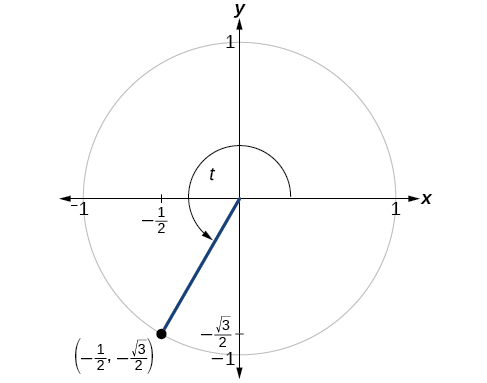{: #Figure_05_03_009}

<math xmlns="http://www.w3.org/1998/Math/MathML"> <mtable columnalign="left"> <mtr> <mtd> <mi>sin</mi><mtext> </mtext><mi>t</mi><mo>=</mo><mi>y</mi><mo>=</mo><mo>−</mo><mfrac> <mrow> <msqrt> <mn>3</mn> </msqrt> </mrow> <mn>2</mn> </mfrac> </mtd> </mtr> <mtr> <mtd> <mi>cos</mi><mtext> </mtext><mi>t</mi><mo>=</mo><mi>x</mi><mo>=</mo><mo>−</mo><mfrac> <mn>1</mn> <mn>2</mn> </mfrac> </mtd> </mtr> <mtr> <mtd> <mi>tan</mi><mtext> </mtext><mi>t</mi><mo>=</mo><mfrac> <mrow> <mi>sin</mi><mi>t</mi> </mrow> <mrow> <mi>cos</mi><mi>t</mi> </mrow> </mfrac> <mo>=</mo><mfrac> <mrow> <mo>−</mo><mfrac> <mrow> <msqrt> <mn>3</mn> </msqrt> </mrow> <mn>2</mn> </mfrac> </mrow> <mrow> <mo>−</mo><mfrac> <mn>1</mn> <mn>2</mn> </mfrac> </mrow> </mfrac> <mo>=</mo><msqrt> <mn>3</mn> </msqrt> </mtd> </mtr> <mtr> <mtd> <mi>sec</mi><mtext> </mtext><mi>t</mi><mo>=</mo><mfrac> <mn>1</mn> <mrow> <mi>cos</mi><mi>t</mi> </mrow> </mfrac> <mo>=</mo><mfrac> <mn>1</mn> <mrow> <mo>−</mo><mfrac> <mn>1</mn> <mn>2</mn> </mfrac> </mrow> </mfrac> <mo>=</mo><mo>−</mo><mn>2</mn> </mtd> </mtr> <mtr> <mtd> <mi>csc</mi><mtext> </mtext><mi>t</mi><mo>=</mo><mfrac> <mn>1</mn> <mrow> <mi>sin</mi><mi>t</mi> </mrow> </mfrac> <mo>=</mo><mfrac> <mn>1</mn> <mrow> <mo>−</mo><mfrac> <mrow> <msqrt> <mn>3</mn> </msqrt> </mrow> <mn>2</mn> </mfrac> </mrow> </mfrac> <mo>=</mo><mo>−</mo><mfrac> <mrow> <mn>2</mn><msqrt> <mn>3</mn> </msqrt> </mrow> <mn>3</mn> </mfrac> </mtd> </mtr> <mtr> <mtd> <mi>cot</mi><mtext> </mtext><mi>t</mi><mo>=</mo><mfrac> <mn>1</mn> <mrow> <mi>tan</mi><mi>t</mi> </mrow> </mfrac> <mo>=</mo><mfrac> <mn>1</mn> <mrow> <msqrt> <mn>3</mn> </msqrt> </mrow> </mfrac> <mo>=</mo><mfrac> <mrow> <msqrt> <mn>3</mn> </msqrt> </mrow> <mn>3</mn> </mfrac> </mtd> </mtr> </mtable> </math>

Find the values of the six trigonometric functions of angle<math xmlns="http://www.w3.org/1998/Math/MathML"> <mrow> <mtext> </mtext><mi>t</mi><mtext> </mtext></mrow> </math>

 based on [[link]](#Figure_05_03_010)<strong>.  </strong>

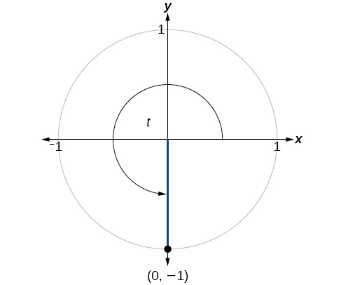{: #Figure_05_03_010}

<math xmlns="http://www.w3.org/1998/Math/MathML"> <mtable columnalign="left"> <mtr> <mtd> <mi>sin</mi><mtext> </mtext><mi>t</mi><mo>=</mo><mo>−</mo><mn>1</mn><mo>,</mo><mi>cos</mi><mtext> </mtext><mi>t</mi><mo>=</mo><mn>0</mn><mo>,</mo><mi>tan</mi><mtext> </mtext><mi>t</mi><mo>=</mo><mtext>Undefined</mtext> </mtd> </mtr> <mtr> <mtd> <mi>sec</mi><mtext> </mtext><mi>t</mi><mo>=</mo><mtext> Undefined,</mtext><mi>csc</mi><mtext> </mtext><mi>t</mi><mo>=</mo><mo>−</mo><mn>1</mn><mo>,</mo><mi>cot</mi><mtext> </mtext><mi>t</mi><mo>=</mo><mn>0</mn> </mtd> </mtr> </mtable> </math>

Finding the Value of Trigonometric Functions

If<math xmlns="http://www.w3.org/1998/Math/MathML"> <mrow> <mtext> </mtext><mi>sin</mi><mrow><mo>(</mo> <mi>t</mi> <mo>)</mo></mrow><mo>=</mo><mo>−</mo><mfrac> <mrow> <msqrt> <mn>3</mn> </msqrt> </mrow> <mn>2</mn> </mfrac> <mtext> </mtext></mrow> </math>

and<math xmlns="http://www.w3.org/1998/Math/MathML"> <mrow> <mtext> </mtext><mtext>cos</mtext><mo stretchy="false">(</mo><mi>t</mi><mo stretchy="false">)</mo><mo>=</mo><mfrac> <mn>1</mn> <mn>2</mn> </mfrac> <mo>,</mo> </mrow> </math>

find<math xmlns="http://www.w3.org/1998/Math/MathML"> <mrow> <mtext> </mtext><mtext>sec</mtext><mo stretchy="false">(</mo><mi>t</mi><mo stretchy="false">)</mo><mo>,</mo><mtext>csc</mtext><mo stretchy="false">(</mo><mi>t</mi><mo stretchy="false">)</mo><mo>,</mo><mtext>tan</mtext><mo stretchy="false">(</mo><mi>t</mi><mo stretchy="false">)</mo><mo>,</mo><mtext> cot</mtext><mo stretchy="false">(</mo><mi>t</mi><mo stretchy="false">)</mo><mo>.</mo> </mrow> </math>

<math xmlns="http://www.w3.org/1998/Math/MathML"> <mrow> <mtable columnalign="left"> <mtr columnalign="left"> <mtd columnalign="left"> <mtable columnalign="left"> <mtr> <mtd> <mrow /> </mtd> </mtr> <mtr> <mtd> <mi>sec</mi><mtext> </mtext><mi>t</mi><mo>=</mo><mfrac> <mn>1</mn> <mrow> <mi>cos</mi><mtext> </mtext><mi>t</mi> </mrow> </mfrac> <mo>=</mo><mfrac> <mn>1</mn> <mrow> <mfrac> <mn>1</mn> <mn>2</mn> </mfrac> </mrow> </mfrac> <mo>=</mo><mn>2</mn> </mtd> </mtr> </mtable> </mtd> </mtr> <mtr columnalign="left"> <mtd columnalign="left"> <mrow> <mi>csc</mi><mtext> </mtext><mi>t</mi><mo>=</mo><mfrac> <mn>1</mn> <mrow> <mi>sin</mi><mtext> </mtext><mi>t</mi> </mrow> </mfrac> <mo>=</mo><mfrac> <mn>1</mn> <mrow> <mo>−</mo><mfrac> <mrow> <msqrt> <mn>3</mn> </msqrt> </mrow> <mn>2</mn> </mfrac> </mrow> </mfrac> <mo>−</mo><mfrac> <mrow> <mn>2</mn><msqrt> <mn>3</mn> </msqrt> </mrow> <mn>3</mn> </mfrac> </mrow> </mtd> </mtr> <mtr columnalign="left"> <mtd columnalign="left"> <mrow> <mi>tan</mi><mtext> </mtext><mi>t</mi><mo>=</mo><mfrac> <mrow> <mi>sin</mi><mtext> </mtext><mi>t</mi> </mrow> <mrow> <mi>cos</mi><mtext> </mtext><mi>t</mi> </mrow> </mfrac> <mo>=</mo><mfrac> <mrow> <mo>−</mo><mfrac> <mrow> <msqrt> <mn>3</mn> </msqrt> </mrow> <mn>2</mn> </mfrac> </mrow> <mrow> <mfrac> <mn>1</mn> <mn>2</mn> </mfrac> </mrow> </mfrac> <mo>=</mo><mo>−</mo><msqrt> <mn>3</mn> </msqrt> </mrow> </mtd> </mtr> <mtr columnalign="left"> <mtd columnalign="left"> <mrow> <mi>cot</mi><mtext> </mtext><mi>t</mi><mo>=</mo><mfrac> <mn>1</mn> <mrow> <mi>tan</mi><mtext> </mtext><mi>t</mi> </mrow> </mfrac> <mo>=</mo><mfrac> <mn>1</mn> <mrow> <mo>−</mo><msqrt> <mn>3</mn> </msqrt> </mrow> </mfrac> <mo>=</mo><mo>−</mo><mfrac> <mrow> <msqrt> <mn>3</mn> </msqrt> </mrow> <mn>3</mn> </mfrac> </mrow> </mtd> </mtr> </mtable> </mrow> </math>

If<math xmlns="http://www.w3.org/1998/Math/MathML"> <mrow> <mtext> </mtext><mi>sin</mi><mrow><mo>(</mo> <mi>t</mi> <mo>)</mo></mrow><mo>=</mo><mfrac> <mrow> <msqrt> <mn>2</mn> </msqrt> </mrow> <mn>2</mn> </mfrac> <mtext> </mtext></mrow> </math>

 and<math xmlns="http://www.w3.org/1998/Math/MathML"> <mrow> <mtext> </mtext><mi>cos</mi><mrow><mo>(</mo> <mi>t</mi> <mo>)</mo></mrow><mo>=</mo><mfrac> <mrow> <msqrt> <mn>2</mn> </msqrt> </mrow> <mn>2</mn> </mfrac> <mo>,</mo></mrow> </math>

find<math xmlns="http://www.w3.org/1998/Math/MathML"> <mrow> <mtext> </mtext><mtext>sec</mtext><mo stretchy="false">(</mo><mi>t</mi><mo stretchy="false">)</mo><mo>,</mo><mtext>csc</mtext><mo stretchy="false">(</mo><mi>t</mi><mo stretchy="false">)</mo><mo>,</mo><mtext>tan</mtext><mo stretchy="false">(</mo><mi>t</mi><mo stretchy="false">)</mo><mo>,</mo><mtext> and cot</mtext><mo stretchy="false">(</mo><mi>t</mi><mo stretchy="false">)</mo><mo>.</mo> </mrow> </math>

<math xmlns="http://www.w3.org/1998/Math/MathML"> <mrow> <mi>sec</mi><mtext> </mtext><mi>t</mi><mo>=</mo><msqrt> <mn>2</mn> </msqrt> <mo>,</mo><mi>csc</mi><mtext> </mtext><mi>t</mi><mo>=</mo><msqrt> <mn>2</mn> </msqrt> <mo>,</mo><mi>tan</mi><mtext> </mtext><mi>t</mi><mo>=</mo><mn>1</mn><mo>,</mo><mi>cot</mi><mtext> </mtext><mi>t</mi><mo>=</mo><mn>1</mn></mrow> </math>

### Evaluating Trigonometric Functions with a Calculator

We have learned how to evaluate the six trigonometric functions for the common first-quadrant angles and to use them as reference angles for angles in other quadrants. To evaluate trigonometric functions of other angles, we use a scientific or graphing calculator or computer software. If the calculator has a degree mode and a radian mode, confirm the correct mode is chosen before making a calculation.

Evaluating a tangent function with a scientific calculator as opposed to a graphing calculator or computer algebra system is like evaluating a sine or cosine: Enter the value and press the TAN key. For the reciprocal functions, there may not be any dedicated keys that say CSC, SEC, or COT. In that case, the function must be evaluated as the reciprocal of a sine, cosine, or tangent.

If we need to work with degrees and our calculator or software does not have a degree mode, we can enter the degrees multiplied by the conversion factor<math xmlns="http://www.w3.org/1998/Math/MathML"> <mrow> <mtext> </mtext><mfrac> <mi>π</mi> <mrow> <mn>180</mn></mrow> </mfrac> <mtext> </mtext></mrow> </math>

to convert the degrees to radians. To find the secant of<math xmlns="http://www.w3.org/1998/Math/MathML"> <mrow> <mtext> </mtext><mn>30°</mn><mo>,</mo></mrow> </math>

 we could press

<math xmlns="http://www.w3.org/1998/Math/MathML" display="block"> <mrow> <mtext> </mtext><mtext>(for a scientific calculator):</mtext><mfrac> <mn>1</mn> <mrow> <mn>30</mn><mo>×</mo><mfrac> <mi>π</mi> <mrow> <mn>180</mn></mrow> </mfrac> </mrow> </mfrac> <mtext>COS</mtext></mrow> </math>

or

<math xmlns="http://www.w3.org/1998/Math/MathML" display="block"> <mrow> <mtext>(for a graphing calculator):</mtext><mtext> </mtext><mtext> </mtext><mfrac> <mn>1</mn> <mrow> <mi>cos</mi><mrow><mo>(</mo> <mrow> <mfrac> <mrow> <mn>30</mn><mi>π</mi></mrow> <mrow> <mn>180</mn></mrow> </mfrac> </mrow> <mo>)</mo></mrow></mrow> </mfrac> </mrow> </math>

<strong>Given an angle measure in radians, use a scientific calculator to find the cosecant. </strong>

1.  If the calculator has degree mode and radian mode, set it to radian mode.
2.  Enter:
    <math xmlns="http://www.w3.org/1998/Math/MathML"> <mrow> <mtext> </mtext><mn>1</mn><mtext> /</mtext><mtext> </mtext></mrow> </math>

3.  Enter the value of the angle inside parentheses.
4.  Press the SIN key.
5.  Press the = key.
{: type="1"}

<strong>Given an angle measure in radians, use a graphing utility/calculator to find the cosecant. </strong>

1.  If the graphing utility has degree mode and radian mode, set it to radian mode.
2.  Enter:
    <math xmlns="http://www.w3.org/1998/Math/MathML"> <mrow> <mtext> </mtext><mn>1</mn><mtext> /</mtext><mtext> </mtext></mrow> </math>

3.  Press the SIN key.
4.  Enter the value of the angle inside parentheses.
5.  Press the ENTER key.
{: type="1"}

Evaluating the Cosecant Using Technology

Evaluate the cosecant of<math xmlns="http://www.w3.org/1998/Math/MathML"> <mrow> <mtext> </mtext><mfrac> <mrow> <mn>5</mn><mi>π</mi></mrow> <mn>7</mn> </mfrac> <mo>.</mo><mtext> </mtext></mrow> </math>

For a scientific calculator, enter information as follows:

<math xmlns="http://www.w3.org/1998/Math/MathML" display="block"> <mrow> <mtext>1 / ( 5 </mtext><mo>×</mo><mtext> </mtext><mi>π</mi><mtext> / 7 ) SIN =</mtext></mrow> </math>

<math xmlns="http://www.w3.org/1998/Math/MathML" display="block"> <mrow> <mi>csc</mi><mrow><mo>(</mo> <mrow> <mfrac> <mrow> <mn>5</mn><mi>π</mi></mrow> <mn>7</mn> </mfrac> </mrow> <mo>)</mo></mrow><mo>≈</mo><mn>1.279</mn></mrow> </math>

Evaluate the cotangent of<math xmlns="http://www.w3.org/1998/Math/MathML"> <mrow> <mtext> </mtext><mo>−</mo><mfrac> <mi>π</mi> <mn>8</mn> </mfrac> <mo>.</mo><mtext> </mtext></mrow> </math>

<math xmlns="http://www.w3.org/1998/Math/MathML"> <mrow> <mo>≈</mo><mo>−</mo><mn>2.414</mn></mrow> </math>

Access these online resources for additional instruction and practice with other trigonometric functions.

* [Determining Trig Function Values][1]
* [More Examples of Determining Trig Functions][2]
* [Pythagorean Identities][3]
* [Trig Functions on a Calculator][4]

### Key Equations

| Tangent function | <math xmlns="http://www.w3.org/1998/Math/MathML"> <mrow> <mi>tan</mi><mtext> </mtext><mi>t</mi><mo>=</mo><mfrac> <mrow> <mi>sin</mi><mi>t</mi> </mrow> <mrow> <mi>cos</mi><mi>t</mi> </mrow> </mfrac> </mrow> </math>

 |
| Secant function | <math xmlns="http://www.w3.org/1998/Math/MathML"> <mrow> <mi>sec</mi><mtext> </mtext><mi>t</mi><mo>=</mo><mfrac> <mn>1</mn> <mrow> <mi>cos</mi><mi>t</mi> </mrow> </mfrac> </mrow> </math>

 |
| Cosecant function | <math xmlns="http://www.w3.org/1998/Math/MathML"> <mrow> <mi>csc</mi><mtext> </mtext><mi>t</mi><mo>=</mo><mfrac> <mn>1</mn> <mrow> <mi>sin</mi><mi>t</mi> </mrow> </mfrac> </mrow> </math>

 |
| Cotangent function | <math xmlns="http://www.w3.org/1998/Math/MathML"> <mrow> <mi>cot</mi><mtext> </mtext><mi>t</mi><mo>=</mo><mfrac> <mn>1</mn> <mrow> <mi>tan</mi><mtext> </mtext><mi>t</mi> </mrow> </mfrac> <mo>=</mo><mfrac> <mrow> <mi>cos</mi><mtext> </mtext><mi>t</mi> </mrow> <mrow> <mi>sin</mi><mtext> </mtext><mi>t</mi> </mrow> </mfrac> </mrow> </math>

 |
{: #eip-id1165134112952 summary=".."}

### Key Concepts

* The tangent of an angle is the ratio of the *y*-value to the *x*-value of the corresponding point on the unit circle.
* The secant, cotangent, and cosecant are all reciprocals of other functions. The secant is the reciprocal of the cosine function, the cotangent is the reciprocal of the tangent function, and the cosecant is the reciprocal of the sine function.
* The six trigonometric functions can be found from a point on the unit circle. See [\[link\]](#Example_05_03_01).
* Trigonometric functions can also be found from an angle. See [\[link\]](#Example_05_03_02).
* Trigonometric functions of angles outside the first quadrant can be determined using reference angles. See [\[link\]](#Example_05_03_03).
* A function is said to be even if
  <math xmlns="http://www.w3.org/1998/Math/MathML"> <mrow> <mtext> </mtext><mi>f</mi><mo stretchy="false">(</mo><mo>−</mo><mi>x</mi><mo stretchy="false">)</mo><mo>=</mo><mi>f</mi><mo stretchy="false">(</mo><mi>x</mi><mo stretchy="false">)</mo><mtext> </mtext></mrow> </math>
  
  and odd if
  <math xmlns="http://www.w3.org/1998/Math/MathML"> <mrow> <mtext> </mtext><mi>f</mi><mrow><mo>(</mo> <mrow> <mo>−</mo><mi>x</mi></mrow> <mo>)</mo></mrow><mo>=</mo><mo>−</mo><mi>f</mi><mrow><mo>(</mo> <mi>x</mi> <mo>)</mo></mrow><mo>.</mo></mrow> </math>

* Cosine and secant are even; sine, tangent, cosecant, and cotangent are odd.
* Even and odd properties can be used to evaluate trigonometric functions. See [\[link\]](#Example_05_03_04).
* The Pythagorean Identity makes it possible to find a cosine from a sine or a sine from a cosine.
* Identities can be used to evaluate trigonometric functions. See [\[link\]](#Example_05_03_05) and [\[link\]](#Example_05_03_06).
* Fundamental identities such as the Pythagorean Identity can be manipulated algebraically to produce new identities. See [\[link\]](#Example_05_03_07).
* The trigonometric functions repeat at regular intervals.
* The period
  <math xmlns="http://www.w3.org/1998/Math/MathML"> <mrow> <mtext> </mtext><mi>P</mi><mtext> </mtext></mrow> </math>
  
  of a repeating function
  <math xmlns="http://www.w3.org/1998/Math/MathML"> <mrow> <mtext> </mtext><mi>f</mi><mtext> </mtext></mrow> </math>
  
  is the smallest interval such that
  <math xmlns="http://www.w3.org/1998/Math/MathML"> <mrow> <mtext> </mtext><mi>f</mi><mo stretchy="false">(</mo><mi>x</mi><mo>+</mo><mi>P</mi><mo stretchy="false">)</mo><mo>=</mo><mi>f</mi><mo stretchy="false">(</mo><mi>x</mi><mo stretchy="false">)</mo><mtext> </mtext></mrow> </math>
  
  for any value of
  <math xmlns="http://www.w3.org/1998/Math/MathML"> <mrow> <mtext> </mtext><mi>x</mi><mo>.</mo></mrow> </math>

* The values of trigonometric functions of special angles can be found by mathematical analysis.
* To evaluate trigonometric functions of other angles, we can use a calculator or computer software. See [\[link\]](#Example_05_03_10).

### Section Exercises

#### Verbal

On an interval of<math xmlns="http://www.w3.org/1998/Math/MathML"> <mrow> <mtext> </mtext><mrow><mo>[</mo> <mrow> <mn>0</mn><mo>,</mo><mn>2</mn><mi>π</mi></mrow> <mo>)</mo></mrow><mo>,</mo></mrow> </math>

 can the sine and cosine values of a radian measure ever be equal? If so, where?

Yes, when the reference angle is<math xmlns="http://www.w3.org/1998/Math/MathML"> <mrow> <mtext> </mtext><mfrac> <mi>π</mi> <mn>4</mn> </mfrac> <mtext> </mtext></mrow> </math>

and the terminal side of the angle is in quadrants I and III. Thus, at<math xmlns="http://www.w3.org/1998/Math/MathML"> <mrow> <mtext> </mtext><mi>x</mi><mo>=</mo><mfrac> <mi>π</mi> <mn>4</mn> </mfrac> <mo>,</mo><mfrac> <mrow> <mn>5</mn><mi>π</mi></mrow> <mn>4</mn> </mfrac> <mo>,</mo></mrow> </math>

 the sine and cosine values are equal.

What would you estimate the cosine of<math xmlns="http://www.w3.org/1998/Math/MathML"> <mrow> <mtext> </mtext><mi>π</mi><mtext> </mtext></mrow> </math>

degrees to be? Explain your reasoning.

For any angle in quadrant II, if you knew the sine of the angle, how could you determine the cosine of the angle?

Substitute the sine of the angle in for<math xmlns="http://www.w3.org/1998/Math/MathML"> <mrow> <mtext> </mtext><mi>y</mi><mtext> </mtext></mrow> </math>

in the Pythagorean Theorem<math xmlns="http://www.w3.org/1998/Math/MathML"> <mrow> <mtext> </mtext><msup> <mi>x</mi> <mn>2</mn> </msup> <mo>+</mo><msup> <mi>y</mi> <mn>2</mn> </msup> <mo>=</mo><mn>1.</mn><mtext> </mtext></mrow> </math>

Solve for<math xmlns="http://www.w3.org/1998/Math/MathML"> <mrow> <mtext> </mtext><mi>x</mi><mtext> </mtext></mrow> </math>

and take the negative solution.

Describe the secant function.

Tangent and cotangent have a period of<math xmlns="http://www.w3.org/1998/Math/MathML"> <mrow> <mtext> </mtext><mi>π</mi><mo>.</mo><mtext> </mtext></mrow> </math>

 What does this tell us about the output of these functions?

The outputs of tangent and cotangent will repeat every<math xmlns="http://www.w3.org/1998/Math/MathML"> <mrow> <mtext> </mtext><mi>π</mi><mtext> </mtext></mrow> </math>

 units.

#### Algebraic

For the following exercises, find the exact value of each expression.

<math xmlns="http://www.w3.org/1998/Math/MathML"> <mrow> <mi>tan</mi><mtext> </mtext><mfrac> <mi>π</mi> <mn>6</mn> </mfrac> </mrow> </math>

<math xmlns="http://www.w3.org/1998/Math/MathML"> <mrow> <mi>sec</mi><mtext> </mtext><mfrac> <mi>π</mi> <mn>6</mn> </mfrac> </mrow> </math>

<math xmlns="http://www.w3.org/1998/Math/MathML"> <mrow> <mfrac> <mrow> <mn>2</mn><msqrt> <mn>3</mn> </msqrt> </mrow> <mn>3</mn> </mfrac> </mrow> </math>

<math xmlns="http://www.w3.org/1998/Math/MathML"> <mrow> <mi>csc</mi><mtext> </mtext><mfrac> <mi>π</mi> <mn>6</mn> </mfrac> </mrow> </math>

<math xmlns="http://www.w3.org/1998/Math/MathML"> <mrow> <mi>cot</mi><mtext> </mtext><mfrac> <mi>π</mi> <mn>6</mn> </mfrac> </mrow> </math>

<math xmlns="http://www.w3.org/1998/Math/MathML"> <mrow> <msqrt> <mn>3</mn> </msqrt> </mrow> </math>

<math xmlns="http://www.w3.org/1998/Math/MathML"> <mrow> <mi>tan</mi><mtext> </mtext><mfrac> <mi>π</mi> <mn>4</mn> </mfrac> </mrow> </math>

<math xmlns="http://www.w3.org/1998/Math/MathML"> <mrow> <mi>sec</mi><mtext> </mtext><mfrac> <mi>π</mi> <mn>4</mn> </mfrac> </mrow> </math>

<math xmlns="http://www.w3.org/1998/Math/MathML"> <mrow> <msqrt> <mn>2</mn> </msqrt> </mrow> </math>

<math xmlns="http://www.w3.org/1998/Math/MathML"> <mrow> <mi>csc</mi><mtext> </mtext><mfrac> <mi>π</mi> <mn>4</mn> </mfrac> </mrow> </math>

<math xmlns="http://www.w3.org/1998/Math/MathML"> <mrow> <mi>cot</mi><mtext> </mtext><mfrac> <mi>π</mi> <mn>4</mn> </mfrac> </mrow> </math>

1

<math xmlns="http://www.w3.org/1998/Math/MathML"> <mrow> <mi>tan</mi><mtext> </mtext><mfrac> <mi>π</mi> <mn>3</mn> </mfrac> </mrow> </math>

<math xmlns="http://www.w3.org/1998/Math/MathML"> <mrow> <mi>sec</mi><mtext> </mtext><mfrac> <mi>π</mi> <mn>3</mn> </mfrac> </mrow> </math>

2

<math xmlns="http://www.w3.org/1998/Math/MathML"> <mrow> <mi>csc</mi><mtext> </mtext><mfrac> <mi>π</mi> <mn>3</mn> </mfrac> </mrow> </math>

<math xmlns="http://www.w3.org/1998/Math/MathML"> <mrow> <mi>cot</mi><mtext> </mtext><mfrac> <mi>π</mi> <mn>3</mn> </mfrac> </mrow> </math>

<math xmlns="http://www.w3.org/1998/Math/MathML"> <mrow> <mfrac> <mrow> <msqrt> <mn>3</mn> </msqrt> </mrow> <mn>3</mn> </mfrac> </mrow> </math>

For the following exercises, use reference angles to evaluate the expression.

<math xmlns="http://www.w3.org/1998/Math/MathML"> <mrow> <mi>tan</mi><mtext> </mtext><mfrac> <mrow> <mn>5</mn><mi>π</mi> </mrow> <mn>6</mn> </mfrac> </mrow> </math>

<math xmlns="http://www.w3.org/1998/Math/MathML"> <mrow> <mi>sec</mi><mtext> </mtext><mfrac> <mrow> <mn>7</mn><mi>π</mi> </mrow> <mn>6</mn> </mfrac> </mrow> </math>

<math xmlns="http://www.w3.org/1998/Math/MathML"> <mrow> <mo>−</mo><mfrac> <mrow> <mn>2</mn><msqrt> <mn>3</mn> </msqrt> </mrow> <mn>3</mn> </mfrac> </mrow> </math>

<math xmlns="http://www.w3.org/1998/Math/MathML"> <mrow> <mi>csc</mi><mtext> </mtext><mfrac> <mrow> <mn>11</mn><mi>π</mi> </mrow> <mn>6</mn> </mfrac> </mrow> </math>

<math xmlns="http://www.w3.org/1998/Math/MathML"> <mrow> <mi>cot</mi><mtext> </mtext><mfrac> <mrow> <mn>13</mn><mi>π</mi> </mrow> <mn>6</mn> </mfrac> </mrow> </math>

<math xmlns="http://www.w3.org/1998/Math/MathML"> <mrow> <msqrt> <mn>3</mn> </msqrt> </mrow> </math>

<math xmlns="http://www.w3.org/1998/Math/MathML"> <mrow> <mi>tan</mi><mtext> </mtext><mfrac> <mrow> <mn>7</mn><mi>π</mi> </mrow> <mn>4</mn> </mfrac> </mrow> </math>

<math xmlns="http://www.w3.org/1998/Math/MathML"> <mrow> <mi>sec</mi><mtext> </mtext><mfrac> <mrow> <mn>3</mn><mi>π</mi> </mrow> <mn>4</mn> </mfrac> </mrow> </math>

<math xmlns="http://www.w3.org/1998/Math/MathML"> <mrow> <mo>−</mo><msqrt> <mn>2</mn> </msqrt> </mrow> </math>

<math xmlns="http://www.w3.org/1998/Math/MathML"> <mrow> <mi>csc</mi><mtext> </mtext><mfrac> <mrow> <mn>5</mn><mi>π</mi> </mrow> <mn>4</mn> </mfrac> </mrow> </math>

<math xmlns="http://www.w3.org/1998/Math/MathML"> <mrow> <mi>cot</mi><mtext> </mtext><mfrac> <mrow> <mn>11</mn><mi>π</mi> </mrow> <mn>4</mn> </mfrac> </mrow> </math>

−1

<math xmlns="http://www.w3.org/1998/Math/MathML"> <mrow> <mi>tan</mi><mtext> </mtext><mfrac> <mrow> <mn>8</mn><mi>π</mi> </mrow> <mn>3</mn> </mfrac> </mrow> </math>

<math xmlns="http://www.w3.org/1998/Math/MathML"> <mrow> <mi>sec</mi><mtext> </mtext><mfrac> <mrow> <mn>4</mn><mi>π</mi> </mrow> <mn>3</mn> </mfrac> </mrow> </math>

−2

<math xmlns="http://www.w3.org/1998/Math/MathML"> <mrow> <mi>csc</mi><mtext> </mtext><mfrac> <mrow> <mn>2</mn><mi>π</mi> </mrow> <mn>3</mn> </mfrac> </mrow> </math>

<math xmlns="http://www.w3.org/1998/Math/MathML"> <mrow> <mi>cot</mi><mtext> </mtext><mfrac> <mrow> <mn>5</mn><mi>π</mi> </mrow> <mn>3</mn> </mfrac> </mrow> </math>

<math xmlns="http://www.w3.org/1998/Math/MathML"> <mrow> <mo>−</mo><mfrac> <mrow> <msqrt> <mn>3</mn> </msqrt> </mrow> <mn>3</mn> </mfrac> </mrow> </math>

<math xmlns="http://www.w3.org/1998/Math/MathML"> <mrow> <mi>tan</mi><mtext> </mtext><mn>225°</mn></mrow> </math>

<math xmlns="http://www.w3.org/1998/Math/MathML"> <mrow> <mi>sec</mi><mtext> </mtext><mn>300°</mn></mrow> </math>

2

<math xmlns="http://www.w3.org/1998/Math/MathML"> <mrow> <mi>csc</mi><mtext> </mtext><mn>150°</mn></mrow> </math>

<math xmlns="http://www.w3.org/1998/Math/MathML"> <mrow> <mi>cot</mi><mtext> </mtext><mn>240°</mn></mrow> </math>

<math xmlns="http://www.w3.org/1998/Math/MathML"> <mrow> <mfrac> <mrow> <msqrt> <mn>3</mn> </msqrt> </mrow> <mn>3</mn> </mfrac> </mrow> </math>

<math xmlns="http://www.w3.org/1998/Math/MathML"> <mrow> <mi>tan</mi><mtext> </mtext><mn>330°</mn></mrow> </math>

<math xmlns="http://www.w3.org/1998/Math/MathML"> <mrow> <mi>sec</mi><mtext> </mtext><mn>120°</mn></mrow> </math>

−2

<math xmlns="http://www.w3.org/1998/Math/MathML"> <mrow> <mi>csc</mi><mtext> </mtext><mn>210°</mn></mrow> </math>

<math xmlns="http://www.w3.org/1998/Math/MathML"> <mrow> <mi>cot</mi><mtext> </mtext><mn>315°</mn></mrow> </math>

−1

If<math xmlns="http://www.w3.org/1998/Math/MathML"> <mrow> <mtext> </mtext><mtext>sin</mtext><mtext> </mtext><mi>t</mi><mo>=</mo><mfrac> <mn>3</mn> <mn>4</mn> </mfrac> <mo>,</mo> </mrow> </math>

 and<math xmlns="http://www.w3.org/1998/Math/MathML"> <mrow> <mtext> </mtext><mtext> </mtext><mi>t</mi><mtext> </mtext></mrow> </math>

is in quadrant II, find<math xmlns="http://www.w3.org/1998/Math/MathML"> <mrow> <mtext> </mtext><mi>cos</mi><mtext> </mtext><mi>t</mi><mo>,</mo><mi>sec</mi><mtext> </mtext><mi>t</mi><mo>,</mo><mi>csc</mi><mtext> </mtext><mi>t</mi><mo>,</mo><mi>tan</mi><mtext> </mtext><mi>t</mi><mo>,</mo><mi>cot</mi><mtext> </mtext><mi>t</mi><mo>.</mo> </mrow> </math>

If<math xmlns="http://www.w3.org/1998/Math/MathML"> <mrow> <mtext> </mtext><mtext>cos</mtext><mtext> </mtext><mi>t</mi><mo>=</mo><mo>−</mo><mfrac> <mn>1</mn> <mn>3</mn> </mfrac> <mo>,</mo> </mrow> </math>

 and<math xmlns="http://www.w3.org/1998/Math/MathML"> <mrow> <mtext> </mtext><mtext> </mtext><mi>t</mi><mtext> </mtext></mrow> </math>

is in quadrant III, find<math xmlns="http://www.w3.org/1998/Math/MathML"> <mrow> <mtext> </mtext><mi>sin</mi><mtext> </mtext><mi>t</mi><mo>,</mo><mi>sec</mi><mtext> </mtext><mi>t</mi><mo>,</mo><mi>csc</mi><mtext> </mtext><mi>t</mi><mo>,</mo><mi>tan</mi><mtext> </mtext><mi>t</mi><mo>,</mo><mi>cot</mi><mtext> </mtext><mi>t</mi><mo>.</mo> </mrow> </math>

If<math xmlns="http://www.w3.org/1998/Math/MathML"> <mrow> <mi>sin</mi><mtext> </mtext><mi>t</mi><mo>=</mo><mo>−</mo><mfrac> <mrow> <mn>2</mn><msqrt> <mn>2</mn> </msqrt> </mrow> <mn>3</mn> </mfrac> <mo>,</mo><mi>sec</mi><mtext> </mtext><mi>t</mi><mo>=</mo><mo>−</mo><mn>3</mn><mo>,</mo><mi>csc</mi><mtext> </mtext><mi>t</mi><mo>=</mo><mo>−</mo><mfrac> <mrow> <mn>3</mn><msqrt> <mn>2</mn> </msqrt> </mrow> <mn>4</mn> </mfrac> <mo>,</mo><mi>tan</mi><mtext> </mtext><mi>t</mi><mo>=</mo><mn>2</mn><msqrt> <mn>2</mn> </msqrt> <mo>,</mo><mi>cot</mi><mtext> </mtext><mi>t</mi><mo>=</mo><mfrac> <mrow> <msqrt> <mn>2</mn> </msqrt> </mrow> <mn>4</mn> </mfrac> </mrow> </math>

If<math xmlns="http://www.w3.org/1998/Math/MathML"> <mrow> <mtext> </mtext><mi>tan</mi><mtext> </mtext><mi>t</mi><mo>=</mo><mfrac> <mrow> <mn>12</mn></mrow> <mn>5</mn> </mfrac> <mo>,</mo></mrow> </math>

 and<math xmlns="http://www.w3.org/1998/Math/MathML"> <mrow> <mtext> </mtext><mn>0</mn><mo>≤</mo><mi>t</mi><mo>&lt;</mo><mfrac> <mi>π</mi> <mn>2</mn> </mfrac> <mo>,</mo></mrow> </math>

 find<math xmlns="http://www.w3.org/1998/Math/MathML"> <mrow> <mtext> </mtext><mi>sin</mi><mtext> </mtext><mi>t</mi><mo>,</mo><mi>cos</mi><mtext> </mtext><mi>t</mi><mo>,</mo><mi>sec</mi><mtext> </mtext><mi>t</mi><mo>,</mo><mi>csc</mi><mtext> </mtext><mi>t</mi><mo>,</mo> </mrow> </math>

 and <math xmlns="http://www.w3.org/1998/Math/MathML"> <mrow> <mtext> </mtext><mi>cot</mi><mtext> </mtext><mi>t</mi><mo>.</mo> </mrow> </math>

If<math xmlns="http://www.w3.org/1998/Math/MathML"> <mrow> <mtext> </mtext><mi>sin</mi><mtext> </mtext><mi>t</mi><mo>=</mo><mfrac> <mrow> <msqrt> <mn>3</mn> </msqrt> </mrow> <mn>2</mn> </mfrac> <mtext> </mtext></mrow> </math>

and<math xmlns="http://www.w3.org/1998/Math/MathML"> <mrow> <mtext> </mtext><mi>cos</mi><mtext> </mtext><mi>t</mi><mo>=</mo><mfrac> <mn>1</mn> <mn>2</mn> </mfrac> <mo>,</mo></mrow> </math>

 find<math xmlns="http://www.w3.org/1998/Math/MathML"> <mrow> <mtext> </mtext><mi>sec</mi><mtext> </mtext><mi>t</mi><mo>,</mo><mi>csc</mi><mtext> </mtext><mi>t</mi><mo>,</mo><mi>tan</mi><mtext> </mtext><mi>t</mi><mo>,</mo> </mrow> </math>

 and <math xmlns="http://www.w3.org/1998/Math/MathML"> <mrow> <mtext> </mtext><mi>cot</mi><mtext> </mtext><mi>t</mi><mo>.</mo></mrow> </math>

<math xmlns="http://www.w3.org/1998/Math/MathML"> <mrow> <mi>sec</mi><mtext> </mtext><mi>t</mi><mo>=</mo><mn>2</mn><mo>,</mo><mi>csc</mi><mtext> </mtext><mi>t</mi><mo>=</mo><mfrac> <mrow> <mn>2</mn><msqrt> <mn>3</mn> </msqrt> </mrow> <mn>3</mn> </mfrac> <mo>,</mo><mtext> </mtext><mi>tan</mi><mtext> </mtext><mi>t</mi><mo>=</mo><msqrt> <mn>3</mn> </msqrt> <mo>,</mo><mtext> </mtext><mi>cot</mi><mtext> </mtext><mi>t</mi><mo>=</mo><mfrac> <mrow> <msqrt> <mn>3</mn> </msqrt> </mrow> <mn>3</mn> </mfrac> </mrow> </math>

If<math xmlns="http://www.w3.org/1998/Math/MathML"> <mrow> <mtext> </mtext><mi>sin</mi><mtext> </mtext><mn>40°</mn><mo>≈</mo><mn>0.643</mn><mtext> </mtext><mtext> </mtext><mi>cos</mi><mtext> </mtext><mn>40°</mn><mo>≈</mo><mn>0.766</mn><mtext> </mtext><mtext> </mtext><mtext>sec</mtext><mtext> </mtext><mn>40°</mn><mo>,</mo><mtext>csc</mtext><mtext> </mtext><mn>40°</mn><mo>,</mo><mtext>tan</mtext><mtext> </mtext><mn>40°</mn><mo>,</mo><mtext>and</mtext><mtext> </mtext><mtext>cot</mtext><mtext> </mtext><mn>40°</mn><mo>.</mo> </mrow> </math>

If<math xmlns="http://www.w3.org/1998/Math/MathML"> <mrow> <mtext> </mtext><mtext>sin</mtext><mtext> </mtext><mi>t</mi><mo>=</mo><mfrac> <mrow> <msqrt> <mn>2</mn> </msqrt> </mrow> <mn>2</mn> </mfrac> <mo>,</mo> </mrow> </math>

 what is the<math xmlns="http://www.w3.org/1998/Math/MathML"> <mrow> <mtext> </mtext><mtext>sin</mtext><mo stretchy="false">(</mo><mi>−</mi><mi>t</mi><mo stretchy="false">)</mo><mo>?</mo> </mrow> </math>

<math xmlns="http://www.w3.org/1998/Math/MathML"> <mrow> <mtext> </mtext><mo>−</mo><mfrac> <mrow> <msqrt> <mn>2</mn> </msqrt> </mrow> <mn>2</mn> </mfrac> <mtext> </mtext></mrow> </math>

If<math xmlns="http://www.w3.org/1998/Math/MathML"> <mrow> <mtext> </mtext><mtext>cos</mtext><mtext> </mtext><mi>t</mi><mo>=</mo><mfrac> <mn>1</mn> <mn>2</mn> </mfrac> <mo>,</mo> </mrow> </math>

 what is the<math xmlns="http://www.w3.org/1998/Math/MathML"> <mrow> <mtext> </mtext><mtext>cos</mtext><mo stretchy="false">(</mo><mi>−</mi><mi>t</mi><mo stretchy="false">)</mo><mo>?</mo> </mrow> </math>

If<math xmlns="http://www.w3.org/1998/Math/MathML"> <mrow> <mtext> </mtext><mtext>sec</mtext><mtext> </mtext><mi>t</mi><mo>=</mo><mn>3.1</mn><mo>,</mo> </mrow> </math>

 what is the<math xmlns="http://www.w3.org/1998/Math/MathML"> <mrow> <mtext> </mtext><mtext>sec</mtext><mo stretchy="false">(</mo><mi>−</mi><mi>t</mi><mo stretchy="false">)</mo><mo>?</mo> </mrow> </math>

3\.1

If<math xmlns="http://www.w3.org/1998/Math/MathML"> <mrow> <mtext> </mtext><mtext>csc</mtext><mtext> </mtext><mi>t</mi><mo>=</mo><mn>0.34</mn><mo>,</mo> </mrow> </math>

 what is the<math xmlns="http://www.w3.org/1998/Math/MathML"> <mrow> <mtext> </mtext><mtext>csc</mtext><mo stretchy="false">(</mo><mi>−</mi><mi>t</mi><mo stretchy="false">)</mo><mo>?</mo> </mrow> </math>

If<math xmlns="http://www.w3.org/1998/Math/MathML"> <mrow> <mtext> </mtext><mtext>tan</mtext><mtext> </mtext><mi>t</mi><mo>=</mo><mo>−</mo><mn>1.4</mn><mo>,</mo> </mrow> </math>

 what is the<math xmlns="http://www.w3.org/1998/Math/MathML"> <mrow> <mtext> </mtext><mtext>tan</mtext><mo stretchy="false">(</mo><mi>−</mi><mi>t</mi><mo stretchy="false">)</mo><mo>?</mo> </mrow> </math>

1\.4

If<math xmlns="http://www.w3.org/1998/Math/MathML"> <mrow> <mtext> </mtext><mtext>cot</mtext><mtext> </mtext><mi>t</mi><mo>=</mo><mn>9.23</mn><mo>,</mo> </mrow> </math>

 what is the<math xmlns="http://www.w3.org/1998/Math/MathML"> <mrow> <mtext> </mtext><mtext>cot</mtext><mo stretchy="false">(</mo><mi>−</mi><mi>t</mi><mo stretchy="false">)</mo><mo>?</mo> </mrow> </math>

#### Graphical

For the following exercises, use the angle in the unit circle to find the value of the each of the six trigonometric functions.

 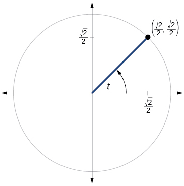 

<math xmlns="http://www.w3.org/1998/Math/MathML"> <mrow> <mi>sin</mi><mtext> </mtext><mi>t</mi><mo>=</mo><mfrac> <mrow> <msqrt> <mn>2</mn> </msqrt> </mrow> <mn>2</mn> </mfrac> <mo>,</mo><mi>cos</mi><mtext> </mtext><mi>t</mi><mo>=</mo><mfrac> <mrow> <msqrt> <mn>2</mn> </msqrt> </mrow> <mn>2</mn> </mfrac> <mo>,</mo><mi>tan</mi><mtext> </mtext><mi>t</mi><mo>=</mo><mn>1</mn><mo>,</mo><mi>cot</mi><mtext> </mtext><mi>t</mi><mo>=</mo><mn>1</mn><mo>,</mo><mi>sec</mi><mtext> </mtext><mi>t</mi><mo>=</mo><msqrt> <mn>2</mn> </msqrt> <mo>,</mo><mi>csc</mi><mtext> </mtext><mi>t</mi><mo>=</mo><msqrt> <mn>2</mn> </msqrt> </mrow> </math>

 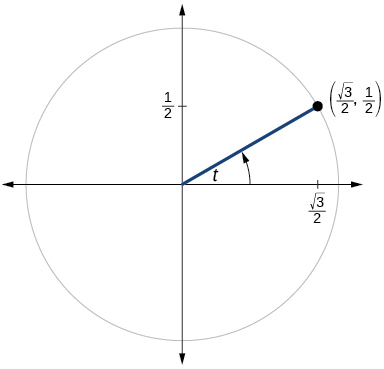 

 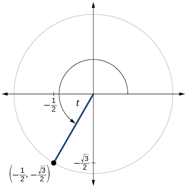 

<math xmlns="http://www.w3.org/1998/Math/MathML"> <mrow> <mi>sin</mi><mtext> </mtext><mi>t</mi><mo>=</mo><mo>−</mo><mfrac> <mrow> <msqrt> <mn>3</mn> </msqrt> </mrow> <mn>2</mn> </mfrac> <mo>,</mo><mi>cos</mi><mtext> </mtext><mi>t</mi><mo>=</mo><mo>−</mo><mfrac> <mn>1</mn> <mn>2</mn> </mfrac> <mo>,</mo><mi>tan</mi><mtext> </mtext><mi>t</mi><mo>=</mo><msqrt> <mn>3</mn> </msqrt> <mo>,</mo><mi>cot</mi><mtext> </mtext><mi>t</mi><mo>=</mo><mfrac> <mrow> <msqrt> <mn>3</mn> </msqrt> </mrow> <mn>3</mn> </mfrac> <mo>,</mo><mi>sec</mi><mtext> </mtext><mi>t</mi><mo>=</mo><mo>−</mo><mn>2</mn><mo>,</mo><mi>csc</mi><mtext> </mtext><mi>t</mi><mo>=</mo><mo>−</mo><mfrac> <mrow> <mn>2</mn><msqrt> <mn>3</mn> </msqrt> </mrow> <mn>3</mn> </mfrac> </mrow> </math>

#### Technology

For the following exercises, use a graphing calculator to evaluate.

<math xmlns="http://www.w3.org/1998/Math/MathML"> <mrow> <mi>csc</mi><mtext> </mtext><mfrac> <mrow> <mn>5</mn><mi>π</mi> </mrow> <mn>9</mn> </mfrac> </mrow> </math>

<math xmlns="http://www.w3.org/1998/Math/MathML"> <mrow> <mi>cot</mi><mtext> </mtext><mfrac> <mrow> <mn>4</mn><mi>π</mi> </mrow> <mn>7</mn> </mfrac> </mrow> </math>

–0.228

<math xmlns="http://www.w3.org/1998/Math/MathML"> <mrow> <mi>sec</mi><mtext> </mtext><mfrac> <mi>π</mi> <mrow> <mn>10</mn> </mrow> </mfrac> </mrow> </math>

<math xmlns="http://www.w3.org/1998/Math/MathML"> <mrow> <mi>tan</mi><mtext> </mtext><mfrac> <mrow> <mn>5</mn><mi>π</mi> </mrow> <mn>8</mn> </mfrac> </mrow> </math>

–2.414

<math xmlns="http://www.w3.org/1998/Math/MathML"> <mrow> <mi>sec</mi><mtext> </mtext><mfrac> <mrow> <mn>3</mn><mi>π</mi> </mrow> <mn>4</mn> </mfrac> </mrow> </math>

<math xmlns="http://www.w3.org/1998/Math/MathML"> <mrow> <mi>csc</mi><mtext> </mtext><mfrac> <mi>π</mi> <mn>4</mn> </mfrac> </mrow> </math>

1\.414

<math xmlns="http://www.w3.org/1998/Math/MathML"> <mrow> <mtext>tan</mtext><mtext> </mtext><mn>98°</mn> </mrow> </math>

<math xmlns="http://www.w3.org/1998/Math/MathML"> <mrow> <mi>cot</mi><mtext> </mtext><mn>33°</mn></mrow> </math>

1\.540

<math xmlns="http://www.w3.org/1998/Math/MathML"> <mrow> <mi>cot</mi><mtext> </mtext><mn>140°</mn></mrow> </math>

<math xmlns="http://www.w3.org/1998/Math/MathML"> <mrow> <mi>sec</mi><mtext> </mtext><mn>310°</mn></mrow> </math>

1\.556

#### Extensions

For the following exercises, use identities to evaluate the expression.

If<math xmlns="http://www.w3.org/1998/Math/MathML"> <mrow> <mtext> </mtext><mi>tan</mi><mrow><mo>(</mo> <mi>t</mi> <mo>)</mo></mrow><mo>≈</mo><mn>2.7</mn><mo>,</mo></mrow> </math>

 and<math xmlns="http://www.w3.org/1998/Math/MathML"> <mrow> <mtext> </mtext><mi>sin</mi><mrow><mo>(</mo> <mi>t</mi> <mo>)</mo></mrow><mo>≈</mo><mn>0.94</mn><mo>,</mo></mrow> </math>

 find<math xmlns="http://www.w3.org/1998/Math/MathML"> <mrow> <mtext> </mtext><mi>cos</mi><mrow><mo>(</mo> <mi>t</mi> <mo>)</mo></mrow><mo>.</mo></mrow> </math>

If<math xmlns="http://www.w3.org/1998/Math/MathML"> <mrow> <mtext> </mtext><mi>tan</mi><mrow><mo>(</mo> <mi>t</mi> <mo>)</mo></mrow><mo>≈</mo><mn>1.3</mn><mo>,</mo></mrow> </math>

 and<math xmlns="http://www.w3.org/1998/Math/MathML"> <mrow> <mtext> </mtext><mi>cos</mi><mrow><mo>(</mo> <mi>t</mi> <mo>)</mo></mrow><mo>≈</mo><mn>0.61</mn><mo>,</mo></mrow> </math>

 find<math xmlns="http://www.w3.org/1998/Math/MathML"> <mrow> <mtext> </mtext><mi>sin</mi><mrow><mo>(</mo> <mi>t</mi> <mo>)</mo></mrow><mo>.</mo><mtext> </mtext></mrow> </math>

<math xmlns="http://www.w3.org/1998/Math/MathML"> <mrow> <mi>sin</mi><mrow><mo>(</mo> <mi>t</mi> <mo>)</mo></mrow><mo>≈</mo><mn>0.79</mn></mrow> </math>

If<math xmlns="http://www.w3.org/1998/Math/MathML"> <mrow> <mtext> </mtext><mi>csc</mi><mrow><mo>(</mo> <mi>t</mi> <mo>)</mo></mrow><mo>≈</mo><mn>3.2</mn><mo>,</mo></mrow> </math>

 and<math xmlns="http://www.w3.org/1998/Math/MathML"> <mrow> <mtext> </mtext><mi>cos</mi><mrow><mo>(</mo> <mi>t</mi> <mo>)</mo></mrow><mo>≈</mo><mn>0.95</mn><mo>,</mo></mrow> </math>

 find<math xmlns="http://www.w3.org/1998/Math/MathML"> <mrow> <mtext> </mtext><mi>tan</mi><mrow><mo>(</mo> <mi>t</mi> <mo>)</mo></mrow><mo>.</mo></mrow> </math>

If<math xmlns="http://www.w3.org/1998/Math/MathML"> <mrow> <mtext> </mtext><mi>cot</mi><mrow><mo>(</mo> <mi>t</mi> <mo>)</mo></mrow><mo>≈</mo><mn>0.58</mn><mo>,</mo></mrow> </math>

 and<math xmlns="http://www.w3.org/1998/Math/MathML"> <mrow> <mtext> </mtext><mi>cos</mi><mrow><mo>(</mo> <mi>t</mi> <mo>)</mo></mrow><mo>≈</mo><mn>0.5</mn><mo>,</mo></mrow> </math>

 find<math xmlns="http://www.w3.org/1998/Math/MathML"> <mrow> <mtext> </mtext><mi>csc</mi><mrow><mo>(</mo> <mi>t</mi> <mo>)</mo></mrow><mo>.</mo></mrow> </math>

<math xmlns="http://www.w3.org/1998/Math/MathML"> <mrow> <mi>csc</mi><mi>t</mi><mo>≈</mo><mn>1.16</mn></mrow> </math>

Determine whether the function<math xmlns="http://www.w3.org/1998/Math/MathML"> <mrow> <mtext> </mtext><mi>f</mi><mo stretchy="false">(</mo><mi>x</mi><mo stretchy="false">)</mo><mo>=</mo><mn>2</mn><mi>sin</mi><mtext> </mtext><mi>x</mi><mtext> </mtext><mi>cos</mi><mtext> </mtext><mi>x</mi><mtext> </mtext></mrow> </math>

is even, odd, or neither.

Determine whether the function <math xmlns="http://www.w3.org/1998/Math/MathML"> <mrow> <mi>f</mi><mo stretchy="false">(</mo><mi>x</mi><mo stretchy="false">)</mo><mo>=</mo><mn>3</mn><msup> <mrow> <mi>sin</mi></mrow> <mn>2</mn> </msup> <mi>x</mi><mtext> </mtext><mi>cos</mi><mtext> </mtext><mi>x</mi><mtext> </mtext><mo>+</mo><mtext> </mtext><mi>sec</mi><mtext> </mtext><mi>x</mi></mrow> </math>

 is even, odd, or neither.

even

Determine whether the function <math xmlns="http://www.w3.org/1998/Math/MathML"> <mrow> <mi>f</mi><mo stretchy="false">(</mo><mi>x</mi><mo stretchy="false">)</mo><mo>=</mo><mi>sin</mi><mtext> </mtext><mi>x</mi><mtext> </mtext><mo>−</mo><mn>2</mn><msup> <mrow> <mi>cos</mi></mrow> <mn>2</mn> </msup> <mi>x</mi></mrow> </math>

 is even, odd, or neither.

Determine whether the function<math xmlns="http://www.w3.org/1998/Math/MathML"> <mrow> <mtext> </mtext><mi>f</mi><mo stretchy="false">(</mo><mi>x</mi><mo stretchy="false">)</mo><mo>=</mo><msup> <mrow> <mi>csc</mi> </mrow> <mn>2</mn> </msup> <mi>x</mi><mo>+</mo><mi>sec</mi><mtext> </mtext><mi>x</mi><mtext> </mtext> </mrow> </math>

is even, odd, or neither.

even

For the following exercises, use identities to simplify the expression.

<math xmlns="http://www.w3.org/1998/Math/MathML"> <mrow> <mi>csc</mi><mtext> </mtext><mi>t</mi><mtext> </mtext><mi>tan</mi><mtext> </mtext><mi>t</mi></mrow> </math>

<math xmlns="http://www.w3.org/1998/Math/MathML"> <mrow> <mfrac> <mrow> <mi>sec</mi><mtext> </mtext><mi>t</mi></mrow> <mrow> <mi>csc</mi><mtext> </mtext><mi>t</mi></mrow> </mfrac> </mrow> </math>

<math xmlns="http://www.w3.org/1998/Math/MathML"> <mrow> <mfrac> <mrow> <mi>sin</mi><mtext> </mtext><mi>t</mi></mrow> <mrow> <mi>cos</mi><mtext> </mtext><mi>t</mi></mrow> </mfrac> <mo>=</mo><mi>tan</mi><mtext> </mtext><mi>t</mi></mrow> </math>

#### Real-World Applications

The amount of sunlight in a certain city can be modeled by the function<math xmlns="http://www.w3.org/1998/Math/MathML"> <mrow> <mtext> </mtext><mi>h</mi><mo>=</mo><mn>15</mn><mi>cos</mi><mrow><mo>(</mo> <mrow> <mfrac> <mn>1</mn> <mrow> <mn>600</mn></mrow> </mfrac> <mi>d</mi></mrow> <mo>)</mo></mrow><mo>,</mo></mrow> </math>

 where<math xmlns="http://www.w3.org/1998/Math/MathML"> <mrow> <mtext> </mtext><mi>h</mi><mtext> </mtext></mrow> </math>

represents the hours of sunlight, and<math xmlns="http://www.w3.org/1998/Math/MathML"> <mrow> <mtext> </mtext><mi>d</mi><mtext> </mtext></mrow> </math>

is the day of the year. Use the equation to find how many hours of sunlight there are on February 10, the 42nd day of the year. State the period of the function.

The amount of sunlight in a certain city can be modeled by the function <math xmlns="http://www.w3.org/1998/Math/MathML"> <mrow> <mtext> </mtext><mi>h</mi><mo>=</mo><mn>16</mn><mi>cos</mi><mrow><mo>(</mo> <mrow> <mfrac> <mn>1</mn> <mrow> <mn>500</mn></mrow> </mfrac> <mi>d</mi></mrow> <mo>)</mo></mrow><mo>,</mo></mrow> </math>

 where<math xmlns="http://www.w3.org/1998/Math/MathML"> <mrow> <mtext> </mtext><mi>h</mi><mtext> </mtext></mrow> </math>

 represents the hours of sunlight, and<math xmlns="http://www.w3.org/1998/Math/MathML"> <mrow> <mtext> </mtext><mi>d</mi><mtext> </mtext></mrow> </math>

 is the day of the year. Use the equation to find how many hours of sunlight there are on September 24, the 267th day of the year. State the period of the function.

13\.77 hours, period:<math xmlns="http://www.w3.org/1998/Math/MathML"> <mrow> <mtext> </mtext><mn>1000</mn><mi>π</mi><mtext> </mtext></mrow> </math>

The equation<math xmlns="http://www.w3.org/1998/Math/MathML"> <mrow> <mtext> </mtext><mi>P</mi><mo>=</mo><mn>20</mn><mi>sin</mi><mrow><mo>(</mo> <mrow> <mn>2</mn><mi>π</mi><mi>t</mi></mrow> <mo>)</mo></mrow><mo>+</mo><mn>100</mn><mtext> </mtext></mrow> </math>

models the blood pressure,<math xmlns="http://www.w3.org/1998/Math/MathML"> <mrow> <mtext> </mtext><mi>P</mi><mo>,</mo></mrow> </math>

 where<math xmlns="http://www.w3.org/1998/Math/MathML"> <mrow> <mtext>  </mtext><mi>t</mi><mtext>  </mtext></mrow> </math>

represents time in seconds. (a) Find the blood pressure after 15 seconds. (b) What are the maximum and minimum blood pressures?

The height of a piston,<math xmlns="http://www.w3.org/1998/Math/MathML"> <mrow> <mtext> </mtext><mi>h</mi><mo>,</mo></mrow> </math>

 in inches, can be modeled by the equation<math xmlns="http://www.w3.org/1998/Math/MathML"> <mrow> <mtext> </mtext><mi>y</mi><mo>=</mo><mn>2</mn><mi>cos</mi><mtext> </mtext><mi>x</mi><mo>+</mo><mn>6</mn><mo>,</mo> </mrow> </math>

 where<math xmlns="http://www.w3.org/1998/Math/MathML"> <mrow> <mtext> </mtext><mi>x</mi><mtext> </mtext></mrow> </math>

represents the crank angle. Find the height of the piston when the crank angle is<math xmlns="http://www.w3.org/1998/Math/MathML"> <mrow> <mtext> </mtext><mn>55°</mn><mo>.</mo><mtext> </mtext></mrow> </math>

7\.73 inches

The height of a piston,<math xmlns="http://www.w3.org/1998/Math/MathML"> <mrow> <mtext> </mtext><mi>h</mi><mo>,</mo></mrow> </math>

in inches, can be modeled by the equation<math xmlns="http://www.w3.org/1998/Math/MathML"> <mrow> <mtext> </mtext><mi>y</mi><mo>=</mo><mn>2</mn><mi>cos</mi><mtext> </mtext><mi>x</mi><mo>+</mo><mn>5</mn><mo>,</mo> </mrow> </math>

where<math xmlns="http://www.w3.org/1998/Math/MathML"> <mrow> <mtext> </mtext><mi>x</mi><mtext> </mtext></mrow> </math>

represents the crank angle. Find the height of the piston when the crank angle is <math xmlns="http://www.w3.org/1998/Math/MathML"> <mrow> <mtext> </mtext><mn>55°</mn><mo>.</mo><mtext> </mtext></mrow> </math>

### Glossary
{: data-type="glossary-title"}

cosecant
: the reciprocal of the sine function: on the unit circle,
  <math xmlns="http://www.w3.org/1998/Math/MathML"> <mrow> <mtext> </mtext><mi>csc</mi><mtext> </mtext><mi>t</mi><mo>=</mo><mfrac> <mn>1</mn> <mi>y</mi> </mfrac> <mo>,</mo><mi>y</mi><mo>≠</mo><mn>0</mn> </mrow> </math>
^

cotangent
: the reciprocal of the tangent function: on the unit circle,
  <math xmlns="http://www.w3.org/1998/Math/MathML"> <mrow> <mtext> </mtext><mi>cot</mi><mtext> </mtext><mi>t</mi><mo>=</mo><mfrac> <mi>x</mi> <mi>y</mi> </mfrac> <mo>,</mo><mi>y</mi><mo>≠</mo><mn>0</mn> </mrow> </math>
^

identities
: statements that are true for all values of the input on which they are defined
^

period
: the smallest interval
  <math xmlns="http://www.w3.org/1998/Math/MathML"> <mrow> <mtext> </mtext><mi>P</mi><mtext> </mtext></mrow> </math>
  
  of a repeating function
  <math xmlns="http://www.w3.org/1998/Math/MathML"> <mrow> <mtext> </mtext><mi>f</mi><mtext> </mtext></mrow> </math>
  
  such that
  <math xmlns="http://www.w3.org/1998/Math/MathML"> <mrow> <mtext> </mtext><mi>f</mi><mo stretchy="false">(</mo><mi>x</mi><mo>+</mo><mi>P</mi><mo stretchy="false">)</mo><mo>=</mo><mi>f</mi><mo stretchy="false">(</mo><mi>x</mi><mo stretchy="false">)</mo></mrow> </math>
^

secant
: the reciprocal of the cosine function: on the unit circle,
  <math xmlns="http://www.w3.org/1998/Math/MathML"> <mrow> <mtext> </mtext><mi>sec</mi><mtext> </mtext><mi>t</mi><mo>=</mo><mfrac> <mn>1</mn> <mi>x</mi> </mfrac> <mo>,</mo><mi>x</mi><mo>≠</mo><mn>0</mn> </mrow> </math>
^

tangent
: the quotient of the sine and cosine: on the unit circle,
  <math xmlns="http://www.w3.org/1998/Math/MathML"> <mrow> <mtext> </mtext><mi>tan</mi><mtext> </mtext><mi>t</mi><mo>=</mo><mfrac> <mi>y</mi> <mi>x</mi> </mfrac> <mo>,</mo><mi>x</mi><mo>≠</mo><mn>0</mn> </mrow> </math>

[1]: http://openstaxcollege.org/l/trigfuncval
[2]: http://openstaxcollege.org/l/moretrigfun
[3]: http://openstaxcollege.org/l/pythagiden
[4]: http://openstaxcollege.org/l/trigcalc
