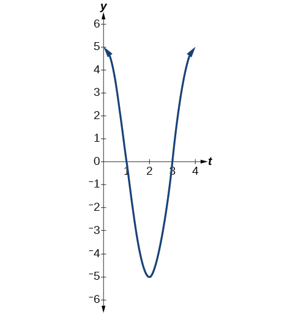
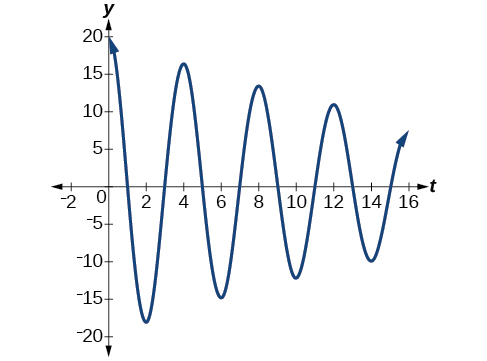

In this section, you will:
* Determine the amplitude and period of sinusoidal functions.
* Model equations and graph sinusoidal functions.
* Model periodic behavior.
* Model harmonic motion functions.

 "){: #Figure_07_06_001}

Suppose we charted the average daily temperatures in New York City over the course of one year. We would expect to find the lowest temperatures in January and February and highest in July and August. This familiar cycle repeats year after year, and if we were to extend the graph over multiple years, it would resemble a periodic function.

Many other natural phenomena are also periodic. For example, the phases of the moon have a period of approximately 28 days, and birds know to fly south at about the same time each year.

So how can we model an equation to reflect periodic behavior? First, we must collect and record data. We then find a function that resembles an observed pattern. Finally, we make the necessary alterations to the function to get a model that is dependable. In this section, we will take a deeper look at specific types of periodic behavior and model equations to fit data.

### Determining the Amplitude and Period of a Sinusoidal Function

Any motion that repeats itself in a fixed time period is considered **periodic motion**{: data-type="term" .no-emphasis} and can be modeled by a **sinusoidal function**{: data-type="term" .no-emphasis}. The **amplitude**{: data-type="term" .no-emphasis} of a sinusoidal function is the distance from the midline to the maximum value, or from the midline to the minimum value. The **midline**{: data-type="term" .no-emphasis} is the average value. Sinusoidal functions oscillate above and below the midline, are periodic, and repeat values in set cycles. Recall from [Graphs of the Sine and Cosine Functions](/m49387){: .target-chapter} that the **period**{: data-type="term" .no-emphasis} of the sine function and the cosine function is<math xmlns="http://www.w3.org/1998/Math/MathML"> <mrow> <mtext> </mtext><mn>2</mn><mi>π</mi><mo>.</mo><mtext> </mtext> </mrow> </math>

In other words, for any value of<math xmlns="http://www.w3.org/1998/Math/MathML"> <mrow> <mtext> </mtext><mi>x</mi><mo>,</mo> </mrow> </math>

<math xmlns="http://www.w3.org/1998/Math/MathML" display="block"> <mrow> <mi>sin</mi><mrow><mo>(</mo> <mrow> <mi>x</mi><mo>±</mo><mn>2</mn><mi>π</mi><mi>k</mi> </mrow> <mo>)</mo></mrow><mo>=</mo><mi>sin</mi><mtext> </mtext><mi>x</mi><mtext>    and    </mtext><mi>cos</mi><mrow><mo>(</mo> <mrow> <mi>x</mi><mo>±</mo><mn>2</mn><mi>π</mi><mi>k</mi> </mrow> <mo>)</mo></mrow><mo>=</mo><mi>cos</mi><mtext> </mtext><mi>x</mi><mtext>    where </mtext><mi>k</mi><mtext> is an integer</mtext> </mrow> </math>

Standard Form of Sinusoidal Equations

The general forms of a sinusoidal equation are given as

<math xmlns="http://www.w3.org/1998/Math/MathML" display="block"> <mrow> <mi>y</mi><mo>=</mo><mi>A</mi><mtext> </mtext><mi>sin</mi><mrow><mo>(</mo> <mrow> <mi>B</mi><mi>t</mi><mo>−</mo><mi>C</mi> </mrow> <mo>)</mo></mrow><mo>+</mo><mi>D</mi><mtext> or </mtext><mi>y</mi><mo>=</mo><mi>A</mi><mtext> </mtext><mi>cos</mi><mrow><mo>(</mo> <mrow> <mi>B</mi><mi>t</mi><mo>−</mo><mi>C</mi> </mrow> <mo>)</mo></mrow><mo>+</mo><mi>D</mi> </mrow> </math>

where<math xmlns="http://www.w3.org/1998/Math/MathML"> <mrow> <mtext> </mtext><mtext>amplitude</mtext><mo>=</mo><mo>\|</mo><mi>A</mi><mo>\|</mo><mo>,</mo><mi>B</mi><mtext> </mtext> </mrow> </math>

is related to period such that the<math xmlns="http://www.w3.org/1998/Math/MathML"> <mrow> <mtext> period</mtext><mo>=</mo><mfrac> <mrow> <mn>2</mn><mi>π</mi> </mrow> <mi>B</mi> </mfrac> <mo>,</mo><mi>C</mi><mtext> </mtext> </mrow> </math>

is the phase shift such that<math xmlns="http://www.w3.org/1998/Math/MathML"> <mrow> <mtext> </mtext><mfrac> <mi>C</mi> <mi>B</mi> </mfrac> <mtext> </mtext> </mrow> </math>

denotes the horizontal shift, and<math xmlns="http://www.w3.org/1998/Math/MathML"> <mrow> <mtext> </mtext><mi>D</mi><mtext> </mtext> </mrow> </math>

represents the vertical shift from the graph’s parent graph.

Note that the models are sometimes written as<math xmlns="http://www.w3.org/1998/Math/MathML"> <mrow> <mtext> </mtext><mi>y</mi><mo>=</mo><mi>a</mi><mtext> </mtext><mi>sin</mi><mrow><mo>(</mo> <mrow> <mi>ω</mi><mtext> </mtext><mi>t</mi><mo>±</mo><mi>C</mi> </mrow> <mo>)</mo></mrow><mo>+</mo><mi>D</mi><mtext> </mtext> </mrow> </math>

or<math xmlns="http://www.w3.org/1998/Math/MathML"> <mrow> <mtext> </mtext><mi>y</mi><mo>=</mo><mi>a</mi><mtext> </mtext><mi>cos</mi><mrow><mo>(</mo> <mrow> <mi>ω</mi><mtext> </mtext><mi>t</mi><mo>±</mo><mi>C</mi> </mrow> <mo>)</mo></mrow><mo>+</mo><mi>D</mi><mo>,</mo> </mrow> </math>

and period is given as<math xmlns="http://www.w3.org/1998/Math/MathML"> <mrow> <mtext> </mtext><mfrac> <mrow> <mn>2</mn><mi>π</mi> </mrow> <mi>ω</mi> </mfrac> <mo>.</mo> </mrow> </math>

The difference between the sine and the cosine graphs is that the sine graph begins with the average value of the function and the cosine graph begins with the maximum or minimum value of the function.

Showing How the Properties of a Trigonometric Function Can Transform a Graph

Show the transformation of the graph of<math xmlns="http://www.w3.org/1998/Math/MathML"> <mrow> <mtext> </mtext><mi>y</mi><mo>=</mo><mi>sin</mi><mtext> </mtext><mi>x</mi><mtext> </mtext> </mrow> </math>

into the graph of<math xmlns="http://www.w3.org/1998/Math/MathML"> <mrow> <mtext> </mtext><mi>y</mi><mo>=</mo><mn>2</mn><mtext> </mtext><mi>sin</mi><mrow><mo>(</mo> <mrow> <mn>4</mn><mi>x</mi><mo>−</mo><mfrac> <mi>π</mi> <mn>2</mn> </mfrac> </mrow> <mo>)</mo></mrow><mo>+</mo><mn>2.</mn> </mrow> </math>

Consider the series of graphs in [[link]](#Figure_07_06_010) and the way each change to the equation changes the image.

 The basic graph of&#10; &#10;  &#xA0;y=sinx&#xA0;&#10; &#10;(b) Changing the amplitude from 1 to 2 generates the graph of&#10; &#10;  &#xA0;y=2sinx.&#xA0;&#10; &#10;(c) The period of the sine function changes with the value of&#10; &#10;  &#xA0;B,&#10; &#10; such that&#10; &#10;  &#xA0;period=&#10;   &#10;    2&#x3C0;&#10;   &#10;   B&#10;  &#10;  .&#10; &#10; Here we have&#10; &#10;  &#xA0;B=4,&#10; &#10; which translates to a period of&#10; &#10;  &#xA0;&#10;   &#x3C0;&#10;   2&#10;  &#10;  .&#10; &#10; The graph completes one full cycle in&#10; &#10;  &#xA0;&#10;   &#x3C0;&#10;   2&#10;  &#10;  &#xA0;&#10; &#10;units. (d) The graph displays a horizontal shift equal to&#10; &#10;  &#xA0;&#10;   C&#10;   B&#10;  &#10;  ,&#10; &#10; or&#10; &#10;  &#xA0;&#10;   &#10;    &#10;     &#x3C0;&#10;     2&#10;    &#10;    &#10;   &#10;   4&#10;  &#10;  =&#10;   &#x3C0;&#10;   8&#10;  &#10;  .&#10; &#10;(e) Finally, the graph is shifted vertically by the value of&#10; &#10;  &#xA0;D.&#10; &#10; In this case, the graph is shifted up by 2 units."){: #Figure_07_06_010}

Finding the Amplitude and Period of a Function

Find the amplitude and period of the following functions and graph one cycle.

1.  <math xmlns="http://www.w3.org/1998/Math/MathML"> <mrow> <mi>y</mi><mo>=</mo><mn>2</mn><mtext> </mtext><mi>sin</mi><mrow><mo>(</mo> <mrow> <mfrac> <mn>1</mn> <mn>4</mn> </mfrac> <mi>x</mi> </mrow> <mo>)</mo></mrow> </mrow> </math>

2.  <math xmlns="http://www.w3.org/1998/Math/MathML"> <mrow> <mi>y</mi><mo>=</mo><mn>−3</mn><mtext> </mtext><mi>sin</mi><mrow><mo>(</mo> <mrow> <mn>2</mn><mi>x</mi><mo>+</mo><mfrac> <mi>π</mi> <mn>2</mn> </mfrac> </mrow> <mo>)</mo></mrow> </mrow> </math>

3.  <math xmlns="http://www.w3.org/1998/Math/MathML"> <mrow> <mi>y</mi><mo>=</mo><mi>cos</mi><mtext> </mtext><mi>x</mi><mo>+</mo><mn>3</mn> </mrow> </math>
{: type="a"}

We will solve these problems according to the models.

1.  <math xmlns="http://www.w3.org/1998/Math/MathML"> <mrow> <mi>y</mi><mo>=</mo><mn>2</mn><mtext> </mtext><mi>sin</mi><mrow><mo>(</mo> <mrow> <mfrac> <mn>1</mn> <mn>4</mn> </mfrac> <mi>x</mi> </mrow> <mo>)</mo></mrow><mtext> </mtext> </mrow> </math>
    
    involves sine, so we use the form
    

    <math xmlns="http://www.w3.org/1998/Math/MathML" display="block"> <mrow> <mi>y</mi><mo>=</mo><mi>A</mi><mtext> </mtext><mi>sin</mi><mrow><mo>(</mo> <mrow> <mi>B</mi><mi>t</mi><mo>+</mo><mi>C</mi> </mrow> <mo>)</mo></mrow><mo>+</mo><mi>D</mi> </mrow> </math>
    

    
    We know that<math xmlns="http://www.w3.org/1998/Math/MathML"> <mrow> <mtext> </mtext><mrow><mo stretchy="true">\|</mo> <mi>A</mi> <mo stretchy="true">\|</mo></mrow><mtext> </mtext> </mrow> </math>
    
    is the amplitude, so the amplitude is 2. Period is<math xmlns="http://www.w3.org/1998/Math/MathML"> <mrow> <mtext> </mtext><mfrac> <mrow> <mn>2</mn><mi>π</mi> </mrow> <mi>B</mi> </mfrac> <mo>,</mo> </mrow> </math>
    
     so the period is
    
    

    <math xmlns="http://www.w3.org/1998/Math/MathML" display="block"> <mrow> <mtable columnalign="left"> <mtr columnalign="left"> <mtd columnalign="left"> <mrow> <mfrac> <mrow> <mn>2</mn><mi>π</mi> </mrow> <mi>B</mi> </mfrac> <mo>=</mo><mfrac> <mrow> <mn>2</mn><mi>π</mi> </mrow> <mrow> <mfrac> <mn>1</mn> <mn>4</mn> </mfrac> </mrow> </mfrac> </mrow> </mtd> </mtr> <mtr columnalign="left"> <mtd columnalign="left"> <mrow> <mtext>     </mtext><mo>=</mo><mn>8</mn><mi>π</mi> </mrow> </mtd> </mtr> </mtable> </mrow> </math>
    

    
    See the graph in [[link]](#Figure_07_06_002).
    
    {: #Figure_07_06_002}

2.  <math xmlns="http://www.w3.org/1998/Math/MathML"> <mrow> <mi>y</mi><mo>=</mo><mn>−3</mn><mtext> </mtext><mi>sin</mi><mrow><mo>(</mo> <mrow> <mn>2</mn><mi>x</mi><mo>+</mo><mfrac> <mi>π</mi> <mn>2</mn> </mfrac> </mrow> <mo>)</mo></mrow><mtext> </mtext> </mrow> </math>
    
    involves sine, so we use the form
    

    <math xmlns="http://www.w3.org/1998/Math/MathML" display="block"> <mrow> <mi>y</mi><mo>=</mo><mi>A</mi><mtext> </mtext><mi>sin</mi><mrow><mo>(</mo> <mrow> <mi>B</mi><mi>t</mi><mo>−</mo><mi>C</mi> </mrow> <mo>)</mo></mrow><mo>+</mo><mi>D</mi> </mrow> </math>
    

    
    Amplitude is<math xmlns="http://www.w3.org/1998/Math/MathML"> <mrow> <mtext> </mtext><mrow><mo>\|</mo> <mi>A</mi> <mo>\|</mo></mrow><mo>,</mo> </mrow> </math>
    
     so the amplitude is<math xmlns="http://www.w3.org/1998/Math/MathML"> <mrow> <mtext> </mtext><mrow><mo>\|</mo> <mrow> <mo>−</mo><mn>3</mn> </mrow> <mo>\|</mo></mrow><mo>=</mo><mn>3.</mn> </mrow> </math>
    
     Since<math xmlns="http://www.w3.org/1998/Math/MathML"> <mrow> <mtext> </mtext><mi>A</mi><mtext> </mtext> </mrow> </math>
    
    is negative, the graph is reflected over the *x*-axis. Period is<math xmlns="http://www.w3.org/1998/Math/MathML"> <mrow> <mtext> </mtext><mfrac> <mrow> <mn>2</mn><mi>π</mi> </mrow> <mi>B</mi> </mfrac> <mo>,</mo> </mrow> </math>
    
    so the period is
    
    

    <math xmlns="http://www.w3.org/1998/Math/MathML"> <mrow> <mfrac> <mrow> <mn>2</mn><mi>π</mi> </mrow> <mi>B</mi> </mfrac> <mo>=</mo><mfrac> <mrow> <mn>2</mn><mi>π</mi> </mrow> <mn>2</mn> </mfrac> <mo>=</mo><mi>π</mi> </mrow> </math>
    

    
    The graph is shifted to the left by<math xmlns="http://www.w3.org/1998/Math/MathML"> <mrow> <mtext> </mtext><mfrac> <mi>C</mi> <mi>B</mi> </mfrac> <mo>=</mo><mfrac> <mrow> <mfrac> <mi>π</mi> <mn>2</mn> </mfrac> </mrow> <mn>2</mn> </mfrac> <mo>=</mo><mfrac> <mi>π</mi> <mn>4</mn> </mfrac> <mtext> </mtext> </mrow> </math>
    
    units. See [[link]](#Figure_07_06_003).
    
    {: #Figure_07_06_003}

3.  <math xmlns="http://www.w3.org/1998/Math/MathML"> <mrow> <mi>y</mi><mo>=</mo><mi>cos</mi><mtext> </mtext><mi>x</mi><mo>+</mo><mn>3</mn><mtext> </mtext> </mrow> </math>
    
    involves cosine, so we use the form
    

    <math xmlns="http://www.w3.org/1998/Math/MathML" display="block"> <mrow> <mi>y</mi><mo>=</mo><mi>A</mi><mtext> </mtext><mi>cos</mi><mrow><mo>(</mo> <mrow> <mi>B</mi><mi>t</mi><mo>±</mo><mi>C</mi> </mrow> <mo>)</mo></mrow><mo>+</mo><mi>D</mi> </mrow> </math>
    

    
    Amplitude is<math xmlns="http://www.w3.org/1998/Math/MathML"> <mrow> <mtext> </mtext><mrow><mo stretchy="true">\|</mo> <mi>A</mi> <mo stretchy="true">\|</mo></mrow><mo>,</mo><mtext> </mtext> </mrow> </math>
    
    so the amplitude is 1. The period is<math xmlns="http://www.w3.org/1998/Math/MathML"> <mrow> <mtext> </mtext><mn>2</mn><mi>π</mi><mo>.</mo><mtext> </mtext> </mrow> </math>
    
    See [[link]](#Figure_07_06_004). This is the standard cosine function shifted up three units.
    
    {: #Figure_07_06_004}

{: type="a"}

What are the amplitude and period of the function<math xmlns="http://www.w3.org/1998/Math/MathML"> <mrow> <mtext> </mtext><mi>y</mi><mo>=</mo><mn>3</mn><mtext> </mtext><mi>cos</mi><mo stretchy="false">(</mo><mn>3</mn><mi>π</mi><mi>x</mi><mo stretchy="false">)</mo><mo>?</mo> </mrow> </math>

The amplitude is<math xmlns="http://www.w3.org/1998/Math/MathML"> <mrow> <mtext> </mtext><mn>3</mn><mo>,</mo> </mrow> </math>

and the period is<math xmlns="http://www.w3.org/1998/Math/MathML"> <mrow> <mtext> </mtext><mfrac> <mn>2</mn> <mn>3</mn> </mfrac> <mo>.</mo> </mrow> </math>

### Finding Equations and Graphing Sinusoidal Functions

One method of graphing sinusoidal functions is to find five key points. These points will correspond to intervals of equal length representing<math xmlns="http://www.w3.org/1998/Math/MathML"> <mrow> <mtext> </mtext><mfrac> <mn>1</mn> <mn>4</mn> </mfrac> <mtext> </mtext> </mrow> </math>

of the period. The key points will indicate the location of maximum and minimum values. If there is no vertical shift, they will also indicate *x*-intercepts. For example, suppose we want to graph the function<math xmlns="http://www.w3.org/1998/Math/MathML"> <mrow> <mtext> </mtext><mi>y</mi><mo>=</mo><mi>cos</mi><mtext> </mtext><mi>θ</mi><mo>.</mo> </mrow> </math>

 We know that the period is<math xmlns="http://www.w3.org/1998/Math/MathML"> <mrow> <mtext> </mtext><mn>2</mn><mi>π</mi><mo>,</mo> </mrow> </math>

 so we find the interval between key points as follows.

<math xmlns="http://www.w3.org/1998/Math/MathML"> <mrow> <mfrac> <mrow> <mn>2</mn><mi>π</mi> </mrow> <mn>4</mn> </mfrac> <mo>=</mo><mfrac> <mi>π</mi> <mn>2</mn> </mfrac> </mrow> </math>

Starting with<math xmlns="http://www.w3.org/1998/Math/MathML"> <mrow> <mtext> </mtext><mi>θ</mi><mo>=</mo><mn>0</mn><mo>,</mo> </mrow> </math>

 we calculate the first *y-*value, add the length of the interval<math xmlns="http://www.w3.org/1998/Math/MathML"> <mrow> <mtext> </mtext><mfrac> <mi>π</mi> <mn>2</mn> </mfrac> <mtext> </mtext> </mrow> </math>

to 0, and calculate the second *y*-value. We then add<math xmlns="http://www.w3.org/1998/Math/MathML"> <mrow> <mtext> </mtext><mfrac> <mi>π</mi> <mn>2</mn> </mfrac> <mtext> </mtext> </mrow> </math>

repeatedly until the five key points are determined. The last value should equal the first value, as the calculations cover one full period. Making a table similar to [\[link\]](#Table_07_07_01), we can see these key points clearly on the graph shown in [\[link\]](#Figure_07_07_002).

<table id="Table_07_07_01" summary="Two rows, six columns. The table has ordered pairs of these column values: (theta, y=cos(theta)), (0,1), (i/2, 0), (pi,-1), (3pi/2, 0), (2pi,1)."><colgroup><col data-align="center" /><col data-align="center" /><col data-align="center" /><col data-align="center" /><col data-align="center" /><col data-align="center" /></colgroup><tbody>
<tr>
<td><strong><math xmlns="http://www.w3.org/1998/Math/MathML">
 <mi>θ</mi>
</math></strong></td>
<td><math xmlns="http://www.w3.org/1998/Math/MathML">
 <mn>0</mn>
</math></td>
<td><math xmlns="http://www.w3.org/1998/Math/MathML">
 <mrow>
  <mfrac>
   <mi>π</mi>
   <mn>2</mn>
  </mfrac>
  
 </mrow>
</math></td>
<td><math xmlns="http://www.w3.org/1998/Math/MathML">
 <mi>π</mi>
</math></td>
<td><math xmlns="http://www.w3.org/1998/Math/MathML">
 <mrow>
  <mfrac>
   <mrow>
    <mn>3</mn><mi>π</mi>
   </mrow>
   <mn>2</mn>
  </mfrac>
  
 </mrow>
</math></td>
<td><math xmlns="http://www.w3.org/1998/Math/MathML">
 <mrow>
  <mn>2</mn><mi>π</mi>
 </mrow>
</math></td>
</tr>

<tr>
<td><strong><math xmlns="http://www.w3.org/1998/Math/MathML">
 <mrow>
  <mi>y</mi><mo>=</mo><mi>cos</mi><mtext> </mtext><mi>θ</mi>
 </mrow>
</math></strong></td>
<td><math xmlns="http://www.w3.org/1998/Math/MathML">
 <mn>1</mn>
</math></td>
<td><math xmlns="http://www.w3.org/1998/Math/MathML">
 <mn>0</mn>
</math></td>
<td><math xmlns="http://www.w3.org/1998/Math/MathML">
 <mrow>
  <mn>−1</mn>
 </mrow>
</math></td>
<td><math xmlns="http://www.w3.org/1998/Math/MathML">
 <mn>0</mn>
</math></td>
<td><math xmlns="http://www.w3.org/1998/Math/MathML">
 <mn>1</mn>
</math>
</td>
</tr>
</tbody></table>

{: #Figure_07_07_002}

Graphing Sinusoidal Functions Using Key Points

Graph the function<math xmlns="http://www.w3.org/1998/Math/MathML"> <mrow> <mtext> </mtext><mi>y</mi><mo>=</mo><mn>−4</mn><mtext> </mtext><mi>cos</mi><mrow><mo>(</mo> <mrow> <mi>π</mi><mi>x</mi> </mrow> <mo>)</mo></mrow><mtext> </mtext> </mrow> </math>

using amplitude, period, and key points.

The amplitude is<math xmlns="http://www.w3.org/1998/Math/MathML"> <mrow> <mo> </mo><mo stretchy="true">\|</mo><mo>−</mo><mn>4</mn><mo stretchy="true">\|</mo><mo>=</mo><mn>4.</mn><mo> </mo> </mrow> </math>

 The period is<math xmlns="http://www.w3.org/1998/Math/MathML"> <mrow> <mtext> </mtext><mfrac> <mrow> <mn>2</mn><mi>π</mi> </mrow> <mi>ω</mi> </mfrac> <mo>=</mo><mfrac> <mrow> <mn>2</mn><mi>π</mi> </mrow> <mi>π</mi> </mfrac> <mo>=</mo><mn>2.</mn><mtext> </mtext> </mrow> </math>

(Recall that we sometimes refer to<math xmlns="http://www.w3.org/1998/Math/MathML"> <mrow> <mtext> </mtext><mi>B</mi><mtext> </mtext> </mrow> </math>

as<math xmlns="http://www.w3.org/1998/Math/MathML"> <mrow> <mtext> </mtext><mi>ω</mi><mo>.</mo><mo stretchy="false">)</mo><mtext> </mtext> </mrow> </math>

One cycle of the graph can be drawn over the interval<math xmlns="http://www.w3.org/1998/Math/MathML"> <mrow> <mtext> </mtext><mrow><mo>[</mo> <mrow> <mn>0</mn><mo>,</mo><mn>2</mn> </mrow> <mo>]</mo></mrow><mo>.</mo><mtext> </mtext> </mrow> </math>

To find the key points, we divide the period by 4. Make a table similar to [[link]](#Table_07_07_02), starting with<math xmlns="http://www.w3.org/1998/Math/MathML"> <mrow> <mtext> </mtext><mi>x</mi><mo>=</mo><mn>0</mn><mtext> </mtext> </mrow> </math>

and then adding<math xmlns="http://www.w3.org/1998/Math/MathML"> <mrow> <mtext> </mtext><mfrac> <mn>1</mn> <mn>2</mn> </mfrac> <mtext> </mtext> </mrow> </math>

successively to<math xmlns="http://www.w3.org/1998/Math/MathML"> <mrow> <mtext> </mtext><mi>x</mi><mtext> </mtext> </mrow> </math>

and calculate<math xmlns="http://www.w3.org/1998/Math/MathML"> <mrow> <mtext> </mtext><mi>y</mi><mo>.</mo><mtext> </mtext> </mrow> </math>

See the graph in [[link]](#Figure_07_07_003).

<table id="Table_07_07_02" summary="Two rows, six columns. The table has ordered pairs of these column values: (theta, y=-4cos(pi*x)), (0,-4), (1/2, 0), (1,4), (3/2, 0), (2, -4)."><colgroup><col data-align="center" /><col data-align="center" /><col data-align="center" /><col data-align="center" /><col data-align="center" /><col data-align="center" /></colgroup><tbody>
<tr>
<td><strong><math xmlns="http://www.w3.org/1998/Math/MathML">
 <mrow>
<mi>x</mi>
 </mrow>
</math></strong></td>
<td><math xmlns="http://www.w3.org/1998/Math/MathML">
 <mn>0</mn>
</math></td>
<td><math xmlns="http://www.w3.org/1998/Math/MathML">
 <mrow>
  <mfrac>
   <mn>1</mn>
   <mn>2</mn>
  </mfrac>
  
 </mrow>
</math></td>
<td><math xmlns="http://www.w3.org/1998/Math/MathML">
 <mn>1</mn>
</math></td>
<td><math xmlns="http://www.w3.org/1998/Math/MathML">
 <mrow>
  <mfrac>
   <mn>3</mn>
   <mn>2</mn>
  </mfrac>
  
 </mrow>
</math></td>
<td><math xmlns="http://www.w3.org/1998/Math/MathML">
 <mn>2</mn>
</math></td>
</tr>

<tr>
<td><strong><math xmlns="http://www.w3.org/1998/Math/MathML">
 <mrow>
  <mi>y</mi><mo>=</mo><mn>−4</mn><mtext> </mtext><mi>cos</mi><mrow><mo>(</mo>
   <mrow>
    <mi>π</mi><mi>x</mi>
   </mrow>
  <mo>)</mo></mrow>
 </mrow>
</math></strong></td>
<td><math xmlns="http://www.w3.org/1998/Math/MathML">
 <mrow>
<mn>−4</mn>
 </mrow>
</math></td>
<td><math xmlns="http://www.w3.org/1998/Math/MathML">
 <mn>0</mn>
</math>
</td>
<td><math xmlns="http://www.w3.org/1998/Math/MathML">
 <mrow>
<mn>4</mn>
 </mrow>
</math></td>
<td><math xmlns="http://www.w3.org/1998/Math/MathML">
 <mn>0</mn>
</math></td>
<td><math xmlns="http://www.w3.org/1998/Math/MathML">
 <mrow>
<mn>−4</mn>
 </mrow>
</math></td>
</tr>
</tbody></table>
{: #Figure_07_07_003}

Graph the function<math xmlns="http://www.w3.org/1998/Math/MathML"> <mrow> <mtext> </mtext><mi>y</mi><mo>=</mo><mn>3</mn><mtext> </mtext><mi>sin</mi><mo stretchy="false">(</mo><mn>3</mn><mi>x</mi><mo stretchy="false">)</mo><mtext> </mtext> </mrow> </math>

using the amplitude, period, and five key points.

| x | <math xmlns="http://www.w3.org/1998/Math/MathML"> <mrow> <mn>3</mn><mi>sin</mi><mrow><mo>(</mo> <mrow> <mn>3</mn><mi>x</mi> </mrow> <mo>)</mo></mrow> </mrow> </math>

 |
|----------
| 0 | 0 |
| <math xmlns="http://www.w3.org/1998/Math/MathML"> <mrow> <mfrac> <mi>π</mi> <mn>6</mn> </mfrac> </mrow> </math>

 | 3 |
| <math xmlns="http://www.w3.org/1998/Math/MathML"> <mrow> <mfrac> <mi>π</mi> <mn>3</mn> </mfrac> </mrow> </math>

 | 0 |
| <math xmlns="http://www.w3.org/1998/Math/MathML"> <mrow> <mfrac> <mi>π</mi> <mn>2</mn> </mfrac> </mrow> </math>

 | <math xmlns="http://www.w3.org/1998/Math/MathML"> <mrow> <mn>−3</mn> </mrow> </math>

 |
| <math xmlns="http://www.w3.org/1998/Math/MathML"> <mrow> <mfrac> <mrow> <mn>2</mn><mi>π</mi> </mrow> <mn>3</mn> </mfrac> </mrow> </math>

 | 0 |
{: .unnumbered summary="Graph of y=3sin(3x) using the five key points: intervals of equal length representing 1/4 of the period. Here, the points are at 0, pi/6, pi/3, pi/2, and 2pi/3." data-label=""}

  

### Modeling Periodic Behavior

We will now apply these ideas to problems involving periodic behavior.

Modeling an Equation and Sketching a Sinusoidal Graph to Fit Criteria

The average monthly temperatures for a small town in Oregon are given in [[link]](#fs-id1336940). Find a sinusoidal function of the form<math xmlns="http://www.w3.org/1998/Math/MathML"> <mrow> <mtext> </mtext><mi>y</mi><mo>=</mo><mi>A</mi><mtext> </mtext><mi>sin</mi><mrow><mo>(</mo> <mrow> <mi>B</mi><mi>t</mi><mo>−</mo><mi>C</mi> </mrow> <mo>)</mo></mrow><mo>+</mo><mi>D</mi><mtext> </mtext> </mrow> </math>

that fits the data (round to the nearest tenth) and sketch the graph.

<table summary="Thirteen rows, two columns. The table has ordered pairs of these row values: (Month, Temperature in degrees F), (January, 42.5), (February, 44.5), (March, 48.5), (April, 52.5), (May, 58), (June, 63), (July, 68.5), (August, 69), (September, 64.5), (October, 55.5), (November, 46.5), (December, 43.5)."><colgroup><col data-align="center" /><col data-align="center" /></colgroup><thead>
        <tr>
         <th>Month</th>
         <th>Temperature,<math xmlns="http://www.w3.org/1998/Math/MathML">
 <mrow>
  <msup>
   <mrow />
   <mtext>o</mtext>
  </msup>
  <mtext>F</mtext>
 </mrow>
</math>         </th>
        </tr>
       </thead><tbody>
        <tr>
         <td>January</td>
         <td>42.5</td>
        </tr>
        <tr>
         <td>February</td>
         <td>44.5</td>
        </tr>
        <tr>
         <td>March</td>
         <td>48.5</td>
        </tr>
        <tr>
         <td>April</td>
         <td>52.5</td>
        </tr>
        <tr>
         <td>May</td>
         <td>58</td>
        </tr>
        <tr>
         <td>June</td>
         <td>63</td>
        </tr>
        <tr>
         <td>July</td>
         <td>68.5</td>
        </tr>
        <tr>
         <td>August</td>
         <td>69</td>
        </tr>
        <tr>
         <td>September</td>
         <td>64.5</td>
        </tr>
        <tr>
         <td>October</td>
         <td>55.5</td>
        </tr>
        <tr>
         <td>November</td>
         <td>46.5</td>
        </tr>
        <tr>
         <td>December</td>
         <td>43.5</td>
        </tr>
       </tbody></table>

Recall that amplitude is found using the formula

<math xmlns="http://www.w3.org/1998/Math/MathML"> <mrow> <mi>A</mi><mo>=</mo><mfrac> <mrow> <mtext>largest value </mtext><mo>−</mo><mtext>smallest value</mtext> </mrow> <mn>2</mn> </mfrac> </mrow> </math>

Thus, the amplitude is

<math xmlns="http://www.w3.org/1998/Math/MathML" display="block"> <mrow> <mtable columnalign="left"> <mtr columnalign="left"> <mtd columnalign="left"> <mrow /> </mtd> </mtr> <mtr columnalign="left"> <mtd columnalign="left"> <mrow> <mo>\|</mo><mi>A</mi><mo>\|</mo><mo>=</mo><mfrac> <mrow> <mn>69</mn><mo>−</mo><mn>42.5</mn> </mrow> <mn>2</mn> </mfrac> </mrow> </mtd> </mtr> <mtr columnalign="left"> <mtd columnalign="left"> <mrow> <mtext>    </mtext><mo>=</mo><mn>13.25</mn> </mrow> </mtd> </mtr> </mtable> </mrow> </math>

The data covers a period of 12 months, so<math xmlns="http://www.w3.org/1998/Math/MathML"> <mrow> <mtext> </mtext><mfrac> <mrow> <mn>2</mn><mi>π</mi> </mrow> <mi>B</mi> </mfrac> <mo>=</mo><mn>12</mn><mtext>  </mtext> </mrow> </math>

which gives<math xmlns="http://www.w3.org/1998/Math/MathML"> <mrow> <mtext> </mtext><mi>B</mi><mo>=</mo><mfrac> <mrow> <mn>2</mn><mi>π</mi> </mrow> <mrow> <mn>12</mn> </mrow> </mfrac> <mo>=</mo><mfrac> <mi>π</mi> <mn>6</mn> </mfrac> <mo>.</mo> </mrow> </math>

The vertical shift is found using the following equation.

<math xmlns="http://www.w3.org/1998/Math/MathML"> <mrow> <mi>D</mi><mo>=</mo><mfrac> <mrow> <mtext>highest value</mtext><mo>+</mo><mtext>lowest value</mtext> </mrow> <mn>2</mn> </mfrac> </mrow> </math>

* * *
{: data-type="newline" data-count="2"}

Thus, the vertical shift is

<math xmlns="http://www.w3.org/1998/Math/MathML" display="block"> <mtable columnalign="left"> <mtr> <mtd> <mrow /> </mtd> </mtr> <mtr> <mtd> <mtable columnalign="left"> <mtr columnalign="left"> <mtd columnalign="left"> <mrow> <mi>D</mi><mo>=</mo><mfrac> <mrow> <mn>69</mn><mo>+</mo><mn>42.5</mn> </mrow> <mn>2</mn> </mfrac> </mrow> </mtd> </mtr> <mtr columnalign="left"> <mtd columnalign="left"> <mrow> <mtext>   </mtext><mo>=</mo><mn>55.8</mn> </mrow> </mtd> </mtr> </mtable> </mtd> </mtr> </mtable> </math>

So far, we have the equation<math xmlns="http://www.w3.org/1998/Math/MathML"> <mrow> <mtext> </mtext><mi>y</mi><mo>=</mo><mn>13.3</mn><mtext> </mtext><mi>sin</mi><mrow><mo>(</mo> <mrow> <mfrac> <mi>π</mi> <mn>6</mn> </mfrac> <mi>x</mi><mo>−</mo><mi>C</mi> </mrow> <mo>)</mo></mrow><mo>+</mo><mn>55.8.</mn> </mrow> </math>

To find the horizontal shift, we input the<math xmlns="http://www.w3.org/1998/Math/MathML"> <mrow> <mtext> </mtext><mi>x</mi><mtext> </mtext> </mrow> </math>

and<math xmlns="http://www.w3.org/1998/Math/MathML"> <mrow> <mtext> </mtext><mi>y</mi><mtext> </mtext> </mrow> </math>

values for the first month and solve for<math xmlns="http://www.w3.org/1998/Math/MathML"> <mrow> <mtext> </mtext><mi>C</mi><mo>.</mo> </mrow> </math>

<math xmlns="http://www.w3.org/1998/Math/MathML" display="block"> <mrow> <mtable columnalign="left"> <mtr columnalign="left"> <mtd columnalign="left"> <mrow> <mtext>   </mtext><mn>42.5</mn><mo>=</mo><mn>13.3</mn><mtext> </mtext><mi>sin</mi><mrow><mo>(</mo> <mrow> <mfrac> <mi>π</mi> <mn>6</mn> </mfrac> <mo stretchy="false">(</mo><mn>1</mn><mo stretchy="false">)</mo><mo>−</mo><mi>C</mi> </mrow> <mo>)</mo></mrow><mo>+</mo><mn>55.8</mn> </mrow> </mtd> <mtd columnalign="left"> <mrow /> </mtd> </mtr> <mtr columnalign="left"> <mtd columnalign="left"> <mrow> <mo>−</mo><mn>13.3</mn><mo>=</mo><mn>13.3</mn><mtext> </mtext><mi>sin</mi><mrow><mo>(</mo> <mrow> <mfrac> <mi>π</mi> <mn>6</mn> </mfrac> <mo>−</mo><mi>C</mi> </mrow> <mo>)</mo></mrow> </mrow> </mtd> <mtd columnalign="left"> <mrow /> </mtd> </mtr> <mtr columnalign="left"> <mtd columnalign="left"> <mrow> <mtext>    </mtext><mo>−</mo><mn>1</mn><mo>=</mo><mi>sin</mi><mrow><mo>(</mo> <mrow> <mfrac> <mi>π</mi> <mn>6</mn> </mfrac> <mo>−</mo><mi>C</mi> </mrow> <mo>)</mo></mrow> </mrow> </mtd> <mtd columnalign="left"> <mrow> <mi>sin</mi><mi>θ</mi><mo>=</mo><mo>−</mo><mn>1</mn><mo stretchy="false">→</mo><mi>θ</mi><mo>=</mo><mo>−</mo><mfrac> <mi>π</mi> <mn>2</mn> </mfrac> </mrow> </mtd> </mtr> <mtr columnalign="left"> <mtd columnalign="left"> <mrow> <mfrac> <mi>π</mi> <mn>6</mn> </mfrac> <mo>−</mo><mi>C</mi><mo>=</mo><mo>−</mo><mfrac> <mi>π</mi> <mn>2</mn> </mfrac> </mrow> </mtd> <mtd columnalign="left"> <mrow /> </mtd> </mtr> <mtr columnalign="left"> <mtd columnalign="left"> <mrow> <mfrac> <mi>π</mi> <mn>6</mn> </mfrac> <mo>+</mo><mfrac> <mi>π</mi> <mn>2</mn> </mfrac> <mo>=</mo><mi>C</mi> </mrow> </mtd> <mtd columnalign="left"> <mrow /> </mtd> </mtr> <mtr columnalign="left"> <mtd columnalign="left"> <mrow> <mtext>          </mtext><mo>=</mo><mfrac> <mrow> <mn>2</mn><mi>π</mi> </mrow> <mn>3</mn> </mfrac> </mrow> </mtd> <mtd columnalign="left"> <mrow /> </mtd> </mtr> </mtable> </mrow> </math>

We have the equation<math xmlns="http://www.w3.org/1998/Math/MathML"> <mrow> <mtext> </mtext><mi>y</mi><mo>=</mo><mn>13.3</mn><mtext> </mtext><mi>sin</mi><mrow><mo>(</mo> <mrow> <mfrac> <mi>π</mi> <mn>6</mn> </mfrac> <mi>x</mi><mo>−</mo><mfrac> <mrow> <mn>2</mn><mi>π</mi> </mrow> <mn>3</mn> </mfrac> </mrow> <mo>)</mo></mrow><mo>+</mo><mn>55.8.</mn><mtext>  </mtext> </mrow> </math>

See the graph in [[link]](#Figure_07_06_011).

{: #Figure_07_06_011}

Describing Periodic Motion

The hour hand of the large clock on the wall in Union Station measures 24 inches in length. At noon, the tip of the hour hand is 30 inches from the ceiling. At 3 PM, the tip is 54 inches from the ceiling, and at 6 PM, 78 inches. At 9 PM, it is again 54 inches from the ceiling, and at midnight, the tip of the hour hand returns to its original position 30 inches from the ceiling. Let<math xmlns="http://www.w3.org/1998/Math/MathML"> <mrow> <mtext> </mtext><mi>y</mi><mtext> </mtext> </mrow> </math>

equal the distance from the tip of the hour hand to the ceiling<math xmlns="http://www.w3.org/1998/Math/MathML"> <mrow> <mtext> </mtext><mi>x</mi><mtext> </mtext> </mrow> </math>

hours after noon. Find the equation that models the motion of the clock and sketch the graph.

Begin by making a table of values as shown in [[link]](#fs-id1992294).

<table summary="Six rows, three columns. The table has ordered pairs of these row values: (X, y, Points to plot), (Noon, 30 in, (0,30)), (3 PM, 54 in, (3,54)), (6 PM, 78 in, (6,8)), (9 PM, 54 in, (9,54)), (Midnight, 30 in, (12,30))."><colgroup><col data-align="center" /><col data-align="center" /><col data-align="center" /></colgroup><thead>
        <tr>
         <th><math xmlns="http://www.w3.org/1998/Math/MathML">
          <mi>x</mi>
         </math>
         </th>
         <th><math xmlns="http://www.w3.org/1998/Math/MathML">
          <mi>y</mi>
         </math>
         </th>
         <th>Points to plot</th>
        </tr>
       </thead><tbody>
        <tr>
         <td>Noon</td>
         <td>30 in</td>
         <td><math xmlns="http://www.w3.org/1998/Math/MathML">
          <mrow>
           <mrow><mo>(</mo>
            <mrow>
             <mn>0</mn><mo>,</mo><mn>30</mn>
            </mrow>
            <mo>)</mo></mrow>
          </mrow>
         </math>
         </td>
        </tr>
        <tr>
         <td>3 PM</td>
         <td>54 in</td>
         <td><math xmlns="http://www.w3.org/1998/Math/MathML">
          <mrow>
           <mrow><mo>(</mo>
            <mrow>
             <mn>3</mn><mo>,</mo><mn>54</mn>
            </mrow>
            <mo>)</mo></mrow>
          </mrow>
         </math>
         </td>
        </tr>
        <tr>
         <td>6 PM</td>
         <td>78 in</td>
         <td><math xmlns="http://www.w3.org/1998/Math/MathML">
          <mrow>
           <mrow><mo>(</mo>
            <mrow>
             <mn>6</mn><mo>,</mo><mn>78</mn>
            </mrow>
            <mo>)</mo></mrow>
          </mrow>
         </math>
         </td>
        </tr>
        <tr>
         <td>9 PM</td>
         <td>54 in</td>
         <td><math xmlns="http://www.w3.org/1998/Math/MathML">
          <mrow>
           <mrow><mo>(</mo>
            <mrow>
             <mn>9</mn><mo>,</mo><mn>54</mn>
            </mrow>
            <mo>)</mo></mrow>
          </mrow>
         </math>
         </td>
        </tr>
        <tr>
         <td>Midnight</td>
         <td>30 in</td>
         <td><math xmlns="http://www.w3.org/1998/Math/MathML">
          <mrow>
           <mrow><mo>(</mo>
            <mrow>
             <mn>12</mn><mo>,</mo><mn>30</mn>
            </mrow>
            <mo>)</mo></mrow>
          </mrow>
         </math>
         </td>
        </tr>
       </tbody></table>
To model an equation, we first need to find the amplitude.

<math xmlns="http://www.w3.org/1998/Math/MathML" display="block"> <mrow> <mtable columnalign="left"> <mtr columnalign="left"> <mtd columnalign="left"> <mrow /> </mtd> </mtr> <mtr columnalign="left"> <mtd columnalign="left"> <mrow> <mtable columnalign="left"> <mtr columnalign="left"> <mtd columnalign="left"> <mrow> <mrow><mo stretchy="true">\|</mo> <mi>A</mi> <mo stretchy="true">\|</mo></mrow><mo>=</mo><mrow><mo stretchy="true">\|</mo> <mrow> <mfrac> <mrow> <mn>78</mn><mo>−</mo><mn>30</mn> </mrow> <mn>2</mn> </mfrac> </mrow> <mo stretchy="true">\|</mo></mrow> </mrow> </mtd> </mtr> <mtr columnalign="left"> <mtd columnalign="left"> <mrow> <mtext>    </mtext><mo>=</mo><mn>24</mn> </mrow> </mtd> </mtr> </mtable> </mrow> </mtd> </mtr> </mtable> </mrow> </math>

The clock’s cycle repeats every 12 hours. Thus,

<math xmlns="http://www.w3.org/1998/Math/MathML"> <mtable columnalign="left"> <mtr> <mtd> <mrow /> </mtd> </mtr> <mtr> <mtd> <mtable columnalign="left"> <mtr columnalign="left"> <mtd columnalign="left"> <mrow> <mi>B</mi><mo>=</mo><mfrac> <mrow> <mn>2</mn><mi>π</mi> </mrow> <mrow> <mn>12</mn> </mrow> </mfrac> </mrow> </mtd> </mtr> <mtr columnalign="left"> <mtd columnalign="left"> <mrow> <mtext>   </mtext><mo>=</mo><mfrac> <mi>π</mi> <mn>6</mn> </mfrac> </mrow> </mtd> </mtr> </mtable> </mtd> </mtr> </mtable> </math>

The vertical shift is

<math xmlns="http://www.w3.org/1998/Math/MathML"> <mtable columnalign="left"> <mtr> <mtd> <mrow /> </mtd> </mtr> <mtr> <mtd> <mtable columnalign="left"> <mtr columnalign="left"> <mtd columnalign="left"> <mrow> <mi>D</mi><mo>=</mo><mfrac> <mrow> <mn>78</mn><mo>+</mo><mn>30</mn> </mrow> <mn>2</mn> </mfrac> </mrow> </mtd> </mtr> <mtr columnalign="left"> <mtd columnalign="left"> <mrow> <mtext>   </mtext><mo>=</mo><mn>54</mn> </mrow> </mtd> </mtr> </mtable> </mtd> </mtr> </mtable> </math>

There is no horizontal shift, so<math xmlns="http://www.w3.org/1998/Math/MathML"> <mrow> <mtext> </mtext><mi>C</mi><mo>=</mo><mn>0.</mn><mtext>  </mtext> </mrow> </math>

Since the function begins with the minimum value of<math xmlns="http://www.w3.org/1998/Math/MathML"> <mrow> <mtext> </mtext><mi>y</mi><mtext> </mtext> </mrow> </math>

 when <math xmlns="http://www.w3.org/1998/Math/MathML"> <mrow> <mtext> </mtext><mi>x</mi><mo>=</mo><mn>0</mn><mtext> </mtext> </mrow> </math>

(as opposed to the maximum value), we will use the cosine function with the negative value for<math xmlns="http://www.w3.org/1998/Math/MathML"> <mrow> <mtext> </mtext><mi>A</mi><mo>.</mo><mtext> </mtext> </mrow> </math>

In the form<math xmlns="http://www.w3.org/1998/Math/MathML"> <mrow> <mtext> </mtext><mi>y</mi><mo>=</mo><mi>A</mi><mtext> </mtext><mi>cos</mi><mo stretchy="false">(</mo><mi>B</mi><mi>x</mi><mo>±</mo><mi>C</mi><mo stretchy="false">)</mo><mo>+</mo><mi>D</mi><mo>,</mo><mtext>  </mtext> </mrow> </math>

the equation is

<math xmlns="http://www.w3.org/1998/Math/MathML"> <mrow> <mi>y</mi><mo>=</mo><mn>−24</mn><mtext> </mtext><mi>cos</mi><mrow><mo>(</mo> <mrow> <mfrac> <mi>π</mi> <mn>6</mn> </mfrac> <mi>x</mi> </mrow> <mo>)</mo></mrow><mo>+</mo><mn>54</mn> </mrow> </math>

See [[link]](#Figure_07_06_013).

{: #Figure_07_06_013}

Determining a Model for Tides

The height of the tide in a small beach town is measured along a seawall. Water levels oscillate between 7 feet at low tide and 15 feet at high tide. On a particular day, low tide occurred at 6 AM and high tide occurred at noon. Approximately every 12 hours, the cycle repeats. Find an equation to model the water levels.

As the water level varies from 7 ft to 15 ft, we can calculate the amplitude as

<math xmlns="http://www.w3.org/1998/Math/MathML" display="block"> <mrow> <mtable columnalign="left"> <mtr columnalign="left"> <mtd columnalign="left"> <mrow /> </mtd> </mtr> <mtr columnalign="left"> <mtd columnalign="left"> <mrow> <mtable columnalign="left"> <mtr columnalign="left"> <mtd columnalign="left"> <mrow> <mo>\|</mo><mi>A</mi><mo>\|</mo><mo>=</mo><mrow><mo>\|</mo> <mrow> <mfrac> <mrow> <mo stretchy="false">(</mo><mn>15</mn><mo>−</mo><mn>7</mn><mo stretchy="false">)</mo> </mrow> <mn>2</mn> </mfrac> </mrow> <mo>\|</mo></mrow> </mrow> </mtd> </mtr> <mtr columnalign="left"> <mtd columnalign="left"> <mrow> <mtext>    </mtext><mo>=</mo><mn>4</mn> </mrow> </mtd> </mtr> </mtable> </mrow> </mtd> </mtr> </mtable> </mrow> </math>

The cycle repeats every 12 hours; therefore,<math xmlns="http://www.w3.org/1998/Math/MathML"> <mrow> <mtext> </mtext><mi>B</mi><mtext> </mtext> </mrow> </math>

is

<math xmlns="http://www.w3.org/1998/Math/MathML"> <mrow> <mfrac> <mrow> <mn>2</mn><mi>π</mi> </mrow> <mrow> <mn>12</mn> </mrow> </mfrac> <mo>=</mo><mfrac> <mi>π</mi> <mn>6</mn> </mfrac> </mrow> </math>

There is a vertical translation of<math xmlns="http://www.w3.org/1998/Math/MathML"> <mrow> <mtext> </mtext><mfrac> <mrow> <mo stretchy="false">(</mo><mn>15</mn><mo>+</mo><mn>7</mn><mo stretchy="false">)</mo> </mrow> <mn>2</mn> </mfrac> <mo>=</mo><mn>11.5.</mn><mtext>  </mtext> </mrow> </math>

Since the value of the function is at a maximum at<math xmlns="http://www.w3.org/1998/Math/MathML"> <mrow> <mtext> </mtext><mi>t</mi><mo>=</mo><mn>0</mn><mo>,</mo> </mrow> </math>

 we will use the cosine function, with the positive value for<math xmlns="http://www.w3.org/1998/Math/MathML"> <mrow> <mtext> </mtext><mi>A</mi><mo>.</mo> </mrow> </math>

<math xmlns="http://www.w3.org/1998/Math/MathML" display="block"> <mrow> <mi>y</mi><mo>=</mo><mn>4</mn><mtext> </mtext><mi>cos</mi><mrow><mo>(</mo> <mrow> <mfrac> <mi>π</mi> <mn>6</mn> </mfrac> </mrow> <mo>)</mo></mrow><mtext> </mtext><mi>t</mi><mo>+</mo><mn>11</mn> </mrow> </math>

See [[link]](#Figure_07_06_015).

{: #Figure_07_06_015}

The daily temperature in the month of March in a certain city varies from a low of<math xmlns="http://www.w3.org/1998/Math/MathML"> <mrow> <mtext> </mtext><mn>24</mn><mtext> °F</mtext><mtext> </mtext> </mrow> </math>

to a high of<math xmlns="http://www.w3.org/1998/Math/MathML"> <mrow> <mtext> </mtext><mn>40</mn><mtext> °F</mtext><mtext>.</mtext><mtext> </mtext> </mrow> </math>

Find a sinusoidal function to model daily temperature and sketch the graph. Approximate the time when the temperature reaches the freezing point<math xmlns="http://www.w3.org/1998/Math/MathML"> <mrow> <mtext> </mtext><mn>32</mn><mtext> °F</mtext><mtext>.</mtext><mtext> </mtext> </mrow> </math>

Let<math xmlns="http://www.w3.org/1998/Math/MathML"> <mrow> <mtext> </mtext><mi>t</mi><mo>=</mo><mn>0</mn><mtext> </mtext> </mrow> </math>

correspond to noon.

<math xmlns="http://www.w3.org/1998/Math/MathML"> <mrow> <mi>y</mi><mo>=</mo><mn>8</mn><mi>sin</mi><mrow><mo>(</mo> <mrow> <mfrac> <mi>π</mi> <mrow> <mn>12</mn> </mrow> </mfrac> <mi>t</mi> </mrow> <mo>)</mo></mrow><mo>+</mo><mn>32</mn> </mrow> </math>

 * * *
{: data-type="newline"}

 The temperature reaches freezing at noon and at midnight.

  

Interpreting the Periodic Behavior Equation

The average person’s blood pressure is modeled by the function<math xmlns="http://www.w3.org/1998/Math/MathML"> <mrow> <mtext> </mtext><mi>f</mi><mrow><mo>(</mo> <mi>t</mi> <mo>)</mo></mrow><mo>=</mo><mn>20</mn><mtext> </mtext><mi>sin</mi><mrow><mo>(</mo> <mrow> <mn>160</mn><mi>π</mi><mi>t</mi> </mrow> <mo>)</mo></mrow><mo>+</mo><mn>100</mn><mo>,</mo><mtext> </mtext> </mrow> </math>

where<math xmlns="http://www.w3.org/1998/Math/MathML"> <mrow> <mtext> </mtext><mi>f</mi><mrow><mo>(</mo> <mi>t</mi> <mo>)</mo></mrow><mtext> </mtext> </mrow> </math>

represents the blood pressure at time<math xmlns="http://www.w3.org/1998/Math/MathML"> <mrow> <mtext> </mtext><mi>t</mi><mo>,</mo> </mrow> </math>

 measured in minutes. Interpret the function in terms of period and frequency. Sketch the graph and find the blood pressure reading.

The period is given by

<math xmlns="http://www.w3.org/1998/Math/MathML" display="block"> <mtable columnalign="left"> <mtr> <mtd> <mrow /> </mtd> </mtr> <mtr> <mtd> <mtable columnalign="left"> <mtr columnalign="left"> <mtd columnalign="left"> <mrow> <mfrac> <mrow> <mn>2</mn><mi>π</mi> </mrow> <mi>ω</mi> </mfrac> <mo>=</mo><mfrac> <mrow> <mn>2</mn><mi>π</mi> </mrow> <mrow> <mn>160</mn><mi>π</mi> </mrow> </mfrac> </mrow> </mtd> </mtr> <mtr columnalign="left"> <mtd columnalign="left"> <mrow> <mtext>     </mtext><mo>=</mo><mfrac> <mn>1</mn> <mrow> <mn>80</mn> </mrow> </mfrac> </mrow> </mtd> </mtr> </mtable> </mtd> </mtr> </mtable> </math>

In a blood pressure function, frequency represents the number of heart beats per minute. Frequency is the reciprocal of period and is given by

<math xmlns="http://www.w3.org/1998/Math/MathML" display="block"> <mtable> <mtr> <mtd> <mfrac> <mi>ω</mi> <mrow> <mn>2</mn><mi>π</mi> </mrow> </mfrac> <mo>=</mo><mfrac> <mrow> <mn>160</mn><mi>π</mi> </mrow> <mrow> <mn>2</mn><mi>π</mi> </mrow> </mfrac> </mtd> </mtr> <mtr> <mtd> <mo>=</mo><mn>80</mn> </mtd> </mtr> </mtable> </math>

See the graph in [[link]](#Figure_07_06_017).

.&#10;      &#10;     &#10;     "){: #Figure_07_06_017}

Analysis

Blood pressure of<math xmlns="http://www.w3.org/1998/Math/MathML"> <mrow> <mtext> </mtext><mfrac> <mrow> <mn>120</mn> </mrow> <mrow> <mn>80</mn> </mrow> </mfrac> <mtext> </mtext> </mrow> </math>

is considered to be normal. The top number is the maximum or systolic reading, which measures the pressure in the arteries when the heart contracts. The bottom number is the minimum or diastolic reading, which measures the pressure in the arteries as the heart relaxes between beats, refilling with blood. Thus, normal blood pressure can be modeled by a periodic function with a maximum of 120 and a minimum of 80.

### Modeling Harmonic Motion Functions

Harmonic motion is a form of periodic motion, but there are factors to consider that differentiate the two types. While general **periodic motion**{: data-type="term" .no-emphasis} applications cycle through their periods with no outside interference, **harmonic motion**{: data-type="term" .no-emphasis} requires a restoring force. Examples of harmonic motion include springs, gravitational force, and magnetic force.

#### Simple Harmonic Motion

A type of motion described as **simple harmonic motion**{: data-type="term" .no-emphasis} involves a restoring force but assumes that the motion will continue forever. Imagine a weighted object hanging on a spring, When that object is not disturbed, we say that the object is at rest, or in equilibrium. If the object is pulled down and then released, the force of the spring pulls the object back toward equilibrium and harmonic motion begins. The restoring force is directly proportional to the displacement of the object from its equilibrium point. When<math xmlns="http://www.w3.org/1998/Math/MathML"> <mrow> <mtext> </mtext><mi>t</mi><mo>=</mo><mn>0</mn><mo>,</mo><mi>d</mi><mo>=</mo><mn>0.</mn> </mrow> </math>

Simple Harmonic Motion

We see that **simple harmonic motion**{: data-type="term"} equations are given in terms of displacement:

<math xmlns="http://www.w3.org/1998/Math/MathML"> <mrow> <mi>d</mi><mo>=</mo><mi>a</mi><mtext> </mtext><mi>cos</mi><mrow><mo>(</mo> <mrow> <mi>ω</mi><mi>t</mi> </mrow> <mo>)</mo></mrow><mtext>  or  </mtext><mi>d</mi><mo>=</mo><mi>a</mi><mtext> </mtext><mi>sin</mi><mrow><mo>(</mo> <mrow> <mi>ω</mi><mi>t</mi> </mrow> <mo>)</mo></mrow> </mrow> </math>

where<math xmlns="http://www.w3.org/1998/Math/MathML"> <mrow> <mtext> </mtext><mrow><mo>\|</mo> <mi>a</mi> <mo>\|</mo></mrow><mtext> </mtext> </mrow> </math>

is the amplitude,<math xmlns="http://www.w3.org/1998/Math/MathML"> <mrow> <mtext> </mtext><mfrac> <mrow> <mn>2</mn><mi>π</mi> </mrow> <mi>ω</mi> </mfrac> <mtext> </mtext> </mrow> </math>

is the period, and<math xmlns="http://www.w3.org/1998/Math/MathML"> <mrow> <mtext> </mtext><mfrac> <mi>ω</mi> <mrow> <mn>2</mn><mi>π</mi> </mrow> </mfrac> <mtext> </mtext> </mrow> </math>

is the frequency, or the number of cycles per unit of time.

Finding the Displacement, Period, and Frequency, and Graphing a Function

For the given functions,

1.  Find the maximum displacement of an object.
2.  Find the period or the time required for one vibration.
3.  Find the frequency.
4.  Sketch the graph.
    1.  <math xmlns="http://www.w3.org/1998/Math/MathML"> <mrow> <mi>y</mi><mo>=</mo><mn>5</mn><mtext> </mtext><mi>sin</mi><mrow><mo>(</mo> <mrow> <mn>3</mn><mi>t</mi> </mrow> <mo>)</mo></mrow> </mrow> </math>
    
    2.  <math xmlns="http://www.w3.org/1998/Math/MathML"> <mrow> <mi>y</mi><mo>=</mo><mn>6</mn><mtext> </mtext><mi>cos</mi><mrow><mo>(</mo> <mrow> <mi>π</mi><mi>t</mi> </mrow> <mo>)</mo></mrow> </mrow> </math>
    
    3.  <math xmlns="http://www.w3.org/1998/Math/MathML"> <mrow> <mi>y</mi><mo>=</mo><mn>5</mn><mtext> </mtext><mi>cos</mi><mrow><mo>(</mo> <mrow> <mfrac> <mi>π</mi> <mn>2</mn> </mfrac> <mi>t</mi> </mrow> <mo>)</mo></mrow> </mrow> </math>
    {: type="a"}
{: type="1"}

1.  <math xmlns="http://www.w3.org/1998/Math/MathML"> <mrow> <mi>y</mi><mo>=</mo><mn>5</mn><mtext> </mtext><mi>sin</mi><mrow><mo>(</mo> <mrow> <mn>3</mn><mi>t</mi> </mrow> <mo>)</mo></mrow> </mrow> </math>
    
    1.  The maximum displacement is equal to the amplitude,
        <math xmlns="http://www.w3.org/1998/Math/MathML"> <mrow> <mtext> </mtext><mrow><mo stretchy="true">\|</mo> <mi>a</mi> <mo stretchy="true">\|</mo></mrow><mo>,</mo> </mrow> </math>
        
        which is 5.
    2.  The period is
        <math xmlns="http://www.w3.org/1998/Math/MathML"> <mrow> <mtext> </mtext><mfrac> <mrow> <mn>2</mn><mi>π</mi> </mrow> <mi>ω</mi> </mfrac> <mo>=</mo><mfrac> <mrow> <mn>2</mn><mi>π</mi> </mrow> <mn>3</mn> </mfrac> <mo>.</mo> </mrow> </math>
    
    3.  The frequency is given as
        <math xmlns="http://www.w3.org/1998/Math/MathML"> <mrow> <mtext> </mtext><mfrac> <mi>ω</mi> <mrow> <mn>2</mn><mi>π</mi> </mrow> </mfrac> <mo>=</mo><mfrac> <mn>3</mn> <mrow> <mn>2</mn><mi>π</mi> </mrow> </mfrac> <mo>.</mo> </mrow> </math>
    
    4.  See [[link]](#Figure_07_07_006). The graph indicates the five key points. {: #Figure_07_07_006}

    {: type="1"}

2.  <math xmlns="http://www.w3.org/1998/Math/MathML"> <mrow> <mi>y</mi><mo>=</mo><mn>6</mn><mtext> </mtext><mi>cos</mi><mrow><mo>(</mo> <mrow> <mi>π</mi><mi>t</mi> </mrow> <mo>)</mo></mrow> </mrow> </math>
    
    1.  The maximum displacement is
        <math xmlns="http://www.w3.org/1998/Math/MathML"> <mrow> <mtext> </mtext><mn>6.</mn> </mrow> </math>
    
    2.  The period is
        <math xmlns="http://www.w3.org/1998/Math/MathML"> <mrow> <mtext> </mtext><mfrac> <mrow> <mn>2</mn><mi>π</mi> </mrow> <mi>ω</mi> </mfrac> <mo>=</mo><mfrac> <mrow> <mn>2</mn><mi>π</mi> </mrow> <mi>π</mi> </mfrac> <mo>=</mo><mn>2.</mn> </mrow> </math>
    
    3.  The frequency is
        <math xmlns="http://www.w3.org/1998/Math/MathML"> <mrow> <mtext> </mtext><mfrac> <mi>ω</mi> <mrow> <mn>2</mn><mi>π</mi> </mrow> </mfrac> <mo>=</mo><mfrac> <mi>π</mi> <mrow> <mn>2</mn><mi>π</mi> </mrow> </mfrac> <mo>=</mo><mfrac> <mn>1</mn> <mn>2</mn> </mfrac> <mo>.</mo> </mrow> </math>
    
    4.  See [[link]](#Figure_07_07_007). {: #Figure_07_07_007}

    {: type="1"}

3.  <math xmlns="http://www.w3.org/1998/Math/MathML"> <mrow> <mi>y</mi><mo>=</mo><mn>5</mn><mtext> </mtext><mi>cos</mi><mrow><mo>(</mo> <mrow> <mfrac> <mi>π</mi> <mn>2</mn> </mfrac> </mrow> <mo>)</mo></mrow><mtext> </mtext><mi>t</mi> </mrow> </math>
    
    1.  The maximum displacement is
        <math xmlns="http://www.w3.org/1998/Math/MathML"> <mrow> <mtext> </mtext><mn>5.</mn> </mrow> </math>
    
    2.  The period is
        <math xmlns="http://www.w3.org/1998/Math/MathML"> <mrow> <mtext> </mtext><mfrac> <mrow> <mn>2</mn><mi>π</mi> </mrow> <mi>ω</mi> </mfrac> <mo>=</mo><mfrac> <mrow> <mn>2</mn><mi>π</mi> </mrow> <mrow> <mfrac> <mi>π</mi> <mn>2</mn> </mfrac> </mrow> </mfrac> <mo>=</mo><mn>4.</mn> </mrow> </math>
    
    3.  The frequency is
        <math xmlns="http://www.w3.org/1998/Math/MathML"> <mrow> <mtext> </mtext><mfrac> <mn>1</mn> <mn>4</mn> </mfrac> <mo>.</mo> </mrow> </math>
    
    4.  See [[link]](#Figure_07_07_008). {: #Figure_07_07_008}

    {: type="1"}
{: type="a"}

#### Damped Harmonic Motion

In reality, a pendulum does not swing back and forth forever, nor does an object on a spring bounce up and down forever. Eventually, the pendulum stops swinging and the object stops bouncing and both return to equilibrium. Periodic motion in which an energy-dissipating force, or damping factor, acts is known as **damped harmonic motion**{: data-type="term" .no-emphasis}. Friction is typically the damping factor.

In physics, various formulas are used to account for the damping factor on the moving object. Some of these are calculus-based formulas that involve derivatives. For our purposes, we will use formulas for basic damped harmonic motion models.

Damped Harmonic Motion

In **damped harmonic motion**{: data-type="term"}, the displacement of an oscillating object from its rest position at time<math xmlns="http://www.w3.org/1998/Math/MathML"> <mrow> <mtext> </mtext><mi>t</mi><mtext> </mtext> </mrow> </math>

is given as

<math xmlns="http://www.w3.org/1998/Math/MathML" display="block"> <mrow> <mi>f</mi><mo stretchy="false">(</mo><mi>t</mi><mo stretchy="false">)</mo><mo>=</mo><mi>a</mi><msup> <mi>e</mi> <mrow> <mo>−</mo><mi>c</mi><mi>t</mi> </mrow> </msup> <mi>sin</mi><mo stretchy="false">(</mo><mi>ω</mi><mi>t</mi><mo stretchy="false">)</mo><mtext> </mtext><mtext>or</mtext><mtext> </mtext><mo> </mo><mi>f</mi><mo stretchy="false">(</mo><mi>t</mi><mo stretchy="false">)</mo><mo>=</mo><mi>a</mi><msup> <mi>e</mi> <mrow> <mo>−</mo><mi>c</mi><mi>t</mi> </mrow> </msup> <mi>cos</mi><mo stretchy="false">(</mo><mi>ω</mi><mi>t</mi><mo stretchy="false">)</mo> </mrow> </math>

where<math xmlns="http://www.w3.org/1998/Math/MathML"> <mrow> <mtext> </mtext><mi>c</mi><mtext> </mtext> </mrow> </math>

is a damping factor,<math xmlns="http://www.w3.org/1998/Math/MathML"> <mrow> <mtext> </mtext><mrow><mo stretchy="true">\|</mo> <mi>a</mi> <mo stretchy="true">\|</mo></mrow><mtext> </mtext> </mrow> </math>

is the initial displacement and<math xmlns="http://www.w3.org/1998/Math/MathML"> <mrow> <mtext> </mtext><mfrac> <mrow> <mn>2</mn><mi>π</mi> </mrow> <mi>ω</mi> </mfrac> <mtext> </mtext> </mrow> </math>

is the period.

Modeling Damped Harmonic Motion

Model the equations that fit the two scenarios and use a graphing utility to graph the functions: Two mass-spring systems exhibit damped harmonic motion at a frequency of<math xmlns="http://www.w3.org/1998/Math/MathML"> <mrow> <mtext> </mtext><mn>0.5</mn><mtext> </mtext> </mrow> </math>

cycles per second. Both have an initial displacement of 10 cm. The first has a damping factor of<math xmlns="http://www.w3.org/1998/Math/MathML"> <mrow> <mtext> </mtext><mn>0.5</mn><mtext> </mtext> </mrow> </math>

and the second has a damping factor of<math xmlns="http://www.w3.org/1998/Math/MathML"> <mrow> <mtext> </mtext><mn>0.1.</mn> </mrow> </math>

At time<math xmlns="http://www.w3.org/1998/Math/MathML"> <mrow> <mtext> </mtext><mi>t</mi><mo>=</mo><mn>0</mn><mo>,</mo> </mrow> </math>

 the displacement is the maximum of 10 cm, which calls for the cosine function. The cosine function will apply to both models.

We are given the frequency<math xmlns="http://www.w3.org/1998/Math/MathML"> <mrow> <mtext> </mtext><mi>f</mi><mo>=</mo><mfrac> <mi>ω</mi> <mrow> <mn>2</mn><mi>π</mi> </mrow> </mfrac> <mtext> </mtext> </mrow> </math>

of 0.5 cycles per second. Thus,

<math xmlns="http://www.w3.org/1998/Math/MathML" display="block"> <mrow> <mtable columnalign="left"> <mtr columnalign="left"> <mtd columnalign="left"> <mrow> <mtext>  </mtext><mfrac> <mi>ω</mi> <mrow> <mn>2</mn><mi>π</mi> </mrow> </mfrac> <mo>=</mo><mn>0.5</mn> </mrow> </mtd> </mtr> <mtr columnalign="left"> <mtd columnalign="left"> <mrow> <mtext>    </mtext><mi>ω</mi><mo>=</mo><mo stretchy="false">(</mo><mn>0.5</mn><mo stretchy="false">)</mo><mn>2</mn><mi>π</mi> </mrow> </mtd> </mtr> <mtr columnalign="left"> <mtd columnalign="left"> <mrow> <mtext>       </mtext><mo>=</mo><mi>π</mi> </mrow> </mtd> </mtr> </mtable> </mrow> </math>

The first spring system has a damping factor of<math xmlns="http://www.w3.org/1998/Math/MathML"> <mrow> <mtext> </mtext><mi>c</mi><mo>=</mo><mn>0.5.</mn><mtext>  </mtext> </mrow> </math>

Following the general model for damped harmonic motion, we have

<math xmlns="http://www.w3.org/1998/Math/MathML"> <mrow> <mi>f</mi><mrow><mo>(</mo> <mi>t</mi> <mo>)</mo></mrow><mo>=</mo><mn>10</mn><msup> <mi>e</mi> <mrow> <mo>−</mo><mn>0.5</mn><mi>t</mi> </mrow> </msup> <mi>cos</mi><mrow><mo>(</mo> <mrow> <mi>π</mi><mi>t</mi> </mrow> <mo>)</mo></mrow> </mrow> </math>

[[link]](#Figure_07_07_009) models the motion of the first spring system.

{: #Figure_07_07_009}

The second spring system has a damping factor of<math xmlns="http://www.w3.org/1998/Math/MathML"> <mrow> <mtext> </mtext><mi>c</mi><mo>=</mo><mn>0.1</mn><mtext> </mtext> </mrow> </math>

and can be modeled as

<math xmlns="http://www.w3.org/1998/Math/MathML"> <mrow> <mi>f</mi><mrow><mo>(</mo> <mi>t</mi> <mo>)</mo></mrow><mo>=</mo><mn>10</mn><msup> <mi>e</mi> <mrow> <mo>−</mo><mn>0.1</mn><mi>t</mi> </mrow> </msup> <mi>cos</mi><mrow><mo>(</mo> <mrow> <mi>π</mi><mi>t</mi> </mrow> <mo>)</mo></mrow> </mrow> </math>

[[link]](#Figure_07_07_010) models the motion of the second spring system.

{: #Figure_07_07_010}

Analysis

Notice the differing effects of the damping constant. The local maximum and minimum values of the function with the damping factor<math xmlns="http://www.w3.org/1998/Math/MathML"> <mrow> <mtext> </mtext><mi>c</mi><mo>=</mo><mn>0.5</mn><mtext> </mtext> </mrow> </math>

decreases much more rapidly than that of the function with<math xmlns="http://www.w3.org/1998/Math/MathML"> <mrow> <mtext> </mtext><mi>c</mi><mo>=</mo><mn>0.1.</mn> </mrow> </math>

Finding a Cosine Function that Models Damped Harmonic Motion

Find and graph a function of the form<math xmlns="http://www.w3.org/1998/Math/MathML"> <mrow> <mtext> </mtext><mi>y</mi><mo>=</mo><mi>a</mi><msup> <mi>e</mi> <mrow> <mo>−</mo><mi>c</mi><mi>t</mi> </mrow> </msup> <mi>cos</mi><mrow><mo>(</mo> <mrow> <mi>ω</mi><mi>t</mi> </mrow> <mo>)</mo></mrow><mtext> </mtext> </mrow> </math>

that models the information given.

1.  <math xmlns="http://www.w3.org/1998/Math/MathML"> <mrow> <mi>a</mi><mo>=</mo><mn>20</mn><mo>,</mo><mi>c</mi><mo>=</mo><mn>0.05</mn><mo>,</mo><mi>p</mi><mo>=</mo><mn>4</mn> </mrow> </math>

2.  <math xmlns="http://www.w3.org/1998/Math/MathML"> <mrow> <mi>a</mi><mo>=</mo><mn>2</mn><mo>,</mo><mi>c</mi><mo>=</mo><mn>1.5</mn><mo>,</mo><mi>f</mi><mo>=</mo><mn>3</mn> </mrow> </math>
{: type="a"}

Substitute the given values into the model. Recall that period is<math xmlns="http://www.w3.org/1998/Math/MathML"> <mrow> <mtext> </mtext><mfrac> <mrow> <mn>2</mn><mi>π</mi> </mrow> <mi>ω</mi> </mfrac> <mtext> </mtext> </mrow> </math>

and frequency is<math xmlns="http://www.w3.org/1998/Math/MathML"> <mrow> <mtext> </mtext><mfrac> <mi>ω</mi> <mrow> <mn>2</mn><mi>π</mi> </mrow> </mfrac> <mo>.</mo> </mrow> </math>

1.  <math xmlns="http://www.w3.org/1998/Math/MathML"> <mrow> <mi>y</mi><mo>=</mo><mn>20</mn><msup> <mi>e</mi> <mrow> <mo>−</mo><mn>0.05</mn><mi>t</mi> </mrow> </msup> <mi>cos</mi><mrow><mo>(</mo> <mrow> <mfrac> <mi>π</mi> <mn>2</mn> </mfrac> <mi>t</mi> </mrow> <mo>)</mo></mrow><mo>.</mo><mtext>  </mtext> </mrow> </math>
    
    See [[link]](#Figure_07_07_011). {: #Figure_07_07_011}

2.  <math xmlns="http://www.w3.org/1998/Math/MathML"> <mrow> <mi>y</mi><mo>=</mo><mn>2</mn><msup> <mi>e</mi> <mrow> <mo>−</mo><mn>1.5</mn><mi>t</mi> </mrow> </msup> <mi>cos</mi><mrow><mo>(</mo> <mrow> <mn>6</mn><mi>π</mi><mi>t</mi> </mrow> <mo>)</mo></mrow><mo>.</mo><mtext>  </mtext> </mrow> </math>
    
    See [[link]](#Figure_07_07_012). {: #Figure_07_07_012}

{: type="a"}

The following equation represents a damped harmonic motion model:<math xmlns="http://www.w3.org/1998/Math/MathML"> <mrow> <mtext> </mtext><mtext> </mtext><mi>f</mi><mrow><mo>(</mo> <mi>t</mi> <mo>)</mo></mrow><mo>=</mo><mn>5</mn><msup> <mi>e</mi> <mrow> <mo>−</mo><mn>6</mn><mi>t</mi> </mrow> </msup> <mi>cos</mi><mrow><mo>(</mo> <mrow> <mn>4</mn><mi>t</mi> </mrow> <mo>)</mo></mrow><mtext> </mtext> </mrow> </math>

 Find the initial displacement, the damping constant, and the frequency.

initial displacement =6, damping constant = -6, frequency =<math xmlns="http://www.w3.org/1998/Math/MathML"> <mrow> <mfrac> <mn>2</mn> <mi>π</mi> </mfrac> </mrow> </math>

Finding a Sine Function that Models Damped Harmonic Motion

Find and graph a function of the form<math xmlns="http://www.w3.org/1998/Math/MathML"> <mrow> <mtext> </mtext><mi>y</mi><mo>=</mo><mi>a</mi><msup> <mi>e</mi> <mrow> <mo>−</mo><mi>c</mi><mi>t</mi> </mrow> </msup> <mi>sin</mi><mrow><mo>(</mo> <mrow> <mi>ω</mi><mi>t</mi> </mrow> <mo>)</mo></mrow><mtext> </mtext> </mrow> </math>

that models the information given.

1.  <math xmlns="http://www.w3.org/1998/Math/MathML"> <mrow> <mi>a</mi><mo>=</mo><mn>7</mn><mo>,</mo><mi>c</mi><mo>=</mo><mn>10</mn><mo>,</mo><mi>p</mi><mo>=</mo><mfrac> <mi>π</mi> <mn>6</mn> </mfrac> </mrow> </math>

2.  <math xmlns="http://www.w3.org/1998/Math/MathML"> <mrow> <mi>a</mi><mo>=</mo><mn>0.3</mn><mo>,</mo><mi>c</mi><mo>=</mo><mn>0.2</mn><mo>,</mo><mi>f</mi><mo>=</mo><mn>20</mn> </mrow> </math>
{: type="a"}

Calculate the value of<math xmlns="http://www.w3.org/1998/Math/MathML"> <mrow> <mtext>  </mtext><mi>ω</mi><mtext>  </mtext> </mrow> </math>

and substitute the known values into the model.

1.  As period is
    <math xmlns="http://www.w3.org/1998/Math/MathML"> <mrow> <mtext> </mtext><mfrac> <mrow> <mn>2</mn><mi>π</mi> </mrow> <mi>ω</mi> </mfrac> <mo>,</mo> </mrow> </math>
    
    we have
    

    <math xmlns="http://www.w3.org/1998/Math/MathML" display="block"> <mrow> <mtable columnalign="left"> <mtr columnalign="left"> <mtd columnalign="left"> <mrow> <mtext>   </mtext><mfrac> <mi>π</mi> <mn>6</mn> </mfrac> <mo>=</mo><mfrac> <mrow> <mn>2</mn><mi>π</mi> </mrow> <mi>ω</mi> </mfrac> </mrow> </mtd> </mtr> <mtr columnalign="left"> <mtd columnalign="left"> <mrow> <mtext> </mtext><mi>ω</mi><mi>π</mi><mo>=</mo><mn>6</mn><mo stretchy="false">(</mo><mn>2</mn><mi>π</mi><mo stretchy="false">)</mo> </mrow> </mtd> </mtr> <mtr columnalign="left"> <mtd columnalign="left"> <mrow> <mtext>   </mtext><mi>ω</mi><mo>=</mo><mn>12</mn> </mrow> </mtd> </mtr> </mtable> </mrow> </math>
    

    
    The damping factor is given as 10 and the amplitude is 7. Thus, the model is<math xmlns="http://www.w3.org/1998/Math/MathML"> <mrow> <mtext> </mtext><mi>y</mi><mo>=</mo><mn>7</mn><msup> <mi>e</mi> <mrow> <mo>−</mo><mn>10</mn><mi>t</mi> </mrow> </msup> <mi>sin</mi><mrow><mo>(</mo> <mrow> <mn>12</mn><mi>t</mi> </mrow> <mo>)</mo></mrow><mo>.</mo><mtext> </mtext> </mrow> </math>
    
    See [[link]](#Figure_07_07_013).
    
    {: #Figure_07_07_013}

2.  As frequency is
    <math xmlns="http://www.w3.org/1998/Math/MathML"> <mrow> <mtext> </mtext><mfrac> <mi>ω</mi> <mrow> <mn>2</mn><mi>π</mi> </mrow> </mfrac> <mo>,</mo> </mrow> </math>
    
    we have
    

    <math xmlns="http://www.w3.org/1998/Math/MathML" display="block"> <mrow> <mtable columnalign="left"> <mtr columnalign="left"> <mtd columnalign="left"> <mrow> <mtext>  </mtext><mn>20</mn><mo>=</mo><mfrac> <mi>ω</mi> <mrow> <mn>2</mn><mi>π</mi> </mrow> </mfrac> </mrow> </mtd> </mtr> <mtr columnalign="left"> <mtd columnalign="left"> <mrow> <mn>40</mn><mi>π</mi><mo>=</mo><mi>ω</mi> </mrow> </mtd> </mtr> </mtable> </mrow> </math>
    

    
    The damping factor is given as<math xmlns="http://www.w3.org/1998/Math/MathML"> <mrow> <mtext> </mtext><mn>0.2</mn><mtext> </mtext> </mrow> </math>
    
    and the amplitude is<math xmlns="http://www.w3.org/1998/Math/MathML"> <mrow> <mtext> </mtext><mn>0.3.</mn><mtext> </mtext> </mrow> </math>
    
    The model is<math xmlns="http://www.w3.org/1998/Math/MathML"> <mrow> <mtext> </mtext><mi>y</mi><mo>=</mo><mn>0.3</mn><msup> <mi>e</mi> <mrow> <mo>−</mo><mn>0.2</mn><mi>t</mi> </mrow> </msup> <mi>sin</mi><mrow><mo>(</mo> <mrow> <mn>40</mn><mi>π</mi><mi>t</mi> </mrow> <mo>)</mo></mrow><mo>.</mo><mtext> </mtext> </mrow> </math>
    
    See [[link]](#Figure_07_07_014).
    
    {: #Figure_07_07_014}

{: type="a"}

Analysis

A comparison of the last two examples illustrates how we choose between the sine or cosine functions to model sinusoidal criteria. We see that the cosine function is at the maximum displacement when<math xmlns="http://www.w3.org/1998/Math/MathML"> <mrow> <mtext> </mtext><mi>t</mi><mo>=</mo><mn>0</mn><mo>,</mo> </mrow> </math>

and the sine function is at the equilibrium point when<math xmlns="http://www.w3.org/1998/Math/MathML"> <mrow> <mtext> </mtext><mi>t</mi><mo>=</mo><mn>0.</mn><mtext> </mtext> </mrow> </math>

For example, consider the equation<math xmlns="http://www.w3.org/1998/Math/MathML"> <mrow> <mtext> </mtext><mi>y</mi><mo>=</mo><mn>20</mn><msup> <mi>e</mi> <mrow> <mo>−</mo><mn>0.05</mn><mi>t</mi> </mrow> </msup> <mi>cos</mi><mrow><mo>(</mo> <mrow> <mfrac> <mi>π</mi> <mn>2</mn> </mfrac> <mi>t</mi> </mrow> <mo>)</mo></mrow><mtext> </mtext> </mrow> </math>

from [[link]](#Example_07_06_11). We can see from the graph that when<math xmlns="http://www.w3.org/1998/Math/MathML"> <mrow> <mtext> </mtext><mi>t</mi><mo>=</mo><mn>0</mn><mo>, </mo><mi>y</mi><mo>=</mo><mn>20</mn><mo>,</mo> </mrow> </math>

 which is the initial amplitude. Check this by setting<math xmlns="http://www.w3.org/1998/Math/MathML"> <mrow> <mtext> </mtext><mi>t</mi><mo>=</mo><mn>0</mn><mtext> </mtext> </mrow> </math>

in the cosine equation:

<math xmlns="http://www.w3.org/1998/Math/MathML" display="block"> <mtable columnalign="left"> <mtr> <mtd> <mrow /> </mtd> </mtr> <mtr> <mtd> <mtable columnalign="left"> <mtr columnalign="left"> <mtd columnalign="left"> <mrow> <mi>y</mi><mo>=</mo><mn>20</mn><msup> <mi>e</mi> <mrow> <mo>−</mo><mn>0.05</mn><mo stretchy="false">(</mo><mn>0</mn><mo stretchy="false">)</mo> </mrow> </msup> <mi>cos</mi><mrow><mo>(</mo> <mrow> <mfrac> <mi>π</mi> <mn>2</mn> </mfrac> </mrow> <mo>)</mo></mrow><mo stretchy="false">(</mo><mn>0</mn><mo stretchy="false">)</mo> </mrow> </mtd> </mtr> <mtr columnalign="left"> <mtd columnalign="left"> <mrow> <mtext> </mtext><mtext> </mtext><mtext> </mtext><mo>=</mo><mn>20</mn><mo stretchy="false">(</mo><mn>1</mn><mo stretchy="false">)</mo><mo stretchy="false">(</mo><mn>1</mn><mo stretchy="false">)</mo> </mrow> </mtd> </mtr> <mtr columnalign="left"> <mtd columnalign="left"> <mrow> <mtext> </mtext><mtext> </mtext><mtext> </mtext><mo>=</mo><mn>20</mn> </mrow> </mtd> </mtr> </mtable> </mtd> </mtr> </mtable> </math>

Using the sine function yields

<math xmlns="http://www.w3.org/1998/Math/MathML" display="block"> <mrow> <mtable columnalign="left"> <mtr columnalign="left"> <mtd columnalign="left"> <mrow> <mi>y</mi><mo>=</mo><mn>20</mn><msup> <mi>e</mi> <mrow> <mo>−</mo><mn>0.05</mn><mo stretchy="false">(</mo><mn>0</mn><mo stretchy="false">)</mo> </mrow> </msup> <mi>sin</mi><mrow><mo>(</mo> <mrow> <mfrac> <mi>π</mi> <mn>2</mn> </mfrac> </mrow> <mo>)</mo></mrow><mo stretchy="false">(</mo><mn>0</mn><mo stretchy="false">)</mo> </mrow> </mtd> </mtr> <mtr columnalign="left"> <mtd columnalign="left"> <mrow> <mtext> </mtext><mtext> </mtext><mtext> </mtext><mo>=</mo><mn>20</mn><mo stretchy="false">(</mo><mn>1</mn><mo stretchy="false">)</mo><mo stretchy="false">(</mo><mn>0</mn><mo stretchy="false">)</mo> </mrow> </mtd> </mtr> <mtr columnalign="left"> <mtd columnalign="left"> <mrow> <mtext> </mtext><mtext> </mtext><mtext> </mtext><mo>=</mo><mn>0</mn> </mrow> </mtd> </mtr> </mtable> </mrow> </math>

Thus, cosine is the correct function.

Write the equation for damped harmonic motion given<math xmlns="http://www.w3.org/1998/Math/MathML"> <mrow> <mtext> </mtext><mi>a</mi><mo>=</mo><mn>10</mn><mo>,</mo><mi>c</mi><mo>=</mo><mn>0.5</mn><mo>,</mo> </mrow> </math>

 and<math xmlns="http://www.w3.org/1998/Math/MathML"> <mrow> <mtext> </mtext><mi>p</mi><mo>=</mo><mn>2.</mn> </mrow> </math>

<math xmlns="http://www.w3.org/1998/Math/MathML"> <mrow> <mi>y</mi><mo>=</mo><mn>10</mn><msup> <mi>e</mi> <mrow> <mo>−</mo><mn>0.5</mn><mi>t</mi> </mrow> </msup> <mi>cos</mi><mrow><mo>(</mo> <mrow> <mi>π</mi><mi>t</mi> </mrow> <mo>)</mo></mrow> </mrow> </math>

Modeling the Oscillation of a Spring

A spring measuring 10 inches in natural length is compressed by 5 inches and released. It oscillates once every 3 seconds, and its amplitude decreases by 30% every second. Find an equation that models the position of the spring<math xmlns="http://www.w3.org/1998/Math/MathML"> <mrow> <mtext> </mtext><mi>t</mi><mtext> </mtext> </mrow> </math>

seconds after being released.

The amplitude begins at 5 in. and deceases 30% each second. Because the spring is initially compressed, we will write *A* as a negative value. We can write the amplitude portion of the function as

<math xmlns="http://www.w3.org/1998/Math/MathML" display="block"> <mrow> <mi>A</mi><mrow><mo>(</mo> <mi>t</mi> <mo>)</mo></mrow><mo>=</mo><mn>5</mn><msup> <mrow> <mrow><mo>(</mo> <mrow> <mn>1</mn><mo>−</mo><mn>0.30</mn> </mrow> <mo>)</mo></mrow> </mrow> <mi>t</mi> </msup> </mrow> </math>

We put<math xmlns="http://www.w3.org/1998/Math/MathML"> <mrow> <mtext> </mtext><msup> <mrow> <mrow><mo>(</mo> <mrow> <mn>1</mn><mo>−</mo><mn>0.30</mn> </mrow> <mo>)</mo></mrow> </mrow> <mi>t</mi> </msup> <mtext> </mtext> </mrow> </math>

in the form<math xmlns="http://www.w3.org/1998/Math/MathML"> <mrow> <mtext> </mtext><msup> <mi>e</mi> <mrow> <mi>c</mi><mi>t</mi> </mrow> </msup> <mtext> </mtext> </mrow> </math>

as follows:

<math xmlns="http://www.w3.org/1998/Math/MathML" display="block"> <mrow> <mtable columnalign="left"> <mtr columnalign="left"> <mtd columnalign="left"> <mrow> <mn>0.7</mn><mo>=</mo><msup> <mi>e</mi> <mi>c</mi> </msup> </mrow> </mtd> </mtr> <mtr columnalign="left"> <mtd columnalign="left"> <mrow> <mtext>   </mtext><mi>c</mi><mo>=</mo><mi>ln</mi><mn>.7</mn> </mrow> </mtd> </mtr> <mtr columnalign="left"> <mtd columnalign="left"> <mrow> <mtext>   </mtext><mi>c</mi><mo>=</mo><mo>−</mo><mn>0.357</mn> </mrow> </mtd> </mtr> </mtable> </mrow> </math>

Now let’s address the period. The spring cycles through its positions every 3 seconds, this is the period, and we can use the formula to find omega.

<math xmlns="http://www.w3.org/1998/Math/MathML" display="block"> <mrow> <mtable columnalign="left"> <mtr columnalign="left"> <mtd columnalign="left"> <mrow /> </mtd> </mtr> <mtr columnalign="left"> <mtd columnalign="left"> <mrow> <mn>3</mn><mo>=</mo><mfrac> <mrow> <mn>2</mn><mi>π</mi> </mrow> <mi>ω</mi> </mfrac> </mrow> </mtd> </mtr> <mtr columnalign="left"> <mtd columnalign="left"> <mrow> <mi>ω</mi><mo>=</mo><mfrac> <mrow> <mn>2</mn><mi>π</mi> </mrow> <mn>3</mn> </mfrac> </mrow> </mtd> </mtr> </mtable> </mrow> </math>

The natural length of 10 inches is the midline. We will use the cosine function, since the spring starts out at its maximum displacement. This portion of the equation is represented as

<math xmlns="http://www.w3.org/1998/Math/MathML" display="block"> <mrow> <mi>y</mi><mo>=</mo><mi>cos</mi><mrow><mo>(</mo> <mrow> <mfrac> <mrow> <mn>2</mn><mi>π</mi> </mrow> <mn>3</mn> </mfrac> <mi>t</mi> </mrow> <mo>)</mo></mrow><mo>+</mo><mn>10</mn> </mrow> </math>

Finally, we put both functions together. Our the model for the position of the spring at<math xmlns="http://www.w3.org/1998/Math/MathML"> <mrow> <mtext> </mtext><mi>t</mi><mtext> </mtext> </mrow> </math>

seconds is given as

<math xmlns="http://www.w3.org/1998/Math/MathML" display="block"> <mrow> <mi>y</mi><mo>=</mo><mo>−</mo><mn>5</mn><msup> <mi>e</mi> <mrow> <mo>−</mo><mn>0.357</mn><mi>t</mi> </mrow> </msup> <mi>cos</mi><mrow><mo>(</mo> <mrow> <mfrac> <mrow> <mn>2</mn><mi>π</mi> </mrow> <mn>3</mn> </mfrac> <mi>t</mi> </mrow> <mo>)</mo></mrow><mo>+</mo><mn>10</mn> </mrow> </math>

See the graph in [[link]](#Figure_07_06_018).

{: #Figure_07_06_018}

A mass suspended from a spring is raised a distance of 5 cm above its resting position. The mass is released at time<math xmlns="http://www.w3.org/1998/Math/MathML"> <mrow> <mtext> </mtext><mi>t</mi><mo>=</mo><mn>0</mn><mtext> </mtext> </mrow> </math>

and allowed to oscillate. After<math xmlns="http://www.w3.org/1998/Math/MathML"> <mrow> <mtext> </mtext><mfrac> <mn>1</mn> <mn>3</mn> </mfrac> <mtext> </mtext> </mrow> </math>

second, it is observed that the mass returns to its highest position. Find a function to model this motion relative to its initial resting position.

<math xmlns="http://www.w3.org/1998/Math/MathML"> <mrow> <mi>y</mi><mo>=</mo><mn>5</mn><mi>cos</mi><mrow><mo>(</mo> <mrow> <mn>6</mn><mi>π</mi><mi>t</mi> </mrow> <mo>)</mo></mrow> </mrow> </math>

Finding the Value of the Damping Constant *c* According to the Given Criteria

A guitar string is plucked and vibrates in damped harmonic motion. The string is pulled and displaced 2 cm from its resting position. After 3 seconds, the displacement of the string measures 1 cm. Find the damping constant.

The displacement factor represents the amplitude and is determined by the coefficient<math xmlns="http://www.w3.org/1998/Math/MathML"> <mrow> <mtext> </mtext><mi>a</mi><msup> <mi>e</mi> <mrow> <mo>−</mo><mi>c</mi><mi>t</mi> </mrow> </msup> <mtext> </mtext> </mrow> </math>

in the model for damped harmonic motion. The damping constant is included in the term<math xmlns="http://www.w3.org/1998/Math/MathML"> <mrow> <mtext> </mtext><msup> <mi>e</mi> <mrow> <mo>−</mo><mi>c</mi><mi>t</mi> </mrow> </msup> <mo>.</mo><mtext> </mtext> </mrow> </math>

It is known that after 3 seconds, the local maximum measures one-half of its original value. Therefore, we have the equation

<math xmlns="http://www.w3.org/1998/Math/MathML" display="block"> <mrow> <mi>a</mi><msup> <mi>e</mi> <mrow> <mo>−</mo><mi>c</mi><mo stretchy="false">(</mo><mi>t</mi><mo>+</mo><mn>3</mn><mo stretchy="false">)</mo> </mrow> </msup> <mo>=</mo><mfrac> <mn>1</mn> <mn>2</mn> </mfrac> <mtext> </mtext><mi>a</mi><msup> <mi>e</mi> <mrow> <mo>−</mo><mi>c</mi><mi>t</mi> </mrow> </msup> </mrow> </math>

Use algebra and the laws of exponents to solve for<math xmlns="http://www.w3.org/1998/Math/MathML"> <mrow> <mtext> </mtext><mi>c</mi><mo>.</mo> </mrow> </math>

<math xmlns="http://www.w3.org/1998/Math/MathML" display="block"> <mrow> <mtable columnalign="left"> <mtr columnalign="left"> <mtd columnalign="left"> <mrow> <mo> </mo><mtext> </mtext><mtext> </mtext><mtext> </mtext><mi>a</mi><msup> <mi>e</mi> <mrow> <mo>−</mo><mi>c</mi><mo stretchy="false">(</mo><mi>t</mi><mo>+</mo><mn>3</mn><mo stretchy="false">)</mo> </mrow> </msup> <mo>=</mo><mfrac> <mn>1</mn> <mn>2</mn> </mfrac> <mi>a</mi><msup> <mi>e</mi> <mrow> <mo>−</mo><mi>c</mi><mi>t</mi> </mrow> </msup> </mrow> </mtd> <mtd columnalign="left"> <mrow /> </mtd> </mtr> <mtr columnalign="left"> <mtd columnalign="left"> <mrow> <mtext> </mtext><mtext> </mtext><mtext> </mtext><mtext> </mtext><mtext> </mtext><msup> <mi>e</mi> <mrow> <mo>−</mo><mi>c</mi><mi>t</mi> </mrow> </msup> <mo>⋅</mo><msup> <mi>e</mi> <mrow> <mo>−</mo><mn>3</mn><mi>c</mi> </mrow> </msup> <mo>=</mo><mfrac> <mn>1</mn> <mn>2</mn> </mfrac> <msup> <mi>e</mi> <mrow> <mo>−</mo><mi>c</mi><mi>t</mi> </mrow> </msup> <mtable> <mtr> <mtd> <mrow /> </mtd> <mtd> <mrow /> </mtd> <mtd> <mrow /> </mtd> <mtd> <mrow /> </mtd> </mtr> </mtable> </mrow> </mtd> <mtd columnalign="left"> <mrow> <mtext>Divide out </mtext><mi>a</mi><mo>.</mo> </mrow> </mtd> </mtr> <mtr columnalign="left"> <mtd columnalign="left"> <mrow> <mtext> </mtext><mtext> </mtext><mtext> </mtext><mtext> </mtext><mtext> </mtext><mtext> </mtext><mtext> </mtext><mtext> </mtext><mtext> </mtext><mtext> </mtext><mtext> </mtext><mtext> </mtext><mtext> </mtext><mtext> </mtext><mtext> </mtext><mtext> </mtext><mtext> </mtext><mtext> </mtext><mtext> </mtext><mtext> </mtext><msup> <mi>e</mi> <mrow> <mo>−</mo><mn>3</mn><mi>c</mi> </mrow> </msup> <mo>=</mo><mfrac> <mn>1</mn> <mn>2</mn> </mfrac> <mo> </mo> </mrow> </mtd> <mtd columnalign="left"> <mrow> <mtext>Divide out </mtext><msup> <mi>e</mi> <mrow> <mo>−</mo><mi>c</mi><mi>t</mi> </mrow> </msup> <mo>.</mo> </mrow> </mtd> </mtr> <mtr columnalign="left"> <mtd columnalign="left"> <mrow> <mtext> </mtext><mtext> </mtext><mtext> </mtext><mtext> </mtext><mtext> </mtext><mtext> </mtext><mtext> </mtext><mtext> </mtext><mtext> </mtext><mtext> </mtext><mtext> </mtext><mtext> </mtext><mtext> </mtext><mtext> </mtext><mtext> </mtext><mtext> </mtext><mtext> </mtext><mtext> </mtext><mtext> </mtext><mtext> </mtext><mtext> </mtext><mtext> </mtext><mtext> </mtext><msup> <mi>e</mi> <mrow> <mn>3</mn><mi>c</mi> </mrow> </msup> <mo>=</mo><mn>2</mn> </mrow> </mtd> <mtd columnalign="left"> <mrow> <mtext>Take reciprocals</mtext><mo>.</mo> </mrow> </mtd> </mtr> </mtable> </mrow> </math>

Then use the laws of logarithms.

<math xmlns="http://www.w3.org/1998/Math/MathML" display="block"> <mrow> <mtable columnalign="left"> <mtr columnalign="left"> <mtd columnalign="left"> <mrow> <msup> <mi>e</mi> <mrow> <mn>3</mn><mi>c</mi> </mrow> </msup> <mo>=</mo><mn>2</mn> </mrow> </mtd> </mtr> <mtr columnalign="left"> <mtd columnalign="left"> <mrow> <mtext> </mtext><mn>3</mn><mi>c</mi><mo>=</mo><mi>ln</mi><mtext> </mtext><mn>2</mn> </mrow> </mtd> </mtr> <mtr columnalign="left"> <mtd columnalign="left"> <mrow> <mtext>   </mtext><mi>c</mi><mo>=</mo><mfrac> <mrow> <mi>ln</mi><mtext> </mtext><mn>2</mn> </mrow> <mn>3</mn> </mfrac> </mrow> </mtd> </mtr> </mtable> </mrow> </math>

The damping constant is<math xmlns="http://www.w3.org/1998/Math/MathML"> <mrow> <mtext> </mtext><mfrac> <mrow> <mi>ln</mi><mtext> </mtext><mn>2</mn> </mrow> <mn>3</mn> </mfrac> <mo>.</mo> </mrow> </math>

#### Bounding Curves in Harmonic Motion

Harmonic motion graphs may be enclosed by bounding curves. When a function has a varying **amplitude**{: data-type="term" .no-emphasis}, such that the amplitude rises and falls multiple times within a period, we can determine the bounding curves from part of the function.

Graphing an Oscillating Cosine Curve

Graph the function<math xmlns="http://www.w3.org/1998/Math/MathML"> <mrow> <mtext> </mtext><mi>f</mi><mrow><mo>(</mo> <mi>x</mi> <mo>)</mo></mrow><mo>=</mo><mi>cos</mi><mo stretchy="false">(</mo><mn>2</mn><mi>π</mi><mi>x</mi><mo stretchy="false">)</mo><mi>cos</mi><mo stretchy="false">(</mo><mn>16</mn><mi>π</mi><mi>x</mi><mo stretchy="false">)</mo><mo>.</mo> </mrow> </math>

The graph produced by this function will be shown in two parts. The first graph will be the exact function<math xmlns="http://www.w3.org/1998/Math/MathML"> <mrow> <mtext> </mtext><mi>f</mi><mrow><mo>(</mo> <mi>x</mi> <mo>)</mo></mrow><mtext> </mtext> </mrow> </math>

(see [[link]](#Figure_07_07_015)), and the second graph is the exact function<math xmlns="http://www.w3.org/1998/Math/MathML"> <mrow> <mtext> </mtext><mi>f</mi><mrow><mo>(</mo> <mi>x</mi> <mo>)</mo></mrow><mtext> </mtext> </mrow> </math>

plus a bounding function (see [[link]](#Figure_07_07_016). The graphs look quite different.

{: #Figure_07_07_015}

{: #Figure_07_07_016}

Analysis

The curves<math xmlns="http://www.w3.org/1998/Math/MathML"> <mrow> <mtext> </mtext><mi>y</mi><mo>=</mo><mi>cos</mi><mo stretchy="false">(</mo><mn>2</mn><mi>π</mi><mi>x</mi><mo stretchy="false">)</mo><mtext> </mtext> </mrow> </math>

and<math xmlns="http://www.w3.org/1998/Math/MathML"> <mrow> <mtext> </mtext><mi>y</mi><mo>=</mo><mi>−</mi><mi>cos</mi><mrow><mo>(</mo> <mrow> <mn>2</mn><mi>π</mi><mi>x</mi> </mrow> <mo>)</mo></mrow><mtext> </mtext> </mrow> </math>

are bounding curves: they bound the function from above and below, tracing out the high and low points. The harmonic motion graph sits inside the bounding curves. This is an example of a function whose amplitude not only decreases with time, but actually increases and decreases multiple times within a period.

Access these online resources for additional instruction and practice with trigonometric applications.

* [Solving Problems Using Trigonometry][1]
* [Ferris Wheel Trigonometry][2]
* [Daily Temperatures and Trigonometry][3]
* [Simple Harmonic Motion][4]

Visit [this website][5] for additional practice questions from Learningpod.

### Key Equations

<table summary=".."><caption></caption><tbody>
     <tr>
      <td>Standard form of sinusoidal equation</td>
      <td><math xmlns="http://www.w3.org/1998/Math/MathML">
       <mrow>
        <mi>y</mi><mo>=</mo><mi>A</mi><mtext> </mtext><mi>sin</mi><mrow><mo>(</mo>
         <mrow>
          <mi>B</mi><mi>t</mi><mo>−</mo><mi>C</mi>
         </mrow>
         <mo>)</mo></mrow><mo>+</mo><mi>D</mi><mtext> </mtext><mtext>or</mtext><mtext> </mtext><mi>y</mi><mo>=</mo><mi>A</mi><mtext> </mtext><mi>cos</mi><mrow><mo>(</mo>
          <mrow>
           <mi>B</mi><mi>t</mi><mo>−</mo><mi>C</mi>
          </mrow>
          <mo>)</mo></mrow><mo>+</mo><mi>D</mi>
       </mrow>
      </math>
      </td>
     </tr>
   
     <tr>
      <td>Simple harmonic motion</td>
      <td><math xmlns="http://www.w3.org/1998/Math/MathML">
       <mrow>
        <mi>d</mi><mo>=</mo><mi>a</mi><mtext> </mtext><mi>cos</mi><mrow><mo>(</mo>
         <mrow>
          <mi>ω</mi><mi>t</mi>
         </mrow>
         <mo>)</mo></mrow><mtext>  or  </mtext><mi>d</mi><mo>=</mo><mi>a</mi><mtext> </mtext><mi>sin</mi><mrow><mo>(</mo>
          <mrow>
           <mi>ω</mi><mi>t</mi>
          </mrow>
          <mo>)</mo></mrow>
       </mrow>
      </math>
      </td>
     </tr>
     <tr>
      <td>Damped harmonic motion</td>
      <td><math xmlns="http://www.w3.org/1998/Math/MathML" display="block">
       <mrow>
        <mi>f</mi><mrow><mo>(</mo>
         <mi>t</mi>
         <mo>)</mo></mrow><mo>=</mo><mi>a</mi><msup>
          <mi>e</mi>
          <mrow>
           <mo>−</mo><mi>c</mi>
          </mrow>
         </msup>
        <msup>
         <mrow />
         <mi>t</mi>
        </msup>
        <mi>sin</mi><mo stretchy="false">(</mo><mi>ω</mi><mi>t</mi><mo stretchy="false">)</mo><mtext> </mtext><mtext>or</mtext><mtext> </mtext><mi>f</mi><mrow><mo>(</mo>
         <mi>t</mi>
         <mo>)</mo></mrow><mo>=</mo><mi>a</mi><msup>
          <mi>e</mi>
          <mrow>
           <mo>−</mo><mi>c</mi><mi>t</mi>
          </mrow>
         </msup>
        <mi>cos</mi><mrow><mo>(</mo>
         <mrow>
          <mi>ω</mi><mi>t</mi>
         </mrow>
         <mo>)</mo></mrow>
       </mrow>
      </math>
      </td>
     </tr>
    </tbody></table>

### Key Concepts

* Sinusoidal functions are represented by the sine and cosine graphs. In standard form, we can find the amplitude, period, and horizontal and vertical shifts. See [\[link\]](#Example_07_06_01) and [\[link\]](#Example_07_06_02).
* Use key points to graph a sinusoidal function. The five key points include the minimum and maximum values and the midline values. See [\[link\]](#Example_07_06_03).
* Periodic functions can model events that reoccur in set cycles, like the phases of the moon, the hands on a clock, and the seasons in a year. See [\[link\]](#Example_07_06_04), [\[link\]](#Example_07_06_06), [\[link\]](#Example_07_06_07) and [\[link\]](#Example_07_06_08).
* Harmonic motion functions are modeled from given data. Similar to periodic motion applications, harmonic motion requires a restoring force. Examples include gravitational force and spring motion activated by weight. See [\[link\]](#Example_07_06_09).
* Damped harmonic motion is a form of periodic behavior affected by a damping factor. Energy dissipating factors, like friction, cause the displacement of the object to shrink. See [\[link\]](#Example_07_06_10), [\[link\]](#Example_07_06_11), [\[link\]](#Example_07_06_12), [\[link\]](#Example_07_06_13), and [\[link\]](#Example_07_06_14).
* Bounding curves delineate the graph of harmonic motion with variable maximum and minimum values. See [\[link\]](#Example_07_06_15).

### Section Exercises

#### Verbal

Explain what types of physical phenomena are best modeled by sinusoidal functions. What are the characteristics necessary?

Physical behavior should be periodic, or cyclical.

What information is necessary to construct a trigonometric model of daily temperature? Give examples of two different sets of information that would enable modeling with an equation.

If we want to model cumulative rainfall over the course of a year, would a sinusoidal function be a good model? Why or why not?

Since cumulative rainfall is always increasing, a sinusoidal function would not be ideal here.

Explain the effect of a damping factor on the graphs of harmonic motion functions.

#### Algebraic 

For the following exercises, find a possible formula for the trigonometric function represented by the given table of values.

<table summary="Two columns, eight rows. The table has ordered pairs of these row values: (x,y), (0,-4), (3,-1), (6,2), (9,-1), (12,-4), (15,-1), (18,2)." class="unnumbered" data-label=""><caption></caption><tbody>
    <tr>
     <td><strong><math xmlns="http://www.w3.org/1998/Math/MathML">
      <mi>x</mi>
     </math>
     </strong></td><td><strong><math xmlns="http://www.w3.org/1998/Math/MathML">
      <mi>y</mi>
     </math></strong></td>
 </tr>
<tr>
     <td><math xmlns="http://www.w3.org/1998/Math/MathML">
      <mn>0</mn>
     </math>
     </td><td><math xmlns="http://www.w3.org/1998/Math/MathML">
      <mrow>
       <mo>−</mo><mn>4</mn>
      </mrow>
     </math>
     </td>
 </tr>
<tr>
     <td><math xmlns="http://www.w3.org/1998/Math/MathML">
      <mn>3</mn>
     </math></td><td><math xmlns="http://www.w3.org/1998/Math/MathML">
      <mrow>
       <mo>−</mo><mn>1</mn>
      </mrow>
     </math></td>
 </tr>
<tr>
     <td><math xmlns="http://www.w3.org/1998/Math/MathML">
      <mn>6</mn>
     </math></td><td><math xmlns="http://www.w3.org/1998/Math/MathML">
      <mrow>
       <mn>2</mn>
      </mrow>
     </math></td>
 </tr>
<tr>
     <td><math xmlns="http://www.w3.org/1998/Math/MathML">
      <mn>9</mn>
     </math></td><td><math xmlns="http://www.w3.org/1998/Math/MathML">
      <mrow>
       <mo>−</mo><mn>1</mn>
      </mrow>
     </math></td>
 </tr>
<tr>
     <td><math xmlns="http://www.w3.org/1998/Math/MathML">
      <mn>12</mn>
     </math></td><td><math xmlns="http://www.w3.org/1998/Math/MathML">
      <mrow>
       <mo>−</mo><mn>4</mn>
      </mrow>
     </math></td>
 </tr>
<tr>
     <td><math xmlns="http://www.w3.org/1998/Math/MathML">
      <mn>15</mn>
     </math></td> <td><math xmlns="http://www.w3.org/1998/Math/MathML">
      <mrow>
       <mo>−</mo><mn>1</mn>
      </mrow>
     </math></td>
 </tr>
<tr>
     <td><math xmlns="http://www.w3.org/1998/Math/MathML">
      <mn>18</mn>
     </math></td> <td><math xmlns="http://www.w3.org/1998/Math/MathML">
      <mrow>
       <mn>2</mn>
      </mrow>
     </math></td>
 </tr>
   

   </tbody></table>

<math xmlns="http://www.w3.org/1998/Math/MathML"> <mrow> <mi>y</mi><mo>=</mo><mo>−</mo><mn>3</mn><mi>cos</mi><mrow><mo>(</mo> <mrow> <mfrac> <mi>π</mi> <mn>6</mn> </mfrac> <mi>x</mi> </mrow> <mo>)</mo></mrow><mo>−</mo><mn>1</mn> </mrow> </math>

<table summary="Two columns, eight rows. The table has ordered pairs of these row values: (x,y), (0,5), (2,1), (4,-3), (6,1), (8,5), (10,1), (12,-3)." class="unnumbered" data-label=""><caption></caption><tbody>
    <tr>
     <td><strong><math xmlns="http://www.w3.org/1998/Math/MathML">
      <mi>x</mi>
     </math>
     </strong></td><td><strong><math xmlns="http://www.w3.org/1998/Math/MathML">
      <mi>y</mi>
     </math></strong></td>
 </tr>
<tr>
     <td><math xmlns="http://www.w3.org/1998/Math/MathML">
      <mn>0</mn>
     </math>
     </td><td><math xmlns="http://www.w3.org/1998/Math/MathML">
      <mrow>
      <mn>5</mn>
      </mrow>
     </math>
     </td>
 </tr>
<tr>
     <td><math xmlns="http://www.w3.org/1998/Math/MathML">
      <mn>2</mn>
     </math></td> <td><math xmlns="http://www.w3.org/1998/Math/MathML">
      <mrow>
       <mn>1</mn>
      </mrow>
     </math></td>
 </tr>
<tr>
     <td><math xmlns="http://www.w3.org/1998/Math/MathML">
      <mn>4</mn>
     </math></td> <td><math xmlns="http://www.w3.org/1998/Math/MathML">
      <mrow>
       <mo>−</mo><mn>3</mn>
      </mrow>
     </math></td>
 </tr>
<tr>
     <td><math xmlns="http://www.w3.org/1998/Math/MathML">
      <mn>6</mn>
     </math></td><td><math xmlns="http://www.w3.org/1998/Math/MathML">
      <mrow>
       <mn>1</mn>
      </mrow>
     </math></td>
 </tr>
<tr>
     <td><math xmlns="http://www.w3.org/1998/Math/MathML">
      <mn>8</mn>
     </math></td>  <td><math xmlns="http://www.w3.org/1998/Math/MathML">
      <mrow>
       <mn>5</mn>
      </mrow>
     </math></td>
 </tr>
<tr>
     <td><math xmlns="http://www.w3.org/1998/Math/MathML">
      <mn>10</mn>
     </math></td> <td><math xmlns="http://www.w3.org/1998/Math/MathML">
      <mrow>
       <mn>1</mn>
      </mrow>
     </math></td>
 </tr>
<tr>
     <td><math xmlns="http://www.w3.org/1998/Math/MathML">
      <mn>12</mn>
     </math></td> <td><math xmlns="http://www.w3.org/1998/Math/MathML">
      <mrow>
       <mo>−</mo><mn>3</mn>
      </mrow>
     </math></td>
    </tr>

   </tbody></table>

<table summary="Two columns, eight rows. The table has ordered pairs of these row values: (x,y), (0,2), (pi/4, 7), (pi/2, 2), (3pi/4, -3), (pi, 2), (5pi/4, 7), (3pi/2, 2)." class="unnumbered" data-label=""><caption></caption><tbody>
    <tr>
     <td><strong><math xmlns="http://www.w3.org/1998/Math/MathML">
      <mi>x</mi>
     </math>
     </strong></td><td><strong><math xmlns="http://www.w3.org/1998/Math/MathML">
      <mi>y</mi>
     </math></strong></td>
 </tr>
<tr>
     <td><math xmlns="http://www.w3.org/1998/Math/MathML">
      <mn>0</mn>
     </math>
     </td>   <td><math xmlns="http://www.w3.org/1998/Math/MathML">
      <mrow>
       <mn>2</mn>
      </mrow>
     </math>
     </td>
 </tr>
<tr>
     <td><math xmlns="http://www.w3.org/1998/Math/MathML">
      <mrow>
       <mfrac>
        <mi>π</mi>
        <mn>4</mn>
       </mfrac>
       
      </mrow>
     </math>
     </td><td><math xmlns="http://www.w3.org/1998/Math/MathML">
      <mrow>
       <mn>7</mn>
      </mrow>
     </math></td>
 </tr>
<tr>
     <td><math xmlns="http://www.w3.org/1998/Math/MathML">
      <mrow>
       <mfrac>
        <mi>π</mi>
        <mn>2</mn>
       </mfrac>
       
      </mrow>
     </math></td> <td><math xmlns="http://www.w3.org/1998/Math/MathML">
      <mrow>
      <mn>2</mn>
      </mrow>
     </math></td>
 </tr>
<tr>
     <td><math xmlns="http://www.w3.org/1998/Math/MathML">
      <mrow>
       <mfrac>
        <mrow>
         <mn>3</mn><mi>π</mi>
        </mrow>
        <mn>4</mn>
       </mfrac>
       
      </mrow>
     </math>
     </td><td><math xmlns="http://www.w3.org/1998/Math/MathML">
      <mrow>
       <mo>−</mo><mn>3</mn>
      </mrow>
     </math></td>
 </tr>
<tr>
     <td><math xmlns="http://www.w3.org/1998/Math/MathML">
      <mi>π</mi>
     </math>
     </td><td><math xmlns="http://www.w3.org/1998/Math/MathML">
      <mrow>
       <mn>2</mn>
      </mrow>
     </math></td>
 </tr>
<tr>
     <td><math xmlns="http://www.w3.org/1998/Math/MathML">
      <mrow>
       <mfrac>
        <mrow>
         <mn>5</mn><mi>π</mi>
        </mrow>
        <mn>4</mn>
       </mfrac>
       
      </mrow>
     </math></td><td><math xmlns="http://www.w3.org/1998/Math/MathML">
      <mrow>
       <mn>7</mn>
      </mrow>
     </math></td>
 </tr>
<tr>
     <td><math xmlns="http://www.w3.org/1998/Math/MathML">
      <mrow>
       <mfrac>
        <mrow>
         <mn>3</mn><mi>π</mi>
        </mrow>
        <mn>2</mn>
       </mfrac>
       
      </mrow>
     </math></td> <td><math xmlns="http://www.w3.org/1998/Math/MathML">
      <mrow>
       <mn>2</mn>
      </mrow>
     </math></td>
    </tr>
   </tbody></table>

<math xmlns="http://www.w3.org/1998/Math/MathML"> <mrow> <mn>5</mn><mi>sin</mi><mo stretchy="false">(</mo><mn>2</mn><mi>x</mi><mo stretchy="false">)</mo><mo>+</mo><mn>2</mn> </mrow> </math>

| <strong><math xmlns="http://www.w3.org/1998/Math/MathML">
      <mi>x</mi>
     </math>
     </strong> | <strong><math xmlns="http://www.w3.org/1998/Math/MathML">
      <mi>y</mi>
     </math></strong> |
| <math xmlns="http://www.w3.org/1998/Math/MathML"> <mn>0</mn> </math>

 | <math xmlns="http://www.w3.org/1998/Math/MathML"> <mrow> <mo>−</mo><mn>1</mn> </mrow> </math>

 |
| <math xmlns="http://www.w3.org/1998/Math/MathML"> <mrow> <mfrac> <mi>π</mi> <mn>4</mn> </mfrac> </mrow> </math>

 | <math xmlns="http://www.w3.org/1998/Math/MathML"> <mrow> <mn>2</mn> </mrow> </math>

 |
| <math xmlns="http://www.w3.org/1998/Math/MathML"> <mrow> <mfrac> <mi>π</mi> <mn>2</mn> </mfrac> </mrow> </math>

 | <math xmlns="http://www.w3.org/1998/Math/MathML"> <mrow> <mn>5</mn> </mrow> </math>

 |
| <math xmlns="http://www.w3.org/1998/Math/MathML"> <mrow> <mfrac> <mrow> <mn>3</mn><mi>π</mi> </mrow> <mn>4</mn> </mfrac> </mrow> </math>

 | <math xmlns="http://www.w3.org/1998/Math/MathML"> <mrow> <mn>2</mn> </mrow> </math>

 |
| <math xmlns="http://www.w3.org/1998/Math/MathML"> <mi>π</mi> </math>

 | <math xmlns="http://www.w3.org/1998/Math/MathML"> <mrow> <mo>−</mo><mn>1</mn> </mrow> </math>

 |
| <math xmlns="http://www.w3.org/1998/Math/MathML"> <mrow> <mfrac> <mrow> <mn>5</mn><mi>π</mi> </mrow> <mn>4</mn> </mfrac> </mrow> </math>

 | <math xmlns="http://www.w3.org/1998/Math/MathML"> <mrow> <mn>2</mn> </mrow> </math>

 |
| <math xmlns="http://www.w3.org/1998/Math/MathML"> <mrow> <mfrac> <mrow> <mn>3</mn><mi>π</mi> </mrow> <mn>2</mn> </mfrac> </mrow> </math>

 | <math xmlns="http://www.w3.org/1998/Math/MathML"> <mrow> <mn>5</mn> </mrow> </math>

 |
{: summary="Two columns, eight rows. The table has ordered pairs of these row values: (x,y), (0,-1), (pi/4, 2), (pi/2, 5), (3pi/4, 2), (pi, -1), (5pi/4, 2), (3pi/2, 5)." .unnumbered data-label=""}

<table summary="Two columns, eight rows. The table has ordered pairs of these column values: (x,y), (0,1), (1,-3), (2,-7), (3,-3), (4,1), (5,-3), (6,-7)." class="unnumbered" data-label=""><caption></caption><tbody>
    <tr>
     <td><strong><math xmlns="http://www.w3.org/1998/Math/MathML">
      <mi>x</mi>
     </math>
     </strong></td><td><strong><math xmlns="http://www.w3.org/1998/Math/MathML">
      <mi>y</mi>
     </math></strong></td>
 </tr>
<tr>
     <td><math xmlns="http://www.w3.org/1998/Math/MathML">
      <mn>0</mn>
     </math>
     </td><td><math xmlns="http://www.w3.org/1998/Math/MathML">
      <mrow>
       <mn>1</mn>
      </mrow>
     </math>
     </td>
 </tr>
<tr>
     <td><math xmlns="http://www.w3.org/1998/Math/MathML">
      <mn>1</mn>
     </math></td><td><math xmlns="http://www.w3.org/1998/Math/MathML">
      <mrow>
       <mo>−</mo><mn>3</mn>
      </mrow>
     </math></td>
 </tr>
<tr>
     <td><math xmlns="http://www.w3.org/1998/Math/MathML">
      <mn>2</mn>
     </math></td>  <td><math xmlns="http://www.w3.org/1998/Math/MathML">
      <mrow>
       <mo>−</mo><mn>7</mn>
      </mrow>
     </math></td>
 </tr>
<tr>
     <td><math xmlns="http://www.w3.org/1998/Math/MathML">
      <mn>3</mn>
     </math></td> <td><math xmlns="http://www.w3.org/1998/Math/MathML">
      <mrow>
       <mo>−</mo><mn>3</mn>
      </mrow>
     </math></td>
 </tr>
<tr>
     <td><math xmlns="http://www.w3.org/1998/Math/MathML">
      <mn>4</mn>
     </math></td><td><math xmlns="http://www.w3.org/1998/Math/MathML">
      <mrow>
       <mn>1</mn>
      </mrow>
     </math></td>
 </tr>
<tr>
     <td><math xmlns="http://www.w3.org/1998/Math/MathML">
      <mn>5</mn>
     </math></td><td><math xmlns="http://www.w3.org/1998/Math/MathML">
      <mrow>
       <mo>−</mo><mn>3</mn>
      </mrow>
     </math></td>
 </tr>
<tr>
     <td><math xmlns="http://www.w3.org/1998/Math/MathML">
      <mn>6</mn>
     </math></td><td><math xmlns="http://www.w3.org/1998/Math/MathML">
      <mrow>
       <mo>−</mo><mn>7</mn>
      </mrow>
     </math></td>
 </tr>
   </tbody></table>

<math xmlns="http://www.w3.org/1998/Math/MathML"> <mrow> <mn>4</mn><mi>cos</mi><mrow><mo>(</mo> <mrow> <mfrac> <mrow> <mi>x</mi><mi>π</mi> </mrow> <mn>2</mn> </mfrac> </mrow> <mo>)</mo></mrow><mo>−</mo><mn>3</mn> </mrow> </math>

<table summary="Two columns, eight rows. The table has ordered pairs of these row values: (x,y), (0,-2), (1,4), (2,10), (3,4), (4,-2), (5,4), (6,10)." class="unnumbered" data-label=""><caption></caption><tbody>
    <tr>
     <td><strong><math xmlns="http://www.w3.org/1998/Math/MathML">
      <mi>x</mi>
     </math>
     </strong></td><td><strong><math xmlns="http://www.w3.org/1998/Math/MathML">
      <mi>y</mi>
     </math></strong></td>
 </tr>
<tr>
     <td><math xmlns="http://www.w3.org/1998/Math/MathML">
      <mn>0</mn>
     </math>
     </td><td><math xmlns="http://www.w3.org/1998/Math/MathML">
      <mrow>
       <mo>−</mo><mn>2</mn>
      </mrow>
     </math>
     </td>
 </tr>
<tr>
     <td><math xmlns="http://www.w3.org/1998/Math/MathML">
      <mn>1</mn>
     </math></td><td><math xmlns="http://www.w3.org/1998/Math/MathML">
      <mrow>
       <mn>4</mn>
      </mrow>
     </math></td>
 </tr>
<tr>
     <td><math xmlns="http://www.w3.org/1998/Math/MathML">
      <mn>2</mn>
     </math></td><td><math xmlns="http://www.w3.org/1998/Math/MathML">
      <mrow>
       <mn>10</mn>
      </mrow>
     </math></td>
 </tr>
<tr>
     <td><math xmlns="http://www.w3.org/1998/Math/MathML">
      <mn>3</mn>
     </math></td><td><math xmlns="http://www.w3.org/1998/Math/MathML">
      <mrow>
       <mn>4</mn>
      </mrow>
     </math></td>
 </tr>
<tr>
     <td><math xmlns="http://www.w3.org/1998/Math/MathML">
      <mn>4</mn>
     </math></td><td><math xmlns="http://www.w3.org/1998/Math/MathML">
      <mrow>
       <mo>−</mo><mn>2</mn>
      </mrow>
     </math></td>
 </tr>
<tr>
     <td><math xmlns="http://www.w3.org/1998/Math/MathML">
      <mn>5</mn>
     </math></td> <td><math xmlns="http://www.w3.org/1998/Math/MathML">
      <mrow>
      <mn>4</mn>
      </mrow>
     </math></td>
 </tr>
<tr>
     <td><math xmlns="http://www.w3.org/1998/Math/MathML">
      <mn>6</mn>
     </math></td><td><math xmlns="http://www.w3.org/1998/Math/MathML">
      <mrow>
       <mn>10</mn>
      </mrow>
     </math></td>
 </tr>
   </tbody></table>

<table summary="Two columns, eight rows. The table has ordered pairs of these row values: (x,y), (0,5), (1,-3), (2,5), (3,13), (4,5), (5,-3), (6,5)." class="unnumbered" data-label=""><caption></caption><tbody>
    <tr>
     <td><strong><math xmlns="http://www.w3.org/1998/Math/MathML">
      <mi>x</mi>
     </math>
     </strong></td> <td><strong><math xmlns="http://www.w3.org/1998/Math/MathML">
      <mi>y</mi>
     </math></strong></td>
 </tr>
<tr>
     <td><math xmlns="http://www.w3.org/1998/Math/MathML">
      <mn>0</mn>
     </math>
     </td><td><math xmlns="http://www.w3.org/1998/Math/MathML">
      <mrow>
       <mn>5</mn>
      </mrow>
     </math>
     </td>
 </tr>
<tr>
     <td><math xmlns="http://www.w3.org/1998/Math/MathML">
      <mn>1</mn>
     </math></td> <td><math xmlns="http://www.w3.org/1998/Math/MathML">
      <mrow>
       <mo>−</mo><mn>3</mn>
      </mrow>
     </math></td>
 </tr>
<tr>
     <td><math xmlns="http://www.w3.org/1998/Math/MathML">
      <mn>2</mn>
     </math></td><td><math xmlns="http://www.w3.org/1998/Math/MathML">
      <mrow>
       <mn>5</mn>
      </mrow>
     </math></td>
 </tr>
<tr>
     <td><math xmlns="http://www.w3.org/1998/Math/MathML">
      <mn>3</mn>
     </math></td><td><math xmlns="http://www.w3.org/1998/Math/MathML">
      <mrow>
       <mn>13</mn>
      </mrow>
     </math></td>
 </tr>
<tr>
     <td><math xmlns="http://www.w3.org/1998/Math/MathML">
      <mn>4</mn>
     </math></td><td><math xmlns="http://www.w3.org/1998/Math/MathML">
      <mrow>
       <mn>5</mn>
      </mrow>
     </math></td>
 </tr>
<tr>
     <td><math xmlns="http://www.w3.org/1998/Math/MathML">
      <mn>5</mn>
     </math></td> <td><math xmlns="http://www.w3.org/1998/Math/MathML">
      <mrow>
       <mo>−</mo><mn>3</mn>
      </mrow>
     </math></td>
 </tr>
<tr>
     <td><math xmlns="http://www.w3.org/1998/Math/MathML">
      <mn>6</mn>
     </math></td><td><math xmlns="http://www.w3.org/1998/Math/MathML">
      <mrow>
       <mn>5</mn>
      </mrow>
     </math></td>
    </tr>
   </tbody></table>

<math xmlns="http://www.w3.org/1998/Math/MathML"> <mrow> <mn>5</mn><mo>−</mo><mn>8</mn><mi>sin</mi><mrow><mo>(</mo> <mrow> <mfrac> <mrow> <mi>x</mi><mi>π</mi> </mrow> <mn>2</mn> </mfrac> </mrow> <mo>)</mo></mrow> </mrow> </math>

| <strong><math xmlns="http://www.w3.org/1998/Math/MathML">
      <mi>x</mi>
     </math></strong> | <strong><math xmlns="http://www.w3.org/1998/Math/MathML">
      <mi>y</mi>
     </math></strong> |
| <math xmlns="http://www.w3.org/1998/Math/MathML"> <mrow> <mo>−</mo><mn>3</mn> </mrow> </math>

 | <math xmlns="http://www.w3.org/1998/Math/MathML"> <mrow> <mo>−</mo><mn>1</mn><mo>−</mo><msqrt> <mn>2</mn> </msqrt> </mrow> </math>

 |
| <math xmlns="http://www.w3.org/1998/Math/MathML"> <mrow> <mo>−</mo><mn>2</mn> </mrow> </math>

 | <math xmlns="http://www.w3.org/1998/Math/MathML"> <mrow> <mo>−</mo><mn>1</mn> </mrow> </math>

 |
| <math xmlns="http://www.w3.org/1998/Math/MathML"> <mrow> <mo>−</mo><mn>1</mn> </mrow> </math>

 | <math xmlns="http://www.w3.org/1998/Math/MathML"> <mrow> <mn>1</mn><mo>−</mo><msqrt> <mn>2</mn> </msqrt> </mrow> </math>

 |
| <math xmlns="http://www.w3.org/1998/Math/MathML"> <mrow> <mn>0</mn> </mrow> </math>

 | <math xmlns="http://www.w3.org/1998/Math/MathML"> <mn>0</mn> </math>

 |
| <math xmlns="http://www.w3.org/1998/Math/MathML"> <mrow> <mn>1</mn> </mrow> </math>

 | <math xmlns="http://www.w3.org/1998/Math/MathML"> <mrow> <msqrt> <mn>2</mn> </msqrt> <mo>−</mo><mn>1</mn> </mrow> </math>

 |
| <math xmlns="http://www.w3.org/1998/Math/MathML"> <mrow> <mn>2</mn> </mrow> </math>

 | <math xmlns="http://www.w3.org/1998/Math/MathML"> <mn>1</mn> </math>

 |
| <math xmlns="http://www.w3.org/1998/Math/MathML"> <mrow> <mn>3</mn> </mrow> </math>

 | <math xmlns="http://www.w3.org/1998/Math/MathML"> <mrow> <msqrt> <mn>2</mn> </msqrt> <mo>+</mo><mn>1</mn> </mrow> </math>

 |
{: summary="Two columns, eight rows. The table has ordered pairs of these row values: (x,y), (-3, -1 - rad2), (-2, -1), (-1, 1 - rad2), (0,0), (1, rad2 - 1), (2,1), (3, rad2 + 1)." .unnumbered data-label=""}

| <strong><math xmlns="http://www.w3.org/1998/Math/MathML">
      <mi>x</mi>
     </math></strong> | <strong><math xmlns="http://www.w3.org/1998/Math/MathML">
      <mi>y</mi>
     </math></strong> |
| <math xmlns="http://www.w3.org/1998/Math/MathML"> <mrow> <mo>−</mo><mn>1</mn> </mrow> </math>

 | <math xmlns="http://www.w3.org/1998/Math/MathML"> <mrow> <msqrt> <mn>3</mn> </msqrt> <mo>−</mo><mn>2</mn> </mrow> </math>

 |
| <math xmlns="http://www.w3.org/1998/Math/MathML"> <mrow> <mn>0</mn> </mrow> </math>

 | <math xmlns="http://www.w3.org/1998/Math/MathML"> <mrow> <mn>0</mn> </mrow> </math>

 |
| <math xmlns="http://www.w3.org/1998/Math/MathML"> <mrow> <mn>1</mn> </mrow> </math>

 | <math xmlns="http://www.w3.org/1998/Math/MathML"> <mrow> <mn>2</mn><mo>−</mo><msqrt> <mn>3</mn> </msqrt> </mrow> </math>

 |
| <math xmlns="http://www.w3.org/1998/Math/MathML"> <mrow> <mn>2</mn> </mrow> </math>

 | <math xmlns="http://www.w3.org/1998/Math/MathML"> <mrow> <mfrac> <mrow> <msqrt> <mn>3</mn> </msqrt> </mrow> <mn>3</mn> </mfrac> </mrow> </math>

 |
| <math xmlns="http://www.w3.org/1998/Math/MathML"> <mrow> <mn>3</mn> </mrow> </math>

 | <math xmlns="http://www.w3.org/1998/Math/MathML"> <mn>1</mn> </math>

 |
| <math xmlns="http://www.w3.org/1998/Math/MathML"> <mrow> <mn>4</mn> </mrow> </math>

 | <math xmlns="http://www.w3.org/1998/Math/MathML"> <mrow> <msqrt> <mn>3</mn> </msqrt> </mrow> </math>

 |
| <math xmlns="http://www.w3.org/1998/Math/MathML"> <mrow> <mn>5</mn> </mrow> </math>

 | <math xmlns="http://www.w3.org/1998/Math/MathML"> <mrow> <mn>2</mn><mo>+</mo><msqrt> <mn>3</mn> </msqrt> </mrow> </math>

 |
{: summary="Two columns, eight rows. The table has ordered pairs of these row values: (x,y), (-1, rad3 - 2), (0,0), (1, 2- rad3), (2, rad3 / 3), (3,1), (4, rad3), (5, 2 + rad3)." .unnumbered data-label=""}

<math xmlns="http://www.w3.org/1998/Math/MathML"> <mrow> <mi>tan</mi><mrow><mo>(</mo> <mrow> <mfrac> <mrow> <mi>x</mi><mi>π</mi> </mrow> <mrow> <mn>12</mn> </mrow> </mfrac> </mrow> <mo>)</mo></mrow> </mrow> </math>

#### Graphical

For the following exercises, graph the given function, and then find a possible physical process that the equation could model.

<math xmlns="http://www.w3.org/1998/Math/MathML"> <mrow> <mi>f</mi><mo stretchy="false">(</mo><mi>x</mi><mo stretchy="false">)</mo><mo>=</mo><mo>−</mo><mn>30</mn><mtext> </mtext><mi>cos</mi><mrow><mo>(</mo> <mrow> <mfrac> <mrow> <mi>x</mi><mi>π</mi> </mrow> <mn>6</mn> </mfrac> </mrow> <mo>)</mo></mrow><mo>−</mo><mn>20</mn><mtext> </mtext><msup> <mrow> <mi>cos</mi> </mrow> <mn>2</mn> </msup> <mrow><mo>(</mo> <mrow> <mfrac> <mrow> <mi>x</mi><mi>π</mi> </mrow> <mn>6</mn> </mfrac> </mrow> <mo>)</mo></mrow><mo>+</mo><mn>80</mn><mtext> </mtext><mtext> </mtext><mo stretchy="false">[</mo><mn>0</mn><mo>,</mo><mn>12</mn><mo stretchy="false">]</mo> </mrow> </math>

<math xmlns="http://www.w3.org/1998/Math/MathML"> <mrow> <mi>f</mi><mo stretchy="false">(</mo><mi>x</mi><mo stretchy="false">)</mo><mo>=</mo><mo>−</mo><mn>18</mn><mtext> </mtext><mi>cos</mi><mrow><mo>(</mo> <mrow> <mfrac> <mrow> <mi>x</mi><mi>π</mi> </mrow> <mrow> <mn>12</mn> </mrow> </mfrac> </mrow> <mo>)</mo></mrow><mo>−</mo><mn>5</mn><mtext> </mtext><mi>sin</mi><mrow><mo>(</mo> <mrow> <mfrac> <mrow> <mi>x</mi><mi>π</mi> </mrow> <mrow> <mn>12</mn> </mrow> </mfrac> </mrow> <mo>)</mo></mrow><mo>+</mo><mn>100</mn><mtext> </mtext> </mrow> </math>

on the interval<math xmlns="http://www.w3.org/1998/Math/MathML"> <mrow> <mtext> </mtext><mo stretchy="false">[</mo><mn>0</mn><mo>,</mo><mn>24</mn><mo stretchy="false">]</mo> </mrow> </math>

 ![Graph of f(x) = -18cos(x\*pi/12) - 5sin(x\*pi/12) + 100 on the interval \[0,24\]. There is a single peak around 12.](../resources/CNX_Precalc_Figure_07_06_202.jpg) 
Answers will vary. Sample answer: This function could model temperature changes over the course of one very hot day in Phoenix, Arizona.

<math xmlns="http://www.w3.org/1998/Math/MathML"> <mrow> <mi>f</mi><mo stretchy="false">(</mo><mi>x</mi><mo stretchy="false">)</mo><mo>=</mo><mn>10</mn><mo>−</mo><mi>sin</mi><mrow><mo>(</mo> <mrow> <mfrac> <mrow> <mi>x</mi><mi>π</mi> </mrow> <mn>6</mn> </mfrac> </mrow> <mo>)</mo></mrow><mo>+</mo><mn>24</mn><mtext> </mtext><mi>tan</mi><mrow><mo>(</mo> <mrow> <mfrac> <mrow> <mi>x</mi><mi>π</mi> </mrow> <mrow> <mn>240</mn> </mrow> </mfrac> </mrow> <mo>)</mo></mrow><mtext> </mtext> </mrow> </math>

on the interval<math xmlns="http://www.w3.org/1998/Math/MathML"> <mrow> <mtext> </mtext><mo stretchy="false">[</mo><mn>0</mn><mo>,</mo><mn>80</mn><mo stretchy="false">]</mo> </mrow> </math>

#### Technology

For the following exercise, construct a function modeling behavior and use a calculator to find desired results.

A city’s average yearly rainfall is currently 20 inches and varies seasonally by 5 inches. Due to unforeseen circumstances, rainfall appears to be decreasing by 15% each year. How many years from now would we expect rainfall to initially reach 0 inches? Note, the model is invalid once it predicts negative rainfall, so choose the first point at which it goes below 0.

9 years from now

#### Real-World Applications

For the following exercises, construct a sinusoidal function with the provided information, and then solve the equation for the requested values.

Outside temperatures over the course of a day can be modeled as a sinusoidal function. Suppose the high temperature of<math xmlns="http://www.w3.org/1998/Math/MathML"> <mrow> <mtext> </mtext><mn>105</mn><mtext>°F</mtext><mtext> </mtext> </mrow> </math>

occurs at 5PM and the average temperature for the day is<math xmlns="http://www.w3.org/1998/Math/MathML"> <mrow> <mtext> </mtext><mn>85</mn><mtext>°F</mtext><mtext>.</mtext><mtext> </mtext> </mrow> </math>

Find the temperature, to the nearest degree, at 9AM.

Outside temperatures over the course of a day can be modeled as a sinusoidal function. Suppose the high temperature of<math xmlns="http://www.w3.org/1998/Math/MathML"> <mrow> <mtext> </mtext><mn>84</mn><mtext>°F</mtext><mtext> </mtext> </mrow> </math>

occurs at 6PM and the average temperature for the day is<math xmlns="http://www.w3.org/1998/Math/MathML"> <mrow> <mtext> </mtext><mn>70</mn><mtext>°F</mtext><mtext>.</mtext><mtext> </mtext> </mrow> </math>

Find the temperature, to the nearest degree, at 7AM.

<math xmlns="http://www.w3.org/1998/Math/MathML"> <mrow> <mn>56</mn><mtext> </mtext><mo>°</mo><mtext>F</mtext> </mrow> </math>

Outside temperatures over the course of a day can be modeled as a sinusoidal function. Suppose the temperature varies between<math xmlns="http://www.w3.org/1998/Math/MathML"> <mrow> <mtext> </mtext><mn>47</mn><mtext>°F</mtext><mtext> </mtext> </mrow> </math>

and<math xmlns="http://www.w3.org/1998/Math/MathML"> <mrow> <mtext> </mtext><mn>63</mn><mtext>°F</mtext><mtext> </mtext> </mrow> </math>

during the day and the average daily temperature first occurs at 10 AM. How many hours after midnight does the temperature first reach<math xmlns="http://www.w3.org/1998/Math/MathML"> <mrow> <mtext> </mtext><mn>51</mn><mtext>°F?</mtext> </mrow> </math>

Outside temperatures over the course of a day can be modeled as a sinusoidal function. Suppose the temperature varies between<math xmlns="http://www.w3.org/1998/Math/MathML"> <mrow> <mtext> </mtext><mn>64</mn><mtext>°F</mtext><mtext> </mtext> </mrow> </math>

and<math xmlns="http://www.w3.org/1998/Math/MathML"> <mrow> <mtext> </mtext><mn>86</mn><mtext>°F</mtext><mtext> </mtext> </mrow> </math>

during the day and the average daily temperature first occurs at 12 AM. How many hours after midnight does the temperature first reach<math xmlns="http://www.w3.org/1998/Math/MathML"> <mrow> <mtext> </mtext><mn>70</mn><mtext>°F?</mtext> </mrow> </math>

<math xmlns="http://www.w3.org/1998/Math/MathML"> <mrow> <mtext> </mtext><mn>1.8024</mn><mtext> </mtext> </mrow> </math>

 hours

A Ferris wheel is 20 meters in diameter and boarded from a platform that is 2 meters above the ground. The six o’clock position on the Ferris wheel is level with the loading platform. The wheel completes 1 full revolution in 6 minutes. How much of the ride, in minutes and seconds, is spent higher than 13 meters above the ground?

A Ferris wheel is 45 meters in diameter and boarded from a platform that is 1 meter above the ground. The six o’clock position on the Ferris wheel is level with the loading platform. The wheel completes 1 full revolution in 10 minutes. How many minutes of the ride are spent higher than 27 meters above the ground? Round to the nearest second

4:30

The sea ice area around the North Pole fluctuates between about 6 million square kilometers on September 1 to 14 million square kilometers on March 1. Assuming a sinusoidal fluctuation, when are there less than 9 million square kilometers of sea ice? Give your answer as a range of dates, to the nearest day.

The sea ice area around the South Pole fluctuates between about 18 million square kilometers in September to 3 million square kilometers in March. Assuming a sinusoidal fluctuation, when are there more than 15 million square kilometers of sea ice? Give your answer as a range of dates, to the nearest day.

From July 8 to October 23

During a 90-day monsoon season, daily rainfall can be modeled by sinusoidal functions. If the rainfall fluctuates between a low of 2 inches on day 10 and 12 inches on day 55, during what period is daily rainfall more than 10 inches?

During a 90-day monsoon season, daily rainfall can be modeled by sinusoidal functions. A low of 4 inches of rainfall was recorded on day 30, and overall the average daily rainfall was 8 inches. During what period was daily rainfall less than 5 inches?

From day 19 through day 40

In a certain region, monthly precipitation peaks at 8 inches on June 1 and falls to a low of 1 inch on December 1. Identify the periods when the region is under flood conditions (greater than 7 inches) and drought conditions (less than 2 inches). Give your answer in terms of the nearest day.

In a certain region, monthly precipitation peaks at 24 inches in September and falls to a low of 4 inches in March. Identify the periods when the region is under flood conditions (greater than 22 inches) and drought conditions (less than 5 inches). Give your answer in terms of the nearest day.

Floods: July 24 through October 7. Droughts: February 4 through March 27

For the following exercises, find the amplitude, period, and frequency of the given function.

The displacement<math xmlns="http://www.w3.org/1998/Math/MathML"> <mrow> <mtext> </mtext><mi>h</mi><mo stretchy="false">(</mo><mi>t</mi><mo stretchy="false">)</mo><mtext> </mtext> </mrow> </math>

in centimeters of a mass suspended by a spring is modeled by the function<math xmlns="http://www.w3.org/1998/Math/MathML"> <mrow> <mtext> </mtext><mi>h</mi><mo stretchy="false">(</mo><mi>t</mi><mo stretchy="false">)</mo><mo>=</mo><mn>8</mn><mi>sin</mi><mo stretchy="false">(</mo><mn>6</mn><mi>π</mi><mi>t</mi><mo stretchy="false">)</mo><mo>,</mo> </mrow> </math>

 where<math xmlns="http://www.w3.org/1998/Math/MathML"> <mrow> <mtext> </mtext><mi>t</mi><mtext> </mtext> </mrow> </math>

is measured in seconds. Find the amplitude, period, and frequency of this displacement.

The displacement<math xmlns="http://www.w3.org/1998/Math/MathML"> <mrow> <mtext> </mtext><mi>h</mi><mo stretchy="false">(</mo><mi>t</mi><mo stretchy="false">)</mo><mtext> </mtext> </mrow> </math>

in centimeters of a mass suspended by a spring is modeled by the function<math xmlns="http://www.w3.org/1998/Math/MathML"> <mrow> <mtext> </mtext><mi>h</mi><mo stretchy="false">(</mo><mi>t</mi><mo stretchy="false">)</mo><mo>=</mo><mn>11</mn><mi>sin</mi><mo stretchy="false">(</mo><mn>12</mn><mi>π</mi><mi>t</mi><mo stretchy="false">)</mo><mo>,</mo> </mrow> </math>

 where<math xmlns="http://www.w3.org/1998/Math/MathML"> <mrow> <mtext> </mtext><mi>t</mi><mtext> </mtext> </mrow> </math>

is measured in seconds. Find the amplitude, period, and frequency of this displacement.

Amplitude: 11, period:<math xmlns="http://www.w3.org/1998/Math/MathML"> <mrow> <mtext> </mtext><mfrac> <mn>1</mn> <mn>6</mn> </mfrac> <mo>,</mo><mtext> </mtext> </mrow> </math>

frequency: 6 Hz

The displacement<math xmlns="http://www.w3.org/1998/Math/MathML"> <mrow> <mtext> </mtext><mi>h</mi><mo stretchy="false">(</mo><mi>t</mi><mo stretchy="false">)</mo><mtext> </mtext> </mrow> </math>

in centimeters of a mass suspended by a spring is modeled by the function<math xmlns="http://www.w3.org/1998/Math/MathML"> <mrow> <mtext> </mtext><mi>h</mi><mo stretchy="false">(</mo><mi>t</mi><mo stretchy="false">)</mo><mo>=</mo><mn>4</mn><mi>cos</mi><mrow><mo>(</mo> <mrow> <mfrac> <mi>π</mi> <mn>2</mn> </mfrac> <mi>t</mi> </mrow> <mo>)</mo></mrow><mo>,</mo> </mrow> </math>

 where<math xmlns="http://www.w3.org/1998/Math/MathML"> <mrow> <mtext> </mtext><mi>t</mi><mtext> </mtext> </mrow> </math>

is measured in seconds. Find the amplitude, period, and frequency of this displacement.

For the following exercises, construct an equation that models the described behavior.

The displacement<math xmlns="http://www.w3.org/1998/Math/MathML"> <mrow> <mtext> </mtext><mi>h</mi><mo stretchy="false">(</mo><mi>t</mi><mo stretchy="false">)</mo><mo>,</mo> </mrow> </math>

 in centimeters, of a mass suspended by a spring is modeled by the function<math xmlns="http://www.w3.org/1998/Math/MathML"> <mrow> <mtext> </mtext><mi>h</mi><mo stretchy="false">(</mo><mi>t</mi><mo stretchy="false">)</mo><mo>=</mo><mn>−5</mn><mtext> </mtext><mi>cos</mi><mrow><mo>(</mo> <mrow> <mn>60</mn><mi>π</mi><mi>t</mi> </mrow> <mo>)</mo></mrow><mo>,</mo> </mrow> </math>

 where<math xmlns="http://www.w3.org/1998/Math/MathML"> <mrow> <mtext> </mtext><mi>t</mi><mtext> </mtext> </mrow> </math>

is measured in seconds. Find the amplitude, period, and frequency of this displacement.

Amplitude: 5, period:<math xmlns="http://www.w3.org/1998/Math/MathML"> <mrow> <mtext> </mtext><mfrac> <mn>1</mn> <mrow> <mn>30</mn> </mrow> </mfrac> <mo>,</mo> </mrow> </math>

 frequency: 30 Hz

For the following exercises, construct an equation that models the described behavior.

A deer population oscillates 19 above and below average during the year, reaching the lowest value in January. The average population starts at 800 deer and increases by 160 each year. Find a function that models the population,<math xmlns="http://www.w3.org/1998/Math/MathML"> <mrow> <mtext> </mtext><mi>P</mi><mo>,</mo> </mrow> </math>

 in terms of months since January,<math xmlns="http://www.w3.org/1998/Math/MathML"> <mrow> <mtext> </mtext><mi>t</mi><mo>.</mo> </mrow> </math>

A rabbit population oscillates 15 above and below average during the year, reaching the lowest value in January. The average population starts at 650 rabbits and increases by 110 each year. Find a function that models the population,<math xmlns="http://www.w3.org/1998/Math/MathML"> <mrow> <mtext> </mtext><mi>P</mi><mo>,</mo> </mrow> </math>

 in terms of months since January,<math xmlns="http://www.w3.org/1998/Math/MathML"> <mrow> <mtext> </mtext><mi>t</mi><mo>.</mo> </mrow> </math>

<math xmlns="http://www.w3.org/1998/Math/MathML"> <mrow> <mi>P</mi><mo stretchy="false">(</mo><mi>t</mi><mo stretchy="false">)</mo><mo>=</mo><mo>−</mo><mn>15</mn><mi>cos</mi><mrow><mo>(</mo> <mrow> <mfrac> <mi>π</mi> <mn>6</mn> </mfrac> <mi>t</mi> </mrow> <mo>)</mo></mrow><mo>+</mo><mn>650</mn><mo>+</mo><mfrac> <mrow> <mn>55</mn> </mrow> <mn>6</mn> </mfrac> <mi>t</mi> </mrow> </math>

A muskrat population oscillates 33 above and below average during the year, reaching the lowest value in January. The average population starts at 900 muskrats and increases by 7% each month. Find a function that models the population,<math xmlns="http://www.w3.org/1998/Math/MathML"> <mrow> <mtext> </mtext><mi>P</mi><mo>,</mo> </mrow> </math>

 in terms of months since January,<math xmlns="http://www.w3.org/1998/Math/MathML"> <mrow> <mtext> </mtext><mi>t</mi><mo>.</mo> </mrow> </math>

A fish population oscillates 40 above and below average during the year, reaching the lowest value in January. The average population starts at 800 fish and increases by 4% each month. Find a function that models the population,<math xmlns="http://www.w3.org/1998/Math/MathML"> <mrow> <mtext> </mtext><mi>P</mi><mo>,</mo> </mrow> </math>

 in terms of months since January,<math xmlns="http://www.w3.org/1998/Math/MathML"> <mrow> <mtext> </mtext><mi>t</mi><mo>.</mo> </mrow> </math>

<math xmlns="http://www.w3.org/1998/Math/MathML"> <mrow> <mi>P</mi><mo stretchy="false">(</mo><mi>t</mi><mo stretchy="false">)</mo><mo>=</mo><mo>−</mo><mn>40</mn><mi>cos</mi><mrow><mo>(</mo> <mrow> <mfrac> <mi>π</mi> <mn>6</mn> </mfrac> <mi>t</mi> </mrow> <mo>)</mo></mrow><mo>+</mo><mn>800</mn><msup> <mrow> <mo stretchy="false">(</mo><mn>1.04</mn><mo stretchy="false">)</mo> </mrow> <mi>t</mi> </msup> </mrow> </math>

A spring attached to the ceiling is pulled 10 cm down from equilibrium and released. The amplitude decreases by 15% each second. The spring oscillates 18 times each second. Find a function that models the distance,<math xmlns="http://www.w3.org/1998/Math/MathML"> <mrow> <mtext> </mtext><mi>D</mi><mo>,</mo> </mrow> </math>

 the end of the spring is from equilibrium in terms of seconds,<math xmlns="http://www.w3.org/1998/Math/MathML"> <mrow> <mtext> </mtext><mi>t</mi><mo>,</mo> </mrow> </math>

 since the spring was released.

A spring attached to the ceiling is pulled 7 cm down from equilibrium and released. The amplitude decreases by 11% each second. The spring oscillates 20 times each second. Find a function that models the distance,<math xmlns="http://www.w3.org/1998/Math/MathML"> <mrow> <mtext> </mtext><mi>D</mi><mo>,</mo> </mrow> </math>

 the end of the spring is from equilibrium in terms of seconds,<math xmlns="http://www.w3.org/1998/Math/MathML"> <mrow> <mtext> </mtext><mi>t</mi><mo>,</mo> </mrow> </math>

 since the spring was released.

<math xmlns="http://www.w3.org/1998/Math/MathML"> <mrow> <mi>D</mi><mo stretchy="false">(</mo><mi>t</mi><mo stretchy="false">)</mo><mo>=</mo><mn>7</mn><msup> <mrow> <mrow><mo>(</mo> <mrow> <mn>0.89</mn> </mrow> <mo>)</mo></mrow> </mrow> <mi>t</mi> </msup> <mi>cos</mi><mrow><mo>(</mo> <mrow> <mn>40</mn><mi>π</mi><mi>t</mi> </mrow> <mo>)</mo></mrow> </mrow> </math>

A spring attached to the ceiling is pulled 17 cm down from equilibrium and released. After 3 seconds, the amplitude has decreased to 13 cm. The spring oscillates 14 times each second. Find a function that models the distance,<math xmlns="http://www.w3.org/1998/Math/MathML"> <mrow> <mtext> </mtext><mi>D</mi><mo>,</mo> </mrow> </math>

 the end of the spring is from equilibrium in terms of seconds,<math xmlns="http://www.w3.org/1998/Math/MathML"> <mrow> <mtext> </mtext><mi>t</mi><mo>,</mo> </mrow> </math>

 since the spring was released.

A spring attached to the ceiling is pulled 19 cm down from equilibrium and released. After 4 seconds, the amplitude has decreased to 14 cm. The spring oscillates 13 times each second. Find a function that models the distance,<math xmlns="http://www.w3.org/1998/Math/MathML"> <mrow> <mtext> </mtext><mi>D</mi><mo>,</mo> </mrow> </math>

 the end of the spring is from equilibrium in terms of seconds,<math xmlns="http://www.w3.org/1998/Math/MathML"> <mrow> <mtext> </mtext><mi>t</mi><mo>,</mo> </mrow> </math>

 since the spring was released.

<math xmlns="http://www.w3.org/1998/Math/MathML"> <mrow> <mi>D</mi><mo stretchy="false">(</mo><mi>t</mi><mo stretchy="false">)</mo><mo>=</mo><mn>19</mn><msup> <mrow> <mrow><mo>(</mo> <mrow> <mn>0.9265</mn> </mrow> <mo>)</mo></mrow> </mrow> <mi>t</mi> </msup> <mi>cos</mi><mrow><mo>(</mo> <mrow> <mn>26</mn><mi>π</mi><mi>t</mi> </mrow> <mo>)</mo></mrow> </mrow> </math>

For the following exercises, create a function modeling the described behavior. Then, calculate the desired result using a calculator.

A certain lake currently has an average trout population of 20,000. The population naturally oscillates above and below average by 2,000 every year. This year, the lake was opened to fishermen. If fishermen catch 3,000 fish every year, how long will it take for the lake to have no more trout?

Whitefish populations are currently at 500 in a lake. The population naturally oscillates above and below by 25 each year. If humans overfish, taking 4% of the population every year, in how many years will the lake first have fewer than 200 whitefish?

<math xmlns="http://www.w3.org/1998/Math/MathML"> <mrow> <mn>20.1</mn><mtext> </mtext> </mrow> </math>

years

A spring attached to a ceiling is pulled down 11 cm from equilibrium and released. After 2 seconds, the amplitude has decreased to 6 cm. The spring oscillates 8 times each second. Find when the spring first comes between<math xmlns="http://www.w3.org/1998/Math/MathML"> <mrow> <mtext> </mtext><mo>−</mo><mn>0.1</mn><mtext> </mtext> </mrow> </math>

and<math xmlns="http://www.w3.org/1998/Math/MathML"> <mrow> <mtext> </mtext><mn>0.1</mn><mtext> cm,</mtext> </mrow> </math>

effectively at rest.

A spring attached to a ceiling is pulled down 21 cm from equilibrium and released. After 6 seconds, the amplitude has decreased to 4 cm. The spring oscillates 20 times each second. Find when the spring first comes between<math xmlns="http://www.w3.org/1998/Math/MathML"> <mrow> <mtext> </mtext><mo>−</mo><mn>0.1</mn><mtext> </mtext> </mrow> </math>

and<math xmlns="http://www.w3.org/1998/Math/MathML"> <mrow> <mtext> </mtext><mn>0.1</mn><mtext> cm,</mtext> </mrow> </math>

effectively at rest.

17\.8 seconds

Two springs are pulled down from the ceiling and released at the same time. The first spring, which oscillates 8 times per second, was initially pulled down 32 cm from equilibrium, and the amplitude decreases by 50% each second. The second spring, oscillating 18 times per second, was initially pulled down 15 cm from equilibrium and after 4 seconds has an amplitude of 2 cm. Which spring comes to rest first, and at what time? Consider “rest” as an amplitude less than<math xmlns="http://www.w3.org/1998/Math/MathML"> <mrow> <mtext> </mtext><mn>0.1</mn><mtext> cm</mtext><mtext>.</mtext> </mrow> </math>

Two springs are pulled down from the ceiling and released at the same time. The first spring, which oscillates 14 times per second, was initially pulled down 2 cm from equilibrium, and the amplitude decreases by 8% each second. The second spring, oscillating 22 times per second, was initially pulled down 10 cm from equilibrium and after 3 seconds has an amplitude of 2 cm. Which spring comes to rest first, and at what time? Consider “rest” as an amplitude less than<math xmlns="http://www.w3.org/1998/Math/MathML"> <mrow> <mtext> </mtext><mn>0.1</mn><mtext> cm</mtext><mtext>.</mtext> </mrow> </math>

Spring 2 comes to rest first after 8.0 seconds.

#### Extensions

A plane flies 1 hour at 150 mph at<math xmlns="http://www.w3.org/1998/Math/MathML"> <mrow> <mtext> </mtext><msup> <mrow> <mn>22</mn> </mrow> <mo>∘</mo> </msup> <mtext> </mtext> </mrow> </math>

east of north, then continues to fly for 1.5 hours at 120 mph, this time at a bearing of<math xmlns="http://www.w3.org/1998/Math/MathML"> <mrow> <mtext> </mtext><msup> <mrow> <mn>112</mn> </mrow> <mo>∘</mo> </msup> <mtext> </mtext> </mrow> </math>

east of north. Find the total distance from the starting point and the direct angle flown north of east.

A plane flies 2 hours at 200 mph at a bearing of<math xmlns="http://www.w3.org/1998/Math/MathML"> <mrow> <mtext> </mtext><msup> <mrow> <mn>60</mn> </mrow> <mo>∘</mo> </msup> <mo>,</mo> </mrow> </math>

then continues to fly for 1.5 hours at the same speed, this time at a bearing of<math xmlns="http://www.w3.org/1998/Math/MathML"> <mrow> <mtext> </mtext><msup> <mrow> <mn>150</mn> </mrow> <mo>∘</mo> </msup> <mo>.</mo><mtext> </mtext> </mrow> </math>

Find the distance from the starting point and the bearing from the starting point. Hint: bearing is measured counterclockwise from north.

500 miles, at<math xmlns="http://www.w3.org/1998/Math/MathML"> <mrow> <mtext> </mtext><msup> <mrow> <mn>90</mn> </mrow> <mo>∘</mo> </msup> </mrow> </math>

For the following exercises, find a function of the form<math xmlns="http://www.w3.org/1998/Math/MathML"> <mrow> <mtext> </mtext><mi>y</mi><mo>=</mo><mi>a</mi><msup> <mi>b</mi> <mi>x</mi> </msup> <mo>+</mo><mi>c</mi><mi>sin</mi><mrow><mo>(</mo> <mrow> <mfrac> <mi>π</mi> <mn>2</mn> </mfrac> <mi>x</mi> </mrow> <mo>)</mo></mrow><mtext> </mtext> </mrow> </math>

that fits the given data.

<table summary="Two rows, five columns. The table has ordered pairs of these column values: (x,y), (0,6), (1,29), (2, 96), (3, 379)." class="unnumbered" data-label=""><caption></caption><tbody>
    <tr>
     <td><strong><math xmlns="http://www.w3.org/1998/Math/MathML">
      <mi>x</mi>
     </math>
     </strong></td>
     <td>0</td>
     <td>1</td>
     <td>2</td>
     <td>3</td>
    </tr>
   
    <tr>
     <td><strong><math xmlns="http://www.w3.org/1998/Math/MathML">
      <mi>y</mi>
     </math>
     </strong></td>
     <td>6</td>
     <td>29</td>
     <td>96</td>
     <td>379</td>
    </tr>
   </tbody></table>

<table summary="Two rows, five columns. The table has ordered pairs of these column values: (x,y), (0,6), (1,34), (2, 150), (3, 746)." class="unnumbered" data-label=""><caption></caption><tbody>
    <tr>
     <td><strong><math xmlns="http://www.w3.org/1998/Math/MathML">
      <mi>x</mi>
     </math>
     </strong></td>
     <td>0</td>
     <td>1</td>
     <td>2</td>
     <td>3</td>
    </tr>
    
    <tr>
     <td><strong><math xmlns="http://www.w3.org/1998/Math/MathML">
      <mi>y</mi>
     </math>
     </strong></td>
     <td>6</td>
     <td>34</td>
     <td>150</td>
     <td>746</td>
    </tr>
   </tbody></table>

<math xmlns="http://www.w3.org/1998/Math/MathML"> <mrow> <mi>y</mi><mo>=</mo><mn>6</mn><msup> <mrow> <mrow><mo>(</mo> <mn>5</mn> <mo>)</mo></mrow> </mrow> <mi>x</mi> </msup> <mo>+</mo><mn>4</mn><mi>sin</mi><mrow><mo>(</mo> <mrow> <mfrac> <mi>π</mi> <mn>2</mn> </mfrac> <mi>x</mi> </mrow> <mo>)</mo></mrow> </mrow> </math>

| <strong><math xmlns="http://www.w3.org/1998/Math/MathML">
      <mi>x</mi>
     </math>
     </strong> | 0 | 1 | 2 | 3 |
| <strong><math xmlns="http://www.w3.org/1998/Math/MathML">
      <mi>y</mi>
     </math>
     </strong> | 4 | 0 | 16 | -40 |
{: summary="Two rows, five columns. The table has ordered pairs of these column values: (x,y), (0,4), (1,0), (2,16), (3,-40)." .unnumbered data-label=""}

For the following exercises, find a function of the form<math xmlns="http://www.w3.org/1998/Math/MathML"> <mrow> <mtext> </mtext><mi>y</mi><mo>=</mo><mi>a</mi><msup> <mi>b</mi> <mi>x</mi> </msup> <mi>cos</mi><mrow><mo>(</mo> <mrow> <mfrac> <mi>π</mi> <mn>2</mn> </mfrac> <mi>x</mi> </mrow> <mo>)</mo></mrow><mo>+</mo><mi>c</mi><mtext> </mtext> </mrow> </math>

that fits the given data.

<table summary="Two rows, five columns. The table has ordered pairs of these column values: (x,y), (0,11), (1,3), (2,1), (3,3)." class="unnumbered" data-label=""><caption></caption><tbody>
    <tr>
     <td><strong><math xmlns="http://www.w3.org/1998/Math/MathML">
      <mi>x</mi>
     </math>
     </strong></td>
     <td>0</td>
     <td>1</td>
     <td>2</td>
     <td>3</td>
    </tr>
    
    <tr>
     <td><strong><math xmlns="http://www.w3.org/1998/Math/MathML">
      <mi>y</mi>
     </math>
     </strong></td>
     <td>11</td>
     <td>3</td>
     <td>1</td>
     <td>3</td>
    </tr>
   </tbody></table>

<math xmlns="http://www.w3.org/1998/Math/MathML"> <mrow> <mi>y</mi><mo>=</mo><mn>8</mn><msup> <mrow> <mrow><mo>(</mo> <mrow> <mfrac> <mn>1</mn> <mn>2</mn> </mfrac> </mrow> <mo>)</mo></mrow> </mrow> <mi>x</mi> </msup> <mi>cos</mi><mrow><mo>(</mo> <mrow> <mfrac> <mi>π</mi> <mn>2</mn> </mfrac> <mi>x</mi> </mrow> <mo>)</mo></mrow><mo>+</mo><mn>3</mn> </mrow> </math>

<table summary="Two rows, five columns. The table has ordered pairs of these column values: (x,y), (0,4), (1,1), (2,-11), (3,1)." class="unnumbered" data-label=""><caption></caption><tbody>
    <tr>
     <td><strong><math xmlns="http://www.w3.org/1998/Math/MathML">
      <mi>x</mi>
     </math>
     </strong></td>
     <td>0</td>
     <td>1</td>
     <td>2</td>
     <td>3</td>
    </tr>
    
    <tr>
     <td><strong><math xmlns="http://www.w3.org/1998/Math/MathML">
      <mi>y</mi>
     </math>
     </strong></td>
     <td>4</td>
     <td>1</td>
     <td>−11</td>
     <td>1</td>
    </tr>
   </tbody></table>

### Chapter Review Exercises

#### [Solving Trigonometric Equations with Identities](/m49393){: .target-chapter}

For the following exercises, find all solutions exactly that exist on the interval<math xmlns="http://www.w3.org/1998/Math/MathML"> <mrow> <mtext> </mtext><mrow><mo>[</mo> <mrow> <mn>0</mn><mo>,</mo><mn>2</mn><mi>π</mi> </mrow> <mo>)</mo></mrow><mo>.</mo> </mrow> </math>

<math xmlns="http://www.w3.org/1998/Math/MathML"> <mrow> <msup> <mrow> <mi>csc</mi> </mrow> <mn>2</mn> </msup> <mi>t</mi><mo>=</mo><mn>3</mn> </mrow> </math>

<math xmlns="http://www.w3.org/1998/Math/MathML"> <mrow> <msup> <mrow> <mi>sin</mi> </mrow> <mrow> <mo>−</mo><mn>1</mn> </mrow> </msup> <mrow><mo>(</mo> <mrow> <mfrac> <mrow> <msqrt> <mn>3</mn> </msqrt> </mrow> <mn>3</mn> </mfrac> </mrow> <mo>)</mo></mrow><mo>,</mo><mi>π</mi><mo>−</mo><msup> <mrow> <mi>sin</mi> </mrow> <mrow> <mo>−</mo><mn>1</mn> </mrow> </msup> <mrow><mo>(</mo> <mrow> <mfrac> <mrow> <msqrt> <mn>3</mn> </msqrt> </mrow> <mn>3</mn> </mfrac> </mrow> <mo>)</mo></mrow><mo>,</mo><mi>π</mi><mo>+</mo><msup> <mrow> <mi>sin</mi> </mrow> <mrow> <mo>−</mo><mn>1</mn> </mrow> </msup> <mrow><mo>(</mo> <mrow> <mfrac> <mrow> <msqrt> <mn>3</mn> </msqrt> </mrow> <mn>3</mn> </mfrac> </mrow> <mo>)</mo></mrow><mo>,</mo><mn>2</mn><mi>π</mi><mo>−</mo><msup> <mrow> <mi>sin</mi> </mrow> <mrow> <mo>−</mo><mn>1</mn> </mrow> </msup> <mrow><mo>(</mo> <mrow> <mfrac> <mrow> <msqrt> <mn>3</mn> </msqrt> </mrow> <mn>3</mn> </mfrac> </mrow> <mo>)</mo></mrow> </mrow> </math>

<math xmlns="http://www.w3.org/1998/Math/MathML"> <mrow> <msup> <mrow> <mi>cos</mi> </mrow> <mn>2</mn> </msup> <mi>x</mi><mo>=</mo><mfrac> <mn>1</mn> <mn>4</mn> </mfrac> </mrow> </math>

<math xmlns="http://www.w3.org/1998/Math/MathML"> <mrow> <mn>2</mn><mtext> </mtext><mi>sin</mi><mtext> </mtext><mi>θ</mi><mo>=</mo><mo>−</mo><mn>1</mn> </mrow> </math>

<math xmlns="http://www.w3.org/1998/Math/MathML"> <mrow> <mfrac> <mrow> <mn>7</mn><mi>π</mi> </mrow> <mn>6</mn> </mfrac> <mo>,</mo><mfrac> <mrow> <mn>11</mn><mi>π</mi> </mrow> <mn>6</mn> </mfrac> </mrow> </math>

<math xmlns="http://www.w3.org/1998/Math/MathML"> <mrow> <mi>tan</mi><mtext> </mtext><mi>x</mi><mtext> </mtext><mi>sin</mi><mtext> </mtext><mi>x</mi><mo>+</mo><mi>sin</mi><mrow><mo>(</mo> <mrow> <mo>−</mo><mi>x</mi> </mrow> <mo>)</mo></mrow><mo>=</mo><mn>0</mn> </mrow> </math>

<math xmlns="http://www.w3.org/1998/Math/MathML"> <mrow> <mn>9</mn><mtext> </mtext><mi>sin</mi><mtext> </mtext><mi>ω</mi><mo>−</mo><mn>2</mn><mo>=</mo><mn>4</mn><mtext> </mtext><msup> <mrow> <mi>sin</mi> </mrow> <mn>2</mn> </msup> <mi>ω</mi> </mrow> </math>

<math xmlns="http://www.w3.org/1998/Math/MathML"> <mrow> <msup> <mrow> <mi>sin</mi> </mrow> <mrow> <mo>−</mo><mn>1</mn> </mrow> </msup> <mrow><mo>(</mo> <mrow> <mfrac> <mn>1</mn> <mn>4</mn> </mfrac> </mrow> <mo>)</mo></mrow><mo>,</mo><mi>π</mi><mo>−</mo><msup> <mrow> <mi>sin</mi> </mrow> <mrow> <mo>−</mo><mn>1</mn> </mrow> </msup> <mrow><mo>(</mo> <mrow> <mfrac> <mn>1</mn> <mn>4</mn> </mfrac> </mrow> <mo>)</mo></mrow> </mrow> </math>

<math xmlns="http://www.w3.org/1998/Math/MathML"> <mrow> <mn>1</mn><mo>−</mo><mn>2</mn><mtext> </mtext><mi>tan</mi><mo stretchy="false">(</mo><mi>ω</mi><mo stretchy="false">)</mo><mo>=</mo><msup> <mrow> <mi>tan</mi> </mrow> <mn>2</mn> </msup> <mo stretchy="false">(</mo><mi>ω</mi><mo stretchy="false">)</mo> </mrow> </math>

For the following exercises, use basic identities to simplify the expression.

<math xmlns="http://www.w3.org/1998/Math/MathML"> <mrow> <mi>sec</mi><mtext> </mtext><mi>x</mi><mtext> </mtext><mi>cos</mi><mtext> </mtext><mi>x</mi><mo>+</mo><mi>cos</mi><mtext> </mtext><mi>x</mi><mo>−</mo><mfrac> <mn>1</mn> <mrow> <mi>sec</mi><mtext> </mtext><mi>x</mi> </mrow> </mfrac> </mrow> </math>

<math xmlns="http://www.w3.org/1998/Math/MathML"> <mn>1</mn> </math>

<math xmlns="http://www.w3.org/1998/Math/MathML"> <mrow> <msup> <mrow> <mi>sin</mi> </mrow> <mn>3</mn> </msup> <mi>x</mi><mo>+</mo><msup> <mrow> <mi>cos</mi> </mrow> <mn>2</mn> </msup> <mi>x</mi><mtext> </mtext><mi>sin</mi><mtext> </mtext><mi>x</mi> </mrow> </math>

For the following exercises, determine if the given identities are equivalent.

<math xmlns="http://www.w3.org/1998/Math/MathML"> <mrow> <msup> <mrow> <mi>sin</mi> </mrow> <mn>2</mn> </msup> <mi>x</mi><mo>+</mo><msup> <mrow> <mi>sec</mi> </mrow> <mn>2</mn> </msup> <mi>x</mi><mo>−</mo><mn>1</mn><mo>=</mo><mfrac> <mrow> <mrow><mo>(</mo> <mrow> <mn>1</mn><mo>−</mo><msup> <mrow> <mi>cos</mi> </mrow> <mn>2</mn> </msup> <mi>x</mi> </mrow> <mo>)</mo></mrow><mrow><mo>(</mo> <mrow> <mn>1</mn><mo>+</mo><msup> <mrow> <mi>cos</mi> </mrow> <mn>2</mn> </msup> <mi>x</mi> </mrow> <mo>)</mo></mrow> </mrow> <mrow> <msup> <mrow> <mi>cos</mi> </mrow> <mn>2</mn> </msup> <mi>x</mi> </mrow> </mfrac> </mrow> </math>

Yes

<math xmlns="http://www.w3.org/1998/Math/MathML"> <mrow> <msup> <mrow> <mi>tan</mi> </mrow> <mn>3</mn> </msup> <mi>x</mi><mtext> </mtext><msup> <mrow> <mi>csc</mi> </mrow> <mn>2</mn> </msup> <mi>x</mi><mtext> </mtext><msup> <mrow> <mi>cot</mi> </mrow> <mn>2</mn> </msup> <mi>x</mi><mtext> </mtext><mi>cos</mi><mtext> </mtext><mi>x</mi><mtext> </mtext><mi>sin</mi><mtext> </mtext><mi>x</mi><mo>=</mo><mn>1</mn> </mrow> </math>

#### [Sum and Difference Identities](/m49395){: .target-chapter}

For the following exercises, find the exact value.

<math xmlns="http://www.w3.org/1998/Math/MathML"> <mrow> <mi>tan</mi><mrow><mo>(</mo> <mrow> <mfrac> <mrow> <mn>7</mn><mi>π</mi> </mrow> <mrow> <mn>12</mn> </mrow> </mfrac> </mrow> <mo>)</mo></mrow> </mrow> </math>

<math xmlns="http://www.w3.org/1998/Math/MathML"> <mrow> <mo>−</mo><mn>2</mn><mo>−</mo><msqrt> <mn>3</mn> </msqrt> </mrow> </math>

<math xmlns="http://www.w3.org/1998/Math/MathML"> <mrow> <mi>cos</mi><mrow><mo>(</mo> <mrow> <mfrac> <mrow> <mn>25</mn><mi>π</mi> </mrow> <mrow> <mn>12</mn> </mrow> </mfrac> </mrow> <mo>)</mo></mrow> </mrow> </math>

<math xmlns="http://www.w3.org/1998/Math/MathML"> <mrow> <mi>sin</mi><mrow><mo>(</mo> <mrow> <msup> <mrow> <mn>70</mn> </mrow> <mo>∘</mo> </msup> </mrow> <mo>)</mo></mrow><mi>cos</mi><mrow><mo>(</mo> <mrow> <msup> <mrow> <mn>25</mn> </mrow> <mo>∘</mo> </msup> </mrow> <mo>)</mo></mrow><mo>−</mo><mi>cos</mi><mrow><mo>(</mo> <mrow> <msup> <mrow> <mn>70</mn> </mrow> <mo>∘</mo> </msup> </mrow> <mo>)</mo></mrow><mi>sin</mi><mrow><mo>(</mo> <mrow> <msup> <mrow> <mn>25</mn> </mrow> <mo>∘</mo> </msup> </mrow> <mo>)</mo></mrow> </mrow> </math>

<math xmlns="http://www.w3.org/1998/Math/MathML"> <mrow> <mfrac> <mrow> <msqrt> <mn>2</mn> </msqrt> </mrow> <mn>2</mn> </mfrac> </mrow> </math>

<math xmlns="http://www.w3.org/1998/Math/MathML"> <mrow> <mi>cos</mi><mrow><mo>(</mo> <mrow> <msup> <mrow> <mn>83</mn> </mrow> <mo>∘</mo> </msup> </mrow> <mo>)</mo></mrow><mi>cos</mi><mrow><mo>(</mo> <mrow> <msup> <mrow> <mn>23</mn> </mrow> <mo>∘</mo> </msup> </mrow> <mo>)</mo></mrow><mo>+</mo><mi>sin</mi><mrow><mo>(</mo> <mrow> <msup> <mrow> <mn>83</mn> </mrow> <mo>∘</mo> </msup> </mrow> <mo>)</mo></mrow><mi>sin</mi><mrow><mo>(</mo> <mrow> <msup> <mrow> <mn>23</mn> </mrow> <mo>∘</mo> </msup> </mrow> <mo>)</mo></mrow> </mrow> </math>

For the following exercises, prove the identity.

<math xmlns="http://www.w3.org/1998/Math/MathML"> <mrow> <mi>cos</mi><mrow><mo>(</mo> <mrow> <mn>4</mn><mi>x</mi> </mrow> <mo>)</mo></mrow><mo>−</mo><mi>cos</mi><mrow><mo>(</mo> <mrow> <mn>3</mn><mi>x</mi> </mrow> <mo>)</mo></mrow><mi>cos</mi><mi>x</mi><mo>=</mo><msup> <mrow> <mi>sin</mi> </mrow> <mn>2</mn> </msup> <mi>x</mi><mo>−</mo><mn>4</mn><mtext> </mtext><msup> <mrow> <mi>cos</mi> </mrow> <mn>2</mn> </msup> <mi>x</mi><mtext> </mtext><msup> <mrow> <mi>sin</mi> </mrow> <mn>2</mn> </msup> <mi>x</mi> </mrow> </math>

<math xmlns="http://www.w3.org/1998/Math/MathML"> <mrow> <mtable columnalign="left"> <mtr columnalign="left"> <mtd columnalign="left"> <mrow> <mi>cos</mi><mrow><mo>(</mo> <mrow> <mn>4</mn><mi>x</mi> </mrow> <mo>)</mo></mrow><mo>−</mo><mi>cos</mi><mrow><mo>(</mo> <mrow> <mn>3</mn><mi>x</mi> </mrow> <mo>)</mo></mrow><mi>cos</mi><mi>x</mi><mo>=</mo><mi>cos</mi><mrow><mo>(</mo> <mrow> <mn>2</mn><mi>x</mi><mo>+</mo><mn>2</mn><mi>x</mi> </mrow> <mo>)</mo></mrow><mo>−</mo><mi>cos</mi><mrow><mo>(</mo> <mrow> <mi>x</mi><mo>+</mo><mn>2</mn><mi>x</mi> </mrow> <mo>)</mo></mrow><mi>cos</mi><mtext> </mtext><mi>x</mi> </mrow> </mtd> </mtr> <mtr columnalign="left"> <mtd columnalign="left"> <mrow> <mtext>                                  </mtext><mo>=</mo><mi>cos</mi><mrow><mo>(</mo> <mrow> <mn>2</mn><mi>x</mi> </mrow> <mo>)</mo></mrow><mi>cos</mi><mrow><mo>(</mo> <mrow> <mn>2</mn><mi>x</mi> </mrow> <mo>)</mo></mrow><mo>−</mo><mi>sin</mi><mrow><mo>(</mo> <mrow> <mn>2</mn><mi>x</mi> </mrow> <mo>)</mo></mrow><mi>sin</mi><mrow><mo>(</mo> <mrow> <mn>2</mn><mi>x</mi> </mrow> <mo>)</mo></mrow><mo>−</mo><mi>cos</mi><mtext> </mtext><mi>x</mi><mtext> </mtext><mi>cos</mi><mrow><mo>(</mo> <mrow> <mn>2</mn><mi>x</mi> </mrow> <mo>)</mo></mrow><mi>cos</mi><mtext> </mtext><mi>x</mi><mo>+</mo><mi>sin</mi><mtext> </mtext><mi>x</mi><mtext> </mtext><mi>sin</mi><mrow><mo>(</mo> <mrow> <mn>2</mn><mi>x</mi> </mrow> <mo>)</mo></mrow><mi>cos</mi><mtext> </mtext><mi>x</mi> </mrow> </mtd> </mtr> <mtr columnalign="left"> <mtd columnalign="left"> <mrow> <mtext>                                  </mtext><mo>=</mo><msup> <mrow> <mrow><mo>(</mo> <mrow> <msup> <mrow> <mi>cos</mi> </mrow> <mn>2</mn> </msup> <mi>x</mi><mo>−</mo><msup> <mrow> <mi>sin</mi> </mrow> <mn>2</mn> </msup> <mi>x</mi> </mrow> <mo>)</mo></mrow> </mrow> <mn>2</mn> </msup> <mo>−</mo><mn>4</mn><mtext> </mtext><msup> <mrow> <mi>cos</mi> </mrow> <mn>2</mn> </msup> <mi>x</mi><mtext> </mtext><msup> <mrow> <mi>sin</mi> </mrow> <mn>2</mn> </msup> <mi>x</mi><mo>−</mo><msup> <mrow> <mi>cos</mi> </mrow> <mn>2</mn> </msup> <mi>x</mi><mrow><mo>(</mo> <mrow> <msup> <mrow> <mi>cos</mi> </mrow> <mn>2</mn> </msup> <mi>x</mi><mo>−</mo><msup> <mrow> <mi>sin</mi> </mrow> <mn>2</mn> </msup> <mi>x</mi> </mrow> <mo>)</mo></mrow><mo>+</mo><mi>sin</mi><mtext> </mtext><mi>x</mi><mrow><mo>(</mo> <mn>2</mn> <mo>)</mo></mrow><mi>sin</mi><mtext> </mtext><mi>x</mi><mtext> </mtext><mi>cos</mi><mtext> </mtext><mi>x</mi><mtext> </mtext><mi>cos</mi><mtext> </mtext><mi>x</mi> </mrow> </mtd> </mtr> <mtr columnalign="left"> <mtd columnalign="left"> <mrow> <mtext>                                  </mtext><mo>=</mo><msup> <mrow> <mrow><mo>(</mo> <mrow> <msup> <mrow> <mi>cos</mi> </mrow> <mn>2</mn> </msup> <mi>x</mi><mo>−</mo><msup> <mrow> <mi>sin</mi> </mrow> <mn>2</mn> </msup> <mi>x</mi> </mrow> <mo>)</mo></mrow> </mrow> <mn>2</mn> </msup> <mo>−</mo><mn>4</mn><mtext> </mtext><msup> <mrow> <mi>cos</mi> </mrow> <mn>2</mn> </msup> <mi>x</mi><mtext> </mtext><msup> <mrow> <mi>sin</mi> </mrow> <mn>2</mn> </msup> <mi>x</mi><mo>−</mo><msup> <mrow> <mi>cos</mi> </mrow> <mn>2</mn> </msup> <mi>x</mi><mrow><mo>(</mo> <mrow> <msup> <mrow> <mi>cos</mi> </mrow> <mn>2</mn> </msup> <mi>x</mi><mo>−</mo><msup> <mrow> <mi>sin</mi> </mrow> <mn>2</mn> </msup> <mi>x</mi> </mrow> <mo>)</mo></mrow><mo>+</mo><mn>2</mn><mtext> </mtext><msup> <mrow> <mi>sin</mi> </mrow> <mn>2</mn> </msup> <mi>x</mi><mtext> </mtext><msup> <mrow> <mi>cos</mi> </mrow> <mn>2</mn> </msup> <mi>x</mi> </mrow> </mtd> </mtr> <mtr columnalign="left"> <mtd columnalign="left"> <mrow> <mtext>                                  </mtext><mo>=</mo><msup> <mrow> <mi>cos</mi> </mrow> <mn>4</mn> </msup> <mi>x</mi><mo>−</mo><mn>2</mn><mtext> </mtext><msup> <mrow> <mi>cos</mi> </mrow> <mn>2</mn> </msup> <mi>x</mi><mtext> </mtext><msup> <mrow> <mi>sin</mi> </mrow> <mn>2</mn> </msup> <mi>x</mi><mo>+</mo><msup> <mrow> <mi>sin</mi> </mrow> <mn>4</mn> </msup> <mi>x</mi><mo>−</mo><mn>4</mn><mtext> </mtext><msup> <mrow> <mi>cos</mi> </mrow> <mn>2</mn> </msup> <mi>x</mi><mtext> </mtext><msup> <mrow> <mi>sin</mi> </mrow> <mn>2</mn> </msup> <mi>x</mi><mo>−</mo><msup> <mrow> <mi>cos</mi> </mrow> <mn>4</mn> </msup> <mi>x</mi><mo>+</mo><msup> <mrow> <mi>cos</mi> </mrow> <mn>2</mn> </msup> <mi>x</mi><mtext> </mtext><msup> <mrow> <mi>sin</mi> </mrow> <mn>2</mn> </msup> <mi>x</mi><mo>+</mo><mn>2</mn><mtext> </mtext><msup> <mrow> <mi>sin</mi> </mrow> <mn>2</mn> </msup> <mi>x</mi><mtext> </mtext><msup> <mrow> <mi>cos</mi> </mrow> <mn>2</mn> </msup> <mi>x</mi> </mrow> </mtd> </mtr> <mtr columnalign="left"> <mtd columnalign="left"> <mrow> <mtext>                                  </mtext><mo>=</mo><msup> <mrow> <mi>sin</mi> </mrow> <mn>4</mn> </msup> <mi>x</mi><mo>−</mo><mn>4</mn><mtext> </mtext><msup> <mrow> <mi>cos</mi> </mrow> <mn>2</mn> </msup> <mi>x</mi><mtext> </mtext><msup> <mrow> <mi>sin</mi> </mrow> <mn>2</mn> </msup> <mi>x</mi><mo>+</mo><msup> <mrow> <mi>cos</mi> </mrow> <mn>2</mn> </msup> <mi>x</mi><mtext> </mtext><msup> <mrow> <mi>sin</mi> </mrow> <mn>2</mn> </msup> <mi>x</mi> </mrow> </mtd> </mtr> <mtr columnalign="left"> <mtd columnalign="left"> <mrow> <mtext>                                  </mtext><mo>=</mo><msup> <mrow> <mi>sin</mi> </mrow> <mn>2</mn> </msup> <mi>x</mi><mrow><mo>(</mo> <mrow> <msup> <mrow> <mi>sin</mi> </mrow> <mn>2</mn> </msup> <mi>x</mi><mo>+</mo><msup> <mrow> <mi>cos</mi> </mrow> <mn>2</mn> </msup> <mi>x</mi> </mrow> <mo>)</mo></mrow><mo>−</mo><mn>4</mn><mtext> </mtext><msup> <mrow> <mi>cos</mi> </mrow> <mn>2</mn> </msup> <mi>x</mi><mtext> </mtext><msup> <mrow> <mi>sin</mi> </mrow> <mn>2</mn> </msup> <mi>x</mi> </mrow> </mtd> </mtr> <mtr columnalign="left"> <mtd columnalign="left"> <mrow> <mtext>                                  </mtext><mo>=</mo><msup> <mrow> <mi>sin</mi> </mrow> <mn>2</mn> </msup> <mi>x</mi><mo>−</mo><mn>4</mn><mtext> </mtext><msup> <mrow> <mi>cos</mi> </mrow> <mn>2</mn> </msup> <mi>x</mi><msup> <mrow> <mi>sin</mi> </mrow> <mn>2</mn> </msup> <mi>x</mi> </mrow> </mtd> </mtr> </mtable> </mrow> </math>

<math xmlns="http://www.w3.org/1998/Math/MathML"> <mrow> <mi>cos</mi><mo stretchy="false">(</mo><mn>3</mn><mi>x</mi><mo stretchy="false">)</mo><mo>−</mo><msup> <mrow> <mi>cos</mi> </mrow> <mn>3</mn> </msup> <mi>x</mi><mo>=</mo><mo>−</mo><mi>cos</mi><mtext> </mtext><mi>x</mi><mtext> </mtext><msup> <mrow> <mi>sin</mi> </mrow> <mn>2</mn> </msup> <mi>x</mi><mo>−</mo><mi>sin</mi><mtext> </mtext><mi>x</mi><mtext> </mtext><mi>sin</mi><mo stretchy="false">(</mo><mn>2</mn><mi>x</mi><mo stretchy="false">)</mo> </mrow> </math>

For the following exercise, simplify the expression.

<math xmlns="http://www.w3.org/1998/Math/MathML"> <mrow> <mfrac> <mrow> <mi>tan</mi><mrow><mo>(</mo> <mrow> <mfrac> <mn>1</mn> <mn>2</mn> </mfrac> <mi>x</mi> </mrow> <mo>)</mo></mrow><mo>+</mo><mi>tan</mi><mrow><mo>(</mo> <mrow> <mfrac> <mn>1</mn> <mn>8</mn> </mfrac> <mi>x</mi> </mrow> <mo>)</mo></mrow> </mrow> <mrow> <mn>1</mn><mo>−</mo><mi>tan</mi><mrow><mo>(</mo> <mrow> <mfrac> <mn>1</mn> <mn>8</mn> </mfrac> <mi>x</mi> </mrow> <mo>)</mo></mrow><mi>tan</mi><mrow><mo>(</mo> <mrow> <mfrac> <mn>1</mn> <mn>2</mn> </mfrac> <mi>x</mi> </mrow> <mo>)</mo></mrow> </mrow> </mfrac> </mrow> </math>

<math xmlns="http://www.w3.org/1998/Math/MathML"> <mrow> <mi>tan</mi><mrow><mo>(</mo> <mrow> <mfrac> <mn>5</mn> <mn>8</mn> </mfrac> <mi>x</mi> </mrow> <mo>)</mo></mrow> </mrow> </math>

For the following exercises, find the exact value.

<math xmlns="http://www.w3.org/1998/Math/MathML"> <mrow> <mi>cos</mi><mrow><mo>(</mo> <mrow> <msup> <mrow> <mi>sin</mi> </mrow> <mrow> <mo>−</mo><mn>1</mn> </mrow> </msup> <mrow><mo>(</mo> <mn>0</mn> <mo>)</mo></mrow><mo>−</mo><msup> <mrow> <mi>cos</mi> </mrow> <mrow> <mo>−</mo><mn>1</mn> </mrow> </msup> <mrow><mo>(</mo> <mrow> <mfrac> <mn>1</mn> <mn>2</mn> </mfrac> </mrow> <mo>)</mo></mrow> </mrow> <mo>)</mo></mrow> </mrow> </math>

<math xmlns="http://www.w3.org/1998/Math/MathML"> <mrow> <mi>tan</mi><mrow><mo>(</mo> <mrow> <msup> <mrow> <mi>sin</mi> </mrow> <mrow> <mo>−</mo><mn>1</mn> </mrow> </msup> <mrow><mo>(</mo> <mn>0</mn> <mo>)</mo></mrow><mo>+</mo><msup> <mrow> <mi>sin</mi> </mrow> <mrow> <mo>−</mo><mn>1</mn> </mrow> </msup> <mrow><mo>(</mo> <mrow> <mfrac> <mn>1</mn> <mn>2</mn> </mfrac> </mrow> <mo>)</mo></mrow> </mrow> <mo>)</mo></mrow> </mrow> </math>

<math xmlns="http://www.w3.org/1998/Math/MathML"> <mrow> <mfrac> <mrow> <msqrt> <mn>3</mn> </msqrt> </mrow> <mn>3</mn> </mfrac> </mrow> </math>

#### [Double-Angle, Half-Angle, and Reduction Formulas](/m49396){: .target-chapter}

For the following exercises, find the exact value.

Find<math xmlns="http://www.w3.org/1998/Math/MathML"> <mrow> <mtext> </mtext><mi>sin</mi><mrow><mo>(</mo> <mrow> <mn>2</mn><mi>θ</mi> </mrow> <mo>)</mo></mrow><mo>, </mo><mi>cos</mi><mrow><mo>(</mo> <mrow> <mn>2</mn><mi>θ</mi> </mrow> <mo>)</mo></mrow><mo>,</mo> </mrow> </math>

 and<math xmlns="http://www.w3.org/1998/Math/MathML"> <mrow> <mtext> </mtext><mi>tan</mi><mrow><mo>(</mo> <mrow> <mn>2</mn><mi>θ</mi> </mrow> <mo>)</mo></mrow><mtext> </mtext> </mrow> </math>

given<math xmlns="http://www.w3.org/1998/Math/MathML"> <mrow> <mtext> </mtext><mi>cos</mi><mtext> </mtext><mi>θ</mi><mo>=</mo><mo>−</mo><mfrac> <mn>1</mn> <mn>3</mn> </mfrac> <mtext> </mtext> </mrow> </math>

and<math xmlns="http://www.w3.org/1998/Math/MathML"> <mrow> <mtext> </mtext><mi>θ</mi><mtext> </mtext> </mrow> </math>

is in the interval<math xmlns="http://www.w3.org/1998/Math/MathML"> <mrow> <mtext> </mtext><mrow><mo>[</mo> <mrow> <mfrac> <mi>π</mi> <mn>2</mn> </mfrac> <mo>,</mo><mi>π</mi> </mrow> <mo>]</mo></mrow><mo>.</mo> </mrow> </math>

Find<math xmlns="http://www.w3.org/1998/Math/MathML"> <mrow> <mtext> </mtext><mi>sin</mi><mrow><mo>(</mo> <mrow> <mn>2</mn><mi>θ</mi> </mrow> <mo>)</mo></mrow><mo>, </mo><mi>cos</mi><mrow><mo>(</mo> <mrow> <mn>2</mn><mi>θ</mi> </mrow> <mo>)</mo></mrow><mo>,</mo> </mrow> </math>

 and<math xmlns="http://www.w3.org/1998/Math/MathML"> <mrow> <mtext> </mtext><mi>tan</mi><mrow><mo>(</mo> <mrow> <mn>2</mn><mi>θ</mi> </mrow> <mo>)</mo></mrow><mtext> </mtext> </mrow> </math>

given<math xmlns="http://www.w3.org/1998/Math/MathML"> <mrow> <mtext> </mtext><mi>sec</mi><mtext> </mtext><mi>θ</mi><mo>=</mo><mo>−</mo><mfrac> <mn>5</mn> <mn>3</mn> </mfrac> <mtext> </mtext> </mrow> </math>

and<math xmlns="http://www.w3.org/1998/Math/MathML"> <mrow> <mtext> </mtext><mi>θ</mi><mtext> </mtext> </mrow> </math>

is in the interval<math xmlns="http://www.w3.org/1998/Math/MathML"> <mrow> <mtext> </mtext><mrow><mo>[</mo> <mrow> <mfrac> <mi>π</mi> <mn>2</mn> </mfrac> <mo>,</mo><mi>π</mi> </mrow> <mo>]</mo></mrow><mo>.</mo> </mrow> </math>

<math xmlns="http://www.w3.org/1998/Math/MathML"> <mrow> <mo>−</mo><mfrac> <mrow> <mn>24</mn> </mrow> <mrow> <mn>25</mn> </mrow> </mfrac> <mo>,</mo><mo>−</mo><mfrac> <mn>7</mn> <mrow> <mn>25</mn> </mrow> </mfrac> <mo>,</mo><mfrac> <mrow> <mn>24</mn> </mrow> <mn>7</mn> </mfrac> </mrow> </math>

<math xmlns="http://www.w3.org/1998/Math/MathML"> <mrow> <mi>sin</mi><mrow><mo>(</mo> <mrow> <mfrac> <mrow> <mn>7</mn><mi>π</mi> </mrow> <mn>8</mn> </mfrac> </mrow> <mo>)</mo></mrow> </mrow> </math>

<math xmlns="http://www.w3.org/1998/Math/MathML"> <mrow> <mi>sec</mi><mrow><mo>(</mo> <mrow> <mfrac> <mrow> <mn>3</mn><mi>π</mi> </mrow> <mn>8</mn> </mfrac> </mrow> <mo>)</mo></mrow> </mrow> </math>

<math xmlns="http://www.w3.org/1998/Math/MathML"> <mrow> <msqrt> <mrow> <mn>2</mn><mrow><mo>(</mo> <mrow> <mn>2</mn><mo>+</mo><msqrt> <mn>2</mn> </msqrt> </mrow> <mo>)</mo></mrow> </mrow> </msqrt> </mrow> </math>

For the following exercises, use [\[link\]](#Figure_07_07_201) to find the desired quantities.

{: #Figure_07_07_201}

<math xmlns="http://www.w3.org/1998/Math/MathML"> <mrow> <mi>sin</mi><mo stretchy="false">(</mo><mn>2</mn><mi>β</mi><mo stretchy="false">)</mo><mo>,</mo><mi>cos</mi><mo stretchy="false">(</mo><mn>2</mn><mi>β</mi><mo stretchy="false">)</mo><mo>,</mo><mi>tan</mi><mo stretchy="false">(</mo><mn>2</mn><mi>β</mi><mo stretchy="false">)</mo><mo>,</mo><mi>sin</mi><mo stretchy="false">(</mo><mn>2</mn><mi>α</mi><mo stretchy="false">)</mo><mo>,</mo><mi>cos</mi><mo stretchy="false">(</mo><mn>2</mn><mi>α</mi><mo stretchy="false">)</mo><mo>,</mo><mtext> and </mtext><mi>tan</mi><mo stretchy="false">(</mo><mn>2</mn><mi>α</mi><mo stretchy="false">)</mo> </mrow> </math>

<math xmlns="http://www.w3.org/1998/Math/MathML"> <mrow> <mi>sin</mi><mrow><mo>(</mo> <mrow> <mfrac> <mi>β</mi> <mn>2</mn> </mfrac> </mrow> <mo>)</mo></mrow><mo>,</mo><mi>cos</mi><mrow><mo>(</mo> <mrow> <mfrac> <mi>β</mi> <mn>2</mn> </mfrac> </mrow> <mo>)</mo></mrow><mo>,</mo><mi>tan</mi><mrow><mo>(</mo> <mrow> <mfrac> <mi>β</mi> <mn>2</mn> </mfrac> </mrow> <mo>)</mo></mrow><mo>,</mo><mi>sin</mi><mrow><mo>(</mo> <mrow> <mfrac> <mi>α</mi> <mn>2</mn> </mfrac> </mrow> <mo>)</mo></mrow><mo>,</mo><mi>cos</mi><mrow><mo>(</mo> <mrow> <mfrac> <mi>α</mi> <mn>2</mn> </mfrac> </mrow> <mo>)</mo></mrow><mo>,</mo><mtext> and </mtext><mi>tan</mi><mrow><mo>(</mo> <mrow> <mfrac> <mi>α</mi> <mn>2</mn> </mfrac> </mrow> <mo>)</mo></mrow> </mrow> </math>

<math xmlns="http://www.w3.org/1998/Math/MathML"> <mrow> <mfrac> <mrow> <msqrt> <mn>2</mn> </msqrt> </mrow> <mrow> <mn>10</mn> </mrow> </mfrac> <mo>,</mo><mfrac> <mrow> <mn>7</mn><msqrt> <mn>2</mn> </msqrt> </mrow> <mrow> <mn>10</mn> </mrow> </mfrac> <mo>,</mo><mfrac> <mn>1</mn> <mn>7</mn> </mfrac> <mo>,</mo><mfrac> <mn>3</mn> <mn>5</mn> </mfrac> <mo>,</mo><mfrac> <mn>4</mn> <mn>5</mn> </mfrac> <mo>,</mo><mfrac> <mn>3</mn> <mn>4</mn> </mfrac> </mrow> </math>

For the following exercises, prove the identity.

<math xmlns="http://www.w3.org/1998/Math/MathML"> <mrow> <mfrac> <mrow> <mn>2</mn><mi>cos</mi><mrow><mo>(</mo> <mrow> <mn>2</mn><mi>x</mi> </mrow> <mo>)</mo></mrow> </mrow> <mrow> <mi>sin</mi><mrow><mo>(</mo> <mrow> <mn>2</mn><mi>x</mi> </mrow> <mo>)</mo></mrow> </mrow> </mfrac> <mo>=</mo><mi>cot</mi><mtext> </mtext><mi>x</mi><mo>−</mo><mi>tan</mi><mtext> </mtext><mi>x</mi> </mrow> </math>

<math xmlns="http://www.w3.org/1998/Math/MathML"> <mrow> <mi>cot</mi><mtext> </mtext><mi>x</mi><mtext> </mtext><mi>cos</mi><mo stretchy="false">(</mo><mn>2</mn><mi>x</mi><mo stretchy="false">)</mo><mo>=</mo><mo>−</mo><mi>sin</mi><mo stretchy="false">(</mo><mn>2</mn><mi>x</mi><mo stretchy="false">)</mo><mo>+</mo><mi>cot</mi><mtext> </mtext><mi>x</mi> </mrow> </math>

<math xmlns="http://www.w3.org/1998/Math/MathML"> <mrow> <mtable columnalign="left"> <mtr columnalign="left"> <mtd columnalign="left"> <mrow /> </mtd> </mtr> <mtr columnalign="left"> <mtd columnalign="left"> <mrow> <mi>cot</mi><mi>x</mi><mi>cos</mi><mo stretchy="false">(</mo><mn>2</mn><mi>x</mi><mo stretchy="false">)</mo><mo>=</mo><mi>cot</mi><mi>x</mi><mo stretchy="false">(</mo><mn>1</mn><mo>−</mo><mn>2</mn><msup> <mrow> <mi>sin</mi> </mrow> <mn>2</mn> </msup> <mi>x</mi><mo stretchy="false">)</mo> </mrow> </mtd> </mtr> <mtr columnalign="left"> <mtd columnalign="left"> <mrow> <mtext>                    </mtext><mo>=</mo><mi>cot</mi><mi>x</mi><mo>−</mo><mfrac> <mrow> <mi>cos</mi><mi>x</mi> </mrow> <mrow> <mi>sin</mi><mi>x</mi> </mrow> </mfrac> <mo stretchy="false">(</mo><mn>2</mn><mo stretchy="false">)</mo><msup> <mrow> <mi>sin</mi> </mrow> <mn>2</mn> </msup> <mi>x</mi> </mrow> </mtd> </mtr> <mtr columnalign="left"> <mtd columnalign="left"> <mrow> <mtext>                    </mtext><mo>=</mo><mo>−</mo><mn>2</mn><mi>sin</mi><mi>x</mi><mi>cos</mi><mi>x</mi><mo>+</mo><mi>cot</mi><mi>x</mi> </mrow> </mtd> </mtr> <mtr columnalign="left"> <mtd columnalign="left"> <mrow> <mtext>                    </mtext><mo>=</mo><mo>−</mo><mi>sin</mi><mo stretchy="false">(</mo><mn>2</mn><mi>x</mi><mo stretchy="false">)</mo><mo>+</mo><mi>cot</mi><mi>x</mi> </mrow> </mtd> </mtr> </mtable> </mrow> </math>

For the following exercises, rewrite the expression with no powers.

<math xmlns="http://www.w3.org/1998/Math/MathML"> <mrow> <msup> <mrow> <mi>cos</mi> </mrow> <mn>2</mn> </msup> <mi>x</mi><mtext> </mtext><msup> <mrow> <mi>sin</mi> </mrow> <mn>4</mn> </msup> <mo stretchy="false">(</mo><mn>2</mn><mi>x</mi><mo stretchy="false">)</mo> </mrow> </math>

<math xmlns="http://www.w3.org/1998/Math/MathML"> <mrow> <msup> <mrow> <mi>tan</mi> </mrow> <mn>2</mn> </msup> <mi>x</mi><mtext> </mtext><msup> <mrow> <mi>sin</mi> </mrow> <mn>3</mn> </msup> <mi>x</mi> </mrow> </math>

<math xmlns="http://www.w3.org/1998/Math/MathML"> <mrow> <mfrac> <mrow> <mn>10</mn><mi>sin</mi><mi>x</mi><mo>−</mo><mn>5</mn><mi>sin</mi><mrow><mo>(</mo> <mrow> <mn>3</mn><mi>x</mi> </mrow> <mo>)</mo></mrow><mo>+</mo><mi>sin</mi><mrow><mo>(</mo> <mrow> <mn>5</mn><mi>x</mi> </mrow> <mo>)</mo></mrow> </mrow> <mrow> <mn>8</mn><mrow><mo>(</mo> <mrow> <mi>cos</mi><mrow><mo>(</mo> <mrow> <mn>2</mn><mi>x</mi> </mrow> <mo>)</mo></mrow><mo>+</mo><mn>1</mn> </mrow> <mo>)</mo></mrow> </mrow> </mfrac> </mrow> </math>

#### [Sum-to-Product and Product-to-Sum Formulas](/m49397){: .target-chapter}

For the following exercises, evaluate the product for the given expression using a sum or difference of two functions. Write the exact answer.

<math xmlns="http://www.w3.org/1998/Math/MathML"> <mrow> <mi>cos</mi><mrow><mo>(</mo> <mrow> <mfrac> <mi>π</mi> <mn>3</mn> </mfrac> </mrow> <mo>)</mo></mrow><mtext> </mtext><mi>sin</mi><mrow><mo>(</mo> <mrow> <mfrac> <mi>π</mi> <mn>4</mn> </mfrac> </mrow> <mo>)</mo></mrow> </mrow> </math>

<math xmlns="http://www.w3.org/1998/Math/MathML"> <mrow> <mn>2</mn><mtext> </mtext><mi>sin</mi><mrow><mo>(</mo> <mrow> <mfrac> <mrow> <mn>2</mn><mi>π</mi> </mrow> <mn>3</mn> </mfrac> </mrow> <mo>)</mo></mrow><mtext> </mtext><mi>sin</mi><mrow><mo>(</mo> <mrow> <mfrac> <mrow> <mn>5</mn><mi>π</mi> </mrow> <mn>6</mn> </mfrac> </mrow> <mo>)</mo></mrow> </mrow> </math>

<math xmlns="http://www.w3.org/1998/Math/MathML"> <mrow> <mfrac> <mrow> <msqrt> <mn>3</mn> </msqrt> </mrow> <mn>2</mn> </mfrac> </mrow> </math>

<math xmlns="http://www.w3.org/1998/Math/MathML"> <mrow> <mn>2</mn><mtext> </mtext><mi>cos</mi><mrow><mo>(</mo> <mrow> <mfrac> <mi>π</mi> <mn>5</mn> </mfrac> </mrow> <mo>)</mo></mrow><mtext> </mtext><mi>cos</mi><mrow><mo>(</mo> <mrow> <mfrac> <mi>π</mi> <mn>3</mn> </mfrac> </mrow> <mo>)</mo></mrow> </mrow> </math>

For the following exercises, evaluate the sum by using a product formula. Write the exact answer.

<math xmlns="http://www.w3.org/1998/Math/MathML"> <mrow> <mi>sin</mi><mrow><mo>(</mo> <mrow> <mfrac> <mi>π</mi> <mrow> <mn>12</mn> </mrow> </mfrac> </mrow> <mo>)</mo></mrow><mo>−</mo><mi>sin</mi><mrow><mo>(</mo> <mrow> <mfrac> <mrow> <mn>7</mn><mi>π</mi> </mrow> <mrow> <mn>12</mn> </mrow> </mfrac> </mrow> <mo>)</mo></mrow> </mrow> </math>

<math xmlns="http://www.w3.org/1998/Math/MathML"> <mrow> <mo>−</mo><mfrac> <mrow> <msqrt> <mn>2</mn> </msqrt> </mrow> <mn>2</mn> </mfrac> </mrow> </math>

<math xmlns="http://www.w3.org/1998/Math/MathML"> <mrow> <mi>cos</mi><mrow><mo>(</mo> <mrow> <mfrac> <mrow> <mn>5</mn><mi>π</mi> </mrow> <mrow> <mn>12</mn> </mrow> </mfrac> </mrow> <mo>)</mo></mrow><mo>+</mo><mi>cos</mi><mrow><mo>(</mo> <mrow> <mfrac> <mrow> <mn>7</mn><mi>π</mi> </mrow> <mrow> <mn>12</mn> </mrow> </mfrac> </mrow> <mo>)</mo></mrow> </mrow> </math>

For the following exercises, change the functions from a product to a sum or a sum to a product.

<math xmlns="http://www.w3.org/1998/Math/MathML"> <mrow> <mi>sin</mi><mo stretchy="false">(</mo><mn>9</mn><mi>x</mi><mo stretchy="false">)</mo><mi>cos</mi><mo stretchy="false">(</mo><mn>3</mn><mi>x</mi><mo stretchy="false">)</mo> </mrow> </math>

<math xmlns="http://www.w3.org/1998/Math/MathML"> <mrow> <mfrac> <mn>1</mn> <mn>2</mn> </mfrac> <mrow><mo>(</mo> <mrow> <mi>sin</mi><mo stretchy="false">(</mo><mn>6</mn><mi>x</mi><mo stretchy="false">)</mo><mo>+</mo><mi>sin</mi><mo stretchy="false">(</mo><mn>12</mn><mi>x</mi><mo stretchy="false">)</mo> </mrow> <mo>)</mo></mrow> </mrow> </math>

<math xmlns="http://www.w3.org/1998/Math/MathML"> <mrow> <mi>cos</mi><mo stretchy="false">(</mo><mn>7</mn><mi>x</mi><mo stretchy="false">)</mo><mi>cos</mi><mo stretchy="false">(</mo><mn>12</mn><mi>x</mi><mo stretchy="false">)</mo> </mrow> </math>

<math xmlns="http://www.w3.org/1998/Math/MathML"> <mrow> <mi>sin</mi><mo stretchy="false">(</mo><mn>11</mn><mi>x</mi><mo stretchy="false">)</mo><mo>+</mo><mi>sin</mi><mo stretchy="false">(</mo><mn>2</mn><mi>x</mi><mo stretchy="false">)</mo> </mrow> </math>

<math xmlns="http://www.w3.org/1998/Math/MathML"> <mrow> <mn>2</mn><mi>sin</mi><mrow><mo>(</mo> <mrow> <mfrac> <mrow> <mn>13</mn> </mrow> <mn>2</mn> </mfrac> <mi>x</mi> </mrow> <mo>)</mo></mrow><mi>cos</mi><mrow><mo>(</mo> <mrow> <mfrac> <mn>9</mn> <mn>2</mn> </mfrac> <mi>x</mi> </mrow> <mo>)</mo></mrow> </mrow> </math>

<math xmlns="http://www.w3.org/1998/Math/MathML"> <mrow> <mi>cos</mi><mo stretchy="false">(</mo><mn>6</mn><mi>x</mi><mo stretchy="false">)</mo><mo>+</mo><mi>cos</mi><mo stretchy="false">(</mo><mn>5</mn><mi>x</mi><mo stretchy="false">)</mo> </mrow> </math>

#### [Solving Trigonometric Equations](/m49398){: .target-chapter}

For the following exercises, find all exact solutions on the interval<math xmlns="http://www.w3.org/1998/Math/MathML"> <mrow> <mtext> </mtext><mrow><mo>[</mo> <mrow> <mn>0</mn><mo>,</mo><mn>2</mn><mi>π</mi> </mrow> <mo>)</mo></mrow><mo>.</mo> </mrow> </math>

<math xmlns="http://www.w3.org/1998/Math/MathML"> <mrow> <mi>tan</mi><mtext> </mtext><mi>x</mi><mo>+</mo><mn>1</mn><mo>=</mo><mn>0</mn> </mrow> </math>

<math xmlns="http://www.w3.org/1998/Math/MathML"> <mrow> <mfrac> <mrow> <mn>3</mn><mi>π</mi> </mrow> <mn>4</mn> </mfrac> <mo>,</mo><mfrac> <mrow> <mn>7</mn><mi>π</mi> </mrow> <mn>4</mn> </mfrac> </mrow> </math>

<math xmlns="http://www.w3.org/1998/Math/MathML"> <mrow> <mn>2</mn><mtext> </mtext><mi>sin</mi><mo stretchy="false">(</mo><mn>2</mn><mi>x</mi><mo stretchy="false">)</mo><mo>+</mo><msqrt> <mn>2</mn> </msqrt> <mo>=</mo><mn>0</mn> </mrow> </math>

For the following exercises, find all exact solutions on the interval<math xmlns="http://www.w3.org/1998/Math/MathML"> <mrow> <mtext> </mtext><mrow><mo>[</mo> <mrow> <mn>0</mn><mo>,</mo><mn>2</mn><mi>π</mi> </mrow> <mo>)</mo></mrow><mo>.</mo> </mrow> </math>

<math xmlns="http://www.w3.org/1998/Math/MathML"> <mrow> <mn>2</mn><mtext> </mtext><msup> <mrow> <mi>sin</mi> </mrow> <mn>2</mn> </msup> <mi>x</mi><mo>−</mo><mi>sin</mi><mtext> </mtext><mi>x</mi><mo>=</mo><mn>0</mn> </mrow> </math>

<math xmlns="http://www.w3.org/1998/Math/MathML"> <mrow> <mn>0</mn><mo>,</mo><mfrac> <mi>π</mi> <mn>6</mn> </mfrac> <mo>,</mo><mfrac> <mrow> <mn>5</mn><mi>π</mi> </mrow> <mn>6</mn> </mfrac> <mo>,</mo><mi>π</mi> </mrow> </math>

<math xmlns="http://www.w3.org/1998/Math/MathML"> <mrow> <msup> <mrow> <mi>cos</mi> </mrow> <mn>2</mn> </msup> <mi>x</mi><mo>−</mo><mi>cos</mi><mtext> </mtext><mi>x</mi><mo>−</mo><mn>1</mn><mo>=</mo><mn>0</mn> </mrow> </math>

<math xmlns="http://www.w3.org/1998/Math/MathML"> <mrow> <mn>2</mn><mtext> </mtext><msup> <mrow> <mi>sin</mi> </mrow> <mn>2</mn> </msup> <mi>x</mi><mo>+</mo><mn>5</mn><mtext> </mtext><mi>sin</mi><mtext> </mtext><mi>x</mi><mo>+</mo><mn>3</mn><mo>=</mo><mn>0</mn> </mrow> </math>

<math xmlns="http://www.w3.org/1998/Math/MathML"> <mrow> <mfrac> <mrow> <mn>3</mn><mi>π</mi> </mrow> <mn>2</mn> </mfrac> </mrow> </math>

<math xmlns="http://www.w3.org/1998/Math/MathML"> <mrow> <mi>cos</mi><mtext> </mtext><mi>x</mi><mo>−</mo><mn>5</mn><mtext> </mtext><mi>sin</mi><mrow><mo>(</mo> <mrow> <mn>2</mn><mi>x</mi> </mrow> <mo>)</mo></mrow><mo>=</mo><mn>0</mn> </mrow> </math>

<math xmlns="http://www.w3.org/1998/Math/MathML"> <mrow> <mfrac> <mn>1</mn> <mrow> <msup> <mrow> <mi>sec</mi> </mrow> <mn>2</mn> </msup> <mi>x</mi> </mrow> </mfrac> <mo>+</mo><mn>2</mn><mo>+</mo><msup> <mrow> <mi>sin</mi> </mrow> <mn>2</mn> </msup> <mi>x</mi><mo>+</mo><mn>4</mn><mtext> </mtext><msup> <mrow> <mi>cos</mi> </mrow> <mn>2</mn> </msup> <mi>x</mi><mo>=</mo><mn>0</mn> </mrow> </math>

No solution

For the following exercises, simplify the equation algebraically as much as possible. Then use a calculator to find the solutions on the interval<math xmlns="http://www.w3.org/1998/Math/MathML"> <mrow> <mtext> </mtext><mo stretchy="false">[</mo><mn>0</mn><mo>,</mo><mn>2</mn><mi>π</mi><mo stretchy="false">)</mo><mo>.</mo><mtext> </mtext> </mrow> </math>

Round to four decimal places.

<math xmlns="http://www.w3.org/1998/Math/MathML"> <mrow> <msqrt> <mn>3</mn> </msqrt><mtext> </mtext> <msup> <mrow> <mi>cot</mi> </mrow> <mn>2</mn> </msup> <mi>x</mi><mo>+</mo><mi>cot</mi><mtext> </mtext><mi>x</mi><mo>=</mo><mn>1</mn> </mrow> </math>

<math xmlns="http://www.w3.org/1998/Math/MathML"> <mrow> <msup> <mrow> <mi>csc</mi> </mrow> <mn>2</mn> </msup> <mi>x</mi><mo>−</mo><mn>3</mn><mtext> </mtext><mi>csc</mi><mtext> </mtext><mi>x</mi><mo>−</mo><mn>4</mn><mo>=</mo><mn>0</mn> </mrow> </math>

<math xmlns="http://www.w3.org/1998/Math/MathML"> <mrow> <mn>0.2527</mn><mo>,</mo><mn>2.8889</mn><mo>,</mo><mn>4.7124</mn> </mrow> </math>

For the following exercises, graph each side of the equation to find the zeroes on the interval<math xmlns="http://www.w3.org/1998/Math/MathML"> <mrow> <mtext> </mtext><mo stretchy="false">[</mo><mn>0</mn><mo>,</mo><mn>2</mn><mi>π</mi><mo stretchy="false">)</mo><mo>.</mo> </mrow> </math>

<math xmlns="http://www.w3.org/1998/Math/MathML"> <mrow> <mn>20</mn><mtext> </mtext><msup> <mrow> <mi>cos</mi> </mrow> <mn>2</mn> </msup> <mi>x</mi><mo>+</mo><mn>21</mn><mtext> </mtext><mi>cos</mi><mtext> </mtext><mi>x</mi><mo>+</mo><mn>1</mn><mo>=</mo><mn>0</mn> </mrow> </math>

<math xmlns="http://www.w3.org/1998/Math/MathML"> <mrow> <msup> <mrow> <mi>sec</mi> </mrow> <mn>2</mn> </msup> <mi>x</mi><mo>−</mo><mn>2</mn><mtext> </mtext><mi>sec</mi><mtext> </mtext><mi>x</mi><mo>=</mo><mn>15</mn> </mrow> </math>

<math xmlns="http://www.w3.org/1998/Math/MathML"> <mrow> <mn>1.3694</mn><mo>,</mo><mtext> </mtext><mn>1.9106</mn><mo>,</mo><mtext> </mtext><mn>4.3726</mn><mo>,</mo><mtext> </mtext><mn>4.9137</mn> </mrow> </math>

#### [Modeling with Trigonometric Equations](/m49399){: .target-chapter}

For the following exercises, graph the points and find a possible formula for the trigonometric values in the given table.

<table summary="Two rows, seven columns. The table has ordered pairs of these column values: (x,y), (0,1), (1,6), (2,11), (3,6), (4,1), (5,6)." class="unnumbered" data-label=""><caption></caption><tbody>
      <tr>
       <td><strong><math xmlns="http://www.w3.org/1998/Math/MathML">
        <mi>x</mi>
       </math>
       </strong></td>
       <td><math xmlns="http://www.w3.org/1998/Math/MathML">
        <mn>0</mn>
       </math>
       </td>
       <td><math xmlns="http://www.w3.org/1998/Math/MathML">
        <mn>1</mn>
       </math></td>
       <td><math xmlns="http://www.w3.org/1998/Math/MathML">
        <mn>2</mn>
       </math></td>
       <td><math xmlns="http://www.w3.org/1998/Math/MathML">
        <mn>3</mn>
       </math></td>
       <td><math xmlns="http://www.w3.org/1998/Math/MathML">
        <mn>4</mn>
       </math></td>
       <td><math xmlns="http://www.w3.org/1998/Math/MathML">
        <mn>5</mn>
       </math></td>
      </tr>
     
     
      <tr>
       <td><strong><math xmlns="http://www.w3.org/1998/Math/MathML">
        <mi>y</mi>
       </math></strong></td>
       <td><math xmlns="http://www.w3.org/1998/Math/MathML">
        <mn>1</mn>
       </math></td>
       <td><math xmlns="http://www.w3.org/1998/Math/MathML">
        <mn>6</mn>
       </math></td>
       <td><math xmlns="http://www.w3.org/1998/Math/MathML">
        <mn>11</mn>
       </math></td>
       <td><math xmlns="http://www.w3.org/1998/Math/MathML">
       <mn>6</mn>
       </math></td>
       <td><math xmlns="http://www.w3.org/1998/Math/MathML">
        <mn>1</mn>
       </math></td>
       <td><math xmlns="http://www.w3.org/1998/Math/MathML">
        <mn>6</mn>
       </math></td>
      </tr>
     </tbody></table>

<table summary="Two columns, seven rows. The table has ordered pairs of these row values: (x,y), (0,-2), (1,1), (2,-2), (3,-5), (4,-2), (5,1)." class="unnumbered" data-label=""><caption></caption><tbody>
      <tr>
       <td><strong><math xmlns="http://www.w3.org/1998/Math/MathML">
        <mi>x</mi>
       </math>
       </strong></td><td><strong><math xmlns="http://www.w3.org/1998/Math/MathML">
        <mi>y</mi>
       </math></strong></td>
 </tr>
<tr>
       <td><math xmlns="http://www.w3.org/1998/Math/MathML">
        <mn>0</mn>
       </math>
       </td><td><math xmlns="http://www.w3.org/1998/Math/MathML">
        <mrow>
         <mo>−</mo><mn>2</mn>
        </mrow>
       </math>
       </td>
 </tr>
<tr>
       <td><math xmlns="http://www.w3.org/1998/Math/MathML">
        <mn>1</mn>
       </math></td> <td><math xmlns="http://www.w3.org/1998/Math/MathML">
        <mn>1</mn>
       </math></td>
 </tr>
<tr>
       <td><math xmlns="http://www.w3.org/1998/Math/MathML">
        <mn>2</mn>
       </math></td><td><math xmlns="http://www.w3.org/1998/Math/MathML">
        <mo>−</mo><mn>2</mn>
       </math></td>
 </tr>
<tr>
       <td><math xmlns="http://www.w3.org/1998/Math/MathML">
        <mn>3</mn>
       </math></td><td><math xmlns="http://www.w3.org/1998/Math/MathML">
        <mo>−</mo><mn>5</mn>
       </math></td>
 </tr>
<tr>
       <td><math xmlns="http://www.w3.org/1998/Math/MathML">
        <mn>4</mn>
       </math></td><td><math xmlns="http://www.w3.org/1998/Math/MathML">
        <mo>−</mo><mn>2</mn>
       </math></td>
 </tr>
<tr>
       <td><math xmlns="http://www.w3.org/1998/Math/MathML">
        <mn>5</mn>
       </math></td> <td><math xmlns="http://www.w3.org/1998/Math/MathML">
        <mn>1</mn>
       </math></td>
      </tr>
   </tbody></table>

<math xmlns="http://www.w3.org/1998/Math/MathML"> <mrow> <mn>3</mn><mi>sin</mi><mrow><mo>(</mo> <mrow> <mfrac> <mrow> <mi>x</mi><mi>π</mi> </mrow> <mn>2</mn> </mfrac> </mrow> <mo>)</mo></mrow><mo>−</mo><mn>2</mn> </mrow> </math>

| <strong><math xmlns="http://www.w3.org/1998/Math/MathML">
         <mi>x</mi>
        </math>
        </strong> | <strong><math xmlns="http://www.w3.org/1998/Math/MathML">
         <mi>y</mi>
        </math></strong> |
| <math xmlns="http://www.w3.org/1998/Math/MathML"> <mrow> <mo>−</mo><mn>3</mn> </mrow> </math>

 | <math xmlns="http://www.w3.org/1998/Math/MathML"> <mrow> <mn>3</mn><mo>+</mo><mn>2</mn><msqrt> <mn>2</mn> </msqrt> </mrow> </math>

 |
| <math xmlns="http://www.w3.org/1998/Math/MathML"> <mo>−</mo><mn>2</mn> </math>

 | <math xmlns="http://www.w3.org/1998/Math/MathML"> <mn>3</mn> </math>

 |
| <math xmlns="http://www.w3.org/1998/Math/MathML"> <mo>−</mo><mn>1</mn> </math>

 | <math xmlns="http://www.w3.org/1998/Math/MathML"> <mrow> <mtext> </mtext><mn>2</mn><msqrt> <mn>2</mn> </msqrt> <mo>−</mo><mn>1</mn><mtext> </mtext> </mrow> </math>

 |
| <math xmlns="http://www.w3.org/1998/Math/MathML"> <mn>0</mn> </math>

 | <math xmlns="http://www.w3.org/1998/Math/MathML"> <mn>1</mn> </math>

 |
| <math xmlns="http://www.w3.org/1998/Math/MathML"> <mn>1</mn> </math>

 | <math xmlns="http://www.w3.org/1998/Math/MathML"> <mrow> <mn>3</mn><mo>−</mo><mn>2</mn><msqrt> <mn>2</mn> </msqrt> </mrow> </math>

 |
| <math xmlns="http://www.w3.org/1998/Math/MathML"> <mn>2</mn> </math>

 | <math xmlns="http://www.w3.org/1998/Math/MathML"> <mo>−</mo><mn>1</mn> </math>

 |
| <math xmlns="http://www.w3.org/1998/Math/MathML"> <mn>3</mn> </math>

 | <math xmlns="http://www.w3.org/1998/Math/MathML"> <mrow> <mn>−1</mn><mo>−</mo><mn>2</mn><msqrt> <mn>2</mn> </msqrt> </mrow> </math>

 |
{: summary="Two columns, eight rows. The table has ordered pairs of these row values: (x,y), (-3, 3 + 2rad2), (-2, 3), (-1, 2rad2 - 1), (0,1), (1, 3 - 2rad2), (2, -1), (3, -1 - 2rad2)." .unnumbered data-label=""}

A man with his eye level 6 feet above the ground is standing 3 feet away from the base of a 15-foot vertical ladder. If he looks to the top of the ladder, at what angle above horizontal is he looking?

<math xmlns="http://www.w3.org/1998/Math/MathML"> <mrow> <msup> <mrow> <mn>71.6</mn> </mrow> <mo>∘</mo> </msup> </mrow> </math>

Using the ladder from the previous exercise, if a 6-foot-tall construction worker standing at the top of the ladder looks down at the feet of the man standing at the bottom, what angle from the horizontal is he looking?

For the following exercises, construct functions that model the described behavior.

A population of lemmings varies with a yearly low of 500 in March. If the average yearly population of lemmings is 950, write a function that models the population with respect to<math xmlns="http://www.w3.org/1998/Math/MathML"> <mrow> <mtext> </mtext><mi>t</mi><mo>,</mo> </mrow> </math>

 the month.

<math xmlns="http://www.w3.org/1998/Math/MathML"> <mrow> <mi>P</mi><mo stretchy="false">(</mo><mi>t</mi><mo stretchy="false">)</mo><mo>=</mo><mn>950</mn><mo>−</mo><mn>450</mn><mi>sin</mi><mrow><mo>(</mo> <mrow> <mfrac> <mi>π</mi> <mn>6</mn> </mfrac> <mi>t</mi> </mrow> <mo>)</mo></mrow> </mrow> </math>

Daily temperatures in the desert can be very extreme. If the temperature varies from<math xmlns="http://www.w3.org/1998/Math/MathML"> <mrow> <mtext> </mtext><mn>90</mn><mtext>°F</mtext><mtext> </mtext> </mrow> </math>

to<math xmlns="http://www.w3.org/1998/Math/MathML"> <mrow> <mtext> </mtext><mn>30</mn><mtext>°F</mtext><mtext> </mtext> </mrow> </math>

and the average daily temperature first occurs at 10 AM, write a function modeling this behavior.

For the following exercises, find the amplitude, frequency, and period of the given equations.

<math xmlns="http://www.w3.org/1998/Math/MathML"> <mrow> <mi>y</mi><mo>=</mo><mn>3</mn><mtext> </mtext><mi>cos</mi><mo stretchy="false">(</mo><mi>x</mi><mi>π</mi><mo stretchy="false">)</mo> </mrow> </math>

Amplitude: 3, period: 2, frequency:<math xmlns="http://www.w3.org/1998/Math/MathML"> <mrow> <mfrac> <mn>1</mn> <mn>2</mn> </mfrac> </mrow> </math>

 Hz

<math xmlns="http://www.w3.org/1998/Math/MathML"> <mrow> <mi>y</mi><mo>=</mo><mn>−2</mn><mtext> </mtext><mi>sin</mi><mo stretchy="false">(</mo><mn>16</mn><mi>x</mi><mi>π</mi><mo stretchy="false">)</mo> </mrow> </math>

For the following exercises, model the described behavior and find requested values.

An invasive species of carp is introduced to Lake Freshwater. Initially there are 100 carp in the lake and the population varies by 20 fish seasonally. If by year 5, there are 625 carp, find a function modeling the population of carp with respect to<math xmlns="http://www.w3.org/1998/Math/MathML"> <mrow> <mtext> </mtext><mi>t</mi><mo>,</mo> </mrow> </math>

 the number of years from now.

<math xmlns="http://www.w3.org/1998/Math/MathML"> <mrow> <mi>C</mi><mo stretchy="false">(</mo><mi>t</mi><mo stretchy="false">)</mo><mo>=</mo><mn>20</mn><mi>sin</mi><mo stretchy="false">(</mo><mn>2</mn><mi>π</mi><mi>t</mi><mo stretchy="false">)</mo><mo>+</mo><mn>100</mn><msup> <mrow> <mo stretchy="false">(</mo><mn>1.4427</mn><mo stretchy="false">)</mo> </mrow> <mi>t</mi> </msup> </mrow> </math>

The native fish population of Lake Freshwater averages 2500 fish, varying by 100 fish seasonally. Due to competition for resources from the invasive carp, the native fish population is expected to decrease by 5% each year. Find a function modeling the population of native fish with respect to<math xmlns="http://www.w3.org/1998/Math/MathML"> <mrow> <mtext> </mtext><mi>t</mi><mo>,</mo> </mrow> </math>

 the number of years from now. Also determine how many years it will take for the carp to overtake the native fish population.

### Practice Test

For the following exercises, simplify the given expression.

<math xmlns="http://www.w3.org/1998/Math/MathML"> <mrow> <mi>cos</mi><mrow><mo>(</mo> <mrow> <mi>−</mi><mi>x</mi> </mrow> <mo>)</mo></mrow><mi>sin</mi><mtext> </mtext><mi>x</mi><mtext> </mtext><mi>cot</mi><mtext> </mtext><mi>x</mi><mo>+</mo><msup> <mrow> <mi>sin</mi> </mrow> <mn>2</mn> </msup> <mi>x</mi> </mrow> </math>

1

<math xmlns="http://www.w3.org/1998/Math/MathML"> <mrow> <mi>sin</mi><mo stretchy="false">(</mo><mi>−</mi><mi>x</mi><mo stretchy="false">)</mo><mi>cos</mi><mo stretchy="false">(</mo><mi>−</mi><mn>2</mn><mi>x</mi><mo stretchy="false">)</mo><mi>−</mi><mi>sin</mi><mo stretchy="false">(</mo><mi>−</mi><mi>x</mi><mo stretchy="false">)</mo><mi>cos</mi><mo stretchy="false">(</mo><mi>−</mi><mn>2</mn><mi>x</mi><mo stretchy="false">)</mo> </mrow> </math>

For the following exercises, find the exact value.

<math xmlns="http://www.w3.org/1998/Math/MathML"> <mrow> <mi>cos</mi><mrow><mo>(</mo> <mrow> <mfrac> <mrow> <mn>7</mn><mi>π</mi> </mrow> <mrow> <mn>12</mn> </mrow> </mfrac> </mrow> <mo>)</mo></mrow> </mrow> </math>

<math xmlns="http://www.w3.org/1998/Math/MathML"> <mrow> <mfrac> <mrow> <msqrt> <mn>2</mn> </msqrt> <mo>−</mo><msqrt> <mn>6</mn> </msqrt> </mrow> <mn>4</mn> </mfrac> </mrow> </math>

<math xmlns="http://www.w3.org/1998/Math/MathML"> <mrow> <mi>tan</mi><mrow><mo>(</mo> <mrow> <mfrac> <mrow> <mn>3</mn><mi>π</mi> </mrow> <mn>8</mn> </mfrac> </mrow> <mo>)</mo></mrow> </mrow> </math>

<math xmlns="http://www.w3.org/1998/Math/MathML"> <mrow> <mi>tan</mi><mrow><mo>(</mo> <mrow> <msup> <mrow> <mi>sin</mi> </mrow> <mrow> <mo>−</mo><mn>1</mn> </mrow> </msup> <mrow><mo>(</mo> <mrow> <mfrac> <mrow> <msqrt> <mn>2</mn> </msqrt> </mrow> <mn>2</mn> </mfrac> </mrow> <mo>)</mo></mrow><mo>+</mo><msup> <mrow> <mi>tan</mi> </mrow> <mrow> <mo>−</mo><mn>1</mn> </mrow> </msup> <msqrt> <mn>3</mn> </msqrt> </mrow> <mo>)</mo></mrow> </mrow> </math>

<math xmlns="http://www.w3.org/1998/Math/MathML"> <mrow> <mo>−</mo><msqrt> <mn>2</mn> </msqrt> <mo>−</mo><msqrt> <mn>3</mn> </msqrt> </mrow> </math>

<math xmlns="http://www.w3.org/1998/Math/MathML"> <mrow> <mn>2</mn><mi>sin</mi><mrow><mo>(</mo> <mrow> <mfrac> <mi>π</mi> <mn>4</mn> </mfrac> </mrow> <mo>)</mo></mrow><mi>sin</mi><mrow><mo>(</mo> <mrow> <mfrac> <mi>π</mi> <mn>6</mn> </mfrac> </mrow> <mo>)</mo></mrow> </mrow> </math>

For the following exercises, find all exact solutions to the equation on<math xmlns="http://www.w3.org/1998/Math/MathML"> <mrow> <mtext> </mtext><mo stretchy="false">[</mo><mn>0</mn><mo>,</mo><mn>2</mn><mi>π</mi><mo stretchy="false">)</mo><mo>.</mo> </mrow> </math>

<math xmlns="http://www.w3.org/1998/Math/MathML"> <mrow> <msup> <mrow> <mi>cos</mi> </mrow> <mn>2</mn> </msup> <mi>x</mi><mo>−</mo><msup> <mrow> <mi>sin</mi> </mrow> <mn>2</mn> </msup> <mi>x</mi><mo>−</mo><mn>1</mn><mo>=</mo><mn>0</mn> </mrow> </math>

<math xmlns="http://www.w3.org/1998/Math/MathML"> <mrow> <mn>0</mn><mo>,</mo><mi>π</mi> </mrow> </math>

<math xmlns="http://www.w3.org/1998/Math/MathML"> <mrow> <msup> <mrow> <mi>cos</mi> </mrow> <mn>2</mn> </msup> <mi>x</mi><mo>=</mo><mi>cos</mi><mtext> </mtext><mi>x</mi><mtext> </mtext> </mrow> </math>

<math xmlns="http://www.w3.org/1998/Math/MathML"> <mrow> <msup> <mrow> <mi>sin</mi> </mrow> <mrow> <mo>−</mo><mn>1</mn> </mrow> </msup> <mrow><mo>(</mo> <mrow> <mfrac> <mn>1</mn> <mn>4</mn> </mfrac> <mrow><mo>(</mo> <mrow> <msqrt> <mrow> <mn>13</mn> </mrow> </msqrt> <mo>−</mo><mn>1</mn> </mrow> <mo>)</mo></mrow> </mrow> <mo>)</mo></mrow><mo>,</mo><mi>π</mi><mo>−</mo><msup> <mrow> <mi>sin</mi> </mrow> <mrow> <mo>−</mo><mn>1</mn> </mrow> </msup> <mrow><mo>(</mo> <mrow> <mfrac> <mn>1</mn> <mn>4</mn> </mfrac> <mrow><mo>(</mo> <mrow> <msqrt> <mrow> <mn>13</mn> </mrow> </msqrt> <mo>−</mo><mn>1</mn> </mrow> <mo>)</mo></mrow> </mrow> <mo>)</mo></mrow> </mrow> </math>

<math xmlns="http://www.w3.org/1998/Math/MathML"> <mrow> <mi>cos</mi><mrow><mo>(</mo> <mrow> <mn>2</mn><mi>x</mi> </mrow> <mo>)</mo></mrow><mo>+</mo><msup> <mrow> <mi>sin</mi> </mrow> <mn>2</mn> </msup> <mi>x</mi><mo>=</mo><mn>0</mn> </mrow> </math>

<math xmlns="http://www.w3.org/1998/Math/MathML"> <mrow> <mn>2</mn><mtext> </mtext><msup> <mrow> <mi>sin</mi> </mrow> <mn>2</mn> </msup> <mi>x</mi><mo>−</mo><mi>sin</mi><mtext> </mtext><mi>x</mi><mo>=</mo><mn>0</mn> </mrow> </math>

<math xmlns="http://www.w3.org/1998/Math/MathML"> <mrow> <mn>0</mn><mo>,</mo><mfrac> <mi>π</mi> <mn>6</mn> </mfrac> <mo>,</mo><mfrac> <mrow> <mn>5</mn><mi>π</mi> </mrow> <mn>6</mn> </mfrac> <mo>,</mo><mi>π</mi> </mrow> </math>

Rewrite the expression as a product instead of a sum:<math xmlns="http://www.w3.org/1998/Math/MathML"> <mrow> <mtext> </mtext><mi>cos</mi><mrow><mo>(</mo> <mrow> <mn>2</mn><mi>x</mi> </mrow> <mo>)</mo></mrow><mo>+</mo><mi>cos</mi><mrow><mo>(</mo> <mrow> <mo>−</mo><mn>8</mn><mi>x</mi> </mrow> <mo>)</mo></mrow><mo>.</mo> </mrow> </math>

Find all solutions of<math xmlns="http://www.w3.org/1998/Math/MathML"> <mrow> <mtext> </mtext><mi>tan</mi><mo stretchy="false">(</mo><mi>x</mi><mo stretchy="false">)</mo><mo>−</mo><msqrt> <mn>3</mn> </msqrt> <mo>=</mo><mn>0.</mn> </mrow> </math>

<math xmlns="http://www.w3.org/1998/Math/MathML"> <mrow> <mfrac> <mi>π</mi> <mn>3</mn> </mfrac> <mo>+</mo><mi>k</mi><mi>π</mi> </mrow> </math>

Find the solutions of<math xmlns="http://www.w3.org/1998/Math/MathML"> <mrow> <mtext> </mtext><msup> <mrow> <mi>sec</mi> </mrow> <mn>2</mn> </msup> <mi>x</mi><mo>−</mo><mn>2</mn><mtext> </mtext><mi>sec</mi><mtext> </mtext><mi>x</mi><mo>=</mo><mn>15</mn><mtext> </mtext> </mrow> </math>

on the interval<math xmlns="http://www.w3.org/1998/Math/MathML"> <mrow> <mtext> </mtext><mrow><mo>[</mo> <mrow> <mn>0</mn><mo>,</mo><mn>2</mn><mi>π</mi> </mrow> <mo>)</mo><mtext> </mtext></mrow> </mrow> </math>

algebraically; then graph both sides of the equation to determine the answer.

Find<math xmlns="http://www.w3.org/1998/Math/MathML"> <mrow> <mtext> </mtext><mi>sin</mi><mrow><mo>(</mo> <mrow> <mn>2</mn><mi>θ</mi> </mrow> <mo>)</mo></mrow><mo>,</mo><mi>cos</mi><mrow><mo>(</mo> <mrow> <mn>2</mn><mi>θ</mi> </mrow> <mo>)</mo></mrow><mo>,</mo> </mrow> </math>

 and<math xmlns="http://www.w3.org/1998/Math/MathML"> <mrow> <mtext> </mtext><mi>tan</mi><mrow><mo>(</mo> <mrow> <mn>2</mn><mi>θ</mi> </mrow> <mo>)</mo></mrow><mtext> </mtext> </mrow> </math>

given<math xmlns="http://www.w3.org/1998/Math/MathML"> <mrow> <mtext> </mtext><mi>cot</mi><mtext> </mtext><mi>θ</mi><mo>=</mo><mo>−</mo><mfrac> <mn>3</mn> <mn>4</mn> </mfrac> <mtext> </mtext> </mrow> </math>

and<math xmlns="http://www.w3.org/1998/Math/MathML"> <mrow> <mtext> </mtext><mi>θ</mi><mtext> </mtext> </mrow> </math>

is on the interval<math xmlns="http://www.w3.org/1998/Math/MathML"> <mrow> <mtext> </mtext><mrow><mo>[</mo> <mrow> <mfrac> <mi>π</mi> <mn>2</mn> </mfrac> <mo>,</mo><mi>π</mi> </mrow> <mo>]</mo></mrow><mo>.</mo> </mrow> </math>

<math xmlns="http://www.w3.org/1998/Math/MathML"> <mrow> <mtext> </mtext><mo>−</mo><mfrac> <mrow> <mn>24</mn> </mrow> <mrow> <mn>25</mn> </mrow> </mfrac> <mo>,</mo><mo>−</mo><mfrac> <mn>7</mn> <mrow> <mn>25</mn> </mrow> </mfrac> <mo>,</mo><mfrac> <mrow> <mn>24</mn> </mrow> <mn>7</mn> </mfrac> </mrow> </math>

Find<math xmlns="http://www.w3.org/1998/Math/MathML"> <mrow> <mtext> </mtext><mi>sin</mi><mrow><mo>(</mo> <mrow> <mfrac> <mi>θ</mi> <mn>2</mn> </mfrac> </mrow> <mo>)</mo></mrow><mo>,</mo><mi>cos</mi><mrow><mo>(</mo> <mrow> <mfrac> <mi>θ</mi> <mn>2</mn> </mfrac> </mrow> <mo>)</mo></mrow><mo>,</mo> </mrow> </math>

 and<math xmlns="http://www.w3.org/1998/Math/MathML"> <mrow> <mtext> </mtext><mi>tan</mi><mrow><mo>(</mo> <mrow> <mfrac> <mi>θ</mi> <mn>2</mn> </mfrac> </mrow> <mo>)</mo></mrow><mtext> </mtext> </mrow> </math>

given<math xmlns="http://www.w3.org/1998/Math/MathML"> <mrow> <mtext> </mtext><mi>cos</mi><mtext> </mtext><mi>θ</mi><mo>=</mo><mfrac> <mn>7</mn> <mrow> <mn>25</mn> </mrow> </mfrac> <mtext> </mtext> </mrow> </math>

and<math xmlns="http://www.w3.org/1998/Math/MathML"> <mrow> <mtext> </mtext><mi>θ</mi><mtext> </mtext> </mrow> </math>

is in quadrant IV.

Rewrite the expression<math xmlns="http://www.w3.org/1998/Math/MathML"> <mrow> <mtext> </mtext><msup> <mrow> <mi>sin</mi> </mrow> <mn>4</mn> </msup> <mi>x</mi><mtext> </mtext> </mrow> </math>

with no powers greater than 1.

<math xmlns="http://www.w3.org/1998/Math/MathML"> <mrow> <mfrac> <mn>1</mn> <mn>8</mn> </mfrac> <mrow><mo>(</mo> <mrow> <mn>3</mn><mo>+</mo><mi>cos</mi><mo stretchy="false">(</mo><mn>4</mn><mi>x</mi><mo stretchy="false">)</mo><mo>−</mo><mn>4</mn><mi>cos</mi><mo stretchy="false">(</mo><mn>2</mn><mi>x</mi><mo stretchy="false">)</mo> </mrow> <mo>)</mo></mrow> </mrow> </math>

For the following exercises, prove the identity.

<math xmlns="http://www.w3.org/1998/Math/MathML"> <mrow> <msup> <mrow> <mi>tan</mi> </mrow> <mn>3</mn> </msup> <mi>x</mi><mo>−</mo><mi>tan</mi><mtext> </mtext><mi>x</mi><mtext> </mtext><msup> <mrow> <mi>sec</mi> </mrow> <mn>2</mn> </msup> <mi>x</mi><mo>=</mo><mi>tan</mi><mrow><mo>(</mo> <mrow> <mo>−</mo><mi>x</mi> </mrow> <mo>)</mo></mrow> </mrow> </math>

<math xmlns="http://www.w3.org/1998/Math/MathML"> <mrow> <mi>sin</mi><mrow><mo>(</mo> <mrow> <mn>3</mn><mi>x</mi> </mrow> <mo>)</mo></mrow><mo>−</mo><mi>cos</mi><mtext> </mtext><mi>x</mi><mtext> </mtext><mi>sin</mi><mrow><mo>(</mo> <mrow> <mn>2</mn><mi>x</mi> </mrow> <mo>)</mo></mrow><mo>=</mo><msup> <mrow> <mi>cos</mi> </mrow> <mn>2</mn> </msup> <mi>x</mi><mtext> </mtext><mi>sin</mi><mtext> </mtext><mi>x</mi><mo>−</mo><msup> <mrow> <mi>sin</mi> </mrow> <mn>3</mn> </msup> <mi>x</mi> </mrow> </math>

<math xmlns="http://www.w3.org/1998/Math/MathML" display="block"> <mrow> <mtable columnalign="right"> <mtr columnalign="right"> <mtd columnalign="right"> <mrow> <mi>sin</mi><mo stretchy="false">(</mo><mn>3</mn><mi>x</mi><mo stretchy="false">)</mo><mo>−</mo><mi>cos</mi><mi>x</mi><mi>sin</mi><mo stretchy="false">(</mo><mn>2</mn><mi>x</mi><mo stretchy="false">)</mo><mo>=</mo><mtext>                           </mtext> </mrow> </mtd> </mtr> <mtr columnalign="right"> <mtd columnalign="right"> <mrow> <mi>sin</mi><mo stretchy="false">(</mo><mi>x</mi><mo>+</mo><mn>2</mn><mi>x</mi><mo stretchy="false">)</mo><mo>−</mo><mi>cos</mi><mi>x</mi><mo stretchy="false">(</mo><mn>2</mn><mi>sin</mi><mi>x</mi><mi>cos</mi><mi>x</mi><mo stretchy="false">)</mo><mo>=</mo><mtext>                           </mtext> </mrow> </mtd> </mtr> <mtr columnalign="right"> <mtd columnalign="right"> <mrow> <mi>sin</mi><mi>x</mi><mi>cos</mi><mo stretchy="false">(</mo><mn>2</mn><mi>x</mi><mo stretchy="false">)</mo><mo>+</mo><mi>sin</mi><mo stretchy="false">(</mo><mn>2</mn><mi>x</mi><mo stretchy="false">)</mo><mi>cos</mi><mi>x</mi><mo>−</mo><mn>2</mn><mi>sin</mi><mi>x</mi><msup> <mrow> <mi>cos</mi> </mrow> <mn>2</mn> </msup> <mi>x</mi><mo>=</mo><mtext>                           </mtext> </mrow> </mtd> </mtr> <mtr columnalign="right"> <mtd columnalign="right"> <mrow> <mi>sin</mi><mi>x</mi><mo stretchy="false">(</mo><msup> <mrow> <mi>cos</mi> </mrow> <mn>2</mn> </msup> <mi>x</mi><mo>−</mo><msup> <mrow> <mi>sin</mi> </mrow> <mn>2</mn> </msup> <mi>x</mi><mo stretchy="false">)</mo><mo>+</mo><mn>2</mn><mi>sin</mi><mi>x</mi><mi>cos</mi><mi>x</mi><mi>cos</mi><mi>x</mi><mo>−</mo><mn>2</mn><mi>sin</mi><mi>x</mi><msup> <mrow> <mi>cos</mi> </mrow> <mn>2</mn> </msup> <mi>x</mi><mo>=</mo><mtext>                           </mtext> </mrow> </mtd> </mtr> <mtr columnalign="right"> <mtd columnalign="right"> <mrow> <mi>sin</mi><mi>x</mi><msup> <mrow> <mi>cos</mi> </mrow> <mn>2</mn> </msup> <mi>x</mi><mo>−</mo><msup> <mrow> <mi>sin</mi> </mrow> <mn>3</mn> </msup> <mo>+</mo><mn>0</mn><mo>=</mo><mtext>                           </mtext> </mrow> </mtd> </mtr> <mtr columnalign="right"> <mtd columnalign="right"> <mrow> <msup> <mrow> <mi>cos</mi> </mrow> <mn>2</mn> </msup> <mi>x</mi><mi>sin</mi><mi>x</mi><mo>−</mo><msup> <mrow> <mi>sin</mi> </mrow> <mn>3</mn> </msup> <mi>x</mi><mo>=</mo><msup> <mrow> <mi>cos</mi> </mrow> <mn>2</mn> </msup> <mi>x</mi><mi>sin</mi><mi>x</mi><mo>−</mo><msup> <mrow> <mi>sin</mi> </mrow> <mn>3</mn> </msup> <mi>x</mi> </mrow> </mtd> </mtr> </mtable> </mrow> </math>

<math xmlns="http://www.w3.org/1998/Math/MathML"> <mrow> <mfrac> <mrow> <mi>sin</mi><mrow><mo>(</mo> <mrow> <mn>2</mn><mi>x</mi> </mrow> <mo>)</mo></mrow> </mrow> <mrow> <mi>sin</mi><mtext> </mtext><mi>x</mi> </mrow> </mfrac> <mo>−</mo><mfrac> <mrow> <mi>cos</mi><mrow><mo>(</mo> <mrow> <mn>2</mn><mi>x</mi> </mrow> <mo>)</mo></mrow> </mrow> <mrow> <mi>cos</mi><mtext> </mtext><mi>x</mi> </mrow> </mfrac> <mo>=</mo><mi>sec</mi><mtext> </mtext><mi>x</mi> </mrow> </math>

Plot the points and find a function of the form<math xmlns="http://www.w3.org/1998/Math/MathML"> <mrow> <mtext> </mtext><mi>y</mi><mo>=</mo><mi>A</mi><mi>cos</mi><mrow><mo>(</mo> <mrow> <mi>B</mi><mi>x</mi><mo>+</mo><mi>C</mi> </mrow> <mo>)</mo></mrow><mo>+</mo><mi>D</mi><mtext> </mtext> </mrow> </math>

that fits the given data.

<table summary="Two rows, seven columns. The table has ordered pairs of these column values: (x,y), (0,-2), (1,2), (2,-2), (3,2), (4,-2), (5,2)." class="unnumbered" data-label=""><caption></caption><tbody>
      <tr>
       <td><strong><math xmlns="http://www.w3.org/1998/Math/MathML">
        <mi>x</mi>
       </math>
       </strong></td>
       <td><math xmlns="http://www.w3.org/1998/Math/MathML">
        <mn>0</mn>
       </math>
       </td>
       <td><math xmlns="http://www.w3.org/1998/Math/MathML">
        <mn>1</mn>
       </math></td>
       <td><math xmlns="http://www.w3.org/1998/Math/MathML">
        <mn>2</mn>
       </math></td>
       <td><math xmlns="http://www.w3.org/1998/Math/MathML">
        <mn>3</mn>
       </math></td>
       <td><math xmlns="http://www.w3.org/1998/Math/MathML">
        <mn>4</mn>
       </math></td>
       <td><math xmlns="http://www.w3.org/1998/Math/MathML">
        <mn>5</mn>
       </math></td>
      </tr>
      
      
      <tr>
       <td><strong><math xmlns="http://www.w3.org/1998/Math/MathML">
        <mi>y</mi>
       </math></strong></td>
       <td><math xmlns="http://www.w3.org/1998/Math/MathML">
        <mn>−2</mn>
       </math></td>
       <td><math xmlns="http://www.w3.org/1998/Math/MathML">
        <mn>2</mn>
       </math></td>
       <td><math xmlns="http://www.w3.org/1998/Math/MathML">
        <mn>−2</mn>
       </math></td>
       <td><math xmlns="http://www.w3.org/1998/Math/MathML">
        <mn>2</mn>
       </math></td>
       <td><math xmlns="http://www.w3.org/1998/Math/MathML">
        <mn>−2</mn>
       </math></td>
       <td><math xmlns="http://www.w3.org/1998/Math/MathML">
        <mn>2</mn>
       </math></td>
      </tr>
     </tbody></table>

<math xmlns="http://www.w3.org/1998/Math/MathML"> <mrow> <mi>y</mi><mo>=</mo><mn>2</mn><mi>cos</mi><mrow><mo>(</mo> <mrow> <mi>π</mi><mi>x</mi><mo>+</mo><mi>π</mi> </mrow> <mo>)</mo></mrow> </mrow> </math>

The displacement<math xmlns="http://www.w3.org/1998/Math/MathML"> <mrow> <mtext> </mtext><mi>h</mi><mo stretchy="false">(</mo><mi>t</mi><mo stretchy="false">)</mo><mtext> </mtext> </mrow> </math>

in centimeters of a mass suspended by a spring is modeled by the function<math xmlns="http://www.w3.org/1998/Math/MathML"> <mrow> <mtext> </mtext><mi>h</mi><mo stretchy="false">(</mo><mi>t</mi><mo stretchy="false">)</mo><mo>=</mo><mfrac> <mn>1</mn> <mn>4</mn> </mfrac><mtext> </mtext> <mi>sin</mi><mo stretchy="false">(</mo><mn>120</mn><mi>π</mi><mi>t</mi><mo stretchy="false">)</mo><mo>,</mo> </mrow> </math>

 where<math xmlns="http://www.w3.org/1998/Math/MathML"> <mrow> <mtext> </mtext><mi>t</mi><mtext> </mtext> </mrow> </math>

is measured in seconds. Find the amplitude, period, and frequency of this displacement.

A woman is standing 300 feet away from a 2000-foot building. If she looks to the top of the building, at what angle above horizontal is she looking? A bored worker looks down at her from the 15th floor (1500 feet above her). At what angle is he looking down at her? Round to the nearest tenth of a degree.

<math xmlns="http://www.w3.org/1998/Math/MathML"> <mrow> <msup> <mrow> <mn>81.5</mn> </mrow> <mo>∘</mo> </msup> <mo>,</mo><msup> <mrow> <mn>78.7</mn> </mrow> <mo>∘</mo> </msup> </mrow> </math>

Two frequencies of sound are played on an instrument governed by the equation<math xmlns="http://www.w3.org/1998/Math/MathML"> <mrow> <mtext> </mtext><mi>n</mi><mo stretchy="false">(</mo><mi>t</mi><mo stretchy="false">)</mo><mo>=</mo><mn>8</mn><mtext> </mtext><mi>cos</mi><mo stretchy="false">(</mo><mn>20</mn><mi>π</mi><mi>t</mi><mo stretchy="false">)</mo><mi>cos</mi><mo stretchy="false">(</mo><mn>1000</mn><mi>π</mi><mi>t</mi><mo stretchy="false">)</mo><mo>.</mo><mtext> </mtext> </mrow> </math>

What are the period and frequency of the “fast” and “slow” oscillations? What is the amplitude?

The average monthly snowfall in a small village in the Himalayas is 6 inches, with the low of 1 inch occurring in July. Construct a function that models this behavior. During what period is there more than 10 inches of snowfall?

<math xmlns="http://www.w3.org/1998/Math/MathML"> <mrow> <mn>6</mn><mo>+</mo><mn>5</mn><mtext> </mtext><mi>cos</mi><mrow><mo>(</mo> <mrow> <mfrac> <mi>π</mi> <mn>6</mn> </mfrac> <mo stretchy="false">(</mo><mn>1</mn><mo>−</mo><mi>x</mi><mo stretchy="false">)</mo> </mrow> <mo>)</mo></mrow><mtext> </mtext> </mrow> </math>

. From November 23 to February 6.

A spring attached to a ceiling is pulled down 20 cm. After 3 seconds, wherein it completes 6 full periods, the amplitude is only 15 cm. Find the function modeling the position of the spring<math xmlns="http://www.w3.org/1998/Math/MathML"> <mrow> <mtext> </mtext><mi>t</mi><mtext> </mtext> </mrow> </math>

seconds after being released. At what time will the spring come to rest? In this case, use 1 cm amplitude as rest.

Water levels near a glacier currently average 9 feet, varying seasonally by 2 inches above and below the average and reaching their highest point in January. Due to global warming, the glacier has begun melting faster than normal. Every year, the water levels rise by a steady 3 inches. Find a function modeling the depth of the water<math xmlns="http://www.w3.org/1998/Math/MathML"> <mrow> <mtext> </mtext><mi>t</mi><mtext> </mtext> </mrow> </math>

months from now. If the docks are 2 feet above current water levels, at what point will the water first rise above the docks?

<math xmlns="http://www.w3.org/1998/Math/MathML"> <mrow> <mi>D</mi><mo stretchy="false">(</mo><mi>t</mi><mo stretchy="false">)</mo><mo>=</mo><mn>2</mn><mtext> </mtext><mi>cos</mi><mrow><mo>(</mo> <mrow> <mfrac> <mi>π</mi> <mn>6</mn> </mfrac> <mi>t</mi> </mrow> <mo>)</mo></mrow><mo>+</mo><mn>108</mn><mo>+</mo><mfrac> <mn>1</mn> <mn>4</mn> </mfrac> <mi>t</mi><mo>,</mo> </mrow> </math>

 93.5855 months (or 7.8 years) from now

### Glossary
{: data-type="glossary-title"}

damped harmonic motion
: oscillating motion that resembles periodic motion and simple harmonic motion, except that the graph is affected by a damping factor, an energy dissipating influence on the motion, such as friction
^

simple harmonic motion
: a repetitive motion that can be modeled by periodic sinusoidal oscillation

[1]: http://openstax.org/l/solvetrigprob
[2]: http://openstax.org/l/ferriswheel
[3]: http://openstax.org/l/dailytemp
[4]: http://openstax.org/l/simpleharm
[5]: http://openstax.org/l/PreCalcLPC07
