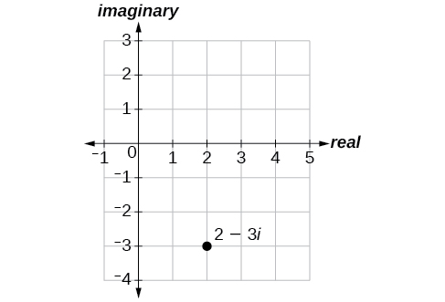
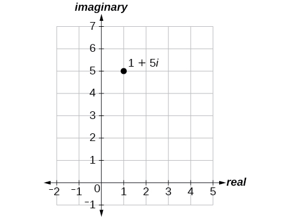
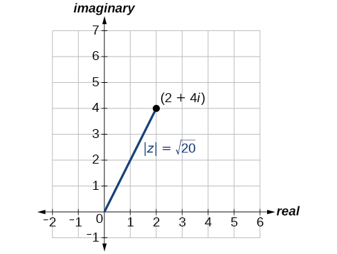
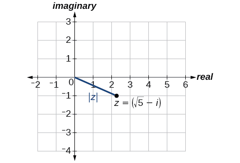
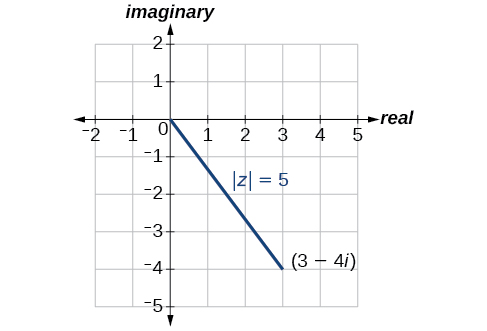
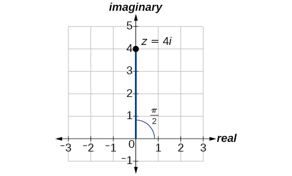
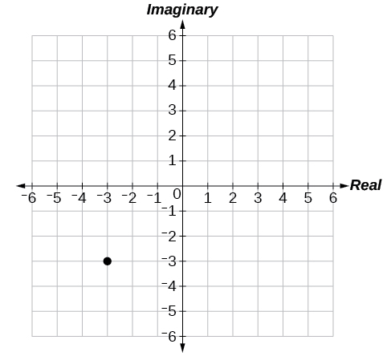
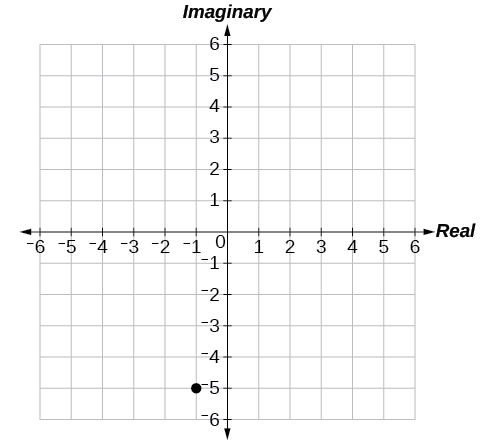
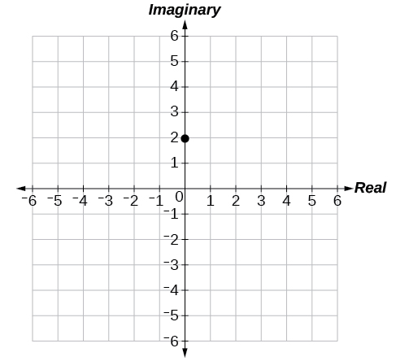
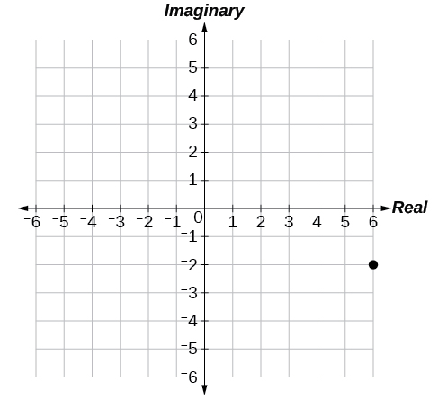

In this section, you will:
* Plot complex numbers in the complex plane.
* Find the absolute value of a complex number.
* Write complex numbers in polar form.
* Convert a complex number from polar to rectangular form.
* Find products of complex numbers in polar form.
* Find quotients of complex numbers in polar form.
* Find powers of complex numbers in polar form.
* Find roots of complex numbers in polar form.

“God made the integers; all else is the work of man.” This rather famous quote by nineteenth-century German mathematician Leopold **Kronecker**{: data-type="term" .no-emphasis} sets the stage for this section on the polar form of a complex number. Complex numbers were invented by people and represent over a thousand years of continuous investigation and struggle by mathematicians such as **Pythagoras**{: data-type="term" .no-emphasis}, **Descartes**{: data-type="term" .no-emphasis}, De Moivre, **Euler**{: data-type="term" .no-emphasis}, **Gauss**{: data-type="term" .no-emphasis}, and others. Complex numbers answered questions that for centuries had puzzled the greatest minds in science.

We first encountered complex numbers in [Complex Numbers](/m51255){: .target-chapter}. In this section, we will focus on the mechanics of working with complex numbers: translation of complex numbers from polar form to rectangular form and vice versa, interpretation of complex numbers in the scheme of applications, and application of De Moivre’s Theorem.

### Plotting Complex Numbers in the Complex Plane

Plotting a **complex number**{: data-type="term" .no-emphasis}<math xmlns="http://www.w3.org/1998/Math/MathML"> <mrow> <mtext> </mtext><mi>a</mi><mo>+</mo><mi>b</mi><mi>i</mi><mtext> </mtext></mrow> </math>

is similar to plotting a real number, except that the horizontal axis represents the real part of the number,<math xmlns="http://www.w3.org/1998/Math/MathML"> <mrow> <mtext> </mtext><mi>a</mi><mo>,</mo><mtext> </mtext></mrow> </math>

and the vertical axis represents the imaginary part of the number,<math xmlns="http://www.w3.org/1998/Math/MathML"> <mrow> <mtext> </mtext><mi>b</mi><mi>i</mi><mo>.</mo></mrow> </math>

**Given a complex number<math xmlns="http://www.w3.org/1998/Math/MathML"> <mrow> <mtext> </mtext><mi>a</mi><mo>+</mo><mi>b</mi><mi>i</mi><mo>,</mo><mtext> </mtext></mrow> </math>

plot it in the complex plane.**

1.  Label the horizontal axis as the *real* axis and the vertical axis as the *imaginary axis.*
2.  Plot the point in the complex plane by moving
    <math xmlns="http://www.w3.org/1998/Math/MathML"> <mrow> <mtext> </mtext><mi>a</mi><mtext> </mtext></mrow> </math>
    
    units in the horizontal direction and
    <math xmlns="http://www.w3.org/1998/Math/MathML"> <mrow> <mtext> </mtext><mi>b</mi><mtext> </mtext></mrow> </math>
    
    units in the vertical direction.
{: type="1"}

Plotting a Complex Number in the Complex Plane

Plot the complex number <math xmlns="http://www.w3.org/1998/Math/MathML"> <mrow> <mtext> </mtext><mn>2</mn><mo>−</mo><mn>3</mn><mi>i</mi><mtext> </mtext></mrow> </math>

in the **complex plane**{: data-type="term" .no-emphasis}.

From the origin, move two units in the positive horizontal direction and three units in the negative vertical direction. See [[link]](#Figure_08_05_001).

{: #Figure_08_05_001}

Plot the point<math xmlns="http://www.w3.org/1998/Math/MathML"> <mrow> <mtext> </mtext><mn>1</mn><mo>+</mo><mn>5</mn><mi>i</mi><mtext> </mtext></mrow> </math>

in the complex plane.

  

### Finding the Absolute Value of a Complex Number

The first step toward working with a complex number in **polar form**{: data-type="term" .no-emphasis} is to find the absolute value. The absolute value of a complex number is the same as its **magnitude**{: data-type="term" .no-emphasis}, or<math xmlns="http://www.w3.org/1998/Math/MathML"> <mrow> <mtext> </mtext><mrow><mo>\|</mo> <mi>z</mi> <mo>\|</mo></mrow><mo>.</mo><mtext> </mtext></mrow> </math>

It measures the distance from the origin to a point in the plane. For example, the graph of<math xmlns="http://www.w3.org/1998/Math/MathML"> <mrow> <mtext> </mtext><mi>z</mi><mo>=</mo><mn>2</mn><mo>+</mo><mn>4</mn><mi>i</mi><mo>,</mo><mtext> </mtext></mrow> </math>

in [\[link\]](#Figure_08_05_003), shows<math xmlns="http://www.w3.org/1998/Math/MathML"> <mrow> <mtext> </mtext><mrow><mo>\|</mo> <mi>z</mi> <mo>\|</mo></mrow><mo>.</mo></mrow> </math>

{: #Figure_08_05_003}

Absolute Value of a Complex Number

Given<math xmlns="http://www.w3.org/1998/Math/MathML"> <mrow> <mtext> </mtext><mi>z</mi><mo>=</mo><mi>x</mi><mo>+</mo><mi>y</mi><mi>i</mi><mo>,</mo><mtext> </mtext></mrow> </math>

a complex number, the absolute value of<math xmlns="http://www.w3.org/1998/Math/MathML"> <mrow> <mtext> </mtext><mi>z</mi><mtext> </mtext></mrow> </math>

is defined as

<math xmlns="http://www.w3.org/1998/Math/MathML" display="block"> <mrow> <mrow><mo>\|</mo> <mi>z</mi> <mo>\|</mo></mrow><mo>=</mo><msqrt> <mrow> <msup> <mi>x</mi> <mn>2</mn> </msup> <mo>+</mo><msup> <mi>y</mi> <mn>2</mn> </msup> </mrow> </msqrt> </mrow> </math>

It is the distance from the origin to the point<math xmlns="http://www.w3.org/1998/Math/MathML"> <mrow> <mtext> </mtext><mrow><mo>(</mo> <mrow> <mi>x</mi><mo>,</mo><mi>y</mi></mrow> <mo>)</mo></mrow><mo>.</mo></mrow> </math>

Notice that the absolute value of a real number gives the distance of the number from 0, while the absolute value of a complex number gives the distance of the number from the origin,<math xmlns="http://www.w3.org/1998/Math/MathML"> <mrow> <mtext> </mtext><mrow><mo>(</mo> <mrow> <mn>0</mn><mo>,</mo><mtext> </mtext><mn>0</mn></mrow> <mo>)</mo></mrow><mo>.</mo></mrow> </math>

Finding the Absolute Value of a Complex Number with a Radical

Find the absolute value of<math xmlns="http://www.w3.org/1998/Math/MathML"> <mrow> <mtext> </mtext><mi>z</mi><mo>=</mo><msqrt> <mn>5</mn> </msqrt> <mo>−</mo><mi>i</mi><mo>.</mo></mrow> </math>

Using the formula, we have

<math xmlns="http://www.w3.org/1998/Math/MathML" display="block"> <mrow> <mtable columnalign="left"> <mtr columnalign="left"> <mtd columnalign="left"> <mrow> <mrow><mo>\|</mo> <mi>z</mi> <mo>\|</mo></mrow><mo>=</mo><msqrt> <mrow> <msup> <mi>x</mi> <mn>2</mn> </msup> <mo>+</mo><msup> <mi>y</mi> <mn>2</mn> </msup> </mrow> </msqrt> </mrow> </mtd> </mtr> <mtr columnalign="left"> <mtd columnalign="left"> <mrow> <mrow><mo>\|</mo> <mi>z</mi> <mo>\|</mo></mrow><mo>=</mo><msqrt> <mrow> <msup> <mrow> <mrow><mo>(</mo> <mrow> <msqrt> <mn>5</mn> </msqrt> </mrow> <mo>)</mo></mrow></mrow> <mn>2</mn> </msup> <mo>+</mo><msup> <mrow> <mrow><mo>(</mo> <mrow> <mo>−</mo><mn>1</mn></mrow> <mo>)</mo></mrow></mrow> <mn>2</mn> </msup> </mrow> </msqrt> </mrow> </mtd> </mtr> <mtr columnalign="left"> <mtd columnalign="left"> <mrow> <mrow><mo>\|</mo> <mi>z</mi> <mo>\|</mo></mrow><mo>=</mo><msqrt> <mrow> <mn>5</mn><mo>+</mo><mn>1</mn></mrow> </msqrt> </mrow> </mtd> </mtr> <mtr columnalign="left"> <mtd columnalign="left"> <mrow> <mrow><mo>\|</mo> <mi>z</mi> <mo>\|</mo></mrow><mo>=</mo><msqrt> <mn>6</mn> </msqrt> </mrow> </mtd> </mtr> </mtable></mrow> </math>

See [[link]](#Figure_08_05_004).

{: #Figure_08_05_004}

Find the absolute value of the complex number<math xmlns="http://www.w3.org/1998/Math/MathML"> <mrow> <mtext> </mtext><mi>z</mi><mo>=</mo><mn>12</mn><mo>−</mo><mn>5</mn><mi>i</mi><mo>.</mo></mrow> </math>

13

Finding the Absolute Value of a Complex Number

Given<math xmlns="http://www.w3.org/1998/Math/MathML"> <mrow> <mtext> </mtext><mi>z</mi><mo>=</mo><mn>3</mn><mo>−</mo><mn>4</mn><mi>i</mi><mo>,</mo><mtext> </mtext></mrow> </math>

find<math xmlns="http://www.w3.org/1998/Math/MathML"> <mrow> <mtext> </mtext><mrow><mo>\|</mo> <mi>z</mi> <mo>\|</mo></mrow><mo>.</mo></mrow> </math>

Using the formula, we have

<math xmlns="http://www.w3.org/1998/Math/MathML" display="block"> <mrow> <mtable columnalign="left"> <mtr columnalign="left"> <mtd columnalign="left"> <mrow> <mrow><mo>\|</mo> <mi>z</mi> <mo>\|</mo></mrow><mo>=</mo><msqrt> <mrow> <msup> <mi>x</mi> <mn>2</mn> </msup> <mo>+</mo><msup> <mi>y</mi> <mn>2</mn> </msup> </mrow> </msqrt> </mrow> </mtd> </mtr> <mtr columnalign="left"> <mtd columnalign="left"> <mrow> <mrow><mo>\|</mo> <mi>z</mi> <mo>\|</mo></mrow><mo>=</mo><msqrt> <mrow> <msup> <mrow> <mrow><mo>(</mo> <mn>3</mn> <mo>)</mo></mrow></mrow> <mn>2</mn> </msup> <mo>+</mo><msup> <mrow> <mrow><mo>(</mo> <mrow> <mo>−</mo><mn>4</mn></mrow> <mo>)</mo></mrow></mrow> <mn>2</mn> </msup> </mrow> </msqrt> </mrow> </mtd> </mtr> <mtr columnalign="left"> <mtd columnalign="left"> <mrow> <mrow><mo>\|</mo> <mi>z</mi> <mo>\|</mo></mrow><mo>=</mo><msqrt> <mrow> <mn>9</mn><mo>+</mo><mn>16</mn></mrow> </msqrt> </mrow> </mtd> </mtr> <mtr columnalign="left"> <mtd columnalign="left"> <mtable columnalign="left"> <mtr> <mtd> <mrow><mo>\|</mo> <mi>z</mi> <mo>\|</mo></mrow><mo>=</mo><msqrt> <mrow> <mn>25</mn></mrow> </msqrt> </mtd> </mtr> <mtr> <mtd> <mrow><mo>\|</mo> <mi>z</mi> <mo>\|</mo></mrow><mo>=</mo><mn>5</mn> </mtd> </mtr> </mtable> </mtd> </mtr> </mtable></mrow> </math>

The absolute value<math xmlns="http://www.w3.org/1998/Math/MathML"> <mrow> <mtext> </mtext><mrow><mi>z</mi></mrow><mtext> </mtext></mrow> </math>

is 5. See [[link]](#Figure_08_05_005).

{: #Figure_08_05_005}

Given<math xmlns="http://www.w3.org/1998/Math/MathML"> <mrow> <mtext> </mtext><mi>z</mi><mo>=</mo><mn>1</mn><mo>−</mo><mn>7</mn><mi>i</mi><mo>,</mo><mtext> </mtext></mrow> </math>

find<math xmlns="http://www.w3.org/1998/Math/MathML"> <mrow> <mtext> </mtext><mrow><mo>\|</mo> <mi>z</mi> <mo>\|</mo></mrow><mo>.</mo></mrow> </math>

<math xmlns="http://www.w3.org/1998/Math/MathML"> <mrow> <mrow><mo>\|</mo> <mi>z</mi> <mo>\|</mo></mrow><mo>=</mo><msqrt> <mrow> <mn>50</mn></mrow> </msqrt> <mo>=</mo><mn>5</mn><msqrt> <mn>2</mn> </msqrt> </mrow> </math>

### Writing Complex Numbers in Polar Form

The **polar form of a complex number**{: data-type="term"} expresses a number in terms of an angle<math xmlns="http://www.w3.org/1998/Math/MathML"> <mrow> <mtext> </mtext><mi>θ</mi><mtext> </mtext></mrow> </math>

and its distance from the origin<math xmlns="http://www.w3.org/1998/Math/MathML"> <mrow> <mtext> </mtext><mi>r</mi><mo>.</mo><mtext> </mtext></mrow> </math>

Given a complex number in **rectangular form**{: data-type="term" .no-emphasis} expressed as<math xmlns="http://www.w3.org/1998/Math/MathML"> <mrow> <mtext> </mtext><mi>z</mi><mo>=</mo><mi>x</mi><mo>+</mo><mi>y</mi><mi>i</mi><mo>,</mo><mtext> </mtext></mrow> </math>

we use the same conversion formulas as we do to write the number in trigonometric form:

<math xmlns="http://www.w3.org/1998/Math/MathML" display="block"> <mrow> <mtable columnalign="left"> <mtr columnalign="left"> <mtd columnalign="left"> <mrow> <mtext> </mtext><mi>x</mi><mo>=</mo><mi>r</mi><mi>cos</mi><mtext> </mtext><mi>θ</mi></mrow> </mtd> </mtr> <mtr columnalign="left"> <mtd columnalign="left"> <mrow> <mtext> </mtext><mi>y</mi><mo>=</mo><mi>r</mi><mi>sin</mi><mtext> </mtext><mi>θ</mi></mrow> </mtd> </mtr> <mtr columnalign="left"> <mtd columnalign="left"> <mrow> <mtext> </mtext><mtext> </mtext><mi>r</mi><mo>=</mo><msqrt> <mrow> <msup> <mi>x</mi> <mn>2</mn> </msup> <mo>+</mo><msup> <mi>y</mi> <mn>2</mn> </msup> </mrow> </msqrt> </mrow> </mtd> </mtr> </mtable></mrow> </math>

We review these relationships in [\[link\]](#Figure_08_05_006).

 {: #Figure_08_05_006}

We use the term **modulus** to represent the absolute value of a complex number, or the distance from the origin to the point<math xmlns="http://www.w3.org/1998/Math/MathML"> <mrow> <mtext> </mtext><mrow><mo>(</mo> <mrow> <mi>x</mi><mo>,</mo><mi>y</mi></mrow> <mo>)</mo></mrow><mo>.</mo><mtext> </mtext></mrow> </math>

The modulus, then, is the same as<math xmlns="http://www.w3.org/1998/Math/MathML"> <mrow> <mtext> </mtext><mi>r</mi><mo>,</mo><mtext> </mtext></mrow> </math>

the radius in polar form. We use<math xmlns="http://www.w3.org/1998/Math/MathML"> <mrow> <mtext> </mtext><mi>θ</mi><mtext> </mtext></mrow> </math>

to indicate the angle of direction (just as with polar coordinates). Substituting, we have

<math xmlns="http://www.w3.org/1998/Math/MathML" display="block"> <mrow> <mtable columnalign="left"> <mtr columnalign="left"> <mtd columnalign="left"> <mrow> <mi>z</mi><mo>=</mo><mi>x</mi><mo>+</mo><mi>y</mi><mi>i</mi></mrow> </mtd> </mtr> <mtr columnalign="left"> <mtd columnalign="left"> <mrow> <mi>z</mi><mo>=</mo><mi>r</mi><mi>cos</mi><mtext> </mtext><mi>θ</mi><mo>+</mo><mrow><mo>(</mo> <mrow> <mi>r</mi><mi>sin</mi><mtext> </mtext><mi>θ</mi></mrow> <mo>)</mo></mrow><mi>i</mi></mrow> </mtd> </mtr> <mtr columnalign="left"> <mtd columnalign="left"> <mrow> <mi>z</mi><mo>=</mo><mi>r</mi><mrow><mo>(</mo> <mrow> <mi>cos</mi><mtext> </mtext><mi>θ</mi><mo>+</mo><mi>i</mi><mi>sin</mi><mtext> </mtext><mi>θ</mi></mrow> <mo>)</mo></mrow></mrow> </mtd> </mtr> </mtable></mrow> </math>

Polar Form of a Complex Number

Writing a complex number in polar form involves the following conversion formulas:

<math xmlns="http://www.w3.org/1998/Math/MathML" display="block"> <mrow> <mtable columnalign="left"> <mtr columnalign="left"> <mtd columnalign="left"> <mrow /> </mtd> </mtr> <mtr columnalign="left"> <mtd columnalign="left"> <mrow> <mi>x</mi><mo>=</mo><mi>r</mi><mi>cos</mi><mtext> </mtext><mi>θ</mi> </mrow> </mtd> </mtr> <mtr columnalign="left"> <mtd columnalign="left"> <mrow> <mi>y</mi><mo>=</mo><mi>r</mi><mi>sin</mi><mtext> </mtext><mi>θ</mi> </mrow> </mtd> </mtr> <mtr columnalign="left"> <mtd columnalign="left"> <mrow> <mi>r</mi><mo>=</mo><msqrt> <mrow> <msup> <mi>x</mi> <mn>2</mn> </msup> <mo>+</mo><msup> <mi>y</mi> <mn>2</mn> </msup> </mrow> </msqrt> </mrow> </mtd> </mtr> </mtable> </mrow> </math>

Making a direct substitution, we have

<math xmlns="http://www.w3.org/1998/Math/MathML" display="block"> <mrow> <mtable columnalign="left"> <mtr columnalign="left"> <mtd columnalign="left"> <mrow> <mi>z</mi><mo>=</mo><mi>x</mi><mo>+</mo><mi>y</mi><mi>i</mi></mrow> </mtd> </mtr> <mtr columnalign="left"> <mtd columnalign="left"> <mrow> <mi>z</mi><mo>=</mo><mrow><mo>(</mo> <mrow> <mi>r</mi><mi>cos</mi><mtext> </mtext><mi>θ</mi></mrow> <mo>)</mo></mrow><mo>+</mo><mi>i</mi><mrow><mo>(</mo> <mrow> <mi>r</mi><mi>sin</mi><mtext> </mtext><mi>θ</mi></mrow> <mo>)</mo></mrow></mrow> </mtd> </mtr> <mtr columnalign="left"> <mtd columnalign="left"> <mrow> <mi>z</mi><mo>=</mo><mi>r</mi><mrow><mo>(</mo> <mrow> <mi>cos</mi><mtext> </mtext><mi>θ</mi><mo>+</mo><mi>i</mi><mi>sin</mi><mtext> </mtext><mi>θ</mi></mrow> <mo>)</mo></mrow></mrow> </mtd> </mtr> </mtable></mrow> </math>

where<math xmlns="http://www.w3.org/1998/Math/MathML"> <mrow> <mtext> </mtext><mi>r</mi><mtext> </mtext></mrow> </math>

is the **modulus**{: data-type="term"} and <math xmlns="http://www.w3.org/1998/Math/MathML"> <mrow> <mi>θ</mi></mrow> </math>

 is the **argument**{: data-type="term"}. We often use the abbreviation<math xmlns="http://www.w3.org/1998/Math/MathML"> <mrow> <mtext> </mtext><mi>r</mi><mtext>cis</mtext><mtext> </mtext><mi>θ</mi><mtext> </mtext></mrow> </math>

to represent<math xmlns="http://www.w3.org/1998/Math/MathML"> <mrow> <mtext> </mtext><mi>r</mi><mrow><mo>(</mo> <mrow> <mi>cos</mi><mtext> </mtext><mi>θ</mi><mo>+</mo><mi>i</mi><mi>sin</mi><mtext> </mtext><mi>θ</mi></mrow> <mo>)</mo></mrow><mo>.</mo></mrow> </math>

Expressing a Complex Number Using Polar Coordinates

Express the complex number<math xmlns="http://www.w3.org/1998/Math/MathML"> <mrow> <mtext> </mtext><mn>4</mn><mi>i</mi><mtext> </mtext></mrow> </math>

using polar coordinates.

On the complex plane, the number<math xmlns="http://www.w3.org/1998/Math/MathML"> <mrow> <mtext> </mtext><mi>z</mi><mo>=</mo><mn>4</mn><mi>i</mi><mtext> </mtext></mrow> </math>

is the same as<math xmlns="http://www.w3.org/1998/Math/MathML"> <mrow> <mtext> </mtext><mi>z</mi><mo>=</mo><mn>0</mn><mo>+</mo><mn>4</mn><mi>i</mi><mo>.</mo><mtext> </mtext></mrow> </math>

Writing it in polar form, we have to calculate<math xmlns="http://www.w3.org/1998/Math/MathML"> <mrow> <mtext> </mtext><mi>r</mi><mtext> </mtext></mrow> </math>

first.

<math xmlns="http://www.w3.org/1998/Math/MathML" display="block"> <mrow> <mtable columnalign="left"> <mtr columnalign="left"> <mtd columnalign="left"> <mrow> <mi>r</mi><mo>=</mo><msqrt> <mrow> <msup> <mi>x</mi> <mn>2</mn> </msup> <mo>+</mo><msup> <mi>y</mi> <mn>2</mn> </msup> </mrow> </msqrt> </mrow> </mtd> </mtr> <mtr columnalign="left"> <mtd columnalign="left"> <mrow> <mi>r</mi><mo>=</mo><msqrt> <mrow> <msup> <mn>0</mn> <mn>2</mn> </msup> <mo>+</mo><msup> <mn>4</mn> <mn>2</mn> </msup> </mrow> </msqrt> </mrow> </mtd> </mtr> <mtr columnalign="left"> <mtd columnalign="left"> <mrow> <mi>r</mi><mo>=</mo><msqrt> <mrow> <mn>16</mn></mrow> </msqrt> </mrow> </mtd> </mtr> <mtr columnalign="left"> <mtd columnalign="left"> <mrow> <mi>r</mi><mo>=</mo><mn>4</mn></mrow> </mtd> </mtr> </mtable></mrow> </math>

Next, we look at<math xmlns="http://www.w3.org/1998/Math/MathML"> <mrow> <mtext> </mtext><mi>x</mi><mo>.</mo><mtext> </mtext></mrow> </math>

If<math xmlns="http://www.w3.org/1998/Math/MathML"> <mrow> <mtext> </mtext><mi>x</mi><mo>=</mo><mi>r</mi><mi>cos</mi><mtext> </mtext><mi>θ</mi><mo>,</mo><mtext> </mtext></mrow> </math>

and<math xmlns="http://www.w3.org/1998/Math/MathML"> <mrow> <mtext> </mtext><mi>x</mi><mo>=</mo><mn>0</mn><mo>,</mo><mtext> </mtext></mrow> </math>

then<math xmlns="http://www.w3.org/1998/Math/MathML"> <mrow> <mtext> </mtext><mi>θ</mi><mo>=</mo><mfrac> <mi>π</mi> <mn>2</mn> </mfrac> <mo>.</mo><mtext> </mtext></mrow> </math>

In polar coordinates, the complex number<math xmlns="http://www.w3.org/1998/Math/MathML"> <mrow> <mtext> </mtext><mi>z</mi><mo>=</mo><mn>0</mn><mo>+</mo><mn>4</mn><mi>i</mi><mtext> </mtext></mrow> </math>

can be written as<math xmlns="http://www.w3.org/1998/Math/MathML"> <mrow> <mtext> </mtext><mi>z</mi><mo>=</mo><mn>4</mn><mrow><mo>(</mo> <mrow> <mi>cos</mi><mrow><mo>(</mo> <mrow> <mfrac> <mi>π</mi> <mn>2</mn> </mfrac> </mrow> <mo>)</mo></mrow><mo>+</mo><mi>i</mi><mi>sin</mi><mrow><mo>(</mo> <mrow> <mfrac> <mi>π</mi> <mn>2</mn> </mfrac> </mrow> <mo>)</mo></mrow></mrow> <mo>)</mo></mrow><mtext> </mtext></mrow> </math>

or<math xmlns="http://www.w3.org/1998/Math/MathML"> <mrow> <mtext> </mtext><mn>4</mn><mtext>cis</mtext><mrow><mo>(</mo> <mrow> <mtext> </mtext><mfrac> <mi>π</mi> <mn>2</mn> </mfrac> </mrow> <mo>)</mo></mrow><mo>.</mo><mtext> </mtext></mrow> </math>

See [[link]](#Figure_08_05_007).

{: #Figure_08_05_007}

Express<math xmlns="http://www.w3.org/1998/Math/MathML"> <mrow> <mtext> </mtext><mi>z</mi><mo>=</mo><mn>3</mn><mi>i</mi><mtext> </mtext></mrow> </math>

 as <math xmlns="http://www.w3.org/1998/Math/MathML"> <mrow> <mtext> </mtext><mi>r</mi><mtext> </mtext><mtext>cis</mtext><mtext> </mtext><mi>θ</mi><mtext> </mtext></mrow> </math>

 in polar form.

<math xmlns="http://www.w3.org/1998/Math/MathML"> <mrow> <mi>z</mi><mo>=</mo><mn>3</mn><mrow><mo>(</mo> <mrow> <mi>cos</mi><mrow><mo>(</mo> <mrow> <mfrac> <mi>π</mi> <mn>2</mn> </mfrac> </mrow> <mo>)</mo></mrow><mo>+</mo><mi>i</mi><mi>sin</mi><mrow><mo>(</mo> <mrow> <mfrac> <mi>π</mi> <mn>2</mn> </mfrac> </mrow> <mo>)</mo></mrow></mrow> <mo>)</mo></mrow></mrow> </math>

Finding the Polar Form of a Complex Number

Find the polar form of<math xmlns="http://www.w3.org/1998/Math/MathML"> <mrow> <mtext> </mtext><mo>−</mo><mn>4</mn><mo>+</mo><mn>4</mn><mi>i</mi><mo>.</mo></mrow> </math>

First, find the value of<math xmlns="http://www.w3.org/1998/Math/MathML"> <mrow> <mtext> </mtext><mi>r</mi><mo>.</mo></mrow> </math>

<math xmlns="http://www.w3.org/1998/Math/MathML" display="block"> <mrow> <mtable columnalign="left"> <mtr columnalign="left"> <mtd columnalign="left"> <mrow> <mi>r</mi><mo>=</mo><msqrt> <mrow> <msup> <mi>x</mi> <mn>2</mn> </msup> <mo>+</mo><msup> <mi>y</mi> <mn>2</mn> </msup> </mrow> </msqrt> </mrow> </mtd> </mtr> <mtr columnalign="left"> <mtd columnalign="left"> <mrow> <mi>r</mi><mo>=</mo><msqrt> <mrow> <msup> <mrow> <mrow><mo>(</mo> <mrow> <mo>−</mo><mn>4</mn></mrow> <mo>)</mo></mrow></mrow> <mn>2</mn> </msup> <mo>+</mo><mrow><mo>(</mo> <mrow> <msup> <mn>4</mn> <mn>2</mn> </msup> </mrow> <mo>)</mo></mrow></mrow> </msqrt> </mrow> </mtd> </mtr> <mtr columnalign="left"> <mtd columnalign="left"> <mrow> <mi>r</mi><mo>=</mo><msqrt> <mrow> <mn>32</mn></mrow> </msqrt> </mrow> </mtd> </mtr> <mtr columnalign="left"> <mtd columnalign="left"> <mrow> <mi>r</mi><mo>=</mo><mn>4</mn><msqrt> <mn>2</mn> </msqrt> </mrow> </mtd> </mtr> </mtable></mrow> </math>

Find the angle<math xmlns="http://www.w3.org/1998/Math/MathML"> <mrow> <mtext> </mtext><mi>θ</mi><mtext> </mtext> </mrow> </math>

using the formula:

<math xmlns="http://www.w3.org/1998/Math/MathML" display="block"> <mrow> <mtable columnalign="left"> <mtr columnalign="left"> <mtd columnalign="left"> <mrow> <mi>cos</mi><mtext> </mtext><mi>θ</mi><mo>=</mo><mfrac> <mi>x</mi> <mi>r</mi> </mfrac> </mrow> </mtd> </mtr> <mtr columnalign="left"> <mtd columnalign="left"> <mrow> <mi>cos</mi><mtext> </mtext><mi>θ</mi><mo>=</mo><mfrac> <mrow> <mo>−</mo><mn>4</mn></mrow> <mrow> <mn>4</mn><msqrt> <mn>2</mn> </msqrt> </mrow> </mfrac> </mrow> </mtd> </mtr> <mtr columnalign="left"> <mtd columnalign="left"> <mrow> <mi>cos</mi><mtext> </mtext><mi>θ</mi><mo>=</mo><mo>−</mo><mfrac> <mn>1</mn> <mrow> <msqrt> <mn>2</mn> </msqrt> </mrow> </mfrac> </mrow> </mtd> </mtr> <mtr columnalign="left"> <mtd columnalign="left"> <mrow> <mtext> </mtext><mtext> </mtext><mtext> </mtext><mtext> </mtext><mtext> </mtext><mtext> </mtext><mtext> </mtext><mtext> </mtext><mtext> </mtext><mi>θ</mi><mo>=</mo><msup> <mrow> <mi>cos</mi></mrow> <mrow> <mo>−</mo><mn>1</mn></mrow> </msup> <mrow><mo>(</mo> <mrow> <mo>−</mo><mfrac> <mn>1</mn> <mrow> <msqrt> <mn>2</mn> </msqrt> </mrow> </mfrac> </mrow> <mo>)</mo></mrow><mo>=</mo><mfrac> <mrow> <mn>3</mn><mi>π</mi></mrow> <mn>4</mn> </mfrac> </mrow> </mtd> </mtr> </mtable></mrow> </math>

Thus, the solution is<math xmlns="http://www.w3.org/1998/Math/MathML"> <mrow> <mtext> </mtext><mn>4</mn><msqrt> <mn>2</mn> </msqrt> <mtext>cis</mtext><mrow><mo>(</mo> <mrow> <mfrac> <mrow> <mn>3</mn><mi>π</mi></mrow> <mn>4</mn> </mfrac> </mrow> <mo>)</mo></mrow><mo>.</mo></mrow> </math>

Write<math xmlns="http://www.w3.org/1998/Math/MathML"> <mrow> <mtext> </mtext><mi>z</mi><mo>=</mo><msqrt> <mn>3</mn> </msqrt> <mo>+</mo><mi>i</mi><mtext> </mtext></mrow> </math>

in polar form.

<math xmlns="http://www.w3.org/1998/Math/MathML"> <mrow> <mi>z</mi><mo>=</mo><mn>2</mn><mrow><mo>(</mo> <mrow> <mi>cos</mi><mrow><mo>(</mo> <mrow> <mfrac> <mi>π</mi> <mn>6</mn> </mfrac> </mrow> <mo>)</mo></mrow><mo>+</mo><mi>i</mi><mi>sin</mi><mrow><mo>(</mo> <mrow> <mfrac> <mi>π</mi> <mn>6</mn> </mfrac> </mrow> <mo>)</mo></mrow></mrow> <mo>)</mo></mrow></mrow> </math>

### Converting a Complex Number from Polar to Rectangular Form

Converting a complex number from polar form to rectangular form is a matter of evaluating what is given and using the distributive property. In other words, given<math xmlns="http://www.w3.org/1998/Math/MathML"> <mrow> <mtext> </mtext><mi>z</mi><mo>=</mo><mi>r</mi><mrow><mo>(</mo> <mrow> <mi>cos</mi><mtext> </mtext><mi>θ</mi><mo>+</mo><mi>i</mi><mi>sin</mi><mtext> </mtext><mi>θ</mi></mrow> <mo>)</mo></mrow><mo>,</mo><mtext> </mtext></mrow> </math>

first evaluate the trigonometric functions<math xmlns="http://www.w3.org/1998/Math/MathML"> <mrow> <mtext> </mtext><mi>cos</mi><mtext> </mtext><mi>θ</mi><mtext> </mtext></mrow> </math>

and<math xmlns="http://www.w3.org/1998/Math/MathML"> <mrow> <mtext> </mtext><mi>sin</mi><mtext> </mtext><mi>θ</mi><mo>.</mo><mtext> </mtext></mrow> </math>

Then, multiply through by<math xmlns="http://www.w3.org/1998/Math/MathML"> <mrow> <mtext> </mtext><mi>r</mi><mo>.</mo></mrow> </math>

Converting from Polar to Rectangular Form

Convert the polar form of the given complex number to rectangular form:

<math xmlns="http://www.w3.org/1998/Math/MathML"> <mrow> <mi>z</mi><mo>=</mo><mn>12</mn><mrow><mo>(</mo> <mrow> <mi>cos</mi><mrow><mo>(</mo> <mrow> <mfrac> <mi>π</mi> <mn>6</mn> </mfrac> </mrow> <mo>)</mo></mrow><mo>+</mo><mi>i</mi><mi>sin</mi><mrow><mo>(</mo> <mrow> <mfrac> <mi>π</mi> <mn>6</mn> </mfrac> </mrow> <mo>)</mo></mrow></mrow> <mo>)</mo></mrow></mrow> </math>

We begin by evaluating the trigonometric expressions.

<math xmlns="http://www.w3.org/1998/Math/MathML"> <mrow> <mi>cos</mi><mrow><mo>(</mo> <mrow> <mfrac> <mi>π</mi> <mn>6</mn> </mfrac> </mrow> <mo>)</mo></mrow><mo>=</mo><mfrac> <mrow> <msqrt> <mn>3</mn> </msqrt> </mrow> <mn>2</mn> </mfrac> <mtext> </mtext><mtext>and</mtext><mtext> </mtext><mi>sin</mi><mrow><mo>(</mo> <mrow> <mfrac> <mi>π</mi> <mn>6</mn> </mfrac> </mrow> <mo>)</mo></mrow><mo>=</mo><mfrac> <mn>1</mn> <mn>2</mn> </mfrac> <mtext> </mtext> </mrow> </math>

After substitution, the complex number is

<math xmlns="http://www.w3.org/1998/Math/MathML" display="block"> <mrow> <mi>z</mi><mo>=</mo><mn>12</mn><mrow><mo>(</mo> <mrow> <mfrac> <mrow> <msqrt> <mn>3</mn> </msqrt> </mrow> <mn>2</mn> </mfrac> <mo>+</mo><mfrac> <mn>1</mn> <mn>2</mn> </mfrac> <mi>i</mi></mrow> <mo>)</mo></mrow></mrow> </math>

We apply the distributive property:

<math xmlns="http://www.w3.org/1998/Math/MathML" display="block"> <mrow> <mtable columnalign="left"> <mtr columnalign="left"> <mtd columnalign="left"> <mrow> <mi>z</mi><mo>=</mo><mn>12</mn><mrow><mo>(</mo> <mrow> <mfrac> <mrow> <msqrt> <mn>3</mn> </msqrt> </mrow> <mn>2</mn> </mfrac> <mo>+</mo><mfrac> <mn>1</mn> <mn>2</mn> </mfrac> <mi>i</mi></mrow> <mo>)</mo></mrow></mrow> </mtd> </mtr> <mtr columnalign="left"> <mtd columnalign="left"> <mrow> <mtext>  </mtext><mo>=</mo><mrow><mo>(</mo> <mrow> <mn>12</mn></mrow> <mo>)</mo></mrow><mfrac> <mrow> <msqrt> <mn>3</mn> </msqrt> </mrow> <mn>2</mn> </mfrac> <mo>+</mo><mrow><mo>(</mo> <mrow> <mn>12</mn></mrow> <mo>)</mo></mrow><mfrac> <mn>1</mn> <mn>2</mn> </mfrac> <mi>i</mi></mrow> </mtd> </mtr> <mtr columnalign="left"> <mtd columnalign="left"> <mrow> <mtext>  </mtext><mo>=</mo><mn>6</mn><msqrt> <mn>3</mn> </msqrt> <mo>+</mo><mn>6</mn><mi>i</mi></mrow> </mtd> </mtr> </mtable></mrow> </math>

The rectangular form of the given point in complex form is<math xmlns="http://www.w3.org/1998/Math/MathML"> <mrow> <mtext> </mtext><mn>6</mn><msqrt> <mn>3</mn> </msqrt> <mo>+</mo><mn>6</mn><mi>i</mi><mo>.</mo></mrow> </math>

Finding the Rectangular Form of a Complex Number

Find the rectangular form of the complex number given<math xmlns="http://www.w3.org/1998/Math/MathML"> <mrow> <mtext> </mtext><mi>r</mi><mo>=</mo><mn>13</mn><mtext> </mtext></mrow> </math>

and<math xmlns="http://www.w3.org/1998/Math/MathML"> <mrow> <mtext> </mtext><mi>tan</mi><mtext> </mtext><mi>θ</mi><mo>=</mo><mfrac> <mn>5</mn> <mrow> <mn>12</mn></mrow> </mfrac> <mo>.</mo></mrow> </math>

If<math xmlns="http://www.w3.org/1998/Math/MathML"> <mrow> <mtext> </mtext><mi>tan</mi><mtext> </mtext><mi>θ</mi><mo>=</mo><mfrac> <mn>5</mn> <mrow> <mn>12</mn></mrow> </mfrac> <mo>,</mo><mtext> </mtext></mrow> </math>

and<math xmlns="http://www.w3.org/1998/Math/MathML"> <mrow> <mtext> </mtext><mi>tan</mi><mtext> </mtext><mi>θ</mi><mo>=</mo><mfrac> <mi>y</mi> <mi>x</mi> </mfrac> <mo>,</mo><mtext> </mtext></mrow> </math>

we first determine<math xmlns="http://www.w3.org/1998/Math/MathML"> <mrow> <mtext> </mtext><mi>r</mi><mo>=</mo><msqrt> <mrow> <msup> <mi>x</mi> <mn>2</mn> </msup> <mo>+</mo><msup> <mi>y</mi> <mn>2</mn> </msup> </mrow> </msqrt> <mo>=</mo><msqrt> <mrow> <msup> <mrow> <mn>12</mn></mrow> <mn>2</mn> </msup> <mo>+</mo><msup> <mn>5</mn> <mn>2</mn> </msup> </mrow> </msqrt> <mo>=</mo><mn>13</mn><mtext>. </mtext></mrow> </math>

 We then find<math xmlns="http://www.w3.org/1998/Math/MathML"> <mrow> <mtext> </mtext><mi>cos</mi><mtext> </mtext><mi>θ</mi><mo>=</mo><mfrac> <mi>x</mi> <mi>r</mi> </mfrac> <mtext> </mtext></mrow> </math>

and<math xmlns="http://www.w3.org/1998/Math/MathML"> <mrow> <mtext> </mtext><mi>sin</mi><mtext> </mtext><mi>θ</mi><mo>=</mo><mfrac> <mi>y</mi> <mi>r</mi> </mfrac> <mo>.</mo></mrow> </math>

<math xmlns="http://www.w3.org/1998/Math/MathML" display="block"> <mrow> <mtable columnalign="left"> <mtr columnalign="left"> <mtd columnalign="left"> <mrow> <mi>z</mi><mo>=</mo><mn>13</mn><mo stretchy="false">(</mo><mi>cos</mi><mtext> </mtext><mi>θ</mi><mo>+</mo><mi>i</mi><mi>sin</mi><mtext> </mtext><mi>θ</mi><mo stretchy="false">)</mo> </mrow> </mtd> </mtr> <mtr columnalign="left"> <mtd columnalign="left"> <mrow> <mtext> </mtext><mtext> </mtext><mtext> </mtext><mo>=</mo><mn>13</mn><mrow><mo>(</mo> <mrow> <mfrac> <mrow> <mn>12</mn> </mrow> <mrow> <mn>13</mn> </mrow> </mfrac> <mo>+</mo><mfrac> <mn>5</mn> <mrow> <mn>13</mn> </mrow> </mfrac> <mi>i</mi> </mrow> <mo>)</mo></mrow> </mrow> </mtd> </mtr> <mtr columnalign="left"> <mtd columnalign="left"> <mrow> <mtext> </mtext><mtext> </mtext><mtext> </mtext><mo>=</mo><mn>12</mn><mo>+</mo><mn>5</mn><mi>i</mi> </mrow> </mtd> </mtr> </mtable> </mrow> </math>

The rectangular form of the given number in complex form is<math xmlns="http://www.w3.org/1998/Math/MathML"> <mrow> <mtext> </mtext><mn>12</mn><mo>+</mo><mn>5</mn><mi>i</mi><mo>.</mo></mrow> </math>

Convert the complex number to rectangular form:

<math xmlns="http://www.w3.org/1998/Math/MathML" display="block"> <mrow> <mi>z</mi><mo>=</mo><mn>4</mn><mrow><mo>(</mo> <mrow> <mi>cos</mi><mfrac> <mrow> <mn>11</mn><mi>π</mi></mrow> <mn>6</mn> </mfrac> <mo>+</mo><mi>i</mi><mi>sin</mi><mfrac> <mrow> <mn>11</mn><mi>π</mi></mrow> <mn>6</mn> </mfrac> </mrow> <mo>)</mo></mrow></mrow> </math>

<math xmlns="http://www.w3.org/1998/Math/MathML"> <mrow> <mi>z</mi><mo>=</mo><mn>2</mn><msqrt> <mn>3</mn> </msqrt> <mo>−</mo><mn>2</mn><mi>i</mi></mrow> </math>

### Finding Products of Complex Numbers in Polar Form

Now that we can convert complex numbers to polar form we will learn how to perform operations on complex numbers in polar form. For the rest of this section, we will work with formulas developed by French mathematician Abraham **de Moivre**{: data-type="term" .no-emphasis} (1667-1754). These formulas have made working with products, quotients, powers, and roots of complex numbers much simpler than they appear. The rules are based on multiplying the moduli and adding the arguments.

Products of Complex Numbers in Polar Form

If<math xmlns="http://www.w3.org/1998/Math/MathML"> <mrow> <mtext> </mtext><msub> <mi>z</mi> <mn>1</mn> </msub> <mo>=</mo><msub> <mi>r</mi> <mn>1</mn> </msub> <mo stretchy="false">(</mo><mi>cos</mi><mtext> </mtext><msub> <mi>θ</mi> <mn>1</mn> </msub> <mo>+</mo><mi>i</mi><mi>sin</mi><mtext> </mtext><msub> <mi>θ</mi> <mn>1</mn> </msub> <mo stretchy="false">)</mo><mtext> </mtext> </mrow> </math>

and<math xmlns="http://www.w3.org/1998/Math/MathML"> <mrow> <mtext> </mtext><msub> <mi>z</mi> <mn>2</mn> </msub> <mo>=</mo><msub> <mi>r</mi> <mn>2</mn> </msub> <mo stretchy="false">(</mo><mi>cos</mi><mtext> </mtext><msub> <mi>θ</mi> <mn>2</mn> </msub> <mo>+</mo><mi>i</mi><mi>sin</mi><mtext> </mtext><msub> <mi>θ</mi> <mn>2</mn> </msub> <mo stretchy="false">)</mo><mo>,</mo> </mrow> </math>

 then the product of these numbers is given as:

<math xmlns="http://www.w3.org/1998/Math/MathML" display="block"> <mrow> <mtable columnalign="left"> <mtr columnalign="left"> <mtd columnalign="left"> <mrow /> </mtd> </mtr> <mtr columnalign="left"> <mtd columnalign="left"> <mrow> <mtable columnalign="left"> <mtr columnalign="left"> <mtd columnalign="left"> <mrow> <msub> <mi>z</mi> <mn>1</mn> </msub> <msub> <mi>z</mi> <mn>2</mn> </msub> <mo>=</mo><msub> <mi>r</mi> <mn>1</mn> </msub> <msub> <mi>r</mi> <mn>2</mn> </msub> <mrow><mo>[</mo> <mrow> <mi>cos</mi><mrow><mo>(</mo> <mrow> <msub> <mi>θ</mi> <mn>1</mn> </msub> <mo>+</mo><msub> <mi>θ</mi> <mn>2</mn> </msub> </mrow> <mo>)</mo></mrow><mo>+</mo><mi>i</mi><mi>sin</mi><mrow><mo>(</mo> <mrow> <msub> <mi>θ</mi> <mn>1</mn> </msub> <mo>+</mo><msub> <mi>θ</mi> <mn>2</mn> </msub> </mrow> <mo>)</mo></mrow> </mrow> <mo>]</mo></mrow> </mrow> </mtd> </mtr> <mtr columnalign="left"> <mtd columnalign="left"> <mrow> <msub> <mi>z</mi> <mn>1</mn> </msub> <msub> <mi>z</mi> <mn>2</mn> </msub> <mo>=</mo><msub> <mi>r</mi> <mn>1</mn> </msub> <msub> <mi>r</mi> <mn>2</mn> </msub> <mtext>cis</mtext><mrow><mo>(</mo> <mrow> <msub> <mi>θ</mi> <mn>1</mn> </msub> <mo>+</mo><msub> <mi>θ</mi> <mn>2</mn> </msub> </mrow> <mo>)</mo></mrow> </mrow> </mtd> </mtr> </mtable> </mrow> </mtd> </mtr> </mtable> </mrow> </math>

Notice that the product calls for multiplying the moduli and adding the angles.

Finding the Product of Two Complex Numbers in Polar Form

Find the product of<math xmlns="http://www.w3.org/1998/Math/MathML"> <mrow> <mtext> </mtext><msub> <mi>z</mi> <mn>1</mn> </msub> <msub> <mi>z</mi> <mn>2</mn> </msub> <mo>,</mo><mtext> </mtext></mrow> </math>

given<math xmlns="http://www.w3.org/1998/Math/MathML"> <mrow> <mtext> </mtext><msub> <mi>z</mi> <mn>1</mn> </msub> <mo>=</mo><mn>4</mn><mo stretchy="false">(</mo><mi>cos</mi><mo stretchy="false">(</mo><mn>80°</mn><mo stretchy="false">)</mo><mo>+</mo><mi>i</mi><mi>sin</mi><mo stretchy="false">(</mo><mn>80°</mn><mo stretchy="false">)</mo><mo stretchy="false">)</mo><mtext> </mtext> </mrow> </math>

and<math xmlns="http://www.w3.org/1998/Math/MathML"> <mrow> <mtext> </mtext><msub> <mi>z</mi> <mn>2</mn> </msub> <mo>=</mo><mn>2</mn><mo stretchy="false">(</mo><mi>cos</mi><mo stretchy="false">(</mo><mn>145°</mn><mo stretchy="false">)</mo><mo>+</mo><mi>i</mi><mi>sin</mi><mo stretchy="false">(</mo><mn>145°</mn><mo stretchy="false">)</mo><mo stretchy="false">)</mo><mo>.</mo> </mrow> </math>

Follow the formula

<math xmlns="http://www.w3.org/1998/Math/MathML" display="block"> <mrow> <mtable columnalign="left"> <mtr columnalign="left"> <mtd columnalign="left"> <mrow> <msub> <mi>z</mi> <mn>1</mn> </msub> <msub> <mi>z</mi> <mn>2</mn> </msub> <mo>=</mo><mn>4</mn><mo>⋅</mo><mn>2</mn><mo stretchy="false">[</mo><mi>cos</mi><mo stretchy="false">(</mo><mn>80°</mn><mo>+</mo><mn>145°</mn><mo stretchy="false">)</mo><mo>+</mo><mi>i</mi><mi>sin</mi><mo stretchy="false">(</mo><mn>80°</mn><mo>+</mo><mn>145°</mn><mo stretchy="false">)</mo><mo stretchy="false">]</mo> </mrow> </mtd> </mtr> <mtr columnalign="left"> <mtd columnalign="left"> <mrow> <msub> <mi>z</mi> <mn>1</mn> </msub> <msub> <mi>z</mi> <mn>2</mn> </msub> <mo>=</mo><mn>8</mn><mo stretchy="false">[</mo><mi>cos</mi><mo stretchy="false">(</mo><mn>225°</mn><mo stretchy="false">)</mo><mo>+</mo><mi>i</mi><mi>sin</mi><mo stretchy="false">(</mo><mn>225°</mn><mo stretchy="false">)</mo><mo stretchy="false">]</mo> </mrow> </mtd> </mtr> <mtr columnalign="left"> <mtd columnalign="left"> <mrow> <msub> <mi>z</mi> <mn>1</mn> </msub> <msub> <mi>z</mi> <mn>2</mn> </msub> <mo>=</mo><mn>8</mn><mrow><mo>[</mo> <mrow> <mi>cos</mi><mrow><mo>(</mo> <mrow> <mfrac> <mrow> <mn>5</mn><mi>π</mi> </mrow> <mn>4</mn> </mfrac> </mrow> <mo>)</mo></mrow><mo>+</mo><mi>i</mi><mi>sin</mi><mrow><mo>(</mo> <mrow> <mfrac> <mrow> <mn>5</mn><mi>π</mi> </mrow> <mn>4</mn> </mfrac> </mrow> <mo>)</mo></mrow> </mrow> <mo>]</mo></mrow> </mrow> </mtd> </mtr> <mtr columnalign="left"> <mtd columnalign="left"> <mrow> <msub> <mi>z</mi> <mn>1</mn> </msub> <msub> <mi>z</mi> <mn>2</mn> </msub> <mo>=</mo><mn>8</mn><mrow><mo>[</mo> <mrow> <mo>−</mo><mfrac> <mrow> <msqrt> <mn>2</mn> </msqrt> </mrow> <mn>2</mn> </mfrac> <mo>+</mo><mi>i</mi><mrow><mo>(</mo> <mrow> <mo>−</mo><mfrac> <mrow> <msqrt> <mn>2</mn> </msqrt> </mrow> <mn>2</mn> </mfrac> </mrow> <mo>)</mo></mrow> </mrow> <mo>]</mo></mrow> </mrow> </mtd> </mtr> <mtr columnalign="left"> <mtd columnalign="left"> <mrow> <msub> <mi>z</mi> <mn>1</mn> </msub> <msub> <mi>z</mi> <mn>2</mn> </msub> <mo>=</mo><mo>−</mo><mn>4</mn><msqrt> <mn>2</mn> </msqrt> <mo>−</mo><mn>4</mn><mi>i</mi><msqrt> <mn>2</mn> </msqrt> </mrow> </mtd> </mtr> </mtable> </mrow> </math>

### Finding Quotients of Complex Numbers in Polar Form

The quotient of two complex numbers in polar form is the quotient of the two moduli and the difference of the two arguments.

Quotients of Complex Numbers in Polar Form

If<math xmlns="http://www.w3.org/1998/Math/MathML"> <mrow> <mtext> </mtext><msub> <mi>z</mi> <mn>1</mn> </msub> <mo>=</mo><msub> <mi>r</mi> <mn>1</mn> </msub> <mo stretchy="false">(</mo><mi>cos</mi><mtext> </mtext><msub> <mi>θ</mi> <mn>1</mn> </msub> <mo>+</mo><mi>i</mi><mi>sin</mi><mtext> </mtext><msub> <mi>θ</mi> <mn>1</mn> </msub> <mo stretchy="false">)</mo><mtext> </mtext> </mrow> </math>

and<math xmlns="http://www.w3.org/1998/Math/MathML"> <mrow> <mtext> </mtext><msub> <mi>z</mi> <mn>2</mn> </msub> <mo>=</mo><msub> <mi>r</mi> <mn>2</mn> </msub> <mo stretchy="false">(</mo><mi>cos</mi><mtext> </mtext><msub> <mi>θ</mi> <mn>2</mn> </msub> <mo>+</mo><mi>i</mi><mi>sin</mi><mtext> </mtext><msub> <mi>θ</mi> <mn>2</mn> </msub> <mo stretchy="false">)</mo><mo>,</mo> </mrow> </math>

 then the quotient of these numbers is

<math xmlns="http://www.w3.org/1998/Math/MathML" display="block"> <mtable columnalign="left"> <mtr> <mtd> <mfrac> <mrow> <msub> <mi>z</mi> <mn>1</mn> </msub> </mrow> <mrow> <msub> <mi>z</mi> <mn>2</mn> </msub> </mrow> </mfrac> <mo>=</mo><mfrac> <mrow> <msub> <mi>r</mi> <mn>1</mn> </msub> </mrow> <mrow> <msub> <mi>r</mi> <mn>2</mn> </msub> </mrow> </mfrac> <mrow><mo>[</mo> <mrow> <mi>cos</mi><mrow><mo>(</mo> <mrow> <msub> <mi>θ</mi> <mn>1</mn> </msub> <mo>−</mo><msub> <mi>θ</mi> <mn>2</mn> </msub> </mrow> <mo>)</mo></mrow><mo>+</mo><mi>i</mi><mi>sin</mi><mrow><mo>(</mo> <mrow> <msub> <mi>θ</mi> <mn>1</mn> </msub> <mo>−</mo><msub> <mi>θ</mi> <mn>2</mn> </msub> </mrow> <mo>)</mo></mrow></mrow> <mo>]</mo></mrow><mo>,</mo><mtext> </mtext><mtext> </mtext><msub> <mi>z</mi> <mn>2</mn> </msub> <mo>≠</mo><mn>0</mn> </mtd> </mtr> <mtr> <mtd> <mfrac> <mrow> <msub> <mi>z</mi> <mn>1</mn> </msub> </mrow> <mrow> <msub> <mi>z</mi> <mn>2</mn> </msub> </mrow> </mfrac> <mo>=</mo><mfrac> <mrow> <msub> <mi>r</mi> <mn>1</mn> </msub> </mrow> <mrow> <msub> <mi>r</mi> <mn>2</mn> </msub> </mrow> </mfrac> <mtext>cis</mtext><mrow><mo>(</mo> <mrow> <msub> <mi>θ</mi> <mn>1</mn> </msub> <mo>−</mo><msub> <mi>θ</mi> <mn>2</mn> </msub> </mrow> <mo>)</mo></mrow><mo>,</mo><mtext> </mtext><mtext> </mtext><msub> <mi>z</mi> <mn>2</mn> </msub> <mo>≠</mo><mn>0</mn><mtext> </mtext> </mtd> </mtr> </mtable> </math>

Notice that the moduli are divided, and the angles are subtracted.

<strong>Given two complex numbers in polar form, find the quotient. </strong>

1.  Divide
    <math xmlns="http://www.w3.org/1998/Math/MathML"> <mrow> <mtext> </mtext><mfrac> <mrow> <msub> <mi>r</mi> <mn>1</mn> </msub> </mrow> <mrow> <msub> <mi>r</mi> <mn>2</mn> </msub> </mrow> </mfrac> <mo>.</mo></mrow> </math>

2.  Find
    <math xmlns="http://www.w3.org/1998/Math/MathML"> <mrow> <mtext> </mtext><msub> <mi>θ</mi> <mn>1</mn> </msub> <mo>−</mo><msub> <mi>θ</mi> <mn>2</mn> </msub> <mo>.</mo></mrow> </math>

3.  Substitute the results into the formula:
    <math xmlns="http://www.w3.org/1998/Math/MathML"> <mrow> <mtext> </mtext><mi>z</mi><mo>=</mo><mi>r</mi><mrow><mo>(</mo> <mrow> <mi>cos</mi><mtext> </mtext><mi>θ</mi><mo>+</mo><mi>i</mi><mi>sin</mi><mtext> </mtext><mi>θ</mi></mrow> <mo>)</mo></mrow><mo>.</mo><mtext> </mtext></mrow> </math>
    
    Replace
    <math xmlns="http://www.w3.org/1998/Math/MathML"> <mrow> <mtext> </mtext><mi>r</mi><mtext> </mtext></mrow> </math>
    
    with
    <math xmlns="http://www.w3.org/1998/Math/MathML"> <mrow> <mtext> </mtext><mfrac> <mrow> <msub> <mi>r</mi> <mn>1</mn> </msub> </mrow> <mrow> <msub> <mi>r</mi> <mn>2</mn> </msub> </mrow> </mfrac> <mo>,</mo><mtext> </mtext></mrow> </math>
    
    and replace
    <math xmlns="http://www.w3.org/1998/Math/MathML"> <mrow> <mtext> </mtext><mi>θ</mi><mtext> </mtext></mrow> </math>
    
    with
    <math xmlns="http://www.w3.org/1998/Math/MathML"> <mrow> <mtext> </mtext><msub> <mi>θ</mi> <mn>1</mn> </msub> <mo>−</mo><msub> <mi>θ</mi> <mn>2</mn> </msub> <mo>.</mo></mrow> </math>

4.  Calculate the new trigonometric expressions and multiply through by
    <math xmlns="http://www.w3.org/1998/Math/MathML"> <mrow> <mtext> </mtext><mi>r</mi><mo>.</mo></mrow> </math>
{: type="1"}

Finding the Quotient of Two Complex Numbers

Find the quotient of<math xmlns="http://www.w3.org/1998/Math/MathML"> <mrow> <mtext> </mtext><msub> <mi>z</mi> <mn>1</mn> </msub> <mo>=</mo><mn>2</mn><mo stretchy="false">(</mo><mi>cos</mi><mo stretchy="false">(</mo><mn>213°</mn><mo stretchy="false">)</mo><mo>+</mo><mi>i</mi><mi>sin</mi><mo stretchy="false">(</mo><mn>213°</mn><mo stretchy="false">)</mo><mo stretchy="false">)</mo><mtext> </mtext> </mrow> </math>

and<math xmlns="http://www.w3.org/1998/Math/MathML"> <mrow> <mtext> </mtext><msub> <mi>z</mi> <mn>2</mn> </msub> <mo>=</mo><mn>4</mn><mo stretchy="false">(</mo><mi>cos</mi><mo stretchy="false">(</mo><mn>33°</mn><mo stretchy="false">)</mo><mo>+</mo><mi>i</mi><mi>sin</mi><mo stretchy="false">(</mo><mn>33°</mn><mo stretchy="false">)</mo><mo stretchy="false">)</mo><mo>.</mo> </mrow> </math>

Using the formula, we have

<math xmlns="http://www.w3.org/1998/Math/MathML" display="block"> <mrow> <mtable columnalign="left"> <mtr columnalign="left"> <mtd columnalign="left"> <mrow> <mfrac> <mrow> <msub> <mi>z</mi> <mn>1</mn> </msub> </mrow> <mrow> <msub> <mi>z</mi> <mn>2</mn> </msub> </mrow> </mfrac> <mo>=</mo><mfrac> <mn>2</mn> <mn>4</mn> </mfrac> <mo stretchy="false">[</mo><mi>cos</mi><mo stretchy="false">(</mo><mn>213°</mn><mo>−</mo><mn>33°</mn><mo stretchy="false">)</mo><mo>+</mo><mi>i</mi><mi>sin</mi><mo stretchy="false">(</mo><mn>213°</mn><mo>−</mo><mn>33°</mn><mo stretchy="false">)</mo><mo stretchy="false">]</mo> </mrow> </mtd> </mtr> <mtr columnalign="left"> <mtd columnalign="left"> <mrow> <mfrac> <mrow> <msub> <mi>z</mi> <mn>1</mn> </msub> </mrow> <mrow> <msub> <mi>z</mi> <mn>2</mn> </msub> </mrow> </mfrac> <mo>=</mo><mfrac> <mn>1</mn> <mn>2</mn> </mfrac> <mo stretchy="false">[</mo><mi>cos</mi><mo stretchy="false">(</mo><mn>180°</mn><mo stretchy="false">)</mo><mo>+</mo><mi>i</mi><mi>sin</mi><mo stretchy="false">(</mo><mn>180°</mn><mo stretchy="false">)</mo><mo stretchy="false">]</mo> </mrow> </mtd> </mtr> <mtr columnalign="left"> <mtd columnalign="left"> <mrow> <mfrac> <mrow> <msub> <mi>z</mi> <mn>1</mn> </msub> </mrow> <mrow> <msub> <mi>z</mi> <mn>2</mn> </msub> </mrow> </mfrac> <mo>=</mo><mfrac> <mn>1</mn> <mn>2</mn> </mfrac> <mo stretchy="false">[</mo><mo>−</mo><mn>1</mn><mo>+</mo><mn>0</mn><mi>i</mi><mo stretchy="false">]</mo> </mrow> </mtd> </mtr> <mtr columnalign="left"> <mtd columnalign="left"> <mrow> <mfrac> <mrow> <msub> <mi>z</mi> <mn>1</mn> </msub> </mrow> <mrow> <msub> <mi>z</mi> <mn>2</mn> </msub> </mrow> </mfrac> <mo>=</mo><mo>−</mo><mfrac> <mn>1</mn> <mn>2</mn> </mfrac> <mo>+</mo><mn>0</mn><mi>i</mi> </mrow> </mtd> </mtr> <mtr columnalign="left"> <mtd columnalign="left"> <mrow> <mfrac> <mrow> <msub> <mi>z</mi> <mn>1</mn> </msub> </mrow> <mrow> <msub> <mi>z</mi> <mn>2</mn> </msub> </mrow> </mfrac> <mo>=</mo><mo>−</mo><mfrac> <mn>1</mn> <mn>2</mn> </mfrac> </mrow> </mtd> </mtr> </mtable> </mrow> </math>

Find the product and the quotient of<math xmlns="http://www.w3.org/1998/Math/MathML"> <mrow> <mtext> </mtext><msub> <mi>z</mi> <mn>1</mn> </msub> <mo>=</mo><mn>2</mn><msqrt> <mn>3</mn> </msqrt> <mo stretchy="false">(</mo><mi>cos</mi><mo stretchy="false">(</mo><mn>150°</mn><mo stretchy="false">)</mo><mo>+</mo><mi>i</mi><mi>sin</mi><mo stretchy="false">(</mo><mn>150°</mn><mo stretchy="false">)</mo><mo stretchy="false">)</mo><mtext> </mtext> </mrow> </math>

and<math xmlns="http://www.w3.org/1998/Math/MathML"> <mrow> <mtext> </mtext><msub> <mi>z</mi> <mn>2</mn> </msub> <mo>=</mo><mn>2</mn><mo stretchy="false">(</mo><mi>cos</mi><mo stretchy="false">(</mo><mn>30°</mn><mo stretchy="false">)</mo><mo>+</mo><mi>i</mi><mi>sin</mi><mo stretchy="false">(</mo><mn>30°</mn><mo stretchy="false">)</mo><mo stretchy="false">)</mo><mo>.</mo> </mrow> </math>

<math xmlns="http://www.w3.org/1998/Math/MathML"> <mrow> <mtext> </mtext><msub> <mi>z</mi> <mn>1</mn> </msub> <msub> <mi>z</mi> <mn>2</mn> </msub> <mo>=</mo><mo>−</mo><mn>4</mn><msqrt> <mn>3</mn> </msqrt> <mo>;</mo><mfrac> <mrow> <msub> <mi>z</mi> <mn>1</mn> </msub> </mrow> <mrow> <msub> <mi>z</mi> <mn>2</mn> </msub> </mrow> </mfrac> <mo>=</mo><mo>−</mo><mfrac> <mrow> <msqrt> <mn>3</mn> </msqrt> </mrow> <mn>2</mn> </mfrac> <mo>+</mo><mfrac> <mn>3</mn> <mn>2</mn> </mfrac> <mi>i</mi><mtext> </mtext></mrow> </math>

### Finding Powers of Complex Numbers in Polar Form

Finding powers of complex numbers is greatly simplified using **De Moivre’s Theorem**{: data-type="term"}. It states that, for a positive integer<math xmlns="http://www.w3.org/1998/Math/MathML"> <mrow> <mtext> </mtext><mi>n</mi><mo>,</mo><msup> <mi>z</mi> <mi>n</mi> </msup> <mtext> </mtext></mrow> </math>

is found by raising the modulus to the<math xmlns="http://www.w3.org/1998/Math/MathML"> <mrow> <mtext> </mtext><mi>n</mi><mtext>th</mtext><mtext> </mtext></mrow> </math>

power and multiplying the argument by<math xmlns="http://www.w3.org/1998/Math/MathML"> <mrow> <mtext> </mtext><mi>n</mi><mo>.</mo><mtext> </mtext></mrow> </math>

It is the standard method used in modern mathematics.

De Moivre’s Theorem

If<math xmlns="http://www.w3.org/1998/Math/MathML"> <mrow> <mtext> </mtext><mi>z</mi><mo>=</mo><mi>r</mi><mrow><mo>(</mo> <mrow> <mi>cos</mi><mtext> </mtext><mi>θ</mi><mo>+</mo><mi>i</mi><mi>sin</mi><mtext> </mtext><mi>θ</mi></mrow> <mo>)</mo></mrow><mtext> </mtext></mrow> </math>

is a complex number, then

<math xmlns="http://www.w3.org/1998/Math/MathML" display="block"> <mtable columnalign="left"> <mtr> <mtd> <msup> <mi>z</mi> <mi>n</mi> </msup> <mo>=</mo><msup> <mi>r</mi> <mi>n</mi> </msup> <mrow><mo>[</mo> <mrow> <mi>cos</mi><mrow><mo>(</mo> <mrow> <mi>n</mi><mi>θ</mi></mrow> <mo>)</mo></mrow><mo>+</mo><mi>i</mi><mi>sin</mi><mrow><mo>(</mo> <mrow> <mi>n</mi><mi>θ</mi></mrow> <mo>)</mo></mrow></mrow> <mo>]</mo></mrow> </mtd> </mtr> <mtr> <mtd> <msup> <mi>z</mi> <mi>n</mi> </msup> <mo>=</mo><msup> <mi>r</mi> <mi>n</mi> </msup> <mtext>cis</mtext><mrow><mo>(</mo> <mrow> <mi>n</mi><mi>θ</mi></mrow> <mo>)</mo></mrow> </mtd> </mtr> </mtable> </math>

where<math xmlns="http://www.w3.org/1998/Math/MathML"> <mrow> <mtext> </mtext><mi>n</mi><mtext> </mtext></mrow> </math>

 is a positive integer.

Evaluating an Expression Using De Moivre’s Theorem

Evaluate the expression<math xmlns="http://www.w3.org/1998/Math/MathML"> <mrow> <mtext> </mtext><msup> <mrow> <mrow><mo>(</mo> <mrow> <mn>1</mn><mo>+</mo><mi>i</mi></mrow> <mo>)</mo></mrow></mrow> <mn>5</mn> </msup> <mtext> </mtext></mrow> </math>

using De Moivre’s Theorem.

Since De Moivre’s Theorem applies to complex numbers written in polar form, we must first write<math xmlns="http://www.w3.org/1998/Math/MathML"> <mrow> <mtext> </mtext><mrow><mo>(</mo> <mrow> <mn>1</mn><mo>+</mo><mi>i</mi></mrow> <mo>)</mo></mrow><mtext> </mtext></mrow> </math>

in polar form. Let us find<math xmlns="http://www.w3.org/1998/Math/MathML"> <mrow> <mtext> </mtext><mi>r</mi><mo>.</mo></mrow> </math>

<math xmlns="http://www.w3.org/1998/Math/MathML" display="block"> <mrow> <mtable columnalign="left"> <mtr columnalign="left"> <mtd columnalign="left"> <mrow> <mi>r</mi><mo>=</mo><msqrt> <mrow> <msup> <mi>x</mi> <mn>2</mn> </msup> <mo>+</mo><msup> <mi>y</mi> <mn>2</mn> </msup> </mrow> </msqrt> </mrow> </mtd> </mtr> <mtr columnalign="left"> <mtd columnalign="left"> <mrow> <mi>r</mi><mo>=</mo><msqrt> <mrow> <msup> <mrow> <mrow><mo>(</mo> <mn>1</mn> <mo>)</mo></mrow></mrow> <mn>2</mn> </msup> <mo>+</mo><msup> <mrow> <mrow><mo>(</mo> <mn>1</mn> <mo>)</mo></mrow></mrow> <mn>2</mn> </msup> </mrow> </msqrt> </mrow> </mtd> </mtr> <mtr columnalign="left"> <mtd columnalign="left"> <mrow> <mi>r</mi><mo>=</mo><msqrt> <mn>2</mn> </msqrt> </mrow> </mtd> </mtr> </mtable></mrow> </math>

Then we find<math xmlns="http://www.w3.org/1998/Math/MathML"> <mrow> <mtext> </mtext><mi>θ</mi><mo>.</mo><mtext> </mtext></mrow> </math>

Using the formula<math xmlns="http://www.w3.org/1998/Math/MathML"> <mrow> <mtext> </mtext><mi>tan</mi><mtext> </mtext><mi>θ</mi><mo>=</mo><mfrac> <mi>y</mi> <mi>x</mi> </mfrac> <mtext> </mtext></mrow> </math>

gives

<math xmlns="http://www.w3.org/1998/Math/MathML" display="block"> <mrow> <mtable columnalign="left"> <mtr columnalign="left"> <mtd columnalign="left"> <mrow> <mi>tan</mi><mtext> </mtext><mi>θ</mi><mo>=</mo><mfrac> <mn>1</mn> <mn>1</mn> </mfrac> </mrow> </mtd> </mtr> <mtr columnalign="left"> <mtd columnalign="left"> <mrow> <mi>tan</mi><mtext> </mtext><mi>θ</mi><mo>=</mo><mn>1</mn> </mrow> </mtd> </mtr> <mtr columnalign="left"> <mtd columnalign="left"> <mrow> <mtext> </mtext><mtext> </mtext><mtext> </mtext><mtext> </mtext><mtext> </mtext><mtext> </mtext><mtext> </mtext><mtext> </mtext><mi>θ</mi><mo>=</mo><mfrac> <mi>π</mi> <mn>4</mn> </mfrac> </mrow> </mtd> </mtr> </mtable> </mrow> </math>

Use De Moivre’s Theorem to evaluate the expression.

<math xmlns="http://www.w3.org/1998/Math/MathML" display="block"> <mrow> <mtable columnalign="left"> <mtr columnalign="left"> <mtd columnalign="left"> <mrow> <msup> <mrow> <mo stretchy="false">(</mo><mi>a</mi><mo>+</mo><mi>b</mi><mi>i</mi><mo stretchy="false">)</mo> </mrow> <mi>n</mi> </msup> <mo>=</mo><msup> <mi>r</mi> <mi>n</mi> </msup> <mo stretchy="false">[</mo><mi>cos</mi><mo stretchy="false">(</mo><mi>n</mi><mi>θ</mi><mo stretchy="false">)</mo><mo>+</mo><mi>i</mi><mi>sin</mi><mo stretchy="false">(</mo><mi>n</mi><mi>θ</mi><mo stretchy="false">)</mo><mo stretchy="false">]</mo> </mrow> </mtd> </mtr> <mtr columnalign="left"> <mtd columnalign="left"> <mrow> <mtext> </mtext><mtext> </mtext><mtext> </mtext><mtext> </mtext><msup> <mrow> <mo stretchy="false">(</mo><mn>1</mn><mo>+</mo><mi>i</mi><mo stretchy="false">)</mo> </mrow> <mn>5</mn> </msup> <mo>=</mo><msup> <mrow> <mrow><mo>(</mo> <mrow> <msqrt> <mn>2</mn> </msqrt> </mrow> <mo>)</mo></mrow> </mrow> <mn>5</mn> </msup> <mrow><mo>[</mo> <mrow> <mi>cos</mi><mrow><mo>(</mo> <mrow> <mn>5</mn><mo>⋅</mo><mfrac> <mi>π</mi> <mn>4</mn> </mfrac> </mrow> <mo>)</mo></mrow><mo>+</mo><mi>i</mi><mi>sin</mi><mrow><mo>(</mo> <mrow> <mn>5</mn><mo>⋅</mo><mfrac> <mi>π</mi> <mn>4</mn> </mfrac> </mrow> <mo>)</mo></mrow> </mrow> <mo>]</mo></mrow> </mrow> </mtd> </mtr> <mtr columnalign="left"> <mtd columnalign="left"> <mrow> <mtext> </mtext><mtext> </mtext><mtext> </mtext><mtext> </mtext><msup> <mrow> <mo stretchy="false">(</mo><mn>1</mn><mo>+</mo><mi>i</mi><mo stretchy="false">)</mo> </mrow> <mn>5</mn> </msup> <mo>=</mo><mn>4</mn><msqrt> <mn>2</mn> </msqrt> <mrow><mo>[</mo> <mrow> <mi>cos</mi><mrow><mo>(</mo> <mrow> <mfrac> <mrow> <mn>5</mn><mi>π</mi> </mrow> <mn>4</mn> </mfrac> </mrow> <mo>)</mo></mrow><mo>+</mo><mi>i</mi><mi>sin</mi><mrow><mo>(</mo> <mrow> <mfrac> <mrow> <mn>5</mn><mi>π</mi> </mrow> <mn>4</mn> </mfrac> </mrow> <mo>)</mo></mrow> </mrow> <mo>]</mo></mrow> </mrow> </mtd> </mtr> <mtr columnalign="left"> <mtd columnalign="left"> <mrow> <mtext> </mtext><mtext> </mtext><mtext> </mtext><mtext> </mtext><msup> <mrow> <mo stretchy="false">(</mo><mn>1</mn><mo>+</mo><mi>i</mi><mo stretchy="false">)</mo> </mrow> <mn>5</mn> </msup> <mo>=</mo><mn>4</mn><msqrt> <mn>2</mn> </msqrt> <mrow><mo>[</mo> <mrow> <mo>−</mo><mfrac> <mrow> <msqrt> <mn>2</mn> </msqrt> </mrow> <mn>2</mn> </mfrac> <mo>+</mo><mi>i</mi><mrow><mo>(</mo> <mrow> <mo>−</mo><mfrac> <mrow> <msqrt> <mn>2</mn> </msqrt> </mrow> <mn>2</mn> </mfrac> </mrow> <mo>)</mo></mrow> </mrow> <mo>]</mo></mrow> </mrow> </mtd> </mtr> <mtr columnalign="left"> <mtd columnalign="left"> <mrow> <mtext> </mtext><mtext> </mtext><mtext> </mtext><mtext> </mtext><msup> <mrow> <mo stretchy="false">(</mo><mn>1</mn><mo>+</mo><mi>i</mi><mo stretchy="false">)</mo> </mrow> <mn>5</mn> </msup> <mo>=</mo><mo>−</mo><mn>4</mn><mo>−</mo><mn>4</mn><mi>i</mi> </mrow> </mtd> </mtr> </mtable> </mrow> </math>

### Finding Roots of Complex Numbers in Polar Form

To find the ***n*th root of a complex number**{: data-type="term" .no-emphasis} in polar form, we use the<math xmlns="http://www.w3.org/1998/Math/MathML"> <mrow> <mtext> </mtext><mi>n</mi><mtext>th</mtext><mtext> </mtext></mrow> </math>

Root Theorem or **De Moivre’s Theorem**{: data-type="term" .no-emphasis} and raise the complex number to a power with a rational exponent. There are several ways to represent a formula for finding<math xmlns="http://www.w3.org/1998/Math/MathML"> <mrow> <mtext> </mtext><mi>n</mi><mtext>th</mtext><mtext> </mtext></mrow> </math>

roots of complex numbers in polar form.

The *n*th Root Theorem

To find the<math xmlns="http://www.w3.org/1998/Math/MathML"> <mrow> <mtext> </mtext><mi>n</mi><mtext>th</mtext><mtext> </mtext></mrow> </math>

root of a complex number in polar form, use the formula given as

<math xmlns="http://www.w3.org/1998/Math/MathML" display="block"> <mrow> <msup> <mi>z</mi> <mrow> <mfrac> <mn>1</mn> <mi>n</mi> </mfrac> </mrow> </msup> <mo>=</mo><msup> <mi>r</mi> <mrow> <mfrac> <mn>1</mn> <mi>n</mi> </mfrac> </mrow> </msup> <mrow><mo>[</mo> <mrow> <mi>cos</mi><mrow><mo>(</mo> <mrow> <mfrac> <mi>θ</mi> <mi>n</mi> </mfrac> <mo>+</mo><mfrac> <mrow> <mn>2</mn><mi>k</mi><mi>π</mi> </mrow> <mi>n</mi> </mfrac> </mrow> <mo>)</mo></mrow><mo>+</mo><mi>i</mi><mi>sin</mi><mrow><mo>(</mo> <mrow> <mfrac> <mi>θ</mi> <mi>n</mi> </mfrac> <mo>+</mo><mfrac> <mrow> <mn>2</mn><mi>k</mi><mi>π</mi> </mrow> <mi>n</mi> </mfrac> </mrow> <mo>)</mo></mrow> </mrow> <mo>]</mo></mrow> </mrow> </math>

where<math xmlns="http://www.w3.org/1998/Math/MathML"> <mrow> <mtext> </mtext><mi>k</mi><mo>=</mo><mn>0</mn><mo>,</mo><mtext> </mtext><mtext> </mtext><mn>1</mn><mo>,</mo><mtext> </mtext><mtext> </mtext><mn>2</mn><mo>,</mo><mtext> </mtext><mtext> </mtext><mn>3</mn><mo>,</mo><mtext> </mtext><mo>.</mo><mtext> </mtext><mtext> </mtext><mo>.</mo><mtext> </mtext><mtext> </mtext><mo>.</mo><mtext> </mtext><mtext> </mtext><mo>,</mo><mtext> </mtext><mtext> </mtext><mi>n</mi><mo>−</mo><mn>1.</mn><mtext> </mtext></mrow> </math>

We add <math xmlns="http://www.w3.org/1998/Math/MathML"> <mrow> <mtext> </mtext><mfrac> <mrow> <mn>2</mn><mi>k</mi><mi>π</mi></mrow> <mi>n</mi> </mfrac> <mtext> </mtext><mtext> </mtext></mrow> </math>

to<math xmlns="http://www.w3.org/1998/Math/MathML"> <mrow> <mtext> </mtext><mfrac> <mi>θ</mi> <mi>n</mi> </mfrac> <mtext> </mtext></mrow> </math>

in order to obtain the periodic roots.

Finding the *n*th Root of a Complex Number

Evaluate the cube roots of<math xmlns="http://www.w3.org/1998/Math/MathML"> <mrow> <mtext> </mtext><mi>z</mi><mo>=</mo><mn>8</mn><mrow><mo>(</mo> <mrow> <mi>cos</mi><mrow><mo>(</mo> <mrow> <mfrac> <mrow> <mn>2</mn><mi>π</mi></mrow> <mn>3</mn> </mfrac> </mrow> <mo>)</mo></mrow><mo>+</mo><mi>i</mi><mi>sin</mi><mrow><mo>(</mo> <mrow> <mfrac> <mrow> <mn>2</mn><mi>π</mi></mrow> <mn>3</mn> </mfrac> </mrow> <mo>)</mo></mrow></mrow> <mo>)</mo></mrow><mo>.</mo></mrow> </math>

We have

<math xmlns="http://www.w3.org/1998/Math/MathML" display="block"> <mrow> <mtable columnalign="left"> <mtr columnalign="left"> <mtd columnalign="left"> <mrow> <msup> <mi>z</mi> <mrow> <mfrac> <mn>1</mn> <mn>3</mn> </mfrac> </mrow> </msup> <mo>=</mo><msup> <mn>8</mn> <mrow> <mfrac> <mn>1</mn> <mn>3</mn> </mfrac> </mrow> </msup> <mrow><mo>[</mo> <mrow> <mi>cos</mi><mrow><mo>(</mo> <mrow> <mfrac> <mrow> <mfrac> <mrow> <mn>2</mn><mi>π</mi> </mrow> <mn>3</mn> </mfrac> </mrow> <mn>3</mn> </mfrac> <mo>+</mo><mfrac> <mrow> <mn>2</mn><mi>k</mi><mi>π</mi> </mrow> <mn>3</mn> </mfrac> </mrow> <mo>)</mo></mrow><mo>+</mo><mi>i</mi><mi>sin</mi><mrow><mo>(</mo> <mrow> <mfrac> <mrow> <mfrac> <mrow> <mn>2</mn><mi>π</mi> </mrow> <mn>3</mn> </mfrac> </mrow> <mn>3</mn> </mfrac> <mo>+</mo><mfrac> <mrow> <mn>2</mn><mi>k</mi><mi>π</mi> </mrow> <mn>3</mn> </mfrac> </mrow> <mo>)</mo></mrow> </mrow> <mo>]</mo></mrow> </mrow> </mtd> </mtr> <mtr columnalign="left"> <mtd columnalign="left"> <mrow> <msup> <mi>z</mi> <mrow> <mfrac> <mn>1</mn> <mn>3</mn> </mfrac> </mrow> </msup> <mo>=</mo><mn>2</mn><mrow><mo>[</mo> <mrow> <mi>cos</mi><mrow><mo>(</mo> <mrow> <mfrac> <mrow> <mn>2</mn><mi>π</mi> </mrow> <mn>9</mn> </mfrac> <mo>+</mo><mfrac> <mrow> <mn>2</mn><mi>k</mi><mi>π</mi> </mrow> <mn>3</mn> </mfrac> </mrow> <mo>)</mo></mrow><mo>+</mo><mi>i</mi><mi>sin</mi><mrow><mo>(</mo> <mrow> <mfrac> <mrow> <mn>2</mn><mi>π</mi> </mrow> <mn>9</mn> </mfrac> <mo>+</mo><mfrac> <mrow> <mn>2</mn><mi>k</mi><mi>π</mi> </mrow> <mn>3</mn> </mfrac> </mrow> <mo>)</mo></mrow> </mrow> <mo>]</mo></mrow> </mrow> </mtd> </mtr> </mtable> </mrow> </math>

There will be three roots:<math xmlns="http://www.w3.org/1998/Math/MathML"> <mrow> <mtext> </mtext><mi>k</mi><mo>=</mo><mn>0</mn><mo>,</mo><mtext> </mtext><mtext> </mtext><mn>1</mn><mo>,</mo><mtext> </mtext><mtext> </mtext><mn>2.</mn><mtext> </mtext></mrow> </math>

When<math xmlns="http://www.w3.org/1998/Math/MathML"> <mrow> <mtext> </mtext><mi>k</mi><mo>=</mo><mn>0</mn><mo>,</mo><mtext> </mtext></mrow> </math>

we have

<math xmlns="http://www.w3.org/1998/Math/MathML" display="block"> <mrow> <msup> <mi>z</mi> <mrow> <mfrac> <mn>1</mn> <mn>3</mn> </mfrac> </mrow> </msup> <mo>=</mo><mn>2</mn><mrow><mo>(</mo> <mrow> <mi>cos</mi><mrow><mo>(</mo> <mrow> <mfrac> <mrow> <mn>2</mn><mi>π</mi> </mrow> <mn>9</mn> </mfrac> </mrow> <mo>)</mo></mrow><mo>+</mo><mi>i</mi><mi>sin</mi><mrow><mo>(</mo> <mrow> <mfrac> <mrow> <mn>2</mn><mi>π</mi> </mrow> <mn>9</mn> </mfrac> </mrow> <mo>)</mo></mrow> </mrow> <mo>)</mo></mrow> </mrow> </math>

When<math xmlns="http://www.w3.org/1998/Math/MathML"> <mrow> <mtext> </mtext><mi>k</mi><mo>=</mo><mn>1</mn><mo>,</mo><mtext> </mtext></mrow> </math>

we have

<math xmlns="http://www.w3.org/1998/Math/MathML" display="block"> <mrow> <mtable columnalign="left"> <mtr columnalign="left"> <mtd columnalign="left"> <mrow> <msup> <mi>z</mi> <mrow> <mfrac> <mn>1</mn> <mn>3</mn> </mfrac> </mrow> </msup> <mo>=</mo><mn>2</mn><mrow><mo>[</mo> <mrow> <mi>cos</mi><mrow><mo>(</mo> <mrow> <mfrac> <mrow> <mn>2</mn><mi>π</mi> </mrow> <mn>9</mn> </mfrac> <mo>+</mo><mfrac> <mrow> <mn>6</mn><mi>π</mi> </mrow> <mn>9</mn> </mfrac> </mrow> <mo>)</mo></mrow><mo>+</mo><mi>i</mi><mi>sin</mi><mrow><mo>(</mo> <mrow> <mfrac> <mrow> <mn>2</mn><mi>π</mi> </mrow> <mn>9</mn> </mfrac> <mo>+</mo><mfrac> <mrow> <mn>6</mn><mi>π</mi> </mrow> <mn>9</mn> </mfrac> </mrow> <mo>)</mo></mrow> </mrow> <mo>]</mo></mrow><mtable> <mtr> <mtd> <mrow /> </mtd> <mtd> <mrow /> </mtd> <mtd> <mrow /> </mtd> <mtd> <mrow /> </mtd> </mtr> </mtable><mtext>    Add </mtext><mfrac> <mrow> <mn>2</mn><mo stretchy="false">(</mo><mn>1</mn><mo stretchy="false">)</mo><mi>π</mi> </mrow> <mn>3</mn> </mfrac> <mtext> to each angle.</mtext> </mrow> </mtd> </mtr> <mtr columnalign="left"> <mtd columnalign="left"> <mrow> <msup> <mi>z</mi> <mrow> <mfrac> <mn>1</mn> <mn>3</mn> </mfrac> </mrow> </msup> <mo>=</mo><mn>2</mn><mrow><mo>(</mo> <mrow> <mi>cos</mi><mrow><mo>(</mo> <mrow> <mfrac> <mrow> <mn>8</mn><mi>π</mi> </mrow> <mn>9</mn> </mfrac> </mrow> <mo>)</mo></mrow><mo>+</mo><mi>i</mi><mi>sin</mi><mrow><mo>(</mo> <mrow> <mfrac> <mrow> <mn>8</mn><mi>π</mi> </mrow> <mn>9</mn> </mfrac> </mrow> <mo>)</mo></mrow> </mrow> <mo>)</mo></mrow> </mrow> </mtd> </mtr> </mtable> </mrow> </math>

When<math xmlns="http://www.w3.org/1998/Math/MathML"> <mrow> <mtext> </mtext><mi>k</mi><mo>=</mo><mn>2</mn><mo>,</mo><mtext> </mtext></mrow> </math>

 we have

<math xmlns="http://www.w3.org/1998/Math/MathML" display="block"> <mrow> <mtable columnalign="left"> <mtr columnalign="left"> <mtd columnalign="left"> <mrow> <msup> <mi>z</mi> <mrow> <mfrac> <mn>1</mn> <mn>3</mn> </mfrac> </mrow> </msup> <mo>=</mo><mn>2</mn><mrow><mo>[</mo> <mrow> <mi>cos</mi><mrow><mo>(</mo> <mrow> <mfrac> <mrow> <mn>2</mn><mi>π</mi> </mrow> <mn>9</mn> </mfrac> <mo>+</mo><mfrac> <mrow> <mn>12</mn><mi>π</mi> </mrow> <mn>9</mn> </mfrac> </mrow> <mo>)</mo></mrow><mo>+</mo><mi>i</mi><mi>sin</mi><mrow><mo>(</mo> <mrow> <mfrac> <mrow> <mn>2</mn><mi>π</mi> </mrow> <mn>9</mn> </mfrac> <mo>+</mo><mfrac> <mrow> <mn>12</mn><mi>π</mi> </mrow> <mn>9</mn> </mfrac> </mrow> <mo>)</mo></mrow> </mrow> <mo>]</mo></mrow><mtable> <mtr> <mtd> <mrow /> </mtd> <mtd> <mrow /> </mtd> <mtd> <mrow /> </mtd> <mtd> <mrow /> </mtd> </mtr> </mtable> </mrow> </mtd> <mtd columnalign="left"> <mrow> <mtext>Add </mtext><mfrac> <mrow> <mn>2</mn><mo stretchy="false">(</mo><mn>2</mn><mo stretchy="false">)</mo><mi>π</mi> </mrow> <mn>3</mn> </mfrac> <mtext> to each angle.</mtext> </mrow> </mtd> </mtr> <mtr columnalign="left"> <mtd columnalign="left"> <mrow> <msup> <mi>z</mi> <mrow> <mfrac> <mn>1</mn> <mn>3</mn> </mfrac> </mrow> </msup> <mo>=</mo><mn>2</mn><mrow><mo>(</mo> <mrow> <mi>cos</mi><mrow><mo>(</mo> <mrow> <mfrac> <mrow> <mn>14</mn><mi>π</mi> </mrow> <mn>9</mn> </mfrac> </mrow> <mo>)</mo></mrow><mo>+</mo><mi>i</mi><mi>sin</mi><mrow><mo>(</mo> <mrow> <mfrac> <mrow> <mn>14</mn><mi>π</mi> </mrow> <mn>9</mn> </mfrac> </mrow> <mo>)</mo></mrow> </mrow> <mo>)</mo></mrow> </mrow> </mtd> <mtd columnalign="left"> <mrow /> </mtd> </mtr> </mtable> </mrow> </math>

Remember to find the common denominator to simplify fractions in situations like this one. For<math xmlns="http://www.w3.org/1998/Math/MathML"> <mrow> <mtext> </mtext><mi>k</mi><mo>=</mo><mn>1</mn><mo>,</mo><mtext> </mtext></mrow> </math>

the angle simplification is

<math xmlns="http://www.w3.org/1998/Math/MathML" display="block"> <mrow> <mtable columnalign="left"> <mtr columnalign="left"> <mtd columnalign="left"> <mrow> <mfrac> <mrow> <mfrac> <mrow> <mn>2</mn><mi>π</mi> </mrow> <mn>3</mn> </mfrac> </mrow> <mn>3</mn> </mfrac> <mo>+</mo><mfrac> <mrow> <mn>2</mn><mo stretchy="false">(</mo><mn>1</mn><mo stretchy="false">)</mo><mi>π</mi> </mrow> <mn>3</mn> </mfrac> <mo>=</mo><mfrac> <mrow> <mn>2</mn><mi>π</mi> </mrow> <mn>3</mn> </mfrac> <mrow><mo>(</mo> <mrow> <mfrac> <mn>1</mn> <mn>3</mn> </mfrac> </mrow> <mo>)</mo></mrow><mo>+</mo><mfrac> <mrow> <mn>2</mn><mo stretchy="false">(</mo><mn>1</mn><mo stretchy="false">)</mo><mi>π</mi> </mrow> <mn>3</mn> </mfrac> <mrow><mo>(</mo> <mrow> <mfrac> <mn>3</mn> <mn>3</mn> </mfrac> </mrow> <mo>)</mo></mrow> </mrow> </mtd> </mtr> <mtr columnalign="left"> <mtd columnalign="left"> <mrow> <mtext> </mtext><mtext> </mtext><mtext> </mtext><mtext> </mtext><mtext> </mtext><mtext> </mtext><mtext> </mtext><mtext> </mtext><mtext> </mtext><mtext> </mtext><mtext> </mtext><mtext> </mtext><mtext> </mtext><mtext> </mtext><mtext> </mtext><mtext> </mtext><mtext> </mtext><mtext> </mtext><mtext> </mtext><mtext> </mtext><mtext> </mtext><mtext> </mtext><mtext> </mtext><mtext> </mtext><mtext> </mtext><mtext> </mtext><mo>=</mo><mfrac> <mrow> <mn>2</mn><mi>π</mi> </mrow> <mn>9</mn> </mfrac> <mo>+</mo><mfrac> <mrow> <mn>6</mn><mi>π</mi> </mrow> <mn>9</mn> </mfrac> </mrow> </mtd> </mtr> <mtr columnalign="left"> <mtd columnalign="left"> <mrow> <mtext> </mtext><mtext> </mtext><mtext> </mtext><mtext> </mtext><mtext> </mtext><mtext> </mtext><mtext> </mtext><mtext> </mtext><mtext> </mtext><mtext> </mtext><mtext> </mtext><mtext> </mtext><mtext> </mtext><mtext> </mtext><mtext> </mtext><mtext> </mtext><mtext> </mtext><mtext> </mtext><mtext> </mtext><mtext> </mtext><mtext> </mtext><mtext> </mtext><mtext> </mtext><mtext> </mtext><mtext> </mtext><mtext> </mtext><mo>=</mo><mfrac> <mrow> <mn>8</mn><mi>π</mi> </mrow> <mn>9</mn> </mfrac> </mrow> </mtd> </mtr> </mtable> </mrow> </math>

Find the four fourth roots of<math xmlns="http://www.w3.org/1998/Math/MathML"> <mrow> <mtext> </mtext><mn>16</mn><mo stretchy="false">(</mo><mi>cos</mi><mo stretchy="false">(</mo><mn>120°</mn><mo stretchy="false">)</mo><mo>+</mo><mi>i</mi><mi>sin</mi><mo stretchy="false">(</mo><mn>120°</mn><mo stretchy="false">)</mo><mo stretchy="false">)</mo><mo>.</mo> </mrow> </math>

<math xmlns="http://www.w3.org/1998/Math/MathML"> <mrow> <msub> <mi>z</mi> <mn>0</mn> </msub> <mo>=</mo><mn>2</mn><mo stretchy="false">(</mo><mi>cos</mi><mo stretchy="false">(</mo><mn>30°</mn><mo stretchy="false">)</mo><mo>+</mo><mi>i</mi><mi>sin</mi><mo stretchy="false">(</mo><mn>30°</mn><mo stretchy="false">)</mo><mo stretchy="false">)</mo> </mrow> </math>

<math xmlns="http://www.w3.org/1998/Math/MathML"> <mrow> <msub> <mi>z</mi> <mn>1</mn> </msub> <mo>=</mo><mn>2</mn><mo stretchy="false">(</mo><mi>cos</mi><mo stretchy="false">(</mo><mn>120°</mn><mo stretchy="false">)</mo><mo>+</mo><mi>i</mi><mi>sin</mi><mo stretchy="false">(</mo><mn>120°</mn><mo stretchy="false">)</mo><mo stretchy="false">)</mo> </mrow> </math>

<math xmlns="http://www.w3.org/1998/Math/MathML"> <mrow> <msub> <mi>z</mi> <mn>2</mn> </msub> <mo>=</mo><mn>2</mn><mo stretchy="false">(</mo><mi>cos</mi><mo stretchy="false">(</mo><mn>210°</mn><mo stretchy="false">)</mo><mo>+</mo><mi>i</mi><mi>sin</mi><mo stretchy="false">(</mo><mn>210°</mn><mo stretchy="false">)</mo><mo stretchy="false">)</mo> </mrow> </math>

<math xmlns="http://www.w3.org/1998/Math/MathML"> <mrow> <msub> <mi>z</mi> <mn>3</mn> </msub> <mo>=</mo><mn>2</mn><mo stretchy="false">(</mo><mi>cos</mi><mo stretchy="false">(</mo><mn>300°</mn><mo stretchy="false">)</mo><mo>+</mo><mi>i</mi><mi>sin</mi><mo stretchy="false">(</mo><mn>300°</mn><mo stretchy="false">)</mo><mo stretchy="false">)</mo> </mrow> </math>

Access these online resources for additional instruction and practice with polar forms of complex numbers.

* [The Product and Quotient of Complex Numbers in Trigonometric Form][1]
* [De Moivre’s Theorem][2]

### Key Concepts

* Complex numbers in the form
  <math xmlns="http://www.w3.org/1998/Math/MathML"> <mrow> <mtext> </mtext><mi>a</mi><mo>+</mo><mi>b</mi><mi>i</mi><mtext> </mtext></mrow> </math>
  
  are plotted in the complex plane similar to the way rectangular coordinates are plotted in the rectangular plane. Label the *x-*axis as the <em>real </em>axis and the *y-*axis as the *imaginary* axis. See [\[link\]](#Example_08_05_01).
* The absolute value of a complex number is the same as its magnitude. It is the distance from the origin to the point:
  <math xmlns="http://www.w3.org/1998/Math/MathML"> <mrow> <mtext> </mtext><mrow><mo>\|</mo> <mi>z</mi> <mo>\|</mo></mrow><mo>=</mo><msqrt> <mrow> <msup> <mi>a</mi> <mn>2</mn> </msup> <mo>+</mo><msup> <mi>b</mi> <mn>2</mn> </msup> </mrow> </msqrt> <mo>.</mo><mtext> </mtext></mrow> </math>
  
  See [\[link\]](#Example_08_05_02) and [\[link\]](#Example_08_05_03).
* To write complex numbers in polar form, we use the formulas
  <math xmlns="http://www.w3.org/1998/Math/MathML"> <mrow> <mtext> </mtext><mi>x</mi><mo>=</mo><mi>r</mi><mi>cos</mi><mtext> </mtext><mi>θ</mi><mo>,</mo><mi>y</mi><mo>=</mo><mi>r</mi><mi>sin</mi><mtext> </mtext><mi>θ</mi><mo>,</mo><mtext> </mtext></mrow> </math>
  
  and
  <math xmlns="http://www.w3.org/1998/Math/MathML"> <mrow> <mtext> </mtext><mi>r</mi><mo>=</mo><msqrt> <mrow> <msup> <mi>x</mi> <mn>2</mn> </msup> <mo>+</mo><msup> <mi>y</mi> <mn>2</mn> </msup> </mrow> </msqrt> <mo>.</mo><mtext> </mtext></mrow> </math>
  
  Then,
  <math xmlns="http://www.w3.org/1998/Math/MathML"> <mrow> <mtext> </mtext><mi>z</mi><mo>=</mo><mi>r</mi><mrow><mo>(</mo> <mrow> <mi>cos</mi><mtext> </mtext><mi>θ</mi><mo>+</mo><mi>i</mi><mi>sin</mi><mtext> </mtext><mi>θ</mi></mrow> <mo>)</mo></mrow><mo>.</mo><mtext> </mtext></mrow> </math>
  
  See [\[link\]](#Example_08_05_04) and [\[link\]](#Example_08_05_05).
* To convert from polar form to rectangular form, first evaluate the trigonometric functions. Then, multiply through by
  <math xmlns="http://www.w3.org/1998/Math/MathML"> <mrow> <mtext> </mtext><mi>r</mi><mo>.</mo><mtext> </mtext></mrow> </math>
  
  See [\[link\]](#Example_08_05_06) and [\[link\]](#Example_08_05_07).
* To find the product of two complex numbers, multiply the two moduli and add the two angles. Evaluate the trigonometric functions, and multiply using the distributive property. See [\[link\]](#Example_08_05_08).
* To find the quotient of two complex numbers in polar form, find the quotient of the two moduli and the difference of the two angles. See [\[link\]](#Example_08_05_09).
* To find the power of a complex number
  <math xmlns="http://www.w3.org/1998/Math/MathML"> <mrow> <mtext> </mtext><msup> <mi>z</mi> <mi>n</mi> </msup> <mo>,</mo><mtext> </mtext></mrow> </math>
  
  raise
  <math xmlns="http://www.w3.org/1998/Math/MathML"> <mrow> <mtext> </mtext><mi>r</mi><mtext> </mtext></mrow> </math>
  
  to the power
  <math xmlns="http://www.w3.org/1998/Math/MathML"> <mrow> <mtext> </mtext><mi>n</mi><mo>,</mo></mrow> </math>
  
  and multiply
  <math xmlns="http://www.w3.org/1998/Math/MathML"> <mrow> <mtext> </mtext><mi>θ</mi><mtext> </mtext></mrow> </math>
  
  by
  <math xmlns="http://www.w3.org/1998/Math/MathML"> <mrow> <mtext> </mtext><mi>n</mi><mo>.</mo><mtext> </mtext></mrow> </math>
  
  See [\[link\]](#Example_08_05_10).
* Finding the roots of a complex number is the same as raising a complex number to a power, but using a rational exponent. See [\[link\]](#Example_08_05_11).

### Section Exercises

#### Verbal

A complex number is<math xmlns="http://www.w3.org/1998/Math/MathML"> <mrow> <mtext> </mtext><mi>a</mi><mo>+</mo><mi>b</mi><mi>i</mi><mo>.</mo><mtext> </mtext></mrow> </math>

Explain each part.

*a* is the real part, *b* is the imaginary part, and<math xmlns="http://www.w3.org/1998/Math/MathML"> <mrow> <mtext> </mtext><mi>i</mi><mo>=</mo><msqrt> <mrow> <mo>−</mo><mn>1</mn></mrow> </msqrt> </mrow> </math>

What does the absolute value of a complex number represent?

How is a complex number converted to polar form?

Polar form converts the real and imaginary part of the complex number in polar form using<math xmlns="http://www.w3.org/1998/Math/MathML"> <mrow> <mtext> </mtext><mi>x</mi><mo>=</mo><mi>r</mi><mi>cos</mi><mi>θ</mi><mtext> </mtext></mrow> </math>

 and <math xmlns="http://www.w3.org/1998/Math/MathML"> <mrow> <mtext> </mtext><mi>y</mi><mo>=</mo><mi>r</mi><mi>sin</mi><mi>θ</mi><mo>.</mo></mrow> </math>

How do we find the product of two complex numbers?

What is De Moivre’s Theorem and what is it used for?

<math xmlns="http://www.w3.org/1998/Math/MathML"> <mrow> <msup> <mi>z</mi> <mi>n</mi> </msup> <mo>=</mo><msup> <mi>r</mi> <mi>n</mi> </msup> <mrow><mo>(</mo> <mrow> <mi>cos</mi><mrow><mo>(</mo> <mrow> <mi>n</mi><mi>θ</mi></mrow> <mo>)</mo></mrow><mo>+</mo><mi>i</mi><mi>sin</mi><mrow><mo>(</mo> <mrow> <mi>n</mi><mi>θ</mi></mrow> <mo>)</mo></mrow></mrow> <mo>)</mo></mrow><mtext> </mtext></mrow> </math>

It is used to simplify polar form when a number has been raised to a power.

#### Algebraic

For the following exercises, find the absolute value of the given complex number.

<math xmlns="http://www.w3.org/1998/Math/MathML"> <mrow> <mn>5</mn><mo>+</mo><mtext>​</mtext><mn>3</mn><mi>i</mi></mrow> </math>

<math xmlns="http://www.w3.org/1998/Math/MathML"> <mrow> <mo>−</mo><mn>7</mn><mo>+</mo><mtext>​</mtext><mi>i</mi></mrow> </math>

<math xmlns="http://www.w3.org/1998/Math/MathML"> <mrow> <mn>5</mn><msqrt> <mn>2</mn> </msqrt> </mrow> </math>

<math xmlns="http://www.w3.org/1998/Math/MathML"> <mrow> <mo>−</mo><mn>3</mn><mo>−</mo><mn>3</mn><mi>i</mi></mrow> </math>

<math xmlns="http://www.w3.org/1998/Math/MathML"> <mrow> <msqrt> <mn>2</mn> </msqrt> <mo>−</mo><mn>6</mn><mi>i</mi></mrow> </math>

<math xmlns="http://www.w3.org/1998/Math/MathML"> <mrow> <msqrt> <mrow> <mn>38</mn></mrow> </msqrt> </mrow> </math>

<math xmlns="http://www.w3.org/1998/Math/MathML"> <mrow> <mn>2</mn><mi>i</mi></mrow> </math>

<math xmlns="http://www.w3.org/1998/Math/MathML"> <mrow> <mn>2.2</mn><mo>−</mo><mn>3.1</mn><mi>i</mi></mrow> </math>

<math xmlns="http://www.w3.org/1998/Math/MathML"> <mrow> <msqrt> <mrow> <mn>14.45</mn></mrow> </msqrt> </mrow> </math>

For the following exercises, write the complex number in polar form.

<math xmlns="http://www.w3.org/1998/Math/MathML"> <mrow> <mn>2</mn><mo>+</mo><mn>2</mn><mi>i</mi></mrow> </math>

<math xmlns="http://www.w3.org/1998/Math/MathML"> <mrow> <mn>8</mn><mo>−</mo><mn>4</mn><mi>i</mi></mrow> </math>

<math xmlns="http://www.w3.org/1998/Math/MathML"> <mrow> <mn>4</mn><msqrt> <mn>5</mn> </msqrt> <mi mathvariant="normal">cis</mi><mrow><mo>(</mo> <mrow> <mn>333.4°</mn></mrow> <mo>)</mo></mrow></mrow> </math>

<math xmlns="http://www.w3.org/1998/Math/MathML"> <mrow> <mo>−</mo><mfrac> <mn>1</mn> <mn>2</mn> </mfrac> <mo>−</mo><mfrac> <mn>1</mn> <mn>2</mn> </mfrac> <mtext>​</mtext><mi>i</mi></mrow> </math>

<math xmlns="http://www.w3.org/1998/Math/MathML"> <mrow> <msqrt> <mn>3</mn> </msqrt> <mo>+</mo><mi>i</mi></mrow> </math>

<math xmlns="http://www.w3.org/1998/Math/MathML"> <mrow> <mn>2</mn><mi mathvariant="normal">cis</mi><mrow><mo>(</mo> <mrow> <mfrac> <mi>π</mi> <mn>6</mn> </mfrac> </mrow> <mo>)</mo></mrow></mrow> </math>

<math xmlns="http://www.w3.org/1998/Math/MathML"> <mrow> <mn>3</mn><mi>i</mi></mrow> </math>

For the following exercises, convert the complex number from polar to rectangular form.

<math xmlns="http://www.w3.org/1998/Math/MathML"> <mrow> <mi>z</mi><mo>=</mo><mn>7</mn><mi mathvariant="normal">cis</mi><mrow><mo>(</mo> <mrow> <mfrac> <mi>π</mi> <mn>6</mn> </mfrac> </mrow> <mo>)</mo></mrow></mrow> </math>

<math xmlns="http://www.w3.org/1998/Math/MathML"> <mrow> <mfrac> <mrow> <mn>7</mn><msqrt> <mn>3</mn> </msqrt> </mrow> <mn>2</mn> </mfrac> <mo>+</mo><mi>i</mi><mfrac> <mn>7</mn> <mn>2</mn> </mfrac> </mrow> </math>

<math xmlns="http://www.w3.org/1998/Math/MathML"> <mrow> <mi>z</mi><mo>=</mo><mn>2</mn><mi mathvariant="normal">cis</mi><mrow><mo>(</mo> <mrow> <mfrac> <mi>π</mi> <mn>3</mn> </mfrac> </mrow> <mo>)</mo></mrow></mrow> </math>

<math xmlns="http://www.w3.org/1998/Math/MathML"> <mrow> <mi>z</mi><mo>=</mo><mn>4</mn><mi mathvariant="normal">cis</mi><mrow><mo>(</mo> <mrow> <mfrac> <mrow> <mn>7</mn><mi>π</mi></mrow> <mn>6</mn> </mfrac> </mrow> <mo>)</mo></mrow></mrow> </math>

<math xmlns="http://www.w3.org/1998/Math/MathML"> <mrow> <mo>−</mo><mn>2</mn><msqrt> <mn>3</mn> </msqrt> <mo>−</mo><mn>2</mn><mi>i</mi></mrow> </math>

<math xmlns="http://www.w3.org/1998/Math/MathML"> <mrow> <mi>z</mi><mo>=</mo><mn>7</mn><mi mathvariant="normal">cis</mi><mrow><mo>(</mo> <mrow> <mn>25°</mn></mrow> <mo>)</mo></mrow></mrow> </math>

<math xmlns="http://www.w3.org/1998/Math/MathML"> <mrow> <mi>z</mi><mo>=</mo><mn>3</mn><mi mathvariant="normal">cis</mi><mrow><mo>(</mo> <mrow> <mn>240°</mn></mrow> <mo>)</mo></mrow></mrow> </math>

<math xmlns="http://www.w3.org/1998/Math/MathML"> <mrow> <mo>−</mo><mn>1.5</mn><mo>−</mo><mi>i</mi><mfrac> <mrow> <mn>3</mn><msqrt> <mn>3</mn> </msqrt> </mrow> <mn>2</mn> </mfrac> </mrow> </math>

<math xmlns="http://www.w3.org/1998/Math/MathML"> <mrow> <mi>z</mi><mo>=</mo><msqrt> <mn>2</mn> </msqrt> <mi mathvariant="normal">cis</mi><mrow><mo>(</mo> <mrow> <mn>100°</mn></mrow> <mo>)</mo></mrow></mrow> </math>

For the following exercises, find<math xmlns="http://www.w3.org/1998/Math/MathML"> <mrow> <mtext> </mtext><msub> <mi>z</mi> <mn>1</mn> </msub> <msub> <mi>z</mi> <mn>2</mn> </msub> <mtext> </mtext></mrow> </math>

in polar form.

<math xmlns="http://www.w3.org/1998/Math/MathML"> <mrow> <msub> <mi>z</mi> <mn>1</mn> </msub> <mo>=</mo><mn>2</mn><msqrt> <mn>3</mn> </msqrt> <mi mathvariant="normal">cis</mi><mrow><mo>(</mo> <mrow> <mn>116°</mn></mrow> <mo>)</mo></mrow><mo>;</mo><mtext> </mtext><mtext> </mtext><msub> <mi>z</mi> <mn>2</mn> </msub> <mo>=</mo><mn>2</mn><mi mathvariant="normal">cis</mi><mrow><mo>(</mo> <mrow> <mn>82°</mn></mrow> <mo>)</mo></mrow></mrow> </math>

<math xmlns="http://www.w3.org/1998/Math/MathML"> <mrow> <mn>4</mn><msqrt> <mn>3</mn> </msqrt> <mi mathvariant="normal">cis</mi><mrow><mo>(</mo> <mrow> <mn>198°</mn></mrow> <mo>)</mo></mrow></mrow> </math>

<math xmlns="http://www.w3.org/1998/Math/MathML"> <mrow> <msub> <mi>z</mi> <mn>1</mn> </msub> <mo>=</mo><msqrt> <mn>2</mn> </msqrt> <mi mathvariant="normal">cis</mi><mrow><mo>(</mo> <mrow> <mn>205°</mn></mrow> <mo>)</mo></mrow><mo>;</mo><mtext> </mtext><msub> <mi>z</mi> <mn>2</mn> </msub> <mo>=</mo><mn>2</mn><msqrt> <mn>2</mn> </msqrt> <mi mathvariant="normal">cis</mi><mrow><mo>(</mo> <mrow> <mn>118°</mn></mrow> <mo>)</mo></mrow></mrow> </math>

<math xmlns="http://www.w3.org/1998/Math/MathML"> <mrow> <msub> <mi>z</mi> <mn>1</mn> </msub> <mo>=</mo><mn>3</mn><mi mathvariant="normal">cis</mi><mrow><mo>(</mo> <mrow> <mn>120°</mn></mrow> <mo>)</mo></mrow><mo>;</mo><mtext> </mtext><msub> <mi>z</mi> <mn>2</mn> </msub> <mo>=</mo><mfrac> <mn>1</mn> <mn>4</mn> </mfrac> <mi mathvariant="normal">cis</mi><mrow><mo>(</mo> <mrow> <mn>60°</mn></mrow> <mo>)</mo></mrow></mrow> </math>

<math xmlns="http://www.w3.org/1998/Math/MathML"> <mrow> <mfrac> <mn>3</mn> <mn>4</mn> </mfrac> <mi mathvariant="normal">cis</mi><mrow><mo>(</mo> <mrow> <mn>180°</mn></mrow> <mo>)</mo></mrow></mrow> </math>

<math xmlns="http://www.w3.org/1998/Math/MathML"> <mrow> <msub> <mi>z</mi> <mn>1</mn> </msub> <mo>=</mo><mn>3</mn><mi mathvariant="normal">cis</mi><mrow><mo>(</mo> <mrow> <mfrac> <mi>π</mi> <mn>4</mn> </mfrac> </mrow> <mo>)</mo></mrow><mo>;</mo><mtext> </mtext><msub> <mi>z</mi> <mn>2</mn> </msub> <mo>=</mo><mn>5</mn><mi mathvariant="normal">cis</mi><mrow><mo>(</mo> <mrow> <mfrac> <mi>π</mi> <mn>6</mn> </mfrac> </mrow> <mo>)</mo></mrow></mrow> </math>

<math xmlns="http://www.w3.org/1998/Math/MathML"> <mrow> <msub> <mi>z</mi> <mn>1</mn> </msub> <mo>=</mo><msqrt> <mn>5</mn> </msqrt> <mi mathvariant="normal">cis</mi><mrow><mo>(</mo> <mrow> <mfrac> <mrow> <mn>5</mn><mi>π</mi></mrow> <mn>8</mn> </mfrac> </mrow> <mo>)</mo></mrow><mo>;</mo><mtext> </mtext><msub> <mi>z</mi> <mn>2</mn> </msub> <mo>=</mo><msqrt> <mrow> <mn>15</mn></mrow> </msqrt> <mi mathvariant="normal">cis</mi><mrow><mo>(</mo> <mrow> <mfrac> <mi>π</mi> <mrow> <mn>12</mn></mrow> </mfrac> </mrow> <mo>)</mo></mrow></mrow> </math>

<math xmlns="http://www.w3.org/1998/Math/MathML"> <mrow> <mn>5</mn><msqrt> <mn>3</mn> </msqrt> <mi mathvariant="normal">cis</mi><mrow><mo>(</mo> <mrow> <mfrac> <mrow> <mn>17</mn><mi>π</mi></mrow> <mrow> <mn>24</mn></mrow> </mfrac> </mrow> <mo>)</mo></mrow></mrow> </math>

<math xmlns="http://www.w3.org/1998/Math/MathML"> <mrow> <msub> <mi>z</mi> <mn>1</mn> </msub> <mo>=</mo><mn>4</mn><mi mathvariant="normal">cis</mi><mrow><mo>(</mo> <mrow> <mfrac> <mi>π</mi> <mn>2</mn> </mfrac> </mrow> <mo>)</mo></mrow><mo>;</mo><mtext> </mtext><msub> <mi>z</mi> <mn>2</mn> </msub> <mo>=</mo><mn>2</mn><mi mathvariant="normal">cis</mi><mrow><mo>(</mo> <mrow> <mfrac> <mi>π</mi> <mn>4</mn> </mfrac> </mrow> <mo>)</mo></mrow></mrow> </math>

For the following exercises, find<math xmlns="http://www.w3.org/1998/Math/MathML"> <mrow> <mtext> </mtext><mfrac> <mrow> <msub> <mi>z</mi> <mn>1</mn> </msub> </mrow> <mrow> <msub> <mi>z</mi> <mn>2</mn> </msub> </mrow> </mfrac> <mtext> </mtext></mrow> </math>

in polar form.

<math xmlns="http://www.w3.org/1998/Math/MathML"> <mrow> <msub> <mi>z</mi> <mn>1</mn> </msub> <mo>=</mo><mn>21</mn><mi mathvariant="normal">cis</mi><mrow><mo>(</mo> <mrow> <mn>135°</mn></mrow> <mo>)</mo></mrow><mo>;</mo><mtext> </mtext><msub> <mi>z</mi> <mn>2</mn> </msub> <mo>=</mo><mn>3</mn><mi mathvariant="normal">cis</mi><mrow><mo>(</mo> <mrow> <mn>65°</mn></mrow> <mo>)</mo></mrow></mrow> </math>

<math xmlns="http://www.w3.org/1998/Math/MathML"> <mrow> <mn>7</mn><mi mathvariant="normal">cis</mi><mrow><mo>(</mo> <mrow> <mn>70°</mn></mrow> <mo>)</mo></mrow></mrow> </math>

<math xmlns="http://www.w3.org/1998/Math/MathML"> <mrow> <msub> <mi>z</mi> <mn>1</mn> </msub> <mo>=</mo><msqrt> <mn>2</mn> </msqrt> <mi mathvariant="normal">cis</mi><mrow><mo>(</mo> <mrow> <mn>90°</mn></mrow> <mo>)</mo></mrow><mo>;</mo><mtext> </mtext><msub> <mi>z</mi> <mn>2</mn> </msub> <mo>=</mo><mn>2</mn><mi mathvariant="normal">cis</mi><mrow><mo>(</mo> <mrow> <mn>60°</mn></mrow> <mo>)</mo></mrow></mrow> </math>

<math xmlns="http://www.w3.org/1998/Math/MathML"> <mrow> <msub> <mi>z</mi> <mn>1</mn> </msub> <mo>=</mo><mn>15</mn><mi mathvariant="normal">cis</mi><mrow><mo>(</mo> <mrow> <mn>120°</mn></mrow> <mo>)</mo></mrow><mo>;</mo><mtext> </mtext><msub> <mi>z</mi> <mn>2</mn> </msub> <mo>=</mo><mn>3</mn><mi mathvariant="normal">cis</mi><mrow><mo>(</mo> <mrow> <mn>40°</mn></mrow> <mo>)</mo></mrow></mrow> </math>

<math xmlns="http://www.w3.org/1998/Math/MathML"> <mrow> <mn>5</mn><mi mathvariant="normal">cis</mi><mrow><mo>(</mo> <mrow> <mn>80°</mn></mrow> <mo>)</mo></mrow></mrow> </math>

<math xmlns="http://www.w3.org/1998/Math/MathML"> <mrow> <msub> <mi>z</mi> <mn>1</mn> </msub> <mo>=</mo><mn>6</mn><mi mathvariant="normal">cis</mi><mrow><mo>(</mo> <mrow> <mfrac> <mi>π</mi> <mn>3</mn> </mfrac> </mrow> <mo>)</mo></mrow><mo>;</mo><mtext> </mtext><msub> <mi>z</mi> <mn>2</mn> </msub> <mo>=</mo><mn>2</mn><mi mathvariant="normal">cis</mi><mrow><mo>(</mo> <mrow> <mfrac> <mi>π</mi> <mn>4</mn> </mfrac> </mrow> <mo>)</mo></mrow></mrow> </math>

<math xmlns="http://www.w3.org/1998/Math/MathML"> <mrow> <msub> <mi>z</mi> <mn>1</mn> </msub> <mo>=</mo><mn>5</mn><msqrt> <mn>2</mn> </msqrt> <mi mathvariant="normal">cis</mi><mrow><mo>(</mo> <mi>π</mi> <mo>)</mo></mrow><mo>;</mo><mtext> </mtext><msub> <mi>z</mi> <mn>2</mn> </msub> <mo>=</mo><msqrt> <mn>2</mn> </msqrt> <mi mathvariant="normal">cis</mi><mrow><mo>(</mo> <mrow> <mfrac> <mrow> <mn>2</mn><mi>π</mi></mrow> <mn>3</mn> </mfrac> </mrow> <mo>)</mo></mrow></mrow> </math>

<math xmlns="http://www.w3.org/1998/Math/MathML"> <mrow> <mn>5</mn><mi mathvariant="normal">cis</mi><mrow><mo>(</mo> <mrow> <mfrac> <mi>π</mi> <mn>3</mn> </mfrac> </mrow> <mo>)</mo></mrow></mrow> </math>

<math xmlns="http://www.w3.org/1998/Math/MathML"> <mrow> <msub> <mi>z</mi> <mn>1</mn> </msub> <mo>=</mo><mn>2</mn><mi mathvariant="normal">cis</mi><mrow><mo>(</mo> <mrow> <mfrac> <mrow> <mn>3</mn><mi>π</mi></mrow> <mn>5</mn> </mfrac> </mrow> <mo>)</mo></mrow><mo>;</mo><mtext> </mtext><msub> <mi>z</mi> <mn>2</mn> </msub> <mo>=</mo><mn>3</mn><mi mathvariant="normal">cis</mi><mrow><mo>(</mo> <mrow> <mfrac> <mi>π</mi> <mn>4</mn> </mfrac> </mrow> <mo>)</mo></mrow></mrow> </math>

For the following exercises, find the powers of each complex number in polar form.

Find<math xmlns="http://www.w3.org/1998/Math/MathML"> <mrow> <mtext> </mtext><msup> <mi>z</mi> <mn>3</mn> </msup> <mtext> </mtext></mrow> </math>

when<math xmlns="http://www.w3.org/1998/Math/MathML"> <mrow> <mtext> </mtext><mi>z</mi><mo>=</mo><mn>5</mn><mi mathvariant="normal">cis</mi><mrow><mo>(</mo> <mrow> <mn>45°</mn></mrow> <mo>)</mo></mrow><mo>.</mo></mrow> </math>

<math xmlns="http://www.w3.org/1998/Math/MathML"> <mrow> <mn>125</mn><mi mathvariant="normal">cis</mi><mrow><mo>(</mo> <mrow> <mn>135°</mn></mrow> <mo>)</mo></mrow></mrow> </math>

Find<math xmlns="http://www.w3.org/1998/Math/MathML"> <mrow> <mtext> </mtext><msup> <mi>z</mi> <mn>4</mn> </msup> <mtext> </mtext></mrow> </math>

when<math xmlns="http://www.w3.org/1998/Math/MathML"> <mrow> <mtext> </mtext><mi>z</mi><mo>=</mo><mn>2</mn><mi mathvariant="normal">cis</mi><mrow><mo>(</mo> <mrow> <mn>70°</mn></mrow> <mo>)</mo></mrow><mo>.</mo></mrow> </math>

Find<math xmlns="http://www.w3.org/1998/Math/MathML"> <mrow> <mtext> </mtext><msup> <mi>z</mi> <mn>2</mn> </msup> <mtext> </mtext></mrow> </math>

when<math xmlns="http://www.w3.org/1998/Math/MathML"> <mrow> <mtext> </mtext><mi>z</mi><mo>=</mo><mn>3</mn><mi mathvariant="normal">cis</mi><mrow><mo>(</mo> <mrow> <mn>120°</mn></mrow> <mo>)</mo></mrow><mo>.</mo></mrow> </math>

<math xmlns="http://www.w3.org/1998/Math/MathML"> <mrow> <mn>9</mn><mi mathvariant="normal">cis</mi><mrow><mo>(</mo> <mrow> <mn>240°</mn></mrow> <mo>)</mo></mrow></mrow> </math>

Find<math xmlns="http://www.w3.org/1998/Math/MathML"> <mrow> <mtext> </mtext><msup> <mi>z</mi> <mn>2</mn> </msup> <mtext> </mtext></mrow> </math>

when<math xmlns="http://www.w3.org/1998/Math/MathML"> <mrow> <mtext> </mtext><mi>z</mi><mo>=</mo><mn>4</mn><mi mathvariant="normal">cis</mi><mrow><mo>(</mo> <mrow> <mfrac> <mi>π</mi> <mn>4</mn> </mfrac> </mrow> <mo>)</mo></mrow><mo>.</mo></mrow> </math>

Find<math xmlns="http://www.w3.org/1998/Math/MathML"> <mrow> <mtext> </mtext><msup> <mi>z</mi> <mn>4</mn> </msup> <mtext> </mtext></mrow> </math>

when<math xmlns="http://www.w3.org/1998/Math/MathML"> <mrow> <mtext> </mtext><mi>z</mi><mo>=</mo><mi mathvariant="normal">cis</mi><mrow><mo>(</mo> <mrow> <mfrac> <mrow> <mn>3</mn><mi>π</mi></mrow> <mrow> <mn>16</mn></mrow> </mfrac> </mrow> <mo>)</mo></mrow><mo>.</mo></mrow> </math>

<math xmlns="http://www.w3.org/1998/Math/MathML"> <mrow> <mi mathvariant="normal">cis</mi><mrow><mo>(</mo> <mrow> <mfrac> <mrow> <mn>3</mn><mi>π</mi></mrow> <mn>4</mn> </mfrac> </mrow> <mo>)</mo></mrow></mrow> </math>

Find<math xmlns="http://www.w3.org/1998/Math/MathML"> <mrow> <mtext> </mtext><msup> <mi>z</mi> <mn>3</mn> </msup> <mtext> </mtext></mrow> </math>

when<math xmlns="http://www.w3.org/1998/Math/MathML"> <mrow> <mtext> </mtext><mi>z</mi><mo>=</mo><mn>3</mn><mi mathvariant="normal">cis</mi><mrow><mo>(</mo> <mrow> <mfrac> <mrow> <mn>5</mn><mi>π</mi></mrow> <mn>3</mn> </mfrac> </mrow> <mo>)</mo></mrow><mo>.</mo></mrow> </math>

For the following exercises, evaluate each root.

Evaluate the cube root of<math xmlns="http://www.w3.org/1998/Math/MathML"> <mrow> <mtext> </mtext><mi>z</mi><mtext> </mtext></mrow> </math>

when<math xmlns="http://www.w3.org/1998/Math/MathML"> <mrow> <mtext> </mtext><mi>z</mi><mo>=</mo><mn>27</mn><mi mathvariant="normal">cis</mi><mrow><mo>(</mo> <mrow> <mn>240°</mn></mrow> <mo>)</mo></mrow><mo>.</mo></mrow> </math>

<math xmlns="http://www.w3.org/1998/Math/MathML"> <mrow> <mtext> </mtext><mn>3</mn><mi mathvariant="normal">cis</mi><mrow><mo>(</mo> <mrow> <mn>80°</mn></mrow> <mo>)</mo></mrow><mo>,</mo><mn>3</mn><mi mathvariant="normal">cis</mi><mrow><mo>(</mo> <mrow> <mn>200°</mn></mrow> <mo>)</mo></mrow><mo>,</mo><mn>3</mn><mi mathvariant="normal">cis</mi><mrow><mo>(</mo> <mrow> <mn>320°</mn></mrow> <mo>)</mo></mrow><mtext> </mtext></mrow> </math>

Evaluate the square root of<math xmlns="http://www.w3.org/1998/Math/MathML"> <mrow> <mtext> </mtext><mi>z</mi><mtext> </mtext></mrow> </math>

when<math xmlns="http://www.w3.org/1998/Math/MathML"> <mrow> <mtext> </mtext><mi>z</mi><mo>=</mo><mn>16</mn><mi mathvariant="normal">cis</mi><mrow><mo>(</mo> <mrow> <mn>100°</mn></mrow> <mo>)</mo></mrow><mo>.</mo></mrow> </math>

Evaluate the cube root of<math xmlns="http://www.w3.org/1998/Math/MathML"> <mrow> <mtext> </mtext><mi>z</mi><mtext> </mtext></mrow> </math>

when<math xmlns="http://www.w3.org/1998/Math/MathML"> <mrow> <mtext> </mtext><mi>z</mi><mo>=</mo><mn>32</mn><mi mathvariant="normal">cis</mi><mrow><mo>(</mo> <mrow> <mfrac> <mrow> <mn>2</mn><mi>π</mi></mrow> <mn>3</mn> </mfrac> </mrow> <mo>)</mo></mrow><mo>.</mo></mrow> </math>

<math xmlns="http://www.w3.org/1998/Math/MathML"> <mrow> <mtext> </mtext><mn>2</mn><mroot> <mn>4</mn> <mn>3</mn> </mroot> <mi mathvariant="normal">cis</mi><mrow><mo>(</mo> <mrow> <mfrac> <mrow> <mn>2</mn><mi>π</mi></mrow> <mn>9</mn> </mfrac> </mrow> <mo>)</mo></mrow><mo>,</mo><mn>2</mn><mroot> <mn>4</mn> <mn>3</mn> </mroot> <mi mathvariant="normal">cis</mi><mrow><mo>(</mo> <mrow> <mfrac> <mrow> <mn>8</mn><mi>π</mi></mrow> <mn>9</mn> </mfrac> </mrow> <mo>)</mo></mrow><mo>,</mo><mn>2</mn><mroot> <mn>4</mn> <mn>3</mn> </mroot> <mi mathvariant="normal">cis</mi><mrow><mo>(</mo> <mrow> <mfrac> <mrow> <mn>14</mn><mi>π</mi></mrow> <mn>9</mn> </mfrac> </mrow> <mo>)</mo></mrow></mrow> </math>

Evaluate the square root of<math xmlns="http://www.w3.org/1998/Math/MathML"> <mrow> <mtext> </mtext><mi>z</mi><mtext> </mtext></mrow> </math>

when<math xmlns="http://www.w3.org/1998/Math/MathML"> <mrow> <mtext> </mtext><mi>z</mi><mo>=</mo><mn>32</mn><mtext>cis</mtext><mrow><mo>(</mo> <mi>π</mi> <mo>)</mo></mrow><mo>.</mo></mrow> </math>

Evaluate the cube root of<math xmlns="http://www.w3.org/1998/Math/MathML"> <mrow> <mtext> </mtext><mi>z</mi><mtext> </mtext></mrow> </math>

when<math xmlns="http://www.w3.org/1998/Math/MathML"> <mrow> <mtext> </mtext><mi>z</mi><mo>=</mo><mn>8</mn><mi mathvariant="normal">cis</mi><mrow><mo>(</mo> <mrow> <mfrac> <mrow> <mn>7</mn><mi>π</mi></mrow> <mn>4</mn> </mfrac> </mrow> <mo>)</mo></mrow><mo>.</mo></mrow> </math>

<math xmlns="http://www.w3.org/1998/Math/MathML"> <mrow> <mn>2</mn><msqrt> <mn>2</mn> </msqrt> <mi mathvariant="normal">cis</mi><mrow><mo>(</mo> <mrow> <mfrac> <mrow> <mn>7</mn><mi>π</mi></mrow> <mn>8</mn> </mfrac> </mrow> <mo>)</mo></mrow><mo>,</mo><mn>2</mn><msqrt> <mn>2</mn> </msqrt> <mi mathvariant="normal">cis</mi><mrow><mo>(</mo> <mrow> <mfrac> <mrow> <mn>15</mn><mi>π</mi></mrow> <mn>8</mn> </mfrac> </mrow> <mo>)</mo></mrow></mrow> </math>

#### Graphical

For the following exercises, plot the complex number in the complex plane.

<math xmlns="http://www.w3.org/1998/Math/MathML"> <mrow> <mn>2</mn><mo>+</mo><mn>4</mn><mi>i</mi></mrow> </math>

<math xmlns="http://www.w3.org/1998/Math/MathML"> <mrow> <mo>−</mo><mn>3</mn><mo>−</mo><mn>3</mn><mi>i</mi></mrow> </math>

  

<math xmlns="http://www.w3.org/1998/Math/MathML"> <mrow> <mn>5</mn><mo>−</mo><mn>4</mn><mi>i</mi></mrow> </math>

<math xmlns="http://www.w3.org/1998/Math/MathML"> <mrow> <mo>−</mo><mn>1</mn><mo>−</mo><mn>5</mn><mi>i</mi></mrow> </math>

  

<math xmlns="http://www.w3.org/1998/Math/MathML"> <mrow> <mn>3</mn><mo>+</mo><mn>2</mn><mi>i</mi></mrow> </math>

<math xmlns="http://www.w3.org/1998/Math/MathML"> <mrow> <mn>2</mn><mi>i</mi></mrow> </math>

  

<math xmlns="http://www.w3.org/1998/Math/MathML"> <mrow> <mo>−</mo><mn>4</mn></mrow> </math>

<math xmlns="http://www.w3.org/1998/Math/MathML"> <mrow> <mn>6</mn><mo>−</mo><mn>2</mn><mi>i</mi></mrow> </math>

  

<math xmlns="http://www.w3.org/1998/Math/MathML"> <mrow> <mo>−</mo><mn>2</mn><mo>+</mo><mi>i</mi></mrow> </math>

<math xmlns="http://www.w3.org/1998/Math/MathML"> <mrow> <mn>1</mn><mo>−</mo><mn>4</mn><mi>i</mi></mrow> </math>

  

#### Technology

For the following exercises, find all answers rounded to the nearest hundredth.

Use the rectangular to polar feature on the graphing calculator to change<math xmlns="http://www.w3.org/1998/Math/MathML"> <mrow> <mtext> </mtext><mn>5</mn><mo>+</mo><mn>5</mn><mi>i</mi><mtext> </mtext></mrow> </math>

to polar form.

Use the rectangular to polar feature on the graphing calculator to change<math xmlns="http://www.w3.org/1998/Math/MathML"> <mrow> <mtext> </mtext><mn>3</mn><mo>−</mo><mn>2</mn><mi>i</mi><mtext> </mtext></mrow> </math>

 to polar form.

<math xmlns="http://www.w3.org/1998/Math/MathML"> <mrow> <mtext> </mtext><mn>3.61</mn><msup> <mi>e</mi> <mrow> <mo>−</mo><mn>0.59</mn><mi>i</mi></mrow> </msup> <mtext> </mtext></mrow> </math>

Use the rectangular to polar feature on the graphing calculator to change <math xmlns="http://www.w3.org/1998/Math/MathML"> <mrow> <mo>−</mo><mn>3</mn><mo>−</mo><mn>8</mn><mi>i</mi><mtext> </mtext></mrow> </math>

 to polar form.

Use the polar to rectangular feature on the graphing calculator to change<math xmlns="http://www.w3.org/1998/Math/MathML"> <mrow> <mtext> </mtext><mn>4</mn><mi mathvariant="normal">cis</mi><mrow><mo>(</mo> <mrow> <mn>120°</mn></mrow> <mo>)</mo></mrow><mtext> </mtext></mrow> </math>

to rectangular form.

<math xmlns="http://www.w3.org/1998/Math/MathML"> <mrow> <mtext> </mtext><mo>−</mo><mn>2</mn><mo>+</mo><mn>3.46</mn><mi>i</mi><mtext> </mtext></mrow> </math>

Use the polar to rectangular feature on the graphing calculator to change<math xmlns="http://www.w3.org/1998/Math/MathML"> <mrow> <mtext> </mtext><mn>2</mn><mi mathvariant="normal">cis</mi><mrow><mo>(</mo> <mrow> <mn>45°</mn></mrow> <mo>)</mo></mrow><mtext> </mtext></mrow> </math>

to rectangular form.

Use the polar to rectangular feature on the graphing calculator to change<math xmlns="http://www.w3.org/1998/Math/MathML"> <mrow> <mtext> </mtext><mn>5</mn><mi mathvariant="normal">cis</mi><mrow><mo>(</mo> <mrow> <mn>210°</mn></mrow> <mo>)</mo></mrow><mtext> </mtext></mrow> </math>

to rectangular form.

<math xmlns="http://www.w3.org/1998/Math/MathML"> <mrow> <mtext> </mtext><mo>−</mo><mn>4.33</mn><mo>−</mo><mn>2.50</mn><mi>i</mi><mtext> </mtext></mrow> </math>

### Glossary
{: data-type="glossary-title"}

argument
: the angle associated with a complex number; the angle between the line from the origin to the point and the positive real axis
^

De Moivre’s Theorem
: formula used to find the
  <math xmlns="http://www.w3.org/1998/Math/MathML"> <mrow> <mtext> </mtext><mi>n</mi><mtext>th</mtext><mtext> </mtext></mrow> </math>
  
  power or *n*th roots of a complex number; states that, for a positive integer
  <math xmlns="http://www.w3.org/1998/Math/MathML"> <mrow> <mtext> </mtext><mi>n</mi><mo>,</mo><msup> <mi>z</mi> <mi>n</mi> </msup> <mtext> </mtext></mrow> </math>
  
  is found by raising the modulus to the
  <math xmlns="http://www.w3.org/1998/Math/MathML"> <mrow> <mtext> </mtext><mi>n</mi><mtext>th</mtext><mtext> </mtext></mrow> </math>
  
  power and multiplying the angles by
  <math xmlns="http://www.w3.org/1998/Math/MathML"> <mrow> <mtext> </mtext><mi>n</mi><mtext> </mtext></mrow> </math>
^

modulus
: the absolute value of a complex number, or the distance from the origin to the point
  <math xmlns="http://www.w3.org/1998/Math/MathML"> <mrow> <mtext> </mtext><mrow><mo>(</mo> <mrow> <mi>x</mi><mo>,</mo><mi>y</mi></mrow> <mo>)</mo></mrow><mo>;</mo><mtext> </mtext></mrow> </math>
  
  also called the amplitude
^

polar form of a complex number
: a complex number expressed in terms of an angle
  <math xmlns="http://www.w3.org/1998/Math/MathML"> <mrow> <mi>θ</mi></mrow> </math>
  
  and its distance from the origin
  <math xmlns="http://www.w3.org/1998/Math/MathML"> <mrow> <mtext> </mtext><mi>r</mi><mo>;</mo><mtext> </mtext></mrow> </math>
  
  can be found by using conversion formulas
  <math xmlns="http://www.w3.org/1998/Math/MathML"> <mrow> <mtext> </mtext><mi>x</mi><mo>=</mo><mi>r</mi><mi>cos</mi><mtext> </mtext><mi>θ</mi><mo>,</mo><mtext> </mtext><mtext> </mtext><mi>y</mi><mo>=</mo><mi>r</mi><mi>sin</mi><mtext> </mtext><mi>θ</mi><mo>,</mo><mtext> </mtext><mtext> </mtext></mrow> </math>
  
  and
  <math xmlns="http://www.w3.org/1998/Math/MathML"> <mrow> <mtext> </mtext><mi>r</mi><mo>=</mo><msqrt> <mrow> <msup> <mi>x</mi> <mn>2</mn> </msup> <mo>+</mo><msup> <mi>y</mi> <mn>2</mn> </msup> </mrow> </msqrt> </mrow> </math>

[1]: http://openstaxcollege.org/l/prodquocomplex
[2]: http://openstaxcollege.org/l/demoivre
