

In this section, you will:
* Graph parabolas with vertices at the origin.
* Write equations of parabolas in standard form.
* Graph parabolas with vertices not at the origin.
* Solve applied problems involving parabolas.

 "){: #Figure_10_03_001}

Did you know that the Olympic torch is lit several months before the start of the games? The ceremonial method for lighting the flame is the same as in ancient times. The ceremony takes place at the Temple of Hera in Olympia, Greece, and is rooted in Greek mythology, paying tribute to Prometheus, who stole fire from Zeus to give to all humans. One of eleven acting priestesses places the torch at the focus of a parabolic mirror (see [\[link\]](#Figure_10_03_001)), which focuses light rays from the sun to ignite the flame.

Parabolic mirrors (or reflectors) are able to capture energy and focus it to a single point. The advantages of this property are evidenced by the vast list of parabolic objects we use every day: satellite dishes, suspension bridges, telescopes, microphones, spotlights, and car headlights, to name a few. Parabolic reflectors are also used in alternative energy devices, such as solar cookers and water heaters, because they are inexpensive to manufacture and need little maintenance. In this section we will explore the parabola and its uses, including low-cost, energy-efficient solar designs.

# Graphing Parabolas with Vertices at the Origin

In [The Ellipse](/m49438){: .target-chapter}, we saw that an **ellipse**{: data-type="term" .no-emphasis} is formed when a plane cuts through a right circular cone. If the plane is parallel to the edge of the cone, an unbounded curve is formed. This curve is a **parabola**{: data-type="term"}. See [\[link\]](#Figure_10_03_002).

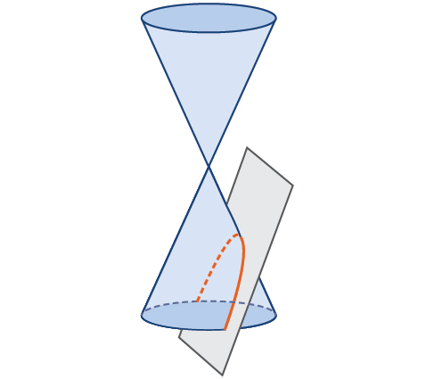{: #Figure_10_03_002}

Like the ellipse and **hyperbola**{: data-type="term" .no-emphasis}, the parabola can also be defined by a set of points in the coordinate plane. A parabola is the set of all points<math xmlns="http://www.w3.org/1998/Math/MathML"> <mrow> <mtext> </mtext><mrow><mo>(</mo> <mrow> <mi>x</mi><mo>,</mo><mi>y</mi> </mrow> <mo>)</mo></mrow> </mrow> </math>

 in a plane that are the same distance from a fixed line, called the **directrix**{: data-type="term"}, and a fixed point (the **focus**{: data-type="term"}) not on the directrix.

In [Quadratic Functions](/m49346){: .target-chapter}, we learned about a parabola’s vertex and axis of symmetry. Now we extend the discussion to include other key features of the parabola. See [\[link\]](#Figure_10_03_003). Notice that the axis of symmetry passes through the focus and vertex and is perpendicular to the directrix. The vertex is the midpoint between the directrix and the focus.

The line segment that passes through the focus and is parallel to the directrix is called the **latus rectum**{: data-type="term"}. The endpoints of the latus rectum lie on the curve. By definition, the distance<math xmlns="http://www.w3.org/1998/Math/MathML"> <mrow> <mtext> </mtext><mi>d</mi><mtext> </mtext> </mrow> </math>

from the focus to any point<math xmlns="http://www.w3.org/1998/Math/MathML"> <mrow> <mtext> </mtext><mi>P</mi><mtext> </mtext> </mrow> </math>

on the parabola is equal to the distance from<math xmlns="http://www.w3.org/1998/Math/MathML"> <mrow> <mtext> </mtext><mi>P</mi><mtext> </mtext> </mrow> </math>

to the directrix.

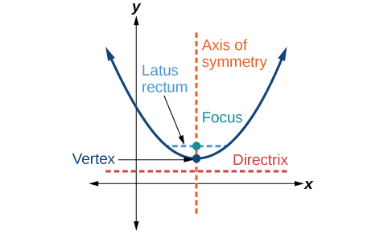{: #Figure_10_03_003}

To work with parabolas in the **coordinate plane**{: data-type="term" .no-emphasis}, we consider two cases: those with a vertex at the origin and those with a **vertex**{: data-type="term" .no-emphasis} at a point other than the origin. We begin with the former.

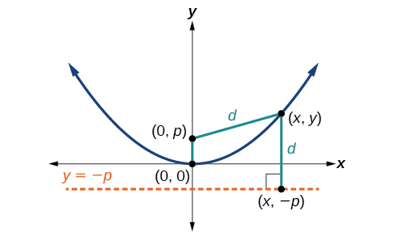{: #Figure_10_03_018}

Let<math xmlns="http://www.w3.org/1998/Math/MathML"> <mrow> <mtext> </mtext><mrow><mo>(</mo> <mrow> <mi>x</mi><mo>,</mo><mi>y</mi> </mrow> <mo>)</mo></mrow><mtext> </mtext> </mrow> </math>

be a point on the parabola with vertex<math xmlns="http://www.w3.org/1998/Math/MathML"> <mrow> <mtext> </mtext><mrow><mo>(</mo> <mrow> <mn>0</mn><mo>,</mo><mn>0</mn> </mrow> <mo>)</mo></mrow><mo>,</mo> </mrow> </math>

 focus<math xmlns="http://www.w3.org/1998/Math/MathML"> <mrow> <mtext> </mtext><mrow><mo>(</mo> <mrow> <mn>0</mn><mo>,</mo><mi>p</mi> </mrow> <mo>)</mo></mrow><mo>,</mo> </mrow> </math>

and directrix<math xmlns="http://www.w3.org/1998/Math/MathML"> <mrow> <mtext> </mtext><mi>y</mi><mo>= −</mo><mi>p</mi><mtext> </mtext> </mrow> </math>

 as shown in [\[link\]](#Figure_10_03_018). The distance<math xmlns="http://www.w3.org/1998/Math/MathML"> <mrow> <mtext> </mtext><mi>d</mi><mtext> </mtext> </mrow> </math>

from point<math xmlns="http://www.w3.org/1998/Math/MathML"> <mrow> <mtext> </mtext><mrow><mo>(</mo> <mrow> <mi>x</mi><mo>,</mo><mi>y</mi> </mrow> <mo>)</mo></mrow><mtext> </mtext> </mrow> </math>

to point<math xmlns="http://www.w3.org/1998/Math/MathML"> <mrow> <mtext> </mtext><mo stretchy="false">(</mo><mi>x</mi><mo>,</mo><mo>−</mo><mi>p</mi><mo stretchy="false">)</mo><mtext> </mtext> </mrow> </math>

 on the directrix is the difference of the *y*-values:<math xmlns="http://www.w3.org/1998/Math/MathML"> <mrow> <mtext> </mtext><mi>d</mi><mo>=</mo><mi>y</mi><mo>+</mo><mi>p</mi><mo>.</mo><mtext> </mtext> </mrow> </math>

The distance from the focus<math xmlns="http://www.w3.org/1998/Math/MathML"> <mrow> <mtext> </mtext><mo stretchy="false">(</mo><mn>0</mn><mo>,</mo><mi>p</mi><mo stretchy="false">)</mo><mtext> </mtext> </mrow> </math>

to the point<math xmlns="http://www.w3.org/1998/Math/MathML"> <mrow> <mtext> </mtext><mrow><mo>(</mo> <mrow> <mi>x</mi><mo>,</mo><mi>y</mi> </mrow> <mo>)</mo></mrow><mtext> </mtext> </mrow> </math>

is also equal to<math xmlns="http://www.w3.org/1998/Math/MathML"> <mrow> <mtext> </mtext><mi>d</mi><mtext> </mtext> </mrow> </math>

and can be expressed using the **distance formula**{: data-type="term" .no-emphasis}.

<math xmlns="http://www.w3.org/1998/Math/MathML" display="block"> <mrow> <mtable columnalign="left"> <mtr columnalign="left"> <mtd columnalign="left"> <mrow> <mi>d</mi><mo>=</mo><msqrt> <mrow> <msup> <mrow> <mo stretchy="false">(</mo><mi>x</mi><mo>−</mo><mn>0</mn><mo stretchy="false">)</mo> </mrow> <mn>2</mn> </msup> <mo>+</mo><msup> <mrow> <mo stretchy="false">(</mo><mi>y</mi><mo>−</mo><mi>p</mi><mo stretchy="false">)</mo> </mrow> <mn>2</mn> </msup> </mrow> </msqrt> </mrow> </mtd> </mtr> <mtr columnalign="left"> <mtd columnalign="left"> <mrow> <mtext> </mtext><mtext> </mtext><mtext> </mtext><mo>=</mo><msqrt> <mrow> <msup> <mi>x</mi> <mn>2</mn> </msup> <mo>+</mo><msup> <mrow> <mo stretchy="false">(</mo><mi>y</mi><mo>−</mo><mi>p</mi><mo stretchy="false">)</mo> </mrow> <mn>2</mn> </msup> </mrow> </msqrt> </mrow> </mtd> </mtr> </mtable> </mrow> </math>

Set the two expressions for<math xmlns="http://www.w3.org/1998/Math/MathML"> <mrow> <mtext> </mtext><mi>d</mi><mtext> </mtext> </mrow> </math>

equal to each other and solve for<math xmlns="http://www.w3.org/1998/Math/MathML"> <mrow> <mtext> </mtext><mi>y</mi><mtext> </mtext> </mrow> </math>

to derive the equation of the parabola. We do this because the distance from<math xmlns="http://www.w3.org/1998/Math/MathML"> <mrow> <mtext> </mtext><mrow><mo>(</mo> <mrow> <mi>x</mi><mo>,</mo><mi>y</mi> </mrow> <mo>)</mo></mrow><mtext> </mtext> </mrow> </math>

to<math xmlns="http://www.w3.org/1998/Math/MathML"> <mrow> <mtext> </mtext><mrow><mo>(</mo> <mrow> <mn>0</mn><mo>,</mo><mi>p</mi> </mrow> <mo>)</mo></mrow><mtext> </mtext> </mrow> </math>

equals the distance from<math xmlns="http://www.w3.org/1998/Math/MathML"> <mrow> <mtext> </mtext><mrow><mo>(</mo> <mrow> <mi>x</mi><mo>,</mo><mi>y</mi> </mrow> <mo>)</mo></mrow><mtext> </mtext> </mrow> </math>

to<math xmlns="http://www.w3.org/1998/Math/MathML"> <mrow> <mtext> </mtext><mo stretchy="false">(</mo><mi>x</mi><mo>, −</mo><mi>p</mi><mo stretchy="false">)</mo><mo>.</mo> </mrow> </math>

<math xmlns="http://www.w3.org/1998/Math/MathML"> <mrow> <msqrt> <mrow> <msup> <mi>x</mi> <mn>2</mn> </msup> <mo>+</mo><msup> <mrow> <mrow><mo>(</mo> <mrow> <mi>y</mi><mo>−</mo><mi>p</mi> </mrow> <mo>)</mo></mrow> </mrow> <mn>2</mn> </msup> </mrow> </msqrt> <mo>=</mo><mi>y</mi><mo>+</mo><mi>p</mi> </mrow> </math>

We then square both sides of the equation, expand the squared terms, and simplify by combining like terms.

<math xmlns="http://www.w3.org/1998/Math/MathML"> <mrow> <mtable> <mtr> <mtd> <mrow> <msup> <mi>x</mi> <mn>2</mn> </msup> <mo>+</mo><msup> <mrow> <mo stretchy="false">(</mo><mi>y</mi><mo>−</mo><mi>p</mi><mo stretchy="false">)</mo> </mrow> <mn>2</mn> </msup> <mo>=</mo><msup> <mrow> <mo stretchy="false">(</mo><mi>y</mi><mo>+</mo><mi>p</mi><mo stretchy="false">)</mo> </mrow> <mn>2</mn> </msup> </mrow> </mtd> </mtr> <mtr> <mtd> <mrow> <msup> <mi>x</mi> <mn>2</mn> </msup> <mo>+</mo><msup> <mi>y</mi> <mn>2</mn> </msup> <mo>−</mo><mn>2</mn><mi>p</mi><mi>y</mi><mo>+</mo><msup> <mi>p</mi> <mn>2</mn> </msup> <mo>=</mo><msup> <mi>y</mi> <mn>2</mn> </msup> <mo>+</mo><mn>2</mn><mi>p</mi><mi>y</mi><mo>+</mo><msup> <mi>p</mi> <mn>2</mn> </msup> </mrow> </mtd> </mtr> <mtr> <mtd> <mrow> <msup> <mi>x</mi> <mn>2</mn> </msup> <mo>−</mo><mn>2</mn><mi>p</mi><mi>y</mi><mo>=</mo><mn>2</mn><mi>p</mi><mi>y</mi> </mrow> </mtd> </mtr> <mtr> <mtd> <mrow> <mtext>          </mtext><msup> <mi>x</mi> <mn>2</mn> </msup> <mo>=</mo><mn>4</mn><mi>p</mi><mi>y</mi> </mrow> </mtd> </mtr> </mtable> </mrow> </math>

The equations of parabolas with vertex<math xmlns="http://www.w3.org/1998/Math/MathML"> <mrow> <mtext> </mtext><mrow><mo>(</mo> <mrow> <mn>0</mn><mo>,</mo><mn>0</mn> </mrow> <mo>)</mo></mrow><mtext> </mtext> </mrow> </math>

are<math xmlns="http://www.w3.org/1998/Math/MathML"> <mrow> <mtext> </mtext><msup> <mi>y</mi> <mn>2</mn> </msup> <mo>=</mo><mn>4</mn><mi>p</mi><mi>x</mi><mtext> </mtext> </mrow> </math>

when the *x*-axis is the axis of symmetry and<math xmlns="http://www.w3.org/1998/Math/MathML"> <mrow> <mtext> </mtext><msup> <mi>x</mi> <mn>2</mn> </msup> <mo>=</mo><mn>4</mn><mi>p</mi><mi>y</mi><mtext> </mtext> </mrow> </math>

when the *y*-axis is the axis of symmetry. These standard forms are given below, along with their general graphs and key features.

Standard Forms of Parabolas with Vertex (0, 0)

[\[link\]](#Table_10_03_01) and [\[link\]](#Figure_10_03_004abcd) summarize the standard features of parabolas with a vertex at the origin.

<table id="Table_10_03_01" summary=".."><colgroup><col data-align="center" /><col data-align="center" /><col data-align="center" /><col data-align="center" /><col data-align="center" /></colgroup><tbody>
            <tr>
              <td><strong>Axis of Symmetry</strong></td>
              <td><strong>Equation</strong></td>
              <td><strong>Focus</strong></td>
              <td><strong>Directrix</strong></td>
              <td><strong>Endpoints of Latus Rectum</strong>
             </td>
            </tr>
            <tr>
              <td><em>x</em>-axis</td>
              <td><math xmlns="http://www.w3.org/1998/Math/MathML">
                <mrow>
                  <msup>
                    <mi>y</mi>
                    <mn>2</mn>
                  </msup>
                  <mo>=</mo><mn>4</mn><mi>p</mi><mi>x</mi>
                </mrow>
              </math>
              </td>
              <td><math xmlns="http://www.w3.org/1998/Math/MathML">
                <mrow>
                  <mrow><mo>(</mo>
                    <mrow>
                      <mi>p</mi><mo>,</mo><mtext> </mtext><mn>0</mn>
                    </mrow>
                    <mo>)</mo></mrow>
                </mrow>
              </math>
              </td>
              <td><math xmlns="http://www.w3.org/1998/Math/MathML">
                <mrow>
                  <mi>x</mi><mo>=</mo><mo>−</mo><mi>p</mi>
                </mrow>
              </math>
              </td>
              <td><math xmlns="http://www.w3.org/1998/Math/MathML">
                <mrow>
                  <mrow><mo>(</mo>
                    <mrow>
                      <mi>p</mi><mo>,</mo><mtext> </mtext><mo>±</mo><mn>2</mn><mi>p</mi>
                    </mrow>
                    <mo>)</mo></mrow>
                </mrow>
              </math>
              </td>
            </tr>
            <tr>
              <td><em>y</em>-axis</td>
              <td><math xmlns="http://www.w3.org/1998/Math/MathML">
                <mrow>
                  <msup>
                    <mi>x</mi>
                    <mn>2</mn>
                  </msup>
                  <mo>=</mo><mn>4</mn><mi>p</mi><mi>y</mi>
                </mrow>
              </math>
              </td>
              <td><math xmlns="http://www.w3.org/1998/Math/MathML">
                <mrow>
                  <mrow><mo>(</mo>
                    <mrow>
                      <mn>0</mn><mo>,</mo><mtext> </mtext><mi>p</mi>
                    </mrow>
                    <mo>)</mo></mrow>
                </mrow>
              </math>
              </td>
              <td><math xmlns="http://www.w3.org/1998/Math/MathML">
                <mrow>
                  <mi>y</mi><mo>=</mo><mo>−</mo><mi>p</mi>
                </mrow>
              </math>
              </td>
              <td><math xmlns="http://www.w3.org/1998/Math/MathML">
                <mrow>
                  <mrow><mo>(</mo>
                    <mrow>
                      <mo>±</mo><mn>2</mn><mi>p</mi><mo>,</mo><mtext> </mtext><mi>p</mi>
                    </mrow>
                    <mo>)</mo></mrow>
                </mrow>
              </math>
              </td>
            </tr>
          </tbody></table>
 When&#10;          &#10;            &#x2009;p&gt;0&#x2009;&#10;          &#10;        and the axis of symmetry is the x-axis, the parabola opens right. (b) When&#10;          &#10;            &#x2009;p&lt;0&#x2009;&#10;          &#10;        and the axis of symmetry is the x-axis, the parabola opens left. (c) When&#10;          &#10;            &#x2009;p&lt;0&#x2009;&#10;          &#10;        and the axis of symmetry is the y-axis, the parabola opens up. (d) When&#10; &#10;  &#xA0;p&lt;0&#xA0;&#10; &#10;and the axis of symmetry is the y-axis, the parabola opens down."){: #Figure_10_03_004abcd}

The key features of a parabola are its vertex, axis of symmetry, focus, directrix, and latus rectum. See [\[link\]](#Figure_10_03_004abcd). When given a standard equation for a parabola centered at the origin, we can easily identify the key features to graph the parabola.

A line is said to be tangent to a curve if it intersects the curve at exactly one point. If we sketch lines tangent to the parabola at the endpoints of the latus rectum, these lines intersect on the axis of symmetry, as shown in [\[link\]](#Figure_10_03_005).

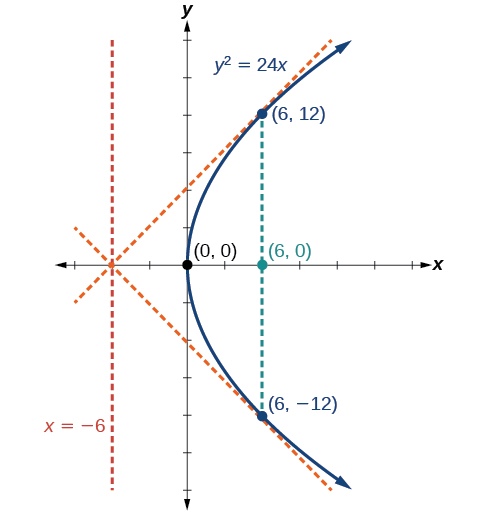{: #Figure_10_03_005}

**Given a standard form equation for a parabola centered at (0, 0), sketch the graph.**

1.  Determine which of the standard forms applies to the given equation:
    <math xmlns="http://www.w3.org/1998/Math/MathML"> <mrow> <mtext> </mtext><msup> <mi>y</mi> <mn>2</mn> </msup> <mo>=</mo><mn>4</mn><mi>p</mi><mi>x</mi><mtext> </mtext> </mrow> </math>
    
    or
    <math xmlns="http://www.w3.org/1998/Math/MathML"> <mrow> <mtext> </mtext><msup> <mi>x</mi> <mn>2</mn> </msup> <mo>=</mo><mn>4</mn><mi>p</mi><mi>y</mi><mo>.</mo> </mrow> </math>

2.  Use the standard form identified in Step 1 to determine the axis of symmetry, focus, equation of the directrix, and endpoints of the latus rectum.
    1.  If the equation is in the form
        <math xmlns="http://www.w3.org/1998/Math/MathML"> <mrow> <mtext> </mtext><msup> <mi>y</mi> <mn>2</mn> </msup> <mo>=</mo><mn>4</mn><mi>p</mi><mi>x</mi><mo>,</mo> </mrow> </math>
        
        then
        * the axis of symmetry is the *x*-axis,
          <math xmlns="http://www.w3.org/1998/Math/MathML"> <mrow> <mtext> </mtext><mi>y</mi><mo>=</mo><mn>0</mn> </mrow> </math>
        
        * set
          <math xmlns="http://www.w3.org/1998/Math/MathML"> <mrow> <mtext> </mtext><mn>4</mn><mi>p</mi><mtext> </mtext> </mrow> </math>
          
          equal to the coefficient of <em>x </em>in the given equation to solve for
          <math xmlns="http://www.w3.org/1998/Math/MathML"> <mrow> <mtext> </mtext><mi>p</mi><mo>.</mo><mtext> </mtext> </mrow> </math>
          
          If
          <math xmlns="http://www.w3.org/1998/Math/MathML"> <mrow> <mtext> </mtext><mi>p</mi><mo>&gt;</mo><mn>0</mn><mo>,</mo> </mrow> </math>
          
          the parabola opens right. If
          <math xmlns="http://www.w3.org/1998/Math/MathML"> <mrow> <mtext> </mtext><mi>p</mi><mo>&lt;</mo><mn>0</mn><mo>,</mo> </mrow> </math>
          
          the parabola opens left.
        * use
          <math xmlns="http://www.w3.org/1998/Math/MathML"> <mrow> <mtext> </mtext><mi>p</mi><mtext>  </mtext> </mrow> </math>
          
          to find the coordinates of the focus,
          <math xmlns="http://www.w3.org/1998/Math/MathML"> <mrow> <mtext> </mtext><mrow><mo>(</mo> <mrow> <mi>p</mi><mo>,</mo><mn>0</mn> </mrow> <mo>)</mo></mrow> </mrow> </math>
        
        * use
          <math xmlns="http://www.w3.org/1998/Math/MathML"> <mrow> <mtext> </mtext><mi>p</mi><mtext> </mtext> </mrow> </math>
          
          to find the equation of the directrix,
          <math xmlns="http://www.w3.org/1998/Math/MathML"> <mrow> <mtext> </mtext><mi>x</mi><mo>=</mo><mo>−</mo><mi>p</mi> </mrow> </math>
        
        * use
          <math xmlns="http://www.w3.org/1998/Math/MathML"> <mrow> <mtext> </mtext><mi>p</mi><mtext> </mtext> </mrow> </math>
          
          to find the endpoints of the latus rectum,
          <math xmlns="http://www.w3.org/1998/Math/MathML"> <mrow> <mtext> </mtext><mrow><mo>(</mo> <mrow> <mi>p</mi><mo>,</mo><mo>±</mo><mn>2</mn><mi>p</mi> </mrow> <mo>)</mo></mrow><mo>.</mo><mtext> </mtext> </mrow> </math>
          
          Alternately, substitute
          <math xmlns="http://www.w3.org/1998/Math/MathML"> <mrow> <mtext> </mtext><mi>x</mi><mo>=</mo><mi>p</mi><mtext> </mtext> </mrow> </math>
          
          into the original equation.
    
    2.  If the equation is in the form
        <math xmlns="http://www.w3.org/1998/Math/MathML"> <mrow> <mtext> </mtext><msup> <mi>x</mi> <mn>2</mn> </msup> <mo>=</mo><mn>4</mn><mi>p</mi><mi>y</mi><mo>,</mo> </mrow> </math>
        
        then
        * the axis of symmetry is the *y*-axis,
          <math xmlns="http://www.w3.org/1998/Math/MathML"> <mrow> <mtext> </mtext><mi>x</mi><mo>=</mo><mn>0</mn> </mrow> </math>
        
        * set
          <math xmlns="http://www.w3.org/1998/Math/MathML"> <mrow> <mtext> </mtext><mn>4</mn><mi>p</mi><mtext> </mtext> </mrow> </math>
          
          equal to the coefficient of <em>y </em>in the given equation to solve for
          <math xmlns="http://www.w3.org/1998/Math/MathML"> <mrow> <mtext> </mtext><mi>p</mi><mo>.</mo><mtext> </mtext> </mrow> </math>
          
          If
          <math xmlns="http://www.w3.org/1998/Math/MathML"> <mrow> <mtext> </mtext><mi>p</mi><mo>&gt;</mo><mn>0</mn><mo>,</mo> </mrow> </math>
          
          the parabola opens up. If
          <math xmlns="http://www.w3.org/1998/Math/MathML"> <mrow> <mtext> </mtext><mi>p</mi><mo>&lt;</mo><mn>0</mn><mo>,</mo> </mrow> </math>
          
          the parabola opens down.
        * use
          <math xmlns="http://www.w3.org/1998/Math/MathML"> <mrow> <mtext> </mtext><mi>p</mi><mtext> </mtext> </mrow> </math>
          
          to find the coordinates of the focus,
          <math xmlns="http://www.w3.org/1998/Math/MathML"> <mrow> <mtext> </mtext><mrow><mo>(</mo> <mrow> <mn>0</mn><mo>,</mo><mi>p</mi> </mrow> <mo>)</mo></mrow> </mrow> </math>
        
        * use
          <math xmlns="http://www.w3.org/1998/Math/MathML"> <mrow> <mtext> </mtext><mi>p</mi><mtext> </mtext> </mrow> </math>
          
          to find equation of the directrix,
          <math xmlns="http://www.w3.org/1998/Math/MathML"> <mrow> <mtext> </mtext><mi>y</mi><mo>=</mo><mo>−</mo><mi>p</mi> </mrow> </math>
        
        * use
          <math xmlns="http://www.w3.org/1998/Math/MathML"> <mrow> <mtext> </mtext><mi>p</mi><mtext> </mtext> </mrow> </math>
          
          to find the endpoints of the latus rectum,
          <math xmlns="http://www.w3.org/1998/Math/MathML"> <mrow> <mtext> </mtext><mrow><mo>(</mo> <mrow> <mo>±</mo><mn>2</mn><mi>p</mi><mo>,</mo><mi>p</mi> </mrow> <mo>)</mo></mrow> </mrow> </math>
    {: data-number-style="lower-alpha"}

3.  Plot the focus, directrix, and latus rectum, and draw a smooth curve to form the parabola.
{: data-number-style="arabic"}

Graphing a Parabola with Vertex (0, 0) and the *x*-axis as the Axis of Symmetry

Graph<math xmlns="http://www.w3.org/1998/Math/MathML"> <mrow> <mtext> </mtext><msup> <mi>y</mi> <mn>2</mn> </msup> <mo>=</mo><mn>24</mn><mi>x</mi><mo>.</mo><mtext> </mtext> </mrow> </math>

Identify and label the **focus**{: data-type="term" .no-emphasis}, **directrix**{: data-type="term" .no-emphasis}, and endpoints of the **latus rectum**{: data-type="term" .no-emphasis}.

The standard form that applies to the given equation is<math xmlns="http://www.w3.org/1998/Math/MathML"> <mrow> <mtext> </mtext><msup> <mi>y</mi> <mn>2</mn> </msup> <mo>=</mo><mn>4</mn><mi>p</mi><mi>x</mi><mo>.</mo><mtext> </mtext> </mrow> </math>

Thus, the axis of symmetry is the *x*-axis. It follows that: 

<math xmlns="http://www.w3.org/1998/Math/MathML"> <mrow> <mn>24</mn><mo>=</mo><mn>4</mn><mi>p</mi><mo>,</mo> </mrow> </math>
so
<math xmlns="http://www.w3.org/1998/Math/MathML"> <mrow> <mtext> </mtext><mi>p</mi><mo>=</mo><mn>6.</mn><mtext> </mtext> </mrow> </math>
Since
<math xmlns="http://www.w3.org/1998/Math/MathML"> <mrow> <mtext> </mtext><mi>p</mi><mo>&gt;</mo><mn>0</mn><mo>,</mo> </mrow> </math>
the parabola opens right

the coordinates of the focus are
<math xmlns="http://www.w3.org/1998/Math/MathML"> <mrow> <mtext> </mtext><mrow><mo>(</mo> <mrow> <mi>p</mi><mo>,</mo><mn>0</mn> </mrow> <mo>)</mo></mrow><mo>=</mo><mrow><mo>(</mo> <mrow> <mn>6</mn><mo>,</mo><mn>0</mn> </mrow> <mo>)</mo></mrow> </mrow> </math>

the equation of the directrix is
<math xmlns="http://www.w3.org/1998/Math/MathML"> <mrow> <mtext> </mtext><mi>x</mi><mo>=</mo><mo>−</mo><mi>p</mi><mo>=</mo><mo>−</mo><mn>6</mn> </mrow> </math>

the endpoints of the latus rectum have the same *x*-coordinate at the focus. To find the endpoints, substitute
<math xmlns="http://www.w3.org/1998/Math/MathML"> <mrow> <mtext> </mtext><mi>x</mi><mo>=</mo><mn>6</mn> <mtext>  </mtext> </mrow> </math>
into the original equation:
<math xmlns="http://www.w3.org/1998/Math/MathML"> <mrow> <mtext> </mtext><mrow><mo>(</mo> <mrow> <mn>6,</mn><mo>±</mo><mn>12</mn> </mrow> <mo>)</mo></mrow> </mrow> </math>

Next we plot the focus, directrix, and latus rectum, and draw a smooth curve to form the **parabola**{: data-type="term" .no-emphasis}. [[link]](#Figure_10_03_019)

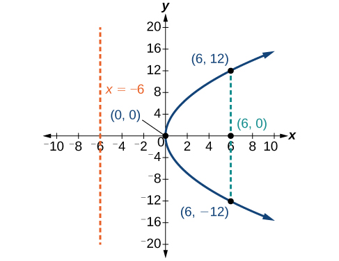{: #Figure_10_03_019}

Graph<math xmlns="http://www.w3.org/1998/Math/MathML"> <mrow> <mtext> </mtext><msup> <mi>y</mi> <mn>2</mn> </msup> <mo>=</mo><mn>−16</mn><mi>x</mi><mo>.</mo><mtext> </mtext> </mrow> </math>

Identify and label the focus, directrix, and endpoints of the latus rectum.

Focus:<math xmlns="http://www.w3.org/1998/Math/MathML"> <mrow> <mtext> </mtext><mrow><mo>(</mo> <mrow> <mo>−</mo><mn>4</mn><mo>,</mo><mn>0</mn> </mrow> <mo>)</mo></mrow><mo>;</mo><mtext> </mtext> </mrow> </math>

Directrix:<math xmlns="http://www.w3.org/1998/Math/MathML"> <mrow> <mtext> </mtext><mi>x</mi><mo>=</mo><mn>4</mn><mo>;</mo><mtext> </mtext> </mrow> </math>

Endpoints of the latus rectum:<math xmlns="http://www.w3.org/1998/Math/MathML"> <mrow> <mtext> </mtext><mrow><mo>(</mo> <mrow> <mo>−</mo><mn>4</mn><mo>,</mo><mo>±</mo><mn>8</mn> </mrow> <mo>)</mo></mrow> </mrow> </math>

 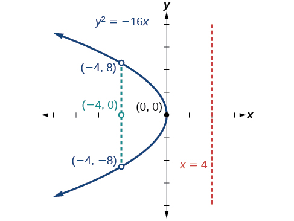 

Graphing a Parabola with Vertex (0, 0) and the *y*-axis as the Axis of Symmetry

Graph<math xmlns="http://www.w3.org/1998/Math/MathML"> <mrow> <mtext> </mtext><msup> <mi>x</mi> <mn>2</mn> </msup> <mo>=</mo><mn>−6</mn><mi>y</mi><mo>.</mo><mtext> </mtext> </mrow> </math>

Identify and label the **focus**{: data-type="term" .no-emphasis}, **directrix**{: data-type="term" .no-emphasis}, and endpoints of the **latus rectum**{: data-type="term" .no-emphasis}.

The standard form that applies to the given equation is<math xmlns="http://www.w3.org/1998/Math/MathML"> <mrow> <mtext> </mtext><msup> <mi>x</mi> <mn>2</mn> </msup> <mo>=</mo><mn>4</mn><mi>p</mi><mi>y</mi><mo>.</mo><mtext> </mtext> </mrow> </math>

Thus, the axis of symmetry is the *y*-axis. It follows that: 

<math xmlns="http://www.w3.org/1998/Math/MathML"> <mrow> <mo>−</mo><mn>6</mn><mo>=</mo><mn>4</mn><mi>p</mi><mo>,</mo> </mrow> </math>
so
<math xmlns="http://www.w3.org/1998/Math/MathML"> <mrow> <mtext> </mtext><mi>p</mi><mo>=</mo><mo>−</mo><mfrac> <mn>3</mn> <mn>2</mn> </mfrac> <mo>.</mo><mtext> </mtext> </mrow> </math>
Since
<math xmlns="http://www.w3.org/1998/Math/MathML"> <mrow> <mtext> </mtext><mi>p</mi><mo>&lt;</mo><mn>0</mn><mo>,</mo> </mrow> </math>
the parabola opens down.

the coordinates of the focus are
<math xmlns="http://www.w3.org/1998/Math/MathML"> <mrow> <mtext> </mtext><mrow><mo>(</mo> <mrow> <mn>0</mn><mo>,</mo><mi>p</mi> </mrow> <mo>)</mo></mrow><mo>=</mo><mrow><mo>(</mo> <mrow> <mn>0</mn><mo>,</mo><mo>−</mo><mfrac> <mn>3</mn> <mn>2</mn> </mfrac> </mrow> <mo>)</mo></mrow> </mrow> </math>

the equation of the directrix is
<math xmlns="http://www.w3.org/1998/Math/MathML"> <mrow> <mtext> </mtext><mi>y</mi><mo>=</mo><mo>−</mo><mi>p</mi><mo>=</mo><mfrac> <mn>3</mn> <mn>2</mn> </mfrac> </mrow> </math>

the endpoints of the latus rectum can be found by substituting
<math xmlns="http://www.w3.org/1998/Math/MathML"> <mrow> <mtext> </mtext><mi>y</mi><mo>=</mo><mfrac> <mn>3</mn> <mn>2</mn> </mfrac> <mtext> </mtext> </mrow> </math>
into the original equation,
<math xmlns="http://www.w3.org/1998/Math/MathML"> <mrow> <mtext> </mtext><mrow><mo>(</mo> <mrow> <mo>±</mo><mn>3</mn><mo>,</mo><mo>−</mo><mfrac> <mn>3</mn> <mn>2</mn> </mfrac> </mrow> <mo>)</mo></mrow> </mrow> </math>

Next we plot the focus, directrix, and latus rectum, and draw a smooth curve to form the **parabola**{: data-type="term" .no-emphasis}.

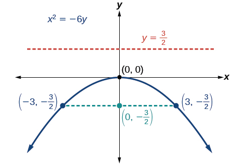{: #Figure_10_03_007}

Graph<math xmlns="http://www.w3.org/1998/Math/MathML"> <mrow> <mtext> </mtext><msup> <mi>x</mi> <mn>2</mn> </msup> <mo>=</mo><mn>8</mn><mi>y</mi><mo>.</mo><mtext> </mtext> </mrow> </math>

Identify and label the focus, directrix, and endpoints of the latus rectum.

Focus:<math xmlns="http://www.w3.org/1998/Math/MathML"> <mrow> <mtext> </mtext><mrow><mo>(</mo> <mrow> <mn>0</mn><mo>,</mo><mn>2</mn> </mrow> <mo>)</mo></mrow><mo>;</mo><mtext> </mtext> </mrow> </math>

Directrix:<math xmlns="http://www.w3.org/1998/Math/MathML"> <mrow> <mtext> </mtext><mi>y</mi><mo>=</mo><mn>−2</mn><mo>;</mo><mtext> </mtext> </mrow> </math>

Endpoints of the latus rectum:<math xmlns="http://www.w3.org/1998/Math/MathML"> <mrow> <mtext> </mtext><mrow><mo>(</mo> <mrow> <mo>±</mo><mn>4</mn><mo>,</mo><mn>2</mn> </mrow> <mo>)</mo></mrow><mo>.</mo> </mrow> </math>

 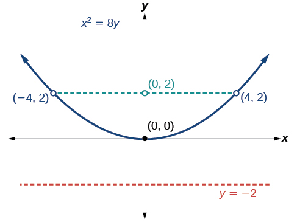 

#  Writing Equations of Parabolas in Standard Form

In the previous examples, we used the standard form equation of a parabola to calculate the locations of its key features. We can also use the calculations in reverse to write an equation for a parabola when given its key features.

**Given its focus and directrix, write the equation for a parabola in standard form.**

1.  Determine whether the axis of symmetry is the *x*- or *y*-axis.
    1.  If the given coordinates of the focus have the form
        <math xmlns="http://www.w3.org/1998/Math/MathML"> <mrow> <mtext> </mtext><mrow><mo>(</mo> <mrow> <mi>p</mi><mo>,</mo><mn>0</mn> </mrow> <mo>)</mo></mrow><mo>,</mo> </mrow> </math>
        
        then the axis of symmetry is the *x*-axis. Use the standard form
        <math xmlns="http://www.w3.org/1998/Math/MathML"> <mrow> <mtext> </mtext><msup> <mi>y</mi> <mn>2</mn> </msup> <mo>=</mo><mn>4</mn><mi>p</mi><mi>x</mi><mo>.</mo> </mrow> </math>
    
    2.  If the given coordinates of the focus have the form
        <math xmlns="http://www.w3.org/1998/Math/MathML"> <mrow> <mtext> </mtext><mrow><mo>(</mo> <mrow> <mn>0</mn><mo>,</mo><mi>p</mi> </mrow> <mo>)</mo></mrow><mo>,</mo> </mrow> </math>
        
        then the axis of symmetry is the *y*-axis. Use the standard form
        <math xmlns="http://www.w3.org/1998/Math/MathML"> <mrow> <mtext> </mtext><msup> <mi>x</mi> <mn>2</mn> </msup> <mo>=</mo><mn>4</mn><mi>p</mi><mi>y</mi><mo>.</mo> </mrow> </math>
    {: data-number-style="lower-alpha"}

2.  Multiply
    <math xmlns="http://www.w3.org/1998/Math/MathML"> <mrow> <mtext> </mtext><mn>4</mn><mi>p</mi><mo>.</mo> </mrow> </math>

3.  Substitute the value from Step 2 into the equation determined in Step 1.
{: data-number-style="arabic"}

Writing the Equation of a Parabola in Standard Form Given its Focus and Directrix

What is the equation for the **parabola**{: data-type="term" .no-emphasis} with **focus**{: data-type="term" .no-emphasis}<math xmlns="http://www.w3.org/1998/Math/MathML"> <mrow> <mtext> </mtext><mrow><mo>(</mo> <mrow> <mo>−</mo><mfrac> <mn>1</mn> <mn>2</mn> </mfrac> <mo>,</mo><mn>0</mn> </mrow> <mo>)</mo></mrow><mtext> </mtext> </mrow> </math>

and **directrix**{: data-type="term" .no-emphasis}<math xmlns="http://www.w3.org/1998/Math/MathML"> <mrow> <mtext> </mtext><mi>x</mi><mo>=</mo><mfrac> <mn>1</mn> <mn>2</mn> </mfrac> <mo>?</mo> </mrow> </math>

The focus has the form<math xmlns="http://www.w3.org/1998/Math/MathML"> <mrow> <mtext> </mtext><mrow><mo>(</mo> <mrow> <mi>p</mi><mo>,</mo><mn>0</mn> </mrow> <mo>)</mo></mrow><mo>,</mo> </mrow> </math>

 so the equation will have the form<math xmlns="http://www.w3.org/1998/Math/MathML"> <mrow> <mtext> </mtext><msup> <mi>y</mi> <mn>2</mn> </msup> <mo>=</mo><mn>4</mn><mi>p</mi><mi>x</mi><mo>.</mo> </mrow> </math>

 

Multiplying
<math xmlns="http://www.w3.org/1998/Math/MathML"> <mrow> <mtext> </mtext><mn>4</mn><mi>p</mi><mo>,</mo> </mrow> </math>
we have
<math xmlns="http://www.w3.org/1998/Math/MathML"> <mrow> <mtext> </mtext><mn>4</mn><mi>p</mi><mo>=</mo><mn>4</mn><mrow><mo>(</mo> <mrow> <mo>−</mo><mfrac> <mn>1</mn> <mn>2</mn> </mfrac> </mrow> <mo>)</mo></mrow><mo>=</mo><mn>−2.</mn> </mrow> </math>

Substituting for
<math xmlns="http://www.w3.org/1998/Math/MathML"> <mrow> <mtext> </mtext><mn>4</mn><mi>p</mi><mo>,</mo> </mrow> </math>
we have
<math xmlns="http://www.w3.org/1998/Math/MathML"> <mrow> <mtext> </mtext><msup> <mi>y</mi> <mn>2</mn> </msup> <mo>=</mo><mn>4</mn><mi>p</mi><mi>x</mi><mo>=</mo><mn>−2</mn><mi>x</mi><mo>.</mo> </mrow> </math>

Therefore, the equation for the parabola is<math xmlns="http://www.w3.org/1998/Math/MathML"> <mrow> <mtext> </mtext><msup> <mi>y</mi> <mn>2</mn> </msup> <mo>=</mo><mn>−2</mn><mi>x</mi><mo>.</mo> </mrow> </math>

What is the equation for the parabola with focus<math xmlns="http://www.w3.org/1998/Math/MathML"> <mrow> <mtext> </mtext><mrow><mo>(</mo> <mrow> <mn>0</mn><mo>,</mo><mfrac> <mn>7</mn> <mn>2</mn> </mfrac> </mrow> <mo>)</mo></mrow><mtext> </mtext> </mrow> </math>

and directrix<math xmlns="http://www.w3.org/1998/Math/MathML"> <mrow> <mtext> </mtext><mi>y</mi><mo>=</mo><mo>−</mo><mfrac> <mn>7</mn> <mn>2</mn> </mfrac> <mo>?</mo> </mrow> </math>

<math xmlns="http://www.w3.org/1998/Math/MathML"> <mrow> <msup> <mi>x</mi> <mn>2</mn> </msup> <mo>=</mo><mn>14</mn><mi>y</mi><mo>.</mo> </mrow> </math>

# Graphing Parabolas with Vertices Not at the Origin

Like other graphs we’ve worked with, the graph of a parabola can be translated. If a parabola is translated<math xmlns="http://www.w3.org/1998/Math/MathML"> <mrow> <mtext> </mtext><mi>h</mi><mtext> </mtext> </mrow> </math>

units horizontally and<math xmlns="http://www.w3.org/1998/Math/MathML"> <mrow> <mtext> </mtext><mi>k</mi><mtext> </mtext> </mrow> </math>

units vertically, the vertex will be<math xmlns="http://www.w3.org/1998/Math/MathML"> <mrow> <mtext> </mtext><mrow><mo>(</mo> <mrow> <mi>h</mi><mo>,</mo><mi>k</mi> </mrow> <mo>)</mo></mrow><mo>.</mo><mtext> </mtext> </mrow> </math>

This translation results in the standard form of the equation we saw previously with<math xmlns="http://www.w3.org/1998/Math/MathML"> <mrow> <mtext> </mtext><mi>x</mi><mtext> </mtext> </mrow> </math>

replaced by<math xmlns="http://www.w3.org/1998/Math/MathML"> <mrow> <mtext> </mtext><mrow><mo>(</mo> <mrow> <mi>x</mi><mo>−</mo><mi>h</mi> </mrow> <mo>)</mo></mrow><mtext> </mtext> </mrow> </math>

and<math xmlns="http://www.w3.org/1998/Math/MathML"> <mrow> <mtext> </mtext><mi>y</mi><mtext> </mtext> </mrow> </math>

replaced by<math xmlns="http://www.w3.org/1998/Math/MathML"> <mrow> <mtext> </mtext><mrow><mo>(</mo> <mrow> <mi>y</mi><mo>−</mo><mi>k</mi> </mrow> <mo>)</mo></mrow><mo>.</mo> </mrow> </math>

To graph parabolas with a vertex<math xmlns="http://www.w3.org/1998/Math/MathML"> <mrow> <mtext> </mtext><mrow><mo>(</mo> <mrow> <mi>h</mi><mo>,</mo><mi>k</mi> </mrow> <mo>)</mo></mrow><mtext> </mtext> </mrow> </math>

other than the origin, we use the standard form<math xmlns="http://www.w3.org/1998/Math/MathML"> <mrow> <mtext> </mtext><msup> <mrow> <mrow><mo>(</mo> <mrow> <mi>y</mi><mo>−</mo><mi>k</mi> </mrow> <mo>)</mo></mrow> </mrow> <mn>2</mn> </msup> <mo>=</mo><mn>4</mn><mi>p</mi><mrow><mo>(</mo> <mrow> <mi>x</mi><mo>−</mo><mi>h</mi> </mrow> <mo>)</mo></mrow><mtext> </mtext> </mrow> </math>

for parabolas that have an axis of symmetry parallel to the *x*-axis, and<math xmlns="http://www.w3.org/1998/Math/MathML"> <mrow> <mtext> </mtext><msup> <mrow> <mrow><mo>(</mo> <mrow> <mi>x</mi><mo>−</mo><mi>h</mi> </mrow> <mo>)</mo></mrow> </mrow> <mn>2</mn> </msup> <mo>=</mo><mn>4</mn><mi>p</mi><mrow><mo>(</mo> <mrow> <mi>y</mi><mo>−</mo><mi>k</mi> </mrow> <mo>)</mo></mrow><mtext> </mtext> </mrow> </math>

for parabolas that have an axis of symmetry parallel to the *y*-axis. These standard forms are given below, along with their general graphs and key features.

Standard Forms of Parabolas with Vertex (*h*, *k*)

[\[link\]](#fs-id1219907) and [\[link\]](#Figure_10_03_009) summarize the standard features of parabolas with a vertex at a point<math xmlns="http://www.w3.org/1998/Math/MathML"> <mrow> <mtext> </mtext><mrow><mo>(</mo> <mrow> <mi>h</mi><mo>,</mo><mi>k</mi> </mrow> <mo>)</mo></mrow><mo>.</mo> </mrow> </math>

<table summary=".."><colgroup><col data-align="center" /><col data-align="center" /><col data-align="center" /><col data-align="center" /><col data-align="center" /></colgroup><tbody>
            <tr>
              <td><strong>Axis of Symmetry</strong></td>
              <td><strong>Equation</strong></td>
              <td><strong>Focus</strong></td>
              <td><strong>Directrix</strong></td>
              <td><strong>Endpoints of Latus Rectum</strong></td>
            </tr>           
 <tr>
              <td><math xmlns="http://www.w3.org/1998/Math/MathML">
                <mrow>
                  <mi>y</mi><mo>=</mo><mi>k</mi>
                </mrow>
              </math>
              </td>
              <td><math xmlns="http://www.w3.org/1998/Math/MathML">
                <mrow>
                  <msup>
                    <mrow>
                      <mrow><mo>(</mo>
                        <mrow>
                          <mi>y</mi><mo>−</mo><mi>k</mi>
                        </mrow>
                        <mo>)</mo></mrow>
                    </mrow>
                    <mn>2</mn>
                  </msup>
                  <mo>=</mo><mn>4</mn><mi>p</mi><mrow><mo>(</mo>
                    <mrow>
                      <mi>x</mi><mo>−</mo><mi>h</mi>
                    </mrow>
                    <mo>)</mo></mrow>
                </mrow>
              </math>
              </td>
              <td><math xmlns="http://www.w3.org/1998/Math/MathML">
                <mrow>
                  <mrow><mo>(</mo>
                    <mrow>
                      <mi>h</mi><mo>+</mo><mi>p</mi><mo>,</mo><mtext> </mtext><mi>k</mi>
                    </mrow>
                    <mo>)</mo></mrow>
                </mrow>
              </math>
              </td>
              <td><math xmlns="http://www.w3.org/1998/Math/MathML">
                <mrow>
                  <mi>x</mi><mo>=</mo><mi>h</mi><mo>−</mo><mi>p</mi>
                </mrow>
              </math>
              </td>
              <td><math xmlns="http://www.w3.org/1998/Math/MathML">
                <mrow>
                  <mrow><mo>(</mo>
                    <mrow>
                      <mi>h</mi><mo>+</mo><mi>p</mi><mo>,</mo><mtext> </mtext><mi>k</mi><mo>±</mo><mn>2</mn><mi>p</mi>
                    </mrow>
                    <mo>)</mo></mrow>
                </mrow>
              </math>
              </td>
            </tr>
            <tr>
              <td><math xmlns="http://www.w3.org/1998/Math/MathML">
                <mrow>
                  <mi>x</mi><mo>=</mo><mi>h</mi>
                </mrow>
              </math>
              </td>
              <td><math xmlns="http://www.w3.org/1998/Math/MathML">
                <mrow>
                  <msup>
                    <mrow>
                      <mrow><mo>(</mo>
                        <mrow>
                          <mi>x</mi><mo>−</mo><mi>h</mi>
                        </mrow>
                        <mo>)</mo></mrow>
                    </mrow>
                    <mn>2</mn>
                  </msup>
                  <mo>=</mo><mn>4</mn><mi>p</mi><mrow><mo>(</mo>
                    <mrow>
                      <mi>y</mi><mo>−</mo><mi>k</mi>
                    </mrow>
                    <mo>)</mo></mrow>
                </mrow>
              </math>
              </td>
              <td><math xmlns="http://www.w3.org/1998/Math/MathML">
                <mrow>
                  <mrow><mo>(</mo>
                    <mrow>
                      <mi>h</mi><mo>,</mo><mtext> </mtext><mi>k</mi><mo>+</mo><mi>p</mi>
                    </mrow>
                    <mo>)</mo></mrow>
                </mrow>
              </math>
              </td>
              <td><math xmlns="http://www.w3.org/1998/Math/MathML">
                <mrow>
                  <mi>y</mi><mo>=</mo><mi>k</mi><mo>−</mo><mi>p</mi>
                </mrow>
              </math>
              </td>
              <td><math xmlns="http://www.w3.org/1998/Math/MathML">
                <mrow>
                  <mrow><mo>(</mo>
                    <mrow>
                      <mi>h</mi><mo>±</mo><mn>2</mn><mi>p</mi><mo>,</mo><mtext> </mtext><mi>k</mi><mo>+</mo><mi>p</mi>
                    </mrow>
                    <mo>)</mo></mrow>
                </mrow>
              </math>
              </td>
            </tr>
          </tbody></table>
 When&#10;          &#10;            &#x2009;p&gt;0,&#10;          &#10;         the parabola opens right. (b) When&#10;          &#10;            &#x2009;p&lt;0,&#10;          &#10;         the parabola opens left. (c) When&#10;          &#10;            &#x2009;p&gt;0,&#10;          &#10;        the parabola opens up. (d) When&#10;          &#10;            &#x2009;p&lt;0,&#10;          &#10;         the parabola opens down."){: #Figure_10_03_009}

**Given a standard form equation for a parabola centered at (*h*, *k*), sketch the graph.**

1.  Determine which of the standard forms applies to the given equation:
    <math xmlns="http://www.w3.org/1998/Math/MathML"> <mrow> <mtext> </mtext><msup> <mrow> <mrow><mo>(</mo> <mrow> <mi>y</mi><mo>−</mo><mi>k</mi> </mrow> <mo>)</mo></mrow> </mrow> <mn>2</mn> </msup> <mo>=</mo><mn>4</mn><mi>p</mi><mrow><mo>(</mo> <mrow> <mi>x</mi><mo>−</mo><mi>h</mi> </mrow> <mo>)</mo></mrow><mtext> </mtext> </mrow> </math>
    
    or
    <math xmlns="http://www.w3.org/1998/Math/MathML"> <mrow> <mtext> </mtext><msup> <mrow> <mrow><mo>(</mo> <mrow> <mi>x</mi><mo>−</mo><mi>h</mi> </mrow> <mo>)</mo></mrow> </mrow> <mn>2</mn> </msup> <mo>=</mo><mn>4</mn><mi>p</mi><mrow><mo>(</mo> <mrow> <mi>y</mi><mo>−</mo><mi>k</mi> </mrow> <mo>)</mo></mrow><mo>.</mo> </mrow> </math>

2.  Use the standard form identified in Step 1 to determine the vertex, axis of symmetry, focus, equation of the directrix, and endpoints of the latus rectum.
    1.  If the equation is in the form
        <math xmlns="http://www.w3.org/1998/Math/MathML"> <mrow> <mtext> </mtext><msup> <mrow> <mrow><mo>(</mo> <mrow> <mi>y</mi><mo>−</mo><mi>k</mi> </mrow> <mo>)</mo></mrow> </mrow> <mn>2</mn> </msup> <mo>=</mo><mn>4</mn><mi>p</mi><mrow><mo>(</mo> <mrow> <mi>x</mi><mo>−</mo><mi>h</mi> </mrow> <mo>)</mo></mrow><mo>,</mo> </mrow> </math>
        
        then:
        * use the given equation to identify
          <math xmlns="http://www.w3.org/1998/Math/MathML"> <mrow> <mtext> </mtext><mi>h</mi><mtext>  </mtext> </mrow> </math>
          
          and
          <math xmlns="http://www.w3.org/1998/Math/MathML"> <mrow> <mtext> </mtext><mi>k</mi><mtext> </mtext> </mrow> </math>
          
          for the vertex,
          <math xmlns="http://www.w3.org/1998/Math/MathML"> <mrow> <mtext> </mtext><mrow><mo>(</mo> <mrow> <mi>h</mi><mo>,</mo><mi>k</mi> </mrow> <mo>)</mo></mrow> </mrow> </math>
        
        * use the value of
          <math xmlns="http://www.w3.org/1998/Math/MathML"> <mrow> <mtext> </mtext><mi>k</mi><mtext> </mtext> </mrow> </math>
          
          to determine the axis of symmetry,
          <math xmlns="http://www.w3.org/1998/Math/MathML"> <mrow> <mtext> </mtext><mi>y</mi><mo>=</mo><mi>k</mi> </mrow> </math>
        
        * set
          <math xmlns="http://www.w3.org/1998/Math/MathML"> <mrow> <mtext> </mtext><mn>4</mn><mi>p</mi><mtext> </mtext> </mrow> </math>
          
          equal to the coefficient of
          <math xmlns="http://www.w3.org/1998/Math/MathML"> <mrow> <mtext> </mtext><mrow><mo>(</mo> <mrow> <mi>x</mi><mo>−</mo><mi>h</mi> </mrow> <mo>)</mo></mrow><mtext> </mtext> </mrow> </math>
          
          in the given equation to solve for
          <math xmlns="http://www.w3.org/1998/Math/MathML"> <mrow> <mtext> </mtext><mi>p</mi><mo>.</mo><mtext> </mtext> </mrow> </math>
          
          If
          <math xmlns="http://www.w3.org/1998/Math/MathML"> <mrow> <mtext> </mtext><mi>p</mi><mo>&gt;</mo><mn>0</mn><mo>,</mo> </mrow> </math>
          
          the parabola opens right. If
          <math xmlns="http://www.w3.org/1998/Math/MathML"> <mrow> <mtext> </mtext><mi>p</mi><mo>&lt;</mo><mn>0</mn><mo>,</mo> </mrow> </math>
          
          the parabola opens left.
        * use
          <math xmlns="http://www.w3.org/1998/Math/MathML"> <mrow> <mtext> </mtext><mi>h</mi><mo>,</mo><mi>k</mi><mo>,</mo> </mrow> </math>
          
          and
          <math xmlns="http://www.w3.org/1998/Math/MathML"> <mrow> <mtext> </mtext><mi>p</mi><mtext> </mtext> </mrow> </math>
          
          to find the coordinates of the focus,
          <math xmlns="http://www.w3.org/1998/Math/MathML"> <mrow> <mtext> </mtext><mrow><mo>(</mo> <mrow> <mi>h</mi><mo>+</mo><mi>p</mi><mo>,</mo><mtext> </mtext><mi>k</mi> </mrow> <mo>)</mo></mrow> </mrow> </math>
        
        * use
          <math xmlns="http://www.w3.org/1998/Math/MathML"> <mrow> <mtext> </mtext><mi>h</mi><mtext> </mtext> </mrow> </math>
          
          and
          <math xmlns="http://www.w3.org/1998/Math/MathML"> <mrow> <mtext> </mtext><mi>p</mi><mtext> </mtext> </mrow> </math>
          
          to find the equation of the directrix,
          <math xmlns="http://www.w3.org/1998/Math/MathML"> <mrow> <mtext> </mtext><mi>x</mi><mo>=</mo><mi>h</mi><mo>−</mo><mi>p</mi> </mrow> </math>
        
        * use
          <math xmlns="http://www.w3.org/1998/Math/MathML"> <mrow> <mtext> </mtext><mi>h</mi><mo>,</mo><mi>k</mi><mo>,</mo> </mrow> </math>
          
          and
          <math xmlns="http://www.w3.org/1998/Math/MathML"> <mrow> <mtext> </mtext><mi>p</mi><mtext> </mtext> </mrow> </math>
          
          to find the endpoints of the latus rectum,
          <math xmlns="http://www.w3.org/1998/Math/MathML"> <mrow> <mtext> </mtext><mrow><mo>(</mo> <mrow> <mi>h</mi><mo>+</mo><mi>p</mi><mo>,</mo><mi>k</mi><mo>±</mo><mn>2</mn><mi>p</mi> </mrow> <mo>)</mo></mrow> </mrow> </math>
    
    2.  If the equation is in the form
        <math xmlns="http://www.w3.org/1998/Math/MathML"> <mrow> <mtext> </mtext><msup> <mrow> <mrow><mo>(</mo> <mrow> <mi>x</mi><mo>−</mo><mi>h</mi> </mrow> <mo>)</mo></mrow> </mrow> <mn>2</mn> </msup> <mo>=</mo><mn>4</mn><mi>p</mi><mrow><mo>(</mo> <mrow> <mi>y</mi><mo>−</mo><mi>k</mi> </mrow> <mo>)</mo></mrow><mo>,</mo> </mrow> </math>
        
        then:
        * use the given equation to identify
          <math xmlns="http://www.w3.org/1998/Math/MathML"> <mrow> <mtext> </mtext><mi>h</mi><mtext> </mtext> </mrow> </math>
          
          and
          <math xmlns="http://www.w3.org/1998/Math/MathML"> <mrow> <mtext> </mtext><mi>k</mi><mtext> </mtext> </mrow> </math>
          
          for the vertex,
          <math xmlns="http://www.w3.org/1998/Math/MathML"> <mrow> <mtext> </mtext><mrow><mo>(</mo> <mrow> <mi>h</mi><mo>,</mo><mi>k</mi> </mrow> <mo>)</mo></mrow> </mrow> </math>
        
        * use the value of
          <math xmlns="http://www.w3.org/1998/Math/MathML"> <mrow> <mtext> </mtext><mi>h</mi><mtext> </mtext> </mrow> </math>
          
          to determine the axis of symmetry,
          <math xmlns="http://www.w3.org/1998/Math/MathML"> <mrow> <mtext> </mtext><mi>x</mi><mo>=</mo><mi>h</mi> </mrow> </math>
        
        * set
          <math xmlns="http://www.w3.org/1998/Math/MathML"> <mrow> <mtext> </mtext><mn>4</mn><mi>p</mi><mtext> </mtext> </mrow> </math>
          
          equal to the coefficient of
          <math xmlns="http://www.w3.org/1998/Math/MathML"> <mrow> <mtext> </mtext><mrow><mo>(</mo> <mrow> <mi>y</mi><mo>−</mo><mi>k</mi> </mrow> <mo>)</mo></mrow><mtext> </mtext> </mrow> </math>
          
          in the given equation to solve for
          <math xmlns="http://www.w3.org/1998/Math/MathML"> <mrow> <mtext> </mtext><mi>p</mi><mo>.</mo><mtext> </mtext> </mrow> </math>
          
          If
          <math xmlns="http://www.w3.org/1998/Math/MathML"> <mrow> <mtext> </mtext><mi>p</mi><mo>&gt;</mo><mn>0</mn><mo>,</mo> </mrow> </math>
          
          the parabola opens up. If
          <math xmlns="http://www.w3.org/1998/Math/MathML"> <mrow> <mtext> </mtext><mi>p</mi><mo>&lt;</mo><mn>0</mn><mo>,</mo> </mrow> </math>
          
          the parabola opens down.
        * use
          <math xmlns="http://www.w3.org/1998/Math/MathML"> <mrow> <mtext> </mtext><mi>h</mi><mo>,</mo><mi>k</mi><mo>,</mo> </mrow> </math>
          
          and
          <math xmlns="http://www.w3.org/1998/Math/MathML"> <mrow> <mtext> </mtext><mi>p</mi><mtext> </mtext> </mrow> </math>
          
          to find the coordinates of the focus,
          <math xmlns="http://www.w3.org/1998/Math/MathML"> <mrow> <mtext> </mtext><mrow><mo>(</mo> <mrow> <mi>h</mi><mo>,</mo><mtext> </mtext><mi>k</mi><mo>+</mo><mi>p</mi> </mrow> <mo>)</mo></mrow> </mrow> </math>
        
        * use
          <math xmlns="http://www.w3.org/1998/Math/MathML"> <mrow> <mtext> </mtext><mi>k</mi><mtext> </mtext> </mrow> </math>
          
          and
          <math xmlns="http://www.w3.org/1998/Math/MathML"> <mrow> <mtext> </mtext><mi>p</mi><mtext> </mtext> </mrow> </math>
          
          to find the equation of the directrix,
          <math xmlns="http://www.w3.org/1998/Math/MathML"> <mrow> <mtext> </mtext><mi>y</mi><mo>=</mo><mi>k</mi><mo>−</mo><mi>p</mi> </mrow> </math>
        
        * use
          <math xmlns="http://www.w3.org/1998/Math/MathML"> <mrow> <mtext> </mtext><mi>h</mi><mo>, </mo><mi>k</mi><mo>,</mo> </mrow> </math>
          
          and
          <math xmlns="http://www.w3.org/1998/Math/MathML"> <mrow> <mtext> </mtext><mi>p</mi><mtext>  </mtext> </mrow> </math>
          
          to find the endpoints of the latus rectum,
          <math xmlns="http://www.w3.org/1998/Math/MathML"> <mrow> <mtext> </mtext><mrow><mo>(</mo> <mrow> <mi>h</mi><mo>±</mo><mn>2</mn><mi>p</mi><mo>,</mo><mtext> </mtext><mi>k</mi><mo>+</mo><mi>p</mi> </mrow> <mo>)</mo></mrow> </mrow> </math>
    {: data-number-style="lower-alpha"}

3.  Plot the vertex, axis of symmetry, focus, directrix, and latus rectum, and draw a smooth curve to form the parabola.
{: data-number-style="arabic"}

Graphing a Parabola with Vertex (*h*, *k*) and Axis of Symmetry Parallel to the *x*-axis

Graph<math xmlns="http://www.w3.org/1998/Math/MathML"> <mrow> <mtext> </mtext><msup> <mrow> <mrow><mo>(</mo> <mrow> <mi>y</mi><mo>−</mo><mn>1</mn> </mrow> <mo>)</mo></mrow> </mrow> <mn>2</mn> </msup> <mo>=</mo><mn>−16</mn><mrow><mo>(</mo> <mrow> <mi>x</mi><mo>+</mo><mn>3</mn> </mrow> <mo>)</mo></mrow><mo>.</mo><mtext> </mtext> </mrow> </math>

Identify and label the **vertex**{: data-type="term" .no-emphasis}, **axis of symmetry**{: data-type="term" .no-emphasis}, **focus**{: data-type="term" .no-emphasis}, **directrix**{: data-type="term" .no-emphasis}, and endpoints of the **latus rectum**{: data-type="term" .no-emphasis}.

The standard form that applies to the given equation is<math xmlns="http://www.w3.org/1998/Math/MathML"> <mrow> <mtext> </mtext><msup> <mrow> <mrow><mo>(</mo> <mrow> <mi>y</mi><mo>−</mo><mi>k</mi> </mrow> <mo>)</mo></mrow> </mrow> <mn>2</mn> </msup> <mo>=</mo><mn>4</mn><mi>p</mi><mrow><mo>(</mo> <mrow> <mi>x</mi><mo>−</mo><mi>h</mi> </mrow> <mo>)</mo></mrow><mo>.</mo><mtext> </mtext> </mrow> </math>

Thus, the axis of symmetry is parallel to the *x*-axis. It follows that: 

the vertex is
<math xmlns="http://www.w3.org/1998/Math/MathML"> <mrow> <mtext> </mtext><mrow><mo>(</mo> <mrow> <mi>h</mi><mo>,</mo><mi>k</mi> </mrow> <mo>)</mo></mrow><mo>=</mo><mrow><mo>(</mo> <mrow> <mo>−</mo><mn>3</mn><mo>,</mo><mn>1</mn> </mrow> <mo>)</mo></mrow> </mrow> </math>

the axis of symmetry is
<math xmlns="http://www.w3.org/1998/Math/MathML"> <mrow> <mtext> </mtext><mi>y</mi><mo>=</mo><mi>k</mi><mo>=</mo><mn>1</mn> </mrow> </math>

<math xmlns="http://www.w3.org/1998/Math/MathML"> <mrow> <mn>−16</mn><mo>=</mo><mn>4</mn><mi>p</mi><mo>,</mo> </mrow> </math>
so
<math xmlns="http://www.w3.org/1998/Math/MathML"> <mrow> <mtext> </mtext><mi>p</mi><mo>=</mo><mn>−4.</mn><mtext> </mtext> </mrow> </math>
Since
<math xmlns="http://www.w3.org/1998/Math/MathML"> <mrow> <mtext> </mtext><mi>p</mi><mo>&lt;</mo><mn>0</mn><mo>,</mo> </mrow> </math>
the parabola opens left.

the coordinates of the focus are
<math xmlns="http://www.w3.org/1998/Math/MathML"> <mrow> <mtext> </mtext><mrow><mo>(</mo> <mrow> <mi>h</mi><mo>+</mo><mi>p</mi><mo>,</mo><mi>k</mi> </mrow> <mo>)</mo></mrow><mo>=</mo><mrow><mo>(</mo> <mrow> <mn>−3</mn><mo>+</mo><mrow><mo>(</mo> <mrow> <mn>−4</mn> </mrow> <mo>)</mo></mrow><mo>,</mo><mn>1</mn> </mrow> <mo>)</mo></mrow><mo>=</mo><mrow><mo>(</mo> <mrow> <mn>−7</mn><mo>,</mo><mn>1</mn> </mrow> <mo>)</mo></mrow> </mrow> </math>

the equation of the directrix is
<math xmlns="http://www.w3.org/1998/Math/MathML"> <mrow> <mtext> </mtext><mi>x</mi><mo>=</mo><mi>h</mi><mo>−</mo><mi>p</mi><mo>=</mo><mn>−3</mn><mo>−</mo><mrow><mo>(</mo> <mrow> <mn>−4</mn> </mrow> <mo>)</mo></mrow><mo>=</mo><mn>1</mn> </mrow> </math>

the endpoints of the latus rectum are
<math xmlns="http://www.w3.org/1998/Math/MathML"> <mrow> <mtext> </mtext><mrow><mo>(</mo> <mrow> <mi>h</mi><mo>+</mo><mi>p</mi><mo>,</mo><mi>k</mi><mo>±</mo><mn>2</mn><mi>p</mi> </mrow> <mo>)</mo></mrow><mo>=</mo><mrow><mo>(</mo> <mrow> <mn>−3</mn><mo>+</mo><mrow><mo>(</mo> <mrow> <mn>−4</mn> </mrow> <mo>)</mo></mrow><mo>,</mo><mn>1</mn><mo>±</mo><mn>2</mn><mrow><mo>(</mo> <mrow> <mn>−4</mn> </mrow> <mo>)</mo></mrow> </mrow> <mo>)</mo></mrow><mo>,</mo> </mrow> </math>
or
<math xmlns="http://www.w3.org/1998/Math/MathML"> <mrow> <mtext> </mtext><mrow><mo>(</mo> <mrow> <mn>−7</mn><mo>,</mo><mn>−7</mn> </mrow> <mo>)</mo></mrow><mtext> </mtext> </mrow> </math>
and
<math xmlns="http://www.w3.org/1998/Math/MathML"> <mrow> <mtext> </mtext><mrow><mo>(</mo> <mrow> <mn>−7</mn><mo>,</mo><mn>9</mn> </mrow> <mo>)</mo></mrow> </mrow> </math>

Next we plot the vertex, axis of symmetry, focus, directrix, and latus rectum, and draw a smooth curve to form the parabola. See [[link]](#Figure_10_03_010).

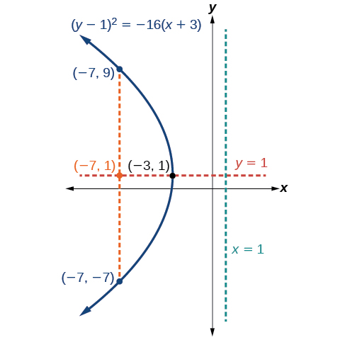{: #Figure_10_03_010}

Graph<math xmlns="http://www.w3.org/1998/Math/MathML"> <mrow> <mtext> </mtext><msup> <mrow> <mrow><mo>(</mo> <mrow> <mi>y</mi><mo>+</mo><mn>1</mn> </mrow> <mo>)</mo></mrow> </mrow> <mn>2</mn> </msup> <mo>=</mo><mn>4</mn><mrow><mo>(</mo> <mrow> <mi>x</mi><mo>−</mo><mn>8</mn> </mrow> <mo>)</mo></mrow><mo>.</mo><mtext> </mtext> </mrow> </math>

Identify and label the vertex, axis of symmetry, focus, directrix, and endpoints of the latus rectum.

Vertex:<math xmlns="http://www.w3.org/1998/Math/MathML"> <mrow> <mtext> </mtext><mrow><mo>(</mo> <mrow> <mn>8</mn><mo>,</mo><mo>−</mo><mn>1</mn> </mrow> <mo>)</mo></mrow><mo>;</mo><mtext> </mtext> </mrow> </math>

Axis of symmetry:<math xmlns="http://www.w3.org/1998/Math/MathML"> <mrow> <mtext> </mtext><mi>y</mi><mo>=</mo><mn>−1</mn><mo>;</mo><mtext> </mtext> </mrow> </math>

Focus:<math xmlns="http://www.w3.org/1998/Math/MathML"> <mrow> <mtext> </mtext><mrow><mo>(</mo> <mrow> <mn>9</mn><mo>,</mo><mo>−</mo><mn>1</mn> </mrow> <mo>)</mo></mrow><mo>;</mo><mtext> </mtext> </mrow> </math>

Directrix:<math xmlns="http://www.w3.org/1998/Math/MathML"> <mrow> <mtext> </mtext><mi>x</mi><mo>=</mo><mn>7</mn><mo>;</mo><mtext> </mtext> </mrow> </math>

Endpoints of the latus rectum:<math xmlns="http://www.w3.org/1998/Math/MathML"> <mrow> <mtext> </mtext><mrow><mo>(</mo> <mrow> <mn>9</mn><mo>,</mo><mo>−</mo><mn>3</mn> </mrow> <mo>)</mo></mrow><mtext> </mtext> </mrow> </math>

and<math xmlns="http://www.w3.org/1998/Math/MathML"> <mrow> <mtext> </mtext><mrow><mo>(</mo> <mrow> <mn>9</mn><mo>,</mo><mn>1</mn> </mrow> <mo>)</mo></mrow><mo>.</mo> </mrow> </math>

 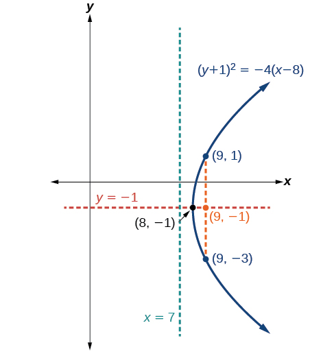 

Graphing a Parabola from an Equation Given in General Form

Graph<math xmlns="http://www.w3.org/1998/Math/MathML"> <mrow> <mtext> </mtext><msup> <mi>x</mi> <mn>2</mn> </msup> <mo>−</mo><mn>8</mn><mi>x</mi><mo>−</mo><mn>28</mn><mi>y</mi><mo>−</mo><mn>208</mn><mo>=</mo><mn>0.</mn><mtext> </mtext> </mrow> </math>

Identify and label the vertex, axis of symmetry, focus, directrix, and endpoints of the latus rectum.

Start by writing the equation of the **parabola**{: data-type="term" .no-emphasis} in standard form. The standard form that applies to the given equation is<math xmlns="http://www.w3.org/1998/Math/MathML"> <mrow> <mtext> </mtext><msup> <mrow> <mrow><mo>(</mo> <mrow> <mi>x</mi><mo>−</mo><mi>h</mi> </mrow> <mo>)</mo></mrow> </mrow> <mn>2</mn> </msup> <mo>=</mo><mn>4</mn><mi>p</mi><mrow><mo>(</mo> <mrow> <mi>y</mi><mo>−</mo><mi>k</mi> </mrow> <mo>)</mo></mrow><mo>.</mo><mtext> </mtext> </mrow> </math>

Thus, the axis of symmetry is parallel to the *y*-axis. To express the equation of the parabola in this form, we begin by isolating the terms that contain the variable<math xmlns="http://www.w3.org/1998/Math/MathML"> <mrow> <mtext> </mtext><mi>x</mi><mtext> </mtext> </mrow> </math>

in order to complete the square.

<math xmlns="http://www.w3.org/1998/Math/MathML" display="block"> <mrow> <mtable columnalign="left"> <mtr columnalign="left"> <mtd columnalign="left"> <mrow> <msup> <mi>x</mi> <mn>2</mn> </msup> <mo>−</mo><mn>8</mn><mi>x</mi><mo>−</mo><mn>28</mn><mi>y</mi><mo>−</mo><mn>208</mn><mo>=</mo><mn>0</mn> </mrow> </mtd> </mtr> <mtr columnalign="left"> <mtd columnalign="left"> <mrow> <mtext>                     </mtext><msup> <mi>x</mi> <mn>2</mn> </msup> <mo>−</mo><mn>8</mn><mi>x</mi><mo>=</mo><mn>28</mn><mi>y</mi><mo>+</mo><mn>208</mn> </mrow> </mtd> </mtr> <mtr columnalign="left"> <mtd columnalign="left"> <mrow> <mtext>            </mtext><msup> <mi>x</mi> <mn>2</mn> </msup> <mo>−</mo><mn>8</mn><mi>x</mi><mo>+</mo><mn>16</mn><mo>=</mo><mn>28</mn><mi>y</mi><mo>+</mo><mn>208</mn><mo>+</mo><mn>16</mn> </mrow> </mtd> </mtr> <mtr columnalign="left"> <mtd columnalign="left"> <mrow> <mtext>                    </mtext><msup> <mrow> <mo stretchy="false">(</mo><mi>x</mi><mo>−</mo><mn>4</mn><mo stretchy="false">)</mo> </mrow> <mn>2</mn> </msup> <mo>=</mo><mn>28</mn><mi>y</mi><mo>+</mo><mn>224</mn> </mrow> </mtd> </mtr> <mtr columnalign="left"> <mtd columnalign="left"> <mrow> <mtext>                    </mtext><msup> <mrow> <mo stretchy="false">(</mo><mi>x</mi><mo>−</mo><mn>4</mn><mo stretchy="false">)</mo> </mrow> <mn>2</mn> </msup> <mo>=</mo><mn>28</mn><mo stretchy="false">(</mo><mi>y</mi><mo>+</mo><mn>8</mn><mo stretchy="false">)</mo> </mrow> </mtd> </mtr> <mtr columnalign="left"> <mtd columnalign="left"> <mrow> <mtext>                    </mtext><msup> <mrow> <mo stretchy="false">(</mo><mi>x</mi><mo>−</mo><mn>4</mn><mo stretchy="false">)</mo> </mrow> <mn>2</mn> </msup> <mo>=</mo><mn>4</mn><mo>⋅</mo><mn>7</mn><mo>⋅</mo><mo stretchy="false">(</mo><mi>y</mi><mo>+</mo><mn>8</mn><mo stretchy="false">)</mo> </mrow> </mtd> </mtr> </mtable> </mrow> </math>

It follows that: 

the vertex is
<math xmlns="http://www.w3.org/1998/Math/MathML"> <mrow> <mtext> </mtext><mrow><mo>(</mo> <mrow> <mi>h</mi><mo>,</mo><mi>k</mi> </mrow> <mo>)</mo></mrow><mo>=</mo><mrow><mo>(</mo> <mrow> <mn>4</mn><mo>,</mo><mn>−8</mn> </mrow> <mo>)</mo></mrow> </mrow> </math>

the axis of symmetry is
<math xmlns="http://www.w3.org/1998/Math/MathML"> <mrow> <mtext> </mtext><mi>x</mi><mo>=</mo><mi>h</mi><mo>=</mo><mn>4</mn> </mrow> </math>

since
<math xmlns="http://www.w3.org/1998/Math/MathML"> <mrow> <mtext> </mtext><mi>p</mi><mo>=</mo><mn>7</mn><mo>,</mo><mi>p</mi><mo>&gt;</mo><mn>0</mn><mtext>  </mtext> </mrow> </math>
and so the parabola opens up

the coordinates of the focus are
<math xmlns="http://www.w3.org/1998/Math/MathML"> <mrow> <mtext> </mtext><mrow><mo>(</mo> <mrow> <mi>h</mi><mo>,</mo><mi>k</mi><mo>+</mo><mi>p</mi> </mrow> <mo>)</mo></mrow><mo>=</mo><mrow><mo>(</mo> <mrow> <mn>4</mn><mo>,</mo><mn>−8</mn><mo>+</mo><mn>7</mn> </mrow> <mo>)</mo></mrow><mo>=</mo><mrow><mo>(</mo> <mrow> <mn>4</mn><mo>,</mo><mn>−1</mn> </mrow> <mo>)</mo></mrow> </mrow> </math>

the equation of the directrix is
<math xmlns="http://www.w3.org/1998/Math/MathML"> <mrow> <mtext> </mtext><mi>y</mi><mo>=</mo><mi>k</mi><mo>−</mo><mi>p</mi><mo>=</mo><mn>−8</mn><mo>−</mo><mn>7</mn><mo>=</mo><mn>−15</mn> </mrow> </math>

the endpoints of the latus rectum are
<math xmlns="http://www.w3.org/1998/Math/MathML"> <mrow> <mtext> </mtext><mrow><mo>(</mo> <mrow> <mi>h</mi><mo>±</mo><mn>2</mn><mi>p</mi><mo>,</mo><mi>k</mi><mo>+</mo><mi>p</mi> </mrow> <mo>)</mo></mrow><mo>=</mo><mrow><mo>(</mo> <mrow> <mn>4</mn><mo>±</mo><mn>2</mn><mrow><mo>(</mo> <mn>7</mn> <mo>)</mo></mrow><mo>,</mo><mn>−8</mn><mo>+</mo><mn>7</mn> </mrow> <mo>)</mo></mrow><mo>,</mo> </mrow> </math>
or
<math xmlns="http://www.w3.org/1998/Math/MathML"> <mrow> <mtext> </mtext><mrow><mo>(</mo> <mrow> <mn>−10</mn><mo>,</mo><mn>−1</mn> </mrow> <mo>)</mo></mrow><mtext> </mtext> </mrow> </math>
and
<math xmlns="http://www.w3.org/1998/Math/MathML"> <mrow> <mtext> </mtext><mrow><mo>(</mo> <mrow> <mn>18</mn><mo>,</mo><mn>−1</mn> </mrow> <mo>)</mo></mrow> </mrow> </math>

Next we plot the vertex, axis of symmetry, focus, directrix, and latus rectum, and draw a smooth curve to form the parabola. See [[link]](#Figure_10_03_012).

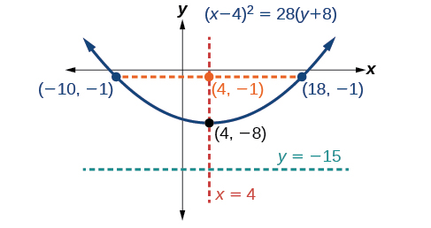{: #Figure_10_03_012}

Graph<math xmlns="http://www.w3.org/1998/Math/MathML"> <mrow> <mtext> </mtext><msup> <mrow> <mrow><mo>(</mo> <mrow> <mi>x</mi><mo>+</mo><mn>2</mn> </mrow> <mo>)</mo></mrow> </mrow> <mn>2</mn> </msup> <mo>=</mo><mn>−20</mn><mrow><mo>(</mo> <mrow> <mi>y</mi><mo>−</mo><mn>3</mn> </mrow> <mo>)</mo></mrow><mo>.</mo><mtext> </mtext> </mrow> </math>

Identify and label the vertex, axis of symmetry, focus, directrix, and endpoints of the latus rectum.

Vertex:<math xmlns="http://www.w3.org/1998/Math/MathML"> <mrow> <mtext> </mtext><mrow><mo>(</mo> <mrow> <mo>−</mo><mn>2</mn><mo>,</mo><mn>3</mn> </mrow> <mo>)</mo></mrow><mo>;</mo><mtext> </mtext> </mrow> </math>

Axis of symmetry:<math xmlns="http://www.w3.org/1998/Math/MathML"> <mrow> <mtext> </mtext><mi>x</mi><mo>=</mo><mn>−2</mn><mo>;</mo><mtext> </mtext> </mrow> </math>

Focus:<math xmlns="http://www.w3.org/1998/Math/MathML"> <mrow> <mtext> </mtext><mrow><mo>(</mo> <mrow> <mo>−</mo><mn>2</mn><mo>,</mo><mo>−</mo><mn>2</mn> </mrow> <mo>)</mo></mrow><mo>;</mo><mtext> </mtext> </mrow> </math>

Directrix:<math xmlns="http://www.w3.org/1998/Math/MathML"> <mrow> <mtext> </mtext><mi>y</mi><mo>=</mo><mn>8</mn><mo>;</mo><mtext> </mtext> </mrow> </math>

Endpoints of the latus rectum:<math xmlns="http://www.w3.org/1998/Math/MathML"> <mrow> <mtext> </mtext><mrow><mo>(</mo> <mrow> <mo>−</mo><mn>12</mn><mo>,</mo><mo>−</mo><mn>2</mn> </mrow> <mo>)</mo></mrow><mtext> </mtext> </mrow> </math>

and<math xmlns="http://www.w3.org/1998/Math/MathML"> <mrow> <mtext> </mtext><mrow><mo>(</mo> <mrow> <mn>8</mn><mo>,</mo><mo>−</mo><mn>2</mn> </mrow> <mo>)</mo></mrow><mo>.</mo> </mrow> </math>

 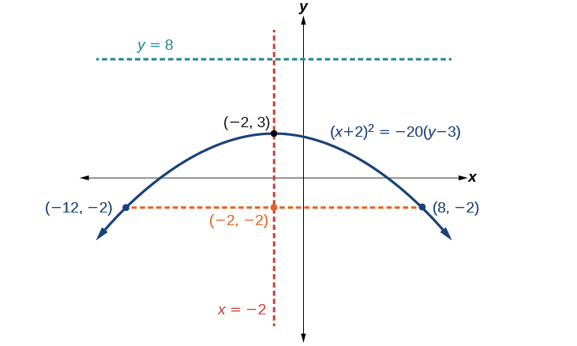 

# Solving Applied Problems Involving Parabolas 

As we mentioned at the beginning of the section, parabolas are used to design many objects we use every day, such as telescopes, suspension bridges, microphones, and radar equipment. Parabolic mirrors, such as the one used to light the Olympic torch, have a very unique reflecting property. When rays of light parallel to the parabola’s **axis of symmetry**{: data-type="term" .no-emphasis} are directed toward any surface of the mirror, the light is reflected directly to the focus. See [\[link\]](#Figure_10_03_014). This is why the Olympic torch is ignited when it is held at the focus of the parabolic mirror.

 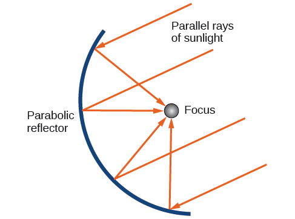{: #Figure_10_03_014}

Parabolic mirrors have the ability to focus the sun’s energy to a single point, raising the temperature hundreds of degrees in a matter of seconds. Thus, parabolic mirrors are featured in many low-cost, energy efficient solar products, such as solar cookers, solar heaters, and even travel-sized fire starters.

Solving Applied Problems Involving Parabolas

A cross-section of a design for a travel-sized solar fire starter is shown in [[link]](#Figure_10_03_016). The sun’s rays reflect off the parabolic mirror toward an object attached to the igniter. Because the igniter is located at the focus of the parabola, the reflected rays cause the object to burn in just seconds.

1.  Find the equation of the parabola that models the fire starter. Assume that the vertex of the parabolic mirror is the origin of the coordinate plane.
2.  Use the equation found in part (a) to find the depth of the fire starter.
{: data-number-style="lower-alpha"}

{: #Figure_10_03_016}

1.  The vertex of the dish is the origin of the coordinate plane, so the parabola will take the standard form
    <math xmlns="http://www.w3.org/1998/Math/MathML"> <mrow> <mtext> </mtext><msup> <mi>x</mi> <mn>2</mn> </msup> <mo>=</mo><mn>4</mn><mi>p</mi><mi>y</mi><mo>,</mo> </mrow> </math>
    
    where
    <math xmlns="http://www.w3.org/1998/Math/MathML"> <mrow> <mtext> </mtext><mi>p</mi><mo>&gt;</mo><mn>0.</mn><mtext>  </mtext> </mrow> </math>
    
    The igniter, which is the focus, is 1.7 inches above the vertex of the dish. Thus we have
    <math xmlns="http://www.w3.org/1998/Math/MathML"> <mrow> <mtext> </mtext><mi>p</mi><mo>=</mo><mn>1.7.</mn><mtext> </mtext> </mrow> </math>
    
    

    <math xmlns="http://www.w3.org/1998/Math/MathML" display="block"> <mrow> <mtable columnalign="left"> <mtr columnalign="left"> <mtd columnalign="left"> <mrow> <msup> <mi>x</mi> <mn>2</mn> </msup> <mo>=</mo><mn>4</mn><mi>p</mi><mi>y</mi> </mrow> </mtd> <mtd columnalign="left"> <mrow> <mtable> <mtr> <mtd> <mrow /> </mtd> <mtd> <mrow /> </mtd> <mtd> <mrow /> </mtd> <mtd> <mrow /> </mtd> </mtr> </mtable><mtext>Standard form of upward-facing parabola with vertex (0,0)</mtext> </mrow> </mtd> </mtr> <mtr columnalign="left"> <mtd columnalign="left"> <mrow> <msup> <mi>x</mi> <mn>2</mn> </msup> <mo>=</mo><mn>4</mn><mo stretchy="false">(</mo><mn>1.7</mn><mo stretchy="false">)</mo><mi>y</mi> </mrow> </mtd> <mtd columnalign="left"> <mrow> <mtable> <mtr> <mtd> <mrow /> </mtd> <mtd> <mrow /> </mtd> <mtd> <mrow /> </mtd> <mtd> <mrow /> </mtd> </mtr> </mtable><mtext>Substitute 1</mtext><mtext>.7 for </mtext><mi>p</mi><mo>.</mo> </mrow> </mtd> </mtr> <mtr columnalign="left"> <mtd columnalign="left"> <mrow> <msup> <mi>x</mi> <mn>2</mn> </msup> <mo>=</mo><mn>6.8</mn><mi>y</mi> </mrow> </mtd> <mtd columnalign="left"> <mrow> <mtable> <mtr> <mtd> <mrow /> </mtd> <mtd> <mrow /> </mtd> <mtd> <mrow /> </mtd> <mtd> <mrow /> </mtd> </mtr> </mtable><mtext>Multiply</mtext><mo>.</mo> </mrow> </mtd> </mtr> </mtable> </mrow> </math>
    

2.  The dish extends
    <math xmlns="http://www.w3.org/1998/Math/MathML"> <mrow> <mtext> </mtext><mfrac> <mrow> <mn>4.5</mn> </mrow> <mn>2</mn> </mfrac> <mo>=</mo><mn>2.25</mn><mtext>  </mtext> </mrow> </math>
    
    inches on either side of the origin. We can substitute 2.25 for
    <math xmlns="http://www.w3.org/1998/Math/MathML"> <mrow> <mtext> </mtext><mi>x</mi><mtext> </mtext> </mrow> </math>
    
    in the equation from part (a) to find the depth of the dish.
    

    <math xmlns="http://www.w3.org/1998/Math/MathML" display="block"> <mrow> <mtable columnalign="left"> <mtr columnalign="left"> <mtd columnalign="left"> <mrow> <mtext>        </mtext><msup> <mi>x</mi> <mn>2</mn> </msup> <mo>=</mo><mn>6.8</mn><mi>y</mi> </mrow> </mtd> <mtd columnalign="left"> <mrow> <mtext>Equation found in part (a)</mtext><mo>.</mo> </mrow> </mtd> </mtr> <mtr columnalign="left"> <mtd columnalign="left"> <mrow> <msup> <mrow> <mo stretchy="false">(</mo><mn>2.25</mn><mo stretchy="false">)</mo> </mrow> <mn>2</mn> </msup> <mo>=</mo><mn>6.8</mn><mi>y</mi> </mrow> </mtd> <mtd columnalign="left"> <mrow> <mtext>Substitute 2</mtext><mtext>.25 for </mtext><mi>x</mi><mo>.</mo> </mrow> </mtd> </mtr> <mtr columnalign="left"> <mtd columnalign="left"> <mrow> <mtext>          </mtext><mi>y</mi><mo>≈</mo><mn>0.74</mn><mo> </mo> </mrow> </mtd> <mtd columnalign="left"> <mrow> <mtext>Solve for </mtext><mi>y</mi><mo>.</mo> </mrow> </mtd> </mtr> </mtable> </mrow> </math>
    

    
    The dish is about 0.74 inches deep.
{: data-number-style="lower-alpha"}

Balcony-sized solar cookers have been designed for families living in India. The top of a dish has a diameter of 1600 mm. The sun’s rays reflect off the parabolic mirror toward the “cooker,” which is placed 320 mm from the base.

1.  Find an equation that models a cross-section of the solar cooker. Assume that the vertex of the parabolic mirror is the origin of the coordinate plane, and that the parabola opens to the right (i.e., has the *x*-axis as its axis of symmetry).
2.  Use the equation found in part (a) to find the depth of the cooker.
{: data-number-style="lower-alpha"}

1.  <math xmlns="http://www.w3.org/1998/Math/MathML"> <mrow> <msup> <mi>y</mi> <mn>2</mn> </msup> <mo>=</mo><mn>1280</mn><mi>x</mi> </mrow> </math>

2.  The depth of the cooker is 500 mm
{: data-number-style="lower-alpha"}

Access these online resources for additional instruction and practice with parabolas.

* [Conic Sections: The Parabola Part 1 of 2][1]
* [Conic Sections: The Parabola Part 2 of 2][2]
* [Parabola with Vertical Axis][3]
* [Parabola with Horizontal Axis][4]

# Key Equations

<table summary=".."><colgroup><col /><col data-align="center" /></colgroup><tbody>
         <tr>
           <td>Parabola, vertex at origin, axis of symmetry on <em>x</em>-axis</td>
           <td><math xmlns="http://www.w3.org/1998/Math/MathML">
             <mrow>
               <msup>
                 <mi>y</mi>
                 <mn>2</mn>
               </msup>
               <mo>=</mo><mn>4</mn><mi>p</mi><mi>x</mi>
             </mrow>
           </math>
           </td>
         </tr>
       
         <tr>
           <td>Parabola, vertex at origin, axis of symmetry on <em>y</em>-axis</td>
           <td><math xmlns="http://www.w3.org/1998/Math/MathML">
             <mrow>
               <msup>
                 <mi>x</mi>
                 <mn>2</mn>
               </msup>
               <mo>=</mo><mn>4</mn><mi>p</mi><mi>y</mi>
             </mrow>
           </math>
           </td>
         </tr>
         <tr>
           <td>Parabola, vertex at<math xmlns="http://www.w3.org/1998/Math/MathML">
 <mrow>
  <mtext> </mtext><mo stretchy="false">(</mo><mi>h</mi><mo>,</mo><mi>k</mi><mo stretchy="false">)</mo><mo>,</mo>
 </mrow>
</math>axis of symmetry on <em>x</em>-axis</td>
           <td><math xmlns="http://www.w3.org/1998/Math/MathML">
             <mrow>
               <msup>
                 <mrow>
                   <mrow><mo>(</mo>
                     <mrow>
                       <mi>y</mi><mo>−</mo><mi>k</mi>
                     </mrow>
                     <mo>)</mo></mrow>
                 </mrow>
                 <mn>2</mn>
               </msup>
               <mo>=</mo><mn>4</mn><mi>p</mi><mrow><mo>(</mo>
                 <mrow>
                   <mi>x</mi><mo>−</mo><mi>h</mi>
                 </mrow>
                 <mo>)</mo></mrow>
             </mrow>
           </math>
           </td>
         </tr>
         <tr>
           <td>Parabola, vertex at<math xmlns="http://www.w3.org/1998/Math/MathML">
 <mrow>
  <mtext> </mtext><mo stretchy="false">(</mo><mi>h</mi><mo>,</mo><mi>k</mi><mo stretchy="false">)</mo><mo>,</mo>
 </mrow>
</math>axis of symmetry on <em>y</em>-axis</td>
           <td><math xmlns="http://www.w3.org/1998/Math/MathML">
             <mrow>
               <msup>
                 <mrow>
                   <mrow><mo>(</mo>
                     <mrow>
                       <mi>x</mi><mo>−</mo><mi>h</mi>
                     </mrow>
                     <mo>)</mo></mrow>
                 </mrow>
                 <mn>2</mn>
               </msup>
               <mo>=</mo><mn>4</mn><mi>p</mi><mrow><mo>(</mo>
                 <mrow>
                   <mi>y</mi><mo>−</mo><mi>k</mi>
                 </mrow>
                 <mo>)</mo></mrow>
             </mrow>
           </math>
           </td>
         </tr>
       </tbody></table>

# Key Concepts

* A parabola is the set of all points
  <math xmlns="http://www.w3.org/1998/Math/MathML"> <mrow> <mtext> </mtext><mrow><mo>(</mo> <mrow> <mi>x</mi><mo>,</mo><mi>y</mi> </mrow> <mo>)</mo></mrow><mtext> </mtext> </mrow> </math>
  
  in a plane that are the same distance from a fixed line, called the directrix, and a fixed point (the focus) not on the directrix.
* The standard form of a parabola with vertex
  <math xmlns="http://www.w3.org/1998/Math/MathML"> <mrow> <mtext> </mtext><mrow><mo>(</mo> <mrow> <mn>0</mn><mo>,</mo><mn>0</mn> </mrow> <mo>)</mo></mrow><mtext> </mtext> </mrow> </math>
  
  and the *x*-axis as its axis of symmetry can be used to graph the parabola. If
  <math xmlns="http://www.w3.org/1998/Math/MathML"> <mrow> <mtext> </mtext><mi>p</mi><mo>&gt;</mo><mn>0</mn><mo>,</mo> </mrow> </math>
  
  the parabola opens right. If
  <math xmlns="http://www.w3.org/1998/Math/MathML"> <mrow> <mtext> </mtext><mi>p</mi><mo>&lt;</mo><mn>0</mn><mo>,</mo> </mrow> </math>
  
  the parabola opens left. See [\[link\]](#Example_10_03_01).
* The standard form of a parabola with vertex
  <math xmlns="http://www.w3.org/1998/Math/MathML"> <mrow> <mtext> </mtext><mrow><mo>(</mo> <mrow> <mn>0</mn><mo>,</mo><mn>0</mn> </mrow> <mo>)</mo></mrow><mtext> </mtext> </mrow> </math>
  
  and the *y*-axis as its axis of symmetry can be used to graph the parabola. If
  <math xmlns="http://www.w3.org/1998/Math/MathML"> <mrow> <mtext> </mtext><mi>p</mi><mo>&gt;</mo><mn>0</mn><mo>,</mo> </mrow> </math>
  
  the parabola opens up. If
  <math xmlns="http://www.w3.org/1998/Math/MathML"> <mrow> <mtext> </mtext><mi>p</mi><mo>&lt;</mo><mn>0</mn><mo>,</mo> </mrow> </math>
  
  the parabola opens down. See [\[link\]](#Example_10_03_02).
* When given the focus and directrix of a parabola, we can write its equation in standard form. See [\[link\]](#Example_10_03_03).
* The standard form of a parabola with vertex
  <math xmlns="http://www.w3.org/1998/Math/MathML"> <mrow> <mtext> </mtext><mrow><mo>(</mo> <mrow> <mi>h</mi><mo>,</mo><mi>k</mi> </mrow> <mo>)</mo></mrow><mtext> </mtext> </mrow> </math>
  
  and axis of symmetry parallel to the *x*-axis can be used to graph the parabola. If
  <math xmlns="http://www.w3.org/1998/Math/MathML"> <mrow> <mtext> </mtext><mi>p</mi><mo>&gt;</mo><mn>0</mn><mo>,</mo> </mrow> </math>
  
  the parabola opens right. If
  <math xmlns="http://www.w3.org/1998/Math/MathML"> <mrow> <mtext> </mtext><mi>p</mi><mo>&lt;</mo><mn>0</mn><mo>,</mo> </mrow> </math>
  
  the parabola opens left. See [\[link\]](#Example_10_03_04).
* The standard form of a parabola with vertex
  <math xmlns="http://www.w3.org/1998/Math/MathML"> <mrow> <mtext> </mtext><mrow><mo>(</mo> <mrow> <mi>h</mi><mo>,</mo><mi>k</mi> </mrow> <mo>)</mo></mrow><mtext> </mtext> </mrow> </math>
  
  and axis of symmetry parallel to the *y*-axis can be used to graph the parabola. If
  <math xmlns="http://www.w3.org/1998/Math/MathML"> <mrow> <mtext> </mtext><mi>p</mi><mo>&gt;</mo><mn>0</mn><mo>,</mo> </mrow> </math>
  
  the parabola opens up. If
  <math xmlns="http://www.w3.org/1998/Math/MathML"> <mrow> <mtext> </mtext><mi>p</mi><mo>&lt;</mo><mn>0</mn><mo>,</mo> </mrow> </math>
  
  the parabola opens down. See [\[link\]](#Example_10_03_05).
* Real-world situations can be modeled using the standard equations of parabolas. For instance, given the diameter and focus of a cross-section of a parabolic reflector, we can find an equation that models its sides. See [\[link\]](#Example_10_03_06).

# Section Exercises

## Verbal

Define a parabola in terms of its focus and directrix.

A parabola is the set of points in the plane that lie equidistant from a fixed point, the focus, and a fixed line, the directrix.

If the equation of a parabola is written in standard form and<math xmlns="http://www.w3.org/1998/Math/MathML"> <mrow> <mtext> </mtext><mi>p</mi><mtext> </mtext> </mrow> </math>

is positive and the directrix is a vertical line, then what can we conclude about its graph?

If the equation of a parabola is written in standard form and<math xmlns="http://www.w3.org/1998/Math/MathML"> <mrow> <mtext> </mtext><mi>p</mi><mtext> </mtext> </mrow> </math>

is negative and the directrix is a horizontal line, then what can we conclude about its graph?

The graph will open down.

What is the effect on the graph of a parabola if its equation in standard form has increasing values of <math xmlns="http://www.w3.org/1998/Math/MathML"> <mrow> <mtext> </mtext><mi>p</mi><mtext>?</mtext> </mrow> </math>

As the graph of a parabola becomes wider, what will happen to the distance between the focus and directrix?

The distance between the focus and directrix will increase.

##  Algebraic

For the following exercises, determine whether the given equation is a parabola. If so, rewrite the equation in standard form.

<math xmlns="http://www.w3.org/1998/Math/MathML"> <mrow> <msup> <mi>y</mi> <mn>2</mn> </msup> <mo>=</mo><mn>4</mn><mo>−</mo><msup> <mi>x</mi> <mn>2</mn> </msup> </mrow> </math>

<math xmlns="http://www.w3.org/1998/Math/MathML"> <mrow> <mi>y</mi><mo>=</mo><mn>4</mn><msup> <mi>x</mi> <mn>2</mn> </msup> </mrow> </math>

yes<math xmlns="http://www.w3.org/1998/Math/MathML"> <mrow> <mtext> </mtext><mi>y</mi><mo>=</mo><mn>4</mn><mo stretchy="false">(</mo><mn>1</mn><mo stretchy="false">)</mo><msup> <mi>x</mi> <mn>2</mn> </msup> </mrow> </math>

<math xmlns="http://www.w3.org/1998/Math/MathML"> <mrow> <mn>3</mn><msup> <mi>x</mi> <mn>2</mn> </msup> <mo>−</mo><mn>6</mn><msup> <mi>y</mi> <mn>2</mn> </msup> <mo>=</mo><mn>12</mn> </mrow> </math>

<math xmlns="http://www.w3.org/1998/Math/MathML"> <mrow> <msup> <mrow> <mrow><mo>(</mo> <mrow> <mi>y</mi><mo>−</mo><mn>3</mn> </mrow> <mo>)</mo></mrow> </mrow> <mn>2</mn> </msup> <mo>=</mo><mn>8</mn><mrow><mo>(</mo> <mrow> <mi>x</mi><mo>−</mo><mn>2</mn> </mrow> <mo>)</mo></mrow> </mrow> </math>

yes<math xmlns="http://www.w3.org/1998/Math/MathML"> <mrow> <mtext> </mtext><msup> <mrow> <mrow><mo>(</mo> <mrow> <mi>y</mi><mo>−</mo><mn>3</mn> </mrow> <mo>)</mo></mrow> </mrow> <mn>2</mn> </msup> <mo>=</mo><mn>4</mn><mo stretchy="false">(</mo><mn>2</mn><mo stretchy="false">)</mo><mrow><mo>(</mo> <mrow> <mi>x</mi><mo>−</mo><mn>2</mn> </mrow> <mo>)</mo></mrow> </mrow> </math>

<math xmlns="http://www.w3.org/1998/Math/MathML"> <mrow> <msup> <mi>y</mi> <mn>2</mn> </msup> <mo>+</mo><mn>12</mn><mi>x</mi><mo>−</mo><mn>6</mn><mi>y</mi><mo>−</mo><mn>51</mn><mo>=</mo><mn>0</mn> </mrow> </math>

For the following exercises, rewrite the given equation in standard form, and then determine the vertex<math xmlns="http://www.w3.org/1998/Math/MathML"> <mrow> <mtext> </mtext><mo stretchy="false">(</mo><mi>V</mi><mo stretchy="false">)</mo><mo>,</mo> </mrow> </math>

 focus<math xmlns="http://www.w3.org/1998/Math/MathML"> <mrow> <mtext> </mtext><mo stretchy="false">(</mo><mi>F</mi><mo stretchy="false">)</mo><mo>,</mo> </mrow> </math>

 and directrix<math xmlns="http://www.w3.org/1998/Math/MathML"> <mrow> <mtext> </mtext><mo stretchy="false">(</mo><mi>d</mi><mo stretchy="false">)</mo><mtext> </mtext> </mrow> </math>

of the parabola.

<math xmlns="http://www.w3.org/1998/Math/MathML"> <mrow> <mi>x</mi><mo>=</mo><mn>8</mn><msup> <mi>y</mi> <mn>2</mn> </msup> </mrow> </math>

<math xmlns="http://www.w3.org/1998/Math/MathML"> <mrow> <msup> <mi>y</mi> <mn>2</mn> </msup> <mo>=</mo><mfrac> <mn>1</mn> <mn>8</mn> </mfrac> <mi>x</mi><mo>,</mo><mi>V</mi><mo>:</mo><mo stretchy="false">(</mo><mn>0</mn><mo>,</mo><mn>0</mn><mo stretchy="false">)</mo><mo>;</mo><mi>F</mi><mo>:</mo><mrow><mo>(</mo> <mrow> <mfrac> <mn>1</mn> <mrow> <mn>32</mn> </mrow> </mfrac> <mo>,</mo><mn>0</mn> </mrow> <mo>)</mo></mrow><mo>;</mo><mi>d</mi><mo>:</mo><mi>x</mi><mo>=</mo><mo>−</mo><mfrac> <mn>1</mn> <mrow> <mn>32</mn> </mrow> </mfrac> </mrow> </math>

<math xmlns="http://www.w3.org/1998/Math/MathML"> <mrow> <mi>y</mi><mo>=</mo><mfrac> <mn>1</mn> <mn>4</mn> </mfrac> <msup> <mi>x</mi> <mn>2</mn> </msup> </mrow> </math>

<math xmlns="http://www.w3.org/1998/Math/MathML"> <mrow> <mi>y</mi><mo>=</mo><mn>−4</mn><msup> <mi>x</mi> <mn>2</mn> </msup> </mrow> </math>

<math xmlns="http://www.w3.org/1998/Math/MathML"> <mrow> <msup> <mi>x</mi> <mn>2</mn> </msup> <mo>=</mo><mo>−</mo><mfrac> <mn>1</mn> <mn>4</mn> </mfrac> <mi>y</mi><mo>,</mo><mi>V</mi><mo>:</mo><mrow><mo>(</mo> <mrow> <mn>0</mn><mo>,</mo><mn>0</mn> </mrow> <mo>)</mo></mrow><mo>;</mo><mi>F</mi><mo>:</mo><mrow><mo>(</mo> <mrow> <mn>0</mn><mo>,</mo><mo>−</mo><mfrac> <mn>1</mn> <mrow> <mn>16</mn> </mrow> </mfrac> </mrow> <mo>)</mo></mrow><mo>;</mo><mi>d</mi><mo>:</mo><mi>y</mi><mo>=</mo><mfrac> <mn>1</mn> <mrow> <mn>16</mn> </mrow> </mfrac> </mrow> </math>

<math xmlns="http://www.w3.org/1998/Math/MathML"> <mrow> <mi>x</mi><mo>=</mo><mfrac> <mn>1</mn> <mn>8</mn> </mfrac> <msup> <mi>y</mi> <mn>2</mn> </msup> </mrow> </math>

<math xmlns="http://www.w3.org/1998/Math/MathML"> <mrow> <mi>x</mi><mo>=</mo><mn>36</mn><msup> <mi>y</mi> <mn>2</mn> </msup> </mrow> </math>

<math xmlns="http://www.w3.org/1998/Math/MathML"> <mrow> <msup> <mi>y</mi> <mn>2</mn> </msup> <mo>=</mo><mfrac> <mn>1</mn> <mrow> <mn>36</mn> </mrow> </mfrac> <mi>x</mi><mo>,</mo><mi>V</mi><mo>:</mo><mrow><mo>(</mo> <mrow> <mn>0</mn><mo>,</mo><mn>0</mn> </mrow> <mo>)</mo></mrow><mo>;</mo><mi>F</mi><mo>:</mo><mrow><mo>(</mo> <mrow> <mfrac> <mn>1</mn> <mrow> <mn>144</mn> </mrow> </mfrac> <mo>,</mo><mn>0</mn> </mrow> <mo>)</mo></mrow><mo>;</mo><mi>d</mi><mo>:</mo><mi>x</mi><mo>=</mo><mo>−</mo><mfrac> <mn>1</mn> <mrow> <mn>144</mn> </mrow> </mfrac> </mrow> </math>

<math xmlns="http://www.w3.org/1998/Math/MathML"> <mrow> <mi>x</mi><mo>=</mo><mfrac> <mn>1</mn> <mrow> <mn>36</mn> </mrow> </mfrac> <msup> <mi>y</mi> <mn>2</mn> </msup> </mrow> </math>

<math xmlns="http://www.w3.org/1998/Math/MathML"> <mrow> <msup> <mrow> <mrow><mo>(</mo> <mrow> <mi>x</mi><mo>−</mo><mn>1</mn> </mrow> <mo>)</mo></mrow> </mrow> <mn>2</mn> </msup> <mo>=</mo><mn>4</mn><mrow><mo>(</mo> <mrow> <mi>y</mi><mo>−</mo><mn>1</mn> </mrow> <mo>)</mo></mrow> </mrow> </math>

<math xmlns="http://www.w3.org/1998/Math/MathML"> <mrow> <msup> <mrow> <mrow><mo>(</mo> <mrow> <mi>x</mi><mo>−</mo><mn>1</mn> </mrow> <mo>)</mo></mrow> </mrow> <mn>2</mn> </msup> <mo>=</mo><mn>4</mn><mrow><mo>(</mo> <mrow> <mi>y</mi><mo>−</mo><mn>1</mn> </mrow> <mo>)</mo></mrow><mo>,</mo><mi>V</mi><mo>:</mo><mrow><mo>(</mo> <mrow> <mn>1</mn><mo>,</mo><mn>1</mn> </mrow> <mo>)</mo></mrow><mo>;</mo><mi>F</mi><mo>:</mo><mrow><mo>(</mo> <mrow> <mn>1</mn><mo>,</mo><mn>2</mn> </mrow> <mo>)</mo></mrow><mo>;</mo><mi>d</mi><mo>:</mo><mi>y</mi><mo>=</mo><mn>0</mn> </mrow> </math>

<math xmlns="http://www.w3.org/1998/Math/MathML"> <mrow> <msup> <mrow> <mrow><mo>(</mo> <mrow> <mi>y</mi><mo>−</mo><mn>2</mn> </mrow> <mo>)</mo></mrow> </mrow> <mn>2</mn> </msup> <mo>=</mo><mfrac> <mn>4</mn> <mn>5</mn> </mfrac> <mrow><mo>(</mo> <mrow> <mi>x</mi><mo>+</mo><mn>4</mn> </mrow> <mo>)</mo></mrow> </mrow> </math>

<math xmlns="http://www.w3.org/1998/Math/MathML"> <mrow> <msup> <mrow> <mrow><mo>(</mo> <mrow> <mi>y</mi><mo>−</mo><mn>4</mn> </mrow> <mo>)</mo></mrow> </mrow> <mn>2</mn> </msup> <mo>=</mo><mn>2</mn><mrow><mo>(</mo> <mrow> <mi>x</mi><mo>+</mo><mn>3</mn> </mrow> <mo>)</mo></mrow> </mrow> </math>

<math xmlns="http://www.w3.org/1998/Math/MathML"> <mrow> <msup> <mrow> <mrow><mo>(</mo> <mrow> <mi>y</mi><mo>−</mo><mn>4</mn> </mrow> <mo>)</mo></mrow> </mrow> <mn>2</mn> </msup> <mo>=</mo><mn>2</mn><mrow><mo>(</mo> <mrow> <mi>x</mi><mo>+</mo><mn>3</mn> </mrow> <mo>)</mo></mrow><mo>,</mo><mi>V</mi><mo>:</mo><mrow><mo>(</mo> <mrow> <mo>−</mo><mn>3</mn><mo>,</mo><mn>4</mn> </mrow> <mo>)</mo></mrow><mo>;</mo><mi>F</mi><mo>:</mo><mrow><mo>(</mo> <mrow> <mo>−</mo><mfrac> <mn>5</mn> <mn>2</mn> </mfrac> <mo>,</mo><mn>4</mn> </mrow> <mo>)</mo></mrow><mo>;</mo><mi>d</mi><mo>:</mo><mi>x</mi><mo>=</mo><mo>−</mo><mfrac> <mn>7</mn> <mn>2</mn> </mfrac> </mrow> </math>

<math xmlns="http://www.w3.org/1998/Math/MathML"> <mrow> <msup> <mrow> <mrow><mo>(</mo> <mrow> <mi>x</mi><mo>+</mo><mn>1</mn> </mrow> <mo>)</mo></mrow> </mrow> <mn>2</mn> </msup> <mo>=</mo><mn>2</mn><mrow><mo>(</mo> <mrow> <mi>y</mi><mo>+</mo><mn>4</mn> </mrow> <mo>)</mo></mrow> </mrow> </math>

<math xmlns="http://www.w3.org/1998/Math/MathML"> <mrow> <msup> <mrow> <mrow><mo>(</mo> <mrow> <mi>x</mi><mo>+</mo><mn>4</mn> </mrow> <mo>)</mo></mrow> </mrow> <mn>2</mn> </msup> <mo>=</mo><mn>24</mn><mrow><mo>(</mo> <mrow> <mi>y</mi><mo>+</mo><mn>1</mn> </mrow> <mo>)</mo></mrow> </mrow> </math>

<math xmlns="http://www.w3.org/1998/Math/MathML"> <mrow> <msup> <mrow> <mrow><mo>(</mo> <mrow> <mi>x</mi><mo>+</mo><mn>4</mn> </mrow> <mo>)</mo></mrow> </mrow> <mn>2</mn> </msup> <mo>=</mo><mn>24</mn><mrow><mo>(</mo> <mrow> <mi>y</mi><mo>+</mo><mn>1</mn> </mrow> <mo>)</mo></mrow><mo>,</mo><mi>V</mi><mo>:</mo><mrow><mo>(</mo> <mrow> <mo>−</mo><mn>4</mn><mo>,</mo><mo>−</mo><mn>1</mn> </mrow> <mo>)</mo></mrow><mo>;</mo><mi>F</mi><mo>:</mo><mrow><mo>(</mo> <mrow> <mo>−</mo><mn>4</mn><mo>,</mo><mn>5</mn> </mrow> <mo>)</mo></mrow><mo>;</mo><mi>d</mi><mo>:</mo><mi>y</mi><mo>=</mo><mn>−7</mn> </mrow> </math>

<math xmlns="http://www.w3.org/1998/Math/MathML"> <mrow> <msup> <mrow> <mrow><mo>(</mo> <mrow> <mi>y</mi><mo>+</mo><mn>4</mn> </mrow> <mo>)</mo></mrow> </mrow> <mn>2</mn> </msup> <mo>=</mo><mn>16</mn><mrow><mo>(</mo> <mrow> <mi>x</mi><mo>+</mo><mn>4</mn> </mrow> <mo>)</mo></mrow> </mrow> </math>

<math xmlns="http://www.w3.org/1998/Math/MathML"> <mrow> <msup> <mi>y</mi> <mn>2</mn> </msup> <mo>+</mo><mn>12</mn><mi>x</mi><mo>−</mo><mn>6</mn><mi>y</mi><mo>+</mo><mn>21</mn><mo>=</mo><mn>0</mn> </mrow> </math>

<math xmlns="http://www.w3.org/1998/Math/MathML"> <mrow> <msup> <mrow> <mrow><mo>(</mo> <mrow> <mi>y</mi><mo>−</mo><mn>3</mn> </mrow> <mo>)</mo></mrow> </mrow> <mn>2</mn> </msup> <mo>=</mo><mn>−12</mn><mrow><mo>(</mo> <mrow> <mi>x</mi><mo>+</mo><mn>1</mn> </mrow> <mo>)</mo></mrow><mo>,</mo><mi>V</mi><mo>:</mo><mrow><mo>(</mo> <mrow> <mo>−</mo><mn>1</mn><mo>,</mo><mn>3</mn> </mrow> <mo>)</mo></mrow><mo>;</mo><mi>F</mi><mo>:</mo><mrow><mo>(</mo> <mrow> <mo>−</mo><mn>4</mn><mo>,</mo><mn>3</mn> </mrow> <mo>)</mo></mrow><mo>;</mo><mi>d</mi><mo>:</mo><mi>x</mi><mo>=</mo><mn>2</mn> </mrow> </math>

<math xmlns="http://www.w3.org/1998/Math/MathML"> <mrow> <msup> <mi>x</mi> <mn>2</mn> </msup> <mo>−</mo><mn>4</mn><mi>x</mi><mo>−</mo><mn>24</mn><mi>y</mi><mo>+</mo><mn>28</mn><mo>=</mo><mn>0</mn> </mrow> </math>

<math xmlns="http://www.w3.org/1998/Math/MathML"> <mrow> <mn>5</mn><msup> <mi>x</mi> <mn>2</mn> </msup> <mo>−</mo><mn>50</mn><mi>x</mi><mo>−</mo><mn>4</mn><mi>y</mi><mo>+</mo><mn>113</mn><mo>=</mo><mn>0</mn> </mrow> </math>

<math xmlns="http://www.w3.org/1998/Math/MathML"> <mrow> <msup> <mrow> <mrow><mo>(</mo> <mrow> <mi>x</mi><mo>−</mo><mn>5</mn> </mrow> <mo>)</mo></mrow> </mrow> <mn>2</mn> </msup> <mo>=</mo><mfrac> <mn>4</mn> <mn>5</mn> </mfrac> <mrow><mo>(</mo> <mrow> <mi>y</mi><mo>+</mo><mn>3</mn> </mrow> <mo>)</mo></mrow><mo>,</mo><mi>V</mi><mo>:</mo><mrow><mo>(</mo> <mrow> <mn>5</mn><mo>,</mo><mo>−</mo><mn>3</mn> </mrow> <mo>)</mo></mrow><mo>;</mo><mi>F</mi><mo>:</mo><mrow><mo>(</mo> <mrow> <mn>5</mn><mo>,</mo><mo>−</mo><mfrac> <mrow> <mn>14</mn> </mrow> <mn>5</mn> </mfrac> </mrow> <mo>)</mo></mrow><mo>;</mo><mi>d</mi><mo>:</mo><mi>y</mi><mo>=</mo><mo>−</mo><mfrac> <mrow> <mn>16</mn> </mrow> <mn>5</mn> </mfrac> </mrow> </math>

<math xmlns="http://www.w3.org/1998/Math/MathML"> <mrow> <msup> <mi>y</mi> <mn>2</mn> </msup> <mo>−</mo><mn>24</mn><mi>x</mi><mo>+</mo><mn>4</mn><mi>y</mi><mo>−</mo><mn>68</mn><mo>=</mo><mn>0</mn> </mrow> </math>

<math xmlns="http://www.w3.org/1998/Math/MathML"> <mrow> <msup> <mi>x</mi> <mn>2</mn> </msup> <mo>−</mo><mn>4</mn><mi>x</mi><mo>+</mo><mn>2</mn><mi>y</mi><mo>−</mo><mn>6</mn><mo>=</mo><mn>0</mn> </mrow> </math>

<math xmlns="http://www.w3.org/1998/Math/MathML"> <mrow> <msup> <mrow> <mrow><mo>(</mo> <mrow> <mi>x</mi><mo>−</mo><mn>2</mn> </mrow> <mo>)</mo></mrow> </mrow> <mn>2</mn> </msup> <mo>=</mo><mn>−2</mn><mrow><mo>(</mo> <mrow> <mi>y</mi><mo>−</mo><mn>5</mn> </mrow> <mo>)</mo></mrow><mo>,</mo><mi>V</mi><mo>:</mo><mrow><mo>(</mo> <mrow> <mn>2</mn><mo>,</mo><mn>5</mn> </mrow> <mo>)</mo></mrow><mo>;</mo><mi>F</mi><mo>:</mo><mrow><mo>(</mo> <mrow> <mn>2</mn><mo>,</mo><mfrac> <mn>9</mn> <mn>2</mn> </mfrac> </mrow> <mo>)</mo></mrow><mo>;</mo><mi>d</mi><mo>:</mo><mi>y</mi><mo>=</mo><mfrac> <mrow> <mn>11</mn> </mrow> <mn>2</mn> </mfrac> </mrow> </math>

<math xmlns="http://www.w3.org/1998/Math/MathML"> <mrow> <msup> <mi>y</mi> <mn>2</mn> </msup> <mo>−</mo><mn>6</mn><mi>y</mi><mo>+</mo><mn>12</mn><mi>x</mi><mo>−</mo><mn>3</mn><mo>=</mo><mn>0</mn> </mrow> </math>

<math xmlns="http://www.w3.org/1998/Math/MathML"> <mrow> <mn>3</mn><msup> <mi>y</mi> <mn>2</mn> </msup> <mo>−</mo><mn>4</mn><mi>x</mi><mo>−</mo><mn>6</mn><mi>y</mi><mo>+</mo><mn>23</mn><mo>=</mo><mn>0</mn> </mrow> </math>

<math xmlns="http://www.w3.org/1998/Math/MathML"> <mrow> <msup> <mrow> <mrow><mo>(</mo> <mrow> <mi>y</mi><mo>−</mo><mn>1</mn> </mrow> <mo>)</mo></mrow> </mrow> <mn>2</mn> </msup> <mo>=</mo><mfrac> <mn>4</mn> <mn>3</mn> </mfrac> <mrow><mo>(</mo> <mrow> <mi>x</mi><mo>−</mo><mn>5</mn> </mrow> <mo>)</mo></mrow><mo>,</mo><mi>V</mi><mo>:</mo><mrow><mo>(</mo> <mrow> <mn>5</mn><mo>,</mo><mn>1</mn> </mrow> <mo>)</mo></mrow><mo>;</mo><mi>F</mi><mo>:</mo><mrow><mo>(</mo> <mrow> <mfrac> <mrow> <mn>16</mn> </mrow> <mn>3</mn> </mfrac> <mo>,</mo><mn>1</mn> </mrow> <mo>)</mo></mrow><mo>;</mo><mi>d</mi><mo>:</mo><mi>x</mi><mo>=</mo><mfrac> <mrow> <mn>14</mn> </mrow> <mn>3</mn> </mfrac> </mrow> </math>

<math xmlns="http://www.w3.org/1998/Math/MathML"> <mrow> <msup> <mi>x</mi> <mn>2</mn> </msup> <mo>+</mo><mn>4</mn><mi>x</mi><mo>+</mo><mn>8</mn><mi>y</mi><mo>−</mo><mn>4</mn><mo>=</mo><mn>0</mn> </mrow> </math>

## Graphical

For the following exercises, graph the parabola, labeling the focus and the directrix.

<math xmlns="http://www.w3.org/1998/Math/MathML"> <mrow> <mi>x</mi><mo>=</mo><mfrac> <mn>1</mn> <mn>8</mn> </mfrac> <msup> <mi>y</mi> <mn>2</mn> </msup> </mrow> </math>

 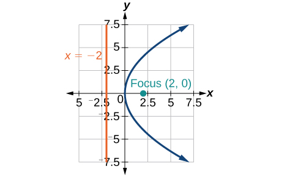 

<math xmlns="http://www.w3.org/1998/Math/MathML"> <mrow> <mi>y</mi><mo>=</mo><mn>36</mn><msup> <mi>x</mi> <mn>2</mn> </msup> </mrow> </math>

<math xmlns="http://www.w3.org/1998/Math/MathML"> <mrow> <mi>y</mi><mo>=</mo><mfrac> <mn>1</mn> <mrow> <mn>36</mn> </mrow> </mfrac> <msup> <mi>x</mi> <mn>2</mn> </msup> </mrow> </math>

 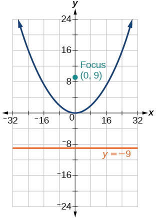 

<math xmlns="http://www.w3.org/1998/Math/MathML"> <mrow> <mi>y</mi><mo>=</mo><mn>−9</mn><msup> <mi>x</mi> <mn>2</mn> </msup> </mrow> </math>

<math xmlns="http://www.w3.org/1998/Math/MathML"> <mrow> <msup> <mrow> <mrow><mo>(</mo> <mrow> <mi>y</mi><mo>−</mo><mn>2</mn> </mrow> <mo>)</mo></mrow> </mrow> <mn>2</mn> </msup> <mo>=</mo><mo>−</mo><mfrac> <mn>4</mn> <mn>3</mn> </mfrac> <mrow><mo>(</mo> <mrow> <mi>x</mi><mo>+</mo><mn>2</mn> </mrow> <mo>)</mo></mrow> </mrow> </math>

 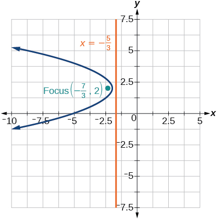 

<math xmlns="http://www.w3.org/1998/Math/MathML"> <mrow> <mn>−5</mn><msup> <mrow> <mrow><mo>(</mo> <mrow> <mi>x</mi><mo>+</mo><mn>5</mn> </mrow> <mo>)</mo></mrow> </mrow> <mn>2</mn> </msup> <mo>=</mo><mn>4</mn><mrow><mo>(</mo> <mrow> <mi>y</mi><mo>+</mo><mn>5</mn> </mrow> <mo>)</mo></mrow> </mrow> </math>

<math xmlns="http://www.w3.org/1998/Math/MathML"> <mrow> <mn>−6</mn><msup> <mrow> <mrow><mo>(</mo> <mrow> <mi>y</mi><mo>+</mo><mn>5</mn> </mrow> <mo>)</mo></mrow> </mrow> <mn>2</mn> </msup> <mo>=</mo><mn>4</mn><mrow><mo>(</mo> <mrow> <mi>x</mi><mo>−</mo><mn>4</mn> </mrow> <mo>)</mo></mrow> </mrow> </math>

 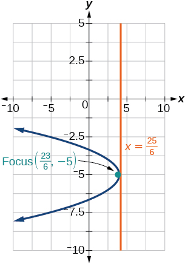 

<math xmlns="http://www.w3.org/1998/Math/MathML"> <mrow> <msup> <mi>y</mi> <mn>2</mn> </msup> <mo>−</mo><mn>6</mn><mi>y</mi><mo>−</mo><mn>8</mn><mi>x</mi><mo>+</mo><mn>1</mn><mo>=</mo><mn>0</mn> </mrow> </math>

<math xmlns="http://www.w3.org/1998/Math/MathML"> <mrow> <msup> <mi>x</mi> <mn>2</mn> </msup> <mo>+</mo><mn>8</mn><mi>x</mi><mo>+</mo><mn>4</mn><mi>y</mi><mo>+</mo><mn>20</mn><mo>=</mo><mn>0</mn> </mrow> </math>

 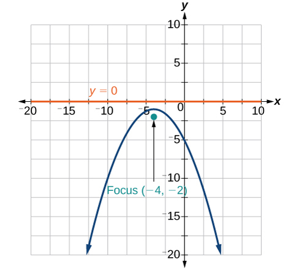 

<math xmlns="http://www.w3.org/1998/Math/MathML"> <mrow> <mn>3</mn><msup> <mi>x</mi> <mn>2</mn> </msup> <mo>+</mo><mn>30</mn><mi>x</mi><mo>−</mo><mn>4</mn><mi>y</mi><mo>+</mo><mn>95</mn><mo>=</mo><mn>0</mn> </mrow> </math>

<math xmlns="http://www.w3.org/1998/Math/MathML"> <mrow> <msup> <mi>y</mi> <mn>2</mn> </msup> <mo>−</mo><mn>8</mn><mi>x</mi><mo>+</mo><mn>10</mn><mi>y</mi><mo>+</mo><mn>9</mn><mo>=</mo><mn>0</mn> </mrow> </math>

 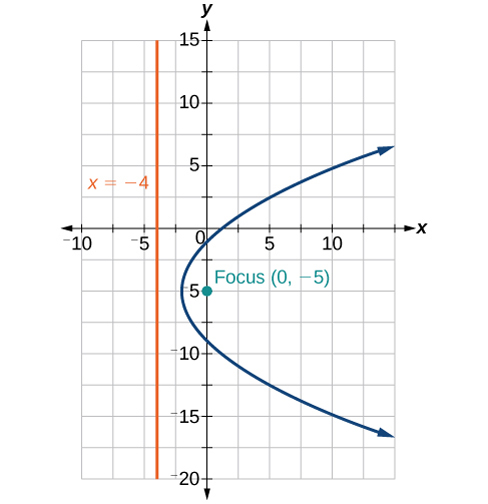 

<math xmlns="http://www.w3.org/1998/Math/MathML"> <mrow> <msup> <mi>x</mi> <mn>2</mn> </msup> <mo>+</mo><mn>4</mn><mi>x</mi><mo>+</mo><mn>2</mn><mi>y</mi><mo>+</mo><mn>2</mn><mo>=</mo><mn>0</mn> </mrow> </math>

<math xmlns="http://www.w3.org/1998/Math/MathML"> <mrow> <msup> <mi>y</mi> <mn>2</mn> </msup> <mo>+</mo><mn>2</mn><mi>y</mi><mo>−</mo><mn>12</mn><mi>x</mi><mo>+</mo><mn>61</mn><mo>=</mo><mn>0</mn> </mrow> </math>

 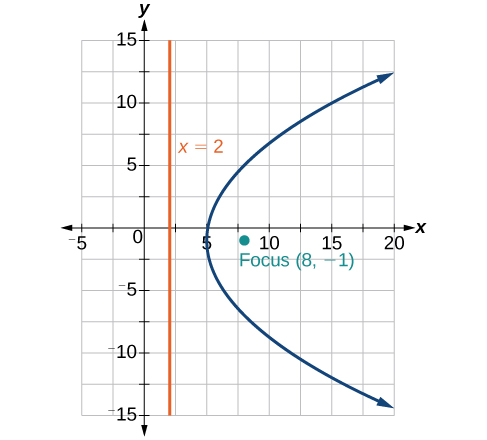 

<math xmlns="http://www.w3.org/1998/Math/MathML"> <mrow> <mo>−</mo><mn>2</mn><msup> <mi>x</mi> <mn>2</mn> </msup> <mo>+</mo><mn>8</mn><mi>x</mi><mo>−</mo><mn>4</mn><mi>y</mi><mo>−</mo><mn>24</mn><mo>=</mo><mn>0</mn> </mrow> </math>

For the following exercises, find the equation of the parabola given information about its graph.

Vertex is<math xmlns="http://www.w3.org/1998/Math/MathML"> <mrow> <mtext> </mtext><mrow><mo>(</mo> <mrow> <mn>0</mn><mo>,</mo><mn>0</mn> </mrow> <mo>)</mo></mrow><mo>;</mo> </mrow> </math>

directrix is<math xmlns="http://www.w3.org/1998/Math/MathML"> <mrow> <mtext> </mtext><mi>y</mi><mo>=</mo><mn>4</mn><mo>,</mo> </mrow> </math>

 focus is<math xmlns="http://www.w3.org/1998/Math/MathML"> <mrow> <mtext> </mtext><mrow><mo>(</mo> <mrow> <mn>0</mn><mo>,</mo><mn>−4</mn> </mrow> <mo>)</mo></mrow><mo>.</mo> </mrow> </math>

<math xmlns="http://www.w3.org/1998/Math/MathML"> <mrow> <msup> <mi>x</mi> <mn>2</mn> </msup> <mo>=</mo><mn>−16</mn><mi>y</mi> </mrow> </math>

Vertex is<math xmlns="http://www.w3.org/1998/Math/MathML"> <mrow> <mtext> </mtext><mrow><mo>(</mo> <mrow> <mn>0</mn><mo>,</mo><mn>0</mn> </mrow> <mo>)</mo></mrow><mo>;</mo><mtext> </mtext> </mrow> </math>

directrix is<math xmlns="http://www.w3.org/1998/Math/MathML"> <mrow> <mtext> </mtext><mi>x</mi><mo>=</mo><mn>4</mn><mo>,</mo> </mrow> </math>

 focus is<math xmlns="http://www.w3.org/1998/Math/MathML"> <mrow> <mtext> </mtext><mrow><mo>(</mo> <mrow> <mn>−4</mn><mo>,</mo><mn>0</mn> </mrow> <mo>)</mo></mrow><mo>.</mo> </mrow> </math>

Vertex is<math xmlns="http://www.w3.org/1998/Math/MathML"> <mrow> <mtext> </mtext><mrow><mo>(</mo> <mrow> <mn>2</mn><mo>,</mo><mn>2</mn> </mrow> <mo>)</mo></mrow><mo>;</mo><mtext> </mtext> </mrow> </math>

 directrix is<math xmlns="http://www.w3.org/1998/Math/MathML"> <mrow> <mtext> </mtext><mi>x</mi><mo>=</mo><mn>2</mn><mo>−</mo><msqrt> <mn>2</mn> </msqrt> <mo>,</mo> </mrow> </math>

 focus is<math xmlns="http://www.w3.org/1998/Math/MathML"> <mrow> <mtext> </mtext><mrow><mo>(</mo> <mrow> <mn>2</mn><mo>+</mo><msqrt> <mn>2</mn> </msqrt> <mo>,</mo><mn>2</mn> </mrow> <mo>)</mo></mrow><mo>.</mo> </mrow> </math>

<math xmlns="http://www.w3.org/1998/Math/MathML"> <mrow> <msup> <mrow> <mrow><mo>(</mo> <mrow> <mi>y</mi><mo>−</mo><mn>2</mn> </mrow> <mo>)</mo></mrow> </mrow> <mn>2</mn> </msup> <mo>=</mo><mn>4</mn><msqrt> <mn>2</mn> </msqrt> <mrow><mo>(</mo> <mrow> <mi>x</mi><mo>−</mo><mn>2</mn> </mrow> <mo>)</mo></mrow> </mrow> </math>

Vertex is<math xmlns="http://www.w3.org/1998/Math/MathML"> <mrow> <mtext> </mtext><mrow><mo>(</mo> <mrow> <mn>−2</mn><mo>,</mo><mn>3</mn> </mrow> <mo>)</mo></mrow><mo>;</mo><mtext> </mtext> </mrow> </math>

directrix is<math xmlns="http://www.w3.org/1998/Math/MathML"> <mrow> <mtext> </mtext><mi>x</mi><mo>=</mo><mo>−</mo><mfrac> <mn>7</mn> <mn>2</mn> </mfrac> <mo>,</mo> </mrow> </math>

 focus is<math xmlns="http://www.w3.org/1998/Math/MathML"> <mrow> <mtext> </mtext><mrow><mo>(</mo> <mrow> <mo>−</mo><mfrac> <mn>1</mn> <mn>2</mn> </mfrac> <mo>,</mo><mn>3</mn> </mrow> <mo>)</mo></mrow><mo>.</mo> </mrow> </math>

Vertex is<math xmlns="http://www.w3.org/1998/Math/MathML"> <mrow> <mtext> </mtext><mrow><mo>(</mo> <mrow> <msqrt> <mn>2</mn> </msqrt> <mo>,</mo><mo>−</mo><msqrt> <mn>3</mn> </msqrt> </mrow> <mo>)</mo></mrow><mo>;</mo> </mrow> </math>

 directrix is<math xmlns="http://www.w3.org/1998/Math/MathML"> <mrow> <mtext> </mtext><mi>x</mi><mo>=</mo><mn>2</mn><msqrt> <mn>2</mn> </msqrt> <mo>,</mo> </mrow> </math>

 focus is<math xmlns="http://www.w3.org/1998/Math/MathML"> <mrow> <mtext> </mtext><mrow><mo>(</mo> <mrow> <mn>0</mn><mo>,</mo><mo>−</mo><msqrt> <mn>3</mn> </msqrt> </mrow> <mo>)</mo></mrow><mo>.</mo> </mrow> </math>

<math xmlns="http://www.w3.org/1998/Math/MathML"> <mrow> <msup> <mrow> <mrow><mo>(</mo> <mrow> <mi>y</mi><mo>+</mo><msqrt> <mn>3</mn> </msqrt> </mrow> <mo>)</mo></mrow> </mrow> <mn>2</mn> </msup> <mo>=</mo><mn>−4</mn><msqrt> <mn>2</mn> </msqrt> <mrow><mo>(</mo> <mrow> <mi>x</mi><mo>−</mo><msqrt> <mn>2</mn> </msqrt> </mrow> <mo>)</mo></mrow> </mrow> </math>

Vertex is<math xmlns="http://www.w3.org/1998/Math/MathML"> <mrow> <mtext> </mtext><mrow><mo>(</mo> <mrow> <mn>1</mn><mo>,</mo><mn>2</mn> </mrow> <mo>)</mo></mrow><mo>;</mo><mtext>  </mtext> </mrow> </math>

directrix is<math xmlns="http://www.w3.org/1998/Math/MathML"> <mrow> <mtext> </mtext><mi>y</mi><mo>=</mo><mfrac> <mrow> <mn>11</mn> </mrow> <mn>3</mn> </mfrac> <mo>,</mo> </mrow> </math>

 focus is<math xmlns="http://www.w3.org/1998/Math/MathML"> <mrow> <mtext> </mtext><mrow><mo>(</mo> <mrow> <mn>1</mn><mo>,</mo><mfrac> <mn>1</mn> <mn>3</mn> </mfrac> </mrow> <mo>)</mo></mrow><mo>.</mo> </mrow> </math>

For the following exercises, determine the equation for the parabola from its graph.

 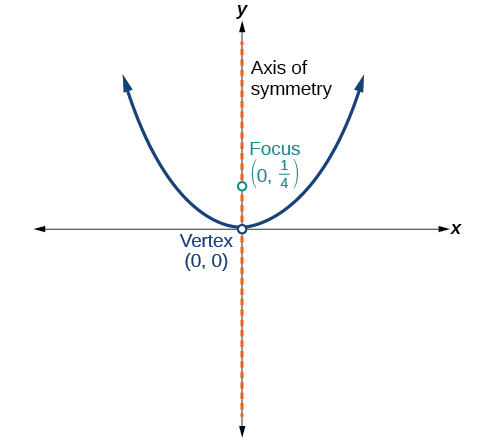 

<math xmlns="http://www.w3.org/1998/Math/MathML"> <mrow> <msup> <mi>x</mi> <mn>2</mn> </msup> <mo>=</mo><mi>y</mi> </mrow> </math>

 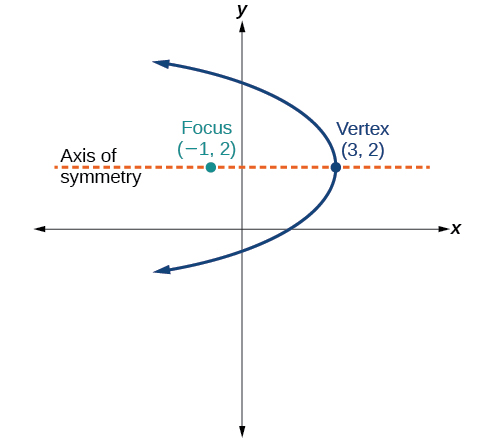 

 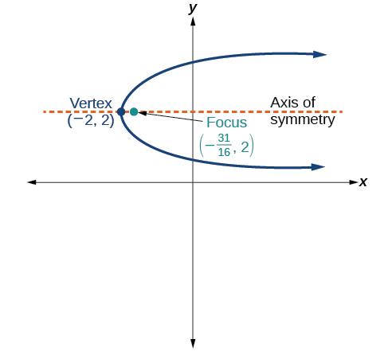 

<math xmlns="http://www.w3.org/1998/Math/MathML"> <mrow> <msup> <mrow> <mrow><mo>(</mo> <mrow> <mi>y</mi><mo>−</mo><mn>2</mn> </mrow> <mo>)</mo></mrow> </mrow> <mn>2</mn> </msup> <mo>=</mo><mfrac> <mn>1</mn> <mn>4</mn> </mfrac> <mrow><mo>(</mo> <mrow> <mi>x</mi><mo>+</mo><mn>2</mn> </mrow> <mo>)</mo></mrow> </mrow> </math>

 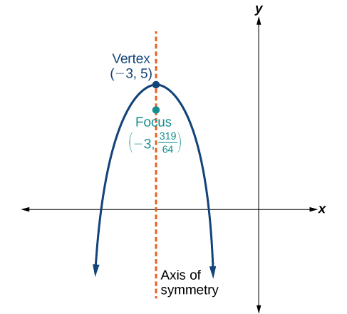 

 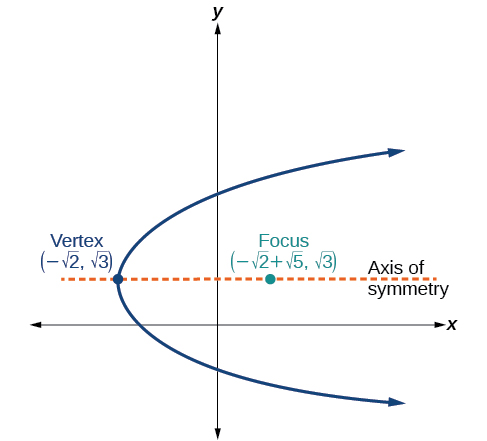 

<math xmlns="http://www.w3.org/1998/Math/MathML"> <mrow> <msup> <mrow> <mrow><mo>(</mo> <mrow> <mi>y</mi><mo>−</mo><msqrt> <mn>3</mn> </msqrt> </mrow> <mo>)</mo></mrow> </mrow> <mn>2</mn> </msup> <mo>=</mo><mn>4</mn><msqrt> <mn>5</mn> </msqrt> <mrow><mo>(</mo> <mrow> <mi>x</mi><mo>+</mo><msqrt> <mn>2</mn> </msqrt> </mrow> <mo>)</mo></mrow> </mrow> </math>

##  Extensions

For the following exercises, the vertex and endpoints of the latus rectum of a parabola are given. Find the equation.

<math xmlns="http://www.w3.org/1998/Math/MathML"> <mrow> <mi>V</mi><mrow><mo>(</mo> <mrow> <mn>0</mn><mo>,</mo><mn>0</mn> </mrow> <mo>)</mo></mrow><mo>,</mo><mtext> Endpoints </mtext><mrow><mo>(</mo> <mrow> <mn>2</mn><mo>,</mo><mn>1</mn> </mrow> <mo>)</mo></mrow><mo>,</mo><mrow><mo>(</mo> <mrow> <mn>−2</mn><mo>,</mo><mn>1</mn> </mrow> <mo>)</mo></mrow> </mrow> </math>

<math xmlns="http://www.w3.org/1998/Math/MathML"> <mrow> <mi>V</mi><mrow><mo>(</mo> <mrow> <mn>0</mn><mo>,</mo><mn>0</mn> </mrow> <mo>)</mo></mrow><mo>,</mo><mtext> Endpoints </mtext><mrow><mo>(</mo> <mrow> <mn>−2</mn><mo>,</mo><mn>4</mn> </mrow> <mo>)</mo></mrow><mo>,</mo><mrow><mo>(</mo> <mrow> <mn>−2</mn><mo>,</mo><mn>−4</mn> </mrow> <mo>)</mo></mrow> </mrow> </math>

<math xmlns="http://www.w3.org/1998/Math/MathML"> <mrow> <msup> <mi>y</mi> <mn>2</mn> </msup> <mo>=</mo><mn>−8</mn><mi>x</mi> </mrow> </math>

<math xmlns="http://www.w3.org/1998/Math/MathML"> <mrow> <mi>V</mi><mrow><mo>(</mo> <mrow> <mn>1</mn><mo>,</mo><mn>2</mn> </mrow> <mo>)</mo></mrow><mo>,</mo><mtext> Endpoints </mtext><mrow><mo>(</mo> <mrow> <mn>−5</mn><mo>,</mo><mn>5</mn> </mrow> <mo>)</mo></mrow><mo>,</mo><mrow><mo>(</mo> <mrow> <mn>7</mn><mo>,</mo><mn>5</mn> </mrow> <mo>)</mo></mrow> </mrow> </math>

<math xmlns="http://www.w3.org/1998/Math/MathML"> <mrow> <mi>V</mi><mrow><mo>(</mo> <mrow> <mn>−3</mn><mo>,</mo><mn>−1</mn> </mrow> <mo>)</mo></mrow><mo>,</mo><mtext>Endpoints </mtext><mrow><mo>(</mo> <mrow> <mn>0</mn><mo>,</mo><mn>5</mn> </mrow> <mo>)</mo></mrow><mo>,</mo><mrow><mo>(</mo> <mrow> <mn>0</mn><mo>,</mo><mn>−7</mn> </mrow> <mo>)</mo></mrow> </mrow> </math>

<math xmlns="http://www.w3.org/1998/Math/MathML"> <mrow> <msup> <mrow> <mrow><mo>(</mo> <mrow> <mi>y</mi><mo>+</mo><mn>1</mn> </mrow> <mo>)</mo></mrow> </mrow> <mn>2</mn> </msup> <mo>=</mo><mn>12</mn><mrow><mo>(</mo> <mrow> <mi>x</mi><mo>+</mo><mn>3</mn> </mrow> <mo>)</mo></mrow> </mrow> </math>

<math xmlns="http://www.w3.org/1998/Math/MathML"> <mrow> <mi>V</mi><mrow><mo>(</mo> <mrow> <mn>4</mn><mo>,</mo><mn>−3</mn> </mrow> <mo>)</mo></mrow><mo>,</mo><mtext> Endpoints </mtext><mrow><mo>(</mo> <mrow> <mn>5</mn><mo>,</mo><mo>−</mo><mfrac> <mn>7</mn> <mn>2</mn> </mfrac> </mrow> <mo>)</mo></mrow><mo>,</mo><mrow><mo>(</mo> <mrow> <mn>3</mn><mo>,</mo><mo>−</mo><mfrac> <mn>7</mn> <mn>2</mn> </mfrac> </mrow> <mo>)</mo></mrow> </mrow> </math>

##  Real-World Applications

The mirror in an automobile headlight has a parabolic cross-section with the light bulb at the focus. On a schematic, the equation of the parabola is given as<math xmlns="http://www.w3.org/1998/Math/MathML"> <mrow> <mtext> </mtext><msup> <mi>x</mi> <mn>2</mn> </msup> <mo>=</mo><mn>4</mn><mi>y</mi><mo>.</mo><mtext> </mtext> </mrow> </math>

At what coordinates should you place the light bulb?

<math xmlns="http://www.w3.org/1998/Math/MathML"> <mrow> <mrow><mo>(</mo> <mrow> <mn>0</mn><mo>,</mo><mn>1</mn> </mrow> <mo>)</mo></mrow> </mrow> </math>

If we want to construct the mirror from the previous exercise such that the focus is located at<math xmlns="http://www.w3.org/1998/Math/MathML"> <mrow> <mtext> </mtext><mrow><mo>(</mo> <mrow> <mn>0</mn><mo>,</mo><mn>0.25</mn> </mrow> <mo>)</mo></mrow><mo>,</mo> </mrow> </math>

 what should the equation of the parabola be?

A satellite dish is shaped like a paraboloid of revolution. This means that it can be formed by rotating a parabola around its axis of symmetry. The receiver is to be located at the focus. If the dish is 12 feet across at its opening and 4 feet deep at its center, where should the receiver be placed?

At the point 2.25 feet above the vertex.

Consider the satellite dish from the previous exercise. If the dish is 8 feet across at the opening and 2 feet deep, where should we place the receiver?

A searchlight is shaped like a paraboloid of revolution. A light source is located 1 foot from the base along the axis of symmetry. If the opening of the searchlight is 3 feet across, find the depth.

0\.5625 feet

If the searchlight from the previous exercise has the light source located 6 inches from the base along the axis of symmetry and the opening is 4 feet, find the depth.

An arch is in the shape of a parabola. It has a span of 100 feet and a maximum height of 20 feet. Find the equation of the parabola, and determine the height of the arch 40 feet from the center.

<math xmlns="http://www.w3.org/1998/Math/MathML"> <mrow> <msup> <mi>x</mi> <mn>2</mn> </msup> <mo>=</mo><mn>−125</mn><mrow><mo>(</mo> <mrow> <mi>y</mi><mo>−</mo><mn>20</mn> </mrow> <mo>)</mo></mrow><mo>,</mo> </mrow> </math>

 height is 7.2 feet

If the arch from the previous exercise has a span of 160 feet and a maximum height of 40 feet, find the equation of the parabola, and determine the distance from the center at which the height is 20 feet.

An object is projected so as to follow a parabolic path given by<math xmlns="http://www.w3.org/1998/Math/MathML"> <mrow> <mtext> </mtext><mi>y</mi><mo>=</mo><mo>−</mo><msup> <mi>x</mi> <mn>2</mn> </msup> <mo>+</mo><mn>96</mn><mi>x</mi><mo>,</mo> </mrow> </math>

where<math xmlns="http://www.w3.org/1998/Math/MathML"> <mrow> <mtext> </mtext><mi>x</mi><mtext> </mtext> </mrow> </math>

is the horizontal distance traveled in feet and<math xmlns="http://www.w3.org/1998/Math/MathML"> <mrow> <mtext> </mtext><mi>y</mi><mtext> </mtext> </mrow> </math>

is the height. Determine the maximum height the object reaches.

2304 feet

For the object from the previous exercise, assume the path followed is given by<math xmlns="http://www.w3.org/1998/Math/MathML"> <mrow> <mtext> </mtext><mi>y</mi><mo>=</mo><mn>−0.5</mn><msup> <mi>x</mi> <mn>2</mn> </msup> <mo>+</mo><mn>80</mn><mi>x</mi><mo>.</mo><mtext> </mtext> </mrow> </math>

 Determine how far along the horizontal the object traveled to reach maximum height.

## Glossary
{: data-type="glossary-title"}

directrix
: a line perpendicular to the axis of symmetry of a parabola; a line such that the ratio of the distance between the points on the conic and the focus to the distance to the directrix is constant
{: .definition}

focus (of a parabola)
: a fixed point in the interior of a parabola that lies on the axis of symmetry
{: .definition}

latus rectum
: the line segment that passes through the focus of a parabola parallel to the directrix, with endpoints on the parabola
{: .definition}

parabola
: the set of all points
  <math xmlns="http://www.w3.org/1998/Math/MathML"> <mrow> <mtext> </mtext><mrow><mo>(</mo> <mrow> <mi>x</mi><mo>,</mo><mi>y</mi> </mrow> <mo>)</mo></mrow><mtext> </mtext> </mrow> </math>
  
  in a plane that are the same distance from a fixed line, called the directrix, and a fixed point (the focus) not on the directrix
{: .definition}

[1]: http://openstaxcollege.org/l/parabola1
[2]: http://openstaxcollege.org/l/parabola2
[3]: http://openstaxcollege.org/l/parabolavertcal
[4]: http://openstaxcollege.org/l/parabolahoriz
