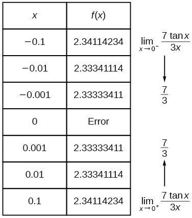
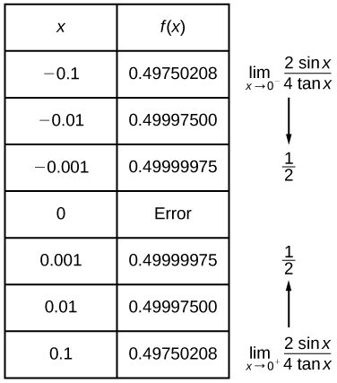

In this section, you will:
* Understand limit notation.
* Find a limit using a graph.
* Find a limit using a table.

Intuitively, we know what a **limit**{: data-type="term" .no-emphasis} is. A car can go only so fast and no faster. A trash can might hold 33 gallons and no more. It is natural for measured amounts to have limits. What, for instance, is the limit to the height of a woman? The tallest woman on record was Jinlian Zeng from China, who was 8 ft 1 in.[1](#footnote1){: data-type="footnote-number" name="footnote-ref1"} Is this the limit of the height to which women can grow? Perhaps not, but there is likely a limit that we might describe in inches if we were able to determine what it was.

To put it mathematically, the function whose input is a woman and whose output is a measured height in inches has a limit. In this section, we will examine numerical and graphical approaches to identifying limits.

# Understanding Limit Notation

We have seen how a **sequence**{: data-type="term" .no-emphasis} can have a limit, a value that the sequence of terms moves toward as the nu mber of terms increases. For example, the terms of the sequence

<math xmlns="http://www.w3.org/1998/Math/MathML" display="block"> <mrow> <mn>1</mn><mo>,</mo><mfrac> <mn>1</mn> <mn>2</mn> </mfrac> <mo>,</mo><mfrac> <mn>1</mn> <mn>4</mn> </mfrac> <mo>,</mo><mfrac> <mn>1</mn> <mn>8</mn> </mfrac> <mn>...</mn> </mrow> </math>

gets closer and closer to 0. A sequence is one type of function, but functions that are not sequences can also have limits. We can describe the behavior of the function as the input values get close to a specific value. If the limit of a function<math xmlns="http://www.w3.org/1998/Math/MathML"><mtext> </mtext> <mrow> <mi>f</mi><mo stretchy="false">(</mo><mi>x</mi><mo stretchy="false">)</mo><mo>=</mo><mi>L</mi><mtext>,</mtext> </mrow> <mtext> </mtext></math>

then as the input<math xmlns="http://www.w3.org/1998/Math/MathML"><mtext>  </mtext> <mi>x</mi> <mtext>  </mtext></math>

gets closer and closer to<math xmlns="http://www.w3.org/1998/Math/MathML"><mtext> </mtext> <mrow> <mi>a</mi><mo>,</mo> </mrow> </math>

 the output *y*-coordinate gets closer and closer to<math xmlns="http://www.w3.org/1998/Math/MathML"><mtext> </mtext> <mrow> <mi>L</mi><mo>.</mo> </mrow> <mtext> </mtext></math>

We say that the output “approaches”<math xmlns="http://www.w3.org/1998/Math/MathML"><mtext> </mtext> <mrow> <mi>L</mi><mo>.</mo> </mrow> </math>

[\[link\]](#CNX_Precalc_Figure_12_01_001) provides a visual representation of the mathematical concept of limit. As the input value<math xmlns="http://www.w3.org/1998/Math/MathML"><mtext>  </mtext> <mi>x</mi> <mtext>  </mtext></math>

approaches<math xmlns="http://www.w3.org/1998/Math/MathML"><mtext> </mtext> <mrow> <mi>a</mi><mo>,</mo> </mrow> </math>

 the output value<math xmlns="http://www.w3.org/1998/Math/MathML"><mtext> </mtext> <mrow> <mi>f</mi><mrow><mo>(</mo> <mi>x</mi> <mo>)</mo></mrow> </mrow> <mtext> </mtext></math>

approaches<math xmlns="http://www.w3.org/1998/Math/MathML"><mtext> </mtext> <mrow> <mi>L</mi><mo>.</mo> </mrow> </math>

 approaches&#x2009;&#10; L&#10;&#x2009;as the input (x-coordinate) approaches&#x2009;&#10; &#10;  a.&#10; &#10;"){: #CNX_Precalc_Figure_12_01_001}

We write the equation of a limit as

<math xmlns="http://www.w3.org/1998/Math/MathML" display="block"> <mrow> <munder> <mrow> <mi>lim</mi> </mrow> <mrow> <mi>x</mi><mo stretchy="false">→</mo><mi>a</mi> </mrow> </munder> <mi>f</mi><mo stretchy="false">(</mo><mi>x</mi><mo stretchy="false">)</mo><mo>=</mo><mi>L</mi><mo>.</mo> </mrow> </math>

This notation indicates that as<math xmlns="http://www.w3.org/1998/Math/MathML"><mtext>  </mtext> <mi>x</mi> <mtext>  </mtext></math>

approaches<math xmlns="http://www.w3.org/1998/Math/MathML"><mtext>  </mtext> <mi>a</mi> <mtext>  </mtext></math>

both from the left of<math xmlns="http://www.w3.org/1998/Math/MathML"><mtext>  </mtext> <mrow> <mi>x</mi><mo>=</mo><mi>a</mi> </mrow> <mtext>  </mtext></math>

and the right of<math xmlns="http://www.w3.org/1998/Math/MathML"><mtext>  </mtext> <mrow> <mi>x</mi><mo>=</mo><mi>a</mi><mo>,</mo> </mrow> </math>

 the output value approaches<math xmlns="http://www.w3.org/1998/Math/MathML"><mtext> </mtext> <mrow> <mi>L</mi><mo>.</mo> </mrow> </math>

Consider the function

<math xmlns="http://www.w3.org/1998/Math/MathML" display="block"> <mrow> <mi>f</mi><mo stretchy="false">(</mo><mi>x</mi><mo stretchy="false">)</mo><mo>=</mo><mfrac> <mrow> <msup> <mi>x</mi> <mn>2</mn> </msup> <mo>−</mo><mn>6</mn><mi>x</mi><mo>−</mo><mn>7</mn> </mrow> <mrow> <mi>x</mi><mo>−</mo><mn>7</mn> </mrow> </mfrac> <mo>.</mo> </mrow> </math>

We can factor the function as shown.

<math xmlns="http://www.w3.org/1998/Math/MathML" display="block"> <mrow> <mtable columnalign="left"> <mtr columnalign="left"> <mtd columnalign="left"> <mrow> <mi>f</mi><mo stretchy="false">(</mo><mi>x</mi><mo stretchy="false">)</mo><mo>=</mo><mfrac> <mrow> <menclose notation="updiagonalstrike"> <mrow> <mo stretchy="false">(</mo><mi>x</mi><mo>−</mo><mn>7</mn><mo stretchy="false">)</mo> </mrow> </menclose> <mo stretchy="false">(</mo><mi>x</mi><mo>+</mo><mn>1</mn><mo stretchy="false">)</mo> </mrow> <mrow> <menclose notation="updiagonalstrike"> <mrow> <mi>x</mi><mo>−</mo><mn>7</mn> </mrow> </menclose> </mrow> </mfrac> <mtext> </mtext> </mrow> </mtd> <mtd columnalign="left"> <mrow> <mtext>Cancel like factors in numerator and denominator</mtext><mtext>.</mtext> </mrow> </mtd> </mtr> <mtr columnalign="left"> <mtd columnalign="left"> <mrow> <mi>f</mi><mo stretchy="false">(</mo><mi>x</mi><mo stretchy="false">)</mo><mo>=</mo><mi>x</mi><mo>+</mo><mn>1</mn><mo>,</mo><mi>x</mi><mo>≠</mo><mn>7</mn> </mrow> </mtd> <mtd columnalign="left"> <mrow> <mtext>Simplify</mtext><mo>.</mo> </mrow> </mtd> </mtr> </mtable> </mrow> </math>

Notice that<math xmlns="http://www.w3.org/1998/Math/MathML"><mtext> </mtext> <mi>x</mi> <mtext> </mtext></math>

cannot be 7, or we would be dividing by 0, so 7 is not in the domain of the original function. In order to avoid changing the function when we simplify, we set the same condition,<math xmlns="http://www.w3.org/1998/Math/MathML"><mtext>  </mtext> <mrow> <mi>x</mi><mo>≠</mo><mn>7</mn><mo>,</mo> </mrow> </math>

 for the simplified function. We can represent the function graphically as shown in [\[link\]](#CNX_Precalc_Figure_12_01_002).

{: #CNX_Precalc_Figure_12_01_002}

What happens at<math xmlns="http://www.w3.org/1998/Math/MathML"><mtext>  </mtext> <mrow> <mi>x</mi><mo>=</mo><mn>7</mn> </mrow> <mtext>  </mtext></math>

is completely different from what happens at points close to<math xmlns="http://www.w3.org/1998/Math/MathML"><mtext>  </mtext> <mrow> <mi>x</mi><mo>=</mo><mn>7</mn> </mrow> <mtext>  </mtext></math>

on either side. The notation

<math xmlns="http://www.w3.org/1998/Math/MathML" display="block"> <mrow> <munder> <mrow> <mi>lim</mi> </mrow> <mrow> <mi>x</mi><mo stretchy="false">→</mo><mtext> </mtext><mn>7</mn> </mrow> </munder> <mi>f</mi><mo stretchy="false">(</mo><mi>x</mi><mo stretchy="false">)</mo><mo>=</mo><mn>8</mn> </mrow> </math>

indicates that as the input<math xmlns="http://www.w3.org/1998/Math/MathML"><mtext>  </mtext> <mi>x</mi> <mtext>  </mtext></math>

approaches 7 from either the left or the right, the output approaches 8. The output can get as close to 8 as we like if the input is sufficiently near 7.

What happens at<math xmlns="http://www.w3.org/1998/Math/MathML"><mtext>  </mtext> <mrow> <mi>x</mi><mo>=</mo><mn>7</mn><mo>?</mo> </mrow> <mtext>  </mtext></math>

When<math xmlns="http://www.w3.org/1998/Math/MathML"><mtext>  </mtext> <mrow> <mi>x</mi><mo>=</mo><mn>7</mn><mo>,</mo> </mrow> </math>

 there is no corresponding output. We write this as

<math xmlns="http://www.w3.org/1998/Math/MathML" display="block"> <mrow> <mi>f</mi><mo stretchy="false">(</mo><mn>7</mn><mo stretchy="false">)</mo><mtext> does not exist</mtext><mtext>.</mtext> </mrow> </math>

This notation indicates that 7 is not in the domain of the function. We had already indicated this when we wrote the function as

<math xmlns="http://www.w3.org/1998/Math/MathML" display="block"> <mrow> <mi>f</mi><mo stretchy="false">(</mo><mi>x</mi><mo stretchy="false">)</mo><mo>=</mo><mi>x</mi><mo>+</mo><mn>1</mn><mo>,</mo><mtext>  </mtext><mi>x</mi><mo>≠</mo><mn>7.</mn> </mrow> </math>

Notice that the limit of a function can exist even when<math xmlns="http://www.w3.org/1998/Math/MathML"><mtext> </mtext> <mrow> <mi>f</mi><mo stretchy="false">(</mo><mi>x</mi><mo stretchy="false">)</mo> </mrow> <mtext> </mtext></math>

is not defined at<math xmlns="http://www.w3.org/1998/Math/MathML"><mtext> </mtext> <mrow> <mi>x</mi><mo>=</mo><mi>a</mi><mo>.</mo> </mrow> <mtext> </mtext></math>

Much of our subsequent work will be determining limits of functions as<math xmlns="http://www.w3.org/1998/Math/MathML"><mtext>  </mtext> <mi>x</mi> <mtext>  </mtext></math>

nears<math xmlns="http://www.w3.org/1998/Math/MathML"><mtext>  </mtext> <mrow> <mi>a</mi><mo>,</mo> </mrow> </math>

 even though the output at<math xmlns="http://www.w3.org/1998/Math/MathML"><mtext> </mtext> <mrow> <mi>x</mi><mo>=</mo><mi>a</mi> </mrow> <mtext> </mtext></math>

does not exist.

The Limit of a Function

A quantity<math xmlns="http://www.w3.org/1998/Math/MathML"><mtext> </mtext> <mi>L</mi> <mtext> </mtext></math>

is the **limit**{: data-type="term"} of a function<math xmlns="http://www.w3.org/1998/Math/MathML"><mtext> </mtext> <mrow> <mi>f</mi><mrow><mo>(</mo> <mi>x</mi> <mo>)</mo></mrow> </mrow> <mtext> </mtext></math>

as<math xmlns="http://www.w3.org/1998/Math/MathML"><mtext> </mtext> <mi>x</mi> <mtext> </mtext></math>

approaches<math xmlns="http://www.w3.org/1998/Math/MathML"><mtext> </mtext> <mi>a</mi> <mtext> </mtext></math>

if, as the input values of<math xmlns="http://www.w3.org/1998/Math/MathML"><mtext> </mtext> <mi>x</mi> <mtext> </mtext></math>

approach<math xmlns="http://www.w3.org/1998/Math/MathML"><mtext> </mtext> <mi>a</mi> <mtext> </mtext></math>

(but do not equal<math xmlns="http://www.w3.org/1998/Math/MathML"><mtext> </mtext> <mrow> <mi>a</mi><mo stretchy="false">)</mo><mo>,</mo> </mrow> </math>

the corresponding output values of<math xmlns="http://www.w3.org/1998/Math/MathML"><mtext> </mtext> <mrow> <mi>f</mi><mrow><mo>(</mo> <mi>x</mi> <mo>)</mo></mrow> </mrow> <mtext> </mtext></math>

get closer to<math xmlns="http://www.w3.org/1998/Math/MathML"><mtext> </mtext> <mrow> <mi>L</mi><mo>.</mo> </mrow> <mtext> </mtext></math>

Note that the value of the limit is not affected by the output value of<math xmlns="http://www.w3.org/1998/Math/MathML"><mtext> </mtext> <mrow> <mi>f</mi><mrow><mo>(</mo> <mi>x</mi> <mo>)</mo></mrow> </mrow> <mtext> </mtext></math>

at<math xmlns="http://www.w3.org/1998/Math/MathML"><mtext> </mtext> <mrow> <mi>a</mi><mo>.</mo> </mrow> <mtext> </mtext></math>

Both<math xmlns="http://www.w3.org/1998/Math/MathML"><mtext> </mtext> <mi>a</mi> <mtext> </mtext></math>

and<math xmlns="http://www.w3.org/1998/Math/MathML"><mtext> </mtext> <mi>L</mi> <mtext> </mtext></math>

must be real numbers. We write it as

<math xmlns="http://www.w3.org/1998/Math/MathML" display="block"> <mrow> <munder> <mrow> <mi>lim</mi> </mrow> <mrow> <mi>x</mi><mo stretchy="false">→</mo><mi>a</mi> </mrow> </munder> <mi>f</mi><mo stretchy="false">(</mo><mi>x</mi><mo stretchy="false">)</mo><mo>=</mo><mi>L</mi> </mrow> </math>

Understanding the Limit of a Function

For the following limit, define<math xmlns="http://www.w3.org/1998/Math/MathML"><mtext> </mtext> <mrow> <mi>a</mi><mo>,</mo><mi>f</mi><mo stretchy="false">(</mo><mi>x</mi><mo stretchy="false">)</mo><mo>,</mo><mtext>  </mtext> </mrow> </math>

and<math xmlns="http://www.w3.org/1998/Math/MathML"><mtext> </mtext> <mrow> <mi>L</mi><mo>.</mo> </mrow> </math>

<math xmlns="http://www.w3.org/1998/Math/MathML" display="block"> <mrow> <munder> <mrow> <mi>lim</mi> </mrow> <mrow> <mi>x</mi><mo stretchy="false">→</mo><mn>2</mn> </mrow> </munder> <mtext> </mtext><mrow><mo>(</mo> <mrow> <mn>3</mn><mi>x</mi><mo>+</mo><mn>5</mn> </mrow> <mo>)</mo></mrow><mo>=</mo><mn>11</mn> </mrow> </math>

First, we recognize the notation of a limit. If the limit exists, as<math xmlns="http://www.w3.org/1998/Math/MathML"><mtext> </mtext> <mi>x</mi> <mtext> </mtext></math>

approaches<math xmlns="http://www.w3.org/1998/Math/MathML"><mtext> </mtext> <mrow> <mi>a</mi><mo>,</mo> </mrow> </math>

 we write

<math xmlns="http://www.w3.org/1998/Math/MathML" display="block"> <mrow> <munder> <mrow> <mi>lim</mi> </mrow> <mrow> <mi>x</mi><mo stretchy="false">→</mo><mi>a</mi> </mrow> </munder> <mtext> </mtext><mi>f</mi><mo stretchy="false">(</mo><mi>x</mi><mo stretchy="false">)</mo><mo>=</mo><mi>L</mi><mo>.</mo> </mrow> </math>

We are given

<math xmlns="http://www.w3.org/1998/Math/MathML" display="block"> <mrow> <munder> <mrow> <mi>lim</mi> </mrow> <mrow> <mi>x</mi><mo stretchy="false">→</mo><mn>2</mn> </mrow> </munder> <mrow><mo>(</mo> <mrow> <mn>3</mn><mi>x</mi><mo>+</mo><mn>5</mn> </mrow> <mo>)</mo></mrow><mo>=</mo><mn>11.</mn> </mrow> </math>

This means that<math xmlns="http://www.w3.org/1998/Math/MathML"><mtext> </mtext> <mrow> <mi>a</mi><mo>=</mo><mn>2</mn><mo>,</mo><mi>f</mi><mo stretchy="false">(</mo><mi>x</mi><mo stretchy="false">)</mo><mo>=</mo><mn>3</mn><mi>x</mi><mo>+</mo><mn>5</mn><mo>,</mo><mtext> and </mtext><mi>L</mi><mo>=</mo><mn>11.</mn> </mrow> </math>

Analysis

Recall that<math xmlns="http://www.w3.org/1998/Math/MathML"><mtext> </mtext> <mrow> <mi>y</mi><mo>=</mo><mn>3</mn><mi>x</mi><mo>+</mo><mn>5</mn> </mrow> <mtext> </mtext></math>

is a line with no breaks. As the input values approach 2, the output values will get close to 11. This may be phrased with the equation<math xmlns="http://www.w3.org/1998/Math/MathML"><mtext> </mtext> <mrow> <munder> <mrow> <mi>lim</mi> </mrow> <mrow> <mi>x</mi><mo stretchy="false">→</mo><mn>2</mn> </mrow> </munder> <mo stretchy="false">(</mo><mn>3</mn><mi>x</mi><mo>+</mo><mn>5</mn><mo stretchy="false">)</mo><mo>=</mo><mn>11</mn> </mrow> <mo>,</mo></math>

 which means that as<math xmlns="http://www.w3.org/1998/Math/MathML"><mtext> </mtext> <mi>x</mi> <mtext> </mtext></math>

nears 2 (but is not exactly 2), the output of the function<math xmlns="http://www.w3.org/1998/Math/MathML"><mtext> </mtext> <mrow> <mi>f</mi><mo stretchy="false">(</mo><mi>x</mi><mo stretchy="false">)</mo><mo>=</mo><mn>3</mn><mi>x</mi><mo>+</mo><mn>5</mn> </mrow> <mtext> </mtext></math>

gets as close as we want to<math xmlns="http://www.w3.org/1998/Math/MathML"><mtext> </mtext> <mrow> <mn>3</mn><mo stretchy="false">(</mo><mn>2</mn><mo stretchy="false">)</mo><mo>+</mo><mn>5</mn><mo>,</mo> </mrow> </math>

 or 11, which is the limit<math xmlns="http://www.w3.org/1998/Math/MathML"><mtext> </mtext> <mrow> <mi>L</mi><mo>,</mo> </mrow> </math>

 as we take values of<math xmlns="http://www.w3.org/1998/Math/MathML"><mtext> </mtext> <mi>x</mi> <mtext> </mtext></math>

sufficiently near 2 but not at<math xmlns="http://www.w3.org/1998/Math/MathML"><mtext> </mtext> <mrow> <mi>x</mi><mo>=</mo><mn>2.</mn> </mrow> </math>

For the following limit, define<math xmlns="http://www.w3.org/1998/Math/MathML"><mtext> </mtext> <mrow> <mi>a</mi><mo>,</mo><mi>f</mi><mo stretchy="false">(</mo><mi>x</mi><mo stretchy="false">)</mo><mo>,</mo> </mrow> </math>

and<math xmlns="http://www.w3.org/1998/Math/MathML"><mtext> </mtext> <mrow> <mi>L</mi><mo>.</mo> </mrow> </math>

<math xmlns="http://www.w3.org/1998/Math/MathML" display="block"> <mrow> <munder> <mrow> <mi>lim</mi> </mrow> <mrow> <mi>x</mi><mo stretchy="false">→</mo><mn>5</mn> </mrow> </munder> <mrow><mo>(</mo> <mrow> <mn>2</mn><msup> <mi>x</mi> <mn>2</mn> </msup> <mo>−</mo><mn>4</mn> </mrow> <mo>)</mo></mrow><mo>=</mo><mn>46</mn> </mrow> </math>

<math xmlns="http://www.w3.org/1998/Math/MathML"> <mrow> <mi>a</mi><mo>=</mo><mn>5</mn><mo>,</mo> </mrow> </math>

<math xmlns="http://www.w3.org/1998/Math/MathML"><mtext> </mtext> <mrow> <mi>f</mi><mrow><mo>(</mo> <mi>x</mi> <mo>)</mo></mrow><mo>=</mo><mn>2</mn><msup> <mi>x</mi> <mn>2</mn> </msup> <mo>−</mo><mn>4</mn><mo>,</mo> </mrow> </math>

and<math xmlns="http://www.w3.org/1998/Math/MathML"><mtext> </mtext> <mrow> <mi>L</mi><mo>=</mo><mn>46.</mn> </mrow> </math>

## Understanding Left-Hand Limits and Right-Hand Limits

We can approach the input of a function from either side of a value—from the left or the right. [\[link\]](#CNX_Precalc_Figure_12_01_013) shows the values of

<math xmlns="http://www.w3.org/1998/Math/MathML" display="block"> <mrow> <mi>f</mi><mo stretchy="false">(</mo><mi>x</mi><mo stretchy="false">)</mo><mo>=</mo><mi>x</mi><mo>+</mo><mn>1</mn><mo>,</mo><mi>x</mi><mo>≠</mo><mn>7</mn> </mrow> </math>

as described earlier and depicted in [\[link\]](#CNX_Precalc_Figure_12_01_002).

 {: #CNX_Precalc_Figure_12_01_013}

Values described as “from the left” are less than the input value 7 and would therefore appear to the left of the value on a number line. The input values that approach 7 from the left in [\[link\]](#CNX_Precalc_Figure_12_01_013) are<math xmlns="http://www.w3.org/1998/Math/MathML"><mtext> </mtext> <mrow> <mn>6.9</mn><mo>,</mo> </mrow> </math>

<math xmlns="http://www.w3.org/1998/Math/MathML"><mtext> </mtext> <mrow> <mn>6.99</mn><mo>,</mo> </mrow> </math>

 and<math xmlns="http://www.w3.org/1998/Math/MathML"><mtext> </mtext> <mrow> <mn>6.999.</mn> </mrow> <mtext> </mtext></math>

The corresponding outputs are<math xmlns="http://www.w3.org/1998/Math/MathML"><mtext> </mtext> <mrow> <mn>7.9</mn><mo>,</mo><mn>7.99</mn><mo>,</mo> </mrow> </math>

 and<math xmlns="http://www.w3.org/1998/Math/MathML"><mtext> </mtext> <mrow> <mn>7.999.</mn> </mrow> <mtext> </mtext></math>

These values are getting closer to 8. The limit of values of<math xmlns="http://www.w3.org/1998/Math/MathML"><mtext> </mtext> <mrow> <mi>f</mi><mrow><mo>(</mo> <mi>x</mi> <mo>)</mo></mrow> </mrow> <mtext> </mtext></math>

as<math xmlns="http://www.w3.org/1998/Math/MathML"><mtext> </mtext> <mi>x</mi> <mtext> </mtext></math>

approaches from the left is known as the left-hand limit. For this function, 8 is the left-hand limit of the function<math xmlns="http://www.w3.org/1998/Math/MathML"><mtext> </mtext> <mrow> <mi>f</mi><mo stretchy="false">(</mo><mi>x</mi><mo stretchy="false">)</mo><mo>=</mo><mi>x</mi><mo>+</mo><mn>1</mn><mo>,</mo><mi>x</mi><mo>≠</mo><mn>7</mn> </mrow> <mtext> </mtext></math>

as<math xmlns="http://www.w3.org/1998/Math/MathML"><mtext> </mtext> <mi>x</mi> <mtext> </mtext></math>

approaches 7.

Values described as “from the right” are greater than the input value 7 and would therefore appear to the right of the value on a number line. The input values that approach 7 from the right in [\[link\]](#CNX_Precalc_Figure_12_01_013) are<math xmlns="http://www.w3.org/1998/Math/MathML"><mtext> </mtext> <mrow> <mn>7.1</mn><mo>,</mo> </mrow> </math>

<math xmlns="http://www.w3.org/1998/Math/MathML"><mtext> </mtext> <mrow> <mn>7.01</mn><mo>,</mo> </mrow> </math>

and<math xmlns="http://www.w3.org/1998/Math/MathML"><mtext> </mtext> <mrow> <mn>7.001.</mn> </mrow> <mtext> </mtext></math>

The corresponding outputs are<math xmlns="http://www.w3.org/1998/Math/MathML"><mtext> </mtext> <mrow> <mn>8.1</mn><mo>,</mo> </mrow> </math>

<math xmlns="http://www.w3.org/1998/Math/MathML"><mtext> </mtext> <mrow> <mn>8.01</mn><mo>,</mo> </mrow> </math>

 and<math xmlns="http://www.w3.org/1998/Math/MathML"><mtext>  </mtext> <mrow> <mn>8.001.</mn> </mrow> <mtext> </mtext></math>

These values are getting closer to 8. The limit of values of<math xmlns="http://www.w3.org/1998/Math/MathML"><mtext> </mtext> <mrow> <mi>f</mi><mrow><mo>(</mo> <mi>x</mi> <mo>)</mo></mrow> </mrow> <mtext> </mtext></math>

as<math xmlns="http://www.w3.org/1998/Math/MathML"><mtext> </mtext> <mi>x</mi> <mtext> </mtext></math>

approaches from the right is known as the right-hand limit. For this function, 8 is also the right-hand limit of the function<math xmlns="http://www.w3.org/1998/Math/MathML"><mtext> </mtext> <mrow> <mi>f</mi><mo stretchy="false">(</mo><mi>x</mi><mo stretchy="false">)</mo><mo>=</mo><mi>x</mi><mo>+</mo><mn>1</mn><mo>,</mo><mi>x</mi><mo>≠</mo><mn>7</mn> </mrow> <mtext> </mtext></math>

as <math xmlns="http://www.w3.org/1998/Math/MathML"><mtext> </mtext> <mi>x</mi> <mtext> </mtext></math>

approaches 7.

[\[link\]](#CNX_Precalc_Figure_12_01_013) shows that we can get the output of the function within a distance of 0.1 from 8 by using an input within a distance of 0.1 from 7. In other words, we need an input<math xmlns="http://www.w3.org/1998/Math/MathML"><mtext> </mtext> <mi>x</mi> <mtext> </mtext></math>

within the interval<math xmlns="http://www.w3.org/1998/Math/MathML"><mtext> </mtext> <mrow> <mn>6.9</mn><mo>&lt;</mo><mi>x</mi><mo>&lt;</mo><mn>7.1</mn> </mrow> <mtext> </mtext></math>

to produce an output value of<math xmlns="http://www.w3.org/1998/Math/MathML"><mtext> </mtext> <mrow> <mi>f</mi><mrow><mo>(</mo> <mi>x</mi> <mo>)</mo></mrow> </mrow> <mtext> </mtext></math>

within the interval<math xmlns="http://www.w3.org/1998/Math/MathML"><mtext> </mtext> <mrow> <mn>7.9</mn><mo>&lt;</mo><mi>f</mi><mo stretchy="false">(</mo><mi>x</mi><mo stretchy="false">)</mo><mo>&lt;</mo><mn>8.1.</mn> </mrow> </math>

We also see that we can get output values of<math xmlns="http://www.w3.org/1998/Math/MathML"><mtext> </mtext> <mrow> <mi>f</mi><mo stretchy="false">(</mo><mi>x</mi><mo stretchy="false">)</mo> </mrow> <mtext> </mtext></math>

successively closer to 8 by selecting input values closer to 7. In fact, we can obtain output values within any specified interval if we choose appropriate input values.

[\[link\]](#CNX_Precalc_Figure_12_01_003) provides a visual representation of the left- and right-hand limits of the function. From the graph of<math xmlns="http://www.w3.org/1998/Math/MathML"><mtext> </mtext> <mrow> <mi>f</mi><mo stretchy="false">(</mo><mi>x</mi><mo stretchy="false">)</mo><mo>,</mo> </mrow> </math>

 we observe the output can get infinitesimally close to<math xmlns="http://www.w3.org/1998/Math/MathML"><mtext> </mtext> <mrow> <mi>L</mi><mo>=</mo><mn>8</mn> </mrow> <mtext> </mtext></math>

as<math xmlns="http://www.w3.org/1998/Math/MathML"><mtext> </mtext> <mi>x</mi> <mtext> </mtext></math>

approaches 7 from the left and as<math xmlns="http://www.w3.org/1998/Math/MathML"><mtext> </mtext> <mi>x</mi> <mtext> </mtext></math>

approaches 7 from the right.

To indicate the left-hand limit, we write

<math xmlns="http://www.w3.org/1998/Math/MathML" display="block"> <mrow> <munder> <mrow> <mi>lim</mi> </mrow> <mrow> <mi>x</mi><mo stretchy="false">→</mo><msup> <mn>7</mn> <mo>−</mo> </msup> </mrow> </munder> <mi>f</mi><mo stretchy="false">(</mo><mi>x</mi><mo stretchy="false">)</mo><mo>=</mo><mn>8.</mn> </mrow> </math>

To indicate the right-hand limit, we write

<math xmlns="http://www.w3.org/1998/Math/MathML" display="block"> <mrow> <munder> <mrow> <mi>lim</mi> </mrow> <mrow> <mi>x</mi><mo stretchy="false">→</mo><msup> <mn>7</mn> <mo>+</mo> </msup> </mrow> </munder> <mi>f</mi><mo stretchy="false">(</mo><mi>x</mi><mo stretchy="false">)</mo><mo>=</mo><mn>8.</mn> </mrow> </math>

{: #CNX_Precalc_Figure_12_01_003}

Left- and Right-Hand Limits

The **left-hand limit**{: data-type="term"} of a function<math xmlns="http://www.w3.org/1998/Math/MathML"><mtext> </mtext> <mrow> <mi>f</mi><mo stretchy="false">(</mo><mi>x</mi><mo stretchy="false">)</mo> </mrow> <mtext> </mtext></math>

as<math xmlns="http://www.w3.org/1998/Math/MathML"><mtext> </mtext> <mi>x</mi> <mtext> </mtext></math>

approaches<math xmlns="http://www.w3.org/1998/Math/MathML"><mtext> </mtext> <mi>a</mi> <mtext> </mtext></math>

from the left is equal to<math xmlns="http://www.w3.org/1998/Math/MathML"><mtext> </mtext> <mrow> <mi>L</mi><mo>,</mo> </mrow> </math>

 denoted by

<math xmlns="http://www.w3.org/1998/Math/MathML" display="block"> <mrow> <munder> <mrow> <mi>lim</mi> </mrow> <mrow> <mi>x</mi><mo stretchy="false">→</mo><msup> <mi>a</mi> <mo>−</mo> </msup> </mrow> </munder> <mi>f</mi><mo stretchy="false">(</mo><mi>x</mi><mo stretchy="false">)</mo><mo>=</mo><mi>L</mi><mo>.</mo> </mrow> </math>

The values of<math xmlns="http://www.w3.org/1998/Math/MathML"><mtext> </mtext> <mrow> <mi>f</mi><mo stretchy="false">(</mo><mi>x</mi><mo stretchy="false">)</mo> </mrow> <mtext> </mtext></math>

can get as close to the limit<math xmlns="http://www.w3.org/1998/Math/MathML"><mtext> </mtext> <mi>L</mi> <mtext> </mtext></math>

as we like by taking values of<math xmlns="http://www.w3.org/1998/Math/MathML"><mtext> </mtext> <mi>x</mi> <mtext> </mtext></math>

sufficiently close to<math xmlns="http://www.w3.org/1998/Math/MathML"><mtext> </mtext> <mi>a</mi> <mtext> </mtext></math>

such that<math xmlns="http://www.w3.org/1998/Math/MathML"><mtext> </mtext> <mrow> <mi>x</mi><mo>&lt;</mo><mi>a</mi> </mrow> <mtext> </mtext></math>

and<math xmlns="http://www.w3.org/1998/Math/MathML"><mtext> </mtext> <mrow> <mi>x</mi><mo>≠</mo><mi>a</mi><mo>.</mo> </mrow> </math>

The **right-hand limit**{: data-type="term"} of a function<math xmlns="http://www.w3.org/1998/Math/MathML"><mtext> </mtext> <mrow> <mi>f</mi><mo stretchy="false">(</mo><mi>x</mi><mo stretchy="false">)</mo><mo>,</mo> </mrow> </math>

 as<math xmlns="http://www.w3.org/1998/Math/MathML"><mtext> </mtext> <mi>x</mi> <mtext> </mtext></math>

approaches<math xmlns="http://www.w3.org/1998/Math/MathML"><mtext> </mtext> <mi>a</mi> <mtext> </mtext></math>

from the right, is equal to<math xmlns="http://www.w3.org/1998/Math/MathML"><mtext> </mtext> <mrow> <mi>L</mi><mo>,</mo> </mrow> </math>

denoted by

<math xmlns="http://www.w3.org/1998/Math/MathML" display="block"> <mrow> <munder> <mrow> <mi>lim</mi> </mrow> <mrow> <mi>x</mi><mo stretchy="false">→</mo><msup> <mi>a</mi> <mo>+</mo> </msup> </mrow> </munder> <mi>f</mi><mo stretchy="false">(</mo><mi>x</mi><mo stretchy="false">)</mo><mo>=</mo><mi>L</mi><mo>.</mo> </mrow> </math>

The values of<math xmlns="http://www.w3.org/1998/Math/MathML"><mtext> </mtext> <mrow> <mi>f</mi><mo stretchy="false">(</mo><mi>x</mi><mo stretchy="false">)</mo> </mrow> <mtext> </mtext></math>

can get as close to the limit<math xmlns="http://www.w3.org/1998/Math/MathML"><mtext> </mtext> <mi>L</mi> <mtext> </mtext></math>

as we like by taking values of<math xmlns="http://www.w3.org/1998/Math/MathML"><mtext> </mtext> <mi>x</mi> <mtext> </mtext></math>

sufficiently close to<math xmlns="http://www.w3.org/1998/Math/MathML"><mtext> </mtext> <mi>a</mi> <mtext> </mtext></math>

but greater than<math xmlns="http://www.w3.org/1998/Math/MathML"><mtext> </mtext> <mrow> <mi>a</mi><mo>.</mo> </mrow> <mtext> </mtext></math>

Both<math xmlns="http://www.w3.org/1998/Math/MathML"><mtext> </mtext> <mi>a</mi> <mtext> </mtext></math>

and<math xmlns="http://www.w3.org/1998/Math/MathML"><mtext> </mtext> <mi>L</mi> <mtext> </mtext></math>

are real numbers.

## Understanding Two-Sided Limits

In the previous example, the left-hand limit and right-hand limit as<math xmlns="http://www.w3.org/1998/Math/MathML"><mtext> </mtext> <mi>x</mi> <mtext> </mtext></math>

approaches<math xmlns="http://www.w3.org/1998/Math/MathML"><mtext> </mtext> <mi>a</mi> <mtext> </mtext></math>

are equal. If the left- and right-hand limits are equal, we say that the function<math xmlns="http://www.w3.org/1998/Math/MathML"><mtext> </mtext> <mrow> <mi>f</mi><mo stretchy="false">(</mo><mi>x</mi><mo stretchy="false">)</mo> </mrow> <mtext> </mtext></math>

has a **two-sided limit**{: data-type="term"} as<math xmlns="http://www.w3.org/1998/Math/MathML"><mtext> </mtext> <mi>x</mi> <mtext> </mtext></math>

approaches<math xmlns="http://www.w3.org/1998/Math/MathML"><mtext> </mtext> <mrow> <mi>a</mi><mo>.</mo> </mrow> <mtext> </mtext></math>

More commonly, we simply refer to a two-sided limit as a limit. If the left-hand limit does not equal the right-hand limit, or if one of them does not exist, we say the limit does not exist.

The Two-Sided Limit of Function as *x* Approaches *a*

The limit of a function<math xmlns="http://www.w3.org/1998/Math/MathML"><mtext> </mtext> <mrow> <mi>f</mi><mo stretchy="false">(</mo><mi>x</mi><mo stretchy="false">)</mo><mo>,</mo> </mrow> </math>

 as<math xmlns="http://www.w3.org/1998/Math/MathML"><mtext> </mtext> <mi>x</mi> <mtext> </mtext></math>

approaches<math xmlns="http://www.w3.org/1998/Math/MathML"><mtext> </mtext> <mrow> <mi>a</mi><mo>,</mo> </mrow> </math>

 is equal to<math xmlns="http://www.w3.org/1998/Math/MathML"><mtext> </mtext> <mrow> <mi>L</mi><mo>,</mo> </mrow> </math>

 that is,

<math xmlns="http://www.w3.org/1998/Math/MathML" display="block"> <mrow> <munder> <mrow> <mi>lim</mi> </mrow> <mrow> <mi>x</mi><mo stretchy="false">→</mo><mi>a</mi><mtext> </mtext> </mrow> </munder> <mi>f</mi><mo stretchy="false">(</mo><mi>x</mi><mo stretchy="false">)</mo><mo>=</mo><mi>L</mi> </mrow> </math>

if and only if

<math xmlns="http://www.w3.org/1998/Math/MathML" display="block"> <mrow> <munder> <mrow> <mi>lim</mi> </mrow> <mrow> <mi>x</mi><mo stretchy="false">→</mo><msup> <mi>a</mi> <mo>−</mo> </msup> </mrow> </munder> <mi>f</mi><mo stretchy="false">(</mo><mi>x</mi><mo stretchy="false">)</mo><mo>=</mo><munder> <mrow> <mi>lim</mi> </mrow> <mrow> <mi>x</mi><mo stretchy="false">→</mo><msup> <mi>a</mi> <mo>+</mo> </msup> </mrow> </munder> <mi>f</mi><mo stretchy="false">(</mo><mi>x</mi><mo stretchy="false">)</mo><mo>.</mo> </mrow> </math>

In other words, the left-hand limit of a function<math xmlns="http://www.w3.org/1998/Math/MathML"><mtext> </mtext> <mrow> <mi>f</mi><mo stretchy="false">(</mo><mi>x</mi><mo stretchy="false">)</mo> </mrow> <mtext> </mtext></math>

as<math xmlns="http://www.w3.org/1998/Math/MathML"><mtext> </mtext> <mi>x</mi> <mtext> </mtext></math>

approaches<math xmlns="http://www.w3.org/1998/Math/MathML"><mtext> </mtext> <mi>a</mi> <mtext> </mtext></math>

is equal to the right-hand limit of the same function as<math xmlns="http://www.w3.org/1998/Math/MathML"><mtext> </mtext> <mi>x</mi> <mtext> </mtext></math>

approaches<math xmlns="http://www.w3.org/1998/Math/MathML"><mtext> </mtext> <mrow> <mi>a</mi><mo>.</mo> </mrow> <mtext> </mtext></math>

If such a limit exists, we refer to the limit as a two-sided limit. Otherwise we say the limit does not exist.

# Finding a Limit Using a Graph

To visually determine if a limit exists as<math xmlns="http://www.w3.org/1998/Math/MathML"><mtext> </mtext> <mi>x</mi> <mtext> </mtext></math>

approaches<math xmlns="http://www.w3.org/1998/Math/MathML"><mtext> </mtext> <mrow> <mi>a</mi><mo>,</mo> </mrow> </math>

 we observe the graph of the function when<math xmlns="http://www.w3.org/1998/Math/MathML"><mtext> </mtext> <mi>x</mi> <mtext> </mtext></math>

is very near to<math xmlns="http://www.w3.org/1998/Math/MathML"><mtext> </mtext> <mrow> <mi>x</mi><mo>=</mo><mi>a</mi><mo>.</mo> </mrow> <mtext> </mtext></math>

In [\[link\]](#CNX_Precalc_Figure_12_01_004) we observe the behavior of the graph on both sides of<math xmlns="http://www.w3.org/1998/Math/MathML"><mtext> </mtext> <mrow> <mi>a</mi><mo>.</mo> </mrow> </math>

{: #CNX_Precalc_Figure_12_01_004}

To determine if a left-hand limit exists, we observe the branch of the graph to the left of<math xmlns="http://www.w3.org/1998/Math/MathML"><mtext> </mtext> <mrow> <mi>x</mi><mo>=</mo><mi>a</mi><mo>,</mo> </mrow> </math>

 but near<math xmlns="http://www.w3.org/1998/Math/MathML"><mtext> </mtext> <mrow> <mi>x</mi><mo>=</mo><mi>a</mi><mo>.</mo> </mrow> <mtext> </mtext></math>

This is where<math xmlns="http://www.w3.org/1998/Math/MathML"><mtext> </mtext> <mrow> <mi>x</mi><mo>&lt;</mo><mi>a</mi><mo>.</mo> </mrow> <mtext> </mtext></math>

We see that the outputs are getting close to some real number<math xmlns="http://www.w3.org/1998/Math/MathML"><mtext> </mtext> <mi>L</mi> <mtext> </mtext></math>

so there is a left-hand limit.

To determine if a right-hand limit exists, observe the branch of the graph to the right of<math xmlns="http://www.w3.org/1998/Math/MathML"><mtext> </mtext> <mrow> <mi>x</mi><mo>=</mo><mi>a</mi><mo>,</mo> </mrow> </math>

but near<math xmlns="http://www.w3.org/1998/Math/MathML"><mtext> </mtext> <mrow> <mi>x</mi><mo>=</mo><mi>a</mi><mo>.</mo> </mrow> <mtext> </mtext></math>

This is where<math xmlns="http://www.w3.org/1998/Math/MathML"><mtext> </mtext> <mrow> <mi>x</mi><mo>&gt;</mo><mi>a</mi><mo>.</mo> </mrow> <mtext> </mtext></math>

We see that the outputs are getting close to some real number<math xmlns="http://www.w3.org/1998/Math/MathML"><mtext> </mtext> <mrow> <mi>L</mi><mo>,</mo> </mrow> </math>

 so there is a right-hand limit.

If the left-hand limit and the right-hand limit are the same, as they are in [\[link\]](#CNX_Precalc_Figure_12_01_004), then we know that the function has a two-sided limit. Normally, when we refer to a “limit,” we mean a two-sided limit, unless we call it a one-sided limit.

Finally, we can look for an output value for the function<math xmlns="http://www.w3.org/1998/Math/MathML"><mtext> </mtext> <mrow> <mi>f</mi><mrow><mo>(</mo> <mi>x</mi> <mo>)</mo></mrow> </mrow> <mtext> </mtext></math>

when the input value<math xmlns="http://www.w3.org/1998/Math/MathML"><mtext> </mtext> <mi>x</mi> <mtext> </mtext></math>

is equal to<math xmlns="http://www.w3.org/1998/Math/MathML"><mtext> </mtext> <mrow> <mi>a</mi><mo>.</mo> </mrow> <mtext> </mtext></math>

The coordinate pair of the point would be<math xmlns="http://www.w3.org/1998/Math/MathML"><mtext> </mtext> <mrow> <mrow><mo>(</mo> <mrow> <mi>a</mi><mo>,</mo><mi>f</mi><mrow><mo>(</mo> <mi>a</mi> <mo>)</mo></mrow> </mrow> <mo>)</mo></mrow><mo>.</mo> </mrow> <mtext> </mtext></math>

If such a point exists, then<math xmlns="http://www.w3.org/1998/Math/MathML"><mtext> </mtext> <mrow> <mi>f</mi><mrow><mo>(</mo> <mi>a</mi> <mo>)</mo></mrow> </mrow> <mtext> </mtext></math>

has a value. If the point does not exist, as in [\[link\]](#CNX_Precalc_Figure_12_01_004), then we say that<math xmlns="http://www.w3.org/1998/Math/MathML"><mtext> </mtext> <mrow> <mi>f</mi><mrow><mo>(</mo> <mi>a</mi> <mo>)</mo></mrow> </mrow> <mtext> </mtext></math>

does not exist.

<strong>Given a function<math xmlns="http://www.w3.org/1998/Math/MathML"><mtext> </mtext>
 <mrow>
  <mi>f</mi><mrow><mo>(</mo>
   <mi>x</mi>
  <mo>)</mo></mrow><mo>,</mo>
 </mrow>
</math>use a graph to find the limits and a function value as<math xmlns="http://www.w3.org/1998/Math/MathML"><mtext> </mtext>
 <mi>x</mi>
<mtext> </mtext></math>approaches<math xmlns="http://www.w3.org/1998/Math/MathML"><mtext> </mtext>
 <mrow>
  <mi>a</mi><mo>.</mo>
 </mrow>
</math></strong>

1.  Examine the graph to determine whether a left-hand limit exists.
2.  Examine the graph to determine whether a right-hand limit exists.
3.  If the two one-sided limits exist and are equal, then there is a two-sided limit—what we normally call a “limit.”
4.  If there is a point at
    <math xmlns="http://www.w3.org/1998/Math/MathML"><mtext> </mtext> <mrow> <mi>x</mi><mo>=</mo><mi>a</mi><mo>,</mo> </mrow> </math>
    
    then
    <math xmlns="http://www.w3.org/1998/Math/MathML"><mtext> </mtext> <mrow> <mi>f</mi><mrow><mo>(</mo> <mi>a</mi> <mo>)</mo></mrow> </mrow> <mtext> </mtext></math>
    
    is the corresponding function value.
{: data-number-style="arabic"}

Finding a Limit Using a Graph

1.  Determine the following limits and function value for the function
    <math xmlns="http://www.w3.org/1998/Math/MathML"><mtext> </mtext> <mi>f</mi> <mtext> </mtext></math>
    
    shown in [[link]](#CNX_Precalc_Figure_12_01_005).
    1.  <math xmlns="http://www.w3.org/1998/Math/MathML"> <mrow> <munder> <mrow> <mi>lim</mi> </mrow> <mrow> <mi>x</mi><mo stretchy="false">→</mo><msup> <mn>2</mn> <mo>−</mo> </msup> </mrow> </munder> <mi>f</mi><mo stretchy="false">(</mo><mi>x</mi><mo stretchy="false">)</mo> </mrow> </math>
    
    2.  <math xmlns="http://www.w3.org/1998/Math/MathML"> <mrow> <munder> <mrow> <mi>lim</mi> </mrow> <mrow> <mi>x</mi><mo stretchy="false">→</mo><msup> <mn>2</mn> <mo>+</mo> </msup> </mrow> </munder> <mi>f</mi><mo stretchy="false">(</mo><mi>x</mi><mo stretchy="false">)</mo> </mrow> </math>
    
    3.  <math xmlns="http://www.w3.org/1998/Math/MathML"> <mrow> <munder> <mrow> <mi>lim</mi> </mrow> <mrow> <mi>x</mi><mo stretchy="false">→</mo><mn>2</mn> </mrow> </munder> <mi>f</mi><mo stretchy="false">(</mo><mi>x</mi><mo stretchy="false">)</mo> </mrow> </math>
    
    4.  <math xmlns="http://www.w3.org/1998/Math/MathML"> <mrow> <mi>f</mi><mo stretchy="false">(</mo><mn>2</mn><mo stretchy="false">)</mo> </mrow> </math>
    {: data-number-style="lower-roman"}
    
    {: #CNX_Precalc_Figure_12_01_005}

2.  Determine the following limits and function value for the function
    <math xmlns="http://www.w3.org/1998/Math/MathML"><mtext> </mtext> <mi>f</mi> <mtext> </mtext></math>
    
    shown in [[link]](#CNX_Precalc_Figure_12_01_006).
    1.  <math xmlns="http://www.w3.org/1998/Math/MathML"> <mrow> <munder> <mrow> <mi>lim</mi> </mrow> <mrow> <mi>x</mi><mo stretchy="false">→</mo><msup> <mn>2</mn> <mo>−</mo> </msup> </mrow> </munder> <mi>f</mi><mo stretchy="false">(</mo><mi>x</mi><mo stretchy="false">)</mo> </mrow> </math>
    
    2.  <math xmlns="http://www.w3.org/1998/Math/MathML"> <mrow> <munder> <mrow> <mi>lim</mi> </mrow> <mrow> <mi>x</mi><mo stretchy="false">→</mo><msup> <mn>2</mn> <mo>+</mo> </msup> </mrow> </munder> <mi>f</mi><mo stretchy="false">(</mo><mi>x</mi><mo stretchy="false">)</mo> </mrow> </math>
    
    3.  <math xmlns="http://www.w3.org/1998/Math/MathML"> <mrow> <munder> <mrow> <mi>lim</mi> </mrow> <mrow> <mi>x</mi><mo stretchy="false">→</mo><mn>2</mn> </mrow> </munder> <mi>f</mi><mo stretchy="false">(</mo><mi>x</mi><mo stretchy="false">)</mo> </mrow> </math>
    
    4.  <math xmlns="http://www.w3.org/1998/Math/MathML"> <mrow> <mi>f</mi><mo stretchy="false">(</mo><mn>2</mn><mo stretchy="false">)</mo> </mrow> </math>
    {: data-number-style="lower-roman"}
    
    {: #CNX_Precalc_Figure_12_01_006}

{: data-number-style="lower-alpha"}

1.  Looking at [[link]](#CNX_Precalc_Figure_12_01_005):
    1.  <math xmlns="http://www.w3.org/1998/Math/MathML"> <mrow> <munder> <mrow> <mi>lim</mi> </mrow> <mrow> <mi>x</mi><mo stretchy="false">→</mo><msup> <mn>2</mn> <mo>−</mo> </msup> </mrow> </munder> <mi>f</mi><mo stretchy="false">(</mo><mi>x</mi><mo stretchy="false">)</mo><mo>=</mo><mn>8</mn><mo>;</mo> </mrow> <mtext> </mtext></math>
        
        when
        <math xmlns="http://www.w3.org/1998/Math/MathML"><mtext> </mtext> <mrow> <mi>x</mi><mo>&lt;</mo><mn>2</mn><mo>,</mo> </mrow> </math>
        
        but infinitesimally close to 2, the output values get close to
        <math xmlns="http://www.w3.org/1998/Math/MathML"><mtext> </mtext> <mrow> <mi>y</mi><mo>=</mo><mn>8.</mn> </mrow> </math>
    
    2.  <math xmlns="http://www.w3.org/1998/Math/MathML"> <mrow> <munder> <mrow> <mi>lim</mi> </mrow> <mrow> <mi>x</mi><mo stretchy="false">→</mo><mtext> </mtext><mn>2</mn><msup> <mtext> </mtext> <mo>+</mo> </msup> </mrow> </munder> <mi>f</mi><mo stretchy="false">(</mo><mi>x</mi><mo stretchy="false">)</mo><mo>=</mo><mn>3</mn><mo>;</mo> </mrow> <mtext> </mtext></math>
        
        when
        <math xmlns="http://www.w3.org/1998/Math/MathML"><mtext> </mtext> <mrow> <mi>x</mi><mo>&gt;</mo><mn>2</mn><mo>,</mo> </mrow> </math>
        
        but infinitesimally close to 2, the output values approach
        <math xmlns="http://www.w3.org/1998/Math/MathML"><mtext> </mtext> <mrow> <mi>y</mi><mo>=</mo><mn>3.</mn> </mrow> </math>
    
    3.  <math xmlns="http://www.w3.org/1998/Math/MathML"> <mrow> <munder> <mrow> <mi>lim</mi> </mrow> <mrow> <mi>x</mi><mo stretchy="false">→</mo><mtext> </mtext><mn>2</mn> </mrow> </munder> <mi>f</mi><mo stretchy="false">(</mo><mi>x</mi><mo stretchy="false">)</mo> </mrow> <mtext> </mtext></math>
        
        does not exist because
        <math xmlns="http://www.w3.org/1998/Math/MathML"><mtext> </mtext> <mrow> <munder> <mrow> <mi>lim</mi> </mrow> <mrow> <mi>x</mi><mo stretchy="false">→</mo><mtext> </mtext><mn>2</mn><msup> <mtext> </mtext> <mo>−</mo> </msup> </mrow> </munder> <mi>f</mi><mo stretchy="false">(</mo><mi>x</mi><mo stretchy="false">)</mo><mo>≠</mo><munder> <mrow> <mi>lim</mi> </mrow> <mrow> <mi>x</mi><mo stretchy="false">→</mo><mtext> </mtext><mn>2</mn><msup> <mtext> </mtext> <mo>+</mo> </msup> </mrow> </munder> <mi>f</mi><mo stretchy="false">(</mo><mi>x</mi><mo stretchy="false">)</mo><mo>;</mo> </mrow> <mtext> </mtext></math>
        
        the left and right-hand limits are not equal.
    4.  <math xmlns="http://www.w3.org/1998/Math/MathML"> <mrow> <mi>f</mi><mrow><mo>(</mo> <mn>2</mn> <mo>)</mo></mrow><mo>=</mo><mn>3</mn> </mrow> <mtext> </mtext></math>
        
        because the graph of the function
        <math xmlns="http://www.w3.org/1998/Math/MathML"><mtext> </mtext> <mi>f</mi> <mtext> </mtext></math>
        
        passes through the point
        <math xmlns="http://www.w3.org/1998/Math/MathML"><mtext> </mtext> <mrow> <mrow><mo>(</mo> <mrow> <mn>2</mn><mo>,</mo><mi>f</mi><mrow><mo>(</mo> <mn>2</mn> <mo>)</mo></mrow> </mrow> <mo>)</mo></mrow> </mrow> <mtext> </mtext></math>
        
        or
        <math xmlns="http://www.w3.org/1998/Math/MathML"><mtext> </mtext> <mrow> <mrow><mo>(</mo> <mrow> <mn>2</mn><mo>,</mo><mn>3</mn> </mrow> <mo>)</mo></mrow><mo>.</mo> </mrow> </math>
    {: data-number-style="lower-roman"}

2.  Looking at [[link]](#CNX_Precalc_Figure_12_01_006):
    1.  <math xmlns="http://www.w3.org/1998/Math/MathML"> <mrow> <munder> <mrow> <mi>lim</mi> </mrow> <mrow> <mi>x</mi><mo stretchy="false">→</mo><mtext> </mtext><mn>2</mn><msup> <mtext> </mtext> <mo>−</mo> </msup> </mrow> </munder> <mi>f</mi><mo stretchy="false">(</mo><mi>x</mi><mo stretchy="false">)</mo><mo>=</mo><mn>8</mn><mo>;</mo> </mrow> <mtext> </mtext></math>
        
        when
        <math xmlns="http://www.w3.org/1998/Math/MathML"><mtext> </mtext> <mrow> <mi>x</mi><mo>&lt;</mo><mn>2</mn> </mrow> <mtext> </mtext></math>
        
        but infinitesimally close to 2, the output values approach
        <math xmlns="http://www.w3.org/1998/Math/MathML"><mtext> </mtext> <mrow> <mi>y</mi><mo>=</mo><mn>8.</mn> </mrow> </math>
    
    2.  <math xmlns="http://www.w3.org/1998/Math/MathML"> <mrow> <munder> <mrow> <mi>lim</mi> </mrow> <mrow> <mi>x</mi><mo stretchy="false">→</mo><mtext> </mtext><mn>2</mn><msup> <mtext> </mtext> <mo>+</mo> </msup> </mrow> </munder> <mi>f</mi><mo stretchy="false">(</mo><mi>x</mi><mo stretchy="false">)</mo><mo>=</mo><mn>8</mn><mo>;</mo> </mrow> <mtext> </mtext></math>
        
        when
        <math xmlns="http://www.w3.org/1998/Math/MathML"><mtext> </mtext> <mrow> <mi>x</mi><mo>&gt;</mo><mn>2</mn> </mrow> <mtext> </mtext></math>
        
        but infinitesimally close to 2, the output values approach
        <math xmlns="http://www.w3.org/1998/Math/MathML"><mtext> </mtext> <mrow> <mi>y</mi><mo>=</mo><mn>8.</mn> </mrow> </math>
    
    3.  <math xmlns="http://www.w3.org/1998/Math/MathML"> <mrow> <munder> <mrow> <mi>lim</mi> </mrow> <mrow> <mi>x</mi><mo stretchy="false">→</mo><mtext> </mtext><mn>2</mn> </mrow> </munder> <mi>f</mi><mo stretchy="false">(</mo><mi>x</mi><mo stretchy="false">)</mo><mo>=</mo><mn>8</mn> </mrow> <mtext> </mtext></math>
        
        because
        <math xmlns="http://www.w3.org/1998/Math/MathML"><mtext> </mtext> <mrow> <munder> <mrow> <mi>lim</mi> </mrow> <mrow> <mi>x</mi><mo stretchy="false">→</mo><mtext> </mtext><mn>2</mn><msup> <mtext> </mtext> <mo>−</mo> </msup> </mrow> </munder> <mi>f</mi><mo stretchy="false">(</mo><mi>x</mi><mo stretchy="false">)</mo><mo>=</mo><munder> <mrow> <mi>lim</mi> </mrow> <mrow> <mi>x</mi><mo stretchy="false">→</mo><mtext> </mtext><mn>2</mn><msup> <mtext> </mtext> <mo>+</mo> </msup> </mrow> </munder> <mi>f</mi><mo stretchy="false">(</mo><mi>x</mi><mo stretchy="false">)</mo><mo>=</mo><mn>8</mn><mo>;</mo> </mrow> <mtext> </mtext></math>
        
        the left and right-hand limits are equal.
    4.  <math xmlns="http://www.w3.org/1998/Math/MathML"> <mrow> <mi>f</mi><mrow><mo>(</mo> <mn>2</mn> <mo>)</mo></mrow><mo>=</mo><mn>4</mn> </mrow> <mtext> </mtext></math>
        
        because the graph of the function
        <math xmlns="http://www.w3.org/1998/Math/MathML"><mtext> </mtext> <mi>f</mi> <mtext> </mtext></math>
        
        passes through the point
        <math xmlns="http://www.w3.org/1998/Math/MathML"><mtext> </mtext> <mrow> <mrow><mo>(</mo> <mrow> <mn>2</mn><mo>,</mo><mi>f</mi><mrow><mo>(</mo> <mn>2</mn> <mo>)</mo></mrow> </mrow> <mo>)</mo></mrow> </mrow> <mtext> </mtext></math>
        
        or
        <math xmlns="http://www.w3.org/1998/Math/MathML"><mtext> </mtext> <mrow> <mrow><mo>(</mo> <mrow> <mn>2</mn><mo>,</mo><mn>4</mn> </mrow> <mo>)</mo></mrow><mo>.</mo> </mrow> </math>
    {: data-number-style="lower-roman"}
{: data-number-style="lower-alpha"}

Using the graph of the function<math xmlns="http://www.w3.org/1998/Math/MathML"><mtext> </mtext> <mrow> <mi>y</mi><mo>=</mo><mi>f</mi><mrow><mo>(</mo> <mi>x</mi> <mo>)</mo></mrow> </mrow> <mtext> </mtext></math>

shown in [[link]](#CNX_Precalc_Figure_12_01_007), estimate the following limits.

{: #CNX_Precalc_Figure_12_01_007}

a. 0; b. 2; c. does not exist; d.<math xmlns="http://www.w3.org/1998/Math/MathML"> <mrow> <mo>−</mo><mn>2</mn><mo>;</mo> </mrow> <mtext> </mtext></math>

e. 0; f. does not exist; g. 4; h. 4; i. 4

# Finding a Limit Using a Table

Creating a table is a way to determine limits using numeric information. We create a table of values in which the input values of<math xmlns="http://www.w3.org/1998/Math/MathML"><mtext> </mtext> <mi>x</mi> <mtext> </mtext></math>

approach<math xmlns="http://www.w3.org/1998/Math/MathML"><mtext> </mtext> <mi>a</mi> <mtext> </mtext></math>

from both sides. Then we determine if the output values get closer and closer to some real value, the **limit**{: data-type="term" .no-emphasis}<math xmlns="http://www.w3.org/1998/Math/MathML"><mtext> </mtext> <mrow> <mi>L</mi><mo>.</mo> </mrow> </math>

Let’s consider an example using the following function:

<math xmlns="http://www.w3.org/1998/Math/MathML" display="block"> <mrow> <munder> <mrow> <mi>lim</mi> </mrow> <mrow> <mi>x</mi><mo stretchy="false">→</mo><mtext> </mtext><mn>5</mn> </mrow> </munder> <mrow><mo>(</mo> <mrow> <mfrac> <mrow> <msup> <mi>x</mi> <mn>3</mn> </msup> <mo>−</mo><mn>125</mn> </mrow> <mrow> <mi>x</mi><mo>−</mo><mn>5</mn> </mrow> </mfrac> </mrow> <mo>)</mo></mrow> </mrow> </math>

To create the table, we evaluate the function at values close to<math xmlns="http://www.w3.org/1998/Math/MathML"><mtext> </mtext> <mrow> <mi>x</mi><mo>=</mo><mn>5.</mn> </mrow> <mtext> </mtext></math>

We use some input values less than 5 and some values greater than 5 as in [\[link\]](#CNX_Precalc_Figure_12_01_008). The table values show that when<math xmlns="http://www.w3.org/1998/Math/MathML"><mtext> </mtext> <mrow> <mi>x</mi><mo>&gt;</mo><mn>5</mn> </mrow> <mtext> </mtext></math>

but nearing 5, the corresponding output gets close to 75. When<math xmlns="http://www.w3.org/1998/Math/MathML"><mtext> </mtext> <mrow> <mi>x</mi><mo>&gt;</mo><mn>5</mn> </mrow> <mtext> </mtext></math>

but nearing 5, the corresponding output also gets close to 75.

 {: #CNX_Precalc_Figure_12_01_008}

Because

<math xmlns="http://www.w3.org/1998/Math/MathML" display="block"> <mrow> <munder> <mrow> <mi>lim</mi> </mrow> <mrow> <mi>x</mi><mo stretchy="false">→</mo><msup> <mn>5</mn> <mo>−</mo> </msup> </mrow> </munder> <mi>f</mi><mo stretchy="false">(</mo><mi>x</mi><mo stretchy="false">)</mo><mo>=</mo><mn>75</mn><mo>=</mo><munder> <mrow> <mi>lim</mi> </mrow> <mrow> <mi>x</mi><mo stretchy="false">→</mo><msup> <mn>5</mn> <mo>+</mo> </msup> </mrow> </munder> <mi>f</mi><mo stretchy="false">(</mo><mi>x</mi><mo stretchy="false">)</mo><mo>,</mo> </mrow> </math>

then

<math xmlns="http://www.w3.org/1998/Math/MathML" display="block"> <mrow> <munder> <mrow> <mi>lim</mi> </mrow> <mrow> <mi>x</mi><mo stretchy="false">→</mo><mn>5</mn> </mrow> </munder> <mi>f</mi><mo stretchy="false">(</mo><mi>x</mi><mo stretchy="false">)</mo><mo>=</mo><mn>75.</mn> </mrow> </math>

Remember that<math xmlns="http://www.w3.org/1998/Math/MathML"><mtext> </mtext> <mrow> <mi>f</mi><mrow><mo>(</mo> <mn>5</mn> <mo>)</mo></mrow> </mrow> <mtext> </mtext></math>

does not exist.

**Given a function**<math xmlns="http://www.w3.org/1998/Math/MathML"><mtext> </mtext> <mrow> <mi>f</mi><mo>,</mo> </mrow> </math>

**use a table to find the limit as**<math xmlns="http://www.w3.org/1998/Math/MathML"><mtext> </mtext> <mi>x</mi> <mtext> </mtext></math>

**approaches**<math xmlns="http://www.w3.org/1998/Math/MathML"><mtext> </mtext> <mi>a</mi> <mtext> </mtext></math>

**and the value of**<math xmlns="http://www.w3.org/1998/Math/MathML"><mtext> </mtext> <mrow> <mi>f</mi><mo stretchy="false">(</mo><mi>a</mi><mo stretchy="false">)</mo><mo>,</mo> </mrow> </math>

**if it exists.**

1.  Choose several input values that approach
    <math xmlns="http://www.w3.org/1998/Math/MathML"><mtext> </mtext> <mi>a</mi> <mtext> </mtext></math>
    
    from both the left and right. Record them in a table.
2.  Evaluate the function at each input value. Record them in the table.
3.  Determine if the table values indicate a left-hand limit and a right-hand limit.
4.  If the left-hand and right-hand limits exist and are equal, there is a two-sided limit.
5.  Replace
    <math xmlns="http://www.w3.org/1998/Math/MathML"><mtext> </mtext> <mi>x</mi> <mtext> </mtext></math>
    
    with
    <math xmlns="http://www.w3.org/1998/Math/MathML"><mtext> </mtext> <mi>a</mi> <mtext> </mtext></math>
    
    to find the value of
    <math xmlns="http://www.w3.org/1998/Math/MathML"><mtext> </mtext> <mrow> <mi>f</mi><mrow><mo>(</mo> <mi>a</mi> <mo>)</mo></mrow><mo>.</mo> </mrow> </math>
{: data-number-style="arabic"}

Finding a Limit Using a Table

Numerically estimate the limit of the following expression by setting up a table of values on both sides of the limit.

<math xmlns="http://www.w3.org/1998/Math/MathML" display="block"> <mrow> <munder> <mrow> <mi>lim</mi> </mrow> <mrow> <mi>x</mi><mo stretchy="false">→</mo><mn>0</mn> </mrow> </munder> <mrow><mo>(</mo> <mrow> <mfrac> <mrow> <mn>5</mn><mi>sin</mi><mo stretchy="false">(</mo><mi>x</mi><mo stretchy="false">)</mo> </mrow> <mrow> <mn>3</mn><mi>x</mi> </mrow> </mfrac> </mrow> <mo>)</mo></mrow> </mrow> </math>

We can estimate the value of a limit, if it exists, by evaluating the function at values near<math xmlns="http://www.w3.org/1998/Math/MathML"><mtext> </mtext> <mrow> <mi>x</mi><mo>=</mo><mn>0.</mn> </mrow> <mtext> </mtext></math>

We cannot find a function value for<math xmlns="http://www.w3.org/1998/Math/MathML"><mtext> </mtext> <mrow> <mi>x</mi><mo>=</mo><mn>0</mn> </mrow> <mtext> </mtext></math>

directly because the result would have a denominator equal to 0, and thus would be undefined.

<math xmlns="http://www.w3.org/1998/Math/MathML" display="block"> <mrow> <mi>f</mi><mo stretchy="false">(</mo><mi>x</mi><mo stretchy="false">)</mo><mo>=</mo><mfrac> <mrow> <mn>5</mn><mi>sin</mi><mo stretchy="false">(</mo><mi>x</mi><mo stretchy="false">)</mo> </mrow> <mrow> <mn>3</mn><mi>x</mi> </mrow> </mfrac> </mrow> </math>

We create [[link]](#CNX_Precalc_Figure_12_01_009) by choosing several input values close to<math xmlns="http://www.w3.org/1998/Math/MathML"><mtext> </mtext> <mrow> <mi>x</mi><mo>=</mo><mn>0</mn><mo>,</mo> </mrow> </math>

 with half of them less than<math xmlns="http://www.w3.org/1998/Math/MathML"><mtext> </mtext> <mrow> <mi>x</mi><mo>=</mo><mn>0</mn> </mrow> <mtext> </mtext></math>

and half of them greater than<math xmlns="http://www.w3.org/1998/Math/MathML"><mtext> </mtext> <mrow> <mi>x</mi><mo>=</mo><mn>0.</mn> </mrow> <mtext> </mtext></math>

Note that we need to be sure we are using radian mode. We evaluate the function at each input value to complete the table.

The table values indicate that when<math xmlns="http://www.w3.org/1998/Math/MathML"><mtext> </mtext> <mrow> <mi>x</mi><mo>&lt;</mo><mn>0</mn> </mrow> <mtext> </mtext></math>

but approaching 0, the corresponding output nears<math xmlns="http://www.w3.org/1998/Math/MathML"><mtext> </mtext> <mrow> <mfrac> <mn>5</mn> <mn>3</mn> </mfrac> <mo>.</mo> </mrow> </math>

When<math xmlns="http://www.w3.org/1998/Math/MathML"><mtext> </mtext> <mrow> <mi>x</mi><mo>&gt;</mo><mn>0</mn> </mrow> <mtext> </mtext></math>

but approaching 0, the corresponding output also nears<math xmlns="http://www.w3.org/1998/Math/MathML"><mtext> </mtext> <mrow> <mfrac> <mn>5</mn> <mn>3</mn> </mfrac> <mo>.</mo> </mrow> </math>

{: #CNX_Precalc_Figure_12_01_009}

Because

<math xmlns="http://www.w3.org/1998/Math/MathML" display="block"> <mrow> <munder> <mrow> <mi>lim</mi> </mrow> <mrow> <mi>x</mi><mo stretchy="false">→</mo><msup> <mn>0</mn> <mo>−</mo> </msup> </mrow> </munder> <mi>f</mi><mo stretchy="false">(</mo><mi>x</mi><mo stretchy="false">)</mo><mo>=</mo><mfrac> <mn>5</mn> <mn>3</mn> </mfrac> <mo>=</mo><munder> <mrow> <mi>lim</mi> </mrow> <mrow> <mi>x</mi><mo stretchy="false">→</mo><msup> <mn>0</mn> <mo>+</mo> </msup> </mrow> </munder> <mi>f</mi><mo stretchy="false">(</mo><mi>x</mi><mo stretchy="false">)</mo><mo>,</mo> </mrow> </math>

then

<math xmlns="http://www.w3.org/1998/Math/MathML" display="block"> <mrow> <munder> <mrow> <mi>lim</mi> </mrow> <mrow> <mi>x</mi><mo stretchy="false">→</mo><mn>0</mn> </mrow> </munder> <mi>f</mi><mo stretchy="false">(</mo><mi>x</mi><mo stretchy="false">)</mo><mo>=</mo><mfrac> <mn>5</mn> <mn>3</mn> </mfrac> <mo>.</mo> </mrow> </math>

**Is it possible to check our answer using a graphing utility?**

<em>Yes. We previously used a table to find a limit of 75 for the function<math xmlns="http://www.w3.org/1998/Math/MathML"><mtext> </mtext>
 <mrow>
  <mi>f</mi><mo stretchy="false">(</mo><mi>x</mi><mo stretchy="false">)</mo><mo>=</mo><mfrac>
   <mrow>
    <msup>
     <mi>x</mi>
     <mn>3</mn>
    </msup>
    <mo>−</mo><mn>125</mn>
   </mrow>
   <mrow>
    <mi>x</mi><mo>−</mo><mn>5</mn>
   </mrow>
  </mfrac>
  
 </mrow>
<mtext> </mtext></math>as<math xmlns="http://www.w3.org/1998/Math/MathML"><mtext> </mtext>
 <mi>x</mi>
<mtext> </mtext></math>approaches 5. To check, we graph the function on a viewing window as shown in <a href="#CNX_Precalc_Figure_12_01_010">\[link\]</a>. A graphical check shows both branches of the graph of the function get close to the output 75 as<math xmlns="http://www.w3.org/1998/Math/MathML"><mtext> </mtext>
 <mi>x</mi>
<mtext> </mtext></math>nears 5. Furthermore, we can use the ‘trace’ feature of a graphing calculator. By appraoching <math xmlns="http://www.w3.org/1998/Math/MathML"><mtext> </mtext>
 <mrow>
  <mi>x</mi><mo>=</mo><mn>5</mn>
 </mrow>
<mtext> </mtext></math>we may numerically observe the corresponding outputs getting close to<math xmlns="http://www.w3.org/1998/Math/MathML"><mtext> </mtext>
 <mrow>
  <mn>75.</mn>
 </mrow>
</math></em>

{: #CNX_Precalc_Figure_12_01_010}

Numerically estimate the limit of the following function by making a table:

<math xmlns="http://www.w3.org/1998/Math/MathML" display="block"> <mrow> <munder> <mrow> <mi>lim</mi> </mrow> <mrow> <mi>x</mi><mo stretchy="false">→</mo><mn>0</mn> </mrow> </munder> <mrow><mo>(</mo> <mrow> <mfrac> <mrow> <mn>20</mn><mi>sin</mi><mo stretchy="false">(</mo><mi>x</mi><mo stretchy="false">)</mo> </mrow> <mrow> <mn>4</mn><mi>x</mi> </mrow> </mfrac> </mrow> <mo>)</mo></mrow> </mrow> </math>

<math xmlns="http://www.w3.org/1998/Math/MathML"> <mrow> <munder> <mrow> <mi>lim</mi> </mrow> <mrow> <mi>x</mi><mo stretchy="false">→</mo><mn>0</mn> </mrow> </munder> <mrow><mo>(</mo> <mrow> <mfrac> <mrow> <mn>20</mn><mi>sin</mi><mo stretchy="false">(</mo><mi>x</mi><mo stretchy="false">)</mo> </mrow> <mrow> <mn>4</mn><mi>x</mi> </mrow> </mfrac> </mrow> <mo>)</mo></mrow><mo>=</mo><mn>5</mn> </mrow> </math>

  

**Is one method for determining a limit better than the other?**

*No. Both methods have advantages. Graphing allows for quick inspection. Tables can be used when graphical utilities aren’t available, and they can be calculated to a higher precision than could be seen with an unaided eye inspecting a graph.*

Using a Graphing Utility to Determine a Limit

With the use of a graphing utility, if possible, determine the left- and right-hand limits of the following function as<math xmlns="http://www.w3.org/1998/Math/MathML"><mtext> </mtext> <mi>x</mi> <mtext> </mtext></math>

approaches 0. If the function has a limit as<math xmlns="http://www.w3.org/1998/Math/MathML"><mtext> </mtext> <mi>x</mi> <mtext> </mtext></math>

approaches 0, state it. If not, discuss why there is no limit.

<math xmlns="http://www.w3.org/1998/Math/MathML" display="block"> <mrow> <mi>f</mi><mo stretchy="false">(</mo><mi>x</mi><mo stretchy="false">)</mo><mo>=</mo><mn>3</mn><mi>sin</mi><mrow><mo>(</mo> <mrow> <mfrac> <mi>π</mi> <mi>x</mi> </mfrac> </mrow> <mo>)</mo></mrow> </mrow> </math>

We can use a graphing utility to investigate the behavior of the graph close to<math xmlns="http://www.w3.org/1998/Math/MathML"><mtext> </mtext> <mrow> <mi>x</mi><mo>=</mo><mn>0.</mn> </mrow> <mtext>  </mtext></math>

Centering around<math xmlns="http://www.w3.org/1998/Math/MathML"><mtext> </mtext> <mrow> <mi>x</mi><mo>=</mo><mn>0</mn><mo>,</mo> </mrow> </math>

 we choose two viewing windows such that the second one is zoomed in closer to<math xmlns="http://www.w3.org/1998/Math/MathML"><mtext> </mtext> <mrow> <mi>x</mi><mo>=</mo><mn>0</mn> </mrow> <mtext> </mtext></math>

than the first one. The result would resemble [[link]](#CNX_Precalc_Figure_12_01_011) for<math xmlns="http://www.w3.org/1998/Math/MathML"><mtext> </mtext> <mrow> <mo stretchy="false">[</mo><mo>−</mo><mn>2</mn><mo>,</mo><mn>2</mn><mo stretchy="false">]</mo> </mrow> <mtext> </mtext></math>

by<math xmlns="http://www.w3.org/1998/Math/MathML"><mtext> </mtext> <mrow> <mo stretchy="false">[</mo><mo>−</mo><mn>3</mn><mo>,</mo><mn>3</mn><mo stretchy="false">]</mo><mo>.</mo> </mrow> </math>

![Graph of a sinusodial function zoomed in at \[-2, 2\] by \[-3, 3\].](../resources/CNX_Precalc_Figure_12_01_011F.jpg){: #CNX_Precalc_Figure_12_01_011}

The result would resemble [[link]](#CNX_Precalc_Figure_12_01_012) for<math xmlns="http://www.w3.org/1998/Math/MathML"><mtext> </mtext> <mrow> <mo stretchy="false">[</mo><mn>−0.1</mn><mo>,</mo><mn>0.1</mn><mo stretchy="false">]</mo> </mrow> <mtext> </mtext></math>

by<math xmlns="http://www.w3.org/1998/Math/MathML"><mtext> </mtext> <mrow> <mo stretchy="false">[</mo><mn>−3</mn><mo>,</mo><mn>3</mn><mo stretchy="false">]</mo><mo>.</mo> </mrow> </math>

![Graph of the same sinusodial function as in the previous image zoomed in at \[-0.1, 0.1\] by \[-3. 3\].](../resources/CNX_Precalc_Figure_12_01_012F.jpg "Even closer to zero, we are even less able to distinguish any limits."){: #CNX_Precalc_Figure_12_01_012}

The closer we get to 0, the greater the swings in the output values are. That is not the behavior of a function with either a left-hand limit or a right-hand limit. And if there is no left-hand limit or right-hand limit, there certainly is no limit to the function<math xmlns="http://www.w3.org/1998/Math/MathML"><mtext> </mtext> <mrow> <mi>f</mi><mrow><mo>(</mo> <mi>x</mi> <mo>)</mo></mrow> </mrow> <mtext> </mtext></math>

as<math xmlns="http://www.w3.org/1998/Math/MathML"><mtext> </mtext> <mi>x</mi> <mtext> </mtext></math>

approaches 0.

We write

<math xmlns="http://www.w3.org/1998/Math/MathML" display="block"> <mrow> <munder> <mrow> <mi>lim</mi> </mrow> <mrow> <mi>x</mi><mo stretchy="false">→</mo><msup> <mn>0</mn> <mo>−</mo> </msup> </mrow> </munder> <mrow><mo>(</mo> <mrow> <mn>3</mn><mi>sin</mi><mrow><mo>(</mo> <mrow> <mfrac> <mi>π</mi> <mi>x</mi> </mfrac> </mrow> <mo>)</mo></mrow> </mrow> <mo>)</mo></mrow><mtext> does not exist</mtext><mo>.</mo> </mrow> </math>

<math xmlns="http://www.w3.org/1998/Math/MathML" display="block"> <mrow> <munder> <mrow> <mi>lim</mi> </mrow> <mrow> <mi>x</mi><mo stretchy="false">→</mo><msup> <mn>0</mn> <mo>+</mo> </msup> </mrow> </munder> <mrow><mo>(</mo> <mrow> <mn>3</mn><mi>sin</mi><mrow><mo>(</mo> <mrow> <mfrac> <mi>π</mi> <mi>x</mi> </mfrac> </mrow> <mo>)</mo></mrow> </mrow> <mo>)</mo></mrow><mtext> does not exist</mtext><mo>.</mo> </mrow> </math>

<math xmlns="http://www.w3.org/1998/Math/MathML" display="block"> <mrow> <munder> <mrow> <mi>lim</mi> </mrow> <mrow> <mi>x</mi><mo stretchy="false">→</mo><mn>0</mn> </mrow> </munder> <mrow><mo>(</mo> <mrow> <mn>3</mn><mi>sin</mi><mrow><mo>(</mo> <mrow> <mfrac> <mi>π</mi> <mi>x</mi> </mfrac> </mrow> <mo>)</mo></mrow> </mrow> <mo>)</mo></mrow><mtext> does not exist</mtext><mtext>.</mtext> </mrow> </math>

Numerically estimate the following limit:<math xmlns="http://www.w3.org/1998/Math/MathML"><mtext> </mtext> <mrow> <munder> <mrow> <mi>lim</mi> </mrow> <mrow> <mi>x</mi><mo stretchy="false">→</mo><mn>0</mn> </mrow> </munder> <mrow><mo>(</mo> <mrow> <mi>sin</mi><mrow><mo>(</mo> <mrow> <mfrac> <mn>2</mn> <mi>x</mi> </mfrac> </mrow> <mo>)</mo></mrow> </mrow> <mo>)</mo></mrow><mo>.</mo> </mrow> </math>

does not exist

Access these online resources for additional instruction and practice with finding limits. 

[Introduction to Limits][1]

[Formal Definition of a Limit][2]

# Key Concepts

* A function has a limit if the output values approach some value
  <math xmlns="http://www.w3.org/1998/Math/MathML"><mtext> </mtext> <mi>L</mi> <mtext> </mtext></math>
  
  as the input values approach some quantity
  <math xmlns="http://www.w3.org/1998/Math/MathML"><mtext> </mtext> <mrow> <mi>a</mi><mo>.</mo> </mrow> <mtext> </mtext></math>
  
  See [\[link\]](#Example_12_01_01).
* A shorthand notation is used to describe the limit of a function according to the form
  <math xmlns="http://www.w3.org/1998/Math/MathML"><mtext> </mtext> <mrow> <munder> <mrow> <mi>lim</mi> </mrow> <mrow> <mi>x</mi><mo stretchy="false">→</mo><mtext> </mtext><mi>a</mi> </mrow> </munder> <mi>f</mi><mo stretchy="false">(</mo><mi>x</mi><mo stretchy="false">)</mo><mo>=</mo><mi>L</mi><mo>,</mo> </mrow> </math>
  
  which indicates that as
  <math xmlns="http://www.w3.org/1998/Math/MathML"><mtext> </mtext> <mi>x</mi> <mtext> </mtext></math>
  
  approaches
  <math xmlns="http://www.w3.org/1998/Math/MathML"><mtext> </mtext> <mrow> <mi>a</mi><mo>,</mo> </mrow> </math>
  
  both from the left of
  <math xmlns="http://www.w3.org/1998/Math/MathML"><mtext> </mtext> <mrow> <mi>x</mi><mo>=</mo><mi>a</mi> </mrow> <mtext> </mtext></math>
  
  and the right of
  <math xmlns="http://www.w3.org/1998/Math/MathML"><mtext> </mtext> <mrow> <mi>x</mi><mo>=</mo><mi>a</mi><mo>,</mo> </mrow> </math>
  
  the output value gets close to
  <math xmlns="http://www.w3.org/1998/Math/MathML"><mtext> </mtext> <mrow> <mi>L</mi><mo>.</mo> </mrow> </math>

* A function has a left-hand limit if
  <math xmlns="http://www.w3.org/1998/Math/MathML"><mtext> </mtext> <mrow> <mi>f</mi><mrow><mo>(</mo> <mi>x</mi> <mo>)</mo></mrow> </mrow> <mtext> </mtext></math>
  
  approaches
  <math xmlns="http://www.w3.org/1998/Math/MathML"><mtext> </mtext> <mi>L</mi> <mtext> </mtext></math>
  
  as
  <math xmlns="http://www.w3.org/1998/Math/MathML"><mtext> </mtext> <mi>x</mi> <mtext> </mtext></math>
  
  approaches
  <math xmlns="http://www.w3.org/1998/Math/MathML"><mtext> </mtext> <mi>a</mi> <mtext> </mtext></math>
  
  where
  <math xmlns="http://www.w3.org/1998/Math/MathML"><mtext> </mtext> <mrow> <mi>x</mi><mo>&lt;</mo><mi>a</mi><mo>.</mo> </mrow> <mtext> </mtext></math>
  
  A function has a right-hand limit if
  <math xmlns="http://www.w3.org/1998/Math/MathML"><mtext> </mtext> <mrow> <mi>f</mi><mrow><mo>(</mo> <mi>x</mi> <mo>)</mo></mrow> </mrow> <mtext> </mtext></math>
  
  approaches
  <math xmlns="http://www.w3.org/1998/Math/MathML"><mtext> </mtext> <mi>L</mi> <mtext> </mtext></math>
  
  as
  <math xmlns="http://www.w3.org/1998/Math/MathML"><mtext> </mtext> <mi>x</mi> <mtext> </mtext></math>
  
  approaches
  <math xmlns="http://www.w3.org/1998/Math/MathML"><mtext> </mtext> <mi>a</mi> <mtext> </mtext></math>
  
  where
  <math xmlns="http://www.w3.org/1998/Math/MathML"><mtext> </mtext> <mrow> <mi>x</mi><mo>&gt;</mo><mi>a</mi><mo>.</mo> </mrow> </math>

* A two-sided limit exists if the left-hand limit and the right-hand limit of a function are the same. A function is said to have a limit if it has a two-sided limit.
* A graph provides a visual method of determining the limit of a function.
* If the function has a limit as
  <math xmlns="http://www.w3.org/1998/Math/MathML"><mtext> </mtext> <mi>x</mi> <mtext> </mtext></math>
  
  approaches
  <math xmlns="http://www.w3.org/1998/Math/MathML"><mtext> </mtext> <mrow> <mi>a</mi><mo>,</mo> </mrow> </math>
  
  the branches of the graph will approach the same
  <math xmlns="http://www.w3.org/1998/Math/MathML"><mtext> </mtext> <mrow> <mi>y</mi><mtext>-</mtext> </mrow> </math>
  
  coordinate near
  <math xmlns="http://www.w3.org/1998/Math/MathML"><mtext> </mtext> <mrow> <mi>x</mi><mo>=</mo><mi>a</mi> </mrow> <mtext> </mtext></math>
  
  from the left and the right. See [\[link\]](#Example_12_01_02).
* A table can be used to determine if a function has a limit. The table should show input values that approach
  <math xmlns="http://www.w3.org/1998/Math/MathML"><mtext> </mtext> <mi>a</mi> <mtext> </mtext></math>
  
  from both directions so that the resulting output values can be evaluated. If the output values approach some number, the function has a limit. See [\[link\]](#Example_12_01_03).
* A graphing utility can also be used to find a limit. See [\[link\]](#Example_12_01_04).

# Section Exercises

## Verbal

Explain the difference between a value at<math xmlns="http://www.w3.org/1998/Math/MathML"><mtext> </mtext> <mrow> <mi>x</mi><mo>=</mo><mi>a</mi> </mrow> <mtext> </mtext></math>

and the limit as<math xmlns="http://www.w3.org/1998/Math/MathML"><mtext> </mtext> <mi>x</mi> <mtext> </mtext></math>

approaches<math xmlns="http://www.w3.org/1998/Math/MathML"><mtext> </mtext> <mrow> <mi>a</mi><mo>.</mo> </mrow> </math>

The value of the function, the output, at<math xmlns="http://www.w3.org/1998/Math/MathML"><mtext> </mtext> <mrow> <mi>x</mi><mo>=</mo><mi>a</mi> </mrow> <mtext> </mtext></math>

is<math xmlns="http://www.w3.org/1998/Math/MathML"><mtext> </mtext> <mrow> <mi>f</mi><mrow><mo>(</mo> <mi>a</mi> <mo>)</mo></mrow><mo>.</mo> </mrow> <mtext> </mtext></math>

When the<math xmlns="http://www.w3.org/1998/Math/MathML"><mtext> </mtext> <mrow> <munder> <mrow> <mi>lim</mi> </mrow> <mrow> <mi>x</mi><mo stretchy="false">→</mo><mi>a</mi> </mrow> </munder> <mi>f</mi><mrow><mo>(</mo> <mi>x</mi> <mo>)</mo></mrow> </mrow> <mtext> </mtext></math>

is taken, the values of<math xmlns="http://www.w3.org/1998/Math/MathML"><mtext> </mtext> <mi>x</mi> <mtext> </mtext></math>

get infinitely close to<math xmlns="http://www.w3.org/1998/Math/MathML"><mtext> </mtext> <mi>a</mi> <mtext> </mtext></math>

but never equal<math xmlns="http://www.w3.org/1998/Math/MathML"><mtext> </mtext> <mrow> <mi>a</mi><mo>.</mo> </mrow> <mtext> </mtext></math>

As the values of<math xmlns="http://www.w3.org/1998/Math/MathML"><mtext> </mtext> <mi>x</mi> <mtext> </mtext></math>

approach<math xmlns="http://www.w3.org/1998/Math/MathML"><mtext> </mtext> <mi>a</mi> <mtext> </mtext></math>

from the left and right, the limit is the value that the function is approaching.

Explain why we say a function does not have a limit as<math xmlns="http://www.w3.org/1998/Math/MathML"><mtext> </mtext> <mi>x</mi> <mtext> </mtext></math>

approaches<math xmlns="http://www.w3.org/1998/Math/MathML"><mtext> </mtext> <mi>a</mi> <mtext> </mtext></math>

if, as<math xmlns="http://www.w3.org/1998/Math/MathML"><mtext> </mtext> <mi>x</mi> <mtext> </mtext></math>

approaches<math xmlns="http://www.w3.org/1998/Math/MathML"><mtext> </mtext> <mrow> <mi>a</mi><mo>,</mo> </mrow> </math>

 the left-hand limit is not equal to the right-hand limit.

## Graphical

For the following exercises, estimate the functional values and the limits from the graph of the function<math xmlns="http://www.w3.org/1998/Math/MathML"><mtext> </mtext> <mi>f</mi> <mtext> </mtext></math>

provided in [\[link\]](#CNX_Precalc_Figure_12_01_201).

{: #CNX_Precalc_Figure_12_01_201}

<math xmlns="http://www.w3.org/1998/Math/MathML"> <mrow> <munder> <mrow> <mi>lim</mi> </mrow> <mrow> <mi>x</mi><mo stretchy="false">→</mo><mo>−</mo><msup> <mn>2</mn> <mo>−</mo> </msup> </mrow> </munder> <mtext> </mtext><mi>f</mi><mo stretchy="false">(</mo><mi>x</mi><mo stretchy="false">)</mo> </mrow> </math>

–4

<math xmlns="http://www.w3.org/1998/Math/MathML"> <mrow> <munder> <mrow> <mi>lim</mi> </mrow> <mrow> <mi>x</mi><mo stretchy="false">→</mo><mo>−</mo><msup> <mn>2</mn> <mo>+</mo> </msup> </mrow> </munder> <mtext> </mtext><mi>f</mi><mo stretchy="false">(</mo><mi>x</mi><mo stretchy="false">)</mo> </mrow> </math>

<math xmlns="http://www.w3.org/1998/Math/MathML"> <mrow> <munder> <mrow> <mi>lim</mi> </mrow> <mrow> <mi>x</mi><mo stretchy="false">→</mo><mo>−</mo><mn>2</mn> </mrow> </munder> <mtext> </mtext><mi>f</mi><mo stretchy="false">(</mo><mi>x</mi><mo stretchy="false">)</mo> </mrow> </math>

–4

<math xmlns="http://www.w3.org/1998/Math/MathML"> <mrow> <mi>f</mi><mo stretchy="false">(</mo><mn>−2</mn><mo stretchy="false">)</mo> </mrow> </math>

<math xmlns="http://www.w3.org/1998/Math/MathML"> <mrow> <munder> <mrow> <mi>lim</mi> </mrow> <mrow> <mi>x</mi><mo stretchy="false">→</mo><mo>−</mo><msup> <mn>1</mn> <mo>−</mo> </msup> </mrow> </munder> <mtext> </mtext><mi>f</mi><mo stretchy="false">(</mo><mi>x</mi><mo stretchy="false">)</mo> </mrow> </math>

2

<math xmlns="http://www.w3.org/1998/Math/MathML"> <mrow> <munder> <mrow> <mi>lim</mi> </mrow> <mrow> <mi>x</mi><mo stretchy="false">→</mo><msup> <mn>1</mn> <mo>+</mo> </msup> </mrow> </munder> <mtext> </mtext><mi>f</mi><mo stretchy="false">(</mo><mi>x</mi><mo stretchy="false">)</mo> </mrow> </math>

<math xmlns="http://www.w3.org/1998/Math/MathML"> <mrow> <munder> <mrow> <mi>lim</mi> </mrow> <mrow> <mi>x</mi><mo stretchy="false">→</mo><mn>1</mn> </mrow> </munder> <mtext> </mtext><mi>f</mi><mo stretchy="false">(</mo><mi>x</mi><mo stretchy="false">)</mo> </mrow> </math>

does not exist

<math xmlns="http://www.w3.org/1998/Math/MathML"> <mrow> <mi>f</mi><mo stretchy="false">(</mo><mn>1</mn><mo stretchy="false">)</mo> </mrow> </math>

<math xmlns="http://www.w3.org/1998/Math/MathML"> <mrow> <munder> <mrow> <mi>lim</mi> </mrow> <mrow> <mi>x</mi><mo stretchy="false">→</mo><msup> <mn>4</mn> <mo>−</mo> </msup> </mrow> </munder> <mtext> </mtext><mi>f</mi><mo stretchy="false">(</mo><mi>x</mi><mo stretchy="false">)</mo> </mrow> </math>

4

<math xmlns="http://www.w3.org/1998/Math/MathML"> <mrow> <munder> <mrow> <mi>lim</mi> </mrow> <mrow> <mi>x</mi><mo stretchy="false">→</mo><msup> <mn>4</mn> <mo>+</mo> </msup> </mrow> </munder> <mtext> </mtext><mi>f</mi><mo stretchy="false">(</mo><mi>x</mi><mo stretchy="false">)</mo> </mrow> </math>

<math xmlns="http://www.w3.org/1998/Math/MathML"> <mrow> <munder> <mrow> <mi>lim</mi> </mrow> <mrow> <mi>x</mi><mo stretchy="false">→</mo><mn>4</mn> </mrow> </munder> <mtext> </mtext><mi>f</mi><mo stretchy="false">(</mo><mi>x</mi><mo stretchy="false">)</mo> </mrow> </math>

does not exist

<math xmlns="http://www.w3.org/1998/Math/MathML"> <mrow> <mi>f</mi><mo stretchy="false">(</mo><mn>4</mn><mo stretchy="false">)</mo> </mrow> </math>

For the following exercises, draw the graph of a function from the functional values and limits provided.

<math xmlns="http://www.w3.org/1998/Math/MathML"> <mrow> <munder> <mrow> <mi>lim</mi> </mrow> <mrow> <mi>x</mi><mo stretchy="false">→</mo><msup> <mn>0</mn> <mo>−</mo> </msup> </mrow> </munder> <mtext> </mtext><mi>f</mi><mo stretchy="false">(</mo><mi>x</mi><mo stretchy="false">)</mo><mo>=</mo><mn>2</mn><mo>,</mo><munder> <mrow> <mi>lim</mi> </mrow> <mrow> <mi>x</mi><mo stretchy="false">→</mo><msup> <mn>0</mn> <mo>+</mo> </msup> </mrow> </munder> <mtext> </mtext><mi>f</mi><mo stretchy="false">(</mo><mi>x</mi><mo stretchy="false">)</mo><mo>=</mo><mo>–</mo><mn>3</mn><mo>,</mo><munder> <mrow> <mi>lim</mi> </mrow> <mrow> <mi>x</mi><mo stretchy="false">→</mo><mn>2</mn> </mrow> </munder> <mtext> </mtext><mi>f</mi><mo stretchy="false">(</mo><mi>x</mi><mo stretchy="false">)</mo><mo>=</mo><mn>2</mn><mo>,</mo><mtext> </mtext><mi>f</mi><mo stretchy="false">(</mo><mn>0</mn><mo stretchy="false">)</mo><mo>=</mo><mn>4</mn><mo>,</mo><mtext> </mtext><mi>f</mi><mo stretchy="false">(</mo><mn>2</mn><mo stretchy="false">)</mo><mo>=</mo><mo>–</mo><mn>1</mn><mo>,</mo><mtext> </mtext><mi>f</mi><mo stretchy="false">(</mo><mo>–</mo><mn>3</mn><mo stretchy="false">)</mo><mtext> does not exist</mtext><mo>.</mo> </mrow> </math>

Answers will vary.

<math xmlns="http://www.w3.org/1998/Math/MathML"> <mrow> <munder> <mrow> <mi>lim</mi> </mrow> <mrow> <mi>x</mi><mo stretchy="false">→</mo><msup> <mn>2</mn> <mo>−</mo> </msup> </mrow> </munder> <mtext> </mtext><mi>f</mi><mo stretchy="false">(</mo><mi>x</mi><mo stretchy="false">)</mo><mo>=</mo><mn>0</mn><mo>,</mo><mtext> </mtext><munder> <mrow> <mi>lim</mi> </mrow> <mrow> <mi>x</mi><mo stretchy="false">→</mo><msup> <mn>2</mn> <mo>+</mo> </msup> </mrow> </munder> <mo>=</mo><mo>–</mo><mn>2</mn><mo>,</mo><munder> <mrow> <mi>lim</mi> </mrow> <mrow> <mi>x</mi><mo stretchy="false">→</mo><mn>0</mn> </mrow> </munder> <mtext> </mtext><mi>f</mi><mo stretchy="false">(</mo><mi>x</mi><mo stretchy="false">)</mo><mo>=</mo><mn>3</mn><mo>,</mo><mtext> </mtext><mi>f</mi><mo stretchy="false">(</mo><mn>2</mn><mo stretchy="false">)</mo><mo>=</mo><mn>5</mn><mo>,</mo><mtext> </mtext><mi>f</mi><mo stretchy="false">(</mo><mn>0</mn><mo stretchy="false">)</mo> </mrow> </math>

Answers will vary.

<math xmlns="http://www.w3.org/1998/Math/MathML"> <mrow> <munder> <mrow> <mi>lim</mi> </mrow> <mrow> <mi>x</mi><mo stretchy="false">→</mo><msup> <mn>2</mn> <mo>−</mo> </msup> </mrow> </munder> <mtext> </mtext><mi>f</mi><mo stretchy="false">(</mo><mi>x</mi><mo stretchy="false">)</mo><mo>=</mo><mn>2</mn><mo>,</mo><mtext> </mtext><munder> <mrow> <mi>lim</mi> </mrow> <mrow> <mi>x</mi><mo stretchy="false">→</mo><msup> <mn>2</mn> <mo>+</mo> </msup> </mrow> </munder> <mtext> </mtext><mi>f</mi><mo stretchy="false">(</mo><mi>x</mi><mo stretchy="false">)</mo><mo>=</mo><mo>−</mo><mn>3</mn><mo>,</mo><mtext> </mtext><munder> <mrow> <mi>lim</mi> </mrow> <mrow> <mi>x</mi><mo stretchy="false">→</mo><mn>0</mn> </mrow> </munder> <mtext> </mtext><mi>f</mi><mo stretchy="false">(</mo><mi>x</mi><mo stretchy="false">)</mo><mo>=</mo><mn>5</mn><mo>,</mo><mtext> </mtext><mi>f</mi><mo stretchy="false">(</mo><mn>0</mn><mo stretchy="false">)</mo><mo>=</mo><mn>1</mn><mo>,</mo><mtext> </mtext><mi>f</mi><mo stretchy="false">(</mo><mn>1</mn><mo stretchy="false">)</mo><mo>=</mo><mn>0</mn> </mrow> </math>

Answers will vary.

<math xmlns="http://www.w3.org/1998/Math/MathML"> <mrow> <munder> <mrow> <mi>lim</mi> </mrow> <mrow> <mi>x</mi><mo stretchy="false">→</mo><msup> <mn>3</mn> <mo>−</mo> </msup> </mrow> </munder> <mtext> </mtext><mi>f</mi><mo stretchy="false">(</mo><mi>x</mi><mo stretchy="false">)</mo><mo>=</mo><mn>0</mn><mo>,</mo><mtext> </mtext><munder> <mrow> <mi>lim</mi> </mrow> <mrow> <mi>x</mi><mo stretchy="false">→</mo><msup> <mn>3</mn> <mo>+</mo> </msup> </mrow> </munder> <mtext> </mtext><mi>f</mi><mo stretchy="false">(</mo><mi>x</mi><mo stretchy="false">)</mo><mo>=</mo><mn>5</mn><mo>,</mo><mtext> </mtext><munder> <mrow> <mi>lim</mi> </mrow> <mrow> <mi>x</mi><mo stretchy="false">→</mo><mn>5</mn> </mrow> </munder> <mtext> </mtext><mi>f</mi><mo stretchy="false">(</mo><mi>x</mi><mo stretchy="false">)</mo><mo>=</mo><mn>0</mn><mo>,</mo><mtext> </mtext><mi>f</mi><mo stretchy="false">(</mo><mn>5</mn><mo stretchy="false">)</mo><mo>=</mo><mn>4</mn><mo>,</mo><mtext> </mtext><mi>f</mi><mo stretchy="false">(</mo><mn>3</mn><mo stretchy="false">)</mo><mtext> does not exist</mtext><mo>.</mo> </mrow> </math>

Answers will vary.

<math xmlns="http://www.w3.org/1998/Math/MathML"> <mrow> <munder> <mrow> <mi>lim</mi> </mrow> <mrow> <mi>x</mi><mo stretchy="false">→</mo><mn>4</mn> </mrow> </munder> <mtext> </mtext><mi>f</mi><mo stretchy="false">(</mo><mi>x</mi><mo stretchy="false">)</mo><mo>=</mo><mn>6</mn><mo>,</mo><mtext> </mtext><munder> <mrow> <mi>lim</mi> </mrow> <mrow> <mi>x</mi><mo stretchy="false">→</mo><msup> <mn>6</mn> <mo>+</mo> </msup> </mrow> </munder> <mtext> </mtext><mi>f</mi><mo stretchy="false">(</mo><mi>x</mi><mo stretchy="false">)</mo><mo>=</mo><mo>−</mo><mn>1</mn><mo>,</mo><mtext> </mtext><munder> <mrow> <mi>lim</mi> </mrow> <mrow> <mi>x</mi><mo stretchy="false">→</mo><mn>0</mn> </mrow> </munder> <mtext> </mtext><mi>f</mi><mo stretchy="false">(</mo><mi>x</mi><mo stretchy="false">)</mo><mo>=</mo><mn>5</mn><mo>,</mo><mtext> </mtext><mi>f</mi><mo stretchy="false">(</mo><mn>4</mn><mo stretchy="false">)</mo><mo>=</mo><mn>6</mn><mo>,</mo><mtext> </mtext><mi>f</mi><mo stretchy="false">(</mo><mn>2</mn><mo stretchy="false">)</mo><mo>=</mo><mn>6</mn> </mrow> </math>

Answers will vary.

<math xmlns="http://www.w3.org/1998/Math/MathML"> <mrow> <munder> <mrow> <mi>lim</mi> </mrow> <mrow> <mi>x</mi><mo stretchy="false">→</mo><mo>−</mo><mn>3</mn> </mrow> </munder> <mtext> </mtext><mi>f</mi><mo stretchy="false">(</mo><mi>x</mi><mo stretchy="false">)</mo><mo>=</mo><mn>2</mn><mo>,</mo><mtext> </mtext><munder> <mrow> <mi>lim</mi> </mrow> <mrow> <mi>x</mi><mo stretchy="false">→</mo><msup> <mn>1</mn> <mo>+</mo> </msup> </mrow> </munder> <mtext> </mtext><mi>f</mi><mo stretchy="false">(</mo><mi>x</mi><mo stretchy="false">)</mo><mo>=</mo><mo>−</mo><mn>2</mn><mo>,</mo><mtext> </mtext><munder> <mrow> <mi>lim</mi> </mrow> <mrow> <mi>x</mi><mo stretchy="false">→</mo><mn>3</mn> </mrow> </munder> <mtext> </mtext><mi>f</mi><mo stretchy="false">(</mo><mi>x</mi><mo stretchy="false">)</mo><mo>=</mo><mo>–</mo><mn>4</mn><mo>,</mo><mtext> </mtext><mi>f</mi><mo stretchy="false">(</mo><mo>–</mo><mn>3</mn><mo stretchy="false">)</mo><mo>=</mo><mn>0</mn><mo>,</mo><mtext> </mtext><mi>f</mi><mo stretchy="false">(</mo><mn>0</mn><mo stretchy="false">)</mo><mo>=</mo><mn>0</mn> </mrow> </math>

Answers will vary.

<math xmlns="http://www.w3.org/1998/Math/MathML"> <mrow> <munder> <mrow> <mi>lim</mi> </mrow> <mrow> <mi>x</mi><mo stretchy="false">→</mo><mi>π</mi> </mrow> </munder> <mtext> </mtext><mi>f</mi><mo stretchy="false">(</mo><mi>x</mi><mo stretchy="false">)</mo><mo>=</mo><msup> <mi>π</mi> <mn>2</mn> </msup> <mo>,</mo><mtext> </mtext><munder> <mrow> <mi>lim</mi> </mrow> <mrow> <mi>x</mi><mo stretchy="false">→</mo><mo>–</mo><mi>π</mi> </mrow> </munder> <mtext> </mtext><mi>f</mi><mo stretchy="false">(</mo><mi>x</mi><mo stretchy="false">)</mo><mo>=</mo><mfrac> <mi>π</mi> <mn>2</mn> </mfrac> <mo>,</mo><mtext> </mtext><munder> <mrow> <mi>lim</mi> </mrow> <mrow> <mi>x</mi><mo stretchy="false">→</mo><msup> <mn>1</mn> <mo>–</mo> </msup> </mrow> </munder> <mtext> </mtext><mi>f</mi><mo stretchy="false">(</mo><mi>x</mi><mo stretchy="false">)</mo><mo>=</mo><mn>0</mn><mo>,</mo><mtext> </mtext><mi>f</mi><mo stretchy="false">(</mo><mi>π</mi><mo stretchy="false">)</mo><mo>=</mo><msqrt> <mn>2</mn> </msqrt> <mo>,</mo><mtext> </mtext><mi>f</mi><mo stretchy="false">(</mo><mn>0</mn><mo stretchy="false">)</mo><mtext> does not exist</mtext><mo>.</mo> </mrow> </math>

Answers will vary.

For the following exercises, use a graphing calculator to determine the limit to 5 decimal places as<math xmlns="http://www.w3.org/1998/Math/MathML"><mtext> </mtext> <mi>x</mi> <mtext> </mtext></math>

approaches 0.

<math xmlns="http://www.w3.org/1998/Math/MathML"> <mrow> <mi>f</mi><mo stretchy="false">(</mo><mi>x</mi><mo stretchy="false">)</mo><mo>=</mo><msup> <mrow> <mrow><mo>(</mo> <mrow> <mn>1</mn><mo>+</mo><mi>x</mi> </mrow> <mo>)</mo></mrow> </mrow> <mrow> <mfrac> <mn>1</mn> <mi>x</mi> </mfrac> </mrow> </msup> </mrow> </math>

<math xmlns="http://www.w3.org/1998/Math/MathML"> <mrow> <mi>g</mi><mo stretchy="false">(</mo><mi>x</mi><mo stretchy="false">)</mo><mo>=</mo><msup> <mrow> <mrow><mo>(</mo> <mrow> <mn>1</mn><mo>+</mo><mi>x</mi> </mrow> <mo>)</mo></mrow> </mrow> <mrow> <mfrac> <mn>2</mn> <mi>x</mi> </mfrac> </mrow> </msup> </mrow> </math>

7\.38906

<math xmlns="http://www.w3.org/1998/Math/MathML"> <mrow> <mi>h</mi><mo stretchy="false">(</mo><mi>x</mi><mo stretchy="false">)</mo><mo>=</mo><msup> <mrow> <mrow><mo>(</mo> <mrow> <mn>1</mn><mo>+</mo><mi>x</mi> </mrow> <mo>)</mo></mrow> </mrow> <mrow> <mfrac> <mn>3</mn> <mi>x</mi> </mfrac> </mrow> </msup> </mrow> </math>

<math xmlns="http://www.w3.org/1998/Math/MathML"> <mrow> <mi>i</mi><mo stretchy="false">(</mo><mi>x</mi><mo stretchy="false">)</mo><mo>=</mo><msup> <mrow> <mrow><mo>(</mo> <mrow> <mn>1</mn><mo>+</mo><mi>x</mi> </mrow> <mo>)</mo></mrow> </mrow> <mrow> <mfrac> <mn>4</mn> <mi>x</mi> </mfrac> </mrow> </msup> </mrow> </math>

54\.59815

<math xmlns="http://www.w3.org/1998/Math/MathML"> <mrow> <mi>j</mi><mo stretchy="false">(</mo><mi>x</mi><mo stretchy="false">)</mo><mo>=</mo><msup> <mrow> <mrow><mo>(</mo> <mrow> <mn>1</mn><mo>+</mo><mi>x</mi> </mrow> <mo>)</mo></mrow> </mrow> <mrow> <mfrac> <mn>5</mn> <mi>x</mi> </mfrac> </mrow> </msup> </mrow> </math>

Based on the pattern you observed in the exercises above, make a conjecture as to the limit of<math xmlns="http://www.w3.org/1998/Math/MathML"><mtext> </mtext> <mrow> <mi>f</mi><mo stretchy="false">(</mo><mi>x</mi><mo stretchy="false">)</mo><mo>=</mo><msup> <mrow> <mrow><mo>(</mo> <mrow> <mn>1</mn><mo>+</mo><mi>x</mi> </mrow> <mo>)</mo></mrow> </mrow> <mrow> <mfrac> <mn>6</mn> <mi>x</mi> </mfrac> </mrow> </msup> <mo>,</mo> </mrow> </math>

<math xmlns="http://www.w3.org/1998/Math/MathML"><mtext> </mtext> <mrow> <mi>g</mi><mo stretchy="false">(</mo><mi>x</mi><mo stretchy="false">)</mo><mo>=</mo><msup> <mrow> <mrow><mo>(</mo> <mrow> <mn>1</mn><mo>+</mo><mi>x</mi> </mrow> <mo>)</mo></mrow> </mrow> <mrow> <mfrac> <mn>7</mn> <mi>x</mi> </mfrac> </mrow> </msup> <mo>,</mo> </mrow> </math>

<math xmlns="http://www.w3.org/1998/Math/MathML"><mtext> </mtext> <mrow> <mtext>and </mtext><mi>h</mi><mo stretchy="false">(</mo><mi>x</mi><mo stretchy="false">)</mo><mo>=</mo><msup> <mrow> <mrow><mo>(</mo> <mrow> <mn>1</mn><mo>+</mo><mi>x</mi> </mrow> <mo>)</mo></mrow> </mrow> <mrow> <mfrac> <mi>n</mi> <mi>x</mi> </mfrac> </mrow> </msup> <mo>.</mo> </mrow> </math>

<math xmlns="http://www.w3.org/1998/Math/MathML"> <mrow> <msup> <mi>e</mi> <mn>6</mn> </msup> <mo>≈</mo><mn>403.428794</mn><mo>,</mo> </mrow> </math>

<math xmlns="http://www.w3.org/1998/Math/MathML"><mtext> </mtext> <mrow> <msup> <mi>e</mi> <mn>7</mn> </msup> <mo>≈</mo><mn>1096.633158</mn><mo>,</mo> </mrow> </math>

<math xmlns="http://www.w3.org/1998/Math/MathML"><mtext> </mtext> <mrow> <msup> <mi>e</mi> <mi>n</mi> </msup> </mrow> </math>

For the following exercises, use a graphing utility to find graphical evidence to determine the left- and right-hand limits of the function given as<math xmlns="http://www.w3.org/1998/Math/MathML"><mtext> </mtext> <mi>x</mi> <mtext> </mtext></math>

approaches<math xmlns="http://www.w3.org/1998/Math/MathML"><mtext> </mtext> <mrow> <mi>a</mi><mo>.</mo> </mrow> <mtext> </mtext></math>

If the function has a limit as<math xmlns="http://www.w3.org/1998/Math/MathML"><mtext> </mtext> <mi>x</mi> <mtext> </mtext></math>

approaches<math xmlns="http://www.w3.org/1998/Math/MathML"><mtext> </mtext> <mrow> <mi>a</mi><mo>,</mo> </mrow> </math>

state it. If not, discuss why there is no limit.

<math xmlns="http://www.w3.org/1998/Math/MathML"> <mrow> <mo stretchy="false">(</mo><mi>x</mi><mo stretchy="false">)</mo><mo>=</mo><mrow><mo>{</mo> <mrow> <mtable columnalign="left"> <mtr columnalign="left"> <mtd columnalign="left"> <mrow> <mrow><mo>\|</mo> <mi>x</mi> <mo>\|</mo></mrow><mo>−</mo><mn>1</mn><mo>,</mo> </mrow> </mtd> <mtd columnalign="left"> <mrow> <mtext>if </mtext><mi>x</mi><mo>≠</mo><mn>1</mn> </mrow> </mtd> </mtr> <mtr columnalign="left"> <mtd columnalign="left"> <mrow> <msup> <mi>x</mi> <mn>3</mn> </msup> <mo>,</mo> </mrow> </mtd> <mtd columnalign="left"> <mrow> <mtext>if </mtext><mi>x</mi><mo>=</mo><mn>1</mn> </mrow> </mtd> </mtr> </mtable><mtext> </mtext><mi>a</mi><mo>=</mo><mn>1</mn> </mrow> </mrow> </mrow> </math>

<math xmlns="http://www.w3.org/1998/Math/MathML"> <mrow> <mo stretchy="false">(</mo><mi>x</mi><mo stretchy="false">)</mo><mo>=</mo><mrow><mo>{</mo> <mrow> <mtable columnalign="left"> <mtr columnalign="left"> <mtd columnalign="left"> <mrow> <mfrac> <mn>1</mn> <mrow> <mi>x</mi><mo>+</mo><mn>1</mn> </mrow> </mfrac> <mo>,</mo> </mrow> </mtd> <mtd columnalign="left"> <mrow> <mtext>if </mtext><mi>x</mi><mo>=</mo><mo>−</mo><mn>2</mn> </mrow> </mtd> </mtr> <mtr columnalign="left"> <mtd columnalign="left"> <mrow> <msup> <mrow> <mo stretchy="false">(</mo><mi>x</mi><mo>+</mo><mn>1</mn><mo stretchy="false">)</mo> </mrow> <mn>2</mn> </msup> <mo>,</mo> </mrow> </mtd> <mtd columnalign="left"> <mrow> <mtext>if </mtext><mi>x</mi><mo>≠</mo><mo>−</mo><mn>2</mn> </mrow> </mtd> </mtr> </mtable><mtext> </mtext><mi>a</mi><mo>=</mo><mo>−</mo><mn>2</mn> </mrow> </mrow> </mrow> </math>

<math xmlns="http://www.w3.org/1998/Math/MathML"> <mrow> <munder> <mrow> <mi>lim</mi> </mrow> <mrow> <mi>x</mi><mo stretchy="false">→</mo><mo>−</mo><mn>2</mn> </mrow> </munder> <mi>f</mi><mo stretchy="false">(</mo><mi>x</mi><mo stretchy="false">)</mo><mo>=</mo><mn>1</mn> </mrow> </math>

## Numeric

For the following exercises, use numerical evidence to determine whether the limit exists at<math xmlns="http://www.w3.org/1998/Math/MathML"><mtext> </mtext> <mrow> <mi>x</mi><mo>=</mo><mi>a</mi><mo>.</mo> </mrow> <mtext> </mtext></math>

If not, describe the behavior of the graph of the function near<math xmlns="http://www.w3.org/1998/Math/MathML"><mtext> </mtext> <mrow> <mi>x</mi><mo>=</mo><mi>a</mi><mo>.</mo> </mrow> <mtext> </mtext></math>

Round answers to two decimal places.

<math xmlns="http://www.w3.org/1998/Math/MathML"> <mrow> <mi>f</mi><mo stretchy="false">(</mo><mi>x</mi><mo stretchy="false">)</mo><mo>=</mo><mfrac> <mrow> <msup> <mi>x</mi> <mn>2</mn> </msup> <mo>−</mo><mn>4</mn><mi>x</mi> </mrow> <mrow> <mn>16</mn><mo>−</mo><msup> <mi>x</mi> <mn>2</mn> </msup> </mrow> </mfrac> <mo>;</mo><mi>a</mi><mo>=</mo><mn>4</mn> </mrow> </math>

<math xmlns="http://www.w3.org/1998/Math/MathML"> <mrow> <mi>f</mi><mo stretchy="false">(</mo><mi>x</mi><mo stretchy="false">)</mo><mo>=</mo><mfrac> <mrow> <msup> <mi>x</mi> <mn>2</mn> </msup> <mo>−</mo><mi>x</mi><mo>−</mo><mn>6</mn> </mrow> <mrow> <msup> <mi>x</mi> <mn>2</mn> </msup> <mo>−</mo><mn>9</mn> </mrow> </mfrac> <mo>;</mo><mi>a</mi><mo>=</mo><mn>3</mn> </mrow> </math>

<math xmlns="http://www.w3.org/1998/Math/MathML"> <mrow> <munder> <mrow> <mi>lim</mi> </mrow> <mrow> <mi>x</mi><mo stretchy="false">→</mo><mn>3</mn> </mrow> </munder> <mrow><mo>(</mo> <mrow> <mfrac> <mrow> <msup> <mi>x</mi> <mn>2</mn> </msup> <mo>−</mo><mi>x</mi><mo>−</mo><mn>6</mn> </mrow> <mrow> <msup> <mi>x</mi> <mn>2</mn> </msup> <mo>−</mo><mn>9</mn> </mrow> </mfrac> </mrow> <mo>)</mo></mrow><mo>=</mo><mfrac> <mn>5</mn> <mn>6</mn> </mfrac> <mo>≈</mo><mn>0.83</mn> </mrow> </math>

<math xmlns="http://www.w3.org/1998/Math/MathML"> <mrow> <mi>f</mi><mo stretchy="false">(</mo><mi>x</mi><mo stretchy="false">)</mo><mo>=</mo><mfrac> <mrow> <msup> <mi>x</mi> <mn>2</mn> </msup> <mo>−</mo><mn>6</mn><mi>x</mi><mo>−</mo><mn>7</mn> </mrow> <mrow> <msup> <mi>x</mi> <mn>2</mn> </msup> <mo>–</mo><mo> </mo><mn>7</mn><mi>x</mi> </mrow> </mfrac> <mo>;</mo><mi>a</mi><mo>=</mo><mn>7</mn> </mrow> </math>

<math xmlns="http://www.w3.org/1998/Math/MathML"> <mrow> <mi>f</mi><mo stretchy="false">(</mo><mi>x</mi><mo stretchy="false">)</mo><mo>=</mo><mfrac> <mrow> <msup> <mi>x</mi> <mn>2</mn> </msup> <mo>–</mo><mn>1</mn> </mrow> <mrow> <msup> <mi>x</mi> <mn>2</mn> </msup> <mo>–</mo><mn>3</mn><mi>x</mi><mo>+</mo><mn>2</mn> </mrow> </mfrac> <mo>;</mo><mi>a</mi><mo>=</mo><mn>1</mn> </mrow> </math>

<math xmlns="http://www.w3.org/1998/Math/MathML"> <mrow> <munder> <mrow> <mi>lim</mi> </mrow> <mrow> <mi>x</mi><mo stretchy="false">→</mo><mn>1</mn> </mrow> </munder> <mrow><mo>(</mo> <mrow> <mfrac> <mrow> <msup> <mi>x</mi> <mn>2</mn> </msup> <mo>−</mo><mn>1</mn> </mrow> <mrow> <msup> <mi>x</mi> <mn>2</mn> </msup> <mo>−</mo><mn>3</mn><mi>x</mi><mo>+</mo><mn>2</mn> </mrow> </mfrac> </mrow> <mo>)</mo></mrow><mo>=</mo><mo>−</mo><mn>2.00</mn> </mrow> </math>

<math xmlns="http://www.w3.org/1998/Math/MathML"> <mrow> <mi>f</mi><mo stretchy="false">(</mo><mi>x</mi><mo stretchy="false">)</mo><mo>=</mo><mfrac> <mrow> <mn>1</mn><mo>−</mo><msup> <mi>x</mi> <mn>2</mn> </msup> </mrow> <mrow> <msup> <mi>x</mi> <mn>2</mn> </msup> <mo>−</mo><mn>3</mn><mi>x</mi><mo>+</mo><mn>2</mn> </mrow> </mfrac> <mo>;</mo><mi>a</mi><mo>=</mo><mn>1</mn> </mrow> </math>

<math xmlns="http://www.w3.org/1998/Math/MathML"> <mrow> <mi>f</mi><mo stretchy="false">(</mo><mi>x</mi><mo stretchy="false">)</mo><mo>=</mo><mfrac> <mrow> <mn>10</mn><mo>−</mo><mn>10</mn><msup> <mi>x</mi> <mn>2</mn> </msup> </mrow> <mrow> <msup> <mi>x</mi> <mn>2</mn> </msup> <mo>−</mo><mn>3</mn><mi>x</mi><mo>+</mo><mn>2</mn> </mrow> </mfrac> <mo>;</mo><mi>a</mi><mo>=</mo><mn>1</mn> </mrow> </math>

<math xmlns="http://www.w3.org/1998/Math/MathML"> <mrow> <munder> <mrow> <mi>lim</mi> </mrow> <mrow> <mi>x</mi><mo stretchy="false">→</mo><mn>1</mn> </mrow> </munder> <mrow><mo>(</mo> <mrow> <mfrac> <mrow> <mn>10</mn><mo>−</mo><mn>10</mn><msup> <mi>x</mi> <mn>2</mn> </msup> </mrow> <mrow> <msup> <mi>x</mi> <mn>2</mn> </msup> <mo>−</mo><mn>3</mn><mi>x</mi><mo>+</mo><mn>2</mn> </mrow> </mfrac> </mrow> <mo>)</mo></mrow><mo>=</mo><mn>20.00</mn> </mrow> </math>

<math xmlns="http://www.w3.org/1998/Math/MathML"> <mrow> <mi>f</mi><mo stretchy="false">(</mo><mi>x</mi><mo stretchy="false">)</mo><mo>=</mo><mfrac> <mi>x</mi> <mrow> <mn>6</mn><msup> <mi>x</mi> <mn>2</mn> </msup> <mo>−</mo><mn>5</mn><mi>x</mi><mo>−</mo><mn>6</mn> </mrow> </mfrac> <mo>;</mo><mi>a</mi><mo>=</mo><mfrac> <mn>3</mn> <mn>2</mn> </mfrac> </mrow> </math>

<math xmlns="http://www.w3.org/1998/Math/MathML"> <mrow> <mi>f</mi><mo stretchy="false">(</mo><mi>x</mi><mo stretchy="false">)</mo><mo>=</mo><mfrac> <mi>x</mi> <mrow> <mn>4</mn><msup> <mi>x</mi> <mn>2</mn> </msup> <mo>+</mo><mn>4</mn><mi>x</mi><mo>+</mo><mn>1</mn> </mrow> </mfrac> <mo>;</mo><mi>a</mi><mo>=</mo><mo>−</mo><mfrac> <mn>1</mn> <mn>2</mn> </mfrac> </mrow> </math>

<math xmlns="http://www.w3.org/1998/Math/MathML"> <mrow> <munder> <mrow> <mi>lim</mi> </mrow> <mrow> <mi>x</mi><mo stretchy="false">→</mo><mfrac> <mrow> <mo>−</mo><mn>1</mn> </mrow> <mn>2</mn> </mfrac> </mrow> </munder> <mrow><mo>(</mo> <mrow> <mfrac> <mi>x</mi> <mrow> <mn>4</mn><msup> <mi>x</mi> <mn>2</mn> </msup> <mo>+</mo><mn>4</mn><mi>x</mi><mo>+</mo><mn>1</mn> </mrow> </mfrac> </mrow> <mo>)</mo></mrow> </mrow> <mtext> </mtext></math>

does not exist. Function values decrease without bound as<math xmlns="http://www.w3.org/1998/Math/MathML"><mtext> </mtext> <mi>x</mi> <mtext> </mtext></math>

approaches –0.5 from either left or right.

<math xmlns="http://www.w3.org/1998/Math/MathML"> <mrow> <mi>f</mi><mo stretchy="false">(</mo><mi>x</mi><mo stretchy="false">)</mo><mo>=</mo><mfrac> <mn>2</mn> <mrow> <mi>x</mi><mo>−</mo><mn>4</mn> </mrow> </mfrac> <mo>;</mo><mtext> </mtext><mi>a</mi><mo>=</mo><mn>4</mn> </mrow> </math>

For the following exercises, use a calculator to estimate the limit by preparing a table of values. If there is no limit, describe the behavior of the function as<math xmlns="http://www.w3.org/1998/Math/MathML"><mtext> </mtext> <mi>x</mi> <mtext> </mtext></math>

approaches the given value.

<math xmlns="http://www.w3.org/1998/Math/MathML"> <mrow> <munder> <mrow> <mi>lim</mi> </mrow> <mrow> <mi>x</mi><mo stretchy="false">→</mo><mn>0</mn> </mrow> </munder> <mfrac> <mrow> <mn>7</mn><mi>tan</mi><mi>x</mi> </mrow> <mrow> <mn>3</mn><mi>x</mi> </mrow> </mfrac> </mrow> </math>

<math xmlns="http://www.w3.org/1998/Math/MathML"> <mrow> <munder> <mrow> <mi>lim</mi> </mrow> <mrow> <mi>x</mi><mo stretchy="false">→</mo><mn>0</mn> </mrow> </munder> <mfrac> <mrow> <mn>7</mn><mi>tan</mi><mi>x</mi> </mrow> <mrow> <mn>3</mn><mi>x</mi> </mrow> </mfrac> <mo>=</mo><mfrac> <mn>7</mn> <mn>3</mn> </mfrac> </mrow> </math>

  

<math xmlns="http://www.w3.org/1998/Math/MathML"> <mrow> <munder> <mrow> <mi>lim</mi> </mrow> <mrow> <mi>x</mi><mo stretchy="false">→</mo><mn>4</mn> </mrow> </munder> <mfrac> <mrow> <msup> <mi>x</mi> <mn>2</mn> </msup> </mrow> <mrow> <mi>x</mi><mo>−</mo><mn>4</mn> </mrow> </mfrac> </mrow> </math>

  

<math xmlns="http://www.w3.org/1998/Math/MathML"> <mrow> <munder> <mrow> <mi>lim</mi> </mrow> <mrow> <mi>x</mi><mo stretchy="false">→</mo><mn>0</mn> </mrow> </munder> <mfrac> <mrow> <mn>2</mn><mi>sin</mi><mi>x</mi> </mrow> <mrow> <mn>4</mn><mi>tan</mi><mi>x</mi> </mrow> </mfrac> </mrow> </math>

<math xmlns="http://www.w3.org/1998/Math/MathML"> <mrow> <munder> <mrow> <mi>lim</mi> </mrow> <mrow> <mi>x</mi><mo stretchy="false">→</mo><mn>0</mn> </mrow> </munder> <mfrac> <mrow> <mn>2</mn><mi>sin</mi><mi>x</mi> </mrow> <mrow> <mn>4</mn><mi>tan</mi><mi>x</mi> </mrow> </mfrac> <mo>=</mo><mfrac> <mn>1</mn> <mn>2</mn> </mfrac> </mrow> </math>

  

For the following exercises, use a graphing utility to find numerical or graphical evidence to determine the left and right-hand limits of the function given as<math xmlns="http://www.w3.org/1998/Math/MathML"><mtext> </mtext> <mi>x</mi> <mtext> </mtext></math>

approaches<math xmlns="http://www.w3.org/1998/Math/MathML"><mtext> </mtext> <mrow> <mi>a</mi><mo>.</mo> </mrow> <mtext> </mtext></math>

If the function has a limit as<math xmlns="http://www.w3.org/1998/Math/MathML"><mtext> </mtext> <mi>x</mi> <mtext> </mtext></math>

approaches<math xmlns="http://www.w3.org/1998/Math/MathML"><mtext> </mtext> <mrow> <mi>a</mi><mo>,</mo> </mrow> </math>

state it. If not, discuss why there is no limit.

<math xmlns="http://www.w3.org/1998/Math/MathML"> <mrow> <munder> <mrow> <mi>lim</mi> </mrow> <mrow> <mi>x</mi><mo stretchy="false">→</mo><mn>0</mn> </mrow> </munder> <msup> <mi>e</mi> <mrow> <msup> <mi>e</mi> <mrow> <mfrac> <mn>1</mn> <mi>x</mi> </mfrac> </mrow> </msup> </mrow> </msup> </mrow> </math>

<math xmlns="http://www.w3.org/1998/Math/MathML"> <mrow> <munder> <mrow> <mi>lim</mi> </mrow> <mrow> <mi>x</mi><mo stretchy="false">→</mo><mn>0</mn> </mrow> </munder> <msup> <mi>e</mi> <mrow> <msup> <mi>e</mi> <mrow> <mo>−</mo><mtext> </mtext><mfrac> <mn>1</mn> <mrow> <msup> <mi>x</mi> <mn>2</mn> </msup> </mrow> </mfrac> </mrow> </msup> </mrow> </msup> </mrow> </math>

<math xmlns="http://www.w3.org/1998/Math/MathML"> <mrow> <munder> <mrow> <mi>lim</mi> </mrow> <mrow> <mi>x</mi><mo stretchy="false">→</mo><mn>0</mn> </mrow> </munder> <msup> <mi>e</mi> <mrow> <msup> <mi>e</mi> <mrow> <mo>−</mo><mtext> </mtext><mfrac> <mn>1</mn> <mrow> <msup> <mi>x</mi> <mn>2</mn> </msup> </mrow> </mfrac> </mrow> </msup> </mrow> </msup> <mo>=</mo><mn>1.0</mn> </mrow> </math>

<math xmlns="http://www.w3.org/1998/Math/MathML"> <mrow> <munder> <mrow> <mi>lim</mi> </mrow> <mrow> <mi>x</mi><mo stretchy="false">→</mo><mn>0</mn> </mrow> </munder> <mfrac> <mrow> <mrow><mo>\|</mo> <mi>x</mi> <mo>\|</mo></mrow> </mrow> <mi>x</mi> </mfrac> </mrow> </math>

<math xmlns="http://www.w3.org/1998/Math/MathML"> <mrow> <munder> <mrow> <mi>lim</mi> </mrow> <mrow> <mi>x</mi><mo stretchy="false">→</mo><mo>−</mo><mn>1</mn> </mrow> </munder> <mfrac> <mrow> <mrow><mo>\|</mo> <mrow> <mi>x</mi><mo>+</mo><mn>1</mn> </mrow> <mo>\|</mo></mrow> </mrow> <mrow> <mi>x</mi><mo>+</mo><mn>1</mn> </mrow> </mfrac> </mrow> </math>

<math xmlns="http://www.w3.org/1998/Math/MathML"> <mrow> <munder> <mrow> <mi>lim</mi> </mrow> <mrow> <mi>x</mi><mo stretchy="false">→</mo><mo>−</mo><msup> <mn>1</mn> <mo>−</mo> </msup> </mrow> </munder> <mfrac> <mrow> <mrow><mo>\|</mo> <mrow> <mi>x</mi><mo>+</mo><mn>1</mn> </mrow> <mo>\|</mo></mrow> </mrow> <mrow> <mi>x</mi><mo>+</mo><mn>1</mn> </mrow> </mfrac> <mo>=</mo><mfrac> <mrow> <mo>−</mo><mo stretchy="false">(</mo><mi>x</mi><mo>+</mo><mn>1</mn><mo stretchy="false">)</mo> </mrow> <mrow> <mo stretchy="false">(</mo><mi>x</mi><mo>+</mo><mn>1</mn><mo stretchy="false">)</mo> </mrow> </mfrac> <mo>=</mo><mo>−</mo><mn>1</mn> </mrow> <mtext> </mtext></math>

and<math xmlns="http://www.w3.org/1998/Math/MathML"><mtext> </mtext> <mrow> <munder> <mrow> <mi>lim</mi> </mrow> <mrow> <mi>x</mi><mo stretchy="false">→</mo><mo>−</mo><msup> <mn>1</mn> <mo>+</mo> </msup> </mrow> </munder> <mfrac> <mrow> <mrow><mo>\|</mo> <mrow> <mi>x</mi><mo>+</mo><mn>1</mn> </mrow> <mo>\|</mo></mrow> </mrow> <mrow> <mi>x</mi><mo>+</mo><mn>1</mn> </mrow> </mfrac> <mo>=</mo><mfrac> <mrow> <mo stretchy="false">(</mo><mi>x</mi><mo>+</mo><mn>1</mn><mo stretchy="false">)</mo> </mrow> <mrow> <mo stretchy="false">(</mo><mi>x</mi><mo>+</mo><mn>1</mn><mo stretchy="false">)</mo> </mrow> </mfrac> <mo>=</mo><mn>1</mn><mo>;</mo> </mrow> <mtext> </mtext></math>

since the right-hand limit does not equal the left-hand limit,<math xmlns="http://www.w3.org/1998/Math/MathML"><mtext> </mtext> <mrow> <munder> <mrow> <mi>lim</mi> </mrow> <mrow> <mi>x</mi><mo stretchy="false">→</mo><mo>−</mo><mn>1</mn> </mrow> </munder> <mfrac> <mrow> <mrow><mo>\|</mo> <mrow> <mi>x</mi><mo>+</mo><mn>1</mn> </mrow> <mo>\|</mo></mrow> </mrow> <mrow> <mi>x</mi><mo>+</mo><mn>1</mn> </mrow> </mfrac> </mrow> <mtext> </mtext></math>

does not exist.

<math xmlns="http://www.w3.org/1998/Math/MathML"> <mrow> <munder> <mrow> <mi>lim</mi> </mrow> <mrow> <mi>x</mi><mo stretchy="false">→</mo><mn>5</mn> </mrow> </munder> <mfrac> <mrow> <mrow><mo>\|</mo> <mrow> <mi>x</mi><mo>−</mo><mn>5</mn> </mrow> <mo>\|</mo></mrow> </mrow> <mrow> <mn>5</mn><mo>−</mo><mi>x</mi> </mrow> </mfrac> </mrow> </math>

<math xmlns="http://www.w3.org/1998/Math/MathML"> <mrow> <munder> <mrow> <mi>lim</mi> </mrow> <mrow> <mi>x</mi><mo stretchy="false">→</mo><mo>−</mo><mn>1</mn> </mrow> </munder> <mfrac> <mn>1</mn> <mrow> <msup> <mrow> <mrow><mo>(</mo> <mrow> <mi>x</mi><mo>+</mo><mn>1</mn> </mrow> <mo>)</mo></mrow> </mrow> <mn>2</mn> </msup> </mrow> </mfrac> </mrow> </math>

<math xmlns="http://www.w3.org/1998/Math/MathML"> <mrow> <munder> <mrow> <mi>lim</mi> </mrow> <mrow> <mi>x</mi><mo stretchy="false">→</mo><mo>−</mo><mn>1</mn> </mrow> </munder> <mfrac> <mn>1</mn> <mrow> <msup> <mrow> <mrow><mo>(</mo> <mrow> <mi>x</mi><mo>+</mo><mn>1</mn> </mrow> <mo>)</mo></mrow> </mrow> <mn>2</mn> </msup> </mrow> </mfrac> </mrow> <mtext> </mtext></math>

does not exist. The function increases without bound as<math xmlns="http://www.w3.org/1998/Math/MathML"><mtext> </mtext> <mi>x</mi> <mtext> </mtext></math>

approaches<math xmlns="http://www.w3.org/1998/Math/MathML"><mtext> </mtext> <mrow> <mo>−</mo><mn>1</mn> </mrow> <mtext> </mtext></math>

from either side.

<math xmlns="http://www.w3.org/1998/Math/MathML"> <mrow> <munder> <mrow> <mi>lim</mi> </mrow> <mrow> <mi>x</mi><mo stretchy="false">→</mo><mn>1</mn> </mrow> </munder> <mfrac> <mn>1</mn> <mrow> <msup> <mrow> <mrow><mo>(</mo> <mrow> <mi>x</mi><mo>−</mo><mn>1</mn> </mrow> <mo>)</mo></mrow> </mrow> <mn>3</mn> </msup> </mrow> </mfrac> </mrow> </math>

<math xmlns="http://www.w3.org/1998/Math/MathML"> <mrow> <munder> <mrow> <mi>lim</mi> </mrow> <mrow> <mi>x</mi><mo stretchy="false">→</mo><mn>0</mn> </mrow> </munder> <mfrac> <mn>5</mn> <mrow> <mn>1</mn><mo>−</mo><msup> <mi>e</mi> <mrow> <mfrac> <mn>2</mn> <mi>x</mi> </mfrac> </mrow> </msup> </mrow> </mfrac> </mrow> </math>

<math xmlns="http://www.w3.org/1998/Math/MathML"> <mrow> <munder> <mrow> <mi>lim</mi> </mrow> <mrow> <mi>x</mi><mo stretchy="false">→</mo><mn>0</mn> </mrow> </munder> <mfrac> <mn>5</mn> <mrow> <mn>1</mn><mo>−</mo><msup> <mi>e</mi> <mrow> <mfrac> <mn>2</mn> <mi>x</mi> </mfrac> </mrow> </msup> </mrow> </mfrac> </mrow> <mtext> </mtext></math>

does not exist. Function values approach 5 from the left and approach 0 from the right.

Use numerical and graphical evidence to compare and contrast the limits of two functions whose formulas appear similar:<math xmlns="http://www.w3.org/1998/Math/MathML"><mtext> </mtext> <mrow> <mi>f</mi><mo stretchy="false">(</mo><mi>x</mi><mo stretchy="false">)</mo><mo>=</mo><mrow><mo>\|</mo> <mrow> <mfrac> <mrow> <mn>1</mn><mo>−</mo><mi>x</mi> </mrow> <mi>x</mi> </mfrac> </mrow> <mo>\|</mo></mrow> </mrow> <mtext> </mtext></math>

and<math xmlns="http://www.w3.org/1998/Math/MathML"><mtext> </mtext> <mrow> <mi>g</mi><mo stretchy="false">(</mo><mi>x</mi><mo stretchy="false">)</mo><mo>=</mo><mrow><mo>\|</mo> <mrow> <mfrac> <mrow> <mn>1</mn><mo>+</mo><mi>x</mi> </mrow> <mi>x</mi> </mfrac> </mrow> <mo>\|</mo></mrow> </mrow> <mtext> </mtext></math>

as<math xmlns="http://www.w3.org/1998/Math/MathML"><mtext> </mtext> <mi>x</mi> <mtext> </mtext></math>

approaches 0. Use a graphing utility, if possible, to determine the left- and right-hand limits of the functions<math xmlns="http://www.w3.org/1998/Math/MathML"><mtext> </mtext> <mrow> <mi>f</mi><mrow><mo>(</mo> <mi>x</mi> <mo>)</mo></mrow> </mrow> <mtext> </mtext></math>

and<math xmlns="http://www.w3.org/1998/Math/MathML"><mtext> </mtext> <mrow> <mi>g</mi><mrow><mo>(</mo> <mi>x</mi> <mo>)</mo></mrow> </mrow> <mtext> </mtext></math>

as<math xmlns="http://www.w3.org/1998/Math/MathML"><mtext> </mtext> <mi>x</mi> <mtext> </mtext></math>

approaches 0. If the functions have a limit as<math xmlns="http://www.w3.org/1998/Math/MathML"><mtext> </mtext> <mi>x</mi> <mtext> </mtext></math>

approaches 0, state it. If not, discuss why there is no limit.

## Extensions

According to the Theory of Relativity, the mass<math xmlns="http://www.w3.org/1998/Math/MathML"><mtext> </mtext> <mi>m</mi> <mtext> </mtext></math>

of a particle depends on its velocity<math xmlns="http://www.w3.org/1998/Math/MathML"><mtext> </mtext> <mi>v</mi> </math>

. That is

<math xmlns="http://www.w3.org/1998/Math/MathML" display="block"> <mrow> <mi>m</mi><mo>=</mo><mfrac> <mrow> <msub> <mi>m</mi> <mi>o</mi> </msub> </mrow> <mrow> <msqrt> <mrow> <mn>1</mn><mo>−</mo><mo stretchy="false">(</mo><msup> <mi>v</mi> <mn>2</mn> </msup> <mo>/</mo><msup> <mi>c</mi> <mn>2</mn> </msup> <mo stretchy="false">)</mo> </mrow> </msqrt> </mrow> </mfrac> </mrow> </math>

where<math xmlns="http://www.w3.org/1998/Math/MathML"><mtext> </mtext> <mrow> <msub> <mi>m</mi> <mi>o</mi> </msub> </mrow> <mtext> </mtext></math>

is the mass when the particle is at rest and<math xmlns="http://www.w3.org/1998/Math/MathML"><mtext> </mtext> <mi>c</mi> <mtext> </mtext></math>

is the speed of light. Find the limit of the mass,<math xmlns="http://www.w3.org/1998/Math/MathML"><mtext> </mtext> <mrow> <mi>m</mi><mo>,</mo> </mrow> </math>

 as<math xmlns="http://www.w3.org/1998/Math/MathML"><mtext> </mtext> <mi>v</mi> <mtext> </mtext></math>

approaches<math xmlns="http://www.w3.org/1998/Math/MathML"><mtext> </mtext> <mrow> <msup> <mi>c</mi> <mo>−</mo> </msup> <mo>.</mo> </mrow> </math>

Through examination of the postulates and an understanding of relativistic physics, as<math xmlns="http://www.w3.org/1998/Math/MathML"><mtext> </mtext> <mrow> <mi>v</mi><mo stretchy="false">→</mo><mi>c</mi><mo>,</mo> </mrow> </math>

<math xmlns="http://www.w3.org/1998/Math/MathML"><mtext> </mtext> <mrow> <mi>m</mi><mo stretchy="false">→</mo><mi>∞</mi><mo>.</mo> </mrow> <mtext> </mtext></math>

Take this one step further to the solution,

<math xmlns="http://www.w3.org/1998/Math/MathML" display="block"> <mrow> <munder> <mrow> <mi>lim</mi> </mrow> <mrow> <mi>v</mi><mo stretchy="false">→</mo><msup> <mi>c</mi> <mo>−</mo> </msup> </mrow> </munder> <mi>m</mi><mo>=</mo><munder> <mrow> <mi>lim</mi> </mrow> <mrow> <mi>v</mi><mo stretchy="false">→</mo><msup> <mi>c</mi> <mo>−</mo> </msup> </mrow> </munder> <mfrac> <mrow> <msub> <mi>m</mi> <mi>o</mi> </msub> </mrow> <mrow> <msqrt> <mrow> <mn>1</mn><mo>−</mo><mo stretchy="false">(</mo><msup> <mi>v</mi> <mn>2</mn> </msup> <mo>/</mo><msup> <mi>c</mi> <mn>2</mn> </msup> <mo stretchy="false">)</mo> </mrow> </msqrt> </mrow> </mfrac> <mo>=</mo><mi>∞</mi> </mrow> </math>

Allow the speed of light,<math xmlns="http://www.w3.org/1998/Math/MathML"><mtext> </mtext> <mrow> <mi>c</mi><mo>,</mo> </mrow> </math>

 to be equal to 1.0. If the mass,<math xmlns="http://www.w3.org/1998/Math/MathML"><mtext> </mtext> <mrow> <mi>m</mi><mo>,</mo> </mrow> </math>

 is 1, what occurs to<math xmlns="http://www.w3.org/1998/Math/MathML"><mtext> </mtext> <mi>m</mi> <mtext> </mtext></math>

as<math xmlns="http://www.w3.org/1998/Math/MathML"><mtext> </mtext> <mrow> <mi>v</mi><mo stretchy="false">→</mo><mi>c</mi><mo>?</mo> </mrow> <mtext> </mtext></math>

Using the values listed in [[link]](#Table_12_01_01), make a conjecture as to what the mass is as<math xmlns="http://www.w3.org/1998/Math/MathML"><mtext> </mtext> <mi>v</mi> <mtext> </mtext></math>

approaches 1.00.

<table id="Table_12_01_01" summary=""><caption></caption><tbody>
<tr>
<td><strong><math xmlns="http://www.w3.org/1998/Math/MathML"><mi>v</mi></math></strong></td>
<td><strong><math xmlns="http://www.w3.org/1998/Math/MathML"><mi>m</mi></math></strong></td></tr>
<tr>
<td>0.5</td><td>1.15</td></tr>
<tr>
<td>0.9</td><td>2.29</td>
</tr>
<tr>
<td>0.95</td><td>3.20</td>
</tr>
<tr>
<td>0.99</td><td>7.09</td>
</tr>
<tr>
<td>0.999</td><td>22.36</td>
</tr>
<tr>
<td>0.99999</td><td>223.61</td>
</tr>
</tbody></table>

## Footnotes
{: data-type="footnote-title"}

1.  [1](#footnote-ref1){: data-type="footnote-ref" name="footnote1"} https://en.wikipedia.org/wiki/Human\\\_height and http://en.wikipedia.org/wiki/List\\\_of\\\_tallest\\\_people

## Glossary
{: data-type="glossary-title"}

left-hand limit
: the limit of values of
  <math xmlns="http://www.w3.org/1998/Math/MathML" display="block"> <mrow> <mi>f</mi><mrow><mo>(</mo> <mi>x</mi> <mo>)</mo></mrow> </mrow> <mtext> </mtext></math>
  
  as
  <math xmlns="http://www.w3.org/1998/Math/MathML"><mtext> </mtext> <mi>x</mi> <mtext> </mtext></math>
  
  approaches from
  <math xmlns="http://www.w3.org/1998/Math/MathML"><mtext> </mtext> <mi>a</mi> <mtext> </mtext></math>
  
  the left, denoted
  <math xmlns="http://www.w3.org/1998/Math/MathML" display="block"> <mrow> <munder> <mrow> <mi>lim</mi> </mrow> <mrow> <mi>x</mi><mo stretchy="false">→</mo><msup> <mi>a</mi> <mo>−</mo> </msup> </mrow> </munder> <mi>f</mi><mo stretchy="false">(</mo><mi>x</mi><mo stretchy="false">)</mo><mo>=</mo><mi>L</mi><mo>.</mo> </mrow> <mtext> </mtext></math>
  
  The values of
  <math xmlns="http://www.w3.org/1998/Math/MathML" display="block"> <mrow> <mi>f</mi><mo stretchy="false">(</mo><mi>x</mi><mo stretchy="false">)</mo> </mrow> <mtext> </mtext></math>
  
  can get as close to the limit
  <math xmlns="http://www.w3.org/1998/Math/MathML"><mtext> </mtext> <mi>L</mi> <mtext> </mtext></math>
  
  as we like by taking values of
  <math xmlns="http://www.w3.org/1998/Math/MathML"><mtext> </mtext> <mi>x</mi> <mtext> </mtext></math>
  
  sufficiently close to
  <math xmlns="http://www.w3.org/1998/Math/MathML"><mtext> </mtext> <mi>a</mi> <mtext> </mtext></math>
  
  such that
  <math xmlns="http://www.w3.org/1998/Math/MathML" display="block"> <mrow> <mi>x</mi><mo>&lt;</mo><mi>a</mi> </mrow> <mtext> </mtext></math>
  
  and
  <math xmlns="http://www.w3.org/1998/Math/MathML" display="block"> <mrow> <mi>x</mi><mo>≠</mo><mi>a</mi><mo>.</mo> </mrow> <mtext> </mtext></math>
  
  Both
  <math xmlns="http://www.w3.org/1998/Math/MathML"><mtext> </mtext> <mi>a</mi> <mtext> </mtext></math>
  
  and
  <math xmlns="http://www.w3.org/1998/Math/MathML"><mtext> </mtext> <mi>L</mi> <mtext> </mtext></math>
  
  are real numbers.
{: .definition}

limit
: when it exists, the value,
  <math xmlns="http://www.w3.org/1998/Math/MathML"><mtext> </mtext> <mrow> <mi>L</mi><mo>,</mo> </mrow> </math>
  
  that the output of a function
  <math xmlns="http://www.w3.org/1998/Math/MathML"><mtext> </mtext> <mrow> <mi>f</mi><mrow><mo>(</mo> <mi>x</mi> <mo>)</mo></mrow> </mrow> <mtext> </mtext></math>
  
  approaches as the input
  <math xmlns="http://www.w3.org/1998/Math/MathML"><mtext> </mtext> <mi>x</mi> <mtext> </mtext></math>
  
  gets closer and closer to
  <math xmlns="http://www.w3.org/1998/Math/MathML"><mtext> </mtext> <mi>a</mi> <mtext> </mtext></math>
  
  but does not equal
  <math xmlns="http://www.w3.org/1998/Math/MathML"><mtext> </mtext> <mrow> <mi>a</mi><mo>.</mo> </mrow> <mtext> </mtext></math>
  
  The value of the output,
  <math xmlns="http://www.w3.org/1998/Math/MathML" display="block"> <mrow> <mi>f</mi><mo stretchy="false">(</mo><mi>x</mi><mo stretchy="false">)</mo><mo>,</mo> </mrow> </math>
  
  can get as close to
  <math xmlns="http://www.w3.org/1998/Math/MathML"><mtext> </mtext> <mi>L</mi> <mtext> </mtext></math>
  
  as we choose to make it by using input values of
  <math xmlns="http://www.w3.org/1998/Math/MathML"><mtext> </mtext> <mi>x</mi> <mtext> </mtext></math>
  
  sufficiently near to
  <math xmlns="http://www.w3.org/1998/Math/MathML"><mtext> </mtext> <mrow> <mi>x</mi><mo>=</mo><mi>a</mi><mo>,</mo> </mrow> </math>
  
  but not necessarily at
  <math xmlns="http://www.w3.org/1998/Math/MathML"><mtext> </mtext> <mrow> <mi>x</mi><mo>=</mo><mi>a</mi><mo>.</mo> </mrow> <mtext> </mtext></math>
  
  Both
  <math xmlns="http://www.w3.org/1998/Math/MathML"><mtext> </mtext> <mi>a</mi> <mtext> </mtext></math>
  
  and
  <math xmlns="http://www.w3.org/1998/Math/MathML"><mtext> </mtext> <mi>L</mi> <mtext> </mtext></math>
  
  are real numbers, and
  <math xmlns="http://www.w3.org/1998/Math/MathML"><mtext> </mtext> <mi>L</mi> <mtext> </mtext></math>
  
  is denoted
  <math xmlns="http://www.w3.org/1998/Math/MathML" display="block"> <mrow> <munder> <mrow> <mi>lim</mi> </mrow> <mrow> <mi>x</mi><mo stretchy="false">→</mo><mi>a</mi> </mrow> </munder> <mi>f</mi><mo stretchy="false">(</mo><mi>x</mi><mo stretchy="false">)</mo><mo>=</mo><mi>L</mi><mo>.</mo> </mrow> </math>
{: .definition}

right-hand limit
: the limit of values of
  <math xmlns="http://www.w3.org/1998/Math/MathML" display="block"> <mrow> <mi>f</mi><mrow><mo>(</mo> <mi>x</mi> <mo>)</mo></mrow> </mrow> <mtext> </mtext></math>
  
  as
  <math xmlns="http://www.w3.org/1998/Math/MathML" display="block"> <mi>x</mi> <mtext> </mtext></math>
  
  approaches
  <math xmlns="http://www.w3.org/1998/Math/MathML"><mtext> </mtext> <mi>a</mi> <mtext> </mtext></math>
  
  from the right, denoted
  <math xmlns="http://www.w3.org/1998/Math/MathML" display="block"> <mrow> <munder> <mrow> <mi>lim</mi> </mrow> <mrow> <mi>x</mi><mo stretchy="false">→</mo><msup> <mi>a</mi> <mo>+</mo> </msup> </mrow> </munder> <mi>f</mi><mo stretchy="false">(</mo><mi>x</mi><mo stretchy="false">)</mo><mo>=</mo><mi>L</mi><mo>.</mo> </mrow> <mtext> </mtext></math>
  
  The values of
  <math xmlns="http://www.w3.org/1998/Math/MathML" display="block"> <mrow> <mi>f</mi><mo stretchy="false">(</mo><mi>x</mi><mo stretchy="false">)</mo> </mrow> <mtext> </mtext></math>
  
  can get as close to the limit
  <math xmlns="http://www.w3.org/1998/Math/MathML" display="block"> <mi>L</mi> <mtext> </mtext></math>
  
  as we like by taking values of
  <math xmlns="http://www.w3.org/1998/Math/MathML"><mtext> </mtext> <mi>x</mi> <mtext> </mtext></math>
  
  sufficiently close to
  <math xmlns="http://www.w3.org/1998/Math/MathML"><mtext> </mtext> <mi>a</mi> <mtext> </mtext></math>
  
  where
  <math xmlns="http://www.w3.org/1998/Math/MathML" display="block"> <mrow> <mi>x</mi><mo>&gt;</mo><mi>a</mi><mo>,</mo> </mrow> </math>
  
  and
  <math xmlns="http://www.w3.org/1998/Math/MathML" display="block"> <mrow> <mi>x</mi><mo>≠</mo><mi>a</mi><mo>.</mo> </mrow> <mtext> </mtext></math>
  
  Both
  <math xmlns="http://www.w3.org/1998/Math/MathML" display="block"> <mi>a</mi> <mtext> </mtext></math>
  
  and
  <math xmlns="http://www.w3.org/1998/Math/MathML"><mtext> </mtext> <mi>L</mi> <mtext> </mtext></math>
  
  are real numbers.
{: .definition}

two-sided limit
: the limit of a function
  <math xmlns="http://www.w3.org/1998/Math/MathML" display="block"> <mrow> <mi>f</mi><mo stretchy="false">(</mo><mi>x</mi><mo stretchy="false">)</mo><mo>,</mo> </mrow> </math>
  
  as
  <math xmlns="http://www.w3.org/1998/Math/MathML"><mtext> </mtext> <mi>x</mi> <mtext> </mtext></math>
  
  approaches
  <math xmlns="http://www.w3.org/1998/Math/MathML"><mtext> </mtext> <mrow> <mi>a</mi><mo>,</mo> </mrow> </math>
  
  is equal to
  <math xmlns="http://www.w3.org/1998/Math/MathML"><mtext> </mtext> <mrow> <mi>L</mi><mo>,</mo> </mrow> </math>
  
  that is,
  <math xmlns="http://www.w3.org/1998/Math/MathML" display="block"> <mrow> <munder> <mrow> <mi>lim</mi> </mrow> <mrow> <mi>x</mi><mo stretchy="false">→</mo><mi>a</mi> </mrow> </munder> <mi>f</mi><mo stretchy="false">(</mo><mi>x</mi><mo stretchy="false">)</mo><mo>=</mo><mi>L</mi> </mrow> <mtext> </mtext></math>
  
  if and only if
  <math xmlns="http://www.w3.org/1998/Math/MathML" display="block"> <mrow> <munder> <mrow> <mi>lim</mi> </mrow> <mrow> <mi>x</mi><mo stretchy="false">→</mo><msup> <mi>a</mi> <mo>−</mo> </msup> </mrow> </munder> <mi>f</mi><mo stretchy="false">(</mo><mi>x</mi><mo stretchy="false">)</mo><mo>=</mo><munder> <mrow> <mi>lim</mi> </mrow> <mrow> <mi>x</mi><mo stretchy="false">→</mo><msup> <mi>a</mi> <mo>+</mo> </msup> </mrow> </munder> <mi>f</mi><mo stretchy="false">(</mo><mi>x</mi><mo stretchy="false">)</mo><mo>.</mo> </mrow> </math>
{: .definition}

[1]: http://openstaxcollege.org/l/introtolimits
[2]: http://openstaxcollege.org/l/formaldeflimit
