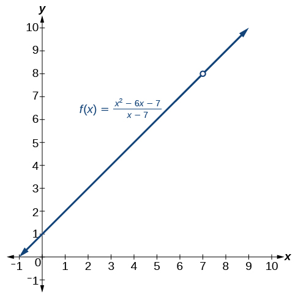
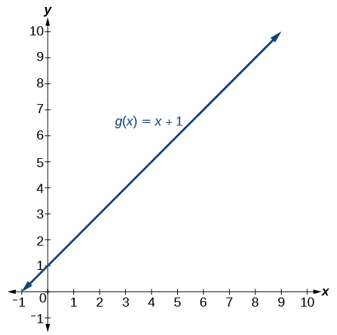
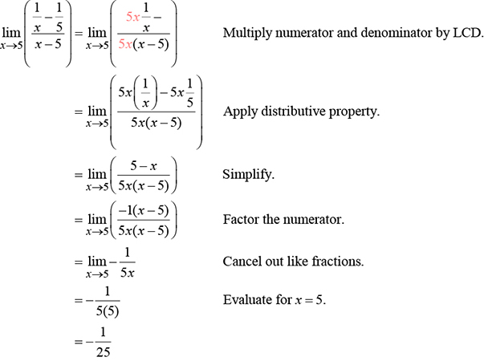
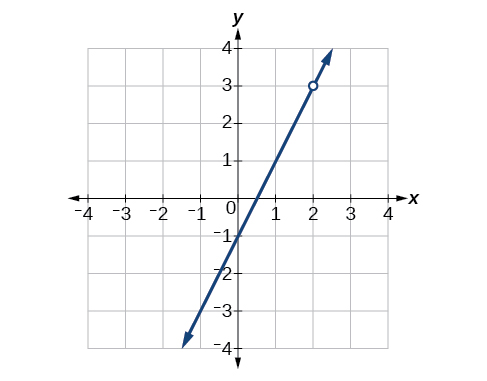
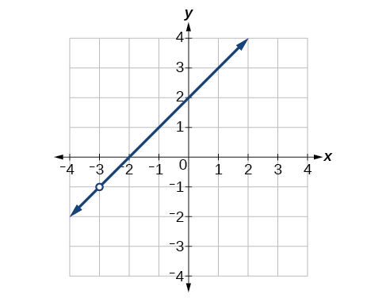
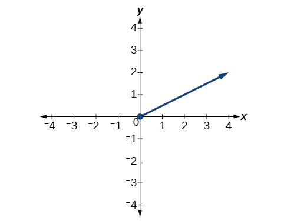

In this section, you will:
* Find the limit of a sum, a difference, and a product.
* Find the limit of a polynomial.
* Find the limit of a power or a root.
* Find the limit of a quotient.

Consider the **rational function**{: data-type="term" .no-emphasis}

<math xmlns="http://www.w3.org/1998/Math/MathML" display="block"> <mrow> <mi>f</mi><mo stretchy="false">(</mo><mi>x</mi><mo stretchy="false">)</mo><mo>=</mo><mfrac> <mrow> <msup> <mi>x</mi> <mn>2</mn> </msup> <mo>−</mo><mn>6</mn><mi>x</mi><mo>−</mo><mn>7</mn> </mrow> <mrow> <mi>x</mi><mo>−</mo><mn>7</mn> </mrow> </mfrac> </mrow> </math>

The function can be factored as follows:

<math xmlns="http://www.w3.org/1998/Math/MathML"> <mrow> <mi>f</mi><mo stretchy="false">(</mo><mi>x</mi><mo stretchy="false">)</mo><mo>=</mo><mfrac> <mrow> <menclose notation="updiagonalstrike"> <mrow> <mrow><mo>(</mo> <mrow> <mi>x</mi><mo>−</mo><mn>7</mn> </mrow> <mo>)</mo></mrow> </mrow> </menclose> <mrow><mo>(</mo> <mrow> <mi>x</mi><mo>+</mo><mn>1</mn> </mrow> <mo>)</mo></mrow> </mrow> <mrow> <menclose notation="updiagonalstrike"> <mrow> <mi>x</mi><mo>−</mo><mn>7</mn> </mrow> </menclose> </mrow> </mfrac> <mo>,</mo> </mrow> <mtext> which gives us </mtext> <mrow> <mi>f</mi><mo stretchy="false">(</mo><mi>x</mi><mo stretchy="false">)</mo><mo>=</mo><mi>x</mi><mo>+</mo><mn>1</mn><mo>,</mo><mi>x</mi><mo>≠</mo><mn>7.</mn> </mrow></math>

Does this mean the function<math xmlns="http://www.w3.org/1998/Math/MathML"><mtext> </mtext> <mi>f</mi> <mtext> </mtext></math>

is the same as the function<math xmlns="http://www.w3.org/1998/Math/MathML"><mtext> </mtext> <mrow> <mi>g</mi><mo stretchy="false">(</mo><mi>x</mi><mo stretchy="false">)</mo><mo>=</mo><mi>x</mi><mo>+</mo><mn>1</mn><mo>?</mo> </mrow> </math>

The answer is no. Function<math xmlns="http://www.w3.org/1998/Math/MathML"><mtext> </mtext> <mi>f</mi> <mtext> </mtext></math>

does not have<math xmlns="http://www.w3.org/1998/Math/MathML"><mtext> </mtext> <mrow> <mi>x</mi><mo>=</mo><mn>7</mn> </mrow> <mtext> </mtext></math>

in its domain, but<math xmlns="http://www.w3.org/1998/Math/MathML"><mtext> </mtext> <mi>g</mi> <mtext> </mtext></math>

does. Graphically, we observe there is a hole in the graph of<math xmlns="http://www.w3.org/1998/Math/MathML"><mtext> </mtext> <mrow> <mi>f</mi><mrow><mo>(</mo> <mi>x</mi> <mo>)</mo></mrow> </mrow> <mtext> </mtext></math>

at<math xmlns="http://www.w3.org/1998/Math/MathML"><mtext> </mtext> <mrow> <mi>x</mi><mo>=</mo><mn>7</mn><mo>,</mo> </mrow> </math>

 as shown in [\[link\]](#CNX_Precalc_Figure_12_02_001) and no such hole in the graph of<math xmlns="http://www.w3.org/1998/Math/MathML"><mtext> </mtext> <mrow> <mi>g</mi><mrow><mo>(</mo> <mi>x</mi> <mo>)</mo></mrow><mo>,</mo> </mrow> </math>

 as shown in [\[link\]](#CNX_Precalc_Figure_12_02_002).

{: #CNX_Precalc_Figure_12_02_001}

{: #CNX_Precalc_Figure_12_02_002}

So, do these two different functions also have different limits as<math xmlns="http://www.w3.org/1998/Math/MathML"><mtext> </mtext> <mi>x</mi> <mtext> </mtext></math>

approaches 7?

Not necessarily. Remember, in determining a **limit**{: data-type="term" .no-emphasis} of a function as<math xmlns="http://www.w3.org/1998/Math/MathML"><mtext> </mtext> <mi>x</mi> <mtext> </mtext></math>

approaches<math xmlns="http://www.w3.org/1998/Math/MathML"><mtext> </mtext> <mrow> <mi>a</mi><mo>,</mo> </mrow> </math>

 what matters is whether the output approaches a real number as we get close to<math xmlns="http://www.w3.org/1998/Math/MathML"><mtext> </mtext> <mrow> <mi>x</mi><mo>=</mo><mi>a</mi><mo>.</mo> </mrow> <mtext> </mtext></math>

The existence of a limit does not depend on what happens when<math xmlns="http://www.w3.org/1998/Math/MathML"><mtext> </mtext> <mi>x</mi> <mtext> </mtext></math>

equals<math xmlns="http://www.w3.org/1998/Math/MathML"><mtext> </mtext> <mrow> <mi>a</mi><mo>.</mo> </mrow> </math>

Look again at [\[link\]](#CNX_Precalc_Figure_12_02_001) and [\[link\]](#CNX_Precalc_Figure_12_02_002). Notice that in both graphs, as<math xmlns="http://www.w3.org/1998/Math/MathML"><mtext> </mtext> <mi>x</mi> <mtext> </mtext></math>

approaches 7, the output values approach 8. This means

<math xmlns="http://www.w3.org/1998/Math/MathML" display="block"> <mrow> <munder> <mrow> <mi>lim</mi> </mrow> <mrow> <mi>x</mi><mo stretchy="false">→</mo><mn>7</mn> </mrow> </munder> <mi>f</mi><mo stretchy="false">(</mo><mi>x</mi><mo stretchy="false">)</mo><mo>=</mo><munder> <mrow> <mi>lim</mi> </mrow> <mrow> <mi>x</mi><mo stretchy="false">→</mo><mn>7</mn> </mrow> </munder> <mi>g</mi><mo stretchy="false">(</mo><mi>x</mi><mo stretchy="false">)</mo><mo>.</mo> </mrow> </math>

Remember that when determining a limit, the concern is what occurs near<math xmlns="http://www.w3.org/1998/Math/MathML"><mtext> </mtext> <mrow> <mi>x</mi><mo>=</mo><mi>a</mi><mo>,</mo> </mrow> </math>

 not at<math xmlns="http://www.w3.org/1998/Math/MathML"><mtext> </mtext> <mrow> <mi>x</mi><mo>=</mo><mi>a</mi><mo>.</mo> </mrow> <mtext> </mtext></math>

In this section, we will use a variety of methods, such as rewriting functions by factoring, to evaluate the limit. These methods will give us formal verification for what we formerly accomplished by intuition.

### Finding the Limit of a Sum, a Difference, and a Product

Graphing a function or exploring a table of values to determine a limit can be cumbersome and time-consuming. When possible, it is more efficient to use the **properties of limits**{: data-type="term"}, which is a collection of theorems for finding limits.

Knowing the properties of limits allows us to compute limits directly. We can add, subtract, multiply, and divide the limits of functions as if we were performing the operations on the functions themselves to find the limit of the result. Similarly, we can find the limit of a function raised to a power by raising the limit to that power. We can also find the limit of the root of a function by taking the root of the limit. Using these operations on limits, we can find the limits of more complex functions by finding the limits of their simpler component functions.

Properties of Limits

Let<math xmlns="http://www.w3.org/1998/Math/MathML"><mtext> </mtext> <mrow> <mi>a</mi><mo>,</mo><mtext> </mtext><mi>k</mi><mo>,</mo><mtext> </mtext><mi>A</mi><mo>,</mo> </mrow> </math>

 and<math xmlns="http://www.w3.org/1998/Math/MathML"><mtext> </mtext> <mi>B</mi> <mtext> </mtext></math>

represent real numbers, and<math xmlns="http://www.w3.org/1998/Math/MathML"><mtext> </mtext> <mi>f</mi> <mtext> </mtext></math>

and<math xmlns="http://www.w3.org/1998/Math/MathML"><mtext> </mtext> <mi>g</mi> <mtext> </mtext></math>

be functions, such that<math xmlns="http://www.w3.org/1998/Math/MathML"><mtext> </mtext> <mrow> <munder> <mrow> <mi>lim</mi> </mrow> <mrow> <mi>x</mi><mo stretchy="false">→</mo><mi>a</mi> </mrow> </munder> <mi>f</mi><mo stretchy="false">(</mo><mi>x</mi><mo stretchy="false">)</mo><mo>=</mo><mi>A</mi> </mrow> <mtext> </mtext></math>

and<math xmlns="http://www.w3.org/1998/Math/MathML"><mtext> </mtext> <mrow> <munder> <mrow> <mi>lim</mi> </mrow> <mrow> <mi>x</mi><mo stretchy="false">→</mo><mi>a</mi> </mrow> </munder> <mi>g</mi><mo stretchy="false">(</mo><mi>x</mi><mo stretchy="false">)</mo><mo>=</mo><mi>B</mi><mo>.</mo> </mrow> <mtext> </mtext></math>

For limits that exist and are finite, the properties of limits are summarized in [\[link\]](#Table_12_02_01)

<table id="Table_12_02_01" summary=".."><colgroup><col align="left" /><col align="left" /></colgroup><tbody>
<tr>
<td>Constant, <em>k</em></td>
<td><math xmlns="http://www.w3.org/1998/Math/MathML">
 <mrow>
  <munder>
   <mrow>
    <mi>lim</mi>
   </mrow>
   <mrow>
    <mi>x</mi><mo stretchy="false">→</mo><mi>a</mi>
   </mrow>
  </munder>
  <mi>k</mi><mo>=</mo><mi>k</mi>
 </mrow>
</math></td>
</tr>

<tr>
<td>Constant times a function</td>
<td><math xmlns="http://www.w3.org/1998/Math/MathML">
 <mrow>
  <munder>
   <mrow>
    <mi>lim</mi>
   </mrow>
   <mrow>
    <mi>x</mi><mo stretchy="false">→</mo><mi>a</mi>
   </mrow>
  </munder>
  <mrow><mo>[</mo> <mrow>
   <mi>k</mi><mo>⋅</mo><mi>f</mi><mo stretchy="false">(</mo><mi>x</mi><mo stretchy="false">)</mo>
  </mrow> <mo>]</mo></mrow><mo>=</mo><mi>k</mi><munder>
   <mrow>
    <mi>lim</mi>
   </mrow>
   <mrow>
    <mi>x</mi><mo stretchy="false">→</mo><mi>a</mi>
   </mrow>
  </munder>
  <mi>f</mi><mo stretchy="false">(</mo><mi>x</mi><mo stretchy="false">)</mo><mo>=</mo><mi>k</mi><mi>A</mi>
 </mrow>
</math></td>
</tr>
<tr>
<td>Sum of functions</td>
<td><math xmlns="http://www.w3.org/1998/Math/MathML">
 <mrow>
  <munder>
   <mrow>
    <mi>lim</mi>
   </mrow>
   <mrow>
    <mi>x</mi><mo stretchy="false">→</mo><mi>a</mi>
   </mrow>
  </munder>
  <mrow><mo>[</mo> <mrow>
   <mi>f</mi><mo stretchy="false">(</mo><mi>x</mi><mo stretchy="false">)</mo><mo>+</mo><mi>g</mi><mo stretchy="false">(</mo><mi>x</mi><mo stretchy="false">)</mo>
  </mrow> <mo>]</mo></mrow><mo>=</mo><munder>
   <mrow>
    <mi>lim</mi>
   </mrow>
   <mrow>
    <mi>x</mi><mo stretchy="false">→</mo><mi>a</mi>
   </mrow>
  </munder>
  <mi>f</mi><mo stretchy="false">(</mo><mi>x</mi><mo stretchy="false">)</mo><mo>+</mo><munder>
   <mrow>
    <mi>lim</mi>
   </mrow>
   <mrow>
    <mi>x</mi><mo stretchy="false">→</mo><mi>a</mi>
   </mrow>
  </munder>
  <mi>g</mi><mo stretchy="false">(</mo><mi>x</mi><mo stretchy="false">)</mo><mo>=</mo><mi>A</mi><mo>+</mo><mi>B</mi>
 </mrow>
</math></td>
</tr>
<tr>
<td>Difference of functions</td>
<td><math xmlns="http://www.w3.org/1998/Math/MathML">
 <mrow>
  <munder>
   <mrow>
    <mi>lim</mi>
   </mrow>
   <mrow>
    <mi>x</mi><mo stretchy="false">→</mo><mi>a</mi>
   </mrow>
  </munder>
  <mrow><mo>[</mo> <mrow>
   <mi>f</mi><mo stretchy="false">(</mo><mi>x</mi><mo stretchy="false">)</mo><mo>−</mo><mi>g</mi><mo stretchy="false">(</mo><mi>x</mi><mo stretchy="false">)</mo>
  </mrow> <mo>]</mo></mrow><mo>=</mo><munder>
   <mrow>
    <mi>lim</mi>
   </mrow>
   <mrow>
    <mi>x</mi><mo stretchy="false">→</mo><mi>a</mi>
   </mrow>
  </munder>
  <mi>f</mi><mo stretchy="false">(</mo><mi>x</mi><mo stretchy="false">)</mo><mo>−</mo><munder>
   <mrow>
    <mi>lim</mi>
   </mrow>
   <mrow>
    <mi>x</mi><mo stretchy="false">→</mo><mi>a</mi>
   </mrow>
  </munder>
  <mi>g</mi><mo stretchy="false">(</mo><mi>x</mi><mo stretchy="false">)</mo><mo>=</mo><mi>A</mi><mo>−</mo><mi>B</mi>
 </mrow>
</math></td>
</tr>
<tr>
<td>Product of functions</td>
<td><math xmlns="http://www.w3.org/1998/Math/MathML">
 <mrow>
  <munder>
   <mrow>
    <mi>lim</mi>
   </mrow>
   <mrow>
    <mi>x</mi><mo stretchy="false">→</mo><mi>a</mi>
   </mrow>
  </munder>
  <mrow><mo>[</mo> <mrow>
   <mi>f</mi><mo stretchy="false">(</mo><mi>x</mi><mo stretchy="false">)</mo><mo>⋅</mo><mi>g</mi><mo stretchy="false">(</mo><mi>x</mi><mo stretchy="false">)</mo>
  </mrow> <mo>]</mo></mrow><mo>=</mo><munder>
   <mrow>
    <mi>lim</mi>
   </mrow>
   <mrow>
    <mi>x</mi><mo stretchy="false">→</mo><mi>a</mi>
   </mrow>
  </munder>
  <mi>f</mi><mo stretchy="false">(</mo><mi>x</mi><mo stretchy="false">)</mo><mo>⋅</mo><munder>
   <mrow>
    <mi>lim</mi>
   </mrow>
   <mrow>
    <mi>x</mi><mo stretchy="false">→</mo><mi>a</mi>
   </mrow>
  </munder>
  <mi>g</mi><mo stretchy="false">(</mo><mi>x</mi><mo stretchy="false">)</mo><mo>=</mo><mi>A</mi><mo>⋅</mo><mi>B</mi>
 </mrow>
</math></td>
</tr>
<tr>
<td>Quotient of functions</td>
<td><math xmlns="http://www.w3.org/1998/Math/MathML">
 <mrow>
  <munder>
   <mrow>
    <mi>lim</mi>
   </mrow>
   <mrow>
    <mi>x</mi><mo stretchy="false">→</mo><mi>a</mi>
   </mrow>
  </munder>
  <mfrac>
   <mrow>
    <mi>f</mi><mo stretchy="false">(</mo><mi>x</mi><mo stretchy="false">)</mo>
   </mrow>
   <mrow>
    <mi>g</mi><mo stretchy="false">(</mo><mi>x</mi><mo stretchy="false">)</mo>
   </mrow>
  </mfrac>
  <mo>=</mo><mfrac>
   <mrow>
    <munder>
     <mrow>
      <mi>lim</mi>
     </mrow>
     <mrow>
      <mi>x</mi><mo stretchy="false">→</mo><mi>a</mi>
     </mrow>
    </munder>
    <mi>f</mi><mo stretchy="false">(</mo><mi>x</mi><mo stretchy="false">)</mo>
   </mrow>
   <mrow>
    <munder>
     <mrow>
      <mi>lim</mi>
     </mrow>
     <mrow>
      <mi>x</mi><mo stretchy="false">→</mo><mi>a</mi>
     </mrow>
    </munder>
    <mi>g</mi><mo stretchy="false">(</mo><mi>x</mi><mo stretchy="false">)</mo>
   </mrow>
  </mfrac>
  <mo>=</mo><mfrac>
   <mi>A</mi>
   <mi>B</mi>
  </mfrac>
  <mo>,</mo><mi>B</mi><mo>≠</mo><mn>0</mn>
 </mrow>
</math></td>
</tr>
<tr>
<td>Function raised to an exponent</td>
<td><math xmlns="http://www.w3.org/1998/Math/MathML">
 <mrow>
  <munder>
   <mrow>
    <mi>lim</mi>
   </mrow>
   <mrow>
    <mi>x</mi><mo stretchy="false">→</mo><mi>a</mi>
   </mrow>
  </munder>
  <msup>
   <mrow>
    <mo stretchy="false">[</mo><mi>f</mi><mo stretchy="false">(</mo><mi>x</mi><mo stretchy="false">)</mo><mo stretchy="false">]</mo>
   </mrow>
   <mi>n</mi>
  </msup>
  <mo>=</mo><msup>
   <mrow>
    <mrow><mo>[</mo> <mrow>
     <munder>
      <mrow>
       <mi>lim</mi>
      </mrow>
      <mrow>
       <mi>x</mi><mo stretchy="false">→</mo><mi>∞</mi>
      </mrow>
     </munder>
     <mi>f</mi><mo stretchy="false">(</mo><mi>x</mi><mo stretchy="false">)</mo>
    </mrow> <mo>]</mo></mrow>
   </mrow>
   <mi>n</mi>
  </msup>
  <mo>=</mo><msup>
   <mi>A</mi>
   <mi>n</mi>
  </msup>
  <mo>,</mo><mtext> </mtext>
 </mrow>
</math>where<math xmlns="http://www.w3.org/1998/Math/MathML">
 <mrow>
  <mtext> </mtext><mi>n</mi><mtext> </mtext>
 </mrow>
</math>is a positive integer</td>
</tr>
<tr>
<td><em>n</em>th root of a function, where n is a positive integer</td>
<td><math xmlns="http://www.w3.org/1998/Math/MathML">
 <mrow>
  <munder>
   <mrow>
    <mi>lim</mi>
   </mrow>
   <mrow>
    <mi>x</mi><mo stretchy="false">→</mo><mi>a</mi>
   </mrow>
  </munder>
  <mroot>
   <mrow>
    <mi>f</mi><mo stretchy="false">(</mo><mi>x</mi><mo stretchy="false">)</mo>
   </mrow>
   <mi>n</mi>
  </mroot>
  <mo>=</mo><mroot>
   <mrow>
    <munder>
     <mrow>
      <mi>lim</mi>
     </mrow>
     <mrow>
      <mi>x</mi><mo stretchy="false">→</mo><mi>a</mi>
     </mrow>
    </munder>
    <mrow><mo>[</mo> <mrow>
     <mi>f</mi><mo stretchy="false">(</mo><mi>x</mi><mo stretchy="false">)</mo>
    </mrow> <mo>]</mo></mrow>
   </mrow>
   <mi>n</mi>
  </mroot>
  <mo>=</mo><mroot>
   <mi>A</mi>
   <mi>n</mi>
  </mroot>
  
 </mrow>
</math></td>
</tr>
<tr>
<td>Polynomial function</td>
<td><math xmlns="http://www.w3.org/1998/Math/MathML">
 <mrow>
  <munder>
   <mrow>
    <mi>lim</mi>
   </mrow>
   <mrow>
    <mi>x</mi><mo stretchy="false">→</mo><mi>a</mi>
   </mrow>
  </munder>
  <mi>p</mi><mo stretchy="false">(</mo><mi>x</mi><mo stretchy="false">)</mo><mo>=</mo><mi>p</mi><mo stretchy="false">(</mo><mi>a</mi><mo stretchy="false">)</mo>
 </mrow>
</math></td>
</tr>
</tbody></table>

Evaluating the Limit of a Function Algebraically

Evaluate<math xmlns="http://www.w3.org/1998/Math/MathML"><mtext> </mtext> <mrow> <munder> <mrow> <mi>lim</mi> </mrow> <mrow> <mi>x</mi><mo stretchy="false">→</mo><mn>3</mn> </mrow> </munder> <mrow><mo>(</mo> <mrow> <mn>2</mn><mi>x</mi><mo>+</mo><mn>5</mn> </mrow> <mo>)</mo></mrow><mo>.</mo> </mrow> </math>

<math xmlns="http://www.w3.org/1998/Math/MathML"> <mrow> <mtable columnalign="left"> <mtr columnalign="left"> <mtd columnalign="left"> <mrow> <munder> <mrow> <mi>lim</mi> </mrow> <mrow> <mi>x</mi><mo stretchy="false">→</mo><mn>3</mn> </mrow> </munder> <mo stretchy="false">(</mo><mn>2</mn><mi>x</mi><mo>+</mo><mn>5</mn><mo stretchy="false">)</mo><mo>=</mo><munder> <mrow> <mi>lim</mi> </mrow> <mrow> <mi>x</mi><mo stretchy="false">→</mo><mn>3</mn> </mrow> </munder> <mo stretchy="false">(</mo><mn>2</mn><mi>x</mi><mo stretchy="false">)</mo><mo>+</mo><munder> <mrow> <mi>lim</mi> </mrow> <mrow> <mi>x</mi><mo stretchy="false">→</mo><mn>3</mn> </mrow> </munder> <mo stretchy="false">(</mo><mn>5</mn><mo stretchy="false">)</mo> </mrow> </mtd> <mtd columnalign="left"> <mrow> <mtext>Sum of functions property</mtext> </mrow> </mtd> </mtr> <mtr columnalign="left"> <mtd columnalign="left"> <mrow> <mtext>                     </mtext><mo>=</mo><munder> <mrow> <mn>2</mn><mi>lim</mi> </mrow> <mrow> <mi>x</mi><mo stretchy="false">→</mo><mn>3</mn> </mrow> </munder> <mo stretchy="false">(</mo><mi>x</mi><mo stretchy="false">)</mo><mo>+</mo><munder> <mrow> <mi>lim</mi> </mrow> <mrow> <mi>x</mi><mo stretchy="false">→</mo><mn>3</mn> </mrow> </munder> <mo stretchy="false">(</mo><mn>5</mn><mo stretchy="false">)</mo> </mrow> </mtd> <mtd columnalign="left"> <mrow> <mtext>Constant times a function property</mtext> </mrow> </mtd> </mtr> <mtr columnalign="left"> <mtd columnalign="left"> <mrow> <mtext>                     </mtext><mo>=</mo><mn>2</mn><mo stretchy="false">(</mo><mn>3</mn><mo stretchy="false">)</mo><mo>+</mo><mn>5</mn><mo> </mo> </mrow> </mtd> <mtd columnalign="left"> <mrow> <mtext>Evaluate</mtext> </mrow> </mtd> </mtr> <mtr columnalign="left"> <mtd columnalign="left"> <mrow> <mtext>                     </mtext><mo>=</mo><mn>11</mn> </mrow> </mtd> <mtd columnalign="left"> <mrow /> </mtd> </mtr> </mtable> </mrow> </math>

Evaluate the following limit:<math xmlns="http://www.w3.org/1998/Math/MathML"><mtext> </mtext> <mrow> <munder> <mrow> <mi>lim</mi> </mrow> <mrow> <mi>x</mi><mo stretchy="false">→</mo><mo>−</mo><mn>12</mn> </mrow> </munder> <mrow><mo>(</mo> <mrow> <mo>−</mo><mn>2</mn><mi>x</mi><mo>+</mo><mn>2</mn> </mrow> <mo>)</mo></mrow><mo>.</mo> </mrow> </math>

26

### Finding the Limit of a Polynomial

Not all functions or their limits involve simple addition, subtraction, or multiplication. Some may include polynomials. Recall that a polynomial is an expression consisting of the sum of two or more terms, each of which consists of a constant and a variable raised to a nonnegative integral power. To find the limit of a polynomial function, we can find the limits of the individual terms of the function, and then add them together. Also, the **limit**{: data-type="term" .no-emphasis} of a polynomial function as<math xmlns="http://www.w3.org/1998/Math/MathML"><mtext> </mtext> <mi>x</mi> <mtext> </mtext></math>

approaches<math xmlns="http://www.w3.org/1998/Math/MathML"><mtext> </mtext> <mi>a</mi> <mtext> </mtext></math>

is equivalent to simply evaluating the function for<math xmlns="http://www.w3.org/1998/Math/MathML"><mtext> </mtext> <mi>a</mi> </math>

.

**Given a function containing a polynomial, find its limit.**

Use the properties of limits to break up the polynomial into individual terms.

Find the limits of the individual terms.

Add the limits together.

Alternatively, evaluate the function for
<math xmlns="http://www.w3.org/1998/Math/MathML"><mtext> </mtext> <mi>a</mi> </math>
.

Evaluating the Limit of a Function Algebraically

Evaluate<math xmlns="http://www.w3.org/1998/Math/MathML"><mtext> </mtext> <mrow> <munder> <mrow> <mi>lim</mi> </mrow> <mrow> <mi>x</mi><mo stretchy="false">→</mo><mn>3</mn> </mrow> </munder> <mrow><mo>(</mo> <mrow> <mn>5</mn><msup> <mi>x</mi> <mn>2</mn> </msup> </mrow> <mo>)</mo></mrow><mo>.</mo> </mrow> </math>

<math xmlns="http://www.w3.org/1998/Math/MathML"> <mrow> <mtable columnalign="left"> <mtr columnalign="left"> <mtd columnalign="left"> <mrow> <munder> <mrow> <mi>lim</mi> </mrow> <mrow> <mi>x</mi><mo stretchy="false">→</mo><mn>3</mn> </mrow> </munder> <mo stretchy="false">(</mo><mn>5</mn><msup> <mi>x</mi> <mn>2</mn> </msup> <mo stretchy="false">)</mo><mo>=</mo><mn>5</mn><munder> <mrow> <mi>lim</mi> </mrow> <mrow> <mi>x</mi><mo stretchy="false">→</mo><mn>3</mn> </mrow> </munder> <mo stretchy="false">(</mo><msup> <mi>x</mi> <mn>2</mn> </msup> <mo stretchy="false">)</mo> </mrow> </mtd> <mtd columnalign="left"> <mrow> <mtext>Constant times a function property</mtext> </mrow> </mtd> </mtr> <mtr columnalign="left"> <mtd columnalign="left"> <mrow> <mtext>                </mtext><mo>=</mo><mn>5</mn><mo stretchy="false">(</mo><msup> <mn>3</mn> <mn>2</mn> </msup> <mo stretchy="false">)</mo> </mrow> </mtd> <mtd columnalign="left"> <mrow> <mtext>Function raised to an exponent property</mtext> </mrow> </mtd> </mtr> <mtr columnalign="left"> <mtd columnalign="left"> <mrow> <mtext>                </mtext><mo>=</mo><mn>45</mn> </mrow> </mtd> <mtd columnalign="left"> <mrow /> </mtd> </mtr> </mtable> </mrow> </math>

Evaluate<math xmlns="http://www.w3.org/1998/Math/MathML"><mtext> </mtext> <mrow> <munder> <mrow> <mi>lim</mi> </mrow> <mrow> <mi>x</mi><mo stretchy="false">→</mo><mn>4</mn> </mrow> </munder> <mo stretchy="false">(</mo><msup> <mi>x</mi> <mn>3</mn> </msup> <mo>−</mo><mn>5</mn><mo stretchy="false">)</mo><mo>.</mo> </mrow> </math>

59

Evaluating the Limit of a Polynomial Algebraically

Evaluate<math xmlns="http://www.w3.org/1998/Math/MathML"><mtext> </mtext> <mrow> <munder> <mrow> <mi>lim</mi> </mrow> <mrow> <mi>x</mi><mo stretchy="false">→</mo><mn>5</mn> </mrow> </munder> <mrow><mo>(</mo> <mrow> <mn>2</mn><msup> <mi>x</mi> <mn>3</mn> </msup> <mo>−</mo><mn>3</mn><mi>x</mi><mo>+</mo><mn>1</mn> </mrow> <mo>)</mo></mrow><mo>.</mo> </mrow> </math>

<math xmlns="http://www.w3.org/1998/Math/MathML" display="block"> <mrow> <mtable columnalign="left"> <mtr columnalign="left"> <mtd columnalign="left"> <mrow> <munder> <mrow> <mi>lim</mi> </mrow> <mrow> <mi>x</mi><mo stretchy="false">→</mo><mn>5</mn> </mrow> </munder> <mo stretchy="false">(</mo><mn>2</mn><msup> <mi>x</mi> <mn>3</mn> </msup> <mo>−</mo><mn>3</mn><mi>x</mi><mo>+</mo><mn>1</mn><mo stretchy="false">)</mo><mo>=</mo><munder> <mrow> <mi>lim</mi> </mrow> <mrow> <mi>x</mi><mo stretchy="false">→</mo><mn>5</mn> </mrow> </munder> <mo stretchy="false">(</mo><mn>2</mn><msup> <mi>x</mi> <mn>3</mn> </msup> <mo stretchy="false">)</mo><mo>−</mo><munder> <mrow> <mi>lim</mi> </mrow> <mrow> <mi>x</mi><mo stretchy="false">→</mo><mn>5</mn> </mrow> </munder> <mo stretchy="false">(</mo><mn>3</mn><mi>x</mi><mo stretchy="false">)</mo><mo>+</mo><munder> <mrow> <mi>lim</mi> </mrow> <mrow> <mi>x</mi><mo stretchy="false">→</mo><mn>5</mn> </mrow> </munder> <mo stretchy="false">(</mo><mn>1</mn><mo stretchy="false">)</mo> </mrow> </mtd> <mtd columnalign="left"> <mrow> <mtext>Sum of functions</mtext> </mrow> </mtd> </mtr> <mtr columnalign="left"> <mtd columnalign="left"> <mrow> <mtext>                               </mtext><mo>=</mo><munder> <mrow> <mn>2</mn><mi>lim</mi> </mrow> <mrow> <mi>x</mi><mo stretchy="false">→</mo><mn>5</mn> </mrow> </munder> <mo stretchy="false">(</mo><msup> <mi>x</mi> <mn>3</mn> </msup> <mo stretchy="false">)</mo><mo>−</mo><munder> <mrow> <mn>3</mn><mi>lim</mi> </mrow> <mrow> <mi>x</mi><mo stretchy="false">→</mo><mn>5</mn> </mrow> </munder> <mo stretchy="false">(</mo><mi>x</mi><mo stretchy="false">)</mo><mo>+</mo><munder> <mrow> <mi>lim</mi> </mrow> <mrow> <mi>x</mi><mo stretchy="false">→</mo><mn>5</mn> </mrow> </munder> <mo stretchy="false">(</mo><mn>1</mn><mo stretchy="false">)</mo> </mrow> </mtd> <mtd columnalign="left"> <mrow> <mtext>Constant times a function</mtext> </mrow> </mtd> </mtr> <mtr columnalign="left"> <mtd columnalign="left"> <mrow> <mtext>                               </mtext><mo>=</mo><mn>2</mn><mo stretchy="false">(</mo><msup> <mn>5</mn> <mn>3</mn> </msup> <mo stretchy="false">)</mo><mo>−</mo><mn>3</mn><mo stretchy="false">(</mo><mn>5</mn><mo stretchy="false">)</mo><mo>+</mo><mn>1</mn> </mrow> </mtd> <mtd columnalign="left"> <mrow> <mtext>Function raised to an exponent</mtext> </mrow> </mtd> </mtr> <mtr columnalign="left"> <mtd columnalign="left"> <mrow> <mtext>                               </mtext><mo>=</mo><mn>236</mn> </mrow> </mtd> <mtd columnalign="left"> <mrow> <mtext>Evaluate</mtext> </mrow> </mtd> </mtr> </mtable> </mrow> </math>

Evaluate the following limit:<math xmlns="http://www.w3.org/1998/Math/MathML"><mtext> </mtext> <mrow> <munder> <mrow> <mi>lim</mi> </mrow> <mrow> <mi>x</mi><mo stretchy="false">→</mo><mo>−</mo><mn>1</mn> </mrow> </munder> <mrow><mo>(</mo> <mrow> <msup> <mi>x</mi> <mn>4</mn> </msup> <mo>−</mo><mn>4</mn><msup> <mi>x</mi> <mn>3</mn> </msup> <mo>+</mo><mn>5</mn> </mrow> <mo>)</mo></mrow><mo>.</mo> </mrow> </math>

10

### Finding the Limit of a Power or a Root

When a limit includes a power or a root, we need another property to help us evaluate it. The square of the **limit**{: data-type="term" .no-emphasis} of a function equals the limit of the square of the function; the same goes for higher powers. Likewise, the square root of the limit of a function equals the limit of the square root of the function; the same holds true for higher roots.

Evaluating a Limit of a Power

Evaluate<math xmlns="http://www.w3.org/1998/Math/MathML"><mtext> </mtext> <mrow> <munder> <mrow> <mi>lim</mi> </mrow> <mrow> <mi>x</mi><mo stretchy="false">→</mo><mn>2</mn> </mrow> </munder> <msup> <mrow> <mrow><mo>(</mo> <mrow> <mn>3</mn><mi>x</mi><mo>+</mo><mn>1</mn> </mrow> <mo>)</mo></mrow> </mrow> <mn>5</mn> </msup> <mo>.</mo> </mrow> </math>

We will take the limit of the function as<math xmlns="http://www.w3.org/1998/Math/MathML"><mtext> </mtext> <mi>x</mi> <mtext> </mtext></math>

approaches 2 and raise the result to the 5th power.

<math xmlns="http://www.w3.org/1998/Math/MathML" display="block"> <mrow> <mtable columnalign="left"> <mtr columnalign="left"> <mtd columnalign="left"> <mrow> <munder> <mrow> <mi>lim</mi> </mrow> <mrow> <mi>x</mi><mo stretchy="false">→</mo><mn>2</mn> </mrow> </munder> <msup> <mrow> <mo stretchy="false">(</mo><mn>3</mn><mi>x</mi><mo>+</mo><mn>1</mn><mo stretchy="false">)</mo> </mrow> <mn>5</mn> </msup> <mo>=</mo><msup> <mrow> <mo stretchy="false">(</mo><munder> <mrow> <mi>lim</mi> </mrow> <mrow> <mi>x</mi><mo stretchy="false">→</mo><mn>2</mn> </mrow> </munder> <mo stretchy="false">(</mo><mn>3</mn><mi>x</mi><mo>+</mo><mn>1</mn><mo stretchy="false">)</mo><mo stretchy="false">)</mo> </mrow> <mn>5</mn> </msup> </mrow> </mtd> </mtr> <mtr columnalign="left"> <mtd columnalign="left"> <mrow> <mtext>                      </mtext><mo>=</mo><msup> <mrow> <mo stretchy="false">(</mo><mn>3</mn><mo stretchy="false">(</mo><mn>2</mn><mo stretchy="false">)</mo><mo>+</mo><mn>1</mn><mo stretchy="false">)</mo> </mrow> <mn>5</mn> </msup> </mrow> </mtd> </mtr> <mtr columnalign="left"> <mtd columnalign="left"> <mrow> <mtext>                      </mtext><mo>=</mo><msup> <mn>7</mn> <mn>5</mn> </msup> </mrow> </mtd> </mtr> <mtr columnalign="left"> <mtd columnalign="left"> <mrow> <mtext>                      </mtext><mo>=</mo><mtext>16,807</mtext> </mrow> </mtd> </mtr> </mtable> </mrow> </math>

Evaluate the following limit: <math xmlns="http://www.w3.org/1998/Math/MathML"> <mrow> <munder> <mrow> <mi>lim</mi> </mrow> <mrow> <mi>x</mi><mo stretchy="false">→</mo><mo>−</mo><mn>4</mn> </mrow> </munder> <msup> <mrow> <mrow><mo>(</mo> <mrow> <mn>10</mn><mi>x</mi><mo>+</mo><mn>36</mn> </mrow> <mo>)</mo></mrow> </mrow> <mn>3</mn> </msup> <mo>.</mo> </mrow> </math>

<math xmlns="http://www.w3.org/1998/Math/MathML"> <mrow> <mo>−</mo><mn>64</mn> </mrow> </math>

**If we can’t directly apply the properties of a limit, for example in <math xmlns="http://www.w3.org/1998/Math/MathML"> <munder> <mrow> <mi>lim</mi> </mrow> <mrow> <mi>x</mi><mo stretchy="false">→</mo><mn>2</mn> </mrow> </munder> <mrow><mo stretchy="false">(</mo> <mrow> <mfrac> <mrow> <msup> <mi>x</mi> <mn>2</mn> </msup> <mo>+</mo><mn>6</mn><mi>x</mi><mo>+</mo><mn>8</mn> </mrow> <mrow> <mi>x</mi><mo>−</mo><mn>2</mn> </mrow> </mfrac> </mrow> <mo stretchy="false">)</mo></mrow> </math>

, can we still determine the limit of the function as <math xmlns="http://www.w3.org/1998/Math/MathML"> <mi>x</mi> </math>

 approaches <math xmlns="http://www.w3.org/1998/Math/MathML"> <mi>a</mi> </math>

?**

*Yes. Some functions may be algebraically rearranged so that one can evaluate the limit of a simplified equivalent form of the function.*

### Finding the Limit of a Quotient

Finding the limit of a function expressed as a quotient can be more complicated. We often need to rewrite the function algebraically before applying the properties of a limit. If the denominator evaluates to 0 when we apply the properties of a limit directly, we must rewrite the quotient in a different form. One approach is to write the quotient in factored form and simplify.

**Given the limit of a function in quotient form, use factoring to evaluate it.**

1.  Factor the numerator and denominator completely.
2.  Simplify by dividing any factors common to the numerator and denominator.
3.  Evaluate the resulting limit, remembering to use the correct domain.
{: data-number-style="arabic"}

Evaluating the Limit of a Quotient by Factoring

Evaluate<math xmlns="http://www.w3.org/1998/Math/MathML"><mtext> </mtext> <mrow> <munder> <mrow> <mi>lim</mi> </mrow> <mrow> <mi>x</mi><mo stretchy="false">→</mo><mn>2</mn> </mrow> </munder> <mrow><mo>(</mo> <mrow> <mfrac> <mrow> <msup> <mi>x</mi> <mn>2</mn> </msup> <mo>−</mo><mn>6</mn><mi>x</mi><mo>+</mo><mn>8</mn> </mrow> <mrow> <mi>x</mi><mo>−</mo><mn>2</mn> </mrow> </mfrac> </mrow> <mo>)</mo></mrow><mo>.</mo> </mrow> </math>

Factor where possible, and simplify.

<math xmlns="http://www.w3.org/1998/Math/MathML"> <mrow> <mtable columnalign="left"> <mtr columnalign="left"> <mtd columnalign="left"> <mrow> <munder> <mrow> <mi>lim</mi> </mrow> <mrow> <mi>x</mi><mo stretchy="false">→</mo><mn>2</mn> </mrow> </munder> <mrow><mo>(</mo> <mrow> <mfrac> <mrow> <msup> <mi>x</mi> <mn>2</mn> </msup> <mo>−</mo><mn>6</mn><mi>x</mi><mo>+</mo><mn>8</mn> </mrow> <mrow> <mi>x</mi><mo>−</mo><mn>2</mn> </mrow> </mfrac> </mrow> <mo>)</mo></mrow><mo>=</mo><munder> <mrow> <mi>lim</mi> </mrow> <mrow> <mi>x</mi><mo stretchy="false">→</mo><mn>2</mn> </mrow> </munder> <mrow><mo>(</mo> <mrow> <mfrac> <mrow> <mo stretchy="false">(</mo><mi>x</mi><mo>−</mo><mn>2</mn><mo stretchy="false">)</mo><mo stretchy="false">(</mo><mi>x</mi><mo>−</mo><mn>4</mn><mo stretchy="false">)</mo> </mrow> <mrow> <mi>x</mi><mo>−</mo><mn>2</mn> </mrow> </mfrac> </mrow> <mo>)</mo></mrow> </mrow> </mtd> <mtd columnalign="left"> <mrow> <mtext>Factor the numerator</mtext><mo>.</mo> </mrow> </mtd> </mtr> <mtr columnalign="left"> <mtd columnalign="left"> <mrow> <mtext>                              </mtext><mo>=</mo><munder> <mrow> <mi>lim</mi> </mrow> <mrow> <mi>x</mi><mo stretchy="false">→</mo><mn>2</mn> </mrow> </munder> <mrow><mo>(</mo> <mrow> <mfrac> <mrow> <menclose notation="updiagonalstrike"> <mrow> <mo stretchy="false">(</mo><mi>x</mi><mo>−</mo><mn>2</mn><mo stretchy="false">)</mo> </mrow> </menclose> <mo stretchy="false">(</mo><mi>x</mi><mo>−</mo><mn>4</mn><mo stretchy="false">)</mo> </mrow> <mrow> <menclose notation="updiagonalstrike"> <mrow> <mi>x</mi><mo>−</mo><mn>2</mn> </mrow> </menclose> </mrow> </mfrac> </mrow> <mo>)</mo></mrow> </mrow> </mtd> <mtd columnalign="left"> <mrow> <mtext>Cancel the common factors</mtext><mo>.</mo> </mrow> </mtd> </mtr> <mtr columnalign="left"> <mtd columnalign="left"> <mrow> <mtext>                              </mtext><mo>=</mo><munder> <mrow> <mi>lim</mi> </mrow> <mrow> <mi>x</mi><mo stretchy="false">→</mo><mn>2</mn> </mrow> </munder> <mo stretchy="false">(</mo><mi>x</mi><mo>−</mo><mn>4</mn><mo stretchy="false">)</mo> </mrow> </mtd> <mtd columnalign="left"> <mrow> <mtext>Evaluate</mtext><mo>.</mo> </mrow> </mtd> </mtr> <mtr columnalign="left"> <mtd columnalign="left"> <mrow> <mtext>                              </mtext><mo>=</mo><mn>2</mn><mo>−</mo><mn>4</mn><mo>=</mo><mo>−</mo><mn>2</mn> </mrow> </mtd> <mtd columnalign="left"> <mrow /> </mtd> </mtr> </mtable> </mrow> </math>

Analysis

When the limit of a rational function cannot be evaluated directly, factored forms of the numerator and denominator may simplify to a result that can be evaluated.

Notice, the function

<math xmlns="http://www.w3.org/1998/Math/MathML" display="block"> <mrow> <mi>f</mi><mo stretchy="false">(</mo><mi>x</mi><mo stretchy="false">)</mo><mo>=</mo><mfrac> <mrow> <msup> <mi>x</mi> <mn>2</mn> </msup> <mo>−</mo><mn>6</mn><mi>x</mi><mo>+</mo><mn>8</mn> </mrow> <mrow> <mi>x</mi><mo>−</mo><mn>2</mn> </mrow> </mfrac> </mrow> </math>

is equivalent to the function

<math xmlns="http://www.w3.org/1998/Math/MathML" display="block"> <mrow> <mi>f</mi><mo stretchy="false">(</mo><mi>x</mi><mo stretchy="false">)</mo><mo>=</mo><mi>x</mi><mo>−</mo><mn>4</mn><mo>,</mo><mi>x</mi><mo>≠</mo><mn>2.</mn> </mrow> </math>

Notice that the limit exists even though the function is not defined at<math xmlns="http://www.w3.org/1998/Math/MathML"><mtext> </mtext> <mrow> <mi>x</mi><mtext> = 2</mtext><mtext>.</mtext> </mrow> </math>

Evaluate the following limit:<math xmlns="http://www.w3.org/1998/Math/MathML"><mtext> </mtext> <mrow> <munder> <mrow> <mi>lim</mi> </mrow> <mrow> <mi>x</mi><mo stretchy="false">→</mo><mn>7</mn> </mrow> </munder> <mrow><mo>(</mo> <mrow> <mfrac> <mrow> <msup> <mi>x</mi> <mn>2</mn> </msup> <mo>−</mo><mn>11</mn><mi>x</mi><mo>+</mo><mn>28</mn> </mrow> <mrow> <mn>7</mn><mo>−</mo><mi>x</mi> </mrow> </mfrac> </mrow> <mo>)</mo></mrow><mo>.</mo> </mrow> </math>

<math xmlns="http://www.w3.org/1998/Math/MathML"> <mrow> <mo>−</mo><mn>3</mn> </mrow> </math>

Evaluating the Limit of a Quotient by Finding the LCD

Evaluate<math xmlns="http://www.w3.org/1998/Math/MathML"><mtext> </mtext> <mrow> <munder> <mrow> <mi>lim</mi> </mrow> <mrow> <mi>x</mi><mo stretchy="false">→</mo><mn>5</mn> </mrow> </munder> <mrow><mo>(</mo> <mrow> <mfrac> <mrow> <mfrac> <mn>1</mn> <mi>x</mi> </mfrac> <mo>−</mo><mfrac> <mn>1</mn> <mn>5</mn> </mfrac> </mrow> <mrow> <mi>x</mi><mo>−</mo><mn>5</mn> </mrow> </mfrac> </mrow> <mo>)</mo></mrow><mo>.</mo> </mrow> </math>

Find the LCD for the denominators of the two terms in the numerator, and convert both fractions to have the LCD as their denominator.

  

Analysis

When determining the **limit**{: data-type="term" .no-emphasis} of a rational function that has terms added or subtracted in either the numerator or denominator, the first step is to find the common denominator of the added or subtracted terms; then, convert both terms to have that denominator, or simplify the rational function by multiplying numerator and denominator by the least common denominator. Then check to see if the resulting numerator and denominator have any common factors.

Evaluate<math xmlns="http://www.w3.org/1998/Math/MathML"><mtext> </mtext> <mrow> <munder> <mrow> <mi>lim</mi> </mrow> <mrow> <mi>x</mi><mo stretchy="false">→</mo><mo>−</mo><mn>5</mn> </mrow> </munder> <mrow><mo>(</mo> <mrow> <mfrac> <mrow> <mfrac> <mn>1</mn> <mn>5</mn> </mfrac> <mo>+</mo><mfrac> <mn>1</mn> <mi>x</mi> </mfrac> </mrow> <mrow> <mn>10</mn><mo>+</mo><mn>2</mn><mi>x</mi> </mrow> </mfrac> </mrow> <mo>)</mo></mrow><mo>.</mo> </mrow> </math>

<math xmlns="http://www.w3.org/1998/Math/MathML"> <mrow> <mo>−</mo><mfrac> <mn>1</mn> <mrow> <mn>50</mn> </mrow> </mfrac> </mrow> </math>

**Given a limit of a function containing a root, use a conjugate to evaluate.**

1.  If the quotient as given is not in indeterminate
    <math xmlns="http://www.w3.org/1998/Math/MathML"><mtext> </mtext> <mrow> <mrow><mo>(</mo> <mrow> <mfrac> <mn>0</mn> <mn>0</mn> </mfrac> </mrow> <mo>)</mo></mrow> </mrow> <mtext> </mtext></math>
    
    form, evaluate directly.
2.  Otherwise, rewrite the sum (or difference) of two quotients as a single quotient, using the **least common denominator (LCD)**{: data-type="term" .no-emphasis}.
3.  If the numerator includes a root, rationalize the numerator; multiply the numerator and denominator by the **conjugate**{: data-type="term" .no-emphasis} of the numerator. Recall that
    <math xmlns="http://www.w3.org/1998/Math/MathML"><mtext> </mtext> <mrow> <mi>a</mi><mo>±</mo><msqrt> <mi>b</mi> </msqrt> </mrow> <mtext> </mtext></math>
    
    are conjugates.
4.  Simplify.
5.  Evaluate the resulting limit.
{: data-number-style="arabic"}

Evaluating a Limit Containing a Root Using a Conjugate

Evaluate<math xmlns="http://www.w3.org/1998/Math/MathML"><mtext> </mtext> <mrow> <munder> <mrow> <mi>lim</mi> </mrow> <mrow> <mi>x</mi><mo stretchy="false">→</mo><mn>0</mn> </mrow> </munder> <mrow><mo>(</mo> <mrow> <mfrac> <mrow> <msqrt> <mrow> <mn>25</mn><mo>−</mo><mi>x</mi> </mrow> </msqrt> <mo>−</mo><mn>5</mn> </mrow> <mi>x</mi> </mfrac> </mrow> <mo>)</mo></mrow><mo>.</mo> </mrow> </math>

<math xmlns="http://www.w3.org/1998/Math/MathML"> <mrow> <mtable columnalign="left"> <mtr columnalign="left"> <mtd columnalign="left"> <mrow> <munder> <mrow> <mi>lim</mi> </mrow> <mrow> <mi>x</mi><mo stretchy="false">→</mo><mn>0</mn> </mrow> </munder> <mrow><mo>(</mo> <mrow> <mfrac> <mrow> <msqrt> <mrow> <mn>25</mn><mo>−</mo><mi>x</mi> </mrow> </msqrt> <mo>−</mo><mn>5</mn> </mrow> <mi>x</mi> </mfrac> </mrow> <mo>)</mo></mrow><mo>=</mo><munder> <mrow> <mi>lim</mi> </mrow> <mrow> <mi>x</mi><mo stretchy="false">→</mo><mn>0</mn> </mrow> </munder> <mrow><mo>(</mo> <mrow> <mfrac> <mrow> <mrow><mo>(</mo> <mrow> <msqrt> <mrow> <mn>25</mn><mo>−</mo><mi>x</mi> </mrow> </msqrt> <mo>−</mo><mn>5</mn> </mrow> <mo>)</mo></mrow> </mrow> <mi>x</mi> </mfrac> <mo>⋅</mo><mfrac> <mrow> <mrow><mo>(</mo> <mrow> <msqrt> <mrow> <mn>25</mn><mo>−</mo><mi>x</mi> </mrow> </msqrt> <mo>+</mo><mn>5</mn> </mrow> <mo>)</mo></mrow> </mrow> <mrow> <mrow><mo>(</mo> <mrow> <msqrt> <mrow> <mn>25</mn><mo>−</mo><mi>x</mi> </mrow> </msqrt> <mo>+</mo><mn>5</mn> </mrow> <mo>)</mo></mrow> </mrow> </mfrac> </mrow> <mo>)</mo></mrow> </mrow> </mtd> <mtd columnalign="left"> <mrow> <mtext>Multiply numerator and denominator by the conjugate</mtext><mo>.</mo> </mrow> </mtd> </mtr> <mtr columnalign="left"> <mtd columnalign="left"> <mrow> <mtext>                               </mtext><mo>=</mo><munder> <mrow> <mi>lim</mi> </mrow> <mrow> <mi>x</mi><mo stretchy="false">→</mo><mn>0</mn> </mrow> </munder> <mrow><mo>(</mo> <mrow> <mfrac> <mrow> <mrow><mo>(</mo> <mrow> <mn>25</mn><mo>−</mo><mi>x</mi> </mrow> <mo>)</mo></mrow><mo>−</mo><mn>25</mn> </mrow> <mrow> <mi>x</mi><mrow><mo>(</mo> <mrow> <msqrt> <mrow> <mn>25</mn><mo>−</mo><mi>x</mi> </mrow> </msqrt> <mo>+</mo><mn>5</mn> </mrow> <mo>)</mo></mrow> </mrow> </mfrac> </mrow> <mo>)</mo></mrow> </mrow> </mtd> <mtd columnalign="left"> <mrow> <mtext>Multiply: </mtext><mrow><mo>(</mo> <mrow> <msqrt> <mrow> <mn>25</mn><mo>−</mo><mi>x</mi> </mrow> </msqrt> <mo>−</mo><mn>5</mn> </mrow> <mo>)</mo></mrow><mo>⋅</mo><mrow><mo>(</mo> <mrow> <msqrt> <mrow> <mn>25</mn><mo>−</mo><mi>x</mi> </mrow> </msqrt> <mo>+</mo><mn>5</mn> </mrow> <mo>)</mo></mrow><mo>=</mo><mrow><mo>(</mo> <mrow> <mn>25</mn><mo>−</mo><mi>x</mi> </mrow> <mo>)</mo></mrow><mo>−</mo><mn>25.</mn> </mrow> </mtd> </mtr> <mtr columnalign="left"> <mtd columnalign="left"> <mrow> <mtext>                               </mtext><mo>=</mo><munder> <mrow> <mi>lim</mi> </mrow> <mrow> <mi>x</mi><mo stretchy="false">→</mo><mn>0</mn> </mrow> </munder> <mrow><mo>(</mo> <mrow> <mfrac> <mrow> <mo>−</mo><mi>x</mi> </mrow> <mrow> <mi>x</mi><mrow><mo>(</mo> <mrow> <msqrt> <mrow> <mn>25</mn><mo>−</mo><mi>x</mi> </mrow> </msqrt> <mo>+</mo><mn>5</mn> </mrow> <mo>)</mo></mrow> </mrow> </mfrac> </mrow> <mo>)</mo></mrow> </mrow> </mtd> <mtd columnalign="left"> <mrow> <mtext>Combine like terms</mtext><mo>.</mo> </mrow> </mtd> </mtr> <mtr columnalign="left"> <mtd columnalign="left"> <mrow> <mtext>                               </mtext><mo>=</mo><munder> <mrow> <mi>lim</mi> </mrow> <mrow> <mi>x</mi><mo stretchy="false">→</mo><mn>0</mn> </mrow> </munder> <mrow><mo>(</mo> <mrow> <mfrac> <mrow> <mo>−</mo><menclose notation="updiagonalstrike"> <mi>x</mi> </menclose> </mrow> <mrow> <menclose notation="updiagonalstrike"> <mi>x</mi> </menclose> <mrow><mo>(</mo> <mrow> <msqrt> <mrow> <mn>25</mn><mo>−</mo><mi>x</mi> </mrow> </msqrt> <mo>+</mo><mn>5</mn> </mrow> <mo>)</mo></mrow> </mrow> </mfrac> </mrow> <mo>)</mo></mrow> </mrow> </mtd> <mtd columnalign="left"> <mrow> <mtext>Simplify </mtext><mfrac> <mrow> <mo>−</mo><mi>x</mi> </mrow> <mi>x</mi> </mfrac> <mo>=</mo><mo>−</mo><mn>1.</mn> </mrow> </mtd> </mtr> <mtr columnalign="left"> <mtd columnalign="left"> <mrow> <mtext>                               </mtext><mo>=</mo><mfrac> <mrow> <mo>−</mo><mn>1</mn> </mrow> <mrow> <msqrt> <mrow> <mn>25</mn><mo>−</mo><mn>0</mn> </mrow> </msqrt> <mo>+</mo><mn>5</mn> </mrow> </mfrac> </mrow> </mtd> <mtd columnalign="left"> <mrow> <mtext>Evaluate</mtext><mo>.</mo> </mrow> </mtd> </mtr> <mtr columnalign="left"> <mtd columnalign="left"> <mrow> <mtext>                               </mtext><mo>=</mo><mfrac> <mrow> <mo>−</mo><mn>1</mn> </mrow> <mrow> <mn>5</mn><mo>+</mo><mn>5</mn> </mrow> </mfrac> <mo>=</mo><mo>−</mo><mfrac> <mn>1</mn> <mrow> <mn>10</mn> </mrow> </mfrac> </mrow> </mtd> <mtd columnalign="left"> <mrow /> </mtd> </mtr> </mtable> </mrow> </math>

Analysis

When determining a **limit**{: data-type="term"} of a function with a root as one of two terms where we cannot evaluate directly, think about multiplying the numerator and denominator by the conjugate of the terms.

Evaluate the following limit:<math xmlns="http://www.w3.org/1998/Math/MathML"><mtext> </mtext> <mrow> <munder> <mrow> <mi>lim</mi> </mrow> <mrow> <mi>h</mi><mo stretchy="false">→</mo><mn>0</mn> </mrow> </munder> <mrow><mo>(</mo> <mrow> <mfrac> <mrow> <msqrt> <mrow> <mn>16</mn><mo>−</mo><mi>h</mi> </mrow> </msqrt> <mo>−</mo><mn>4</mn> </mrow> <mi>h</mi> </mfrac> </mrow> <mo>)</mo></mrow><mo>.</mo> </mrow> </math>

<math xmlns="http://www.w3.org/1998/Math/MathML"> <mrow> <mo>−</mo><mfrac> <mn>1</mn> <mn>8</mn> </mfrac> </mrow> </math>

Evaluating the Limit of a Quotient of a Function by Factoring

Evaluate<math xmlns="http://www.w3.org/1998/Math/MathML"><mtext> </mtext> <mrow> <munder> <mrow> <mi>lim</mi> </mrow> <mrow> <mi>x</mi><mo stretchy="false">→</mo><mn>4</mn> </mrow> </munder> <mrow><mo>(</mo> <mrow> <mfrac> <mrow> <mn>4</mn><mo>−</mo><mi>x</mi> </mrow> <mrow> <msqrt> <mi>x</mi> </msqrt> <mo>−</mo><mn>2</mn> </mrow> </mfrac> </mrow> <mo>)</mo></mrow><mo>.</mo> </mrow> </math>

<math xmlns="http://www.w3.org/1998/Math/MathML" display="block"> <mrow> <mtable columnalign="left"> <mtr columnalign="left"> <mtd columnalign="left"> <mrow> <munder> <mrow> <mi>lim</mi> </mrow> <mrow> <mi>x</mi><mo stretchy="false">→</mo><mn>4</mn> </mrow> </munder> <mo stretchy="false">(</mo><mfrac> <mrow> <mn>4</mn><mo>−</mo><mi>x</mi> </mrow> <mrow> <msqrt> <mi>x</mi> </msqrt> <mo>−</mo><mn>2</mn> </mrow> </mfrac> <mo stretchy="false">)</mo><mtext> </mtext><mo>=</mo><mtext> </mtext><munder> <mrow> <mi>lim</mi> </mrow> <mrow> <mi>x</mi><mo stretchy="false">→</mo><mn>4</mn> </mrow> </munder> <mo stretchy="false">(</mo><mfrac> <mrow> <mo stretchy="false">(</mo><mn>2</mn><mo>+</mo><msqrt> <mi>x</mi> </msqrt> <mo stretchy="false">)</mo><mo stretchy="false">(</mo><mn>2</mn><mo>−</mo><msqrt> <mi>x</mi> </msqrt> <mo stretchy="false">)</mo> </mrow> <mrow> <msqrt> <mi>x</mi> </msqrt> <mo>−</mo><mn>2</mn> </mrow> </mfrac> <mo stretchy="false">)</mo> </mrow> </mtd> <mtd columnalign="left"> <mrow> <mtext>Factor.</mtext> </mrow> </mtd> </mtr> <mtr columnalign="left"> <mtd columnalign="left"> <mrow> <mtext>                      </mtext><mo>=</mo><munder> <mrow> <mi>lim</mi> </mrow> <mrow> <mi>x</mi><mo stretchy="false">→</mo><mn>4</mn> </mrow> </munder> <mo stretchy="false">(</mo><mfrac> <mrow> <mo stretchy="false">(</mo><mn>2</mn><mo>+</mo><msqrt> <mi>x</mi> </msqrt> <mo stretchy="false">)</mo><menclose notation="updiagonalstrike"> <mrow> <mo stretchy="false">(</mo><mn>2</mn><mo>−</mo><msqrt> <mi>x</mi> </msqrt> <mo stretchy="false">)</mo> </mrow> </menclose> </mrow> <mrow> <mo>−</mo><menclose notation="updiagonalstrike"> <mrow> <mo stretchy="false">(</mo><mn>2</mn><mo>−</mo><msqrt> <mi>x</mi> </msqrt> <mo stretchy="false">)</mo> </mrow> </menclose> </mrow> </mfrac> <mo stretchy="false">)</mo> </mrow> </mtd> <mtd columnalign="left"> <mrow> <mtext>Factor </mtext><mn>−1</mn><mtext> out of the denominator</mtext><mtext>. Simplify</mtext><mo>.</mo> </mrow> </mtd> </mtr> <mtr columnalign="left"> <mtd columnalign="left"> <mrow> <mtext>                      </mtext><mo>=</mo><munder> <mrow> <mi>lim</mi> </mrow> <mrow> <mi>x</mi><mo stretchy="false">→</mo><mn>4</mn> </mrow> </munder> <mo>−</mo><mo stretchy="false">(</mo><mn>2</mn><mo>+</mo><msqrt> <mi>x</mi> </msqrt> <mo stretchy="false">)</mo> </mrow> </mtd> <mtd columnalign="left"> <mrow> <mtext>Evaluate</mtext><mo>.</mo> </mrow> </mtd> </mtr> <mtr columnalign="left"> <mtd columnalign="left"> <mrow> <mtext>                      </mtext><mo>=</mo><mo>−</mo><mo stretchy="false">(</mo><mn>2</mn><mo>+</mo><msqrt> <mn>4</mn> </msqrt> <mo stretchy="false">)</mo> </mrow> </mtd> <mtd columnalign="left"> <mrow /> </mtd> </mtr> <mtr columnalign="left"> <mtd columnalign="left"> <mrow> <mtext>                      </mtext><mo>=</mo><mo>−</mo><mn>4</mn> </mrow> </mtd> <mtd columnalign="left"> <mrow /> </mtd> </mtr> </mtable> </mrow> </math>

Analysis

Multiplying by a conjugate would expand the numerator; look instead for factors in the numerator. Four is a perfect square so that the numerator is in the form

<math xmlns="http://www.w3.org/1998/Math/MathML" display="block"> <mrow> <msup> <mi>a</mi> <mn>2</mn> </msup> <mo>−</mo><msup> <mi>b</mi> <mn>2</mn> </msup> </mrow> </math>

and may be factored as

<math xmlns="http://www.w3.org/1998/Math/MathML" display="block"> <mrow> <mrow><mo>(</mo> <mrow> <mi>a</mi><mo>+</mo><mi>b</mi> </mrow> <mo>)</mo></mrow><mrow><mo>(</mo> <mrow> <mi>a</mi><mo>−</mo><mi>b</mi> </mrow> <mo>)</mo></mrow><mo>.</mo> </mrow> </math>

Evaluate the following limit:<math xmlns="http://www.w3.org/1998/Math/MathML"><mtext> </mtext> <mrow> <munder> <mrow> <mi>lim</mi> </mrow> <mrow> <mi>x</mi><mo stretchy="false">→</mo><mn>3</mn> </mrow> </munder> <mrow><mo>(</mo> <mrow> <mfrac> <mrow> <mi>x</mi><mo>−</mo><mn>3</mn> </mrow> <mrow> <msqrt> <mi>x</mi> </msqrt> <mo>−</mo><msqrt> <mn>3</mn> </msqrt> </mrow> </mfrac> </mrow> <mo>)</mo></mrow><mo>.</mo> </mrow> </math>

<math xmlns="http://www.w3.org/1998/Math/MathML"> <mrow> <mn>2</mn><msqrt> <mn>3</mn> </msqrt> </mrow> </math>

**Given a quotient with absolute values, evaluate its limit.**

1.  Try factoring or finding the LCD.
2.  If the **limit**{: data-type="term"} cannot be found, choose several values close to and on either side of the input where the function is undefined.
3.  Use the numeric evidence to estimate the limits on both sides.
{: data-number-style="arabic"}

Evaluating the Limit of a Quotient with Absolute Values

Evaluate<math xmlns="http://www.w3.org/1998/Math/MathML"><mtext> </mtext> <mrow> <munder> <mrow> <mi>lim</mi> </mrow> <mrow> <mi>x</mi><mo stretchy="false">→</mo><mn>7</mn> </mrow> </munder> <mfrac> <mrow> <mrow><mo>\|</mo> <mrow> <mi>x</mi><mo>−</mo><mn>7</mn> </mrow> <mo>\|</mo></mrow> </mrow> <mrow> <mi>x</mi><mo>−</mo><mn>7</mn> </mrow> </mfrac> <mo>.</mo> </mrow> </math>

The function is undefined at<math xmlns="http://www.w3.org/1998/Math/MathML"><mtext> </mtext> <mrow> <mi>x</mi><mo>=</mo><mn>7</mn> </mrow> <mo>,</mo></math>

so we will try values close to 7 from the left and the right.

Left-hand limit:<math xmlns="http://www.w3.org/1998/Math/MathML"><mtext> </mtext> <mrow> <mfrac> <mrow> <mrow><mo>\|</mo> <mrow> <mn>6.9</mn><mo>−</mo><mn>7</mn> </mrow> <mo>\|</mo></mrow> </mrow> <mrow> <mn>6.9</mn><mo>−</mo><mn>7</mn> </mrow> </mfrac> <mo>=</mo><mfrac> <mrow> <mrow><mo>\|</mo> <mrow> <mn>6.99</mn><mo>−</mo><mn>7</mn> </mrow> <mo>\|</mo></mrow> </mrow> <mrow> <mn>6.99</mn><mo>−</mo><mn>7</mn> </mrow> </mfrac> <mo>=</mo><mfrac> <mrow> <mrow><mo>\|</mo> <mrow> <mn>6.999</mn><mo>−</mo><mn>7</mn> </mrow> <mo>\|</mo></mrow> </mrow> <mrow> <mn>6.999</mn><mo>−</mo><mn>7</mn> </mrow> </mfrac> <mo>=</mo><mo>−</mo><mn>1</mn> </mrow> </math>

Right-hand limit:<math xmlns="http://www.w3.org/1998/Math/MathML"><mtext> </mtext> <mrow> <mfrac> <mrow> <mrow><mo>\|</mo> <mrow> <mn>7.1</mn><mo>−</mo><mn>7</mn> </mrow> <mo>\|</mo></mrow> </mrow> <mrow> <mn>7.1</mn><mo>−</mo><mn>7</mn> </mrow> </mfrac> <mo>=</mo><mfrac> <mrow> <mrow><mo>\|</mo> <mrow> <mn>7.01</mn><mo>−</mo><mn>7</mn> </mrow> <mo>\|</mo></mrow> </mrow> <mrow> <mn>7.01</mn><mo>−</mo><mn>7</mn> </mrow> </mfrac> <mo>=</mo><mfrac> <mrow> <mrow><mo>\|</mo> <mrow> <mn>7.001</mn><mo>−</mo><mn>7</mn> </mrow> <mo>\|</mo></mrow> </mrow> <mrow> <mn>7.001</mn><mo>−</mo><mn>7</mn> </mrow> </mfrac> <mo>=</mo><mn>1</mn> </mrow> </math>

Since the left- and right-hand limits are not equal, there is no limit.

Evaluate<math xmlns="http://www.w3.org/1998/Math/MathML"><mtext> </mtext> <mrow> <munder> <mrow> <mi>lim</mi> </mrow> <mrow> <mi>x</mi><mo stretchy="false">→</mo><msup> <mn>6</mn> <mo>+</mo> </msup> </mrow> </munder> <mfrac> <mrow> <mn>6</mn><mo>−</mo><mi>x</mi> </mrow> <mrow> <mrow><mo>\|</mo> <mrow> <mi>x</mi><mo>−</mo><mn>6</mn> </mrow> <mo>\|</mo></mrow> </mrow> </mfrac> <mo>.</mo> </mrow> </math>

<math xmlns="http://www.w3.org/1998/Math/MathML"> <mrow> <mn>−1</mn> </mrow> </math>

Access the following online resource for additional instruction and practice with properties of limits.

* [Determine a Limit Analytically][1]

### Key Concepts

* The properties of limits can be used to perform operations on the limits of functions rather than the functions themselves. See [\[link\]](#Example_12_02_01).
* The limit of a polynomial function can be found by finding the sum of the limits of the individual terms. See [\[link\]](#Example_12_02_02) and [\[link\]](#Example_12_02_03).
* The limit of a function that has been raised to a power equals the same power of the limit of the function. Another method is direct substitution. See [\[link\]](#Example_12_02_04).
* The limit of the root of a function equals the corresponding root of the limit of the function.
* One way to find the limit of a function expressed as a quotient is to write the quotient in factored form and simplify. See [\[link\]](#Example_12_02_05).
* Another method of finding the limit of a complex fraction is to find the LCD. See [\[link\]](#Example_12_02_06).
* A limit containing a function containing a root may be evaluated using a conjugate. See [\[link\]](#Example_12_02_07).
* The limits of some functions expressed as quotients can be found by factoring. See [\[link\]](#Example_12_02_08).
* One way to evaluate the limit of a quotient containing absolute values is by using numeric evidence. Setting it up piecewise can also be useful. See [\[link\]](#Example_12_02_09).

### Section Exercises

#### Verbal

Give an example of a type of function<math xmlns="http://www.w3.org/1998/Math/MathML"><mtext> </mtext> <mi>f</mi> <mtext> </mtext></math>

whose limit, as<math xmlns="http://www.w3.org/1998/Math/MathML"><mtext> </mtext> <mi>x</mi> <mtext> </mtext></math>

approaches<math xmlns="http://www.w3.org/1998/Math/MathML"><mtext> </mtext> <mrow> <mi>a</mi><mo>,</mo> </mrow> </math>

 is<math xmlns="http://www.w3.org/1998/Math/MathML"><mtext> </mtext> <mrow> <mi>f</mi><mrow><mo>(</mo> <mi>a</mi> <mo>)</mo></mrow><mo>.</mo> </mrow> </math>

If<math xmlns="http://www.w3.org/1998/Math/MathML"><mtext> </mtext> <mi>f</mi> <mtext> </mtext></math>

is a polynomial function, the limit of a polynomial function as<math xmlns="http://www.w3.org/1998/Math/MathML"><mtext> </mtext> <mi>x</mi> <mtext> </mtext></math>

approaches<math xmlns="http://www.w3.org/1998/Math/MathML"><mtext> </mtext> <mi>a</mi> <mtext> </mtext></math>

will always be<math xmlns="http://www.w3.org/1998/Math/MathML"><mtext> </mtext> <mrow> <mi>f</mi><mrow><mo>(</mo> <mi>a</mi> <mo>)</mo></mrow><mo>.</mo> </mrow> </math>

When direct substitution is used to evaluate the limit of a rational function as<math xmlns="http://www.w3.org/1998/Math/MathML"><mtext> </mtext> <mi>x</mi> <mtext> </mtext></math>

approaches<math xmlns="http://www.w3.org/1998/Math/MathML"><mtext> </mtext> <mi>a</mi> <mtext> </mtext></math>

and the result is<math xmlns="http://www.w3.org/1998/Math/MathML"><mtext> </mtext> <mrow> <mi>f</mi><mrow><mo>(</mo> <mi>a</mi> <mo>)</mo></mrow><mo>=</mo><mfrac> <mn>0</mn> <mn>0</mn> </mfrac> <mo>,</mo> </mrow> </math>

 does this mean that the limit of<math xmlns="http://www.w3.org/1998/Math/MathML"><mtext> </mtext> <mi>f</mi> <mtext> </mtext></math>

does not exist?

What does it mean to say the limit of<math xmlns="http://www.w3.org/1998/Math/MathML"><mtext> </mtext> <mrow> <mi>f</mi><mrow><mo>(</mo> <mi>x</mi> <mo>)</mo></mrow> </mrow> <mo>,</mo></math>

 as<math xmlns="http://www.w3.org/1998/Math/MathML"><mtext> </mtext> <mi>x</mi> <mtext> </mtext></math>

approaches<math xmlns="http://www.w3.org/1998/Math/MathML"><mtext> </mtext> <mi>c</mi> <mo>,</mo></math>

 is undefined?

It could mean either (1) the values of the function increase or decrease without bound as<math xmlns="http://www.w3.org/1998/Math/MathML"><mtext> </mtext> <mi>x</mi> <mtext> </mtext></math>

approaches<math xmlns="http://www.w3.org/1998/Math/MathML"><mtext> </mtext> <mrow> <mi>c</mi><mo>,</mo> </mrow> </math>

 or (2) the left and right-hand limits are not equal.

#### Algebraic

For the following exercises, evaluate the limits algebraically.

<math xmlns="http://www.w3.org/1998/Math/MathML"> <mrow> <munder> <mrow> <mi>lim</mi> </mrow> <mrow> <mi>x</mi><mo stretchy="false">→</mo><mn>0</mn> </mrow> </munder> <mrow><mo>(</mo> <mn>3</mn> <mo>)</mo></mrow> </mrow> </math>

<math xmlns="http://www.w3.org/1998/Math/MathML"> <mrow> <munder> <mrow> <mi>lim</mi> </mrow> <mrow> <mi>x</mi><mo stretchy="false">→</mo><mn>2</mn> </mrow> </munder> <mrow><mo>(</mo> <mrow> <mfrac> <mrow> <mo>−</mo><mn>5</mn><mi>x</mi> </mrow> <mrow> <msup> <mi>x</mi> <mn>2</mn> </msup> <mo>−</mo><mn>1</mn> </mrow> </mfrac> </mrow> <mo>)</mo></mrow> </mrow> </math>

<math xmlns="http://www.w3.org/1998/Math/MathML"> <mrow> <mfrac> <mrow> <mo>−</mo><mn>10</mn> </mrow> <mn>3</mn> </mfrac> </mrow> </math>

<math xmlns="http://www.w3.org/1998/Math/MathML"> <mrow> <munder> <mrow> <mi>lim</mi> </mrow> <mrow> <mi>x</mi><mo stretchy="false">→</mo><mn>2</mn> </mrow> </munder> <mrow><mo>(</mo> <mrow> <mfrac> <mrow> <msup> <mi>x</mi> <mn>2</mn> </msup> <mo>−</mo><mn>5</mn><mi>x</mi><mo>+</mo><mn>6</mn> </mrow> <mrow> <mi>x</mi><mo>+</mo><mn>2</mn> </mrow> </mfrac> </mrow> <mo>)</mo></mrow> </mrow> </math>

<math xmlns="http://www.w3.org/1998/Math/MathML"> <mrow> <munder> <mrow> <mi>lim</mi> </mrow> <mrow> <mi>x</mi><mo stretchy="false">→</mo><mn>3</mn> </mrow> </munder> <mrow><mo>(</mo> <mrow> <mfrac> <mrow> <msup> <mi>x</mi> <mn>2</mn> </msup> <mo>−</mo><mn>9</mn> </mrow> <mrow> <mi>x</mi><mo>−</mo><mn>3</mn> </mrow> </mfrac> </mrow> <mo>)</mo></mrow> </mrow> </math>

6

<math xmlns="http://www.w3.org/1998/Math/MathML"> <mrow> <munder> <mrow> <mi>lim</mi> </mrow> <mrow> <mi>x</mi><mo stretchy="false">→</mo><mo>−</mo><mn>1</mn> </mrow> </munder> <mrow><mo>(</mo> <mrow> <mfrac> <mrow> <msup> <mi>x</mi> <mn>2</mn> </msup> <mo>−</mo><mn>2</mn><mi>x</mi><mo>−</mo><mn>3</mn> </mrow> <mrow> <mi>x</mi><mo>+</mo><mn>1</mn> </mrow> </mfrac> </mrow> <mo>)</mo></mrow> </mrow> </math>

<math xmlns="http://www.w3.org/1998/Math/MathML"> <mrow> <munder> <mrow> <mi>lim</mi> </mrow> <mrow> <mi>x</mi><mo stretchy="false">→</mo><mfrac> <mn>3</mn> <mn>2</mn> </mfrac> </mrow> </munder> <mrow><mo>(</mo> <mrow> <mfrac> <mrow> <mn>6</mn><msup> <mi>x</mi> <mn>2</mn> </msup> <mo>−</mo><mn>17</mn><mi>x</mi><mo>+</mo><mn>12</mn> </mrow> <mrow> <mn>2</mn><mi>x</mi><mo>−</mo><mn>3</mn> </mrow> </mfrac> </mrow> <mo>)</mo></mrow> </mrow> </math>

<math xmlns="http://www.w3.org/1998/Math/MathML"> <mrow> <mfrac> <mn>1</mn> <mn>2</mn> </mfrac> </mrow> </math>

<math xmlns="http://www.w3.org/1998/Math/MathML"> <mrow> <munder> <mrow> <mi>lim</mi> </mrow> <mrow> <mi>x</mi><mo stretchy="false">→</mo><mo>−</mo><mfrac> <mn>7</mn> <mn>2</mn> </mfrac> </mrow> </munder> <mrow><mo>(</mo> <mrow> <mfrac> <mrow> <mn>8</mn><msup> <mi>x</mi> <mn>2</mn> </msup> <mo>+</mo><mn>18</mn><mi>x</mi><mo>−</mo><mn>35</mn> </mrow> <mrow> <mn>2</mn><mi>x</mi><mo>+</mo><mn>7</mn> </mrow> </mfrac> </mrow> <mo>)</mo></mrow> </mrow> </math>

<math xmlns="http://www.w3.org/1998/Math/MathML"> <mrow> <munder> <mrow> <mi>lim</mi> </mrow> <mrow> <mi>x</mi><mo stretchy="false">→</mo><mn>3</mn> </mrow> </munder> <mrow><mo>(</mo> <mrow> <mfrac> <mrow> <msup> <mi>x</mi> <mn>2</mn> </msup> <mo>−</mo><mn>9</mn> </mrow> <mrow> <mi>x</mi><mo>−</mo><mn>5</mn><mi>x</mi><mo>+</mo><mn>6</mn> </mrow> </mfrac> </mrow> <mo>)</mo></mrow> </mrow> </math>

6

<math xmlns="http://www.w3.org/1998/Math/MathML"> <mrow> <munder> <mrow> <mi>lim</mi> </mrow> <mrow> <mi>x</mi><mo stretchy="false">→</mo><mo>−</mo><mn>3</mn> </mrow> </munder> <mrow><mo>(</mo> <mrow> <mfrac> <mrow> <mo>−</mo><mn>7</mn><msup> <mi>x</mi> <mn>4</mn> </msup> <mo>−</mo><mn>21</mn><msup> <mi>x</mi> <mn>3</mn> </msup> </mrow> <mrow> <mo>−</mo><mn>12</mn><msup> <mi>x</mi> <mn>4</mn> </msup> <mo>+</mo><mn>108</mn><msup> <mi>x</mi> <mn>2</mn> </msup> </mrow> </mfrac> </mrow> <mo>)</mo></mrow> </mrow> </math>

<math xmlns="http://www.w3.org/1998/Math/MathML"> <mrow> <munder> <mrow> <mi>lim</mi> </mrow> <mrow> <mi>x</mi><mo stretchy="false">→</mo><mn>3</mn> </mrow> </munder> <mrow><mo>(</mo> <mrow> <mfrac> <mrow> <msup> <mi>x</mi> <mn>2</mn> </msup> <mo>+</mo><mn>2</mn><mi>x</mi><mo>−</mo><mn>3</mn> </mrow> <mrow> <mi>x</mi><mo>−</mo><mn>3</mn> </mrow> </mfrac> </mrow> <mo>)</mo></mrow> </mrow> </math>

does not exist

<math xmlns="http://www.w3.org/1998/Math/MathML"> <mrow> <munder> <mrow> <mi>lim</mi> </mrow> <mrow> <mi>h</mi><mo stretchy="false">→</mo><mn>0</mn> </mrow> </munder> <mrow><mo>(</mo> <mrow> <mfrac> <mrow> <msup> <mrow> <mrow><mo>(</mo> <mrow> <mn>3</mn><mo>+</mo><mi>h</mi> </mrow> <mo>)</mo></mrow> </mrow> <mn>3</mn> </msup> <mo>−</mo><mn>27</mn> </mrow> <mi>h</mi> </mfrac> </mrow> <mo>)</mo></mrow> </mrow> </math>

<math xmlns="http://www.w3.org/1998/Math/MathML"> <mrow> <munder> <mrow> <mi>lim</mi> </mrow> <mrow> <mi>h</mi><mo stretchy="false">→</mo><mn>0</mn> </mrow> </munder> <mrow><mo>(</mo> <mrow> <mfrac> <mrow> <msup> <mrow> <mrow><mo>(</mo> <mrow> <mn>2</mn><mo>−</mo><mi>h</mi> </mrow> <mo>)</mo></mrow> </mrow> <mn>3</mn> </msup> <mo>−</mo><mn>8</mn> </mrow> <mi>h</mi> </mfrac> </mrow> <mo>)</mo></mrow> </mrow> </math>

<math xmlns="http://www.w3.org/1998/Math/MathML"> <mrow> <mo>−</mo><mn>12</mn> </mrow> </math>

<math xmlns="http://www.w3.org/1998/Math/MathML"> <mrow> <munder> <mrow> <mi>lim</mi> </mrow> <mrow> <mi>h</mi><mo stretchy="false">→</mo><mn>0</mn> </mrow> </munder> <mrow><mo>(</mo> <mrow> <mfrac> <mrow> <msup> <mrow> <mrow><mo>(</mo> <mrow> <mi>h</mi><mo>+</mo><mn>3</mn> </mrow> <mo>)</mo></mrow> </mrow> <mn>2</mn> </msup> <mo>−</mo><mn>9</mn> </mrow> <mi>h</mi> </mfrac> </mrow> <mo>)</mo></mrow> </mrow> </math>

<math xmlns="http://www.w3.org/1998/Math/MathML"> <mrow> <munder> <mrow> <mi>lim</mi> </mrow> <mrow> <mi>h</mi><mo stretchy="false">→</mo><mn>0</mn> </mrow> </munder> <mrow><mo>(</mo> <mrow> <mfrac> <mrow> <msqrt> <mrow> <mn>5</mn><mo>−</mo><mi>h</mi> </mrow> </msqrt> <mo>−</mo><msqrt> <mn>5</mn> </msqrt> </mrow> <mi>h</mi> </mfrac> </mrow> <mo>)</mo></mrow> </mrow> </math>

<math xmlns="http://www.w3.org/1998/Math/MathML"> <mrow> <mo>−</mo><mfrac> <mrow> <msqrt> <mn>5</mn> </msqrt> </mrow> <mrow> <mn>10</mn> </mrow> </mfrac> </mrow> </math>

<math xmlns="http://www.w3.org/1998/Math/MathML"> <mrow> <munder> <mrow> <mi>lim</mi> </mrow> <mrow> <mi>x</mi><mo stretchy="false">→</mo><mn>0</mn> </mrow> </munder> <mrow><mo>(</mo> <mrow> <mfrac> <mrow> <msqrt> <mrow> <mn>3</mn><mo>−</mo><mi>x</mi> </mrow> </msqrt> <mo>−</mo><msqrt> <mn>3</mn> </msqrt> </mrow> <mi>x</mi> </mfrac> </mrow> <mo>)</mo></mrow> </mrow> </math>

<math xmlns="http://www.w3.org/1998/Math/MathML"> <mrow> <munder> <mrow> <mi>lim</mi> </mrow> <mrow> <mi>x</mi><mo stretchy="false">→</mo><mn>9</mn> </mrow> </munder> <mrow><mo>(</mo> <mrow> <mfrac> <mrow> <msup> <mi>x</mi> <mn>2</mn> </msup> <mo>−</mo><mn>81</mn> </mrow> <mrow> <mn>3</mn><mo>−</mo><msqrt> <mi>x</mi> </msqrt> </mrow> </mfrac> </mrow> <mo>)</mo></mrow> </mrow> </math>

<math xmlns="http://www.w3.org/1998/Math/MathML"> <mrow> <mo>−</mo><mn>108</mn> </mrow> </math>

<math xmlns="http://www.w3.org/1998/Math/MathML"> <mrow> <munder> <mrow> <mi>lim</mi> </mrow> <mrow> <mi>x</mi><mo stretchy="false">→</mo><mn>1</mn> </mrow> </munder> <mrow><mo>(</mo> <mrow> <mfrac> <mrow> <msqrt> <mi>x</mi> </msqrt> <mo>−</mo><msup> <mi>x</mi> <mn>2</mn> </msup> </mrow> <mrow> <mn>1</mn><mo>−</mo><msqrt> <mi>x</mi> </msqrt> </mrow> </mfrac> </mrow> <mo>)</mo></mrow> </mrow> </math>

<math xmlns="http://www.w3.org/1998/Math/MathML"> <mrow> <munder> <mrow> <mi>lim</mi> </mrow> <mrow> <mi>x</mi><mo stretchy="false">→</mo><mn>0</mn> </mrow> </munder> <mrow><mo>(</mo> <mrow> <mfrac> <mi>x</mi> <mrow> <msqrt> <mrow> <mn>1</mn><mo>+</mo><mn>2</mn><mi>x</mi> </mrow> </msqrt> <mo>−</mo><mn>1</mn> </mrow> </mfrac> </mrow> <mo>)</mo></mrow> </mrow> </math>

1

<math xmlns="http://www.w3.org/1998/Math/MathML"> <mrow> <munder> <mrow> <mi>lim</mi> </mrow> <mrow> <mi>x</mi><mo stretchy="false">→</mo><mfrac> <mn>1</mn> <mn>2</mn> </mfrac> </mrow> </munder> <mrow><mo>(</mo> <mrow> <mfrac> <mrow> <msup> <mi>x</mi> <mn>2</mn> </msup> <mo>−</mo><mfrac> <mn>1</mn> <mn>4</mn> </mfrac> </mrow> <mrow> <mn>2</mn><mi>x</mi><mo>−</mo><mn>1</mn> </mrow> </mfrac> </mrow> <mo>)</mo></mrow> </mrow> </math>

<math xmlns="http://www.w3.org/1998/Math/MathML"> <mrow> <munder> <mrow> <mi>lim</mi> </mrow> <mrow> <mi>x</mi><mo stretchy="false">→</mo><mn>4</mn> </mrow> </munder> <mrow><mo>(</mo> <mrow> <mfrac> <mrow> <msup> <mi>x</mi> <mn>3</mn> </msup> <mo>−</mo><mn>64</mn> </mrow> <mrow> <msup> <mi>x</mi> <mn>2</mn> </msup> <mo>−</mo><mn>16</mn> </mrow> </mfrac> </mrow> <mo>)</mo></mrow> </mrow> </math>

6

<math xmlns="http://www.w3.org/1998/Math/MathML"> <mrow> <munder> <mrow> <mi>lim</mi> </mrow> <mrow> <mi>x</mi><mo>→</mo><msup> <mn>2</mn> <mo>−</mo> </msup> </mrow> </munder> <mrow><mo>(</mo> <mrow> <mfrac> <mrow> <mo>\|</mo><mi>x</mi><mo>−</mo><mn>2</mn><mo>\|</mo> </mrow> <mrow> <mi>x</mi><mo stretchy="false">−</mo><mn>2</mn> </mrow> </mfrac> </mrow> <mo>)</mo></mrow> </mrow> </math>

<math xmlns="http://www.w3.org/1998/Math/MathML"> <mrow> <munder> <mrow> <mi>lim</mi> </mrow> <mrow> <mi>x</mi><mo stretchy="false">→</mo><msup> <mn>2</mn> <mo>+</mo> </msup> </mrow> </munder> <mrow><mo>(</mo> <mrow> <mfrac> <mrow> <mrow><mo>\|</mo> <mrow> <mi>x</mi><mo>−</mo><mn>2</mn> </mrow> <mo>\|</mo></mrow> </mrow> <mrow> <mi>x</mi><mo>−</mo><mn>2</mn> </mrow> </mfrac> </mrow> <mo>)</mo></mrow> </mrow> </math>

1

<math xmlns="http://www.w3.org/1998/Math/MathML"> <mrow> <munder> <mrow> <mi>lim</mi> </mrow> <mrow> <mi>x</mi><mo stretchy="false">→</mo><mn>2</mn> </mrow> </munder> <mrow><mo>(</mo> <mrow> <mfrac> <mrow> <mrow><mo>\|</mo> <mrow> <mi>x</mi><mo>−</mo><mn>2</mn> </mrow> <mo>\|</mo></mrow> </mrow> <mrow> <mi>x</mi><mo>−</mo><mn>2</mn> </mrow> </mfrac> </mrow> <mo>)</mo></mrow> </mrow> </math>

<math xmlns="http://www.w3.org/1998/Math/MathML"> <mrow> <munder> <mrow> <mi>lim</mi> </mrow> <mrow> <mi>x</mi><mo stretchy="false">→</mo><msup> <mn>4</mn> <mo>−</mo> </msup> </mrow> </munder> <mrow><mo>(</mo> <mrow> <mfrac> <mrow> <mrow><mo>\|</mo> <mrow> <mi>x</mi><mo>−</mo><mn>4</mn> </mrow> <mo>\|</mo></mrow> </mrow> <mrow> <mn>4</mn><mo>−</mo><mi>x</mi> </mrow> </mfrac> </mrow> <mo>)</mo></mrow> </mrow> </math>

1

<math xmlns="http://www.w3.org/1998/Math/MathML"> <mrow> <munder> <mrow> <mi>lim</mi> </mrow> <mrow> <mi>x</mi><mo stretchy="false">→</mo><msup> <mn>4</mn> <mo>+</mo> </msup> </mrow> </munder> <mrow><mo>(</mo> <mrow> <mfrac> <mrow> <mrow><mo>\|</mo> <mrow> <mi>x</mi><mo>−</mo><mn>4</mn> </mrow> <mo>\|</mo></mrow> </mrow> <mrow> <mn>4</mn><mo>−</mo><mi>x</mi> </mrow> </mfrac> </mrow> <mo>)</mo></mrow> </mrow> </math>

<math xmlns="http://www.w3.org/1998/Math/MathML"> <mrow> <munder> <mrow> <mi>lim</mi> </mrow> <mrow> <mi>x</mi><mo stretchy="false">→</mo><mn>4</mn> </mrow> </munder> <mrow><mo>(</mo> <mrow> <mfrac> <mrow> <mrow><mo>\|</mo> <mrow> <mi>x</mi><mo>−</mo><mn>4</mn> </mrow> <mo>\|</mo></mrow> </mrow> <mrow> <mn>4</mn><mo>−</mo><mi>x</mi> </mrow> </mfrac> </mrow> <mo>)</mo></mrow> </mrow> </math>

does not exist

<math xmlns="http://www.w3.org/1998/Math/MathML"> <mrow> <munder> <mrow> <mi>lim</mi> </mrow> <mrow> <mi>x</mi><mo stretchy="false">→</mo><mn>2</mn> </mrow> </munder> <mrow><mo>(</mo> <mrow> <mfrac> <mrow> <mo>−</mo><mn>8</mn><mo>+</mo><mn>6</mn><mi>x</mi><mo>−</mo><msup> <mi>x</mi> <mn>2</mn> </msup> </mrow> <mrow> <mi>x</mi><mo>−</mo><mn>2</mn> </mrow> </mfrac> </mrow> <mo>)</mo></mrow> </mrow> </math>

For the following exercise, use the given information to evaluate the limits:<math xmlns="http://www.w3.org/1998/Math/MathML"><mtext> </mtext> <mrow> <munder> <mrow> <mi>lim</mi> </mrow> <mrow> <mi>x</mi><mo stretchy="false">→</mo><mi>c</mi> </mrow> </munder> <mi>f</mi><mo stretchy="false">(</mo><mi>x</mi><mo stretchy="false">)</mo><mo>=</mo><mn>3</mn><mo>,</mo> </mrow> </math>

<math xmlns="http://www.w3.org/1998/Math/MathML"><mtext> </mtext> <mrow> <munder> <mrow> <mi>lim</mi> </mrow> <mrow> <mi>x</mi><mo stretchy="false">→</mo><mi>c</mi> </mrow> </munder> <mi>g</mi><mrow><mo>(</mo> <mi>x</mi> <mo>)</mo></mrow><mo>=</mo><mn>5</mn> </mrow> </math>

<math xmlns="http://www.w3.org/1998/Math/MathML"> <mrow> <munder> <mrow> <mi>lim</mi> </mrow> <mrow> <mi>x</mi><mo stretchy="false">→</mo><mi>c</mi> </mrow> </munder> <mtext> </mtext><mrow><mo>[</mo> <mrow> <mtext> </mtext><mn>2</mn><mi>f</mi><mo stretchy="false">(</mo><mi>x</mi><mo stretchy="false">)</mo><mo>+</mo><msqrt> <mrow> <mi>g</mi><mo stretchy="false">(</mo><mi>x</mi><mo stretchy="false">)</mo> </mrow> </msqrt> <mtext> </mtext> </mrow> <mo>]</mo></mrow> </mrow> </math>

<math xmlns="http://www.w3.org/1998/Math/MathML"> <mrow> <mn>6</mn><mo>+</mo><msqrt> <mn>5</mn> </msqrt> </mrow> </math>

<math xmlns="http://www.w3.org/1998/Math/MathML"> <mrow> <munder> <mrow> <mi>lim</mi> </mrow> <mrow> <mi>x</mi><mo stretchy="false">→</mo><mi>c</mi> </mrow> </munder> <mtext> </mtext><mrow><mo>[</mo> <mrow> <mtext> </mtext><mn>3</mn><mi>f</mi><mo stretchy="false">(</mo><mi>x</mi><mo stretchy="false">)</mo><mo>+</mo><msqrt> <mrow> <mi>g</mi><mo stretchy="false">(</mo><mi>x</mi><mo stretchy="false">)</mo> </mrow> </msqrt> <mtext> </mtext> </mrow> <mo>]</mo></mrow> </mrow> </math>

<math xmlns="http://www.w3.org/1998/Math/MathML"> <mrow> <munder> <mrow> <mi>lim</mi> </mrow> <mrow> <mi>x</mi><mo stretchy="false">→</mo><mi>c</mi> </mrow> </munder> <mfrac> <mrow> <mi>f</mi><mo stretchy="false">(</mo><mi>x</mi><mo stretchy="false">)</mo> </mrow> <mrow> <mi>g</mi><mo stretchy="false">(</mo><mi>x</mi><mo stretchy="false">)</mo> </mrow> </mfrac> </mrow> </math>

<math xmlns="http://www.w3.org/1998/Math/MathML"> <mrow> <mfrac> <mn>3</mn> <mn>5</mn> </mfrac> </mrow> </math>

For the following exercises, evaluate the following limits.

<math xmlns="http://www.w3.org/1998/Math/MathML"> <mrow> <munder> <mrow> <mi>lim</mi> </mrow> <mrow> <mi>x</mi><mo stretchy="false">→</mo><mn>2</mn> </mrow> </munder> <mi>cos</mi><mrow><mo>(</mo> <mrow> <mi>π</mi><mi>x</mi> </mrow> <mo>)</mo></mrow> </mrow> </math>

<math xmlns="http://www.w3.org/1998/Math/MathML"> <mrow> <munder> <mrow> <mi>lim</mi> </mrow> <mrow> <mi>x</mi><mo stretchy="false">→</mo><mn>2</mn> </mrow> </munder> <mi>sin</mi><mrow><mo>(</mo> <mrow> <mi>π</mi><mi>x</mi> </mrow> <mo>)</mo></mrow> </mrow> </math>

0

<math xmlns="http://www.w3.org/1998/Math/MathML"> <mrow> <munder> <mrow> <mi>lim</mi> </mrow> <mrow> <mi>x</mi><mo stretchy="false">→</mo><mn>2</mn> </mrow> </munder> <mi>sin</mi><mrow><mo>(</mo> <mrow> <mfrac> <mi>π</mi> <mi>x</mi> </mfrac> </mrow> <mo>)</mo></mrow> </mrow> </math>

<math xmlns="http://www.w3.org/1998/Math/MathML"> <mrow> <mi>f</mi><mo stretchy="false">(</mo><mi>x</mi><mo stretchy="false">)</mo><mo>=</mo><mrow><mo>{</mo> <mrow> <mtable columnalign="left"> <mtr columnalign="left"> <mtd columnalign="left"> <mrow> <mn>2</mn><msup> <mi>x</mi> <mn>2</mn> </msup> <mo>+</mo><mn>2</mn><mi>x</mi><mo>+</mo><mn>1</mn><mo>,</mo> </mrow> </mtd> <mtd columnalign="left"> <mrow> <mi>x</mi><mo>≤</mo><mn>0</mn> </mrow> </mtd> </mtr> <mtr columnalign="left"> <mtd columnalign="left"> <mrow> <mi>x</mi><mo>−</mo><mn>3</mn><mo>,</mo><mo> </mo> </mrow> </mtd> <mtd columnalign="left"> <mrow> <mi>x</mi><mo>&gt;</mo><mn>0</mn> </mrow> </mtd> </mtr> </mtable> </mrow> </mrow><mtext>; </mtext><munder> <mrow> <mi>lim</mi> </mrow> <mrow> <mi>x</mi><mo stretchy="false">→</mo><msup> <mn>0</mn> <mo>+</mo> </msup> </mrow> </munder> <mi>f</mi><mo stretchy="false">(</mo><mi>x</mi><mo stretchy="false">)</mo> </mrow> </math>

<math xmlns="http://www.w3.org/1998/Math/MathML"> <mrow> <mo>−</mo><mn>3</mn> </mrow> </math>

<math xmlns="http://www.w3.org/1998/Math/MathML"> <mrow> <mi>f</mi><mo stretchy="false">(</mo><mi>x</mi><mo stretchy="false">)</mo><mo>=</mo><mrow><mo>{</mo> <mrow> <mtable columnalign="left"> <mtr columnalign="left"> <mtd columnalign="left"> <mrow> <mn>2</mn><msup> <mi>x</mi> <mn>2</mn> </msup> <mo>+</mo><mn>2</mn><mi>x</mi><mo>+</mo><mn>1</mn><mo>,</mo> </mrow> </mtd> <mtd columnalign="left"> <mrow> <mi>x</mi><mo>≤</mo><mn>0</mn> </mrow> </mtd> </mtr> <mtr columnalign="left"> <mtd columnalign="left"> <mrow> <mi>x</mi><mo>−</mo><mn>3</mn><mo>,</mo><mo> </mo> </mrow> </mtd> <mtd columnalign="left"> <mrow> <mi>x</mi><mo>&gt;</mo><mn>0</mn> </mrow> </mtd> </mtr> </mtable> </mrow> </mrow><mtext>; </mtext><munder> <mrow> <mi>lim</mi> </mrow> <mrow> <mi>x</mi><mo stretchy="false">→</mo><msup> <mn>0</mn> <mo>−</mo> </msup> </mrow> </munder> <mi>f</mi><mo stretchy="false">(</mo><mi>x</mi><mo stretchy="false">)</mo> </mrow> </math>

<math xmlns="http://www.w3.org/1998/Math/MathML"> <mrow> <mi>f</mi><mo stretchy="false">(</mo><mi>x</mi><mo stretchy="false">)</mo><mo>=</mo><mrow><mo>{</mo> <mrow> <mtable columnalign="left"> <mtr columnalign="left"> <mtd columnalign="left"> <mrow> <mn>2</mn><msup> <mi>x</mi> <mn>2</mn> </msup> <mo>+</mo><mn>2</mn><mi>x</mi><mo>+</mo><mn>1</mn><mo>,</mo> </mrow> </mtd> <mtd columnalign="left"> <mrow> <mi>x</mi><mo>≤</mo><mn>0</mn> </mrow> </mtd> </mtr> <mtr columnalign="left"> <mtd columnalign="left"> <mrow> <mi>x</mi><mo>−</mo><mn>3</mn><mo>,</mo><mo> </mo> </mrow> </mtd> <mtd columnalign="left"> <mrow> <mi>x</mi><mo>&gt;</mo><mn>0</mn> </mrow> </mtd> </mtr> </mtable> </mrow> </mrow><mtext>; </mtext><munder> <mrow> <mi>lim</mi> </mrow> <mrow> <mi>x</mi><mo stretchy="false">→</mo><mn>0</mn> </mrow> </munder> <mi>f</mi><mo stretchy="false">(</mo><mi>x</mi><mo stretchy="false">)</mo> </mrow> </math>

does not exist; right-hand limit is not the same as the left-hand limit.

<math xmlns="http://www.w3.org/1998/Math/MathML"> <mrow> <munder> <mrow> <mi>lim</mi> </mrow> <mrow> <mi>x</mi><mo stretchy="false">→</mo><mn>4</mn> </mrow> </munder> <mfrac> <mrow> <msqrt> <mrow> <mi>x</mi><mo>+</mo><mn>5</mn> </mrow> </msqrt> <mo>−</mo><mn>3</mn> </mrow> <mrow> <mi>x</mi><mo>−</mo><mn>4</mn> </mrow> </mfrac> </mrow> </math>

<math xmlns="http://www.w3.org/1998/Math/MathML"> <mrow> <munder> <mrow> <mi>lim</mi> </mrow> <mrow> <mi>x</mi><mo stretchy="false">→</mo><msup> <mn>2</mn> <mo>+</mo> </msup> </mrow> </munder> <mo stretchy="false">(</mo><mn>2</mn><mi>x</mi><mo>−</mo><mi>〚x〛</mi><mo stretchy="false">)</mo> </mrow> </math>

2

<math xmlns="http://www.w3.org/1998/Math/MathML"> <mrow> <munder> <mrow> <mi>lim</mi> </mrow> <mrow> <mi>x</mi><mo stretchy="false">→</mo><mn>2</mn> </mrow> </munder> <mfrac> <mrow> <msqrt> <mrow> <mi>x</mi><mo>+</mo><mn>7</mn> </mrow> </msqrt> <mo>−</mo><mn>3</mn> </mrow> <mrow> <msup> <mi>x</mi> <mn>2</mn> </msup> <mo>−</mo><mi>x</mi><mo>−</mo><mn>2</mn> </mrow> </mfrac> </mrow> </math>

<math xmlns="http://www.w3.org/1998/Math/MathML"> <mrow> <munder> <mrow> <mi>lim</mi> </mrow> <mrow> <mi>x</mi><mo stretchy="false">→</mo><msup> <mn>3</mn> <mo>+</mo> </msup> </mrow> </munder> <mfrac> <mrow> <msup> <mi>x</mi> <mn>2</mn> </msup> </mrow> <mrow> <msup> <mi>x</mi> <mn>2</mn> </msup> <mo>−</mo><mn>9</mn> </mrow> </mfrac> </mrow> </math>

Limit does not exist; limit approaches infinity.

For the following exercises, find the average rate of change<math xmlns="http://www.w3.org/1998/Math/MathML"><mtext> </mtext> <mrow> <mfrac> <mrow> <mi>f</mi><mo stretchy="false">(</mo><mi>x</mi><mo>+</mo><mi>h</mi><mo stretchy="false">)</mo><mo>−</mo><mi>f</mi><mo stretchy="false">(</mo><mi>x</mi><mo stretchy="false">)</mo> </mrow> <mi>h</mi> </mfrac> <mo>.</mo> </mrow> </math>

<math xmlns="http://www.w3.org/1998/Math/MathML"> <mrow> <mi>f</mi><mo stretchy="false">(</mo><mi>x</mi><mo stretchy="false">)</mo><mo>=</mo><mi>x</mi><mo>+</mo><mn>1</mn> </mrow> </math>

<math xmlns="http://www.w3.org/1998/Math/MathML"> <mrow> <mi>f</mi><mo stretchy="false">(</mo><mi>x</mi><mo stretchy="false">)</mo><mo>=</mo><mn>2</mn><msup> <mi>x</mi> <mn>2</mn> </msup> <mo>−</mo><mn>1</mn> </mrow> </math>

<math xmlns="http://www.w3.org/1998/Math/MathML"> <mrow> <mn>4</mn><mi>x</mi><mo>+</mo><mn>2</mn><mi>h</mi> </mrow> </math>

<math xmlns="http://www.w3.org/1998/Math/MathML"> <mrow> <mi>f</mi><mo stretchy="false">(</mo><mi>x</mi><mo stretchy="false">)</mo><mo>=</mo><msup> <mi>x</mi> <mn>2</mn> </msup> <mo>+</mo><mn>3</mn><mi>x</mi><mo>+</mo><mn>4</mn> </mrow> </math>

<math xmlns="http://www.w3.org/1998/Math/MathML"> <mrow> <mi>f</mi><mo stretchy="false">(</mo><mi>x</mi><mo stretchy="false">)</mo><mo>=</mo><msup> <mi>x</mi> <mn>2</mn> </msup> <mo>+</mo><mn>4</mn><mi>x</mi><mo>−</mo><mn>100</mn> </mrow> </math>

<math xmlns="http://www.w3.org/1998/Math/MathML"> <mrow> <mn>2</mn><mi>x</mi><mo>+</mo><mi>h</mi><mo>+</mo><mn>4</mn> </mrow> </math>

<math xmlns="http://www.w3.org/1998/Math/MathML"> <mrow> <mi>f</mi><mo stretchy="false">(</mo><mi>x</mi><mo stretchy="false">)</mo><mo>=</mo><mn>3</mn><msup> <mi>x</mi> <mn>2</mn> </msup> <mo>+</mo><mn>1</mn> </mrow> </math>

<math xmlns="http://www.w3.org/1998/Math/MathML"> <mrow> <mi>f</mi><mo stretchy="false">(</mo><mi>x</mi><mo stretchy="false">)</mo><mo>=</mo><mi>cos</mi><mo stretchy="false">(</mo><mi>x</mi><mo stretchy="false">)</mo> </mrow> </math>

<math xmlns="http://www.w3.org/1998/Math/MathML"> <mrow> <mfrac> <mrow> <mi>cos</mi><mo stretchy="false">(</mo><mi>x</mi><mo>+</mo><mi>h</mi><mo stretchy="false">)</mo><mo>−</mo><mi>cos</mi><mo stretchy="false">(</mo><mi>x</mi><mo stretchy="false">)</mo> </mrow> <mi>h</mi> </mfrac> </mrow> </math>

<math xmlns="http://www.w3.org/1998/Math/MathML"> <mrow> <mi>f</mi><mo stretchy="false">(</mo><mi>x</mi><mo stretchy="false">)</mo><mo>=</mo><mn>2</mn><msup> <mi>x</mi> <mn>3</mn> </msup> <mo>−</mo><mn>4</mn><mi>x</mi> </mrow> </math>

<math xmlns="http://www.w3.org/1998/Math/MathML"> <mrow> <mi>f</mi><mo stretchy="false">(</mo><mi>x</mi><mo stretchy="false">)</mo><mo>=</mo><mfrac> <mn>1</mn> <mi>x</mi> </mfrac> </mrow> </math>

<math xmlns="http://www.w3.org/1998/Math/MathML"> <mrow> <mfrac> <mrow> <mo>−</mo><mn>1</mn> </mrow> <mrow> <mi>x</mi><mo stretchy="false">(</mo><mi>x</mi><mo>+</mo><mi>h</mi><mo stretchy="false">)</mo> </mrow> </mfrac> </mrow> </math>

<math xmlns="http://www.w3.org/1998/Math/MathML"> <mrow> <mi>f</mi><mo stretchy="false">(</mo><mi>x</mi><mo stretchy="false">)</mo><mo>=</mo><mfrac> <mn>1</mn> <mrow> <msup> <mi>x</mi> <mn>2</mn> </msup> </mrow> </mfrac> </mrow> </math>

<math xmlns="http://www.w3.org/1998/Math/MathML"> <mrow> <mi>f</mi><mo stretchy="false">(</mo><mi>x</mi><mo stretchy="false">)</mo><mo>=</mo><msqrt> <mi>x</mi> </msqrt> </mrow> </math>

<math xmlns="http://www.w3.org/1998/Math/MathML"> <mrow> <mfrac> <mrow> <mo>−</mo><mn>1</mn> </mrow> <mrow> <msqrt> <mrow> <mi>x</mi><mo>+</mo><mi>h</mi> </mrow> </msqrt> <mo>+</mo><msqrt> <mi>x</mi> </msqrt> </mrow> </mfrac> </mrow> </math>

#### Graphical

Find an equation that could be represented by [[link]](#CNX_Precalc_Figure_12_02_201).

{: #CNX_Precalc_Figure_12_02_201}

Find an equation that could be represented by [[link]](#CNX_Precalc_Figure_12_02_202).

{: #CNX_Precalc_Figure_12_02_202}

<math xmlns="http://www.w3.org/1998/Math/MathML"> <mrow> <mi>f</mi><mrow><mo>(</mo> <mi>x</mi> <mo>)</mo></mrow><mo>=</mo><mfrac> <mrow> <msup> <mi>x</mi> <mn>2</mn> </msup> <mo>+</mo><mn>5</mn><mi>x</mi><mo>+</mo><mn>6</mn> </mrow> <mrow> <mi>x</mi><mo>+</mo><mn>3</mn> </mrow> </mfrac> </mrow> </math>

For the following exercises, refer to [\[link\]](#CNX_Precalc_Figure_12_02_203).

{: #CNX_Precalc_Figure_12_02_203}

What is the right-hand limit of the function as<math xmlns="http://www.w3.org/1998/Math/MathML"><mtext> </mtext> <mi>x</mi> <mtext> </mtext></math>

approaches 0?

What is the left-hand limit of the function as<math xmlns="http://www.w3.org/1998/Math/MathML"><mtext> </mtext> <mi>x</mi> <mtext> </mtext></math>

approaches 0?

does not exist

#### Real-World Applications

The position function<math xmlns="http://www.w3.org/1998/Math/MathML"><mtext> </mtext> <mrow> <mi>s</mi><mo stretchy="false">(</mo><mi>t</mi><mo stretchy="false">)</mo><mo>=</mo><mo>−</mo><mn>16</mn><msup> <mi>t</mi> <mn>2</mn> </msup> <mo>+</mo><mn>144</mn><mi>t</mi> </mrow> <mtext> </mtext></math>

gives the position of a projectile as a function of time. Find the average velocity (average rate of change) on the interval<math xmlns="http://www.w3.org/1998/Math/MathML"><mtext> </mtext> <mrow> <mrow><mo>[</mo> <mrow> <mn>1</mn><mo>,</mo><mn>2</mn> </mrow> <mo>]</mo></mrow> </mrow> </math>

.

The height of a projectile is given by<math xmlns="http://www.w3.org/1998/Math/MathML"><mtext> </mtext> <mrow> <mi>s</mi><mo stretchy="false">(</mo><mi>t</mi><mo stretchy="false">)</mo><mo>=</mo><mo>−</mo><mn>64</mn><msup> <mi>t</mi> <mn>2</mn> </msup> <mo>+</mo><mn>192</mn><mi>t</mi> </mrow> <mtext> </mtext></math>

Find the average rate of change of the height from<math xmlns="http://www.w3.org/1998/Math/MathML"><mtext> </mtext> <mrow> <mi>t</mi><mo>=</mo><mn>1</mn> </mrow> <mtext> </mtext></math>

second to<math xmlns="http://www.w3.org/1998/Math/MathML"><mtext> </mtext> <mrow> <mi>t</mi><mo>=</mo><mn>1.5</mn> </mrow> <mtext> </mtext></math>

seconds.

52

The amount of money in an account after<math xmlns="http://www.w3.org/1998/Math/MathML"><mtext> </mtext> <mi>t</mi> <mtext> </mtext></math>

years compounded continuously at 4.25% interest is given by the formula<math xmlns="http://www.w3.org/1998/Math/MathML"><mtext> </mtext> <mrow> <mi>A</mi><mo>=</mo><msub> <mi>A</mi> <mn>0</mn> </msub> <msup> <mi>e</mi> <mrow> <mn>0.0425</mn><mi>t</mi> </mrow> </msup> </mrow> <mo>,</mo></math>

where<math xmlns="http://www.w3.org/1998/Math/MathML"><mtext> </mtext> <mrow> <msub> <mi>A</mi> <mn>0</mn> </msub> </mrow> <mtext> </mtext></math>

is the initial amount invested. Find the average rate of change of the balance of the account from<math xmlns="http://www.w3.org/1998/Math/MathML"><mtext> </mtext> <mrow> <mi>t</mi><mo>=</mo><mn>1</mn> </mrow> <mtext> </mtext></math>

year to<math xmlns="http://www.w3.org/1998/Math/MathML"><mtext> </mtext> <mrow> <mi>t</mi><mo>=</mo><mn>2</mn> </mrow> <mtext> </mtext></math>

years if the initial amount invested is $1,000.00.

### Glossary
{: data-type="glossary-title"}

properties of limits
: a collection of theorems for finding limits of functions by performing mathematical operations on the limits

[1]: http://openstaxcollege.org/l/limitanalytic
