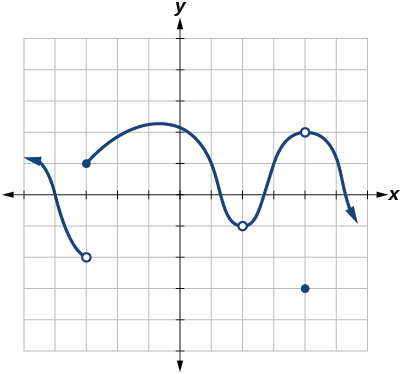

In this section, you will:
* Determine whether a function is continuous at a number.
* Determine the numbers for which a function is discontinuous.
* Determine whether a function is continuous.

Arizona is known for its dry heat. On a particular day, the temperature might rise as high as<math xmlns="http://www.w3.org/1998/Math/MathML"><mtext> </mtext> <mrow> <msup> <mrow> <mn>118</mn> </mrow> <mo>∘</mo> </msup> <mtext>F</mtext> </mrow> <mtext> </mtext></math>

and drop down only to a brisk<math xmlns="http://www.w3.org/1998/Math/MathML"><mtext> </mtext> <mrow> <msup> <mrow> <mn>95</mn> </mrow> <mo>∘</mo> </msup> <mtext>F</mtext><mtext>.</mtext> </mrow> <mtext> </mtext></math>

[\[link\]](#CNX_Precalc_Figure_12_03_001) shows the function<math xmlns="http://www.w3.org/1998/Math/MathML"><mtext> </mtext> <mi>T</mi> <mo>,</mo></math>

 where the output of<math xmlns="http://www.w3.org/1998/Math/MathML"><mtext> </mtext> <mrow> <mi>T</mi><mrow><mo>(</mo> <mi>x</mi> <mo>)</mo></mrow> </mrow> <mtext> </mtext></math>

is the temperature in Fahrenheit degrees and the input<math xmlns="http://www.w3.org/1998/Math/MathML"><mtext> </mtext> <mi>x</mi> <mtext> </mtext></math>

is the time of day, using a 24-hour clock on a particular summer day.

{: #CNX_Precalc_Figure_12_03_001}

When we analyze this graph, we notice a specific characteristic. There are no breaks in the graph. We could trace the graph without picking up our pencil. This single observation tells us a great deal about the function. In this section, we will investigate functions with and without breaks.

### Determining Whether a Function Is Continuous at a Number

Let’s consider a specific example of temperature in terms of date and location, such as June 27, 2013, in Phoenix, AZ. The graph in [\[link\]](#CNX_Precalc_Figure_12_03_001) indicates that, at 2 *a.m.*, the temperature was<math xmlns="http://www.w3.org/1998/Math/MathML"><mtext> </mtext> <mrow> <msup> <mrow> <mn>96</mn> </mrow> <mo>∘</mo> </msup> <mtext>F</mtext> </mrow> </math>

. By 2 *p.m.* the temperature had risen to<math xmlns="http://www.w3.org/1998/Math/MathML"><mtext> </mtext> <mrow> <msup> <mrow> <mn>116</mn> </mrow> <mo>∘</mo> </msup> <mtext>F,</mtext> </mrow> <mtext> </mtext></math>

and by 4 *p.m.* it was<math xmlns="http://www.w3.org/1998/Math/MathML"><mtext> </mtext> <mrow> <msup> <mrow> <mn>118</mn> </mrow> <mo>∘</mo> </msup> <mtext>F</mtext><mtext>.</mtext> </mrow> <mtext> </mtext></math>

Sometime between 2 *a.m.* and 4 *p.m.*, the temperature outside must have been exactly<math xmlns="http://www.w3.org/1998/Math/MathML"><mtext> </mtext> <mrow> <msup> <mrow> <mn>110.5</mn> </mrow> <mo>∘</mo> </msup> <mtext>F</mtext><mtext>.</mtext> </mrow> <mtext> </mtext></math>

In fact, any temperature between<math xmlns="http://www.w3.org/1998/Math/MathML"><mtext> </mtext> <mrow> <msup> <mrow> <mn>96</mn> </mrow> <mo>∘</mo> </msup> <mtext>F</mtext> </mrow> <mtext> </mtext></math>

and<math xmlns="http://www.w3.org/1998/Math/MathML"><mtext> </mtext> <mrow> <msup> <mrow> <mn>118</mn> </mrow> <mo>∘</mo> </msup> <mtext>F</mtext> </mrow> <mtext> </mtext></math>

occurred at some point that day. This means all real numbers in the output between<math xmlns="http://www.w3.org/1998/Math/MathML"><mtext> </mtext> <mrow> <msup> <mrow> <mn>96</mn> </mrow> <mo>∘</mo> </msup> <mtext>F</mtext> </mrow> <mtext> </mtext></math>

and<math xmlns="http://www.w3.org/1998/Math/MathML"><mtext> </mtext> <mrow> <msup> <mrow> <mn>118</mn> </mrow> <mo>∘</mo> </msup> <mtext>F</mtext> </mrow> <mtext> </mtext></math>

are generated at some point by the function according to the intermediate value theorem,

Look again at [\[link\]](#CNX_Precalc_Figure_12_03_001). There are no breaks in the function’s graph for this 24-hour period. At no point did the temperature cease to exist, nor was there a point at which the temperature jumped instantaneously by several degrees. A function that has no holes or breaks in its graph is known as a **continuous function**{: data-type="term"}. Temperature as a function of time is an example of a continuous function.

If temperature represents a continuous function, what kind of function would not be continuous? Consider an example of dollars expressed as a function of hours of parking. Let’s create the function<math xmlns="http://www.w3.org/1998/Math/MathML"><mtext> </mtext> <mi>D</mi> <mo>,</mo></math>

 where<math xmlns="http://www.w3.org/1998/Math/MathML"><mtext> </mtext> <mrow> <mi>D</mi><mrow><mo>(</mo> <mi>x</mi> <mo>)</mo></mrow> </mrow> <mtext> </mtext></math>

is the output representing cost in dollars for parking<math xmlns="http://www.w3.org/1998/Math/MathML"><mtext> </mtext> <mi>x</mi> <mtext> </mtext></math>

number of hours. See [\[link\]](#CNX_Precalc_Figure_12_03_002).

Suppose a parking garage charges $4.00 per hour or fraction of an hour, with a $25 per day maximum charge. Park for two hours and five minutes and the charge is $12. Park an additional hour and the charge is $16. We can never be charged $13, $14, or $15. There are real numbers between 12 and 16 that the function never outputs. There are breaks in the function’s graph for this 24-hour period, points at which the price of parking jumps instantaneously by several dollars.

 {: #CNX_Precalc_Figure_12_03_002}

A function that remains level for an interval and then jumps instantaneously to a higher value is called a **stepwise function**{: data-type="term" .no-emphasis}. This function is an example.

A function that has any hole or break in its graph is known as a **discontinuous function**{: data-type="term"}. A stepwise function, such as parking-garage charges as a function of hours parked, is an example of a discontinuous function.

So how can we decide if a function is continuous at a particular number? We can check three different conditions. Let’s use the function<math xmlns="http://www.w3.org/1998/Math/MathML"><mtext> </mtext> <mrow> <mi>y</mi><mo>=</mo><mi>f</mi><mrow><mo>(</mo> <mi>x</mi> <mo>)</mo></mrow> </mrow> <mtext> </mtext></math>

represented in [\[link\]](#CNX_Precalc_Figure_12_03_003) as an example.

 {: #CNX_Precalc_Figure_12_03_003}

**Condition 1** According to Condition 1, the function<math xmlns="http://www.w3.org/1998/Math/MathML"><mtext> </mtext> <mrow> <mi>f</mi><mrow><mo>(</mo> <mi>a</mi> <mo>)</mo></mrow> </mrow> <mtext> </mtext></math>

defined at<math xmlns="http://www.w3.org/1998/Math/MathML"><mtext> </mtext> <mrow> <mi>x</mi><mo>=</mo><mi>a</mi> </mrow> <mtext> </mtext></math>

must exist. In other words, there is a *y*-coordinate at<math xmlns="http://www.w3.org/1998/Math/MathML"><mtext> </mtext> <mrow> <mi>x</mi><mo>=</mo><mi>a</mi> </mrow> <mtext> </mtext></math>

as in [\[link\]](#CNX_Precalc_Figure_12_03_004).

{: #CNX_Precalc_Figure_12_03_004}

**Condition 2** According to Condition 2, at<math xmlns="http://www.w3.org/1998/Math/MathML"><mtext> </mtext> <mrow> <mi>x</mi><mo>=</mo><mi>a</mi> </mrow> <mtext> </mtext></math>

the limit, written<math xmlns="http://www.w3.org/1998/Math/MathML"><mtext> </mtext> <mrow> <munder> <mrow> <mi>lim</mi> </mrow> <mrow> <mi>x</mi><mo stretchy="false">→</mo><mi>a</mi> </mrow> </munder> <mi>f</mi><mo stretchy="false">(</mo><mi>x</mi><mo stretchy="false">)</mo> </mrow> <mo>,</mo></math>

must exist. This means that at<math xmlns="http://www.w3.org/1998/Math/MathML"><mtext> </mtext> <mrow> <mi>x</mi><mo>=</mo><mi>a</mi> </mrow> <mtext> </mtext></math>

the left-hand limit must equal the right-hand limit. Notice as the graph of<math xmlns="http://www.w3.org/1998/Math/MathML"><mtext> </mtext> <mi>f</mi> <mtext> </mtext></math>

in [\[link\]](#CNX_Precalc_Figure_12_03_003) approaches<math xmlns="http://www.w3.org/1998/Math/MathML"><mtext> </mtext> <mrow> <mi>x</mi><mo>=</mo><mi>a</mi> </mrow> <mtext> </mtext></math>

from the left and right, the same *y*-coordinate is approached. Therefore, Condition 2 is satisfied. However, there could still be a hole in the graph at<math xmlns="http://www.w3.org/1998/Math/MathML"><mtext> </mtext> <mrow> <mi>x</mi><mo>=</mo><mi>a</mi> </mrow> </math>

.

**Condition 3** According to Condition 3, the corresponding<math xmlns="http://www.w3.org/1998/Math/MathML"><mtext> </mtext> <mi>y</mi> <mtext> </mtext></math>

coordinate at<math xmlns="http://www.w3.org/1998/Math/MathML"><mtext> </mtext> <mrow> <mi>x</mi><mo>=</mo><mi>a</mi> </mrow> <mtext> </mtext></math>

fills in the hole in the graph of<math xmlns="http://www.w3.org/1998/Math/MathML"><mtext> </mtext> <mrow> <mi>f</mi><mo>.</mo> </mrow> <mtext> </mtext></math>

This is written<math xmlns="http://www.w3.org/1998/Math/MathML"><mtext> </mtext> <mrow> <munder> <mrow> <mi>lim</mi> </mrow> <mrow> <mi>x</mi><mo stretchy="false">→</mo><mi>a</mi> </mrow> </munder> <mi>f</mi><mo stretchy="false">(</mo><mi>x</mi><mo stretchy="false">)</mo><mo>=</mo><mi>f</mi><mo stretchy="false">(</mo><mi>a</mi><mo stretchy="false">)</mo><mo>.</mo> </mrow> </math>

Satisfying all three conditions means that the function is continuous. All three conditions are satisfied for the function represented in [\[link\]](#CNX_Precalc_Figure_12_03_005) so the function is continuous as<math xmlns="http://www.w3.org/1998/Math/MathML"><mtext> </mtext> <mrow> <mi>x</mi><mo>=</mo><mi>a</mi><mo>.</mo> </mrow> </math>

 {: #CNX_Precalc_Figure_12_03_005}

[\[link\]](#CNX_Precalc_Figure_12_03_006) through [\[link\]](#CNX_Precalc_Figure_12_03_009) provide several examples of graphs of functions that are not continuous at<math xmlns="http://www.w3.org/1998/Math/MathML"><mtext> </mtext> <mrow> <mi>x</mi><mo>=</mo><mi>a</mi> </mrow> <mtext> </mtext></math>

and the condition or conditions that fail.

 {: #CNX_Precalc_Figure_12_03_006}

{: #CNX_Precalc_Figure_12_03_007}

{: #CNX_Precalc_Figure_12_03_008}

{: #CNX_Precalc_Figure_12_03_009}

Definition of Continuity

A function<math xmlns="http://www.w3.org/1998/Math/MathML"><mtext> </mtext> <mrow> <mi>f</mi><mrow><mo>(</mo> <mi>x</mi> <mo>)</mo></mrow> </mrow> <mtext> </mtext></math>

is **continuous** at<math xmlns="http://www.w3.org/1998/Math/MathML"><mtext> </mtext> <mrow> <mi>x</mi><mo>=</mo><mi>a</mi> </mrow> <mtext> </mtext></math>

provided all three of the following conditions hold true:

Condition 1:
<math xmlns="http://www.w3.org/1998/Math/MathML"><mtext> </mtext> <mrow> <mi>f</mi><mo stretchy="false">(</mo><mi>a</mi><mo stretchy="false">)</mo> </mrow> <mtext> </mtext></math>
exists.

Condition 2:
<math xmlns="http://www.w3.org/1998/Math/MathML"><mtext> </mtext> <mrow> <munder> <mrow> <mi>lim</mi> </mrow> <mrow> <mi>x</mi><mo stretchy="false">→</mo><mi>a</mi> </mrow> </munder> <mi>f</mi><mo stretchy="false">(</mo><mi>x</mi><mo stretchy="false">)</mo> </mrow> <mtext> </mtext></math>
exists at
<math xmlns="http://www.w3.org/1998/Math/MathML"><mtext> </mtext> <mrow> <mi>x</mi><mo>=</mo><mi>a</mi> </mrow> </math>
.

Condition 3:
<math xmlns="http://www.w3.org/1998/Math/MathML"><mtext> </mtext> <mrow> <munder> <mrow> <mi>lim</mi> </mrow> <mrow> <mi>x</mi><mo stretchy="false">→</mo><mi>a</mi> </mrow> </munder> <mi>f</mi><mo stretchy="false">(</mo><mi>x</mi><mo stretchy="false">)</mo><mo>=</mo><mi>f</mi><mo stretchy="false">(</mo><mi>a</mi><mo stretchy="false">)</mo> </mrow> </math>
.

If a function<math xmlns="http://www.w3.org/1998/Math/MathML"><mtext> </mtext> <mrow> <mi>f</mi><mrow><mo>(</mo> <mi>x</mi> <mo>)</mo></mrow> </mrow> <mtext> </mtext></math>

is not continuous at<math xmlns="http://www.w3.org/1998/Math/MathML"><mtext> </mtext> <mrow> <mi>x</mi><mo>=</mo><mi>a</mi> </mrow> <mo>,</mo></math>

the function is **discontinuous**{: data-type="term"} at<math xmlns="http://www.w3.org/1998/Math/MathML"><mtext> </mtext> <mrow> <mi>x</mi><mo>=</mo><mi>a</mi> </mrow> </math>

.

#### Identifying a Jump Discontinuity

Discontinuity can occur in different ways. We saw in the previous section that a function could have a **left-hand limit**{: data-type="term" .no-emphasis} and a **right-hand limit**{: data-type="term" .no-emphasis} even if they are not equal. If the left- and right-hand limits exist but are different, the graph “jumps” at<math xmlns="http://www.w3.org/1998/Math/MathML"><mtext> </mtext> <mrow> <mi>x</mi><mo>=</mo><mi>a</mi> </mrow> </math>

. The function is said to have a jump discontinuity.

As an example, look at the graph of the function<math xmlns="http://www.w3.org/1998/Math/MathML"><mtext> </mtext> <mrow> <mi>y</mi><mo>=</mo><mi>f</mi><mrow><mo>(</mo> <mi>x</mi> <mo>)</mo></mrow> </mrow> <mtext> </mtext></math>

in [\[link\]](#CNX_Precalc_Figure_12_03_010). Notice as<math xmlns="http://www.w3.org/1998/Math/MathML"><mtext> </mtext> <mi>x</mi> <mtext> </mtext></math>

approaches<math xmlns="http://www.w3.org/1998/Math/MathML"><mtext> </mtext> <mi>a</mi> <mtext> </mtext></math>

how the output approaches different values from the left and from the right.

 {: #CNX_Precalc_Figure_12_03_010}

Jump Discontinuity

A function<math xmlns="http://www.w3.org/1998/Math/MathML"><mtext> </mtext> <mrow> <mi>f</mi><mrow><mo>(</mo> <mi>x</mi> <mo>)</mo></mrow> </mrow> <mtext> </mtext></math>

has a **jump discontinuity**{: data-type="term"} at<math xmlns="http://www.w3.org/1998/Math/MathML"><mtext> </mtext> <mrow> <mi>x</mi><mo>=</mo><mi>a</mi> </mrow> <mtext> </mtext></math>

if the left- and right-hand limits both exist but are not equal:<math xmlns="http://www.w3.org/1998/Math/MathML"><mtext> </mtext> <mrow> <munder> <mrow> <mi>lim</mi> </mrow> <mrow> <mi>x</mi><mo stretchy="false">→</mo><msup> <mi>a</mi> <mo>−</mo> </msup> </mrow> </munder> <mi>f</mi><mo stretchy="false">(</mo><mi>x</mi><mo stretchy="false">)</mo><mo>≠</mo><munder> <mrow> <mi>lim</mi> </mrow> <mrow> <mi>x</mi><mo stretchy="false">→</mo><msup> <mi>a</mi> <mo>+</mo> </msup> </mrow> </munder> <mi>f</mi><mo stretchy="false">(</mo><mi>x</mi><mo stretchy="false">)</mo> </mrow> </math>

.

#### Identifying Removable Discontinuity

Some functions have a discontinuity, but it is possible to redefine the function at that point to make it continuous. This type of function is said to have a removable discontinuity. Let’s look at the function<math xmlns="http://www.w3.org/1998/Math/MathML"><mtext> </mtext> <mrow> <mi>y</mi><mo>=</mo><mi>f</mi><mrow><mo>(</mo> <mi>x</mi> <mo>)</mo></mrow> </mrow> <mtext> </mtext></math>

represented by the graph in [\[link\]](#CNX_Precalc_Figure_12_03_011). The function has a limit. However, there is a hole at<math xmlns="http://www.w3.org/1998/Math/MathML"><mtext> </mtext> <mrow> <mi>x</mi><mo>=</mo><mi>a</mi> </mrow> </math>

. The hole can be filled by extending the domain to include the input<math xmlns="http://www.w3.org/1998/Math/MathML"><mtext> </mtext> <mrow> <mi>x</mi><mo>=</mo><mi>a</mi> </mrow> <mtext> </mtext></math>

and defining the corresponding output of the function at that value as the limit of the function at<math xmlns="http://www.w3.org/1998/Math/MathML"><mtext> </mtext> <mrow> <mi>x</mi><mo>=</mo><mi>a</mi> </mrow> </math>

.

 {: #CNX_Precalc_Figure_12_03_011}

Removable Discontinuity

A function<math xmlns="http://www.w3.org/1998/Math/MathML"><mtext> </mtext> <mrow> <mi>f</mi><mrow><mo>(</mo> <mi>x</mi> <mo>)</mo></mrow> </mrow> <mtext> </mtext></math>

has a **removable discontinuity**{: data-type="term"} at<math xmlns="http://www.w3.org/1998/Math/MathML"><mtext> </mtext> <mrow> <mi>x</mi><mo>=</mo><mi>a</mi> </mrow> <mtext> </mtext></math>

if the limit,<math xmlns="http://www.w3.org/1998/Math/MathML"><mtext> </mtext> <mrow> <munder> <mrow> <mi>lim</mi> </mrow> <mrow> <mi>x</mi><mo stretchy="false">→</mo><mi>a</mi> </mrow> </munder> <mi>f</mi><mo stretchy="false">(</mo><mi>x</mi><mo stretchy="false">)</mo> </mrow> <mo>,</mo></math>

 exists, but either

<math xmlns="http://www.w3.org/1998/Math/MathML"> <mrow> <mi>f</mi><mrow><mo>(</mo> <mi>a</mi> <mo>)</mo></mrow> </mrow> <mtext> </mtext></math>
does not exist *or*

<math xmlns="http://www.w3.org/1998/Math/MathML"> <mrow> <mi>f</mi><mrow><mo>(</mo> <mi>a</mi> <mo>)</mo></mrow><mo>,</mo> </mrow> </math>
the value of the function at
<math xmlns="http://www.w3.org/1998/Math/MathML"><mtext> </mtext> <mrow> <mi>x</mi><mo>=</mo><mi>a</mi> </mrow> <mtext> </mtext></math>
does not equal the limit,
<math xmlns="http://www.w3.org/1998/Math/MathML"><mtext> </mtext> <mrow> <mi>f</mi><mo stretchy="false">(</mo><mi>a</mi><mo stretchy="false">)</mo><mo>≠</mo><munder> <mrow> <mi>lim</mi> </mrow> <mrow> <mi>x</mi><mo stretchy="false">→</mo><mi>a</mi> </mrow> </munder> <mi>f</mi><mo stretchy="false">(</mo><mi>x</mi><mo stretchy="false">)</mo><mo>.</mo> </mrow> </math>

Identifying Discontinuities

Identify all discontinuities for the following functions as either a jump or a removable discontinuity.

1.  <math xmlns="http://www.w3.org/1998/Math/MathML"> <mrow> <mi>f</mi><mo stretchy="false">(</mo><mi>x</mi><mo stretchy="false">)</mo><mo>=</mo><mfrac> <mrow> <msup> <mi>x</mi> <mn>2</mn> </msup> <mo>−</mo><mn>2</mn><mi>x</mi><mo>−</mo><mn>15</mn> </mrow> <mrow> <mi>x</mi><mo>−</mo><mn>5</mn> </mrow> </mfrac> </mrow> </math>

2.  <math xmlns="http://www.w3.org/1998/Math/MathML"> <mrow> <mi>g</mi><mo stretchy="false">(</mo><mi>x</mi><mo stretchy="false">)</mo><mo>=</mo><mrow><mo>{</mo> <mrow> <mtable columnalign="left"> <mtr columnalign="left"> <mtd columnalign="left"> <mrow> <mi>x</mi><mo>+</mo><mn>1</mn><mo>,</mo> </mrow> </mtd> <mtd columnalign="left"> <mrow> <mi>x</mi><mo>&lt;</mo><mn>2</mn> </mrow> </mtd> </mtr> <mtr columnalign="left"> <mtd columnalign="left"> <mrow> <mo>−</mo><mi>x</mi><mo>,</mo> </mrow> </mtd> <mtd columnalign="left"> <mrow> <mi>x</mi><mo>≥</mo><mn>2</mn> </mrow> </mtd> </mtr> </mtable> </mrow> </mrow> </mrow> </math>
{: data-number-style="lower-alpha"}

1.  Notice that the function is defined everywhere except at<math xmlns="http://www.w3.org/1998/Math/MathML"><mtext> </mtext> <mrow> <mi>x</mi><mo>=</mo><mn>5.</mn> </mrow> </math>
    
    Thus,<math xmlns="http://www.w3.org/1998/Math/MathML"><mtext> </mtext> <mrow> <mi>f</mi><mrow><mo>(</mo> <mn>5</mn> <mo>)</mo></mrow> </mrow> <mtext> </mtext></math>
    
    does not exist, Condition 2 is not satisfied. Since Condition 1 is satisfied, the limit as<math xmlns="http://www.w3.org/1998/Math/MathML"><mtext> </mtext> <mi>x</mi> <mtext> </mtext></math>
    
    approaches 5 is 8, and Condition 2 is not satisfied.This means there is a removable discontinuity at<math xmlns="http://www.w3.org/1998/Math/MathML"><mtext> </mtext> <mrow> <mi>x</mi><mo>=</mo><mn>5.</mn> </mrow> </math>

2.  Condition 2 is satisfied because<math xmlns="http://www.w3.org/1998/Math/MathML"><mtext> </mtext> <mrow> <mi>g</mi><mo stretchy="false">(</mo><mn>2</mn><mo stretchy="false">)</mo><mo>=</mo><mo>−</mo><mn>2.</mn> </mrow> </math>
    
    Notice that the function is a **piecewise function**{: data-type="term" .no-emphasis}, and for each piece, the function is defined everywhere on its domain. Let’s examine Condition 1 by determining the left- and right-hand limits as<math xmlns="http://www.w3.org/1998/Math/MathML"><mtext> </mtext> <mi>x</mi> <mtext> </mtext></math>
    
    approaches 2.
    
    Left-hand limit:<math xmlns="http://www.w3.org/1998/Math/MathML"><mtext> </mtext> <mrow> <munder> <mrow> <mi>lim</mi> </mrow> <mrow> <mi>x</mi><mo stretchy="false">→</mo><msup> <mn>2</mn> <mo>−</mo> </msup> </mrow> </munder> <mrow><mo>(</mo> <mrow> <mi>x</mi><mo>+</mo><mn>1</mn> </mrow> <mo>)</mo></mrow><mo>=</mo><mn>2</mn><mo>+</mo><mn>1</mn><mo>=</mo><mn>3.</mn> </mrow> <mtext> </mtext></math>
    
    The left-hand limit exists.
    
    Right-hand limit:<math xmlns="http://www.w3.org/1998/Math/MathML"><mtext> </mtext> <mrow> <munder> <mrow> <mi>lim</mi> </mrow> <mrow> <mi>x</mi><mo stretchy="false">→</mo><msup> <mn>2</mn> <mo>+</mo> </msup> </mrow> </munder> <mrow><mo>(</mo> <mrow> <mo>−</mo><mi>x</mi> </mrow> <mo>)</mo></mrow><mo>=</mo><mo>−</mo><mn>2.</mn> </mrow> <mtext> </mtext></math>
    
    The right-hand limit exists. But
    
    

    <math xmlns="http://www.w3.org/1998/Math/MathML"> <mrow> <munder> <mrow> <mi>lim</mi> </mrow> <mrow> <mi>x</mi><mo stretchy="false">→</mo><msup> <mn>2</mn> <mo>−</mo> </msup> </mrow> </munder> <mi>f</mi><mo stretchy="false">(</mo><mi>x</mi><mo stretchy="false">)</mo><mo>≠</mo><munder> <mrow> <mi>lim</mi> </mrow> <mrow> <mi>x</mi><mo stretchy="false">→</mo><msup> <mn>2</mn> <mo>+</mo> </msup> </mrow> </munder> <mi>f</mi><mo stretchy="false">(</mo><mi>x</mi><mo stretchy="false">)</mo><mo>.</mo> </mrow> </math>
    

    
    So,<math xmlns="http://www.w3.org/1998/Math/MathML"><mtext> </mtext> <mrow> <munder> <mrow> <mi>lim</mi> </mrow> <mrow> <mi>x</mi><mo stretchy="false">→</mo><mn>2</mn> </mrow> </munder> <mi>f</mi><mo stretchy="false">(</mo><mi>x</mi><mo stretchy="false">)</mo> </mrow> <mtext> </mtext></math>
    
    does not exist, and Condition 2 fails: There is no removable discontinuity. However, since both left- and right-hand limits exist but are not equal, the conditions are satisfied for a jump discontinuity at<math xmlns="http://www.w3.org/1998/Math/MathML"><mtext> </mtext> <mrow> <mi>x</mi><mo>=</mo><mn>2.</mn> </mrow> </math>
{: data-number-style="lower-alpha"}

Identify all discontinuities for the following functions as either a jump or a removable discontinuity.

1.  <math xmlns="http://www.w3.org/1998/Math/MathML"> <mrow> <mi>f</mi><mo stretchy="false">(</mo><mi>x</mi><mo stretchy="false">)</mo><mo>=</mo><mfrac> <mrow> <msup> <mi>x</mi> <mn>2</mn> </msup> <mo>−</mo><mn>6</mn><mi>x</mi> </mrow> <mrow> <mi>x</mi><mo>−</mo><mn>6</mn> </mrow> </mfrac> </mrow> </math>

2.  <math xmlns="http://www.w3.org/1998/Math/MathML"> <mrow> <mi>g</mi><mo stretchy="false">(</mo><mi>x</mi><mo stretchy="false">)</mo><mo>=</mo><mrow><mo>{</mo> <mrow> <mtable columnalign="left"> <mtr columnalign="left"> <mtd columnalign="left"> <mrow> <msqrt> <mi>x</mi> </msqrt> <mo>,</mo> </mrow> </mtd> <mtd columnalign="left"> <mrow> <mn>0</mn><mo>≤</mo><mi>x</mi><mo>&lt;</mo><mn>4</mn> </mrow> </mtd> </mtr> <mtr columnalign="left"> <mtd columnalign="left"> <mrow> <mn>2</mn><mi>x</mi><mo>,</mo> </mrow> </mtd> <mtd columnalign="left"> <mrow> <mi>x</mi><mo>≥</mo><mn>4</mn> </mrow> </mtd> </mtr> </mtable> </mrow> </mrow> </mrow> </math>
{: data-number-style="lower-alpha"}

1.  removable discontinuity at
    <math xmlns="http://www.w3.org/1998/Math/MathML"><mtext> </mtext> <mrow> <mi>x</mi><mo>=</mo><mn>6</mn><mo>;</mo> </mrow> </math>

2.  jump discontinuity at
    <math xmlns="http://www.w3.org/1998/Math/MathML"><mtext> </mtext> <mrow> <mi>x</mi><mo>=</mo><mn>4</mn> </mrow> </math>
{: data-number-style="lower-alpha"}

### Recognizing Continuous and Discontinuous Real-Number Functions

Many of the functions we have encountered in earlier chapters are continuous everywhere. They never have a hole in them, and they never jump from one value to the next. For all of these functions, the limit of<math xmlns="http://www.w3.org/1998/Math/MathML"><mtext> </mtext> <mrow> <mi>f</mi><mrow><mo>(</mo> <mi>x</mi> <mo>)</mo></mrow> </mrow> <mtext> </mtext></math>

as<math xmlns="http://www.w3.org/1998/Math/MathML"><mtext> </mtext> <mi>x</mi> <mtext> </mtext></math>

approaches<math xmlns="http://www.w3.org/1998/Math/MathML"><mtext> </mtext> <mi>a</mi> <mtext> </mtext></math>

is the same as the value of<math xmlns="http://www.w3.org/1998/Math/MathML"><mtext> </mtext> <mrow> <mi>f</mi><mrow><mo>(</mo> <mi>x</mi> <mo>)</mo></mrow> </mrow> <mtext> </mtext></math>

when<math xmlns="http://www.w3.org/1998/Math/MathML"><mtext> </mtext> <mrow> <mi>x</mi><mo>=</mo><mi>a</mi><mo>.</mo> </mrow> <mtext> </mtext></math>

So<math xmlns="http://www.w3.org/1998/Math/MathML"><mtext> </mtext> <mrow> <munder> <mrow> <mi>lim</mi> </mrow> <mrow> <mi>x</mi><mo stretchy="false">→</mo><mi>a</mi> </mrow> </munder> <mi>f</mi><mo stretchy="false">(</mo><mi>x</mi><mo stretchy="false">)</mo><mo>=</mo><mi>f</mi><mo stretchy="false">(</mo><mi>a</mi><mo stretchy="false">)</mo><mo>.</mo> </mrow> <mtext> </mtext></math>

There are some functions that are continuous everywhere and some that are only continuous where they are defined on their domain because they are not defined for all real numbers.

Examples of Continuous Functions

The following functions are continuous everywhere:

<table id="eip-id1165135182782" summary=".." data-label=""><colgroup><col width="50%" align="left" /><col width="50%" align="left" /></colgroup><tbody>
<tr>
<td>Polynomial functions</td>
<td>Ex:<math xmlns="http://www.w3.org/1998/Math/MathML"><mtext> </mtext>
 <mrow>
  <mi>f</mi><mo stretchy="false">(</mo><mi>x</mi><mo stretchy="false">)</mo><mo>=</mo><msup>
   <mi>x</mi>
   <mn>4</mn>
  </msup>
  <mo>−</mo><mn>9</mn><msup>
   <mi>x</mi>
   <mn>2</mn>
  </msup>
  
 </mrow>
</math></td>
</tr>

<tr>
<td>Exponential functions</td>
<td>Ex:<math xmlns="http://www.w3.org/1998/Math/MathML"><mtext> </mtext>
 <mrow>
  <mi>f</mi><mo stretchy="false">(</mo><mi>x</mi><mo stretchy="false">)</mo><mo>=</mo><msup>
   <mn>4</mn>
   <mrow>
    <mi>x</mi><mo>+</mo><mn>2</mn>
   </mrow>
  </msup>
  <mo>−</mo><mn>5</mn>
 </mrow>
</math></td>
</tr>
<tr>
<td>Sine functions</td>
<td>Ex:<math xmlns="http://www.w3.org/1998/Math/MathML"><mtext> </mtext>
 <mrow>
  <mi>f</mi><mo stretchy="false">(</mo><mi>x</mi><mo stretchy="false">)</mo><mo>=</mo><mi>sin</mi><mrow><mo>(</mo>
   <mrow>
    <mn>2</mn><mi>x</mi>
   </mrow>
  <mo>)</mo></mrow><mo>−</mo><mn>4</mn>
 </mrow>
</math></td>
</tr>
<tr>
<td>Cosine functions</td>
<td>Ex:<math xmlns="http://www.w3.org/1998/Math/MathML"><mtext> </mtext>
 <mrow>
  <mi>f</mi><mo stretchy="false">(</mo><mi>x</mi><mo stretchy="false">)</mo><mo>=</mo><mo>−</mo><mi>cos</mi><mrow><mo>(</mo>
   <mrow>
    <mi>x</mi><mo>+</mo><mfrac>
     <mi>π</mi>
     <mn>3</mn>
    </mfrac>
    
   </mrow>
  <mo>)</mo></mrow>
 </mrow>
</math></td>
</tr>
</tbody></table>
The following functions are continuous everywhere they are defined on their domain:

<table id="eip-id1165135359811" summary="" data-label=""><colgroup><col width="25%" /><col width="75%" /></colgroup><tbody>
<tr>
<td>Logarithmic functions</td>
<td>Ex:<math xmlns="http://www.w3.org/1998/Math/MathML"><mtext> </mtext>
 <mrow>
  <mi>f</mi><mo stretchy="false">(</mo><mi>x</mi><mo stretchy="false">)</mo><mo>=</mo><mn>2</mn><mi>ln</mi><mrow><mo>(</mo>
   <mi>x</mi>
  <mo>)</mo></mrow>
 </mrow>
</math>,<math xmlns="http://www.w3.org/1998/Math/MathML"><mtext> </mtext>
 <mrow>
  <mi>x</mi><mo>&gt;</mo><mn>0</mn>
 </mrow>
</math></td>
</tr>
<tr>
<td>Tangent functions</td>
<td>Ex:<math xmlns="http://www.w3.org/1998/Math/MathML"><mtext> </mtext>
 <mrow>
  <mi>f</mi><mo stretchy="false">(</mo><mi>x</mi><mo stretchy="false">)</mo><mo>=</mo><mi>tan</mi><mrow><mo>(</mo>
   <mi>x</mi>
  <mo>)</mo></mrow><mo>+</mo><mn>2</mn><mo>,</mo>
 </mrow>
</math><math xmlns="http://www.w3.org/1998/Math/MathML"><mtext> </mtext>
 <mrow>
  <mi>x</mi><mo>≠</mo><mfrac>
   <mi>π</mi>
   <mn>2</mn>
  </mfrac>
  <mo>+</mo><mi>k</mi><mi>π</mi><mo>,</mo>
 </mrow>
</math><math xmlns="http://www.w3.org/1998/Math/MathML"><mtext> </mtext>
 <mi>k</mi>
<mtext> </mtext></math>is an integer</td>
</tr>
<tr>
<td>Rational functions</td>
<td>Ex:<math xmlns="http://www.w3.org/1998/Math/MathML"><mtext> </mtext>
 <mrow>
  <mi>f</mi><mo stretchy="false">(</mo><mi>x</mi><mo stretchy="false">)</mo><mo>=</mo><mfrac>
   <mrow>
    <msup>
     <mi>x</mi>
     <mn>2</mn>
    </msup>
    <mo>−</mo><mn>25</mn>
   </mrow>
   <mrow>
    <mi>x</mi><mo>−</mo><mn>7</mn>
   </mrow>
  </mfrac>
  <mo>,</mo>
 </mrow>
</math><math xmlns="http://www.w3.org/1998/Math/MathML"><mtext> </mtext>
 <mrow>
  <mi>x</mi><mo>≠</mo><mn>7</mn>
 </mrow>
</math></td>
</tr>
</tbody></table>

<strong>Given a function<math xmlns="http://www.w3.org/1998/Math/MathML"><mtext> </mtext>
 <mrow>
  <mi>f</mi><mrow><mo>(</mo>
   <mi>x</mi>
  <mo>)</mo></mrow><mo>,</mo>
 </mrow>
</math> determine if the function is continuous at<math xmlns="http://www.w3.org/1998/Math/MathML"><mtext> </mtext>
 <mrow>
  <mi>x</mi><mo>=</mo><mi>a</mi><mo>.</mo>
 </mrow>
</math></strong>

1.  Check Condition 1:
    <math xmlns="http://www.w3.org/1998/Math/MathML"><mtext> </mtext> <mrow> <mi>f</mi><mo stretchy="false">(</mo><mi>a</mi><mo stretchy="false">)</mo> </mrow> <mtext> </mtext></math>
    
    exists.
2.  Check Condition 2:
    <math xmlns="http://www.w3.org/1998/Math/MathML"><mtext> </mtext> <mrow> <munder> <mrow> <mi>lim</mi> </mrow> <mrow> <mi>x</mi><mo stretchy="false">→</mo><mi>a</mi> </mrow> </munder> <mi>f</mi><mo stretchy="false">(</mo><mi>x</mi><mo stretchy="false">)</mo> </mrow> <mtext> </mtext></math>
    
    exists at
    <math xmlns="http://www.w3.org/1998/Math/MathML"><mtext> </mtext> <mrow> <mi>x</mi><mo>=</mo><mi>a</mi><mo>.</mo> </mrow> </math>

3.  Check Condition 3:
    <math xmlns="http://www.w3.org/1998/Math/MathML"><mtext> </mtext> <mrow> <munder> <mrow> <mi>lim</mi> </mrow> <mrow> <mi>x</mi><mo stretchy="false">→</mo><mi>a</mi> </mrow> </munder> <mi>f</mi><mo stretchy="false">(</mo><mi>x</mi><mo stretchy="false">)</mo><mo>=</mo><mi>f</mi><mo stretchy="false">(</mo><mi>a</mi><mo stretchy="false">)</mo><mo>.</mo> </mrow> </math>

4.  If all three conditions are satisfied, the function is continuous at
    <math xmlns="http://www.w3.org/1998/Math/MathML"><mtext> </mtext> <mrow> <mi>x</mi><mo>=</mo><mi>a</mi><mo>.</mo> </mrow> <mtext> </mtext></math>
    
    If any one of the conditions is not satisfied, the function is not continuous at
    <math xmlns="http://www.w3.org/1998/Math/MathML"><mtext> </mtext> <mrow> <mi>x</mi><mo>=</mo><mi>a</mi><mo>.</mo> </mrow> </math>
{: data-number-style="arabic"}

Determining Whether a Piecewise Function is Continuous at a Given Number

Determine whether the function<math xmlns="http://www.w3.org/1998/Math/MathML"><mtext> </mtext> <mrow> <mi>f</mi><mo stretchy="false">(</mo><mi>x</mi><mo stretchy="false">)</mo><mo>=</mo><mrow><mo>{</mo> <mrow> <mtable columnalign="left"> <mtr columnalign="left"> <mtd columnalign="left"> <mrow> <mn>4</mn><mi>x</mi><mo>,</mo> </mrow> </mtd> <mtd columnalign="left"> <mrow> <mi>x</mi><mo>≤</mo><mn>3</mn> </mrow> </mtd> </mtr> <mtr columnalign="left"> <mtd columnalign="left"> <mrow> <mn>8</mn><mo>+</mo><mi>x</mi><mo>,</mo> </mrow> </mtd> <mtd columnalign="left"> <mrow> <mi>x</mi><mo>&gt;</mo><mn>3</mn> </mrow> </mtd> </mtr> </mtable> </mrow> </mrow> </mrow> <mtext> </mtext></math>

is continuous at

1.  <math xmlns="http://www.w3.org/1998/Math/MathML"> <mrow> <mi>x</mi><mo>=</mo><mn>3</mn> </mrow> </math>

2.  <math xmlns="http://www.w3.org/1998/Math/MathML"> <mrow> <mi>x</mi><mo>=</mo><mfrac> <mn>8</mn> <mn>3</mn> </mfrac> </mrow> </math>
{: data-number-style="lower-alpha"}

To determine if the function<math xmlns="http://www.w3.org/1998/Math/MathML"><mtext> </mtext> <mi>f</mi> <mtext> </mtext></math>

is continuous at<math xmlns="http://www.w3.org/1998/Math/MathML"><mtext> </mtext> <mrow> <mi>x</mi><mo>=</mo><mi>a</mi><mo>,</mo> </mrow> <mtext> </mtext></math>

we will determine if the three conditions of continuity are satisfied at<math xmlns="http://www.w3.org/1998/Math/MathML"><mtext> </mtext> <mrow> <mi>x</mi><mo>=</mo><mi>a</mi> </mrow> </math>

.

1.  Condition 1: Does<math xmlns="http://www.w3.org/1998/Math/MathML"><mtext> </mtext> <mrow> <mi>f</mi><mo stretchy="false">(</mo><mi>a</mi><mo stretchy="false">)</mo> </mrow> <mtext> </mtext></math>
    
    exist?
    
    

    <math xmlns="http://www.w3.org/1998/Math/MathML" display="block"> <mrow> <mtable columnalign="left"> <mtr columnalign="left"> <mtd columnalign="left"> <mrow> <mi>f</mi><mo stretchy="false">(</mo><mn>3</mn><mo stretchy="false">)</mo><mo>=</mo><mn>4</mn><mo stretchy="false">(</mo><mn>3</mn><mo stretchy="false">)</mo><mo>=</mo><mn>12</mn> </mrow> </mtd> </mtr> <mtr columnalign="left"> <mtd columnalign="left"> <mrow> <mo stretchy="false">⇒</mo><mtext>Condition 1 is satisfied</mtext><mo>.</mo> </mrow> </mtd> </mtr> </mtable> </mrow> </math>
    

    
    Condition 2: Does<math xmlns="http://www.w3.org/1998/Math/MathML"><mtext> </mtext> <mrow> <munder> <mrow> <mi>lim</mi> </mrow> <mrow> <mi>x</mi><mo stretchy="false">→</mo><mn>3</mn> </mrow> </munder> <mi>f</mi><mo stretchy="false">(</mo><mi>x</mi><mo stretchy="false">)</mo> </mrow> <mtext> </mtext></math>
    
    exist?
    
    To the left of<math xmlns="http://www.w3.org/1998/Math/MathML"><mtext> </mtext> <mrow> <mi>x</mi><mo>=</mo><mn>3</mn><mo>,</mo> </mrow> </math>
    
    <math xmlns="http://www.w3.org/1998/Math/MathML"><mtext> </mtext> <mrow> <mi>f</mi><mo stretchy="false">(</mo><mi>x</mi><mo stretchy="false">)</mo><mo>=</mo><mn>4</mn><mi>x</mi><mo>;</mo> </mrow> <mtext> </mtext></math>
    
    to the right of<math xmlns="http://www.w3.org/1998/Math/MathML"><mtext> </mtext> <mrow> <mi>x</mi><mo>=</mo><mn>3</mn><mo>,</mo> </mrow> </math>
    
    <math xmlns="http://www.w3.org/1998/Math/MathML"><mtext> </mtext> <mrow> <mi>f</mi><mo stretchy="false">(</mo><mi>x</mi><mo stretchy="false">)</mo><mo>=</mo><mn>8</mn><mo>+</mo><mi>x</mi><mo>.</mo> </mrow> <mtext> </mtext></math>
    
    We need to evaluate the left- and right-hand limits as<math xmlns="http://www.w3.org/1998/Math/MathML"><mtext> </mtext> <mi>x</mi> <mtext> </mtext></math>
    
    approaches 1.
    
    

    

    Left-hand limit:
    <math xmlns="http://www.w3.org/1998/Math/MathML"><mtext> </mtext> <mrow> <munder> <mrow> <mi>lim</mi> </mrow> <mrow> <mi>x</mi><mo stretchy="false">→</mo><msup> <mn>3</mn> <mo>−</mo> </msup> </mrow> </munder> <mi>f</mi><mo stretchy="false">(</mo><mi>x</mi><mo stretchy="false">)</mo><mo>=</mo><munder> <mrow> <mi>lim</mi> </mrow> <mrow> <mi>x</mi><mo stretchy="false">→</mo><msup> <mn>3</mn> <mo>−</mo> </msup> </mrow> </munder> <mn>4</mn><mo stretchy="false">(</mo><mn>3</mn><mo stretchy="false">)</mo><mo>=</mo><mn>12</mn> </mrow> </math>
    

    

    Right-hand limit:
    <math xmlns="http://www.w3.org/1998/Math/MathML"><mtext> </mtext> <mrow> <munder> <mrow> <mi>lim</mi> </mrow> <mrow> <mi>x</mi><mo stretchy="false">→</mo><msup> <mn>3</mn> <mo>+</mo> </msup> </mrow> </munder> <mi>f</mi><mo stretchy="false">(</mo><mi>x</mi><mo stretchy="false">)</mo><mo>=</mo><munder> <mrow> <mi>lim</mi> </mrow> <mrow> <mi>x</mi><mo stretchy="false">→</mo><msup> <mn>3</mn> <mo>+</mo> </msup> </mrow> </munder> <mrow><mo>(</mo> <mrow> <mn>8</mn><mo>+</mo><mi>x</mi> </mrow> <mo>)</mo></mrow><mo>=</mo><mn>8</mn><mo>+</mo><mn>3</mn><mo>=</mo><mn>11</mn> </mrow> </math>
    

    

    
    Because<math xmlns="http://www.w3.org/1998/Math/MathML"><mtext> </mtext> <mrow> <munder> <mrow> <mi>lim</mi> </mrow> <mrow> <mi>x</mi><mo stretchy="false">→</mo><msup> <mn>1</mn> <mo>−</mo> </msup> </mrow> </munder> <mi>f</mi><mo stretchy="false">(</mo><mi>x</mi><mo stretchy="false">)</mo><mo>≠</mo><munder> <mrow> <mi>lim</mi> </mrow> <mrow> <mi>x</mi><mo stretchy="false">→</mo><msup> <mn>1</mn> <mo>+</mo> </msup> </mrow> </munder> <mi>f</mi><mo stretchy="false">(</mo><mi>x</mi><mo stretchy="false">)</mo><mo>,</mo> </mrow> </math>
    
    <math xmlns="http://www.w3.org/1998/Math/MathML"><mtext> </mtext> <mrow> <munder> <mrow> <mi>lim</mi> </mrow> <mrow> <mi>x</mi><mo stretchy="false">→</mo><mn>1</mn> </mrow> </munder> <mi>f</mi><mo stretchy="false">(</mo><mi>x</mi><mo stretchy="false">)</mo> </mrow> <mtext> </mtext></math>
    
    does not exist.
    
    

    <math xmlns="http://www.w3.org/1998/Math/MathML"> <mrow> <mo stretchy="false">⇒</mo><mtext> Condition 2 fails</mtext><mtext>.</mtext> </mrow> </math>
    

    
    There is no need to proceed further. Condition 2 fails at<math xmlns="http://www.w3.org/1998/Math/MathML"><mtext> </mtext> <mrow> <mi>x</mi><mo>=</mo><mn>3.</mn> </mrow> <mtext>  </mtext></math>
    
    If any of the conditions of continuity are not satisfied at<math xmlns="http://www.w3.org/1998/Math/MathML"><mtext> </mtext> <mrow> <mi>x</mi><mo>=</mo><mn>3</mn><mo>,</mo> </mrow> <mtext> </mtext></math>
    
    the function<math xmlns="http://www.w3.org/1998/Math/MathML"><mtext> </mtext> <mrow> <mi>f</mi><mrow><mo>(</mo> <mi>x</mi> <mo>)</mo></mrow> </mrow> <mtext> </mtext></math>
    
    is not continuous at<math xmlns="http://www.w3.org/1998/Math/MathML"><mtext> </mtext> <mrow> <mi>x</mi><mo>=</mo><mn>3.</mn> </mrow> </math>

2.  <math xmlns="http://www.w3.org/1998/Math/MathML"> <mrow> <mi>x</mi><mo>=</mo><mfrac> <mn>8</mn> <mn>3</mn> </mfrac> </mrow> </math>
    
    Condition 1: Does<math xmlns="http://www.w3.org/1998/Math/MathML"><mtext> </mtext> <mrow> <mi>f</mi><mrow><mo>(</mo> <mrow> <mfrac> <mn>8</mn> <mn>3</mn> </mfrac> </mrow> <mo>)</mo></mrow> </mrow> <mtext> </mtext></math>
    
    exist?
    
    

    <math xmlns="http://www.w3.org/1998/Math/MathML"> <mrow> <mtable columnalign="left"> <mtr columnalign="left"> <mtd columnalign="left"> <mrow> <mi>f</mi><mrow><mo>(</mo> <mrow> <mfrac> <mn>8</mn> <mn>3</mn> </mfrac> </mrow> <mo>)</mo></mrow><mo>=</mo><mn>4</mn><mrow><mo>(</mo> <mrow> <mfrac> <mn>8</mn> <mn>3</mn> </mfrac> </mrow> <mo>)</mo></mrow><mo>=</mo><mfrac> <mrow> <mn>32</mn> </mrow> <mn>3</mn> </mfrac> </mrow> </mtd> </mtr> <mtr columnalign="left"> <mtd columnalign="left"> <mrow> <mo stretchy="false">⇒</mo><mtext>Condition 1 is satisfied</mtext><mo>.</mo> </mrow> </mtd> </mtr> </mtable> </mrow> </math>
    

    
    Condition 2: Does<math xmlns="http://www.w3.org/1998/Math/MathML"><mtext> </mtext> <mrow> <munder> <mrow> <mi>lim</mi> </mrow> <mrow> <mi>x</mi><mo stretchy="false">→</mo><mfrac> <mn>8</mn> <mn>3</mn> </mfrac> </mrow> </munder> <mi>f</mi><mo stretchy="false">(</mo><mi>x</mi><mo stretchy="false">)</mo> </mrow> <mtext> </mtext></math>
    
    exist?
    
    To the left of<math xmlns="http://www.w3.org/1998/Math/MathML"><mtext> </mtext> <mrow> <mi>x</mi><mo>=</mo><mfrac> <mn>8</mn> <mn>3</mn> </mfrac> <mo>,</mo> </mrow> </math>
    
    <math xmlns="http://www.w3.org/1998/Math/MathML"><mtext> </mtext> <mrow> <mi>f</mi><mo stretchy="false">(</mo><mi>x</mi><mo stretchy="false">)</mo><mo>=</mo><mn>4</mn><mi>x</mi><mo>;</mo> </mrow> <mtext> </mtext></math>
    
    to the right of<math xmlns="http://www.w3.org/1998/Math/MathML"><mtext> </mtext> <mrow> <mi>x</mi><mo>=</mo><mfrac> <mn>8</mn> <mn>3</mn> </mfrac> <mo>,</mo> </mrow> </math>
    
    <math xmlns="http://www.w3.org/1998/Math/MathML"><mtext> </mtext> <mrow> <mi>f</mi><mo stretchy="false">(</mo><mi>x</mi><mo stretchy="false">)</mo><mo>=</mo><mn>8</mn><mo>+</mo><mi>x</mi><mo>.</mo> </mrow> <mtext> </mtext></math>
    
    We need to evaluate the left- and right-hand limits as<math xmlns="http://www.w3.org/1998/Math/MathML"><mtext> </mtext> <mi>x</mi> <mtext> </mtext></math>
    
    approaches<math xmlns="http://www.w3.org/1998/Math/MathML"><mtext> </mtext> <mrow> <mfrac> <mn>8</mn> <mn>3</mn> </mfrac> <mo>.</mo> </mrow> </math>
    
    

    

    Left-hand limit:
    <math xmlns="http://www.w3.org/1998/Math/MathML"><mtext> </mtext> <mrow> <munder> <mrow> <mi>lim</mi> </mrow> <mrow> <mi>x</mi><mo stretchy="false">→</mo><msup> <mrow> <mfrac> <mn>8</mn> <mn>3</mn> </mfrac> </mrow> <mo>−</mo> </msup> </mrow> </munder> <mi>f</mi><mo stretchy="false">(</mo><mi>x</mi><mo stretchy="false">)</mo><mo>=</mo><munder> <mrow> <mi>lim</mi> </mrow> <mrow> <mi>x</mi><mo stretchy="false">→</mo><msup> <mrow> <mfrac> <mn>8</mn> <mn>3</mn> </mfrac> </mrow> <mo>−</mo> </msup> </mrow> </munder> <mn>4</mn><mrow><mo>(</mo> <mrow> <mfrac> <mn>8</mn> <mn>3</mn> </mfrac> </mrow> <mo>)</mo></mrow><mo>=</mo><mfrac> <mrow> <mn>32</mn> </mrow> <mn>3</mn> </mfrac> </mrow> </math>
    

    

    Right-hand limit:
    <math xmlns="http://www.w3.org/1998/Math/MathML"><mtext> </mtext> <mrow> <munder> <mrow> <mi>lim</mi> </mrow> <mrow> <mi>x</mi><mo stretchy="false">→</mo><msup> <mrow> <mfrac> <mn>8</mn> <mn>3</mn> </mfrac> </mrow> <mo>+</mo> </msup> </mrow> </munder> <mi>f</mi><mo stretchy="false">(</mo><mi>x</mi><mo stretchy="false">)</mo><mo>=</mo><munder> <mrow> <mi>lim</mi> </mrow> <mrow> <mi>x</mi><mo stretchy="false">→</mo><msup> <mrow> <mfrac> <mn>8</mn> <mn>3</mn> </mfrac> </mrow> <mo>+</mo> </msup> </mrow> </munder> <mrow><mo>(</mo> <mrow> <mn>8</mn><mo>+</mo><mi>x</mi> </mrow> <mo>)</mo></mrow><mo>=</mo><mn>8</mn><mo>+</mo><mfrac> <mn>8</mn> <mn>3</mn> </mfrac> <mo>=</mo><mfrac> <mrow> <mn>32</mn> </mrow> <mn>3</mn> </mfrac> </mrow> </math>
    

    

    
    Because<math xmlns="http://www.w3.org/1998/Math/MathML"><mtext> </mtext> <mrow> <munder> <mrow> <mi>lim</mi> </mrow> <mrow> <mi>x</mi><mo stretchy="false">→</mo><mfrac> <mn>8</mn> <mn>3</mn> </mfrac> </mrow> </munder> <mi>f</mi><mo stretchy="false">(</mo><mi>x</mi><mo stretchy="false">)</mo> </mrow> <mtext> </mtext></math>
    
    exists,
    
    

    <math xmlns="http://www.w3.org/1998/Math/MathML"> <mrow> <mo stretchy="false">⇒</mo><mtext>Condition 2 is satisfied</mtext><mo>.</mo> </mrow> </math>
    

    
    Condition 3: Is<math xmlns="http://www.w3.org/1998/Math/MathML"><mtext> </mtext> <mrow> <mi>f</mi><mrow><mo>(</mo> <mrow> <mfrac> <mn>8</mn> <mn>3</mn> </mfrac> </mrow> <mo>)</mo></mrow><mo>=</mo><munder> <mrow> <mi>lim</mi> </mrow> <mrow> <mi>x</mi><mo stretchy="false">→</mo><mfrac> <mn>8</mn> <mn>3</mn> </mfrac> </mrow> </munder> <mi>f</mi><mo stretchy="false">(</mo><mi>x</mi><mo stretchy="false">)</mo><mo>?</mo> </mrow> </math>
    
    

    <math xmlns="http://www.w3.org/1998/Math/MathML"> <mrow> <mtable columnalign="left"> <mtr columnalign="left"> <mtd columnalign="left"> <mrow> <mi>f</mi><mrow><mo>(</mo> <mrow> <mfrac> <mrow> <mn>32</mn> </mrow> <mn>3</mn> </mfrac> </mrow> <mo>)</mo></mrow><mo>=</mo><mfrac> <mrow> <mn>32</mn> </mrow> <mn>3</mn> </mfrac> <mo>=</mo><munder> <mrow> <mi>lim</mi> </mrow> <mrow> <mi>x</mi><mo stretchy="false">→</mo><mfrac> <mn>8</mn> <mn>3</mn> </mfrac> </mrow> </munder> <mi>f</mi><mo stretchy="false">(</mo><mi>x</mi><mo stretchy="false">)</mo> </mrow> </mtd> </mtr> <mtr columnalign="left"> <mtd columnalign="left"> <mrow> <mo stretchy="false">⇒</mo><mtext>Condition 3 is satisfied</mtext><mo>.</mo> </mrow> </mtd> </mtr> </mtable> </mrow> </math>
    

    
    Because all three conditions of continuity are satisfied at<math xmlns="http://www.w3.org/1998/Math/MathML"><mtext> </mtext> <mrow> <mi>x</mi><mo>=</mo><mfrac> <mn>8</mn> <mn>3</mn> </mfrac> <mo>,</mo> </mrow> <mtext> </mtext></math>
    
    the function<math xmlns="http://www.w3.org/1998/Math/MathML"><mtext> </mtext> <mrow> <mi>f</mi><mrow><mo>(</mo> <mi>x</mi> <mo>)</mo></mrow> </mrow> <mtext> </mtext></math>
    
    is continuous at<math xmlns="http://www.w3.org/1998/Math/MathML"><mtext> </mtext> <mrow> <mi>x</mi><mo>=</mo><mfrac> <mn>8</mn> <mn>3</mn> </mfrac> <mo>.</mo> </mrow> </math>
{: data-number-style="lower-alpha"}

Determine whether the function<math xmlns="http://www.w3.org/1998/Math/MathML"><mtext> </mtext> <mrow> <mi>f</mi><mo stretchy="false">(</mo><mi>x</mi><mo stretchy="false">)</mo><mo>=</mo><mrow><mo>{</mo> <mrow> <mtable columnalign="left"> <mtr columnalign="left"> <mtd columnalign="left"> <mrow> <mfrac> <mn>1</mn> <mi>x</mi> </mfrac> <mo>,</mo> </mrow> </mtd> <mtd columnalign="left"> <mrow> <mi>x</mi><mo>≤</mo><mn>2</mn> </mrow> </mtd> </mtr> <mtr columnalign="left"> <mtd columnalign="left"> <mrow> <mn>9</mn><mi>x</mi><mo>−</mo><mn>11.5</mn><mo>,</mo> </mrow> </mtd> <mtd columnalign="left"> <mrow> <mi>x</mi><mo>&gt;</mo><mn>2</mn> </mrow> </mtd> </mtr> </mtable> </mrow> </mrow> </mrow> <mtext> </mtext></math>

is continuous at<math xmlns="http://www.w3.org/1998/Math/MathML"><mtext> </mtext> <mrow> <mi>x</mi><mo>=</mo><mn>2.</mn> </mrow> </math>

yes

Determining Whether a Rational Function is Continuous at a Given Number

Determine whether the function<math xmlns="http://www.w3.org/1998/Math/MathML"><mtext> </mtext> <mrow> <mi>f</mi><mo stretchy="false">(</mo><mi>x</mi><mo stretchy="false">)</mo><mo>=</mo><mfrac> <mrow> <msup> <mi>x</mi> <mn>2</mn> </msup> <mo>−</mo><mn>25</mn> </mrow> <mrow> <mi>x</mi><mo>−</mo><mn>5</mn> </mrow> </mfrac> </mrow> <mtext> </mtext></math>

is continuous at<math xmlns="http://www.w3.org/1998/Math/MathML"><mtext> </mtext> <mrow> <mi>x</mi><mo>=</mo><mn>5.</mn> </mrow> </math>

To determine if the function<math xmlns="http://www.w3.org/1998/Math/MathML"><mtext> </mtext> <mi>f</mi> <mtext> </mtext></math>

is continuous at<math xmlns="http://www.w3.org/1998/Math/MathML"><mtext> </mtext> <mrow> <mi>x</mi><mo>=</mo><mn>5</mn><mo>,</mo> </mrow> </math>

 we will determine if the three conditions of continuity are satisfied at<math xmlns="http://www.w3.org/1998/Math/MathML"><mtext> </mtext> <mrow> <mi>x</mi><mo>=</mo><mn>5.</mn> </mrow> </math>

Condition 1:

<math xmlns="http://www.w3.org/1998/Math/MathML"> <mtable columnalign="left"> <mtr> <mtd> <mi>f</mi><mo stretchy="false">(</mo><mn>5</mn><mo stretchy="false">)</mo><mtext> does not exist</mtext><mtext>.</mtext> </mtd> </mtr> <mtr> <mtd> <mo stretchy="false">⇒</mo><mtext>Condition 1 fails</mtext><mo>.</mo> </mtd> </mtr> </mtable> </math>

There is no need to proceed further. Condition 2 fails at<math xmlns="http://www.w3.org/1998/Math/MathML"><mtext> </mtext> <mrow> <mi>x</mi><mo>=</mo><mn>5.</mn> </mrow> <mtext>  </mtext></math>

If any of the conditions of continuity are not satisfied at<math xmlns="http://www.w3.org/1998/Math/MathML"><mtext> </mtext> <mrow> <mi>x</mi><mo>=</mo><mn>5</mn><mo>,</mo> </mrow> </math>

the function<math xmlns="http://www.w3.org/1998/Math/MathML"><mtext> </mtext> <mi>f</mi> <mtext> </mtext></math>

is not continuous at<math xmlns="http://www.w3.org/1998/Math/MathML"><mtext> </mtext> <mrow> <mi>x</mi><mo>=</mo><mn>5.</mn> </mrow> </math>

Analysis

See [[link]](#CNX_Precalc_Figure_12_03_013). Notice that for Condition 2 we have

<math xmlns="http://www.w3.org/1998/Math/MathML"> <mrow> <mtable columnalign="left"> <mtr columnalign="left"> <mtd columnalign="left"> <mrow> <munder> <mrow> <mi>lim</mi> </mrow> <mrow> <mi>x</mi><mo stretchy="false">→</mo><mn>5</mn> </mrow> </munder> <mfrac> <mrow> <msup> <mi>x</mi> <mn>2</mn> </msup> <mo>−</mo><mn>25</mn> </mrow> <mrow> <mi>x</mi><mo>−</mo><mn>5</mn> </mrow> </mfrac> <mo>=</mo><munder> <mrow> <mi>lim</mi> </mrow> <mrow> <mi>x</mi><mo stretchy="false">→</mo><mn>3</mn> </mrow> </munder> <mfrac> <mrow> <menclose notation="updiagonalstrike"> <mrow> <mo stretchy="false">(</mo><mi>x</mi><mo>−</mo><mn>5</mn><mo stretchy="false">)</mo> </mrow> </menclose> <mo stretchy="false">(</mo><mi>x</mi><mo>+</mo><mn>5</mn><mo stretchy="false">)</mo> </mrow> <mrow> <menclose notation="updiagonalstrike"> <mrow> <mi>x</mi><mo>−</mo><mn>5</mn> </mrow> </menclose> </mrow> </mfrac> </mrow> </mtd> </mtr> <mtr columnalign="left"> <mtd columnalign="left"> <mrow> <mtext>                    </mtext><mo>=</mo><munder> <mrow> <mi>lim</mi> </mrow> <mrow> <mi>x</mi><mo stretchy="false">→</mo><mn>5</mn> </mrow> </munder> <mo stretchy="false">(</mo><mi>x</mi><mo>+</mo><mn>5</mn><mo stretchy="false">)</mo> </mrow> </mtd> </mtr> <mtr columnalign="left"> <mtd columnalign="left"> <mrow> <mtext>                    </mtext><mo>=</mo><mn>5</mn><mo>+</mo><mn>5</mn><mo>=</mo><mn>10</mn> </mrow> </mtd> </mtr> <mtr columnalign="left"> <mtd columnalign="left"> <mrow> <mtext>                    </mtext><mo stretchy="false">⇒</mo><mtext>Condition 2 is satisfied</mtext><mo>.</mo> </mrow> </mtd> </mtr> </mtable> </mrow> </math>

At<math xmlns="http://www.w3.org/1998/Math/MathML"><mtext> </mtext> <mrow> <mi>x</mi><mo>=</mo><mn>5</mn><mo>,</mo> </mrow> </math>

there exists a removable discontinuity. See [[link]](#CNX_Precalc_Figure_12_03_013).

{: #CNX_Precalc_Figure_12_03_013}

Determine whether the function<math xmlns="http://www.w3.org/1998/Math/MathML"><mtext> </mtext> <mrow> <mi>f</mi><mo stretchy="false">(</mo><mi>x</mi><mo stretchy="false">)</mo><mo>=</mo><mfrac> <mrow> <mn>9</mn><mo>−</mo><msup> <mi>x</mi> <mn>2</mn> </msup> </mrow> <mrow> <msup> <mi>x</mi> <mn>2</mn> </msup> <mo>−</mo><mn>3</mn><mi>x</mi> </mrow> </mfrac> </mrow> <mtext> </mtext></math>

is continuous at<math xmlns="http://www.w3.org/1998/Math/MathML"><mtext> </mtext> <mrow> <mi>x</mi><mo>=</mo><mn>3.</mn> </mrow> <mtext> </mtext></math>

If not, state the type of discontinuity.

No, the function is not continuous at<math xmlns="http://www.w3.org/1998/Math/MathML"><mtext> </mtext> <mrow> <mi>x</mi><mo>=</mo><mn>3.</mn> </mrow> <mtext> </mtext></math>

There exists a removable discontinuity at<math xmlns="http://www.w3.org/1998/Math/MathML"><mtext> </mtext> <mrow> <mi>x</mi><mo>=</mo><mn>3.</mn> </mrow> </math>

### Determining the Input Values for Which a Function Is Discontinuous

Now that we can identify continuous functions, jump discontinuities, and removable discontinuities, we will look at more complex functions to find discontinuities. Here, we will analyze a piecewise function to determine if any real numbers exist where the function is not continuous. A **piecewise function**{: data-type="term"} may have discontinuities at the boundary points of the function as well as within the functions that make it up.

To determine the real numbers for which a piecewise function composed of polynomial functions is not continuous, recall that **polynomial**{: data-type="term" .no-emphasis} functions themselves are continuous on the set of real numbers. Any discontinuity would be at the boundary points. So we need to explore the three conditions of continuity at the boundary points of the piecewise function.

**Given a piecewise function, determine whether it is continuous at the boundary points.**

For each boundary point
<math xmlns="http://www.w3.org/1998/Math/MathML"><mtext> </mtext> <mi>a</mi> <mtext> </mtext></math>
of the piecewise function, determine the left- and right-hand limits as
<math xmlns="http://www.w3.org/1998/Math/MathML"><mtext> </mtext> <mi>x</mi> <mtext> </mtext></math>
approaches
<math xmlns="http://www.w3.org/1998/Math/MathML"><mtext> </mtext> <mrow> <mi>a</mi><mo>,</mo> </mrow> </math>
as well as the function value at
<math xmlns="http://www.w3.org/1998/Math/MathML"><mtext> </mtext> <mrow> <mi>a</mi><mo>.</mo> </mrow> </math>

Check each condition for each value to determine if all three conditions are satisfied.

Determine whether each value satisfies condition 1:
<math xmlns="http://www.w3.org/1998/Math/MathML"><mtext> </mtext> <mrow> <mi>f</mi><mo stretchy="false">(</mo><mi>a</mi><mo stretchy="false">)</mo> </mrow> <mtext> </mtext></math>
exists.

Determine whether each value satisfies condition 2:
<math xmlns="http://www.w3.org/1998/Math/MathML"><mtext> </mtext> <mrow> <munder> <mrow> <mi>lim</mi> </mrow> <mrow> <mi>x</mi><mo stretchy="false">→</mo><mi>a</mi> </mrow> </munder> <mi>f</mi><mo stretchy="false">(</mo><mi>x</mi><mo stretchy="false">)</mo> </mrow> <mtext> </mtext></math>
exists.

Determine whether each value satisfies condition 3:
<math xmlns="http://www.w3.org/1998/Math/MathML"><mtext> </mtext> <mrow> <munder> <mrow> <mi>lim</mi> </mrow> <mrow> <mi>x</mi><mo stretchy="false">→</mo><mi>a</mi> </mrow> </munder> <mi>f</mi><mo stretchy="false">(</mo><mi>x</mi><mo stretchy="false">)</mo><mo>=</mo><mi>f</mi><mo stretchy="false">(</mo><mi>a</mi><mo stretchy="false">)</mo><mo>.</mo> </mrow> </math>

If all three conditions are satisfied, the function is continuous at
<math xmlns="http://www.w3.org/1998/Math/MathML"><mtext> </mtext> <mrow> <mi>x</mi><mo>=</mo><mi>a</mi><mo>.</mo> </mrow> <mtext> </mtext></math>
If any one of the conditions fails, the function is not continuous at
<math xmlns="http://www.w3.org/1998/Math/MathML"><mtext> </mtext> <mrow> <mi>x</mi><mo>=</mo><mi>a</mi><mo>.</mo> </mrow> </math>

Determining the Input Values for Which a Piecewise Function Is Discontinuous

Determine whether the function<math xmlns="http://www.w3.org/1998/Math/MathML"><mtext> </mtext> <mi>f</mi> <mtext> </mtext></math>

is discontinuous for any real numbers.

<math xmlns="http://www.w3.org/1998/Math/MathML"> <mrow> <mi>f</mi><mi>x</mi><mo>=</mo><mrow><mo>{</mo> <mrow> <mtable columnalign="left"> <mtr columnalign="left"> <mtd columnalign="left"> <mrow> <mi>x</mi><mo>+</mo><mn>1</mn><mo>,</mo> </mrow> </mtd> <mtd columnalign="left"> <mrow> <mi>x</mi><mo>&lt;</mo><mn>2</mn> </mrow> </mtd> </mtr> <mtr columnalign="left"> <mtd columnalign="left"> <mrow> <mn>3</mn><mo>,</mo> </mrow> </mtd> <mtd columnalign="left"> <mrow> <mn>2</mn><mo>≤</mo><mi>x</mi><mo>&lt;</mo><mn>4</mn> </mrow> </mtd> </mtr> <mtr columnalign="left"> <mtd columnalign="left"> <mrow> <msup> <mi>x</mi> <mn>2</mn> </msup> <mo>−</mo><mn>11</mn><mo>,</mo> </mrow> </mtd> <mtd columnalign="left"> <mrow> <mi>x</mi><mo>≥</mo><mn>4</mn> </mrow> </mtd> </mtr> </mtable> </mrow> </mrow> </mrow> </math>

The piecewise function is defined by three functions, which are all polynomial functions,<math xmlns="http://www.w3.org/1998/Math/MathML"><mtext> </mtext> <mrow> <mi>f</mi><mo stretchy="false">(</mo><mi>x</mi><mo stretchy="false">)</mo><mo>=</mo><mi>x</mi><mo>+</mo><mn>1</mn> </mrow> <mtext> </mtext></math>

on<math xmlns="http://www.w3.org/1998/Math/MathML"><mtext> </mtext> <mrow> <mi>x</mi><mo>&lt;</mo><mn>2</mn><mo>,</mo> </mrow> </math>

<math xmlns="http://www.w3.org/1998/Math/MathML"><mtext> </mtext> <mrow> <mi>f</mi><mo stretchy="false">(</mo><mi>x</mi><mo stretchy="false">)</mo><mo>=</mo><mn>3</mn> </mrow> <mtext> </mtext></math>

on<math xmlns="http://www.w3.org/1998/Math/MathML"><mtext> </mtext> <mrow> <mn>2</mn><mo>≤</mo><mi>x</mi><mo>&lt;</mo><mn>4</mn><mo>,</mo> </mrow> </math>

and<math xmlns="http://www.w3.org/1998/Math/MathML"><mtext> </mtext> <mrow> <mi>f</mi><mo stretchy="false">(</mo><mi>x</mi><mo stretchy="false">)</mo><mo>=</mo><msup> <mi>x</mi> <mn>2</mn> </msup> <mo>−</mo><mn>5</mn> </mrow> <mtext> </mtext></math>

on<math xmlns="http://www.w3.org/1998/Math/MathML"><mtext> </mtext> <mrow> <mi>x</mi><mo>≥</mo><mn>4.</mn> </mrow> <mtext> </mtext></math>

Polynomial functions are continuous everywhere. Any discontinuities would be at the boundary points,<math xmlns="http://www.w3.org/1998/Math/MathML"><mtext> </mtext> <mrow> <mi>x</mi><mo>=</mo><mn>2</mn> </mrow> <mtext> </mtext></math>

and<math xmlns="http://www.w3.org/1998/Math/MathML"><mtext> </mtext> <mrow> <mi>x</mi><mo>=</mo><mn>4.</mn> </mrow> </math>

At<math xmlns="http://www.w3.org/1998/Math/MathML"><mtext> </mtext> <mrow> <mi>x</mi><mo>=</mo><mn>2</mn><mo>,</mo> </mrow> </math>

 let us check the three conditions of continuity.

Condition 1:

<math xmlns="http://www.w3.org/1998/Math/MathML"> <mtable columnalign="left"> <mtr> <mtd> <mi>f</mi><mrow><mo>(</mo> <mn>2</mn> <mo>)</mo></mrow><mo>=</mo><mn>3</mn> </mtd> </mtr> <mtr> <mtd> <mo stretchy="false">⇒</mo><mtext>Condition 1 is satisfied</mtext><mo>.</mo> </mtd> </mtr> </mtable> </math>

Condition 2: Because a different function defines the output left and right of<math xmlns="http://www.w3.org/1998/Math/MathML"><mtext> </mtext> <mrow> <mi>x</mi><mo>=</mo><mn>2</mn><mo>,</mo> </mrow> </math>

does<math xmlns="http://www.w3.org/1998/Math/MathML"><mtext> </mtext> <mrow> <munder> <mrow> <mi>lim</mi> </mrow> <mrow> <mi>x</mi><mo stretchy="false">→</mo><msup> <mn>2</mn> <mo>−</mo> </msup> </mrow> </munder> <mi>f</mi><mo stretchy="false">(</mo><mi>x</mi><mo stretchy="false">)</mo><mo>=</mo><munder> <mrow> <mi>lim</mi> </mrow> <mrow> <mi>x</mi><mo stretchy="false">→</mo><msup> <mn>2</mn> <mo>+</mo> </msup> </mrow> </munder> <mi>f</mi><mo stretchy="false">(</mo><mi>x</mi><mo stretchy="false">)</mo><mo>?</mo> </mrow> </math>

Left-hand limit:
<math xmlns="http://www.w3.org/1998/Math/MathML"><mtext> </mtext> <mrow> <munder> <mrow> <mi>lim</mi> </mrow> <mrow> <mi>x</mi><mo stretchy="false">→</mo><msup> <mn>2</mn> <mo>−</mo> </msup> </mrow> </munder> <mi>f</mi><mo stretchy="false">(</mo><mi>x</mi><mo stretchy="false">)</mo><mo>=</mo><munder> <mrow> <mi>lim</mi> </mrow> <mrow> <mi>x</mi><mo stretchy="false">→</mo><msup> <mn>2</mn> <mo>−</mo> </msup> </mrow> </munder> <mrow><mo>(</mo> <mrow> <mi>x</mi><mo>+</mo><mn>1</mn> </mrow> <mo>)</mo></mrow><mo>=</mo><mn>2</mn><mo>+</mo><mn>1</mn><mo>=</mo><mn>3</mn> </mrow> </math>

Right-hand limit:
<math xmlns="http://www.w3.org/1998/Math/MathML"><mtext> </mtext> <mrow> <munder> <mrow> <mi>lim</mi> </mrow> <mrow> <mi>x</mi><mo stretchy="false">→</mo><msup> <mn>2</mn> <mo>+</mo> </msup> </mrow> </munder> <mi>f</mi><mo stretchy="false">(</mo><mi>x</mi><mo stretchy="false">)</mo><mo>=</mo><munder> <mrow> <mi>lim</mi> </mrow> <mrow> <mi>x</mi><mo stretchy="false">→</mo><msup> <mn>2</mn> <mo>+</mo> </msup> </mrow> </munder> <mn>3</mn><mo>=</mo><mn>3</mn> </mrow> </math>

Because<math xmlns="http://www.w3.org/1998/Math/MathML"><mtext> </mtext> <mrow> <mn>3</mn><mo>=</mo><mn>3</mn> </mrow> </math>

,<math xmlns="http://www.w3.org/1998/Math/MathML"><mtext> </mtext> <mrow> <munder> <mrow> <mi>lim</mi> </mrow> <mrow> <mi>x</mi><mo stretchy="false">→</mo><msup> <mn>2</mn> <mo>−</mo> </msup> </mrow> </munder> <mi>f</mi><mo stretchy="false">(</mo><mi>x</mi><mo stretchy="false">)</mo><mo>=</mo><munder> <mrow> <mi>lim</mi> </mrow> <mrow> <mi>x</mi><mo stretchy="false">→</mo><msup> <mn>2</mn> <mo>+</mo> </msup> </mrow> </munder> <mi>f</mi><mo stretchy="false">(</mo><mi>x</mi><mo stretchy="false">)</mo> </mrow> </math>

<math xmlns="http://www.w3.org/1998/Math/MathML"> <mrow> <mo stretchy="false">⇒</mo><mtext>Condition 2 is satisfied</mtext><mo>.</mo> </mrow> </math>

Condition 3:

<math xmlns="http://www.w3.org/1998/Math/MathML" display="block"> <mtable columnalign="left"> <mtr> <mtd> <munder> <mrow> <mi>lim</mi> </mrow> <mrow> <mi>x</mi><mo stretchy="false">→</mo><mn>2</mn> </mrow> </munder> <mi>f</mi><mo stretchy="false">(</mo><mi>x</mi><mo stretchy="false">)</mo><mo>=</mo><mn>3</mn><mo>=</mo><mi>f</mi><mo stretchy="false">(</mo><mn>2</mn><mo stretchy="false">)</mo> </mtd> </mtr> <mtr> <mtd> <mo stretchy="false">⇒</mo><mtext>Condition 3 is satisfied</mtext><mo>.</mo> </mtd> </mtr> </mtable> </math>

Because all three conditions are satisfied at<math xmlns="http://www.w3.org/1998/Math/MathML"><mtext> </mtext> <mrow> <mi>x</mi><mo>=</mo><mn>2</mn><mo>,</mo> </mrow> </math>

the function<math xmlns="http://www.w3.org/1998/Math/MathML"><mtext> </mtext> <mrow> <mi>f</mi><mrow><mo>(</mo> <mi>x</mi> <mo>)</mo></mrow> </mrow> <mtext> </mtext></math>

is continuous at<math xmlns="http://www.w3.org/1998/Math/MathML"><mtext> </mtext> <mrow> <mi>x</mi><mo>=</mo><mn>2.</mn> </mrow> </math>

At<math xmlns="http://www.w3.org/1998/Math/MathML"><mtext> </mtext> <mrow> <mi>x</mi><mo>=</mo><mn>4</mn><mo>,</mo> </mrow> </math>

let us check the three conditions of continuity.

Condition 2: Because a different function defines the output left and right of<math xmlns="http://www.w3.org/1998/Math/MathML"><mtext> </mtext> <mrow> <mi>x</mi><mo>=</mo><mn>4</mn><mo>,</mo> </mrow> </math>

does<math xmlns="http://www.w3.org/1998/Math/MathML"><mtext> </mtext> <mrow> <munder> <mrow> <mi>lim</mi> </mrow> <mrow> <mi>x</mi><mo stretchy="false">→</mo><msup> <mn>4</mn> <mo>−</mo> </msup> </mrow> </munder> <mi>f</mi><mo stretchy="false">(</mo><mi>x</mi><mo stretchy="false">)</mo><mo>=</mo><munder> <mrow> <mi>lim</mi> </mrow> <mrow> <mi>x</mi><mo stretchy="false">→</mo><msup> <mn>4</mn> <mo>+</mo> </msup> </mrow> </munder> <mi>f</mi><mo stretchy="false">(</mo><mi>x</mi><mo stretchy="false">)</mo><mo>?</mo> </mrow> </math>

Left-hand limit:
<math xmlns="http://www.w3.org/1998/Math/MathML"><mtext> </mtext> <mrow> <munder> <mrow> <mi>lim</mi> </mrow> <mrow> <mi>x</mi><mo stretchy="false">→</mo><msup> <mn>4</mn> <mo>−</mo> </msup> </mrow> </munder> <mi>f</mi><mo stretchy="false">(</mo><mi>x</mi><mo stretchy="false">)</mo><mo>=</mo><munder> <mrow> <mi>lim</mi> </mrow> <mrow> <mi>x</mi><mo stretchy="false">→</mo><msup> <mn>4</mn> <mo>−</mo> </msup> </mrow> </munder> <mn>3</mn><mo>=</mo><mn>3</mn> </mrow> </math>

Right-hand limit:
<math xmlns="http://www.w3.org/1998/Math/MathML"><mtext> </mtext> <mrow> <munder> <mrow> <mi>lim</mi> </mrow> <mrow> <mi>x</mi><mo stretchy="false">→</mo><msup> <mn>4</mn> <mo>+</mo> </msup> </mrow> </munder> <mi>f</mi><mo stretchy="false">(</mo><mi>x</mi><mo stretchy="false">)</mo><mo>=</mo><munder> <mrow> <mi>lim</mi> </mrow> <mrow> <mi>x</mi><mo stretchy="false">→</mo><msup> <mn>4</mn> <mo>+</mo> </msup> </mrow> </munder> <mrow><mo>(</mo> <mrow> <msup> <mi>x</mi> <mn>2</mn> </msup> <mo>−</mo><mn>11</mn> </mrow> <mo>)</mo></mrow><mo>=</mo><msup> <mn>4</mn> <mn>2</mn> </msup> <mo>−</mo><mn>11</mn><mo>=</mo><mn>5</mn> </mrow> </math>

Because<math xmlns="http://www.w3.org/1998/Math/MathML"><mtext> </mtext> <mrow> <mn>3</mn><mo>≠</mo><mn>5</mn> </mrow> </math>

,<math xmlns="http://www.w3.org/1998/Math/MathML"><mtext> </mtext> <mrow> <munder> <mrow> <mi>lim</mi> </mrow> <mrow> <mi>x</mi><mo stretchy="false">→</mo><msup> <mn>4</mn> <mo>−</mo> </msup> </mrow> </munder> <mi>f</mi><mo stretchy="false">(</mo><mi>x</mi><mo stretchy="false">)</mo><mo>≠</mo><munder> <mrow> <mi>lim</mi> </mrow> <mrow> <mi>x</mi><mo stretchy="false">→</mo><msup> <mn>4</mn> <mo>+</mo> </msup> </mrow> </munder> <mi>f</mi><mo stretchy="false">(</mo><mi>x</mi><mo stretchy="false">)</mo> </mrow> <mo>,</mo></math>

so<math xmlns="http://www.w3.org/1998/Math/MathML"><mtext> </mtext> <mrow> <munder> <mrow> <mi>lim</mi> </mrow> <mrow> <mi>x</mi><mo stretchy="false">→</mo><mn>4</mn> </mrow> </munder> <mi>f</mi><mo stretchy="false">(</mo><mi>x</mi><mo stretchy="false">)</mo> </mrow> <mtext> </mtext></math>

does not exist.

<math xmlns="http://www.w3.org/1998/Math/MathML"> <mrow> <mo stretchy="false">⇒</mo><mtext>Condition 2 fails</mtext><mo>.</mo> </mrow> </math>

Because one of the three conditions does not hold at<math xmlns="http://www.w3.org/1998/Math/MathML"><mtext> </mtext> <mrow> <mi>x</mi><mo>=</mo><mn>4</mn><mo>,</mo> </mrow> </math>

the function<math xmlns="http://www.w3.org/1998/Math/MathML"><mtext> </mtext> <mrow> <mi>f</mi><mo stretchy="false">(</mo><mi>x</mi><mo stretchy="false">)</mo> </mrow> <mtext> </mtext></math>

is discontinuous at<math xmlns="http://www.w3.org/1998/Math/MathML"><mtext> </mtext> <mrow> <mi>x</mi><mo>=</mo><mn>4.</mn> </mrow> </math>

Analysis

See [[link]](#CNX_Precalc_Figure_12_03_014). At<math xmlns="http://www.w3.org/1998/Math/MathML"><mtext> </mtext> <mrow> <mi>x</mi><mo>=</mo><mn>4</mn><mo>,</mo> </mrow> </math>

there exists a jump discontinuity. Notice that the function is continuous at<math xmlns="http://www.w3.org/1998/Math/MathML"><mtext> </mtext> <mrow> <mi>x</mi><mo>=</mo><mn>2.</mn> </mrow> </math>

{: #CNX_Precalc_Figure_12_03_014}

Determine where the function<math xmlns="http://www.w3.org/1998/Math/MathML"><mtext> </mtext> <mrow> <mi>f</mi><mo stretchy="false">(</mo><mi>x</mi><mo stretchy="false">)</mo><mo>=</mo><mrow><mo>{</mo> <mtable columnalign="left"> <mtr> <mtd> <mfrac> <mrow> <mi>π</mi><mi>x</mi> </mrow> <mn>4</mn> </mfrac> <mo>,</mo><mtext>  </mtext><mi>x</mi><mo>&lt;</mo><mn>2</mn> </mtd> </mtr> <mtr> <mtd> <mfrac> <mi>π</mi> <mi>x</mi> </mfrac> <mo>,</mo><mtext>    </mtext><mn>2</mn><mo>≤</mo><mi>x</mi><mo>≤</mo><mn>6</mn> </mtd> </mtr> <mtr> <mtd> <mn>2</mn><mi>π</mi><mi>x</mi><mo>,</mo><mtext>  </mtext><mi>x</mi><mo>&gt;</mo><mn>6</mn> </mtd> </mtr> </mtable> </mrow> </mrow> <mtext> </mtext></math>

is discontinuous.

<math xmlns="http://www.w3.org/1998/Math/MathML"> <mrow> <mi>x</mi><mo>=</mo><mn>6</mn> </mrow> </math>

### Determining Whether a Function Is Continuous

To determine whether a **piecewise function**{: data-type="term" .no-emphasis} is continuous or discontinuous, in addition to checking the boundary points, we must also check whether each of the functions that make up the piecewise function is continuous.

**Given a piecewise function, determine whether it is continuous.**

1.  Determine whether each component function of the piecewise function is continuous. If there are discontinuities, do they occur within the domain where that component function is applied?
2.  For each boundary point
    <math xmlns="http://www.w3.org/1998/Math/MathML"><mtext> </mtext> <mrow> <mi>x</mi><mo>=</mo><mi>a</mi> </mrow> <mtext> </mtext></math>
    
    of the piecewise function, determine if each of the three conditions hold.
{: data-number-style="arabic"}

Determining Whether a Piecewise Function Is Continuous

Determine whether the function below is continuous. If it is not, state the location and type of each discontinuity.

<math xmlns="http://www.w3.org/1998/Math/MathML" display="block"> <mrow> <mi>f</mi><mi>x</mi><mo>=</mo><mrow><mo>{</mo> <mrow> <mtable columnalign="left"> <mtr columnalign="left"> <mtd columnalign="left"> <mrow> <mi>sin</mi><mo stretchy="false">(</mo><mi>x</mi><mo stretchy="false">)</mo><mo>,</mo> </mrow> </mtd> <mtd columnalign="left"> <mrow> <mi>x</mi><mo>&lt;</mo><mn>0</mn> </mrow> </mtd> </mtr> <mtr columnalign="left"> <mtd columnalign="left"> <mrow> <msup> <mi>x</mi> <mn>3</mn> </msup> <mo>,</mo> </mrow> </mtd> <mtd columnalign="left"> <mrow> <mi>x</mi><mo>&gt;</mo><mn>0</mn> </mrow> </mtd> </mtr> </mtable> </mrow> </mrow> </mrow> </math>

The two functions composing this piecewise function are<math xmlns="http://www.w3.org/1998/Math/MathML"><mtext> </mtext> <mrow> <mi>f</mi><mo stretchy="false">(</mo><mi>x</mi><mo stretchy="false">)</mo><mo>=</mo><mi>sin</mi><mo stretchy="false">(</mo><mi>x</mi><mo stretchy="false">)</mo> </mrow> <mtext> </mtext></math>

on<math xmlns="http://www.w3.org/1998/Math/MathML"><mtext> </mtext> <mrow> <mi>x</mi><mo>&lt;</mo><mn>0</mn> </mrow> <mtext> </mtext></math>

and<math xmlns="http://www.w3.org/1998/Math/MathML"><mtext> </mtext> <mrow> <mi>f</mi><mo stretchy="false">(</mo><mi>x</mi><mo stretchy="false">)</mo><mo>=</mo><msup> <mi>x</mi> <mn>3</mn> </msup> </mrow> <mtext> </mtext></math>

on<math xmlns="http://www.w3.org/1998/Math/MathML"><mtext> </mtext> <mrow> <mi>x</mi><mo>&gt;</mo><mn>0.</mn> </mrow> <mtext> </mtext></math>

The sine function and all polynomial functions are continuous everywhere. Any discontinuities would be at the boundary point,

At<math xmlns="http://www.w3.org/1998/Math/MathML"><mtext> </mtext> <mrow> <mi>x</mi><mo>=</mo><mn>0</mn><mo>,</mo> </mrow> </math>

let us check the three conditions of continuity.

Condition 1:

<math xmlns="http://www.w3.org/1998/Math/MathML"> <mrow> <mtable columnalign="left"> <mtr columnalign="left"> <mtd columnalign="left"> <mrow> <mi>f</mi><mo stretchy="false">(</mo><mn>0</mn><mo stretchy="false">)</mo><mtext> does not exist</mtext><mo>.</mo> </mrow> </mtd> </mtr> <mtr columnalign="left"> <mtd columnalign="left"> <mrow> <mo stretchy="false">⇒</mo><mtext>Condition 1 fails</mtext><mo>.</mo> </mrow> </mtd> </mtr> </mtable> </mrow> </math>

Because all three conditions are not satisfied at<math xmlns="http://www.w3.org/1998/Math/MathML"><mtext> </mtext> <mrow> <mi>x</mi><mo>=</mo><mn>0</mn><mo>,</mo> </mrow> </math>

 the function<math xmlns="http://www.w3.org/1998/Math/MathML"><mtext> </mtext> <mrow> <mi>f</mi><mo stretchy="false">(</mo><mi>x</mi><mo stretchy="false">)</mo> </mrow> <mtext> </mtext></math>

is discontinuous at<math xmlns="http://www.w3.org/1998/Math/MathML"><mtext> </mtext> <mrow> <mi>x</mi><mo>=</mo><mn>0.</mn> </mrow> </math>

Analysis

See [[link]](#CNX_Precalc_Figure_12_03_015). There exists a removable discontinuity at<math xmlns="http://www.w3.org/1998/Math/MathML"><mtext> </mtext> <mrow> <mi>x</mi><mo>=</mo><mn>0</mn><mo>;</mo> </mrow> </math>

<math xmlns="http://www.w3.org/1998/Math/MathML"><mtext> </mtext> <mrow> <munder> <mrow> <mi>lim</mi> </mrow> <mrow> <mi>x</mi><mo stretchy="false">→</mo><mn>0</mn> </mrow> </munder> <mi>f</mi><mo stretchy="false">(</mo><mi>x</mi><mo stretchy="false">)</mo><mo>=</mo><mn>0</mn><mo>,</mo> </mrow> </math>

 thus the limit exists and is finite, but<math xmlns="http://www.w3.org/1998/Math/MathML"><mtext> </mtext> <mrow> <mi>f</mi><mrow><mo>(</mo> <mi>a</mi> <mo>)</mo></mrow> </mrow> <mtext> </mtext></math>

does not exist.

{: #CNX_Precalc_Figure_12_03_015}

Access these online resources for additional instruction and practice with continuity.

* [Continuity at a Point][1]
* [Continuity at a Point: Concept Check][2]

### Key Concepts

* A continuous function can be represented by a graph without holes or breaks.
* A function whose graph has holes is a discontinuous function.
* A function is continuous at a particular number if three conditions are met:
  * Condition 1:
    <math xmlns="http://www.w3.org/1998/Math/MathML"><mtext> </mtext> <mrow> <mi>f</mi><mo stretchy="false">(</mo><mi>a</mi><mo stretchy="false">)</mo> </mrow> <mtext> </mtext></math>
    
    exists.
  * Condition 2:
    <math xmlns="http://www.w3.org/1998/Math/MathML"><mtext> </mtext> <mrow> <munder> <mrow> <mi>lim</mi> </mrow> <mrow> <mi>x</mi><mo stretchy="false">→</mo><mi>a</mi> </mrow> </munder> <mi>f</mi><mo stretchy="false">(</mo><mi>x</mi><mo stretchy="false">)</mo> </mrow> <mtext> </mtext></math>
    
    exists at
    <math xmlns="http://www.w3.org/1998/Math/MathML"><mtext> </mtext> <mrow> <mi>x</mi><mo>=</mo><mi>a</mi><mo>.</mo> </mrow> </math>
  
  * Condition 3:
    <math xmlns="http://www.w3.org/1998/Math/MathML"><mtext> </mtext> <mrow> <munder> <mrow> <mi>lim</mi> </mrow> <mrow> <mi>x</mi><mo stretchy="false">→</mo><mi>a</mi> </mrow> </munder> <mi>f</mi><mo stretchy="false">(</mo><mi>x</mi><mo stretchy="false">)</mo><mo>=</mo><mi>f</mi><mo stretchy="false">(</mo><mi>a</mi><mo stretchy="false">)</mo><mo>.</mo> </mrow> </math>
  {: data-bullet-style="open-circle"}

* A function has a jump discontinuity if the left- and right-hand limits are different, causing the graph to “jump.”
* A function has a removable discontinuity if it can be redefined at its discontinuous point to make it continuous. See [\[link\]](#Example_12_03_01).
* Some functions, such as polynomial functions, are continuous everywhere. Other functions, such as logarithmic functions, are continuous on their domain. See [\[link\]](#Example_12_03_02) and [\[link\]](#Example_12_03_03).
* For a piecewise function to be continuous each piece must be continuous on its part of the domain and the function as a whole must be continuous at the boundaries. See [\[link\]](#Example_12_03_04) and [\[link\]](#Example_12_03_05).

### Section Exercises

#### Verbal

State in your own words what it means for a function<math xmlns="http://www.w3.org/1998/Math/MathML"><mtext> </mtext> <mi>f</mi> <mtext> </mtext></math>

to be continuous at<math xmlns="http://www.w3.org/1998/Math/MathML"><mtext> </mtext> <mrow> <mi>x</mi><mo>=</mo><mi>c</mi><mo>.</mo> </mrow> </math>

Informally, if a function is continuous at<math xmlns="http://www.w3.org/1998/Math/MathML"><mtext> </mtext> <mrow> <mi>x</mi><mo>=</mo><mi>c</mi> </mrow> <mo>,</mo></math>

 then there is no break in the graph of the function at<math xmlns="http://www.w3.org/1998/Math/MathML"><mtext> </mtext> <mrow> <mi>f</mi><mrow><mo>(</mo> <mi>c</mi> <mo>)</mo></mrow><mo>,</mo> </mrow> </math>

 and<math xmlns="http://www.w3.org/1998/Math/MathML"><mtext> </mtext> <mrow> <mi>f</mi><mrow><mo>(</mo> <mi>c</mi> <mo>)</mo></mrow> </mrow> <mtext> </mtext></math>

is defined.

State in your own words what it means for a function to be continuous on the interval<math xmlns="http://www.w3.org/1998/Math/MathML"><mtext> </mtext> <mrow> <mrow><mo>(</mo> <mrow> <mi>a</mi><mo>,</mo><mi>b</mi> </mrow> <mo>)</mo></mrow><mo>.</mo> </mrow> </math>

#### Algebraic

For the following exercises, determine why the function<math xmlns="http://www.w3.org/1998/Math/MathML"><mtext> </mtext> <mi>f</mi> <mtext> </mtext></math>

is discontinuous at a given point<math xmlns="http://www.w3.org/1998/Math/MathML"><mtext> </mtext> <mi>a</mi> <mtext> </mtext></math>

on the graph. State which condition fails.

<math xmlns="http://www.w3.org/1998/Math/MathML" display="block"> <mrow> <mi>f</mi><mo stretchy="false">(</mo><mi>x</mi><mo stretchy="false">)</mo><mo>=</mo><mi>ln</mi><mtext> </mtext><mo>\|</mo><mtext> </mtext><mi>x</mi><mo>+</mo><mn>3</mn><mtext> </mtext><mo>\|</mo><mo>,</mo><mi>a</mi><mo>=</mo><mo>−</mo><mn>3</mn> </mrow> </math>

discontinuous at<math xmlns="http://www.w3.org/1998/Math/MathML"><mtext> </mtext> <mrow> <mi>a</mi><mo>=</mo><mo>−</mo><mn>3</mn> </mrow> </math>

;<math xmlns="http://www.w3.org/1998/Math/MathML"><mtext> </mtext> <mrow> <mi>f</mi><mo stretchy="false">(</mo><mo>−</mo><mn>3</mn><mo stretchy="false">)</mo> </mrow> <mtext> </mtext></math>

does not exist

<math xmlns="http://www.w3.org/1998/Math/MathML" display="block"> <mrow> <mi>f</mi><mo stretchy="false">(</mo><mi>x</mi><mo stretchy="false">)</mo><mo>=</mo><mi>ln</mi><mtext> </mtext><mo>\|</mo><mtext> </mtext><mn>5</mn><mi>x</mi><mo>−</mo><mn>2</mn><mtext> </mtext><mo>\|</mo><mo>,</mo><mi>a</mi><mo>=</mo><mfrac> <mn>2</mn> <mn>5</mn> </mfrac> </mrow> </math>

<math xmlns="http://www.w3.org/1998/Math/MathML"> <mrow> <mi>f</mi><mo stretchy="false">(</mo><mi>x</mi><mo stretchy="false">)</mo><mo>=</mo><mfrac> <mrow> <msup> <mi>x</mi> <mn>2</mn> </msup> <mo>−</mo><mn>16</mn> </mrow> <mrow> <mi>x</mi><mo>+</mo><mn>4</mn> </mrow> </mfrac> <mo>,</mo><mi>a</mi><mo>=</mo><mo>−</mo><mn>4</mn> </mrow> </math>

removable discontinuity at<math xmlns="http://www.w3.org/1998/Math/MathML"><mtext> </mtext> <mrow> <mi>a</mi><mo>=</mo><mo>−</mo><mn>4</mn> </mrow> </math>

;<math xmlns="http://www.w3.org/1998/Math/MathML"><mtext> </mtext> <mrow> <mi>f</mi><mo stretchy="false">(</mo><mo>−</mo><mn>4</mn><mo stretchy="false">)</mo> </mrow> <mtext> </mtext></math>

is not defined

<math xmlns="http://www.w3.org/1998/Math/MathML"> <mrow> <mi>f</mi><mo stretchy="false">(</mo><mi>x</mi><mo stretchy="false">)</mo><mo>=</mo><mfrac> <mrow> <msup> <mi>x</mi> <mn>2</mn> </msup> <mo>−</mo><mn>16</mn><mi>x</mi> </mrow> <mi>x</mi> </mfrac> <mo>,</mo><mi>a</mi><mo>=</mo><mn>0</mn> </mrow> </math>

<math xmlns="http://www.w3.org/1998/Math/MathML"> <mrow> <mi>f</mi><mrow><mo>(</mo> <mi>x</mi> <mo>)</mo></mrow><mo>=</mo><mrow><mo>{</mo> <mtable columnalign="left"> <mtr> <mtd> <mi>x</mi><mo>,</mo><mtext>   </mtext><mi>x</mi><mo>≠</mo><mn>3</mn> </mtd> </mtr> <mtr> <mtd> <mn>2</mn><mi>x</mi><mo>,</mo><mi>x</mi><mo>=</mo><mn>3</mn> </mtd> </mtr> </mtable> </mrow><mtext> </mtext><mi>a</mi><mo>=</mo><mn>3</mn> </mrow> </math>

Discontinuous at<math xmlns="http://www.w3.org/1998/Math/MathML"><mtext> </mtext> <mrow> <mi>a</mi><mo>=</mo><mn>3</mn> </mrow> </math>

;<math xmlns="http://www.w3.org/1998/Math/MathML"><mtext> </mtext> <mrow> <munder> <mrow> <mi>lim</mi> </mrow> <mrow> <mi>x</mi><mo stretchy="false">→</mo><mn>3</mn> </mrow> </munder> <mi>f</mi><mo stretchy="false">(</mo><mi>x</mi><mo stretchy="false">)</mo><mo>=</mo><mn>3</mn> </mrow> <mo>,</mo></math>

 but<math xmlns="http://www.w3.org/1998/Math/MathML"><mtext> </mtext> <mrow> <mi>f</mi><mo stretchy="false">(</mo><mn>3</mn><mo stretchy="false">)</mo><mo>=</mo><mn>6</mn> </mrow> <mo>,</mo></math>

 which is not equal to the limit.

<math xmlns="http://www.w3.org/1998/Math/MathML"> <mrow> <mi>f</mi><mrow><mo>(</mo> <mi>x</mi> <mo>)</mo></mrow><mo>=</mo><mrow><mo>{</mo> <mtable columnalign="left"> <mtr> <mtd> <mn>5</mn><mo>,</mo><mtext>  </mtext><mi>x</mi><mo>≠</mo><mn>0</mn> </mtd> </mtr> <mtr> <mtd> <mn>3</mn><mo>,</mo><mtext>  </mtext><mi>x</mi><mo>=</mo><mn>0</mn> </mtd> </mtr> </mtable> </mrow><mtext>  </mtext><mi>a</mi><mo>=</mo><mn>0</mn> </mrow> </math>

<math xmlns="http://www.w3.org/1998/Math/MathML"> <mrow> <mi>f</mi><mrow><mo>(</mo> <mi>x</mi> <mo>)</mo></mrow><mo>=</mo><mrow><mo>{</mo> <mrow> <mtable columnalign="left"> <mtr columnalign="left"> <mtd columnalign="left"> <mrow> <mfrac> <mn>1</mn> <mrow> <mn>2</mn><mo>−</mo><mi>x</mi> </mrow> </mfrac> <mo>,</mo> </mrow> </mtd> <mtd columnalign="left"> <mrow> <mi>x</mi><mo>≠</mo><mn>2</mn> </mrow> </mtd> </mtr> <mtr columnalign="left"> <mtd columnalign="left"> <mrow> <mn>3</mn><mo>,</mo> </mrow> </mtd> <mtd columnalign="left"> <mrow> <mi>x</mi><mo>=</mo><mn>2</mn> </mrow> </mtd> </mtr> </mtable> </mrow> </mrow><mtext>  </mtext><mi>a</mi><mo>=</mo><mn>2</mn> </mrow> </math>

<math xmlns="http://www.w3.org/1998/Math/MathML"> <mrow> <munder> <mrow> <mi>lim</mi> </mrow> <mrow> <mi>x</mi><mo stretchy="false">→</mo><mn>2</mn> </mrow> </munder> <mi>f</mi><mo stretchy="false">(</mo><mi>x</mi><mo stretchy="false">)</mo> </mrow> <mtext> </mtext></math>

does not exist.

<math xmlns="http://www.w3.org/1998/Math/MathML"> <mrow> <mi>f</mi><mrow><mo>(</mo> <mi>x</mi> <mo>)</mo></mrow><mo>=</mo><mrow><mo>{</mo> <mrow> <mtable columnalign="left"> <mtr columnalign="left"> <mtd columnalign="left"> <mrow> <mfrac> <mn>1</mn> <mrow> <mi>x</mi><mo>+</mo><mn>6</mn> </mrow> </mfrac> <mo>,</mo> </mrow> </mtd> <mtd columnalign="left"> <mrow> <mi>x</mi><mo>=</mo><mo>−</mo><mn>6</mn> </mrow> </mtd> </mtr> <mtr columnalign="left"> <mtd columnalign="left"> <mrow> <msup> <mi>x</mi> <mn>2</mn> </msup> <mo>,</mo> </mrow> </mtd> <mtd columnalign="left"> <mrow> <mi>x</mi><mo>≠</mo><mo>−</mo><mn>6</mn> </mrow> </mtd> </mtr> </mtable> </mrow> </mrow><mtext>  </mtext><mi>a</mi><mo>=</mo><mo>−</mo><mn>6</mn> </mrow> </math>

<math xmlns="http://www.w3.org/1998/Math/MathML"> <mrow> <mi>f</mi><mrow><mo>(</mo> <mi>x</mi> <mo>)</mo></mrow><mo>=</mo><mrow><mo>{</mo> <mrow> <mtable columnalign="left"> <mtr columnalign="left"> <mtd columnalign="left"> <mrow> <mn>3</mn><mo>+</mo><mi>x</mi><mo>,</mo> </mrow> </mtd> <mtd columnalign="left"> <mrow> <mi>x</mi><mo>&lt;</mo><mn>1</mn> </mrow> </mtd> </mtr> <mtr columnalign="left"> <mtd columnalign="left"> <mrow> <mi>x</mi><mo>,</mo> </mrow> </mtd> <mtd columnalign="left"> <mrow> <mi>x</mi><mo>=</mo><mn>1</mn> </mrow> </mtd> </mtr> <mtr columnalign="left"> <mtd columnalign="left"> <mrow> <msup> <mi>x</mi> <mn>2</mn> </msup> <mo>,</mo> </mrow> </mtd> <mtd columnalign="left"> <mrow> <mi>x</mi><mo>&gt;</mo><mn>1</mn> </mrow> </mtd> </mtr> </mtable><mtext>    </mtext><mi>a</mi><mo>=</mo><mn>1</mn> </mrow> </mrow> </mrow> </math>

<math xmlns="http://www.w3.org/1998/Math/MathML"> <mrow> <munder> <mrow> <mi>lim</mi> </mrow> <mrow> <mi>x</mi><mo stretchy="false">→</mo><msup> <mn>1</mn> <mo>−</mo> </msup> </mrow> </munder> <mi>f</mi><mo stretchy="false">(</mo><mi>x</mi><mo stretchy="false">)</mo><mo>=</mo><mn>4</mn><mo>;</mo><munder> <mrow> <mi>lim</mi> </mrow> <mrow> <mi>x</mi><mo stretchy="false">→</mo><msup> <mn>1</mn> <mo>+</mo> </msup> </mrow> </munder> <mi>f</mi><mo stretchy="false">(</mo><mi>x</mi><mo stretchy="false">)</mo><mo>=</mo><mn>1</mn> </mrow> </math>

. Therefore,<math xmlns="http://www.w3.org/1998/Math/MathML"><mtext> </mtext> <mrow> <munder> <mrow> <mi>lim</mi> </mrow> <mrow> <mi>x</mi><mo stretchy="false">→</mo><mn>1</mn> </mrow> </munder> <mi>f</mi><mo stretchy="false">(</mo><mi>x</mi><mo stretchy="false">)</mo> </mrow> <mtext> </mtext></math>

does not exist.

<math xmlns="http://www.w3.org/1998/Math/MathML"> <mrow> <mi>f</mi><mrow><mo>(</mo> <mi>x</mi> <mo>)</mo></mrow><mo>=</mo><mrow><mo>{</mo> <mrow> <mtable columnalign="left"> <mtr columnalign="left"> <mtd columnalign="left"> <mrow> <mn>3</mn><mo>−</mo><mi>x</mi><mo>,</mo> </mrow> </mtd> <mtd columnalign="left"> <mrow> <mi>x</mi><mo>&lt;</mo><mn>1</mn> </mrow> </mtd> </mtr> <mtr columnalign="left"> <mtd columnalign="left"> <mrow> <mi>x</mi><mo>,</mo> </mrow> </mtd> <mtd columnalign="left"> <mrow> <mi>x</mi><mo>=</mo><mn>1</mn> </mrow> </mtd> </mtr> <mtr columnalign="left"> <mtd columnalign="left"> <mrow> <mn>2</mn><msup> <mi>x</mi> <mn>2</mn> </msup> <mo>,</mo> </mrow> </mtd> <mtd columnalign="left"> <mrow> <mi>x</mi><mo>&gt;</mo><mn>1</mn> </mrow> </mtd> </mtr> </mtable><mtext>    </mtext><mi>a</mi><mo>=</mo><mn>1</mn> </mrow> </mrow> </mrow> </math>

<math xmlns="http://www.w3.org/1998/Math/MathML"> <mrow> <mi>f</mi><mrow><mo>(</mo> <mi>x</mi> <mo>)</mo></mrow><mo>=</mo><mrow><mo>{</mo> <mrow> <mtable columnalign="left"> <mtr columnalign="left"> <mtd columnalign="left"> <mrow> <mn>3</mn><mo>+</mo><mn>2</mn><mi>x</mi><mo>,</mo> </mrow> </mtd> <mtd columnalign="left"> <mrow> <mi>x</mi><mo>&lt;</mo><mn>1</mn> </mrow> </mtd> </mtr> <mtr columnalign="left"> <mtd columnalign="left"> <mrow> <mi>x</mi><mo>,</mo> </mrow> </mtd> <mtd columnalign="left"> <mrow> <mi>x</mi><mo>=</mo><mn>1</mn> </mrow> </mtd> </mtr> <mtr columnalign="left"> <mtd columnalign="left"> <mrow> <mo>−</mo><msup> <mi>x</mi> <mn>2</mn> </msup> <mo>,</mo> </mrow> </mtd> <mtd columnalign="left"> <mrow> <mi>x</mi><mo>&gt;</mo><mn>1</mn> </mrow> </mtd> </mtr> </mtable><mtext>    </mtext><mi>a</mi><mo>=</mo><mn>1</mn> </mrow> </mrow> </mrow> </math>

<math xmlns="http://www.w3.org/1998/Math/MathML"> <mrow> <munder> <mrow> <mi>lim</mi> </mrow> <mrow> <mi>x</mi><mo stretchy="false">→</mo><msup> <mn>1</mn> <mo>−</mo> </msup> </mrow> </munder> <mi>f</mi><mo stretchy="false">(</mo><mi>x</mi><mo stretchy="false">)</mo><mo>=</mo><mn>5</mn><mo>≠</mo><munder> <mrow> <mi>lim</mi> </mrow> <mrow> <mi>x</mi><mo stretchy="false">→</mo><msup> <mn>1</mn> <mo>+</mo> </msup> </mrow> </munder> <mi>f</mi><mo stretchy="false">(</mo><mi>x</mi><mo stretchy="false">)</mo><mo>=</mo><mo>−</mo><mn>1</mn> </mrow> </math>

. Thus<math xmlns="http://www.w3.org/1998/Math/MathML"><mtext> </mtext> <mrow> <munder> <mrow> <mi>lim</mi> </mrow> <mrow> <mi>x</mi><mo stretchy="false">→</mo><mn>1</mn> </mrow> </munder> <mi>f</mi><mo stretchy="false">(</mo><mi>x</mi><mo stretchy="false">)</mo> </mrow> <mtext> </mtext></math>

does not exist.

<math xmlns="http://www.w3.org/1998/Math/MathML"> <mrow> <mi>f</mi><mrow><mo>(</mo> <mi>x</mi> <mo>)</mo></mrow><mo>=</mo><mrow><mo>{</mo> <mrow> <mtable columnalign="left"> <mtr columnalign="left"> <mtd columnalign="left"> <mrow> <msup> <mi>x</mi> <mn>2</mn> </msup> <mo>,</mo> </mrow> </mtd> <mtd columnalign="left"> <mrow> <mi>x</mi><mo>&lt;</mo><mo>−</mo><mn>2</mn> </mrow> </mtd> </mtr> <mtr columnalign="left"> <mtd columnalign="left"> <mrow> <mn>2</mn><mi>x</mi><mo>+</mo><mn>1</mn><mo>,</mo> </mrow> </mtd> <mtd columnalign="left"> <mrow> <mi>x</mi><mo>=</mo><mo>−</mo><mn>2</mn> </mrow> </mtd> </mtr> <mtr columnalign="left"> <mtd columnalign="left"> <mrow> <msup> <mi>x</mi> <mn>3</mn> </msup> <mo>,</mo> </mrow> </mtd> <mtd columnalign="left"> <mrow> <mi>x</mi><mo>&gt;</mo><mo>−</mo><mn>2</mn> </mrow> </mtd> </mtr> </mtable><mtext>    </mtext><mi>a</mi><mo>=</mo><mo>−</mo><mn>2</mn> </mrow> </mrow> </mrow> </math>

<math xmlns="http://www.w3.org/1998/Math/MathML"> <mrow> <mi>f</mi><mrow><mo>(</mo> <mi>x</mi> <mo>)</mo></mrow><mo>=</mo><mrow><mo>{</mo> <mrow> <mtable columnalign="left"> <mtr columnalign="left"> <mtd columnalign="left"> <mrow> <mfrac> <mrow> <msup> <mi>x</mi> <mn>2</mn> </msup> <mo>−</mo><mn>9</mn> </mrow> <mrow> <mi>x</mi><mo>+</mo><mn>3</mn> </mrow> </mfrac> <mo>,</mo> </mrow> </mtd> <mtd columnalign="left"> <mrow> <mi>x</mi><mo>&lt;</mo><mo>−</mo><mn>3</mn> </mrow> </mtd> </mtr> <mtr columnalign="left"> <mtd columnalign="left"> <mrow> <mi>x</mi><mo>−</mo><mn>9</mn><mo>,</mo> </mrow> </mtd> <mtd columnalign="left"> <mrow> <mi>x</mi><mo>=</mo><mo>−</mo><mn>3</mn> </mrow> </mtd> </mtr> <mtr columnalign="left"> <mtd columnalign="left"> <mrow> <mfrac> <mn>1</mn> <mi>x</mi> </mfrac> <mo>,</mo> </mrow> </mtd> <mtd columnalign="left"> <mrow> <mi>x</mi><mo>&gt;</mo><mo>−</mo><mn>3</mn> </mrow> </mtd> </mtr> </mtable><mtext>    </mtext><mi>a</mi><mo>=</mo><mo>−</mo><mn>3</mn> </mrow> </mrow> </mrow> </math>

<math xmlns="http://www.w3.org/1998/Math/MathML"> <mrow> <munder> <mrow> <mi>lim</mi> </mrow> <mrow> <mi>x</mi><mo stretchy="false">→</mo><mo>−</mo><msup> <mn>3</mn> <mo>−</mo> </msup> </mrow> </munder> <mi>f</mi><mo stretchy="false">(</mo><mi>x</mi><mo stretchy="false">)</mo><mo>=</mo><mo>−</mo><mn>6</mn> </mrow> </math>

,<math xmlns="http://www.w3.org/1998/Math/MathML"><mtext> </mtext> <mrow> <munder> <mrow> <mi>lim</mi> </mrow> <mrow> <mi>x</mi><mo stretchy="false">→</mo><mo>−</mo><msup> <mn>3</mn> <mo>+</mo> </msup> </mrow> </munder> <mi>f</mi><mo stretchy="false">(</mo><mi>x</mi><mo stretchy="false">)</mo><mo>=</mo><mo>−</mo><mfrac> <mn>1</mn> <mn>3</mn> </mfrac> </mrow> </math>

Therefore,<math xmlns="http://www.w3.org/1998/Math/MathML"><mtext> </mtext> <mrow> <munder> <mrow> <mi>lim</mi> </mrow> <mrow> <mi>x</mi><mo stretchy="false">→</mo><mo>−</mo><mn>3</mn> </mrow> </munder> <mi>f</mi><mo stretchy="false">(</mo><mi>x</mi><mo stretchy="false">)</mo> </mrow> <mtext> </mtext></math>

does not exist.

<math xmlns="http://www.w3.org/1998/Math/MathML"> <mrow> <mi>f</mi><mrow><mo>(</mo> <mi>x</mi> <mo>)</mo></mrow><mo>=</mo><mrow><mo>{</mo> <mrow> <mtable columnalign="left"> <mtr columnalign="left"> <mtd columnalign="left"> <mrow> <mfrac> <mrow> <msup> <mi>x</mi> <mn>2</mn> </msup> <mo>−</mo><mn>9</mn> </mrow> <mrow> <mi>x</mi><mo>+</mo><mn>3</mn> </mrow> </mfrac> <mo>,</mo> </mrow> </mtd> <mtd columnalign="left"> <mrow> <mi>x</mi><mo>&lt;</mo><mo>−</mo><mn>3</mn> </mrow> </mtd> </mtr> <mtr columnalign="left"> <mtd columnalign="left"> <mrow> <mi>x</mi><mo>−</mo><mn>9</mn><mo>,</mo> </mrow> </mtd> <mtd columnalign="left"> <mrow> <mi>x</mi><mo>=</mo><mo>−</mo><mn>3</mn> </mrow> </mtd> </mtr> <mtr columnalign="left"> <mtd columnalign="left"> <mrow> <mo>−</mo><mn>6</mn><mo>,</mo> </mrow> </mtd> <mtd columnalign="left"> <mrow> <mi>x</mi><mo>&gt;</mo><mo>−</mo><mn>3</mn> </mrow> </mtd> </mtr> </mtable><mtext>    </mtext><mi>a</mi><mo>=</mo><mn>3</mn> </mrow> </mrow> </mrow> </math>

<math xmlns="http://www.w3.org/1998/Math/MathML"> <mrow> <mi>f</mi><mrow><mo>(</mo> <mi>x</mi> <mo>)</mo></mrow><mo>=</mo><mfrac> <mrow> <msup> <mi>x</mi> <mn>2</mn> </msup> <mo>−</mo><mn>4</mn> </mrow> <mrow> <mi>x</mi><mo>−</mo><mn>2</mn> </mrow> </mfrac> <mo>,</mo><mtext>  </mtext><mi>a</mi><mo>=</mo><mn>2</mn> </mrow> </math>

<math xmlns="http://www.w3.org/1998/Math/MathML"> <mrow> <mi>f</mi><mrow><mo>(</mo> <mn>2</mn> <mo>)</mo></mrow> </mrow> <mtext> </mtext></math>

is not defined.

<math xmlns="http://www.w3.org/1998/Math/MathML"> <mrow> <mi>f</mi><mrow><mo>(</mo> <mi>x</mi> <mo>)</mo></mrow><mo>=</mo><mfrac> <mrow> <mn>25</mn><mo>−</mo><msup> <mi>x</mi> <mn>2</mn> </msup> </mrow> <mrow> <msup> <mi>x</mi> <mn>2</mn> </msup> <mo>−</mo><mn>10</mn><mi>x</mi><mo>+</mo><mn>25</mn> </mrow> </mfrac> <mo>,</mo><mtext>  </mtext><mi>a</mi><mo>=</mo><mn>5</mn> </mrow> </math>

<math xmlns="http://www.w3.org/1998/Math/MathML"> <mrow> <mi>f</mi><mrow><mo>(</mo> <mi>x</mi> <mo>)</mo></mrow><mo>=</mo><mfrac> <mrow> <msup> <mi>x</mi> <mn>3</mn> </msup> <mo>−</mo><mn>9</mn><mi>x</mi> </mrow> <mrow> <msup> <mi>x</mi> <mn>2</mn> </msup> <mo>+</mo><mn>11</mn><mi>x</mi><mo>+</mo><mn>24</mn> </mrow> </mfrac> <mo>,</mo><mtext>  </mtext><mi>a</mi><mo>=</mo><mo>−</mo><mn>3</mn> </mrow> </math>

<math xmlns="http://www.w3.org/1998/Math/MathML"> <mrow> <mi>f</mi><mrow><mo>(</mo> <mrow> <mo>−</mo><mn>3</mn> </mrow> <mo>)</mo></mrow> </mrow> <mtext> </mtext></math>

is not defined.

<math xmlns="http://www.w3.org/1998/Math/MathML"> <mrow> <mi>f</mi><mrow><mo>(</mo> <mi>x</mi> <mo>)</mo></mrow><mo>=</mo><mfrac> <mrow> <msup> <mi>x</mi> <mn>3</mn> </msup> <mo>−</mo><mn>27</mn> </mrow> <mrow> <msup> <mi>x</mi> <mn>2</mn> </msup> <mo>−</mo><mn>3</mn><mi>x</mi> </mrow> </mfrac> <mo>,</mo><mtext>  </mtext><mi>a</mi><mo>=</mo><mn>3</mn> </mrow> </math>

<math xmlns="http://www.w3.org/1998/Math/MathML"> <mrow> <mi>f</mi><mo stretchy="false">(</mo><mi>x</mi><mo stretchy="false">)</mo><mo>=</mo><mfrac> <mi>x</mi> <mrow> <mo>\|</mo><mi>x</mi><mo>\|</mo> </mrow> </mfrac> <mo>,</mo><mtext>  </mtext><mi>a</mi><mo>=</mo><mn>0</mn> </mrow> </math>

<math xmlns="http://www.w3.org/1998/Math/MathML"> <mrow> <mi>f</mi><mrow><mo>(</mo> <mn>0</mn> <mo>)</mo></mrow> </mrow> <mtext> </mtext></math>

is not defined.

<math xmlns="http://www.w3.org/1998/Math/MathML"> <mrow> <mi>f</mi><mrow><mo>(</mo> <mi>x</mi> <mo>)</mo></mrow><mo>=</mo><mfrac> <mrow> <mn>2</mn><mrow><mo>\|</mo> <mrow> <mi>x</mi><mo>+</mo><mn>2</mn> </mrow> <mo>\|</mo></mrow> </mrow> <mrow> <mi>x</mi><mo>+</mo><mn>2</mn> </mrow> </mfrac> <mo>,</mo><mtext>  </mtext><mi>a</mi><mo>=</mo><mo>−</mo><mn>2</mn> </mrow> </math>

For the following exercises, determine whether or not the given function<math xmlns="http://www.w3.org/1998/Math/MathML"><mtext> </mtext> <mi>f</mi> <mtext> </mtext></math>

is continuous everywhere. If it is continuous everywhere it is defined, state for what range it is continuous. If it is discontinuous, state where it is discontinuous.

<math xmlns="http://www.w3.org/1998/Math/MathML"> <mrow> <mi>f</mi><mrow><mo>(</mo> <mi>x</mi> <mo>)</mo></mrow><mo>=</mo><msup> <mi>x</mi> <mn>3</mn> </msup> <mo>−</mo><mn>2</mn><mi>x</mi><mo>−</mo><mn>15</mn> </mrow> </math>

Continuous on<math xmlns="http://www.w3.org/1998/Math/MathML"><mtext> </mtext> <mrow> <mo stretchy="false">(</mo><mo>−</mo><mi>∞</mi><mo>,</mo><mi>∞</mi><mo stretchy="false">)</mo> </mrow> </math>

<math xmlns="http://www.w3.org/1998/Math/MathML"> <mrow> <mi>f</mi><mrow><mo>(</mo> <mi>x</mi> <mo>)</mo></mrow><mo>=</mo><mfrac> <mrow> <msup> <mi>x</mi> <mn>2</mn> </msup> <mo>−</mo><mn>2</mn><mi>x</mi><mo>−</mo><mn>15</mn> </mrow> <mrow> <mi>x</mi><mo>−</mo><mn>5</mn> </mrow> </mfrac> </mrow> </math>

<math xmlns="http://www.w3.org/1998/Math/MathML"> <mrow> <mi>f</mi><mrow><mo>(</mo> <mi>x</mi> <mo>)</mo></mrow><mo>=</mo><mn>2</mn><mo>⋅</mo><msup> <mn>3</mn> <mrow> <mi>x</mi><mo>+</mo><mn>4</mn> </mrow> </msup> </mrow> </math>

Continuous on<math xmlns="http://www.w3.org/1998/Math/MathML"><mtext> </mtext> <mrow> <mo stretchy="false">(</mo><mo>−</mo><mi>∞</mi><mo>,</mo><mi>∞</mi><mo stretchy="false">)</mo> </mrow> </math>

<math xmlns="http://www.w3.org/1998/Math/MathML"> <mrow> <mi>f</mi><mrow><mo>(</mo> <mi>x</mi> <mo>)</mo></mrow><mo>=</mo><mi>−sin</mi><mrow><mo>(</mo> <mrow> <mn>3</mn><mi>x</mi> </mrow> <mo>)</mo></mrow> </mrow> </math>

<math xmlns="http://www.w3.org/1998/Math/MathML"> <mrow> <mi>f</mi><mrow><mo>(</mo> <mi>x</mi> <mo>)</mo></mrow><mo>=</mo><mfrac> <mrow> <mrow><mo>\|</mo> <mrow> <mi>x</mi><mo>−</mo><mn>2</mn> </mrow> <mo>\|</mo></mrow> </mrow> <mrow> <msup> <mi>x</mi> <mn>2</mn> </msup> <mo>−</mo><mn>2</mn><mi>x</mi> </mrow> </mfrac> </mrow> </math>

Discontinuous at<math xmlns="http://www.w3.org/1998/Math/MathML"><mtext> </mtext> <mrow> <mi>x</mi><mo>=</mo><mn>0</mn> </mrow> <mtext> </mtext></math>

and<math xmlns="http://www.w3.org/1998/Math/MathML"><mtext> </mtext> <mrow> <mi>x</mi><mo>=</mo><mn>2</mn> </mrow> </math>

<math xmlns="http://www.w3.org/1998/Math/MathML"> <mrow> <mi>f</mi><mrow><mo>(</mo> <mi>x</mi> <mo>)</mo></mrow><mo>=</mo><mi>tan</mi><mrow><mo>(</mo> <mi>x</mi> <mo>)</mo></mrow><mo>+</mo><mn>2</mn> </mrow> </math>

<math xmlns="http://www.w3.org/1998/Math/MathML"> <mrow> <mi>f</mi><mrow><mo>(</mo> <mi>x</mi> <mo>)</mo></mrow><mo>=</mo><mn>2</mn><mi>x</mi><mo>+</mo><mfrac> <mn>5</mn> <mi>x</mi> </mfrac> </mrow> </math>

Discontinuous at<math xmlns="http://www.w3.org/1998/Math/MathML"><mtext> </mtext> <mrow> <mi>x</mi><mo>=</mo><mn>0</mn> </mrow> </math>

<math xmlns="http://www.w3.org/1998/Math/MathML"> <mrow> <mi>f</mi><mrow><mo>(</mo> <mi>x</mi> <mo>)</mo></mrow><mo>=</mo><msub> <mrow> <mi>log</mi> </mrow> <mn>2</mn> </msub> <mrow><mo>(</mo> <mi>x</mi> <mo>)</mo></mrow> </mrow> </math>

<math xmlns="http://www.w3.org/1998/Math/MathML"> <mrow> <mi>f</mi><mo stretchy="false">(</mo><mi>x</mi><mo stretchy="false">)</mo><mo>=</mo><mi>ln</mi><mtext> </mtext><msup> <mi>x</mi> <mn>2</mn> </msup> </mrow> </math>

Continuous on<math xmlns="http://www.w3.org/1998/Math/MathML"><mtext> </mtext> <mrow> <mo stretchy="false">(</mo><mn>0</mn><mo>,</mo><mi>∞</mi><mo stretchy="false">)</mo> </mrow> </math>

<math xmlns="http://www.w3.org/1998/Math/MathML"> <mrow> <mi>f</mi><mrow><mo>(</mo> <mi>x</mi> <mo>)</mo></mrow><mo>=</mo><msup> <mi>e</mi> <mrow> <mn>2</mn><mi>x</mi> </mrow> </msup> </mrow> </math>

<math xmlns="http://www.w3.org/1998/Math/MathML"> <mrow> <mi>f</mi><mo stretchy="false">(</mo><mi>x</mi><mo stretchy="false">)</mo><mo>=</mo><msqrt> <mrow> <mi>x</mi><mo>−</mo><mn>4</mn> </mrow> </msqrt> </mrow> </math>

Continuous on<math xmlns="http://www.w3.org/1998/Math/MathML"><mtext> </mtext> <mrow> <mo stretchy="false">[</mo><mn>4</mn><mo>,</mo><mi>∞</mi><mo stretchy="false">)</mo> </mrow> </math>

<math xmlns="http://www.w3.org/1998/Math/MathML"> <mrow> <mi>f</mi><mrow><mo>(</mo> <mi>x</mi> <mo>)</mo></mrow><mo>=</mo><mi>sec</mi><mrow><mo>(</mo> <mi>x</mi> <mo>)</mo></mrow><mo>−</mo><mn>3</mn> </mrow> </math>

.

<math xmlns="http://www.w3.org/1998/Math/MathML"> <mrow> <mi>f</mi><mrow><mo>(</mo> <mi>x</mi> <mo>)</mo></mrow><mo>=</mo><msup> <mi>x</mi> <mn>2</mn> </msup> <mo>+</mo><mi>sin</mi><mrow><mo>(</mo> <mi>x</mi> <mo>)</mo></mrow> </mrow> </math>

Continuous on<math xmlns="http://www.w3.org/1998/Math/MathML"><mtext> </mtext> <mrow> <mo stretchy="false">(</mo><mo>−</mo><mi>∞</mi><mo>,</mo><mi>∞</mi><mo stretchy="false">)</mo> </mrow> </math>

.

Determine the values of<math xmlns="http://www.w3.org/1998/Math/MathML"><mtext> </mtext> <mi>b</mi> <mtext> </mtext></math>

and<math xmlns="http://www.w3.org/1998/Math/MathML"><mtext> </mtext> <mi>c</mi> <mtext> </mtext></math>

such that the following function is continuous on the entire real number line.

<math xmlns="http://www.w3.org/1998/Math/MathML" display="block"> <mrow> <mi>f</mi><mo stretchy="false">(</mo><mi>x</mi><mo stretchy="false">)</mo><mo>=</mo><mrow><mrow> <mrow><mo>{</mo> <mrow> <mtable columnalign="left"> <mtr columnalign="left"> <mtd columnalign="left"> <mrow> <mi>x</mi><mo>+</mo><mn>1</mn><mo>,</mo> </mrow> </mtd> <mtd columnalign="left"> <mrow> <mn>1</mn><mo>&lt;</mo><mi>x</mi><mo>&lt;</mo><mn>3</mn> </mrow> </mtd> </mtr> <mtr columnalign="left"> <mtd columnalign="left"> <mrow> <msup> <mi>x</mi> <mn>2</mn> </msup> <mo>+</mo><mi>b</mi><mi>x</mi><mo>+</mo><mi>c</mi><mo>,</mo> </mrow> </mtd> <mtd columnalign="left"> <mrow> <mrow><mo>\|</mo> <mrow> <mi>x</mi><mo>−</mo><mn>2</mn> </mrow> <mo>\|</mo></mrow><mo>≥</mo><mn>1</mn> </mrow> </mtd> </mtr> </mtable> </mrow> </mrow> </mrow> <mo>}</mo></mrow> </mrow> </math>

#### Graphical

For the following exercises, refer to [\[link\]](#CNX_Precalc_Figure_12_03_201). Each square represents one square unit. For each value of<math xmlns="http://www.w3.org/1998/Math/MathML"><mtext> </mtext> <mi>a</mi> <mo>,</mo></math>

 determine which of the three conditions of continuity are satisfied at<math xmlns="http://www.w3.org/1998/Math/MathML"><mtext> </mtext> <mrow> <mi>x</mi><mo>=</mo><mi>a</mi> </mrow> <mtext> </mtext></math>

and which are not.

{: #CNX_Precalc_Figure_12_03_201}

<math xmlns="http://www.w3.org/1998/Math/MathML"> <mrow> <mi>x</mi><mo>=</mo><mo>−</mo><mn>3</mn> </mrow> </math>

1, but not 2 or 3

<math xmlns="http://www.w3.org/1998/Math/MathML"> <mrow> <mi>x</mi><mo>=</mo><mn>2</mn> </mrow> </math>

<math xmlns="http://www.w3.org/1998/Math/MathML"> <mrow> <mi>x</mi><mo>=</mo><mn>4</mn> </mrow> </math>

1 and 2, but not 3

For the following exercises, use a graphing utility to graph the function<math xmlns="http://www.w3.org/1998/Math/MathML"><mtext> </mtext> <mrow> <mi>f</mi><mo stretchy="false">(</mo><mi>x</mi><mo stretchy="false">)</mo><mo>=</mo><mi>sin</mi><mrow><mo>(</mo> <mrow> <mfrac> <mrow> <mn>12</mn><mi>π</mi> </mrow> <mi>x</mi> </mfrac> </mrow> <mo>)</mo></mrow> </mrow> <mtext> </mtext></math>

as in [\[link\]](#CNX_Precalc_Figure_12_03_202). Set the *x*-axis a short distance before and after 0 to illustrate the point of discontinuity.

![Graph of the sinusodial function with a viewing window of \[-10, 10\] by \[-1, 1\].](../resources/CNX_Precalc_Figure_12_03_202F.jpg){: #CNX_Precalc_Figure_12_03_202}

Which conditions for continuity fail at the point of discontinuity?

Evaluate<math xmlns="http://www.w3.org/1998/Math/MathML"><mtext> </mtext> <mrow> <mi>f</mi><mo stretchy="false">(</mo><mn>0</mn><mo stretchy="false">)</mo><mo>.</mo> </mrow> </math>

<math xmlns="http://www.w3.org/1998/Math/MathML"> <mrow> <mi>f</mi><mrow><mo>(</mo> <mn>0</mn> <mo>)</mo></mrow> </mrow> <mtext> </mtext></math>

is undefined.

Solve for<math xmlns="http://www.w3.org/1998/Math/MathML"><mtext> </mtext> <mi>x</mi> <mtext> </mtext></math>

if<math xmlns="http://www.w3.org/1998/Math/MathML"><mtext> </mtext> <mrow> <mi>f</mi><mo stretchy="false">(</mo><mi>x</mi><mo stretchy="false">)</mo><mo>=</mo><mn>0.</mn> </mrow> </math>

What is the domain of<math xmlns="http://www.w3.org/1998/Math/MathML"><mtext> </mtext> <mrow> <mi>f</mi><mrow><mo>(</mo> <mi>x</mi> <mo>)</mo></mrow><mo>?</mo> </mrow> </math>

<math xmlns="http://www.w3.org/1998/Math/MathML"> <mrow> <mo stretchy="false">(</mo><mo>−</mo><mi>∞</mi><mo>,</mo><mn>0</mn><mo stretchy="false">)</mo><mo>∪</mo><mo stretchy="false">(</mo><mn>0</mn><mo>,</mo><mi>∞</mi><mo stretchy="false">)</mo> </mrow> </math>

For the following exercises, consider the function shown in [\[link\]](#CNX_Precalc_Figure_12_03_203).

{: #CNX_Precalc_Figure_12_03_203}

At what *x*-coordinates is the function discontinuous?

What condition of continuity is violated at these points?

At<math xmlns="http://www.w3.org/1998/Math/MathML"><mtext> </mtext> <mrow> <mi>x</mi><mo>=</mo><mo>−</mo><mn>1</mn><mo>,</mo> </mrow> </math>

the limit does not exist. At<math xmlns="http://www.w3.org/1998/Math/MathML"><mtext> </mtext> <mrow> <mi>x</mi><mo>=</mo><mn>1</mn><mo>,</mo> </mrow> </math>

<math xmlns="http://www.w3.org/1998/Math/MathML"><mtext> </mtext> <mrow> <mi>f</mi><mrow><mo>(</mo> <mn>1</mn> <mo>)</mo></mrow> </mrow> <mtext> </mtext></math>

does not exist.

At<math xmlns="http://www.w3.org/1998/Math/MathML"><mtext> </mtext> <mrow> <mi>x</mi><mo>=</mo><mn>2</mn><mo>,</mo> </mrow> </math>

 there appears to be a vertical asymptote, and the limit does not exist.

Consider the function shown in [[link]](#CNX_Precalc_Figure_12_03_204). At what *x*-coordinates is the function discontinuous? What condition(s) of continuity were violated?

{: #CNX_Precalc_Figure_12_03_204}

Construct a function that passes through the origin with a constant slope of 1, with removable discontinuities at<math xmlns="http://www.w3.org/1998/Math/MathML"><mtext> </mtext> <mrow> <mi>x</mi><mo>=</mo><mo>−</mo><mn>7</mn> </mrow> <mtext> </mtext></math>

and<math xmlns="http://www.w3.org/1998/Math/MathML"><mtext> </mtext> <mrow> <mi>x</mi><mo>=</mo><mn>1.</mn> </mrow> </math>

<math xmlns="http://www.w3.org/1998/Math/MathML"> <mrow> <mfrac> <mrow> <msup> <mi>x</mi> <mn>3</mn> </msup> <mo>+</mo><mn>6</mn><msup> <mi>x</mi> <mn>2</mn> </msup> <mo>−</mo><mn>7</mn><mi>x</mi> </mrow> <mrow> <mrow><mo>(</mo> <mrow> <mi>x</mi><mo>+</mo><mn>7</mn> </mrow> <mo>)</mo></mrow><mrow><mo>(</mo> <mrow> <mi>x</mi><mo>−</mo><mn>1</mn> </mrow> <mo>)</mo></mrow> </mrow> </mfrac> </mrow> </math>

The function<math xmlns="http://www.w3.org/1998/Math/MathML"><mtext> </mtext> <mrow> <mi>f</mi><mo stretchy="false">(</mo><mi>x</mi><mo stretchy="false">)</mo><mo>=</mo><mfrac> <mrow> <msup> <mi>x</mi> <mn>3</mn> </msup> <mo>−</mo><mn>1</mn> </mrow> <mrow> <mi>x</mi><mo>−</mo><mn>1</mn> </mrow> </mfrac> </mrow> <mtext> </mtext></math>

is graphed in [[link]](#CNX_Precalc_Figure_12_03_205). It appears to be continuous on the interval<math xmlns="http://www.w3.org/1998/Math/MathML"><mtext> </mtext> <mrow> <mrow><mo>[</mo> <mrow> <mo>−</mo><mn>3</mn><mo>,</mo><mn>3</mn> </mrow> <mo>]</mo></mrow><mo>,</mo> </mrow> </math>

 but there is an *x*-value on that interval at which the function is discontinuous. Determine the value of<math xmlns="http://www.w3.org/1998/Math/MathML"><mtext> </mtext> <mi>x</mi> <mtext> </mtext></math>

at which the function is discontinuous, and explain the pitfall of utilizing technology when considering continuity of a function by examining its graph.

{: #CNX_Precalc_Figure_12_03_205}

Find the limit<math xmlns="http://www.w3.org/1998/Math/MathML"><mtext> </mtext> <mrow> <munder> <mrow> <mi>lim</mi> </mrow> <mrow> <mi>x</mi><mo stretchy="false">→</mo><mn>1</mn> </mrow> </munder> <mi>f</mi><mo stretchy="false">(</mo><mi>x</mi><mo stretchy="false">)</mo> </mrow> <mtext> </mtext></math>

and determine if the following function is continuous at<math xmlns="http://www.w3.org/1998/Math/MathML"><mtext> </mtext> <mrow> <mi>x</mi><mo>=</mo><mn>1</mn><mo>:</mo> </mrow> </math>

<math xmlns="http://www.w3.org/1998/Math/MathML" display="block"> <mrow> <mi>f</mi><mi>x</mi><mo>=</mo><mrow><mo>{</mo> <mrow> <mtable columnalign="left"> <mtr columnalign="left"> <mtd columnalign="left"> <mrow> <msup> <mi>x</mi> <mn>2</mn> </msup> <mo>+</mo><mn>4</mn> </mrow> </mtd> <mtd columnalign="left"> <mrow> <mi>x</mi><mo>≠</mo><mn>1</mn> </mrow> </mtd> </mtr> <mtr columnalign="left"> <mtd columnalign="left"> <mn>2</mn> </mtd> <mtd columnalign="left"> <mrow> <mi>x</mi><mo>=</mo><mn>1</mn> </mrow> </mtd> </mtr> </mtable> </mrow> </mrow> </mrow> </math>

The function is discontinuous at<math xmlns="http://www.w3.org/1998/Math/MathML"><mtext> </mtext> <mrow> <mi>x</mi><mo>=</mo><mn>1</mn> </mrow> <mtext> </mtext></math>

because the limit as<math xmlns="http://www.w3.org/1998/Math/MathML"><mtext> </mtext> <mi>x</mi> <mtext> </mtext></math>

approaches 1 is 5 and<math xmlns="http://www.w3.org/1998/Math/MathML"><mtext> </mtext> <mrow> <mi>f</mi><mrow><mo>(</mo> <mn>1</mn> <mo>)</mo></mrow><mo>=</mo><mn>2.</mn> </mrow> </math>

The graph of<math xmlns="http://www.w3.org/1998/Math/MathML"><mtext> </mtext> <mrow> <mi>f</mi><mo stretchy="false">(</mo><mi>x</mi><mo stretchy="false">)</mo><mo>=</mo><mfrac> <mrow> <mi>sin</mi><mo stretchy="false">(</mo><mn>2</mn><mi>x</mi><mo stretchy="false">)</mo> </mrow> <mi>x</mi> </mfrac> </mrow> <mtext> </mtext></math>

is shown in [[link]](#CNX_Precalc_Figure_12_03_206). Is the function<math xmlns="http://www.w3.org/1998/Math/MathML"><mtext> </mtext> <mrow> <mi>f</mi><mrow><mo>(</mo> <mi>x</mi> <mo>)</mo></mrow> </mrow> <mtext> </mtext></math>

continuous at<math xmlns="http://www.w3.org/1998/Math/MathML"><mtext> </mtext> <mrow> <mi>x</mi><mo>=</mo><mn>0</mn><mo>?</mo> </mrow> <mtext> </mtext></math>

Why or why not?

![Graph of the function f(x) = sin(2x)/x with a viewing window of \[-4.5, 4.5\] by \[-1, 2.5\]](../resources/CNX_Precalc_Figure_12_03_206.jpg){: #CNX_Precalc_Figure_12_03_206}

### Glossary
{: data-type="glossary-title"}

continuous function
: a function that has no holes or breaks in its graph
^

discontinuous function
: a function that is not continuous at
  <math xmlns="http://www.w3.org/1998/Math/MathML"><mtext> </mtext> <mrow> <mi>x</mi><mo>=</mo><mi>a</mi> </mrow> </math>
^

jump discontinuity
: a point of discontinuity in a function
  <math xmlns="http://www.w3.org/1998/Math/MathML"><mtext> </mtext> <mrow> <mi>f</mi><mrow><mo>(</mo> <mi>x</mi> <mo>)</mo></mrow> </mrow> <mtext> </mtext></math>
  
  at
  <math xmlns="http://www.w3.org/1998/Math/MathML"><mtext> </mtext> <mrow> <mi>x</mi><mo>=</mo><mi>a</mi> </mrow> <mtext> </mtext></math>
  
  where both the left and right-hand limits exist, but
  <math xmlns="http://www.w3.org/1998/Math/MathML"><mtext> </mtext> <mrow> <munder> <mrow> <mi>lim</mi> </mrow> <mrow> <mi>x</mi><mo stretchy="false">→</mo><msup> <mi>a</mi> <mo>−</mo> </msup> </mrow> </munder> <mi>f</mi><mo stretchy="false">(</mo><mi>x</mi><mo stretchy="false">)</mo><mo>≠</mo><munder> <mrow> <mi>lim</mi> </mrow> <mrow> <mi>x</mi><mo stretchy="false">→</mo><msup> <mi>a</mi> <mo>+</mo> </msup> </mrow> </munder> <mi>f</mi><mo stretchy="false">(</mo><mi>x</mi><mo stretchy="false">)</mo> </mrow> </math>
^

removable discontinuity
: a point of discontinuity in a function
  <math xmlns="http://www.w3.org/1998/Math/MathML"><mtext> </mtext> <mrow> <mi>f</mi><mrow><mo>(</mo> <mi>x</mi> <mo>)</mo></mrow> </mrow> <mtext> </mtext></math>
  
  where the function is discontinuous, but can be redefined to make it continuous

[1]: http://openstaxcollege.org/l/continuitypoint
[2]: http://openstaxcollege.org/l/contconcept
