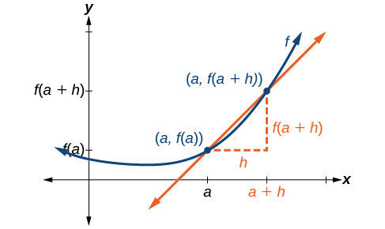
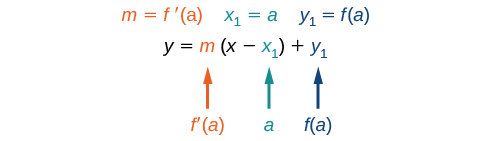
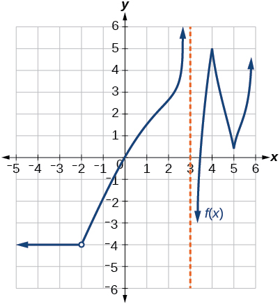
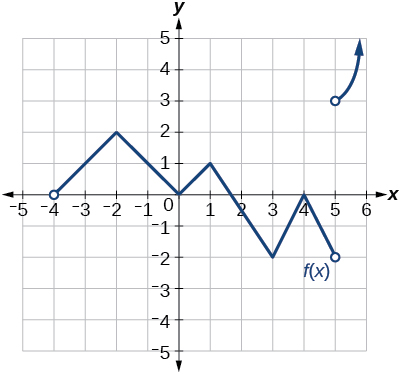
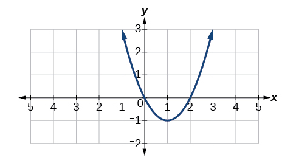

In this section, you will:
* Find the derivative of a function.
* Find instantaneous rates of change.
* Find an equation of the tangent line to the graph of a function at a point.
* Find the instantaneous velocity of a particle.

The average teen in the United States opens a refrigerator door an estimated 25 times per day. Supposedly, this average is up from 10 years ago when the average teenager opened a refrigerator door 20 times per day [1](#footnote1){: data-type="footnote-number" name="footnote-ref1"}.

It is estimated that a television is on in a home 6.75 hours per day, whereas parents spend an estimated 5.5 minutes per day having a meaningful conversation with their children. These averages, too, are not the same as they were 10 years ago, when the television was on an estimated 6 hours per day in the typical household, and parents spent 12 minutes per day in meaningful conversation with their kids.

What do these scenarios have in common? The functions representing them have changed over time. In this section, we will consider methods of computing such changes over time.

# Finding the Average Rate of Change of a Function

The functions describing the examples above involve a change over time. Change divided by time is one example of a rate. The rates of change in the previous examples are each different. In other words, some changed faster than others. If we were to graph the functions, we could compare the rates by determining the slopes of the graphs.

A **tangent line**{: data-type="term"} to a curve is a line that intersects the curve at only a single point but does not cross it there. (The tangent line may intersect the curve at another point away from the point of interest.) If we zoom in on a curve at that point, the curve appears linear, and the **slope of the curve**{: data-type="term" .no-emphasis} at that point is close to the slope of the tangent line at that point.

[\[link\]](#CNX_Precalc_Figure_12_04_001) represents the function<math xmlns="http://www.w3.org/1998/Math/MathML"><mtext> </mtext> <mrow> <mi>f</mi><mrow><mo>(</mo> <mi>x</mi> <mo>)</mo></mrow><mo>=</mo><msup> <mi>x</mi> <mn>3</mn> </msup> <mo>−</mo><mn>4</mn><mi>x</mi><mo>.</mo> </mrow> <mtext> </mtext></math>

We can see the slope at various points along the curve. 

slope at
<math xmlns="http://www.w3.org/1998/Math/MathML"><mtext> </mtext> <mrow> <mi>x</mi><mo>=</mo><mn>−2</mn> </mrow> <mtext> </mtext></math>
is 8

slope at
<math xmlns="http://www.w3.org/1998/Math/MathML"><mtext> </mtext> <mrow> <mi>x</mi><mo>=</mo><mn>−1</mn> </mrow> <mtext> </mtext></math>
is –1

slope at
<math xmlns="http://www.w3.org/1998/Math/MathML"><mtext> </mtext> <mrow> <mi>x</mi><mo>=</mo><mn>2</mn> </mrow> <mtext> </mtext></math>
is 8

 {: #CNX_Precalc_Figure_12_04_001}

Let’s imagine a point on the curve of function<math xmlns="http://www.w3.org/1998/Math/MathML"><mtext> </mtext> <mi>f</mi> <mtext> </mtext></math>

at<math xmlns="http://www.w3.org/1998/Math/MathML"><mtext> </mtext> <mrow> <mi>x</mi><mo>=</mo><mi>a</mi> </mrow> <mtext> </mtext></math>

as shown in [\[link\]](#CNX_Precalc_Figure_12_04_002). The coordinates of the point are<math xmlns="http://www.w3.org/1998/Math/MathML"><mtext> </mtext> <mrow> <mrow><mo>(</mo> <mrow> <mi>a</mi><mo>,</mo><mi>f</mi><mo stretchy="false">(</mo><mi>a</mi><mo stretchy="false">)</mo> </mrow> <mo>)</mo></mrow><mo>.</mo> </mrow> <mtext> </mtext></math>

Connect this point with a second point on the curve a little to the right of<math xmlns="http://www.w3.org/1998/Math/MathML"><mtext> </mtext> <mrow> <mi>x</mi><mo>=</mo><mi>a</mi><mo>,</mo> </mrow> </math>

 with an *x*-value increased by some small real number<math xmlns="http://www.w3.org/1998/Math/MathML"><mtext> </mtext> <mrow> <mi>h</mi><mo>.</mo> </mrow> <mtext> </mtext></math>

The coordinates of this second point are<math xmlns="http://www.w3.org/1998/Math/MathML"><mtext> </mtext> <mrow> <mrow><mo>(</mo> <mrow> <mi>a</mi><mo>+</mo><mi>h</mi><mo>,</mo><mi>f</mi><mo stretchy="false">(</mo><mi>a</mi><mo>+</mo><mi>h</mi><mo stretchy="false">)</mo> </mrow> <mo>)</mo></mrow> </mrow> <mtext> </mtext></math>

for some positive-value<math xmlns="http://www.w3.org/1998/Math/MathML"><mtext> </mtext> <mrow> <mi>h</mi><mo>.</mo> </mrow> </math>

{: #CNX_Precalc_Figure_12_04_002}

We can calculate the slope of the line connecting the two points<math xmlns="http://www.w3.org/1998/Math/MathML"><mtext> </mtext> <mrow> <mo stretchy="false">(</mo><mi>a</mi><mo>,</mo><mi>f</mi><mo stretchy="false">(</mo><mi>a</mi><mo stretchy="false">)</mo><mo stretchy="false">)</mo> </mrow> <mtext> </mtext></math>

and<math xmlns="http://www.w3.org/1998/Math/MathML"><mtext> </mtext> <mrow> <mo stretchy="false">(</mo><mi>a</mi><mo>+</mo><mi>h</mi><mo>,</mo><mi>f</mi><mo stretchy="false">(</mo><mi>a</mi><mo>+</mo><mi>h</mi><mo stretchy="false">)</mo><mo stretchy="false">)</mo><mo>,</mo> </mrow> </math>

 called a **secant line**{: data-type="term"}, by applying the slope formula,

<math xmlns="http://www.w3.org/1998/Math/MathML" display="block"> <mrow> <mtext>slope = </mtext><mfrac> <mrow> <mtext>change in </mtext><mi>y</mi> </mrow> <mrow> <mtext>change in </mtext><mi>x</mi> </mrow> </mfrac> </mrow> </math>

<math xmlns="http://www.w3.org/1998/Math/MathML"> <mrow> <mtext>slope = </mtext><mfrac> <mrow> <mtext>change in </mtext><mi>y</mi> </mrow> <mrow> <mtext>change in </mtext><mi>x</mi> </mrow> </mfrac> </mrow> </math>

We use the notation<math xmlns="http://www.w3.org/1998/Math/MathML"><mtext> </mtext> <mrow> <msub> <mi>m</mi> <mrow> <mi>sec</mi> </mrow> </msub> </mrow> <mtext> </mtext></math>

to represent the slope of the secant line connecting two points.

<math xmlns="http://www.w3.org/1998/Math/MathML" display="block"> <mrow> <mtable columnalign="left"> <mtr columnalign="left"> <mtd columnalign="left"> <mrow> <msub> <mi>m</mi> <mrow> <mi>sec</mi> </mrow> </msub> <mo>=</mo><mfrac> <mrow> <mi>f</mi><mo stretchy="false">(</mo><mi>a</mi><mo>+</mo><mi>h</mi><mo stretchy="false">)</mo><mo>−</mo><mi>f</mi><mo stretchy="false">(</mo><mi>a</mi><mo stretchy="false">)</mo> </mrow> <mrow> <mo stretchy="false">(</mo><mi>a</mi><mo>+</mo><mi>h</mi><mo stretchy="false">)</mo><mo>−</mo><mo stretchy="false">(</mo><mi>a</mi><mo stretchy="false">)</mo> </mrow> </mfrac> </mrow> </mtd> </mtr> <mtr columnalign="left"> <mtd columnalign="left"> <mrow> <mtext>       </mtext><mo>=</mo><mfrac> <mrow> <mi>f</mi><mo stretchy="false">(</mo><mi>a</mi><mo>+</mo><mi>h</mi><mo stretchy="false">)</mo><mo>−</mo><mi>f</mi><mo stretchy="false">(</mo><mi>a</mi><mo stretchy="false">)</mo> </mrow> <mrow> <menclose notation="updiagonalstrike"> <mi>a</mi> </menclose> <mo>+</mo><mi>h</mi><mo>−</mo><menclose notation="updiagonalstrike"> <mi>a</mi> </menclose> </mrow> </mfrac> </mrow> </mtd> </mtr> </mtable> </mrow> </math>

The slope<math xmlns="http://www.w3.org/1998/Math/MathML"><mtext> </mtext> <mrow> <msub> <mi>m</mi> <mrow> <mi>sec</mi> </mrow> </msub> </mrow> <mtext> </mtext></math>

equals the *average rate of change* between two points<math xmlns="http://www.w3.org/1998/Math/MathML"><mtext> </mtext> <mrow> <mo stretchy="false">(</mo><mi>a</mi><mo>,</mo><mi>f</mi><mo stretchy="false">(</mo><mi>a</mi><mo stretchy="false">)</mo><mo stretchy="false">)</mo> </mrow> <mtext> </mtext></math>

and<math xmlns="http://www.w3.org/1998/Math/MathML"><mtext> </mtext> <mrow> <mo stretchy="false">(</mo><mi>a</mi><mo>+</mo><mi>h</mi><mo>,</mo><mi>f</mi><mo stretchy="false">(</mo><mi>a</mi><mo>+</mo><mi>h</mi><mo stretchy="false">)</mo><mo stretchy="false">)</mo><mo>.</mo> </mrow> </math>

<math xmlns="http://www.w3.org/1998/Math/MathML"> <mrow> <msub> <mi>m</mi> <mrow> <mi>sec</mi> </mrow> </msub> <mo>=</mo><mfrac> <mrow> <mi>f</mi><mrow><mo>(</mo> <mrow> <mi>a</mi><mo>+</mo><mi>h</mi> </mrow> <mo>)</mo></mrow><mo>−</mo><mi>f</mi><mrow><mo>(</mo> <mi>a</mi> <mo>)</mo></mrow> </mrow> <mi>h</mi> </mfrac> </mrow> </math>

The Average Rate of Change between Two Points on a Curve

The **average rate of change**{: data-type="term"} (AROC) between two points<math xmlns="http://www.w3.org/1998/Math/MathML"><mtext> </mtext> <mrow> <mo stretchy="false">(</mo><mi>a</mi><mo>,</mo><mi>f</mi><mo stretchy="false">(</mo><mi>a</mi><mo stretchy="false">)</mo><mo stretchy="false">)</mo> </mrow> <mtext> </mtext></math>

and<math xmlns="http://www.w3.org/1998/Math/MathML"><mtext> </mtext> <mrow> <mo stretchy="false">(</mo><mi>a</mi><mo>+</mo><mi>h</mi><mo>,</mo><mi>f</mi><mo stretchy="false">(</mo><mi>a</mi><mo>+</mo><mi>h</mi><mo stretchy="false">)</mo><mo stretchy="false">)</mo> </mrow> <mtext> </mtext></math>

on the curve of<math xmlns="http://www.w3.org/1998/Math/MathML"><mtext> </mtext> <mi>f</mi> <mtext> </mtext></math>

is the slope of the line connecting the two points and is given by

<math xmlns="http://www.w3.org/1998/Math/MathML"> <mrow> <mtext>AROC</mtext><mo>=</mo><mfrac> <mrow> <mi>f</mi><mrow><mo>(</mo> <mrow> <mi>a</mi><mo>+</mo><mi>h</mi> </mrow> <mo>)</mo></mrow><mo>−</mo><mi>f</mi><mrow><mo>(</mo> <mi>a</mi> <mo>)</mo></mrow> </mrow> <mi>h</mi> </mfrac> </mrow> </math>

Finding the Average Rate of Change

Find the average rate of change connecting the points<math xmlns="http://www.w3.org/1998/Math/MathML"><mtext> </mtext> <mrow> <mrow><mo>(</mo> <mrow> <mn>2</mn><mo>,</mo><mn>−6</mn> </mrow> <mo>)</mo></mrow> </mrow> <mtext> </mtext></math>

and<math xmlns="http://www.w3.org/1998/Math/MathML"><mtext> </mtext> <mrow> <mrow><mo>(</mo> <mrow> <mn>−1</mn><mo>,</mo><mn>5</mn> </mrow> <mo>)</mo></mrow><mo>.</mo> </mrow> </math>

We know the average rate of change connecting two points may be given by

<math xmlns="http://www.w3.org/1998/Math/MathML"> <mrow> <mtext>AROC</mtext><mo>=</mo><mfrac> <mrow> <mi>f</mi><mrow><mo>(</mo> <mrow> <mi>a</mi><mo>+</mo><mi>h</mi> </mrow> <mo>)</mo></mrow><mo>−</mo><mi>f</mi><mrow><mo>(</mo> <mi>a</mi> <mo>)</mo></mrow> </mrow> <mi>h</mi> </mfrac> <mo>.</mo> </mrow> </math>

If one point is<math xmlns="http://www.w3.org/1998/Math/MathML"><mtext> </mtext> <mrow> <mrow><mo>(</mo> <mrow> <mn>2</mn><mo>,</mo><mo>−</mo><mn>6</mn> </mrow> <mo>)</mo></mrow><mo>,</mo> </mrow> </math>

 or<math xmlns="http://www.w3.org/1998/Math/MathML"><mtext> </mtext> <mrow> <mrow><mo>(</mo> <mrow> <mn>2</mn><mo>,</mo><mi>f</mi><mrow><mo>(</mo> <mn>2</mn> <mo>)</mo></mrow> </mrow> <mo>)</mo></mrow><mo>,</mo> </mrow> </math>

 then<math xmlns="http://www.w3.org/1998/Math/MathML"><mtext> </mtext> <mrow> <mi>f</mi><mrow><mo>(</mo> <mn>2</mn> <mo>)</mo></mrow><mo>=</mo><mn>−6.</mn> </mrow> </math>

The value<math xmlns="http://www.w3.org/1998/Math/MathML"><mtext> </mtext> <mi>h</mi> <mtext> </mtext></math>

is the displacement from<math xmlns="http://www.w3.org/1998/Math/MathML"><mtext> </mtext> <mn>2</mn> <mtext> </mtext></math>

to<math xmlns="http://www.w3.org/1998/Math/MathML"><mtext> </mtext> <mrow> <mo>−</mo><mn>1</mn><mo>,</mo> </mrow> </math>

 which equals<math xmlns="http://www.w3.org/1998/Math/MathML"><mtext> </mtext> <mrow> <mo>−</mo><mn>1</mn><mo>−</mo><mn>2</mn><mo>=</mo><mn>−3.</mn> </mrow> </math>

For the other point,<math xmlns="http://www.w3.org/1998/Math/MathML"><mtext> </mtext> <mrow> <mi>f</mi><mrow><mo>(</mo> <mrow> <mi>a</mi><mo>+</mo><mi>h</mi> </mrow> <mo>)</mo></mrow> </mrow> <mtext> </mtext></math>

is the *y*-coordinate at<math xmlns="http://www.w3.org/1998/Math/MathML"><mtext> </mtext> <mrow> <mi>a</mi><mo>+</mo><mi>h</mi> </mrow> <mo>,</mo></math>

 which is<math xmlns="http://www.w3.org/1998/Math/MathML"><mtext> </mtext> <mrow> <mn>2</mn><mo>+</mo><mo stretchy="false">(</mo><mn>−3</mn><mo stretchy="false">)</mo> </mrow> <mtext> </mtext></math>

or<math xmlns="http://www.w3.org/1998/Math/MathML"><mtext> </mtext> <mrow> <mn>−1</mn><mo>,</mo> </mrow> </math>

 so<math xmlns="http://www.w3.org/1998/Math/MathML"><mtext> </mtext> <mrow> <mi>f</mi><mo stretchy="false">(</mo><mi>a</mi><mo>+</mo><mi>h</mi><mo stretchy="false">)</mo><mo>=</mo><mi>f</mi><mo stretchy="false">(</mo><mn>−1</mn><mo stretchy="false">)</mo><mo>=</mo><mn>5.</mn> </mrow> </math>

<math xmlns="http://www.w3.org/1998/Math/MathML" display="block"> <mrow> <mtable columnalign="left"> <mtr columnalign="left"> <mtd columnalign="left"> <mrow> <mtext>AROC</mtext><mo>=</mo><mfrac> <mrow> <mi>f</mi><mo stretchy="false">(</mo><mi>a</mi><mo>+</mo><mi>h</mi><mo stretchy="false">)</mo><mo>−</mo><mi>f</mi><mo stretchy="false">(</mo><mi>a</mi><mo stretchy="false">)</mo> </mrow> <mi>h</mi> </mfrac> </mrow> </mtd> </mtr> <mtr columnalign="left"> <mtd columnalign="left"> <mrow> <mtext>           </mtext><mo>=</mo><mfrac> <mrow> <mn>5</mn><mo>−</mo><mo stretchy="false">(</mo><mo>−</mo><mn>6</mn><mo stretchy="false">)</mo> </mrow> <mrow> <mo>−</mo><mn>3</mn> </mrow> </mfrac> </mrow> </mtd> </mtr> <mtr columnalign="left"> <mtd columnalign="left"> <mrow> <mtext>           </mtext><mo>=</mo><mfrac> <mrow> <mn>11</mn> </mrow> <mrow> <mo>−</mo><mn>3</mn> </mrow> </mfrac> </mrow> </mtd> </mtr> <mtr columnalign="left"> <mtd columnalign="left"> <mrow> <mtext>           </mtext><mo>=</mo><mo>−</mo><mfrac> <mrow> <mn>11</mn> </mrow> <mn>3</mn> </mfrac> </mrow> </mtd> </mtr> </mtable> </mrow> </math>

Find the average rate of change connecting the points<math xmlns="http://www.w3.org/1998/Math/MathML"><mtext> </mtext> <mrow> <mrow><mo>(</mo> <mrow> <mo>−</mo><mn>5</mn><mo>,</mo><mn>1.5</mn> </mrow> <mo>)</mo></mrow> </mrow> <mtext> </mtext></math>

and<math xmlns="http://www.w3.org/1998/Math/MathML"><mtext> </mtext> <mrow> <mo stretchy="false">(</mo><mo>−</mo><mn>2.5</mn><mo>,</mo><mn>9</mn><mo stretchy="false">)</mo><mo>.</mo> </mrow> </math>

3

# Understanding the Instantaneous Rate of Change

Now that we can find the average rate of change, suppose we make<math xmlns="http://www.w3.org/1998/Math/MathML"><mtext> </mtext> <mi>h</mi> <mtext> </mtext></math>

in [\[link\]](#CNX_Precalc_Figure_12_04_002) smaller and smaller. Then<math xmlns="http://www.w3.org/1998/Math/MathML"><mtext> </mtext> <mrow> <mi>a</mi><mo>+</mo><mi>h</mi> </mrow> <mtext> </mtext></math>

will approach<math xmlns="http://www.w3.org/1998/Math/MathML"><mtext> </mtext> <mi>a</mi> <mtext> </mtext></math>

as<math xmlns="http://www.w3.org/1998/Math/MathML"><mtext> </mtext> <mi>h</mi> <mtext> </mtext></math>

gets smaller, getting closer and closer to 0. Likewise, the second point<math xmlns="http://www.w3.org/1998/Math/MathML"><mtext> </mtext> <mrow> <mrow><mo>(</mo> <mrow> <mi>a</mi><mo>+</mo><mi>h</mi><mo>,</mo><mi>f</mi><mo stretchy="false">(</mo><mi>a</mi><mo>+</mo><mi>h</mi><mo stretchy="false">)</mo> </mrow> <mo>)</mo></mrow> </mrow> <mtext> </mtext></math>

will approach the first point,<math xmlns="http://www.w3.org/1998/Math/MathML"><mtext> </mtext> <mrow> <mrow><mo>(</mo> <mrow> <mi>a</mi><mo>,</mo><mi>f</mi><mo stretchy="false">(</mo><mi>a</mi><mo stretchy="false">)</mo> </mrow> <mo>)</mo></mrow><mo>.</mo> </mrow> <mtext> </mtext></math>

As a consequence, the connecting line between the two points, called the secant line, will get closer and closer to being a tangent to the function at<math xmlns="http://www.w3.org/1998/Math/MathML"><mtext> </mtext> <mrow> <mi>x</mi><mo>=</mo><mi>a</mi><mo>,</mo> </mrow> </math>

 and the slope of the secant line will get closer and closer to the slope of the tangent at<math xmlns="http://www.w3.org/1998/Math/MathML"><mtext> </mtext> <mrow> <mi>x</mi><mo>=</mo><mi>a</mi><mo>.</mo> </mrow> <mtext> </mtext></math>

See [\[link\]](#CNX_Precalc_Figure_12_04_003).

{: #CNX_Precalc_Figure_12_04_003}

Because we are looking for the **slope of the tangent**{: data-type="term" .no-emphasis} at<math xmlns="http://www.w3.org/1998/Math/MathML"><mtext> </mtext> <mrow> <mi>x</mi><mo>=</mo><mi>a</mi><mo>,</mo> </mrow> </math>

 we can think of the measure of the slope of the curve of a function<math xmlns="http://www.w3.org/1998/Math/MathML"><mtext> </mtext> <mi>f</mi> <mtext> </mtext></math>

at a given point as the rate of change at a particular instant. We call this slope the **instantaneous rate of change**, or the **derivative** of the function at<math xmlns="http://www.w3.org/1998/Math/MathML"><mtext> </mtext> <mrow> <mi>x</mi><mo>=</mo><mi>a</mi><mo>.</mo> </mrow> <mtext> </mtext></math>

Both can be found by finding the limit of the slope of a line connecting the point at<math xmlns="http://www.w3.org/1998/Math/MathML"><mtext> </mtext> <mrow> <mi>x</mi><mo>=</mo><mi>a</mi> </mrow> <mtext> </mtext></math>

with a second point infinitesimally close along the curve. For a function<math xmlns="http://www.w3.org/1998/Math/MathML"><mtext> </mtext> <mi>f</mi> <mtext> </mtext></math>

both the instantaneous rate of change of the function and the derivative of the function at<math xmlns="http://www.w3.org/1998/Math/MathML"><mtext> </mtext> <mrow> <mi>x</mi><mo>=</mo><mi>a</mi> </mrow> <mtext> </mtext></math>

are written as<math xmlns="http://www.w3.org/1998/Math/MathML"><mtext> </mtext> <mrow> <mi>f</mi><mo>'</mo><mo stretchy="false">(</mo><mi>a</mi><mo stretchy="false">)</mo><mo>,</mo> </mrow> </math>

 and we can define them as a **two-sided limit**{: data-type="term" .no-emphasis} that has the same value whether approached from the left or the right.

<math xmlns="http://www.w3.org/1998/Math/MathML" display="block"> <mrow> <msup> <mi>f</mi> <mo>′</mo> </msup> <mo stretchy="false">(</mo><mi>a</mi><mo stretchy="false">)</mo><mo>=</mo><munder> <mrow> <mi>lim</mi> </mrow> <mrow> <mi>h</mi><mo stretchy="false">→</mo><mn>0</mn> </mrow> </munder> <mfrac> <mrow> <mi>f</mi><mrow><mo>(</mo> <mrow> <mi>a</mi><mo>+</mo><mi>h</mi> </mrow> <mo>)</mo></mrow><mo>−</mo><mi>f</mi><mrow><mo>(</mo> <mi>a</mi> <mo>)</mo></mrow> </mrow> <mi>h</mi> </mfrac> </mrow> </math>

The expression by which the limit is found is known as the **difference quotient**{: data-type="term" .no-emphasis}.

Definition of Instantaneous Rate of Change and Derivative

The **derivative**{: data-type="term"}, or **instantaneous rate of change**{: data-type="term"}, of a function<math xmlns="http://www.w3.org/1998/Math/MathML"><mtext> </mtext> <mi>f</mi> <mtext> </mtext></math>

at<math xmlns="http://www.w3.org/1998/Math/MathML"><mtext> </mtext> <mrow> <mi>x</mi><mo>=</mo><mi>a</mi> </mrow> <mo>,</mo></math>

 is given by

<math xmlns="http://www.w3.org/1998/Math/MathML" display="block"> <mrow> <mi>f</mi><mo>'</mo><mo stretchy="false">(</mo><mi>a</mi><mo stretchy="false">)</mo><mo>=</mo><munder> <mrow> <mi>lim</mi> </mrow> <mrow> <mi>h</mi><mo stretchy="false">→</mo><mn>0</mn> </mrow> </munder> <mfrac> <mrow> <mi>f</mi><mrow><mo>(</mo> <mrow> <mi>a</mi><mo>+</mo><mi>h</mi> </mrow> <mo>)</mo></mrow><mo>−</mo><mi>f</mi><mrow><mo>(</mo> <mi>a</mi> <mo>)</mo></mrow> </mrow> <mi>h</mi> </mfrac> </mrow> </math>

The expression<math xmlns="http://www.w3.org/1998/Math/MathML"><mtext> </mtext> <mrow> <mfrac> <mrow> <mi>f</mi><mrow><mo>(</mo> <mrow> <mi>a</mi><mo>+</mo><mi>h</mi> </mrow> <mo>)</mo></mrow><mo>−</mo><mi>f</mi><mrow><mo>(</mo> <mi>a</mi> <mo>)</mo></mrow> </mrow> <mi>h</mi> </mfrac> </mrow> <mtext> </mtext></math>

is called the difference quotient.

We use the difference quotient to evaluate the limit of the rate of change of the function as<math xmlns="http://www.w3.org/1998/Math/MathML"><mtext> </mtext> <mi>h</mi> <mtext> </mtext></math>

approaches 0.

## Derivatives: Interpretations and Notation

The **derivative**{: data-type="term" .no-emphasis} of a function can be interpreted in different ways. It can be observed as the behavior of a graph of the function or calculated as a numerical rate of change of the function.

* The derivative of a function
  <math xmlns="http://www.w3.org/1998/Math/MathML"><mtext> </mtext> <mrow> <mi>f</mi><mo stretchy="false">(</mo><mi>x</mi><mo stretchy="false">)</mo> </mrow> <mtext> </mtext></math>
  
  at a point
  <math xmlns="http://www.w3.org/1998/Math/MathML"><mtext> </mtext> <mrow> <mi>x</mi><mo>=</mo><mi>a</mi> </mrow> <mtext> </mtext></math>
  
  is the slope of the tangent line to the curve
  <math xmlns="http://www.w3.org/1998/Math/MathML"><mtext> </mtext> <mrow> <mi>f</mi><mo stretchy="false">(</mo><mi>x</mi><mo stretchy="false">)</mo> </mrow> <mtext> </mtext></math>
  
  at
  <math xmlns="http://www.w3.org/1998/Math/MathML"><mtext> </mtext> <mrow> <mi>x</mi><mo>=</mo><mi>a</mi><mo>.</mo> </mrow> <mtext> </mtext></math>
  
  The derivative of
  <math xmlns="http://www.w3.org/1998/Math/MathML"><mtext> </mtext> <mrow> <mi>f</mi><mo stretchy="false">(</mo><mi>x</mi><mo stretchy="false">)</mo> </mrow> <mtext> </mtext></math>
  
  at
  <math xmlns="http://www.w3.org/1998/Math/MathML"><mtext> </mtext> <mrow> <mi>x</mi><mo>=</mo><mi>a</mi> </mrow> <mtext> </mtext></math>
  
  is written
  <math xmlns="http://www.w3.org/1998/Math/MathML"><mtext> </mtext> <mrow> <msup> <mi>f</mi> <mo>′</mo> </msup> <mo stretchy="false">(</mo><mi>a</mi><mo stretchy="false">)</mo><mo>.</mo> </mrow> </math>

* The derivative
  <math xmlns="http://www.w3.org/1998/Math/MathML"><mtext> </mtext> <mrow> <msup> <mi>f</mi> <mo>′</mo> </msup> <mo stretchy="false">(</mo><mi>a</mi><mo stretchy="false">)</mo> </mrow> <mtext> </mtext></math>
  
  measures how the curve changes at the point
  <math xmlns="http://www.w3.org/1998/Math/MathML"><mtext> </mtext> <mrow> <mrow><mo>(</mo> <mrow> <mi>a</mi><mo>,</mo><mi>f</mi><mo stretchy="false">(</mo><mi>a</mi><mo stretchy="false">)</mo> </mrow> <mo>)</mo></mrow><mo>.</mo> </mrow> </math>

* The derivative
  <math xmlns="http://www.w3.org/1998/Math/MathML"><mtext> </mtext> <mrow> <msup> <mi>f</mi> <mo>′</mo> </msup> <mo stretchy="false">(</mo><mi>a</mi><mo stretchy="false">)</mo> </mrow> <mtext> </mtext></math>
  
  may be thought of as the instantaneous rate of change of the function
  <math xmlns="http://www.w3.org/1998/Math/MathML"><mtext> </mtext> <mrow> <mi>f</mi><mo stretchy="false">(</mo><mi>x</mi><mo stretchy="false">)</mo> </mrow> <mtext> </mtext></math>
  
  at
  <math xmlns="http://www.w3.org/1998/Math/MathML"><mtext> </mtext> <mrow> <mi>x</mi><mo>=</mo><mi>a</mi><mo>.</mo> </mrow> </math>

* If a function measures distance as a function of time, then the derivative measures the instantaneous **velocity**{: data-type="term" .no-emphasis} at time
  <math xmlns="http://www.w3.org/1998/Math/MathML"><mtext> </mtext> <mrow> <mi>t</mi><mo>=</mo><mi>a</mi><mo>.</mo> </mrow> </math>

Notations for the Derivative

The equation of the derivative of a function<math xmlns="http://www.w3.org/1998/Math/MathML"><mtext> </mtext> <mrow> <mi>f</mi><mrow><mo>(</mo> <mi>x</mi> <mo>)</mo></mrow> </mrow> <mtext> </mtext></math>

is written as<math xmlns="http://www.w3.org/1998/Math/MathML"><mtext> </mtext> <mrow> <msup> <mi>y</mi> <mo>′</mo> </msup> <mo>=</mo><msup> <mi>f</mi> <mo>′</mo> </msup> <mo stretchy="false">(</mo><mi>x</mi><mo stretchy="false">)</mo><mo>,</mo> </mrow> </math>

 where<math xmlns="http://www.w3.org/1998/Math/MathML"><mtext> </mtext> <mrow> <mi>y</mi><mo>=</mo><mi>f</mi><mo stretchy="false">(</mo><mi>x</mi><mo stretchy="false">)</mo><mo>.</mo> </mrow> <mtext> </mtext></math>

The notation<math xmlns="http://www.w3.org/1998/Math/MathML"><mtext> </mtext> <mrow> <msup> <mi>f</mi> <mo>′</mo> </msup> <mo stretchy="false">(</mo><mi>x</mi><mo stretchy="false">)</mo> </mrow> <mtext> </mtext></math>

is read as “<math xmlns="http://www.w3.org/1998/Math/MathML"> <mrow> <mi>f</mi><mtext> prime of </mtext><mi>x</mi><mo>.</mo> </mrow> </math>

” Alternate notations for the derivative include the following:

<math xmlns="http://www.w3.org/1998/Math/MathML"> <mrow> <msup> <mi>f</mi> <mo>′</mo> </msup> <mo stretchy="false">(</mo><mi>x</mi><mo stretchy="false">)</mo><mo>=</mo><msup> <mi>y</mi> <mo>′</mo> </msup> <mo>=</mo><mfrac> <mrow> <mi>d</mi><mi>y</mi> </mrow> <mrow> <mi>d</mi><mi>x</mi> </mrow> </mfrac> <mo>=</mo><mfrac> <mrow> <mi>d</mi><mi>f</mi> </mrow> <mrow> <mi>d</mi><mi>x</mi> </mrow> </mfrac> <mo>=</mo><mfrac> <mi>d</mi> <mrow> <mi>d</mi><mi>x</mi> </mrow> </mfrac> <mi>f</mi><mo stretchy="false">(</mo><mi>x</mi><mo stretchy="false">)</mo><mo>=</mo><mi>D</mi><mi>f</mi><mo stretchy="false">(</mo><mi>x</mi><mo stretchy="false">)</mo> </mrow> </math>

The expression<math xmlns="http://www.w3.org/1998/Math/MathML"><mtext> </mtext> <mrow> <msup> <mi>f</mi> <mo>′</mo> </msup> <mo stretchy="false">(</mo><mi>x</mi><mo stretchy="false">)</mo> </mrow> <mtext> </mtext></math>

is now a function of<math xmlns="http://www.w3.org/1998/Math/MathML"><mtext> </mtext> <mi>x</mi> </math>

; this function gives the slope of the curve<math xmlns="http://www.w3.org/1998/Math/MathML"><mtext> </mtext> <mrow> <mi>y</mi><mo>=</mo><mi>f</mi><mrow><mo>(</mo> <mi>x</mi> <mo>)</mo></mrow> </mrow> <mtext> </mtext></math>

at any value of<math xmlns="http://www.w3.org/1998/Math/MathML"><mtext> </mtext> <mrow> <mi>x</mi><mo>.</mo> </mrow> <mtext> </mtext></math>

The derivative of a function<math xmlns="http://www.w3.org/1998/Math/MathML"><mtext> </mtext> <mrow> <mi>f</mi><mrow><mo>(</mo> <mi>x</mi> <mo>)</mo></mrow> </mrow> <mtext> </mtext></math>

at a point<math xmlns="http://www.w3.org/1998/Math/MathML"><mtext> </mtext> <mrow> <mi>x</mi><mo>=</mo><mi>a</mi> </mrow> <mtext> </mtext></math>

is denoted<math xmlns="http://www.w3.org/1998/Math/MathML"><mtext> </mtext> <mrow> <msup> <mi>f</mi> <mo>′</mo> </msup> <mo stretchy="false">(</mo><mi>a</mi><mo stretchy="false">)</mo><mo>.</mo> </mrow> </math>

**Given a function<math xmlns="http://www.w3.org/1998/Math/MathML"><mtext> </mtext> <mrow> <mi>f</mi><mo>,</mo> </mrow> </math>

 find the derivative by applying the definition of the derivative.**

1.  Calculate
    <math xmlns="http://www.w3.org/1998/Math/MathML"><mtext> </mtext> <mrow> <mi>f</mi><mrow><mo>(</mo> <mrow> <mi>a</mi><mo>+</mo><mi>h</mi> </mrow> <mo>)</mo></mrow><mo>.</mo> </mrow> </math>

2.  Calculate
    <math xmlns="http://www.w3.org/1998/Math/MathML"><mtext> </mtext> <mrow> <mi>f</mi><mrow><mo>(</mo> <mi>a</mi> <mo>)</mo></mrow><mo>.</mo> </mrow> </math>

3.  Substitute and simplify
    <math xmlns="http://www.w3.org/1998/Math/MathML"><mtext> </mtext> <mrow> <mfrac> <mrow> <mi>f</mi><mrow><mo>(</mo> <mrow> <mi>a</mi><mo>+</mo><mi>h</mi> </mrow> <mo>)</mo></mrow><mo>−</mo><mi>f</mi><mrow><mo>(</mo> <mi>a</mi> <mo>)</mo></mrow> </mrow> <mi>h</mi> </mfrac> <mo>.</mo> </mrow> </math>

4.  Evaluate the limit if it exists:
    <math xmlns="http://www.w3.org/1998/Math/MathML"><mtext> </mtext> <mrow> <msup> <mi>f</mi> <mo>′</mo> </msup> <mo stretchy="false">(</mo><mi>a</mi><mo stretchy="false">)</mo><mo>=</mo><munder> <mrow> <mi>lim</mi> </mrow> <mrow> <mi>h</mi><mo stretchy="false">→</mo><mn>0</mn> </mrow> </munder> <mfrac> <mrow> <mi>f</mi><mrow><mo>(</mo> <mrow> <mi>a</mi><mo>+</mo><mi>h</mi> </mrow> <mo>)</mo></mrow><mo>−</mo><mi>f</mi><mrow><mo>(</mo> <mi>a</mi> <mo>)</mo></mrow> </mrow> <mi>h</mi> </mfrac> <mo>.</mo> </mrow> </math>
{: data-number-style="arabic"}

Finding the Derivative of a Polynomial Function

Find the derivative of the function<math xmlns="http://www.w3.org/1998/Math/MathML"><mtext> </mtext> <mrow> <mi>f</mi><mo stretchy="false">(</mo><mi>x</mi><mo stretchy="false">)</mo><mo>=</mo><msup> <mi>x</mi> <mn>2</mn> </msup> <mo>−</mo><mn>3</mn><mi>x</mi><mo>+</mo><mn>5</mn> </mrow> <mtext> </mtext></math>

at<math xmlns="http://www.w3.org/1998/Math/MathML"><mtext> </mtext> <mrow> <mi>x</mi><mo>=</mo><mi>a</mi><mo>.</mo> </mrow> </math>

We have:

<math xmlns="http://www.w3.org/1998/Math/MathML"> <mrow> <mtable columnalign="left"> <mtr columnalign="left"> <mtd columnalign="left"> <mrow> <msup> <mi>f</mi> <mo>′</mo> </msup> <mo stretchy="false">(</mo><mi>a</mi><mo stretchy="false">)</mo><mo>=</mo><munder> <mrow> <mi>lim</mi> </mrow> <mrow> <mi>h</mi><mo stretchy="false">→</mo><mn>0</mn> </mrow> </munder> <mfrac> <mrow> <mi>f</mi><mrow><mo>(</mo> <mrow> <mi>a</mi><mo>+</mo><mi>h</mi> </mrow> <mo>)</mo></mrow><mo>−</mo><mi>f</mi><mrow><mo>(</mo> <mi>a</mi> <mo>)</mo></mrow> </mrow> <mi>h</mi> </mfrac> </mrow> </mtd> <mtd columnalign="left"> <mrow> <mtext>                  Definition of a derivative </mtext> </mrow> </mtd> </mtr> </mtable> </mrow> </math>

Substitute<math xmlns="http://www.w3.org/1998/Math/MathML"><mtext> </mtext> <mrow> <mi>f</mi><mo stretchy="false">(</mo><mi>a</mi><mo>+</mo><mi>h</mi><mo stretchy="false">)</mo><mo>=</mo><msup> <mrow> <mo stretchy="false">(</mo><mi>a</mi><mo>+</mo><mi>h</mi><mo stretchy="false">)</mo> </mrow> <mn>2</mn> </msup> <mo>−</mo><mn>3</mn><mo stretchy="false">(</mo><mi>a</mi><mo>+</mo><mi>h</mi><mo stretchy="false">)</mo><mo>+</mo><mn>5</mn> </mrow> <mtext> </mtext></math>

and<math xmlns="http://www.w3.org/1998/Math/MathML"><mtext> </mtext> <mrow> <mi>f</mi><mo stretchy="false">(</mo><mi>a</mi><mo stretchy="false">)</mo><mo>=</mo><msup> <mi>a</mi> <mn>2</mn> </msup> <mo>−</mo><mn>3</mn><mi>a</mi><mo>+</mo><mn>5.</mn> </mrow> </math>

<math xmlns="http://www.w3.org/1998/Math/MathML"> <mrow> <mtable columnalign="left"> <mtr columnalign="left"> <mtd columnalign="left"> <mrow> <msup> <mi>f</mi> <mo>′</mo> </msup> <mo stretchy="false">(</mo><mi>a</mi><mo stretchy="false">)</mo><mo>=</mo><munder> <mrow> <mi>lim</mi> </mrow> <mrow> <mi>h</mi><mo stretchy="false">→</mo><mn>0</mn> </mrow> </munder> <mfrac> <mrow> <mo stretchy="false">(</mo><mi>a</mi><mo>+</mo><mi>h</mi><mo stretchy="false">)</mo><mo stretchy="false">(</mo><mi>a</mi><mo>+</mo><mi>h</mi><mo stretchy="false">)</mo><mo>−</mo><mn>3</mn><mo stretchy="false">(</mo><mi>a</mi><mo>+</mo><mi>h</mi><mo stretchy="false">)</mo><mo>+</mo><mn>5</mn><mo>−</mo><mo stretchy="false">(</mo><msup> <mi>a</mi> <mn>2</mn> </msup> <mo>−</mo><mn>3</mn><mi>a</mi><mo>+</mo><mn>5</mn><mo stretchy="false">)</mo> </mrow> <mi>h</mi> </mfrac> </mrow> </mtd> <mtd columnalign="left"> <mrow /> </mtd> </mtr> <mtr columnalign="left"> <mtd columnalign="left"> <mrow> <mtext>        </mtext><mo>=</mo><munder> <mrow> <mi>lim</mi> </mrow> <mrow> <mi>h</mi><mo stretchy="false">→</mo><mn>0</mn> </mrow> </munder> <mfrac> <mrow> <msup> <mi>a</mi> <mn>2</mn> </msup> <mo>+</mo><mn>2</mn><mi>a</mi><mi>h</mi><mo>+</mo><msup> <mi>h</mi> <mn>2</mn> </msup> <mo>−</mo><mn>3</mn><mi>a</mi><mo>−</mo><mn>3</mn><mi>h</mi><mo>+</mo><mn>5</mn><mo>−</mo><msup> <mi>a</mi> <mn>2</mn> </msup> <mo>+</mo><mn>3</mn><mi>a</mi><mo>−</mo><mn>5</mn> </mrow> <mi>h</mi> </mfrac> </mrow> </mtd> <mtd columnalign="left"> <mrow> <mtext>Evaluate to remove parentheses</mtext><mo>.</mo> </mrow> </mtd> </mtr> <mtr columnalign="left"> <mtd columnalign="left"> <mrow> <mtext>        </mtext><mo>=</mo><munder> <mrow> <mi>lim</mi> </mrow> <mrow> <mi>h</mi><mo stretchy="false">→</mo><mn>0</mn> </mrow> </munder> <mfrac> <mrow> <menclose notation="updiagonalstrike"> <mrow> <msup> <mi>a</mi> <mn>2</mn> </msup> </mrow> </menclose> <mo>+</mo><mn>2</mn><mi>a</mi><mi>h</mi><mo>+</mo><msup> <mi>h</mi> <mn>2</mn> </msup> <menclose notation="updiagonalstrike"> <mrow> <mo>−</mo><mn>3</mn><mi>a</mi> </mrow> </menclose> <mo>−</mo><mn>3</mn><mi>h</mi><menclose notation="updiagonalstrike"> <mrow> <mo>+</mo><mn>5</mn> </mrow> </menclose> <menclose notation="updiagonalstrike"> <mrow> <mo>−</mo><msup> <mi>a</mi> <mn>2</mn> </msup> </mrow> </menclose> <menclose notation="updiagonalstrike"> <mrow> <mo>+</mo><mn>3</mn><mi>a</mi> </mrow> </menclose> <menclose notation="updiagonalstrike"> <mrow> <mo>−</mo><mn>5</mn> </mrow> </menclose> </mrow> <mi>h</mi> </mfrac> </mrow> </mtd> <mtd columnalign="left"> <mrow> <mtext>Simplify</mtext><mo>.</mo> </mrow> </mtd> </mtr> <mtr columnalign="left"> <mtd columnalign="left"> <mrow> <mtext>        </mtext><mo>=</mo><munder> <mrow> <mi>lim</mi> </mrow> <mrow> <mi>h</mi><mo stretchy="false">→</mo><mn>0</mn> </mrow> </munder> <mfrac> <mrow> <mn>2</mn><mi>a</mi><mi>h</mi><mo>+</mo><msup> <mi>h</mi> <mn>2</mn> </msup> <mo>−</mo><mn>3</mn><mi>h</mi> </mrow> <mi>h</mi> </mfrac> </mrow> </mtd> <mtd columnalign="left"> <mrow /> </mtd> </mtr> <mtr columnalign="left"> <mtd columnalign="left"> <mrow> <mtext>        </mtext><mo>=</mo><munder> <mrow> <mi>lim</mi> </mrow> <mrow> <mi>h</mi><mo stretchy="false">→</mo><mn>0</mn> </mrow> </munder> <mfrac> <mrow> <menclose notation="updiagonalstrike"> <mi>h</mi> </menclose> <mo stretchy="false">(</mo><mn>2</mn><mi>a</mi><mo>+</mo><mi>h</mi><mo>−</mo><mn>3</mn><mo stretchy="false">)</mo> </mrow> <mrow> <menclose notation="updiagonalstrike"> <mi>h</mi> </menclose> </mrow> </mfrac> </mrow> </mtd> <mtd columnalign="left"> <mrow> <mtext>Factor out an </mtext><mi>h</mi><mo>.</mo> </mrow> </mtd> </mtr> <mtr columnalign="left"> <mtd columnalign="left"> <mrow> <mtext>        </mtext><mo>=</mo><mn>2</mn><mi>a</mi><mo>+</mo><mn>0</mn><mo>−</mo><mn>3</mn> </mrow> </mtd> <mtd columnalign="left"> <mrow> <mtext>Evaluate the limit</mtext><mo>.</mo> </mrow> </mtd> </mtr> <mtr columnalign="left"> <mtd columnalign="left"> <mrow> <mtext>        </mtext><mo>=</mo><mn>2</mn><mi>a</mi><mo>−</mo><mn>3</mn> </mrow> </mtd> <mtd columnalign="left"> <mrow /> </mtd> </mtr> </mtable> </mrow> </math>

Find the derivative of the function<math xmlns="http://www.w3.org/1998/Math/MathML"><mtext> </mtext> <mrow> <mi>f</mi><mo stretchy="false">(</mo><mi>x</mi><mo stretchy="false">)</mo><mo>=</mo><mn>3</mn><msup> <mi>x</mi> <mn>2</mn> </msup> <mo>+</mo><mn>7</mn><mi>x</mi> </mrow> <mtext> </mtext></math>

at<math xmlns="http://www.w3.org/1998/Math/MathML"><mtext> </mtext> <mrow> <mi>x</mi><mo>=</mo><mi>a</mi><mo>.</mo> </mrow> </math>

<math xmlns="http://www.w3.org/1998/Math/MathML"> <mrow> <msup> <mi>f</mi> <mo>′</mo> </msup> <mo stretchy="false">(</mo><mi>a</mi><mo stretchy="false">)</mo><mo>=</mo><mn>6</mn><mi>a</mi><mo>+</mo><mn>7</mn> </mrow> </math>

## Finding Derivatives of Rational Functions

To find the derivative of a rational function, we will sometimes simplify the expression using algebraic techniques we have already learned.

Finding the Derivative of a Rational Function

Find the derivative of the function<math xmlns="http://www.w3.org/1998/Math/MathML"><mtext> </mtext> <mrow> <mi>f</mi><mo stretchy="false">(</mo><mi>x</mi><mo stretchy="false">)</mo><mo>=</mo><mfrac> <mrow> <mn>3</mn><mo>+</mo><mi>x</mi> </mrow> <mrow> <mn>2</mn><mo>−</mo><mi>x</mi> </mrow> </mfrac> </mrow> <mtext> </mtext></math>

at<math xmlns="http://www.w3.org/1998/Math/MathML"><mtext> </mtext> <mrow> <mi>x</mi><mo>=</mo><mi>a</mi><mo>.</mo> </mrow> </math>

<math xmlns="http://www.w3.org/1998/Math/MathML"> <mrow> <mtable columnalign="left"> <mtr columnalign="left"> <mtd columnalign="left"> <mrow> <msup> <mi>f</mi> <mo>′</mo> </msup> <mo stretchy="false">(</mo><mi>a</mi><mo stretchy="false">)</mo><mo>=</mo><munder> <mrow> <mi>lim</mi> </mrow> <mrow> <mi>h</mi><mo stretchy="false">→</mo><mn>0</mn> </mrow> </munder> <mfrac> <mrow> <mi>f</mi><mrow><mo>(</mo> <mrow> <mi>a</mi><mo>+</mo><mi>h</mi> </mrow> <mo>)</mo></mrow><mo>−</mo><mi>f</mi><mrow><mo>(</mo> <mi>a</mi> <mo>)</mo></mrow> </mrow> <mi>h</mi> </mfrac> </mrow> </mtd> <mtd columnalign="left"> <mrow /> </mtd> </mtr> <mtr columnalign="left"> <mtd columnalign="left"> <mrow> <mtext>        </mtext><mo>=</mo><munder> <mrow> <mi>lim</mi> </mrow> <mrow> <mi>h</mi><mo stretchy="false">→</mo><mn>0</mn> </mrow> </munder> <mfrac> <mrow> <mfrac> <mrow> <mn>3</mn><mo>+</mo><mrow><mo>(</mo> <mrow> <mi>a</mi><mo>+</mo><mi>h</mi> </mrow> <mo>)</mo></mrow> </mrow> <mrow> <mn>2</mn><mo>−</mo><mrow><mo>(</mo> <mrow> <mi>a</mi><mo>+</mo><mi>h</mi> </mrow> <mo>)</mo></mrow> </mrow> </mfrac> <mo>−</mo><mrow><mo>(</mo> <mrow> <mfrac> <mrow> <mn>3</mn><mo>+</mo><mi>a</mi> </mrow> <mrow> <mn>2</mn><mo>−</mo><mi>a</mi> </mrow> </mfrac> </mrow> <mo>)</mo></mrow> </mrow> <mi>h</mi> </mfrac> </mrow> </mtd> <mtd columnalign="left"> <mrow> <mtext>Substitute </mtext><mi>f</mi><mo stretchy="false">(</mo><mi>a</mi><mo>+</mo><mi>h</mi><mo stretchy="false">)</mo><mtext> and </mtext><mi>f</mi><mo stretchy="false">(</mo><mi>a</mi><mo stretchy="false">)</mo> </mrow> </mtd> </mtr> <mtr columnalign="left"> <mtd columnalign="left"> <mrow> <mtext>       </mtext><mo>=</mo><munder> <mrow> <mi>lim</mi> </mrow> <mrow> <mi>h</mi><mo stretchy="false">→</mo><mn>0</mn> </mrow> </munder> <mfrac> <mrow> <mo stretchy="false">(</mo><mn>2</mn><mo>−</mo><mo stretchy="false">(</mo><mi>a</mi><mo>+</mo><mi>h</mi><mo stretchy="false">)</mo><mo stretchy="false">)</mo><mo stretchy="false">(</mo><mn>2</mn><mo>−</mo><mi>a</mi><mo stretchy="false">)</mo><mrow><mo>[</mo> <mrow> <mfrac> <mrow> <mn>3</mn><mo>+</mo><mrow><mo>(</mo> <mrow> <mi>a</mi><mo>+</mo><mi>h</mi> </mrow> <mo>)</mo></mrow> </mrow> <mrow> <mn>2</mn><mo>−</mo><mrow><mo>(</mo> <mrow> <mi>a</mi><mo>+</mo><mi>h</mi> </mrow> <mo>)</mo></mrow> </mrow> </mfrac> <mo>−</mo><mrow><mo>(</mo> <mrow> <mfrac> <mrow> <mn>3</mn><mo>+</mo><mi>a</mi> </mrow> <mrow> <mn>2</mn><mo>−</mo><mi>a</mi> </mrow> </mfrac> </mrow> <mo>)</mo></mrow> </mrow> <mo>]</mo></mrow> </mrow> <mrow> <mo stretchy="false">(</mo><mn>2</mn><mo>−</mo><mo stretchy="false">(</mo><mi>a</mi><mo>+</mo><mi>h</mi><mo stretchy="false">)</mo><mo stretchy="false">)</mo><mo stretchy="false">(</mo><mn>2</mn><mo>−</mo><mi>a</mi><mo stretchy="false">)</mo><mo stretchy="false">(</mo><mi>h</mi><mo stretchy="false">)</mo> </mrow> </mfrac> </mrow> </mtd> <mtd columnalign="left"> <mrow> <mtext>Multiply numerator and denominator by </mtext><mo stretchy="false">(</mo><mn>2</mn><mo>−</mo><mo stretchy="false">(</mo><mi>a</mi><mo>+</mo><mi>h</mi><mo stretchy="false">)</mo><mo stretchy="false">)</mo><mo stretchy="false">(</mo><mn>2</mn><mo>−</mo><mi>a</mi><mo stretchy="false">)</mo> </mrow> </mtd> </mtr> <mtr columnalign="left"> <mtd columnalign="left"> <mrow> <mtext>       </mtext><mo>=</mo><munder> <mrow> <mi>lim</mi> </mrow> <mrow> <mi>h</mi><mo stretchy="false">→</mo><mn>0</mn> </mrow> </munder> <mfrac> <mrow> <menclose notation="updiagonalstrike"> <mrow> <mrow><mo>(</mo> <mrow> <mn>2</mn><mo>−</mo><mrow><mo>(</mo> <mrow> <mi>a</mi><mo>+</mo><mi>h</mi> </mrow> <mo>)</mo></mrow> </mrow> <mo>)</mo></mrow> </mrow> </menclose> <mo stretchy="false">(</mo><mn>2</mn><mo>−</mo><mi>a</mi><mo stretchy="false">)</mo><mrow><mo>(</mo> <mrow> <mfrac> <mrow> <mn>3</mn><mo>+</mo><mrow><mo>(</mo> <mrow> <mi>a</mi><mo>+</mo><mi>h</mi> </mrow> <mo>)</mo></mrow> </mrow> <mrow> <menclose notation="updiagonalstrike"> <mrow> <mrow><mo>(</mo> <mrow> <mn>2</mn><mo>−</mo><mrow><mo>(</mo> <mrow> <mi>a</mi><mo>+</mo><mi>h</mi> </mrow> <mo>)</mo></mrow> </mrow> <mo>)</mo></mrow> </mrow> </menclose> </mrow> </mfrac> </mrow> <mo>)</mo></mrow><mo>−</mo><mo stretchy="false">(</mo><mn>2</mn><mo>−</mo><mo stretchy="false">(</mo><mi>a</mi><mo>+</mo><mi>h</mi><mo stretchy="false">)</mo><mo stretchy="false">)</mo><menclose notation="updiagonalstrike"> <mrow> <mrow><mo>(</mo> <mrow> <mn>2</mn><mo>−</mo><mi>a</mi> </mrow> <mo>)</mo></mrow> </mrow> </menclose> <mrow><mo>(</mo> <mrow> <mfrac> <mrow> <mn>3</mn><mo>+</mo><mi>a</mi> </mrow> <mrow> <menclose notation="updiagonalstrike"> <mrow> <mn>2</mn><mo>−</mo><mi>a</mi> </mrow> </menclose> </mrow> </mfrac> </mrow> <mo>)</mo></mrow> </mrow> <mrow> <mrow><mo>(</mo> <mrow> <mn>2</mn><mo>−</mo><mrow><mo>(</mo> <mrow> <mi>a</mi><mo>+</mo><mi>h</mi> </mrow> <mo>)</mo></mrow> </mrow> <mo>)</mo></mrow><mo stretchy="false">(</mo><mn>2</mn><mo>−</mo><mi>a</mi><mo stretchy="false">)</mo><mo stretchy="false">(</mo><mi>h</mi><mo stretchy="false">)</mo> </mrow> </mfrac> </mrow> </mtd> <mtd columnalign="left"> <mrow> <mtext>Distribute</mtext> </mrow> </mtd> </mtr> <mtr columnalign="left"> <mtd columnalign="left"> <mrow> <mtext>       </mtext><mo>=</mo><munder> <mrow> <mi>lim</mi> </mrow> <mrow> <mi>h</mi><mo stretchy="false">→</mo><mn>0</mn> </mrow> </munder> <mfrac> <mrow> <mn>6</mn><mo>−</mo><mn>3</mn><mi>a</mi><mo>+</mo><mn>2</mn><mi>a</mi><mo>−</mo><msup> <mi>a</mi> <mn>2</mn> </msup> <mo>+</mo><mn>2</mn><mi>h</mi><mo>−</mo><mi>a</mi><mi>h</mi><mo>−</mo><mn>6</mn><mo>+</mo><mn>3</mn><mi>a</mi><mo>+</mo><mn>3</mn><mi>h</mi><mo>−</mo><mn>2</mn><mi>a</mi><mo>+</mo><msup> <mi>a</mi> <mn>2</mn> </msup> <mo>+</mo><mi>a</mi><mi>h</mi> </mrow> <mrow> <mrow><mo>(</mo> <mrow> <mn>2</mn><mo>−</mo><mrow><mo>(</mo> <mrow> <mi>a</mi><mo>+</mo><mi>h</mi> </mrow> <mo>)</mo></mrow> </mrow> <mo>)</mo></mrow><mrow><mo>(</mo> <mrow> <mn>2</mn><mo>−</mo><mi>a</mi> </mrow> <mo>)</mo></mrow><mo stretchy="false">(</mo><mi>h</mi><mo stretchy="false">)</mo> </mrow> </mfrac> </mrow> </mtd> <mtd columnalign="left"> <mrow> <mtext>Multiply</mtext> </mrow> </mtd> </mtr> <mtr columnalign="left"> <mtd columnalign="left"> <mrow> <mtext>       </mtext><mo>=</mo><munder> <mrow> <mi>lim</mi> </mrow> <mrow> <mi>h</mi><mo stretchy="false">→</mo><mn>0</mn> </mrow> </munder> <mfrac> <mrow> <mn>5</mn><menclose notation="updiagonalstrike"> <mi>h</mi> </menclose> </mrow> <mrow> <mrow><mo>(</mo> <mrow> <mn>2</mn><mo>−</mo><mrow><mo>(</mo> <mrow> <mi>a</mi><mo>+</mo><mi>h</mi> </mrow> <mo>)</mo></mrow> </mrow> <mo>)</mo></mrow><mrow><mo>(</mo> <mrow> <mn>2</mn><mo>−</mo><mi>a</mi> </mrow> <mo>)</mo></mrow><mo stretchy="false">(</mo><menclose notation="updiagonalstrike"> <mi>h</mi> </menclose> <mo stretchy="false">)</mo> </mrow> </mfrac> </mrow> </mtd> <mtd columnalign="left"> <mrow> <mtext>Combine like terms</mtext> </mrow> </mtd> </mtr> <mtr columnalign="left"> <mtd columnalign="left"> <mrow> <mtext>       </mtext><mo>=</mo><munder> <mrow> <mi>lim</mi> </mrow> <mrow> <mi>h</mi><mo stretchy="false">→</mo><mn>0</mn> </mrow> </munder> <mfrac> <mn>5</mn> <mrow> <mrow><mo>(</mo> <mrow> <mn>2</mn><mo>−</mo><mrow><mo>(</mo> <mrow> <mi>a</mi><mo>+</mo><mi>h</mi> </mrow> <mo>)</mo></mrow> </mrow> <mo>)</mo></mrow><mrow><mo>(</mo> <mrow> <mn>2</mn><mo>−</mo><mi>a</mi> </mrow> <mo>)</mo></mrow> </mrow> </mfrac> </mrow> </mtd> <mtd columnalign="left"> <mrow> <mtext>Cancel like factors</mtext> </mrow> </mtd> </mtr> <mtr columnalign="left"> <mtd columnalign="left"> <mrow> <mtext>       </mtext><mo>=</mo><mfrac> <mn>5</mn> <mrow> <mrow><mo>(</mo> <mrow> <mn>2</mn><mo>−</mo><mrow><mo>(</mo> <mrow> <mi>a</mi><mo>+</mo><mn>0</mn> </mrow> <mo>)</mo></mrow> </mrow> <mo>)</mo></mrow><mrow><mo>(</mo> <mrow> <mn>2</mn><mo>−</mo><mi>a</mi> </mrow> <mo>)</mo></mrow> </mrow> </mfrac> <mo>=</mo><mfrac> <mn>5</mn> <mrow> <mrow><mo>(</mo> <mrow> <mn>2</mn><mo>−</mo><mi>a</mi> </mrow> <mo>)</mo></mrow><mrow><mo>(</mo> <mrow> <mn>2</mn><mo>−</mo><mi>a</mi> </mrow> <mo>)</mo></mrow> </mrow> </mfrac> <mo>=</mo><mfrac> <mn>5</mn> <mrow> <msup> <mrow> <mrow><mo>(</mo> <mrow> <mn>2</mn><mo>−</mo><mi>a</mi> </mrow> <mo>)</mo></mrow> </mrow> <mn>2</mn> </msup> </mrow> </mfrac> </mrow> </mtd> <mtd columnalign="left"> <mrow> <mtext>Evaluate the limit</mtext> </mrow> </mtd> </mtr> </mtable> </mrow> </math>

Find the derivative of the function<math xmlns="http://www.w3.org/1998/Math/MathML"><mtext> </mtext> <mrow> <mi>f</mi><mo stretchy="false">(</mo><mi>x</mi><mo stretchy="false">)</mo><mo>=</mo><mfrac> <mrow> <mn>10</mn><mi>x</mi><mo>+</mo><mn>11</mn> </mrow> <mrow> <mn>5</mn><mi>x</mi><mo>+</mo><mn>4</mn> </mrow> </mfrac> </mrow> <mtext> </mtext></math>

at<math xmlns="http://www.w3.org/1998/Math/MathML"><mtext> </mtext> <mrow> <mi>x</mi><mo>=</mo><mi>a</mi><mo>.</mo> </mrow> </math>

<math xmlns="http://www.w3.org/1998/Math/MathML"> <mrow> <msup> <mi>f</mi> <mo>′</mo> </msup> <mo stretchy="false">(</mo><mi>a</mi><mo stretchy="false">)</mo><mo>=</mo><mfrac> <mrow> <mo>−</mo><mn>15</mn> </mrow> <mrow> <msup> <mrow> <mrow><mo>(</mo> <mrow> <mn>5</mn><mi>a</mi><mo>+</mo><mn>4</mn> </mrow> <mo>)</mo></mrow> </mrow> <mn>2</mn> </msup> </mrow> </mfrac> </mrow> </math>

## Finding Derivatives of Functions with Roots

To find derivatives of functions with roots, we use the methods we have learned to find limits of functions with roots, including multiplying by a conjugate.

Finding the Derivative of a Function with a Root

Find the **derivative**{: data-type="term" .no-emphasis} of the function<math xmlns="http://www.w3.org/1998/Math/MathML"><mtext> </mtext> <mrow> <mi>f</mi><mo stretchy="false">(</mo><mi>x</mi><mo stretchy="false">)</mo><mo>=</mo><mn>4</mn><msqrt> <mi>x</mi> </msqrt> </mrow> <mtext> </mtext></math>

at<math xmlns="http://www.w3.org/1998/Math/MathML"><mtext> </mtext> <mrow> <mi>x</mi><mo>=</mo><mn>36.</mn> </mrow> </math>

We have

<math xmlns="http://www.w3.org/1998/Math/MathML"> <mrow> <mtable columnalign="left"> <mtr columnalign="left"> <mtd columnalign="left"> <mrow> <msup> <mi>f</mi> <mo>′</mo> </msup> <mo stretchy="false">(</mo><mi>a</mi><mo stretchy="false">)</mo><mo>=</mo><munder> <mrow> <mi>lim</mi> </mrow> <mrow> <mi>h</mi><mo stretchy="false">→</mo><mn>0</mn> </mrow> </munder> <mfrac> <mrow> <mi>f</mi><mo stretchy="false">(</mo><mi>a</mi><mo>+</mo><mi>h</mi><mo stretchy="false">)</mo><mo>−</mo><mi>f</mi><mo stretchy="false">(</mo><mi>a</mi><mo stretchy="false">)</mo> </mrow> <mi>h</mi> </mfrac> </mrow> </mtd> <mtd columnalign="left"> <mrow /> </mtd> </mtr> <mtr columnalign="left"> <mtd columnalign="left"> <mrow> <mtext>        </mtext><mo>=</mo><munder> <mrow> <mi>lim</mi> </mrow> <mrow> <mi>h</mi><mo stretchy="false">→</mo><mn>0</mn> </mrow> </munder> <mfrac> <mrow> <mn>4</mn><msqrt> <mrow> <mi>a</mi><mo>+</mo><mi>h</mi> </mrow> </msqrt> <mo>−</mo><mn>4</mn><msqrt> <mi>a</mi> </msqrt> </mrow> <mi>h</mi> </mfrac> </mrow> </mtd> <mtd columnalign="left"> <mrow> <mtext>Substitute </mtext><mi>f</mi><mo stretchy="false">(</mo><mi>a</mi><mo>+</mo><mi>h</mi><mo stretchy="false">)</mo><mtext> and </mtext><mi>f</mi><mo stretchy="false">(</mo><mi>a</mi><mo stretchy="false">)</mo> </mrow> </mtd> </mtr> </mtable> </mrow> </math>

Multiply the numerator and denominator by the conjugate:<math xmlns="http://www.w3.org/1998/Math/MathML"><mtext> </mtext> <mrow> <mfrac> <mrow> <mn>4</mn><msqrt> <mrow> <mi>a</mi><mo>+</mo><mi>h</mi> </mrow> </msqrt> <mo>+</mo><mn>4</mn><msqrt> <mi>a</mi> </msqrt> </mrow> <mrow> <mn>4</mn><msqrt> <mrow> <mi>a</mi><mo>+</mo><mi>h</mi> </mrow> </msqrt> <mo>+</mo><mn>4</mn><msqrt> <mi>a</mi> </msqrt> </mrow> </mfrac> <mo>.</mo> </mrow> </math>

<math xmlns="http://www.w3.org/1998/Math/MathML" display="block"> <mrow> <mtable columnalign="left"> <mtr columnalign="left"> <mtd columnalign="left"> <mrow> <mtext>   </mtext><msup> <mi>f</mi> <mo>′</mo> </msup> <mo stretchy="false">(</mo><mi>a</mi><mo stretchy="false">)</mo><mo>=</mo><munder> <mrow> <mi>lim</mi> </mrow> <mrow> <mi>h</mi><mo>→</mo><mn>0</mn> </mrow> </munder> <mrow><mo>(</mo> <mrow> <mfrac> <mrow> <mn>4</mn><msqrt> <mrow> <mi>a</mi><mo>+</mo><mi>h</mi> </mrow> </msqrt> <mo>−</mo><mn>4</mn><msqrt> <mi>a</mi> </msqrt> </mrow> <mi>h</mi> </mfrac> </mrow> <mo>)</mo></mrow><mo>⋅</mo><mrow><mo>(</mo> <mrow> <mfrac> <mrow> <mn>4</mn><msqrt> <mrow> <mi>a</mi><mo>+</mo><mi>h</mi> </mrow> </msqrt> <mo>+</mo><mn>4</mn><msqrt> <mi>a</mi> </msqrt> </mrow> <mrow> <mn>4</mn><msqrt> <mrow> <mi>a</mi><mo>+</mo><mi>h</mi> </mrow> </msqrt> <mo>+</mo><mn>4</mn><msqrt> <mi>a</mi> </msqrt> </mrow> </mfrac> </mrow> <mo>)</mo></mrow> </mrow> </mtd> <mtd columnalign="left"> <mrow /> </mtd> </mtr> <mtr columnalign="left"> <mtd columnalign="left"> <mrow> <mtext>           </mtext><mo>=</mo><munder> <mrow> <mi>lim</mi> </mrow> <mrow> <mi>h</mi><mo>→</mo><mn>0</mn> </mrow> </munder> <mrow><mo>(</mo> <mrow> <mfrac> <mrow> <mn>16</mn><mo stretchy="false">(</mo><mi>a</mi><mo>+</mo><mi>h</mi><mo stretchy="false">)</mo><mo>−</mo><mn>16</mn><mi>a</mi> </mrow> <mrow> <mi>h</mi><mn>4</mn><mrow><mo>(</mo> <mrow> <msqrt> <mrow> <mi>a</mi><mo>+</mo><mi>h</mi> </mrow> </msqrt> <mo>+</mo><mn>4</mn><msqrt> <mi>a</mi> </msqrt> </mrow> <mo>)</mo></mrow> </mrow> </mfrac> </mrow> <mo>)</mo></mrow> </mrow> </mtd> <mtd columnalign="left"> <mrow> <mtext>Multiply</mtext><mo>.</mo> </mrow> </mtd> </mtr> <mtr columnalign="left"> <mtd columnalign="left"> <mrow> <mtext>           </mtext><mo>=</mo><munder> <mrow> <mi>lim</mi> </mrow> <mrow> <mi>h</mi><mo>→</mo><mn>0</mn> </mrow> </munder> <mrow><mo>(</mo> <mrow> <mfrac> <mrow> <menclose notation="updiagonalstrike"> <mrow> <mn>16</mn><mi>a</mi> </mrow> </menclose> <mo>+</mo><mn>16</mn><mi>h</mi><mo>−</mo><menclose notation="updiagonalstrike"> <mrow> <mn>16</mn><mi>a</mi> </mrow> </menclose> </mrow> <mrow> <mi>h</mi><mn>4</mn><mrow><mo>(</mo> <mrow> <msqrt> <mrow> <mi>a</mi><mo>+</mo><mi>h</mi> </mrow> </msqrt> <mo>+</mo><mn>4</mn><msqrt> <mi>a</mi> </msqrt> </mrow> <mo>)</mo></mrow> </mrow> </mfrac> </mrow> <mo>)</mo></mrow> </mrow> </mtd> <mtd columnalign="left"> <mrow> <mtext>Distribute and combine like terms</mtext><mo>.</mo> </mrow> </mtd> </mtr> <mtr columnalign="left"> <mtd columnalign="left"> <mrow> <mtext>           </mtext><mo>=</mo><munder> <mrow> <mi>lim</mi> </mrow> <mrow> <mi>h</mi><mo>→</mo><mn>0</mn> </mrow> </munder> <mrow><mo>(</mo> <mrow> <mfrac> <mrow> <mn>16</mn><menclose notation="updiagonalstrike"> <mi>h</mi> </menclose> </mrow> <mrow> <menclose notation="updiagonalstrike"> <mi>h</mi> </menclose> <mrow><mo>(</mo> <mrow> <mn>4</mn><msqrt> <mrow> <mi>a</mi><mo>+</mo><mi>h</mi> </mrow> </msqrt> <mo>+</mo><mn>4</mn><msqrt> <mi>a</mi> </msqrt> </mrow> <mo>)</mo></mrow> </mrow> </mfrac> </mrow> <mo>)</mo></mrow> </mrow> </mtd> <mtd columnalign="left"> <mrow> <mtext>Simplify</mtext><mo>.</mo> </mrow> </mtd> </mtr> <mtr columnalign="left"> <mtd columnalign="left"> <mrow> <mtext>           </mtext><mo>=</mo><munder> <mrow> <mi>lim</mi> </mrow> <mrow> <mi>h</mi><mo>→</mo><mn>0</mn> </mrow> </munder> <mrow><mo>(</mo> <mrow> <mfrac> <mrow> <mn>16</mn> </mrow> <mrow> <mn>4</mn><msqrt> <mrow> <mi>a</mi><mo>+</mo><mi>h</mi> </mrow> </msqrt> <mo>+</mo><mn>4</mn><msqrt> <mi>a</mi> </msqrt> </mrow> </mfrac> </mrow> <mo>)</mo></mrow> </mrow> </mtd> <mtd columnalign="left"> <mrow> <mtext>Evaluate the limit by letting </mtext><mi>h</mi><mo>=</mo><mn>0.</mn> </mrow> </mtd> </mtr> <mtr columnalign="left"> <mtd columnalign="left"> <mrow> <mtext>           </mtext><mo>=</mo><mfrac> <mrow> <mn>16</mn> </mrow> <mrow> <mn>8</mn><msqrt> <mi>a</mi> </msqrt> </mrow> </mfrac> <mo>=</mo><mfrac> <mn>2</mn> <mrow> <msqrt> <mi>a</mi> </msqrt> </mrow> </mfrac> </mrow> </mtd> <mtd columnalign="left"> <mrow /> </mtd> </mtr> <mtr columnalign="left"> <mtd columnalign="left"> <mrow> <mo> </mo><msup> <mi>f</mi> <mo>′</mo> </msup> <mo stretchy="false">(</mo><mn>36</mn><mo stretchy="false">)</mo><mo>=</mo><mfrac> <mn>2</mn> <mrow> <msqrt> <mrow> <mn>36</mn> </mrow> </msqrt> </mrow> </mfrac> </mrow> </mtd> <mtd columnalign="left"> <mrow> <mtext>Evaluate the derivative at </mtext><mi>x</mi><mo>=</mo><mn>36.</mn> </mrow> </mtd> </mtr> <mtr columnalign="left"> <mtd columnalign="left"> <mrow> <mtext>           </mtext><mo>=</mo><mfrac> <mn>2</mn> <mn>6</mn> </mfrac> </mrow> </mtd> <mtd columnalign="left"> <mrow /> </mtd> </mtr> <mtr columnalign="left"> <mtd columnalign="left"> <mrow> <mtext>           </mtext><mo>=</mo><mfrac> <mn>1</mn> <mn>3</mn> </mfrac> </mrow> </mtd> <mtd columnalign="left"> <mrow /> </mtd> </mtr> </mtable> </mrow> </math>

Find the derivative of the function<math xmlns="http://www.w3.org/1998/Math/MathML"><mtext> </mtext> <mrow> <mi>f</mi><mrow><mo>(</mo> <mi>x</mi> <mo>)</mo></mrow><mo>=</mo><mn>9</mn><msqrt> <mi>x</mi> </msqrt> </mrow> </math>

 at<math xmlns="http://www.w3.org/1998/Math/MathML"><mtext> </mtext> <mrow> <mi>x</mi><mo>=</mo><mn>9.</mn> </mrow> </math>

<math xmlns="http://www.w3.org/1998/Math/MathML"> <mrow> <mfrac> <mn>3</mn> <mn>2</mn> </mfrac> </mrow> </math>

# Finding Instantaneous Rates of Change

Many applications of the derivative involve determining the rate of change at a given instant of a function with the independent variable time—which is why the term *instantaneous* is used. Consider the height of a ball tossed upward with an initial velocity of 64 feet per second, given by<math xmlns="http://www.w3.org/1998/Math/MathML"><mtext> </mtext> <mrow> <mi>s</mi><mo stretchy="false">(</mo><mi>t</mi><mo stretchy="false">)</mo><mo>=</mo><mn>−16</mn><msup> <mi>t</mi> <mn>2</mn> </msup> <mo>+</mo><mn>64</mn><mi>t</mi><mo>+</mo><mn>6</mn><mo>,</mo> </mrow> </math>

 where<math xmlns="http://www.w3.org/1998/Math/MathML"><mtext> </mtext> <mi>t</mi> <mtext> </mtext></math>

is measured in seconds and<math xmlns="http://www.w3.org/1998/Math/MathML"><mtext> </mtext> <mrow> <mi>s</mi><mrow><mo>(</mo> <mi>t</mi> <mo>)</mo></mrow> </mrow> <mtext> </mtext></math>

is measured in feet. We know the path is that of a parabola. The derivative will tell us how the height is changing at any given point in time. The height of the ball is shown in [\[link\]](#CNX_Precalc_Figure_12_04_004) as a function of time. In physics, we call this the “*s*-*t* graph.”

{: #CNX_Precalc_Figure_12_04_004}

Finding the Instantaneous Rate of Change

Using the function above,<math xmlns="http://www.w3.org/1998/Math/MathML"><mtext> </mtext> <mrow> <mi>s</mi><mo stretchy="false">(</mo><mi>t</mi><mo stretchy="false">)</mo><mo>=</mo><mn>−16</mn><msup> <mi>t</mi> <mn>2</mn> </msup> <mo>+</mo><mn>64</mn><mi>t</mi><mo>+</mo><mn>6</mn><mo>,</mo> </mrow> </math>

what is the instantaneous velocity of the ball at 1 second and 3 seconds into its flight?

The velocity at<math xmlns="http://www.w3.org/1998/Math/MathML"><mtext> </mtext> <mrow> <mi>t</mi><mo>=</mo><mn>1</mn> </mrow> <mtext> </mtext></math>

and<math xmlns="http://www.w3.org/1998/Math/MathML"><mtext> </mtext> <mrow> <mi>t</mi><mo>=</mo><mn>3</mn> </mrow> <mtext> </mtext></math>

is the instantaneous rate of change of distance per time, or velocity. Notice that the initial height is 6 feet. To find the instantaneous velocity, we find the **derivative**{: data-type="term" .no-emphasis} and evaluate it at<math xmlns="http://www.w3.org/1998/Math/MathML"><mtext> </mtext> <mrow> <mi>t</mi><mo>=</mo><mn>1</mn> </mrow> <mtext> </mtext></math>

and<math xmlns="http://www.w3.org/1998/Math/MathML"><mtext> </mtext> <mrow> <mi>t</mi><mo>=</mo><mn>3</mn><mo>:</mo> </mrow> </math>

<math xmlns="http://www.w3.org/1998/Math/MathML" display="block"> <mrow> <mtable columnalign="left"> <mtr columnalign="left"> <mtd columnalign="left"> <mrow> <msup> <mi>f</mi> <mo>′</mo> </msup> <mo stretchy="false">(</mo><mi>a</mi><mo stretchy="false">)</mo><mo>=</mo><munder> <mrow> <mi>lim</mi> </mrow> <mrow> <mi>h</mi><mtext> </mtext><mo stretchy="false">→</mo><mtext> </mtext><mn>0</mn> </mrow> </munder> <mtext> </mtext><mfrac> <mrow> <mi>f</mi><mo stretchy="false">(</mo><mi>a</mi><mo>+</mo><mi>h</mi><mo stretchy="false">)</mo><mo>−</mo><mi>f</mi><mo stretchy="false">(</mo><mi>a</mi><mo stretchy="false">)</mo> </mrow> <mi>h</mi> </mfrac> </mrow> </mtd> <mtd columnalign="left"> <mrow /> </mtd> </mtr> <mtr columnalign="left"> <mtd columnalign="left"> <mrow> <mtext>        </mtext><mo>=</mo><munder> <mrow> <mi>lim</mi> </mrow> <mrow> <mi>h</mi><mtext> </mtext><mo stretchy="false">→</mo><mtext> </mtext><mn>0</mn> </mrow> </munder> <mtext> </mtext><mfrac> <mrow> <mo>−</mo><mn>16</mn><msup> <mrow> <mo stretchy="false">(</mo><mi>t</mi><mo>+</mo><mi>h</mi><mo stretchy="false">)</mo> </mrow> <mn>2</mn> </msup> <mo>+</mo><mn>64</mn><mo stretchy="false">(</mo><mi>t</mi><mo>+</mo><mi>h</mi><mo stretchy="false">)</mo><mo>+</mo><mn>6</mn><mo>−</mo><mo stretchy="false">(</mo><mo>−</mo><mn>16</mn><msup> <mi>t</mi> <mn>2</mn> </msup> <mo>+</mo><mn>64</mn><mi>t</mi><mo>+</mo><mn>6</mn><mo stretchy="false">)</mo> </mrow> <mi>h</mi> </mfrac> </mrow> </mtd> <mtd columnalign="left"> <mrow> <mtext>Substitute </mtext><mi>s</mi><mo stretchy="false">(</mo><mi>t</mi><mo>+</mo><mi>h</mi><mo stretchy="false">)</mo><mtext> and </mtext><mi>s</mi><mo stretchy="false">(</mo><mi>t</mi><mo stretchy="false">)</mo><mo>.</mo> </mrow> </mtd> </mtr> <mtr columnalign="left"> <mtd columnalign="left"> <mrow> <mtext>        </mtext><mo>=</mo><munder> <mrow> <mi>lim</mi><mtext> </mtext> </mrow> <mrow> <mi>h</mi><mtext> </mtext><mo stretchy="false">→</mo><mtext> </mtext><mn>0</mn> </mrow> </munder> <mfrac> <mrow> <mo>−</mo><mn>16</mn><msup> <mi>t</mi> <mn>2</mn> </msup> <mo>−</mo><mn>32</mn><mi>h</mi><mi>t</mi><mo>−</mo><msup> <mi>h</mi> <mn>2</mn> </msup> <mo>+</mo><mn>64</mn><mi>t</mi><mo>+</mo><mn>64</mn><mi>h</mi><mo>+</mo><mn>6</mn><mo>+</mo><mn>16</mn><msup> <mi>t</mi> <mn>2</mn> </msup> <mo>−</mo><mn>64</mn><mi>t</mi><mo>−</mo><mn>6</mn> </mrow> <mi>h</mi> </mfrac> </mrow> </mtd> <mtd columnalign="left"> <mrow> <mtext>Distribute</mtext><mo>.</mo> </mrow> </mtd> </mtr> <mtr columnalign="left"> <mtd columnalign="left"> <mrow> <mtext>        </mtext><mo>=</mo><munder> <mrow> <mi>lim</mi> </mrow> <mrow> <mi>h</mi><mtext> </mtext><mo stretchy="false">→</mo><mtext> </mtext><mn>0</mn> </mrow> </munder> <mtext> </mtext><mfrac> <mrow> <mo>−</mo><mn>32</mn><mi>h</mi><mi>t</mi><mo>−</mo><msup> <mi>h</mi> <mn>2</mn> </msup> <mo>+</mo><mn>64</mn><mi>h</mi> </mrow> <mi>h</mi> </mfrac> </mrow> </mtd> <mtd columnalign="left"> <mrow> <mtext>Simplify</mtext><mo>.</mo> </mrow> </mtd> </mtr> <mtr columnalign="left"> <mtd columnalign="left"> <mrow> <mtext>        </mtext><mo>=</mo><munder> <mrow> <mi>lim</mi> </mrow> <mrow> <mi>h</mi><mtext> </mtext><mo stretchy="false">→</mo><mtext> </mtext><mn>0</mn> </mrow> </munder> <mtext> </mtext><mfrac> <mrow> <menclose notation="updiagonalstrike"> <mi>h</mi> </menclose> <mo stretchy="false">(</mo><mo>−</mo><mn>32</mn><mi>t</mi><mo>−</mo><mi>h</mi><mo>+</mo><mn>64</mn><mo stretchy="false">)</mo> </mrow> <mrow> <menclose notation="updiagonalstrike"> <mi>h</mi> </menclose> </mrow> </mfrac> </mrow> </mtd> <mtd columnalign="left"> <mrow> <mtext>Factor the numerator</mtext><mo>.</mo> </mrow> </mtd> </mtr> <mtr columnalign="left"> <mtd columnalign="left"> <mrow> <mtext>        </mtext><mo>=</mo><munder> <mrow> <mi>lim</mi> </mrow> <mrow> <mi>h</mi><mtext> </mtext><mo stretchy="false">→</mo><mtext> </mtext><mn>0</mn> </mrow> </munder> <mo>−</mo><mn>32</mn><mi>t</mi><mo>−</mo><mi>h</mi><mo>+</mo><mn>64</mn> </mrow> </mtd> <mtd columnalign="left"> <mrow> <mtext>Cancel out the common factor </mtext><mi>h</mi><mo>.</mo> </mrow> </mtd> </mtr> <mtr columnalign="left"> <mtd columnalign="left"> <mrow> <mtext> </mtext><mtext> </mtext><mtext> </mtext><msup> <mi>s</mi> <mo>′</mo> </msup> <mo stretchy="false">(</mo><mi>t</mi><mo stretchy="false">)</mo><mo>=</mo><mo>−</mo><mn>32</mn><mi>t</mi><mo>+</mo><mn>64</mn> </mrow> </mtd> <mtd columnalign="left"> <mrow> <mtext>Evaluate the limit by letting </mtext><mi>h</mi><mo>=</mo><mn>0.</mn> </mrow> </mtd> </mtr> </mtable> </mrow> </math>

For any value of<math xmlns="http://www.w3.org/1998/Math/MathML"><mtext> </mtext> <mi>t</mi> </math>

,<math xmlns="http://www.w3.org/1998/Math/MathML"><mtext> </mtext> <mrow> <msup> <mi>s</mi> <mo>′</mo> </msup> <mrow><mo>(</mo> <mi>t</mi> <mo>)</mo></mrow> </mrow> <mtext> </mtext></math>

tells us the velocity at that value of<math xmlns="http://www.w3.org/1998/Math/MathML"><mtext> </mtext> <mrow> <mi>t</mi><mo>.</mo> </mrow> </math>

Evaluate<math xmlns="http://www.w3.org/1998/Math/MathML"><mtext> </mtext> <mrow> <mi>t</mi><mo>=</mo><mn>1</mn> </mrow> <mtext> </mtext></math>

and<math xmlns="http://www.w3.org/1998/Math/MathML"><mtext> </mtext> <mrow> <mi>t</mi><mo>=</mo><mn>3.</mn> </mrow> </math>

<math xmlns="http://www.w3.org/1998/Math/MathML"> <mrow> <mtable columnalign="left"> <mtr columnalign="left"> <mtd columnalign="left"> <mrow> <msup> <mi>s</mi> <mo>′</mo> </msup> <mo stretchy="false">(</mo><mn>1</mn><mo stretchy="false">)</mo><mo>=</mo><mn>−32</mn><mo stretchy="false">(</mo><mn>1</mn><mo stretchy="false">)</mo><mo>+</mo><mn>64</mn><mo>=</mo><mn>32</mn> </mrow> </mtd> </mtr> <mtr columnalign="left"> <mtd columnalign="left"> <mrow> <msup> <mi>s</mi> <mo>′</mo> </msup> <mo stretchy="false">(</mo><mn>3</mn><mo stretchy="false">)</mo><mo>=</mo><mn>−32</mn><mo stretchy="false">(</mo><mn>3</mn><mo stretchy="false">)</mo><mo>+</mo><mn>64</mn><mo>=</mo><mn>−32</mn> </mrow> </mtd> </mtr> </mtable> </mrow> </math>

The velocity of the ball after 1 second is 32 feet per second, as it is on the way up.

The velocity of the ball after 3 seconds is<math xmlns="http://www.w3.org/1998/Math/MathML"><mtext> </mtext> <mrow> <mn>−32</mn> </mrow> <mtext> </mtext></math>

feet per second, as it is on the way down.

The position of the ball is given by<math xmlns="http://www.w3.org/1998/Math/MathML"><mtext> </mtext> <mrow> <mi>s</mi><mo stretchy="false">(</mo><mi>t</mi><mo stretchy="false">)</mo><mo>=</mo><mn>−16</mn><msup> <mi>t</mi> <mn>2</mn> </msup> <mo>+</mo><mn>64</mn><mi>t</mi><mo>+</mo><mn>6.</mn> </mrow> <mtext> </mtext></math>

What is its velocity 2 seconds into flight?

0

## Using Graphs to Find Instantaneous Rates of Change

We can estimate an instantaneous rate of change at<math xmlns="http://www.w3.org/1998/Math/MathML"><mtext> </mtext> <mrow> <mi>x</mi><mo>=</mo><mi>a</mi> </mrow> <mtext> </mtext></math>

by observing the slope of the curve of the function<math xmlns="http://www.w3.org/1998/Math/MathML"><mtext> </mtext> <mrow> <mi>f</mi><mrow><mo>(</mo> <mi>x</mi> <mo>)</mo></mrow> </mrow> <mtext> </mtext></math>

at<math xmlns="http://www.w3.org/1998/Math/MathML"><mtext> </mtext> <mrow> <mi>x</mi><mo>=</mo><mi>a</mi><mo>.</mo> </mrow> <mtext> </mtext></math>

We do this by drawing a line tangent to the function at<math xmlns="http://www.w3.org/1998/Math/MathML"><mtext> </mtext> <mrow> <mi>x</mi><mo>=</mo><mi>a</mi> </mrow> <mtext> </mtext></math>

and finding its slope.

<strong>Given a graph of a function<math xmlns="http://www.w3.org/1998/Math/MathML"><mtext> </mtext>  <mrow>   <mi>f</mi><mrow><mo>(</mo>    <mi>x</mi>   <mo>)</mo></mrow><mo>,</mo>  </mrow> <mtext> </mtext></math>find the instantaneous rate of change of the function at<math xmlns="http://www.w3.org/1998/Math/MathML"><mtext> </mtext>  <mrow>   <mi>x</mi><mo>=</mo><mi>a</mi><mo>.</mo>  </mrow> </math></strong>

1.  Locate
    <math xmlns="http://www.w3.org/1998/Math/MathML"><mtext> </mtext> <mrow> <mi>x</mi><mo>=</mo><mi>a</mi> </mrow> <mtext> </mtext></math>
    
    on the graph of the function
    <math xmlns="http://www.w3.org/1998/Math/MathML"><mtext> </mtext> <mrow> <mi>f</mi><mrow><mo>(</mo> <mi>x</mi> <mo>)</mo></mrow><mo>.</mo> </mrow> </math>

2.  Draw a tangent line, a line that goes through
    <math xmlns="http://www.w3.org/1998/Math/MathML"><mtext> </mtext> <mrow> <mi>x</mi><mo>=</mo><mi>a</mi> </mrow> <mtext> </mtext></math>
    
    at
    <math xmlns="http://www.w3.org/1998/Math/MathML"><mtext> </mtext> <mi>a</mi> <mtext> </mtext></math>
    
    and at no other point in that section of the curve. Extend the line far enough to calculate its slope as
    

    <math xmlns="http://www.w3.org/1998/Math/MathML" display="block"> <mrow> <mfrac> <mrow> <mtext>change in </mtext><mi>y</mi> </mrow> <mrow> <mtext>change in </mtext><mi>x</mi> </mrow> </mfrac> <mo>.</mo> </mrow> </math>
    

{: data-number-style="arabic"}

Estimating the Derivative at a Point on the Graph of a Function

From the graph of the function<math xmlns="http://www.w3.org/1998/Math/MathML"><mtext> </mtext> <mrow> <mi>y</mi><mo>=</mo><mi>f</mi><mrow><mo>(</mo> <mi>x</mi> <mo>)</mo></mrow> </mrow> <mtext> </mtext></math>

presented in [[link]](#CNX_Precalc_Figure_12_04_005), estimate each of the following:

 <math xmlns="http://www.w3.org/1998/Math/MathML"> <mrow> <mi>f</mi><mo stretchy="false">(</mo><mn>0</mn><mo stretchy="false">)</mo> </mrow> </math>
 <math xmlns="http://www.w3.org/1998/Math/MathML"> <mrow> <mi>f</mi><mo stretchy="false">(</mo><mn>2</mn><mo stretchy="false">)</mo> </mrow> </math>
 <math xmlns="http://www.w3.org/1998/Math/MathML"> <mrow> <mi>f</mi><mo>'</mo><mo stretchy="false">(</mo><mn>0</mn><mo stretchy="false">)</mo> </mrow> </math>
 <math xmlns="http://www.w3.org/1998/Math/MathML"> <mrow> <mi>f</mi><mo>'</mo><mo stretchy="false">(</mo><mn>2</mn><mo stretchy="false">)</mo> </mrow> </math>
 

{: #CNX_Precalc_Figure_12_04_005}

To find the functional value,<math xmlns="http://www.w3.org/1998/Math/MathML"><mtext> </mtext> <mrow> <mi>f</mi><mrow><mo>(</mo> <mi>a</mi> <mo>)</mo></mrow><mo>,</mo> </mrow> </math>

 find the *y*-coordinate at<math xmlns="http://www.w3.org/1998/Math/MathML"><mtext> </mtext> <mrow> <mi>x</mi><mo>=</mo><mi>a</mi><mo>.</mo> </mrow> </math>

To find the **derivative**{: data-type="term" .no-emphasis} at<math xmlns="http://www.w3.org/1998/Math/MathML"><mtext> </mtext> <mrow> <mi>x</mi><mo>=</mo><mi>a</mi><mo>,</mo> </mrow> </math>

<math xmlns="http://www.w3.org/1998/Math/MathML"><mtext> </mtext> <mrow> <msup> <mi>f</mi> <mo>′</mo> </msup> <mrow><mo>(</mo> <mi>a</mi> <mo>)</mo></mrow><mo>,</mo> </mrow> </math>

 draw a tangent line at<math xmlns="http://www.w3.org/1998/Math/MathML"><mtext> </mtext> <mrow> <mi>x</mi><mo>=</mo><mi>a</mi><mo>,</mo> </mrow> </math>

and estimate the slope of that tangent line. See [[link]](#CNX_Precalc_Figure_12_04_006).

{: #CNX_Precalc_Figure_12_04_006}

1.  <math xmlns="http://www.w3.org/1998/Math/MathML"> <mrow> <mi>f</mi><mo stretchy="false">(</mo><mn>0</mn><mo stretchy="false">)</mo> </mrow> <mtext> </mtext></math>
    
    is the *y*-coordinate at
    <math xmlns="http://www.w3.org/1998/Math/MathML"><mtext> </mtext> <mrow> <mi>x</mi><mo>=</mo><mn>0.</mn> </mrow> <mtext> </mtext></math>
    
    The point has coordinates
    <math xmlns="http://www.w3.org/1998/Math/MathML"><mtext> </mtext> <mrow> <mrow><mo>(</mo> <mrow> <mn>0</mn><mo>,</mo><mn>1</mn> </mrow> <mo>)</mo></mrow><mo>,</mo> </mrow> </math>
    
    thus
    <math xmlns="http://www.w3.org/1998/Math/MathML"><mtext> </mtext> <mrow> <mi>f</mi><mo stretchy="false">(</mo><mn>0</mn><mo stretchy="false">)</mo><mo>=</mo><mn>1.</mn> </mrow> </math>

2.  <math xmlns="http://www.w3.org/1998/Math/MathML"> <mrow> <mi>f</mi><mo stretchy="false">(</mo><mn>2</mn><mo stretchy="false">)</mo> </mrow> <mtext> </mtext></math>
    
    is the *y*-coordinate at
    <math xmlns="http://www.w3.org/1998/Math/MathML"><mtext> </mtext> <mrow> <mi>x</mi><mo>=</mo><mn>2.</mn> </mrow> <mtext> </mtext></math>
    
    The point has coordinates
    <math xmlns="http://www.w3.org/1998/Math/MathML"><mtext> </mtext> <mrow> <mrow><mo>(</mo> <mrow> <mn>2</mn><mo>,</mo><mn>1</mn> </mrow> <mo>)</mo></mrow><mo>,</mo> </mrow> </math>
    
    thus
    <math xmlns="http://www.w3.org/1998/Math/MathML"><mtext> </mtext> <mrow> <mi>f</mi><mo stretchy="false">(</mo><mn>2</mn><mo stretchy="false">)</mo><mo>=</mo><mn>1.</mn> </mrow> </math>

3.  <math xmlns="http://www.w3.org/1998/Math/MathML"> <mrow> <msup> <mi>f</mi> <mo>′</mo> </msup> <mo stretchy="false">(</mo><mn>0</mn><mo stretchy="false">)</mo> </mrow> <mtext> </mtext></math>
    
    is found by estimating the slope of the tangent line to the curve at
    <math xmlns="http://www.w3.org/1998/Math/MathML"><mtext> </mtext> <mrow> <mi>x</mi><mo>=</mo><mn>0.</mn> </mrow> <mtext> </mtext></math>
    
    The tangent line to the curve at
    <math xmlns="http://www.w3.org/1998/Math/MathML"><mtext> </mtext> <mrow> <mi>x</mi><mo>=</mo><mn>0</mn> </mrow> <mtext> </mtext></math>
    
    appears horizontal. Horizontal lines have a slope of 0, thus
    <math xmlns="http://www.w3.org/1998/Math/MathML"><mtext> </mtext> <mrow> <msup> <mi>f</mi> <mo>′</mo> </msup> <mo stretchy="false">(</mo><mn>0</mn><mo stretchy="false">)</mo><mo>=</mo><mn>0.</mn> </mrow> </math>

4.  <math xmlns="http://www.w3.org/1998/Math/MathML"> <mrow> <msup> <mi>f</mi> <mo>′</mo> </msup> <mo stretchy="false">(</mo><mn>2</mn><mo stretchy="false">)</mo> </mrow> <mtext> </mtext></math>
    
    is found by estimating the slope of the tangent line to the curve at
    <math xmlns="http://www.w3.org/1998/Math/MathML"><mtext> </mtext> <mrow> <mi>x</mi><mo>=</mo><mn>2.</mn> </mrow> <mtext> </mtext></math>
    
    Observe the path of the tangent line to the curve at
    <math xmlns="http://www.w3.org/1998/Math/MathML"><mtext> </mtext> <mrow> <mi>x</mi><mo>=</mo><mn>2.</mn> </mrow> <mtext>  </mtext></math>
    
    As the
    <math xmlns="http://www.w3.org/1998/Math/MathML"><mtext> </mtext> <mi>x</mi> <mtext> </mtext></math>
    
    value moves one unit to the right, the
    <math xmlns="http://www.w3.org/1998/Math/MathML"><mtext> </mtext> <mi>y</mi> <mtext> </mtext></math>
    
    value moves up four units to another point on the line. Thus, the slope is 4, so
    <math xmlns="http://www.w3.org/1998/Math/MathML"><mtext> </mtext> <mrow> <msup> <mi>f</mi> <mo>′</mo> </msup> <mo stretchy="false">(</mo><mn>2</mn><mo stretchy="false">)</mo><mo>=</mo><mn>4.</mn> </mrow> </math>
{: data-number-style="lower-alpha"}

Using the graph of the function<math xmlns="http://www.w3.org/1998/Math/MathML"><mtext> </mtext> <mrow> <mi>f</mi><mo stretchy="false">(</mo><mi>x</mi><mo stretchy="false">)</mo><mo>=</mo><msup> <mi>x</mi> <mn>3</mn> </msup> <mo>−</mo><mn>3</mn><mi>x</mi> </mrow> <mtext> </mtext></math>

shown in [[link]](#CNX_Precalc_Figure_12_04_007), estimate:<math xmlns="http://www.w3.org/1998/Math/MathML"><mtext> </mtext> <mrow> <mi>f</mi><mo stretchy="false">(</mo><mn>1</mn><mo stretchy="false">)</mo><mo>,</mo> </mrow> </math>

<math xmlns="http://www.w3.org/1998/Math/MathML"><mtext> </mtext> <mrow> <msup> <mi>f</mi> <mo>′</mo> </msup> <mo stretchy="false">(</mo><mn>1</mn><mo stretchy="false">)</mo><mo>,</mo> </mrow> </math>

<math xmlns="http://www.w3.org/1998/Math/MathML"><mtext> </mtext> <mrow> <mi>f</mi><mo stretchy="false">(</mo><mn>0</mn><mo stretchy="false">)</mo><mo>,</mo> </mrow> </math>

and<math xmlns="http://www.w3.org/1998/Math/MathML"><mtext> </mtext> <mrow> <msup> <mi>f</mi> <mo>′</mo> </msup> <mo stretchy="false">(</mo><mn>0</mn><mo stretchy="false">)</mo><mo>.</mo> </mrow> </math>

![Graph of the function f(x) = x^3-3x with a viewing window of \[-4. 4\] by \[-5, 7](../resources/CNX_Precalc_Figure_12_04_007.jpg){: #CNX_Precalc_Figure_12_04_007}

<math xmlns="http://www.w3.org/1998/Math/MathML"> <mrow> <mo>−</mo><mn>2</mn> </mrow> <mo>,</mo></math>

0, 0,<math xmlns="http://www.w3.org/1998/Math/MathML"><mtext> </mtext> <mrow> <mo>−</mo><mn>3</mn> </mrow> </math>

## Using Instantaneous Rates of Change to Solve Real-World Problems

Another way to interpret an instantaneous rate of change at<math xmlns="http://www.w3.org/1998/Math/MathML"><mtext> </mtext> <mrow> <mi>x</mi><mo>=</mo><mi>a</mi> </mrow> <mtext> </mtext></math>

is to observe the function in a real-world context. The unit for the derivative of a function<math xmlns="http://www.w3.org/1998/Math/MathML"><mtext> </mtext> <mrow> <mi>f</mi><mrow><mo>(</mo> <mi>x</mi> <mo>)</mo></mrow> </mrow> <mtext> </mtext></math>

is

<math xmlns="http://www.w3.org/1998/Math/MathML"> <mrow> <mfrac> <mrow> <mtext>output units </mtext> </mrow> <mrow> <mtext> input unit </mtext> </mrow> </mfrac> </mrow> </math>

Such a unit shows by how many units the output changes for each one-unit change of input. The instantaneous rate of change at a given instant shows the same thing: the units of change of output per one-unit change of input.

One example of an instantaneous rate of change is a marginal cost. For example, suppose the production cost for a company to produce<math xmlns="http://www.w3.org/1998/Math/MathML"><mtext> </mtext> <mi>x</mi> <mtext> </mtext></math>

items is given by<math xmlns="http://www.w3.org/1998/Math/MathML"><mtext> </mtext> <mrow> <mi>C</mi><mrow><mo>(</mo> <mi>x</mi> <mo>)</mo></mrow><mo>,</mo> </mrow> </math>

 in thousands of dollars. The derivative function tells us how the cost is changing for any value of<math xmlns="http://www.w3.org/1998/Math/MathML"><mtext> </mtext> <mi>x</mi> <mtext> </mtext></math>

in the domain of the function. In other words,<math xmlns="http://www.w3.org/1998/Math/MathML"><mtext> </mtext> <mrow> <msup> <mi>C</mi> <mo>′</mo> </msup> <mrow><mo>(</mo> <mi>x</mi> <mo>)</mo></mrow> </mrow> <mtext> </mtext></math>

is interpreted as a **marginal cost**{: data-type="term" .no-emphasis}, the additional cost in thousands of dollars of producing one more item when<math xmlns="http://www.w3.org/1998/Math/MathML"><mtext> </mtext> <mi>x</mi> <mtext> </mtext></math>

items have been produced. For example,<math xmlns="http://www.w3.org/1998/Math/MathML"><mtext> </mtext> <mrow> <msup> <mi>C</mi> <mo>′</mo> </msup> <mrow><mo>(</mo> <mrow> <mn>11</mn> </mrow> <mo>)</mo></mrow> </mrow> <mtext> </mtext></math>

is the approximate additional cost in thousands of dollars of producing the 12th item after 11 items have been produced.<math xmlns="http://www.w3.org/1998/Math/MathML"> <mrow> <msup> <mi>C</mi> <mo>′</mo> </msup> <mrow><mo>(</mo> <mrow> <mn>11</mn> </mrow> <mo>)</mo></mrow><mo>=</mo><mn>2.50</mn> </mrow> <mtext> </mtext></math>

means that when 11 items have been produced, producing the 12th item would increase the total cost by approximately $2,500.00.

Finding a Marginal Cost

The cost in dollars of producing<math xmlns="http://www.w3.org/1998/Math/MathML"><mtext> </mtext> <mi>x</mi> <mtext> </mtext></math>

laptop computers in dollars is<math xmlns="http://www.w3.org/1998/Math/MathML"><mtext> </mtext> <mrow> <mi>f</mi><mrow><mo>(</mo> <mi>x</mi> <mo>)</mo></mrow><mo>=</mo><msup> <mi>x</mi> <mn>2</mn> </msup> <mo>−</mo><mn>100</mn><mi>x</mi><mo>.</mo> </mrow> <mtext> </mtext></math>

At the point where 200 computers have been produced, what is the approximate cost of producing the 201st unit?

If<math xmlns="http://www.w3.org/1998/Math/MathML"><mtext> </mtext> <mrow> <mi>f</mi><mrow><mo>(</mo> <mi>x</mi> <mo>)</mo></mrow><mo>=</mo><msup> <mi>x</mi> <mn>2</mn> </msup> <mo>−</mo><mn>100</mn><mi>x</mi> </mrow> <mtext> </mtext></math>

describes the cost of producing<math xmlns="http://www.w3.org/1998/Math/MathML"><mtext> </mtext> <mi>x</mi> <mtext> </mtext></math>

computers,<math xmlns="http://www.w3.org/1998/Math/MathML"><mtext> </mtext> <mrow> <msup> <mi>f</mi> <mo>′</mo> </msup> <mrow><mo>(</mo> <mi>x</mi> <mo>)</mo></mrow> </mrow> <mtext> </mtext></math>

will describe the marginal cost. We need to find the derivative. For purposes of calculating the derivative, we can use the following functions:

<math xmlns="http://www.w3.org/1998/Math/MathML" display="block"> <mrow> <mtable columnalign="left"> <mtr columnalign="left"> <mtd columnalign="left"> <mrow> <mi>f</mi><mo stretchy="false">(</mo><mi>a</mi><mo>+</mo><mi>b</mi><mo stretchy="false">)</mo><mo>=</mo><msup> <mrow> <mo stretchy="false">(</mo><mi>x</mi><mo>+</mo><mi>h</mi><mo stretchy="false">)</mo> </mrow> <mn>2</mn> </msup> <mo>−</mo><mn>100</mn><mo stretchy="false">(</mo><mi>x</mi><mo>+</mo><mi>h</mi><mo stretchy="false">)</mo> </mrow> </mtd> </mtr> <mtr columnalign="left"> <mtd columnalign="left"> <mrow> <mtext>      </mtext><mi>f</mi><mo stretchy="false">(</mo><mi>a</mi><mo stretchy="false">)</mo><mo>=</mo><msup> <mi>a</mi> <mn>2</mn> </msup> <mo>−</mo><mn>100</mn><mi>a</mi> </mrow> </mtd> </mtr> </mtable> </mrow> </math>

<math xmlns="http://www.w3.org/1998/Math/MathML"> <mrow> <mtable columnalign="left"> <mtr columnalign="left"> <mtd columnalign="left"> <mrow> <mtext>    </mtext><msup> <mi>f</mi> <mo>′</mo> </msup> <mo stretchy="false">(</mo><mi>x</mi><mo stretchy="false">)</mo><mo>=</mo><mfrac> <mrow> <mi>f</mi><mo stretchy="false">(</mo><mi>a</mi><mo>+</mo><mi>h</mi><mo stretchy="false">)</mo><mo>−</mo><mi>f</mi><mo stretchy="false">(</mo><mi>a</mi><mo stretchy="false">)</mo> </mrow> <mi>h</mi> </mfrac> </mrow> </mtd> <mtd columnalign="left"> <mrow> <mtext>Formula for a derivative</mtext> </mrow> </mtd> </mtr> <mtr columnalign="left"> <mtd columnalign="left"> <mrow> <mtext>             </mtext><mo>=</mo><mfrac> <mrow> <msup> <mrow> <mo stretchy="false">(</mo><mi>x</mi><mo>+</mo><mi>h</mi><mo stretchy="false">)</mo> </mrow> <mn>2</mn> </msup> <mo>−</mo><mn>100</mn><mo stretchy="false">(</mo><mi>x</mi><mo>+</mo><mi>h</mi><mo stretchy="false">)</mo><mo>−</mo><mo stretchy="false">(</mo><msup> <mi>x</mi> <mn>2</mn> </msup> <mo>−</mo><mn>100</mn><mi>x</mi><mo stretchy="false">)</mo> </mrow> <mi>h</mi> </mfrac> </mrow> </mtd> <mtd columnalign="left"> <mrow> <mtext>Substitute </mtext><mi>f</mi><mo stretchy="false">(</mo><mi>a</mi><mo>+</mo><mi>h</mi><mo stretchy="false">)</mo><mtext> and </mtext><mi>f</mi><mo stretchy="false">(</mo><mi>a</mi><mo stretchy="false">)</mo><mo>.</mo> </mrow> </mtd> </mtr> <mtr columnalign="left"> <mtd columnalign="left"> <mrow> <mtext>             </mtext><mo>=</mo><mfrac> <mrow> <msup> <mi>x</mi> <mn>2</mn> </msup> <mo>+</mo><mn>2</mn><mi>x</mi><mi>h</mi><mo>+</mo><msup> <mi>h</mi> <mn>2</mn> </msup> <mo>−</mo><mn>100</mn><mi>x</mi><mo>−</mo><mn>100</mn><mi>h</mi><mo>−</mo><msup> <mi>x</mi> <mn>2</mn> </msup> <mo>+</mo><mn>100</mn><mi>x</mi> </mrow> <mi>h</mi> </mfrac> </mrow> </mtd> <mtd columnalign="left"> <mrow> <mtext>Multiply polynomials, distribute</mtext><mo>.</mo> </mrow> </mtd> </mtr> <mtr columnalign="left"> <mtd columnalign="left"> <mrow> <mtext>             </mtext><mo>=</mo><mfrac> <mrow> <mn>2</mn><mi>x</mi><mi>h</mi><mo>+</mo><msup> <mi>h</mi> <mn>2</mn> </msup> <mo>−</mo><mn>100</mn><mi>h</mi> </mrow> <mi>h</mi> </mfrac> </mrow> </mtd> <mtd columnalign="left"> <mrow> <mtext>Collect like terms</mtext><mo>.</mo> </mrow> </mtd> </mtr> <mtr columnalign="left"> <mtd columnalign="left"> <mrow> <mtext>             </mtext><mo>=</mo><mfrac> <mrow> <menclose notation="updiagonalstrike"> <mi>h</mi> </menclose> <mo stretchy="false">(</mo><mn>2</mn><mi>x</mi><mo>+</mo><mi>h</mi><mo>−</mo><mn>100</mn><mo stretchy="false">)</mo> </mrow> <mrow> <menclose notation="updiagonalstrike"> <mi>h</mi> </menclose> </mrow> </mfrac> </mrow> </mtd> <mtd columnalign="left"> <mrow> <mtext>Factor and cancel like terms</mtext><mo>.</mo> </mrow> </mtd> </mtr> <mtr columnalign="left"> <mtd columnalign="left"> <mrow> <mtext>             </mtext><mo>=</mo><mn>2</mn><mi>x</mi><mo>+</mo><mi>h</mi><mo>−</mo><mn>100</mn> </mrow> </mtd> <mtd columnalign="left"> <mrow> <mtext>Simplify</mtext><mo>.</mo> </mrow> </mtd> </mtr> <mtr columnalign="left"> <mtd columnalign="left"> <mrow> <mtext>             </mtext><mo>=</mo><mn>2</mn><mi>x</mi><mo>−</mo><mn>100</mn> </mrow> </mtd> <mtd columnalign="left"> <mrow> <mtext>Evaluate when </mtext><mi>h</mi><mo>=</mo><mn>0.</mn> </mrow> </mtd> </mtr> <mtr columnalign="left"> <mtd columnalign="left"> <mrow> <mtext>     </mtext><msup> <mi>f</mi> <mo>′</mo> </msup> <mo stretchy="false">(</mo><mi>x</mi><mo stretchy="false">)</mo><mo>=</mo><mn>2</mn><mi>x</mi><mo>−</mo><mn>100</mn> </mrow> </mtd> <mtd columnalign="left"> <mrow> <mtext>Formula for marginal cost</mtext> </mrow> </mtd> </mtr> <mtr columnalign="left"> <mtd columnalign="left"> <mrow> <mtext> </mtext><msup> <mi>f</mi> <mo>′</mo> </msup> <mo stretchy="false">(</mo><mn>200</mn><mo stretchy="false">)</mo><mo>=</mo><mn>2</mn><mo stretchy="false">(</mo><mn>200</mn><mo stretchy="false">)</mo><mo>−</mo><mn>100</mn><mo>=</mo><mn>300</mn> </mrow> </mtd> <mtd columnalign="left"> <mrow> <mtext>Evaluate for 200 units</mtext><mo>.</mo> </mrow> </mtd> </mtr> </mtable> </mrow> </math>

The marginal cost of producing the 201st unit will be approximately $300.

Interpreting a Derivative in Context

A car leaves an intersection. The distance it travels in miles is given by the function<math xmlns="http://www.w3.org/1998/Math/MathML"><mtext> </mtext> <mrow> <mi>f</mi><mrow><mo>(</mo> <mi>t</mi> <mo>)</mo></mrow><mo>,</mo> </mrow> </math>

 where<math xmlns="http://www.w3.org/1998/Math/MathML"><mtext> </mtext> <mi>t</mi> <mtext> </mtext></math>

represents hours. Explain the following notations:

 <math xmlns="http://www.w3.org/1998/Math/MathML"> <mrow> <mi>f</mi><mo stretchy="false">(</mo><mn>0</mn><mo stretchy="false">)</mo><mo>=</mo><mn>0</mn> </mrow> </math>
 <math xmlns="http://www.w3.org/1998/Math/MathML"> <mrow> <msup> <mi>f</mi> <mo>′</mo> </msup> <mo stretchy="false">(</mo><mn>1</mn><mo stretchy="false">)</mo><mo>=</mo><mn>60</mn> </mrow> </math>
 <math xmlns="http://www.w3.org/1998/Math/MathML"> <mrow> <mi>f</mi><mo stretchy="false">(</mo><mn>1</mn><mo stretchy="false">)</mo><mo>=</mo><mn>70</mn> </mrow> </math>
 <math xmlns="http://www.w3.org/1998/Math/MathML"> <mrow> <mi>f</mi><mo stretchy="false">(</mo><mn>2.5</mn><mo stretchy="false">)</mo><mo>=</mo><mn>150</mn> </mrow> </math>
 

First we need to evaluate the function<math xmlns="http://www.w3.org/1998/Math/MathML"><mtext> </mtext> <mrow> <mi>f</mi><mo stretchy="false">(</mo><mi>t</mi><mo stretchy="false">)</mo> </mrow> <mtext> </mtext></math>

and the derivative of the function<math xmlns="http://www.w3.org/1998/Math/MathML"><mtext> </mtext> <mrow> <msup> <mi>f</mi> <mo>′</mo> </msup> <mo stretchy="false">(</mo><mi>t</mi><mo stretchy="false">)</mo><mo>,</mo> </mrow> </math>

 and distinguish between the two. When we evaluate the function<math xmlns="http://www.w3.org/1998/Math/MathML"><mtext> </mtext> <mrow> <mi>f</mi><mo stretchy="false">(</mo><mi>t</mi><mo stretchy="false">)</mo><mo>,</mo> </mrow> </math>

we are finding the distance the car has traveled in<math xmlns="http://www.w3.org/1998/Math/MathML"><mtext> </mtext> <mi>t</mi> <mtext> </mtext></math>

hours. When we evaluate the derivative<math xmlns="http://www.w3.org/1998/Math/MathML"><mtext> </mtext> <mrow> <msup> <mi>f</mi> <mo>′</mo> </msup> <mo stretchy="false">(</mo><mi>t</mi><mo stretchy="false">)</mo><mo>,</mo> </mrow> </math>

 we are finding the speed of the car after<math xmlns="http://www.w3.org/1998/Math/MathML"><mtext> </mtext> <mi>t</mi> <mtext> </mtext></math>

hours.

1.  <math xmlns="http://www.w3.org/1998/Math/MathML"> <mrow> <mi>f</mi><mo stretchy="false">(</mo><mn>0</mn><mo stretchy="false">)</mo><mo>=</mo><mn>0</mn> </mrow> <mtext> </mtext></math>
    
    means that in zero hours, the car has traveled zero miles.
2.  <math xmlns="http://www.w3.org/1998/Math/MathML"> <mrow> <msup> <mi>f</mi> <mo>′</mo> </msup> <mo stretchy="false">(</mo><mn>1</mn><mo stretchy="false">)</mo><mo>=</mo><mn>60</mn> </mrow> <mtext> </mtext></math>
    
    means that one hour into the trip, the car is traveling 60 miles per hour.
3.  <math xmlns="http://www.w3.org/1998/Math/MathML"> <mrow> <mi>f</mi><mo stretchy="false">(</mo><mn>1</mn><mo stretchy="false">)</mo><mo>=</mo><mn>70</mn> </mrow> <mtext> </mtext></math>
    
    means that one hour into the trip, the car has traveled 70 miles. At some point during the first hour, then, the car must have been traveling faster than it was at the 1-hour mark.
4.  <math xmlns="http://www.w3.org/1998/Math/MathML"> <mrow> <mi>f</mi><mo stretchy="false">(</mo><mn>2.5</mn><mo stretchy="false">)</mo><mo>=</mo><mn>150</mn> </mrow> <mtext> </mtext></math>
    
    means that two hours and thirty minutes into the trip, the car has traveled 150 miles.
{: data-number-style="lower-alpha"}

A runner runs along a straight east-west road. The function<math xmlns="http://www.w3.org/1998/Math/MathML"><mtext> </mtext> <mrow> <mi>f</mi><mrow><mo>(</mo> <mi>t</mi> <mo>)</mo></mrow> </mrow> </math>

 gives how many feet eastward of her starting point she is after<math xmlns="http://www.w3.org/1998/Math/MathML"><mtext> </mtext> <mi>t</mi> </math>

 seconds. Interpret each of the following as it relates to the runner.

 <math xmlns="http://www.w3.org/1998/Math/MathML"> <mrow> <mi>f</mi><mrow><mo>(</mo> <mn>0</mn> <mo>)</mo></mrow><mo>=</mo><mn>0</mn> </mrow> </math>
 <math xmlns="http://www.w3.org/1998/Math/MathML"> <mrow> <mi>f</mi><mrow><mo>(</mo> <mrow> <mn>10</mn> </mrow> <mo>)</mo></mrow><mo>=</mo><mn>150</mn> </mrow> </math>
 <math xmlns="http://www.w3.org/1998/Math/MathML"> <mrow> <msup> <mi>f</mi> <mo>′</mo> </msup> <mrow><mo>(</mo> <mrow> <mn>10</mn> </mrow> <mo>)</mo></mrow><mo>=</mo><mn>15</mn> </mrow> </math>
 <math xmlns="http://www.w3.org/1998/Math/MathML"> <mrow> <msup> <mi>f</mi> <mo>′</mo> </msup> <mrow><mo>(</mo> <mrow> <mn>20</mn> </mrow> <mo>)</mo></mrow><mo>=</mo><mo>−</mo><mn>10</mn> </mrow> </math>
 <math xmlns="http://www.w3.org/1998/Math/MathML"> <mrow> <mi>f</mi><mrow><mo>(</mo> <mrow> <mn>40</mn> </mrow> <mo>)</mo></mrow><mo>=</mo><mn>−100</mn> </mrow> </math>
 

1.  After zero seconds, she has traveled 0 feet.
2.  After 10 seconds, she has traveled 150 feet east.
3.  After 10 seconds, she is moving eastward at a rate of 15 ft/sec.
4.  After 20 seconds, she is moving westward at a rate of 10 ft/sec.
5.  After 40 seconds, she is 100 feet westward of her starting point.
{: data-number-style="lower-alpha"}

## Finding Points Where a Function’s Derivative Does Not Exist

To understand where a function’s derivative does not exist, we need to recall what normally happens when a function<math xmlns="http://www.w3.org/1998/Math/MathML"><mtext> </mtext> <mrow> <mi>f</mi><mrow><mo>(</mo> <mi>x</mi> <mo>)</mo></mrow> </mrow> <mtext> </mtext></math>

has a derivative at<math xmlns="http://www.w3.org/1998/Math/MathML"><mtext> </mtext> <mrow> <mi>x</mi><mo>=</mo><mi>a</mi> </mrow> </math>

. Suppose we use a graphing utility to zoom in on<math xmlns="http://www.w3.org/1998/Math/MathML"><mtext> </mtext> <mrow> <mi>x</mi><mo>=</mo><mi>a</mi> </mrow> </math>

. If the function<math xmlns="http://www.w3.org/1998/Math/MathML"><mtext> </mtext> <mrow> <mi>f</mi><mrow><mo>(</mo> <mi>x</mi> <mo>)</mo></mrow> </mrow> <mtext> </mtext></math>

is **differentiable**{: data-type="term"}, that is, if it is a function that can be differentiated, then the closer one zooms in, the more closely the graph approaches a straight line. This characteristic is called *linearity*.

Look at the graph in [\[link\]](#CNX_Precalc_Figure_12_04_008). The closer we zoom in on the point, the more linear the curve appears.

 {: #CNX_Precalc_Figure_12_04_008}

We might presume the same thing would happen with any continuous function, but that is not so. The function<math xmlns="http://www.w3.org/1998/Math/MathML"><mtext> </mtext> <mrow> <mi>f</mi><mo stretchy="false">(</mo><mi>x</mi><mo stretchy="false">)</mo><mo>=</mo><mrow><mo>\|</mo> <mi>x</mi> <mo>\|</mo></mrow><mo>,</mo> </mrow> </math>

for example, is continuous at<math xmlns="http://www.w3.org/1998/Math/MathML"><mtext> </mtext> <mrow> <mi>x</mi><mo>=</mo><mn>0</mn><mo>,</mo> </mrow> </math>

 but not differentiable at<math xmlns="http://www.w3.org/1998/Math/MathML"><mtext> </mtext> <mrow> <mi>x</mi><mo>=</mo><mn>0.</mn> </mrow> <mtext> </mtext></math>

 As we zoom in close to 0 in [\[link\]](#CNX_Precalc_Figure_12_04_009), the graph does not approach a straight line. No matter how close we zoom in, the graph maintains its sharp corner.

=| x |,&#10; &#10;with x-axis from &#x2013;0.1 to 0.1 and y-axis from &#x2013;0.1 to 0.1."){: #CNX_Precalc_Figure_12_04_009}

We zoom in closer by narrowing the range to produce [\[link\]](#CNX_Precalc_Figure_12_04_010) and continue to observe the same shape. This graph does not appear linear at<math xmlns="http://www.w3.org/1998/Math/MathML"><mtext> </mtext> <mrow> <mi>x</mi><mo>=</mo><mn>0.</mn> </mrow> </math>

 =| x |,&#10; &#10;with x-axis from &#x2013;0.001 to 0.001 and y-axis from&#x2014;0.001 to 0.001."){: #CNX_Precalc_Figure_12_04_010}

What are the characteristics of a graph that is not differentiable at a point? Here are some examples in which function<math xmlns="http://www.w3.org/1998/Math/MathML"><mtext> </mtext> <mrow> <mi>f</mi><mrow><mo>(</mo> <mi>x</mi> <mo>)</mo></mrow> </mrow> <mtext> </mtext></math>

is not differentiable at<math xmlns="http://www.w3.org/1998/Math/MathML"><mtext> </mtext> <mrow> <mi>x</mi><mo>=</mo><mi>a</mi><mo>.</mo> </mrow> </math>

In [\[link\]](#CNX_Precalc_Figure_12_04_011), we see the graph of

<math xmlns="http://www.w3.org/1998/Math/MathML"> <mrow> <mi>f</mi><mo stretchy="false">(</mo><mi>x</mi><mo stretchy="false">)</mo><mo>=</mo><mrow><mo>{</mo> <mrow> <mtable columnalign="left"> <mtr columnalign="left"> <mtd columnalign="left"> <mrow> <msup> <mi>x</mi> <mn>2</mn> </msup> <mo>,</mo> </mrow> </mtd> <mtd columnalign="left"> <mrow> <mi>x</mi><mo>≤</mo><mn>2</mn> </mrow> </mtd> </mtr> <mtr columnalign="left"> <mtd columnalign="left"> <mrow> <mn>8</mn><mo>−</mo><mi>x</mi><mo>,</mo> </mrow> </mtd> <mtd columnalign="left"> <mrow> <mi>x</mi><mo>&gt;</mo><mn>2</mn> </mrow> </mtd> </mtr> </mtable><mo>.</mo> </mrow> </mrow> </mrow> </math>

Notice that, as<math xmlns="http://www.w3.org/1998/Math/MathML"><mtext> </mtext> <mi>x</mi> <mtext> </mtext></math>

approaches 2 from the left, the left-hand limit may be observed to be 4, while as<math xmlns="http://www.w3.org/1998/Math/MathML"><mtext> </mtext> <mi>x</mi> <mtext> </mtext></math>

approaches 2 from the right, the right-hand limit may be observed to be 6. We see that it has a discontinuity at<math xmlns="http://www.w3.org/1998/Math/MathML"><mtext> </mtext> <mrow> <mi>x</mi><mo>=</mo><mn>2.</mn> </mrow> </math>

 &#10; &#10;&#x2009;has a discontinuity at&#x2009;&#10; &#10;  x=2.&#10; &#10;"){: #CNX_Precalc_Figure_12_04_011}

In [\[link\]](#CNX_Precalc_Figure_12_04_012), we see the graph of<math xmlns="http://www.w3.org/1998/Math/MathML"><mtext> </mtext> <mrow> <mi>f</mi><mo stretchy="false">(</mo><mi>x</mi><mo stretchy="false">)</mo><mo>=</mo><mrow><mo>\|</mo> <mi>x</mi> <mo>\|</mo></mrow><mo>.</mo> </mrow> <mtext> </mtext></math>

We see that the graph has a corner point at<math xmlns="http://www.w3.org/1998/Math/MathML"><mtext> </mtext> <mrow> <mi>x</mi><mo>=</mo><mn>0.</mn> </mrow> </math>

 =| x |&#10; &#10;&#x2009;has a corner point at&#x2009;&#10; &#10;  x=0&#10; &#10;."){: #CNX_Precalc_Figure_12_04_012}

In [\[link\]](#CNX_Precalc_Figure_12_04_013), we see that the graph of<math xmlns="http://www.w3.org/1998/Math/MathML"><mtext> </mtext> <mrow> <mi>f</mi><mo stretchy="false">(</mo><mi>x</mi><mo stretchy="false">)</mo><mo>=</mo><msup> <mi>x</mi> <mrow> <mfrac> <mn>2</mn> <mn>3</mn> </mfrac> </mrow> </msup> </mrow> <mtext> </mtext></math>

has a cusp at<math xmlns="http://www.w3.org/1998/Math/MathML"><mtext> </mtext> <mrow> <mi>x</mi><mo>=</mo><mn>0.</mn> </mrow> <mtext> </mtext></math>

A cusp has a unique feature. Moving away from the cusp, both the left-hand and right-hand limits approach either infinity or negative infinity. Notice the tangent lines as<math xmlns="http://www.w3.org/1998/Math/MathML"><mtext> </mtext> <mi>x</mi> <mtext> </mtext></math>

approaches 0 from both the left and the right appear to get increasingly steeper, but one has a negative slope, the other has a positive slope.

 ![Graph of f(x) = x^(2/3) with a viewing window of \[-3, 3\] by \[-2, 3\].](../resources/CNX_Precalc_Figure_12_04_013.jpg "The graph of&#x2009;&#10; &#10;  f(x)=&#10;   x&#10;   &#10;    &#10;     2&#10;     3&#10;    &#10;    &#10;   &#10;  &#10;  &#10; &#10;&#x2009;has a cusp at&#x2009;&#10; &#10;  x=0.&#10; &#10;"){: #CNX_Precalc_Figure_12_04_013}

In [\[link\]](#CNX_Precalc_Figure_12_04_014), we see that the graph of<math xmlns="http://www.w3.org/1998/Math/MathML"><mtext> </mtext> <mrow> <mi>f</mi><mo stretchy="false">(</mo><mi>x</mi><mo stretchy="false">)</mo><mo>=</mo><msup> <mi>x</mi> <mrow> <mfrac> <mn>1</mn> <mn>3</mn> </mfrac> </mrow> </msup> </mrow> <mtext> </mtext></math>

has a vertical tangent at<math xmlns="http://www.w3.org/1998/Math/MathML"><mtext> </mtext> <mrow> <mi>x</mi><mo>=</mo><mn>0.</mn> </mrow> <mtext> </mtext></math>

Recall that vertical tangents are vertical lines, so where a vertical tangent exists, the slope of the line is undefined. This is why the derivative, which measures the slope, does not exist there.

 ![Graph of f(x) = x^(1/3) with a viewing window of \[-3, 3\] by \[-3, 3\].](../resources/CNX_Precalc_Figure_12_04_014.jpg "The graph of&#x2009;&#10; &#10;  f(x)=&#10;   x&#10;   &#10;    &#10;     1&#10;     3&#10;    &#10;    &#10;   &#10;  &#10;  &#10; &#10;&#x2009;has a vertical tangent at&#x2009;&#10; &#10;  x=0.&#10; &#10;"){: #CNX_Precalc_Figure_12_04_014}

Differentiability

A function<math xmlns="http://www.w3.org/1998/Math/MathML"><mtext> </mtext> <mrow> <mi>f</mi><mrow><mo>(</mo> <mi>x</mi> <mo>)</mo></mrow> </mrow> <mtext> </mtext></math>

is differentiable at<math xmlns="http://www.w3.org/1998/Math/MathML"><mtext> </mtext> <mrow> <mi>x</mi><mo>=</mo><mi>a</mi> </mrow> <mtext> </mtext></math>

if the derivative exists at<math xmlns="http://www.w3.org/1998/Math/MathML"><mtext> </mtext> <mrow> <mi>x</mi><mo>=</mo><mi>a</mi><mo>,</mo> </mrow> </math>

which means that<math xmlns="http://www.w3.org/1998/Math/MathML"><mtext> </mtext> <mrow> <msup> <mi>f</mi> <mo>′</mo> </msup> <mo stretchy="false">(</mo><mi>a</mi><mo stretchy="false">)</mo> </mrow> <mtext> </mtext></math>

exists.

There are four cases for which a function<math xmlns="http://www.w3.org/1998/Math/MathML"><mtext> </mtext> <mrow> <mi>f</mi><mrow><mo>(</mo> <mi>x</mi> <mo>)</mo></mrow> </mrow> <mtext> </mtext></math>

is not differentiable at a point<math xmlns="http://www.w3.org/1998/Math/MathML"><mtext> </mtext> <mrow> <mi>x</mi><mo>=</mo><mi>a</mi><mo>.</mo> </mrow> </math>

1.  When there is a discontinuity at
    <math xmlns="http://www.w3.org/1998/Math/MathML"><mtext> </mtext> <mrow> <mi>x</mi><mo>=</mo><mi>a</mi><mo>.</mo> </mrow> </math>

2.  When there is a corner point at
    <math xmlns="http://www.w3.org/1998/Math/MathML"><mtext> </mtext> <mrow> <mi>x</mi><mo>=</mo><mi>a</mi><mo>.</mo> </mrow> </math>

3.  When there is a cusp at
    <math xmlns="http://www.w3.org/1998/Math/MathML"><mtext> </mtext> <mrow> <mi>x</mi><mo>=</mo><mi>a</mi><mo>.</mo> </mrow> </math>

4.  Any other time when there is a vertical tangent at
    <math xmlns="http://www.w3.org/1998/Math/MathML"><mtext> </mtext> <mrow> <mi>x</mi><mo>=</mo><mi>a</mi><mo>.</mo> </mrow> </math>
{: data-number-style="arabic"}

Determining Where a Function Is Continuous and Differentiable from a Graph

Using [[link]](#CNX_Precalc_Figure_12_04_015), determine where the function is

1.  continuous
2.  discontinuous
3.  differentiable
4.  not differentiable
{: data-number-style="lower-alpha"}

At the points where the graph is discontinuous or not differentiable, state why.

{: #CNX_Precalc_Figure_12_04_015}

The graph of <math xmlns="http://www.w3.org/1998/Math/MathML"> <mrow> <mi>f</mi><mrow><mo>(</mo> <mi>x</mi> <mo>)</mo></mrow> </mrow> </math>

 is continuous on <math xmlns="http://www.w3.org/1998/Math/MathML"> <mrow> <mrow><mo>(</mo> <mrow> <mi>−∞,</mi><mn>−2</mn> </mrow> <mo>)</mo></mrow><mo>∪</mo><mrow><mo>(</mo> <mrow> <mn>−2</mn><mn>, 1</mn> </mrow> <mo>)</mo></mrow><mo>∪</mo><mrow><mo>(</mo> <mrow> <mn>1,</mn><mi>∞</mi> </mrow> <mo>).</mo></mrow> </mrow> </math>

 The graph of <math xmlns="http://www.w3.org/1998/Math/MathML"> <mrow> <mi>f</mi><mrow><mo>(</mo> <mi>x</mi> <mo>)</mo></mrow> </mrow> </math>

 has a removable discontinuity at <math xmlns="http://www.w3.org/1998/Math/MathML"> <mrow> <mi>x</mi><mo>=</mo><mn>−2</mn> </mrow> </math>

 and a jump discontinuity at <math xmlns="http://www.w3.org/1998/Math/MathML"> <mrow> <mi>x</mi><mo>=</mo><mn>1.</mn> </mrow> </math>

 See [[link]](#CNX_Precalc_Figure_12_04_016).

{: #CNX_Precalc_Figure_12_04_016}

The graph of is differentiable on <math xmlns="http://www.w3.org/1998/Math/MathML"> <mrow> <mrow><mo>(</mo> <mrow><mi>−∞,</mi><mn>−2</mn> </mrow> <mo>)</mo></mrow><mo>∪</mo><mrow><mo>(</mo> <mrow><mn>−2,</mn><mn>−1</mn> </mrow> <mo>)</mo></mrow><mo>∪</mo><mrow><mo>(</mo> <mrow><mn>−1,</mn><mn>1</mn> </mrow> <mo>)</mo></mrow><mo>∪</mo><mrow><mo>(</mo> <mrow> <mn>1,</mn><mo /><mn>2</mn> </mrow> <mo>)</mo></mrow><mo>∪</mo><mrow><mo>(</mo> <mrow> <mn>2,</mn><mi>∞</mi> </mrow> <mo>)</mo></mrow><mo>.</mo> </mrow> </math>

 The graph of <math xmlns="http://www.w3.org/1998/Math/MathML"> <mrow> <mi>f</mi><mo stretchy="false">(</mo><mi>x</mi><mo stretchy="false">)</mo> </mrow> </math>

 is not differentiable at <math xmlns="http://www.w3.org/1998/Math/MathML"> <mrow> <mi>x</mi><mo>=</mo><mn>−2</mn> </mrow></math>

 because it is a point of discontinuity, at <math xmlns="http://www.w3.org/1998/Math/MathML"> <mrow> <mi>x</mi><mo>=</mo><mn>−1</mn> </mrow></math>

 because of a sharp corner, at <math xmlns="http://www.w3.org/1998/Math/MathML"> <mrow> <mi>x</mi><mo>=</mo><mn>1</mn> </mrow></math>

 because it is a point of discontinuity, and at <math xmlns="http://www.w3.org/1998/Math/MathML"> <mrow> <mi>x</mi><mo>=</mo><mn>2</mn> </mrow></math>

 because of a sharp corner. See [[link]](#CNX_Precalc_Figure_12_04_017).

{: #CNX_Precalc_Figure_12_04_017}

Determine where the function<math xmlns="http://www.w3.org/1998/Math/MathML"><mtext> </mtext> <mrow> <mi>y</mi><mo>=</mo><mi>f</mi><mrow><mo>(</mo> <mi>x</mi> <mo>)</mo></mrow> </mrow> <mtext> </mtext></math>

shown in [[link]](#CNX_Precalc_Figure_12_04_018) is continuous and differentiable from the graph.

{: #CNX_Precalc_Figure_12_04_018}

The graph of<math xmlns="http://www.w3.org/1998/Math/MathML"><mtext> </mtext> <mi>f</mi> <mtext> </mtext></math>

is continuous on<math xmlns="http://www.w3.org/1998/Math/MathML"><mtext> </mtext> <mrow> <mrow><mo>(</mo> <mrow> <mo>−</mo><mi>∞</mi><mo>,</mo><mn>1</mn> </mrow> <mo>)</mo></mrow><mo>∪</mo><mrow><mo>(</mo> <mrow> <mn>1</mn><mo>,</mo><mn>3</mn> </mrow> <mo>)</mo></mrow><mo>∪</mo><mrow><mo>(</mo> <mrow> <mn>3</mn><mo>,</mo><mi>∞</mi> </mrow> <mo>)</mo></mrow><mo>.</mo> </mrow> <mtext> </mtext></math>

The graph of<math xmlns="http://www.w3.org/1998/Math/MathML"><mtext> </mtext> <mi>f</mi> <mtext> </mtext></math>

is discontinuous at<math xmlns="http://www.w3.org/1998/Math/MathML"><mtext> </mtext> <mrow> <mi>x</mi><mo>=</mo><mn>1</mn> </mrow> <mtext> </mtext></math>

and<math xmlns="http://www.w3.org/1998/Math/MathML"><mtext> </mtext> <mrow> <mi>x</mi><mo>=</mo><mn>3.</mn> </mrow> <mtext> </mtext></math>

The graph of<math xmlns="http://www.w3.org/1998/Math/MathML"><mtext> </mtext> <mi>f</mi> <mtext> </mtext></math>

is differentiable on<math xmlns="http://www.w3.org/1998/Math/MathML"><mtext> </mtext> <mrow> <mrow><mo>(</mo> <mrow> <mo>−</mo><mi>∞</mi><mo>,</mo><mn>1</mn> </mrow> <mo>)</mo></mrow><mo>∪</mo><mrow><mo>(</mo> <mrow> <mn>1</mn><mo>,</mo><mn>3</mn> </mrow> <mo>)</mo></mrow><mo>∪</mo><mrow><mo>(</mo> <mrow> <mn>3</mn><mo>,</mo><mi>∞</mi> </mrow> <mo>)</mo></mrow><mo>.</mo> </mrow> <mtext> </mtext></math>

The graph of<math xmlns="http://www.w3.org/1998/Math/MathML"><mtext> </mtext> <mi>f</mi> <mtext> </mtext></math>

is not differentiable at<math xmlns="http://www.w3.org/1998/Math/MathML"><mtext> </mtext> <mrow> <mi>x</mi><mo>=</mo><mn>1</mn> </mrow> <mtext> </mtext></math>

and<math xmlns="http://www.w3.org/1998/Math/MathML"><mtext> </mtext> <mrow> <mi>x</mi><mo>=</mo><mn>3.</mn> </mrow> </math>

# Finding an Equation of a Line Tangent to the Graph of a Function

The equation of a tangent line to a curve of the function<math xmlns="http://www.w3.org/1998/Math/MathML"><mtext> </mtext> <mrow> <mi>f</mi><mrow><mo>(</mo> <mi>x</mi> <mo>)</mo></mrow> </mrow> <mtext> </mtext></math>

at<math xmlns="http://www.w3.org/1998/Math/MathML"><mtext> </mtext> <mrow> <mi>x</mi><mo>=</mo><mi>a</mi> </mrow> <mtext> </mtext></math>

is derived from the point-slope form of a line,<math xmlns="http://www.w3.org/1998/Math/MathML"><mtext> </mtext> <mrow> <mi>y</mi><mo>=</mo><mi>m</mi><mrow><mo>(</mo> <mrow> <mi>x</mi><mo>−</mo><msub> <mi>x</mi> <mn>1</mn> </msub> </mrow> <mo>)</mo></mrow><mo>+</mo><msub> <mi>y</mi> <mn>1</mn> </msub> <mo>.</mo> </mrow> <mtext> </mtext></math>

The slope of the line is the slope of the curve at<math xmlns="http://www.w3.org/1998/Math/MathML"><mtext> </mtext> <mrow> <mi>x</mi><mo>=</mo><mi>a</mi> </mrow> <mtext> </mtext></math>

and is therefore equal to<math xmlns="http://www.w3.org/1998/Math/MathML"><mtext> </mtext> <mrow> <msup> <mi>f</mi> <mo>′</mo> </msup> <mo stretchy="false">(</mo><mi>a</mi><mo stretchy="false">)</mo><mo>,</mo> </mrow> </math>

 the derivative of<math xmlns="http://www.w3.org/1998/Math/MathML"><mtext> </mtext> <mrow> <mi>f</mi><mrow><mo>(</mo> <mi>x</mi> <mo>)</mo></mrow> </mrow> <mtext> </mtext></math>

at<math xmlns="http://www.w3.org/1998/Math/MathML"><mtext> </mtext> <mrow> <mi>x</mi><mo>=</mo><mi>a</mi><mo>.</mo> </mrow> <mtext> </mtext></math>

The coordinate pair of the point on the line at<math xmlns="http://www.w3.org/1998/Math/MathML"><mtext> </mtext> <mrow> <mi>x</mi><mo>=</mo><mi>a</mi> </mrow> <mtext> </mtext></math>

is<math xmlns="http://www.w3.org/1998/Math/MathML"><mtext> </mtext> <mrow> <mo stretchy="false">(</mo><mi>a</mi><mo>,</mo><mi>f</mi><mo stretchy="false">(</mo><mi>a</mi><mo stretchy="false">)</mo><mo stretchy="false">)</mo><mo>.</mo> </mrow> </math>

If we substitute into the point-slope form, we have

    The equation of the tangent line is

<math xmlns="http://www.w3.org/1998/Math/MathML"> <mrow> <mi>y</mi><mo>=</mo><mi>f</mi><mo>'</mo><mo stretchy="false">(</mo><mi>a</mi><mo stretchy="false">)</mo><mrow><mo>(</mo> <mrow> <mi>x</mi><mo>−</mo><mi>a</mi> </mrow> <mo>)</mo></mrow><mo>+</mo><mi>f</mi><mo stretchy="false">(</mo><mi>a</mi><mo stretchy="false">)</mo> </mrow> </math>

The Equation of a Line Tangent to a Curve of the Function *f*

The equation of a line tangent to the curve of a function<math xmlns="http://www.w3.org/1998/Math/MathML"><mtext> </mtext> <mi>f</mi> <mtext> </mtext></math>

at a point<math xmlns="http://www.w3.org/1998/Math/MathML"><mtext> </mtext> <mrow> <mi>x</mi><mo>=</mo><mi>a</mi> </mrow> <mtext> </mtext></math>

is

<math xmlns="http://www.w3.org/1998/Math/MathML"> <mrow> <mi>y</mi><mo>=</mo><mi>f</mi><mo>'</mo><mo stretchy="false">(</mo><mi>a</mi><mo stretchy="false">)</mo><mrow><mo>(</mo> <mrow> <mi>x</mi><mo>−</mo><mi>a</mi> </mrow> <mo>)</mo></mrow><mo>+</mo><mi>f</mi><mo stretchy="false">(</mo><mi>a</mi><mo stretchy="false">)</mo> </mrow> </math>

<strong>Given a function<math xmlns="http://www.w3.org/1998/Math/MathML"><mtext> </mtext>  <mrow>   <mi>f</mi><mo>,</mo>  </mrow> <mtext> </mtext></math>find the equation of a line tangent to the function at<math xmlns="http://www.w3.org/1998/Math/MathML"><mtext> </mtext>  <mrow>   <mi>x</mi><mo>=</mo><mi>a</mi><mo>.</mo>  </mrow> </math></strong>

1.  Find the derivative of
    <math xmlns="http://www.w3.org/1998/Math/MathML"><mtext> </mtext> <mrow> <mi>f</mi><mrow><mo>(</mo> <mi>x</mi> <mo>)</mo></mrow> </mrow> <mtext> </mtext></math>
    
    at
    <math xmlns="http://www.w3.org/1998/Math/MathML"><mtext> </mtext> <mrow> <mi>x</mi><mo>=</mo><mi>a</mi> </mrow> <mtext> </mtext></math>
    
    using
    <math xmlns="http://www.w3.org/1998/Math/MathML"><mtext> </mtext> <mrow> <msup> <mi>f</mi> <mo>′</mo> </msup> <mo stretchy="false">(</mo><mi>a</mi><mo stretchy="false">)</mo><mo>=</mo><munder> <mrow> <mi>lim</mi> </mrow> <mrow> <mi>h</mi><mo stretchy="false">→</mo><mn>0</mn> </mrow> </munder> <mfrac> <mrow> <mi>f</mi><mrow><mo>(</mo> <mrow> <mi>a</mi><mo>+</mo><mi>h</mi> </mrow> <mo>)</mo></mrow><mo>−</mo><mi>f</mi><mrow><mo>(</mo> <mi>a</mi> <mo>)</mo></mrow> </mrow> <mi>h</mi> </mfrac> <mo>.</mo> </mrow> </math>

2.  Evaluate the function at
    <math xmlns="http://www.w3.org/1998/Math/MathML"><mtext> </mtext> <mrow> <mi>x</mi><mo>=</mo><mi>a</mi><mo>.</mo> </mrow> <mtext> </mtext></math>
    
    This is
    <math xmlns="http://www.w3.org/1998/Math/MathML"><mtext> </mtext> <mrow> <mi>f</mi><mrow><mo>(</mo> <mi>a</mi> <mo>)</mo></mrow><mo>.</mo> </mrow> </math>

3.  Substitute
    <math xmlns="http://www.w3.org/1998/Math/MathML"><mtext> </mtext> <mrow> <mrow><mo>(</mo> <mrow> <mi>a</mi><mo>,</mo><mi>f</mi><mrow><mo>(</mo> <mi>a</mi> <mo>)</mo></mrow> </mrow> <mo>)</mo></mrow> </mrow> <mtext> </mtext></math>
    
    and
    <math xmlns="http://www.w3.org/1998/Math/MathML"><mtext> </mtext> <mrow> <msup> <mi>f</mi> <mo>′</mo> </msup> <mrow><mo>(</mo> <mi>a</mi> <mo>)</mo></mrow> </mrow> <mtext> </mtext></math>
    
    into
    <math xmlns="http://www.w3.org/1998/Math/MathML"><mtext> </mtext> <mrow> <mi>y</mi><mo>=</mo><mi>f</mi><mo>'</mo><mo stretchy="false">(</mo><mi>a</mi><mo stretchy="false">)</mo><mrow><mo>(</mo> <mrow> <mi>x</mi><mo>−</mo><mi>a</mi> </mrow> <mo>)</mo></mrow><mo>+</mo><mi>f</mi><mo stretchy="false">(</mo><mi>a</mi><mo stretchy="false">)</mo><mo>.</mo> </mrow> </math>

4.  Write the equation of the tangent line in the form
    <math xmlns="http://www.w3.org/1998/Math/MathML"><mtext> </mtext> <mrow> <mi>y</mi><mo>=</mo><mi>m</mi><mi>x</mi><mo>+</mo><mi>b</mi><mo>.</mo> </mrow> </math>
{: data-number-style="arabic"}

Finding the Equation of a Line Tangent to a Function at a Point

Find the equation of a line tangent to the curve<math xmlns="http://www.w3.org/1998/Math/MathML"><mtext> </mtext> <mrow> <mi>f</mi><mo stretchy="false">(</mo><mi>x</mi><mo stretchy="false">)</mo><mo>=</mo><msup> <mi>x</mi> <mn>2</mn> </msup> <mo>−</mo><mn>4</mn><mi>x</mi> </mrow> <mtext> </mtext></math>

at<math xmlns="http://www.w3.org/1998/Math/MathML"><mtext> </mtext> <mrow> <mi>x</mi><mo>=</mo><mn>3.</mn> </mrow> </math>

Using:

<math xmlns="http://www.w3.org/1998/Math/MathML"> <mrow> <mi>f</mi><mo>'</mo><mo stretchy="false">(</mo><mi>a</mi><mo stretchy="false">)</mo><mo>=</mo><munder> <mrow> <mi>lim</mi> </mrow> <mrow> <mi>h</mi><mo stretchy="false">→</mo><mn>0</mn> </mrow> </munder> <mfrac> <mrow> <mi>f</mi><mrow><mo>(</mo> <mrow> <mi>a</mi><mo>+</mo><mi>h</mi> </mrow> <mo>)</mo></mrow><mo>−</mo><mi>f</mi><mrow><mo>(</mo> <mi>a</mi> <mo>)</mo></mrow> </mrow> <mi>h</mi> </mfrac> </mrow> </math>

Substitute<math xmlns="http://www.w3.org/1998/Math/MathML"><mtext> </mtext> <mrow> <mi>f</mi><mo stretchy="false">(</mo><mi>a</mi><mo>+</mo><mi>h</mi><mo stretchy="false">)</mo><mo>=</mo><msup> <mrow> <mo stretchy="false">(</mo><mi>a</mi><mo>+</mo><mi>h</mi><mo stretchy="false">)</mo> </mrow> <mn>2</mn> </msup> <mo>−</mo><mn>4</mn><mo stretchy="false">(</mo><mi>a</mi><mo>+</mo><mi>h</mi><mo stretchy="false">)</mo> </mrow> <mtext> </mtext></math>

and<math xmlns="http://www.w3.org/1998/Math/MathML"><mtext> </mtext> <mrow> <mi>f</mi><mo stretchy="false">(</mo><mi>a</mi><mo stretchy="false">)</mo><mo>=</mo><msup> <mi>a</mi> <mn>2</mn> </msup> <mo>−</mo><mn>4</mn><mi>a</mi><mo>.</mo> </mrow> </math>

<math xmlns="http://www.w3.org/1998/Math/MathML" display="block"> <mrow> <mtable columnalign="left"> <mtr columnalign="left"> <mtd columnalign="left"> <mrow> <mo> </mo><msup> <mi>f</mi> <mo>′</mo> </msup> <mo stretchy="false">(</mo><mi>a</mi><mo stretchy="false">)</mo><mo>=</mo><munder> <mrow> <mi>lim</mi> </mrow> <mrow> <mi>h</mi><mo stretchy="false">→</mo><mn>0</mn> </mrow> </munder> <mfrac> <mrow> <mo stretchy="false">(</mo><mi>a</mi><mo>+</mo><mi>h</mi><mo stretchy="false">)</mo><mo stretchy="false">(</mo><mi>a</mi><mo>+</mo><mi>h</mi><mo stretchy="false">)</mo><mo>−</mo><mn>4</mn><mo stretchy="false">(</mo><mi>a</mi><mo>+</mo><mi>h</mi><mo stretchy="false">)</mo><mo>−</mo><mo stretchy="false">(</mo><msup> <mi>a</mi> <mn>2</mn> </msup> <mo>−</mo><mn>4</mn><mi>a</mi><mo stretchy="false">)</mo> </mrow> <mi>h</mi> </mfrac> </mrow> </mtd> <mtd columnalign="left"> <mrow /> </mtd> </mtr> <mtr columnalign="left"> <mtd columnalign="left"> <mrow> <mtext>         </mtext><mo>=</mo><munder> <mrow> <mi>lim</mi> </mrow> <mrow> <mi>h</mi><mo stretchy="false">→</mo><mn>0</mn> </mrow> </munder> <mfrac> <mrow> <msup> <mi>a</mi> <mn>2</mn> </msup> <mo>+</mo><mn>2</mn><mi>a</mi><mi>h</mi><mo>+</mo><msup> <mi>h</mi> <mn>2</mn> </msup> <mo>−</mo><mn>4</mn><mi>a</mi><mo>−</mo><mn>4</mn><mi>h</mi><mo>−</mo><msup> <mi>a</mi> <mn>2</mn> </msup> <mo>+</mo><mn>4</mn><mi>a</mi> </mrow> <mi>h</mi> </mfrac> </mrow> </mtd> <mtd columnalign="left"> <mrow> <mtext>Remove parentheses</mtext><mo>.</mo> </mrow> </mtd> </mtr> <mtr columnalign="left"> <mtd columnalign="left"> <mrow> <mtext>         </mtext><mo>=</mo><munder> <mrow> <mi>lim</mi> </mrow> <mrow> <mi>h</mi><mo stretchy="false">→</mo><mn>0</mn> </mrow> </munder> <mfrac> <mrow> <menclose notation="updiagonalstrike"> <mrow> <msup> <mi>a</mi> <mn>2</mn> </msup> </mrow> </menclose> <mo>+</mo><mn>2</mn><mi>a</mi><mi>h</mi><mo>+</mo><msup> <mi>h</mi> <mn>2</mn> </msup> <menclose notation="updiagonalstrike"> <mrow> <mo>−</mo><mn>4</mn><mi>a</mi> </mrow> </menclose> <mo>−</mo><mn>4</mn><mi>h</mi><menclose notation="updiagonalstrike"> <mrow> <mo>−</mo><msup> <mi>a</mi> <mn>2</mn> </msup> </mrow> </menclose> <menclose notation="updiagonalstrike"> <mrow> <mo>+</mo><mn>4</mn><mi>a</mi> </mrow> </menclose> </mrow> <mi>h</mi> </mfrac> </mrow> </mtd> <mtd columnalign="left"> <mrow> <mtext>Combine like terms</mtext><mo>.</mo> </mrow> </mtd> </mtr> <mtr columnalign="left"> <mtd columnalign="left"> <mrow> <mtext>         </mtext><mo>=</mo><munder> <mrow> <mi>lim</mi> </mrow> <mrow> <mi>h</mi><mo stretchy="false">→</mo><mn>0</mn> </mrow> </munder> <mfrac> <mrow> <mn>2</mn><mi>a</mi><mi>h</mi><mo>+</mo><msup> <mi>h</mi> <mn>2</mn> </msup> <mo>−</mo><mn>4</mn><mi>h</mi> </mrow> <mi>h</mi> </mfrac> </mrow> </mtd> <mtd columnalign="left"> <mrow /> </mtd> </mtr> <mtr columnalign="left"> <mtd columnalign="left"> <mrow> <mtext>         </mtext><mo>=</mo><munder> <mrow> <mi>lim</mi> </mrow> <mrow> <mi>h</mi><mo stretchy="false">→</mo><mn>0</mn> </mrow> </munder> <mfrac> <mrow> <menclose notation="updiagonalstrike"> <mi>h</mi> </menclose> <mo stretchy="false">(</mo><mn>2</mn><mi>a</mi><mo>+</mo><mi>h</mi><mo>−</mo><mn>4</mn><mo stretchy="false">)</mo> </mrow> <mrow> <menclose notation="updiagonalstrike"> <mi>h</mi> </menclose> </mrow> </mfrac> </mrow> </mtd> <mtd columnalign="left"> <mrow> <mtext>Factor out </mtext><mi>h</mi><mo>.</mo> </mrow> </mtd> </mtr> <mtr columnalign="left"> <mtd columnalign="left"> <mrow> <mtext>         </mtext><mo>=</mo><mn>2</mn><mi>a</mi><mo>+</mo><mn>0</mn><mo>−</mo><mn>4</mn> </mrow> </mtd> <mtd columnalign="left"> <mrow /> </mtd> </mtr> <mtr columnalign="left"> <mtd columnalign="left"> <mrow> <msup> <mi>f</mi> <mo>′</mo> </msup> <mo stretchy="false">(</mo><mi>a</mi><mo stretchy="false">)</mo><mo>=</mo><mn>2</mn><mi>a</mi><mo>−</mo><mn>4</mn> </mrow> </mtd> <mtd columnalign="left"> <mrow> <mtext>Evaluate the limit</mtext><mo>.</mo> </mrow> </mtd> </mtr> <mtr columnalign="left"> <mtd columnalign="left"> <mrow> <mtext> </mtext><msup> <mi>f</mi> <mo>′</mo> </msup> <mo stretchy="false">(</mo><mn>3</mn><mo stretchy="false">)</mo><mo>=</mo><mn>2</mn><mo stretchy="false">(</mo><mn>3</mn><mo stretchy="false">)</mo><mo>−</mo><mn>4</mn><mo>=</mo><mn>2</mn> </mrow> </mtd> <mtd columnalign="left"> <mrow /> </mtd> </mtr> </mtable> </mrow> </math>

Equation of tangent line at<math xmlns="http://www.w3.org/1998/Math/MathML"><mtext> </mtext> <mrow> <mi>x</mi><mo>=</mo><mn>3:</mn> </mrow> </math>

<math xmlns="http://www.w3.org/1998/Math/MathML" display="block"> <mrow> <mtable columnalign="left"> <mtr columnalign="left"> <mtd columnalign="left"> <mrow> <mi>y</mi><mo>=</mo><mi>f</mi><mo>'</mo><mo stretchy="false">(</mo><mi>a</mi><mo stretchy="false">)</mo><mo stretchy="false">(</mo><mi>x</mi><mo>−</mo><mi>a</mi><mo stretchy="false">)</mo><mo>+</mo><mi>f</mi><mo stretchy="false">(</mo><mi>a</mi><mo stretchy="false">)</mo> </mrow> </mtd> </mtr> <mtr columnalign="left"> <mtd columnalign="left"> <mrow> <mi>y</mi><mo>=</mo><mi>f</mi><mo>'</mo><mo stretchy="false">(</mo><mn>3</mn><mo stretchy="false">)</mo><mo stretchy="false">(</mo><mi>x</mi><mo>−</mo><mn>3</mn><mo stretchy="false">)</mo><mo>+</mo><mi>f</mi><mo stretchy="false">(</mo><mn>3</mn><mo stretchy="false">)</mo> </mrow> </mtd> </mtr> <mtr columnalign="left"> <mtd columnalign="left"> <mrow> <mi>y</mi><mo>=</mo><mn>2</mn><mo stretchy="false">(</mo><mi>x</mi><mo>−</mo><mn>3</mn><mo stretchy="false">)</mo><mo>+</mo><mo stretchy="false">(</mo><mo>−</mo><mn>3</mn><mo stretchy="false">)</mo> </mrow> </mtd> </mtr> <mtr columnalign="left"> <mtd columnalign="left"> <mrow> <mi>y</mi><mo>=</mo><mn>2</mn><mi>x</mi><mo>−</mo><mn>9</mn> </mrow> </mtd> </mtr> </mtable> </mrow> </math>

Analysis

We can use a graphing utility to graph the function and the tangent line. In so doing, we can observe the point of tangency at<math xmlns="http://www.w3.org/1998/Math/MathML"><mtext> </mtext> <mrow> <mi>x</mi><mo>=</mo><mn>3</mn> </mrow> <mtext> </mtext></math>

as shown in [[link]](#CNX_Precalc_Figure_12_04_020).

{: #CNX_Precalc_Figure_12_04_020}

Find the equation of a tangent line to the curve of the function<math xmlns="http://www.w3.org/1998/Math/MathML"><mtext> </mtext> <mrow> <mi>f</mi><mo stretchy="false">(</mo><mi>x</mi><mo stretchy="false">)</mo><mo>=</mo><mn>5</mn><msup> <mi>x</mi> <mn>2</mn> </msup> <mo>−</mo><mi>x</mi><mo>+</mo><mn>4</mn> </mrow> <mtext> </mtext></math>

at<math xmlns="http://www.w3.org/1998/Math/MathML"><mtext> </mtext> <mrow> <mi>x</mi><mo>=</mo><mn>2.</mn> </mrow> </math>

<math xmlns="http://www.w3.org/1998/Math/MathML"> <mrow> <mi>y</mi><mo>=</mo><mn>19</mn><mi>x</mi><mo>−</mo><mn>16</mn> </mrow> </math>

# Finding the Instantaneous Speed of a Particle

If a function measures position versus time, the derivative measures displacement versus time, or the speed of the object. A change in speed or direction relative to a change in time is known as ***velocity***{: data-type="term" .no-emphasis}. The velocity at a given instant is known as **instantaneous velocity**.

In trying to find the speed or velocity of an object at a given instant, we seem to encounter a contradiction. We normally define speed as the distance traveled divided by the elapsed time. But in an instant, no distance is traveled, and no time elapses. How will we divide zero by zero? The use of a derivative solves this problem. A derivative allows us to say that even while the object’s velocity is constantly changing, it has a certain velocity at a given instant. That means that if the object traveled at that exact velocity for a unit of time, it would travel the specified distance.

Instantaneous Velocity

Let the function<math xmlns="http://www.w3.org/1998/Math/MathML"><mtext> </mtext> <mrow> <mi>s</mi><mrow><mo>(</mo> <mi>t</mi> <mo>)</mo></mrow> </mrow> <mtext> </mtext></math>

represent the position of an object at time<math xmlns="http://www.w3.org/1998/Math/MathML"><mtext> </mtext> <mrow> <mi>t</mi><mo>.</mo> </mrow> <mtext> </mtext></math>

The **instantaneous velocity**{: data-type="term"} or velocity of the object at time<math xmlns="http://www.w3.org/1998/Math/MathML"><mtext> </mtext> <mrow> <mi>t</mi><mo>=</mo><mi>a</mi> </mrow> <mtext> </mtext></math>

is given by

<math xmlns="http://www.w3.org/1998/Math/MathML"> <mrow> <msup> <mi>s</mi> <mo>′</mo> </msup> <mo stretchy="false">(</mo><mi>a</mi><mo stretchy="false">)</mo><mo>=</mo><munder> <mrow> <mi>lim</mi> </mrow> <mrow> <mi>h</mi><mo stretchy="false">→</mo><mn>0</mn> </mrow> </munder> <mfrac> <mrow> <mi>s</mi><mrow><mo>(</mo> <mrow> <mi>a</mi><mo>+</mo><mi>h</mi> </mrow> <mo>)</mo></mrow><mo>−</mo><mi>s</mi><mrow><mo>(</mo> <mi>a</mi> <mo>)</mo></mrow> </mrow> <mi>h</mi> </mfrac> </mrow> </math>

Finding the Instantaneous Velocity

A ball is tossed upward from a height of 200 feet with an initial velocity of 36 ft/sec. If the height of the ball in feet after<math xmlns="http://www.w3.org/1998/Math/MathML"><mtext> </mtext> <mi>t</mi> <mtext> </mtext></math>

seconds is given by<math xmlns="http://www.w3.org/1998/Math/MathML"><mtext> </mtext> <mrow> <mi>s</mi><mo stretchy="false">(</mo><mi>t</mi><mo stretchy="false">)</mo><mo>=</mo><mn>−16</mn><msup> <mi>t</mi> <mn>2</mn> </msup> <mo>+</mo><mn>36</mn><mi>t</mi><mo>+</mo><mn>200</mn><mo>,</mo> </mrow> </math>

 find the instantaneous velocity of the ball at<math xmlns="http://www.w3.org/1998/Math/MathML"><mtext> </mtext> <mrow> <mi>t</mi><mo>=</mo><mn>2.</mn> </mrow> </math>

First, we must find the derivative<math xmlns="http://www.w3.org/1998/Math/MathML"><mtext> </mtext> <mrow> <msup> <mi>s</mi> <mo>′</mo> </msup> <mrow><mo>(</mo> <mi>t</mi> <mo>)</mo></mrow> </mrow> </math>

. Then we evaluate the derivative at<math xmlns="http://www.w3.org/1998/Math/MathML"><mtext> </mtext> <mrow> <mi>t</mi><mo>=</mo><mn>2</mn><mo>,</mo> </mrow> </math>

 using<math xmlns="http://www.w3.org/1998/Math/MathML"><mtext> </mtext> <mrow> <mi>s</mi><mrow><mo>(</mo> <mrow> <mi>a</mi><mo>+</mo><mi>h</mi> </mrow> <mo>)</mo></mrow><mo>=</mo><mo>−</mo><mn>16</mn><msup> <mrow> <mrow><mo>(</mo> <mrow> <mi>a</mi><mo>+</mo><mi>h</mi> </mrow> <mo>)</mo></mrow> </mrow> <mn>2</mn> </msup> <mo>+</mo><mn>36</mn><mo stretchy="false">(</mo><mi>a</mi><mo>+</mo><mi>h</mi><mo stretchy="false">)</mo><mo>+</mo><mn>200</mn> </mrow> <mtext> </mtext></math>

and<math xmlns="http://www.w3.org/1998/Math/MathML"><mtext> </mtext> <mrow> <mi>s</mi><mrow><mo>(</mo> <mi>a</mi> <mo>)</mo></mrow><mo>=</mo><mo>−</mo><mn>16</mn><msup> <mi>a</mi> <mn>2</mn> </msup> <mo>+</mo><mn>36</mn><mi>a</mi><mo>+</mo><mn>200.</mn> </mrow> </math>

<math xmlns="http://www.w3.org/1998/Math/MathML"> <mrow> <mtable columnalign="left"> <mtr columnalign="left"> <mtd columnalign="left"> <mrow> <msup> <mi>s</mi> <mo>′</mo> </msup> <mo stretchy="false">(</mo><mi>a</mi><mo stretchy="false">)</mo><mo>=</mo><munder> <mrow> <mi>lim</mi> </mrow> <mrow> <mi>h</mi><mo stretchy="false">→</mo><mn>0</mn> </mrow> </munder> <mfrac> <mrow> <mi>s</mi><mo stretchy="false">(</mo><mi>a</mi><mo>+</mo><mi>h</mi><mo stretchy="false">)</mo><mo>−</mo><mi>s</mi><mo stretchy="false">(</mo><mi>a</mi><mo stretchy="false">)</mo> </mrow> <mi>h</mi> </mfrac> </mrow> </mtd> </mtr> <mtr columnalign="left"> <mtd columnalign="left"> <mrow> <mtext>        </mtext><mo>=</mo><munder> <mrow> <mi>lim</mi> </mrow> <mrow> <mi>h</mi><mo stretchy="false">→</mo><mn>0</mn> </mrow> </munder> <mfrac> <mrow> <mo>−</mo><mn>16</mn><msup> <mrow> <mo stretchy="false">(</mo><mi>a</mi><mo>+</mo><mi>h</mi><mo stretchy="false">)</mo> </mrow> <mn>2</mn> </msup> <mo>+</mo><mn>36</mn><mo stretchy="false">(</mo><mi>a</mi><mo>+</mo><mi>h</mi><mo stretchy="false">)</mo><mo>+</mo><mn>200</mn><mo>−</mo><mo stretchy="false">(</mo><mo>−</mo><mn>16</mn><msup> <mi>a</mi> <mn>2</mn> </msup> <mo>+</mo><mn>36</mn><mi>a</mi><mo>+</mo><mn>200</mn><mo stretchy="false">)</mo> </mrow> <mi>h</mi> </mfrac> </mrow> </mtd> </mtr> <mtr columnalign="left"> <mtd columnalign="left"> <mrow> <mtext>        </mtext><mo>=</mo><munder> <mrow> <mi>lim</mi> </mrow> <mrow> <mi>h</mi><mo stretchy="false">→</mo><mn>0</mn> </mrow> </munder> <mfrac> <mrow> <mo>−</mo><mn>16</mn><mo stretchy="false">(</mo><msup> <mi>a</mi> <mn>2</mn> </msup> <mo>+</mo><mn>2</mn><mi>a</mi><mi>h</mi><mo>+</mo><msup> <mi>h</mi> <mn>2</mn> </msup> <mo stretchy="false">)</mo><mo>+</mo><mn>36</mn><mo stretchy="false">(</mo><mi>a</mi><mo>+</mo><mi>h</mi><mo stretchy="false">)</mo><mo>+</mo><mn>200</mn><mo>−</mo><mo stretchy="false">(</mo><mo>−</mo><mn>16</mn><msup> <mi>a</mi> <mn>2</mn> </msup> <mo>+</mo><mn>36</mn><mi>a</mi><mo>+</mo><mn>200</mn><mo stretchy="false">)</mo> </mrow> <mi>h</mi> </mfrac> </mrow> </mtd> </mtr> <mtr columnalign="left"> <mtd columnalign="left"> <mrow> <mtext>        </mtext><mo>=</mo><munder> <mrow> <mi>lim</mi> </mrow> <mrow> <mi>h</mi><mo stretchy="false">→</mo><mn>0</mn> </mrow> </munder> <mfrac> <mrow> <mo>−</mo><mn>16</mn><msup> <mi>a</mi> <mn>2</mn> </msup> <mo>−</mo><mn>32</mn><mi>a</mi><mi>h</mi><mo>−</mo><mn>16</mn><msup> <mi>h</mi> <mn>2</mn> </msup> <mo>+</mo><mn>36</mn><mi>a</mi><mo>+</mo><mn>36</mn><mi>h</mi><mo>+</mo><mn>200</mn><mo>+</mo><mn>16</mn><msup> <mi>a</mi> <mn>2</mn> </msup> <mo>−</mo><mn>36</mn><mi>a</mi><mo>−</mo><mn>200</mn> </mrow> <mi>h</mi> </mfrac> </mrow> </mtd> </mtr> <mtr columnalign="left"> <mtd columnalign="left"> <mrow> <mtext>        </mtext><mo>=</mo><munder> <mrow> <mi>lim</mi> </mrow> <mrow> <mi>h</mi><mo stretchy="false">→</mo><mn>0</mn> </mrow> </munder> <mfrac> <mrow> <menclose notation="updiagonalstrike"> <mrow> <mo>−</mo><mn>16</mn><msup> <mi>a</mi> <mn>2</mn> </msup> </mrow> </menclose> <mo>−</mo><mn>32</mn><mi>a</mi><mi>h</mi><mo>−</mo><mn>16</mn><msup> <mi>h</mi> <mn>2</mn> </msup> <menclose notation="updiagonalstrike"> <mrow> <mo>+</mo><mn>36</mn><mi>a</mi> </mrow> </menclose> <mo>+</mo><mn>36</mn><mi>h</mi><menclose notation="updiagonalstrike"> <mrow> <mo>+</mo><mn>200</mn> </mrow> </menclose> <menclose notation="updiagonalstrike"> <mrow> <mo>+</mo><mn>16</mn><msup> <mi>a</mi> <mn>2</mn> </msup> </mrow> </menclose> <menclose notation="updiagonalstrike"> <mrow> <mo>−</mo><mn>36</mn><mi>a</mi> </mrow> </menclose> <menclose notation="updiagonalstrike"> <mrow> <mo>−</mo><mn>200</mn> </mrow> </menclose> </mrow> <mi>h</mi> </mfrac> </mrow> </mtd> </mtr> <mtr columnalign="left"> <mtd columnalign="left"> <mrow> <mtext>        </mtext><mo>=</mo><munder> <mrow> <mi>lim</mi> </mrow> <mrow> <mi>h</mi><mo stretchy="false">→</mo><mn>0</mn> </mrow> </munder> <mfrac> <mrow> <mo>−</mo><mn>32</mn><mi>a</mi><mi>h</mi><mo>−</mo><mn>16</mn><msup> <mi>h</mi> <mn>2</mn> </msup> <mo>+</mo><mn>36</mn><mi>h</mi> </mrow> <mi>h</mi> </mfrac> </mrow> </mtd> </mtr> <mtr columnalign="left"> <mtd columnalign="left"> <mrow> <mtext>        </mtext><mo>=</mo><munder> <mrow> <mi>lim</mi> </mrow> <mrow> <mi>h</mi><mo stretchy="false">→</mo><mn>0</mn> </mrow> </munder> <mfrac> <mrow> <menclose notation="updiagonalstrike"> <mi>h</mi> </menclose> <mo stretchy="false">(</mo><mo>−</mo><mn>32</mn><mi>a</mi><mo>−</mo><mn>16</mn><mi>h</mi><mo>+</mo><mn>36</mn><mo stretchy="false">)</mo> </mrow> <mrow> <menclose notation="updiagonalstrike"> <mi>h</mi> </menclose> </mrow> </mfrac> </mrow> </mtd> </mtr> <mtr columnalign="left"> <mtd columnalign="left"> <mrow> <mtext>        </mtext><mo>=</mo><munder> <mrow> <mi>lim</mi> </mrow> <mrow> <mi>h</mi><mo stretchy="false">→</mo><mn>0</mn> </mrow> </munder> <mo stretchy="false">(</mo><mo>−</mo><mn>32</mn><mi>a</mi><mo>−</mo><mn>16</mn><mi>h</mi><mo>+</mo><mn>36</mn><mo stretchy="false">)</mo> </mrow> </mtd> </mtr> <mtr columnalign="left"> <mtd columnalign="left"> <mrow> <mtext>        </mtext><mo>=</mo><mo>−</mo><mn>32</mn><mi>a</mi><mo>−</mo><mn>16</mn><mo>⋅</mo><mn>0</mn><mo>+</mo><mn>36</mn> </mrow> </mtd> </mtr> <mtr columnalign="left"> <mtd columnalign="left"> <mrow> <mtext> </mtext><msup> <mi>s</mi> <mo>′</mo> </msup> <mo stretchy="false">(</mo><mi>a</mi><mo stretchy="false">)</mo><mo>=</mo><mo>−</mo><mn>32</mn><mi>a</mi><mo>+</mo><mn>36</mn> </mrow> </mtd> </mtr> <mtr columnalign="left"> <mtd columnalign="left"> <mrow> <mtext> </mtext><msup> <mi>s</mi> <mo>′</mo> </msup> <mo stretchy="false">(</mo><mn>2</mn><mo stretchy="false">)</mo><mo>=</mo><mo>−</mo><mn>32</mn><mo stretchy="false">(</mo><mn>2</mn><mo stretchy="false">)</mo><mo>+</mo><mn>36</mn> </mrow> </mtd> </mtr> <mtr columnalign="left"> <mtd columnalign="left"> <mrow> <mtext>        </mtext><mo>=</mo><mo>−</mo><mn>28</mn> </mrow> </mtd> </mtr> </mtable> </mrow> </math>

Analysis

This result means that at time<math xmlns="http://www.w3.org/1998/Math/MathML"><mtext> </mtext> <mrow> <mi>t</mi><mo>=</mo><mn>2</mn> </mrow> <mtext> </mtext></math>

seconds, the ball is dropping at a rate of 28 ft/sec.

A fireworks rocket is shot upward out of a pit 12 ft below the ground at a velocity of 60 ft/sec. Its height in feet after<math xmlns="http://www.w3.org/1998/Math/MathML"><mtext> </mtext> <mi>t</mi> <mtext> </mtext></math>

seconds is given by<math xmlns="http://www.w3.org/1998/Math/MathML"><mtext> </mtext> <mrow> <mi>s</mi><mo>=</mo><mo>−</mo><mn>16</mn><msup> <mi>t</mi> <mn>2</mn> </msup> <mo>+</mo><mn>60</mn><mi>t</mi><mo>−</mo><mn>12.</mn> </mrow> <mtext> </mtext></math>

What is its instantaneous velocity after 4 seconds?

–68 ft/sec, it is dropping back to Earth at a rate of 68 ft/s.

Access these online resources for additional instruction and practice with derivatives.

* [Estimate the Derivative][1]
* [Estimate the Derivative Ex. 4][2]

Visit [this website][3] for additional practice questions from Learningpod.

# Key Equations

| average rate of change | <math xmlns="http://www.w3.org/1998/Math/MathML"> <mrow> <mtext>AROC</mtext><mo>=</mo><mfrac> <mrow> <mi>f</mi><mrow><mo>(</mo> <mrow> <mi>a</mi><mo>+</mo><mi>h</mi> </mrow> <mo>)</mo></mrow><mo>−</mo><mi>f</mi><mrow><mo>(</mo> <mi>a</mi> <mo>)</mo></mrow> </mrow> <mi>h</mi> </mfrac> </mrow> </math>

 |
| derivative of a function | <math xmlns="http://www.w3.org/1998/Math/MathML"> <mrow> <msup> <mi>f</mi> <mo>′</mo> </msup> <mo stretchy="false">(</mo><mi>a</mi><mo stretchy="false">)</mo><mo>=</mo><munder> <mrow> <mi>lim</mi> </mrow> <mrow> <mi>h</mi><mo stretchy="false">→</mo><mn>0</mn> </mrow> </munder> <mfrac> <mrow> <mi>f</mi><mrow><mo>(</mo> <mrow> <mi>a</mi><mo>+</mo><mi>h</mi> </mrow> <mo>)</mo></mrow><mo>−</mo><mi>f</mi><mrow><mo>(</mo> <mi>a</mi> <mo>)</mo></mrow> </mrow> <mi>h</mi> </mfrac> </mrow> </math>

 |
{: summary="" data-label=""}

# Key Concepts

* The slope of the secant line connecting two points is the average rate of change of the function between those points. See [\[link\]](#Example_12_04_01).
* The derivative, or instantaneous rate of change, is a measure of the slope of the curve of a function at a given point, or the slope of the line tangent to the curve at that point. See [\[link\]](#Example_12_04_02), [\[link\]](#Example_12_04_03), and [\[link\]](#Example_12_04_04).
* The difference quotient is the quotient in the formula for the instantaneous rate of change:
  * * *
  {: data-type="newline"}
  
  <math xmlns="http://www.w3.org/1998/Math/MathML"> <mrow> <mfrac> <mrow> <mi>f</mi><mrow><mo>(</mo> <mrow> <mi>a</mi><mo>+</mo><mi>h</mi> </mrow> <mo>)</mo></mrow><mo>−</mo><mi>f</mi><mrow><mo>(</mo> <mi>a</mi> <mo>)</mo></mrow> </mrow> <mi>h</mi> </mfrac> </mrow> </math>

* Instantaneous rates of change can be used to find solutions to many real-world problems. See [\[link\]](#Example_12_04_05).
* The instantaneous rate of change can be found by observing the slope of a function at a point on a graph by drawing a line tangent to the function at that point. See [\[link\]](#Example_12_04_06).
* Instantaneous rates of change can be interpreted to describe real-world situations. See [\[link\]](#Example_12_04_07) and [\[link\]](#Example_12_04_08).
* Some functions are not differentiable at a point or points. See [\[link\]](#Example_12_04_09).
* The point-slope form of a line can be used to find the equation of a line tangent to the curve of a function. See [\[link\]](#Example_12_04_10).
* Velocity is a change in position relative to time. Instantaneous velocity describes the velocity of an object at a given instant. Average velocity describes the velocity maintained over an interval of time.
* Using the derivative makes it possible to calculate instantaneous velocity even though there is no elapsed time. See [\[link\]](#Example_12_04_11).

# Section Exercises

## Verbal

How is the slope of a linear function similar to the derivative?

The slope of a linear function stays the same. The derivative of a general function varies according to<math xmlns="http://www.w3.org/1998/Math/MathML"><mtext> </mtext> <mrow> <mi>x</mi><mo>.</mo> </mrow> <mtext> </mtext></math>

Both the slope of a line and the derivative at a point measure the rate of change of the function.

What is the difference between the average rate of change of a function on the interval<math xmlns="http://www.w3.org/1998/Math/MathML"><mtext> </mtext> <mrow> <mrow><mo>[</mo> <mrow> <mi>x</mi><mo>,</mo><mi>x</mi><mo>+</mo><mi>h</mi> </mrow> <mo>]</mo></mrow> </mrow> <mtext> </mtext></math>

and the derivative of the function at<math xmlns="http://www.w3.org/1998/Math/MathML"><mtext> </mtext> <mrow> <mi>x</mi><mo>?</mo> </mrow> </math>

A car traveled 110 miles during the time period from 2:00 P.M. to 4:00 P.M. What was the car's average velocity? At exactly 2:30 P.M., the speed of the car registered exactly 62 miles per hour. What is another name for the speed of the car at 2:30 P.M.? Why does this speed differ from the average velocity?

Average velocity is 55 miles per hour. The instantaneous velocity at 2:30 p.m. is 62 miles per hour. The instantaneous velocity measures the velocity of the car at an instant of time whereas the average velocity gives the velocity of the car over an interval.

Explain the concept of the slope of a curve at point<math xmlns="http://www.w3.org/1998/Math/MathML"><mtext> </mtext> <mrow> <mi>x</mi><mo>.</mo> </mrow> </math>

Suppose water is flowing into a tank at an average rate of 45 gallons per minute. Translate this statement into the language of mathematics.

The average rate of change of the amount of water in the tank is 45 gallons per minute. If<math xmlns="http://www.w3.org/1998/Math/MathML"><mtext> </mtext> <mrow> <mi>f</mi><mrow><mo>(</mo> <mi>x</mi> <mo>)</mo></mrow> </mrow> <mtext> </mtext></math>

is the function giving the amount of water in the tank at any time<math xmlns="http://www.w3.org/1998/Math/MathML"><mtext> </mtext> <mi>t</mi> <mo>,</mo></math>

then the average rate of change of<math xmlns="http://www.w3.org/1998/Math/MathML"><mtext> </mtext> <mrow> <mi>f</mi><mrow><mo>(</mo> <mi>x</mi> <mo>)</mo></mrow> </mrow> <mtext> </mtext></math>

between<math xmlns="http://www.w3.org/1998/Math/MathML"><mtext> </mtext> <mrow> <mi>t</mi><mo>=</mo><mi>a</mi> </mrow> <mtext> </mtext></math>

and<math xmlns="http://www.w3.org/1998/Math/MathML"><mtext> </mtext> <mrow> <mi>t</mi><mo>=</mo><mi>b</mi> </mrow> <mtext> </mtext></math>

is<math xmlns="http://www.w3.org/1998/Math/MathML"><mtext> </mtext> <mrow> <mi>f</mi><mo stretchy="false">(</mo><mi>a</mi><mo stretchy="false">)</mo><mo>+</mo><mn>45</mn><mo stretchy="false">(</mo><mi>b</mi><mo>−</mo><mi>a</mi><mo stretchy="false">)</mo><mo>.</mo> </mrow> </math>

## Algebraic

For the following exercises, use the definition of derivative<math xmlns="http://www.w3.org/1998/Math/MathML"><mtext> </mtext> <mrow> <munder> <mrow> <mi>lim</mi> </mrow> <mrow> <mi>h</mi><mo stretchy="false">→</mo><mn>0</mn> </mrow> </munder> <mfrac> <mrow> <mi>f</mi><mo stretchy="false">(</mo><mi>x</mi><mo>+</mo><mi>h</mi><mo stretchy="false">)</mo><mo>−</mo><mi>f</mi><mo stretchy="false">(</mo><mi>x</mi><mo stretchy="false">)</mo> </mrow> <mi>h</mi> </mfrac> </mrow> <mtext> </mtext></math>

to calculate the derivative of each function.

<math xmlns="http://www.w3.org/1998/Math/MathML"> <mrow> <mi>f</mi><mrow><mo>(</mo> <mi>x</mi> <mo>)</mo></mrow><mo>=</mo><mn>3</mn><mi>x</mi><mo>−</mo><mn>4</mn> </mrow> </math>

<math xmlns="http://www.w3.org/1998/Math/MathML"> <mrow> <mi>f</mi><mrow><mo>(</mo> <mi>x</mi> <mo>)</mo></mrow><mo>=</mo><mo>−</mo><mn>2</mn><mi>x</mi><mo>+</mo><mn>1</mn> </mrow> </math>

<math xmlns="http://www.w3.org/1998/Math/MathML"> <mrow> <msup> <mi>f</mi> <mo>′</mo> </msup> <mo stretchy="false">(</mo><mi>x</mi><mo stretchy="false">)</mo><mo>=</mo><mo>−</mo><mn>2</mn> </mrow> </math>

<math xmlns="http://www.w3.org/1998/Math/MathML"> <mrow> <mi>f</mi><mrow><mo>(</mo> <mi>x</mi> <mo>)</mo></mrow><mo>=</mo><msup> <mi>x</mi> <mn>2</mn> </msup> <mo>−</mo><mn>2</mn><mi>x</mi><mo>+</mo><mn>1</mn> </mrow> </math>

<math xmlns="http://www.w3.org/1998/Math/MathML"> <mrow> <mi>f</mi><mrow><mo>(</mo> <mi>x</mi> <mo>)</mo></mrow><mo>=</mo><mn>2</mn><msup> <mi>x</mi> <mn>2</mn> </msup> <mo>+</mo><mi>x</mi><mo>−</mo><mn>3</mn> </mrow> </math>

<math xmlns="http://www.w3.org/1998/Math/MathML"> <mrow> <msup> <mi>f</mi> <mo>′</mo> </msup> <mo stretchy="false">(</mo><mi>x</mi><mo stretchy="false">)</mo><mo>=</mo><mn>4</mn><mi>x</mi><mo>+</mo><mn>1</mn> </mrow> </math>

<math xmlns="http://www.w3.org/1998/Math/MathML"> <mrow> <mi>f</mi><mrow><mo>(</mo> <mi>x</mi> <mo>)</mo></mrow><mo>=</mo><mn>2</mn><msup> <mi>x</mi> <mn>2</mn> </msup> <mo>+</mo><mn>5</mn> </mrow> </math>

<math xmlns="http://www.w3.org/1998/Math/MathML"> <mrow> <mi>f</mi><mrow><mo>(</mo> <mi>x</mi> <mo>)</mo></mrow><mo>=</mo><mfrac> <mrow> <mo>−</mo><mn>1</mn> </mrow> <mrow> <mi>x</mi><mo>−</mo><mn>2</mn> </mrow> </mfrac> </mrow> </math>

<math xmlns="http://www.w3.org/1998/Math/MathML"> <mrow> <msup> <mi>f</mi> <mo>′</mo> </msup> <mo stretchy="false">(</mo><mi>x</mi><mo stretchy="false">)</mo><mo>=</mo><mfrac> <mn>1</mn> <mrow> <msup> <mrow> <mo stretchy="false">(</mo><mi>x</mi><mo>−</mo><mn>2</mn><mo stretchy="false">)</mo> </mrow> <mn>2</mn> </msup> </mrow> </mfrac> </mrow> </math>

<math xmlns="http://www.w3.org/1998/Math/MathML"> <mrow> <mi>f</mi><mrow><mo>(</mo> <mi>x</mi> <mo>)</mo></mrow><mo>=</mo><mfrac> <mrow> <mn>2</mn><mo>+</mo><mi>x</mi> </mrow> <mrow> <mn>1</mn><mo>−</mo><mi>x</mi> </mrow> </mfrac> </mrow> </math>

<math xmlns="http://www.w3.org/1998/Math/MathML"> <mrow> <mi>f</mi><mrow><mo>(</mo> <mi>x</mi> <mo>)</mo></mrow><mo>=</mo><mfrac> <mrow> <mn>5</mn><mo>−</mo><mn>2</mn><mi>x</mi> </mrow> <mrow> <mn>3</mn><mo>+</mo><mn>2</mn><mi>x</mi> </mrow> </mfrac> </mrow> </math>

<math xmlns="http://www.w3.org/1998/Math/MathML"> <mrow> <mfrac> <mrow> <mo>−</mo><mn>16</mn> </mrow> <mrow> <msup> <mrow> <mrow><mo>(</mo> <mrow> <mn>3</mn><mo>+</mo><mn>2</mn><mi>x</mi> </mrow> <mo>)</mo></mrow> </mrow> <mn>2</mn> </msup> </mrow> </mfrac> </mrow> </math>

<math xmlns="http://www.w3.org/1998/Math/MathML"> <mrow> <mi>f</mi><mrow><mo>(</mo> <mi>x</mi> <mo>)</mo></mrow><mo>=</mo><msqrt> <mrow> <mn>1</mn><mo>+</mo><mn>3</mn><mi>x</mi> </mrow> </msqrt> </mrow> </math>

<math xmlns="http://www.w3.org/1998/Math/MathML"> <mrow> <mi>f</mi><mo stretchy="false">(</mo><mi>x</mi><mo stretchy="false">)</mo><mo>=</mo><mn>3</mn><msup> <mi>x</mi> <mn>3</mn> </msup> <mo>−</mo><msup> <mi>x</mi> <mn>2</mn> </msup> <mo>+</mo><mn>2</mn><mi>x</mi><mo>+</mo><mn>5</mn> </mrow> </math>

<math xmlns="http://www.w3.org/1998/Math/MathML"> <mrow> <msup> <mi>f</mi> <mo>′</mo> </msup> <mo stretchy="false">(</mo><mi>x</mi><mo stretchy="false">)</mo><mo>=</mo><mn>9</mn><msup> <mi>x</mi> <mn>2</mn> </msup> <mo>−</mo><mn>2</mn><mi>x</mi><mo>+</mo><mn>2</mn> </mrow> </math>

<math xmlns="http://www.w3.org/1998/Math/MathML"> <mrow> <mi>f</mi><mo stretchy="false">(</mo><mi>x</mi><mo stretchy="false">)</mo><mo>=</mo><mn>5</mn> </mrow> </math>

<math xmlns="http://www.w3.org/1998/Math/MathML"> <mrow> <mi>f</mi><mo stretchy="false">(</mo><mi>x</mi><mo stretchy="false">)</mo><mo>=</mo><mn>5</mn><mi>π</mi> </mrow> </math>

<math xmlns="http://www.w3.org/1998/Math/MathML"> <mrow> <msup> <mi>f</mi> <mo>′</mo> </msup> <mo stretchy="false">(</mo><mi>x</mi><mo stretchy="false">)</mo><mo>=</mo><mn>0</mn> </mrow> </math>

For the following exercises, find the average rate of change between the two points.

<math xmlns="http://www.w3.org/1998/Math/MathML"> <mrow> <mrow><mo>(</mo> <mrow><mn>−2</mn><mo>,</mo><mn>0</mn> </mrow> <mo>)</mo></mrow> </mrow> <mtext> </mtext></math>

and<math xmlns="http://www.w3.org/1998/Math/MathML"><mtext> </mtext> <mrow> <mrow><mo>(</mo> <mrow><mn>−4</mn><mo>,</mo><mn>5</mn> </mrow> <mo>)</mo></mrow> </mrow> </math>

<math xmlns="http://www.w3.org/1998/Math/MathML"> <mrow> <mrow><mo>(</mo> <mrow> <mn>4</mn><mo>,</mo><mn>−3</mn> </mrow> <mo>)</mo></mrow> </mrow> <mtext> </mtext></math>

and<math xmlns="http://www.w3.org/1998/Math/MathML"><mtext> </mtext> <mrow> <mrow><mo>(</mo> <mrow><mn>−2</mn><mo>,</mo><mn>−1</mn> </mrow> <mo>)</mo></mrow> </mrow> </math>

<math xmlns="http://www.w3.org/1998/Math/MathML"> <mrow> <mo>−</mo><mfrac> <mn>1</mn> <mn>3</mn> </mfrac> </mrow> </math>

<math xmlns="http://www.w3.org/1998/Math/MathML"> <mrow> <mrow><mo>(</mo> <mrow> <mn>0</mn><mo>,</mo><mn>5</mn> </mrow> <mo>)</mo></mrow> </mrow> <mtext> </mtext></math>

and<math xmlns="http://www.w3.org/1998/Math/MathML"><mtext> </mtext> <mrow> <mrow><mo>(</mo> <mrow> <mn>6</mn><mo>,</mo><mn>5</mn> </mrow> <mo>)</mo></mrow> </mrow> </math>

<math xmlns="http://www.w3.org/1998/Math/MathML"> <mrow> <mrow><mo>(</mo> <mrow> <mn>7</mn><mo>,</mo><mn>−2</mn> </mrow> <mo>)</mo></mrow> </mrow> <mtext> </mtext></math>

and<math xmlns="http://www.w3.org/1998/Math/MathML"><mtext> </mtext> <mrow> <mrow><mo>(</mo> <mrow> <mn>7</mn><mo>,</mo><mn>10</mn> </mrow> <mo>)</mo></mrow> </mrow> </math>

undefined

For the following polynomial functions, find the derivatives.

<math xmlns="http://www.w3.org/1998/Math/MathML"> <mrow> <mi>f</mi><mo stretchy="false">(</mo><mi>x</mi><mo stretchy="false">)</mo><mo>=</mo><msup> <mi>x</mi> <mn>3</mn> </msup> <mo>+</mo><mn>1</mn> </mrow> </math>

<math xmlns="http://www.w3.org/1998/Math/MathML"> <mrow> <mi>f</mi><mo stretchy="false">(</mo><mi>x</mi><mo stretchy="false">)</mo><mo>=</mo><mo>−</mo><mn>3</mn><msup> <mi>x</mi> <mn>2</mn> </msup> <mo>−</mo><mn>7</mn><mi>x</mi><mo>=</mo><mn>6</mn> </mrow> </math>

<math xmlns="http://www.w3.org/1998/Math/MathML"> <mrow> <msup> <mi>f</mi> <mo>′</mo> </msup> <mo stretchy="false">(</mo><mi>x</mi><mo stretchy="false">)</mo><mo>=</mo><mo>−</mo><mn>6</mn><mi>x</mi><mo>−</mo><mn>7</mn> </mrow> </math>

<math xmlns="http://www.w3.org/1998/Math/MathML"> <mrow> <mi>f</mi><mo stretchy="false">(</mo><mi>x</mi><mo stretchy="false">)</mo><mo>=</mo><mn>7</mn><msup> <mi>x</mi> <mn>2</mn> </msup> </mrow> </math>

<math xmlns="http://www.w3.org/1998/Math/MathML"> <mrow> <mi>f</mi><mo stretchy="false">(</mo><mi>x</mi><mo stretchy="false">)</mo><mo>=</mo><mn>3</mn><msup> <mi>x</mi> <mn>3</mn> </msup> <mo>+</mo><mn>2</mn><msup> <mi>x</mi> <mn>2</mn> </msup> <mo>+</mo><mi>x</mi><mo>−</mo><mn>26</mn> </mrow> </math>

<math xmlns="http://www.w3.org/1998/Math/MathML"> <mrow> <msup> <mi>f</mi> <mo>′</mo> </msup> <mo stretchy="false">(</mo><mi>x</mi><mo stretchy="false">)</mo><mo>=</mo><mn>9</mn><msup> <mi>x</mi> <mn>2</mn> </msup> <mo>+</mo><mn>4</mn><mi>x</mi><mo>+</mo><mn>1</mn> </mrow> </math>

For the following functions, find the equation of the tangent line to the curve at the given point<math xmlns="http://www.w3.org/1998/Math/MathML"><mtext> </mtext> <mi>x</mi> <mtext> </mtext></math>

on the curve.

<math xmlns="http://www.w3.org/1998/Math/MathML"> <mrow> <mtable columnalign="left"> <mtr columnalign="left"> <mtd columnalign="left"> <mrow> <mi>f</mi><mo stretchy="false">(</mo><mi>x</mi><mo stretchy="false">)</mo><mo>=</mo><mn>2</mn><msup> <mi>x</mi> <mn>2</mn> </msup> <mo>−</mo><mn>3</mn><mi>x</mi> </mrow> </mtd> <mtd columnalign="left"> <mrow> <mi>x</mi><mo>=</mo><mn>3</mn> </mrow> </mtd> </mtr> </mtable> </mrow> </math>

<math xmlns="http://www.w3.org/1998/Math/MathML"> <mrow> <mtable columnalign="left"> <mtr columnalign="left"> <mtd columnalign="left"> <mrow> <mi>f</mi><mo stretchy="false">(</mo><mi>x</mi><mo stretchy="false">)</mo><mo>=</mo><msup> <mi>x</mi> <mn>3</mn> </msup> <mo>+</mo><mn>1</mn> </mrow> </mtd> <mtd columnalign="left"> <mrow> <mi>x</mi><mo>=</mo><mn>2</mn> </mrow> </mtd> </mtr> </mtable> </mrow> </math>

<math xmlns="http://www.w3.org/1998/Math/MathML"> <mrow> <mi>y</mi><mo>=</mo><mn>12</mn><mi>x</mi><mo>−</mo><mn>15</mn> </mrow> </math>

<math xmlns="http://www.w3.org/1998/Math/MathML"> <mrow> <mtable columnalign="left"> <mtr columnalign="left"> <mtd columnalign="left"> <mrow> <mi>f</mi><mo stretchy="false">(</mo><mi>x</mi><mo stretchy="false">)</mo><mo>=</mo><msqrt> <mi>x</mi> </msqrt> </mrow> </mtd> <mtd columnalign="left"> <mrow> <mi>x</mi><mo>=</mo><mn>9</mn> </mrow> </mtd> </mtr> </mtable> </mrow> </math>

For the following exercise, find<math xmlns="http://www.w3.org/1998/Math/MathML"><mtext> </mtext> <mi>k</mi> </math>

 such that the given line is tangent to the graph of the function.

<math xmlns="http://www.w3.org/1998/Math/MathML"> <mrow> <mtable columnalign="left"> <mtr columnalign="left"> <mtd columnalign="left"> <mrow> <mi>f</mi><mo stretchy="false">(</mo><mi>x</mi><mo stretchy="false">)</mo><mo>=</mo><msup> <mi>x</mi> <mn>2</mn> </msup> <mo>−</mo><mi>k</mi><mi>x</mi><mo>,</mo> </mrow> </mtd> <mtd columnalign="left"> <mrow> <mi>y</mi><mo>=</mo><mn>4</mn><mi>x</mi><mo>−</mo><mn>9</mn> </mrow> </mtd> </mtr> </mtable> </mrow> </math>

<math xmlns="http://www.w3.org/1998/Math/MathML"> <mrow> <mi>k</mi><mo>=</mo><mo>−</mo><mn>10</mn> </mrow> <mtext> </mtext></math>

or<math xmlns="http://www.w3.org/1998/Math/MathML"><mtext> </mtext> <mrow> <mi>k</mi><mo>=</mo><mn>2</mn> </mrow> </math>

## Graphical

For the following exercises, consider the graph of the function<math xmlns="http://www.w3.org/1998/Math/MathML"><mtext> </mtext> <mi>f</mi> <mtext> </mtext></math>

and determine where the function is continuous/discontinuous and differentiable/not differentiable.

* * *
{: data-type="newline"}

   

* * *
{: data-type="newline"}

   

Discontinuous at<math xmlns="http://www.w3.org/1998/Math/MathML"><mtext> </mtext> <mrow> <mi>x</mi><mo>=</mo><mo>−</mo><mn>2</mn> </mrow> <mtext> </mtext></math>

and<math xmlns="http://www.w3.org/1998/Math/MathML"><mtext> </mtext> <mrow> <mi>x</mi><mo>=</mo><mn>0.</mn> </mrow> <mtext>  </mtext></math>

Not differentiable at –2, 0, 2.

  

  

Discontinuous at<math xmlns="http://www.w3.org/1998/Math/MathML"><mtext> </mtext> <mrow> <mi>x</mi><mo>=</mo><mn>5.</mn> </mrow> <mtext> </mtext></math>

Not differentiable at -4, –2, 0, 1, 3, 4, 5.

For the following exercises, use [\[link\]](#CNX_Precalc_Figure_12_04_205) to estimate either the function at a given value of<math xmlns="http://www.w3.org/1998/Math/MathML"><mtext> </mtext> <mi>x</mi> <mtext> </mtext></math>

or the derivative at a given value of<math xmlns="http://www.w3.org/1998/Math/MathML"><mtext> </mtext> <mi>x</mi> <mo>,</mo></math>

 as indicated.

{: #CNX_Precalc_Figure_12_04_205}

<math xmlns="http://www.w3.org/1998/Math/MathML"> <mrow> <mi>f</mi><mrow><mo>(</mo> <mrow> <mo>−</mo><mn>1</mn> </mrow> <mo>)</mo></mrow> </mrow> </math>

<math xmlns="http://www.w3.org/1998/Math/MathML"> <mrow> <mi>f</mi><mrow><mo>(</mo> <mn>0</mn> <mo>)</mo></mrow> </mrow> </math>

<math xmlns="http://www.w3.org/1998/Math/MathML"> <mrow> <mi>f</mi><mrow><mo>(</mo> <mn>0</mn> <mo>)</mo></mrow><mo>=</mo><mo>−</mo><mn>2</mn> </mrow> </math>

<math xmlns="http://www.w3.org/1998/Math/MathML"> <mrow> <mi>f</mi><mrow><mo>(</mo> <mn>1</mn> <mo>)</mo></mrow> </mrow> </math>

<math xmlns="http://www.w3.org/1998/Math/MathML"> <mrow> <mi>f</mi><mrow><mo>(</mo> <mn>2</mn> <mo>)</mo></mrow> </mrow> </math>

<math xmlns="http://www.w3.org/1998/Math/MathML"> <mrow> <mi>f</mi><mrow><mo>(</mo> <mn>2</mn> <mo>)</mo></mrow><mo>=</mo><mo>−</mo><mn>6</mn> </mrow> </math>

<math xmlns="http://www.w3.org/1998/Math/MathML"> <mrow> <mi>f</mi><mo stretchy="false">(</mo><mn>3</mn><mo stretchy="false">)</mo> </mrow> </math>

<math xmlns="http://www.w3.org/1998/Math/MathML"> <mrow> <msup> <mi>f</mi> <mo>′</mo> </msup> <mrow><mo>(</mo> <mrow> <mo>−</mo><mn>1</mn> </mrow> <mo>)</mo></mrow> </mrow> </math>

<math xmlns="http://www.w3.org/1998/Math/MathML"> <mrow> <msup> <mi>f</mi> <mo>′</mo> </msup> <mrow><mo>(</mo> <mrow> <mo>−</mo><mn>1</mn> </mrow> <mo>)</mo></mrow><mo>=</mo><mn>9</mn> </mrow> </math>

<math xmlns="http://www.w3.org/1998/Math/MathML"> <mrow> <msup> <mi>f</mi> <mo>′</mo> </msup> <mrow><mo>(</mo> <mn>0</mn> <mo>)</mo></mrow> </mrow> </math>

<math xmlns="http://www.w3.org/1998/Math/MathML"> <mrow> <msup> <mi>f</mi> <mo>′</mo> </msup> <mo stretchy="false">(</mo><mn>1</mn><mo stretchy="false">)</mo> </mrow> </math>

<math xmlns="http://www.w3.org/1998/Math/MathML"> <mrow> <msup> <mi>f</mi> <mo>′</mo> </msup> <mrow><mo>(</mo> <mn>1</mn> <mo>)</mo></mrow><mo>=</mo><mo>−</mo><mn>3</mn> </mrow> </math>

<math xmlns="http://www.w3.org/1998/Math/MathML"> <mrow> <msup> <mi>f</mi> <mo>′</mo> </msup> <mrow><mo>(</mo> <mn>2</mn> <mo>)</mo></mrow> </mrow> </math>

<math xmlns="http://www.w3.org/1998/Math/MathML"> <mrow> <msup> <mi>f</mi> <mo>′</mo> </msup> <mrow><mo>(</mo> <mn>3</mn> <mo>)</mo></mrow> </mrow> </math>

<math xmlns="http://www.w3.org/1998/Math/MathML"> <mrow> <msup> <mi>f</mi> <mo>′</mo> </msup> <mrow><mo>(</mo> <mn>3</mn> <mo>)</mo></mrow><mo>=</mo><mn>9</mn> </mrow> </math>

Sketch the function based on the information below:

<math xmlns="http://www.w3.org/1998/Math/MathML"> <mrow> <msup> <mi>f</mi> <mo>′</mo> </msup> <mrow><mo>(</mo> <mi>x</mi> <mo>)</mo></mrow><mo>=</mo><mn>2</mn><mi>x</mi> </mrow> </math>

,<math xmlns="http://www.w3.org/1998/Math/MathML"><mtext> </mtext> <mrow> <mi>f</mi><mrow><mo>(</mo> <mn>2</mn> <mo>)</mo></mrow><mo>=</mo><mn>4</mn> </mrow> </math>

## Technology

Numerically evaluate the derivative. Explore the behavior of the graph of<math xmlns="http://www.w3.org/1998/Math/MathML"><mtext> </mtext> <mrow> <mi>f</mi><mo stretchy="false">(</mo><mi>x</mi><mo stretchy="false">)</mo><mo>=</mo><msup> <mi>x</mi> <mn>2</mn> </msup> </mrow> <mtext> </mtext></math>

around<math xmlns="http://www.w3.org/1998/Math/MathML"><mtext> </mtext> <mrow> <mi>x</mi><mo>=</mo><mn>1</mn> </mrow> <mtext> </mtext></math>

by graphing the function on the following domains:<math xmlns="http://www.w3.org/1998/Math/MathML"><mtext> </mtext> <mrow> <mrow><mo>[</mo> <mrow> <mn>0.9</mn><mo>,</mo><mn>1.1</mn> </mrow> <mo>]</mo></mrow> </mrow> </math>

,<math xmlns="http://www.w3.org/1998/Math/MathML"><mtext> </mtext> <mrow> <mrow><mo>[</mo> <mrow> <mn>0.99</mn><mo>,</mo><mn>1.01</mn> </mrow> <mo>]</mo></mrow> </mrow> </math>

,<math xmlns="http://www.w3.org/1998/Math/MathML"><mtext> </mtext> <mrow> <mrow><mo>[</mo> <mrow> <mn>0.999</mn><mo>,</mo><mn>1.001</mn> </mrow> <mo>]</mo></mrow> </mrow> <mo>,</mo></math>

and<math xmlns="http://www.w3.org/1998/Math/MathML"><mtext> </mtext> <mrow> <mo stretchy="false">[</mo><mn>0.9999</mn><mo>,</mo><mtext> </mtext><mn>1.0001</mn><mo stretchy="false">]</mo> </mrow> </math>

 . We can use the feature on our calculator that automatically sets Ymin and Ymax to the Xmin and Xmax values we preset. (On some of the commonly used graphing calculators, this feature may be called ZOOM FIT or ZOOM AUTO). By examining the corresponding range values for this viewing window, approximate how the curve changes at<math xmlns="http://www.w3.org/1998/Math/MathML"><mtext> </mtext> <mrow> <mi>x</mi><mo>=</mo><mn>1</mn><mo>,</mo> </mrow> </math>

that is, approximate the derivative at<math xmlns="http://www.w3.org/1998/Math/MathML"><mtext> </mtext> <mrow> <mi>x</mi><mo>=</mo><mn>1.</mn> </mrow> </math>

Answers vary. The slope of the tangent line near<math xmlns="http://www.w3.org/1998/Math/MathML"><mtext> </mtext> <mrow> <mi>x</mi><mo>=</mo><mn>1</mn> </mrow> <mtext> </mtext></math>

is 2.

## Real-World Applications

For the following exercises, explain the notation in words. The volume<math xmlns="http://www.w3.org/1998/Math/MathML"><mtext> </mtext> <mrow> <mi>f</mi><mo stretchy="false">(</mo><mi>t</mi><mo stretchy="false">)</mo> </mrow> <mtext> </mtext></math>

of a tank of gasoline, in gallons,<math xmlns="http://www.w3.org/1998/Math/MathML"><mtext> </mtext> <mi>t</mi> <mtext> </mtext></math>

minutes after noon.

<math xmlns="http://www.w3.org/1998/Math/MathML"> <mrow> <mi>f</mi><mo stretchy="false">(</mo><mn>0</mn><mo stretchy="false">)</mo><mo>=</mo><mn>600</mn> </mrow> </math>

<math xmlns="http://www.w3.org/1998/Math/MathML"> <mrow> <mi>f</mi><mo>'</mo><mo stretchy="false">(</mo><mn>30</mn><mo stretchy="false">)</mo><mo>=</mo><mn>−20</mn> </mrow> </math>

At 12:30 p.m., the rate of change of the number of gallons in the tank is –20 gallons per minute. That is, the tank is losing 20 gallons per minute.

<math xmlns="http://www.w3.org/1998/Math/MathML"> <mrow> <mi>f</mi><mo stretchy="false">(</mo><mn>30</mn><mo stretchy="false">)</mo><mo>=</mo><mn>0</mn> </mrow> </math>

<math xmlns="http://www.w3.org/1998/Math/MathML"> <mrow> <mi>f</mi><mo>'</mo><mo stretchy="false">(</mo><mn>200</mn><mo stretchy="false">)</mo><mo>=</mo><mn>30</mn> </mrow> </math>

At 200 minutes after noon, the volume of gallons in the tank is changing at the rate of 30 gallons per minute.

<math xmlns="http://www.w3.org/1998/Math/MathML"> <mrow> <mi>f</mi><mo stretchy="false">(</mo><mn>240</mn><mo stretchy="false">)</mo><mo>=</mo><mn>500</mn> </mrow> </math>

For the following exercises, explain the functions in words. The height,<math xmlns="http://www.w3.org/1998/Math/MathML"><mtext> </mtext> <mi>s</mi> <mo>,</mo></math>

 of a projectile after<math xmlns="http://www.w3.org/1998/Math/MathML"><mtext> </mtext> <mi>t</mi> <mtext> </mtext></math>

seconds is given by<math xmlns="http://www.w3.org/1998/Math/MathML"><mtext> </mtext> <mrow> <mi>s</mi><mo stretchy="false">(</mo><mi>t</mi><mo stretchy="false">)</mo><mo>=</mo><mo>−</mo><mn>16</mn><msup> <mi>t</mi> <mn>2</mn> </msup> <mo>+</mo><mn>80</mn><mi>t</mi><mo>.</mo> </mrow> </math>

<math xmlns="http://www.w3.org/1998/Math/MathML"> <mrow> <mi>s</mi><mo stretchy="false">(</mo><mn>2</mn><mo stretchy="false">)</mo><mo>=</mo><mn>96</mn> </mrow> </math>

The height of the projectile after 2 seconds is 96 feet.

<math xmlns="http://www.w3.org/1998/Math/MathML"> <mrow> <mi>s</mi><mo>'</mo><mo stretchy="false">(</mo><mn>2</mn><mo stretchy="false">)</mo><mo>=</mo><mn>16</mn> </mrow> </math>

<math xmlns="http://www.w3.org/1998/Math/MathML"> <mrow> <mi>s</mi><mo stretchy="false">(</mo><mn>3</mn><mo stretchy="false">)</mo><mo>=</mo><mn>96</mn> </mrow> </math>

The height of the projectile at<math xmlns="http://www.w3.org/1998/Math/MathML"><mtext> </mtext> <mrow> <mi>t</mi><mo>=</mo><mn>3</mn> </mrow> <mtext> </mtext></math>

seconds is 96 feet.

<math xmlns="http://www.w3.org/1998/Math/MathML"> <mrow> <mi>s</mi><mo>'</mo><mo stretchy="false">(</mo><mn>3</mn><mo stretchy="false">)</mo><mo>=</mo><mn>−16</mn> </mrow> </math>

<math xmlns="http://www.w3.org/1998/Math/MathML"> <mrow> <mi>s</mi><mo stretchy="false">(</mo><mn>0</mn><mo stretchy="false">)</mo><mo>=</mo><mn>0</mn><mo>,</mo><mi>s</mi><mo stretchy="false">(</mo><mn>5</mn><mo stretchy="false">)</mo><mo>=</mo><mn>0.</mn> </mrow> </math>

The height of the projectile is zero at<math xmlns="http://www.w3.org/1998/Math/MathML"><mtext> </mtext> <mrow> <mi>t</mi><mo>=</mo><mn>0</mn> </mrow> <mtext> </mtext></math>

and again at<math xmlns="http://www.w3.org/1998/Math/MathML"><mtext> </mtext> <mrow> <mi>t</mi><mo>=</mo><mn>5.</mn> </mrow> <mtext> </mtext></math>

In other words, the projectile starts on the ground and falls to earth again after 5 seconds.

For the following exercises, the volume<math xmlns="http://www.w3.org/1998/Math/MathML"><mtext> </mtext> <mi>V</mi> <mtext> </mtext></math>

of a sphere with respect to its radius<math xmlns="http://www.w3.org/1998/Math/MathML"><mtext> </mtext> <mi>r</mi> <mtext> </mtext></math>

is given by<math xmlns="http://www.w3.org/1998/Math/MathML"><mtext> </mtext> <mrow> <mi>V</mi><mo>=</mo><mfrac> <mn>4</mn> <mn>3</mn> </mfrac> <mi>π</mi><msup> <mi>r</mi> <mn>3</mn> </msup> <mo>.</mo> </mrow> </math>

Find the average rate of change of<math xmlns="http://www.w3.org/1998/Math/MathML"><mtext> </mtext> <mi>V</mi> <mtext> </mtext></math>

as<math xmlns="http://www.w3.org/1998/Math/MathML"><mtext> </mtext> <mi>r</mi> <mtext> </mtext></math>

changes from 1 cm to 2 cm.

Find the instantaneous rate of change of<math xmlns="http://www.w3.org/1998/Math/MathML"><mtext> </mtext> <mi>V</mi> <mtext> </mtext></math>

when<math xmlns="http://www.w3.org/1998/Math/MathML"><mtext> </mtext> <mrow> <mi>r</mi><mo>=</mo><mn>3</mn><mtext> cm</mtext><mtext>.</mtext> </mrow> </math>

<math xmlns="http://www.w3.org/1998/Math/MathML"> <mrow> <mn>36</mn><mi>π</mi> </mrow> </math>

For the following exercises, the revenue generated by selling<math xmlns="http://www.w3.org/1998/Math/MathML"><mtext> </mtext> <mi>x</mi> <mtext> </mtext></math>

items is given by<math xmlns="http://www.w3.org/1998/Math/MathML"><mtext> </mtext> <mrow> <mi>R</mi><mo stretchy="false">(</mo><mi>x</mi><mo stretchy="false">)</mo><mo>=</mo><mn>2</mn><msup> <mi>x</mi> <mn>2</mn> </msup> <mo>+</mo><mn>10</mn><mi>x</mi><mo>.</mo> </mrow> </math>

Find the average change of the revenue function as<math xmlns="http://www.w3.org/1998/Math/MathML"><mtext> </mtext> <mi>x</mi> <mtext> </mtext></math>

changes from<math xmlns="http://www.w3.org/1998/Math/MathML"><mtext> </mtext> <mrow> <mi>x</mi><mo>=</mo><mn>10</mn> </mrow> <mtext> </mtext></math>

to<math xmlns="http://www.w3.org/1998/Math/MathML"><mtext> </mtext> <mrow> <mi>x</mi><mo>=</mo><mn>20.</mn> </mrow> </math>

Find<math xmlns="http://www.w3.org/1998/Math/MathML"><mtext> </mtext> <mrow> <mi>R</mi><mo>'</mo><mo stretchy="false">(</mo><mn>10</mn><mo stretchy="false">)</mo> </mrow> <mtext> </mtext></math>

and interpret.

$50.00 per unit, which is the instantaneous rate of change of revenue when exactly 10 units are sold.

Find<math xmlns="http://www.w3.org/1998/Math/MathML"><mtext> </mtext> <mrow> <mi>R</mi><mo>'</mo><mo stretchy="false">(</mo><mn>15</mn><mo stretchy="false">)</mo> </mrow> <mtext> </mtext></math>

and interpret. Compare<math xmlns="http://www.w3.org/1998/Math/MathML"><mtext> </mtext> <mrow> <mi>R</mi><mo>'</mo><mo stretchy="false">(</mo><mn>15</mn><mo stretchy="false">)</mo> </mrow> <mtext> </mtext></math>

to<math xmlns="http://www.w3.org/1998/Math/MathML"><mtext> </mtext> <mrow> <mi>R</mi><mo>'</mo><mo stretchy="false">(</mo><mn>10</mn><mo stretchy="false">)</mo><mo>,</mo> </mrow> </math>

and explain the difference.

For the following exercises, the cost of producing<math xmlns="http://www.w3.org/1998/Math/MathML"><mtext> </mtext> <mi>x</mi> <mtext> </mtext></math>

cellphones is described by the function<math xmlns="http://www.w3.org/1998/Math/MathML"><mtext> </mtext> <mrow> <mi>C</mi><mo stretchy="false">(</mo><mi>x</mi><mo stretchy="false">)</mo><mo>=</mo><msup> <mi>x</mi> <mn>2</mn> </msup> <mo>−</mo><mn>4</mn><mi>x</mi><mo>+</mo><mn>1000.</mn> </mrow> </math>

Find the average rate of change in the total cost as<math xmlns="http://www.w3.org/1998/Math/MathML"><mtext> </mtext> <mi>x</mi> <mtext> </mtext></math>

changes from<math xmlns="http://www.w3.org/1998/Math/MathML"><mtext> </mtext> <mrow> <mi>x</mi><mo>=</mo><mn>10</mn><mtext> to </mtext><mi>x</mi><mo>=</mo><mn>15.</mn> </mrow> </math>

$21 per unit

Find the approximate marginal cost, when 15 cellphones have been produced, of producing the 16th cellphone.

Find the approximate marginal cost, when 20 cellphones have been produced, of producing the 21st cellphone.

$36

## Extension

For the following exercises, use the definition for the derivative at a point<math xmlns="http://www.w3.org/1998/Math/MathML"><mtext> </mtext> <mrow> <mi>x</mi><mo>=</mo><mi>a</mi><mo>,</mo> </mrow> </math>

<math xmlns="http://www.w3.org/1998/Math/MathML"><mtext> </mtext> <mrow> <munder> <mrow> <mi>lim</mi> </mrow> <mrow> <mi>x</mi><mo stretchy="false">→</mo><mi>a</mi> </mrow> </munder> <mfrac> <mrow> <mi>f</mi><mo stretchy="false">(</mo><mi>x</mi><mo stretchy="false">)</mo><mo>−</mo><mi>f</mi><mo stretchy="false">(</mo><mi>a</mi><mo stretchy="false">)</mo> </mrow> <mrow> <mi>x</mi><mo>−</mo><mi>a</mi> </mrow> </mfrac> <mo>,</mo> </mrow> </math>

 to find the derivative of the functions.

<math xmlns="http://www.w3.org/1998/Math/MathML"> <mrow> <mi>f</mi><mo stretchy="false">(</mo><mi>x</mi><mo stretchy="false">)</mo><mo>=</mo><mfrac> <mn>1</mn> <mrow> <msup> <mi>x</mi> <mn>2</mn> </msup> </mrow> </mfrac> </mrow> </math>

<math xmlns="http://www.w3.org/1998/Math/MathML"> <mrow> <mi>f</mi><mo stretchy="false">(</mo><mi>x</mi><mo stretchy="false">)</mo><mo>=</mo><mn>5</mn><msup> <mi>x</mi> <mn>2</mn> </msup> <mo>−</mo><mi>x</mi><mo>+</mo><mn>4</mn> </mrow> </math>

<math xmlns="http://www.w3.org/1998/Math/MathML"> <mrow> <mi>f</mi><mo>'</mo><mo stretchy="false">(</mo><mi>x</mi><mo stretchy="false">)</mo><mo>=</mo><mn>10</mn><mi>a</mi><mo>−</mo><mn>1</mn> </mrow> </math>

<math xmlns="http://www.w3.org/1998/Math/MathML"> <mrow> <mi>f</mi><mo stretchy="false">(</mo><mi>x</mi><mo stretchy="false">)</mo><mo>=</mo><mo>−</mo><msup> <mi>x</mi> <mn>2</mn> </msup> <mo>+</mo><mn>4</mn><mi>x</mi><mo>+</mo><mn>7</mn> </mrow> </math>

<math xmlns="http://www.w3.org/1998/Math/MathML"> <mrow> <mi>f</mi><mo stretchy="false">(</mo><mi>x</mi><mo stretchy="false">)</mo><mo>=</mo><mfrac> <mrow> <mo>−</mo><mn>4</mn> </mrow> <mrow> <mn>3</mn><mo>−</mo><msup> <mi>x</mi> <mn>2</mn> </msup> </mrow> </mfrac> </mrow> </math>

<math xmlns="http://www.w3.org/1998/Math/MathML"> <mrow> <mfrac> <mn>4</mn> <mrow> <msup> <mrow> <mrow><mo>(</mo> <mrow> <mn>3</mn><mo>−</mo><mi>x</mi> </mrow> <mo>)</mo></mrow> </mrow> <mn>2</mn> </msup> </mrow> </mfrac> </mrow> </math>

# Chapter Review Exercises

<!--Start of Exercises for 12.1-->

## [ Finding Limits: A Numerical and Graphical Approach](/m49452){: .target-chapter}

For the following exercises, use [\[link\]](#CNX_Precalc_Figure_12_04_207).

{: #CNX_Precalc_Figure_12_04_207}

<math xmlns="http://www.w3.org/1998/Math/MathML"> <mrow> <munder> <mrow> <mi>lim</mi> </mrow> <mrow> <mi>x</mi><mo stretchy="false">→</mo><msup> <mn>−1</mn> <mo>+</mo> </msup> </mrow> </munder> <mi>f</mi><mo stretchy="false">(</mo><mi>x</mi><mo stretchy="false">)</mo> </mrow> </math>

2

<math xmlns="http://www.w3.org/1998/Math/MathML"> <mrow> <munder> <mrow> <mi>lim</mi> </mrow> <mrow> <mi>x</mi><mo stretchy="false">→</mo><msup> <mn>−1</mn> <mo>−</mo> </msup> </mrow> </munder> <mi>f</mi><mo stretchy="false">(</mo><mi>x</mi><mo stretchy="false">)</mo> </mrow> </math>

<math xmlns="http://www.w3.org/1998/Math/MathML"> <mrow> <munder> <mrow> <mi>lim</mi> </mrow> <mrow> <mi>x</mi><mo stretchy="false">→</mo><mo>−</mo><mn>1</mn> </mrow> </munder> <mi>f</mi><mo stretchy="false">(</mo><mi>x</mi><mo stretchy="false">)</mo> </mrow> </math>

does not exist

<math xmlns="http://www.w3.org/1998/Math/MathML"> <mrow> <munder> <mrow> <mi>lim</mi> </mrow> <mrow> <mi>x</mi><mo stretchy="false">→</mo><mn>3</mn> </mrow> </munder> <mi>f</mi><mo stretchy="false">(</mo><mi>x</mi><mo stretchy="false">)</mo> </mrow> </math>

At what values of<math xmlns="http://www.w3.org/1998/Math/MathML"><mtext> </mtext> <mi>x</mi> </math>

 is the function discontinuous? What condition of continuity is violated?

<math xmlns="http://www.w3.org/1998/Math/MathML"> <mtable columnalign="left"> <mtr> <mtd> <mtext>Discontinuous at </mtext><mi>x</mi><mo>=</mo><mo>−</mo><mn>1</mn><mo stretchy="false">(</mo><munder> <mrow> <mi>lim</mi> </mrow> <mrow> <mi>x</mi><mo stretchy="false">→</mo><mtext> </mtext><mi>a</mi><mtext> </mtext> </mrow> </munder> <mi>f</mi><mo stretchy="false">(</mo><mi>x</mi><mo stretchy="false">)</mo><mtext> does not exist</mtext><mo stretchy="false">)</mo><mo>,</mo><mi>x</mi><mo>=</mo><mn>3</mn><mtext> </mtext><mo stretchy="false">(</mo><mtext>jump discontinuity</mtext><mo stretchy="false">)</mo><mo>,</mo> </mtd> </mtr> <mtr> <mtd> <mtext>and </mtext><mi>x</mi><mo>=</mo><mn>7</mn><mtext> </mtext><mo stretchy="false">(</mo><munder> <mrow> <mi>lim</mi> </mrow> <mrow> <mi>x</mi><mo stretchy="false">→</mo><mtext> </mtext><mi>a</mi><mtext> </mtext> </mrow> </munder> <mi>f</mi><mo stretchy="false">(</mo><mi>x</mi><mo stretchy="false">)</mo><mtext> does not exist</mtext><mo stretchy="false">)</mo><mo>.</mo> </mtd> </mtr> </mtable> </math>

Using [[link]](#Table_12_CR_01), estimate<math xmlns="http://www.w3.org/1998/Math/MathML"><mtext> </mtext> <mrow> <munder> <mrow> <mi>lim</mi> </mrow> <mrow> <mi>x</mi><mo stretchy="false">→</mo><mn>0</mn> </mrow> </munder> <mi>f</mi><mo stretchy="false">(</mo><mi>x</mi><mo stretchy="false">)</mo><mo>.</mo> </mrow> </math>

| <math xmlns="http://www.w3.org/1998/Math/MathML"><mi>x</mi></math>

 | <math xmlns="http://www.w3.org/1998/Math/MathML"><mrow><mi>F</mi><mo stretchy="false">(</mo><mi>x</mi><mo stretchy="false">)</mo></mrow> </math>

 |
| −0.1 | 2.875 |
| −0.01 | 2.92 |
| −0.001 | 2.998 |
| 0 | Undefined |
| 0.001 | 2.9987 |
| 0.01 | 2.865 |
| 0.1 | 2.78145 |
| 0.15 | 2.678 |
{: #Table_12_CR_01 summary=""}

3

For the following exercises, with the use of a graphing utility, use numerical or graphical evidence to determine the left- and right-hand limits of the function given as<math xmlns="http://www.w3.org/1998/Math/MathML"><mtext> </mtext> <mi>x</mi> <mtext> </mtext></math>

approaches<math xmlns="http://www.w3.org/1998/Math/MathML"><mtext> </mtext> <mrow> <mi>a</mi><mo>.</mo><mo> </mo> </mrow> <mtext> </mtext></math>

If the function has limit as<math xmlns="http://www.w3.org/1998/Math/MathML"><mtext> </mtext> <mi>x</mi> <mtext> </mtext></math>

approaches<math xmlns="http://www.w3.org/1998/Math/MathML"><mtext> </mtext> <mrow> <mi>a</mi><mo>,</mo><mo /> </mrow> <mtext> </mtext></math>

state it. If not, discuss why there is no limit.

<math xmlns="http://www.w3.org/1998/Math/MathML"> <mrow> <mi>f</mi><mo stretchy="false">(</mo><mi>x</mi><mo stretchy="false">)</mo><mo>=</mo><mrow><mo>{</mo> <mrow> <mtable columnalign="left"> <mtr columnalign="left"> <mtd columnalign="left"> <mrow> <mrow><mo>\|</mo> <mi>x</mi> <mo>\|</mo></mrow><mo>−</mo><mn>1</mn><mo>,</mo> </mrow> </mtd> <mtd columnalign="left"> <mrow> <mi>i</mi><mi>f</mi> </mrow> </mtd> <mtd columnalign="left"> <mrow> <mi>x</mi><mo>≠</mo><mn>1</mn> </mrow> </mtd> </mtr> <mtr columnalign="left"> <mtd columnalign="left"> <mrow> <msup> <mi>x</mi> <mn>3</mn> </msup> <mo>,</mo> </mrow> </mtd> <mtd columnalign="left"> <mrow> <mi>i</mi><mi>f</mi> </mrow> </mtd> <mtd columnalign="left"> <mrow> <mi>x</mi><mo>=</mo><mn>1</mn> </mrow> </mtd> </mtr> </mtable> </mrow> </mrow><mtext>  </mtext><mi>a</mi><mo>=</mo><mn>1</mn> </mrow> </math>

<math xmlns="http://www.w3.org/1998/Math/MathML"> <mrow> <mi>f</mi><mo stretchy="false">(</mo><mi>x</mi><mo stretchy="false">)</mo><mo>=</mo><mrow><mo>{</mo> <mrow> <mtable columnalign="left"> <mtr columnalign="left"> <mtd columnalign="left"> <mrow> <mfrac> <mn>1</mn> <mrow> <mi>x</mi><mo>+</mo><mn>1</mn> </mrow> </mfrac> <mo>,</mo> </mrow> </mtd> <mtd columnalign="left"> <mrow> <mi>i</mi><mi>f</mi> </mrow> </mtd> <mtd columnalign="left"> <mrow> <mi>x</mi><mo>=</mo><mo>−</mo><mn>2</mn> </mrow> </mtd> </mtr> <mtr columnalign="left"> <mtd columnalign="left"> <mrow> <msup> <mrow> <mo stretchy="false">(</mo><mi>x</mi><mo>+</mo><mn>1</mn><mo stretchy="false">)</mo> </mrow> <mn>2</mn> </msup> <mo>,</mo> </mrow> </mtd> <mtd columnalign="left"> <mrow> <mi>i</mi><mi>f</mi> </mrow> </mtd> <mtd columnalign="left"> <mrow> <mi>x</mi><mo>≠</mo><mo>−</mo><mn>2</mn> </mrow> </mtd> </mtr> </mtable> </mrow> </mrow><mtext>  </mtext><mi>a</mi><mo>=</mo><mo>−</mo><mn>2</mn> </mrow> </math>

<math xmlns="http://www.w3.org/1998/Math/MathML"> <mrow> <mtable columnalign="left"> <mtr columnalign="left"> <mtd columnalign="left"> <mrow> <munder> <mrow> <mi>lim</mi> </mrow> <mrow> <mi>x</mi><mo stretchy="false">→</mo><mo>−</mo><mn>2</mn> </mrow> </munder> </mrow> </mtd> <mtd columnalign="left"> <mrow> <mi>f</mi><mo stretchy="false">(</mo><mi>x</mi><mo stretchy="false">)</mo><mo>=</mo><mn>1</mn> </mrow> </mtd> </mtr> </mtable> </mrow> </math>

<math xmlns="http://www.w3.org/1998/Math/MathML"> <mrow> <mi>f</mi><mo stretchy="false">(</mo><mi>x</mi><mo stretchy="false">)</mo><mo>=</mo><mrow><mo>{</mo> <mrow> <mtable columnalign="left"> <mtr columnalign="left"> <mtd columnalign="left"> <mrow> <msqrt> <mrow> <mi>x</mi><mo>+</mo><mn>3</mn> </mrow> </msqrt> <mo>,</mo> </mrow> </mtd> <mtd columnalign="left"> <mrow> <mi>i</mi><mi>f</mi> </mrow> </mtd> <mtd columnalign="left"> <mrow> <mi>x</mi><mo>&lt;</mo><mn>1</mn> </mrow> </mtd> </mtr> <mtr columnalign="left"> <mtd columnalign="left"> <mrow> <mo>−</mo><mroot> <mi>x</mi> <mn>3</mn> </mroot> <mo>,</mo> </mrow> </mtd> <mtd columnalign="left"> <mrow> <mi>i</mi><mi>f</mi> </mrow> </mtd> <mtd columnalign="left"> <mrow> <mi>x</mi><mo>&gt;</mo><mn>1</mn> </mrow> </mtd> </mtr> </mtable><mtext>  </mtext><mi>a</mi><mo>=</mo><mn>1</mn> </mrow> </mrow> </mrow> </math>

<!--End of Exercises for 12.1-->

<!--Start of Exercises for 12.2-->

## [Finding Limits: Properties of Limits](/m49453){: .target-chapter}

For the following exercises, find the limits if<math xmlns="http://www.w3.org/1998/Math/MathML"><mtext> </mtext> <mrow> <munder> <mrow> <mi>lim</mi> </mrow> <mrow> <mi>x</mi><mo stretchy="false">→</mo><mi>c</mi> </mrow> </munder> <mi>f</mi><mrow><mo>(</mo> <mi>x</mi> <mo>)</mo></mrow><mo>=</mo><mn>−3</mn> </mrow> <mtext> </mtext></math>

and<math xmlns="http://www.w3.org/1998/Math/MathML"><mtext> </mtext> <mrow> <munder> <mrow> <mi>lim</mi> </mrow> <mrow> <mi>x</mi><mo stretchy="false">→</mo><mi>c</mi> </mrow> </munder> <mi>g</mi><mrow><mo>(</mo> <mi>x</mi> <mo>)</mo></mrow><mo>=</mo><mn>5.</mn> </mrow> </math>

<math xmlns="http://www.w3.org/1998/Math/MathML"> <mrow> <munder> <mrow> <mi>lim</mi> </mrow> <mrow> <mi>x</mi><mo stretchy="false">→</mo><mi>c</mi> </mrow> </munder> <mrow><mo>(</mo> <mrow> <mi>f</mi><mo stretchy="false">(</mo><mi>x</mi><mo stretchy="false">)</mo><mo>+</mo><mi>g</mi><mo stretchy="false">(</mo><mi>x</mi><mo stretchy="false">)</mo> </mrow> <mo>)</mo></mrow> </mrow> </math>

2

<math xmlns="http://www.w3.org/1998/Math/MathML"> <mrow> <munder> <mrow> <mi>lim</mi> </mrow> <mrow> <mi>x</mi><mo stretchy="false">→</mo><mi>c</mi> </mrow> </munder> <mfrac> <mrow> <mi>f</mi><mo stretchy="false">(</mo><mi>x</mi><mo stretchy="false">)</mo> </mrow> <mrow> <mi>g</mi><mo stretchy="false">(</mo><mi>x</mi><mo stretchy="false">)</mo> </mrow> </mfrac> </mrow> </math>

<math xmlns="http://www.w3.org/1998/Math/MathML"> <mrow> <munder> <mrow> <mi>lim</mi> </mrow> <mrow> <mi>x</mi><mo stretchy="false">→</mo><mi>c</mi> </mrow> </munder> <mrow><mo>(</mo> <mrow> <mi>f</mi><mo stretchy="false">(</mo><mi>x</mi><mo stretchy="false">)</mo><mo>⋅</mo><mi>g</mi><mo stretchy="false">(</mo><mi>x</mi><mo stretchy="false">)</mo> </mrow> <mo>)</mo></mrow> </mrow> </math>

<math xmlns="http://www.w3.org/1998/Math/MathML"> <mrow> <mn>−15</mn> </mrow> </math>

<math xmlns="http://www.w3.org/1998/Math/MathML"> <mrow> <munder> <mrow> <mi>lim</mi> </mrow> <mrow> <mi>x</mi><mo stretchy="false">→</mo><msup> <mn>0</mn> <mo>+</mo> </msup> </mrow> </munder> <mi>f</mi><mo stretchy="false">(</mo><mi>x</mi><mo stretchy="false">)</mo><mo>,</mo><mi>f</mi><mo stretchy="false">(</mo><mi>x</mi><mo stretchy="false">)</mo><mo>=</mo><mrow><mo>{</mo> <mrow> <mtable> <mtr> <mtd> <mrow> <mn>3</mn><msup> <mi>x</mi> <mn>2</mn> </msup> <mo>+</mo><mn>2</mn><mi>x</mi><mo>+</mo><mn>1</mn> </mrow> </mtd> </mtr> <mtr> <mtd> <mrow> <mn>5</mn><mi>x</mi><mo>+</mo><mn>3</mn> </mrow> </mtd> </mtr> </mtable><mtext>  </mtext><mtable> <mtr> <mtd> <mrow> <mi>x</mi><mo>&gt;</mo><mn>0</mn> </mrow> </mtd> </mtr> <mtr> <mtd> <mrow> <mi>x</mi><mo>&lt;</mo><mn>0</mn> </mrow> </mtd> </mtr> </mtable> </mrow> </mrow> </mrow> </math>

<math xmlns="http://www.w3.org/1998/Math/MathML"> <mrow> <munder> <mrow> <mi>lim</mi> </mrow> <mrow> <mi>x</mi><mo stretchy="false">→</mo><msup> <mn>0</mn> <mo>−</mo> </msup> </mrow> </munder> <mi>f</mi><mo stretchy="false">(</mo><mi>x</mi><mo stretchy="false">)</mo><mo>,</mo><mi>f</mi><mo stretchy="false">(</mo><mi>x</mi><mo stretchy="false">)</mo><mo>=</mo><mrow><mo>{</mo> <mrow> <mtable> <mtr> <mtd> <mrow> <mn>3</mn><msup> <mi>x</mi> <mn>2</mn> </msup> <mo>+</mo><mn>2</mn><mi>x</mi><mo>+</mo><mn>1</mn> </mrow> </mtd> </mtr> <mtr> <mtd> <mrow> <mn>5</mn><mi>x</mi><mo>+</mo><mn>3</mn> </mrow> </mtd> </mtr> </mtable><mtext>  </mtext><mtable> <mtr> <mtd> <mrow> <mi>x</mi><mo>&gt;</mo><mn>0</mn> </mrow> </mtd> </mtr> <mtr> <mtd> <mrow> <mi>x</mi><mo>&lt;</mo><mn>0</mn> </mrow> </mtd> </mtr> </mtable> </mrow> </mrow> </mrow> </math>

3

<math xmlns="http://www.w3.org/1998/Math/MathML"> <mrow> <munder> <mrow> <mi>lim</mi> </mrow> <mrow> <mi>x</mi><mo stretchy="false">→</mo><msup> <mn>3</mn> <mo>+</mo> </msup> </mrow> </munder> <mrow><mo>(</mo> <mrow> <mn>3</mn><mi>x</mi><mo>−</mo><mi>〚x〛</mi> </mrow> <mo>)</mo></mrow> </mrow> </math>

For the following exercises, evaluate the limits using algebraic techniques.

<math xmlns="http://www.w3.org/1998/Math/MathML"> <mrow> <munder> <mrow> <mi>lim</mi> </mrow> <mrow> <mi>h</mi><mo stretchy="false">→</mo><mn>0</mn> </mrow> </munder> <mrow><mo>(</mo> <mrow> <mfrac> <mrow> <msup> <mrow> <mrow><mo>(</mo> <mrow> <mi>h</mi><mo>+</mo><mn>6</mn> </mrow> <mo>)</mo></mrow> </mrow> <mn>2</mn> </msup> <mo>−</mo><mn>36</mn> </mrow> <mi>h</mi> </mfrac> </mrow> <mo>)</mo></mrow> </mrow> </math>

12

<math xmlns="http://www.w3.org/1998/Math/MathML"> <mrow> <munder> <mrow> <mi>lim</mi> </mrow> <mrow> <mi>x</mi><mo stretchy="false">→</mo><mn>25</mn> </mrow> </munder> <mrow><mo>(</mo> <mrow> <mfrac> <mrow> <msup> <mi>x</mi> <mn>2</mn> </msup> <mo>−</mo><mn>625</mn> </mrow> <mrow> <msqrt> <mi>x</mi> </msqrt> <mo>−</mo><mn>5</mn> </mrow> </mfrac> </mrow> <mo>)</mo></mrow> </mrow> </math>

<math xmlns="http://www.w3.org/1998/Math/MathML"> <mrow> <munder> <mrow> <mi>lim</mi> </mrow> <mrow> <mi>x</mi><mo stretchy="false">→</mo><mn>1</mn> </mrow> </munder> <mrow><mo>(</mo> <mrow> <mfrac> <mrow> <mo>−</mo><msup> <mi>x</mi> <mn>2</mn> </msup> <mo>−</mo><mn>9</mn><mi>x</mi> </mrow> <mi>x</mi> </mfrac> </mrow> <mo>)</mo></mrow> </mrow> </math>

<math xmlns="http://www.w3.org/1998/Math/MathML"> <mrow> <mo>−</mo><mn>10</mn> </mrow> </math>

<math xmlns="http://www.w3.org/1998/Math/MathML"> <mrow> <mtable> <mtr> <mtd> <mrow> <mi>lim</mi> </mrow> </mtd> </mtr> <mtr> <mtd> <mrow> <msup> <mrow /> <mrow> <mi>x</mi><mo stretchy="false">→</mo><mn>4</mn> </mrow> </msup> </mrow> </mtd> </mtr> </mtable><mfrac> <mrow> <mn>7</mn><mo>−</mo><msqrt> <mrow> <mn>12</mn><mi>x</mi><mo>+</mo><mn>1</mn> </mrow> </msqrt> </mrow> <mrow> <mi>x</mi><mo>−</mo><mn>4</mn> </mrow> </mfrac> </mrow> </math>

<math xmlns="http://www.w3.org/1998/Math/MathML"> <mrow> <munder> <mrow> <mi>lim</mi> </mrow> <mrow> <mi>x</mi><mo stretchy="false">→</mo><mo>−</mo><mn>3</mn> </mrow> </munder> <mrow><mo>(</mo> <mrow> <mfrac> <mrow> <mfrac> <mn>1</mn> <mn>3</mn> </mfrac> <mo>+</mo><mfrac> <mn>1</mn> <mi>x</mi> </mfrac> </mrow> <mrow> <mn>3</mn><mo>+</mo><mi>x</mi> </mrow> </mfrac> </mrow> <mo>)</mo></mrow> </mrow> </math>

<math xmlns="http://www.w3.org/1998/Math/MathML"> <mrow> <mo>−</mo><mfrac> <mn>1</mn> <mn>9</mn> </mfrac> </mrow> </math>

<!--End of Exercises for 12.2-->

<!--Start of Exercise for 12.3-->

## [Continuity](/m49454){: .target-chapter}

For the following exercises, use numerical evidence to determine whether the limit exists at<math xmlns="http://www.w3.org/1998/Math/MathML"><mtext> </mtext> <mrow> <mi>x</mi><mo>=</mo><mi>a</mi><mo>.</mo> </mrow> <mtext> </mtext></math>

If not, describe the behavior of the graph of the function at<math xmlns="http://www.w3.org/1998/Math/MathML"><mtext> </mtext> <mrow> <mi>x</mi><mo>=</mo><mi>a</mi><mo>.</mo> </mrow> </math>

<math xmlns="http://www.w3.org/1998/Math/MathML"> <mrow> <mi>f</mi><mo stretchy="false">(</mo><mi>x</mi><mo stretchy="false">)</mo><mo>=</mo><mfrac> <mrow> <mo>−</mo><mn>2</mn> </mrow> <mrow> <mi>x</mi><mo>−</mo><mn>4</mn> </mrow> </mfrac> <mo>;</mo><mtext> </mtext><mi>a</mi><mo>=</mo><mn>4</mn> </mrow> </math>

<math xmlns="http://www.w3.org/1998/Math/MathML"> <mrow> <mi>f</mi><mo stretchy="false">(</mo><mi>x</mi><mo stretchy="false">)</mo><mo>=</mo><mfrac> <mrow> <mo>−</mo><mn>2</mn> </mrow> <mrow> <msup> <mrow> <mrow><mo>(</mo> <mrow> <mi>x</mi><mo>−</mo><mn>4</mn> </mrow> <mo>)</mo></mrow> </mrow> <mn>2</mn> </msup> </mrow> </mfrac> <mo>;</mo><mtext> </mtext><mi>a</mi><mo>=</mo><mn>4</mn> </mrow> </math>

At<math xmlns="http://www.w3.org/1998/Math/MathML"><mtext> </mtext> <mrow> <mi>x</mi><mo>=</mo><mn>4</mn><mo>,</mo> </mrow> </math>

the function has a vertical asymptote.

<math xmlns="http://www.w3.org/1998/Math/MathML"> <mrow> <mi>f</mi><mo stretchy="false">(</mo><mi>x</mi><mo stretchy="false">)</mo><mo>=</mo><mfrac> <mrow> <mo>−</mo><mi>x</mi> </mrow> <mrow> <msup> <mi>x</mi> <mn>2</mn> </msup> <mo>−</mo><mi>x</mi><mo>−</mo><mn>6</mn> </mrow> </mfrac> <mo>;</mo><mtext> </mtext><mi>a</mi><mo>=</mo><mn>3</mn> </mrow> </math>

<math xmlns="http://www.w3.org/1998/Math/MathML"> <mrow> <mi>f</mi><mo stretchy="false">(</mo><mi>x</mi><mo stretchy="false">)</mo><mo>=</mo><mfrac> <mrow> <mn>6</mn><msup> <mi>x</mi> <mn>2</mn> </msup> <mo>+</mo><mn>23</mn><mi>x</mi><mo>+</mo><mn>20</mn> </mrow> <mrow> <mn>4</mn><msup> <mi>x</mi> <mn>2</mn> </msup> <mo>−</mo><mn>25</mn> </mrow> </mfrac> <mo>;</mo><mtext> </mtext><mi>a</mi><mo>=</mo><mo>−</mo><mfrac> <mn>5</mn> <mn>2</mn> </mfrac> </mrow> </math>

removable discontinuity at<math xmlns="http://www.w3.org/1998/Math/MathML"><mtext> </mtext> <mrow> <mi>a</mi><mo>=</mo><mo>−</mo><mfrac> <mn>5</mn> <mn>2</mn> </mfrac> </mrow> </math>

<math xmlns="http://www.w3.org/1998/Math/MathML"> <mrow> <mi>f</mi><mo stretchy="false">(</mo><mi>x</mi><mo stretchy="false">)</mo><mo>=</mo><mfrac> <mrow> <msqrt> <mi>x</mi> </msqrt> <mo>−</mo><mn>3</mn> </mrow> <mrow> <mn>9</mn><mo>−</mo><mi>x</mi> </mrow> </mfrac> <mo>;</mo><mtext> </mtext><mi>a</mi><mo>=</mo><mn>9</mn> </mrow> </math>

For the following exercises, determine where the given function<math xmlns="http://www.w3.org/1998/Math/MathML"><mtext> </mtext> <mrow> <mi>f</mi><mo stretchy="false">(</mo><mi>x</mi><mo stretchy="false">)</mo> </mrow> <mtext> </mtext></math>

is continuous. Where it is not continuous, state which conditions fail, and classify any discontinuities.

<math xmlns="http://www.w3.org/1998/Math/MathML"> <mrow> <mi>f</mi><mo stretchy="false">(</mo><mi>x</mi><mo stretchy="false">)</mo><mo>=</mo><msup> <mi>x</mi> <mn>2</mn> </msup> <mo>−</mo><mn>2</mn><mi>x</mi><mo>−</mo><mn>15</mn> </mrow> </math>

continuous on<math xmlns="http://www.w3.org/1998/Math/MathML"><mtext> </mtext> <mrow> <mo stretchy="false">(</mo><mo>−</mo><mi>∞</mi><mo>,</mo><mi>∞</mi><mo stretchy="false">)</mo> </mrow> </math>

<math xmlns="http://www.w3.org/1998/Math/MathML"> <mrow> <mi>f</mi><mo stretchy="false">(</mo><mi>x</mi><mo stretchy="false">)</mo><mo>=</mo><mfrac> <mrow> <msup> <mi>x</mi> <mn>2</mn> </msup> <mo>−</mo><mn>2</mn><mi>x</mi><mo>−</mo><mn>15</mn> </mrow> <mrow> <mi>x</mi><mo>−</mo><mn>5</mn> </mrow> </mfrac> </mrow> </math>

<math xmlns="http://www.w3.org/1998/Math/MathML"> <mrow> <mi>f</mi><mo stretchy="false">(</mo><mi>x</mi><mo stretchy="false">)</mo><mo>=</mo><mfrac> <mrow> <msup> <mi>x</mi> <mn>2</mn> </msup> <mo>−</mo><mn>2</mn><mi>x</mi> </mrow> <mrow> <msup> <mi>x</mi> <mn>2</mn> </msup> <mo>−</mo><mn>4</mn><mi>x</mi><mo>+</mo><mn>4</mn> </mrow> </mfrac> </mrow> </math>

removable discontinuity at<math xmlns="http://www.w3.org/1998/Math/MathML"><mtext> </mtext> <mrow> <mi>x</mi><mo>=</mo><mn>2.</mn> </mrow> </math>

<math xmlns="http://www.w3.org/1998/Math/MathML"><mtext> </mtext> <mrow> <mi>f</mi><mo stretchy="false">(</mo><mn>2</mn><mo stretchy="false">)</mo> </mrow> <mtext> </mtext></math>

is not defined, but limits exist.

<math xmlns="http://www.w3.org/1998/Math/MathML"> <mrow> <mi>f</mi><mo stretchy="false">(</mo><mi>x</mi><mo stretchy="false">)</mo><mo>=</mo><mfrac> <mrow> <msup> <mi>x</mi> <mn>3</mn> </msup> <mo>−</mo><mn>125</mn> </mrow> <mrow> <mn>2</mn><msup> <mi>x</mi> <mn>2</mn> </msup> <mo>−</mo><mn>12</mn><mi>x</mi><mo>+</mo><mn>10</mn> </mrow> </mfrac> </mrow> </math>

<math xmlns="http://www.w3.org/1998/Math/MathML"> <mrow> <mi>f</mi><mo stretchy="false">(</mo><mi>x</mi><mo stretchy="false">)</mo><mo>=</mo><mfrac> <mrow> <msup> <mi>x</mi> <mn>2</mn> </msup> <mo>−</mo><mfrac> <mn>1</mn> <mi>x</mi> </mfrac> </mrow> <mrow> <mn>2</mn><mo>−</mo><mi>x</mi> </mrow> </mfrac> </mrow> </math>

discontinuity at<math xmlns="http://www.w3.org/1998/Math/MathML"><mtext> </mtext> <mrow> <mi>x</mi><mo>=</mo><mn>0</mn> </mrow> <mtext> </mtext></math>

and<math xmlns="http://www.w3.org/1998/Math/MathML"><mtext> </mtext> <mrow> <mi>x</mi><mo>=</mo><mn>2.</mn> </mrow> <mtext> </mtext></math>

Both<math xmlns="http://www.w3.org/1998/Math/MathML"><mtext> </mtext> <mrow> <mi>f</mi><mo stretchy="false">(</mo><mn>0</mn><mo stretchy="false">)</mo> </mrow> <mtext> </mtext></math>

and<math xmlns="http://www.w3.org/1998/Math/MathML"><mtext> </mtext> <mrow> <mi>f</mi><mo stretchy="false">(</mo><mn>2</mn><mo stretchy="false">)</mo> </mrow> <mtext> </mtext></math>

are not defined.

<math xmlns="http://www.w3.org/1998/Math/MathML"> <mrow> <mi>f</mi><mo stretchy="false">(</mo><mi>x</mi><mo stretchy="false">)</mo><mo>=</mo><mfrac> <mrow> <mi>x</mi><mo>+</mo><mn>2</mn> </mrow> <mrow> <msup> <mi>x</mi> <mn>2</mn> </msup> <mo>−</mo><mn>3</mn><mi>x</mi><mo>−</mo><mn>10</mn> </mrow> </mfrac> </mrow> </math>

<math xmlns="http://www.w3.org/1998/Math/MathML"> <mrow> <mi>f</mi><mo stretchy="false">(</mo><mi>x</mi><mo stretchy="false">)</mo><mo>=</mo><mfrac> <mrow> <mi>x</mi><mo>+</mo><mn>2</mn> </mrow> <mrow> <msup> <mi>x</mi> <mn>3</mn> </msup> <mo>+</mo><mn>8</mn> </mrow> </mfrac> </mrow> </math>

removable discontinuity at<math xmlns="http://www.w3.org/1998/Math/MathML"><mtext> </mtext> <mrow> <mi>x</mi><mo>=</mo><mo>–</mo><mn>2.</mn><mtext> </mtext><mi>f</mi><mo stretchy="false">(</mo><mo>–</mo><mn>2</mn><mo stretchy="false">)</mo> </mrow> <mtext> </mtext></math>

is not defined.

<!--End of Exercise for 12.3-->

<!--Start of Exercise for 12.4-->

##  [Derivatives](/m49455){: .target-chapter} 

For the following exercises, find the average rate of change<math xmlns="http://www.w3.org/1998/Math/MathML"><mtext> </mtext> <mrow> <mfrac> <mrow> <mi>f</mi><mo stretchy="false">(</mo><mi>x</mi><mo>+</mo><mi>h</mi><mo stretchy="false">)</mo><mo>−</mo><mi>f</mi><mo stretchy="false">(</mo><mi>x</mi><mo stretchy="false">)</mo> </mrow> <mi>h</mi> </mfrac> <mo>.</mo> </mrow> </math>

<math xmlns="http://www.w3.org/1998/Math/MathML"> <mrow> <mi>f</mi><mo stretchy="false">(</mo><mi>x</mi><mo stretchy="false">)</mo><mo>=</mo><mn>3</mn><mi>x</mi><mo>+</mo><mn>2</mn> </mrow> </math>

<math xmlns="http://www.w3.org/1998/Math/MathML"> <mrow> <mi>f</mi><mo stretchy="false">(</mo><mi>x</mi><mo stretchy="false">)</mo><mo>=</mo><mn>5</mn> </mrow> </math>

0

<math xmlns="http://www.w3.org/1998/Math/MathML"> <mrow> <mi>f</mi><mo stretchy="false">(</mo><mi>x</mi><mo stretchy="false">)</mo><mo>=</mo><mfrac> <mn>1</mn> <mrow> <mi>x</mi><mo>+</mo><mn>1</mn> </mrow> </mfrac> </mrow> </math>

<math xmlns="http://www.w3.org/1998/Math/MathML"> <mrow> <mi>f</mi><mo stretchy="false">(</mo><mi>x</mi><mo stretchy="false">)</mo><mo>=</mo><mi>ln</mi><mo stretchy="false">(</mo><mi>x</mi><mo stretchy="false">)</mo> </mrow> </math>

<math xmlns="http://www.w3.org/1998/Math/MathML"> <mrow> <mfrac> <mrow> <mi>ln</mi><mo stretchy="false">(</mo><mi>x</mi><mo>+</mo><mi>h</mi><mo stretchy="false">)</mo><mo>−</mo><mi>ln</mi><mo stretchy="false">(</mo><mi>x</mi><mo stretchy="false">)</mo> </mrow> <mi>h</mi> </mfrac> </mrow> </math>

<math xmlns="http://www.w3.org/1998/Math/MathML"> <mrow> <mi>f</mi><mo stretchy="false">(</mo><mi>x</mi><mo stretchy="false">)</mo><mo>=</mo><msup> <mi>e</mi> <mrow> <mn>2</mn><mi>x</mi> </mrow> </msup> </mrow> </math>

For the following exercises, find the derivative of the function.

<math xmlns="http://www.w3.org/1998/Math/MathML"> <mrow> <mi>f</mi><mo stretchy="false">(</mo><mi>x</mi><mo stretchy="false">)</mo><mo>=</mo><mn>4</mn><mi>x</mi><mo>−</mo><mn>6</mn> </mrow> </math>

<math xmlns="http://www.w3.org/1998/Math/MathML"> <mrow> <mo>=</mo><mn>4</mn> </mrow> </math>

<math xmlns="http://www.w3.org/1998/Math/MathML"> <mrow> <mi>f</mi><mo stretchy="false">(</mo><mi>x</mi><mo stretchy="false">)</mo><mo>=</mo><mn>5</mn><msup> <mi>x</mi> <mn>2</mn> </msup> <mo>−</mo><mn>3</mn><mi>x</mi> </mrow> </math>

Find the equation of the tangent line to the graph of<math xmlns="http://www.w3.org/1998/Math/MathML"><mtext> </mtext> <mrow> <mi>f</mi><mrow><mo>(</mo> <mi>x</mi> <mo>)</mo></mrow> </mrow> <mtext> </mtext></math>

at the indicated<math xmlns="http://www.w3.org/1998/Math/MathML"><mtext> </mtext> <mi>x</mi> <mtext> </mtext></math>

value. * * *
{: data-type="newline" data-count="2"}

<math xmlns="http://www.w3.org/1998/Math/MathML"> <mrow> <mi>f</mi><mo stretchy="false">(</mo><mi>x</mi><mo stretchy="false">)</mo><mo>=</mo><mo>−</mo><msup> <mi>x</mi> <mn>3</mn> </msup> <mo>+</mo><mn>4</mn><mi>x</mi> </mrow> </math>

;<math xmlns="http://www.w3.org/1998/Math/MathML"><mtext> </mtext> <mrow> <mi>x</mi><mo>=</mo><mn>2.</mn> </mrow> </math>

<math xmlns="http://www.w3.org/1998/Math/MathML"> <mrow> <mi>y</mi><mo>=</mo><mo>−</mo><mn>8</mn><mi>x</mi><mo>+</mo><mn>16</mn> </mrow> </math>

For the following exercises, with the aid of a graphing utility, explain why the function is not differentiable everywhere on its domain. Specify the points where the function is not differentiable.

<math xmlns="http://www.w3.org/1998/Math/MathML"> <mrow> <mi>f</mi><mo stretchy="false">(</mo><mi>x</mi><mo stretchy="false">)</mo><mo>=</mo><mfrac> <mi>x</mi> <mrow> <mrow><mo>\|</mo> <mi>x</mi> <mo>\|</mo></mrow> </mrow> </mfrac> </mrow> </math>

Given that the volume of a right circular cone is<math xmlns="http://www.w3.org/1998/Math/MathML"><mtext> </mtext> <mrow> <mi>V</mi><mo>=</mo><mfrac> <mn>1</mn> <mn>3</mn> </mfrac> <mi>π</mi><msup> <mi>r</mi> <mn>2</mn> </msup> <mi>h</mi> </mrow> <mtext> </mtext></math>

and that a given cone has a fixed height of 9 cm and variable radius length, find the instantaneous rate of change of volume with respect to radius length when the radius is 2 cm. Give an exact answer in terms of<math xmlns="http://www.w3.org/1998/Math/MathML"><mtext> </mtext> <mi>π</mi> </math>

<math xmlns="http://www.w3.org/1998/Math/MathML"> <mrow> <mn>12</mn><mi>π</mi> </mrow> </math>

# Practice Test

For the following exercises, use the graph of<math xmlns="http://www.w3.org/1998/Math/MathML"><mtext> </mtext> <mi>f</mi> <mtext> </mtext></math>

in [\[link\]](#CNX_Precalc_Figure_12_04_208).

{: #CNX_Precalc_Figure_12_04_208}

<math xmlns="http://www.w3.org/1998/Math/MathML"> <mrow> <mi>f</mi><mo stretchy="false">(</mo><mn>1</mn><mo stretchy="false">)</mo> </mrow> </math>

3

<math xmlns="http://www.w3.org/1998/Math/MathML"> <mrow> <munder> <mrow> <mi>lim</mi> </mrow> <mrow> <mi>x</mi><mo stretchy="false">→</mo><msup> <mn>−1</mn> <mo>+</mo> </msup> </mrow> </munder> <mi>f</mi><mo stretchy="false">(</mo><mi>x</mi><mo stretchy="false">)</mo> </mrow> </math>

<math xmlns="http://www.w3.org/1998/Math/MathML"> <mrow> <munder> <mrow> <mi>lim</mi> </mrow> <mrow> <mi>x</mi><mo stretchy="false">→</mo><msup> <mn>−1</mn> <mo>−</mo> </msup> </mrow> </munder> <mi>f</mi><mo stretchy="false">(</mo><mi>x</mi><mo stretchy="false">)</mo> </mrow> </math>

0

<math xmlns="http://www.w3.org/1998/Math/MathML"> <mrow> <munder> <mrow> <mi>lim</mi> </mrow> <mrow> <mi>x</mi><mo stretchy="false">→</mo><mn>−1</mn> </mrow> </munder> <mi>f</mi><mo stretchy="false">(</mo><mi>x</mi><mo stretchy="false">)</mo> </mrow> </math>

<math xmlns="http://www.w3.org/1998/Math/MathML"> <mrow> <munder> <mrow> <mi>lim</mi> </mrow> <mrow> <mi>x</mi><mo stretchy="false">→</mo><mn>−2</mn> </mrow> </munder> <mi>f</mi><mo stretchy="false">(</mo><mi>x</mi><mo stretchy="false">)</mo> </mrow> </math>

<math xmlns="http://www.w3.org/1998/Math/MathML"> <mrow> <mn>−1</mn> </mrow> </math>

At what values of<math xmlns="http://www.w3.org/1998/Math/MathML"><mtext> </mtext> <mi>x</mi> <mtext> </mtext></math>

is<math xmlns="http://www.w3.org/1998/Math/MathML"><mtext> </mtext> <mi>f</mi> <mtext> </mtext></math>

discontinuous? What property of continuity is violated?

For the following exercises, with the use of a graphing utility, use numerical or graphical evidence to determine the left- and right-hand limits of the function given as<math xmlns="http://www.w3.org/1998/Math/MathML"><mtext> </mtext> <mi>x</mi> <mtext> </mtext></math>

approaches<math xmlns="http://www.w3.org/1998/Math/MathML"><mtext> </mtext> <mrow> <mi>a</mi><mo>.</mo> </mrow> <mtext> </mtext></math>

If the function has a limit as<math xmlns="http://www.w3.org/1998/Math/MathML"><mtext> </mtext> <mi>x</mi> <mtext> </mtext></math>

approaches<math xmlns="http://www.w3.org/1998/Math/MathML"><mtext> </mtext> <mrow> <mi>a</mi><mo>,</mo> </mrow> </math>

state it. If not, discuss why there is no limit

<math xmlns="http://www.w3.org/1998/Math/MathML"> <mrow> <mi>f</mi><mo stretchy="false">(</mo><mi>x</mi><mo stretchy="false">)</mo><mo>=</mo><mrow><mo>{</mo> <mrow> <mtable columnalign="left"> <mtr columnalign="left"> <mtd columnalign="left"> <mrow> <mfrac> <mn>1</mn> <mi>x</mi> </mfrac> <mo>−</mo><mn>3</mn><mo>,</mo><mtext> i</mtext><mi>f</mi> </mrow> </mtd> <mtd columnalign="left"> <mrow> <mi>x</mi><mo>≤</mo><mn>2</mn> </mrow> </mtd> </mtr> <mtr columnalign="left"> <mtd columnalign="left"> <mrow> <msup> <mi>x</mi> <mn>3</mn> </msup> <mo>+</mo><mn>1</mn><mo>,</mo><mi>i</mi><mi>f</mi> </mrow> </mtd> <mtd columnalign="left"> <mrow> <mi>x</mi><mo>&gt;</mo><mn>2</mn> </mrow> </mtd> </mtr> </mtable><mtext>  </mtext><mi>a</mi><mo>=</mo><mn>2</mn> </mrow> </mrow> </mrow> </math>

<math xmlns="http://www.w3.org/1998/Math/MathML"> <mrow> <munder> <mrow> <mi>lim</mi> </mrow> <mrow> <mi>x</mi><mo stretchy="false">→</mo><msup> <mn>2</mn> <mo>−</mo> </msup> </mrow> </munder> <mi>f</mi><mo stretchy="false">(</mo><mi>x</mi><mo stretchy="false">)</mo><mo>=</mo><mo>−</mo><mfrac> <mn>5</mn> <mn>2</mn> </mfrac> <mi>a</mi> </mrow> <mtext> </mtext></math>

and<math xmlns="http://www.w3.org/1998/Math/MathML"><mtext> </mtext> <mrow> <munder> <mrow> <mi>lim</mi> </mrow> <mrow> <mi>x</mi><mo stretchy="false">→</mo><msup> <mn>2</mn> <mo>+</mo> </msup> </mrow> </munder> <mi>f</mi><mo stretchy="false">(</mo><mi>x</mi><mo stretchy="false">)</mo><mo>=</mo><mn>9</mn> </mrow> <mtext> </mtext></math>

Thus, the limit of the function as<math xmlns="http://www.w3.org/1998/Math/MathML"><mtext> </mtext> <mi>x</mi> <mtext> </mtext></math>

approaches 2 does not exist.

<math xmlns="http://www.w3.org/1998/Math/MathML"> <mrow> <mi>f</mi><mo stretchy="false">(</mo><mi>x</mi><mo stretchy="false">)</mo><mo>=</mo><mrow><mo>{</mo> <mrow> <mtable columnalign="left"> <mtr columnalign="left"> <mtd columnalign="left"> <mrow> <msup> <mi>x</mi> <mn>3</mn> </msup> <mo>+</mo><mn>1</mn><mo>,</mo> </mrow> </mtd> <mtd columnalign="left"> <mrow> <mi>i</mi><mi>f</mi> </mrow> </mtd> <mtd columnalign="left"> <mrow> <mi>x</mi><mo>&lt;</mo><mn>1</mn> </mrow> </mtd> </mtr> <mtr columnalign="left"> <mtd columnalign="left"> <mrow> <mn>3</mn><msup> <mi>x</mi> <mn>2</mn> </msup> <mo>−</mo><mn>1</mn><mo>,</mo> </mrow> </mtd> <mtd columnalign="left"> <mrow> <mi>i</mi><mi>f</mi> </mrow> </mtd> <mtd columnalign="left"> <mrow> <mi>x</mi><mo>=</mo><mn>1</mn> </mrow> </mtd> </mtr> <mtr columnalign="left"> <mtd columnalign="left"> <mrow> <mo>−</mo><msqrt> <mrow> <mi>x</mi><mo>+</mo><mn>3</mn> </mrow> </msqrt> <mo>+</mo><mn>4</mn><mo>,</mo> </mrow> </mtd> <mtd columnalign="left"> <mrow> <mi>i</mi><mi>f</mi> </mrow> </mtd> <mtd columnalign="left"> <mrow> <mi>x</mi><mo>&gt;</mo><mn>1</mn> </mrow> </mtd> </mtr> </mtable><mtext>  </mtext><mi>a</mi><mo>=</mo><mn>1</mn> </mrow> </mrow> </mrow> </math>

For the following exercises, evaluate each limit using algebraic techniques.

<math xmlns="http://www.w3.org/1998/Math/MathML"> <mrow> <munder> <mrow> <mi>lim</mi> </mrow> <mrow> <mi>x</mi><mo stretchy="false">→</mo><mn>−5</mn> </mrow> </munder> <mrow><mo>(</mo> <mrow> <mfrac> <mrow> <mfrac> <mn>1</mn> <mn>5</mn> </mfrac> <mo>+</mo><mfrac> <mn>1</mn> <mi>x</mi> </mfrac> </mrow> <mrow> <mn>10</mn><mo>+</mo><mn>2</mn><mi>x</mi> </mrow> </mfrac> </mrow> <mo>)</mo></mrow> </mrow> </math>

<math xmlns="http://www.w3.org/1998/Math/MathML"> <mrow> <mo>−</mo><mfrac> <mn>1</mn> <mrow> <mn>50</mn> </mrow> </mfrac> </mrow> </math>

<math xmlns="http://www.w3.org/1998/Math/MathML"> <mrow> <munder> <mrow> <mi>lim</mi> </mrow> <mrow> <mi>h</mi><mo stretchy="false">→</mo><mn>0</mn> </mrow> </munder> <mrow><mo>(</mo> <mrow> <mfrac> <mrow> <msqrt> <mrow> <msup> <mi>h</mi> <mn>2</mn> </msup> <mo>+</mo><mn>25</mn> </mrow> </msqrt> <mo>−</mo><mn>5</mn> </mrow> <mrow> <msup> <mi>h</mi> <mn>2</mn> </msup> </mrow> </mfrac> </mrow> <mo>)</mo></mrow> </mrow> </math>

<math xmlns="http://www.w3.org/1998/Math/MathML"> <mrow> <munder> <mrow> <mi>lim</mi> </mrow> <mrow> <mi>h</mi><mo stretchy="false">→</mo><mn>0</mn> </mrow> </munder> <mrow><mo>(</mo> <mrow> <mfrac> <mn>1</mn> <mi>h</mi> </mfrac> <mo>−</mo><mfrac> <mn>1</mn> <mrow> <msup> <mi>h</mi> <mn>2</mn> </msup> <mo>+</mo><mi>h</mi> </mrow> </mfrac> </mrow> <mo>)</mo></mrow> </mrow> </math>

1

For the following exercises, determine whether or not the given function<math xmlns="http://www.w3.org/1998/Math/MathML"><mtext> </mtext> <mi>f</mi> <mtext> </mtext></math>

is continuous. If it is continuous, show why. If it is not continuous, state which conditions fail.

<math xmlns="http://www.w3.org/1998/Math/MathML"> <mrow> <mi>f</mi><mo stretchy="false">(</mo><mi>x</mi><mo stretchy="false">)</mo><mo>=</mo><msqrt> <mrow> <msup> <mi>x</mi> <mn>2</mn> </msup> <mo>−</mo><mn>4</mn> </mrow> </msqrt> </mrow> </math>

<math xmlns="http://www.w3.org/1998/Math/MathML"> <mrow> <mi>f</mi><mo stretchy="false">(</mo><mi>x</mi><mo stretchy="false">)</mo><mo>=</mo><mfrac> <mrow> <msup> <mi>x</mi> <mn>3</mn> </msup> <mo>−</mo><mn>4</mn><msup> <mi>x</mi> <mn>2</mn> </msup> <mo>−</mo><mn>9</mn><mi>x</mi><mo>+</mo><mn>36</mn> </mrow> <mrow> <msup> <mi>x</mi> <mn>3</mn> </msup> <mo>−</mo><mn>3</mn><msup> <mi>x</mi> <mn>2</mn> </msup> <mo>+</mo><mn>2</mn><mi>x</mi><mo>−</mo><mn>6</mn> </mrow> </mfrac> </mrow> </math>

removable discontinuity at<math xmlns="http://www.w3.org/1998/Math/MathML"><mtext> </mtext> <mrow> <mi>x</mi><mo>=</mo><mn>3</mn> </mrow> </math>

For the following exercises, use the definition of a derivative to find the derivative of the given function at<math xmlns="http://www.w3.org/1998/Math/MathML"><mtext> </mtext> <mrow> <mi>x</mi><mo>=</mo><mi>a</mi><mo>.</mo> </mrow> </math>

<math xmlns="http://www.w3.org/1998/Math/MathML"> <mrow> <mi>f</mi><mo stretchy="false">(</mo><mi>x</mi><mo stretchy="false">)</mo><mo>=</mo><mfrac> <mn>3</mn> <mrow> <mn>5</mn><mo>+</mo><mn>2</mn><mi>x</mi> </mrow> </mfrac> </mrow> </math>

<math xmlns="http://www.w3.org/1998/Math/MathML"> <mrow> <mi>f</mi><mo stretchy="false">(</mo><mi>x</mi><mo stretchy="false">)</mo><mo>=</mo><mfrac> <mn>3</mn> <mrow> <msqrt> <mi>x</mi> </msqrt> </mrow> </mfrac> </mrow> </math>

<math xmlns="http://www.w3.org/1998/Math/MathML"> <mrow> <mi>f</mi><mo>'</mo><mo stretchy="false">(</mo><mi>x</mi><mo stretchy="false">)</mo><mo>=</mo><mo>−</mo><mfrac> <mn>3</mn> <mrow> <mn>2</mn><msup> <mi>a</mi> <mrow> <mfrac> <mn>3</mn> <mn>2</mn> </mfrac> </mrow> </msup> </mrow> </mfrac> </mrow> </math>

<math xmlns="http://www.w3.org/1998/Math/MathML"> <mrow> <mi>f</mi><mo stretchy="false">(</mo><mi>x</mi><mo stretchy="false">)</mo><mo>=</mo><mn>2</mn><msup> <mi>x</mi> <mn>2</mn> </msup> <mo>+</mo><mn>9</mn><mi>x</mi> </mrow> </math>

For the graph in [[link]](#CNX_Precalc_Figure_12_04_209), determine where the function is continuous/discontinuous and differentiable/not differentiable.

{: #CNX_Precalc_Figure_12_04_209}

discontinuous at –2,0, not differentiable at –2,0, 2.

For the following exercises, with the aid of a graphing utility, explain why the function is not differentiable everywhere on its domain. Specify the points where the function is not differentiable.

<math xmlns="http://www.w3.org/1998/Math/MathML"> <mrow> <mi>f</mi><mo stretchy="false">(</mo><mi>x</mi><mo stretchy="false">)</mo><mo>=</mo><mrow><mo>\|</mo> <mrow> <mi>x</mi><mo>−</mo><mn>2</mn> </mrow> <mo>\|</mo></mrow><mo>−</mo><mrow><mo>\|</mo> <mrow> <mi>x</mi><mo>+</mo><mn>2</mn> </mrow> <mo>\|</mo></mrow> </mrow> </math>

<math xmlns="http://www.w3.org/1998/Math/MathML"> <mrow> <mi>f</mi><mo stretchy="false">(</mo><mi>x</mi><mo stretchy="false">)</mo><mo>=</mo><mfrac> <mn>2</mn> <mrow> <mn>1</mn><mo>+</mo><msup> <mi>e</mi> <mrow> <mfrac> <mn>2</mn> <mi>x</mi> </mfrac> </mrow> </msup> </mrow> </mfrac> </mrow> </math>

not differentiable at<math xmlns="http://www.w3.org/1998/Math/MathML"><mtext> </mtext> <mrow> <mi>x</mi><mo>=</mo><mn>0</mn> </mrow> <mtext> </mtext></math>

(no limit)

For the following exercises, explain the notation in words when the height of a projectile in feet,<math xmlns="http://www.w3.org/1998/Math/MathML"><mtext> </mtext> <mrow> <mi>s</mi><mo>,</mo> </mrow> </math>

 is a function of time<math xmlns="http://www.w3.org/1998/Math/MathML"><mtext> </mtext> <mi>t</mi> <mtext> </mtext></math>

in seconds after launch and is given by the function<math xmlns="http://www.w3.org/1998/Math/MathML"><mtext> </mtext> <mrow> <mi>s</mi><mo stretchy="false">(</mo><mi>t</mi><mo stretchy="false">)</mo><mo>.</mo> </mrow> </math>

<math xmlns="http://www.w3.org/1998/Math/MathML"> <mrow> <mi>s</mi><mo stretchy="false">(</mo><mn>0</mn><mo stretchy="false">)</mo> </mrow> </math>

<math xmlns="http://www.w3.org/1998/Math/MathML"> <mrow> <mi>s</mi><mo stretchy="false">(</mo><mn>2</mn><mo stretchy="false">)</mo> </mrow> </math>

the height of the projectile at<math xmlns="http://www.w3.org/1998/Math/MathML"><mtext> </mtext> <mrow> <mi>t</mi><mo>=</mo><mn>2</mn> </mrow> <mtext> </mtext></math>

seconds

<math xmlns="http://www.w3.org/1998/Math/MathML"> <mrow> <mi>s</mi><mo>'</mo><mo stretchy="false">(</mo><mn>2</mn><mo stretchy="false">)</mo> </mrow> </math>

<math xmlns="http://www.w3.org/1998/Math/MathML"> <mrow> <mfrac> <mrow> <mi>s</mi><mo stretchy="false">(</mo><mn>2</mn><mo stretchy="false">)</mo><mo>−</mo><mi>s</mi><mo stretchy="false">(</mo><mn>1</mn><mo stretchy="false">)</mo> </mrow> <mrow> <mn>2</mn><mo>−</mo><mn>1</mn> </mrow> </mfrac> </mrow> </math>

the average velocity from<math xmlns="http://www.w3.org/1998/Math/MathML"><mtext> </mtext> <mrow> <mi>t</mi><mo>=</mo><mn>1</mn><mtext> to </mtext><mi>t</mi><mo>=</mo><mn>2</mn> </mrow> </math>

<math xmlns="http://www.w3.org/1998/Math/MathML"> <mrow> <mi>s</mi><mo stretchy="false">(</mo><mi>t</mi><mo stretchy="false">)</mo><mo>=</mo><mn>0</mn> </mrow> </math>

For the following exercises, use technology to evaluate the limit.

<math xmlns="http://www.w3.org/1998/Math/MathML"> <mrow> <munder> <mrow> <mi>lim</mi> </mrow> <mrow> <mi>x</mi><mo stretchy="false">→</mo><mn>0</mn> </mrow> </munder> <mfrac> <mrow> <mi>sin</mi><mo stretchy="false">(</mo><mi>x</mi><mo stretchy="false">)</mo> </mrow> <mrow> <mn>3</mn><mi>x</mi> </mrow> </mfrac> </mrow> </math>

<math xmlns="http://www.w3.org/1998/Math/MathML"> <mrow> <mfrac> <mn>1</mn> <mn>3</mn> </mfrac> </mrow> </math>

<math xmlns="http://www.w3.org/1998/Math/MathML"> <mrow> <munder> <mrow> <mi>lim</mi> </mrow> <mrow> <mi>x</mi><mo stretchy="false">→</mo><mn>0</mn> </mrow> </munder> <mfrac> <mrow> <msup> <mrow> <mi>tan</mi> </mrow> <mn>2</mn> </msup> <mo stretchy="false">(</mo><mi>x</mi><mo stretchy="false">)</mo> </mrow> <mrow> <mn>2</mn><mi>x</mi> </mrow> </mfrac> </mrow> </math>

<math xmlns="http://www.w3.org/1998/Math/MathML"> <mrow> <munder> <mrow> <mi>lim</mi> </mrow> <mrow> <mi>x</mi><mo stretchy="false">→</mo><mn>0</mn> </mrow> </munder> <mfrac> <mrow> <mi>sin</mi><mo stretchy="false">(</mo><mi>x</mi><mo stretchy="false">)</mo><mo stretchy="false">(</mo><mn>1</mn><mo>−</mo><mi>cos</mi><mo stretchy="false">(</mo><mi>x</mi><mo stretchy="false">)</mo><mo stretchy="false">)</mo> </mrow> <mrow> <mn>2</mn><msup> <mi>x</mi> <mn>2</mn> </msup> </mrow> </mfrac> </mrow> </math>

0

Evaluate the limit by hand.

<math xmlns="http://www.w3.org/1998/Math/MathML"> <mrow> <mtable> <mtr> <mtd> <mrow> <mi>lim</mi> </mrow> </mtd> </mtr> <mtr> <mtd> <mrow> <msup> <mrow /> <mrow> <mi>x</mi><mo stretchy="false">→</mo><mn>1</mn> </mrow> </msup> </mrow> </mtd> </mtr> </mtable><mi>f</mi><mo stretchy="false">(</mo><mi>x</mi><mo stretchy="false">)</mo><mo>,</mo><mtext> where  </mtext><mi>f</mi><mo stretchy="false">(</mo><mi>x</mi><mo stretchy="false">)</mo><mo>=</mo><mrow><mo>{</mo> <mrow> <mtable> <mtr> <mtd> <mrow> <mn>4</mn><mi>x</mi><mo>−</mo><mn>7</mn> </mrow> </mtd> <mtd> <mrow> <mi>x</mi><mo>≠</mo><mn>1</mn> </mrow> </mtd> </mtr> <mtr> <mtd> <mrow> <msup> <mi>x</mi> <mn>2</mn> </msup> <mo>−</mo><mn>4</mn> </mrow> </mtd> <mtd> <mrow> <mi>x</mi><mo>=</mo><mn>1</mn> </mrow> </mtd> </mtr> </mtable> </mrow> </mrow> </mrow> </math>

At what value(s) of<math xmlns="http://www.w3.org/1998/Math/MathML"><mtext> </mtext> <mi>x</mi> <mtext> </mtext></math>

is the function below discontinuous?

<math xmlns="http://www.w3.org/1998/Math/MathML"> <mrow> <mi>f</mi><mo stretchy="false">(</mo><mi>x</mi><mo stretchy="false">)</mo><mo>=</mo><mrow><mo>{</mo> <mrow> <mtable> <mtr> <mtd> <mrow> <mn>4</mn><mi>x</mi><mo>−</mo><mn>7</mn><mtext> </mtext><mtext> </mtext><mi>x</mi><mo>≠</mo><mn>1</mn> </mrow> </mtd> </mtr> <mtr> <mtd> <mrow> <msup> <mi>x</mi> <mn>2</mn> </msup> <mo>−</mo><mn>4</mn><mtext> </mtext><mtext> </mtext><mi>x</mi><mo>=</mo><mn>1</mn> </mrow> </mtd> </mtr> </mtable> </mrow> </mrow> </mrow> </math>

For the following exercises, consider the function whose graph appears in [\[link\]](#CNX_Precalc_Figure_12_04_210).

{: #CNX_Precalc_Figure_12_04_210}

Find the average rate of change of the function from<math xmlns="http://www.w3.org/1998/Math/MathML"><mtext> </mtext> <mrow> <mi>x</mi><mo>=</mo><mn>1</mn><mtext> to </mtext><mi>x</mi><mo>=</mo><mn>3.</mn> </mrow> </math>

2

Find all values of<math xmlns="http://www.w3.org/1998/Math/MathML"><mtext> </mtext> <mi>x</mi> <mtext> </mtext></math>

at which<math xmlns="http://www.w3.org/1998/Math/MathML"><mtext> </mtext> <mrow> <mi>f</mi><mo>'</mo><mo stretchy="false">(</mo><mi>x</mi><mo stretchy="false">)</mo><mo>=</mo><mn>0.</mn> </mrow> </math>

<math xmlns="http://www.w3.org/1998/Math/MathML"> <mrow> <mi>x</mi><mo>=</mo><mn>1</mn> </mrow> </math>

Find all values of<math xmlns="http://www.w3.org/1998/Math/MathML"><mtext> </mtext> <mi>x</mi> <mtext> </mtext></math>

at which<math xmlns="http://www.w3.org/1998/Math/MathML"><mtext> </mtext> <mrow> <mi>f</mi><mo>'</mo><mo stretchy="false">(</mo><mi>x</mi><mo stretchy="false">)</mo> </mrow> <mtext> </mtext></math>

does not exist.

Find an equation of the tangent line to the graph of<math xmlns="http://www.w3.org/1998/Math/MathML"><mtext> </mtext> <mi>f</mi> <mtext> </mtext></math>

the indicated point:<math xmlns="http://www.w3.org/1998/Math/MathML"><mtext> </mtext> <mrow> <mi>f</mi><mo stretchy="false">(</mo><mi>x</mi><mo stretchy="false">)</mo><mo>=</mo><mn>3</mn><msup> <mi>x</mi> <mn>2</mn> </msup> <mo>−</mo><mn>2</mn><mi>x</mi><mo>−</mo><mn>6</mn><mo>,</mo><mtext>  </mtext><mi>x</mi><mo>=</mo><mo>−</mo><mn>2</mn> </mrow> </math>

<math xmlns="http://www.w3.org/1998/Math/MathML"> <mrow> <mi>y</mi><mo>=</mo><mo>−</mo><mn>14</mn><mi>x</mi><mo>−</mo><mn>18</mn> </mrow> </math>

For the following exercises, use the function<math xmlns="http://www.w3.org/1998/Math/MathML"><mtext> </mtext> <mrow> <mi>f</mi><mo stretchy="false">(</mo><mi>x</mi><mo stretchy="false">)</mo><mo>=</mo><mi>x</mi><msup> <mrow> <mrow><mo>(</mo> <mrow> <mn>1</mn><mo>−</mo><mi>x</mi> </mrow> <mo>)</mo></mrow> </mrow> <mrow> <mfrac> <mn>2</mn> <mn>5</mn> </mfrac> </mrow> </msup> </mrow> </math>

.

Graph the function<math xmlns="http://www.w3.org/1998/Math/MathML"><mtext> </mtext> <mrow> <mi>f</mi><mo stretchy="false">(</mo><mi>x</mi><mo stretchy="false">)</mo><mo>=</mo><mi>x</mi><msup> <mrow> <mrow><mo>(</mo> <mrow> <mn>1</mn><mo>−</mo><mi>x</mi> </mrow> <mo>)</mo></mrow> </mrow> <mrow> <mfrac> <mn>2</mn> <mn>5</mn> </mfrac> </mrow> </msup> </mrow> <mtext> </mtext></math>

by entering<math xmlns="http://www.w3.org/1998/Math/MathML"><mtext> </mtext> <mrow> <mi>f</mi><mo stretchy="false">(</mo><mi>x</mi><mo stretchy="false">)</mo><mo>=</mo><mi>x</mi><msup> <mrow> <mrow><mo>(</mo> <mrow> <msup> <mrow> <mrow><mo>(</mo> <mrow> <mn>1</mn><mo>−</mo><mi>x</mi> </mrow> <mo>)</mo></mrow> </mrow> <mn>2</mn> </msup> </mrow> <mo>)</mo></mrow> </mrow> <mrow> <mfrac> <mn>1</mn> <mn>5</mn> </mfrac> </mrow> </msup> </mrow> <mtext> </mtext></math>

and then by entering<math xmlns="http://www.w3.org/1998/Math/MathML"><mtext> </mtext> <mrow> <mi>f</mi><mo stretchy="false">(</mo><mi>x</mi><mo stretchy="false">)</mo><mo>=</mo><mi>x</mi><msup> <mrow> <mrow><mo>(</mo> <mrow> <msup> <mrow> <mrow><mo>(</mo> <mrow> <mn>1</mn><mo>−</mo><mi>x</mi> </mrow> <mo>)</mo></mrow> </mrow> <mrow> <mfrac> <mn>1</mn> <mn>5</mn> </mfrac> </mrow> </msup> </mrow> <mo>)</mo></mrow> </mrow> <mn>2</mn> </msup> </mrow> </math>

.

Explore the behavior of the graph of<math xmlns="http://www.w3.org/1998/Math/MathML"><mtext> </mtext> <mrow> <mi>f</mi><mo stretchy="false">(</mo><mi>x</mi><mo stretchy="false">)</mo> </mrow> <mtext> </mtext></math>

around<math xmlns="http://www.w3.org/1998/Math/MathML"><mtext> </mtext> <mrow> <mi>x</mi><mo>=</mo><mn>1</mn> </mrow> <mtext> </mtext></math>

by graphing the function on the following domains, [0.9, 1.1], [0.99, 1.01], [0.999, 1.001], and [0.9999, 1.0001]. Use this information to determine whether the function appears to be differentiable at<math xmlns="http://www.w3.org/1998/Math/MathML"><mtext> </mtext> <mrow> <mi>x</mi><mo>=</mo><mn>1.</mn> </mrow> </math>

The graph is not differentiable at<math xmlns="http://www.w3.org/1998/Math/MathML"><mtext> </mtext> <mrow> <mi>x</mi><mo>=</mo><mn>1</mn> </mrow> <mtext> </mtext></math>

(cusp).

For the following exercises, find the derivative of each of the functions using the definition:<math xmlns="http://www.w3.org/1998/Math/MathML"><mtext> </mtext> <mrow> <munder> <mrow> <mi>lim</mi> </mrow> <mrow> <mi>h</mi><mo stretchy="false">→</mo><mn>0</mn> </mrow> </munder> <mfrac> <mrow> <mi>f</mi><mo stretchy="false">(</mo><mi>x</mi><mo>+</mo><mi>h</mi><mo stretchy="false">)</mo><mo>−</mo><mi>f</mi><mo stretchy="false">(</mo><mi>x</mi><mo stretchy="false">)</mo> </mrow> <mi>h</mi> </mfrac> </mrow> </math>

<math xmlns="http://www.w3.org/1998/Math/MathML"> <mrow> <mi>f</mi><mo stretchy="false">(</mo><mi>x</mi><mo stretchy="false">)</mo><mo>=</mo><mn>2</mn><mi>x</mi><mo>−</mo><mn>8</mn> </mrow> </math>

<math xmlns="http://www.w3.org/1998/Math/MathML"> <mrow> <mi>f</mi><mo stretchy="false">(</mo><mi>x</mi><mo stretchy="false">)</mo><mo>=</mo><mn>4</mn><msup> <mi>x</mi> <mn>2</mn> </msup> <mo>−</mo><mn>7</mn> </mrow> </math>

<math xmlns="http://www.w3.org/1998/Math/MathML"> <mrow> <msup> <mi>f</mi> <mo>'</mo> </msup> <mo stretchy="false">(</mo><mi>x</mi><mo stretchy="false">)</mo><mo>=</mo><mn>8</mn><mi>x</mi> </mrow> </math>

<math xmlns="http://www.w3.org/1998/Math/MathML"> <mrow> <mi>f</mi><mo stretchy="false">(</mo><mi>x</mi><mo stretchy="false">)</mo><mo>=</mo><mi>x</mi><mo>−</mo><mfrac> <mn>1</mn> <mn>2</mn> </mfrac> <msup> <mi>x</mi> <mn>2</mn> </msup> </mrow> </math>

<math xmlns="http://www.w3.org/1998/Math/MathML"> <mrow> <mi>f</mi><mo stretchy="false">(</mo><mi>x</mi><mo stretchy="false">)</mo><mo>=</mo><mfrac> <mn>1</mn> <mrow> <mi>x</mi><mo>+</mo><mn>2</mn> </mrow> </mfrac> </mrow> </math>

<math xmlns="http://www.w3.org/1998/Math/MathML"> <mrow> <msup> <mi>f</mi> <mo>'</mo> </msup> <mo stretchy="false">(</mo><mi>x</mi><mo stretchy="false">)</mo><mo>=</mo><mo>−</mo><mfrac> <mn>1</mn> <mrow> <msup> <mrow> <mrow><mo>(</mo> <mrow> <mn>2</mn><mo>+</mo><mi>x</mi> </mrow> <mo>)</mo></mrow> </mrow> <mn>2</mn> </msup> </mrow> </mfrac> </mrow> </math>

<math xmlns="http://www.w3.org/1998/Math/MathML"> <mrow> <mi>f</mi><mo stretchy="false">(</mo><mi>x</mi><mo stretchy="false">)</mo><mo>=</mo><mfrac> <mn>3</mn> <mrow> <mi>x</mi><mo>−</mo><mn>1</mn> </mrow> </mfrac> </mrow> </math>

<math xmlns="http://www.w3.org/1998/Math/MathML"> <mrow> <mi>f</mi><mo stretchy="false">(</mo><mi>x</mi><mo stretchy="false">)</mo><mo>=</mo><mo>−</mo><msup> <mi>x</mi> <mn>3</mn> </msup> <mo>+</mo><mn>1</mn> </mrow> </math>

<math xmlns="http://www.w3.org/1998/Math/MathML"> <mrow> <msup> <mi>f</mi> <mo>'</mo> </msup> <mo stretchy="false">(</mo><mi>x</mi><mo stretchy="false">)</mo><mo>=</mo><mo>−</mo><mn>3</mn><msup> <mi>x</mi> <mn>2</mn> </msup> </mrow> </math>

<math xmlns="http://www.w3.org/1998/Math/MathML"> <mrow> <mi>f</mi><mo stretchy="false">(</mo><mi>x</mi><mo stretchy="false">)</mo><mo>=</mo><msup> <mi>x</mi> <mn>2</mn> </msup> <mo>+</mo><msup> <mi>x</mi> <mn>3</mn> </msup> </mrow> </math>

<math xmlns="http://www.w3.org/1998/Math/MathML"> <mrow> <mi>f</mi><mo stretchy="false">(</mo><mi>x</mi><mo stretchy="false">)</mo><mo>=</mo><msqrt> <mrow> <mi>x</mi><mo>−</mo><mn>1</mn> </mrow> </msqrt> </mrow> </math>

<math xmlns="http://www.w3.org/1998/Math/MathML"> <mrow> <mi>f</mi><mo>'</mo><mo stretchy="false">(</mo><mi>x</mi><mo stretchy="false">)</mo><mo>=</mo><mfrac> <mn>1</mn> <mrow> <mn>2</mn><msqrt> <mrow> <mi>x</mi><mo>−</mo><mn>1</mn> </mrow> </msqrt> </mrow> </mfrac> </mrow> </math>

## Footnotes
{: data-type="footnote-title"}

1.  [1](#footnote-ref1){: data-type="footnote-ref" name="footnote1"} http://www.csun.edu/science/health/docs/tv&amp;health.html Source provided.

## Glossary
{: data-type="glossary-title"}

average rate of change
: the slope of the line connecting the two points
  <math xmlns="http://www.w3.org/1998/Math/MathML"><mtext> </mtext> <mrow> <mo stretchy="false">(</mo><mi>a</mi><mo>,</mo><mi>f</mi><mo stretchy="false">(</mo><mi>a</mi><mo stretchy="false">)</mo><mo stretchy="false">)</mo> </mrow> <mtext> </mtext></math>
  
  and
  <math xmlns="http://www.w3.org/1998/Math/MathML"><mtext> </mtext> <mrow> <mo stretchy="false">(</mo><mi>a</mi><mo>+</mo><mi>h</mi><mo>,</mo><mi>f</mi><mo stretchy="false">(</mo><mi>a</mi><mo>+</mo><mi>h</mi><mo stretchy="false">)</mo><mo stretchy="false">)</mo> </mrow> <mtext> </mtext></math>
  
  on the curve of
  <math xmlns="http://www.w3.org/1998/Math/MathML"><mtext> </mtext> <mrow> <mi>f</mi><mrow><mo>(</mo> <mi>x</mi> <mo>)</mo></mrow><mo>;</mo> </mrow> <mtext> </mtext></math>
  
  it is given by
  <math xmlns="http://www.w3.org/1998/Math/MathML" display="block"> <mrow> <mtext>AROC</mtext><mo>=</mo><mfrac> <mrow> <mi>f</mi><mrow><mo>(</mo> <mrow> <mi>a</mi><mo>+</mo><mi>h</mi> </mrow> <mo>)</mo></mrow><mo>−</mo><mi>f</mi><mrow><mo>(</mo> <mi>a</mi> <mo>)</mo></mrow> </mrow> <mi>h</mi> </mfrac> <mo>.</mo> </mrow> </math>
{: .definition}

derivative
: the slope of a function at a given point; denoted
  <math xmlns="http://www.w3.org/1998/Math/MathML"><mtext> </mtext> <mrow> <msup> <mi>f</mi> <mo>′</mo> </msup> <mo stretchy="false">(</mo><mi>a</mi><mo stretchy="false">)</mo><mo>,</mo> </mrow> </math>
  
  at a point
  <math xmlns="http://www.w3.org/1998/Math/MathML"><mtext> </mtext> <mrow> <mi>x</mi><mo>=</mo><mi>a</mi> </mrow> <mtext> </mtext></math>
  
  it is
  <math xmlns="http://www.w3.org/1998/Math/MathML"><mtext> </mtext> <mrow> <msup> <mi>f</mi> <mo>′</mo> </msup> <mo stretchy="false">(</mo><mi>a</mi><mo stretchy="false">)</mo><mo>=</mo><munder> <mrow> <mi>lim</mi> </mrow> <mrow> <mi>h</mi><mo stretchy="false">→</mo><mn>0</mn> </mrow> </munder> <mfrac> <mrow> <mi>f</mi><mrow><mo>(</mo> <mrow> <mi>a</mi><mo>+</mo><mi>h</mi> </mrow> <mo>)</mo></mrow><mo>−</mo><mi>f</mi><mrow><mo>(</mo> <mi>a</mi> <mo>)</mo></mrow> </mrow> <mi>h</mi> </mfrac> <mo>,</mo> </mrow> </math>
  
  providing the limit exists.
{: .definition}

differentiable
: a function
  <math xmlns="http://www.w3.org/1998/Math/MathML"><mtext> </mtext> <mrow> <mi>f</mi><mrow><mo>(</mo> <mi>x</mi> <mo>)</mo></mrow> </mrow> <mtext> </mtext></math>
  
  for which the derivative exists at
  <math xmlns="http://www.w3.org/1998/Math/MathML"><mtext> </mtext> <mrow> <mi>x</mi><mo>=</mo><mi>a</mi><mo>.</mo> </mrow> <mtext> </mtext></math>
  
  In other words, if
  <math xmlns="http://www.w3.org/1998/Math/MathML"><mtext> </mtext> <mrow> <msup> <mi>f</mi> <mo>′</mo> </msup> <mrow><mo>(</mo> <mi>a</mi> <mo>)</mo></mrow> </mrow> <mtext> </mtext></math>
  
  exists.
{: .definition}

instantaneous rate of change
: the slope of a function at a given point; at
  <math xmlns="http://www.w3.org/1998/Math/MathML"><mtext> </mtext> <mrow> <mi>x</mi><mo>=</mo><mi>a</mi> </mrow> <mtext> </mtext></math>
  
  it is given by
  <math xmlns="http://www.w3.org/1998/Math/MathML"><mtext> </mtext> <mrow> <msup> <mi>f</mi> <mo>′</mo> </msup> <mo stretchy="false">(</mo><mi>a</mi><mo stretchy="false">)</mo><mo>=</mo><munder> <mrow> <mi>lim</mi> </mrow> <mrow> <mi>h</mi><mo stretchy="false">→</mo><mn>0</mn> </mrow> </munder> <mfrac> <mrow> <mi>f</mi><mrow><mo>(</mo> <mrow> <mi>a</mi><mo>+</mo><mi>h</mi> </mrow> <mo>)</mo></mrow><mo>−</mo><mi>f</mi><mrow><mo>(</mo> <mi>a</mi> <mo>)</mo></mrow> </mrow> <mi>h</mi> </mfrac> <mo>.</mo> </mrow> </math>
{: .definition}

instantaneous velocity
: the change in speed or direction at a given instant; a function
  <math xmlns="http://www.w3.org/1998/Math/MathML"><mtext> </mtext> <mrow> <mi>s</mi><mrow><mo>(</mo> <mi>t</mi> <mo>)</mo></mrow> </mrow> <mtext> </mtext> <mtext> </mtext></math>
  
  represents the position of an object at time
  <math xmlns="http://www.w3.org/1998/Math/MathML"><mtext> </mtext> <mi>t</mi> <mo>,</mo></math>
  
  and the instantaneous velocity or velocity of the object at time
  <math xmlns="http://www.w3.org/1998/Math/MathML"><mtext> </mtext> <mrow> <mi>t</mi><mo>=</mo><mi>a</mi> </mrow> <mtext> </mtext></math>
  
  is given by
  <math xmlns="http://www.w3.org/1998/Math/MathML"><mtext> </mtext> <mrow> <msup> <mi>s</mi> <mo>′</mo> </msup> <mo stretchy="false">(</mo><mi>a</mi><mo stretchy="false">)</mo><mo>=</mo><munder> <mrow> <mi>lim</mi> </mrow> <mrow> <mi>h</mi><mo stretchy="false">→</mo><mn>0</mn> </mrow> </munder> <mfrac> <mrow> <mi>s</mi><mrow><mo>(</mo> <mrow> <mi>a</mi><mo>+</mo><mi>h</mi> </mrow> <mo>)</mo></mrow><mo>−</mo><mi>s</mi><mrow><mo>(</mo> <mi>a</mi> <mo>)</mo></mrow> </mrow> <mi>h</mi> </mfrac> <mo>.</mo> </mrow> </math>
{: .definition}

secant line
: a line that intersects two points on a curve
{: .definition}

tangent line
: a line that intersects a curve at a single point
{: .definition}

[1]: http://openstaxcollege.org/l/estimatederiv
[2]: http://openstaxcollege.org/l/estimatederiv4
[3]: http://openstaxcollege.org/l/PreCalcLPC12
