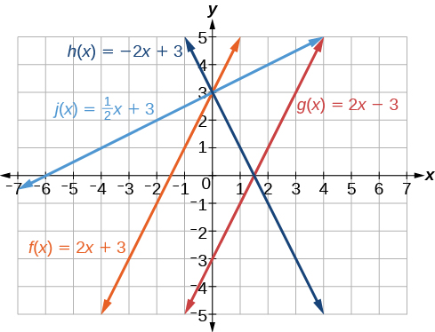
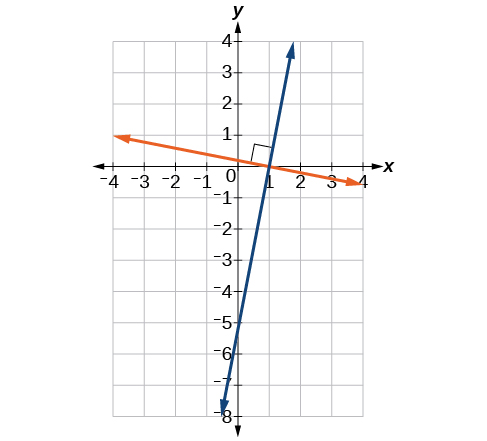
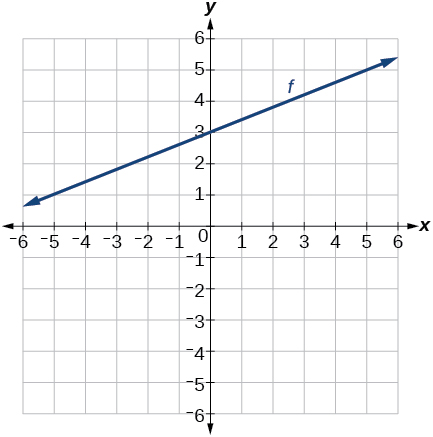
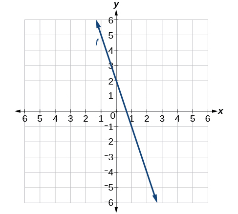
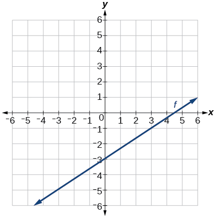
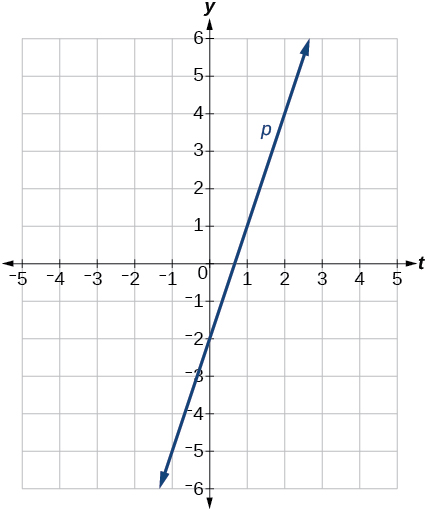
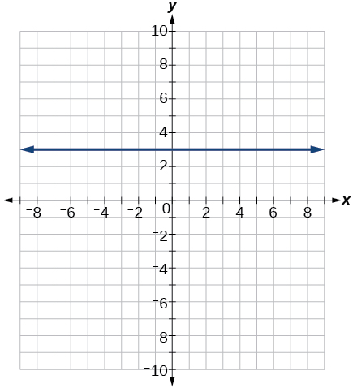
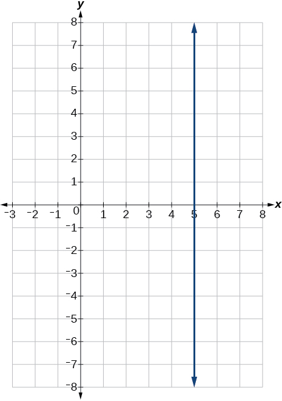
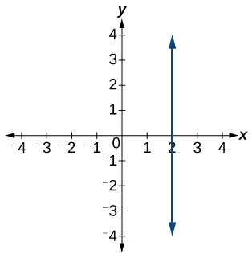

In this section, you will:
* Graph linear functions.
* Write the equation for a linear function from the graph of a line.
* Given the equations of two lines, determine whether their graphs are parallel or perpendicular.
* Write the equation of a line parallel or perpendicular to a given line.
* Solve a system of linear equations.

Two competing telephone companies offer different payment plans. The two plans charge the same rate per long distance minute, but charge a different monthly flat fee. A consumer wants to determine whether the two plans will ever cost the same amount for a given number of long distance minutes used. The total cost of each payment plan can be represented by a linear function. To solve the problem, we will need to compare the functions. In this section, we will consider methods of comparing functions using graphs.

# Graphing Linear Functions

In [Linear Functions](/m49324){: .target-chapter}, we saw that that the graph of a linear function is a straight line. We were also able to see the points of the function as well as the initial value from a graph. By graphing two functions, then, we can more easily compare their characteristics.

There are three basic methods of graphing linear functions. The first is by plotting points and then drawing a line through the points. The second is by using the *y-*intercept and slope. And the third is by using transformations of the identity function <math xmlns="http://www.w3.org/1998/Math/MathML"><mrow><mi>f</mi><mo stretchy="false">(</mo><mi>x</mi><mo stretchy="false">)</mo><mo>=</mo><mi>x</mi><mo>.</mo></mrow></math>

## Graphing a Function by Plotting Points

To find points of a function, we can choose input values, evaluate the function at these input values, and calculate output values. The input values and corresponding output values form coordinate pairs. We then plot the coordinate pairs on a grid. In general, we should evaluate the function at a minimum of two inputs in order to find at least two points on the graph. For example, given the function, <math xmlns="http://www.w3.org/1998/Math/MathML"><mrow><mi>f</mi><mo stretchy="false">(</mo><mi>x</mi><mo stretchy="false">)</mo><mo>=</mo><mn>2</mn><mi>x</mi><mo>,</mo></mrow></math>

 we might use the input values 1 and 2. Evaluating the function for an input value of 1 yields an output value of 2, which is represented by the point <math xmlns="http://www.w3.org/1998/Math/MathML"><mrow><mrow><mo>(</mo><mrow><mn>1</mn><mo>,</mo><mn>2</mn></mrow><mo>)</mo></mrow><mo>.</mo></mrow></math>

 Evaluating the function for an input value of 2 yields an output value of 4, which is represented by the point <math xmlns="http://www.w3.org/1998/Math/MathML"><mrow><mrow><mo>(</mo><mrow><mn>2</mn><mo>,</mo><mn>4</mn></mrow><mo>)</mo></mrow><mo>.</mo></mrow></math>

 Choosing three points is often advisable because if all three points do not fall on the same line, we know we made an error.

**Given a linear function, graph by plotting points.**

1.  Choose a minimum of two input values.
2.  Evaluate the function at each input value.
3.  Use the resulting output values to identify coordinate pairs.
4.  Plot the coordinate pairs on a grid.
5.  Draw a line through the points.
{: data-number-style="arabic"}

Graphing by Plotting Points

Graph <math xmlns="http://www.w3.org/1998/Math/MathML"><mrow><mi>f</mi><mo stretchy="false">(</mo><mi>x</mi><mo stretchy="false">)</mo><mo>=</mo><mo>−</mo><mfrac><mn>2</mn><mn>3</mn></mfrac><mi>x</mi><mo>+</mo><mn>5</mn></mrow></math>

 by plotting points.

Begin by choosing input values. This function includes a fraction with a denominator of 3, so let’s choose multiples of 3 as input values. We will choose 0, 3, and 6.

Evaluate the function at each input value, and use the output value to identify coordinate pairs.

<math xmlns="http://www.w3.org/1998/Math/MathML" display="block"> <mrow> <mtable> <mtr> <mtd> <mrow> <mi>x</mi><mo>=</mo><mn>0</mn> </mrow> </mtd> <mtd> <mrow /> </mtd> <mtd> <mrow> <mi>f</mi><mo stretchy="false">(</mo><mn>0</mn><mo stretchy="false">)</mo><mo>=</mo><mo>−</mo><mfrac> <mn>2</mn> <mn>3</mn> </mfrac> <mo stretchy="false">(</mo><mn>0</mn><mo stretchy="false">)</mo><mo>+</mo><mn>5</mn><mo>=</mo><mn>5</mn><mo>⇒</mo><mrow><mo>(</mo> <mrow> <mn>0</mn><mo>,</mo><mn>5</mn> </mrow> <mo>)</mo></mrow> </mrow> </mtd> </mtr> <mtr> <mtd> <mrow> <mi>x</mi><mo>=</mo><mn>3</mn> </mrow> </mtd> <mtd> <mrow /> </mtd> <mtd> <mrow> <mi>f</mi><mo stretchy="false">(</mo><mn>3</mn><mo stretchy="false">)</mo><mo>=</mo><mo>−</mo><mfrac> <mn>2</mn> <mn>3</mn> </mfrac> <mo stretchy="false">(</mo><mn>3</mn><mo stretchy="false">)</mo><mo>+</mo><mn>5</mn><mo>=</mo><mn>3</mn><mo>⇒</mo><mrow><mo>(</mo> <mrow> <mn>3</mn><mo>,</mo><mn>3</mn> </mrow> <mo>)</mo></mrow> </mrow> </mtd> </mtr> <mtr> <mtd> <mrow> <mi>x</mi><mo>=</mo><mn>6</mn> </mrow> </mtd> <mtd> <mrow /> </mtd> <mtd> <mrow> <mi>f</mi><mo stretchy="false">(</mo><mn>6</mn><mo stretchy="false">)</mo><mo>=</mo><mo>−</mo><mfrac> <mn>2</mn> <mn>3</mn> </mfrac> <mo stretchy="false">(</mo><mn>6</mn><mo stretchy="false">)</mo><mo>+</mo><mn>5</mn><mo>=</mo><mn>1</mn><mo>⇒</mo><mrow><mo>(</mo> <mrow> <mn>6</mn><mo>,</mo><mn>1</mn> </mrow> <mo>)</mo></mrow> </mrow> </mtd> </mtr> </mtable> </mrow> </math>

Plot the coordinate pairs and draw a line through the points. [[link]](#CNX_Precalc_Figure_02_02_001) represents the graph of the function <math xmlns="http://www.w3.org/1998/Math/MathML"><mrow><mi>f</mi><mo stretchy="false">(</mo><mi>x</mi><mo stretchy="false">)</mo><mo>=</mo><mo>−</mo><mfrac><mn>2</mn><mn>3</mn></mfrac><mi>x</mi><mo>+</mo><mn>5.</mn></mrow></math>

=&#x2212;23x+5."){: #CNX_Precalc_Figure_02_02_001}

Analysis

The graph of the function is a line as expected for a linear function. In addition, the graph has a downward slant, which indicates a negative slope. This is also expected from the negative constant rate of change in the equation for the function.

Graph <math xmlns="http://www.w3.org/1998/Math/MathML"><mrow><mi>f</mi><mo stretchy="false">(</mo><mi>x</mi><mo stretchy="false">)</mo><mo>=</mo><mo>−</mo><mfrac><mn>3</mn><mn>4</mn></mfrac><mi>x</mi><mo>+</mo><mn>6</mn></mrow></math>

 by plotting points.

  

## Graphing a Function Using *y-*intercept and Slope

Another way to graph linear functions is by using specific characteristics of the function rather than plotting points. The first characteristic is its *y-*intercept, which is the point at which the input value is zero. To find the ***y-*intercept**{: data-type="term" .no-emphasis}, we can set <math xmlns="http://www.w3.org/1998/Math/MathML"><mrow><mi>x</mi><mo>=</mo><mn>0</mn></mrow></math>

 in the equation.

The other characteristic of the linear function is its slope <math xmlns="http://www.w3.org/1998/Math/MathML"><mrow><mi>m</mi><mo>,</mo></mrow></math>

 which is a measure of its steepness. Recall that the slope is the rate of change of the function. The slope of a function is equal to the ratio of the change in outputs to the change in inputs. Another way to think about the slope is by dividing the vertical difference, or rise, by the horizontal difference, or run. We encountered both the *y-*intercept and the slope in [Linear Functions](/m49324){: .target-chapter}.

Let’s consider the following function.

<math xmlns="http://www.w3.org/1998/Math/MathML" display="block"><mrow><mi>f</mi><mo stretchy="false">(</mo><mi>x</mi><mo stretchy="false">)</mo><mo>=</mo><mfrac><mn>1</mn><mn>2</mn></mfrac><mi>x</mi><mo>+</mo><mn>1</mn></mrow></math>

The slope is <math xmlns="http://www.w3.org/1998/Math/MathML"><mrow><mfrac><mn>1</mn><mn>2</mn></mfrac><mo>.</mo></mrow></math>

 Because the slope is positive, we know the graph will slant upward from left to right. The *y-*intercept is the point on the graph when <math xmlns="http://www.w3.org/1998/Math/MathML"><mrow><mi>x</mi><mo>=</mo><mn>0.</mn></mrow></math>

 The graph crosses the *y*-axis at <math xmlns="http://www.w3.org/1998/Math/MathML"><mrow><mrow><mo>(</mo><mrow><mn>0</mn><mo>,</mo><mn>1</mn></mrow><mo>)</mo></mrow><mo>.</mo></mrow></math>

 Now we know the slope and the *y*-intercept. We can begin graphing by plotting the point <math xmlns="http://www.w3.org/1998/Math/MathML"><mrow><mo stretchy="false">(</mo><mn>0</mn><mo>,</mo><mn>1</mn><mo stretchy="false">)</mo></mrow></math>

 We know that the slope is rise over run, <math xmlns="http://www.w3.org/1998/Math/MathML"><mrow><mi>m</mi><mo>=</mo><mfrac><mrow><mtext>rise</mtext></mrow><mrow><mtext>run</mtext></mrow></mfrac><mo>.</mo></mrow></math>

 From our example, we have <math xmlns="http://www.w3.org/1998/Math/MathML"><mrow><mi>m</mi><mo>=</mo><mfrac><mn>1</mn><mn>2</mn></mfrac><mo>,</mo></mrow></math>

 which means that the rise is 1 and the run is 2. So starting from our *y*-intercept <math xmlns="http://www.w3.org/1998/Math/MathML"><mrow><mrow><mo>(</mo><mrow><mn>0</mn><mo>,</mo><mn>1</mn></mrow><mo>)</mo></mrow><mo>,</mo></mrow></math>

 we can rise 1 and then run 2, or run 2 and then rise 1. We repeat until we have a few points, and then we draw a line through the points as shown in [\[link\]](#CNX_Precalc_Figure_02_02_003).

 {: #CNX_Precalc_Figure_02_02_003}

Graphical Interpretation of a Linear Function

In the equation <math xmlns="http://www.w3.org/1998/Math/MathML"><mrow><mi>f</mi><mo stretchy="false">(</mo><mi>x</mi><mo stretchy="false">)</mo><mo>=</mo><mi>m</mi><mi>x</mi><mo>+</mo><mi>b</mi></mrow></math>

* <math xmlns="http://www.w3.org/1998/Math/MathML"><mi>b</mi></math>
  
  is the *y*-intercept of the graph and indicates the point
  <math xmlns="http://www.w3.org/1998/Math/MathML"><mrow><mrow><mo>(</mo><mrow><mn>0</mn><mo>,</mo><mi>b</mi></mrow><mo>)</mo></mrow></mrow></math>
  
  at which the graph crosses the *y*-axis.
* <math xmlns="http://www.w3.org/1998/Math/MathML"><mi>m</mi></math>
  
  is the slope of the line and indicates the vertical displacement (rise) and horizontal displacement (run) between each successive pair of points. Recall the formula for the slope:

<math xmlns="http://www.w3.org/1998/Math/MathML" display="block"> <mrow> <mi>m</mi><mo>=</mo><mfrac> <mrow> <mtext>change in output (rise)</mtext> </mrow> <mrow> <mtext>change in input (run)</mtext> </mrow> </mfrac> <mo>=</mo><mfrac> <mrow> <mtext>Δ</mtext><mi>y</mi> </mrow> <mrow> <mtext>Δ</mtext><mi>x</mi> </mrow> </mfrac> <mo>=</mo><mfrac> <mrow> <msub> <mi>y</mi> <mn>2</mn> </msub> <mo>−</mo><msub> <mi>y</mi> <mn>1</mn> </msub> </mrow> <mrow> <msub> <mi>x</mi> <mn>2</mn> </msub> <mo>−</mo><msub> <mi>x</mi> <mn>1</mn> </msub> </mrow> </mfrac> </mrow> </math>

**Do all linear functions have *y*-intercepts?**

*Yes. All linear functions cross the y-axis and therefore have y-intercepts.* (Note: *A vertical line parallel to the y-axis does not have a y-intercept, but it is not a function.*)

**Given the equation for a linear function, graph the function using the *y*-intercept and slope.**

1.  Evaluate the function at an input value of zero to find the *y-*intercept.
2.  Identify the slope as the rate of change of the input value.
3.  Plot the point represented by the *y-*intercept.
4.  Use
    <math xmlns="http://www.w3.org/1998/Math/MathML"><mrow><mfrac><mrow><mtext>rise</mtext></mrow><mrow><mtext>run</mtext></mrow></mfrac></mrow></math>
    
    to determine at least two more points on the line.
5.  Sketch the line that passes through the points.
{: data-number-style="arabic"}

Graphing by Using the *y-*intercept and Slope

Graph <math xmlns="http://www.w3.org/1998/Math/MathML"><mrow><mi>f</mi><mo stretchy="false">(</mo><mi>x</mi><mo stretchy="false">)</mo><mo>=</mo><mo>−</mo><mfrac><mn>2</mn><mn>3</mn></mfrac><mi>x</mi><mo>+</mo><mn>5</mn></mrow></math>

 using the *y-*intercept and slope.

Evaluate the function at <math xmlns="http://www.w3.org/1998/Math/MathML"><mrow><mi>x</mi><mo>=</mo><mn>0</mn></mrow></math>

 to find the *y-*intercept. The output value when <math xmlns="http://www.w3.org/1998/Math/MathML"><mrow><mi>x</mi><mo>=</mo><mn>0</mn></mrow></math>

 is 5, so the graph will cross the *y*-axis at <math xmlns="http://www.w3.org/1998/Math/MathML"><mrow><mrow><mo>(</mo><mrow><mn>0</mn><mo>,</mo><mn>5</mn></mrow><mo>)</mo></mrow><mo>.</mo></mrow></math>

According to the equation for the function, the slope of the line is <math xmlns="http://www.w3.org/1998/Math/MathML"><mrow><mo>−</mo><mfrac><mn>2</mn><mn>3</mn></mfrac><mo>.</mo></mrow></math>

 This tells us that for each vertical decrease in the “rise” of <math xmlns="http://www.w3.org/1998/Math/MathML"><mrow><mo>–</mo><mn>2</mn></mrow></math>

 units, the “run” increases by 3 units in the horizontal direction. We can now graph the function by first plotting the *y*-intercept on the graph in [[link]](#CNX_Precalc_Figure_02_02_004). From the initial value <math xmlns="http://www.w3.org/1998/Math/MathML"><mrow><mrow><mo>(</mo><mrow><mn>0</mn><mo>,</mo><mn>5</mn></mrow><mo>)</mo></mrow></mrow></math>

 we move down 2 units and to the right 3 units. We can extend the line to the left and right by repeating, and then draw a line through the points.

{: #CNX_Precalc_Figure_02_02_004}

Analysis

The graph slants downward from left to right, which means it has a negative slope as expected.

Find a point on the graph we drew in [[link]](#Example_02_02_02) that has a negative *x*-value.

Possible answers include <math xmlns="http://www.w3.org/1998/Math/MathML"> <mrow><mo stretchy="false">(</mo><mo>−</mo><mn>3</mn><mo>,</mo><mn>7</mn><mo stretchy="false">)</mo><mo>,</mo></mrow></math>

 <math xmlns="http://www.w3.org/1998/Math/MathML"><mrow><mo stretchy="false">(</mo><mo>−</mo><mn>6</mn><mo>,</mo><mn>9</mn><mo stretchy="false">)</mo><mo>,</mo></mrow></math>

 or <math xmlns="http://www.w3.org/1998/Math/MathML"><mrow><mo stretchy="false">(</mo><mo>−</mo><mn>9</mn><mo>,</mo><mn>11</mn><mo stretchy="false">)</mo><mo>.</mo></mrow></math>

## Graphing a Function Using Transformations

Another option for graphing is to use **transformations**{: data-type="term" .no-emphasis} of the identity function <math xmlns="http://www.w3.org/1998/Math/MathML"><mrow><mi>f</mi><mo stretchy="false">(</mo><mi>x</mi><mo stretchy="false">)</mo><mo>=</mo><mi>x</mi></mrow></math>

. A function may be transformed by a shift up, down, left, or right. A function may also be transformed using a reflection, stretch, or compression.

### Vertical Stretch or Compression

In the equation <math xmlns="http://www.w3.org/1998/Math/MathML"><mrow><mi>f</mi><mo stretchy="false">(</mo><mi>x</mi><mo stretchy="false">)</mo><mo>=</mo><mi>m</mi><mi>x</mi><mo>,</mo></mrow></math>

 the <math xmlns="http://www.w3.org/1998/Math/MathML"><mi>m</mi></math>

 is acting as the **vertical stretch**{: data-type="term" .no-emphasis} or **compression**{: data-type="term" .no-emphasis} of the identity function. When <math xmlns="http://www.w3.org/1998/Math/MathML"><mi>m</mi></math>

 is negative, there is also a vertical reflection of the graph. Notice in [\[link\]](#CNX_Precalc_Figure_02_02_005) that multiplying the equation of <math xmlns="http://www.w3.org/1998/Math/MathML"><mrow><mi>f</mi><mo stretchy="false">(</mo><mi>x</mi><mo stretchy="false">)</mo><mo>=</mo><mi>x</mi></mrow></math>

 by <math xmlns="http://www.w3.org/1998/Math/MathML"><mi>m</mi></math>

 stretches the graph of <math xmlns="http://www.w3.org/1998/Math/MathML"><mi>f</mi></math>

 by a factor of <math xmlns="http://www.w3.org/1998/Math/MathML"><mi>m</mi></math>

 units if <math xmlns="http://www.w3.org/1998/Math/MathML"><mrow><mi>m</mi><mo>&gt;</mo><mtext>1</mtext></mrow></math>

 and compresses the graph of <math xmlns="http://www.w3.org/1998/Math/MathML"><mi>f</mi></math>

 by a factor of <math xmlns="http://www.w3.org/1998/Math/MathML"><mi>m</mi></math>

 units if <math xmlns="http://www.w3.org/1998/Math/MathML"><mrow><mn>0</mn><mo>&lt;</mo><mi>m</mi><mo>&lt;</mo><mn>1.</mn></mrow></math>

 This means the larger the absolute value of <math xmlns="http://www.w3.org/1998/Math/MathML"><mrow><mi>m</mi><mo>,</mo></mrow></math>

 the steeper the slope.

=x."){: #CNX_Precalc_Figure_02_02_005}

### Vertical Shift

In <math xmlns="http://www.w3.org/1998/Math/MathML"><mrow><mi>f</mi><mo stretchy="false">(</mo><mi>x</mi><mo stretchy="false">)</mo><mo>=</mo><mi>m</mi><mi>x</mi><mo>+</mo><mi>b</mi><mo>,</mo></mrow></math>

 the <math xmlns="http://www.w3.org/1998/Math/MathML"><mi>b</mi></math>

 acts as the **vertical shift**{: data-type="term" .no-emphasis}, moving the graph up and down without affecting the slope of the line. Notice in [\[link\]](#CNX_Precalc_Figure_02_02_006) that adding a value of <math xmlns="http://www.w3.org/1998/Math/MathML"><mi>b</mi></math>

 to the equation of <math xmlns="http://www.w3.org/1998/Math/MathML"><mrow><mi>f</mi><mrow><mo>(</mo><mi>x</mi><mo>)</mo></mrow><mo>=</mo><mi>x</mi></mrow></math>

 shifts the graph of <math xmlns="http://www.w3.org/1998/Math/MathML"><mi>f</mi></math>

 a total of <math xmlns="http://www.w3.org/1998/Math/MathML"><mi>b</mi></math>

 units up if <math xmlns="http://www.w3.org/1998/Math/MathML"><mi>b</mi></math>

 is positive and <math xmlns="http://www.w3.org/1998/Math/MathML"><mrow><mo>\|</mo><mi>b</mi><mo>\|</mo></mrow></math>

 units down if <math xmlns="http://www.w3.org/1998/Math/MathML"><mi>b</mi></math>

 is negative.

 =x."){: #CNX_Precalc_Figure_02_02_006}

Using vertical stretches or compressions along with vertical shifts is another way to look at identifying different types of linear functions. Although this may not be the easiest way to graph this type of function, it is still important to practice each method.

**Given the equation of a linear function, use transformations to graph the linear function in the form <math xmlns="http://www.w3.org/1998/Math/MathML"><mrow><mi>f</mi><mrow><mo>(</mo><mi>x</mi><mo>)</mo></mrow><mo>=</mo><mi>m</mi><mi>x</mi><mo>+</mo><mi>b</mi><mo>.</mo></mrow></math>

**

1.  Graph
    <math xmlns="http://www.w3.org/1998/Math/MathML"><mrow><mi>f</mi><mrow><mo>(</mo><mi>x</mi><mo>)</mo></mrow><mo>=</mo><mi>x</mi><mo>.</mo></mrow></math>

2.  Vertically stretch or compress the graph by a factor
    <math xmlns="http://www.w3.org/1998/Math/MathML"><mrow><mi>m</mi><mo>.</mo></mrow></math>

3.  Shift the graph up or down
    <math xmlns="http://www.w3.org/1998/Math/MathML"><mi>b</mi></math>
    
    units.
{: data-number-style="arabic"}

Graphing by Using Transformations

Graph <math xmlns="http://www.w3.org/1998/Math/MathML"><mrow><mi>f</mi><mo stretchy="false">(</mo><mi>x</mi><mo stretchy="false">)</mo><mo>=</mo><mfrac><mn>1</mn><mn>2</mn></mfrac><mi>x</mi><mo>−</mo><mn>3</mn></mrow></math>

 using transformations.

The equation for the function shows that <math xmlns="http://www.w3.org/1998/Math/MathML"><mrow><mi>m</mi><mo>=</mo><mfrac><mn>1</mn><mn>2</mn></mfrac></mrow></math>

 so the identity function is vertically compressed by <math xmlns="http://www.w3.org/1998/Math/MathML"><mrow><mfrac><mn>1</mn><mn>2</mn></mfrac><mo>.</mo></mrow></math>

 The equation for the function also shows that <math xmlns="http://www.w3.org/1998/Math/MathML"><mrow><mi>b</mi><mo>=</mo><mn>−3</mn></mrow></math>

 so the identity function is vertically shifted down 3 units. First, graph the identity function, and show the vertical compression as in [[link]](#CNX_Precalc_Figure_02_02_007).

{: #CNX_Precalc_Figure_02_02_007}

Then show the vertical shift as in [[link]](#CNX_Precalc_Figure_02_02_008).

{: #CNX_Precalc_Figure_02_02_008}

Graph <math xmlns="http://www.w3.org/1998/Math/MathML"><mrow><mi>f</mi><mo stretchy="false">(</mo><mi>x</mi><mo stretchy="false">)</mo><mo>=</mo><mn>4</mn><mo>+</mo><mn>2</mn><mi>x</mi><mo>,</mo></mrow></math>

 using transformations.

  

**In [\[link\]](#Example_02_02_03), could we have sketched the graph by reversing the order of the transformations?**

*No. The order of the transformations follows the order of operations. When the function is evaluated at a given input, the corresponding output is calculated by following the order of operations. This is why we performed the compression first. For example, following the order: Let the input be 2.*

<math xmlns="http://www.w3.org/1998/Math/MathML" display="block"> <mrow> <mtable columnalign="left"> <mtr columnalign="left"> <mtd columnalign="left"> <mrow> <mi>f</mi><mtext>(2)</mtext><mo>=</mo><mfrac> <mtext>1</mtext> <mtext>2</mtext> </mfrac> <mtext>(2)</mtext><mo>−</mo><mtext>3</mtext> </mrow> </mtd> </mtr> <mtr columnalign="left"> <mtd columnalign="left"> <mrow> <mtext> </mtext><mtext> </mtext><mtext> </mtext><mtext> </mtext><mtext> </mtext><mtext> </mtext><mtext> </mtext><mtext> </mtext><mtext> </mtext><mtext> </mtext><mtext> </mtext><mo>=</mo><mtext>1</mtext><mo>−</mo><mtext>3</mtext> </mrow> </mtd> </mtr> <mtr columnalign="left"> <mtd columnalign="left"> <mrow> <mtext> </mtext><mtext> </mtext><mtext> </mtext><mtext> </mtext><mtext> </mtext><mtext> </mtext><mtext> </mtext><mtext> </mtext><mtext> </mtext><mtext> </mtext><mtext> </mtext><mo>=</mo><mo>−</mo><mtext>2</mtext> </mrow> </mtd> </mtr> </mtable> </mrow> </math>

# Writing the Equation for a Function from the Graph of a Line

Recall that in [Linear Functions](#m10352), we wrote the equation for a linear function from a graph. Now we can extend what we know about graphing linear functions to analyze graphs a little more closely. Begin by taking a look at [\[link\]](#CNX_Precalc_Figure_02_02_010). We can see right away that the graph crosses the *y*-axis at the point <math xmlns="http://www.w3.org/1998/Math/MathML"><mrow><mrow><mo>(</mo><mrow><mn>0</mn><mo>,</mo><mtext> 4</mtext></mrow><mo>)</mo></mrow></mrow></math>

 so this is the *y*-intercept.

 {: #CNX_Precalc_Figure_02_02_010}

Then we can calculate the slope by finding the rise and run. We can choose any two points, but let’s look at the point <math xmlns="http://www.w3.org/1998/Math/MathML"> <mrow> <mo stretchy="false">(</mo><mo>−</mo><mn>2</mn><mo>,</mo><mn>0</mn><mo stretchy="false">)</mo><mo>.</mo> </mrow> </math>

 To get from this point to the *y-*intercept, we must move up 4 units (rise) and to the right 2 units (run). So the slope must be

<math xmlns="http://www.w3.org/1998/Math/MathML" display="block"> <mrow> <mi>m</mi><mo>=</mo><mfrac> <mrow> <mtext>rise</mtext> </mrow> <mrow> <mtext>run</mtext> </mrow> </mfrac> <mo>=</mo><mfrac> <mn>4</mn> <mn>2</mn> </mfrac> <mo>=</mo><mn>2</mn> </mrow> </math>

Substituting the slope and *y-*intercept into the slope-intercept form of a line gives

<math xmlns="http://www.w3.org/1998/Math/MathML" display="block"><mrow><mi>y</mi><mo>=</mo><mn>2</mn><mi>x</mi><mo>+</mo><mn>4</mn></mrow></math>

**Given a graph of linear function, find the equation to describe the function.**

1.  Identify the *y-*intercept of an equation.
2.  Choose two points to determine the slope.
3.  Substitute the *y-*intercept and slope into the slope-intercept form of a line.
{: data-number-style="arabic"}

Matching Linear Functions to Their Graphs

Match each equation of the linear functions with one of the lines in [[link]](#CNX_Precalc_Figure_02_02_011).

1.  <math xmlns="http://www.w3.org/1998/Math/MathML"><mrow><mi>f</mi><mrow><mo>(</mo><mi>x</mi><mo>)</mo></mrow><mo>=</mo><mn>2</mn><mi>x</mi><mo>+</mo><mn>3</mn></mrow></math>

2.  <math xmlns="http://www.w3.org/1998/Math/MathML"><mrow><mi>g</mi><mrow><mo>(</mo><mi>x</mi><mo>)</mo></mrow><mo>=</mo><mn>2</mn><mi>x</mi><mo>−</mo><mn>3</mn></mrow></math>

3.  <math xmlns="http://www.w3.org/1998/Math/MathML"><mrow><mi>h</mi><mrow><mo>(</mo><mi>x</mi><mo>)</mo></mrow><mo>=</mo><mo>−</mo><mn>2</mn><mi>x</mi><mo>+</mo><mn>3</mn></mrow></math>

4.  <math xmlns="http://www.w3.org/1998/Math/MathML"><mrow><mi>j</mi><mrow><mo>(</mo><mi>x</mi><mo>)</mo></mrow><mo>=</mo><mfrac><mn>1</mn><mn>2</mn></mfrac><mi>x</mi><mo>+</mo><mn>3</mn></mrow></math>
{: data-number-style="lower-alpha"}

{: #CNX_Precalc_Figure_02_02_011}

Analyze the information for each function.

1.  This function has a slope of 2 and a *y*-intercept of 3. It must pass through the point (0, 3) and slant upward from left to right. We can use two points to find the slope, or we can compare it with the other functions listed. Function
    <math xmlns="http://www.w3.org/1998/Math/MathML"><mi>g</mi></math>
    
    has the same slope, but a different *y-*intercept. Lines I and III have the same slant because they have the same slope. Line III does not pass through
    <math xmlns="http://www.w3.org/1998/Math/MathML"><mrow><mrow><mo>(</mo><mrow> <mn>0</mn><mo>,</mo><mtext> 3</mtext></mrow><mo>)</mo></mrow></mrow></math>
    
    so
    <math xmlns="http://www.w3.org/1998/Math/MathML"><mi>f</mi></math>
    
    must be represented by line I.
2.  This function also has a slope of 2, but a *y*-intercept of
    <math xmlns="http://www.w3.org/1998/Math/MathML"><mrow><mo>−</mo><mn>3.</mn></mrow></math>
    
    It must pass through the point
    <math xmlns="http://www.w3.org/1998/Math/MathML"><mrow><mrow><mo>(</mo><mrow><mn>0</mn><mo>,</mo><mo>−</mo><mn>3</mn></mrow><mo>)</mo></mrow></mrow></math>
    
    and slant upward from left to right. It must be represented by line III.
3.  This function has a slope of –2 and a *y-*intercept of 3. This is the only function listed with a negative slope, so it must be represented by line IV because it slants downward from left to right.
4.  This function has a slope of
    <math xmlns="http://www.w3.org/1998/Math/MathML"><mrow><mfrac><mn>1</mn><mn>2</mn></mfrac></mrow></math>
    
    and a *y-*intercept of 3. It must pass through the point (0, 3) and slant upward from left to right. Lines I and II pass through
    <math xmlns="http://www.w3.org/1998/Math/MathML"><mrow><mrow><mo>(</mo><mrow><mn>0</mn><mo>,</mo><mtext> 3</mtext></mrow><mo>)</mo></mrow><mo>,</mo></mrow></math>
    
    but the slope of
    <math xmlns="http://www.w3.org/1998/Math/MathML"><mi>j</mi></math>
    
    is less than the slope of
    <math xmlns="http://www.w3.org/1998/Math/MathML"><mi>f</mi></math>
    
    so the line for
    <math xmlns="http://www.w3.org/1998/Math/MathML"><mi>j</mi></math>
    
    must be flatter. This function is represented by Line II.
{: data-number-style="lower-alpha"}

Now we can re-label the lines as in [[link]](#CNX_Precalc_Figure_02_02_012).

{: #CNX_Precalc_Figure_02_02_012}

# Finding the *x*-intercept of a Line

So far, we have been finding the *y-*intercepts of a function: the point at which the graph of the function crosses the *y*-axis. A function may also have an ***x***{::}**-intercept,** which is the *x*-coordinate of the point where the graph of the function crosses the *x*-axis. In other words, it is the input value when the output value is zero.

To find the *x*-intercept, set a function <math xmlns="http://www.w3.org/1998/Math/MathML"><mrow><mi>f</mi><mo stretchy="false">(</mo><mi>x</mi><mo stretchy="false">)</mo></mrow></math>

 equal to zero and solve for the value of <math xmlns="http://www.w3.org/1998/Math/MathML"><mrow><mi>x</mi><mo>.</mo></mrow></math>

 For example, consider the function shown.

<math xmlns="http://www.w3.org/1998/Math/MathML" display="block"><mrow><mi>f</mi><mo stretchy="false">(</mo><mi>x</mi><mo stretchy="false">)</mo><mo>=</mo><mn>3</mn><mi>x</mi><mo>−</mo><mn>6</mn></mrow></math>

Set the function equal to 0 and solve for <math xmlns="http://www.w3.org/1998/Math/MathML"><mrow><mi>x</mi><mo>.</mo></mrow></math>

<math xmlns="http://www.w3.org/1998/Math/MathML" display="block"> <mrow> <mtable columnalign="left"> <mtr columnalign="left"> <mtd columnalign="left"> <mrow> <mn>0</mn><mo>=</mo><mn>3</mn><mi>x</mi><mo>−</mo><mn>6</mn> </mrow> </mtd> </mtr> <mtr columnalign="left"> <mtd columnalign="left"> <mrow> <mn>6</mn><mo>=</mo><mn>3</mn><mi>x</mi> </mrow> </mtd> </mtr> <mtr columnalign="left"> <mtd columnalign="left"> <mrow> <mn>2</mn><mo>=</mo><mi>x</mi> </mrow> </mtd> </mtr> <mtr columnalign="left"> <mtd columnalign="left"> <mrow> <mi>x</mi><mo>=</mo><mn>2</mn> </mrow> </mtd> </mtr> </mtable> </mrow> </math>

The graph of the function crosses the *x*-axis at the point <math xmlns="http://www.w3.org/1998/Math/MathML"><mrow><mrow><mo>(</mo><mrow><mn>2</mn><mo>,</mo><mtext> 0</mtext></mrow><mo>)</mo></mrow><mo>.</mo></mrow></math>

**Do all linear functions have *x*-intercepts?**

*No. However, linear functions of the form <math xmlns="http://www.w3.org/1998/Math/MathML"><mrow><mi>y</mi><mo>=</mo><mi>c</mi><mo>,</mo></mrow></math>

 where <math xmlns="http://www.w3.org/1998/Math/MathML"><mi>c</mi></math>

 is a nonzero real number are the only examples of linear functions with no x-intercept. For example, <math xmlns="http://www.w3.org/1998/Math/MathML"><mrow><mi>y</mi><mo>=</mo><mn>5</mn></mrow></math>

 is a horizontal line 5 units above the x-axis. This function has no x-intercepts,* as shown in [\[link\]](#CNX_Precalc_Figure_02_02_026).

{: #CNX_Precalc_Figure_02_02_026}

*x*-intercept

The ***x*-intercept**{: data-type="term"} of the function is value of <math xmlns="http://www.w3.org/1998/Math/MathML"><mi>x</mi></math>

 when <math xmlns="http://www.w3.org/1998/Math/MathML"><mrow><mi>f</mi><mo stretchy="false">(</mo><mi>x</mi><mo stretchy="false">)</mo><mo>=</mo><mn>0.</mn></mrow></math>

 It can be solved by the equation <math xmlns="http://www.w3.org/1998/Math/MathML"><mrow><mn>0</mn><mo>=</mo><mi>m</mi><mi>x</mi><mo>+</mo><mi>b</mi><mo>.</mo></mrow></math>

Finding an *x*-intercept

Find the *x*-intercept of <math xmlns="http://www.w3.org/1998/Math/MathML"><mrow><mi>f</mi><mo stretchy="false">(</mo><mi>x</mi><mo stretchy="false">)</mo><mo>=</mo><mfrac><mn>1</mn><mn>2</mn></mfrac><mi>x</mi><mo>−</mo><mn>3.</mn></mrow></math>

Set the function equal to zero to solve for <math xmlns="http://www.w3.org/1998/Math/MathML"><mrow><mi>x</mi><mo>.</mo></mrow></math>

<math xmlns="http://www.w3.org/1998/Math/MathML" display="block"> <mtable columnalign="left"> <mtr> <mtd> <mn>0</mn><mo>=</mo><mfrac> <mn>1</mn> <mn>2</mn> </mfrac> <mi>x</mi><mo>−</mo><mn>3</mn> </mtd> </mtr> <mtr> <mtd> <mn>3</mn><mo>=</mo><mfrac> <mn>1</mn> <mn>2</mn> </mfrac> <mi>x</mi> </mtd> </mtr> <mtr> <mtd> <mn>6</mn><mo>=</mo><mi>x</mi> </mtd> </mtr> <mtr> <mtd> <mi>x</mi><mo>=</mo><mn>6</mn> </mtd> </mtr> </mtable> </math>

The graph crosses the *x*-axis at the point <math xmlns="http://www.w3.org/1998/Math/MathML"><mrow><mrow><mo>(</mo><mrow><mn>6</mn><mo>,</mo><mtext> 0</mtext></mrow><mo>)</mo></mrow><mo>.</mo></mrow></math>

Analysis

A graph of the function is shown in [[link]](#CNX_Precalc_Figure_02_02_013). We can see that the *x*-intercept is <math xmlns="http://www.w3.org/1998/Math/MathML"><mrow><mrow><mo>(</mo><mrow><mn>6</mn><mo>,</mo><mtext> 0</mtext></mrow><mo>)</mo></mrow></mrow></math>

 as we expected.

=12x&#x2212;3."){: #CNX_Precalc_Figure_02_02_013}

Find the *x*-intercept of <math xmlns="http://www.w3.org/1998/Math/MathML"><mrow><mi>f</mi><mo stretchy="false">(</mo><mi>x</mi><mo stretchy="false">)</mo><mo>=</mo><mfrac><mn>1</mn><mn>4</mn></mfrac><mi>x</mi><mo>−</mo><mn>4.</mn></mrow></math>

<math xmlns="http://www.w3.org/1998/Math/MathML"><mrow><mrow><mo>(</mo><mrow><mn>16</mn><mo>,</mo><mtext> 0</mtext></mrow><mo>)</mo></mrow></mrow></math>

# Describing Horizontal and Vertical Lines

There are two special cases of lines on a graph—horizontal and vertical lines. A **horizontal line** indicates a constant output, or *y*-value. In [\[link\]](#CNX_Precalc_Figure_02_02_014), we see that the output has a value of 2 for every input value. The change in outputs between any two points, therefore, is 0. In the slope formula, the numerator is 0, so the slope is 0. If we use <math xmlns="http://www.w3.org/1998/Math/MathML"><mrow><mi>m</mi><mo>=</mo><mn>0</mn></mrow></math>

 in the equation <math xmlns="http://www.w3.org/1998/Math/MathML"><mrow><mi>f</mi><mo stretchy="false">(</mo><mi>x</mi><mo stretchy="false">)</mo><mo>=</mo><mi>m</mi><mi>x</mi><mo>+</mo><mi>b</mi><mo>,</mo></mrow></math>

 the equation simplifies to <math xmlns="http://www.w3.org/1998/Math/MathML"><mrow><mi>f</mi><mo stretchy="false">(</mo><mi>x</mi><mo stretchy="false">)</mo><mo>=</mo><mi>b</mi><mo>.</mo></mrow></math>

 In other words, the value of the function is a constant. This graph represents the function <math xmlns="http://www.w3.org/1998/Math/MathML"><mrow><mi>f</mi><mo stretchy="false">(</mo><mi>x</mi><mo stretchy="false">)</mo><mo>=</mo><mn>2.</mn></mrow></math>

 =2."){: #CNX_Precalc_Figure_02_02_014}

A **vertical line** indicates a constant input, or *x*-value. We can see that the input value for every point on the line is 2, but the output value varies. Because this input value is mapped to more than one output value, a vertical line does not represent a function. Notice that between any two points, the change in the input values is zero. In the slope formula, the denominator will be zero, so the slope of a vertical line is undefined.

    Notice that a vertical line, such as the one in [\[link\]](#CNX_Precalc_Figure_02_02_016)**,** has an *x*-intercept, but no *y-*intercept unless it’s the line <math xmlns="http://www.w3.org/1998/Math/MathML"><mrow><mi>x</mi><mo>=</mo><mn>0.</mn></mrow></math>

 This graph represents the line <math xmlns="http://www.w3.org/1998/Math/MathML"> <mrow> <mi>x</mi><mo>=</mo><mn>2.</mn> </mrow> </math>

 {: #CNX_Precalc_Figure_02_02_016}

Horizontal and Vertical Lines

Lines can be horizontal or vertical.

A **horizontal line**{: data-type="term"} is a line defined by an equation in the form <math xmlns="http://www.w3.org/1998/Math/MathML"><mrow><mi>f</mi><mo stretchy="false">(</mo><mi>x</mi><mo stretchy="false">)</mo><mo>=</mo><mi>b</mi><mo>.</mo></mrow></math>

A **vertical line**{: data-type="term"} is a line defined by an equation in the form <math xmlns="http://www.w3.org/1998/Math/MathML"><mrow><mi>x</mi><mo>=</mo><mi>a</mi><mo>.</mo></mrow></math>

Writing the Equation of a Horizontal Line

Write the equation of the line graphed in [[link]](#CNX_Precalc_Figure_02_02_017).

{: #CNX_Precalc_Figure_02_02_017}

For any *x*-value, the *y*-value is <math xmlns="http://www.w3.org/1998/Math/MathML"><mrow><mo>−</mo><mn>4</mn><mo>,</mo></mrow></math>

 so the equation is <math xmlns="http://www.w3.org/1998/Math/MathML"><mrow><mi>y</mi><mo>=</mo><mo>−</mo><mn>4.</mn></mrow></math>

Writing the Equation of a Vertical Line

Write the equation of the line graphed in [[link]](#CNX_Precalc_Figure_02_02_018).

{: #CNX_Precalc_Figure_02_02_018}

The constant *x*-value is <math xmlns="http://www.w3.org/1998/Math/MathML"><mrow><mn>7</mn><mo>,</mo></mrow></math>

 so the equation is <math xmlns="http://www.w3.org/1998/Math/MathML"><mrow><mi>x</mi><mo>=</mo><mn>7.</mn></mrow></math>

# Determining Whether Lines are Parallel or Perpendicular 

The two lines in [\[link\]](#CNX_Precalc_Figure_02_02_019) are **parallel** **lines**\: they will never intersect. Notice that they have exactly the same steepness, which means their slopes are identical. The only difference between the two lines is the *y*-intercept. If we shifted one line vertically toward the *y*-intercept of the other, they would become the same line.

 {: #CNX_Precalc_Figure_02_02_019}

We can determine from their equations whether two lines are parallel by comparing their slopes. If the slopes are the same and the *y*-intercepts are different, the lines are parallel. If the slopes are different, the lines are not parallel.

    Unlike parallel lines,<strong> perpendicular lines</strong> do intersect. Their intersection forms a right, or 90-degree, angle. The two lines in [\[link\]](#CNX_Precalc_Figure_02_02_020) are perpendicular.

 {: #CNX_Precalc_Figure_02_02_020}

Perpendicular lines do not have the same slope. The slopes of perpendicular lines are different from one another in a specific way. The slope of one line is the negative reciprocal of the slope of the other line. The product of a number and its reciprocal is <math xmlns="http://www.w3.org/1998/Math/MathML"><mrow><mn>1.</mn></mrow></math>

 So, if <math xmlns="http://www.w3.org/1998/Math/MathML"><mrow><msub><mi>m</mi><mn>1</mn></msub><mtext> and </mtext><mtext> </mtext><msub><mi>m</mi><mn>2</mn></msub></mrow></math>

 are negative reciprocals of one another, they can be multiplied together to yield <math xmlns="http://www.w3.org/1998/Math/MathML"> <mrow> <mn>–1.</mn> </mrow> </math>

<math xmlns="http://www.w3.org/1998/Math/MathML" display="block"><mrow><msub><mi>m</mi><mn>1</mn></msub><msub><mi>m</mi><mn>2</mn></msub><mo>=</mo><mo>−</mo><mn>1</mn></mrow></math>

To find the reciprocal of a number, divide 1 by the number. So the reciprocal of 8 is <math xmlns="http://www.w3.org/1998/Math/MathML"><mrow><mfrac><mn>1</mn><mn>8</mn></mfrac><mo>,</mo></mrow></math>

 and the reciprocal of <math xmlns="http://www.w3.org/1998/Math/MathML"><mrow><mfrac><mn>1</mn><mn>8</mn></mfrac></mrow></math>

 is 8. To find the negative reciprocal, first find the reciprocal and then change the sign.

As with parallel lines, we can determine whether two lines are perpendicular by comparing their slopes, assuming that the lines are neither horizontal nor perpendicular. The slope of each line below is the negative reciprocal of the other so the lines are perpendicular.

<math xmlns="http://www.w3.org/1998/Math/MathML" display="block"> <mrow> <mtable columnalign="left"> <mtr columnalign="left"> <mtd columnalign="left"> <mrow> <mi>f</mi><mo stretchy="false">(</mo><mi>x</mi><mo stretchy="false">)</mo><mo>=</mo><mfrac> <mn>1</mn> <mn>4</mn> </mfrac> <mi>x</mi><mo>+</mo><mn>2</mn> </mrow> </mtd> <mtd columnalign="left"> <mrow> <mtext>negative reciprocal of</mtext><mfrac> <mn>1</mn> <mn>4</mn> </mfrac> <mtext> is </mtext><mn>−4</mn> </mrow> </mtd> </mtr> <mtr columnalign="left"> <mtd columnalign="left"> <mrow> <mi>f</mi><mo stretchy="false">(</mo><mi>x</mi><mo stretchy="false">)</mo><mo>=</mo><mo>−</mo><mn>4</mn><mi>x</mi><mo>+</mo><mn>3</mn> </mrow> </mtd> <mtd columnalign="left"> <mrow> <mtext>negative reciprocal of</mtext><mo>−</mo><mn>4</mn><mtext> is </mtext><mfrac> <mn>1</mn> <mn>4</mn> </mfrac> </mrow> </mtd> </mtr> </mtable> </mrow> </math>

The product of the slopes is –1.

<math xmlns="http://www.w3.org/1998/Math/MathML" display="block"><mrow><mo>−</mo><mn>4</mn><mrow><mo>(</mo><mrow><mfrac><mn>1</mn><mn>4</mn></mfrac></mrow><mo>)</mo></mrow><mo>=</mo><mo>−</mo><mn>1</mn></mrow></math>

Parallel and Perpendicular Lines

Two lines are **parallel lines**{: data-type="term"} if they do not intersect. The slopes of the lines are the same.

<math xmlns="http://www.w3.org/1998/Math/MathML" display="block"><mrow><mi>f</mi><mrow><mo>(</mo><mi>x</mi><mo>)</mo></mrow><mo>=</mo><msub><mi>m</mi><mn>1</mn></msub><mi>x</mi><mtext> </mtext><mtext> </mtext><mo>+</mo><mtext> </mtext><mtext> </mtext><msub><mi>b</mi><mn>1</mn></msub><mtext> and </mtext><mi>g</mi><mrow><mo>(</mo><mi>x</mi><mo>)</mo></mrow><mo>=</mo><msub><mi>m</mi><mn>2</mn></msub><mi>x</mi><mtext> </mtext><mtext> </mtext><mo>+</mo><mtext> </mtext><mtext> </mtext><msub><mi>b</mi><mn>2</mn></msub><mtext> are parallel if </mtext><msub><mi>m</mi><mn>1</mn></msub><mtext> </mtext><mtext> </mtext><mo>=</mo><mtext> </mtext><mtext> </mtext><msub><mi>m</mi><mn>2</mn></msub><mo>.</mo></mrow></math>

If and only if <math xmlns="http://www.w3.org/1998/Math/MathML"><mrow><msub><mi>b</mi><mn>1</mn></msub><mo>=</mo><msub><mi>b</mi><mn>2</mn></msub></mrow></math>

 and <math xmlns="http://www.w3.org/1998/Math/MathML"><mrow><msub><mi>m</mi><mn>1</mn></msub><mo>=</mo><msub><mi>m</mi><mn>2</mn></msub><mo>,</mo></mrow></math>

 we say the lines coincide. Coincident lines are the same line.

Two lines are **perpendicular lines**{: data-type="term"} if they intersect at right angles.

<math xmlns="http://www.w3.org/1998/Math/MathML" display="block"> <mrow> <mi>f</mi><mo stretchy="false">(</mo><mi>x</mi><mo stretchy="false">)</mo><mo>=</mo><msub> <mi>m</mi> <mn>1</mn> </msub> <mi>x</mi><mo>+</mo><msub> <mi>b</mi> <mn>1</mn> </msub> <mtext> and </mtext><mi>g</mi><mo stretchy="false">(</mo><mi>x</mi><mo stretchy="false">)</mo><mo>=</mo><msub> <mi>m</mi> <mn>2</mn> </msub> <mi>x</mi><mo>+</mo><msub> <mi>b</mi> <mn>2</mn> </msub> <mtext> are perpendicular if </mtext><msub> <mi>m</mi> <mn>1</mn> </msub> <msub> <mi>m</mi> <mn>2</mn> </msub> <mo>=</mo><mo>−</mo><mn>1</mn><mo>,</mo><mtext> and so </mtext><msub> <mi>m</mi> <mn>2</mn> </msub> <mo>=</mo><mo>−</mo><mfrac> <mn>1</mn> <mrow> <msub> <mi>m</mi> <mn>1</mn> </msub> </mrow> </mfrac> <mo>.</mo> </mrow> </math>

Identifying Parallel and Perpendicular Lines

Given the functions below, identify the functions whose graphs are a pair of parallel lines and a pair of perpendicular lines.

<math xmlns="http://www.w3.org/1998/Math/MathML" display="block"> <mrow> <mtable columnalign="left"> <mtr columnalign="left"> <mtd columnalign="left"> <mrow> <mi>f</mi><mo stretchy="false">(</mo><mi>x</mi><mo stretchy="false">)</mo><mo>=</mo><mn>2</mn><mi>x</mi><mo>+</mo><mn>3</mn> </mrow> </mtd> <mtd columnalign="left"> <mrow /> </mtd> <mtd columnalign="left"> <mrow> <mi>h</mi><mo stretchy="false">(</mo><mi>x</mi><mo stretchy="false">)</mo><mo>=</mo><mo>−</mo><mn>2</mn><mi>x</mi><mo>+</mo><mn>2</mn> </mrow> </mtd> </mtr> <mtr columnalign="left"> <mtd columnalign="left"> <mrow> <mi>g</mi><mo stretchy="false">(</mo><mi>x</mi><mo stretchy="false">)</mo><mo>=</mo><mfrac> <mn>1</mn> <mn>2</mn> </mfrac> <mi>x</mi><mo>−</mo><mn>4</mn> </mrow> </mtd> <mtd columnalign="left"> <mrow /> </mtd> <mtd columnalign="left"> <mrow> <mtext> </mtext><mi>j</mi><mo stretchy="false">(</mo><mi>x</mi><mo stretchy="false">)</mo><mo>=</mo><mn>2</mn><mi>x</mi><mo>−</mo><mn>6</mn> </mrow> </mtd> </mtr> </mtable> </mrow> </math>

Parallel lines have the same slope. Because the functions <math xmlns="http://www.w3.org/1998/Math/MathML"><mrow><mi>f</mi><mo stretchy="false">(</mo><mi>x</mi><mo stretchy="false">)</mo><mo>=</mo><mn>2</mn><mi>x</mi><mo>+</mo><mn>3</mn></mrow></math>

 and <math xmlns="http://www.w3.org/1998/Math/MathML"> <mrow> <mi>j</mi><mo stretchy="false">(</mo><mi>x</mi><mo stretchy="false">)</mo><mo>=</mo><mn>2</mn><mi>x</mi><mo>−</mo><mn>6</mn> </mrow></math>

 each have a slope of 2, they represent parallel lines. Perpendicular lines have negative reciprocal slopes. Because −2 and <math xmlns="http://www.w3.org/1998/Math/MathML"><mrow><mfrac><mn>1</mn><mn>2</mn></mfrac></mrow></math>

 are negative reciprocals, the equations, <math xmlns="http://www.w3.org/1998/Math/MathML"><mrow><mi>g</mi><mo stretchy="false">(</mo><mi>x</mi><mo stretchy="false">)</mo><mo>=</mo><mfrac><mn>1</mn><mn>2</mn></mfrac><mi>x</mi><mo>−</mo><mn>4</mn></mrow></math>

 and <math xmlns="http://www.w3.org/1998/Math/MathML"><mrow><mi>h</mi><mo stretchy="false">(</mo><mi>x</mi><mo stretchy="false">)</mo><mo>=</mo><mo>−</mo><mn>2</mn><mi>x</mi><mo>+</mo><mn>2</mn></mrow></math>

 represent perpendicular lines.

Analysis

A graph of the lines is shown in [[link]](#CNX_Precalc_Figure_02_02_021).

{: #CNX_Precalc_Figure_02_02_021}

The graph shows that the lines <math xmlns="http://www.w3.org/1998/Math/MathML"><mrow><mi>f</mi><mo stretchy="false">(</mo><mi>x</mi><mo stretchy="false">)</mo><mo>=</mo><mn>2</mn><mi>x</mi><mo>+</mo><mn>3</mn></mrow></math>

 and <math xmlns="http://www.w3.org/1998/Math/MathML"><mrow><mi>j</mi><mo stretchy="false">(</mo><mi>x</mi><mo stretchy="false">)</mo><mo>=</mo><mn>2</mn><mi>x</mi><mo>–</mo><mn>6</mn></mrow></math>

 are parallel, and the lines <math xmlns="http://www.w3.org/1998/Math/MathML"><mrow><mi>g</mi><mo stretchy="false">(</mo><mi>x</mi><mo stretchy="false">)</mo><mo>=</mo><mfrac><mn>1</mn><mn>2</mn></mfrac><mi>x</mi><mo>–</mo><mn>4</mn></mrow></math>

 and <math xmlns="http://www.w3.org/1998/Math/MathML"><mrow><mi>h</mi><mo stretchy="false">(</mo><mi>x</mi><mo stretchy="false">)</mo><mo>=</mo><mo>−</mo><mn>2</mn><mi>x</mi><mo>+</mo><mn>2</mn></mrow></math>

 are perpendicular.

# Writing the Equation of a Line Parallel or Perpendicular to a Given Line

If we know the equation of a line, we can use what we know about slope to write the equation of a line that is either parallel or perpendicular to the given line.

## Writing Equations of Parallel Lines

Suppose for example, we are given the following equation.

<math xmlns="http://www.w3.org/1998/Math/MathML" display="block"><mrow><mi>f</mi><mo stretchy="false">(</mo><mi>x</mi><mo stretchy="false">)</mo><mo>=</mo><mn>3</mn><mi>x</mi><mo>+</mo><mn>1</mn></mrow></math>

We know that the slope of the line formed by the function is 3. We also know that the *y-*intercept is <math xmlns="http://www.w3.org/1998/Math/MathML"><mrow><mrow><mo>(</mo><mrow><mn>0</mn><mo>,</mo><mn>1</mn></mrow><mo>)</mo></mrow><mo>.</mo></mrow></math>

 Any other line with a slope of 3 will be parallel to <math xmlns="http://www.w3.org/1998/Math/MathML"><mrow><mi>f</mi><mo stretchy="false">(</mo><mi>x</mi><mo stretchy="false">)</mo><mo>.</mo></mrow></math>

 So the lines formed by all of the following functions will be parallel to <math xmlns="http://www.w3.org/1998/Math/MathML"><mrow><mi>f</mi><mo stretchy="false">(</mo><mi>x</mi><mo stretchy="false">)</mo><mo>.</mo></mrow></math>

<math xmlns="http://www.w3.org/1998/Math/MathML" display="block"> <mrow> <mtable columnalign="left"> <mtr columnalign="left"> <mtd columnalign="left"> <mrow> <mi>g</mi><mo stretchy="false">(</mo><mi>x</mi><mo stretchy="false">)</mo><mo>=</mo><mn>3</mn><mi>x</mi><mo>+</mo><mn>6</mn> </mrow> </mtd> </mtr> <mtr columnalign="left"> <mtd columnalign="left"> <mrow> <mi>h</mi><mo stretchy="false">(</mo><mi>x</mi><mo stretchy="false">)</mo><mo>=</mo><mn>3</mn><mi>x</mi><mo>+</mo><mn>1</mn> </mrow> </mtd> </mtr> <mtr columnalign="left"> <mtd columnalign="left"> <mrow> <mi>p</mi><mo stretchy="false">(</mo><mi>x</mi><mo stretchy="false">)</mo><mo>=</mo><mn>3</mn><mi>x</mi><mo>+</mo><mfrac> <mn>2</mn> <mn>3</mn> </mfrac> </mrow> </mtd> </mtr> </mtable> </mrow> </math>

Suppose then we want to write the equation of a line that is parallel to <math xmlns="http://www.w3.org/1998/Math/MathML"><mi>f</mi></math>

 and passes through the point <math xmlns="http://www.w3.org/1998/Math/MathML"><mrow><mrow><mo>(</mo><mrow><mn>1</mn><mo>,</mo><mtext> 7</mtext></mrow><mo>)</mo></mrow><mo>.</mo></mrow></math>

 We already know that the slope is 3. We just need to determine which value for <math xmlns="http://www.w3.org/1998/Math/MathML"><mi>b</mi></math>

 will give the correct line. We can begin with the point-slope form of an equation for a line, and then rewrite it in the slope-intercept form.

<math xmlns="http://www.w3.org/1998/Math/MathML" display="block"> <mrow> <mtable columnalign="left"> <mtr columnalign="left"> <mtd columnalign="left"> <mrow> <mi>y</mi><mo>−</mo><msub> <mi>y</mi> <mn>1</mn> </msub> <mo>=</mo><mi>m</mi><mo stretchy="false">(</mo><mi>x</mi><mo>−</mo><msub> <mi>x</mi> <mn>1</mn> </msub> <mo stretchy="false">)</mo> </mrow> </mtd> </mtr> <mtr columnalign="left"> <mtd columnalign="left"> <mrow> <mtext> </mtext><mtext> </mtext><mi>y</mi><mo>−</mo><mn>7</mn><mo>=</mo><mn>3</mn><mo stretchy="false">(</mo><mi>x</mi><mo>−</mo><mn>1</mn><mo stretchy="false">)</mo> </mrow> </mtd> </mtr> <mtr columnalign="left"> <mtd columnalign="left"> <mrow> <mtext> </mtext><mtext> </mtext><mi>y</mi><mo>−</mo><mn>7</mn><mo>=</mo><mn>3</mn><mi>x</mi><mo>−</mo><mn>3</mn> </mrow> </mtd> </mtr> <mtr columnalign="left"> <mtd columnalign="left"> <mrow> <mtext>        </mtext><mi>y</mi><mo>=</mo><mn>3</mn><mi>x</mi><mo>+</mo><mn>4</mn> </mrow> </mtd> </mtr> </mtable> </mrow> </math>

So <math xmlns="http://www.w3.org/1998/Math/MathML"><mrow><mi>g</mi><mo stretchy="false">(</mo><mi>x</mi><mo stretchy="false">)</mo><mo>=</mo><mn>3</mn><mi>x</mi><mo>+</mo><mn>4</mn></mrow></math>

 is parallel to <math xmlns="http://www.w3.org/1998/Math/MathML"><mrow><mi>f</mi><mrow><mo>(</mo><mi>x</mi><mo>)</mo></mrow><mo>=</mo><mn>3</mn><mi>x</mi><mo>+</mo><mn>1</mn></mrow></math>

 and passes through the point <math xmlns="http://www.w3.org/1998/Math/MathML"><mrow><mrow><mo>(</mo><mrow><mn>1</mn><mo>,</mo><mtext> 7</mtext></mrow><mo>)</mo></mrow><mo>.</mo></mrow></math>

**Given the equation of a function and a point through which its graph passes, write the equation of a line parallel to the given line that passes through the given point.**

1.  Find the slope of the function.
2.  Substitute the given values into either the general point-slope equation or the slope-intercept equation for a line.
3.  Simplify.
{: data-number-style="arabic"}

Finding a Line Parallel to a Given Line

Find a line parallel to the graph of <math xmlns="http://www.w3.org/1998/Math/MathML"><mrow><mi>f</mi><mo stretchy="false">(</mo><mi>x</mi><mo stretchy="false">)</mo><mo>=</mo><mn>3</mn><mi>x</mi><mo>+</mo><mn>6</mn></mrow></math>

 that passes through the point <math xmlns="http://www.w3.org/1998/Math/MathML"><mrow><mrow><mo>(</mo><mrow><mn>3</mn><mo>,</mo><mtext> 0</mtext></mrow><mo>)</mo></mrow><mo>.</mo></mrow></math>

The slope of the given line is 3. If we choose the slope-intercept form, we can substitute <math xmlns="http://www.w3.org/1998/Math/MathML"><mrow><mi>m</mi><mo>=</mo><mn>3</mn><mo>,</mo></mrow></math>

 <math xmlns="http://www.w3.org/1998/Math/MathML"><mrow><mi>x</mi><mo>=</mo><mn>3</mn><mo>,</mo></mrow></math>

 and <math xmlns="http://www.w3.org/1998/Math/MathML"><mrow><mi>f</mi><mo stretchy="false">(</mo><mi>x</mi><mo stretchy="false">)</mo><mo>=</mo><mn>0</mn></mrow></math>

 into the slope-intercept form to find the *y-*intercept.

<math xmlns="http://www.w3.org/1998/Math/MathML" display="block"> <mrow> <mtable columnalign="left"> <mtr columnalign="left"> <mtd columnalign="left"> <mrow> <mi>g</mi><mo stretchy="false">(</mo><mi>x</mi><mo stretchy="false">)</mo><mo>=</mo><mn>3</mn><mi>x</mi><mo>+</mo><mi>b</mi> </mrow> </mtd> </mtr> <mtr columnalign="left"> <mtd columnalign="left"> <mrow> <mtext>     </mtext><mn>0</mn><mo>=</mo><mn>3</mn><mo stretchy="false">(</mo><mn>3</mn><mo stretchy="false">)</mo><mo>+</mo><mi>b</mi> </mrow> </mtd> </mtr> <mtr columnalign="left"> <mtd columnalign="left"> <mrow> <mtext>     </mtext><mi>b</mi><mo>=</mo><mo>–</mo><mn>9</mn> </mrow> </mtd> </mtr> </mtable> </mrow> </math>

The line parallel to <math xmlns="http://www.w3.org/1998/Math/MathML"><mrow><mi>f</mi><mo stretchy="false">(</mo><mi>x</mi><mo stretchy="false">)</mo></mrow></math>

 that passes through <math xmlns="http://www.w3.org/1998/Math/MathML"><mrow><mrow><mo>(</mo><mrow><mn>3</mn><mo>,</mo><mtext> 0</mtext></mrow><mo>)</mo></mrow></mrow></math>

 is <math xmlns="http://www.w3.org/1998/Math/MathML"><mrow><mi>g</mi><mo stretchy="false">(</mo><mi>x</mi><mo stretchy="false">)</mo><mo>=</mo><mn>3</mn><mi>x</mi><mo>−</mo><mn>9.</mn></mrow></math>

Analysis

We can confirm that the two lines are parallel by graphing them. [[link]](#CNX_Precalc_Figure_02_02_022) shows that the two lines will never intersect.

{: #CNX_Precalc_Figure_02_02_022}

## Writing Equations of Perpendicular Lines

We can use a very similar process to write the equation for a line perpendicular to a given line. Instead of using the same slope, however, we use the negative reciprocal of the given slope. Suppose we are given the following function:

<math xmlns="http://www.w3.org/1998/Math/MathML" display="block"><mrow><mi>f</mi><mrow><mo>(</mo><mi>x</mi><mo>)</mo></mrow><mo>=</mo><mn>2</mn><mi>x</mi><mo>+</mo><mn>4</mn></mrow></math>

The slope of the line is 2, and its negative reciprocal is <math xmlns="http://www.w3.org/1998/Math/MathML"><mrow><mo>−</mo><mfrac><mn>1</mn><mn>2</mn></mfrac><mo>.</mo></mrow></math>

 Any function with a slope of <math xmlns="http://www.w3.org/1998/Math/MathML"><mrow><mo>−</mo><mfrac><mn>1</mn><mn>2</mn></mfrac></mrow></math>

 will be perpendicular to <math xmlns="http://www.w3.org/1998/Math/MathML"><mrow><mi>f</mi><mo stretchy="false">(</mo><mi>x</mi><mo stretchy="false">)</mo><mo>.</mo></mrow></math>

 So the lines formed by all of the following functions will be perpendicular to <math xmlns="http://www.w3.org/1998/Math/MathML"><mrow><mi>f</mi><mo stretchy="false">(</mo><mi>x</mi><mo stretchy="false">)</mo><mo>.</mo></mrow></math>

<math xmlns="http://www.w3.org/1998/Math/MathML" display="block"> <mrow> <mtable columnalign="left"> <mtr columnalign="left"> <mtd columnalign="left"> <mrow> <mi>g</mi><mo stretchy="false">(</mo><mi>x</mi><mo stretchy="false">)</mo><mo>=</mo><mo>−</mo><mfrac> <mn>1</mn> <mn>2</mn> </mfrac> <mi>x</mi><mo>+</mo><mn>4</mn> </mrow> </mtd> </mtr> <mtr columnalign="left"> <mtd columnalign="left"> <mrow> <mi>h</mi><mo stretchy="false">(</mo><mi>x</mi><mo stretchy="false">)</mo><mo>=</mo><mo>−</mo><mfrac> <mn>1</mn> <mn>2</mn> </mfrac> <mi>x</mi><mo>+</mo><mn>2</mn> </mrow> </mtd> </mtr> <mtr columnalign="left"> <mtd columnalign="left"> <mrow> <mi>p</mi><mo stretchy="false">(</mo><mi>x</mi><mo stretchy="false">)</mo><mo>=</mo><mo>−</mo><mfrac> <mn>1</mn> <mn>2</mn> </mfrac> <mi>x</mi><mo>−</mo><mfrac> <mn>1</mn> <mn>2</mn> </mfrac> </mrow> </mtd> </mtr> </mtable> </mrow> </math>

As before, we can narrow down our choices for a particular perpendicular line if we know that it passes through a given point. Suppose then we want to write the equation of a line that is perpendicular to <math xmlns="http://www.w3.org/1998/Math/MathML"><mrow><mi>f</mi><mo stretchy="false">(</mo><mi>x</mi><mo stretchy="false">)</mo></mrow></math>

 and passes through the point <math xmlns="http://www.w3.org/1998/Math/MathML"><mrow><mrow><mo>(</mo><mrow><mn>4</mn><mo>,</mo><mtext> 0</mtext></mrow><mo>)</mo></mrow><mo>.</mo></mrow></math>

 We already know that the slope is <math xmlns="http://www.w3.org/1998/Math/MathML"><mrow><mo>−</mo><mfrac><mn>1</mn><mn>2</mn></mfrac><mo>.</mo></mrow></math>

 Now we can use the point to find the *y*-intercept by substituting the given values into the slope-intercept form of a line and solving for <math xmlns="http://www.w3.org/1998/Math/MathML"><mrow><mi>b</mi><mo>.</mo></mrow></math>

<math xmlns="http://www.w3.org/1998/Math/MathML" display="block"> <mrow> <mtable columnalign="left"> <mtr columnalign="left"> <mtd columnalign="left"> <mrow> <mi>g</mi><mo stretchy="false">(</mo><mi>x</mi><mo stretchy="false">)</mo><mo>=</mo><mi>m</mi><mi>x</mi><mo>+</mo><mi>b</mi> </mrow> </mtd> </mtr> <mtr columnalign="left"> <mtd columnalign="left"> <mrow> <mtext> </mtext><mtext> </mtext><mtext> </mtext><mtext> </mtext><mtext> </mtext><mtext> </mtext><mtext> </mtext><mtext> </mtext><mn>0</mn><mo>=</mo><mo>−</mo><mfrac> <mn>1</mn> <mn>2</mn> </mfrac> <mo stretchy="false">(</mo><mn>4</mn><mo stretchy="false">)</mo><mo>+</mo><mi>b</mi> </mrow> </mtd> </mtr> <mtr columnalign="left"> <mtd columnalign="left"> <mrow> <mtext> </mtext><mtext> </mtext><mtext> </mtext><mtext> </mtext><mtext> </mtext><mtext> </mtext><mtext> </mtext><mtext> </mtext><mn>0</mn><mo>=</mo><mo>−</mo><mn>2</mn><mo>+</mo><mi>b</mi> </mrow> </mtd> </mtr> <mtr columnalign="left"> <mtd columnalign="left"> <mrow> <mtext> </mtext><mtext> </mtext><mtext> </mtext><mtext> </mtext><mtext> </mtext><mtext> </mtext><mtext> </mtext><mtext> </mtext><mn>2</mn><mo>=</mo><mi>b</mi> </mrow> </mtd> </mtr> <mtr columnalign="left"> <mtd columnalign="left"> <mrow> <mtext> </mtext><mtext> </mtext><mtext> </mtext><mtext> </mtext><mtext> </mtext><mtext> </mtext><mtext> </mtext><mtext> </mtext><mi>b</mi><mo>=</mo><mn>2</mn> </mrow> </mtd> </mtr> </mtable> </mrow> </math>

The equation for the function with a slope of <math xmlns="http://www.w3.org/1998/Math/MathML"><mrow><mo>−</mo><mfrac><mn>1</mn><mn>2</mn></mfrac></mrow></math>

 and a *y-*intercept of 2 is

<math xmlns="http://www.w3.org/1998/Math/MathML" display="block"><mrow><mi>g</mi><mo stretchy="false">(</mo><mi>x</mi><mo stretchy="false">)</mo><mo>=</mo><mo>−</mo><mfrac><mn>1</mn><mn>2</mn></mfrac><mi>x</mi><mo>+</mo><mn>2.</mn></mrow></math>

So <math xmlns="http://www.w3.org/1998/Math/MathML"><mrow><mi>g</mi><mo stretchy="false">(</mo><mi>x</mi><mo stretchy="false">)</mo><mo>=</mo><mo>−</mo><mfrac><mn>1</mn><mn>2</mn></mfrac><mi>x</mi><mo>+</mo><mn>2</mn></mrow></math>

 is perpendicular to <math xmlns="http://www.w3.org/1998/Math/MathML"><mrow><mi>f</mi><mrow><mo>(</mo><mi>x</mi><mo>)</mo></mrow><mo>=</mo><mn>2</mn><mi>x</mi><mo>+</mo><mn>4</mn></mrow></math>

 and passes through the point <math xmlns="http://www.w3.org/1998/Math/MathML"><mrow><mrow><mo>(</mo><mrow><mn>4</mn><mo>,</mo><mtext> 0</mtext></mrow><mo>)</mo></mrow><mo>.</mo></mrow></math>

 Be aware that perpendicular lines may not look obviously perpendicular on a graphing calculator unless we use the square zoom feature.

**A horizontal line has a slope of zero and a vertical line has an undefined slope. These two lines are perpendicular, but the product of their slopes is not –1. Doesn’t this fact contradict the definition of perpendicular lines?**

*No. For two perpendicular linear functions, the product of their slopes is –1. However, a vertical line is not a function so the definition is not contradicted.*

**Given the equation of a function and a point through which its graph passes, write the equation of a line perpendicular to the given line.**

1.  Find the slope of the function.
2.  Determine the negative reciprocal of the slope.
3.  Substitute the new slope and the values for
    <math xmlns="http://www.w3.org/1998/Math/MathML"><mi>x</mi></math>
    
    and
    <math xmlns="http://www.w3.org/1998/Math/MathML"><mi>y</mi></math>
    
    from the coordinate pair provided into
    <math xmlns="http://www.w3.org/1998/Math/MathML"><mrow><mi>g</mi><mrow><mo>(</mo><mi>x</mi><mo>)</mo></mrow><mo>=</mo><mi>m</mi><mi>x</mi><mo>+</mo><mi>b</mi><mo>.</mo></mrow></math>

4.  Solve for
    <math xmlns="http://www.w3.org/1998/Math/MathML"><mrow><mi>b</mi><mo>.</mo></mrow></math>

5.  Write the equation for the line.
{: data-number-style="arabic"}

Finding the Equation of a Perpendicular Line

Find the equation of a line perpendicular to <math xmlns="http://www.w3.org/1998/Math/MathML"><mrow><mi>f</mi><mo stretchy="false">(</mo><mi>x</mi><mo stretchy="false">)</mo><mo>=</mo><mn>3</mn><mi>x</mi><mo>+</mo><mn>3</mn></mrow></math>

 that passes through the point <math xmlns="http://www.w3.org/1998/Math/MathML"><mrow><mrow><mo>(</mo><mrow><mn>3</mn><mo>,</mo><mtext> 0</mtext></mrow><mo>)</mo></mrow><mo>.</mo></mrow></math>

The original line has slope <math xmlns="http://www.w3.org/1998/Math/MathML"><mrow><mi>m</mi><mo>=</mo><mn>3</mn><mo>,</mo></mrow></math>

 so the slope of the perpendicular line will be its negative reciprocal, or <math xmlns="http://www.w3.org/1998/Math/MathML"><mrow><mo>−</mo><mfrac><mn>1</mn><mn>3</mn></mfrac><mo>.</mo></mrow></math>

 Using this slope and the given point, we can find the equation for the line.

<math xmlns="http://www.w3.org/1998/Math/MathML" display="block"> <mrow> <mtable columnalign="left"> <mtr columnalign="left"> <mtd columnalign="left"> <mrow> <mi>g</mi><mo stretchy="false">(</mo><mi>x</mi><mo stretchy="false">)</mo><mo>=</mo><mo>–</mo><mfrac> <mn>1</mn> <mn>3</mn> </mfrac> <mi>x</mi><mo>+</mo><mi>b</mi> </mrow> </mtd> </mtr> <mtr columnalign="left"> <mtd columnalign="left"> <mrow> <mtext>     </mtext><mn>0</mn><mo>=</mo><mo>–</mo><mfrac> <mn>1</mn> <mn>3</mn> </mfrac> <mo stretchy="false">(</mo><mn>3</mn><mo stretchy="false">)</mo><mo>+</mo><mi>b</mi> </mrow> </mtd> </mtr> <mtr columnalign="left"> <mtd columnalign="left"> <mrow> <mtext>     </mtext><mn>1</mn><mo>=</mo><mi>b</mi> </mrow> </mtd> </mtr> <mtr columnalign="left"> <mtd columnalign="left"> <mrow> <mtext>     </mtext><mi>b</mi><mo>=</mo><mn>1</mn> </mrow> </mtd> </mtr> </mtable> </mrow> </math>

The line perpendicular to <math xmlns="http://www.w3.org/1998/Math/MathML"><mrow><mi>f</mi><mo stretchy="false">(</mo><mi>x</mi><mo stretchy="false">)</mo></mrow></math>

 that passes through <math xmlns="http://www.w3.org/1998/Math/MathML"><mrow><mrow><mo>(</mo><mrow><mn>3</mn><mo>,</mo><mtext> 0</mtext></mrow><mo>)</mo></mrow></mrow></math>

 is <math xmlns="http://www.w3.org/1998/Math/MathML"><mrow><mi>g</mi><mo stretchy="false">(</mo><mi>x</mi><mo stretchy="false">)</mo><mo>=</mo><mo>−</mo><mfrac><mn>1</mn><mn>3</mn></mfrac><mi>x</mi><mo>+</mo><mn>1.</mn></mrow></math>

Analysis

A graph of the two lines is shown in [[link]](#CNX_Precalc_Figure_02_02_023) below.

{: #CNX_Precalc_Figure_02_02_023}

Given the function <math xmlns="http://www.w3.org/1998/Math/MathML"><mrow><mi>h</mi><mo stretchy="false">(</mo><mi>x</mi><mo stretchy="false">)</mo><mo>=</mo><mn>2</mn><mi>x</mi><mo>−</mo><mn>4</mn><mo>,</mo></mrow></math>

 write an equation for the line passing through <math xmlns="http://www.w3.org/1998/Math/MathML"><mrow><mrow><mo>(</mo><mrow><mn>0</mn><mo>,</mo><mn>0</mn></mrow><mo>)</mo></mrow></mrow></math>

 that is

1.  parallel to
    <math xmlns="http://www.w3.org/1998/Math/MathML"><mrow><mi>h</mi><mo stretchy="false">(</mo><mi>x</mi><mo stretchy="false">)</mo></mrow></math>

2.  perpendicular to
    <math xmlns="http://www.w3.org/1998/Math/MathML"><mrow><mi>h</mi><mo stretchy="false">(</mo><mi>x</mi><mo stretchy="false">)</mo></mrow></math>
{: data-number-style="lower-alpha"}

  <math xmlns="http://www.w3.org/1998/Math/MathML"><mrow><mi>f</mi><mo stretchy="false">(</mo><mi>x</mi><mo stretchy="false">)</mo><mo>=</mo><mn>2</mn><mi>x</mi></mrow></math>
  <math xmlns="http://www.w3.org/1998/Math/MathML"> <mrow> <mi>g</mi><mo stretchy="false">(</mo><mi>x</mi><mo stretchy="false">)</mo><mo>=</mo><mo>−</mo><mfrac> <mn>1</mn> <mn>2</mn> </mfrac> <mi>x</mi> </mrow> </math>
 

**Given two points on a line and a third point, write the equation of the perpendicular line that passes through the point.**

1.  Determine the slope of the line passing through the points.
2.  Find the negative reciprocal of the slope.
3.  Use the slope-intercept form or point-slope form to write the equation by substituting the known values.
4.  Simplify.
{: data-number-style="arabic"}

Finding the Equation of a Line Perpendicular to a Given Line Passing through a Point

A line passes through the points <math xmlns="http://www.w3.org/1998/Math/MathML"><mrow><mrow><mo>(</mo><mrow><mo>−</mo><mn>2</mn><mo>,</mo><mtext> 6</mtext></mrow><mo>)</mo></mrow></mrow></math>

 and <math xmlns="http://www.w3.org/1998/Math/MathML"><mrow><mrow><mo>(</mo><mrow><mn>4</mn><mo>,</mo><mn>5</mn></mrow><mo>)</mo></mrow><mo>.</mo></mrow></math>

 Find the equation of a perpendicular line that passes through the point <math xmlns="http://www.w3.org/1998/Math/MathML"><mrow><mrow><mo>(</mo><mrow><mn>4</mn><mo>,</mo><mn>5</mn></mrow><mo>)</mo></mrow><mo>.</mo></mrow></math>

From the two points of the given line, we can calculate the slope of that line.

<math xmlns="http://www.w3.org/1998/Math/MathML" display="block"> <mrow> <mtable columnalign="left"> <mtr columnalign="left"> <mtd columnalign="left"> <mrow> <msub> <mi>m</mi> <mn>1</mn> </msub> <mo>=</mo><mfrac> <mrow> <mn>5</mn><mo>−</mo><mn>6</mn> </mrow> <mrow> <mn>4</mn><mo>−</mo><mo stretchy="false">(</mo><mo>−</mo><mn>2</mn><mo stretchy="false">)</mo> </mrow> </mfrac> </mrow> </mtd> </mtr> <mtr columnalign="left"> <mtd columnalign="left"> <mrow> <mtext> </mtext><mtext> </mtext><mtext> </mtext><mtext> </mtext><mtext> </mtext><mtext> </mtext><mtext> </mtext><mtext> </mtext><mo>=</mo><mfrac> <mrow> <mo>−</mo><mn>1</mn> </mrow> <mn>6</mn> </mfrac> </mrow> </mtd> </mtr> <mtr columnalign="left"> <mtd columnalign="left"> <mrow> <mtext> </mtext><mtext> </mtext><mtext> </mtext><mtext> </mtext><mtext> </mtext><mtext> </mtext><mtext> </mtext><mtext> </mtext><mo>=</mo><mo>−</mo><mfrac> <mn>1</mn> <mn>6</mn> </mfrac> </mrow> </mtd> </mtr> </mtable> </mrow> </math>

Find the negative reciprocal of the slope.

<math xmlns="http://www.w3.org/1998/Math/MathML" display="block"> <mrow> <mtable columnalign="left"> <mtr columnalign="left"> <mtd columnalign="left"> <mrow> <msub> <mi>m</mi> <mn>2</mn> </msub> <mo>=</mo><mfrac> <mrow> <mo>−</mo><mn>1</mn> </mrow> <mrow> <mo>−</mo><mfrac> <mn>1</mn> <mn>6</mn> </mfrac> </mrow> </mfrac> </mrow> </mtd> </mtr> <mtr columnalign="left"> <mtd columnalign="left"> <mrow> <mtext> </mtext><mtext> </mtext><mtext> </mtext><mtext> </mtext><mtext> </mtext><mtext> </mtext><mtext> </mtext><mtext> </mtext><mtext> </mtext><mo>=</mo><mo>−</mo><mn>1</mn><mrow><mo>(</mo> <mrow> <mo>−</mo><mfrac> <mn>6</mn> <mn>1</mn> </mfrac> </mrow> <mo>)</mo></mrow> </mrow> </mtd> </mtr> <mtr columnalign="left"> <mtd columnalign="left"> <mrow> <mtext> </mtext><mtext> </mtext><mtext> </mtext><mtext> </mtext><mtext> </mtext><mtext> </mtext><mtext> </mtext><mtext> </mtext><mtext> </mtext><mo>=</mo><mn>6</mn> </mrow> </mtd> </mtr> </mtable> </mrow> </math>

We can then solve for the *y-*intercept of the line passing through the point <math xmlns="http://www.w3.org/1998/Math/MathML"><mrow><mrow><mo>(</mo><mrow><mn>4</mn><mo>,</mo><mn>5</mn></mrow><mo>)</mo></mrow><mo>.</mo></mrow></math>

<math xmlns="http://www.w3.org/1998/Math/MathML" display="block"> <mrow> <mtable columnalign="left"> <mtr columnalign="left"> <mtd columnalign="left"> <mrow> <mi>g</mi><mo stretchy="false">(</mo><mi>x</mi><mo stretchy="false">)</mo><mo>=</mo><mn>6</mn><mi>x</mi><mo>+</mo><mi>b</mi> </mrow> </mtd> </mtr> <mtr columnalign="left"> <mtd columnalign="left"> <mrow> <mtext> </mtext><mtext> </mtext><mtext> </mtext><mtext> </mtext><mtext> </mtext><mtext> </mtext><mtext> </mtext><mtext> </mtext><mn>5</mn><mo>=</mo><mn>6</mn><mo stretchy="false">(</mo><mn>4</mn><mo stretchy="false">)</mo><mo>+</mo><mi>b</mi> </mrow> </mtd> </mtr> <mtr columnalign="left"> <mtd columnalign="left"> <mrow> <mtext> </mtext><mtext> </mtext><mtext> </mtext><mtext> </mtext><mtext> </mtext><mtext> </mtext><mtext> </mtext><mtext> </mtext><mn>5</mn><mo>=</mo><mn>24</mn><mo>+</mo><mi>b</mi> </mrow> </mtd> </mtr> <mtr columnalign="left"> <mtd columnalign="left"> <mrow> <mo>−</mo><mn>19</mn><mo>=</mo><mi>b</mi> </mrow> </mtd> </mtr> <mtr columnalign="left"> <mtd columnalign="left"> <mrow> <mtext> </mtext><mtext> </mtext><mtext> </mtext><mtext> </mtext><mtext> </mtext><mtext> </mtext><mtext> </mtext><mtext> </mtext><mi>b</mi><mo>=</mo><mn>−19</mn> </mrow> </mtd> </mtr> </mtable> </mrow> </math>

The equation for the line that is perpendicular to the line passing through the two given points and also passes through point <math xmlns="http://www.w3.org/1998/Math/MathML"><mrow><mrow><mo>(</mo><mrow><mn>4</mn><mo>,</mo><mn>5</mn></mrow><mo>)</mo></mrow></mrow></math>

 is

<math xmlns="http://www.w3.org/1998/Math/MathML" display="block"><mrow><mi>y</mi><mo>=</mo><mn>6</mn><mi>x</mi><mo>−</mo><mn>19</mn></mrow></math>

A line passes through the points, <math xmlns="http://www.w3.org/1998/Math/MathML"> <mrow> <mo stretchy="false">(</mo><mn>−2</mn><mo>,</mo><mtext>−15</mtext><mo stretchy="false">)</mo> </mrow> </math>

 and <math xmlns="http://www.w3.org/1998/Math/MathML"> <mrow> <mo stretchy="false">(</mo><mn>2,</mn><mn>−3</mn><mo stretchy="false">)</mo><mo>.</mo> </mrow> </math>

 Find the equation of a perpendicular line that passes through the point, <math xmlns="http://www.w3.org/1998/Math/MathML"> <mrow> <mo stretchy="false">(</mo><mn>6</mn><mo>,</mo><mn>4</mn><mo stretchy="false">)</mo><mo>.</mo> </mrow> </math>

<math xmlns="http://www.w3.org/1998/Math/MathML"><mrow><mi>y</mi><mo>=</mo><mo>–</mo><mfrac><mn>1</mn><mn>3</mn></mfrac><mi>x</mi><mo>+</mo><mn>6</mn></mrow></math>

# Solving a System of Linear Equations Using a Graph

A system of linear equations includes two or more linear equations. The graphs of two lines will intersect at a single point if they are not parallel. Two parallel lines can also intersect if they are coincident, which means they are the same line and they intersect at every point. For two lines that are not parallel, the single point of intersection will satisfy both equations and therefore represent the solution to the system.

To find this point when the equations are given as functions, we can solve for an input value so that <math xmlns="http://www.w3.org/1998/Math/MathML"><mrow><mi>f</mi><mo stretchy="false">(</mo><mi>x</mi><mo stretchy="false">)</mo><mo>=</mo><mi>g</mi><mo stretchy="false">(</mo><mi>x</mi><mo stretchy="false">)</mo><mo>.</mo></mrow></math>

 In other words, we can set the formulas for the lines equal to one another, and solve for the input that satisfies the equation.

Finding a Point of Intersection Algebraically

Find the point of intersection of the lines <math xmlns="http://www.w3.org/1998/Math/MathML"><mrow><mi>h</mi><mo stretchy="false">(</mo><mi>t</mi><mo stretchy="false">)</mo><mo>=</mo><mn>3</mn><mi>t</mi><mo>−</mo><mn>4</mn></mrow></math>

 and <math xmlns="http://www.w3.org/1998/Math/MathML"><mrow><mi>j</mi><mo stretchy="false">(</mo><mi>t</mi><mo stretchy="false">)</mo><mo>=</mo><mn>5</mn><mo>−</mo><mi>t</mi><mo>.</mo></mrow></math>

Set <math xmlns="http://www.w3.org/1998/Math/MathML"><mrow><mi>h</mi><mo stretchy="false">(</mo><mi>t</mi><mo stretchy="false">)</mo><mo>=</mo><mi>j</mi><mo stretchy="false">(</mo><mi>t</mi><mo stretchy="false">)</mo><mo>.</mo></mrow></math>

<math xmlns="http://www.w3.org/1998/Math/MathML" display="block"> <mrow> <mtable columnalign="left"> <mtr columnalign="left"> <mtd columnalign="left"> <mrow> <mn>3</mn><mi>t</mi><mo>−</mo><mn>4</mn><mo>=</mo><mn>5</mn><mo>−</mo><mi>t</mi> </mrow> </mtd> </mtr> <mtr columnalign="left"> <mtd columnalign="left"> <mrow> <mtext>     </mtext><mn>4</mn><mi>t</mi><mo>=</mo><mn>9</mn> </mrow> </mtd> </mtr> <mtr columnalign="left"> <mtd columnalign="left"> <mrow> <mtext>       </mtext><mi>t</mi><mo>=</mo><mfrac> <mn>9</mn> <mn>4</mn> </mfrac> </mrow> </mtd> </mtr> </mtable> </mrow> </math>

This tells us the lines intersect when the input is <math xmlns="http://www.w3.org/1998/Math/MathML"><mrow><mfrac><mn>9</mn><mn>4</mn></mfrac><mo>.</mo></mrow></math>

We can then find the output value of the intersection point by evaluating either function at this input.

<math xmlns="http://www.w3.org/1998/Math/MathML" display="block"> <mrow> <mtable columnalign="left"> <mtr columnalign="left"> <mtd columnalign="left"> <mrow> <mtable columnalign="left"> <mtr columnalign="left"> <mtd columnalign="left"> <mrow /> </mtd> </mtr> <mtr columnalign="left"> <mtd columnalign="left"> <mrow> <mi>j</mi><mrow><mo>(</mo> <mrow> <mfrac> <mn>9</mn> <mn>4</mn> </mfrac> </mrow> <mo>)</mo></mrow><mo>=</mo><mn>5</mn><mo>−</mo><mfrac> <mn>9</mn> <mn>4</mn> </mfrac> </mrow> </mtd> </mtr> </mtable> </mrow> </mtd> </mtr> <mtr columnalign="left"> <mtd columnalign="left"> <mrow> <mtext>        </mtext><mo>=</mo><mfrac> <mrow> <mn>11</mn> </mrow> <mn>4</mn> </mfrac> </mrow> </mtd> </mtr> </mtable> </mrow> </math>

These lines intersect at the point <math xmlns="http://www.w3.org/1998/Math/MathML"><mrow><mrow><mo>(</mo><mrow><mfrac><mn>9</mn><mn>4</mn></mfrac><mo>,</mo><mfrac><mrow><mn>11</mn></mrow><mn>4</mn></mfrac></mrow><mo>)</mo></mrow><mo>.</mo></mrow></math>

Analysis

Looking at [[link]](#CNX_Precalc_Figure_02_02_024), this result seems reasonable.

{: #CNX_Precalc_Figure_02_02_024}

**If we were asked to find the point of intersection of two distinct parallel lines, should something in the solution process alert us to the fact that there are no solutions?**

*Yes. After setting the two equations equal to one another, the result would be the contradiction “0 = non-zero real number”.*

Look at the graph in [[link]](#CNX_Precalc_Figure_02_02_024) and identify the following for the function <math xmlns="http://www.w3.org/1998/Math/MathML"><mrow><mi>j</mi><mo stretchy="false">(</mo><mi>t</mi><mo stretchy="false">)</mo><mo>:</mo></mrow></math>

1.  *y-*intercept
2.  *x*-intercept(s)
3.  slope
4.  Is
    <math xmlns="http://www.w3.org/1998/Math/MathML"><mrow><mi>j</mi><mo stretchy="false">(</mo><mi>t</mi><mo stretchy="false">)</mo></mrow></math>
    
    parallel or perpendicular to
    <math xmlns="http://www.w3.org/1998/Math/MathML"><mrow><mi>h</mi><mo stretchy="false">(</mo><mi>t</mi><mo stretchy="false">)</mo></mrow></math>
    
    (or neither)?
5.  Is
    <math xmlns="http://www.w3.org/1998/Math/MathML"><mrow><mi>j</mi><mo stretchy="false">(</mo><mi>t</mi><mo stretchy="false">)</mo></mrow></math>
    
    an increasing or decreasing function (or neither)?
6.  Write a transformation description for
    <math xmlns="http://www.w3.org/1998/Math/MathML"><mrow><mi>j</mi><mo stretchy="false">(</mo><mi>t</mi><mo stretchy="false">)</mo></mrow></math>
    
    from the identity toolkit function
    <math xmlns="http://www.w3.org/1998/Math/MathML"><mrow><mi>f</mi><mo stretchy="false">(</mo><mi>x</mi><mo stretchy="false">)</mo><mo>=</mo><mi>x</mi><mo>.</mo></mrow></math>
{: data-number-style="lower-alpha"}

1.  <math xmlns="http://www.w3.org/1998/Math/MathML"><mrow><mrow><mo>(</mo><mrow><mn>0</mn><mo>,</mo><mn>5</mn></mrow><mo>)</mo></mrow></mrow></math>

2.  <math xmlns="http://www.w3.org/1998/Math/MathML"><mrow><mrow><mo>(</mo><mrow><mn>5</mn><mo>,</mo><mtext> 0</mtext></mrow><mo>)</mo></mrow></mrow></math>

3.  Slope -1
4.  Neither parallel nor perpendicular
5.  Decreasing function
6.  Given the identity function, perform a vertical flip (over the *t*-axis) and shift up 5 units.
{: data-number-style="lower-alpha"}

Finding a Break-Even Point

A company sells sports helmets. The company incurs a one-time fixed cost for $250,000. Each helmet costs $120 to produce, and sells for $140.

1.  Find the cost function,
    <math xmlns="http://www.w3.org/1998/Math/MathML"><mrow><mi>C</mi><mo>,</mo></mrow></math>
    
    to produce
    <math xmlns="http://www.w3.org/1998/Math/MathML"><mi>x</mi></math>
    
    helmets, in dollars.
2.  Find the revenue function,
    <math xmlns="http://www.w3.org/1998/Math/MathML"><mrow><mi>R</mi><mo>,</mo></mrow></math>
    
    from the sales of
    <math xmlns="http://www.w3.org/1998/Math/MathML"><mi>x</mi></math>
    
    helmets, in dollars.
3.  Find the break-even point, the point of intersection of the two graphs
    <math xmlns="http://www.w3.org/1998/Math/MathML"><mrow><mi>C</mi><mo> </mo><mtext>and</mtext><mo> </mo><mi>R</mi><mo>.</mo></mrow></math>
{: data-number-style="lower-alpha"}

1.  The cost function in the sum of the fixed cost, $125,000, and the variable cost, $120 per helmet.
    

    <math xmlns="http://www.w3.org/1998/Math/MathML" display="block"><mrow><mi>C</mi><mrow><mo>(</mo><mi>x</mi><mo>)</mo></mrow><mo>=</mo><mn>120</mn><mi>x</mi><mo>+</mo><mn>250</mn><mo>,</mo><mn>000</mn></mrow></math>
    

2.  The revenue function is the total revenue from the sale of
    <math xmlns="http://www.w3.org/1998/Math/MathML"><mi>x</mi></math>
    
    helmets,
    <math xmlns="http://www.w3.org/1998/Math/MathML"><mrow><mi>R</mi><mrow><mo>(</mo><mi>x</mi><mo>)</mo></mrow><mo>=</mo><mn>140</mn><mi>x</mi><mo>.</mo></mrow></math>

3.  The break-even point is the point of intersection of the graph of the cost and revenue functions. To find the *x*-coordinate of the coordinate pair of the point of intersection, set the two equations equal, and solve for
    <math xmlns="http://www.w3.org/1998/Math/MathML"><mrow><mi>x</mi><mo>.</mo></mrow></math>
    
    

    <math xmlns="http://www.w3.org/1998/Math/MathML" display="block"> <mrow> <mtable columnalign="left"> <mtr columnalign="left"> <mtd columnalign="left"> <mrow> <mtext>                   </mtext><mi>C</mi><mo stretchy="false">(</mo><mi>x</mi><mo stretchy="false">)</mo><mo>=</mo><mi>R</mi><mo stretchy="false">(</mo><mi>x</mi><mo stretchy="false">)</mo> </mrow> </mtd> </mtr> <mtr columnalign="left"> <mtd columnalign="left"> <mrow> <mn>250</mn><mo>,</mo><mn>000</mn><mo>+</mo><mn>120</mn><mi>x</mi><mo>=</mo><mn>140</mn><mi>x</mi> </mrow> </mtd> </mtr> <mtr columnalign="left"> <mtd columnalign="left"> <mrow> <mtext>            </mtext><mn>250</mn><mo>,</mo><mn>000</mn><mo>=</mo><mn>20</mn><mi>x</mi> </mrow> </mtd> </mtr> <mtr columnalign="left"> <mtd columnalign="left"> <mrow> <mtext>              </mtext><mn>12</mn><mo>,</mo><mn>500</mn><mo>=</mo><mi>x</mi> </mrow> </mtd> </mtr> <mtr columnalign="left"> <mtd columnalign="left"> <mrow> <mtext>                        </mtext><mi>x</mi><mo>=</mo><mn>12</mn><mo>,</mo><mn>500</mn> </mrow> </mtd> </mtr> </mtable> </mrow> </math>
    

    
    To find <math xmlns="http://www.w3.org/1998/Math/MathML"><mrow><mi>y</mi><mo>,</mo></mrow></math>
    
     evaluate either the revenue or the cost function at 12,500.
    
    

    <math xmlns="http://www.w3.org/1998/Math/MathML" display="block"> <mrow> <mtable columnalign="left"> <mtr columnalign="left"> <mtd columnalign="left"> <mrow> <mi>R</mi><mo stretchy="false">(</mo><mn>20</mn><mo stretchy="false">)</mo><mo>=</mo><mn>140</mn><mo stretchy="false">(</mo><mn>12</mn><mo>,</mo><mn>500</mn><mo stretchy="false">)</mo> </mrow> </mtd> </mtr> <mtr columnalign="left"> <mtd columnalign="left"> <mrow> <mtext> </mtext><mtext> </mtext><mtext> </mtext><mtext> </mtext><mtext> </mtext><mtext> </mtext><mtext> </mtext><mtext> </mtext><mtext> </mtext><mtext> </mtext><mtext> </mtext><mtext> </mtext><mtext> </mtext><mtext> </mtext><mtext> </mtext><mo>=</mo><mi>$</mi><mn>1</mn><mo>,</mo><mn>750</mn><mo>,</mo><mn>000</mn> </mrow> </mtd> </mtr> </mtable> </mrow> </math>
    

{: data-number-style="lower-alpha"}

The break-even point is <math xmlns="http://www.w3.org/1998/Math/MathML"><mrow><mrow><mo>(</mo><mrow><mn>12,500,</mn><mn>1,750,000</mn></mrow><mo>)</mo></mrow><mo>.</mo><mo> </mo> </mrow> </math>

Analysis

This means if the company sells 12,500 helmets, they break even; both the sales and cost incurred equaled 1.75 million dollars. See [[link]](#CNX_Precalc_Figure_02_02_025)

{: #CNX_Precalc_Figure_02_02_025}

Access these online resources for additional instruction and practice with graphs of linear functions.

* [Finding Input of Function from the Output and Graph][1]
* [Graphing Functions using Tables][2]
{: data-display="block"}

# Key Concepts

* Linear functions may be graphed by plotting points or by using the *y*-intercept and slope. See [\[link\]](#Example_02_02_01) and [\[link\]](#Example_02_02_02).
* Graphs of linear functions may be transformed by using shifts up, down, left, or right, as well as through stretches, compressions, and reflections. See [\[link\]](#Example_02_02_03).
* The *y*-intercept and slope of a line may be used to write the equation of a line.
* The *x*-intercept is the point at which the graph of a linear function crosses the *x*-axis. See [\[link\]](#Example_02_02_04) and [\[link\]](#Example_02_02_05).
* Horizontal lines are written in the form,
  <math xmlns="http://www.w3.org/1998/Math/MathML"><mrow><mi>f</mi><mo stretchy="false">(</mo><mi>x</mi><mo stretchy="false">)</mo><mo>=</mo><mi>b</mi><mo>.</mo></mrow></math>
  
  See [\[link\]](#Example_02_02_06).
* Vertical lines are written in the form,
  <math xmlns="http://www.w3.org/1998/Math/MathML"><mrow><mi>x</mi><mo>=</mo><mi>b</mi><mo>.</mo></mrow></math>
  
  See [\[link\]](#Example_02_02_07).
* Parallel lines have the same slope.
* Perpendicular lines have negative reciprocal slopes, assuming neither is vertical. See [\[link\]](#Example_02_02_08).
* A line parallel to another line, passing through a given point, may be found by substituting the slope value of the line and the *x*- and *y*-values of the given point into the equation,
  <math xmlns="http://www.w3.org/1998/Math/MathML"><mrow><mi>f</mi><mo stretchy="false">(</mo><mi>x</mi><mo stretchy="false">)</mo><mo>=</mo><mi>m</mi><mi>x</mi><mo>+</mo><mi>b</mi><mo>,</mo></mrow></math>
  
  and using the
  <math xmlns="http://www.w3.org/1998/Math/MathML"><mi>b</mi></math>
  
  that results. Similarly, the point-slope form of an equation can also be used. See [\[link\]](#Example_02_02_09)**.**
* A line perpendicular to another line, passing through a given point, may be found in the same manner, with the exception of using the negative reciprocal slope. See [\[link\]](#Example_02_02_10) and [\[link\]](#Example_02_02_11).
* A system of linear equations may be solved setting the two equations equal to one another and solving for
  <math xmlns="http://www.w3.org/1998/Math/MathML"><mrow><mi>x</mi><mo>.</mo></mrow></math>
  
  The *y*-value may be found by evaluating either one of the original equations using this *x*-value.
* A system of linear equations may also be solved by finding the point of intersection on a graph. See [\[link\]](#Example_02_02_12) and [\[link\]](#Example_02_02_13).

# Section Exercises

## Verbal

If the graphs of two linear functions are parallel, describe the relationship between the slopes and the *y*-intercepts.

The slopes are equal; *y*-intercepts are not equal.

If the graphs of two linear functions are perpendicular, describe the relationship between the slopes and the *y*-intercepts.

If a horizontal line has the equation <math xmlns="http://www.w3.org/1998/Math/MathML"><mrow><mi>f</mi><mrow><mo>(</mo><mi>x</mi><mo>)</mo></mrow><mo>=</mo><mi>a</mi></mrow></math>

 and a vertical line has the equation <math xmlns="http://www.w3.org/1998/Math/MathML"><mrow><mi>x</mi><mo>=</mo><mi>a</mi><mo>,</mo></mrow></math>

 what is the point of intersection? Explain why what you found is the point of intersection.

The point of intersection is <math xmlns="http://www.w3.org/1998/Math/MathML"><mrow><mrow><mo>(</mo><mrow><mi>a</mi><mo>,</mo><mi>a</mi></mrow><mo>)</mo></mrow><mo>.</mo></mrow></math>

 This is because for the horizontal line, all of the <math xmlns="http://www.w3.org/1998/Math/MathML"><mi>y</mi></math>

 coordinates are <math xmlns="http://www.w3.org/1998/Math/MathML"><mi>a</mi></math>

 and for the vertical line, all of the <math xmlns="http://www.w3.org/1998/Math/MathML"><mi>x</mi></math>

 coordinates are <math xmlns="http://www.w3.org/1998/Math/MathML"><mrow><mi>a</mi><mo>.</mo></mrow></math>

 The point of intersection will have these two characteristics.

Explain how to find a line parallel to a linear function that passes through a given point.

Explain how to find a line perpendicular to a linear function that passes through a given point.

First, find the slope of the linear function. Then take the negative reciprocal of the slope; this is the slope of the perpendicular line. Substitute the slope of the perpendicular line and the coordinate of the given point into the equation <math xmlns="http://www.w3.org/1998/Math/MathML"><mrow><mi>y</mi><mo>=</mo><mi>m</mi><mi>x</mi><mo>+</mo><mi>b</mi></mrow></math>

 and solve for <math xmlns="http://www.w3.org/1998/Math/MathML"><mrow><mi>b</mi><mo>.</mo></mrow></math>

 Then write the equation of the line in the form <math xmlns="http://www.w3.org/1998/Math/MathML"><mrow><mi>y</mi><mo>=</mo><mi>m</mi><mi>x</mi><mo>+</mo><mi>b</mi></mrow></math>

 by substituting in <math xmlns="http://www.w3.org/1998/Math/MathML"><mi>m</mi></math>

 and <math xmlns="http://www.w3.org/1998/Math/MathML"><mrow><mi>b</mi><mo>.</mo></mrow></math>

## Algebraic

For the following exercises, determine whether the lines given by the equations below are parallel, perpendicular, or neither parallel nor perpendicular:

<math xmlns="http://www.w3.org/1998/Math/MathML"> <mrow> <mtable columnalign="left"> <mtr columnalign="left"> <mtd columnalign="left"> <mrow> <mn>4</mn><mi>x</mi><mo>−</mo><mn>7</mn><mi>y</mi><mo>=</mo><mn>10</mn> </mrow> </mtd> </mtr> <mtr columnalign="left"> <mtd columnalign="left"> <mrow> <mn>7</mn><mi>x</mi><mo>+</mo><mn>4</mn><mi>y</mi><mo>=</mo><mn>1</mn> </mrow> </mtd> </mtr> </mtable> </mrow> </math>

<math xmlns="http://www.w3.org/1998/Math/MathML"> <mrow> <mtable> <mtr> <mtd> <mrow> <mn>3</mn><mi>y</mi><mo>+</mo><mi>x</mi><mo>=</mo><mn>12</mn> </mrow> </mtd> </mtr> <mtr> <mtd> <mrow> <mo>−</mo><mi>y</mi><mo>=</mo><mn>8</mn><mi>x</mi><mo>+</mo><mn>1</mn> </mrow> </mtd> </mtr> </mtable> </mrow> </math>

neither parallel or perpendicular

<math xmlns="http://www.w3.org/1998/Math/MathML"> <mrow> <mtable> <mtr> <mtd> <mrow> <mn>3</mn><mi>y</mi><mo>+</mo><mn>4</mn><mi>x</mi><mo>=</mo><mn>12</mn> </mrow> </mtd> </mtr> <mtr> <mtd> <mrow> <mo>−</mo><mn>6</mn><mi>y</mi><mo>=</mo><mn>8</mn><mi>x</mi><mo>+</mo><mn>1</mn> </mrow> </mtd> </mtr> </mtable> </mrow> </math>

<math xmlns="http://www.w3.org/1998/Math/MathML"> <mrow> <mtable> <mtr> <mtd> <mrow> <mn>6</mn><mi>x</mi><mo>−</mo><mn>9</mn><mi>y</mi><mo>=</mo><mn>10</mn> </mrow> </mtd> </mtr> <mtr> <mtd> <mrow> <mn>3</mn><mi>x</mi><mo>+</mo><mn>2</mn><mi>y</mi><mo>=</mo><mn>1</mn> </mrow> </mtd> </mtr> </mtable> </mrow> </math>

perpendicular

<math xmlns="http://www.w3.org/1998/Math/MathML"> <mrow> <mtable> <mtr> <mtd> <mrow> <mi>y</mi><mo>=</mo><mfrac> <mn>2</mn> <mn>3</mn> </mfrac> <mi>x</mi><mo>+</mo><mn>1</mn> </mrow> </mtd> </mtr> <mtr> <mtd> <mrow> <mn>3</mn><mi>x</mi><mo>+</mo><mn>2</mn><mi>y</mi><mo>=</mo><mn>1</mn> </mrow> </mtd> </mtr> </mtable> </mrow> </math>

<math xmlns="http://www.w3.org/1998/Math/MathML"> <mrow> <mtable> <mtr> <mtd> <mrow> <mi>y</mi><mo>=</mo><mfrac> <mn>3</mn> <mn>4</mn> </mfrac> <mi>x</mi><mo>+</mo><mn>1</mn> </mrow> </mtd> </mtr> <mtr> <mtd> <mrow> <mo>−</mo><mn>3</mn><mi>x</mi><mo>+</mo><mn>4</mn><mi>y</mi><mo>=</mo><mn>1</mn> </mrow> </mtd> </mtr> </mtable> </mrow> </math>

parallel

For the following exercises, find the *x*- and *y-*intercepts of each equation

<math xmlns="http://www.w3.org/1998/Math/MathML"> <mrow> <mi>f</mi><mrow><mo>(</mo> <mi>x</mi> <mo>)</mo></mrow><mo>=</mo><mo>−</mo><mi>x</mi><mo>+</mo><mn>2</mn> </mrow> </math>

<math xmlns="http://www.w3.org/1998/Math/MathML"><mrow><mi>g</mi><mrow><mo>(</mo><mi>x</mi><mo>)</mo></mrow><mo>=</mo><mn>2</mn><mi>x</mi><mo>+</mo><mn>4</mn></mrow></math>

<math xmlns="http://www.w3.org/1998/Math/MathML"><mrow><mo stretchy="false">(</mo><mo>–</mo><mn>2</mn><mtext>, </mtext><mn>0</mn><mo stretchy="false">)</mo></mrow></math>

; <math xmlns="http://www.w3.org/1998/Math/MathML"><mrow><mo stretchy="false">(</mo><mn>0</mn><mtext>, 4</mtext><mo stretchy="false">)</mo></mrow></math>

<math xmlns="http://www.w3.org/1998/Math/MathML"> <mrow> <mi>h</mi><mrow><mo>(</mo> <mi>x</mi> <mo>)</mo></mrow><mo>=</mo><mn>3</mn><mi>x</mi><mo>−</mo><mn>5</mn> </mrow> </math>

<math xmlns="http://www.w3.org/1998/Math/MathML"> <mrow> <mi>k</mi><mrow><mo>(</mo> <mi>x</mi> <mo>)</mo></mrow><mo>=</mo><mo>−</mo><mn>5</mn><mi>x</mi><mo>+</mo><mn>1</mn> </mrow> </math>

<math xmlns="http://www.w3.org/1998/Math/MathML"><mrow><mo stretchy="false">(</mo><mfrac><mn>1</mn><mn>5</mn></mfrac><mtext>, </mtext><mn>0</mn><mo stretchy="false">)</mo></mrow></math>

; <math xmlns="http://www.w3.org/1998/Math/MathML"><mrow><mo stretchy="false">(</mo><mn>0</mn><mtext>, 1</mtext><mo stretchy="false">)</mo></mrow></math>

<math xmlns="http://www.w3.org/1998/Math/MathML"> <mrow> <mo>−</mo><mn>2</mn><mi>x</mi><mo>+</mo><mn>5</mn><mi>y</mi><mo>=</mo><mn>20</mn> </mrow> </math>

<math xmlns="http://www.w3.org/1998/Math/MathML"> <mrow> <mn>7</mn><mi>x</mi><mo>+</mo><mn>2</mn><mi>y</mi><mo>=</mo><mn>56</mn> </mrow> </math>

<math xmlns="http://www.w3.org/1998/Math/MathML"><mrow><mo stretchy="false">(</mo><mn>8</mn><mtext>, </mtext><mn>0</mn><mo stretchy="false">)</mo></mrow></math>

; <math xmlns="http://www.w3.org/1998/Math/MathML"><mrow><mo stretchy="false">(</mo><mn>0</mn><mtext>, </mtext><mn>28</mn><mo stretchy="false">)</mo></mrow></math>

For the following exercises, use the descriptions of each pair of lines given below to find the slopes of Line 1 and Line 2. Is each pair of lines parallel, perpendicular, or neither?

* Line 1: Passes through
  <math xmlns="http://www.w3.org/1998/Math/MathML"><mrow><mo stretchy="false">(</mo><mn>0</mn><mo>,</mo><mn>6</mn><mo stretchy="false">)</mo></mrow></math>
  
  and
  <math xmlns="http://www.w3.org/1998/Math/MathML"><mrow><mo stretchy="false">(</mo><mn>3</mn><mo>,</mo><mn>−24</mn><mo stretchy="false">)</mo></mrow></math>

* Line 2: Passes through
  <math xmlns="http://www.w3.org/1998/Math/MathML"><mrow><mo stretchy="false">(</mo><mn>−1</mn><mo>,</mo><mn>19</mn><mo stretchy="false">)</mo></mrow></math>
  
  and
  <math xmlns="http://www.w3.org/1998/Math/MathML"><mrow><mo stretchy="false">(</mo><mn>8</mn><mo>,</mo><mn>−71</mn><mo stretchy="false">)</mo></mrow></math>
{: data-labeled-item="true"}

* Line 1: Passes through
  <math xmlns="http://www.w3.org/1998/Math/MathML"><mrow><mo stretchy="false">(</mo><mn>−8</mn><mo>,</mo><mn>−55</mn><mo stretchy="false">)</mo></mrow></math>
  
  and
  <math xmlns="http://www.w3.org/1998/Math/MathML"><mrow><mo stretchy="false">(</mo><mn>10</mn><mo>,</mo><mtext> </mtext><mn>89</mn><mo stretchy="false">)</mo></mrow></math>

* Line 2: Passes through
  <math xmlns="http://www.w3.org/1998/Math/MathML"><mrow><mo stretchy="false">(</mo><mn>9</mn><mo>,</mo><mn>−44</mn><mo stretchy="false">)</mo></mrow></math>
  
  and
  <math xmlns="http://www.w3.org/1998/Math/MathML"><mrow><mo stretchy="false">(</mo><mn>4</mn><mo>,</mo><mn>−14</mn><mo stretchy="false">)</mo></mrow></math>
{: data-labeled-item="true"}

<math xmlns="http://www.w3.org/1998/Math/MathML"> <mrow> <mtext>Line 1</mtext><mo>:</mo><mo> </mo><mtext> </mtext><mi>m</mi><mo>=</mo><mn>8</mn><mo> </mo><mo> </mo><mo> </mo><mtext>Line 2</mtext><mo>:</mo><mo> </mo><mtext> </mtext><mi>m</mi><mo>=</mo><mo>–</mo><mn>6</mn><mo> </mo><mo> </mo><mo> </mo><mtext>Neither</mtext> </mrow> </math>

* Line 1: Passes through
  <math xmlns="http://www.w3.org/1998/Math/MathML"><mrow><mo stretchy="false">(</mo><mn>2</mn><mo>,</mo><mn>3</mn><mo stretchy="false">)</mo></mrow></math>
  
  and
  <math xmlns="http://www.w3.org/1998/Math/MathML"><mrow><mo stretchy="false">(</mo><mn>4</mn><mo>,</mo><mo>−</mo><mn>1</mn><mo stretchy="false">)</mo></mrow></math>

* Line 2: Passes through
  <math xmlns="http://www.w3.org/1998/Math/MathML"><mrow><mo stretchy="false">(</mo><mn>6</mn><mo>,</mo><mn>3</mn><mo stretchy="false">)</mo></mrow></math>
  
  and
  <math xmlns="http://www.w3.org/1998/Math/MathML"><mrow><mo stretchy="false">(</mo><mn>8</mn><mo>,</mo><mn>5</mn><mo stretchy="false">)</mo></mrow></math>
{: data-labeled-item="true"}

* Line 1: Passes through
  <math xmlns="http://www.w3.org/1998/Math/MathML"><mrow><mo stretchy="false">(</mo><mn>1</mn><mo>,</mo><mn>7</mn><mo stretchy="false">)</mo></mrow></math>
  
  and
  <math xmlns="http://www.w3.org/1998/Math/MathML"><mrow><mo stretchy="false">(</mo><mn>5</mn><mo>,</mo><mn>5</mn><mo stretchy="false">)</mo></mrow></math>

* Line 2: Passes through
  <math xmlns="http://www.w3.org/1998/Math/MathML"><mrow><mo stretchy="false">(</mo><mn>−1</mn><mo>,</mo><mn>−3</mn><mo stretchy="false">)</mo></mrow></math>
  
  and
  <math xmlns="http://www.w3.org/1998/Math/MathML"><mrow><mo stretchy="false">(</mo><mn>1</mn><mo>,</mo><mn>1</mn><mo stretchy="false">)</mo></mrow></math>
{: data-labeled-item="true"}

<math xmlns="http://www.w3.org/1998/Math/MathML"> <mrow> <mtext>Line 1</mtext><mo>:</mo><mo> </mo><mtext> </mtext><mi>m</mi><mo>=</mo><mo>–</mo><mfrac> <mn>1</mn> <mn>2</mn> </mfrac> <mo> </mo><mo> </mo><mo> </mo><mtext>Line 2</mtext><mo>:</mo><mo> </mo><mtext> </mtext><mi>m</mi><mo>=</mo><mn>2</mn><mo> </mo><mo> </mo><mo> </mo><mtext>Perpendicular</mtext> </mrow> </math>

* Line 1: Passes through
  <math xmlns="http://www.w3.org/1998/Math/MathML"><mrow><mo stretchy="false">(</mo><mn>0</mn><mo>,</mo><mn>5</mn><mo stretchy="false">)</mo></mrow></math>
  
  and
  <math xmlns="http://www.w3.org/1998/Math/MathML"><mrow><mo stretchy="false">(</mo><mn>3</mn><mo>,</mo><mn>3</mn><mo stretchy="false">)</mo></mrow></math>

* Line 2: Passes through
  <math xmlns="http://www.w3.org/1998/Math/MathML"><mrow><mo stretchy="false">(</mo><mn>1</mn><mo>,</mo><mn>−5</mn><mo stretchy="false">)</mo></mrow></math>
  
  and
  <math xmlns="http://www.w3.org/1998/Math/MathML"><mrow><mo stretchy="false">(</mo><mn>3</mn><mo>,</mo><mn>−2</mn><mo stretchy="false">)</mo></mrow></math>
{: data-labeled-item="true"}

* Line 1: Passes through
  <math xmlns="http://www.w3.org/1998/Math/MathML"><mrow><mo stretchy="false">(</mo><mn>2</mn><mo>,</mo><mn>5</mn><mo stretchy="false">)</mo></mrow></math>
  
  and
  <math xmlns="http://www.w3.org/1998/Math/MathML"><mrow><mo stretchy="false">(</mo><mn>5</mn><mo>,</mo><mn>−1</mn><mo stretchy="false">)</mo></mrow></math>

* Line 2: Passes through
  <math xmlns="http://www.w3.org/1998/Math/MathML"><mrow><mo stretchy="false">(</mo><mn>−3</mn><mo>,</mo><mn>7</mn><mo stretchy="false">)</mo></mrow></math>
  
  and
  <math xmlns="http://www.w3.org/1998/Math/MathML"><mrow><mo stretchy="false">(</mo><mn>3</mn><mo>,</mo><mn>−5</mn><mo stretchy="false">)</mo></mrow></math>
{: data-labeled-item="true"}

<math xmlns="http://www.w3.org/1998/Math/MathML"> <mrow> <mtext>Line 1</mtext><mo>:</mo><mtext> </mtext><mo> </mo><mi>m</mi><mo>=</mo><mo>–</mo><mn>2</mn><mo> </mo><mo> </mo><mo> </mo><mtext>Line 2</mtext><mo>:</mo><mo> </mo><mtext> </mtext><mi>m</mi><mo>=</mo><mo>–</mo><mn>2</mn><mo> </mo><mo> </mo><mo> </mo><mtext>Parallel</mtext> </mrow> </math>

Write an equation for a line parallel to <math xmlns="http://www.w3.org/1998/Math/MathML"><mrow><mi>f</mi><mrow><mo>(</mo><mi>x</mi><mo>)</mo></mrow><mo>=</mo><mo>−</mo><mn>5</mn><mi>x</mi><mo>−</mo><mn>3</mn></mrow></math>

 and passing through the point <math xmlns="http://www.w3.org/1998/Math/MathML"><mrow><mo stretchy="false">(</mo><mn>2</mn><mo>,</mo><mtext> –</mtext><mn>12</mn><mo stretchy="false">)</mo><mo>.</mo></mrow></math>

Write an equation for a line parallel to <math xmlns="http://www.w3.org/1998/Math/MathML"><mrow><mi>g</mi><mo stretchy="false">(</mo><mi>x</mi><mo stretchy="false">)</mo><mo>=</mo><mn>3</mn><mi>x</mi><mo>−</mo><mn>1</mn></mrow></math>

 and passing through the point <math xmlns="http://www.w3.org/1998/Math/MathML"><mrow><mo stretchy="false">(</mo><mn>4</mn><mo>,</mo><mn>9</mn><mo stretchy="false">)</mo><mo>.</mo></mrow></math>

<math xmlns="http://www.w3.org/1998/Math/MathML"><mrow><mi>g</mi><mo stretchy="false">(</mo><mi>x</mi><mo stretchy="false">)</mo><mo>=</mo><mn>3</mn><mi>x</mi><mo>−</mo><mn>3</mn></mrow></math>

Write an equation for a line perpendicular to <math xmlns="http://www.w3.org/1998/Math/MathML"><mrow><mi>h</mi><mo stretchy="false">(</mo><mi>t</mi><mo stretchy="false">)</mo><mo>=</mo><mo>−</mo><mn>2</mn><mi>t</mi><mo>+</mo><mn>4</mn></mrow></math>

 and passing through the point <math xmlns="http://www.w3.org/1998/Math/MathML"><mrow><mo stretchy="false">(</mo><mtext>-</mtext><mn>4</mn><mo>,</mo><mtext> –</mtext><mn>1</mn><mo stretchy="false">)</mo><mo>.</mo></mrow></math>

Write an equation for a line perpendicular to <math xmlns="http://www.w3.org/1998/Math/MathML"><mrow><mi>p</mi><mo stretchy="false">(</mo><mi>t</mi><mo stretchy="false">)</mo><mo>=</mo><mn>3</mn><mi>t</mi><mo>+</mo><mn>4</mn></mrow></math>

 and passing through the point <math xmlns="http://www.w3.org/1998/Math/MathML"><mrow><mo stretchy="false">(</mo><mn>3</mn><mo>,</mo><mn>1</mn><mo stretchy="false">)</mo><mo>.</mo></mrow></math>

<math xmlns="http://www.w3.org/1998/Math/MathML"><mrow><mi>p</mi><mo stretchy="false">(</mo><mi>t</mi><mo stretchy="false">)</mo><mo>=</mo><mo>−</mo><mfrac><mn>1</mn><mn>3</mn></mfrac><mi>t</mi><mo>+</mo><mn>2</mn></mrow></math>

Find the point at which the line <math xmlns="http://www.w3.org/1998/Math/MathML"><mrow><mi>f</mi><mo stretchy="false">(</mo><mi>x</mi><mo stretchy="false">)</mo><mo>=</mo><mo>−</mo><mn>2</mn><mi>x</mi><mo>−</mo><mn>1</mn></mrow></math>

 intersects the line <math xmlns="http://www.w3.org/1998/Math/MathML"><mrow><mi>g</mi><mo stretchy="false">(</mo><mi>x</mi><mo stretchy="false">)</mo><mo>=</mo><mo>−</mo><mi>x</mi><mo>.</mo></mrow></math>

Find the point at which the line <math xmlns="http://www.w3.org/1998/Math/MathML"><mrow><mi>f</mi><mo stretchy="false">(</mo><mi>x</mi><mo stretchy="false">)</mo><mo>=</mo><mn>2</mn><mi>x</mi><mo>+</mo><mn>5</mn></mrow></math>

 intersects the line <math xmlns="http://www.w3.org/1998/Math/MathML"><mrow><mi>g</mi><mo stretchy="false">(</mo><mi>x</mi><mo stretchy="false">)</mo><mo>=</mo><mo>−</mo><mn>3</mn><mi>x</mi><mo>−</mo><mn>5.</mn></mrow></math>

<math xmlns="http://www.w3.org/1998/Math/MathML"><mrow><mrow><mo>(</mo><mrow><mo>−</mo><mn>2</mn><mo>,</mo><mn>1</mn></mrow><mo>)</mo></mrow></mrow></math>

Use algebra to find the point at which the line <math xmlns="http://www.w3.org/1998/Math/MathML"><mrow><mi>f</mi><mrow><mo>(</mo><mi>x</mi><mo>)</mo></mrow><mo>=</mo><mo> </mo><mo>−</mo><mfrac><mn>4</mn><mn>5</mn></mfrac><mi>x</mi><mo> </mo><mo>+</mo><mfrac><mrow><mn>274</mn></mrow><mrow><mn>25</mn></mrow></mfrac></mrow></math>

 intersects the line <math xmlns="http://www.w3.org/1998/Math/MathML"><mrow><mi>h</mi><mrow><mo>(</mo><mi>x</mi><mo>)</mo></mrow><mo>=</mo><mfrac><mn>9</mn><mn>4</mn></mfrac><mi>x</mi><mtext> </mtext><mtext> </mtext><mo>+</mo><mtext> </mtext><mtext> </mtext><mfrac><mrow><mn>73</mn></mrow><mrow><mn>10</mn></mrow></mfrac><mo>.</mo></mrow></math>

Use algebra to find the point at which the line <math xmlns="http://www.w3.org/1998/Math/MathML"><mrow><mi>f</mi><mrow><mo>(</mo><mi>x</mi><mo>)</mo></mrow><mo>=</mo><mfrac><mn>7</mn><mn>4</mn></mfrac><mi>x</mi><mtext> </mtext><mtext> </mtext><mo>+</mo><mtext> </mtext><mtext> </mtext><mfrac><mrow><mn>457</mn></mrow><mrow><mn>60</mn></mrow></mfrac></mrow></math>

 intersects the line <math xmlns="http://www.w3.org/1998/Math/MathML"><mrow><mi>g</mi><mrow><mo>(</mo><mi>x</mi><mo>)</mo></mrow><mo>=</mo><mfrac><mn>4</mn><mn>3</mn></mfrac><mi>x</mi><mtext> </mtext><mtext> </mtext><mo>+</mo><mtext> </mtext><mtext> </mtext><mfrac><mrow><mn>31</mn></mrow><mn>5</mn></mfrac><mo>.</mo></mrow></math>

<math xmlns="http://www.w3.org/1998/Math/MathML"><mrow><mrow><mo>(</mo><mrow><mo>−</mo><mfrac><mrow><mn>17</mn></mrow><mn>5</mn></mfrac><mo>,</mo><mfrac><mn>5</mn><mn>3</mn></mfrac></mrow><mo>)</mo></mrow></mrow></math>

## Graphical

For the following exercises, the given linear equation with its graph in [\[link\]](#CNX_Precalc_Figure_02_02_201).

{: #CNX_Precalc_Figure_02_02_201}

<math xmlns="http://www.w3.org/1998/Math/MathML"> <mrow> <mi>f</mi><mrow><mo>(</mo> <mi>x</mi> <mo>)</mo></mrow><mo>=</mo><mo>−</mo><mi>x</mi><mo>−</mo><mn>1</mn> </mrow> </math>

<math xmlns="http://www.w3.org/1998/Math/MathML"><mrow><mi>f</mi><mrow><mo>(</mo><mi>x</mi><mo>)</mo></mrow><mo>=</mo><mo>−</mo><mn>2</mn><mi>x</mi><mo>−</mo><mn>1</mn></mrow></math>

F

<math xmlns="http://www.w3.org/1998/Math/MathML"><mrow><mi>f</mi><mrow><mo>(</mo><mi>x</mi><mo>)</mo></mrow><mo>=</mo><mo>−</mo><mfrac><mn>1</mn><mn>2</mn></mfrac><mi>x</mi><mo>−</mo><mn>1</mn></mrow></math>

<math xmlns="http://www.w3.org/1998/Math/MathML"><mrow><mi>f</mi><mrow><mo>(</mo><mi>x</mi><mo>)</mo></mrow><mo>=</mo><mn>2</mn></mrow></math>

C

<math xmlns="http://www.w3.org/1998/Math/MathML"><mrow><mi>f</mi><mrow><mo>(</mo><mi>x</mi><mo>)</mo></mrow><mo>=</mo><mn>2</mn><mo>+</mo><mi>x</mi></mrow></math>

<math xmlns="http://www.w3.org/1998/Math/MathML"><mrow><mi>f</mi><mrow><mo>(</mo><mi>x</mi><mo>)</mo></mrow><mo>=</mo><mn>3</mn><mi>x</mi><mo>+</mo><mn>2</mn></mrow></math>

A

For the following exercises, sketch a line with the given features.

An *x*-intercept of <math xmlns="http://www.w3.org/1998/Math/MathML"><mrow><mo stretchy="false">(</mo><mo>–</mo><mtext>4</mtext><mo>,</mo><mtext> 0</mtext><mo stretchy="false">)</mo></mrow></math>

 and *y*-intercept of <math xmlns="http://www.w3.org/1998/Math/MathML"><mrow><mo stretchy="false">(</mo><mn>0</mn><mo>,</mo><mtext> –2</mtext><mo stretchy="false">)</mo></mrow></math>

An *x*-intercept of <math xmlns="http://www.w3.org/1998/Math/MathML"><mrow><mo stretchy="false">(</mo><mo>–</mo><mtext>2</mtext><mo>,</mo><mtext> 0</mtext><mo stretchy="false">)</mo></mrow></math>

 and *y*-intercept of <math xmlns="http://www.w3.org/1998/Math/MathML"><mrow><mo stretchy="false">(</mo><mn>0</mn><mo>,</mo><mtext> 4</mtext><mo stretchy="false">)</mo></mrow></math>

  

A *y*-intercept of <math xmlns="http://www.w3.org/1998/Math/MathML"><mrow><mo stretchy="false">(</mo><mn>0</mn><mo>,</mo><mtext> 7</mtext><mo stretchy="false">)</mo></mrow></math>

 and slope <math xmlns="http://www.w3.org/1998/Math/MathML"><mrow><mo>−</mo><mfrac><mn>3</mn><mn>2</mn></mfrac></mrow></math>

A *y*-intercept of <math xmlns="http://www.w3.org/1998/Math/MathML"><mrow><mo stretchy="false">(</mo><mn>0</mn><mo>,</mo><mtext> 3</mtext><mo stretchy="false">)</mo></mrow></math>

 and slope <math xmlns="http://www.w3.org/1998/Math/MathML"><mrow><mfrac><mn>2</mn><mn>5</mn></mfrac></mrow></math>

  

Passing through the points <math xmlns="http://www.w3.org/1998/Math/MathML"><mrow><mo stretchy="false">(</mo><mo>–</mo><mtext>6</mtext><mo>,</mo><mtext> –2</mtext><mo stretchy="false">)</mo></mrow></math>

 and <math xmlns="http://www.w3.org/1998/Math/MathML"><mrow><mo stretchy="false">(</mo><mtext>6</mtext><mo>,</mo><mtext> –6</mtext><mo stretchy="false">)</mo></mrow></math>

Passing through the points <math xmlns="http://www.w3.org/1998/Math/MathML"><mrow><mo stretchy="false">(</mo><mo>–</mo><mtext>3</mtext><mo>,</mo><mtext> –4</mtext><mo stretchy="false">)</mo></mrow></math>

 and <math xmlns="http://www.w3.org/1998/Math/MathML"><mrow> <mo stretchy="false">(</mo><mtext>3</mtext><mo>,</mo><mtext> 0</mtext><mo stretchy="false">)</mo> </mrow> </math>

  

For the following exercises, sketch the graph of each equation.

<math xmlns="http://www.w3.org/1998/Math/MathML"><mrow><mi>f</mi><mrow><mo>(</mo><mi>x</mi><mo>)</mo></mrow><mo>=</mo><mo>−</mo><mn>2</mn><mi>x</mi><mo>−</mo><mn>1</mn></mrow></math>

<math xmlns="http://www.w3.org/1998/Math/MathML"><mrow><mi>g</mi><mrow><mo>(</mo><mi>x</mi><mo>)</mo></mrow><mo>=</mo><mo>−</mo><mn>3</mn><mi>x</mi><mo>+</mo><mn>2</mn></mrow></math>

  

<math xmlns="http://www.w3.org/1998/Math/MathML"><mrow><mi>h</mi><mrow><mo>(</mo><mi>x</mi><mo>)</mo></mrow><mo>=</mo><mfrac><mn>1</mn><mn>3</mn></mfrac><mi>x</mi><mo>+</mo><mn>2</mn></mrow></math>

<math xmlns="http://www.w3.org/1998/Math/MathML"><mrow><mi>k</mi><mrow><mo>(</mo><mi>x</mi><mo>)</mo></mrow><mo>=</mo><mfrac><mn>2</mn><mn>3</mn></mfrac><mi>x</mi><mo>−</mo><mn>3</mn></mrow></math>

  

<math xmlns="http://www.w3.org/1998/Math/MathML"> <mrow> <mi>f</mi><mrow><mo>(</mo> <mi>t</mi> <mo>)</mo></mrow><mo>=</mo><mn>3</mn><mo>+</mo><mn>2</mn><mi>t</mi> </mrow> </math>

<math xmlns="http://www.w3.org/1998/Math/MathML"><mrow><mi>p</mi><mrow><mo>(</mo><mi>t</mi><mo>)</mo></mrow><mo>=</mo><mo>−</mo><mn>2</mn><mtext> </mtext><mo>+</mo><mtext> </mtext><mn>3</mn><mi>t</mi></mrow></math>

  

<math xmlns="http://www.w3.org/1998/Math/MathML"><mrow><mi>x</mi><mo>=</mo><mn>3</mn></mrow></math>

<math xmlns="http://www.w3.org/1998/Math/MathML"><mrow><mi>x</mi><mo>=</mo><mo>−</mo><mn>2</mn></mrow> </math>

  

<math xmlns="http://www.w3.org/1998/Math/MathML"><mrow><mi>r</mi><mrow><mo>(</mo><mi>x</mi><mo>)</mo></mrow><mo>=</mo><mn>4</mn></mrow></math>

<math xmlns="http://www.w3.org/1998/Math/MathML"><mrow><mi>q</mi><mrow><mo>(</mo><mi>x</mi><mo>)</mo></mrow><mo>=</mo><mn>3</mn></mrow></math>

  

<math xmlns="http://www.w3.org/1998/Math/MathML"><mrow><mn>4</mn><mi>x</mi><mo>=</mo><mo>−</mo><mn>9</mn><mi>y</mi><mo>+</mo><mn>36</mn></mrow></math>

<math xmlns="http://www.w3.org/1998/Math/MathML"><mrow><mfrac><mi>x</mi><mn>3</mn></mfrac><mo>−</mo><mfrac><mi>y</mi><mn>4</mn></mfrac><mo>=</mo><mn>1</mn></mrow></math>

  

<math xmlns="http://www.w3.org/1998/Math/MathML"><mrow><mn>3</mn><mi>x</mi><mo>−</mo><mn>5</mn><mi>y</mi><mo>=</mo><mn>15</mn></mrow></math>

<math xmlns="http://www.w3.org/1998/Math/MathML"><mrow><mn>3</mn><mi>x</mi><mo>=</mo><mn>15</mn></mrow></math>

  

<math xmlns="http://www.w3.org/1998/Math/MathML"><mrow><mn>3</mn><mi>y</mi><mo>=</mo><mn>12</mn></mrow></math>

If <math xmlns="http://www.w3.org/1998/Math/MathML"><mrow><mi>g</mi><mo stretchy="false">(</mo><mi>x</mi><mo stretchy="false">)</mo></mrow></math>

 is the transformation of <math xmlns="http://www.w3.org/1998/Math/MathML"><mrow><mi>f</mi><mo stretchy="false">(</mo><mi>x</mi><mo stretchy="false">)</mo><mo>=</mo><mi>x</mi></mrow></math>

 after a vertical compression by <math xmlns="http://www.w3.org/1998/Math/MathML"> <mrow> <mfrac> <mn>3</mn> <mn>4</mn> </mfrac> <mo>,</mo> </mrow> </math>

 a shift right by 2, and a shift down by 4

1.  Write an equation for
    <math xmlns="http://www.w3.org/1998/Math/MathML"><mrow><mi>g</mi><mrow><mo>(</mo><mi>x</mi><mo>)</mo></mrow><mo>.</mo></mrow></math>

2.  What is the slope of this line?
3.  Find the *y-*intercept of this line.
{: data-number-style="lower-alpha"}

 <math xmlns="http://www.w3.org/1998/Math/MathML"><mrow><mi>g</mi><mrow><mo>(</mo><mi>x</mi><mo>)</mo></mrow><mo>=</mo><mn>0.75</mn><mi>x</mi><mo>−</mo><mn>5.5</mn><mtext> </mtext></mrow></math>
  0.75  <math xmlns="http://www.w3.org/1998/Math/MathML"><mrow><mrow><mo>(</mo><mrow><mn>0</mn><mo>,</mo><mo>−</mo><mn>5.5</mn></mrow><mo>)</mo></mrow></mrow></math>
 

If <math xmlns="http://www.w3.org/1998/Math/MathML"><mrow><mi>g</mi><mo stretchy="false">(</mo><mi>x</mi><mo stretchy="false">)</mo></mrow></math>

 is the transformation of <math xmlns="http://www.w3.org/1998/Math/MathML"><mrow><mi>f</mi><mo stretchy="false">(</mo><mi>x</mi><mo stretchy="false">)</mo><mo>=</mo><mi>x</mi></mrow></math>

 after a vertical compression by <math xmlns="http://www.w3.org/1998/Math/MathML"><mrow><mfrac><mn>1</mn><mn>3</mn></mfrac><mo>,</mo></mrow></math>

 a shift left by 1, and a shift up by 3

1.  Write an equation for
    <math xmlns="http://www.w3.org/1998/Math/MathML"><mrow><mi>g</mi><mrow><mo>(</mo><mi>x</mi><mo>)</mo></mrow><mo>.</mo></mrow></math>

2.  What is the slope of this line?
3.  Find the *y-*intercept of this line.
{: data-number-style="lower-alpha"}

For the following exercises,, write the equation of the line shown in the graph.

  

<math xmlns="http://www.w3.org/1998/Math/MathML"><mrow><mi>y</mi><mo>=</mo><mtext>3</mtext></mrow></math>

  

  

<math xmlns="http://www.w3.org/1998/Math/MathML"><mrow><mi>x</mi><mo>=</mo><mo>−</mo><mn>3</mn></mrow></math>

  

For the following exercises, find the point of intersection of each pair of lines if it exists. If it does not exist, indicate that there is no point of intersection.

<math xmlns="http://www.w3.org/1998/Math/MathML"> <mrow> <mtable> <mtr> <mtd> <mrow> <mi>y</mi><mo>=</mo><mfrac> <mn>3</mn> <mn>4</mn> </mfrac> <mi>x</mi><mo>+</mo><mn>1</mn> </mrow> </mtd> </mtr> <mtr> <mtd> <mrow> <mo>−</mo><mn>3</mn><mi>x</mi><mo>+</mo><mn>4</mn><mi>y</mi><mo>=</mo><mn>12</mn> </mrow> </mtd> </mtr> </mtable> </mrow> </math>

no point of intersection

<math xmlns="http://www.w3.org/1998/Math/MathML"><mrow><mtable><mtr><mtd> <mrow> <mn>2</mn><mi>x</mi><mo>−</mo><mn>3</mn><mi>y</mi><mo>=</mo><mn>12</mn> </mrow></mtd></mtr><mtr><mtd> <mrow> <mn>5</mn><mi>y</mi><mo>+</mo><mi>x</mi><mo>=</mo><mn>30</mn> </mrow></mtd></mtr></mtable></mrow></math>

<math xmlns="http://www.w3.org/1998/Math/MathML"><mrow><mtable><mtr><mtd><mrow><mn>2</mn><mi>x</mi><mo>=</mo><mi>y</mi><mo>−</mo><mn>3</mn></mrow></mtd></mtr><mtr><mtd><mrow><mi>y</mi><mo>+</mo><mn>4</mn><mi>x</mi><mo>=</mo><mn>15</mn></mrow></mtd></mtr></mtable> </mrow> </math>

<math xmlns="http://www.w3.org/1998/Math/MathML"><mrow><mo stretchy="false">(</mo><mtext>2</mtext><mo>,</mo><mtext> 7</mtext><mo stretchy="false">)</mo> </mrow> </math>

<math xmlns="http://www.w3.org/1998/Math/MathML"> <mrow> <mtable> <mtr> <mtd> <mrow> <mi>x</mi><mo>−</mo><mn>2</mn><mi>y</mi><mo>+</mo><mn>2</mn><mo>=</mo><mn>3</mn> </mrow> </mtd> </mtr> <mtr> <mtd> <mrow> <mi>x</mi><mo>−</mo><mi>y</mi><mo>=</mo><mn>3</mn> </mrow> </mtd> </mtr> </mtable> </mrow> </math>

<math xmlns="http://www.w3.org/1998/Math/MathML"> <mrow> <mtable> <mtr> <mtd> <mrow> <mn>5</mn><mi>x</mi><mo>+</mo><mn>3</mn><mi>y</mi><mo>=</mo><mo>−</mo><mn>65</mn> </mrow> </mtd> </mtr> <mtr> <mtd> <mrow> <mi>x</mi><mo>−</mo><mi>y</mi><mo>=</mo><mo>−</mo><mn>5</mn> </mrow> </mtd> </mtr> </mtable> </mrow> </math>

<math xmlns="http://www.w3.org/1998/Math/MathML"><mrow><mo stretchy="false">(</mo><mo>–</mo><mn>10</mn><mo>,</mo><mtext> –5</mtext><mo stretchy="false">)</mo></mrow></math>

## Extensions

Find the equation of the line parallel to the line <math xmlns="http://www.w3.org/1998/Math/MathML"><mrow><mi>g</mi><mrow><mo>(</mo><mi>x</mi><mo>)</mo></mrow><mo>=</mo><mo>−</mo><mn>0.</mn><mtext>01</mtext><mi>x</mi><mtext> </mtext><mtext>+</mtext><mtext> </mtext><mtext>2</mtext><mtext>.01</mtext></mrow></math>

 through the point <math xmlns="http://www.w3.org/1998/Math/MathML"><mrow><mo stretchy="false">(</mo><mtext>1</mtext><mo>,</mo><mtext> 2</mtext><mo stretchy="false">)</mo><mo>.</mo></mrow></math>

Find the equation of the line perpendicular to the line <math xmlns="http://www.w3.org/1998/Math/MathML"><mrow><mi>g</mi><mrow><mo>(</mo><mi>x</mi><mo>)</mo></mrow><mo>=</mo><mo>−</mo><mn>0.</mn><mtext>01</mtext><mi>x</mi><mtext>+2</mtext><mtext>.01</mtext></mrow></math>

 through the point <math xmlns="http://www.w3.org/1998/Math/MathML"><mrow><mo stretchy="false">(</mo><mtext>1</mtext><mo>,</mo><mtext> 2</mtext><mo stretchy="false">)</mo><mo>.</mo></mrow></math>

<math xmlns="http://www.w3.org/1998/Math/MathML"> <mrow> <mi>y</mi><mo>=</mo><mn>100</mn><mi>x</mi><mo>−</mo><mn>98</mn> </mrow> </math>

For the following exercises, use the functions <math xmlns="http://www.w3.org/1998/Math/MathML"><mrow><mi>f</mi><mrow><mo>(</mo><mi>x</mi><mo>)</mo></mrow><mo>=</mo><mo>−</mo><mn>0.</mn><mtext>1</mtext><mi>x</mi><mtext>+200 and </mtext><mi>g</mi><mrow><mo>(</mo><mi>x</mi><mo>)</mo></mrow><mo>=</mo><mn>20</mn><mi>x</mi><mo>+</mo><mn>0.1.</mn></mrow></math>

Find the point of intersection of the lines <math xmlns="http://www.w3.org/1998/Math/MathML"><mi>f</mi></math>

 and <math xmlns="http://www.w3.org/1998/Math/MathML"><mrow><mi>g</mi><mo>.</mo></mrow></math>

Where is <math xmlns="http://www.w3.org/1998/Math/MathML"><mrow><mi>f</mi><mrow><mo>(</mo><mi>x</mi><mo>)</mo></mrow></mrow></math>

 greater than <math xmlns="http://www.w3.org/1998/Math/MathML"><mrow><mi>g</mi><mrow><mo>(</mo><mi>x</mi><mo>)</mo></mrow><mo>?</mo></mrow></math>

 Where is <math xmlns="http://www.w3.org/1998/Math/MathML"><mrow><mi>g</mi><mrow><mo>(</mo><mi>x</mi><mo>)</mo></mrow></mrow></math>

 greater than <math xmlns="http://www.w3.org/1998/Math/MathML"><mrow><mi>f</mi><mrow><mo>(</mo><mi>x</mi><mo>)</mo></mrow><mo>?</mo></mrow></math>

<math xmlns="http://www.w3.org/1998/Math/MathML"> <mrow> <mi>x</mi><mo>&lt;</mo><mfrac> <mrow> <mn>1999</mn> </mrow> <mrow> <mn>201</mn> </mrow> </mfrac> <mi>x</mi><mo>&gt;</mo><mfrac> <mrow> <mn>1999</mn> </mrow> <mrow> <mn>201</mn> </mrow> </mfrac> </mrow> </math>

## Real-World Applications

A car rental company offers two plans for renting a car. 

Plan A: $30 per day and $0.18 per mile

Plan B: $50 per day with free unlimited mileage

How many miles would you need to drive for plan B to save you money?

A cell phone company offers two plans for minutes. 

Plan A: $20 per month and $1 for every one hundred texts.

Plan B: $50 per month with free unlimited texts.

How many texts would you need to send per month for plan B to save you money?

Less than 3000 texts

A cell phone company offers two plans for minutes. 

Plan A: $15 per month and $2 for every 300 texts.

Plan B: $25 per month and $0.50 for every 100 texts.

How many texts would you need to send per month for plan B to save you money?

## Glossary
{: data-type="glossary-title"}

horizontal line
: a line defined by
  <math xmlns="http://www.w3.org/1998/Math/MathML"><mrow><mi>f</mi><mo stretchy="false">(</mo><mi>x</mi><mo stretchy="false">)</mo><mo>=</mo><mi>b</mi><mo>,</mo></mrow></math>
  
  where
  <math xmlns="http://www.w3.org/1998/Math/MathML"><mi>b</mi></math>
  
  is a real number. The slope of a horizontal line is 0.
{: .definition}

parallel lines
: two or more lines with the same slope
{: .definition}

perpendicular lines
: two lines that intersect at right angles and have slopes that are negative reciprocals of each other
{: .definition}

vertical line
: a line defined by
  <math xmlns="http://www.w3.org/1998/Math/MathML"><mrow><mi>x</mi><mo>=</mo><mi>a</mi><mo>,</mo></mrow></math>
  
  where
  <math xmlns="http://www.w3.org/1998/Math/MathML"><mi>a</mi></math>
  
  is a real number. The slope of a vertical line is undefined.
{: .definition}

x-intercept
: the point on the graph of a linear function when the output value is 0; the point at which the graph crosses the horizontal axis
{: .definition}

[1]: http://openstaxcollege.org/l/findinginput
[2]: http://openstaxcollege.org/l/graphwithtable
